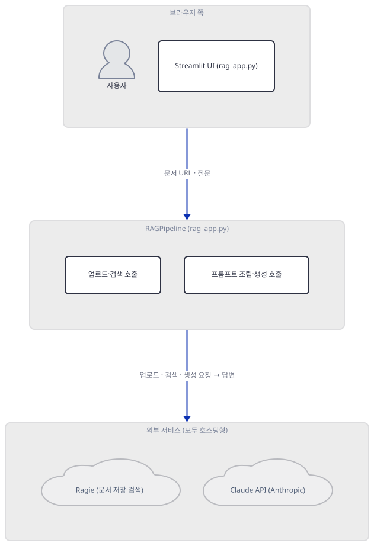
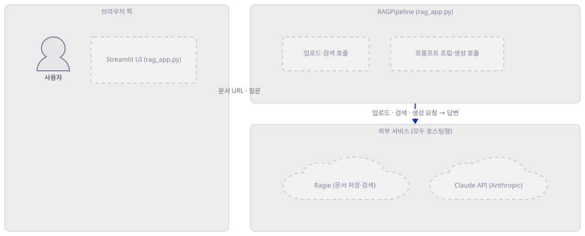
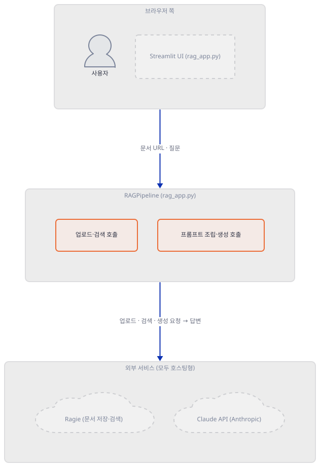
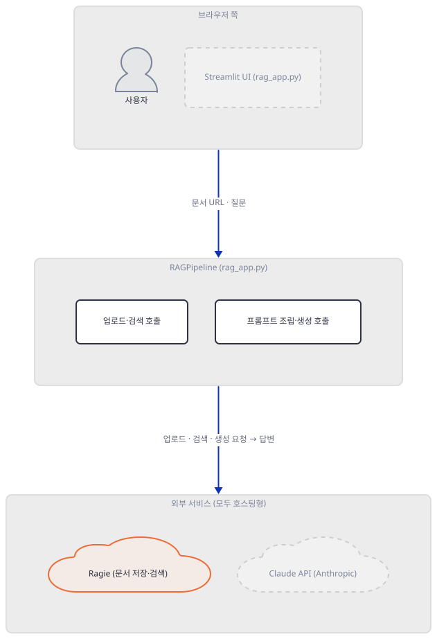
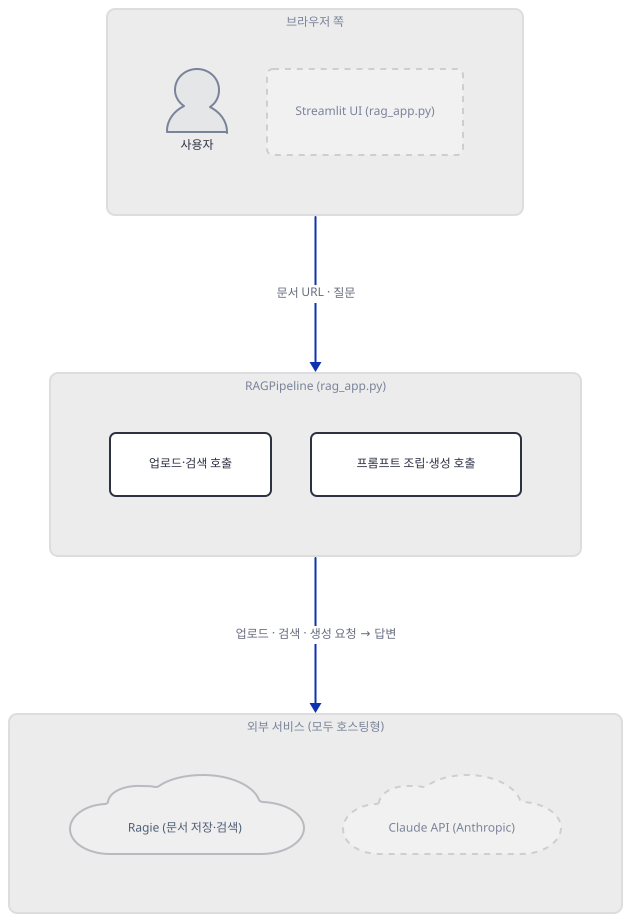
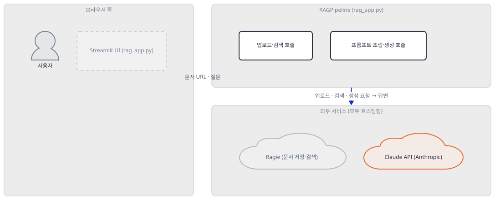
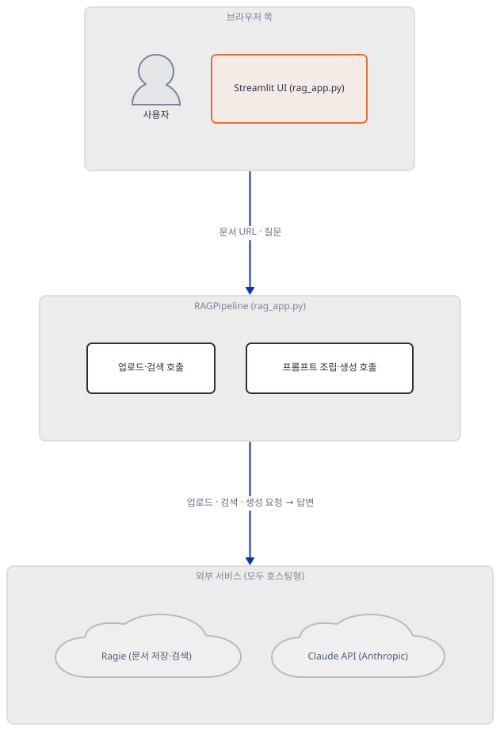
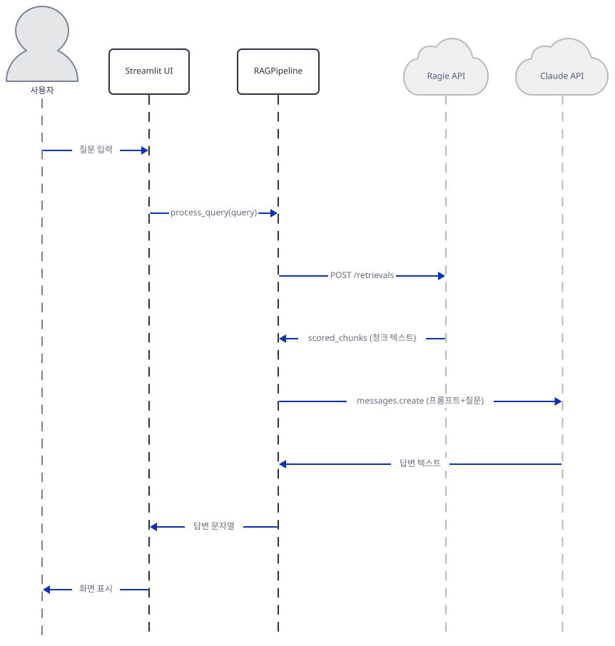

# Day 051 · 🧩 RAG-as-a-Service

> 볼륨 5 📀 RAG · 난이도 ★★☆ · 예상 소요 70분 · API 비용 대략 Ragie 무료 티어 $0(문서 1,000페이지·검색 무제한) + Claude Sonnet 4.5 질문당 1센트 미만(대략치, 키가 없어 실제 과금은 확인 못함) · 원본 앱: `rag_tutorials/rag-as-a-service`

## 오늘 만들 것

오늘은 지금까지의 RAG 볼륨과 정반대 방향을 봅니다. Day 048이 임베딩부터 벡터 저장소까지 전부 이 컴퓨터 안에서 돌렸다면, 오늘의 `rag_app.py`(190줄)는 그 전부를 남의 서비스에 맡깁니다. `requirements.txt` 세 줄 — `streamlit`, `anthropic`, `requests` — 에는 벡터 저장소도 임베딩 라이브러리도 문서 로더도 없습니다(직접 확인, Step 1). 이 볼륨의 다른 앱에서 `chromadb`나 `langchain`이 하던 일을 여기서는 `requests`가 대신하는데, 실제로 하는 일은 문서 URL 하나를 Ragie(ragie.ai)라는 호스팅형 RAG 서비스에 통째로 넘기는 것뿐입니다 — `POST /documents/url`로 문서를 보내면 Ragie가 그 문서를 가져와 알아서 쪼개고 임베딩하고 저장하고, `POST /retrievals`로 질문을 보내면 관련 청크 텍스트만 돌려줍니다. 이 코드가 실제로 하는 일은 그 두 호출과, 돌아온 청크를 시스템 프롬프트에 끼워 Anthropic Claude(`claude-sonnet-4-5`)에게 최종 답을 만들게 하는 것뿐입니다. 계정도 키도 둘이 필요합니다 — Ragie는 무료 티어(문서 1,000페이지까지, 검색은 무제한)로 시작할 수 있지만, 업로드한 문서는 이 컴퓨터가 아니라 Ragie 서버에 남고, 질문할 때마다 그 내용의 일부가 다시 Anthropic 서버로도 넘어갑니다. 두 서비스 모두 실제 키가 있어야 호출되므로, 이 문서의 확인은 대부분 네트워크 없이 코드를 직접 실행하거나 Ragie·Anthropic이 공개한 문서를 읽어 근거를 대는 방식입니다 — 그 과정에서 앱 자신의 README와 실제 코드가 서로 다른 말을 하는 지점을 세 군데 찾았습니다. 아래는 완성된 아키텍처입니다.



## 사전 준비

| 서비스/도구 | 용도 | 발급·설치 |
|---|---|---|
| Ragie API 키 | 문서 업로드(URL)와 검색(retrievals) — 청크 분할·임베딩·벡터 저장·유사도 검색을 전부 대신 처리 | https://www.ragie.ai 가입 후 발급. Developer(무료) 플랜은 문서 1,000페이지까지, 검색은 무제한(ragie.ai/pricing, 2026-09-23 확인) |
| Anthropic API 키 | 검색된 청크를 근거로 최종 답변 생성(`claude-sonnet-4-5`) | https://console.anthropic.com 가입 후 발급 |
| uv | 가상환경 생성과 패키지 설치 | [공통 사전 준비](../README.md#공통-사전-준비-한-번만) 절 참고 |
| 인터넷 연결 | 두 서비스 모두 호스팅형이라 업로드·검색·생성 호출이 전부 외부로 나간다 | 별도 설치 없음. 사내망이면 `api.ragie.ai`·`api.anthropic.com` 접속 허용 필요 |

## 아키텍처 한눈에 보기

| 컴포넌트 | 역할 | 코드 위치 |
|---|---|---|
| 사용자 | 키 두 개, 문서 URL, 질문 입력 | 코드 없음 (브라우저) |
| Streamlit UI | 키 입력 → 문서 업로드 → 질의, 3단 화면을 session_state로 순서대로 열기 | `rag_tutorials/rag-as-a-service/rag_app.py:111-118`, `rag_tutorials/rag-as-a-service/rag_app.py:120-143` |
| RAGPipeline · Ragie 호출 | 문서 URL 업로드, 질의 검색 — 둘 다 `requests`로 만든 순수 REST 호출 | `rag_tutorials/rag-as-a-service/rag_app.py:21-45`, `rag_tutorials/rag-as-a-service/rag_app.py:47-73` |
| RAGPipeline · 프롬프트/생성 | 검색된 청크로 시스템 프롬프트 조립, Claude 호출 | `rag_tutorials/rag-as-a-service/rag_app.py:75-79`, `rag_tutorials/rag-as-a-service/rag_app.py:81-97` |
| Ragie | 문서 저장·청크 분할·임베딩·벡터 검색 — 이 코드에는 전혀 보이지 않는 호스팅형 블랙박스 | 코드 없음 (외부 서비스) |
| Claude API (Anthropic) | 검색된 청크를 근거로 최종 답변 문장 생성 | 코드 없음 (외부 서비스) |

## 단계별 진행

### Step 1. 환경 만들기 — 계정 둘, 패키지 셋

**목적.** `requirements.txt` 세 줄을 설치하고 무엇이 빠져 있는지(그리고 무엇이 안 빠져 있는지) 확인합니다. 이 앱은 실행 전에 계정이 두 개 필요하다는 것도 여기서 짚어 둡니다.

**할 일.**

```bash
cd rag_tutorials/rag-as-a-service
uv venv
uv pip install -r requirements.txt
```

(pip을 쓴다면 `python -m venv .venv && source .venv/bin/activate && pip install -r requirements.txt`. PowerShell이면 `&&` 대신 `;`: `cd rag_tutorials/rag-as-a-service; uv venv; uv pip install -r requirements.txt`.)

이 저장소는 루트에 `pyproject.toml`이 있어 `uv run`이 앱 폴더의 환경 대신 루트 `.venv`를 쓰므로, 이후 `uv run` 명령에는 모두 `--no-project`를 붙입니다. 바로 `uv venv`를 실행하면 uv가 관리하는 CPython 3.13.3을 받습니다(이 문서를 쓰며 직접 확인).

`rag_tutorials/rag-as-a-service/requirements.txt:1-3`

```text
streamlit
anthropic
requests
```

세 줄 다 버전 고정이 없습니다. 그리고 셋 중 어디에도 벡터 저장소(`chromadb` 같은), 임베딩 라이브러리, 문서 로더가 없습니다 — Day 047·048이 쓰던 `langchain`/`chromadb` 계열이 이 앱에는 통째로 빠져 있습니다. 이 문서를 쓰며 설치했을 때는 48개 패키지가 받아졌고(직접 확인), 그중 이 날의 이야기와 관련된 것만 추리면 **streamlit 1.64.0**, **anthropic 1.8.0**, **requests 2.34.2**입니다. `requests`가 그 자리를 메우는데, 뒤에서 보듯 실제로 하는 일은 임베딩이나 청크 분할이 아니라 Ragie 서버에 문서 URL과 질문을 실어 보내는 것뿐입니다.



**확인.**

```bash
uv run --no-project python -c "
import streamlit as st
import requests
from anthropic import Anthropic
print('ok')
"
```

```
ok
```

### Step 2. RAGPipeline과 두 클라이언트 — REST 하나, SDK 하나

**목적.** 이 앱의 유일한 클래스 `RAGPipeline`이 두 서비스를 얼마나 다르게 다루는지 확인합니다 — 한쪽은 전용 SDK, 한쪽은 URL 문자열 두 개뿐입니다.

**할 일.**

`rag_tutorials/rag-as-a-service/rag_app.py:8-19`

```python
class RAGPipeline:
    def __init__(self, ragie_api_key: str, anthropic_api_key: str):
        """
        Initialize the RAG pipeline with API keys.
        """
        self.ragie_api_key = ragie_api_key
        self.anthropic_api_key = anthropic_api_key
        self.anthropic_client = Anthropic(api_key=anthropic_api_key)
        
        # API endpoints
        self.RAGIE_UPLOAD_URL = "https://api.ragie.ai/documents/url"
        self.RAGIE_RETRIEVAL_URL = "https://api.ragie.ai/retrievals"
```

Anthropic 쪽은 공식 SDK(`anthropic.Anthropic`)로 클라이언트 객체를 만들지만, Ragie 쪽은 SDK가 아예 없고 엔드포인트 문자열 두 개(`RAGIE_UPLOAD_URL`, `RAGIE_RETRIEVAL_URL`)만 저장해 둡니다 — 이 뒤로 Ragie와 주고받는 모든 것은 Step 3·4에서 보듯 `requests.post()`로 손수 짠 REST 호출입니다. `requirements.txt`에 `ragie` 같은 패키지가 없는 이유가 여기서 드러납니다: 이 앱 입장에서 Ragie는 라이브러리가 아니라 그냥 URL 두 개입니다. `Anthropic(api_key=...)` 생성자는 이 시점에 키를 검증하지도, 네트워크를 타지도 않습니다(직접 확인, 아래) — Day 005·048에서 본 것과 같은 패턴입니다.



**확인.**

```bash
uv run --no-project python -c "
from rag_app import RAGPipeline
p = RAGPipeline(ragie_api_key='fake-ragie-key', anthropic_api_key='fake-anthropic-key')
print('생성자만 호출, 네트워크 요청 없음:', type(p).__name__, type(p.anthropic_client).__name__)
"
```

```
생성자만 호출, 네트워크 요청 없음: RAGPipeline Anthropic
```

### Step 3. 문서 업로드 — URL 하나를 통째로 맡기기

**목적.** `upload_document()`가 Ragie에 실제로 무엇을 보내는지, 그리고 화면의 "Upload mode" 선택지가 실제로 무엇을 뜻하는지 확인합니다.

**할 일.**

`rag_tutorials/rag-as-a-service/rag_app.py:21-45`

```python
    def upload_document(self, url: str, name: Optional[str] = None, mode: str = "fast") -> Dict:
        """
        Upload a document to Ragie from a URL.
        """
        if not name:
            name = urlparse(url).path.split('/')[-1] or "document"
            
        payload = {
            "mode": mode,
            "name": name,
            "url": url
        }
        
        headers = {
            "accept": "application/json",
            "content-type": "application/json",
            "authorization": f"Bearer {self.ragie_api_key}"
        }
        
        response = requests.post(self.RAGIE_UPLOAD_URL, json=payload, headers=headers)
        
        if not response.ok:
            raise Exception(f"Document upload failed: {response.status_code} {response.reason}")
            
        return response.json()
```

이 메서드가 Ragie로 보내는 것은 문서 자체가 아니라 URL 문자열입니다 — 실제로 그 URL을 가져와 텍스트를 뽑고 쪼개고 임베딩하는 일은 전부 Ragie 서버에서 일어나고, 이 코드에는 그 과정이 한 줄도 없습니다. 화면(`rag_tutorials/rag-as-a-service/rag_app.py:153`)은 `mode`로 `"fast"`와 `"accurate"` 중 고르게 하고, 앱 자신의 README(`rag_tutorials/rag-as-a-service/README.md:10`)도 "fast and accurate document processing modes"라고 이 두 값을 그대로 홍보합니다. 그런데 Ragie의 공식 Python SDK 문서(GitHub `ragieai/ragie-python`, 2026-09-23 확인)가 정의하는 텍스트 문서용 `mode` 값은 `"fast"`와 `"hi_res"` 둘뿐입니다 — `hi_res`는 이미지·표까지 추출하고 `fast`보다 최대 20배 느리다고 적혀 있고, `"accurate"`라는 값은 그 문서 어디에도 없습니다. 이 메서드는 `mode` 값을 검증하지 않고 그대로 실어 보내므로(아래 직접 확인), `"accurate"`를 고르면 Ragie가 모르는 값이 그대로 전송됩니다. 또한 이 메서드의 반환값(`response.json()`, 문서의 `status` 필드 포함)은 호출부(`rag_tutorials/rag-as-a-service/rag_app.py:159-163`)에서 아예 읽지 않고, 곧이어 `time.sleep(5)`(`rag_tutorials/rag-as-a-service/rag_app.py:164`)만 기다린 뒤 무조건 성공 메시지를 띄웁니다 — 인덱싱이 실제로 끝났는지는 이 코드가 보지 않습니다.



**확인.** 실제 업로드는 계정이 없어 재현하지 못했습니다. 대신 `requests.post`를 가짜 함수로 바꿔치기해(네트워크 없음) `upload_document()`가 실제로 무엇을 조립해 보내려 하는지 확인합니다.

```bash
uv run --no-project python -c "
import rag_app
from rag_app import RAGPipeline

captured = {}
class FakeResponse:
    ok = True
    def json(self):
        return {'id': 'doc_fake', 'status': 'pending'}
def fake_post(url, json=None, headers=None):
    captured['payload'] = json
    return FakeResponse()
rag_app.requests.post = fake_post

p = RAGPipeline(ragie_api_key='fake', anthropic_api_key='fake')
p.upload_document(url='https://example.com/doc.pdf', mode='accurate')
print('전송된 payload:', captured['payload'])
"
```

```
전송된 payload: {'mode': 'accurate', 'name': 'doc.pdf', 'url': 'https://example.com/doc.pdf'}
```

(`mode='accurate'`가 아무 검증 없이 그대로 payload에 실립니다 — 이 코드는 이 값이 Ragie 문서에 없는 값이라는 것을 전혀 모릅니다.)

### Step 4. 검색 — filters와 scope, 그리고 어긋난 이름

**목적.** `retrieve_chunks()`가 Ragie에 실제로 보내는 JSON 키를 확인하고, 이 앱의 "scope" 필터링이 실제로 작동할 조건을 갖췄는지 따져봅니다.

**할 일.**

`rag_tutorials/rag-as-a-service/rag_app.py:47-73`

```python
    def retrieve_chunks(self, query: str, scope: str = "tutorial") -> List[str]:
        """
        Retrieve relevant chunks from Ragie for a given query.
        """
        headers = {
            "Content-Type": "application/json",
            "Authorization": f"Bearer {self.ragie_api_key}"
        }
        
        payload = {
            "query": query,
            "filters": {
                "scope": scope
            }
        }
        
        response = requests.post(
            self.RAGIE_RETRIEVAL_URL,
            headers=headers,
            json=payload
        )
        
        if not response.ok:
            raise Exception(f"Retrieval failed: {response.status_code} {response.reason}")
            
        data = response.json()
        return [chunk["text"] for chunk in data["scored_chunks"]]
```

`scope="tutorial"`은 기본값이고, 호출 체인 어디에도(`process_query` → `main()`) 이 값을 바꾸는 코드가 없어 실제로는 항상 `"tutorial"`로 고정됩니다. 그런데 Ragie의 공식 SDK 문서(`RetrieveParams`, 2026-09-23 확인)를 보면 이 필터를 담는 실제 필드명은 `"filter"`(단수)이고, 이 코드가 보내는 키는 `"filters"`(복수)입니다(아래 직접 확인) — 이름이 어긋나 있습니다. 게다가 "scope"는 Ragie가 예약해 둔 필드도 아닙니다: 같은 문서가 명시하는 예약 메타데이터 키는 `document_id`, `document_type`, `document_source`, `document_name`, `document_uploaded_at`, `start_time`, `end_time`, `chunk_content_type`뿐이고 "scope"는 그 안에 없습니다 — 즉 이 필터가 뜻대로 동작하려면 업로드 시점에 `metadata={"scope": "tutorial"}`처럼 직접 붙여야 하는데, Step 3에서 본 `upload_document()`의 payload(`rag_tutorials/rag-as-a-service/rag_app.py:28-32`)에는 `metadata` 자체가 없습니다. 정황상 두 가지가 겹칩니다 — 필드 이름 자체가 Ragie 문서와 다르고, 설령 이름이 맞더라도 어떤 문서에도 `scope` 값이 붙어 있지 않습니다. 실제로 이 계정에 어떤 일이 일어나는지는 재현하지 못했지만(계정 없음), 검색이 필터링 없이 top_k(Ragie 기본값 8건)만큼 그냥 돌아오거나, 문서가 하나뿐인 데모에서는 우연히 맞는 것처럼 보이다가 문서가 늘어나는 순간 뒤섞일 가능성이 있습니다.


**확인.** 마찬가지로 `requests.post`를 가짜 함수로 바꿔치기해(네트워크 없음) 실제로 전송되는 JSON 키를 확인합니다.

```bash
uv run --no-project python -c "
import rag_app
from rag_app import RAGPipeline

captured = {}
class FakeResponse:
    ok = True
    def json(self):
        return {'scored_chunks': [{'text': '가짜 청크'}]}
def fake_post(url, headers=None, json=None):
    captured['payload'] = json
    return FakeResponse()
rag_app.requests.post = fake_post

p = RAGPipeline(ragie_api_key='fake', anthropic_api_key='fake')
chunks = p.retrieve_chunks(query='테스트 질문')
print('전송된 payload 키:', list(captured['payload'].keys()))
print('전송된 전체 payload:', captured['payload'])
"
```

```
전송된 payload 키: ['query', 'filters']
전송된 전체 payload: {'query': '테스트 질문', 'filters': {'scope': 'tutorial'}}
```

### Step 5. 시스템 프롬프트 조립 — 검색 결과를 통째로 지시문에

**목적.** 검색된 청크가 Claude에게 어떤 모습으로 전달되는지, 그리고 이 프롬프트가 Claude에게 스스로를 뭐라고 부르라고 시키는지 확인합니다.

**할 일.**

`rag_tutorials/rag-as-a-service/rag_app.py:75-79`

```python
    def create_system_prompt(self, chunk_texts: List[str]) -> str:
        """
        Create the system prompt with the retrieved chunks.
        """
        return f"""These are very important to follow: You are "Ragie AI", a professional but friendly AI chatbot working as an assistant to the user. Your current task is to help the user based on all of the information available to you shown below. Answer informally, directly, and concisely without a heading or greeting but include everything relevant. Use richtext Markdown when appropriate including bold, italic, paragraphs, and lists when helpful. If using LaTeX, use double $$ as delimiter instead of single $. Use $$...$$ instead of parentheses. Organize information into multiple sections or points when appropriate. Don't include raw item IDs or other raw fields from the source. Don't use XML or other markup unless requested by the user. Here is all of the information available to answer the user: === {chunk_texts} === If the user asked for a search and there are no results, make sure to let the user know that you couldn't find anything, and what they might be able to do to find the information they need. END SYSTEM INSTRUCTIONS"""
```

이 시스템 프롬프트는 실제로 답을 만드는 모델(Claude)에게 "너는 'Ragie AI'다"라고 말합니다 — 검색을 맡은 회사의 이름이 생성을 맡은 회사의 모델에 페르소나로 그대로 박혀 있는 셈입니다. `chunk_texts`(파이썬 리스트 그 자체)가 문자열 안에 그대로 보간되므로, 청크가 몇 개든 콤마로 구분된 파이썬 리스트 표기 그대로 프롬프트에 들어갑니다. 청크 구분자는 `===`뿐이고 그 안의 내용을 이스케이프하지 않으므로, 문서 안에 우연히 `END SYSTEM INSTRUCTIONS`와 비슷한 문구가 있다면 그대로 지시문처럼 읽힐 여지도 있습니다.



**확인.**

```bash
uv run --no-project python -c "
from rag_app import RAGPipeline
p = RAGPipeline(ragie_api_key='fake', anthropic_api_key='fake')
prompt = p.create_system_prompt(['가짜 청크 내용'])
print('Ragie AI 포함 여부:', 'Ragie AI' in prompt)
print('청크 원문 포함 여부:', '가짜 청크 내용' in prompt)
print('길이:', len(prompt))
"
```

```
Ragie AI 포함 여부: True
청크 원문 포함 여부: True
길이: 1028
```

### Step 6. 응답 생성과 파이프라인 조립 — 비어 있으면 묻지도 않고 끝

**목적.** Claude가 실제로 어떻게 호출되는지, 그리고 검색 결과가 비었을 때 이 파이프라인이 Claude를 아예 부르지 않는다는 것을 확인합니다.

**할 일.**

`rag_tutorials/rag-as-a-service/rag_app.py:81-97`

```python
    def generate_response(self, system_prompt: str, query: str) -> str:
        """
        Generate response using Claude 4.5 Sonnet.
        """
        message = self.anthropic_client.messages.create(
            model="claude-sonnet-4-5",
            max_tokens=1024,
            system=system_prompt,
            messages=[
                {
                    "role": "user",
                    "content": query
                }
            ]
        )
        
        return message.content[0].text
```

`rag_tutorials/rag-as-a-service/rag_app.py:99-109`

```python
    def process_query(self, query: str, scope: str = "tutorial") -> str:
        """
        Process a query through the complete RAG pipeline.
        """
        chunks = self.retrieve_chunks(query, scope)
        
        if not chunks:
            return "No relevant information found for your query."
        
        system_prompt = self.create_system_prompt(chunks)
        return self.generate_response(system_prompt, query)
```

이 docstring은 "Claude 4.5 Sonnet"이라 적고, 실제로 넘기는 모델 문자열은 `"claude-sonnet-4-5"`입니다. 반면 앱 자신의 README(`rag_tutorials/rag-as-a-service/README.md:1`, `rag_tutorials/rag-as-a-service/README.md:7`)는 지금도 "Claude 3.5 Sonnet"이라고 적습니다 — 커밋 이력을 보면(`git log`, 직접 확인) 2025-11-09에 "Update RAGPipeline to use Claude 4.5 Sonnet"이라는 제목으로 코드만 올라갔고 README는 그때 고쳐지지 않았습니다. Anthropic이 오늘(2026-09-23) 공개한 모델 문서 기준 `claude-sonnet-4-5`(정식 ID `claude-sonnet-4-5-20250929`)는 "레거시"로 분류되지만 여전히 호출 가능하고, 2026-09-29 이전에는 퇴역시키지 않겠다고 명시되어 있습니다(입력 100만 토큰당 $3, 출력 100만 토큰당 $15) — 즉 이름표는 두 번 다 틀렸어도 코드 자체는 지금도 돌아가는 모델을 가리키고 있습니다. `process_query`의 흐름은 검색 → (비었으면 즉시 반환) → 프롬프트 조립 → 생성이고, `if not chunks:` 분기(`rag_tutorials/rag-as-a-service/rag_app.py:105-106`)가 참이면 `generate_response`는 아예 호출되지 않습니다 — Step 4에서 짚은 filters/scope 어긋남이 실제로 검색 결과를 비워 버린다면, 매 질문이 Claude 근처에도 가지 못하고 이 고정 문자열로 끝난다는 뜻입니다.



**확인.** `retrieve_chunks`를 빈 리스트를 돌려주는 가짜 함수로 바꿔, `generate_response`(따라서 Claude 호출)가 정말 건너뛰어지는지 확인합니다.

```bash
uv run --no-project python -c "
from rag_app import RAGPipeline
p = RAGPipeline(ragie_api_key='fake', anthropic_api_key='fake')

def should_not_be_called(*a, **kw):
    raise AssertionError('generate_response가 호출되면 안 됨')

p.retrieve_chunks = lambda query, scope='tutorial': []
p.generate_response = should_not_be_called
print(repr(p.process_query('아무 질문')))
"
```

```
'No relevant information found for your query.'
```

### Step 7. Streamlit 실행과 세션 상태 — 3단 화면을 순서대로 열기

**목적.** 화면이 어떻게 키 입력 → 업로드 → 질의 순서로 열리는지, 그리고 이 앱이 Day 048과 달리 `session_state`로 파이프라인 객체를 실제로 캐싱한다는 것을 확인합니다.

**할 일.**

`rag_tutorials/rag-as-a-service/rag_app.py:111-118`

```python
def initialize_session_state():
    """Initialize session state variables."""
    if 'pipeline' not in st.session_state:
        st.session_state.pipeline = None
    if 'document_uploaded' not in st.session_state:
        st.session_state.document_uploaded = False
    if 'api_keys_submitted' not in st.session_state:
        st.session_state.api_keys_submitted = False
```

`rag_tutorials/rag-as-a-service/rag_app.py:120-143`

```python
def main():
    st.set_page_config(page_title="RAG-as-a-Service", layout="wide")
    initialize_session_state()
    
    st.title(":linked_paperclips: RAG-as-a-Service")
    
    # API Keys Section
    with st.expander("🔑 API Keys Configuration", expanded=not st.session_state.api_keys_submitted):
        col1, col2 = st.columns(2)
        with col1:
            ragie_key = st.text_input("Ragie API Key", type="password", key="ragie_key")
        with col2:
            anthropic_key = st.text_input("Anthropic API Key", type="password", key="anthropic_key")
        
        if st.button("Submit API Keys"):
            if ragie_key and anthropic_key:
                try:
                    st.session_state.pipeline = RAGPipeline(ragie_key, anthropic_key)
                    st.session_state.api_keys_submitted = True
                    st.success("API keys configured successfully!")
                except Exception as e:
                    st.error(f"Error configuring API keys: {str(e)}")
            else:
                st.error("Please provide both API keys.")
```

세 구역(키 입력·업로드·질의)은 각각 `st.session_state.api_keys_submitted`와 `document_uploaded` 플래그로 잠겨 있어, 앞 구역을 통과해야 다음 구역이 열립니다(업로드·질의 구역은 `rag_tutorials/rag-as-a-service/rag_app.py:146`, `rag_tutorials/rag-as-a-service/rag_app.py:173`의 같은 `if st.session_state...:` 패턴). Day 048의 앱에는 `session_state`도 캐싱도 전혀 없어 질문마다 벡터 저장소를 처음부터 다시 만들었지만, 이 앱은 `RAGPipeline` 객체를 "Submit API Keys"를 누른 그 순간에 딱 한 번만 만들어 `st.session_state.pipeline`에 담아 두므로 이후 재실행에서는 다시 생성되지 않습니다 — 호스팅형 서비스에 일을 넘긴 대신, 적어도 이 부분의 기본기는 이 앱이 Day 048보다 더 갖췄습니다.



**확인.** 앱 폴더에서 서버를 headless로 띄웁니다.

```bash
uv run --no-project streamlit run rag_app.py --server.headless true
```

다른 터미널에서:

```bash
curl -s -o /dev/null -w "%{http_code}\n" http://localhost:8501
```

```
200
```

(PowerShell이면 `curl` 대신: `(Invoke-WebRequest -Uri http://localhost:8501 -UseBasicParsing).StatusCode`. HTTP 200은 직접 확인. 키가 없어 화면 안쪽 구역까지 열어보지는 못했습니다.)

## 요청 한 건이 흐르는 과정



이 그림은 문서를 이미 올린 뒤, 질문 하나가 흘러가는 경로만 그립니다 — 업로드(Step 3)는 "Submit API Keys"·"Upload Document" 버튼 뒤에 따로 있고 `document_uploaded` 플래그로 한 번만 일어나므로, 질문을 반복해도 다시 실행되지 않습니다(Day 048과 가장 다른 지점입니다). 질문을 입력하고 "Generate Response"를 누르면 `process_query(query)`가 호출되어 먼저 `retrieve_chunks()`가 Ragie의 `/retrievals`에 질문과 `filters`를 실어 보냅니다. Ragie는 청크 분할·임베딩·유사도 검색을 전부 자기 서버 안에서 마치고 관련 청크의 텍스트만 돌려줍니다 — 이 왕복 한 번 안에 이 볼륨의 다른 날들이 여러 스텝에 걸쳐 보여준 일(분할, 임베딩, 저장, 검색)이 전부 접혀 들어가 있습니다. 청크가 하나라도 돌아오면 `create_system_prompt()`가 "Ragie AI" 페르소나와 청크를 하나의 문자열로 합치고, `generate_response()`가 그 문자열을 시스템 프롬프트로 Claude(`claude-sonnet-4-5`)에 보내 답을 받습니다. 어느 한쪽 호출이라도 실패하면 `upload_document`·`retrieve_chunks` 모두 `response.ok`가 아닐 때 `Exception`을 직접 던지고(`rag_tutorials/rag-as-a-service/rag_app.py:42-43`, `rag_tutorials/rag-as-a-service/rag_app.py:69-70`), 이를 감싸는 `try/except`는 Streamlit 버튼 핸들러 쪽(`rag_tutorials/rag-as-a-service/rag_app.py:167-168`, `rag_tutorials/rag-as-a-service/rag_app.py:184-185`)에만 있어 화면에는 `st.error()`로 나타나지 총 죽지는 않습니다 — Day 005의 처리되지 않은 예외와 달리, 이 앱은 적어도 이 두 호출은 우아하게 실패합니다.

## 실행 체크리스트

- [ ] `uv venv && uv pip install -r requirements.txt`로 48개 패키지를 설치했다(직접 확인)
- [ ] Ragie·Anthropic 계정을 각각 만들고 키 두 개를 준비해야 한다는 것을 확인했다
- [ ] `RAGPipeline`과 `Anthropic()` 생성자 모두 네트워크 요청 없이 성공한다는 것을 확인했다
- [ ] `upload_document()`가 `mode` 값을 검증 없이 그대로 전송한다는 것과, Ragie 문서상 텍스트 문서의 유효한 값은 `fast`/`hi_res`뿐이라는 것을 확인했다
- [ ] `retrieve_chunks()`가 보내는 JSON 키가 `filters`(복수)라는 것과, Ragie 문서상 실제 필드명은 `filter`(단수)라는 것을 확인했다
- [ ] `create_system_prompt()`가 청크 텍스트와 "Ragie AI" 페르소나를 그대로 프롬프트에 넣는다는 것을 확인했다
- [ ] 검색 결과가 비면 `process_query()`가 Claude를 아예 부르지 않고 고정 문자열을 반환한다는 것을 확인했다
- [ ] `streamlit run rag_app.py`로 서버를 띄우고 `http://localhost:8501`에서 HTTP 200을 확인했다

## 문제 해결

| 증상 | 원인 | 해결 |
|---|---|---|
| "Upload mode"에서 `accurate`를 고르면 이미지·표까지 더 잘 인식될 것으로 기대하게 됨(앱 자신의 README도 "fast and accurate document processing modes"라고 적음) | Ragie 공식 SDK 문서 기준 텍스트 문서의 `mode` 값은 `fast`/`hi_res`만 정의되어 있고 `accurate`는 문서화된 값이 아니다(소스로 확인, 2026-09-23) — `upload_document()`(`rag_tutorials/rag-as-a-service/rag_app.py:21-45`)는 이 값을 검증하지 않고 그대로 전송한다(직접 확인, Step 3) | 이미지·표까지 추출하려면 `accurate` 대신 `hi_res`를 선택 |
| 문서를 올리고 질문해도 매번 "No relevant information found for your query."만 돌아올 가능성이 있음(계정이 없어 직접 재현은 못함) | `retrieve_chunks()`가 보내는 JSON 키는 `filters`(복수)인데(직접 확인, Step 4) Ragie 문서가 정의하는 필드명은 `filter`(단수)다(소스로 확인) — 게다가 `upload_document()`는 애초에 `metadata`를 전혀 보내지 않아 어떤 문서에도 `scope` 값이 없다(소스로 확인, Step 3·4) | 코드를 고친다면 `filters`를 `filter`로 바꾸고, 업로드 시 `metadata={"scope": "tutorial"}`을 함께 보내야 함 |
| 두 키를 모두 입력하고 "Submit API Keys"를 눌러도 오류 없이 넘어갔는데, 정작 업로드·질의 단계에서야 인증 오류가 남 | `RAGPipeline.__init__`과 `Anthropic()` 생성자 모두 이 시점엔 키를 검증하지 않는다(직접 확인, Step 2) — 실제 검증은 Ragie·Anthropic에 첫 요청을 보낼 때 서버가 응답하며 일어남 | 클라이언트 생성 성공을 키가 유효하다는 근거로 삼지 말 것 |
| 업로드 후 "Document uploaded and indexed successfully!"가 떠도 실제 인덱싱이 끝났는지는 알 수 없음 | `upload_document()`의 반환값을 호출부(`rag_tutorials/rag-as-a-service/rag_app.py:159-163`)가 아예 읽지 않고, 고정된 `time.sleep(5)`(`rag_tutorials/rag-as-a-service/rag_app.py:164`) 뒤 무조건 성공 처리한다(소스로 확인) — Ragie 응답에는 `status` 필드가 있지만 이 코드는 보지 않는다 | 큰 문서·`hi_res` 모드에서는 5초보다 오래 걸릴 수 있으니 업로드 직후 곧바로 질문하지 말고 잠시 기다려볼 것 |

## 더 해보기

- `rag_tutorials/rag-as-a-service/rag_app.py:58`의 `"filters"`를 Ragie 문서가 정의하는 `"filter"`로 고치고, `rag_tutorials/rag-as-a-service/rag_app.py:28-32`의 업로드 payload에 `metadata={"scope": "tutorial"}`을 추가해 실제로 검색 결과가 달라지는지 확인해보기(계정 필요).
- `rag_tutorials/rag-as-a-service/rag_app.py:153`의 두 번째 옵션을 Ragie 문서가 정의하는 `"hi_res"`로 바꿔보고, 표·이미지가 섞인 PDF에서 `"fast"`와 결과가 어떻게 달라지는지 비교해보기.
- `rag_tutorials/rag-as-a-service/rag_app.py:159-163`에서 버려지는 업로드 응답의 `status` 필드를 실제로 찍어보고, 고정된 `rag_tutorials/rag-as-a-service/rag_app.py:164`의 `time.sleep(5)` 대신 상태를 폴링하도록 고쳐보기.

## 다음 날 예고

[Day 052 · ⛓️ Basic RAG Chain](../day052-rag-chain/README.md) — PharmaQuery라는 제약 도메인 문서 검색 시스템으로, 호스팅형 검색을 다시 걷어내고 임베딩과 유사도 검색을 직접 짜는 기초 RAG 체인으로 돌아갑니다.
