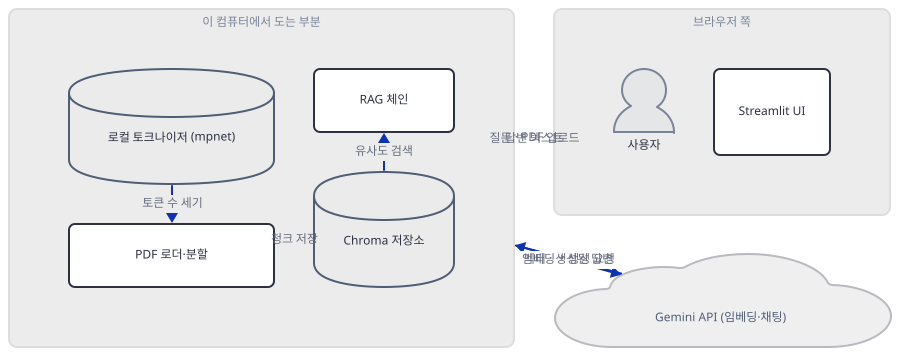
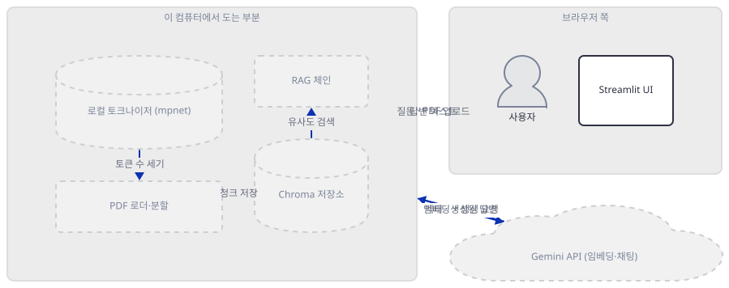
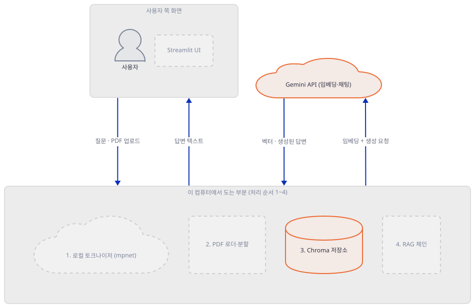
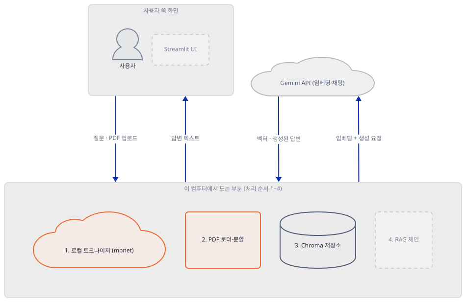
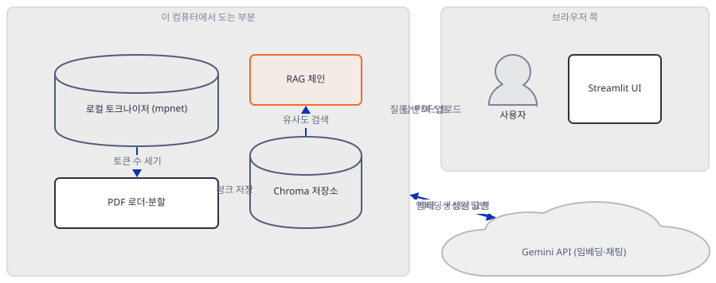
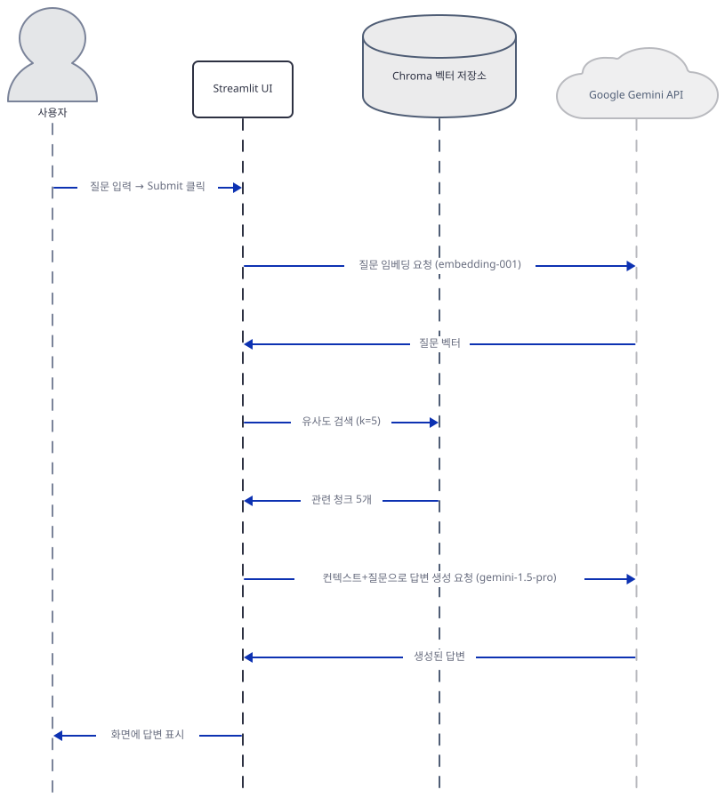

# Day 052 · ⛓️ Basic RAG Chain

> 볼륨 5 📀 RAG · 난이도 ★★☆ ⚠ · 예상 소요 80분(torch를 포함한 139개 패키지 설치가 wheel만 약 350MB, `sentence-transformers` 모델이 약 420MB — 회선에 따라 다르지만 이 문서를 쓸 때는 모델 하나만 130초 걸렸다 — 이고, 앱을 실제로 띄워 화면을 확인하는 시간도 포함한다) · API 비용 대략 거의 무료(대략치 — 이 코드가 쓰는 두 모델 이름이 이미 서비스 종료 상태라 유효한 키로 실제 호출해도 과금 전에 실패한다) · 원본 앱: `rag_tutorials/rag_chain`

## 오늘 만들 것

오늘은 PDF 연구 문서를 올려 두고 그 내용을 질문하는 약학 전용 Streamlit 앱 "PharmaQuery"를 만듭니다. `requirements.txt` 아홉 줄은 Day 049(열 줄, `rag_tutorials/autonomous_rag/requirements.txt`) 다음으로 이 볼륨에서 길고, 그 구성 자체가 오늘의 핵심입니다 — 호스팅 모델 제공자(`langchain-google-genai`), 로컬 임베딩 라이브러리(`sentence-transformers`), 벡터 저장소(`chromadb`)가 한 파일 안에 같이 있습니다. 소스를 끝까지 따라가 보면 이 셋의 역할 배치는 이름만 보고 짐작하기 쉬운 그림과 다릅니다 — 청크를 실제 벡터로 바꾸는 임베딩 계산은 저장할 때도 검색할 때도 전부 Google Gemini API(클라우드)가 하고, `sentence-transformers`가 최초 실행 때 내려받는 420MB짜리 로컬 모델은 그 벡터를 전혀 만들지 않습니다. 이 모델은 PDF를 몇 토큰짜리 조각으로 자를지 세는 토크나이저로만 쓰입니다. 정리하면 로컬은 PDF 읽기·청크 분할·Chroma 디스크 저장을 맡고, 클라우드(Gemini, 키 하나)는 임베딩과 답변 생성을 둘 다 맡는 구조입니다. 코드를 따라가면서 모듈 최상위에서 만들어지는 임베딩 모델이 사이드바가 뜨기도 전에 API 키를 요구해 앱 자체가 시작되지 않는다는 것, `chunk_size=100`이라는 인자가 조용히 무시된다는 것, 그리고 이 코드가 쓰는 두 Gemini 모델 이름이 이미 서비스 종료 상태라는 것까지 하나씩 직접 확인합니다. 완성하면 PDF를 올리고 질문해 답을 얻는 화면을 로컬에서 띄우게 되지만, 질문을 몇 번을 반복해도 PDF 재처리(ingest)는 다시 일어나지 않는다는 것도 실측으로 확인합니다 — Day 048과 정반대입니다. 아래는 완성된 아키텍처입니다.



## 사전 준비

| 서비스/도구 | 용도 | 발급·설치 |
|---|---|---|
| Google Gemini API 키 | 임베딩(`embedding-001`)과 채팅 생성(`gemini-1.5-pro`) 호출 인증. 사이드바에 입력하지만, 코드는 이것과 별개로 환경변수도 요구한다(Step 1·2) | https://ai.google.dev/gemini-api/docs/api-key 안내를 따라 발급 |
| 인터넷 연결 | Gemini API 호출과 `sentence-transformers` 모델(약 420MB) 최초 다운로드 | 별도 설치 없음. 사내망이면 `generativelanguage.googleapis.com`, `huggingface.co` 접속 허용 필요 |
| 디스크 여유 공간 | `sentence-transformers/all-mpnet-base-v2` 모델 캐시(약 420MB, 기본 위치 `~/.cache/huggingface/hub`)와 PDF마다 쌓이는 Chroma 벡터 저장소(`./pharma_db`) | 별도 설치 없음 |
| uv | 가상환경 생성과 패키지 설치 | [공통 사전 준비](../README.md#공통-사전-준비-한-번만) 절 참고 |

## 아키텍처 한눈에 보기

| 컴포넌트 | 역할 | 코드 위치 |
|---|---|---|
| 사용자 | 질문 입력, API 키 입력, PDF 업로드 | 코드 없음 (브라우저) |
| Streamlit UI (`main`) | 질문창·Submit, 사이드바 키 입력·업로더를 그리고 결과를 표시 | `rag_tutorials/rag_chain/app.py:132-197` |
| 임베딩 모델 (`embedding_model`) | 청크·질문을 벡터로 바꾸는 요청을 Gemini API로 보냄 — 모듈 최상위, import 시점에 생성 | `rag_tutorials/rag_chain/app.py:15` |
| Chroma 벡터 저장소 (`db`) | 청크와 벡터를 `./pharma_db`에 디스크로 저장, 유사도 검색 | `rag_tutorials/rag_chain/app.py:18-20` |
| PDF 로더·분할 (`add_to_db`) | 업로드 PDF를 읽고 로컬 토크나이저 모델로 청크 분할 | `rag_tutorials/rag_chain/app.py:33-79` |
| RAG 체인 (`run_rag_chain`) | 검색 → 프롬프트 결합 → Gemini 채팅 생성 순서로 호출 | `rag_tutorials/rag_chain/app.py:81-130` |
| Gemini API (`embedding-001` · `gemini-1.5-pro`) | 임베딩 계산과 답변 생성을 모두 수행하는 외부 서비스 | 코드 없음 (외부 서비스) |

## 단계별 진행

### Step 1. 환경 만들기 — 아홉 줄은 다 설치되는데, import가 키를 요구한다

**목적.** `requirements.txt` 아홉 줄을 그대로 설치해 무엇이 받아지는지 확인하고, 이 라이브러리들을 그냥 불러오기만 해도 앱이 뜨지 않는다는 것을 가장 먼저 확인합니다.

**할 일.**

```bash
cd rag_tutorials/rag_chain
uv venv
uv pip install -r requirements.txt
```

(pip을 쓴다면 `python -m venv .venv && source .venv/bin/activate && pip install -r requirements.txt`.)

이 저장소는 루트에 `pyproject.toml`이 있어 `uv run`이 앱 폴더의 환경 대신 루트 `.venv`를 쓰므로, 이후 `uv run` 명령에는 모두 `--no-project`를 붙입니다.

`rag_tutorials/rag_chain/requirements.txt:1-9`

```text
streamlit
langchain-google-genai
langchain-chroma
langchain-community
langchain-core
chromadb
sentence-transformers
pypdf>=4.0.0
python-dotenv
```

아홉 줄 중 버전을 고정한 것은 `pypdf>=4.0.0` 하나뿐입니다. 이 문서를 쓰며 설치했을 때는 139개 패키지가 받아졌고(직접 확인), Day 048·049와 달리 **추가로 설치해야 하는 패키지가 하나도 없었습니다** — 이 앱이 실제로 쓰는 import는 아홉 줄과 그 전이 의존성만으로 전부 풀립니다. 이야기와 관련된 것만 추리면 **streamlit 1.64.0**, **langchain-google-genai 4.4.0**, **langchain-chroma 1.1.0**, **langchain-community 0.4.2**, **langchain-core 1.6.4**, **langchain-text-splitters 1.1.2**(전이 의존성, 아홉 줄에는 없음), **chromadb 1.5.9**, **sentence-transformers 6.1.0**(전이 의존성으로 **torch 2.14.0**, **transformers 5.17.0**을 함께 받음), **python-dotenv 1.2.3**입니다. `langchain_community`를 불러오면 Day 048과 같은 사용 중단 경고가 뜹니다(직접 확인, 아래 그대로).

```
DeprecationWarning: `langchain-community` is being sunset and is no longer actively maintained. See https://github.com/langchain-ai/langchain-community/issues/674 for details and migration guidance toward standalone integration packages.
```

아홉 번째 줄 `python-dotenv`는 설치는 되지만 이 파일 어디에서도 쓰이지 않습니다 — `grep -n "dotenv" app.py`가 0건입니다(직접 확인). `load_dotenv()`를 부르는 코드가 없으므로 `.env` 파일을 만들어도 이 앱은 그것을 읽지 않습니다.

설치 자체는 이렇게 깨끗하지만, 이 라이브러리로 앱이 쓰는 것과 똑같은 객체 하나를 실제로 **생성**해 보면 다른 문제가 나옵니다 — `app.py`의 15번째 줄이 정확히 이 코드입니다(Step 2에서 이어집니다).



**확인.**

```bash
uv run --no-project python -m py_compile app.py && echo compiled
```

```
compiled
```

```bash
uv run --no-project python -c "from langchain_google_genai import GoogleGenerativeAIEmbeddings; GoogleGenerativeAIEmbeddings(model='models/embedding-001')"
```

직접 확인한 출력(마지막 부분):

```
pydantic_core._pydantic_core.ValidationError: 1 validation error for GoogleGenerativeAIEmbeddings
  Value error, API key required for Gemini Developer API. Provide api_key parameter or set GOOGLE_API_KEY/GEMINI_API_KEY environment variable. [type=value_error, input_value={'model': 'models/embedding-001'}, input_type=dict]
    For further information visit https://errors.pydantic.dev/2.13/v/value_error
```

### Step 2. 임베딩 모델과 벡터 저장소 — 열쇠 하나가 필요한 자리는 둘, 코드가 잇는 자리는 하나

**목적.** `embedding_model`과 `db`가 모듈 최상위에서 어떻게 만들어지는지, Step 1의 크래시가 정확히 무엇 때문인지, 그리고 `persist_directory`가 진짜로 디스크에 쓴다는 것을 확인합니다.

**할 일.**

`rag_tutorials/rag_chain/app.py:14-20`

```python
# Initialize embedding model
embedding_model = GoogleGenerativeAIEmbeddings(model="models/embedding-001")

# Initialize pharma database
db = Chroma(collection_name="pharma_database",
            embedding_function=embedding_model,
            persist_directory='./pharma_db')
```

이 일곱 줄은 `main()` 안이 아니라 **모듈 최상위**에 있습니다 — `import app`이 실행되는 순간, 사이드바도 질문창도 그려지기 전에 곧바로 실행됩니다. `GoogleGenerativeAIEmbeddings`는 `api_key`도 `google_api_key`도 받지 않은 채 `model`만 넘겨받는데, `langchain-google-genai` 4.4.0 소스를 보면 `_initialize_client`라는 pydantic `model_validator(mode="after")`가 생성 시점에 곧바로 실행되어, `google_api_key`가 비어 있고 환경변수 `GOOGLE_API_KEY`·`GEMINI_API_KEY`도 없으면 `ValueError`를 던집니다(소스로 확인) — Step 1에서 본 바로 그 예외입니다. 앱 자신의 README(`rag_tutorials/rag_chain/README.md:37`)는 "사이드바에 Google API 키를 붙여넣으라"고 안내하지만, 사이드바 코드(Step 5의 `rag_tutorials/rag_chain/app.py:168-178`)는 이 값을 `st.session_state`에 저장할 뿐 15번째 줄의 `embedding_model`과는 연결돼 있지 않고, 15번째 줄은 사이드바가 그려지기도 전에 이미 실행이 끝난 뒤입니다. 즉 이 앱을 실제로 띄우려면 사이드바에 키를 넣는 것과는 별도로, `streamlit run`을 실행하기 **전에** `GOOGLE_API_KEY`(또는 `GEMINI_API_KEY`) 환경변수를 먼저 설정해 둬야 하는데, 이 사실은 앱 README 어디에도 없습니다.

키를 갖췄다고 다 해결되는 것도 아닙니다 — `models/embedding-001`은 Google 공식 사용 중단 페이지 기준으로 **2025-10-30**에 이미 서비스가 종료됐습니다(https://ai.google.dev/gemini-api/docs/deprecations, 2026-09-23 확인). 유효한 키를 넣어도 이 모델 이름으로는 더 이상 응답을 받을 수 없습니다.

20번째 줄의 `persist_directory='./pharma_db'`는 Day 048의 `Chroma.from_documents()`(이런 인자 없음, 프로세스 메모리에만 존재)와 다릅니다. `langchain-chroma` 1.1.0 소스를 보면 `persist_directory`가 있을 때 `chromadb.PersistentClient(path=persist_directory)`로 클라이언트를 만듭니다(소스로 확인) — 진짜 디스크 저장소입니다.



**확인.** Step 1에서 키가 없을 때의 크래시는 이미 보았으므로, 여기서는 형식만 갖춘 가짜 키로 생성자 자체는 네트워크 없이 통과한다는 것을 확인합니다.

```bash
uv run --no-project python -c "
import os
os.environ['GOOGLE_API_KEY'] = 'fake-key-for-construction-test-only'
from langchain_google_genai import GoogleGenerativeAIEmbeddings, ChatGoogleGenerativeAI
e = GoogleGenerativeAIEmbeddings(model='models/embedding-001')
c = ChatGoogleGenerativeAI(model='gemini-1.5-pro', api_key='another-fake-key', temperature=1)
print('constructed with fake key, no network call attempted yet:', type(e).__name__, type(c).__name__)
"
```

```
constructed with fake key, no network call attempted yet: GoogleGenerativeAIEmbeddings ChatGoogleGenerativeAI
```

### Step 3. PDF 로드와 청크 분할 — 그 자리에서 420MB를 내려받고, chunk_size는 조용히 버려진다

**목적.** `add_to_db`가 PDF를 어떻게 읽고 쪼개는지, 그 쪼개는 도구가 실제로 로컬에 무엇을 내려받는지, 그리고 `chunk_size=100`이라는 인자가 실제 청크 크기에 영향을 주지 않는다는 것을 확인합니다.

**할 일.**

`rag_tutorials/rag_chain/app.py:59-61`

```python
        # Load the file using PyPDFLoader
        loader = PyPDFLoader(temp_file_path)
        data = loader.load()
```

`PyPDFLoader`는 업로드된 뒤 `./temp`에 저장된 로컬 파일만 읽습니다 — 이 두 줄 자체는 네트워크를 타지 않습니다.

`rag_tutorials/rag_chain/app.py:67-73`

```python
        # Split documents into smaller chunks
        st_text_splitter = SentenceTransformersTokenTextSplitter(
            model_name="sentence-transformers/all-mpnet-base-v2",
            chunk_size=100,
            chunk_overlap=50
        )
        st_chunks = st_text_splitter.create_documents(doc_content, doc_metadata)
```

`SentenceTransformersTokenTextSplitter.__init__`(langchain-text-splitters 1.1.2 소스로 확인)은 `self._model = SentenceTransformer(model_name, ...)`로 **`sentence-transformers/all-mpnet-base-v2` 전체를 실제로 내려받아 메모리에 올립니다.** 그런데 이렇게 만든 `self._model`은 `self.tokenizer = self._model.tokenizer`로 토크나이저를 꺼내는 데만 쓰입니다. 즉 420MB짜리 신경망 가중치를 통째로 받으면서도 실제로 쓰는 것은 그 토크나이저와 `max_seq_length`뿐이고, 청크의 의미 벡터(임베딩)는 이 모델이 만들지 않습니다 — 그 역할은 Step 2의 `embedding_model`(Gemini, 클라우드)이 합니다. 이 모델을 직접 받아 확인한 결과 캐시 총량은 **약 419MiB**(`model.safetensors` 437,971,872바이트가 대부분)였고, 기본 위치(환경변수로 따로 옮기지 않았을 때)는 `huggingface_hub` 소스(`constants.py`)로 확인한 대로 `~/.cache/huggingface/hub/models--sentence-transformers--all-mpnet-base-v2/`입니다 — Windows에서는 `C:\Users\<사용자명>\.cache\huggingface\hub\...`입니다.

더 중요한 문제는 70번째 줄의 `chunk_size=100`입니다. `SentenceTransformersTokenTextSplitter.__init__`의 매개변수는 `chunk_overlap`·`model_name`·`tokens_per_chunk`·`model_kwargs`뿐이고 `chunk_size`는 없습니다(소스로 확인) — 그래서 `chunk_size=100`은 `**kwargs`를 타고 부모 클래스 `TextSplitter.__init__`으로 흘러가 `self._chunk_size = 100`에 저장되긴 하지만, 이 클래스의 `split_text()`는 `self._chunk_size`를 전혀 읽지 않습니다. 실제로 청크 하나의 최대 토큰 수를 정하는 것은 `tokens_per_chunk`이고, 이 인자를 앱이 넘기지 않으므로 기본값(모델의 `max_seq_length`, `all-mpnet-base-v2`는 **384**)이 그대로 쓰입니다. 코드만 보면 청크가 100토큰 단위로 잘릴 것 같지만, 실제로는 그보다 거의 4배 큰 384토큰 단위로 잘립니다.



**확인.** 모델을 실제로 내려받아 직접 확인했습니다(최초 1회, 약 420MB — 내려받는 시간은 회선에 따라 다릅니다. 이 문서를 쓸 때는 약 130초 걸렸습니다).

```bash
uv run --no-project python -c "
from langchain_text_splitters.sentence_transformers import SentenceTransformersTokenTextSplitter
s = SentenceTransformersTokenTextSplitter(model_name='sentence-transformers/all-mpnet-base-v2', chunk_size=100, chunk_overlap=50)
print('실제로 쓰이는 tokens_per_chunk:', s.tokens_per_chunk)
print('모델의 max_seq_length:', s.maximum_tokens_per_chunk)
"
```

```
실제로 쓰이는 tokens_per_chunk: 384
모델의 max_seq_length: 384
```

### Step 4. RAG 체인 — 검색·프롬프트, 그리고 다시 클라우드로

**목적.** `run_rag_chain`이 검색된 청크를 어떻게 프롬프트로 합치고, 최종 답변을 어느 모델에 요청하는지 정확한 호출 순서를 확인합니다.

**할 일.**

`rag_tutorials/rag_chain/app.py:94-95`

```python
    # Create a Retriever Object and apply Similarity Search
    retriever = db.as_retriever(search_type="similarity", search_kwargs={'k': 5})
```

`rag_tutorials/rag_chain/app.py:114-119`

```python
    # Initialize a Generator (i.e. Chat Model)
    chat_model = ChatGoogleGenerativeAI(
        model="gemini-1.5-pro",
        api_key=st.session_state.get("gemini_api_key"),
        temperature=1
    )
```

`chat_model`은 이번에는 `run_rag_chain` 함수 **안**에서 만들어지므로(Step 2의 `embedding_model`과 다르게) `main()`이 "Submit"을 처리할 때에야 생성되고, 이때는 `st.session_state.get("gemini_api_key")` — 즉 사이드바에 저장된 값을 그대로 씁니다. 문제는 `gemini-1.5-pro`라는 이름입니다: Google Gemini API 변경 이력(https://ai.google.dev/gemini-api/docs/changelog, 2026-09-23 확인)의 2025-09-29 항목이 "The following Gemini 1.5 models are now shut down: `gemini-1.5-pro`, `gemini-1.5-flash-8b`, `gemini-1.5-flash`"라고 명시합니다 — 이 모델은 이미 공식적으로 종료 처리되었고, 그래서 현재 모델 목록(https://ai.google.dev/gemini-api/docs/models)에도 사용 중단 페이지에도 더 이상 나타나지 않습니다. Step 2의 임베딩 키 배선 문제를 다 우회해도, 답변을 생성하는 이 모델 이름 자체가 이미 유효하지 않습니다.

`rag_tutorials/rag_chain/app.py:121-125`

```python
    # Initialize a Output Parser
    output_parser = StrOutputParser()

    # RAG Chain
    rag_chain = {"context": retriever | format_docs, "question": RunnablePassthrough()} | prompt_template | chat_model | output_parser
```

`rag_tutorials/rag_chain/app.py:127-128`

```python
    # Invoke the Chain
    response = rag_chain.invoke(query)
```

호출 순서는 검색(`retriever`) → `format_docs`로 청크 결합(`rag_tutorials/rag_chain/app.py:22-31`) → 프롬프트 채우기 → `chat_model` → `output_parser`이고, 이 중 어디에도 `try/except`가 없습니다(소스로 확인) — 벡터 저장소가 비어 있거나 Gemini 호출이 실패하면 예외가 그대로 위로 올라갑니다.



**확인.**

```bash
uv run --no-project python -c "
from langchain_core.prompts import ChatPromptTemplate
from langchain_core.output_parsers import StrOutputParser
from langchain_core.runnables import RunnablePassthrough
print('LCEL 구성 요소 import 정상')
"
```

```
LCEL 구성 요소 import 정상
```

### Step 5. Streamlit 화면 구성 — 독립된 버튼 세 개

**목적.** `main()`이 그리는 세 블록 — 질문·Submit, 사이드바 키 입력, 사이드바 업로더·Submit & Process — 이 서로 완전히 분리된 `if st.button(...)` 블록이라는 것을 확인합니다. Step 6의 실측이 왜 그렇게 나오는지가 여기서 정해집니다.

**할 일.**

`rag_tutorials/rag_chain/app.py:159-166`

```python
    if st.button("Submit"):
        if not query:
            st.warning("Please ask a question")
        
        else:
            with st.spinner("Thinking..."):
                result = run_rag_chain(query=query)
                st.write(result)
```

`rag_tutorials/rag_chain/app.py:168-178`

```python
    with st.sidebar:
        st.title("API Keys")
        gemini_api_key = st.text_input("Enter your Gemini API key:", type="password")

        if st.button("Enter"):
            if gemini_api_key:
                st.session_state.gemini_api_key = gemini_api_key
                st.success("API key saved!")

            else:
                st.warning("Please enter your Gemini API key to proceed.")
```

`rag_tutorials/rag_chain/app.py:180-194`

```python
    with st.sidebar:
        st.markdown("---")
        pdf_docs = st.file_uploader("Upload your research documents related to Pharmaceutical Sciences (Optional) :memo:",
                                    type=["pdf"],
                                    accept_multiple_files=True
        )
        
        if st.button("Submit & Process"):
            if not pdf_docs:
                st.warning("Please upload the file")

            else:
                with st.spinner("Processing your documents..."):
                    add_to_db(pdf_docs)
                    st.success(":file_folder: Documents successfully added to the database!")
```

세 블록은 각각 `"Submit"`, `"Enter"`, `"Submit & Process"`라는 서로 다른 버튼에 매달려 있습니다. Streamlit은 재실행 한 번에 클릭된 버튼 하나만 참(`True`)을 돌려주므로, "Submit"을 눌러 질문하는 재실행에서는 "Submit & Process" 블록의 `if`가 거짓이 되어 `add_to_db`가 아예 호출되지 않습니다. 159번째 줄에는 `gemini_api_key`가 저장돼 있는지 확인하는 코드가 없다는 것도 눈에 띕니다 — 하지만 이것이 곧장 `ValueError`로 이어지지는 **않습니다**. `chat_model = ChatGoogleGenerativeAI(..., api_key=st.session_state.get("gemini_api_key"), ...)`가 넘기는 `api_key`는 저장된 값이 없으면 `None`이고, `langchain-google-genai`는 이 자리에서 "명시적으로 넘긴 `None`"과 "아예 넘기지 않음"을 구분하지 않습니다(소스로 확인, `langchain_google_genai/_common.py`의 `model_validator(mode="before")` `_resolve_gateway`가 `langchain_core.utils._gateway._pop_provided`로 값을 꺼내는데, 그 구현이 `values.pop(field, None)`이라 `None`이 오면 "값 없음"과 똑같이 취급되어 `GOOGLE_API_KEY`/`GEMINI_API_KEY` 환경변수로 대체됩니다). 이 앱은 Step 2에서 이미 확인했듯 그 환경변수 없이는 애초에 뜨지도 못하므로, "Submit"을 누르는 시점에는 이미 그 값이 존재하고, `chat_model` 생성 자체는 조용히 성공합니다.

실제로 처음 멈추는 자리는 그다음입니다 — 검색(`retriever.invoke`)이 부르는 `embed_query`이거나, 거기를 넘겨도 `chat_model`이 실제로 응답을 생성하는 순간입니다. 둘 다 이미 종료된 모델 이름(`embedding-001`·`gemini-1.5-pro`, Step 2·4에서 확인)이나 유효하지 않은 키로 Gemini API를 실제로 호출하는 지점이고, `try/except`가 없으므로 이 예외가 화면에 그대로 노출됩니다. 실제로 확인해 보면 다음과 같습니다.


**확인.**

```bash
grep -n "st.button" app.py
```

```
159:    if st.button("Submit"):
172:        if st.button("Enter"):
187:        if st.button("Submit & Process"):
```

앱을 실제로 띄워 이 구조를 확인합니다 — 환경변수만 있고 사이드바에는 키를 저장하지 않은 채 질문해 봅니다.

```bash
GOOGLE_API_KEY=dummy-key-for-launch-test uv run --no-project streamlit run app.py --server.headless true
```

(PowerShell: `$env:GOOGLE_API_KEY="dummy-key-for-launch-test"; uv run --no-project streamlit run app.py --server.headless true`.)

다른 터미널에서 화면이 떴는지만 먼저 확인합니다.

```bash
curl -s -o /dev/null -w "%{http_code}\n" http://localhost:8501
```

```
200
```

화면 자체는 Streamlit의 `AppTest` 도구로 앱을 그대로 실행해(클릭을 코드로 재현) 직접 확인했습니다 — 결과는 실제 브라우저로 여는 것과 같습니다.

```
header: ['Pharmaceutical Insight Retrieval System']
sidebar title: ['API Keys']
button labels: ['Submit', 'Enter', 'Submit & Process']
```

사이드바에서 키를 저장하지 않고 텍스트 영역에 질문만 입력한 뒤 "Submit"을 누르면(환경변수 `GOOGLE_API_KEY`는 가짜 값으로 설정된 상태), 예상대로 생성자에서 죽지 않고 검색 단계에서 멈춥니다 — 직접 확인한 예외(마지막 줄):

```
GoogleGenerativeAIError: Error embedding content (INVALID_ARGUMENT): 400
INVALID_ARGUMENT. {'error': {'code': 400, 'message': 'API key not valid. Please pass a valid API key.', ...}}
```

트레이스백을 따라가면 `run_rag_chain` → `rag_chain.invoke` → `retriever.invoke` → `langchain_chroma`의 `similarity_search` → `embed_query`(`langchain-google-genai` 4.4.0의 `embeddings.py`)입니다 — 위에서 설명한 그대로, `ChatGoogleGenerativeAI` 생성자가 아니라 임베딩 호출이 처음 멈추는 자리입니다.

### Step 6. 실행 확인 — 질문을 세 번 해도 업로드는 한 번만

**목적.** Step 5에서 읽은 구조가 실제로 그렇게 동작하는지 — 질문을 반복해도 PDF 재처리(임베딩 호출)가 다시 일어나지 않는다는 것 — 를 실측으로 증명합니다.

**할 일.** Gemini 클래스와 `PyPDFLoader`를 가짜 객체로 바꿔치기해, 네트워크 없이 `add_to_db`와 검색만 실제 앱 코드(`runpy`로 불러온 `app.py` 그대로)로 실행하고 임베딩 호출 횟수만 셉니다.

```bash
uv run --no-project python -c "
import langchain_google_genai as lgg
import langchain_community.document_loaders as dl
from langchain_core.documents import Document

calls = {'embed_documents': 0, 'embed_query': 0}

class FakeEmbeddings:
    def __init__(self, **kw): pass
    def embed_documents(self, texts):
        calls['embed_documents'] += 1
        return [[0.1, 0.2, 0.3] for _ in texts]
    def embed_query(self, text):
        calls['embed_query'] += 1
        return [0.1, 0.2, 0.3]

class FakeChat:
    def __init__(self, **kw): pass

class FakePDFLoader:
    def __init__(self, path): pass
    def load(self):
        return [Document(page_content='Metformin is used to treat type 2 diabetes. ' * 20)]

lgg.GoogleGenerativeAIEmbeddings = FakeEmbeddings
lgg.ChatGoogleGenerativeAI = FakeChat
dl.PyPDFLoader = FakePDFLoader

import runpy
ns = runpy.run_path('app.py')

class FakeUploadedFile:
    name = 'drug.pdf'
    def getbuffer(self): return b'fake pdf bytes'

uploaded = [FakeUploadedFile()]
ns['add_to_db'] (uploaded)
print('업로드 1회 후 embed_documents 호출:', calls['embed_documents'])

retriever = ns['db'].as_retriever(search_type='similarity', search_kwargs={'k': 5})
for i in range(3):
    retriever.invoke(f'질문 {i+1}')
print('질문 3회 후 embed_documents 호출(변화 없어야 함):', calls['embed_documents'], '/ embed_query 호출:', calls['embed_query'])
"
```

직접 확인한 출력:

```
업로드 1회 후 embed_documents 호출: 1
질문 3회 후 embed_documents 호출(변화 없어야 함): 1 / embed_query 호출: 3
```

앱 자신의 함수(`add_to_db`, `db.as_retriever()`)를 그대로 실행한 결과입니다. 다만 이 스크립트는 `add_to_db`와 검색을 스스로 순서대로 부르는 것이라, "Submit"·"Submit & Process" **버튼의 배타성**(Step 5) 자체를 시험하지는 않습니다 — 이 실행이 보여주는 것은 "검색 경로는 `embed_query`만 부르고 `embed_documents`는 안 부른다"는 사실입니다. 버튼이 서로 독립된 블록이라는 구조는 Step 5에서 이미 소스로 확인했습니다. 질문을 몇 번을 반복해도 `embed_documents`(청크를 벡터로 바꿔 저장소에 넣는 호출) 횟수는 늘지 않고, `embed_query`(질문 하나를 벡터로 바꾸는 호출)만 질문 수만큼 늘어납니다 — Day 048에서 질문마다 웹 재수집·재임베딩이 통째로 반복되던 것과 정확히 반대입니다. `persist_directory='./pharma_db'` 덕분에 이 저장소는 프로세스를 껐다 켜도 남아 있습니다 — 실제로 이 확인을 실행한 폴더에는 `pharma_db/chroma.sqlite3`와 HNSW 인덱스 폴더(`.bin` 파일 4개)가 새로 생겼습니다(직접 확인).


## 요청 한 건이 흐르는 과정



이 시퀀스는 PDF가 이미 업로드되어 있는 상태에서 질문 하나를 던지는 경우만 그립니다 — PDF 업로드는 별도의 버튼(Step 5)이 맡는, 빈도가 다른 별개의 흐름이기 때문입니다. "Submit"을 누르면 `run_rag_chain`은 먼저 질문 텍스트를 Gemini의 임베딩 엔드포인트(`embedding-001`)로 보내 벡터로 바꿉니다. 이 벡터로 Chroma(디스크에 저장된 `pharma_database` 컬렉션)에서 유사도 검색을 해 관련 청크 5개를 받고, `format_docs`로 두 줄바꿈을 사이에 두고 이어붙입니다. 이 컨텍스트와 원래 질문을 프롬프트 템플릿에 채워 Gemini의 채팅 엔드포인트(`gemini-1.5-pro`)로 다시 보내고, 돌아온 텍스트를 화면에 표시합니다. 이 그림에 로컬 토크나이저 모델이 등장하지 않는다는 것 자체가 하나의 사실입니다 — 그 모델은 PDF를 청크로 쪼갤 때만 쓰이고(Step 3), 질문에 답하는 이 경로에는 전혀 관여하지 않습니다.

## 실행 체크리스트

- [ ] `uv venv && uv pip install -r requirements.txt`로 139개 패키지를 설치했다(추가 설치 불필요)
- [ ] `GOOGLE_API_KEY`/`GEMINI_API_KEY` 환경변수 없이는 `embedding_model` 생성이 사이드바가 뜨기도 전에 `ValueError`로 멈춘다는 것을 확인했다
- [ ] `models/embedding-001`(2025-10-30 종료)과 `gemini-1.5-pro`(2025-09-29 종료)가 이미 서비스 종료 상태라는 것을 Google Gemini API 변경 이력에서 확인했다
- [ ] `sentence-transformers/all-mpnet-base-v2`(약 420MB)가 `~/.cache/huggingface/hub`에 내려받아지고, 이 모델이 임베딩이 아니라 토크나이저로만 쓰인다는 것을 확인했다
- [ ] `chunk_size=100`이 무시되고 실제 청크 크기는 384토큰이라는 것을 직접 확인했다
- [ ] "Submit"·"Enter"·"Submit & Process"가 서로 다른 버튼에 매달린 독립된 블록이라는 것을 확인했다
- [ ] 앱을 실제로 띄워, 사이드바에 키를 저장하지 않아도 `ChatGoogleGenerativeAI` 생성자는 죽지 않고(환경변수로 대체) `embed_query`에서 처음 멈춘다는 것을 직접 확인했다
- [ ] 질문을 3번 반복해도 `embed_documents` 호출이 늘지 않는다는 것을 직접 실행으로 확인했다

## 문제 해결

| 증상 | 원인 | 해결 |
|---|---|---|
| `streamlit run app.py`가 사이드바도 뜨기 전에 `pydantic_core._pydantic_core.ValidationError: ... API key required for Gemini Developer API`로 멈춤 | `rag_tutorials/rag_chain/app.py:15`의 `embedding_model = GoogleGenerativeAIEmbeddings(...)`가 모듈 최상위에 있어 import 시점에 즉시 생성되는데, `api_key`도 환경변수도 없다(직접 확인) | `streamlit run app.py`를 실행하기 **전에** `GOOGLE_API_KEY`(또는 `GEMINI_API_KEY`) 환경변수를 먼저 설정한다. 사이드바 입력만으로는 이 크래시를 피할 수 없다 |
| 키를 다 갖췄는데도 임베딩·채팅 호출이 모델을 찾지 못함 | `models/embedding-001`은 2025-10-30에, `gemini-1.5-pro`는 2025-09-29에 Google이 이미 서비스를 종료했다(Google Gemini API 변경 이력으로 확인) | 코드를 고친다면 `rag_tutorials/rag_chain/app.py:15`를 `gemini-embedding-001`로, `rag_tutorials/rag_chain/app.py:116`을 현재 지원되는 채팅 모델로 바꾼다 |
| `add_to_db`가 청크를 100토큰이 아니라 훨씬 크게(384토큰) 자름 | `SentenceTransformersTokenTextSplitter`에는 `chunk_size` 매개변수가 없어 `rag_tutorials/rag_chain/app.py:70`의 `chunk_size=100`이 조용히 무시되고, 실제 크기는 `tokens_per_chunk`(기본값 = 모델의 `max_seq_length`, 384)를 따른다(직접 확인) | 의도한 크기를 쓰려면 `chunk_size=100` 대신 `tokens_per_chunk=100`을 넘긴다 |
| 사이드바에서 키를 저장한 적 없이 "Submit"을 눌러도 크래시하지 않고, 대신 화면이 처리되지 않은 예외로 멈춤 | `api_key=None`은 `langchain-google-genai`에서 "안 넘김"과 똑같이 취급되어 `GOOGLE_API_KEY` 환경변수로 대체된다(소스로 확인) — 그래서 `ChatGoogleGenerativeAI` 생성은 성공하고, 실제로 멈추는 곳은 `embed_query`나 채팅 호출이다(직접 확인, 위 Step 5). 이 경로에도 `try/except`가 없다 | 질문하기 전에 사이드바에서 유효한 키를 입력하고 "Enter"를 먼저 누른다 — 환경변수만으로는 이미 종료된 모델 이름 문제(위 행)가 남는다 |
| `requirements.txt`대로 설치하고 `.env` 파일에 키를 적어도 아무 효과가 없음 | `python-dotenv`는 설치만 되고 `app.py`는 `load_dotenv()`를 어디서도 부르지 않는다(직접 확인, `grep -n dotenv app.py` 0건) | `.env`에 기대지 말고 실제 환경변수(위 첫 행)로 설정한다 |

## 더 해보기

- `rag_tutorials/rag_chain/app.py:68-72`의 `chunk_size=100`을 `tokens_per_chunk=100`으로 바꾸고, Step 3의 확인 명령으로 `tokens_per_chunk`가 정말 100이 되는지, 같은 문서에서 나오는 청크 수가 어떻게 달라지는지 비교해보기.
- `rag_tutorials/rag_chain/app.py:15`의 임베딩 모델과 `rag_tutorials/rag_chain/app.py:116`의 채팅 모델을 현재 서비스 중인 Gemini 모델 이름으로 바꾸고, 유효한 키로 실제 질문·답변까지 이어지는지 확인해보기.
- `rag_tutorials/rag_chain/app.py:159`의 "Submit" 블록을 `try/except`로 감싸 Gemini 호출 실패(만료된 모델 이름·잘못된 키)를 `st.error`로 보여주는 가드를 추가해, 화면이 처리되지 않은 예외로 멈추는 대신 안내 문구가 뜨도록 고쳐보기.

## 다음 날 예고

[Day 053 · 👀 Hybrid Search RAG (Cloud)](../day053-hybrid-search-rag/README.md) — OpenAI 임베딩과 Cohere 재순위화, Claude 생성을 한 파이프라인에 엮는 앱입니다. 벡터 저장소 기본값은 오늘처럼 로컬 파일(SQLite)이고, Postgres(Neon)는 선택지로만 남습니다.
