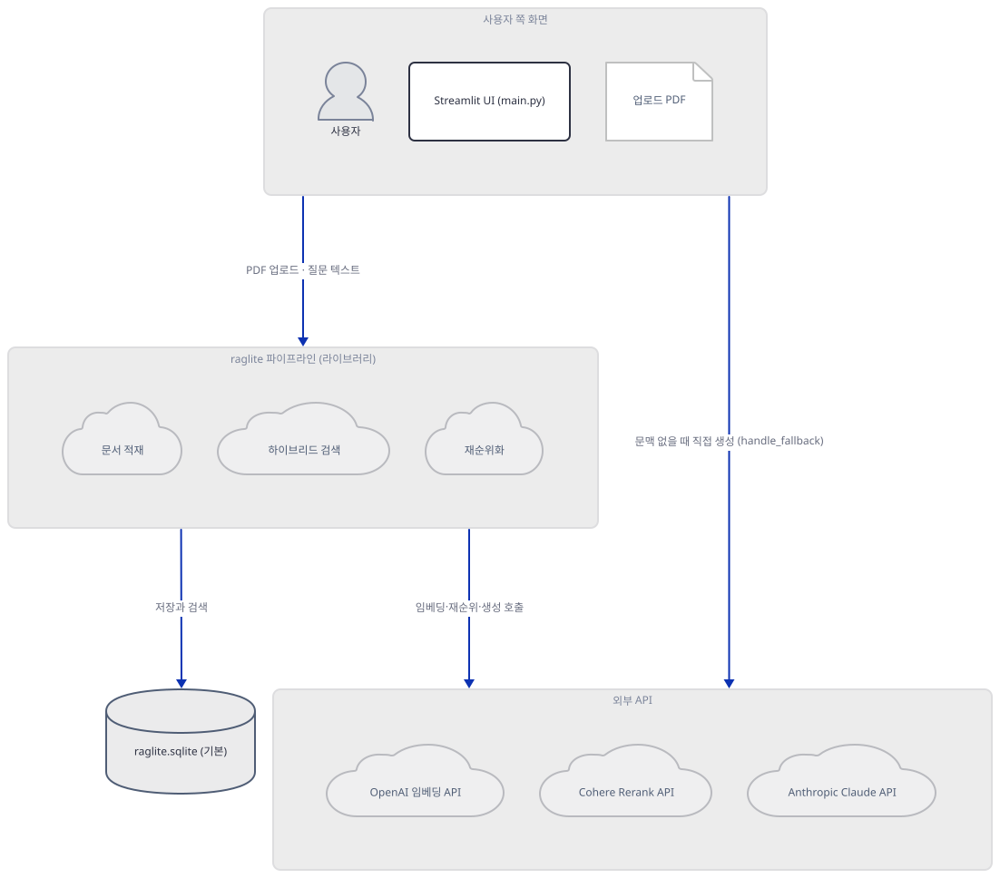
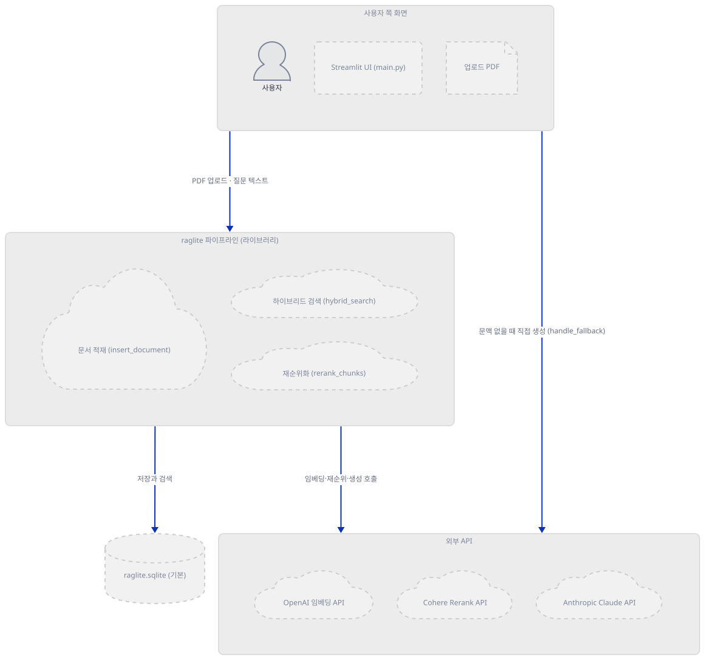
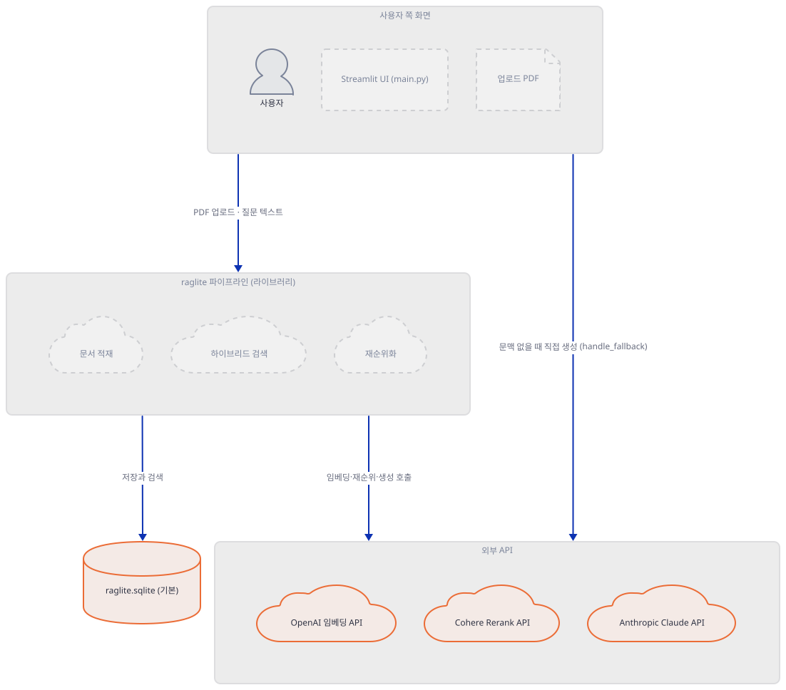
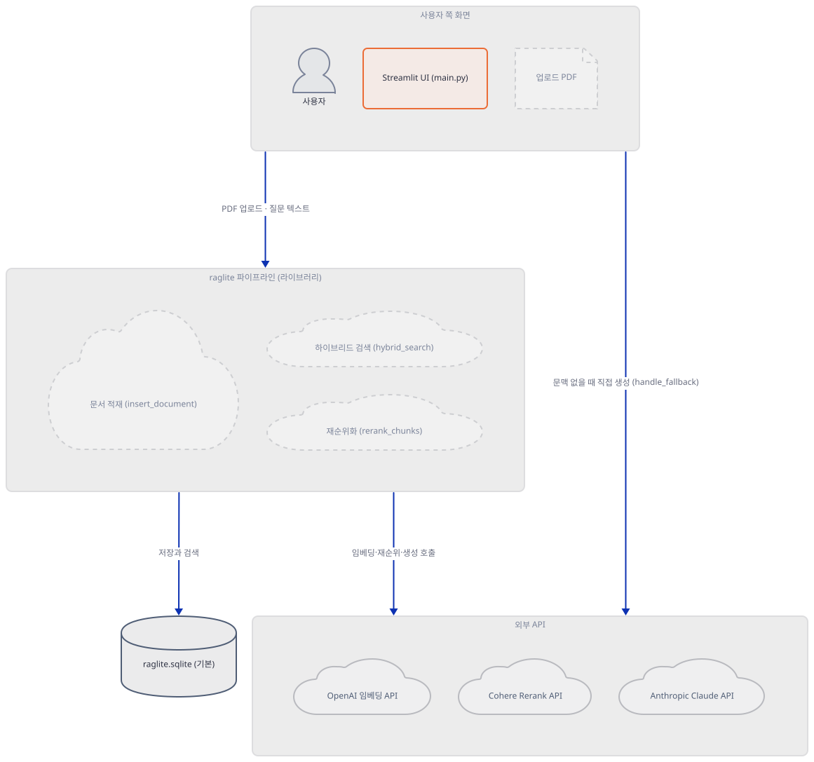
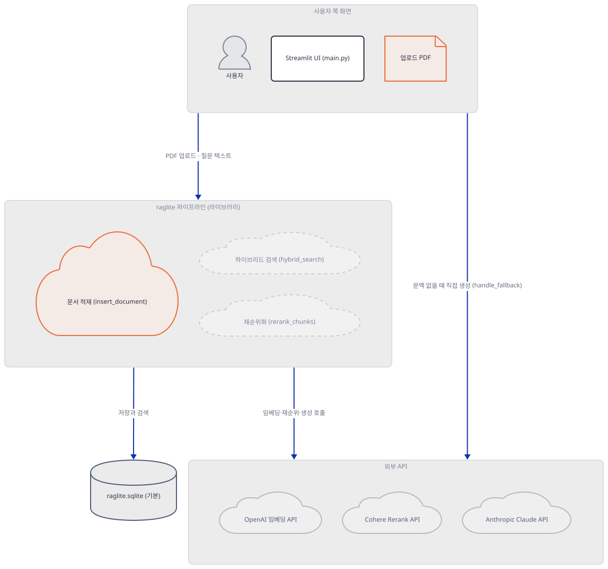
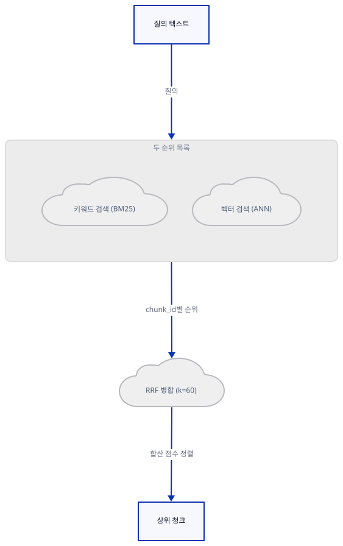
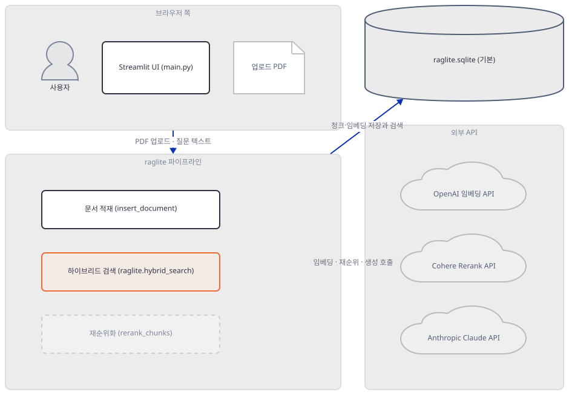
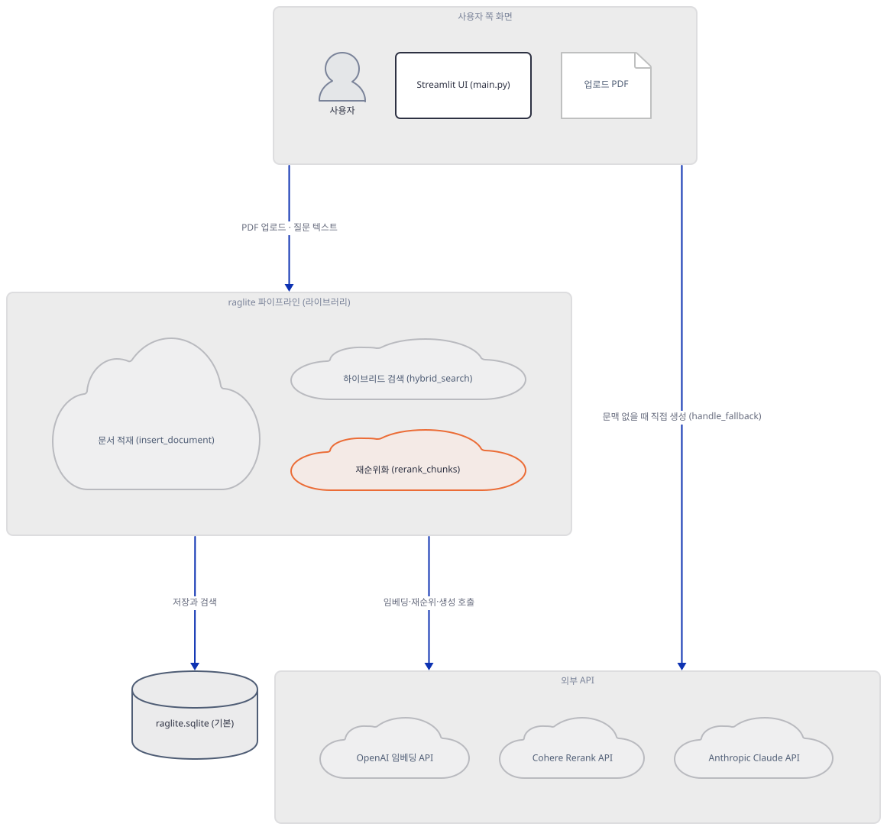
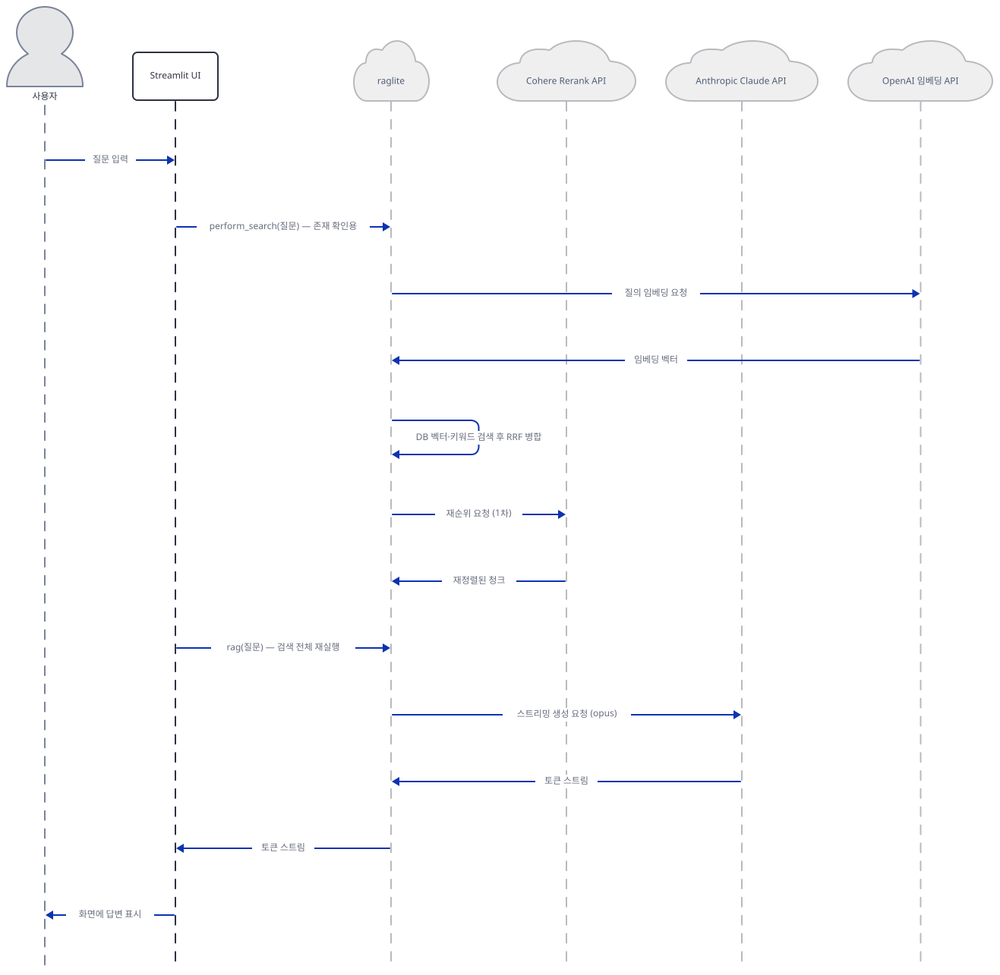

# Day 053 · 👀 Hybrid Search RAG (Cloud)

> 볼륨 5 📀 RAG · 난이도 ★★★ ⚠ · 예상 소요 100분(설치 성공 여부가 Python 버전에 따라 갈리고, 설치가 성공해도 import가 다시 깨지는 원인을 라이브러리 소스까지 따라가 확인하는 데 시간이 걸립니다) · API 비용 대략 질문 1건에 OpenAI 임베딩 호출 2회 + Cohere 재순위 호출 2회(문서를 이미 넣었다면), 문서 업로드 시에도 문장마다 임베딩 호출 — Claude 생성 호출 2종(opus·sonnet)은 모두 은퇴된 모델 ID라 과금 전에 실패합니다(대략치 — 키가 없어 실제 과금은 확인 못함) · 원본 앱: `rag_tutorials/hybrid_search_rag`

## 오늘 만들 것

오늘 앱은 RAG 파이프라인의 검색 단계를 두 갈래로 쪼갭니다. `raglite`라는 라이브러리가 벡터 검색(ANN 코사인 유사도)과 키워드 검색(SQLite는 FTS5의 진짜 BM25 함수, PostgreSQL은 `tsvector`·`ts_rank`)을 같은 청크 집합에 각각 최대 100개까지 따로 돌리고, 두 순위 목록을 **Reciprocal Rank Fusion**(`k=60`, `score += 1/(k+순위)`)으로 합칩니다 — "하이브리드"는 문자 그대로 이 병합을 가리킵니다(소스로 확인, raglite 0.2.1의 `_search.py`). 합쳐진 상위 후보는 그대로 쓰이지 않고 `rerankers` 패키지를 거쳐 Cohere의 `rerank-english-v3.0` 모델에 한 번 더 보내져 재정렬되는데, 이건 raglite의 기본값이 아닙니다 — raglite 자신의 기본 재순위기는 무료 로컬 ONNX 모델(FlashRank)이고, 이 앱이 `Reranker("cohere", ...)`를 명시해 무료 로컬 재순위를 유료 API 호출로 바꿔치기한 것입니다(소스로 확인, `raglite/_config.py`). 그런데 이 재순위 호출은 질문 하나당 정확히 두 번 일어납니다 — `perform_search()`가 검색 결과의 존재 여부만 확인하려고 하이브리드 검색과 재순위화를 한 번 돌리고, 결과가 있으면 `rag()`가 같은 과정을 처음부터 다시 실행하기 때문입니다(main.py와 raglite `_rag.py`를 대조해 소스로 확인). Day 049와 달리 벡터 저장소 기본값은 `sqlite:///raglite.sqlite`라는 로컬 파일이라 서버를 띄울 필요가 없습니다(`main.py:134`) — `sqlalchemy`는 SQLite든 Postgres든 항상 쓰이고(raglite가 모든 백엔드에서 SQLAlchemy `create_engine`으로 연결합니다, 소스로 확인), `psycopg2-binary`는 앱 자체 README가 권하는 `postgresql://` 형식 URL을 쓰더라도 실제로는 쓰이지 않습니다 — raglite가 드라이버가 없는 Postgres URL을 만나면 `psycopg2` 대신 `pg8000`으로 바꿔치기하기 때문입니다(소스로 확인, `raglite/_database.py`). 문제는 서버가 아니라 설치 그 자체에 있습니다: 정확히 고정된 세 줄(`raglite==0.2.1`, `pydantic==2.10.1`, `rerankers==0.6.0`)은 오늘도 충돌 없이 풀리지만(직접 확인, 139개 패키지), `uv venv`가 기본으로 고르는 Python 3.13.3에서는 `spacy`가 끌어오는 `blis`가 Cython 컴파일 오류로 아예 설치되지 않고, Python 3.11로 바꿔 그 문제를 피해도 raglite 자신이 무조건 요구하는 `llama-cpp-python`(이 앱은 로컬 모델을 전혀 쓰지 않는데도, raglite의 기본 llm·embedder가 로컬 llama.cpp 모델이라 강제로 딸려옵니다)이 소스 빌드로 남으며, 그 둘을 모두 넘겨 설치를 성공시켜도 관문이 하나 더 있습니다 — `pydantic==2.10.1`이 litellm(raglite가 이름조차 `requirements.txt`에 없이 끌어오는 전이 의존성)의 최신 버전이 쓰는 타입 표기를 처리하지 못해 `from raglite import ...` 자체가 `PydanticSchemaGenerationError`로 깨지고(직접 확인), `pydantic`을 올려 그것을 넘겨도 이번에는 numpy 2.x와 `thinc`(spaCy의 하위 의존성)의 사전 빌드 wheel이 ABI 단에서 부딪혀 `ValueError: numpy.dtype size changed`로 깨집니다(직접 확인) — `numpy<2`로 고정해야 네 번째 관문까지 넘습니다. 그렇게 넘긴 `import`는 그 자체로 네트워크를 탑니다: raglite의 기본 재순위기(FlashRank, 두 모델 약 195MB)를 처음 한 번 내려받고, litellm이 비용표를 매번 GitHub에서 가져오려 시도합니다(직접 확인, 아래 Step 1). 공급자는 셋 — OpenAI(임베딩), Cohere(재순위), Anthropic(Claude, 생성) — 인데, 코드에 박힌 두 Claude 모델 ID `claude-3-opus-20240229`(주 답변)와 `claude-3-sonnet-20240229`(폴백 답변)는 각각 2026-01-05·2025-07-21에 이미 은퇴되어, 앞의 관문을 모두 통과해도 마지막 생성 단계에서 다시 막힙니다. 세 관문을 모두 넘기면 PDF를 올리고 질문할 때 하이브리드 검색이 찾은 문맥으로 Claude가 답하고, 문맥이 하나도 없으면 Claude를 문맥 없이 바로 불러 대신 답하는 화면을 로컬에서 띄우게 됩니다. 아래는 완성된 아키텍처입니다.



## 사전 준비

| 서비스/도구 | 용도 | 발급·설치 |
|---|---|---|
| OpenAI API 키 | 문서·질의 임베딩(`text-embedding-3-large`) 호출 인증 | https://platform.openai.com/api-keys |
| Anthropic API 키 | 주 답변(`claude-3-opus-20240229`)과 폴백 답변(`claude-3-sonnet-20240229`) 생성 호출 인증 — 둘 다 이미 은퇴된 모델 ID(Step 2·6 참고) | https://console.anthropic.com/settings/keys |
| Cohere API 키 | 재순위화(`rerank-english-v3.0`) 호출 인증 | https://dashboard.cohere.com/api-keys |
| spaCy 언어 모델 (`xx_sent_ud_sm`) | 문서를 문장으로 나누는 다국어 분리기. PDF를 하나라도 올리려면 반드시 필요하고, pip로 따로 설치해야 한다(4.1MiB, Step 1에서 직접 받아 확인) | `uv pip install "https://github.com/explosion/spacy-models/releases/download/xx_sent_ud_sm-3.7.0/xx_sent_ud_sm-3.7.0-py3-none-any.whl"` |
| PostgreSQL (선택) | `db_url`을 Neon 등 Postgres 연결 문자열로 바꾸면 사용된다 — 기본값은 로컬 SQLite 파일이라 필수는 아니다(Day 049와의 차이) | https://neon.tech (이 문서는 띄우지 않음) |
| uv | 가상환경 생성과 패키지 설치 | [공통 사전 준비](../README.md#공통-사전-준비-한-번만) 절 참고 |

## 아키텍처 한눈에 보기

| 컴포넌트 | 역할 | 코드 위치 |
|---|---|---|
| 사용자 | 브라우저로 키 입력, PDF 업로드, 질문 | 코드 없음 (브라우저) |
| Streamlit UI | 사이드바 키 입력·PDF 업로더·채팅창을 그리고 `session_state`를 관리 | `rag_tutorials/hybrid_search_rag/main.py:122-150`, `rag_tutorials/hybrid_search_rag/main.py:175-212` |
| 문서 적재 (insert_document) | PDF를 Markdown 변환 → 문장 분리 → 임베딩 → 청크화 → DB 저장, SQLite면 ANN 인덱스까지 구성 | `rag_tutorials/hybrid_search_rag/main.py:58-77` |
| 하이브리드 검색 (raglite.hybrid_search) | 키워드 검색과 벡터 검색을 각각 최대 100개까지 뽑아 RRF(k=60)로 병합 | `rag_tutorials/hybrid_search_rag/main.py:79-100`, `rag_tutorials/hybrid_search_rag/main.py:195-200` |
| 재순위화 (rerank_chunks) | 병합된 후보를 Cohere `rerank-english-v3.0`에 다시 보내 재정렬 — 질문 1건당 두 번 호출 | `rag_tutorials/hybrid_search_rag/main.py:97`, `rag_tutorials/hybrid_search_rag/main.py:200` |
| raglite.sqlite (기본) | 청크 본문·임베딩·FTS5 인덱스·ANN 인덱스를 담는 로컬 파일 DB (Postgres로 대체 가능) | `rag_tutorials/hybrid_search_rag/main.py:134` |
| OpenAI 임베딩 API | 질의·문장·청크 텍스트를 벡터로 변환 | 코드 없음 (외부 서비스) |
| Cohere Rerank API | 후보 청크를 질의 관련도로 재정렬 | 코드 없음 (외부 서비스) |
| Anthropic Claude API | 주 답변(opus)과 폴백 답변(sonnet) 생성 — 둘 다 은퇴된 모델 ID | `rag_tutorials/hybrid_search_rag/main.py:48`, `rag_tutorials/hybrid_search_rag/main.py:110` |

## 단계별 진행

### Step 1. 환경 만들기 — 풀리고 설치돼도 import가 안 된다

**목적.** `requirements.txt` 12줄이 오늘 실제로 어떻게 풀리고 설치되는지, 그리고 설치가 끝난 뒤에도 이 앱의 첫 실질 import 줄이 통과하는지 끝까지 확인한다.

**할 일.**

```bash
cd rag_tutorials/hybrid_search_rag
uv venv
uv pip install -r requirements.txt
```

(pip 대안: `python -m venv .venv && source .venv/bin/activate && pip install -r requirements.txt`. Windows PowerShell은 활성화만 `.venv\Scripts\Activate.ps1`로 바꿉니다.)

`rag_tutorials/hybrid_search_rag/requirements.txt:1-12`

```text
raglite==0.2.1
pydantic==2.10.1
sqlalchemy>=2.0.0
psycopg2-binary>=2.9.9
openai>=1.0.0
cohere>=4.37
pypdf>=3.0.0
python-dotenv>=1.0.0
rerankers==0.6.0
spacy>=3.7.0
streamlit
anthropic
```

이 12줄 자체는 오늘도 충돌 없이 풀립니다 — 139개 패키지, 몇십 초 안(직접 확인). 문제는 그다음 세 곳에서 따로 터집니다.

**첫 번째, `uv venv`가 고르는 기본 Python.** `uv venv`는 Day 047·049와 같은 방식으로 uv 자체 관리 Python 3.13.3을 그대로 고릅니다(직접 확인). 이 버전에서는 `spacy`가 끌어오는 `thinc`가 다시 끌어오는 `blis==0.7.11`에 Windows·Python 3.13용 사전 빌드 wheel이 없어 소스 빌드에 들어가고, 그 Cython 소스가 컴파일에 실패합니다. 직접 확인한 출력(발췌):

```
      Error compiling Cython file:
      ------------------------------------------------------------
      ...
      blis\py.pyx:107:28: Indexing Python object not allowed without gil
      ...
      Cython.Compiler.Errors.CompileError: blis\py.pyx
  help: `blis` (v0.7.11) was included because `spacy` (v3.7.5) depends on
        `thinc` (v8.2.4) which depends on `blis`
```

uv는 하나라도 빌드에 실패하면 전체를 한 묶음으로 취급해 성공한 패키지까지 포함해 아무것도 설치하지 않습니다 — 설치 뒤 `site-packages`에는 가상환경 부트스트랩 파일 2개만 남습니다(직접 확인).

**두 번째, Python 3.11로 바꿔도 raglite 자신이 요구하는 `llama-cpp-python`이 남는다.** `uv venv --python 3.11`로 바꾸면 `spacy`·`thinc`·`blis`·`psycopg2-binary` 모두 사전 빌드된 wheel을 내려받습니다(직접 확인, 예: `Downloading spacy (11.5MiB)`) — 하지만 `llama-cpp-python==0.3.35`만은 여전히 `Building`으로 남습니다. 이 이름은 `requirements.txt`에 없습니다 — raglite 0.2.1이 코어 의존성으로 무조건 요구하는 패키지이고(소스로 확인, raglite 0.2.1 배포 메타데이터의 `Requires-Dist`), 이유도 소스에 있습니다: raglite 자신의 `RAGLiteConfig` 기본 `llm`·`embedder` 값이 로컬 llama.cpp GGUF 모델이라(소스로 확인, `raglite/_config.py`), 이 앱이 그 기본값을 OpenAI·Claude로 완전히 덮어써도 import 시점에는 여전히 필요합니다 — `raglite/__init__.py`가 `_config.py`를 무조건 import하고, `_config.py`는 맨 위에서 `from llama_cpp import llama_supports_gpu_offload`를 실행합니다(소스로 확인). llama-cpp-python은 PyPI에 범용 사전 빌드 wheel이 없어 통상 CMake로 소스를 직접 빌드하는데, 이 컴퓨터에서는(다른 일차 작성자들과 자원을 나눠 쓰는 상태였습니다) 그 빌드가 오래 걸려 끝까지 기다리지 못했습니다. 대신 프로젝트가 제공하는 CPU 전용 wheel 인덱스를 추가하면 컴파일 없이 그대로 받아집니다:

```bash
uv venv --python 3.11
uv pip install --extra-index-url https://abetlen.github.io/llama-cpp-python/whl/cpu -r requirements.txt
```

직접 확인한 출력(발췌):

```
Resolved 139 packages in 1m 25s
Downloading llama-cpp-python (6.8MiB)
...
EXITCODE:0
```

이 조합으로 설치했을 때 실제로 받아진 주요 버전(직접 확인): **raglite 0.2.1**, **pydantic 2.10.1**, **pydantic-core 2.27.1**, **rerankers 0.6.0**, **spacy 3.7.5**, **litellm 1.102.0**(`requirements.txt`에 없는 이름), **openai 2.54.0**, **anthropic 1.8.0**, **cohere 7.1.1**, **streamlit 1.64.0**, **llama-cpp-python 0.3.35**, **psycopg2-binary 2.9.13**, **sqlalchemy 2.0.54**.

**세 번째, 설치가 성공해도 import가 실패한다.** 세 정확한 고정 중 `pydantic==2.10.1`이 진짜 뇌관입니다 — 버전 충돌로 걸리는 게 아니라, 설치가 끝난 뒤 `from raglite import ...`를 실행하는 순간 깨집니다. 호출 스택을 따라가면 `raglite` → `raglite/_config.py`가 코어 의존성으로 import하는 `rerankers`(Cohere 전용이 아니라 패키지 전체) → `rerankers.models.rankgpt_rankers`의 `from litellm import completion` → litellm 1.102.0의 타입 정의 어딘가에서 `pydantic==2.10.1`이 처리하지 못하는 `typing_extensions.ReadOnly[...]` 애노테이션을 만나 깨집니다. 직접 확인한 출력(맨 아래 줄):

```
pydantic.errors.PydanticSchemaGenerationError: Unable to generate pydantic-core schema for typing_extensions.ReadOnly[typing.Literal['input_audio_buffer.speech_started', 'input_audio_buffer.speech_stopped']]. Set `arbitrary_types_allowed=True` in the model_config to ignore this error or implement `__get_pydantic_core_schema__` on your type to fully support it.
```

`litellm`은 raglite가 `litellm>=1.47.1`이라는 느슨한 하한만 걸어 둔 전이 의존성이라 오늘은 1.102.0이 풀립니다 — `pydantic==2.10.1`이라는 정확한 고정 하나가, 이 앱이 이름조차 모르는 라이브러리의 최신 버전과 부딪혀 깨지는 셈입니다. `pydantic`을 최신(2.13.5)으로 올리면 이 오류는 사라지지만, **네 번째 관문**이 바로 뒤에 있습니다 — `raglite/__init__.py`가 이어서 불러오는 `_insert.py` → `_split_sentences.py`가 `import spacy`를 실행하는데, `spacy`가 끌어오는 `thinc`의 사전 빌드 wheel은 numpy 1.x의 ABI로 컴파일돼 있어서, `pydantic` 업그레이드 과정에서(또는 애초에 고정되지 않은 `numpy` 하한 때문에) numpy 2.x가 함께 설치되면 곧바로 깨집니다. 직접 확인한 출력(맨 아래 줄):

```
ValueError: numpy.dtype size changed, may indicate binary incompatibility. Expected 96 from C header, got 88 from PyObject
```

해결은 `numpy<2`로 고정하는 것입니다. 이 네 관문(Python 3.11 + CPU wheel 인덱스 + `pydantic` 업그레이드 + `numpy<2`)을 모두 넘기면 `from raglite import ...`는 실제로 성공합니다 — 직접 확인한 출력:

```
RAGLITE IMPORT OK
```

(약 7초 걸렸습니다. "8분을 넘겨도 끝나지 않았다"는 이전 관찰은 이 네 번째 관문 없이 numpy 2.x인 채로 매달려 있었을 가능성이 큽니다 — numpy 2.x 상태에서는 이 import가 **끝나지 않는 것**이 아니라 위 `ValueError`로 **곧바로 실패**하므로, 8분간 이어진 것은 그 앞뒤의 무거운 재시도·재해석 과정이었을 것으로 보이며 이 컴퓨터에서는 재현되지 않았습니다.) 이 import 자체가 이미 네트워크를 탄다는 것도 함께 확인했습니다 — `raglite/_cli.py`가 모듈 최상위에서 함수 기본값으로 `RAGLiteConfig()`를 세 번 만드는데, 그 기본 재순위기(FlashRank 영어·다국어 모델 둘, 처음 한 번 총 195MB)가 없으면 그 자리에서 내려받고, `litellm`은 매번 GitHub에서 비용표를 가져오려 시도합니다(네트워크 차단 환경에서 직접 확인, 아래 출력):

```
LiteLLM:WARNING: model cost map fetch attempt 1/3 failed (ConnectError fetching https://raw.githubusercontent.com/BerriAI/litellm/main/model_prices_and_context_window.json: ...); retrying in 2.3s
```

아래 Step 2·4·5의 "확인"은 이제 실제 실행 결과입니다 — 다만 재현하려면 위 네 관문을 그대로 넘겨야 합니다.

spaCy 모델도 이 자리에서 미리 받아 둡니다 — 앱 자체 README의 "Install spaCy Model" 단계와 정확히 같은 wheel이고, raglite의 문장 분리 함수가 이 모델이 없으면 무조건 실패합니다(Step 4에서 소스로 확인):

```bash
uv pip install "https://github.com/explosion/spacy-models/releases/download/xx_sent_ud_sm-3.7.0/xx_sent_ud_sm-3.7.0-py3-none-any.whl"
```

직접 확인한 출력:

```
Downloading xx-sent-ud-sm (4.1MiB)
Installed 1 package in 1.35s
 + xx-sent-ud-sm==3.7.0 (from https://github.com/explosion/spacy-models/releases/download/xx_sent_ud_sm-3.7.0/xx_sent_ud_sm-3.7.0-py3-none-any.whl)
```

**그림.**



**확인.** `py_compile`은 세 관문과 무관하게 항상 통과합니다.

```bash
uv run --no-project python -m py_compile main.py && echo compiled
```

```
compiled
```

두 번째 관문(Python 3.11 + CPU wheel 인덱스)까지 넘긴 환경에서 첫 import 줄을 그대로 실행하면 세 번째 관문에서 막힙니다 — 바로 위에서 직접 확인한 `PydanticSchemaGenerationError`가 이 명령의 실제 출력입니다.

```bash
uv run --no-project python -c "from raglite import RAGLiteConfig, insert_document, hybrid_search, retrieve_chunks, rerank_chunks, rag; print('RAGLITE IMPORT OK')"
```

`pydantic`을 올리지 않은 이 상태에서는 위 명령이 그 오류로 실패한다는 것을 직접 확인했습니다. `uv pip install -U pydantic`으로 올린 뒤 같은 명령을 실행하면 이번에는 네 번째 관문의 `numpy.dtype size changed` 오류로 실패합니다(직접 확인). 마지막으로 `uv pip install "numpy<2"`까지 적용한 뒤 같은 명령을 실행하면:

```
RAGLITE IMPORT OK
```

이 통과합니다(직접 확인, 약 7초).

### Step 2. RAGLiteConfig — 세 공급자와, 기본값이 아닌 선택들

**목적.** `initialize_config()`이 세 키와 `db_url`을 하나의 `RAGLiteConfig`로 묶는 지점에서, 이 앱이 raglite의 기본값 중 정확히 무엇을 바꿔치기했는지 확인한다.

**할 일.**

`rag_tutorials/hybrid_search_rag/main.py:41-54`

```python
    try:
        os.environ["OPENAI_API_KEY"] = openai_key
        os.environ["ANTHROPIC_API_KEY"] = anthropic_key
        os.environ["COHERE_API_KEY"] = cohere_key
        
        return RAGLiteConfig(
            db_url=db_url,
            llm="claude-3-opus-20240229",
            embedder="text-embedding-3-large",
            embedder_normalize=True,
            chunk_max_size=2000,
            embedder_sentence_window_size=2,
            reranker=Reranker("cohere", api_key=cohere_key, lang="en")
        )
```

세 키는 `os.environ`에도 그대로 복사됩니다 — Day 005의 Together 키와 같은 패턴입니다. `db_url`의 기본값은 사이드바 입력창 자체에 박혀 있습니다(`main.py:134`, `sqlite:///raglite.sqlite`) — Day 049처럼 미리 띄워야 하는 서버가 아니라 로컬 파일입니다. 나머지 다섯 인자는 raglite 자신의 기본값을 하나씩 덮어씁니다(소스로 확인, `raglite/_config.py`의 `RAGLiteConfig` 데이터클래스):

| 필드 | 이 앱의 값 | raglite 기본값 |
|---|---|---|
| `llm` | `claude-3-opus-20240229` | 로컬 llama.cpp GGUF (Llama-3.1-8B 또는 3.2-3B) |
| `embedder` | `text-embedding-3-large` | 로컬 llama.cpp GGUF (`bge-m3-gguf`) |
| `chunk_max_size` | 2000 | 1440 |
| `embedder_sentence_window_size` | 2 | 3 |
| `reranker` | `Reranker("cohere", ...)` | 로컬 FlashRank 쌍(영어·다국어 ONNX 모델) |

`Reranker("cohere", api_key=cohere_key, lang="en")`의 `"cohere"`는 `rerankers` 0.6.0의 공급자 이름표일 뿐이고, `lang="en"`과 합쳐져 실제 모델 ID `rerank-english-v3.0`으로 해석됩니다(소스로 확인, `rerankers` 0.6.0의 `reranker.py`). 생성자는 이 시점에 키를 검증하지 않습니다 — `api_key`를 필드에 저장만 하고, 실제 HTTP 요청은 `.rank(...)`를 호출할 때에야 나갑니다(소스로 확인, `rerankers` 0.6.0의 `models/api_rankers.py`).

**그림.**



**확인.** 가짜 키로 `RAGLiteConfig`를 만들어, 값이 그대로 들어가는지 확인하는 명령입니다(Step 1의 네 관문을 넘긴 환경에서 직접 확인).

```bash
uv run --no-project python -c "
from raglite import RAGLiteConfig
from rerankers import Reranker
cfg = RAGLiteConfig(
    db_url='sqlite:///raglite.sqlite',
    llm='claude-3-opus-20240229',
    embedder='text-embedding-3-large',
    embedder_normalize=True,
    chunk_max_size=2000,
    embedder_sentence_window_size=2,
    reranker=Reranker('cohere', api_key='fake-key', lang='en'),
)
print('db_url:', cfg.db_url)
print('llm:', cfg.llm)
print('chunk_max_size:', cfg.chunk_max_size)
print('reranker model:', cfg.reranker.model)
"
```

직접 확인한 출력(전부 — 생성자가 먼저 두 줄을 찍습니다):

```
Auto-updated model_name to rerank-english-v3.0 for API provider cohere
Loading APIRanker model rerank-english-v3.0 (this message can be suppressed by setting verbose=0)
db_url: sqlite:///raglite.sqlite
llm: claude-3-opus-20240229
chunk_max_size: 2000
reranker model: rerank-english-v3.0
```

### Step 3. Streamlit 사이드바와 세션 상태

**목적.** 사이드바 네 입력과 `session_state` 초기화가 어떻게 맞물리는지, 그리고 "Save Configuration"을 누르기 전까지 무엇이 보이는지 확인한다.

**할 일.**

`rag_tutorials/hybrid_search_rag/main.py:122-127`

```python
def main():
    st.set_page_config(page_title="LLM-Powered Hybrid Search-RAG Assistant", layout="wide")
    
    for state_var in ['chat_history', 'documents_loaded', 'my_config', 'user_env']:
        if state_var not in st.session_state:
            st.session_state[state_var] = [] if state_var == 'chat_history' else False if state_var == 'documents_loaded' else None if state_var == 'my_config' else {}
```

`rag_tutorials/hybrid_search_rag/main.py:211-212`

```python
    else:
        st.info("Please configure your API keys and upload documents to get started." if not st.session_state.my_config else "Please upload some documents to get started.")
```

4개 `session_state` 키 중 `my_config`가 사실상 전체 화면의 게이트입니다 — `my_config`가 `None`이면(초기값) 파일 업로더도 채팅창도 그려지지 않고, `main.py:211-212`의 안내문만 보입니다. `my_config`는 사이드바의 "Save Configuration" 버튼(`main.py:136`)을 눌러 `initialize_config(...)`가 예외 없이 끝나야 채워집니다. 그런데 Step 1에서 확인했듯 `main.py:4`의 `from raglite import ...`가 모듈을 불러오는 시점에 이미 실행되므로, raglite import가 깨진 환경에서는 이 사이드바조차 그려지지 않고 Streamlit이 미처리 예외 화면으로 곧장 멈춥니다.

**그림.**



**확인.** 네 관문을 넘긴 환경에서 서버를 headless로 띄우는 명령입니다.

```bash
uv run --no-project streamlit run main.py --server.headless true
```

다른 터미널에서:

```bash
curl -s -o /dev/null -w "%{http_code}\n" http://localhost:8501
```

```
200
```

`main.py:4`의 `from raglite import ...`가 모듈 맨 위에 있어, `streamlit run`도 이 줄을 먼저 통과해야 화면을 띄웁니다 — 즉 Step 1의 import 확인과 같은 무게의 실행입니다. Streamlit의 `AppTest`로 `main.py`를 그대로 실행해 화면 요소를 직접 확인했습니다:

```
title: ['👀 RAG App with Hybrid Search', 'Configuration']
sidebar text_input labels: ['OpenAI API Key', 'Anthropic API Key', 'Cohere API Key', 'Database URL']
sidebar button labels: ['Save Configuration']
info: ['Please configure your API keys and upload documents to get started.']
```

가짜 키 네 개를 넣고 "Save Configuration"을 누르면(생성자가 키를 검증하지 않으므로):

```
success: ['Configuration saved successfully!']
file_uploader present: 1
```

`if st.session_state.my_config:` 가드대로, 업로더는 이때 처음 나타나고 채팅창(`documents_loaded` 이후)은 아직 없습니다.

### Step 4. 문서 업로드와 적재 — spaCy는 필수, 임베딩은 이중으로

**목적.** PDF 하나를 올렸을 때 `process_document`가 raglite의 `insert_document`를 거쳐 몇 번의 OpenAI 호출과 어떤 인덱스 구성을 만드는지 확인한다.

**할 일.**

`rag_tutorials/hybrid_search_rag/main.py:70-77`

```python
    try:
        if not st.session_state.get('my_config'):
            raise ValueError("Configuration not initialized")
        insert_document(Path(file_path), config=st.session_state.my_config)
        return True
    except Exception as e:
        logger.error(f"Error processing document: {str(e)}")
        return False
```

`insert_document`는 다섯 단계를 순서대로 밟습니다(소스로 확인, `raglite/_insert.py`): ① PDF를 Markdown으로 변환 ② spaCy의 `xx_sent_ud_sm`으로 문장 분리 ③ 문장을 64개씩 묶어 OpenAI에 임베딩 요청(`embedder_sentence_window_size=2`이므로 문장마다 직전 문장 하나를 이어붙인 "문장창" 단위로 임베딩) ④ 문장을 `chunk_max_size=2000`자 이내 청크로 재구성 ⑤ 청크·임베딩을 DB에 저장. 그런데 ⑤ 직전에 숨은 임베딩 호출이 하나 더 있습니다 — 이 앱의 임베더가 OpenAI(API 기반)라서 문장 단위 임베딩과 별도로 청크 전체 텍스트도 다시 한번 임베딩하고, 최종 벡터는 둘을 황금비(0.382 : 0.618)로 섞은 값입니다(소스로 확인, `raglite/_insert.py`의 `_create_chunk_records`). SQLite를 쓰면 저장 뒤 `pynndescent`로 ANN 인덱스를 다시 구성하고, PostgreSQL이면 이 단계 대신 `CREATE EXTENSION IF NOT EXISTS vector;`와 GIN 인덱스를 자동으로 만듭니다(소스로 확인, `raglite/_database.py`).

`rag_tutorials/hybrid_search_rag/main.py:153-169`

```python
    if st.session_state.my_config:
        uploaded_files = st.file_uploader("Upload PDF documents", type=["pdf"], accept_multiple_files=True, key="pdf_uploader")

        if uploaded_files:
            success = False
            for uploaded_file in uploaded_files:
                with st.spinner(f"Processing {uploaded_file.name}..."):
                    temp_path = f"temp_{uploaded_file.name}"
                    with open(temp_path, "wb") as f:
                        f.write(uploaded_file.getvalue())
                    
                    if process_document(temp_path):
                        st.success(f"Successfully processed: {uploaded_file.name}")
                        success = True
                    else:
                        st.error(f"Failed to process: {uploaded_file.name}")
                    os.remove(temp_path)
```

**그림.**



**확인.** spaCy 모델이 없으면 정확히 어떤 예외로 멈추는지 확인하는 명령입니다(직접 확인).

```bash
uv run --no-project python -c "
from raglite._split_sentences import split_sentences
split_sentences('First sentence. Second sentence.')
"
```

직접 확인한 마지막 줄:

```
ImportError: Please install `xx_sent_ud_sm` with `pip install https://github.com/explosion/spacy-models/releases/download/xx_sent_ud_sm-3.7.0/xx_sent_ud_sm-3.7.0-py3-none-any.whl`.
```

Step 1에서 받아 둔 모델이 있는 환경에서는 같은 함수가 통과합니다(직접 확인).

```bash
uv run --no-project python -c "
from raglite._split_sentences import split_sentences
print(split_sentences('First sentence. Second sentence.'))
"
```

```
['First sentence. ', 'Second sentence.']
```

### Step 5. 하이브리드 검색 — RRF를 그대로 실행해보기

**목적.** `perform_search`가 raglite의 `hybrid_search`를 어떻게 부르는지, 그리고 두 순위 목록이 정확히 어떤 공식으로 하나가 되는지 함수를 직접 돌려 확인한다.

**할 일.**

`rag_tutorials/hybrid_search_rag/main.py:92-100`

```python
    try:
        chunk_ids, scores = hybrid_search(query, num_results=10, config=st.session_state.my_config)
        if not chunk_ids:
            return []
        chunks = retrieve_chunks(chunk_ids, config=st.session_state.my_config)
        return rerank_chunks(query, chunks, config=st.session_state.my_config)
    except Exception as e:
        logger.error(f"Search error: {str(e)}")
        return []
```

`hybrid_search`(소스로 확인, `raglite/_search.py`)는 `vector_search`와 `keyword_search`를 각각 `num_rerank=100`(기본값, 이 앱은 바꾸지 않음)개까지 따로 실행합니다. `vector_search`는 질의를 OpenAI로 임베딩한 뒤 SQLite면 `pynndescent`의 ANN 인덱스, PostgreSQL이면 pgvector의 `<=>` 코사인 거리 연산자로 가장 가까운 후보를 찾고, 한 청크가 여러 문장창 벡터를 가지므로 청크별 평균 유사도로 다시 모읍니다. `keyword_search`는 SQLite면 FTS5의 `bm25()` 함수(음수라서 부호를 뒤집음), PostgreSQL이면 `ts_rank(to_tsvector(...), to_tsquery(...))`로 점수를 매깁니다. 두 순위 목록은 `reciprocal_rank_fusion`으로 합쳐집니다:



이 병합은 raglite의 SQL도 벡터 인덱스도 필요 없이, 두 개의 순위 리스트만 있으면 재현할 수 있습니다.

**그림.**



**확인.** 실제 raglite 함수에 손으로 만든 두 순위를 넣어 보는 명령입니다(직접 확인).

```bash
uv run --no-project python -c "
from raglite._search import reciprocal_rank_fusion
ids, scores = reciprocal_rank_fusion([['a', 'b', 'c'], ['b', 'a', 'd']])
for i, s in zip(ids, scores):
    print(i, round(s, 5))
"
```

직접 확인한 출력:

```
b 0.03306
a 0.03306
d 0.032
c 0.032
```

(`a`는 첫 목록 0번·둘째 목록 1번이라 `1/(60+0) + 1/(60+1) = 0.03306`, `c`는 첫 목록 2번·둘째 목록엔 없어 벌점으로 목록 길이 3을 받아 `1/(60+2) + 1/(60+3) = 0.032`입니다. `a`·`b`, `c`·`d`는 각각 동점이라 그 안의 순서는 파이썬 딕셔너리·집합의 내부 순서에 따라 달라질 수 있습니다 — 실행마다 `a`·`b`의 순서나 `c`·`d`의 순서가 바뀔 수 있다는 뜻이며, 값 자체는 바뀌지 않습니다.)

### Step 6. 재순위화와 폴백·생성 — 중복 호출과 은퇴된 모델 둘

**목적.** `rerank_chunks`가 Cohere에 실제로 무엇을 보내는지, 결과가 없을 때의 `handle_fallback`이 `rag()`와 어떻게 다른 모델을 부르는지, 그리고 두 모델 ID가 모두 은퇴되었다는 사실을 확인한다.

**할 일.**

`rag_tutorials/hybrid_search_rag/main.py:102-120`

```python
def handle_fallback(query: str) -> str:
    try:
        client = anthropic.Anthropic(api_key=st.session_state.user_env["ANTHROPIC_API_KEY"])
        system_prompt = """You are a helpful AI assistant. When you don't know something, 
        be honest about it. Provide clear, concise, and accurate responses. If the question 
        is not related to any specific document, use your general knowledge to answer."""
        
        message = client.messages.create(
            model="claude-3-sonnet-20240229",
            max_tokens=1024,
            system=system_prompt,
            messages=[{"role": "user", "content": query}],
            temperature=0.7
        )
        return message.content[0].text
    except Exception as e:
        logger.error(f"Fallback error: {str(e)}")
        st.error(f"Fallback error: {str(e)}")  # Show error in UI
        return "I apologize, but I encountered an error while processing your request. Please try again."
```

`rag_tutorials/hybrid_search_rag/main.py:185-200`

```python
                try:
                    reranked_chunks = perform_search(query=user_input)
                    if not reranked_chunks or len(reranked_chunks) == 0:
                        logger.info("No relevant documents found. Falling back to Claude.")
                        st.info("No relevant documents found. Using general knowledge to answer.")
                        full_response = handle_fallback(user_input)
                    else:
                        formatted_messages = [{"role": "user" if i % 2 == 0 else "assistant", "content": msg}
                                           for i, msg in enumerate([m for pair in st.session_state.chat_history for m in pair]) if msg]
                        
                        response_stream = rag(prompt=user_input, 
                                           system_prompt=RAG_SYSTEM_PROMPT,
                                           search=hybrid_search, 
                                           messages=formatted_messages,
                                           max_contexts=5, 
                                           config=st.session_state.my_config)
```

`perform_search`가 돌려주는 `reranked_chunks`는 `if not reranked_chunks:` 판단에만 쓰이고 버려집니다 — 실제 문맥은 `rag(...)`가 내부에서 `hybrid_search`와 `rerank_chunks`를 처음부터 다시 실행해 만듭니다(소스로 확인, `raglite/_rag.py`의 `_contexts`). 즉 검색 결과가 있는 질문 하나마다 OpenAI 임베딩 호출과 Cohere 재순위 호출이 각각 두 번씩 나갑니다. `rag()`는 `config.llm`(`claude-3-opus-20240229`)로 litellm을 거쳐 스트리밍 생성하고, 결과가 없을 때만 타는 `handle_fallback`은 `anthropic` SDK로 직접 별도 모델(`claude-3-sonnet-20240229`)을 부릅니다 — 문맥 없이, 원래 질문 그대로. Anthropic이 공개한 모델 카탈로그 기준으로 `claude-3-opus-20240229`는 2026-01-05에, `claude-3-sonnet-20240229`는 2025-07-21에 이미 은퇴되었습니다 — 오늘(2026-09-23) 유효한 세 키를 모두 넣어도 두 경로 다 생성 단계에서 실패합니다.

**그림.**



**확인.** `Reranker` 생성 자체는 키를 검증하지 않는다는 것을 Step 2에서 소스로 확인했습니다. `.rank(...)`가 실제로 내는 HTTPS 요청은 raglite 없이 Cohere 엔드포인트에 가짜 키로 직접 요청을 보내 확인합니다.

```bash
curl -s -X POST https://api.cohere.ai/v1/rerank \
  -H "Authorization: Bearer fake-invalid-key" -H "Content-Type: application/json" \
  -d '{"model":"rerank-english-v3.0","query":"test","documents":["a","b"]}'
```

직접 확인한 출력(`id`는 요청마다 무작위로 발급되어 실행마다 달라집니다):

```
{"id":"...","message":"Incorrect API key provided: ************-key. You can find your API key at https://dashboard.cohere.com/api-keys."}
```

OpenAI 임베딩 엔드포인트도 같은 방식으로 도달 가능함을 확인했습니다(직접 확인, `https://api.openai.com/v1/embeddings`에 가짜 키로 `invalid_api_key` 오류). Anthropic 쪽은 가짜 키로는 모델 검증 이전에 인증에서 먼저 막혀(직접 확인, `authentication_error`) 은퇴 여부를 이 방식으로는 재현하지 못했습니다 — 은퇴 사실은 Anthropic 자신의 모델 카탈로그를 근거로 적은 것입니다.

### Step 7. 실행 — 어디까지 가는가

**목적.** 지금 이대로, 네 관문을 넘긴 환경에서 실행하면 무엇이 성공하고 무엇이 키가 있어야 비로소 실패하는지 처음부터 끝까지 정리한다.

**할 일.**

`rag_tutorials/hybrid_search_rag/main.py:214-215`

```python
if __name__ == "__main__":
    main()
```

정리하면: `py_compile`은 항상 통과(관문과 무관) → import는 Python 3.11 + CPU wheel 인덱스 + `pydantic` 업그레이드 + `numpy<2`까지 마쳐야 통과(Step 1) → `streamlit run`은 그 상태에서 화면을 띄우고 가짜 키로도 "Save Configuration"까지 성공(Step 2·3, 생성자가 키를 검증하지 않으므로) → PDF 업로드는 spaCy 모델이 있어야 하고 OpenAI 임베딩을 실제로 호출하므로 유효한 키가 필요(Step 4) → 질문은 OpenAI·Cohere 호출까지는 유효한 키로 성공할 수 있지만(Step 5·6) → 마지막 Claude 생성 호출은 opus·sonnet 둘 다 은퇴된 모델이라 키가 아무리 유효해도 실패합니다(Step 6).

**그림.**


**확인.** `py_compile`은 관문과 무관하게 통과합니다(직접 확인, Step 1과 동일).

```bash
uv run --no-project python -m py_compile main.py && echo compiled
```

```
compiled
```

`streamlit run main.py`가 실제로 화면을 띄우는지는 Step 3에서 이미 `AppTest`로 직접 확인했습니다 — `main.py:4`의 raglite import를 먼저 통과해야 하는데, 네 관문을 넘긴 환경에서는 그 import가 성공하므로 화면이 뜹니다.

```bash
uv run --no-project streamlit run main.py --server.headless true
```

## 요청 한 건이 흐르는 과정



사용자가 질문을 입력하면 Streamlit UI는 먼저 `perform_search`로 결과 존재 여부만 확인합니다 — 질의를 OpenAI로 임베딩하고, DB에서 벡터 검색(ANN)과 키워드 검색(BM25)을 각각 돌려 RRF(k=60)로 병합한 뒤, Cohere로 한 번 재순위화합니다. 결과가 있으면 UI는 `rag()`를 다시 호출하는데, 이 함수는 방금 한 검색·재순위화 전체를 처음부터 다시 실행합니다(Step 6에서 소스로 확인) — 그림에서 두 번째 `rag(질문)` 호출 다음에 임베딩·검색·재순위 메시지를 다시 그리지 않은 것은 지면을 아끼기 위해서이지 실제로 생략되어서가 아닙니다. 마지막에 raglite는 문맥을 시스템 프롬프트에 끼워 Claude(`claude-3-opus-20240229`)에 스트리밍 생성을 요청합니다. 결과가 하나도 없을 때는 이 그림과 다른 경로를 탑니다 — `rag()` 대신 `handle_fallback`이 문맥 없이 별도 모델(`claude-3-sonnet-20240229`)을 직접 부릅니다(Step 6). 이 시퀀스는 raglite의 각 함수를 소스로 읽고 main.py의 호출 순서와 대조해 구성한 것이며, 두 Claude 모델이 모두 은퇴되어 마지막 두 메시지(스트리밍 생성 요청·토큰 스트림)는 유효한 키로도 재현하지 못했습니다.

## 실행 체크리스트

- [ ] `raglite==0.2.1`·`pydantic==2.10.1`·`rerankers==0.6.0` 세 정확한 고정이 오늘도 충돌 없이 풀린다는 것을 확인했다(139개 패키지)
- [ ] `uv venv` 기본 Python(3.13.3)에서는 `spacy → thinc → blis` 체인이 Cython 컴파일 오류로 설치 자체가 실패한다는 것을 정확한 오류 문구로 확인했다
- [ ] Python 3.11 + `llama-cpp-python` CPU wheel 인덱스로 설치를 끝까지 성공시켰다
- [ ] 설치가 성공해도 `pydantic==2.10.1`이 litellm의 최신 타입 표기를 처리하지 못해 `from raglite import ...`가 `PydanticSchemaGenerationError`로 깨진다는 것을 확인했다
- [ ] `pydantic`을 올려도 `numpy` 2.x와 `thinc`의 사전 빌드 wheel이 ABI 단에서 부딪혀 `ValueError: numpy.dtype size changed`가 나고, `numpy<2`까지 고정해야 `from raglite import ...`가 `RAGLITE IMPORT OK`까지 실제로 통과한다는 것을 확인했다
- [ ] 그렇게 통과한 import 자체가 FlashRank 기본 재순위기(195MB, 첫 1회)와 litellm 비용표(매번, GitHub)를 내려받으려 한다는 것을 확인했다
- [ ] `db_url` 기본값이 로컬 SQLite 파일이라 Day 049와 달리 별도 서버가 필수는 아니고, `sqlalchemy`는 항상 쓰이지만 `psycopg2-binary`는 raglite가 pg8000으로 바꿔치기해 실제로는 쓰이지 않는다는 것을 확인했다
- [ ] `RAGLiteConfig`가 raglite 자신의 로컬 llama.cpp 기본값을 OpenAI·Claude·Cohere로 어떻게 덮어쓰는지 표로 정리했다
- [ ] spaCy 모델(`xx_sent_ud_sm`, 4.1MiB)이 없으면 문서 업로드가 정확한 `ImportError`로 멈춘다는 것을 소스로 확인했다
- [ ] `hybrid_search`가 벡터 검색(ANN)과 키워드 검색(BM25)을 각각 최대 100개까지 뽑아 RRF(k=60)로 병합한다는 것을 소스와 손 계산으로 확인했다
- [ ] 재순위화가 raglite의 기본값(무료 로컬 FlashRank)이 아니라 이 앱이 명시적으로 고른 Cohere 유료 API 호출이라는 것을 이해했다
- [ ] 질문 1건이 검색·재순위화 파이프라인을 두 번(존재 확인용 1회 + 실제 생성용 1회) 실행한다는 것을 소스로 확인했다
- [ ] `claude-3-opus-20240229`(주 답변)와 `claude-3-sonnet-20240229`(폴백 답변) 둘 다 이미 은퇴된 모델 ID라는 것을 확인했다

## 문제 해결

| 증상 | 원인 | 해결 |
|---|---|---|
| `uv pip install -r requirements.txt`가 `blis`의 `Cython.Compiler.Errors.CompileError`로 실패 | `uv venv`가 기본으로 고르는 Python 3.13.3에는 `spacy → thinc → blis` 체인의 `blis==0.7.11`에 사전 빌드 wheel이 없어 소스 빌드에 들어가는데, `blis`가 격리 빌드 환경에 고정하는 `Cython<3.0`과 그 환경이 함께 받는 `numpy`(오늘은 2.5.3, 상한 없음)의 헤더가 서로 맞지 않음 — numpy 자신이 "`Build aborted: the NumPy Cython headers require Cython 3.0.0 or newer.`"로 빌드를 중단시킨다(직접 확인. Cython 3.x가 옛 문법을 거부하는 것이 아니라 numpy가 낡은 Cython을 거부하는 것) | `uv venv --python 3.11`로 인터프리터를 바꾸기 |
| 위를 고쳐도 `llama-cpp-python==0.3.35`가 `Building`에서 오래 멈춤 | raglite 0.2.1이 코어 의존성으로 `llama-cpp-python`을 무조건 요구하는데(이 앱은 로컬 모델을 쓰지 않음에도), PyPI에는 범용 사전 빌드 wheel이 없어 CMake 소스 빌드로 들어감(소스로 확인) | `uv pip install --extra-index-url https://abetlen.github.io/llama-cpp-python/whl/cpu -r requirements.txt`로 CPU 전용 사전 빌드 wheel을 받기 |
| 설치가 성공해도 `from raglite import RAGLiteConfig`가 `pydantic.errors.PydanticSchemaGenerationError`로 실패 | `pydantic==2.10.1`(정확한 고정)이 전이 의존성 `litellm`의 최신 버전(1.102.0)이 쓰는 `typing_extensions.ReadOnly[...]` 애노테이션의 스키마를 생성하지 못함(직접 확인) | `uv pip install -U pydantic`으로 `pydantic`을 최신(2.13.5 등)으로 올리기 |
| `pydantic`을 올려도 이번엔 `ValueError: numpy.dtype size changed, may indicate binary incompatibility`로 실패 | `spacy`가 끌어오는 `thinc`의 사전 빌드 wheel이 numpy 1.x ABI로 컴파일돼 있는데, 오늘 풀리는 `numpy`는 2.x라 런타임에 서로 맞지 않음(직접 확인) | `uv pip install "numpy<2"`로 고정하기 — 이후 `from raglite import ...`가 `RAGLITE IMPORT OK`까지 통과한다(직접 확인, 약 7초) |
| `insert_document(...)`가 `ImportError: Please install xx_sent_ud_sm ...`으로 실패 | raglite의 문장 분리 함수가 spaCy 모델 `xx_sent_ud_sm`을 무조건 요구하는데 별도로 설치하지 않음(직접 확인) | `uv pip install "https://github.com/explosion/spacy-models/releases/download/xx_sent_ud_sm-3.7.0/xx_sent_ud_sm-3.7.0-py3-none-any.whl"` |
| 유효한 세 키를 모두 넣고 질문해도 마지막 생성 단계에서 오류로 멈춤 | `claude-3-opus-20240229`·`claude-3-sonnet-20240229` 둘 다 Anthropic이 이미 은퇴시킨 모델 ID(각각 2026-01-05·2025-07-21) | 리포 코드는 고치지 않는 것이 방침 — 재현하려면 두 모델 ID를 현재 서비스 중인 ID로 바꿔야 함 |

## 더 해보기

- `main.py:195-200`의 `rag(...)` 호출과 `main.py:93`의 `perform_search` 내부 `hybrid_search` 호출이 정말 별개의 검색인지, `raglite/_rag.py`의 `_contexts` 함수에 `print`를 끼워 넣어(리포 밖 사본에서) 실제로 두 번 실행되는지 직접 추적해보기
- `reciprocal_rank_fusion`(Step 5에서 직접 실행해 확인한 함수)에 세 번째 순위 목록을 추가해 세 갈래 검색으로 확장하면 병합 점수가 어떻게 달라지는지 실험해보기
- `RAGLiteConfig`의 `reranker`를 Cohere 대신 raglite 기본값인 로컬 `FlashRankRanker`로 되돌리고(`rag_tutorials/hybrid_search_rag/main.py:53`), 재정렬 자체(모델을 이미 받아 둔 뒤의 `.rank()` 호출)는 네트워크 없이 되는지, 첫 생성 때만 모델을 내려받는지 비교해보기

## 다음 날 예고

[Day 054 · 🧐 Agentic RAG with Reasoning](../day054-agentic-rag-with-reasoning/README.md) — agno와 Gemini 2.5 Flash로 답변 추론 과정을 실시간으로 보여주는 Agentic RAG를 다룹니다. 벡터 저장소는 LanceDB.
