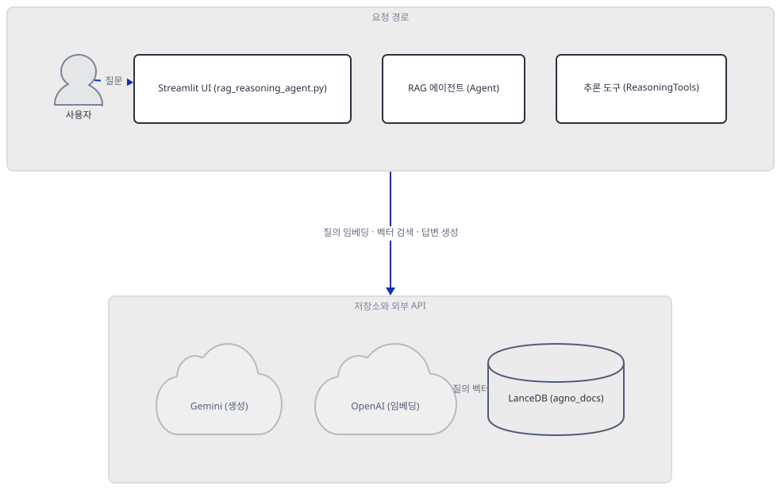
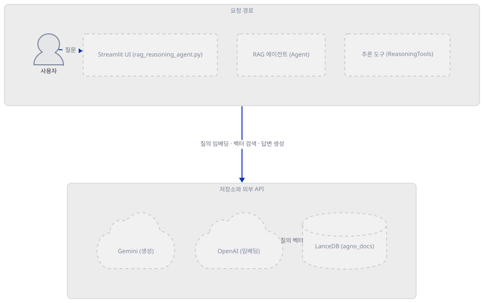
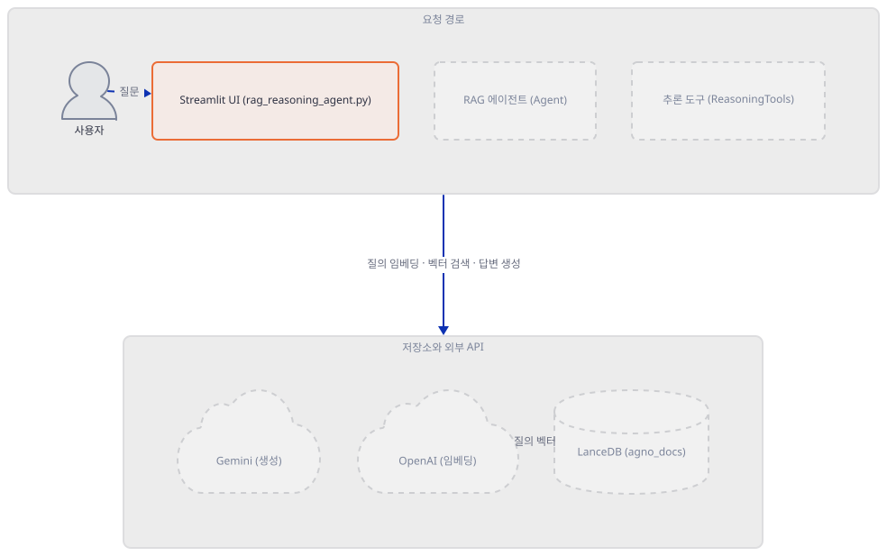
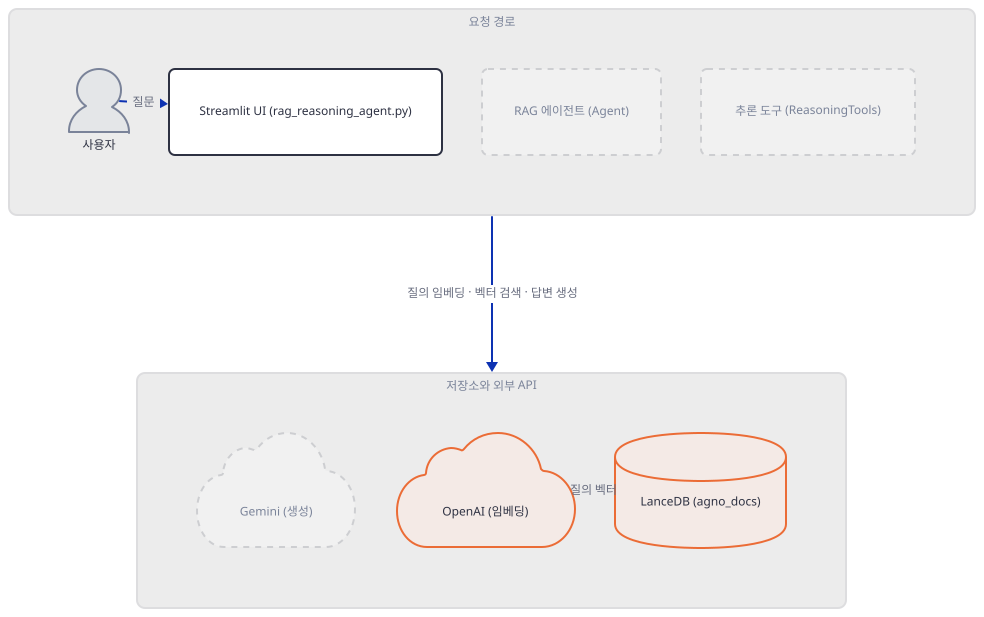
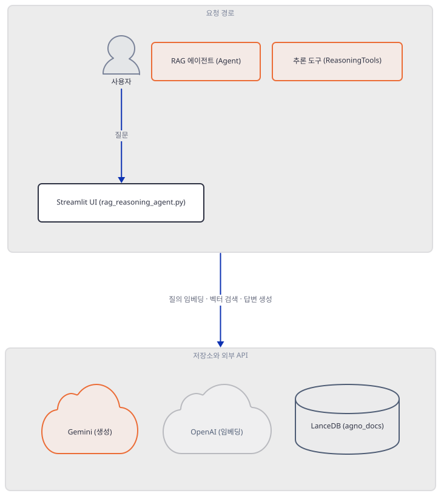
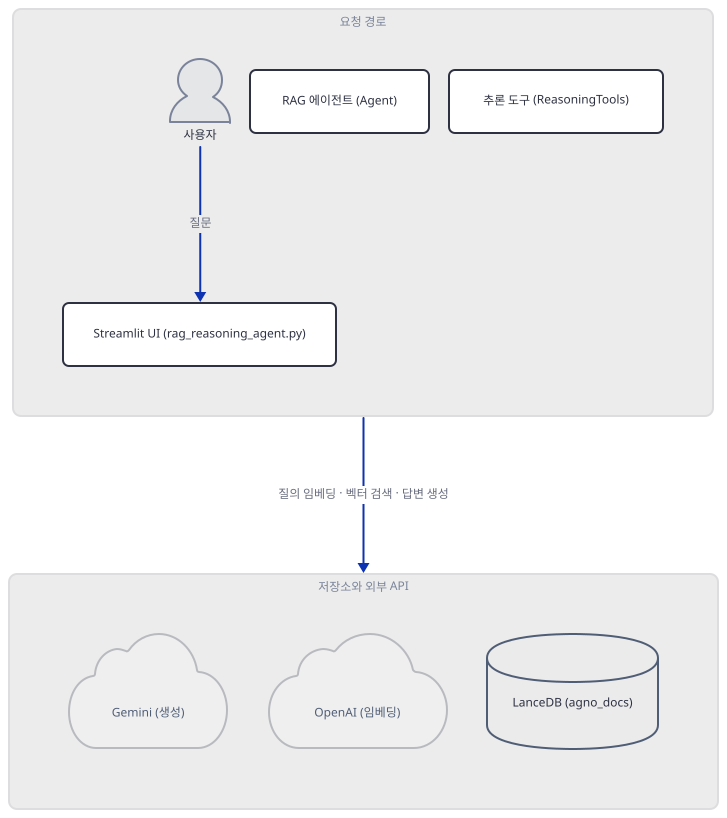
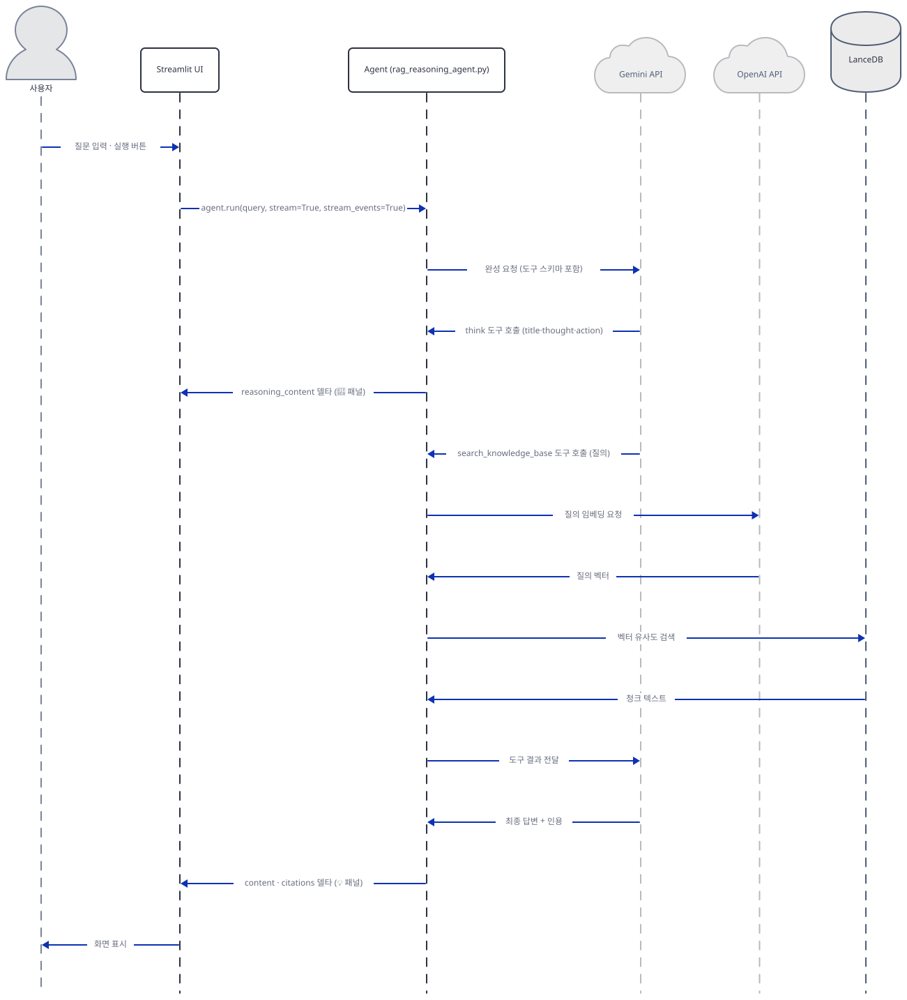

# Day 054 · 🧐 Agentic RAG with Reasoning

> 볼륨 5 📀 RAG · 난이도 ★★☆ · 예상 소요 90분(agno 텔레메트리·Streamlit 외부 IP 조회 등 나가는 네트워크를 짚는 절이 늘어 있습니다) · API 비용 대략 Gemini 2.5 Flash 생성 + OpenAI 텍스트 임베딩, 둘 다 토큰 단위 종량제라 사실상 무료에 가까움(정확한 값은 키가 없어 확인 못함 — 게다가 Step 3에서 보듯 오늘의 agno로는 코드가 두 호출 중 어느 쪽에도 닿지 못합니다) · 원본 앱: `rag_tutorials/agentic_rag_with_reasoning`

## 오늘 만들 것

문서를 청크로 나눠 임베딩하고 저장소에 넣은 뒤, 질문이 오면 같은 방식으로 검색해 답을 만드는 흐름 — Day 047부터 이 볼륨이 반복해 온 것 — 을 오늘은 두 회사가 나눠 맡습니다. 이 앱의 임포트 6개(`rag_tutorials/agentic_rag_with_reasoning/rag_reasoning_agent.py:1-9`, Step 1)가 그 분업을 그대로 보여줍니다: `Gemini(id="gemini-2.5-flash", ...)`가 최종 답변을 생성하고 `OpenAIEmbedder(...)`가 청크와 질의 텍스트를 벡터로 바꾸며, 저장소는 서버가 아니라 이 컴퓨터 로컬 디렉터리에 파일로 남는 LanceDB(임베디드)입니다. 제목의 "Reasoning"이 실제로 더하는 것은 `tools=[ReasoningTools(add_instructions=True)]` 한 줄인데, agno 소스를 따라가 보면 이것은 감춰진 사고 능력이 아니라 `think`·`analyze`라는 평범한 파이썬 함수 두 개를 모델이 부를 수 있는 도구로 등록하는 것뿐이고(소스로 확인, `agno/tools/reasoning.py`), 화면의 "🧠 Reasoning Process" 패널이 보여주는 `reasoning_content`도 — 앱 자신의 README가 "실시간으로 보여주는 사고 과정"이라 표현하는 것과 달리 — Gemini의 별도 사고 채널이 아니라 모델이 그 두 도구를 호출할 때 스스로 써낸 인수(title·thought·action·confidence)를 그대로 정리한 텍스트입니다(소스로 확인, `agno/agent/_response.py`) — Gemini의 진짜 thought summary를 받으려면 `include_thoughts=True` 같은 별도 설정이 필요한데 이 앱은 주지 않습니다. `requirements.txt` 5줄(`streamlit`, `agno>=2.2.10`, `lancedb`, `openai`, `python-dotenv`, 마지막 줄에 개행 없음)을 오늘 설치하면 agno 3.0.10으로 풀리는데(직접 확인, Day 047·051과 같은 버전), 정작 이 파일이 쓰는 `from agno.models.google import Gemini`를 실행하면 `google-genai`가 없다는 `ImportError`로 멈춥니다 — 다섯 줄 중 어디에도 이 패키지가 없습니다(직접 확인, Step 1). 이 하나를 더 설치해 임포트를 전부 통과시켜도, 키 두 개를 다 넣고 URL을 지식 베이스에 넣으려는 순간 `knowledge.add_content(url=url)`(`rag_tutorials/agentic_rag_with_reasoning/rag_reasoning_agent.py:100`)가 `AttributeError`로 멈춥니다 — Day 047이 다른 앱에서 이미 겪은 것과 같은 이유로, 이 메서드는 오늘의 agno에서 `insert`로 이름이 바뀌었습니다(직접 확인). 즉 유효한 키가 둘 다 있어도 이 코드는 Gemini에도 OpenAI에도 닿지 못한 채 멈춥니다. 완성하면(코드를 고치지 않는 한 실제로는 볼 수 없습니다) 왼쪽엔 추론 기록이, 오른쪽엔 답변과 출처가 나란히 스트리밍되는 화면을 보게 됩니다. 아래는 완성된 아키텍처입니다.



## 사전 준비

| 서비스/도구 | 용도 | 발급·설치 |
|---|---|---|
| Google API 키 | `Gemini` 생성 모델 인증 | https://aistudio.google.com/apikey 가입 후 발급 |
| OpenAI API 키 | `OpenAIEmbedder`의 텍스트 임베딩 인증(지식 적재·질의 검색 모두에 쓰임) | https://platform.openai.com 가입 후 발급 |
| uv | 가상환경 생성과 패키지 설치 | [공통 사전 준비](../README.md#공통-사전-준비-한-번만) 절 참고 |
| 인터넷 연결 | PyPI 설치, (키가 있다면) Gemini·OpenAI 호출 — 기본 지식 소스 URL 자체는 Step 3의 버그 때문에 이 문서에서 실제로 가져오지 않음. `agent.run()`마다 agno가 익명 사용 통계를 자체 API(`os-api.agno.com`)로 전송을 시도하는 것도 별개로 있음(Day 050과 같은 agno 3.0.10, 소스로 확인) | 별도 설치 없음 |

## 아키텍처 한눈에 보기

| 컴포넌트 | 역할 | 코드 위치 |
|---|---|---|
| 사용자 | 키 두 개, URL, 질문 입력 | 코드 없음 (브라우저) |
| Streamlit UI | 키 입력 게이트, 지식 소스 사이드바, 질문 입력과 스트리밍 결과 표시 | `rag_tutorials/agentic_rag_with_reasoning/rag_reasoning_agent.py:33-48`, `rag_tutorials/agentic_rag_with_reasoning/rag_reasoning_agent.py:51` |
| RAG 에이전트 (Agent) | 지식 검색·추론 도구 호출 여부 판단, 최종 답변 생성 지시 | `rag_tutorials/agentic_rag_with_reasoning/rag_reasoning_agent.py:76-92` |
| 추론 도구 (ReasoningTools) | `think`·`analyze` 두 도구 등록, 호출 인수를 구조화해 기록 | 소스로 확인, `agno/tools/reasoning.py`(agno 3.0.10) |
| 지식 베이스 (Knowledge) | URL을 청크로 나눠 임베딩 요청, 벡터DB에 적재·검색 | `rag_tutorials/agentic_rag_with_reasoning/rag_reasoning_agent.py:59-73` |
| LanceDB (agno_docs) | 벡터와 원문 청크를 로컬 디렉터리에 저장(임베디드, 서버 없음) | `rag_tutorials/agentic_rag_with_reasoning/rag_reasoning_agent.py:63-71` |
| OpenAI (임베딩) | 청크·질의 텍스트를 1536차원 벡터로 변환 | `rag_tutorials/agentic_rag_with_reasoning/rag_reasoning_agent.py:68-70` |
| Gemini (생성) | 도구 호출 여부 판단, 최종 답변 생성 | `rag_tutorials/agentic_rag_with_reasoning/rag_reasoning_agent.py:80-83` |

## 단계별 진행

### Step 1. 환경 만들기 — 다섯 줄과 빠진 google-genai

**목적.** `requirements.txt` 다섯 줄을 설치하고, 이 파일이 실제로 쓰는 6개 import가 그대로 통과하는지 확인합니다.

**할 일.**

```bash
cd rag_tutorials/agentic_rag_with_reasoning
uv venv
uv pip install -r requirements.txt
```

(pip 대안: `python -m venv .venv && source .venv/bin/activate && pip install -r requirements.txt`. Windows PowerShell은 활성화만 `.venv\Scripts\Activate.ps1`로 바꿉니다.)

이 저장소는 루트에 `pyproject.toml`과 `uv.lock`이 있어 `uv run`이 방금 만든 환경 대신 루트의 `.venv`를 쓰므로, 이후 `uv run` 명령에는 모두 `--no-project`를 붙입니다. 바로 `uv venv`를 실행하면 uv가 관리하는 CPython 3.13.3을 그대로 받습니다(직접 확인) — 이 값은 uv가 캐시해 둔 버전이라 기기마다 다를 수 있으므로, `py` 런처 등 시스템 기본값에 기대지 말고 `uv venv --python 3.13`처럼 명시하는 편이 안전합니다.

`rag_tutorials/agentic_rag_with_reasoning/requirements.txt:1-5`

```text
streamlit
agno>=2.2.10
lancedb
openai
python-dotenv
```

(5줄, 마지막 줄에 개행이 없어 `wc -l`은 4로 셉니다.) 이 문서를 작성하며 설치했을 때는 **agno 3.0.10**, **streamlit 1.64.0**, **lancedb 0.39.0**, **openai(파이썬 패키지) 3.18.0**, **python-dotenv 1.2.3**이 받아졌고, 부수 의존성을 포함해 총 74개 패키지가 설치됐습니다(직접 확인 — 다섯 줄 다 버전 고정이 느슨해 2026-09-23 기준 최신입니다. agno 버전은 Day 047·051과 같습니다). 그런데 이 파일이 실제로 쓰는 6개 import 중 하나가 여기서 막힙니다.

```bash
uv run --no-project python -c "from agno.models.google import Gemini"
```

직접 확인한 출력(발췌):

```
Traceback (most recent call last):
  File "...\agno\utils\gemini.py", line 11, in <module>
    from google.genai.types import (
ModuleNotFoundError: No module named 'google.genai'

During handling of the above exception, another exception occurred:

Traceback (most recent call last):
  File "...\agno\models\google\gemini.py", line 25, in <module>
    from agno.utils.gemini import (
  File "...\agno\utils\gemini.py", line 20, in <module>
    raise ImportError("`google-genai` not installed. Please install it using `pip install google-genai`")
ImportError: `google-genai` not installed. Please install it using `pip install google-genai`
```

agno 3.0.10의 `agno.models.google.gemini` 모듈은 로드되자마자 `google-genai` SDK를 요구하는데, 다섯 줄짜리 `requirements.txt`에는 이 패키지가 없습니다 — Day 047이 `Ollama` 모델 클래스에서, Day 051이 벡터 저장소 자체의 부재에서 각각 다른 모양으로 겪은 것과 같은 종류의 "임포트가 조용히 요구하는데 목록엔 없는" 문제입니다. 설치하면 나머지 5개 import까지 전부 통과합니다.

```bash
uv pip install google-genai
```

(`google-auth`, `cryptography` 등 딸린 의존성 9개가 함께 설치되어 총 83개가 됩니다, 직접 확인.)

**그림.**



**확인.** 여섯 줄 import가 전부 통과하는지 마지막으로 확인합니다.

```bash
uv run --no-project python -c "
from agno.agent import Agent
from agno.knowledge.embedder.openai import OpenAIEmbedder
from agno.knowledge.knowledge import Knowledge
from agno.models.google import Gemini
from agno.tools.reasoning import ReasoningTools
from agno.vectordb.lancedb import LanceDb, SearchType
print('ALL IMPORTS OK')
"
```

```
ALL IMPORTS OK
```

### Step 2. 두 개의 키, 하나의 문 — 두 벤더의 서로 다른 일

**목적.** API 키 입력 두 칸과 `if google_key and openai_key:` 게이트가 실제로 무엇을 막는지 확인합니다.

**할 일.**

`rag_tutorials/agentic_rag_with_reasoning/rag_reasoning_agent.py:33-48`

```python
st.subheader("🔑 API Keys")
col1, col2 = st.columns(2)
with col1:
    google_key = st.text_input(
        "Google API Key", 
        type="password",
        value=os.getenv("GOOGLE_API_KEY", ""),
        help="Get your key from https://aistudio.google.com/apikey"
    )
with col2:
    openai_key = st.text_input(
        "OpenAI API Key", 
        type="password",
        value=os.getenv("OPENAI_API_KEY", ""),
        help="Get your key from https://platform.openai.com/"
    )
```

두 칸 다 사이드바가 아니라 화면 본문에 두 컬럼으로 나란히 있습니다(사이드바는 뒤에서 보듯 URL 관리 전용입니다). `type="password"`라 값이 가려질 뿐, 이 시점에는 아무 검증도 일어나지 않습니다.

`rag_tutorials/agentic_rag_with_reasoning/rag_reasoning_agent.py:50-51`

```python
# Check if API keys are provided
if google_key and openai_key:
```

이 한 줄짜리 게이트가 이 파일의 실질적인 로직 전부(지식 베이스 생성부터 답변 스트리밍까지)를 감쌉니다. 둘 중 하나만 있어도 이 블록은 통째로 건너뛰고 else로 갑니다.

`rag_tutorials/agentic_rag_with_reasoning/rag_reasoning_agent.py:220-232`

```python
else:
    # Show instructions if API keys are missing
    st.info("""
    👋 **Welcome! To use this app, you need:**
    
    1. **Google API Key** - For Gemini AI model
       - Sign up at [aistudio.google.com](https://aistudio.google.com/apikey)
    
    2. **OpenAI API Key** - For embeddings
       - Sign up at [platform.openai.com](https://platform.openai.com/)
    
    Once you have both keys, enter them above to start!
    """)
```

두 벤더는 서로 다른 일을 하고 서로 다른 기준으로 과금됩니다 — `Gemini`는 답변을 생성하며 입출력 토큰 단위로, `OpenAIEmbedder`는 텍스트를 벡터로 바꾸며 임베딩 토큰 단위로 과금됩니다(둘 다 키가 없어 실제 청구액은 확인 못함). 이 게이트는 "일단 Gemini만으로 채팅해 보기"나 "일단 임베딩만 인덱싱해 두기" 같은 절반의 실행을 허용하지 않습니다 — 아래 확인처럼 하나만 넣으면 두 클라이언트 모두 만들어지지 않습니다.

**그림.**



**확인.** Google 키만 채우고 OpenAI 키는 비워 둔 채 이 파일을 그대로 실행해, `Gemini`도 `OpenAIEmbedder`도 생성되지 않는다는 것을 확인합니다(두 생성자를 예외를 던지도록 바꿔치기해 실제로 호출되지 않는지 봅니다 — 네트워크 없음).

```bash
uv run --no-project python -c "
import contextlib
import streamlit as st
from agno.models.google import Gemini
from agno.knowledge.embedder.openai import OpenAIEmbedder

class Ctx:
    def __enter__(self): return self
    def __exit__(self, *a): return False

st.set_page_config = lambda **k: None
st.title = st.markdown = st.subheader = st.divider = lambda *a, **k: None
st.columns = lambda *a, **k: (Ctx(), Ctx())
st.expander = lambda *a, **k: contextlib.nullcontext()
st.info = lambda *a, **k: print('else branch reached: only the info banner is shown')

answers = iter(['fake-google-key', ''])
st.text_input = lambda *a, **k: next(answers)

def guard(name):
    def _raise(self, *a, **k):
        raise AssertionError(name + ' constructed with only one key!')
    return _raise
Gemini.__init__ = guard('Gemini')
OpenAIEmbedder.__init__ = guard('OpenAIEmbedder')

import runpy
runpy.run_path('rag_reasoning_agent.py')
print('OK: neither client was constructed')
"
```

직접 확인한 출력:

```
else branch reached: only the info banner is shown
OK: neither client was constructed
```

### Step 3. 지식 베이스 — LanceDB(임베디드)·SearchType.vector, 그리고 사라진 add_content

**목적.** `load_knowledge()`가 실제로 무엇을 만드는지, `search_type=SearchType.vector`가 무엇을 고르는지, 그리고 URL을 넣는 줄이 오늘의 agno에서도 여전히 동작하는지 확인합니다.

**할 일.**

`rag_tutorials/agentic_rag_with_reasoning/rag_reasoning_agent.py:59-73`

```python
    # Initialize knowledge base (cached to avoid reloading)
    @st.cache_resource(show_spinner="📚 Loading knowledge base...")
    def load_knowledge() -> Knowledge:
        """Load and initialize the knowledge base with vector database"""
        kb = Knowledge(
            vector_db=LanceDb(
                uri="tmp/lancedb",
                table_name="agno_docs",
                search_type=SearchType.vector,  # Use vector search
                embedder=OpenAIEmbedder(
                    api_key=openai_key
                ),
            ),
        )
        return kb
```

`uri="tmp/lancedb"`는 서버 주소가 아니라 실행 위치 기준 상대 디렉터리입니다 — LanceDB는 Qdrant(Day 047)처럼 별도 서버에 접속하는 것이 아니라 이 디렉터리에 파일로 쓰는 임베디드 라이브러리입니다. `OpenAIEmbedder(api_key=openai_key)`는 생성 시점에 클라이언트를 만들지 않습니다 — `client` 프로퍼티가 처음 쓰일 때에야 `OpenAI(...)`를 만들고(소스로 확인, `agno/knowledge/embedder/openai.py`), `id`를 주지 않으면 `"text-embedding-3-small"`에 1536차원이 기본값입니다(같은 파일, `__post_init__`). `search_type=SearchType.vector`는 `agno.vectordb.search.SearchType`(값은 `vector`·`keyword`·`hybrid` 셋, 소스로 확인)의 한 값을 고른 것인데, 사실 `LanceDb` 생성자 자체의 기본값이 이미 `SearchType.vector`라 이 인자는 주석이 밝히듯 "쓰겠다는 명시"일 뿐 값을 바꾸지는 않습니다(소스로 확인, `agno/vectordb/lancedb/lance_db.py`). 이 값이 실제로 고르는 동작은 `vector_search()`입니다 — 질의 텍스트를 `OpenAIEmbedder`로 벡터화한 뒤 LanceDB 테이블에 코사인 유사도 ANN 검색만 겁니다. 반면 `keyword_search()`는 임베딩 호출 없이 LanceDB의 전문검색(FTS) 인덱스만 쓰고, `hybrid_search()`는 임베딩과 FTS 인덱스를 둘 다 쓴 뒤 결과를 합칩니다(모두 소스로 확인, 같은 파일). 즉 이 앱에서 `SearchType.vector`를 고른다는 것은 "매 질의마다 OpenAI 임베딩 호출 1회 + 로컬 벡터 검색"을 뜻하고, 키워드 인덱스 구축 비용은 치르지 않는 대신 OpenAI 호출 없이는 검색 자체가 안 된다는 뜻이기도 합니다.

`rag_tutorials/agentic_rag_with_reasoning/rag_reasoning_agent.py:94-101`

```python
    # Load knowledge and agent
    knowledge = load_knowledge()
    
    # Load initial URLs if any (only load once per URL)
    for url in st.session_state.knowledge_urls:
        if url not in st.session_state.urls_loaded:
            knowledge.add_content(url=url)
            st.session_state.urls_loaded.add(url)
```

`Knowledge(vector_db=...)`는 생성 시점에 곧바로 `vector_db.exists()`를 확인해 없으면 `create()`를 부릅니다(소스로 확인, `agno/knowledge/knowledge.py`의 `__post_init__`) — Day 047의 Qdrant가 같은 지점에서 연결 거부로 멈췄던 것과 같은 코드 경로지만, LanceDB는 로컬 파일이라 서버 없이도 성공합니다. 문제는 바로 다음 줄입니다 — `knowledge.add_content(url=url)`의 `add_content`가 agno 3.0.10의 `Knowledge`에는 없습니다. Day 047이 `local_rag_agent.py`에서 이미 겪은 것과 정확히 같은 이유로, 이 메서드는 `insert`로 이름이 바뀌었습니다(직접 확인, 아래) — 이번엔 다른 앱에서 독립적으로 재확인한 셈입니다.

**그림.**



**확인.** 이 파일을 키 두 개(둘 다 가짜 문자열)로 그대로 실행해, `add_content` 호출에서 무슨 일이 나는지 봅니다 — `Knowledge`/`LanceDb` 생성과 URL 목록 조회까지는 실제로 실행되고 네트워크 요청 없이 로컬 파일만 만들어지며, `add_content` 자체는 속성을 찾다가 즉시 실패하므로 URL을 실제로 가져오지는 않습니다.

```bash
uv run --no-project python -c "
import streamlit as st

class Ctx:
    def __enter__(self): return self
    def __exit__(self, *a): return False

class FakeSessionState(dict):
    def __getattr__(self, k):
        try: return self[k]
        except KeyError: raise AttributeError(k)
    def __setattr__(self, k, v): self[k] = v

st.set_page_config = lambda **k: None
st.title = st.markdown = st.subheader = st.divider = lambda *a, **k: None
st.columns = lambda *a, **k: tuple(Ctx() for _ in range(2))
st.session_state = FakeSessionState()
st.cache_resource = lambda *a, **k: (lambda f: f)

answers = iter(['fake-google-key', 'fake-openai-key'])
st.text_input = lambda *a, **k: next(answers)

import runpy
try:
    runpy.run_path('rag_reasoning_agent.py')
except AttributeError as e:
    print('AttributeError:', e)
"
```

직접 확인한 출력(마지막 세 줄, 로컬 경로와 타임스탬프는 실행 위치·시각에 따라 달라집니다):

```
INFO    Creating table: agno_docs
[...] WARN  lance::dataset::write::insert] No existing dataset at .../tmp/lancedb/agno_docs.lance, it will be created
AttributeError: 'Knowledge' object has no attribute 'add_content'
```

(마지막 줄만 결정적입니다 — 유효한 키를 넣어도 이 지점은 똑같이 멈춥니다.)

### Step 4. 에이전트와 추론 도구 — ReasoningTools의 정체와 "Reasoning Process" 패널

**목적.** `load_agent()`가 무엇을 묶는지, `ReasoningTools`가 기계적으로 무엇인지, `add_instructions=True`가 무엇을 바꾸는지, 그리고 화면의 "🧠 Reasoning Process" 패널이 실제로 무엇을 보여주는지 확인합니다.

**할 일.**

`rag_tutorials/agentic_rag_with_reasoning/rag_reasoning_agent.py:76-92`

```python
    @st.cache_resource(show_spinner="🤖 Loading agent...")
    def load_agent(_kb: Knowledge) -> Agent:
        """Create an agent with reasoning capabilities"""
        return Agent(
            model=Gemini(
                id="gemini-2.5-flash", 
                api_key=google_key
            ),
            knowledge=_kb,
            search_knowledge=True,  # Enable knowledge search
            tools=[ReasoningTools(add_instructions=True)],  # Add reasoning tools
            instructions=[
                "Include sources in your response.",
                "Always search your knowledge before answering the question.",
            ],
            markdown=True,  # Enable markdown formatting
        )
```

`Gemini(id="gemini-2.5-flash", api_key=google_key)`도 생성 시점엔 아무 것도 하지 않습니다 — agno의 `Gemini.get_client()`가 `genai.Client(...)`를 만드는 것은 실제 호출 직전이라(소스로 확인, `agno/models/google/gemini.py`), 생성 직후 `.client` 속성은 아직 `None`입니다(직접 확인). 참고로 agno 3.0.10의 `Gemini` 클래스 자체 기본 `id`는 `"gemini-3.7-flash"`인데(소스로 확인, 같은 파일) 이 앱은 `"gemini-2.5-flash"`를 명시해 그보다 이전 모델을 콕 집습니다.

`ReasoningTools`는 `agno.tools.Toolkit`을 상속한 클래스로, 생성자가 하는 일은 `think`와 `analyze`라는 평범한 파이썬 메서드 두 개를 `tools=[self.think, self.analyze]`로 등록하는 것뿐입니다(소스로 확인, `agno/tools/reasoning.py`). `think`를 호출하면 모델이 넘긴 `title`·`thought`·`action`·`confidence` 인수를 `ReasoningStep`이라는 레코드에 담아 세션 상태에 쌓고, 지금까지 쌓인 단계를 사람이 읽을 문자열로 정리해 도구의 반환값으로 돌려줍니다 — `analyze`도 `result`·`analysis`·`next_action` 인수로 같은 일을 합니다. 즉 "추론"은 이 도구 안에서 계산되는 것이 아니라, 모델이 도구를 호출할 때 스스로 써낸 텍스트를 이 도구가 구조화해 되돌려주는 것입니다. `instructions` 안내문(어떤 순서로 `think`→`analyze`를 부르라는 지시)은 `add_instructions` 값과 무관하게 생성자에서 항상 만들어지지만(소스로 확인), 이 안내문이 실제로 에이전트의 지시문에 합쳐지는지는 `add_instructions`가 결정합니다(소스로 확인, `agno/tools/toolkit.py`) — 기본값은 `False`이고, 이 앱은 명시적으로 `True`를 줍니다.

`rag_tutorials/agentic_rag_with_reasoning/rag_reasoning_agent.py:182-195`

```python
            # Stream the agent's response
            with st.spinner("🔍 Searching and reasoning..."):
                for chunk in agent.run(
                    query,
                    stream=True,  # Enable streaming
                    stream_events=True,  # Stream all events including reasoning
                ):
                    # Update reasoning display
                    if hasattr(chunk, 'reasoning_content') and chunk.reasoning_content:
                        reasoning_text = chunk.reasoning_content
                        reasoning_placeholder.markdown(
                            reasoning_text, 
                            unsafe_allow_html=True
                        )
```

"🧠 Reasoning Process" 패널은 이 `chunk.reasoning_content`를 그대로 마크다운으로 그립니다. agno에서 `reasoning_content`가 채워지는 경로는 둘입니다(소스로 확인) — (1) Gemini 응답의 `part.thought`가 참인 텍스트 조각을 그대로 옮기는 경로(`agno/models/google/gemini.py`)와, (2) 도구 호출 이름이 정확히 `"think"`나 `"analyze"`일 때 그 인수를 `"## {title}\n{thought}\n..."` 형식으로 정리해 이어 붙이는 `update_reasoning_content_from_tool_call()`(`agno/agent/_response.py`, 하드코딩된 이름 검사)입니다. (1)번 경로는 `Gemini(...)`에 `thinking_budget`·`include_thoughts`·`thinking_level` 중 하나라도 줘야 `ThinkingConfig`가 만들어져 열리는데(소스로 확인, 같은 파일), 이 앱의 `Gemini(id="gemini-2.5-flash", api_key=google_key)`는 셋 다 주지 않습니다. 따라서 이 앱이 실제로 돌아간다면 패널에 나타날 수 있는 것은 (2)번뿐입니다 — Gemini 자신의 사고 채널이 아니라, 모델이 `think`/`analyze` 도구를 호출하며 스스로 작성한 인수의 정리본입니다. 앱 자신의 README(`rag_tutorials/agentic_rag_with_reasoning/README.md:19`)가 이를 "Real-time display of the agent's thinking steps"라 표현하는 것과는 결이 다릅니다 — "실시간"은 맞지만(스트리밍 델타로 옴), "사고 과정"은 감춰진 것이 아니라 도구 호출 인수 그 자체입니다.

**그림.**



**확인.** 두 사실을 키 없이, 오프라인으로 각각 재현합니다. 먼저 `ReasoningTools`가 등록하는 도구와 `add_instructions`의 효과.

```bash
uv run --no-project python -c "
from agno.tools.reasoning import ReasoningTools
rt_on = ReasoningTools(add_instructions=True)
rt_off = ReasoningTools()
print('functions:', list(rt_on.functions.keys()))
print('add_instructions=True  ->', rt_on.add_instructions)
print('add_instructions=False(기본값) ->', rt_off.add_instructions)
"
```

```
functions: ['think', 'analyze']
add_instructions=True  -> True
add_instructions=False(기본값) -> False
```

다음으로 `think`/`analyze` 도구 호출이 `reasoning_content`에 실제로 어떤 텍스트를 남기는지, agno의 같은 내부 함수를 직접 불러 확인합니다.

```bash
uv run --no-project python -c "
from agno.run.agent import RunOutput
from agno.agent._response import update_reasoning_content_from_tool_call

run_response = RunOutput(run_id='test-run')
update_reasoning_content_from_tool_call(
    agent=None, run_response=run_response, tool_name='think',
    tool_args={'title': 'Plan', 'thought': 'Need to check the knowledge base for MCP vs A2A', 'action': 'search_knowledge_base', 'confidence': 0.9},
)
update_reasoning_content_from_tool_call(
    agent=None, run_response=run_response, tool_name='analyze',
    tool_args={'title': 'Evaluate results', 'result': 'Found 2 relevant chunks', 'analysis': 'Enough context to answer', 'next_action': 'final_answer', 'confidence': 0.95},
)
print(run_response.reasoning_content)
"
```

직접 확인한 출력:

```
## Plan
Need to check the knowledge base for MCP vs A2A
Action: search_knowledge_base
Confidence: 0.9

## Evaluate results
Result: Found 2 relevant chunks
Enough context to answer
Next Action: final_answer
Confidence: 0.95

```

(`title`·`thought`·`action`·`confidence`는 제가 임의로 채운 예시값입니다 — 실제 실행에서는 모델이 이 값을 직접 씁니다. `agent=None`이 통하는 이유는 이 함수 본문이 `agent` 인자를 쓰지 않기 때문입니다, 소스로 확인.)

### Step 5. 스트리밍 응답과 출처 — 실행까지

**목적.** 답변과 출처가 화면에 어떻게 쌓이는지, 그리고 이 앱이 지금 상태로 어디까지 뜨는지 확인합니다.

**할 일.**

`rag_tutorials/agentic_rag_with_reasoning/rag_reasoning_agent.py:196-208`

```python
                    
                    # Update answer display
                    if hasattr(chunk, 'content') and chunk.content and isinstance(chunk.content, str):
                        answer_text += chunk.content
                        answer_placeholder.markdown(
                            answer_text, 
                            unsafe_allow_html=True
                        )
                    
                    # Collect citations
                    if hasattr(chunk, 'citations') and chunk.citations:
                        if hasattr(chunk.citations, 'urls') and chunk.citations.urls:
                            citations = chunk.citations.urls
```

같은 스트림 루프 안에서 `content`는 답변 텍스트에 이어 붙고, `citations.urls`는 통째로 교체됩니다. 사이드바(`rag_tutorials/agentic_rag_with_reasoning/rag_reasoning_agent.py:106-134`)는 이 흐름과 별개로 URL을 추가하는 화면이고, 추천 프롬프트 세 개(`rag_tutorials/agentic_rag_with_reasoning/rag_reasoning_agent.py:140-151`)는 질문 입력창의 기본값을 바꿔치기할 뿐입니다. Step 2~4가 보여준 순서대로면 키 두 개를 넣는 순간 지식 베이스 로딩이 시작되고, Step 3의 `AttributeError`가 그 자리에서 화면 전체를 처리되지 않은 예외로 멈춥니다 — 즉 유효한 키가 있어도 이 스트리밍 루프에는 도달하지 못합니다. 이 앱을 실제로 끝까지 보려면 리포 코드를 고쳐 `add_content`를 `insert`로 바꿔야 합니다(더 해보기 참고).

**그림.**



**확인.** 키 없이도 서버 자체는 뜹니다.

```bash
uv run --no-project streamlit run rag_reasoning_agent.py --server.headless true
```

다른 터미널에서:

```bash
curl -s -o /dev/null -w "%{http_code}\n" http://localhost:8501
```

```
200
```

(PowerShell이면 `curl` 대신: `(Invoke-WebRequest -Uri http://localhost:8501 -UseBasicParsing).StatusCode`. HTTP 200은 직접 확인. 다만 이 명령이 "네트워크 없음"은 아닙니다 — 다만 그 원인은 흔히 말하는 사용 통계 쪽이 아닙니다. `browser.gatherUsageStats`(기본값 `True`)는 옵션 정의일 뿐이고, 실제 전송 주소 `data.streamlit.io/metrics.json`은 프런트엔드 JS 번들 안에 있어 **브라우저가 화면을 열 때** 나가지, `curl`처럼 헤드리스로 서버만 두드릴 때는 나가지 않습니다(소스로 확인 — 이 문자열은 `streamlit/static/` 번들에만 있고 파이썬 쪽 코드에는 없습니다). 이 명령으로 실제 나가는 것은 헤드리스 기동 자체가 시도하는 외부 IP 조회입니다 — `net_util.py`가 `checkip.amazonaws.com`에 접속해 이 컴퓨터의 외부 IP를 알아내려 합니다(소스로 확인, `streamlit/net_util.py`·`streamlit/web/bootstrap.py`). 이 앱의 API 키와는 무관하게 `streamlit run`을 실행하는 순간부터입니다.)

## 요청 한 건이 흐르는 과정



이 그림은 Step 3의 `add_content` 버그가 고쳐졌다고 가정하고, 소스를 따라가며 이어붙인 의도된 흐름입니다 — 키가 없을뿐더러 지식 베이스 자체를 채울 수 없어 처음부터 끝까지 한 번에 재현하지는 못했습니다. 사용자가 질문을 입력하고 실행 버튼을 누르면 `agent.run(query, stream=True, stream_events=True)`가 호출되고, 에이전트는 도구 스키마(`think`·`analyze`·`search_knowledge_base`)를 포함해 Gemini에 완성을 요청합니다. Gemini가 먼저 `think`를 호출하면 그 인수가 Step 4에서 본 것처럼 정리되어 "🧠 Reasoning Process" 패널에 스트리밍되고, 이어서 `search_knowledge_base`를 호출하기로 판단하면 에이전트는 로컬에서 두 단계를 밟습니다 — 질의 텍스트를 OpenAI에 보내 벡터를 받고, 그 벡터로 LanceDB를 로컬 검색해 청크 원문을 얻습니다(이 왕복만 OpenAI로 나가고, 검색 자체는 이 컴퓨터 안에서 끝납니다). 청크 텍스트가 도구 결과로 Gemini에 돌아가면 Gemini는 그것을 근거로 최종 답변과 출처를 만들고, 답변 텍스트와 인용은 "💡 답변" 패널에 스트리밍됩니다. 지식 소스의 원문(적재 시점)과 사용자의 질문(질의 시점) 모두 결국 OpenAI로 한 번씩 나가고, 검색된 청크 원문은 Gemini로도 나갑니다 — 벡터 자체만 이 컴퓨터에 남습니다. 여기에 이 그림이 안 그리는 나감이 하나 더 있습니다 — `agent.run()`이 끝날 때마다(스트리밍 여부와 무관하게) agno가 에이전트 id·모델 provider/이름·도구·지식 베이스 사용 여부 같은 익명 메타데이터를 자체 API(`https://os-api.agno.com`)로 전송을 시도합니다(소스로 확인, `agno/agent/_run.py`의 `log_agent_telemetry()` 호출과 `agno/agent/_telemetry.py`의 전송 필드, `agno/api/settings.py`의 URL — Day 050이 같은 agno 3.0.10에서 이미 확인한 것과 같습니다). 끄려면 `Agent(telemetry=False)`나 환경변수 `AGNO_TELEMETRY=false`를 씁니다. 참고로 Step 3의 "네트워크 요청 없이"는 이 텔레메트리와 무관하게 맞습니다 — `Knowledge`·`LanceDb` 생성까지는 `agent.run()` 자체가 아직 호출되지 않아 시도 0건이었습니다(직접 확인).

## 실행 체크리스트

- [ ] `uv venv && uv pip install -r requirements.txt`만으로는 `from agno.models.google import Gemini`가 실패하고, `google-genai`를 따로 설치해야 6개 임포트가 전부 성공한다는 것을 확인했다
- [ ] `Gemini`는 생성(토큰 단위 과금), `OpenAIEmbedder`는 임베딩(임베딩 토큰 단위 과금)을 맡는 서로 다른 벤더이고, 키를 하나만 넣으면 `if google_key and openai_key:` 게이트에 막혀 둘 다 만들어지지 않는다는 것을 실행으로 확인했다
- [ ] LanceDB가 서버가 아니라 `uri="tmp/lancedb"` 로컬 디렉터리에 쓰는 임베디드 저장소이고, `search_type=SearchType.vector`가 `LanceDb` 생성자 자체의 기본값과 같다는 것을 소스로 확인했다
- [ ] `knowledge.add_content(url=url)`가 오늘의 agno(3.0.10)에서 `AttributeError`로 멈춘다는 것을 직접 실행으로 확인했다 — 유효한 키가 있어도 이 지점을 넘지 못한다
- [ ] `ReasoningTools`가 `think`·`analyze` 두 개의 평범한 파이썬 함수를 도구로 등록할 뿐이고, `add_instructions=True`가 안내문을 실제로 지시문에 합칠지를 결정한다는 것을 소스와 직접 실행으로 확인했다
- [ ] "🧠 Reasoning Process" 패널의 `reasoning_content`가 (이 앱의 설정에서는) Gemini의 별도 사고 채널이 아니라 `think`/`analyze` 도구 호출 인수를 정리한 텍스트라는 것을 오프라인으로 재현했다
- [ ] `streamlit run rag_reasoning_agent.py`가 키 없이도 HTTP 200으로 뜨지만, Streamlit 자체의 사용 통계 전송은 기본적으로 켜져 있어 이 실행이 네트워크와 완전히 무관하지는 않다는 것을 확인했다

## 문제 해결

| 증상 | 원인 | 해결 |
|---|---|---|
| `from agno.models.google import Gemini`가 ``ImportError: `google-genai` not installed``로 실패 | `requirements.txt` 5줄에 `google-genai`가 없음(직접 확인, Step 1) | `uv pip install google-genai` |
| 키를 둘 다 넣어도 지식 베이스 로딩 중 `AttributeError: 'Knowledge' object has no attribute 'add_content'`로 화면이 멈춤 | agno 3.0.10에서 메서드 이름이 `insert`로 바뀜(Day 047과 같은 원인, 직접 확인, Step 3) | 리포 코드는 고치지 않는 것이 이 시리즈의 방침 — 직접 재현하려면 `add_content(url=url)`을 `insert(url=url)`로 바꿔 호출 |
| 키를 하나만 넣으면 화면이 안내 문구만 보여주고 그대로 멈춘 것처럼 보임 | `if google_key and openai_key:` 게이트가 둘 다 있어야 아래 블록 전체를 실행함(직접 확인, Step 2) | 두 키 모두 입력 |
| 앱을 실행할 때마다 지식 베이스가 다시 로딩되거나 이전 데이터를 못 찾음 | `uri="tmp/lancedb"`가 실행 위치 기준 상대 경로라, 다른 디렉터리에서 실행하면 매번 새 위치에 생김(소스로 확인, Step 3) | 항상 `rag_tutorials/agentic_rag_with_reasoning` 폴더에서 실행 |

## 더 해보기

- `rag_tutorials/agentic_rag_with_reasoning/rag_reasoning_agent.py:100`의 `add_content(url=url)`를 agno 3.0.10의 `insert(url=url)`로 바꾸고, 실제 키가 있다면 지식 베이스가 채워지는지, 이어서 `search_type=SearchType.keyword`로 바꿔 임베딩 호출 없이도 검색되는지 비교해보기.
- `rag_tutorials/agentic_rag_with_reasoning/rag_reasoning_agent.py:80-83`의 `Gemini(...)`에 `include_thoughts=True`를 추가해, "🧠 Reasoning Process" 패널에 `think`/`analyze` 기록 대신(또는 함께) Gemini 자신의 thought summary가 섞여 들어오는지 관찰해보기.
- `rag_tutorials/agentic_rag_with_reasoning/rag_reasoning_agent.py:86`의 `ReasoningTools(add_instructions=True)`를 `add_instructions=False`로 바꿔, 도구는 여전히 등록된 채로 모델이 스스로 `think`/`analyze`를 부르는 빈도가 달라지는지 실험해보기.

## 다음 날 예고

[Day 055 · 🖥️ Local Hybrid Search RAG](../day055-local-hybrid-search-rag/README.md) — RAGLite와 llama-cpp-python으로 생성과 임베딩 모두 로컬 GGUF 모델로 돌리고, 하이브리드 검색과 FlashRank 재순위화까지 붙인 RAG를 다룹니다. 추론은 로컬이지만, import 시점에 FlashRank 모델과 litellm 비용표를 내려받는 등 완전히 오프라인은 아닙니다.
