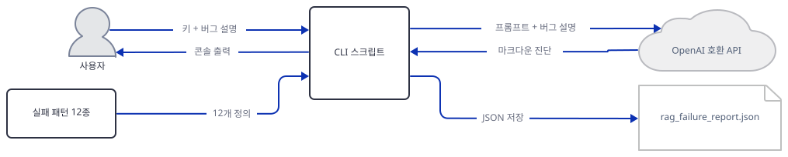
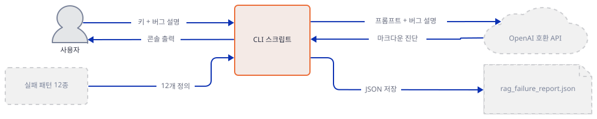
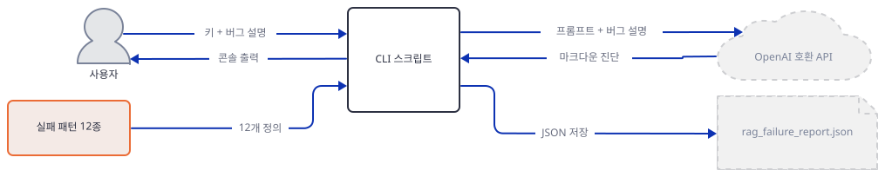
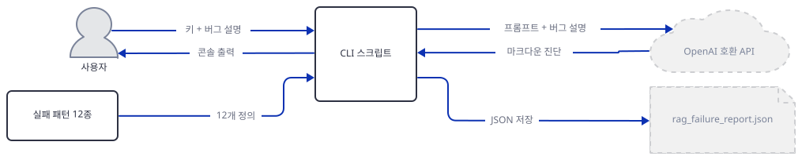
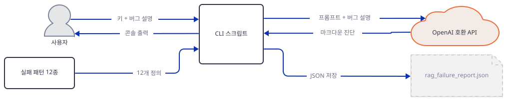
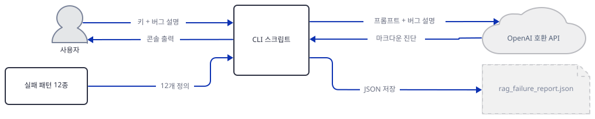
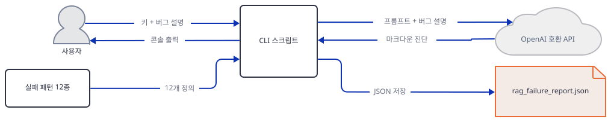
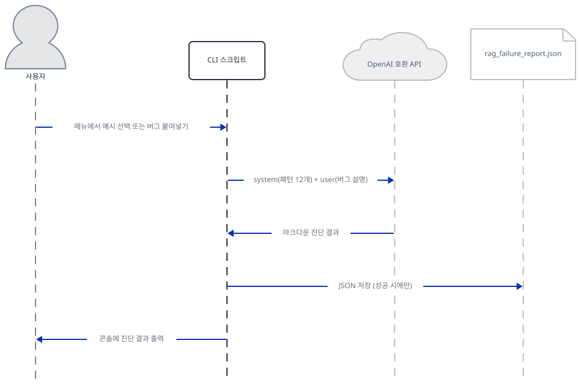

# Day 056 · 🩺 RAG Failure Diagnostics Clinic

> 볼륨 5 📀 RAG · 난이도 ★★☆ · 예상 소요 70분 · API 비용 대략 진단 1건에 GPT-4o 채팅 완성 1회 분, 대략치(키가 없어 실제 과금은 확인 못함) — `OPENAI_BASE_URL`을 다른 호환 엔드포인트로 돌리면 비용 없는 실행도 가능 · 원본 앱: `rag_tutorials/rag_failure_diagnostics_clinic`

## 오늘 만들 것

지난 9일은 전부 검색 파이프라인을 조립했습니다. 오늘은 파이프라인을 하나도 만들지 않습니다. 의존성은 `openai>=1.6.0` 한 줄뿐이고(이 문서를 쓰며 설치했을 때는 **openai 3.18.0**이 나머지 13개 패키지와 함께 받아졌습니다, 직접 확인), 벡터 저장소도 임베딩도 Streamlit도 없습니다. 완성물은 299줄짜리 커맨드라인 스크립트 하나로, 사용자가 겪은 버그를 문장으로 묘사하면 모델에게 그 문장을 12개의 이름 붙은 실패 패턴(P01~P12, `rag_tutorials/rag_failure_diagnostics_clinic/rag_failure_diagnostics_clinic.py:16-77`) 중 하나로 분류시키고 근거와 최소 수정안을 받아 `rag_failure_report.json`에 저장합니다. `build_system_prompt()`(`rag_tutorials/rag_failure_diagnostics_clinic/rag_failure_diagnostics_clinic.py:137-168`)는 이 12개 패턴을 하나도 빠짐없이 id·이름·한줄 요약째로 시스템 프롬프트에 통째로 밀어넣지만, 응답 형식을 강제하는 장치 — JSON 스키마도, 함수 호출(tool/function calling)도 — 는 어디에도 없습니다(소스로 확인). "Primary pattern / Secondary candidates / Reasoning / Minimal structural fix" 네 섹션은 그저 프롬프트 문장으로 부탁할 뿐입니다. 그래서 이 도구가 실제로 보는 것은 인덱스도 로그도 트레이스도 아니라 사용자가 타이핑한 문장 그 자체뿐입니다 — 검색이 정말 있었는지, 벡터가 정말 그 값이었는지 이 스크립트는 확인할 방법이 없고 오직 사용자의 서술을 신뢰합니다. 흥미로운 지점은 이 12개 이름표를 앞선 6일(Day 047~052)이 실제로 겪은 결함에 대어 보면 몇 개는 정확히 들어맞고 몇 개는 이름만 비슷할 뿐 실제로는 다르다는 것인데, 자세한 대조는 Step 2에 모아 뒀습니다. 키가 없는 독자에게 중요한 사실 하나 — `make_client_and_model()`(`rag_tutorials/rag_failure_diagnostics_clinic/rag_failure_diagnostics_clinic.py:171-183`)이 `OPENAI_API_KEY`가 없으면 `getpass()`로 터미널을 막지만, 그건 `main()`이 이 함수를 부른 뒤의 일입니다. `PATTERNS`와 `build_system_prompt()`는 그 앞에 있는 순수 파이썬이라 키도 네트워크도 없이 그대로 실행되고 12개 패턴 전문을 그대로 보여줍니다(직접 확인, Step 1·3) — 이 문서 대부분의 확인이 여기 서 있습니다. 기본값도 짚어 둘 만합니다 — 키를 주지 않으면 베이스 URL은 `"https://api.openai.com/v1"`, 모델은 `"gpt-4o"`로 떨어집니다(`rag_tutorials/rag_failure_diagnostics_clinic/rag_failure_diagnostics_clinic.py:177-178`, 직접 확인). 마지막으로 `run_once()`(`rag_tutorials/rag_failure_diagnostics_clinic/rag_failure_diagnostics_clinic.py:240-282`)의 리포트 저장은 응답 내용을 전혀 검사하지 않습니다 — API 호출 자체가 예외를 던지면 리포트 파일은 아예 안 생기지만, 호출은 성공했는데 모델이 거절하거나 형식을 안 지킨 답을 내놓아도 그 텍스트가 그대로 `assistant_markdown`에 저장됩니다(직접 확인, Step 6). 완성하면 터미널에서 버그를 하나 고르거나 붙여넣어 진단 마크다운과 JSON 리포트를 받는 과정을 보게 됩니다. 아래는 완성된 구조입니다.



## 사전 준비

| 서비스/도구 | 용도 | 발급·설치 |
|---|---|---|
| OpenAI 호환 API 키 (선택) | 실제로 모델을 호출해 진단까지 받으려면 필요. 이 문서의 모든 확인은 키 없이 소스 실행과 가짜 클라이언트로 마칩니다 | https://platform.openai.com/api-keys , 또는 `OPENAI_BASE_URL`로 다른 OpenAI 호환 엔드포인트 지정 |
| uv | 가상환경 생성과 패키지 설치 | [공통 사전 준비](../README.md#공통-사전-준비-한-번만) 절 참고 |
| 인터넷 연결 (선택) | PyPI에서 `openai` 패키지를 설치할 때만 필요 — 그 뒤 이 문서의 확인 명령은 실제 진단 호출 전까지 네트워크를 타지 않습니다(직접 확인, Step 1·3) | 별도 설치 없음 |

## 아키텍처 한눈에 보기

| 컴포넌트 | 역할 | 코드 위치 |
|---|---|---|
| 사용자 | 키 입력(또는 미입력), 메뉴에서 예시 선택 또는 버그 붙여넣기 | 코드 없음 (터미널) |
| 실패 패턴 12종 (`PATTERNS`) | P01~P12의 id·이름·한줄 요약을 담은 상수 리스트 — 별도 파일이 아니라 같은 스크립트 안의 파이썬 리스트 | `rag_tutorials/rag_failure_diagnostics_clinic/rag_failure_diagnostics_clinic.py:16-77` |
| 시스템 프롬프트 조립 (`build_system_prompt`) | `PATTERNS` 전체를 규칙 설명과 함께 하나의 텍스트로 조립 | `rag_tutorials/rag_failure_diagnostics_clinic/rag_failure_diagnostics_clinic.py:137-168` |
| 클라이언트·모델 설정 (`make_client_and_model`) | 키·베이스 URL·모델 이름을 환경변수에서 읽고, 없으면 `getpass()`/기본값으로 채움 | `rag_tutorials/rag_failure_diagnostics_clinic/rag_failure_diagnostics_clinic.py:171-183` |
| 버그 선택 (`choose_bug_description`) | 내장 예시 3개 메뉴 또는 자유 붙여넣기 수집 | `rag_tutorials/rag_failure_diagnostics_clinic/rag_failure_diagnostics_clinic.py:186-237` |
| 진단 실행 (`run_once`) | 완성 호출, 콘솔 출력, 리포트 저장(성공 시에만) | `rag_tutorials/rag_failure_diagnostics_clinic/rag_failure_diagnostics_clinic.py:240-282` |
| OpenAI 호환 API | 시스템 프롬프트+버그 설명을 받아 마크다운 진단 생성 | 코드 없음 (외부 서비스) |
| `rag_failure_report.json` | 마지막 진단 1건의 `bug_description`·`model`·`assistant_markdown`을 저장 | `rag_tutorials/rag_failure_diagnostics_clinic/rag_failure_diagnostics_clinic.py:271-280`, `rag_tutorials/rag_failure_diagnostics_clinic/.gitignore:1` |

## 단계별 진행

### Step 1. 환경 만들기 — 의존성 하나, 키 없이 되는 데까지

**목적.** 이 앱의 유일한 의존성을 설치해 오늘 실제로 어떤 버전이 풀리는지 확인하고, 키가 전혀 없어도 이 스크립트를 `import`하는 것 자체는 아무 문제가 없다는 것을 먼저 확정해 둡니다.

**할 일.**

```bash
cd rag_tutorials/rag_failure_diagnostics_clinic
uv venv
uv pip install -r requirements.txt
```

(pip 대안: `python -m venv .venv && source .venv/bin/activate && pip install -r requirements.txt`. PowerShell은 활성화만 `.venv\Scripts\Activate.ps1`로 바꿉니다.)

이 저장소는 루트에 `pyproject.toml`이 있어 `uv run`이 방금 만든 환경 대신 루트의 `.venv`를 쓰므로, 이후 `uv run` 명령에는 모두 `--no-project`를 붙입니다. `uv venv`는 이 환경의 기본값인 Python 3.13.3을 그대로 골랐습니다(직접 확인) — 이 컴퓨터의 시스템 Python(`python --version`, 3.13.12)과는 다른, uv 자체 관리 버전입니다.

`rag_tutorials/rag_failure_diagnostics_clinic/requirements.txt:1`

```text
openai>=1.6.0
```

(1줄입니다.) 이 문서를 쓰며 설치했을 때는 **openai 3.18.0**이 총 14개 패키지와 함께 받아졌습니다(직접 확인) — `anyio`, `pydantic`/`pydantic-core`, `jiter`, `sniffio`, `typing-extensions`는 익숙하지만, `openai`가 실제로 요구하는 HTTP 계층은 `httpx`/`httpcore`가 아니라 **`httpx2`/`httpcore2`**입니다(`uv pip show openai`의 `Requires:` 줄로 직접 확인) — 이 볼륨의 다른 어떤 날에도 나오지 않은 패키지 이름입니다.

코드는 이 한 줄이 전부지만 "키 없이 어디까지 되는가"가 이 문서 전체를 가르는 선이므로 지금 확정해 둡니다: `PATTERNS`와 `build_system_prompt()`는 모듈을 그냥 `import`하기만 해도 정의되는 순수 파이썬입니다 — `getpass()`도 API 호출도 이 시점에는 등장하지 않습니다(아래 확인이 그 증거입니다). `python rag_failure_diagnostics_clinic.py`처럼 파일을 그대로 실행하는 것과 `import rag_failure_diagnostics_clinic`은 다른 이야기입니다 — 실행은 `main()`을 부르고, `import`는 부르지 않습니다(소스로 확인, `if __name__ == "__main__":` 가드). 이 문서는 이후에도 스크립트를 맨몸으로 실행하지 않고 함수를 직접 불러 씁니다 — 그래야 `getpass()`가 터미널을 막는 일 없이 정확히 무엇이 어디서 멈추는지 재현할 수 있습니다.



**확인.**

```bash
uv run --no-project python -m py_compile rag_failure_diagnostics_clinic.py && echo compiled
```

```
compiled
```

```bash
uv run --no-project python -c "import rag_failure_diagnostics_clinic; print('import ok -- no prompt, no API call')"
```

```
import ok -- no prompt, no API call
```

### Step 2. PATTERNS 12개 — 지난 6일이 이미 보여준 것들

**목적.** `PATTERNS` 리스트의 실제 구조를 확인하고, Day 047~052가 겪은 진짜 결함들을 이 12개 이름표에 대조합니다 — 이름만 보고 짐작하지 않고 각 날의 본문과 직접 대조합니다.

**할 일.**

`rag_tutorials/rag_failure_diagnostics_clinic/rag_failure_diagnostics_clinic.py:16-21`

```python
PATTERNS = [
    {
        "id": "P01",
        "name": "Retrieval hallucination / grounding drift",
        "summary": "Answer confidently contradicts or ignores retrieved documents.",
    },
```

12개 항목 모두 이 세 필드(`id`/`name`/`summary`)만 갖는 평평한 딕셔너리이고, 뒤에 아무 로직도 없는 순수 데이터입니다. 지난 6일의 본문을 다시 읽어 대조한 결과는 이렇습니다.

| 패턴 | 이름 | 판정 | 근거 |
|---|---|---|---|
| P01 | 검색 결과 무시/할루시네이션 | 부분 일치 (약함) | [Day 050](../day050-agentic-rag-embedding-gemma/README.md) Step 6: 검색은 실제로 일어났지만("Found 10 documents") 답변이 논문 세부 내용을 반영하지 못함 — 모순은 아니고 빈약한 근거 활용 |
| P02 | 청크 경계/분할 버그 | 일치 | [Day 052](../day052-rag-chain/README.md) Step 3: `chunk_size=100`이 조용히 무시되고 실제로는 384토큰 단위로 분할됨(직접 확인) |
| P03 | 임베딩-벡터거리 불일치 | 불일치 없음 | [Day 047](../day047-local-rag-agent/README.md)·[Day 050](../day050-agentic-rag-embedding-gemma/README.md) 모두 임베더 차원이 실제 모델과 일치함을 확인 — 불일치 사례 자체가 없음 |
| P04 | 인덱스 오래됨/스큐 | 일치 | [Day 048](../day048-llama3.1-local-rag/README.md) 문제 해결: "이미 떠난 웹페이지의 내용이 답변에 섞여 나옴" — Chroma 컬렉션이 재실행마다 비워지지 않고 누적 |
| P05 | 쿼리 라우팅 오정렬 | 구조적 일치 (미관측) | [Day 049](../day049-autonomous-rag/README.md): 지식베이스냐 웹검색이냐를 프롬프트 문장으로만 유도하고 강제하는 코드가 없음(소스로 확인) — 실제 오작동은 키가 없어 관측 못함 |
| P06 | 장기 추론 드리프트 | 불일치 없음 | 6일 모두 단발 질문-답 구조 — 여러 턴에 걸친 목표 망각을 시연한 날이 없음 |
| P07 | 도구 오용/잘못된 인자 | 일치 (강함) | [Day 051](../day051-rag-as-a-service/README.md) Step 3·4: `mode="accurate"`(문서에 없는 값), `"filters"`(정확한 필드명은 `"filter"`) — 실제 전송 페이로드를 가로채 직접 확인 |
| P08 | 세션 메모리 누수 | 불일치 없음 | 6일 모두 멀티턴 대화 자체가 없음(매번 새 질문 하나) |
| P09 | 평가 사각지대 | 불일치 없음 | 6일 중 테스트나 평가 코드를 가진 앱이 없음 |
| P10 | 시작 순서/의존성 미준비 | 표면 유사, 불일치 | [Day 047](../day047-local-rag-agent/README.md)·[Day 049](../day049-autonomous-rag/README.md)의 연결 거부·타임아웃은 "몇 분 뒤 사라지는" 경합이 아니라 서비스를 아예 띄우지 않아 영구적임 — 이 패턴 자신의 내장 예시(`EXAMPLE_2`, Step 5)가 말하는 "몇 분 후 해소"와 다름 |
| P11 | 설정/시크릿 드리프트 | 일치 | [Day 050](../day050-agentic-rag-embedding-gemma/README.md) 문제 해결: `uri="tmp/lancedb"`가 상대경로라 실행 위치(작업 디렉터리)에 따라 커밋된 테이블 대신 빈 테이블을 가리킴 |
| P12 | 멀티테넌트/에이전트 간섭 | 증거 부족 | [Day 048](../day048-llama3.1-local-rag/README.md)이 확인한 "프로세스 전역 공유 컬렉션"은 한 세션의 반복 호출만 시험했을 뿐, 동시 세션 간섭을 그 날 본문이 직접 시험하지는 않음 |

정리하면 12개 중 4개(P02·P04·P07·P11)는 근거가 뚜렷한 실제 결함과 맞고, 1개(P05)는 코드 구조로는 맞지만 관측된 사고는 아니며, 1개(P01)는 약한 정황일 뿐이고, 나머지 6개는 이 6일 분량에서 아직 등장하지 않았습니다 — 그중 P10은 이름과 증상이 비슷해 보여 가장 속기 쉬운 경우였습니다. 흥미로운 건 이 12개 어디에도 안 들어가는 결함도 6일 내내 반복됐다는 것입니다 — `agno`의 메서드 이름이 버전마다 바뀌는 것(Day 047·048·049) 같은 라이브러리 API 드리프트는 이 taxonomy에 자리가 없습니다.



**확인.**

```bash
uv run --no-project python -c "
from rag_failure_diagnostics_clinic import PATTERNS
print(len(PATTERNS))
print([p['id'] for p in PATTERNS])
"
```

```
12
['P01', 'P02', 'P03', 'P04', 'P05', 'P06', 'P07', 'P08', 'P09', 'P10', 'P11', 'P12']
```

### Step 3. build_system_prompt() — 모델에 실제로 가는 전체 텍스트

**목적.** 시스템 프롬프트가 어떻게 조립되는지, 12개 패턴이 정말 전부 들어가는지, 그리고 응답 형식을 강제하는 장치가 있는지 확인합니다.

**할 일.**

`rag_tutorials/rag_failure_diagnostics_clinic/rag_failure_diagnostics_clinic.py:137-168`

```python
def build_system_prompt() -> str:
    """Build the system prompt that explains the patterns and the task."""
    header = """
You are an assistant that triages failures in LLM + RAG pipelines.

You have a library of reusable failure patterns P01–P12.
For each bug description, you must:

1. Choose exactly ONE primary pattern id from P01–P12.
2. Optionally choose up to TWO secondary candidate pattern ids.
3. Explain your reasoning in clear bullet points.
4. Propose a MINIMAL structural fix:
   - changes to retrieval, indexing, routing, evaluation, tooling, or infra
   - avoid generic advice like "add more context" or "use a better model"

You are not allowed to invent new pattern ids.
Always select from the patterns listed below.

Return your answer as structured Markdown with the following sections:

- Primary pattern
- Secondary candidates (optional)
- Reasoning
- Minimal structural fix
"""
    pattern_lines = []
    for p in PATTERNS:
        line = f"{p['id']}: {p['name']} — {p['summary']}"
        pattern_lines.append(line)

    patterns_block = "\n".join(pattern_lines)
    return textwrap.dedent(header).strip() + "\n\nFailure patterns:\n" + patterns_block
```

12개 패턴은 요약판이 아니라 전문(`id`+`name`+`summary` 그대로) 그대로 들어갑니다 — 하나도 빠짐없이 매 호출마다 통째로 프롬프트에 실립니다. "구조화된 마크다운으로 답하라"며 네 섹션 이름(Primary pattern / Secondary candidates / Reasoning / Minimal structural fix)을 요구하지만, 이를 강제하는 코드는 없습니다 — `run_once()`(Step 6)의 API 호출에는 `response_format`도, 함수 호출(tool/function calling)도, 스키마 검증도 전혀 없습니다(소스로 확인). 모델이 이 네 섹션을 다 채울지, 순서를 지킬지, 패턴 12개 중 정확히 하나만 고를지는 전부 프롬프트 문장에 대한 모델의 준수 의지에 달려 있습니다.



**확인.** 키도 네트워크도 필요 없습니다 — `build_system_prompt()`는 `PATTERNS`만 읽는 순수 함수입니다. `socket.socket.connect`를 막아 두고도 끝까지 실행되는 것으로 직접 증명합니다.

```bash
uv run --no-project python -c "
import socket
def _blocked(self, *a, **k): raise RuntimeError('network blocked')
socket.socket.connect = _blocked
from rag_failure_diagnostics_clinic import build_system_prompt
print(build_system_prompt())
print('---')
print('no network attempted')
"
```

```
You are an assistant that triages failures in LLM + RAG pipelines.

You have a library of reusable failure patterns P01–P12.
For each bug description, you must:

1. Choose exactly ONE primary pattern id from P01–P12.
2. Optionally choose up to TWO secondary candidate pattern ids.
3. Explain your reasoning in clear bullet points.
4. Propose a MINIMAL structural fix:
   - changes to retrieval, indexing, routing, evaluation, tooling, or infra
   - avoid generic advice like "add more context" or "use a better model"

You are not allowed to invent new pattern ids.
Always select from the patterns listed below.

Return your answer as structured Markdown with the following sections:

- Primary pattern
- Secondary candidates (optional)
- Reasoning
- Minimal structural fix

Failure patterns:
P01: Retrieval hallucination / grounding drift — Answer confidently contradicts or ignores retrieved documents.
P02: Chunk boundary or segmentation bug — Relevant facts are split, truncated, or mis-grouped across chunks.
P03: Embedding mismatch / semantic vs vector distance — Vector similarity does not match true semantic relevance.
P04: Index skew or staleness — Index returns old or missing data relative to the source of truth.
P05: Query rewriting or router misalignment — Router or rewriter sends queries to the wrong tool or dataset.
P06: Long-chain reasoning drift — Multi-step tasks gradually forget earlier constraints or goals.
P07: Tool-call misuse or ungrounded tools — Tools are called with wrong arguments or without proper grounding.
P08: Session memory leak / missing context — Conversation loses important facts between turns or sessions.
P09: Evaluation blind spots — System passes tests but fails on real incidents or edge cases.
P10: Startup ordering / dependency not ready — Services crash or return 5xx during the first minutes after deploy.
P11: Config or secrets drift across environments — Works locally but breaks in staging or production because of settings.
P12: Multi-tenant or multi-agent interference — Requests or agents overwrite each other’s state or resources.
---
no network attempted
```

### Step 4. make_client_and_model() — 기본값 셋과 getpass가 멈추는 자리

**목적.** 키·베이스 URL·모델 이름이 어떤 순서로 정해지는지, 그리고 키가 없을 때 정확히 어느 줄에서 터미널이 막히는지 확인합니다.

**할 일.**

`rag_tutorials/rag_failure_diagnostics_clinic/rag_failure_diagnostics_clinic.py:171-183`

```python
def make_client_and_model():
    """Create an OpenAI-compatible client and read model settings."""
    api_key = os.getenv("OPENAI_API_KEY")
    if not api_key:
        api_key = getpass("Enter your OpenAI-compatible API key: ").strip()

    base_url = os.getenv("OPENAI_BASE_URL", "").strip() or "https://api.openai.com/v1"
    model_name = os.getenv("OPENAI_MODEL", "").strip() or "gpt-4o"

    client = OpenAI(api_key=api_key, base_url=base_url)
    print(f"\nUsing base URL: {base_url}")
    print(f"Using model:    {model_name}\n")
    return client, model_name
```

`OPENAI_API_KEY`가 비어 있으면 4번째 줄의 `getpass()`가 터미널을 막고 응답을 기다립니다 — 이건 `main()`이 패턴 메뉴를 보여주기도 전에 일어나는 일이라, 키 없는 독자는 메뉴를 보기도 전에 이 자리에서 멈춥니다. `OPENAI_BASE_URL`·`OPENAI_MODEL`이 없으면 각각 `"https://api.openai.com/v1"`·`"gpt-4o"`로 떨어집니다 — 이 리포지토리의 어떤 안내문에도 없고 소스에서만 확인되는 기본 모델 이름입니다. `OpenAI(api_key=..., base_url=...)` 생성자는 이 시점에 키를 검증하지 않습니다 — Day 005·048·051이 각자의 클라이언트에서 이미 확인한 것과 같은 패턴입니다.



**확인.** `getpass.getpass`를 가짜 함수로 바꿔치기해, 키가 없을 때만 실제로 호출된다는 것과 기본값을 직접 확인합니다.

```bash
uv run --no-project python -c "
import os, getpass as gp
calls = {'n': 0}
def fake(prompt=''):
    calls['n'] += 1
    return 'fake-key'
gp.getpass = fake
import rag_failure_diagnostics_clinic as clinic

os.environ.pop('OPENAI_API_KEY', None)
_, model = clinic.make_client_and_model()
print('키 없음 -> getpass 호출 횟수:', calls['n'], '/ model:', model)

calls['n'] = 0
os.environ['OPENAI_API_KEY'] = 'sk-fake'
_, model2 = clinic.make_client_and_model()
print('키 있음 -> getpass 호출 횟수:', calls['n'], '/ model:', model2)
"
```

```

Using base URL: https://api.openai.com/v1
Using model:    gpt-4o

키 없음 -> getpass 호출 횟수: 1 / model: gpt-4o

Using base URL: https://api.openai.com/v1
Using model:    gpt-4o

키 있음 -> getpass 호출 횟수: 0 / model: gpt-4o
```

### Step 5. choose_bug_description() — 메뉴 셋에 자유 입력 하나

**목적.** 독자가 실제로 무엇을 고를 수 있는지 — 내장 예시 3개와 자유 붙여넣기 — 를 확인하고, 빈 입력을 어떻게 처리하는지 봅니다.

**할 일.**

`rag_tutorials/rag_failure_diagnostics_clinic/rag_failure_diagnostics_clinic.py:186-194`

```python
def choose_bug_description() -> str:
    """Let the user choose one of the examples or paste their own bug."""
    print("Choose an example or paste your own bug description:\n")
    print("  [1] Example 1 — retrieval hallucination (P01 style)")
    print("  [2] Example 2 — startup ordering / dependency not ready (P10 style)")
    print("  [3] Example 3 — config or secrets drift (P11 style)")
    print("  [p] Paste my own RAG / LLM bug\n")

    choice = input("Your choice: ").strip().lower()
```

메뉴는 정확히 넷입니다 — 내장 예시 3개(`EXAMPLE_1`~`EXAMPLE_3`, 각각 P01·P10·P11 스타일의 완성된 시나리오 문단)와 `p`로 시작하는 자유 붙여넣기입니다. `1`/`2`/`3` 외의 모든 입력(빈 문자열 포함)은 자유 붙여넣기 분기로 떨어집니다(소스로 확인, 아래 195번째 줄부터).

`rag_tutorials/rag_failure_diagnostics_clinic/rag_failure_diagnostics_clinic.py:218-232`

```python
    print("Paste your bug description. End with an empty line.")
    lines = []
    while True:
        try:
            line = input()
        except EOFError:
            break
        if not line.strip():
            break
        lines.append(line)

    user_bug = "\n".join(lines).strip()
    if not user_bug:
        print("No bug description detected, aborting this round.\n")
        return ""
```

빈 줄이 곧 종료 신호입니다. 첫 줄부터 비어 있으면(또는 메뉴 선택 자체가 빈 문자열이었으면) `user_bug`가 빈 문자열이 되고, `run_once()`(Step 6)는 이를 `if not bug: return`으로 받아 API를 아예 부르지 않고 그 라운드를 조용히 건너뜁니다 — 리포트 파일도 생기지 않습니다.



**확인.** `input()`을 가짜 함수로 바꿔치기해 세 경로(예시 선택·자유 붙여넣기·빈 입력)를 각각 실행합니다.

```bash
uv run --no-project python -c "
import builtins
import rag_failure_diagnostics_clinic as clinic

def fake_input(answers):
    it = iter(answers)
    return lambda prompt='': next(it, '')

builtins.input = fake_input(['1'])
bug1 = clinic.choose_bug_description()
print('>>> choice=1 matches EXAMPLE_1 verbatim:', bug1 == clinic.EXAMPLE_1)

builtins.input = fake_input(['p', 'Users get answers about a product we discontinued last month.', ''])
bug_p = clinic.choose_bug_description()
print('>>> choice=p pasted text back:', repr(bug_p))

builtins.input = fake_input(['', ''])
bug_empty = clinic.choose_bug_description()
print('>>> blank choice + blank paste -> returns:', repr(bug_empty))
" 2>&1 | grep ">>>"
```

```
>>> choice=1 matches EXAMPLE_1 verbatim: True
>>> choice=p pasted text back: 'Users get answers about a product we discontinued last month.'
>>> blank choice + blank paste -> returns: ''
```

(전체 출력에는 메뉴 텍스트와 선택한 버그 설명 전문도 함께 찍힙니다 — 위 `grep`은 판정 줄만 추린 것입니다. PowerShell이면 `grep` 대신 `Select-String ">>>"`.)

### Step 6. run_once()와 리포트 파일 — 성공만 남고 실패는 흔적이 없다

**목적.** 완성 호출에 실제로 무엇이 담기는지, 그리고 리포트 파일이 성공·실패·"성공했지만 내용이 이상한 응답" 세 경우에 각각 어떻게 되는지 확인합니다.

**할 일.**

`rag_tutorials/rag_failure_diagnostics_clinic/rag_failure_diagnostics_clinic.py:248-266`

```python
    try:
        completion = client.chat.completions.create(
            model=model_name,
            temperature=0.2,
            messages=[
                {"role": "system", "content": system_prompt},
                {
                    "role": "user",
                    "content": (
                        "Here is the bug description. "
                        "Follow the pattern rules described above.\n\n"
                        + bug
                    ),
                },
            ],
        )
    except Exception as exc:
        print(f"Error while calling the model: {exc}")
        return
```

메시지는 `system`(패턴 12개가 담긴 프롬프트 전체) 하나와 `user`(고정 안내 문장 + 버그 설명) 하나, 딱 둘뿐입니다. `temperature=0.2`로 비교적 결정적인 답을 노리지만 스트리밍도, 재시도도 없습니다. API 호출이 예외를 던지면 메시지만 찍고 즉시 `return`합니다 — 아래에서 볼 리포트 저장 코드까지 아예 도달하지 않습니다.

`rag_tutorials/rag_failure_diagnostics_clinic/rag_failure_diagnostics_clinic.py:268-282`

```python
    reply = completion.choices[0].message.content or ""
    print(reply)

    report = {
        "bug_description": bug,
        "model": model_name,
        "assistant_markdown": reply,
    }

    try:
        with open("rag_failure_report.json", "w", encoding="utf-8") as f:
            json.dump(report, f, indent=2)
        print("\nSaved report to rag_failure_report.json\n")
    except OSError as exc:
        print(f"\nCould not write report file: {exc}\n")
```

여기까지 왔다는 것은 API 호출이 예외 없이 **성공**했다는 뜻일 뿐, 모델이 실제로 유효한 진단을 내놓았다는 뜻은 아닙니다 — `reply`의 내용은 전혀 검사하지 않고 그대로 `assistant_markdown`에 담아 `rag_failure_report.json`(현재 작업 디렉터리 기준 상대 경로, 소스로 확인)에 덮어씁니다. 그러니까 세 경우가 갈립니다: (1) 호출이 예외를 던지면 리포트 파일은 아예 생기지 않고, (2) 호출이 성공하고 모델이 규칙을 지킨 마크다운을 돌려주면 그 내용이 저장되며, (3) 호출은 성공했지만 모델이 형식을 어기거나 아예 거절 문구를 돌려줘도 그 거절 문구가 유효한 진단인 것처럼 그대로 저장됩니다 — Step 3에서 확인했듯 응답 형식을 강제하는 장치가 없기 때문입니다.



**확인.** 가짜 클라이언트 둘(정상 반환 / 예외 발생)로 `run_once()`를 그대로 실행해, 리포트 파일 생성 여부가 실제로 갈리는지 확인합니다.

```bash
uv run --no-project python -c "
import builtins, os
import rag_failure_diagnostics_clinic as clinic

def fake_input(answers):
    it = iter(answers)
    return lambda prompt='': next(it, '')

class Msg:
    def __init__(s, c): s.content = c
class Choice:
    def __init__(s, c): s.message = Msg(c)
class Completion:
    def __init__(s, c): s.choices = [Choice(c)]

class ClientOK:
    class chat:
        class completions:
            def create(**kw): return Completion('## Primary pattern\nP04\n...')
class ClientFail:
    class chat:
        class completions:
            def create(**kw): raise RuntimeError('connection refused')

sp = clinic.build_system_prompt()
BUG = \"My retriever returns yesterday's page content after I re-crawl the site.\"

for name, client in [('success', ClientOK), ('failure', ClientFail)]:
    if os.path.exists('rag_failure_report.json'):
        os.remove('rag_failure_report.json')
    builtins.input = fake_input(['p', BUG, ''])
    clinic.run_once(client, 'gpt-4o-TEST', sp)
    print(f'>>> {name}: report file exists = {os.path.exists(\"rag_failure_report.json\")}')
" 2>&1 | grep -E "^(>>>|Error while|Saved report)"
```

```
Saved report to rag_failure_report.json
>>> success: report file exists = True
Error while calling the model: connection refused
>>> failure: report file exists = False
```

(전체 출력에는 메뉴·버그 설명·모델 응답 전문도 함께 찍힙니다 — 위 `grep`은 판정에 필요한 줄만 추린 것입니다. PowerShell이면 `Select-String` 사용. 이 확인이 끝난 폴더에는 `rag_failure_report.json`이 남아 있을 수 있습니다 — `.gitignore:1`이 커밋을 막아 주지만 삭제는 직접 해야 합니다.)

## 요청 한 건이 흐르는 과정



`main()`은 `build_system_prompt()`로 시스템 프롬프트를 한 번 만들고 `make_client_and_model()`로 클라이언트를 준비한 뒤, `run_once()`를 반복 호출하는 단순한 while 루프입니다. 한 라운드 안에서는 먼저 `choose_bug_description()`이 메뉴를 보여주고 사용자의 선택(예시 또는 붙여넣기)을 문자열로 받습니다. 그 문자열이 비어 있지 않으면 `run_once()`는 시스템 프롬프트(패턴 12개 전문)와 사용자 메시지(고정 안내 + 버그 설명)를 묶어 OpenAI 호환 API에 완성 요청 하나를 보냅니다. 응답이 예외 없이 돌아오면 콘솔에 그대로 출력하고 `bug_description`·`model`·`assistant_markdown` 세 필드를 `rag_failure_report.json`에 덮어씁니다 — 이전 라운드의 리포트는 그 순간 사라집니다. 호출이 예외를 던지면 오류 메시지만 찍고 리포트는 만들지 않은 채 그 라운드를 끝냅니다. 라운드가 끝나면 "Debug another bug? (y/n)"를 물어 루프를 이어가거나 끝냅니다. 이 흐름 전체는 실제 API 키 없이, 각 구간(메뉴·프롬프트 조립·리포트 저장)을 가짜 클라이언트와 가짜 입력으로 개별 실행해 확인한 것입니다 — 진짜 모델이 실제로 어떤 패턴을 고르는지는 키가 없어 관측하지 못했습니다.

## 실행 체크리스트

- [ ] `uv venv && uv pip install -r requirements.txt`로 openai 3.18.0 등 14개 패키지를 설치했다(추가 설치 불필요)
- [ ] `PATTERNS`가 정확히 12개, P01~P12 순서이고 `build_system_prompt()`가 그 전문을 그대로 담는다는 것을 키·네트워크 없이 확인했다
- [ ] Day 047~052의 실제 결함을 이 12개 패턴에 대조해 4개(P02·P04·P07·P11)는 들어맞고 P10은 이름만 비슷하다는 것을 직접 대조했다
- [ ] `OPENAI_MODEL`/`OPENAI_BASE_URL`이 없으면 각각 `"gpt-4o"`/`"https://api.openai.com/v1"`로 떨어진다는 것을 코드와 실행으로 확인했다
- [ ] 키가 없으면 `getpass()`가 패턴 메뉴보다 먼저 터미널을 막는다는 것을 확인했다
- [ ] 메뉴의 예시 선택·자유 붙여넣기·빈 입력 처리 경로를 모두 실행해봤다
- [ ] 가짜 클라이언트로 성공·실패 두 경우를 실행해, 실패만 리포트 파일을 안 남긴다는 것을 확인했다

## 문제 해결

| 증상 | 원인 | 해결 |
|---|---|---|
| 키 없이 스크립트를 그냥 실행했더니 메뉴도 안 뜨고 터미널이 그대로 멈춤 | `make_client_and_model()`(`rag_tutorials/rag_failure_diagnostics_clinic/rag_failure_diagnostics_clinic.py:171-183`)의 `getpass()`가 패턴 메뉴가 뜨기 전에 먼저 실행되어 입력을 기다림(직접 확인, Step 4) | `OPENAI_API_KEY` 환경변수를 먼저 설정하거나, 이 문서처럼 함수만 따로 불러 키 없이 패턴을 확인 |
| 두 번째 진단을 실행했더니 `rag_failure_report.json`에서 첫 번째 결과가 사라짐 | `run_once()`(`rag_tutorials/rag_failure_diagnostics_clinic/rag_failure_diagnostics_clinic.py:277-280`)가 매번 같은 파일 이름을 `"w"` 모드로 열어 덮어씀 — 타임스탬프도 append 옵션도 없음(소스로 확인) | 여러 건을 남기려면 실행할 때마다 파일을 직접 복사하거나 이름을 바꿔 둘 것 |
| 리포트 파일에 패턴 분류도 없이 애매한 텍스트만 저장됨 | `run_once()`는 모델 응답이 네 섹션을 갖췄는지, 패턴 id가 유효한지 전혀 검증하지 않고 받은 텍스트를 그대로 `assistant_markdown`에 저장함(직접 확인, Step 6 — 성공 응답이면 내용과 무관하게 저장됨) | 리포트를 곧이곧대로 믿지 말고 내용을 직접 읽고 판단. 검증 코드를 추가하려면 "더 해보기" 참고 |
| 스크립트를 저장소 루트 등 다른 위치에서 실행했더니 `rag_failure_report.json`이 안 보임 | `open("rag_failure_report.json", ...)`(`rag_tutorials/rag_failure_diagnostics_clinic/rag_failure_diagnostics_clinic.py:278`)이 스크립트 위치가 아니라 현재 작업 디렉터리 기준 상대 경로임(소스로 확인) | 앱 자신의 안내대로 `cd rag_tutorials/rag_failure_diagnostics_clinic` 후 실행 |

## 더 해보기

- `PATTERNS`(`rag_tutorials/rag_failure_diagnostics_clinic/rag_failure_diagnostics_clinic.py:16-77`)에 이 볼륨에서 실제로 반복됐지만 열두 개 어디에도 안 들어맞는 결함 — 예를 들어 "라이브러리 메서드 이름이 버전마다 바뀐다"(Day 047·048·049) — 을 P13으로 추가하고, `build_system_prompt()`가 자동으로 포함하는지 확인해보기
- `run_once()`(`rag_tutorials/rag_failure_diagnostics_clinic/rag_failure_diagnostics_clinic.py:268-274`)에 저장 전 "## Primary pattern" 섹션과 유효한 P01~P12 id가 실제로 들어 있는지 검사하는 코드를 추가해, 문제 해결에서 확인한 "거절 응답도 그대로 저장되는" 상황을 스스로 막아보기
- 리포트 파일 이름에 타임스탬프를 붙이도록 `rag_tutorials/rag_failure_diagnostics_clinic/rag_failure_diagnostics_clinic.py:278`를 고쳐, 앱 자신의 원래 README가 제안한 "여러 리포트를 인시던트 라이브러리처럼 커밋" 용도가 실제로 되는지 실험해보기

## 다음 날 예고

[Day 057 · ✨ RAG Agent with Cohere](../day057-rag-agent-cohere/README.md) — Cohere의 Command-r7b-12-2024와 embed-english-v3.0 임베딩, Qdrant Cloud 벡터 저장소를 LangGraph 에이전트로 묶고, 문서에 답이 없으면 DuckDuckGo 웹 검색으로 넘어가는 RAG를 다룹니다.
