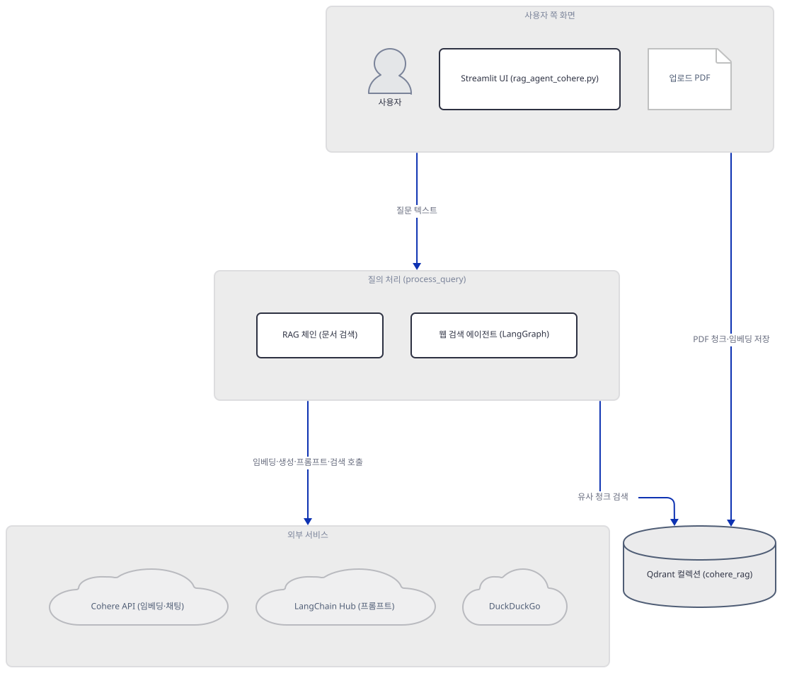
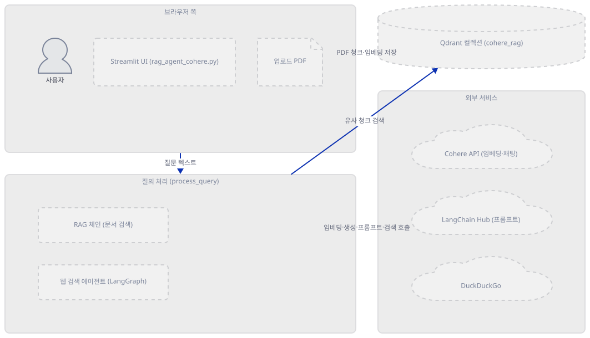
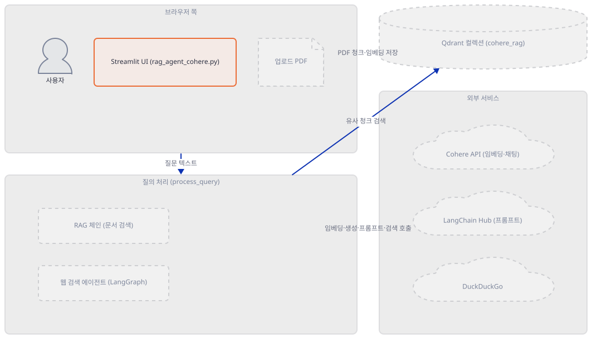
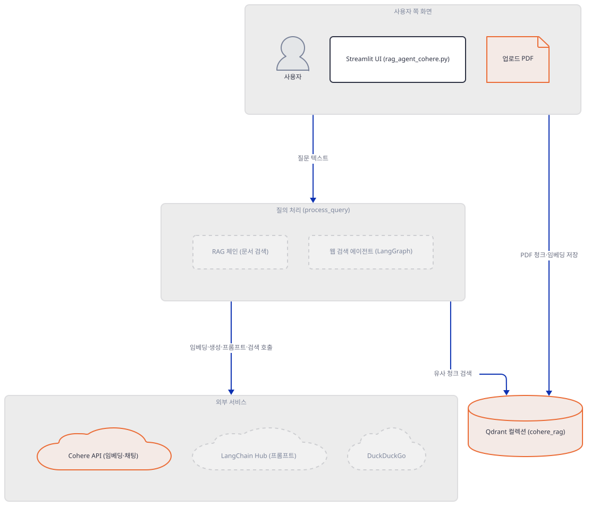
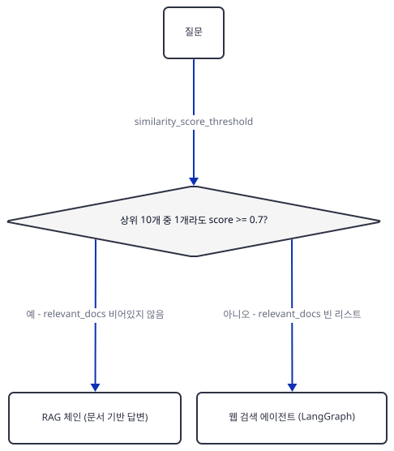
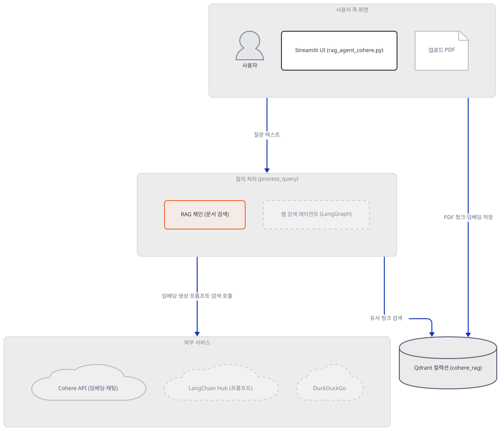
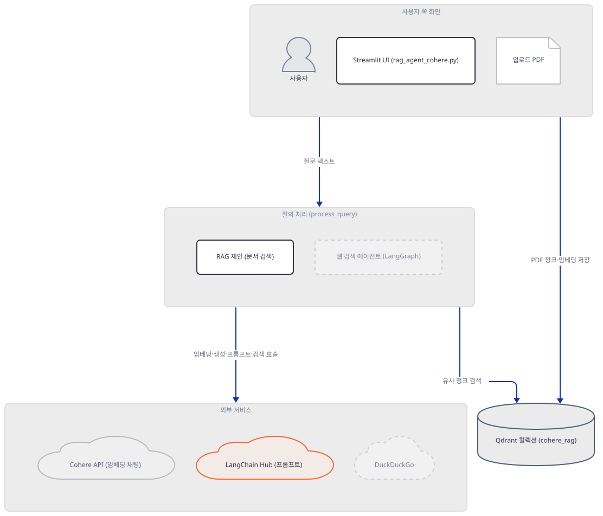
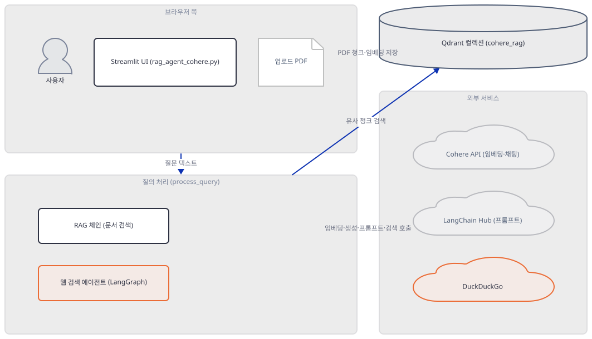
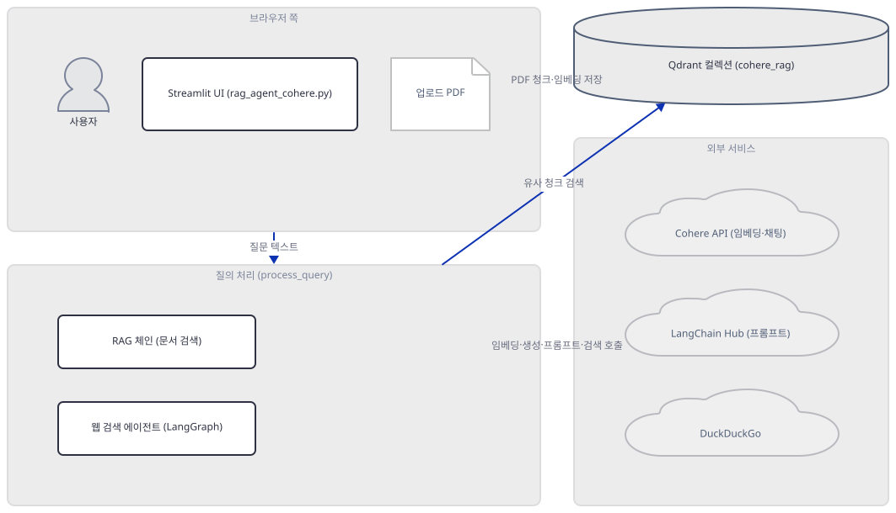
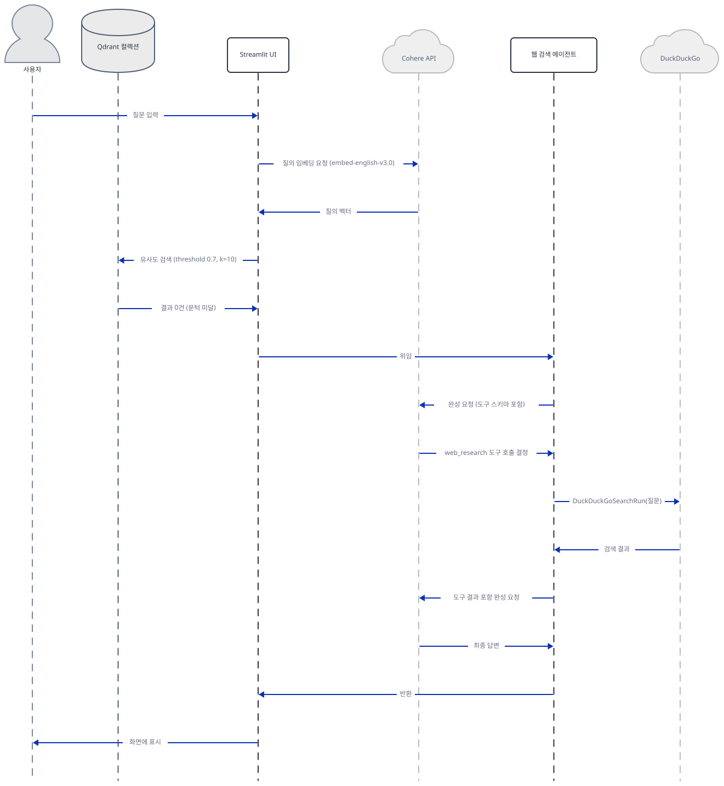

# Day 057 · ✨ RAG Agent with Cohere

> 볼륨 5 📀 RAG · 난이도 ★★☆ ⚠ · 예상 소요 120분(검증 이력 없이 처음 검토된 날이라 Critical 정정과 스텝마다의 오프라인 재현이 유난히 많습니다) · API 비용 대략 질문 1건에 Cohere 임베딩 호출 2회(문서 경로: `retriever.get_relevant_documents`가 한 번, `create_retrieval_chain`이 그 retriever를 다시 부르며 한 번 더 — 직접 확인, Step 4·7) + 채팅 호출 1회(문서 경로) 또는 LangGraph 루프 특성상 2회 이상(웹 검색 경로: 도구 호출 여부 판단 1회 + 최종 답변 1회) — 답변 요약(`post_process`)은 실제로는 어디서도 호출되지 않아 500자를 넘어도 추가 호출이 없고(Step 7), 문서 업로드 시에는 청크 수만큼(64개씩 배치) + 컬렉션 검증용 `dummy_text` 1회가 임베딩 호출로 추가됨 — 대략치(키가 없어 실제 과금은 확인 못함) · 원본 앱: `rag_tutorials/rag_agent_cohere`

## 오늘 만들 것

문서를 청크로 나눠 임베딩하고 저장소에 넣은 뒤, 질문이 오면 같은 방식으로 검색해 답을 만드는 흐름 — Day 047부터 이 볼륨이 반복해 온 것 — 을 오늘도 그대로 씁니다. 오늘 앱이 갈라지는 지점은 두 곳입니다. 첫째, 임베딩(`embed-english-v3.0`, 1024차원)과 채팅(`command-r7b-12-2024`) 둘 다 Cohere 하나로 몰아주고, 벡터 저장소는 Day 047의 로컬 Docker Qdrant 대신 계정과 URL이 필요한 Qdrant Cloud를 씁니다(Step 2). 둘째, 검색이 실패하면 — 정확히는 유사도 상위 10개 문서 중 정규화 점수 0.7(코사인 유사도로는 0.4)을 넘는 것이 하나도 없으면(Step 4) — LangGraph로 만든 별도 에이전트가 DuckDuckGo로 웹을 검색해 대신 답합니다(Step 6). 그런데 이 319줄을 그대로 설치해 실행해 보면(직접 확인, Step 1·3), 그 세련된 분기 이전에 훨씬 단순한 문제가 있습니다: `requirements.txt` 14줄 어디에도 `pypdf`가 없어서, PDF를 업로드하는 순간 `PyPDFLoader`가 곧바로 `ImportError`로 실패합니다(직접 확인, Step 3) — 이 실패는 조용히 삼켜지고 빈 리스트가 그대로 벡터 저장소로 넘어가 "성공"처럼 보이는 빈 컬렉션이 되므로, 그 뒤로는 어떤 질문을 던져도 사실상 항상 웹 검색 경로를 타게 됩니다. 검색이 통과하는 절반의 경로도 조용한 그물을 하나 더 두르고 있습니다 — `from langchain import hub`가 질문마다 `hub.pull("langchain-ai/retrieval-qa-chat")`로 LangChain Hub(`api.smith.langchain.com`)에서 프롬프트를 실시간으로 내려받는데(직접 확인, Step 5), 이 세 번째 외부 서비스는 앱의 사전 준비 어디에도 언급되지 않습니다. 그리고 이 파일에는 실제로는 호출되지 않는 코드가 정확히 세 조각 있습니다 — DuckDuckGo의 레이트리밋을 버티려고 `tenacity`로 직접 짠 `RateLimitedDuckDuckGo` 클래스, LangGraph 자신의 기본 상태 스키마를 그대로 옮겨 적은 `AgentState`, 그리고 긴 답을 요약하는 `post_process` 함수 — 셋 다 정의되지만 실제 호출부는 각각 다른 평범한 경로를 쓰거나 아예 어디서도 불리지 않습니다(grep으로 직접 확인, Step 6·7). 완성하면 PDF를 올리고 질문하는 화면을 로컬에서 띄우게 되며, 이 문서가 진짜로 확인하는 것은 그 화면 뒤에서 정확히 언제, 왜 문서를 버리고 웹으로 가는지, 그리고 그 결정에 도달하기 전에 이미 몇 개의 관문이 있는지입니다. 아래는 완성된 아키텍처입니다.



## 사전 준비

| 서비스/도구 | 용도 | 발급·설치 |
|---|---|---|
| Cohere API 키 | 임베딩(`embed-english-v3.0`)과 채팅(`command-r7b-12-2024`) 호출 인증 | https://dashboard.cohere.com/api-keys |
| Qdrant Cloud 클러스터 | 벡터 저장소(`cohere_rag` 컬렉션). 코드가 실제로 요구하는 것은 API 키와 URL이 모두 있는 Qdrant 인스턴스일 뿐이지만, 이 앱의 사이드바 자리 표시자와 앱 자체 README는 Qdrant Cloud를 전제로 안내합니다(Step 2) | https://cloud.qdrant.io 가입 후 클러스터 생성, API 키·URL 확보 |
| pypdf (별도 설치) | `PyPDFLoader`가 실제 PDF 파싱에 쓰는 패키지 — `requirements.txt` 14줄 어디에도 없어 기본 설치로는 빠짐(Step 3에서 직접 확인) | `uv pip install pypdf` |
| 인터넷 연결(LangChain Hub 포함) | PyPI 설치, Qdrant Cloud API, Cohere API 접속에 더해 질문마다 `hub.pull()`이 접속하는 `api.smith.langchain.com`(Step 5) | 별도 설치 없음. 사내망이면 위 네 도메인 모두 아웃바운드 허용 필요 |
| uv | 가상환경 생성과 패키지 설치 | [공통 사전 준비](../README.md#공통-사전-준비-한-번만) 절 참고 |

## 아키텍처 한눈에 보기

| 컴포넌트 | 역할 | 코드 위치 |
|---|---|---|
| 사용자 | PDF 업로드, 질문 입력 | 코드 없음 (브라우저) |
| 자격증명 게이트 (`init_session_state`/`sidebar_api_form`/`init_qdrant`) | Qdrant 자격증명은 실제 접속(`get_collections()`)으로 검증하고 Cohere 키는 비어 있지 않은지만 확인 — 통과해야 이 아래 함수·클래스 정의를 포함한 나머지 스크립트가 실행됨 | `rag_tutorials/rag_agent_cohere/rag_agent_cohere.py:22-32`, `rag_tutorials/rag_agent_cohere/rag_agent_cohere.py:34-66`, `rag_tutorials/rag_agent_cohere/rag_agent_cohere.py:68-76` |
| 문서 적재 (`process_document`/`create_vector_stores`) | PDF → 청크(1000자/겹침 200) → Cohere 임베딩 → Qdrant 저장 | `rag_tutorials/rag_agent_cohere/rag_agent_cohere.py:95-111`, `rag_tutorials/rag_agent_cohere/rag_agent_cohere.py:115-139` |
| 질의 처리 (`process_query`) | 유사도 문턱(0.7)으로 RAG 체인과 웹 검색 에이전트 중 분기 | `rag_tutorials/rag_agent_cohere/rag_agent_cohere.py:181-232` |
| 웹 검색 폴백 에이전트 (`create_fallback_agent`) | LangGraph `create_react_agent` + DuckDuckGo 도구 1개 | `rag_tutorials/rag_agent_cohere/rag_agent_cohere.py:161-179` |
| Qdrant 컬렉션 (`cohere_rag`) | 청크 벡터(1024차원)와 원문 저장 | `rag_tutorials/rag_agent_cohere/rag_agent_cohere.py:113` |
| Cohere API | 임베딩·채팅 생성 | 코드 없음 (외부 서비스) |
| LangChain Hub | RAG 프롬프트 템플릿(`langchain-ai/retrieval-qa-chat`) 실시간 다운로드 | `rag_tutorials/rag_agent_cohere/rag_agent_cohere.py:195` |

## 단계별 진행

### Step 1. 환경 만들기 — 13개 고정과 1개 범위, 오늘도 조용히 설치된다

**목적.** 격리된 가상환경에 `requirements.txt` 14줄을 설치하고, 이 앱의 모든 import가 오늘도 그대로 통과하는지 확인합니다.

**할 일.**

```bash
cd rag_tutorials/rag_agent_cohere
uv venv
uv pip install -r requirements.txt
```

(pip 대안: `python -m venv .venv && source .venv/bin/activate && pip install -r requirements.txt`. Windows PowerShell은 활성화만 `.venv\Scripts\Activate.ps1`로 바꿉니다.)

이 저장소는 루트에 `pyproject.toml`이 있어 `uv run`이 방금 만든 환경 대신 루트의 `.venv`를 쓰므로, 이후 `uv run` 명령에는 모두 `--no-project`를 붙입니다. `uv venv`는 인자 없이 실행하면 uv 자체 관리 Python 3.13.3을 그대로 고릅니다(직접 확인) — 이 값은 uv가 캐시해 둔 버전이라 기기마다 다를 수 있으므로, `python`이나 `py` 런처가 잡는 시스템 기본값에 기대지 말고 `uv venv --python 3.13`처럼 명시하는 편이 안전합니다.

`rag_tutorials/rag_agent_cohere/requirements.txt:1-14`

```text
langchain==0.3.12
langchain-community==0.3.12
langchain-core==0.3.25
langchain-cohere==0.3.2
langchain-qdrant==0.2.0
cohere==5.11.4
qdrant-client==1.12.1
duckduckgo-search>=6.4.2,<9
streamlit==1.40.2
tenacity==9.0.0
typing-extensions==4.12.2
pydantic==2.9.2
pydantic-core==2.23.4
langgraph==0.2.53
```

(14줄, 마지막 줄에 개행이 없어 `wc -l`은 13으로 셉니다.) 13개는 정확한 고정(`==`)이고 `duckduckgo-search`만 범위(`>=6.4.2,<9`)입니다 — 그중 `pydantic==2.9.2`와 `pydantic-core==2.23.4`처럼 두 개를 동시에 정확히 고정하는 조합은 둘이 서로 안 맞으면 설치 자체가 거부되는 종류입니다. 오늘 실제로 설치하면 이 조합은 충돌 없이 풀립니다(직접 확인) — uv 로그 그대로:

```
Resolved 106 packages in 45.16s
Prepared 19 packages in 1m 22s
Installed 106 packages in 1m 45s
```

13개 고정은 요청한 버전 그대로 받아지고(`cohere==5.11.4`, `langgraph==0.2.53` 등), 느슨한 `duckduckgo-search`는 범위 안 최신인 `duckduckgo-search==8.1.1`이 되며, `requirements.txt`에 이름이 없는 `langsmith==0.2.11`(Step 5의 핵심)도 함께 딸려 옵니다(직접 확인). 이 설치는 공유 중인 느린 기기에서 3분 52초 만에 끝났습니다(위 로그의 45.16초+1분 22초+1분 45초 합) — 매번 이만큼 걸린다고 일반화할 근거는 아닙니다.



**확인.** 이 파일이 쓰는 모든 import가 성공하는지 확인합니다.

```bash
uv run --no-project python -m py_compile rag_agent_cohere.py && echo compiled
```

```
compiled
```

```bash
uv run --no-project python -c "
import os
from langchain_community.document_loaders import PyPDFLoader
from langchain.text_splitter import RecursiveCharacterTextSplitter
from langchain_cohere import CohereEmbeddings, ChatCohere
from langchain_qdrant import QdrantVectorStore
from qdrant_client import QdrantClient
from qdrant_client.models import Distance, VectorParams
from langchain.chains.combine_documents import create_stuff_documents_chain
from langchain.chains import create_retrieval_chain
from langchain import hub
import tempfile
from langgraph.prebuilt import create_react_agent
from langchain_community.tools import DuckDuckGoSearchRun
from typing import TypedDict, List
from langchain_core.language_models import BaseLanguageModel
from langchain_core.messages import AIMessage, HumanMessage, SystemMessage
from time import sleep
from tenacity import retry, wait_exponential, stop_after_attempt
print('ALL IMPORTS OK')
"
```

```
ALL IMPORTS OK
```

### Step 2. 자격증명 게이트 — 계정 두 개가 있어야 나머지 코드가 존재한다

**목적.** `init_session_state`·`sidebar_api_form`·`init_qdrant`가 Qdrant 자격증명은 실제 접속으로, Cohere 키는 비어 있지 않은지만 어떻게 검증하는지, 그리고 이 검증을 통과하기 전에는 이 아래에 있는 함수·클래스 정의(`RateLimitedDuckDuckGo`, `process_query` 등 포함) 자체가 실행되지 않는다는 것을 확인합니다.

**할 일.**

`rag_tutorials/rag_agent_cohere/rag_agent_cohere.py:78-82`

```python
init_session_state()

if not sidebar_api_form():
    st.info("Please enter your API credentials in the sidebar to continue.")
    st.stop()
```

Streamlit은 상호작용마다 스크립트를 처음부터 다시 실행하는데, `st.stop()`은 그 실행 하나를 그 자리에서 멈춥니다. 이 두 줄이 파일 78~82번째 줄, 즉 전체 319줄 중 4분의 1도 안 되는 지점에 있고, `embedding =`(84행)·`chat_model =`(87행)·`client = init_qdrant()`(93행)은 물론 `class RateLimitedDuckDuckGo`(147행)·`def process_query`(181행) 같은 이 아래 모든 정의가 이 줄들 다음에 옵니다 — 즉 사이드바 폼 제출이 통과되기 전까지는, 이 문서가 뒤에서 다루는 함수·클래스 자체가 그 실행에서 만들어지지 않습니다. 다만 그 "통과"가 두 벤더를 똑같이 검증하는 것은 아닙니다 — 제출 처리 안에서 실제로 접속하는 것은 `QdrantClient(...).get_collections()`뿐이고(`rag_tutorials/rag_agent_cohere/rag_agent_cohere.py:53-55`, 실패하면 `st.error`), Cohere 키는 그 값을 그대로 `st.session_state.cohere_api_key`에 저장할 뿐 이 시점엔 어디에도 보내지 않습니다(직접 확인 — 빈 문자열이어도 `if not sidebar_api_form():`을 통과시킴, 아래). 빈 Cohere 키는 다음 실행에서 84행 `CohereEmbeddings(...)`가 즉시 `pydantic.ValidationError: Did not find cohere_api_key`로 멈추게 하고, 값은 있지만 틀린 키는 그보다 늦게 — 문서를 처음 업로드해 `QdrantVectorStore(...)`가 컬렉션 벡터 크기를 확인하려고 `embed_documents(["dummy_text"])`를 부르는 순간(`create_vector_stores`, 소스로 확인 — langchain-qdrant 0.2.0 `qdrant.py:1109`, `_validate_collection_for_dense`) — 에러로 드러납니다. 통과 후 실제로 값을 다시 쓰는 쪽은 `init_qdrant()`입니다.

`rag_tutorials/rag_agent_cohere/rag_agent_cohere.py:68-76`

```python
def init_qdrant() -> QdrantClient:
    if not st.session_state.get("qdrant_api_key"):
        raise ValueError("Qdrant API key not provided")
    if not st.session_state.get("qdrant_url"):
        raise ValueError("Qdrant URL not provided")
    
    return QdrantClient(url=st.session_state.qdrant_url,
                       api_key=st.session_state.qdrant_api_key,
                       timeout=60)
```

코드가 실제로 요구하는 것은 이 두 값이 모두 채워진 `QdrantClient`뿐입니다 — Day 047처럼 로컬 Docker Qdrant를 `url="http://localhost:6333"`로 넘겨도 이 함수 자체는 막지 않습니다. 다만 사이드바의 URL 자리 표시자(`https://xyz-example.eu-central.aws.cloud.qdrant.io:6333`)와 앱 자체 README의 "Qdrant Cloud Setup" 안내는 클라우드 클러스터를 전제로 하고, 로컬 인프로세스 옵션(`:memory:`, `path=`)은 이 코드 어디에도 없습니다 — 즉 사전 준비를 그대로 따르는 독자는 Qdrant Cloud 가입이 사실상 유일한 경로입니다.



**확인.** 두 값이 비었을 때 `init_qdrant()`가 정확히 어떤 예외를 내는지, 네트워크 없이 함수만 떼어 확인합니다.

```bash
uv run --no-project python -c "
from qdrant_client import QdrantClient

def init_qdrant(qdrant_api_key, qdrant_url):
    if not qdrant_api_key:
        raise ValueError('Qdrant API key not provided')
    if not qdrant_url:
        raise ValueError('Qdrant URL not provided')
    return QdrantClient(url=qdrant_url, api_key=qdrant_api_key, timeout=60)

try:
    init_qdrant('', '')
except Exception as e:
    print('CASE both empty ->', type(e).__name__, str(e))
try:
    init_qdrant('fake-key', '')
except Exception as e:
    print('CASE only key ->', type(e).__name__, str(e))
"
```

직접 확인한 출력(위 두 줄은 실제 함수 본문을 그대로 옮긴 것):

```
CASE both empty -> ValueError Qdrant API key not provided
CASE only key -> ValueError Qdrant URL not provided
```

(이 두 예외는 사실 사이드바를 통해서는 도달하기 어렵습니다 — `api_keys_submitted`가 `True`가 되는 시점에 이미 두 값이 한 번 성공적으로 쓰였기 때문입니다. 방어적으로 남아 있는 코드라는 뜻입니다.)

`QdrantClient(...)` 생성 자체는 네트워크를 타지 않는다는 것도 소켓을 막아 직접 확인합니다 — placeholder 형식의 가짜 URL로 생성만 해 봅니다.

```bash
uv run --no-project python -c "
import socket, time
def _blocked(self, *a, **k): raise RuntimeError('network blocked')
socket.socket.connect = _blocked
from qdrant_client import QdrantClient
t0 = time.monotonic()
client = QdrantClient(url='https://xyz-example.eu-central.aws.cloud.qdrant.io:6333', api_key='fake-key', timeout=60)
print(f'constructed in {time.monotonic()-t0:.2f}s, no RuntimeError raised so 0 connect attempts')
"
```

직접 확인한 출력:

```
constructed in 0.21s, no RuntimeError raised so 0 connect attempts
```

즉 생성자 자체는 즉시 반환합니다 — "Submit Credentials" 후 한동안 반응이 없다면 그 시간은 `QdrantClient(...)` 생성이 아니라 바로 다음 줄 `client.get_collections()`(`rag_tutorials/rag_agent_cohere/rag_agent_cohere.py:55`, `timeout=60`으로 최대 60초 대기)가 실제 접속을 시도하는 구간입니다 — URL 오탈자를 의심할지언정 앱이 멈췄다고 단정하기는 이릅니다.

Cohere 쪽은 이 폼에서 전혀 접속을 시도하지 않는다는 것도 같은 방식으로 직접 확인합니다 — `CohereEmbeddings`·`ChatCohere` 생성이 빈 키에서는 즉시 실패하고, 값만 있는 가짜 키에서는 네트워크 없이 통과하는지 봅니다(84·87행과 같은 생성자 호출).

```bash
uv run --no-project python -c "
import socket
def _blocked(self, *a, **k): raise RuntimeError('network blocked')
socket.socket.connect = _blocked
from pydantic import ValidationError
from langchain_cohere import CohereEmbeddings, ChatCohere

try:
    CohereEmbeddings(model='embed-english-v3.0', cohere_api_key='')
except ValidationError as e:
    print('empty key ->', str(e).splitlines()[1].strip())

emb = CohereEmbeddings(model='embed-english-v3.0', cohere_api_key='fake-cohere-key')
chat = ChatCohere(model='command-r7b-12-2024', cohere_api_key='fake-cohere-key')
print('fake non-empty key -> both constructed OK, no network attempted')
"
```

직접 확인한 출력:

```
empty key -> Value error, Did not find cohere_api_key, please add an environment variable `COHERE_API_KEY` which contains it, or pass `cohere_api_key` as a named parameter.
fake non-empty key -> both constructed OK, no network attempted
```

즉 Cohere 키 칸을 비운 채 제출하면(Qdrant 값이 맞더라도) 사이드바가 아니라 84행에서 처리되지 않은 `ValidationError`로 화면이 멈추고, 아무 문자열이나 채우면 이 시점은 조용히 통과합니다 — 앞서 적었듯 그 키가 진짜 틀렸다는 것은 문서를 업로드해 `dummy_text` 임베딩을 시도할 때에야 드러납니다.

### Step 3. 문서 적재 — requirements.txt에 없는 패키지 하나

**목적.** `process_document`가 PDF를 어떻게 청크로 쪼개는지, `create_vector_stores`가 Qdrant 컬렉션을 어떻게 만드는지 확인하고, Step 1에서 설치한 환경만으로 이 경로가 실제로 끝까지 가는지 실행해 봅니다.

**할 일.**

`rag_tutorials/rag_agent_cohere/rag_agent_cohere.py:95-111`

```python
def process_document(file):
    try:
        with tempfile.NamedTemporaryFile(delete=False, suffix='.pdf') as tmp_file:
            tmp_file.write(file.getvalue())
            tmp_path = tmp_file.name
            
        loader = PyPDFLoader(tmp_path)
        documents = loader.load()
        text_splitter = RecursiveCharacterTextSplitter(chunk_size=1000, chunk_overlap=200)
        texts = text_splitter.split_documents(documents)
        
        os.unlink(tmp_path)
        
        return texts
    except Exception as e:
        st.error(f"Error processing document: {e}")
        return []
```

청크 크기 1000자·겹침 200자는 Day 047의 agno 기본값(5000자·겹침 0)과 다른 선택입니다 — 겹침을 두어 청크 경계에서 문장이 잘려도 이웃 청크가 일부 맥락을 나눠 갖게 합니다. 그런데 이 함수는 두 번째 줄(`loader = PyPDFLoader(tmp_path)`)에서부터 막힙니다 — `requirements.txt` 14줄 어디에도 `pypdf`가 없고, Step 1에서 설치된 106개 패키지 중에도 없습니다(직접 확인, 아래). `PyPDFLoader`는 실행 시점에야 `pypdf`를 import하므로 이 문제는 설치 단계가 아니라 실제로 PDF를 열 때 처음 드러납니다.



**확인.** 먼저 `pypdf`가 정말 빠졌는지 확인합니다.

```bash
uv run --no-project python -c "import pypdf"
```

직접 확인한 출력:

```
ModuleNotFoundError: No module named 'pypdf'
```

이어서 `process_document`와 똑같은 임시 파일 패턴으로, 실제 PDF가 아닌 바이트를 `.pdf`로 저장해 `PyPDFLoader`에 넘겨 봅니다.

```bash
uv run --no-project python -c "
import tempfile, os
from langchain_community.document_loaders import PyPDFLoader
with tempfile.NamedTemporaryFile(delete=False, suffix='.pdf') as tmp_file:
    tmp_file.write(b'not a real pdf')
    tmp_path = tmp_file.name
try:
    PyPDFLoader(tmp_path).load()
except Exception as e:
    print('EXCEPTION TYPE:', type(e).__name__)
    print('EXCEPTION TEXT:', str(e))
finally:
    os.unlink(tmp_path)
"
```

직접 확인한 출력:

```
EXCEPTION TYPE: ImportError
EXCEPTION TEXT: pypdf package not found, please install it with `pip install pypdf`
```

`process_document`(95-111행)는 이 예외를 `except Exception as e: st.error(...); return []`로 삼키므로, 화면에는 빨간 오류 배너가 뜨는 것과 거의 동시에 `texts = []`가 다음 줄로 넘어갑니다.

`rag_tutorials/rag_agent_cohere/rag_agent_cohere.py:115-139`

```python
def create_vector_stores(texts):
    """Create and populate vector store with documents."""
    try:
        try:
            client.create_collection(collection_name=COLLECTION_NAME,
                                   vectors_config=VectorParams(size=1024,
                                                            distance=Distance.COSINE))
            st.success(f"Created new collection: {COLLECTION_NAME}")
        except Exception as e:
            if "already exists" not in str(e).lower():
                raise e
        
        vector_store = QdrantVectorStore(client=client,
                                       collection_name=COLLECTION_NAME,
                                       embedding=embedding)
        
        with st.spinner('Storing documents in Qdrant...'):
            vector_store.add_documents(texts)
            st.success("Documents successfully stored in Qdrant!")
        
        return vector_store
        
    except Exception as e:
        st.error(f"Error in vector store creation: {str(e)}")
        return None
```

`VectorParams(size=1024, ...)`는 `embed-english-v3.0`의 실제 임베딩 차원과 정확히 일치합니다(Cohere 공식 문서 기준 1024차원). 문제는 `texts=[]`가 그대로 들어와도 이 함수가 실패하지 않는다는 점입니다 — `QdrantVectorStore.add_documents([])`는 배치를 순회하는 내부 반복이 빈 입력에서 그냥 0번 도는 구조라 Qdrant에 아무 요청도 보내지 않고 조용히 끝납니다(소스로 확인, `langchain-qdrant==0.2.0`의 `QdrantVectorStore.add_texts`). 그 결과 `create_vector_stores([])`는 **성공**을 반환하고, 화면에는 "Documents successfully stored in Qdrant!"까지 뜹니다 — 방금 위에서 본 "Error processing document" 오류 배너와 나란히. `pypdf`를 설치하지 않은 채로 PDF를 아무리 올려도 컬렉션은 영원히 비어 있고, Step 4의 유사도 검색은 항상 빈 결과만 돌려주게 됩니다.

`texts=[]`든 실제 청크든, `QdrantVectorStore(client=client, collection_name=COLLECTION_NAME, embedding=embedding)`(127-129행) 생성 자체가 이미 임베딩 호출을 하나 발생시킵니다 — 컬렉션이 이미 존재하면(방금 막 만들었든 이전 업로드가 남겨 둔 것이든) `__init__`이 기본으로 `_validate_collection_config` → `_validate_collection_for_dense`를 불러 `embedding.embed_documents(["dummy_text"])`로 실제 임베딩 차원을 재고 저장된 `VectorParams.size`와 맞는지 검사합니다(소스로 확인, `langchain-qdrant==0.2.0` `qdrant.py:1109`). 인메모리 Qdrant와 가짜 임베더로 이 호출이 정말 일어나는지 직접 확인합니다.

```bash
uv run --no-project python -c "
from langchain_core.embeddings import Embeddings
from qdrant_client import QdrantClient
from qdrant_client.models import Distance, VectorParams
from langchain_qdrant import QdrantVectorStore

class ProbeEmbeddings(Embeddings):
    def embed_documents(self, texts):
        print('embed_documents called with:', texts)
        return [[0.0, 0.0] for _ in texts]
    def embed_query(self, text):
        return [0.0, 0.0]

client = QdrantClient(location=':memory:')
client.create_collection('probe', vectors_config=VectorParams(size=2, distance=Distance.COSINE))
QdrantVectorStore(client=client, collection_name='probe', embedding=ProbeEmbeddings())
print('QdrantVectorStore constructed (no add_documents called yet)')
"
```

직접 확인한 출력:

```
embed_documents called with: ['dummy_text']
QdrantVectorStore constructed (no add_documents called yet)
```

즉 `add_documents(texts)`가 청크 수만큼(64개씩 배치) 임베딩을 부르기 **전에**, 컬렉션 검증만으로 이미 1회가 추가로 나갑니다 — 업로드마다 한 번씩입니다.

### Step 4. 검색과 문턱값 — 오늘의 핵심 조건

**목적.** `process_query`가 문서 경로와 웹 검색 경로 중 어디로 갈지 가르는 정확한 조건을 확인합니다.

**할 일.**

`rag_tutorials/rag_agent_cohere/rag_agent_cohere.py:181-194`

```python
def process_query(vectorstore, query) -> tuple[str, list]:
    """Process a query using RAG with fallback to web search."""
    try:
        retriever = vectorstore.as_retriever(
            search_type="similarity_score_threshold",
            search_kwargs={
                "k": 10,
                "score_threshold": 0.7
            }
        )

        relevant_docs = retriever.get_relevant_documents(query)

        if relevant_docs:
```

조건은 이 한 줄 `if relevant_docs:`이지만, 그 값을 만드는 것은 `search_type="similarity_score_threshold"`와 `score_threshold: 0.7`입니다. `VectorStoreRetriever`는 `score_threshold`를 kwargs에서 꺼낸 뒤 Qdrant에는 넘기지 않고, 상위 `k=10`개를 받아 온 다음 파이썬에서 걸러내는 클라이언트 쪽 필터링을 합니다 — 그런데 그 필터링은 Qdrant가 돌려준 코사인 유사도 원점수를 그대로 0.7과 비교하지 않습니다. `QdrantVectorStore`는 `_select_relevance_score_fn`만 재정의해 COSINE 거리일 때 `_cosine_relevance_score_fn(distance) = (distance + 1.0) / 2.0`을 씁니다(소스로 확인, `langchain-qdrant==0.2.0` `qdrant.py:887-903`). langchain-core의 공통 구현(`_similarity_search_with_relevance_scores`, `langchain-core==0.3.25` `base.py:484-508`)이 원점수 각각에 이 함수를 먼저 씌워 "정규화 점수"로 바꾼 뒤, `similarity_search_with_relevance_scores`(`base.py:538-583`)가 `similarity >= score_threshold`로 그 정규화 점수를 거릅니다 — 원점수가 아니라 `(cos+1)/2`를 0.7과 비교하는 것입니다(`QdrantVectorStore`에는 이 필터링 메서드 자체의 재정의가 없어 이 공통 구현을 그대로 씁니다 — 같은 이름의 재정의는 구식 `Qdrant` 클래스에만 있고 공식은 다릅니다, langchain-qdrant 0.2.0의 `vectorstores.py:1934`). 즉 **오늘의 정확한 조건은 "상위 10개 문서 중 정규화 점수 `(cos+1)/2`가 0.7을 넘는 것이 단 하나도 없다", 코사인 유사도로 환산하면 "0.4를 넘는 것이 하나도 없다"** 입니다. 이때 `relevant_docs`는 빈 리스트가 되어 `if relevant_docs:`가 거짓이 됩니다. Step 3에서 본 대로 컬렉션 자체가 비어 있으면 이 조건은 질문 내용과 무관하게 항상 거짓입니다.





**확인.** Qdrant Cloud·Cohere 키는 없지만, 인메모리 Qdrant와 코사인 값을 직접 정한 가짜 임베딩으로 앱과 똑같은 리트리버 설정을 그대로 돌려 확인할 수 있습니다 — 쿼리와 코사인 0.8/0.5/0.3인 문서 셋을 만들어 둡니다.

```bash
uv run --no-project python -c "
from langchain_core.embeddings import Embeddings
from langchain_core.documents import Document
from langchain_qdrant import QdrantVectorStore
from qdrant_client import QdrantClient
from qdrant_client.models import Distance, VectorParams

QUERY_VEC = [1.0, 0.0]
DOC_VECS = {
    'doc cos=0.8': [0.8, 0.6],
    'doc cos=0.5': [0.5, 0.8660254037844386],
    'doc cos=0.3': [0.3, 0.9539392014169456],
}
class FixedEmbeddings(Embeddings):
    def embed_documents(self, texts):
        return [DOC_VECS.get(t, QUERY_VEC) for t in texts]
    def embed_query(self, text):
        return QUERY_VEC

client = QdrantClient(location=':memory:')
client.create_collection('probe', vectors_config=VectorParams(size=2, distance=Distance.COSINE))
vs = QdrantVectorStore(client=client, collection_name='probe', embedding=FixedEmbeddings())
vs.add_documents([Document(page_content=t) for t in DOC_VECS])

print('raw cosine       :', [round(s, 2) for _, s in vs.similarity_search_with_score('q', k=10)])
print('relevance (cos+1)/2:', [round(s, 2) for _, s in vs.similarity_search_with_relevance_scores('q', k=10)])

retriever = vs.as_retriever(search_type='similarity_score_threshold', search_kwargs={'k': 10, 'score_threshold': 0.7})
print('app retriever (score_threshold=0.7) returns:', [d.page_content for d in retriever.invoke('q')])
"
```

직접 확인한 출력:

```
raw cosine       : [0.8, 0.5, 0.3]
relevance (cos+1)/2: [0.9, 0.75, 0.65]
app retriever (score_threshold=0.7) returns: ['doc cos=0.8', 'doc cos=0.5']
```

앱과 똑같은 `score_threshold=0.7` 설정이 원점수 코사인 0.5(정규화 0.75)인 문서는 통과시키고 코사인 0.3(정규화 0.65)인 문서는 거릅니다 — 코사인 0.7이 아니라 0.4가 실제 경계선이라는 뜻입니다.

### Step 5. RAG 체인과 숨은 다운로드 — hub.pull이 매번 접속하는 곳

**목적.** 문서를 찾은 경우 `process_query`가 어떻게 답을 만드는지, 그리고 `hub.pull(...)`이 실제로 네트워크에 무엇을 요청하는지 직접 확인합니다.

**할 일.**

`rag_tutorials/rag_agent_cohere/rag_agent_cohere.py:195-199`

```python
            retrieval_qa_prompt = hub.pull("langchain-ai/retrieval-qa-chat")
            combine_docs_chain = create_stuff_documents_chain(chat_model, retrieval_qa_prompt)
            retrieval_chain = create_retrieval_chain(retriever, combine_docs_chain)
            response = retrieval_chain.invoke({"input": query})
            return response['answer'], relevant_docs
```

`hub.pull`은 이 파일 어디에도 캐싱되지 않고 `process_query`가 호출될 때마다, 즉 문서 경로를 타는 질문마다 매번 새로 불립니다. `langchain==0.3.12`의 `hub.pull()`(소스로 확인)은 `langsmith.Client(api_url=None, api_key=None).pull_prompt(owner_repo_commit, include_model=include_model)`을 그대로 호출하고, 이 요청은 커밋 해시를 안 적으면 `"latest"`로 풀립니다. 오늘 이 requirements.txt가 실제로 받아오는 `langsmith==0.2.11`(Step 1)의 `Client`는 API 키가 없어도 예외를 던지지 않고 경고만 낸 뒤 `GET https://api.smith.langchain.com/commits/langchain-ai/retrieval-qa-chat/latest`를 그대로 시도합니다 — 즉 **키는 필요 없지만 네트워크는 필요합니다.** 이 호출은 `process_query`의 같은 `try` 블록 안에 있어서(181-232행), 이 요청이 실패하면(사내망 차단 등) RAG 경로 전체가 맨 아래 `except Exception as e:`로 떨어집니다 — 다만 이 블록은 채팅 말풍선에 일반 메시지를 반환하기 **전에** `st.error(f"Error: {str(e)}")`(231행)로 실제 예외 문구를 화면에 먼저 찍습니다(소스로 확인). 즉 원인은 화면에서 사라지지 않습니다 — 채팅 답변 칸에는 "I encountered an error. Please try rephrasing your question."만 보이지만, 그 바로 위 빨간 오류 배너에는 `hub.pull` 실패라면 `LangSmithConnectionError`나 `SSLError` 같은 실제 예외 문구가, Cohere·Qdrant 실패라면 각각 그 예외 문구가 그대로 찍힙니다 — 다만 세 원인이 전부 같은 자리(오류 배너)에 나오므로 어떤 서비스 탓인지는 그 문구를 직접 읽어야 구분됩니다.



**확인.** 키 없이 실제로 이 호출을 실행해, 무엇을 요청하고 어떻게 실패·성공하는지 직접 봅니다.

```bash
uv run --no-project python -c "
from langchain import hub
prompt = hub.pull('langchain-ai/retrieval-qa-chat')
print('SUCCESS:', type(prompt))
"
```

이 컴퓨터(외부 네트워크가 일부 제한된 샌드박스)에서 직접 확인한 출력:

```
...\langsmith\client.py:256: LangSmithMissingAPIKeyWarning: API key must be provided when using hosted LangSmith API
  warnings.warn(
Failed to get info from https://api.smith.langchain.com: LangSmithConnectionError(...SSLError(...'[SSL: UNEXPECTED_EOF_WHILE_READING]'...))
...
langsmith.utils.LangSmithConnectionError: Connection error caused failure to GET /commits/langchain-ai/retrieval-qa-chat/latest in LangSmith API. Please confirm your internet connection. SSLError(...)
```

경고(`LangSmithMissingAPIKeyWarning`)는 뜨지만 실행은 멈추지 않고 실제 GET 요청까지 갑니다 — API 키가 막는 것이 아니라는 뜻입니다. 이 환경에서 실패한 원인은 인증이 아니라 `api.smith.langchain.com`으로의 TLS 연결 자체이며, 일반 사무실·가정 네트워크에서는 이 요청이 성공해 `ChatPromptTemplate`을 그대로 돌려줄 가능성이 높습니다(이 부분은 이 샌드박스의 네트워크 제약일 수 있어 소스로 확인한 요청 경로만큼 단정하지는 않습니다).

### Step 6. 문서가 없을 때 — 웹 검색 에이전트, 그리고 쓰이지 않는 안전장치 둘

**목적.** `relevant_docs`가 비었을 때 어떤 에이전트가 어떤 도구로 웹을 검색하는지, 그리고 이 파일에 정의만 되고 실제로는 호출되지 않는 두 조각(`RateLimitedDuckDuckGo`, `AgentState`)이 무엇을 하려던 코드인지 확인합니다.

**할 일.**

`rag_tutorials/rag_agent_cohere/rag_agent_cohere.py:142-159`

```python
class AgentState(TypedDict):
    """State schema for the agent."""
    messages: List[HumanMessage | AIMessage | SystemMessage]
    is_last_step: bool

class RateLimitedDuckDuckGo(DuckDuckGoSearchRun):
    @retry(wait=wait_exponential(multiplier=1, min=4, max=10),
           stop=stop_after_attempt(3))
    def run(self, query: str) -> str:
        """Run search with rate limiting."""
        try:
            sleep(2)  # Add delay between requests
            return super().run(query)
        except Exception as e:
            if "Ratelimit" in str(e):
                sleep(5)  # Longer delay on rate limit
                return super().run(query)
            raise e
```

`RateLimitedDuckDuckGo`는 `DuckDuckGoSearchRun`의 **공개** `run()`을 오버라이드합니다(내부 `_run()`이 아닙니다) — 매 호출 앞에 2초를 쉬고, `tenacity`로 실패 시 최대 3회까지 4~10초 지수 백오프 재시도를 걸고, 예외 문구에 `"Ratelimit"`이 들어 있으면(실제 `duckduckgo_search`/`ddgs`의 `RatelimitException`이 내는 문구와 일치) 5초를 더 쉬고 한 번 더 시도합니다 — DuckDuckGo의 비공식 검색 백엔드가 실제로 자주 내는 429류 차단을 버티려고 쓴 이중 재시도입니다. `AgentState`는 `messages`·`is_last_step` 두 필드를 선언하는데, `langgraph.prebuilt.chat_agent_executor`가 `create_react_agent`의 기본 상태 스키마로 이미 내부에 갖고 있는 것은 사실 세 필드입니다 — `messages`·`is_last_step`에 `remaining_steps`가 더 있습니다(직접 확인 아래, `langgraph==0.2.53` `chat_agent_executor.py:30-37`). 즉 앱의 `AgentState`는 그 기본 스키마와 "같지" 않고 한 필드가 모자랍니다. 그런데 실제 폴백 에이전트는 앱의 `AgentState`도, 기본 스키마의 세 필드 전부도 쓰지 않습니다 — `create_react_agent(model=chat_model, tools=tools, debug=False)`(161-179행)는 `state_schema` 인자를 아예 넘기지 않으므로 실행 중에는 langgraph의 기본 스키마가 그대로 적용됩니다.

`rag_tutorials/rag_agent_cohere/rag_agent_cohere.py:161-179`

```python
def create_fallback_agent(chat_model: BaseLanguageModel):
    """Create a LangGraph agent for web research."""
    
    def web_research(query: str) -> str:
        """Web search with result formatting."""
        try:
            search = DuckDuckGoSearchRun(num_results=5)
            results = search.run(query)
            return results
        except Exception as e:
            return f"Search failed: {str(e)}. Providing answer based on general knowledge."

    tools = [web_research]
    
    agent = create_react_agent(model=chat_model,
                             tools=tools,
                             debug=False)
    
    return agent
```

여기서 실제로 만들어지는 것은 `RateLimitedDuckDuckGo()`가 아니라 평범한 `DuckDuckGoSearchRun(num_results=5)`이고, `create_react_agent(...)`도 `state_schema=AgentState`를 넘기지 않습니다(기본 스키마를 그대로 씀). 파일 전체를 뒤져도 `RateLimitedDuckDuckGo`는 정의된 그 줄 하나뿐이고 `AgentState`도 마찬가지입니다 — 즉 레이트리밋을 버티려고 짠 코드와 상태 스키마를 명시하려던 코드 둘 다, 실제 실행 경로에는 배선되지 않은 채 남아 있습니다. `relevant_docs`가 비면 `process_query`는 이 에이전트를 만들어 바로 호출합니다.

`rag_tutorials/rag_agent_cohere/rag_agent_cohere.py:201-228`

```python
        else:
            st.info("No relevant documents found. Searching web...")
            fallback_agent = create_fallback_agent(chat_model)
            
            with st.spinner('Researching...'):
                agent_input = {
                    "messages": [
                        HumanMessage(content=f"""Please thoroughly research the question: '{query}' and provide a detailed and comprehensive response. Make sure to gather the latest information from credible sources. Minimum 400 words.""")
                    ],
                    "is_last_step": False
                }
                
                config = {"recursion_limit": 100}
                
                try:
                    response = fallback_agent.invoke(agent_input, config=config)
                    
                    if isinstance(response, dict) and "messages" in response:
                        last_message = response["messages"][-1]
                        answer = last_message.content if hasattr(last_message, 'content') else str(last_message)
                        
                        return f"""Web Search Result:
{answer}
""", []
                    
                except Exception as agent_error:
                    fallback_response = chat_model.invoke(f"Please provide a general answer to: {query}").content
                    return f"Web search unavailable. General response: {fallback_response}", []
```

`agent_input`의 `"is_last_step": False`는 langgraph 기본 스키마의 실제 키 이름과 같아 무시되지 않고 그래프 상태로 받아들여집니다 — 다만 그 값이 결과에 어떤 차이를 만드는지는 이 문서에서 확인하지 못했고("정상 작동"이라 부를 근거는 없습니다), `remaining_steps`가 함께 없으면 재귀 제한에 관련된 내부 조건 일부가 그냥 건너뛰어질 뿐입니다(소스로 확인, `chat_agent_executor.py:575-586`). 그 사실은 앱의 `AgentState` 클래스가 실행에 쓰였기 때문이 아니라 — 위에서 보듯 `state_schema`를 안 넘겨 langgraph 내부 기본 스키마가 대신 쓰였기 때문입니다. 폴백에는 폴백이 하나 더 있습니다 — 에이전트 실행 자체가 실패하면(`except Exception as agent_error:`) 검색 없이 `chat_model.invoke(...)`로 Cohere에 일반 지식 답변을 한 번 더 요청합니다.



**확인.** `RateLimitedDuckDuckGo`가 파일 안에서 정말 정의 줄 하나뿐인지 직접 확인합니다(실제 검색은 실행하지 않습니다 — DuckDuckGo에 실제 요청을 보내는 일이라 이 문서는 실행하지 않습니다).

```bash
grep -n "RateLimitedDuckDuckGo" rag_agent_cohere.py
```

```
147:class RateLimitedDuckDuckGo(DuckDuckGoSearchRun):
```

langgraph의 기본 상태 스키마가 정말 세 필드인지, 그리고 `state_schema`를 넘기지 않은 `create_react_agent`가 `"is_last_step": False`를 오류 없이 받아들이되 그 값이 반환 상태에는 나타나지 않는지도 키·네트워크 없이 확인합니다 — 실제 도구 호출 없이 바로 답하는 가짜 채팅 모델을 씁니다.

```bash
uv run --no-project python -c "
from langchain_core.language_models.fake_chat_models import FakeListChatModel
from langgraph.prebuilt import create_react_agent
from langgraph.prebuilt.chat_agent_executor import AgentState as DefaultAgentState
from langchain_core.messages import HumanMessage

print('langgraph 기본 AgentState 필드:', list(DefaultAgentState.__annotations__.keys()))

class FakeToolModel(FakeListChatModel):
    def bind_tools(self, tools, **kwargs):
        return self

agent = create_react_agent(model=FakeToolModel(responses=['final answer, no tool call']), tools=[], debug=False)
result = agent.invoke({'messages': [HumanMessage(content='hi')], 'is_last_step': False}, config={'recursion_limit': 100})
print('invoke OK, result state keys:', list(result.keys()))
"
```

직접 확인한 출력:

```
langgraph 기본 AgentState 필드: ['messages', 'is_last_step', 'remaining_steps']
invoke OK, result state keys: ['messages']
```

기본 스키마는 세 필드이고(앱의 `AgentState`는 둘뿐이라 `remaining_steps`가 빠짐), `is_last_step: False`를 입력에 넣어도 오류 없이 실행되지만 반환된 상태에는 `messages`만 남습니다 — 입력이 거부되지는 않되 결과에 흔적을 남기지도 않습니다.

### Step 7. 후처리와 화면 배선

**목적.** 답이 길면 요약을 덧붙이는 `post_process`와, 파일 업로드부터 채팅까지 나머지 Streamlit 배선을 확인합니다. 이 배선 자체는 Day 001·005 이후 여러 날 반복된 패턴이라 새로 설명하지 않습니다.

**할 일.**

`rag_tutorials/rag_agent_cohere/rag_agent_cohere.py:234-248`

```python
def post_process(answer, sources):
    """Post-process the answer and format sources."""
    answer = answer.strip()

    # Summarize long answers
    if len(answer) > 500:
        summary_prompt = f"Summarize the following answer in 2-3 sentences: {answer}"
        summary = chat_model.invoke(summary_prompt).content
        answer = f"{summary}\n\nFull Answer: {answer}"
    
    formatted_sources = []
    for i, source in enumerate(sources, 1):
        formatted_source = f"{i}. {source.page_content[:200]}..."
        formatted_sources.append(formatted_source)
    return answer, formatted_sources
```

`post_process`는 정의되어 있지만 `process_query`의 반환값이 화면에 그대로 쓰이는 269-294행 어디에서도 호출되지 않습니다 — 즉 답이 아무리 길어도 요약은 실제로 붙지 않습니다. 이것도 정의만 되고 배선은 안 된 세 번째 조각인 셈입니다(grep으로 직접 확인: `post_process(`를 정의 줄 밖에서 부르는 곳 없음). 업로더는 `type=["pdf", "jpg", "jpeg"]`(`rag_tutorials/rag_agent_cohere/rag_agent_cohere.py:252`)로 이미지도 받지만 `process_document`는 `PyPDFLoader`만 쓰므로 이미지 업로드는 항상 실패합니다.



**확인.** `post_process` 호출부가 정말 없는지 확인합니다.

```bash
grep -n "post_process" rag_agent_cohere.py
```

```
234:def post_process(answer, sources):
```

(정의 줄 하나만 나오면 호출부가 없다는 뜻입니다.)

지금까지 이 문서는 함수를 하나씩 떼어 확인했을 뿐, 앱을 실제로 띄우는 스텝이 없었습니다. 키 없이도 화면 자체는 뜹니다.

```bash
uv run --no-project streamlit run rag_agent_cohere.py --server.headless true
```

키를 입력하지 않으면 `st.stop()`(80-82행)이 그 실행을 그 자리에서 멈추므로, 화면에 보이는 것은 사이드바의 자격증명 폼뿐입니다. 이것은 `AppTest`로 키 없이, 네트워크 없이 재현할 수 있습니다.

```bash
uv run --no-project python -c "
from streamlit.testing.v1 import AppTest
at = AppTest.from_file('rag_agent_cohere.py')
at.run()
print('exception:', at.exception)
print('title:', [t.value for t in at.title])
print('sidebar headers:', [h.value for h in at.sidebar.header])
print('sidebar text_input labels:', [ti.label for ti in at.sidebar.text_input])
print('info messages:', [i.value for i in at.info])
"
```

직접 확인한 출력:

```
exception: ElementList()
title: []
sidebar headers: ['API Credentials']
sidebar text_input labels: ['Cohere API Key', 'Qdrant API Key', 'Qdrant URL']
info messages: ['Please enter your API credentials in the sidebar to continue.']
```

예외 없이 렌더되고, `st.stop()`이 80행에서 실행을 멈춰 `st.title(...)`(250행)까지 도달하지 못했으므로 제목은 비어 있습니다 — 사이드바의 자격증명 폼과 안내 문구만 보인다는 뜻입니다.

## 요청 한 건이 흐르는 과정



이 그림은 오늘의 핵심 분기 중 문서를 찾지 못한 쪽 — `relevant_docs`가 빈 리스트가 되어 웹 검색으로 넘어가는 경로 — 를 그린 것입니다. 사용자의 질문에 UI는 먼저 Qdrant에 유사도 검색(threshold 0.7, k=10)을 보내고, 상위 10개 중 문턱을 넘는 것이 하나도 없으면 그 자리에서 웹 검색 에이전트로 위임합니다. 에이전트는 `DuckDuckGoSearchRun`으로 검색을 수행하고(Step 6에서 확인했듯 레이트리밋을 버티는 `RateLimitedDuckDuckGo`가 아니라 평범한 버전입니다), 결과를 Cohere(`command-r7b-12-2024`)에 넘겨 최종 답을 만든 뒤 화면에 표시합니다. 반대로 문턱을 넘는 문서가 있었다면 이 그림과 다른 경로를 탑니다 — 웹 검색 에이전트 대신 `hub.pull(...)`로 LangChain Hub에서 프롬프트를 받아 Cohere로 곧장 답을 생성합니다(Step 5). 이 시퀀스는 각 구간을 소스와 Step 2~6에서 개별적으로 확인한 것을 이어붙인 것이며, Cohere·Qdrant 키가 없어 처음부터 끝까지 한 번에 재현하지는 못했습니다.

## 실행 체크리스트

- [ ] Cohere API 키와 Qdrant Cloud 클러스터(URL+API 키)를 모두 준비했다
- [ ] `uv venv && uv pip install -r requirements.txt`가 13개 고정·1개 범위 그대로 충돌 없이 끝난다는 것을 확인했다(106개 패키지)
- [ ] 자격증명 게이트를 통과하기 전까지는 `RateLimitedDuckDuckGo`·`process_query` 등 이 파일의 나머지 정의 자체가 실행되지 않는다는 것을 이해했다
- [ ] 그 게이트가 Qdrant는 실제 접속으로 검증하지만 Cohere 키는 비어 있지 않은지만 본다는 것, 그리고 틀린 Cohere 키는 문서를 업로드할 때에야 드러난다는 것을 직접 확인했다
- [ ] `pypdf`가 `requirements.txt`에 없어 `PyPDFLoader`가 `ImportError`로 실패하고, 그 실패가 조용히 삼켜져 빈 컬렉션이 "성공"으로 표시된다는 것을 직접 확인했다
- [ ] 문서-웹 분기의 정확한 조건 — 상위 10개 중 정규화 점수 0.7(코사인 유사도 0.4)을 넘는 문서가 하나도 없을 때 — 을 인메모리 Qdrant로 직접 확인했다
- [ ] `hub.pull(...)`이 질문마다 `api.smith.langchain.com`에 실제 네트워크 요청을 보내며, API 키 없이도 시도된다는 것을 직접 확인했다
- [ ] `RateLimitedDuckDuckGo`·`AgentState`·`post_process` 세 조각이 정의만 되고 실제 호출부가 없다는 것을 grep으로 확인했다
- [ ] 이미지 업로드가 왜 항상 실패하는지 이해했다
- [ ] 키 없이도 `streamlit run`이 자격증명 폼까지는 뜬다는 것을 `AppTest`로 확인했다

## 문제 해결

| 증상 | 원인 | 해결 |
|---|---|---|
| PDF를 올리면 "Error processing document: pypdf package not found..." 오류와 "File uploaded and processed successfully!" 성공 메시지가 같이 뜸 | `requirements.txt`에 `pypdf`가 없어 `PyPDFLoader`가 즉시 실패하지만 `process_document`가 예외를 삼켜 빈 리스트를 반환하고, 빈 컬렉션 저장은 그 자체로 성공하기 때문(직접 확인) | `uv pip install pypdf` 추가 설치 |
| 이미지(jpg/jpeg)를 업로드하면 항상 처리 실패 | 업로더는 `type=["pdf", "jpg", "jpeg"]`로 이미지도 받지만 `process_document`는 `PyPDFLoader`만 사용(소스로 확인) | PDF 파일만 올리기 |
| 문서를 찾았어야 할 질문에도 "I encountered an error. Please try rephrasing your question."만 뜸 | `hub.pull(...)`이 매 질문마다 LangChain Hub에 접속하는데(직접 확인) 이 호출이 `process_query`의 같은 try 블록 안에 있어, 접속이 막히면 RAG 경로 전체가 이 일반 오류로 뭉뚱그려짐(소스로 확인) | 아웃바운드 HTTPS로 `api.smith.langchain.com` 접속이 가능한지 확인 |
| "Submit Credentials"를 눌렀는데 한동안 반응이 없음 | `QdrantClient(...)` 생성 자체는 0.2초 안에 끝남(직접 확인) — 오래 걸릴 수 있는 것은 바로 다음 줄 `client.get_collections()`(`timeout=60`)로, 존재하지 않거나 오탈자가 있는 URL이면 이 접속 시도가 최대 60초까지 걸릴 수 있음 | URL을 다시 확인하고 기다리거나, 취소 후 재시도 |
| 로컬 Qdrant(인증 없음)를 쓰는데 "Qdrant API key not provided"로 멈춤 | `get_collections()`는 API 키가 비어 있어도 인증 없는 로컬 서버라면 통과하지만, 통과 후 `init_qdrant()`(68-76행)가 `st.session_state.qdrant_api_key`가 비어 있으면 그 자체로 `ValueError`를 던짐(소스로 확인) | 로컬 Qdrant라면 API 키 칸에 아무 문자열이나 채워 넣기 |
| 레이트리밋 걱정 없이 웹 검색이 될 거라 기대했는데 그렇지 않음 | `RateLimitedDuckDuckGo`가 정의만 되고, 실제 폴백 경로는 이를 쓰지 않는 평범한 `DuckDuckGoSearchRun(num_results=5)`를 새로 만듦(grep으로 직접 확인 — 파일 전체에서 정의 줄 1곳뿐) | 리포 코드는 고치지 않는 것이 방침. 재현하려면 `create_fallback_agent`(`rag_tutorials/rag_agent_cohere/rag_agent_cohere.py:167`)의 `DuckDuckGoSearchRun(num_results=5)`를 `RateLimitedDuckDuckGo()`로 바꿔보기 |

## 더 해보기

- `uv pip install pypdf`로 빠진 패키지를 채운 뒤 실제 PDF를 올려 컬렉션이 정말 채워지는지, 이어서 문서 내용에 대한 질문이 RAG 경로(Step 5)를 타는지 직접 확인해보기
- `process_query`(`rag_tutorials/rag_agent_cohere/rag_agent_cohere.py:184-189`)의 `score_threshold`를 0.7에서 0.3처럼 낮춰, 같은 질문이 웹 검색 대신 문서 경로로 넘어가는 지점이 바뀌는지 실험해보기 — 다만 이 값은 정규화 점수라 0.3은 코사인 유사도 −0.4 이상, 사실상 모든 문서를 통과시키는 값이라는 점을 염두에 둘 것(Step 4)
- `hub.pull(...)`(`rag_tutorials/rag_agent_cohere/rag_agent_cohere.py:195`)이 실패할 경우를 대비해 로컬 `ChatPromptTemplate`으로 대체하는 `try/except`를 추가해보고, LangChain Hub 없이도 RAG 경로가 끝까지 동작하는지 확인해보기

## 다음 날 예고

[Day 058 · 🔄 Contextual AI RAG Agent](../day058-contextualai-rag-agent/README.md) — Contextual AI의 관리형 RAG 플랫폼을 API로 감싼 328줄짜리 에이전트를 다룹니다.
