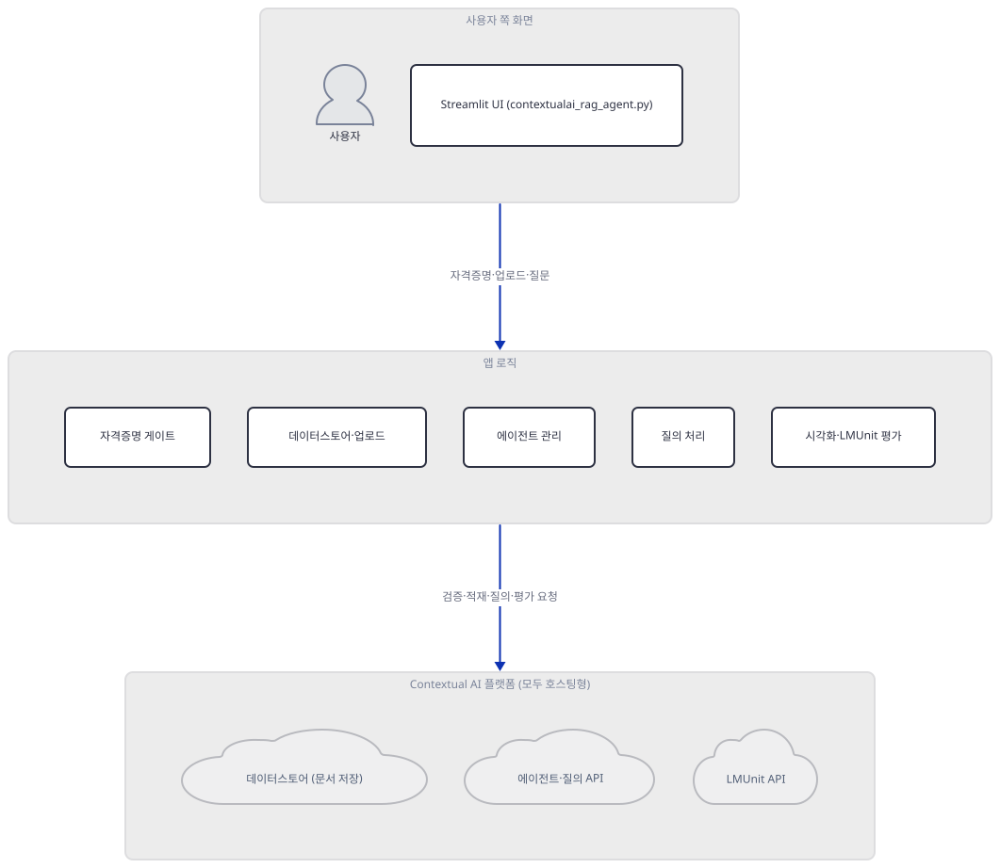
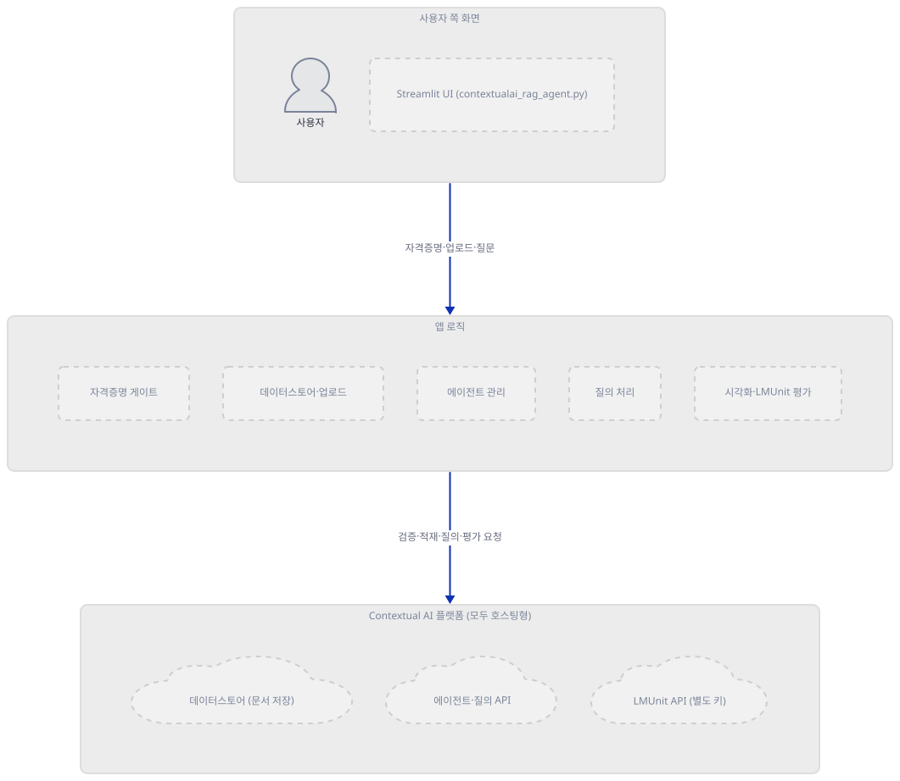
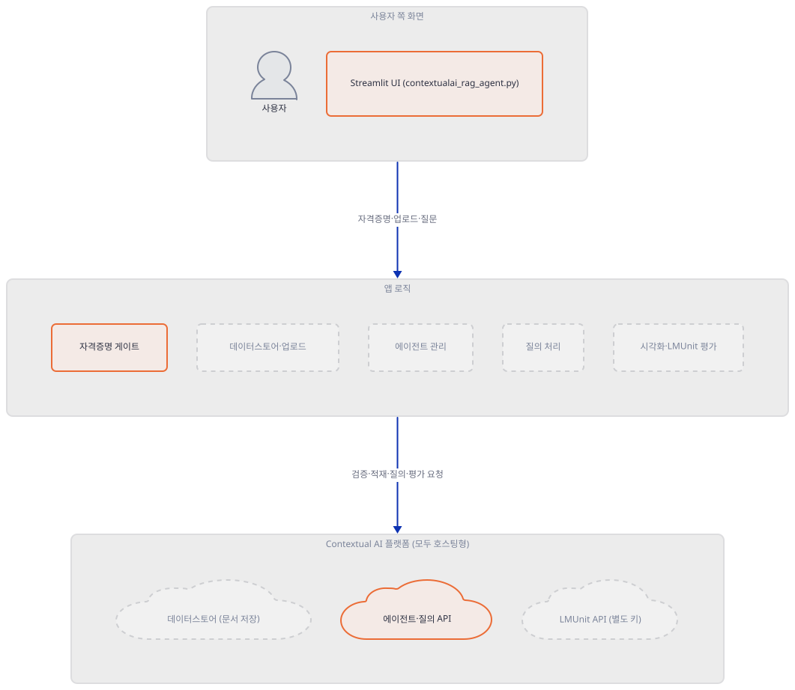
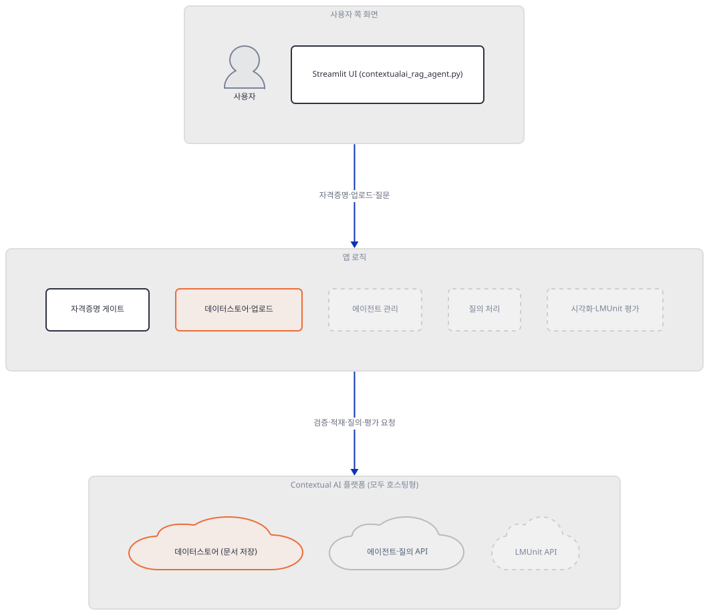
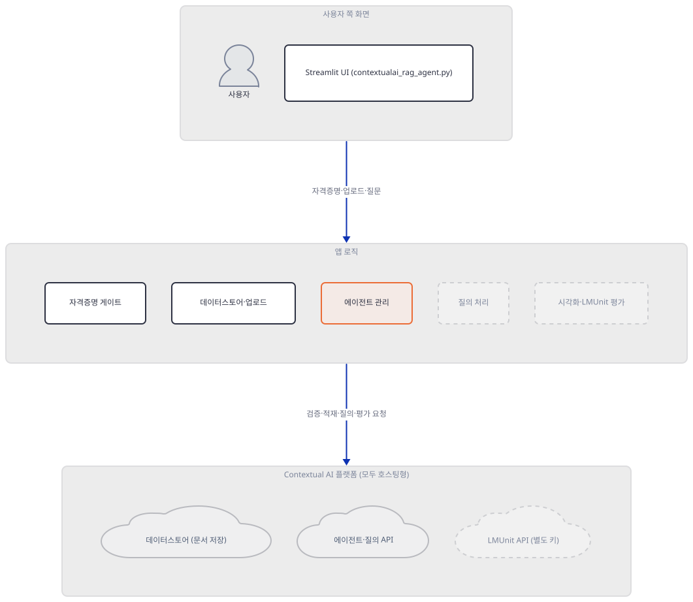
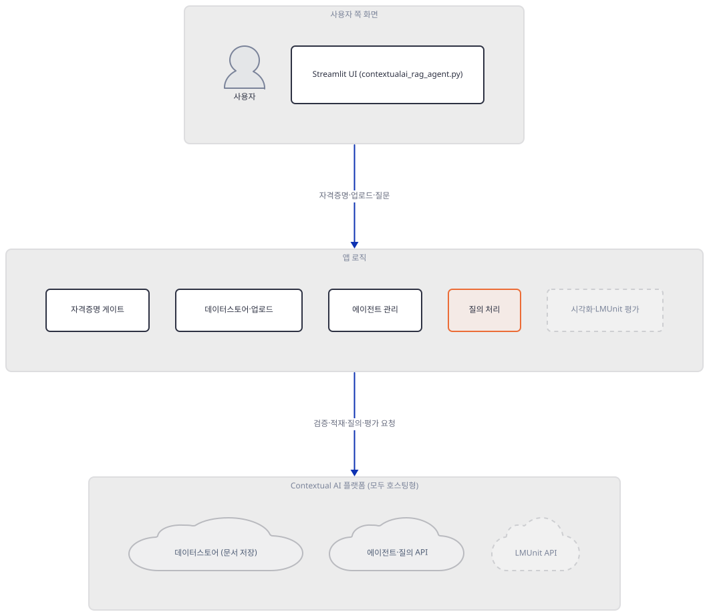
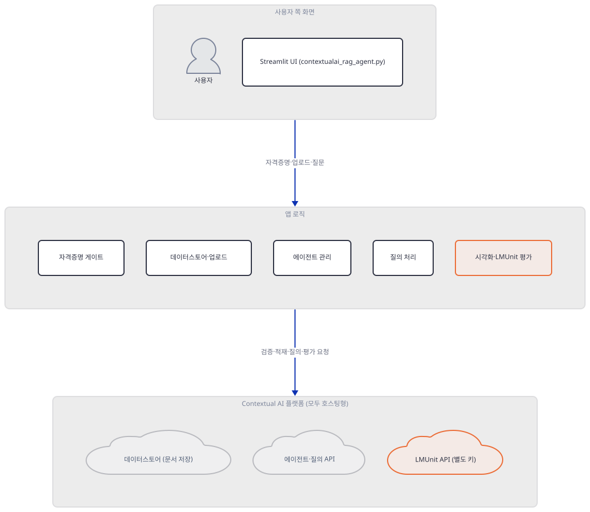
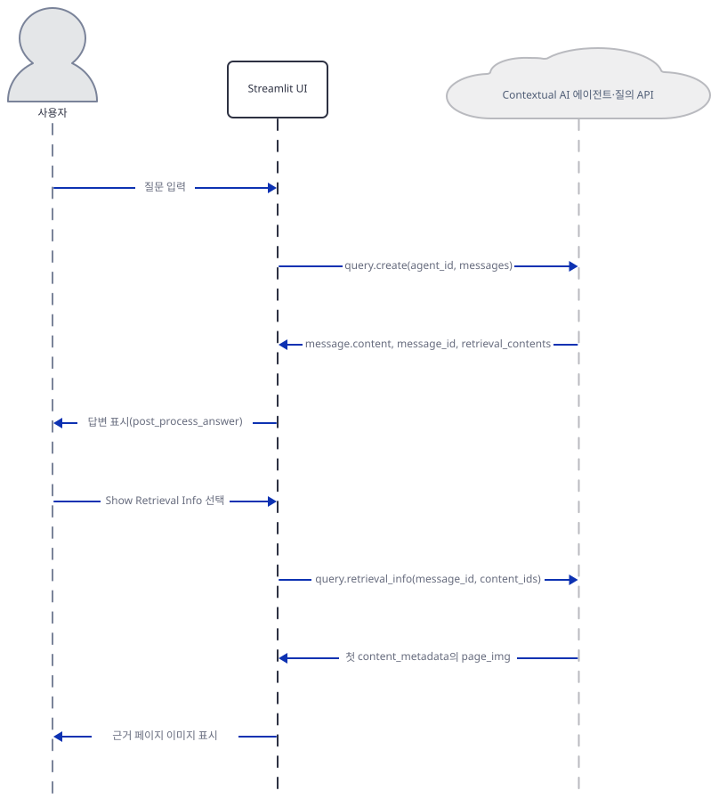

# Day 058 · 🔄 Contextual AI RAG Agent

> 볼륨 5 📀 RAG · 난이도 ★★☆ ⚠ · 예상 소요 90분 · API 비용 대략 확인 불가(Contextual AI는 가입이 필요한 유료 관리형 플랫폼이라 이 문서는 요금표를 확인하지 못했고, LMUnit은 메인 키와 별개로 신청이 필요할 수 있음 — Step 6) · 원본 앱: `rag_tutorials/contextualai_rag_agent`

## 오늘 만들 것

오늘은 Contextual AI의 완전 관리형 RAG 플랫폼 — 데이터스토어(문서 저장), 에이전트, 질의, LMUnit 평가까지 API 하나로 감싼 서비스 — 를 Streamlit으로 감싼 328줄짜리 에이전트를 다룹니다(직접 확인). 지금까지 이 볼륨이 다룬 로컬 임베딩+벡터DB 조합과 달리, 오늘 앱은 문서 저장부터 답변 생성까지 전부 `api.contextual.ai` 하나에 위임하고, 이 파일은 그 위에 자격증명 게이트·업로드 폼·채팅창을 얹은 얇은 층에 가깝습니다(소스로 확인). 그런데 그 얇은 층을 실제 SDK(`contextual-client==0.11.0`, 직접 확인)와 대조하면 몇 군데가 어긋납니다. 사이드바에서 API 키 칸을 비운 채 제출해도 클라이언트 생성 자체는 즉시 통과하고 — Day 057의 Cohere 키처럼 빈 문자열을 미리 걸러내는 검증이 없어 — 실패는 `client.agents.list()`가 실제 네트워크를 타는 순간에만 드러납니다(직접 확인, Step 2). 문서 업로드 위젯이 받는 확장자(`pdf`·`txt`·`md`)와 실제로 적재 가능한 확장자 집합(`ALLOWED_EXTS`: pdf·html·htm·mhtml·doc·docx·ppt·pptx)은 PDF 하나만 겹쳐서, txt·md는 골라도 항상 거부되고 html·doc(x)·ppt(x)는 API가 받아 줄 형식인데도 이 위젯에서는 애초에 고를 수 없습니다(소스로 확인, Step 3). 메타데이터 입력창에 JSON을 적으면 앱은 그것을 `json.loads`로 dict로 바꿔 SDK의 `ingest(..., metadata=...)`에 그대로 넘기는데, 이 인자의 실제 타입은 `str`(문자열화된 JSON)입니다 — 그 결과 실제 멀티파트 요청 필드는 `metadata`가 아니라 `metadata[custom_metadata][field1]`처럼 대괄호로 쪼개진다는 것을 가짜 전송계층(httpx `MockTransport`, 실제 네트워크 미사용)으로 직접 확인했습니다(Step 3). 문서 처리 완료를 기다리는 폴링 함수는 '아직 처리 중'을 `processing`·`pending` 두 가지로만 보는데, SDK가 정의한 실제 상태값은 여섯 가지(`pending`·`processing`·`retrying`·`completed`·`failed`·`cancelled`)라 `retrying` 중인 문서를 이미 끝난 것으로 착각할 수 있습니다(소스로 확인, Step 3). 채팅 응답을 꺼내는 함수는 세 갈래 `hasattr` 분기로 방어적으로 짜여 있지만, 실제 응답 스키마를 직접 만들어 넣어 보면 항상 두 번째 분기(`resp.message.content`)만 실행되고 나머지 둘은 죽은 코드이며, `message`가 비어 있으면 파이썬 객체의 문자열 표현이 그대로 화면에 노출됩니다(직접 확인, Step 5). LMUnit 평가는 SDK 자체 문서에 "별도 신청 양식으로 받는 키가 필요하다"고 적혀 있어, 메인 Contextual AI 키만으로 동작을 보장할 수 없습니다(소스로 확인, Step 6). 아래는 완성된 아키텍처입니다.



## 사전 준비

| 서비스/도구 | 용도 | 발급·설치 |
|---|---|---|
| Contextual AI 계정과 API 키 | 데이터스토어·에이전트·질의 호출 인증(`ContextualAI(api_key=...)`) | `app.contextual.ai` 가입 → API Keys → Create API Key(앱 자체 README 안내) |
| LMUnit 접근 권한(별도) | `client.lmunit.create(...)` 평가 호출에 필요할 수 있는 권한 — SDK 자체 문서에 명시(Step 6) | `contextual.ai/request-lmunit-api/` 양식 제출 |
| 인터넷 연결(`api.contextual.ai`) | 문서 적재부터 답변 생성까지 전 기능이 이 호스트로 나가는 요청에 의존, 로컬 대체 경로 없음(소스로 확인) | 별도 설치 없음 |
| uv | 가상환경 생성과 패키지 설치 | [공통 사전 준비](../README.md#공통-사전-준비-한-번만) 절 참고 |

## 아키텍처 한눈에 보기

| 컴포넌트 | 역할 | 코드 위치 |
|---|---|---|
| 사용자 | API 키 입력, 문서 업로드, 질문 입력 | 코드 없음 (브라우저) |
| Streamlit UI (모듈 스크립트) | 제목·확장 패널 4개·채팅창 렌더링, 세션 상태 배선 | `rag_tutorials/contextualai_rag_agent/contextualai_rag_agent.py:212-326` |
| 자격증명 게이트 (`init_session_state`/`sidebar_api_form`/`ensure_client`) | API 키·베이스 URL을 받아 클라이언트를 만들고 `agents.list()`로 실제 네트워크 검증 | `rag_tutorials/contextualai_rag_agent/contextualai_rag_agent.py:13-31`, `rag_tutorials/contextualai_rag_agent/contextualai_rag_agent.py:34-70`, `rag_tutorials/contextualai_rag_agent/contextualai_rag_agent.py:73-76` |
| 데이터스토어·업로드 (`create_datastore`/`upload_documents`/`wait_until_documents_ready`) | 데이터스토어 생성, 확장자 검사 후 문서 적재, 처리 완료까지 폴링 | `rag_tutorials/contextualai_rag_agent/contextualai_rag_agent.py:79-85`, `rag_tutorials/contextualai_rag_agent/contextualai_rag_agent.py:88-114`, `rag_tutorials/contextualai_rag_agent/contextualai_rag_agent.py:117-130` |
| 에이전트 관리 (`create_agent`/`update_agent_prompt`) | 데이터스토어에 연결된 에이전트 생성, 시스템 프롬프트 수정 | `rag_tutorials/contextualai_rag_agent/contextualai_rag_agent.py:133-139`, `rag_tutorials/contextualai_rag_agent/contextualai_rag_agent.py:188-194` |
| 질의 처리 (`query_agent`/`post_process_answer`) | 에이전트에 질문을 보내고 응답을 파싱·후처리 | `rag_tutorials/contextualai_rag_agent/contextualai_rag_agent.py:142-154`, `rag_tutorials/contextualai_rag_agent/contextualai_rag_agent.py:206-209` |
| 검색 시각화·LMUnit 평가 (`show_retrieval_info`/`evaluate_with_lmunit`) | 답변의 첫 근거 페이지 이미지 조회, 마지막 답변을 루브릭으로 채점 | `rag_tutorials/contextualai_rag_agent/contextualai_rag_agent.py:157-185`, `rag_tutorials/contextualai_rag_agent/contextualai_rag_agent.py:197-203` |
| Contextual AI 플랫폼 | 데이터스토어·에이전트·질의·LMUnit을 한 API로 제공하는 호스팅형 백엔드 | 코드 없음 (외부 서비스, `contextual-client==0.11.0` SDK로 호출) |

## 단계별 진행

### Step 1. 환경 만들기 — 2개 고정과 2개 범위

**목적.** 격리된 가상환경에 `requirements.txt` 4줄을 설치하고, 이 앱의 모든 import가 통과하는지 확인합니다.

**할 일.**

```bash
cd rag_tutorials/contextualai_rag_agent
uv venv
uv pip install -r requirements.txt
```

(pip 대안: `python -m venv .venv && source .venv/bin/activate && pip install -r requirements.txt`. Windows PowerShell은 활성화만 `.venv\Scripts\Activate.ps1`로 바꿉니다.)

이 저장소는 루트에 `pyproject.toml`이 있어 `uv run`이 방금 만든 환경 대신 루트의 `.venv`를 쓰므로, 이후 `uv run` 명령에는 모두 `--no-project`를 붙입니다. `uv venv`는 인자 없이 실행하면 uv 자체 관리 Python 3.13.3을 그대로 고릅니다(직접 확인) — 기기마다 다를 수 있는 캐시된 값입니다. `uv pip install`을 앱 폴더 안에서 실행해도 uv는 상위 폴더를 훑어 리포 루트의 `pyproject.toml`을 찾아내고 `tool.uv.dev-dependencies` 사용에 대한 폐기 경고를 한 줄 띄웁니다(직접 확인) — 설치 대상 환경은 `--python`으로 지정한 곳 그대로이므로 무시해도 됩니다.

`rag_tutorials/contextualai_rag_agent/requirements.txt:1-4`

```text
streamlit==1.40.2
contextual-client>=0.1.0
requests>=2.32.0
pydantic==2.9.2
```

(4줄, 마지막 줄에 개행이 없어 `wc -l`은 3으로 셉니다.) 4줄 중 2개(`streamlit`, `pydantic`)는 정확한 고정이고 2개(`contextual-client`, `requests`)는 하한만 있는 범위입니다. 오늘 실제로 설치하면 51개 패키지로 풀리고(직접 확인), 범위였던 두 줄은 각각 `contextual-client==0.11.0`(하한 0.1.0에서 열한 번째 마이너까지 올라간 범위)과 `requests==2.34.2`로 정해집니다 — 초기 단계 SDK가 흔히 그렇듯 `0.1.0`부터 `0.11.0`까지는 마이너 버전 사이에도 API가 바뀌었을 수 있는 폭이라, 정확한 재현이 필요하면 `contextual-client==0.11.0`처럼 고정하는 편이 안전합니다.



**확인.** 모든 import가 성공하는지, 컴파일이 되는지 확인합니다.

```bash
uv run --no-project python -m py_compile contextualai_rag_agent.py && echo compiled
```

```
compiled
```

```bash
uv run --no-project python -c "
import streamlit as st
import requests
import json
import re
from contextual import ContextualAI
print('ALL IMPORTS OK')
"
```

```
ALL IMPORTS OK
```

### Step 2. 자격증명 게이트 — 빈 키는 클라이언트를 통과한다

**목적.** `init_session_state`·`sidebar_api_form`·`ensure_client`가 API 키를 어떻게(안) 검증하는지, 그리고 이 검증을 통과하기 전에는 이 아래 화면 전체가 렌더되지 않는다는 것을 확인합니다.

**할 일.**

`rag_tutorials/contextualai_rag_agent/contextualai_rag_agent.py:212-220`

```python
init_session_state()

st.title("Contextual AI RAG Agent")

if not sidebar_api_form():
    st.info("Please enter your Contextual AI API key in the sidebar to continue.")
    st.stop()

client = ensure_client()
```

`st.title(...)`이 `sidebar_api_form()` 게이트보다 **먼저** 실행된다는 점이 Day 057과 다릅니다 — 그 날은 `st.stop()`이 `st.title(...)`보다 앞에 있어 제목이 비어 있었지만, 오늘은 키 없이도 상단 제목이 뜹니다(아래 AppTest로 직접 확인). 실제 검증은 폼 제출 안에서 일어납니다.

`rag_tutorials/contextualai_rag_agent/contextualai_rag_agent.py:55-70`

```python
            if st.form_submit_button("Save & Verify"):
                try:
                    client = ContextualAI(api_key=api_key, base_url=base_url)
                    _ = client.agents.list()

                    st.session_state.contextual_api_key = api_key
                    st.session_state.base_url = base_url
                    st.session_state.agent_id = existing_agent_id
                    st.session_state.datastore_id = existing_datastore_id
                    st.session_state.api_key_submitted = True

                    st.success("Credentials verified!")
                    st.rerun()
                except Exception as e:
                    st.error(f"Credential verification failed: {str(e)}")
        return False
```

`st.text_input(type="password")`는 아무것도 입력하지 않으면 `None`이 아니라 빈 문자열 `""`을 돌려줍니다. SDK의 `ContextualAI.__init__`은 `api_key is None`일 때만 환경변수 `CONTEXTUAL_API_KEY`를 대신 찾고 그래도 없으면 `ContextualAIError`를 던지는데(소스로 확인, `contextual/_client.py`), 빈 문자열은 `None`이 아니므로 이 검사를 그냥 통과합니다 — Day 057의 `CohereEmbeddings(cohere_api_key="")`가 즉시 `pydantic.ValidationError`로 멈췄던 것과 달리, 여기는 클라이언트 생성 단계의 방어가 아예 없습니다. 실제 검증은 바로 다음 줄 `client.agents.list()`가 맡습니다 — 이 메서드는 페이지네이션 객체를 지연 없이 즉시 요청하는 동기 호출입니다(소스로 확인, `_base_client.py`의 `_request_api_list`가 `self.request(...)`를 그 자리에서 부름). 소켓을 막아 실제로 나가지 않게 하고 어디서 무엇이 나는지 직접 봅니다.



**확인.** 네트워크를 막아 두고(연결 시도 자체는 이 컴퓨터를 벗어나지 않습니다) 빈 키로 무엇이 통과하고 무엇이 실패하는지 봅니다.

```bash
uv run --no-project python -c "
import socket, time
def _blocked(self, *a, **k):
    raise RuntimeError('network blocked')
socket.socket.connect = _blocked

from contextual import ContextualAI

t0 = time.monotonic()
client = ContextualAI(api_key='', base_url='https://api.contextual.ai/v1')
print(f'empty api_key: constructed in {time.monotonic()-t0:.3f}s, no exception')

try:
    client.agents.list()
except Exception as e:
    print(f'agents.list() -> {type(e).__name__}: {e}')
"
```

직접 확인한 출력:

```
empty api_key: constructed in 0.236s, no exception
agents.list() -> APIConnectionError: Connection error.
```

일반적인 네트워크 환경에서는 이 지점에서 연결 자체는 성공하고, 서버가 빈(또는 틀린) `Authorization: Bearer` 헤더를 401로 거부하면서 `AuthenticationError`가 나는 쪽이 더 흔할 것입니다 — 이 문서는 키가 없어 그 응답까지는 확인하지 못했고, 여기서는 "연결 시도가 정말 `agents.list()`에서 일어난다"는 지점만 소켓 차단으로 증명했습니다. 이어서 키 없이도 화면이 어디까지 뜨는지 `AppTest`로 확인합니다(네트워크·키 모두 불필요).

```bash
uv run --no-project python -c "
from streamlit.testing.v1 import AppTest
at = AppTest.from_file('contextualai_rag_agent.py')
at.run()
print('exception:', at.exception)
print('title:', [t.value for t in at.title])
print('sidebar headers:', [h.value for h in at.sidebar.header])
print('sidebar text_input labels:', [ti.label for ti in at.sidebar.text_input])
print('info messages:', [i.value for i in at.info])
"
```

직접 확인한 출력(Streamlit의 bare-mode 경고 한 줄은 이 앱과 무관해 생략):

```
exception: ElementList()
title: ['Contextual AI RAG Agent']
sidebar headers: ['API & Resource Setup']
sidebar text_input labels: ['Contextual AI API Key', 'Base URL', 'Existing Agent ID (optional)', 'Existing Datastore ID (optional)']
info messages: ['Please enter your Contextual AI API key in the sidebar to continue.']
```

예외 없이 렌더되고, 제목은 채워져 있지만(위에서 확인한 순서대로) 사이드바 폼과 안내 문구 아래로는 아무 것도 없습니다 — `st.stop()`이 `client = ensure_client()`(220행) 이후 코드 전체를 막기 때문입니다.

### Step 3. 데이터스토어 생성과 문서 업로드 — 위젯과 API가 다른 확장자를 본다

**목적.** `create_datastore`가 저장소를 어떻게 만드는지, `upload_documents`가 확장자와 메타데이터를 어떻게 다루는지, `wait_until_documents_ready`가 처리 완료를 어떻게 판단하는지 확인합니다.

**할 일.**

`rag_tutorials/contextualai_rag_agent/contextualai_rag_agent.py:88-114`

```python
ALLOWED_EXTS = {".pdf", ".html", ".htm", ".mhtml", ".doc", ".docx", ".ppt", ".pptx"}

def upload_documents(client, datastore_id: str, files: List[bytes], filenames: List[str], metadata: Optional[dict]) -> List[str]:
    doc_ids: List[str] = []
    for content, fname in zip(files, filenames):
        try:
            ext = os.path.splitext(fname)[1].lower()
            if ext not in ALLOWED_EXTS:
                st.error(f"Unsupported file extension for {fname}. Allowed: {sorted(ALLOWED_EXTS)}")
                continue
            with tempfile.NamedTemporaryFile(delete=False, suffix=ext) as tmp:
                tmp.write(content)
                tmp_path = tmp.name
            with open(tmp_path, "rb") as f:
                if metadata:
                    result = client.datastores.documents.ingest(datastore_id, file=f, metadata=metadata)
                else:
                    result = client.datastores.documents.ingest(datastore_id, file=f)
                doc_ids.append(getattr(result, "id", ""))
        except Exception as e:
            st.error(f"Failed to upload {fname}: {e}")
        finally:
            try:
                os.unlink(tmp_path)
            except Exception:
                pass
    return doc_ids
```

`ALLOWED_EXTS`는 SDK의 `ingest()` 문서 문자열이 명시한 허용 형식과 정확히 같습니다(소스로 확인, `contextual/resources/datastores/documents.py`). 문제는 이 함수에 도달하는 파일들을 고르는 위젯입니다.

`rag_tutorials/contextualai_rag_agent/contextualai_rag_agent.py:235`

```python
    uploaded_files = st.file_uploader("Upload PDFs or text files", type=["pdf", "txt", "md"], accept_multiple_files=True)
```

위젯은 `pdf`·`txt`·`md`만 고를 수 있게 하는데 `ALLOWED_EXTS`와 겹치는 것은 `pdf` 하나뿐입니다 — `txt`·`md`를 골라 올리면 `upload_documents`의 확장자 검사에서 매번 거부되고, 반대로 API가 실제로 받는 `html`·`doc(x)`·`ppt(x)`는 위젯 자체가 애초에 선택지에 넣어 주지 않습니다. 메타데이터는 사이드바 아래 텍스트 영역에 JSON으로 입력합니다.

`rag_tutorials/contextualai_rag_agent/contextualai_rag_agent.py:240-248`

```python
        if st.button("Ingest Documents"):
            parsed_metadata = None
            if metadata_json.strip():
                try:
                    parsed_metadata = json.loads(metadata_json)
                except Exception as e:
                    st.error(f"Invalid metadata JSON: {e}")
                    parsed_metadata = None
            ids = upload_documents(client, st.session_state.datastore_id, contents, names, parsed_metadata)
```

`json.loads(metadata_json)`은 텍스트를 파이썬 `dict`로 바꾸고, 그 `dict`가 그대로 `ingest(..., metadata=parsed_metadata)`로 들어갑니다. 그런데 SDK의 `ingest()`는 `metadata`를 `str`로 타입 힌트합니다 — 문서 문자열도 "Metadata request in stringified JSON format"이라고 명시합니다(소스로 확인, 아래 확인에서 타입을 직접 출력). `ingest()`는 `multipart/form-data` 요청이라 `metadata`가 dict로 들어오면 SDK의 querystring 직렬화기가 중첩 dict를 대괄호 표기로 펼칩니다 — 실제로 무엇이 나가는지 네트워크 없이(가짜 전송계층으로) 직접 확인합니다.



**확인.** 위젯과 `ALLOWED_EXTS`가 정말 다른 집합인지 먼저 grep으로 봅니다.

```bash
grep -n "ALLOWED_EXTS\|file_uploader" contextualai_rag_agent.py
```

```
88:ALLOWED_EXTS = {".pdf", ".html", ".htm", ".mhtml", ".doc", ".docx", ".ppt", ".pptx"}
95:            if ext not in ALLOWED_EXTS:
96:                st.error(f"Unsupported file extension for {fname}. Allowed: {sorted(ALLOWED_EXTS)}")
235:    uploaded_files = st.file_uploader("Upload PDFs or text files", type=["pdf", "txt", "md"], accept_multiple_files=True)
```

다음으로 `metadata` 인자의 실제 타입과, dict를 넘겼을 때 나가는 멀티파트 요청 본문을 `httpx.MockTransport`로 가로채 확인합니다(요청은 이 프로세스를 벗어나지 않습니다).

```bash
uv run --no-project python -c "
import inspect, httpx, json
from contextual import ContextualAI
from contextual.resources.datastores.documents import DocumentsResource

print('ingest metadata annotation:', inspect.signature(DocumentsResource.ingest).parameters['metadata'].annotation)

captured = {}
def handler(request: httpx.Request) -> httpx.Response:
    captured['body'] = request.read()
    return httpx.Response(200, json={'id': 'fake_doc_id'})

client = ContextualAI(api_key='fake', http_client=httpx.Client(transport=httpx.MockTransport(handler)))
parsed_metadata = json.loads('{\"custom_metadata\": {\"field1\": \"value1\"}}')
client.datastores.documents.ingest('ds_fake', file=('test.pdf', b'%PDF-1.4', 'application/pdf'), metadata=parsed_metadata)
print(captured['body'].decode())
"
```

직접 확인한 출력(경계 문자열은 매 실행 무작위라 예시로 남깁니다):

```
ingest metadata annotation: str | Omit

--boundary
Content-Disposition: form-data; name="metadata[custom_metadata][field1]"

value1
--boundary
Content-Disposition: form-data; name="file"; filename="test.pdf"
Content-Type: application/pdf

%PDF-1.4
--boundary--
```

`metadata`라는 이름의 필드는 아예 나가지 않고, 그 자리에 `metadata[custom_metadata][field1]`이라는 필드가 대신 나갑니다 — API가 기대하는 "하나의 JSON 문자열"과는 다른 모양입니다. 마지막으로 문서 상태값이 정말 여섯 가지인지, `wait_until_documents_ready`가 그중 두 가지만 보는지 확인합니다.

`rag_tutorials/contextualai_rag_agent/contextualai_rag_agent.py:117-130`

```python
def wait_until_documents_ready(api_key: str, datastore_id: str, base_url: str, max_checks: int = 30, interval_sec: float = 5.0) -> None:
    url = f"{base_url.rstrip('/')}/datastores/{datastore_id}/documents"
    headers = {"Authorization": f"Bearer {api_key}"}

    for _ in range(max_checks):
        try:
            resp = requests.get(url, headers=headers, timeout=30)
            if resp.status_code == 200:
                docs = resp.json().get("documents", [])
                if not any(d.get("status") in ("processing", "pending") for d in docs):
                    return
            time.sleep(interval_sec)
        except Exception:
            time.sleep(interval_sec)
```

```bash
uv run --no-project python -c "
import typing
from contextual.types.datastores.document_metadata import DocumentMetadata
print(typing.get_args(DocumentMetadata.model_fields['status'].annotation))
"
```

직접 확인한 출력:

```
('pending', 'processing', 'retrying', 'completed', 'failed', 'cancelled')
```

`wait_until_documents_ready`가 "아직 처리 중"으로 보는 값은 이 여섯 개 중 `processing`·`pending` 두 개뿐입니다 — 문서가 `retrying` 상태(일시적 실패 후 재시도 중)면 이 함수는 더 기다리지 않고 곧바로 반환해, 화면에는 "Documents are ready."가 뜨지만 실제로는 아직 끝나지 않았을 수 있습니다.

### Step 4. 에이전트 생성과 설정

**목적.** `create_agent`가 데이터스토어와 에이전트를 어떻게 묶는지, `update_agent_prompt`가 시스템 프롬프트를 어떻게 바꾸는지, 두 호출이 실제 SDK 시그니처와 맞는지 확인합니다.

**할 일.**

`rag_tutorials/contextualai_rag_agent/contextualai_rag_agent.py:133-139`

```python
def create_agent(client, name: str, description: str, datastore_id: str) -> Optional[str]:
    try:
        agent = client.agents.create(name=name, description=description, datastore_ids=[datastore_id])
        return getattr(agent, "id", None)
    except Exception as e:
        st.error(f"Failed to create agent: {e}")
        return None
```

`datastore_ids=[datastore_id]`처럼 항상 원소 1개짜리 리스트만 넘깁니다 — API 자체는 에이전트 하나에 여러 데이터스토어를 묶을 수 있지만(소스로 확인, `agents.create`의 `datastore_ids` 인자는 여러 개를 받는 시퀀스), 이 UI에는 데이터스토어를 하나만 고르는 흐름밖에 없어 그 다중 연결 기능에는 애초에 닿지 않습니다. 시스템 프롬프트는 별도 함수로 나중에 갱신합니다.

`rag_tutorials/contextualai_rag_agent/contextualai_rag_agent.py:188-194`

```python
def update_agent_prompt(client, agent_id: str, system_prompt: str) -> bool:
    try:
        client.agents.update(agent_id=agent_id, system_prompt=system_prompt)
        return True
    except Exception as e:
        st.error(f"Failed to update system prompt: {e}")
        return False
```



**확인.** 키·네트워크 없이 두 호출의 인자 이름이 실제 SDK 클래스와 맞는지 시그니처로 직접 확인합니다.

```bash
uv run --no-project python -c "
import inspect
from contextual.resources.agents.agents import AgentsResource
skip = {'self','extra_headers','extra_query','extra_body','timeout'}
def params(sig): return [p for p in sig.parameters if p not in skip]
print('agents.create:', params(inspect.signature(AgentsResource.create)))
print('agents.update:', params(inspect.signature(AgentsResource.update)))
"
```

직접 확인한 출력:

```
agents.create: ['name', 'agent_configs', 'datastore_ids', 'description', 'filter_prompt', 'multiturn_system_prompt', 'no_retrieval_system_prompt', 'suggested_queries', 'system_prompt', 'template_name']
agents.update: ['agent_id', 'agent_configs', 'datastore_ids', 'description', 'filter_prompt', 'multiturn_system_prompt', 'name', 'no_retrieval_system_prompt', 'suggested_queries', 'system_prompt']
```

앱이 쓰는 `name`·`description`·`datastore_ids`(create)와 `agent_id`·`system_prompt`(update)는 모두 이 목록에 있습니다 — 두 호출 모두 실제 시그니처와 어긋나지 않습니다.

### Step 5. 질의 처리 — 세 갈래 분기 중 하나만 산다

**목적.** `query_agent`가 응답에서 답변 텍스트를 어떻게 꺼내는지, 세 갈래 방어 코드 중 실제로 어느 것이 실행되는지, `post_process_answer`가 무엇을 정리하는지 확인합니다.

**할 일.**

`rag_tutorials/contextualai_rag_agent/contextualai_rag_agent.py:142-154`

```python
def query_agent(client, agent_id: str, query: str) -> Tuple[str, Any]:
    try:
        resp = client.agents.query.create(agent_id=agent_id, messages=[{"role": "user", "content": query}])
        if hasattr(resp, "content"):
            return resp.content, resp
        if hasattr(resp, "message") and hasattr(resp.message, "content"):
            return resp.message.content, resp
        if hasattr(resp, "messages") and resp.messages:
            last_msg = resp.messages[-1]
            return getattr(last_msg, "content", str(last_msg)), resp
        return str(resp), resp
    except Exception as e:
        return f"Error querying agent: {e}", None
```

`agents.query.create`가 실제로 돌려주는 타입(`QueryResponse`)에는 `conversation_id`·`retrieval_contents`·`attributions`·`groundedness_scores`·`message`(단수, `Optional`)·`message_id` 필드만 있고 최상위 `content`도 `messages`(복수)도 없습니다(소스로 확인, `contextual/types/agents/query_response.py`). 그 스키마를 그대로 만들어 이 네 갈래를 직접 실행해 보면 어느 가지가 사는지 알 수 있습니다.



**확인.** 실제 `QueryResponse` 모델로 값을 채워 네 분기 중 무엇이 실행되는지 확인합니다.

```bash
uv run --no-project python -c "
from contextual.types.agents.query_response import QueryResponse

resp = QueryResponse.model_validate({
    'conversation_id': 'c1', 'retrieval_contents': [],
    'message': {'role': 'assistant', 'content': 'answer text'}, 'message_id': 'm1',
})
if hasattr(resp, 'content'):
    print('branch 1: resp.content')
elif hasattr(resp, 'message') and hasattr(resp.message, 'content'):
    print('branch 2: resp.message.content ->', resp.message.content)
elif hasattr(resp, 'messages') and resp.messages:
    print('branch 3: resp.messages[-1]')
else:
    print('branch 4: str(resp) fallback')

resp_none = QueryResponse.model_validate({'conversation_id': 'c2', 'retrieval_contents': [], 'message': None})
if hasattr(resp_none, 'content'):
    print('message=None -> branch 1')
elif hasattr(resp_none, 'message') and hasattr(resp_none.message, 'content'):
    print('message=None -> branch 2')
elif hasattr(resp_none, 'messages') and resp_none.messages:
    print('message=None -> branch 3')
else:
    print('message=None -> branch 4: str(resp) fallback,', str(resp_none)[:60])
"
```

직접 확인한 출력:

```
branch 2: resp.message.content -> answer text
message=None -> branch 4: str(resp) fallback, QueryResponse(conversation_id='c2', retrieval_contents=[]
```

정상 응답에서는 항상 두 번째 분기만 실행되어 첫 번째(`resp.content`)와 세 번째(`resp.messages`)는 죽은 코드이고, `message`가 비어 있는 응답(예: `retrievals_only` 사용 등)이 오면 네 번째 분기가 파이썬 객체의 `repr` 그대로를 채팅 말풍선에 띄웁니다. 답변이 만들어지면 후처리를 한 번 거칩니다.

`rag_tutorials/contextualai_rag_agent/contextualai_rag_agent.py:206-209`

```python
def post_process_answer(text: str) -> str:
    text = re.sub(r"\(\s*\)", "", text)
    text = text.replace("• ", "\n- ")
    return text
```

빈 괄호(`( )`, 공백 포함)를 지우고 "• "를 줄바꿈+대시로 바꿉니다 — 인용 표시가 비어 남는 경우나 글머리 기호 답변을 다듬는 용도로 보입니다(소스로 확인, 정규식이 지우는 자리에는 공백이 그대로 남습니다).

### Step 6. 검색 시각화와 LMUnit 평가 — 별도 요청, 별도 키

**목적.** `show_retrieval_info`가 `message_id`를 이어받아 어떻게 근거 페이지 이미지를 가져오는지, `evaluate_with_lmunit`이 무엇을 요청하는지, 그리고 LMUnit에 별도 접근 권한이 필요하다는 사실을 확인합니다.

**할 일.**

`rag_tutorials/contextualai_rag_agent/contextualai_rag_agent.py:157-185`

```python
def show_retrieval_info(client, raw_response, agent_id: str) -> None:
    try:
        if not raw_response:
            st.info("No retrieval info available.")
            return
        message_id = getattr(raw_response, "message_id", None)
        retrieval_contents = getattr(raw_response, "retrieval_contents", [])
        if not message_id or not retrieval_contents:
            st.info("No retrieval metadata returned.")
            return
        first_content_id = getattr(retrieval_contents[0], "content_id", None)
        if not first_content_id:
            st.info("Missing content_id in retrieval metadata.")
            return
        ret_result = client.agents.query.retrieval_info(message_id=message_id, agent_id=agent_id, content_ids=[first_content_id])
        metadatas = getattr(ret_result, "content_metadatas", [])
        if not metadatas:
            st.info("No content metadatas found.")
            return
        page_img_b64 = getattr(metadatas[0], "page_img", None)
        if not page_img_b64:
            st.info("No page image provided in metadata.")
            return
        import base64
        img_bytes = base64.b64decode(page_img_b64)
        st.image(img_bytes, caption="Top Attribution Page", use_container_width=True)
        # Removed raw object rendering to keep UI clean
    except Exception as e:
        st.error(f"Failed to load retrieval info: {e}")
```

이 함수는 `query_agent`가 이미 받아 둔 응답(`raw_response`, 세션에 `last_raw_response`로 저장됨)에서 `message_id`와 첫 근거의 `content_id`만 꺼내 **새 요청**을 하나 더 보냅니다 — 답변을 만들 때 이미 받은 정보가 아니라, 같은 `message_id`를 다시 물고 가는 별도 왕복입니다. `RetrievalInfoResponse.content_metadatas`와 그 원소의 `page_img`(페이지 이미지, base64로 추정) 필드명은 SDK 타입과 정확히 일치합니다(소스로 확인, `contextual/types/agents/retrieval_info_response.py`). LMUnit 평가는 별도 API입니다.

`rag_tutorials/contextualai_rag_agent/contextualai_rag_agent.py:197-203`

```python
def evaluate_with_lmunit(client, query: str, response_text: str, unit_test: str):
    try:
        result = client.lmunit.create(query=query, response=response_text, unit_test=unit_test)
        st.subheader("Evaluation Result")
        st.code(str(result), language="json")
    except Exception as e:
        st.error(f"LMUnit evaluation failed: {e}")
```

`client.lmunit.create(query=..., response=..., unit_test=...)`의 인자 이름은 실제 SDK와 맞습니다(아래 확인). 다만 SDK의 `LMUnitResource.create` 문서 문자열 자체가 "Obtain an LMUnit API key by completing [this form]"이라고 명시합니다(소스로 확인) — 메인 Contextual AI 키와 같은 것인지, 계정에 자동으로 포함되는지는 이 문서에서 확인하지 못했지만, 최소한 SDK가 스스로 "별도 신청"을 언급하는 기능이라는 점은 분명합니다.



**확인.** `lmunit.create`의 인자 이름을 키·네트워크 없이 확인합니다.

```bash
uv run --no-project python -c "
import inspect
from contextual.resources.lmunit import LMUnitResource
skip = {'self','extra_headers','extra_query','extra_body','timeout'}
print([p for p in inspect.signature(LMUnitResource.create).parameters if p not in skip])
"
```

직접 확인한 출력:

```
['query', 'response', 'unit_test']
```

`evaluate_with_lmunit`이 넘기는 `query`·`response`·`unit_test` 세 인자와 정확히 같습니다.

### Step 7. 화면 배선과 실행 확인

**목적.** 나머지 Streamlit 배선 — 채팅 기록 렌더링, 디버그 패널의 체크박스·버튼, 사이드바의 Clear/Reset — 을 확인하고, 이 앱을 실제로 띄웠을 때 무엇이 보이는지 정리합니다. 배선 자체는 Day 001·052 이후 반복된 패턴이라 새로 설명하지 않습니다.

**할 일.**

`rag_tutorials/contextualai_rag_agent/contextualai_rag_agent.py:276-295`

```python
for message in st.session_state.chat_history:
    with st.chat_message(message["role"]):
        st.markdown(message["content"]) 

query = st.chat_input("Ask a question about your documents")
if query:
    st.session_state.last_user_query = query
    st.session_state.chat_history.append({"role": "user", "content": query})
    with st.chat_message("user"):
        st.markdown(query)

    if st.session_state.agent_id:
        with st.chat_message("assistant"):
            answer, raw = query_agent(client, st.session_state.agent_id, query)
            st.session_state.last_raw_response = raw
            processed = post_process_answer(answer)
            st.markdown(processed)
            st.session_state.chat_history.append({"role": "assistant", "content": processed})
    else:
        st.error("Please create or select an agent first.")
```

매 질문마다 `last_raw_response`를 새 값으로 덮어써서, Step 6의 "Show Retrieval Info"는 항상 **가장 최근 답변**의 근거만 보여줍니다(이전 답변으로 되돌아가 볼 방법은 없습니다). 디버그 패널(297-312행)과 사이드바의 Clear/Reset 버튼(314-326행)은 세션 상태를 비우고 `st.rerun()`하는, 이 시리즈에서 여러 번 본 패턴입니다. 실제로 앱을 띄우는 명령은 다음과 같습니다.

```bash
uv run --no-project streamlit run contextualai_rag_agent.py
```

(pip 대안: `streamlit run contextualai_rag_agent.py`.) 키를 입력하지 않으면 Step 2에서 확인했듯 제목과 사이드바 폼까지만 뜹니다 — 이 문서는 실제 브라우저를 띄우는 대신 `AppTest`로 이미 그 상태를 재현해 확인했습니다.

**확인.** 이 파일이 정의하는 모든 함수 이름이 소스에 그대로 있는지 마지막으로 훑습니다.

```bash
grep -n "^def " contextualai_rag_agent.py
```

```
13:def init_session_state() -> None:
34:def sidebar_api_form() -> bool:
73:def ensure_client():
79:def create_datastore(client, name: str) -> Optional[str]:
90:def upload_documents(client, datastore_id: str, files: List[bytes], filenames: List[str], metadata: Optional[dict]) -> List[str]:
117:def wait_until_documents_ready(api_key: str, datastore_id: str, base_url: str, max_checks: int = 30, interval_sec: float = 5.0) -> None:
133:def create_agent(client, name: str, description: str, datastore_id: str) -> Optional[str]:
142:def query_agent(client, agent_id: str, query: str) -> Tuple[str, Any]:
157:def show_retrieval_info(client, raw_response, agent_id: str) -> None:
188:def update_agent_prompt(client, agent_id: str, system_prompt: str) -> bool:
197:def evaluate_with_lmunit(client, query: str, response_text: str, unit_test: str):
206:def post_process_answer(text: str) -> str:
```

12개 함수 전부가 이 문서의 Step 1~7 어딘가에서 다뤄졌습니다.

## 요청 한 건이 흐르는 과정



이 그림은 문서가 이미 적재되고 에이전트가 만들어진 뒤, 채팅으로 질문 하나를 보내고 그 답의 근거 페이지까지 들여다보는 경로를 그린 것입니다. 질문은 `query_agent`를 거쳐 Contextual AI 에이전트·질의 API로 한 번에 전달되고(Step 5), 응답에는 답변 텍스트(`message.content`)뿐 아니라 근거 목록(`retrieval_contents`)과 메시지 식별자(`message_id`)가 함께 돌아옵니다. 화면에는 `post_process_answer`를 거친 답변만 먼저 뜨고, 사용자가 디버그 패널에서 "Show Retrieval Info"를 체크해야 두 번째 요청이 나갑니다 — 방금 받은 `message_id`와 근거 목록의 첫 `content_id`를 그대로 물고 가는 별도 호출(`query.retrieval_info`, Step 6)로, 그 결과로 돌아오는 첫 근거의 페이지 이미지(base64)를 그제서야 화면에 붙입니다. 한 번의 질문에도 근거 이미지를 보려면 같은 `message_id`를 매개로 두 번의 왕복이 필요하고, LMUnit 평가(Step 6)는 이 시퀀스에 없는 완전히 별도의 세 번째 요청입니다.

## 실행 체크리스트

- [ ] `uv venv && uv pip install -r requirements.txt`가 51개 패키지를 충돌 없이 설치한다는 것을 확인했다(`contextual-client`는 `>=0.1.0` 범위, 오늘은 0.11.0으로 풀림)
- [ ] 사이드바에 빈 API 키를 넣고 제출해도 클라이언트 생성 자체는 통과하고, 실패는 `agents.list()`의 네트워크 호출에서만 일어난다는 것을 직접 확인했다
- [ ] 문서 업로드 위젯이 받는 확장자(pdf·txt·md)와 실제 적재 가능 확장자(`ALLOWED_EXTS`: pdf·html·htm·mhtml·doc·docx·ppt·pptx)가 PDF 하나만 겹친다는 것을 grep으로 확인했다
- [ ] 메타데이터 dict를 그대로 넘기면 실제 멀티파트 요청 필드가 `metadata`가 아니라 `metadata[...][...]`로 쪼개진다는 것을 가짜 전송계층으로 직접 확인했다
- [ ] `wait_until_documents_ready`가 문서 상태 6가지 중 2가지(`processing`·`pending`)만 "아직 처리 중"으로 본다는 것을 SDK 타입에서 확인했다
- [ ] `create_agent`·`update_agent_prompt`·`query.create`·`query.retrieval_info`·`lmunit.create` 호출의 인자 이름이 실제 SDK 시그니처와 맞는다는 것을 직접 확인했다
- [ ] `query_agent`의 세 갈래 `hasattr` 분기 중 실제로는 두 번째(`resp.message.content`)만 실행되고 나머지는 죽은 코드라는 것을 직접 확인했다
- [ ] LMUnit은 SDK 문서 자체가 별도 신청을 언급한다는 것을 확인했다
- [ ] 키 없이도 `streamlit run`이 제목과 사이드바 자격증명 폼까지는 뜬다는 것을 AppTest로 확인했다

## 문제 해결

| 증상 | 원인 | 해결 |
|---|---|---|
| `.txt`나 `.md`를 골라 올려도 매번 "Unsupported file extension" 오류 | 업로드 위젯은 `type=["pdf","txt","md"]`로 고르게 하지만 실제 적재 검사(`ALLOWED_EXTS`)는 pdf·html·htm·mhtml·doc·docx·ppt·pptx만 허용(소스로 확인) | PDF만 사용하거나, html·doc(x)·ppt(x)는 API가 받는 형식이라도 이 위젯에서는 애초에 선택할 수 없다는 점을 감안 |
| 커스텀 메타데이터를 입력했는데 문서에 제대로 안 붙는 것 같음 | `json.loads`로 만든 dict를 `ingest(..., metadata=dict)`로 그대로 넘기지만 SDK는 `metadata`를 문자열로 기대하며, 실제 요청은 `metadata`가 아니라 `metadata[...][...]` 필드로 나감(직접 확인, Step 3) | 리포 코드는 고치지 않는 방침. 재현하려면 호출부의 `metadata=metadata`를 `metadata=json.dumps(metadata)`로 바꿔 보기 |
| "Save & Verify"를 빈 키로 눌러도 바로 에러가 안 뜨고 한참 후에 실패 | 빈 문자열 키는 `ContextualAI(...)` 생성을 그냥 통과하고, 실패는 `agents.list()`가 실제 네트워크를 탈 때에만 남(직접 확인, Step 2) | 키 칸이 비어 있지 않은지 먼저 확인 후 재시도 |
| 문서를 올렸는데 대기가 예상보다 짧게 끝나고 질문이 근거를 못 찾음(추정) | `wait_until_documents_ready`가 상태값 6가지 중 `processing`·`pending`만 "처리 중"으로 보아 `retrying` 문서를 이미 끝난 것으로 넘길 수 있음(소스로 확인, Step 3) | `app.contextual.ai` UI에서 데이터스토어의 문서 상태를 직접 확인 |
| 채팅에 답변 대신 `QueryResponse(...)` 같은 객체 문자열이 그대로 뜸 | `query_agent`의 방어적 `hasattr` 분기 중 `message`가 `None`인 경우를 앞의 두 분기가 못 거르고 `str(resp)` 그대로를 반환(직접 확인, Step 5) | 리포 코드는 고치지 않는 방침. 원인 파악용으로만 사용 |
| LMUnit 평가 버튼을 눌렀는데 권한 관련 오류(추정, 키 없어 실제 응답 미확인) | SDK의 `lmunit.create` 문서 문자열이 별도 신청 양식으로 받는 키가 필요하다고 명시(소스로 확인, Step 6) | `contextual.ai/request-lmunit-api/`에서 별도 신청 |

## 더 해보기

- `upload_documents` 호출부의 `metadata=metadata`를 `metadata=json.dumps(metadata)`로 바꿔 보고, Step 3의 `MockTransport` 캡처를 다시 실행해 필드가 정말 하나의 `metadata` 문자열로 나가는지 확인해보기
- `wait_until_documents_ready`의 `("processing", "pending")`에 `"retrying"`을 추가해 보고, 문서가 그 상태일 때 폴링이 더 오래 도는지 확인해보기
- 별도 LMUnit 키를 신청해 `evaluate_with_lmunit`이 실제로 반환하는 점수 스키마(`LMUnitCreateResponse`)가 무엇인지 확인해보기 — 앱은 `str(result)`로만 찍어서 필드 이름이 화면에 드러나지 않는다

## 다음 날 예고

[Day 059 · 📰 AI Blog Search (RAG)](../day059-ai-blog-search/README.md) — LangGraph로 블로그 URL을 수집해 Qdrant에 저장하고, 질의를 재작성·평가하며 답하는 에이전틱 RAG를 다룹니다.
