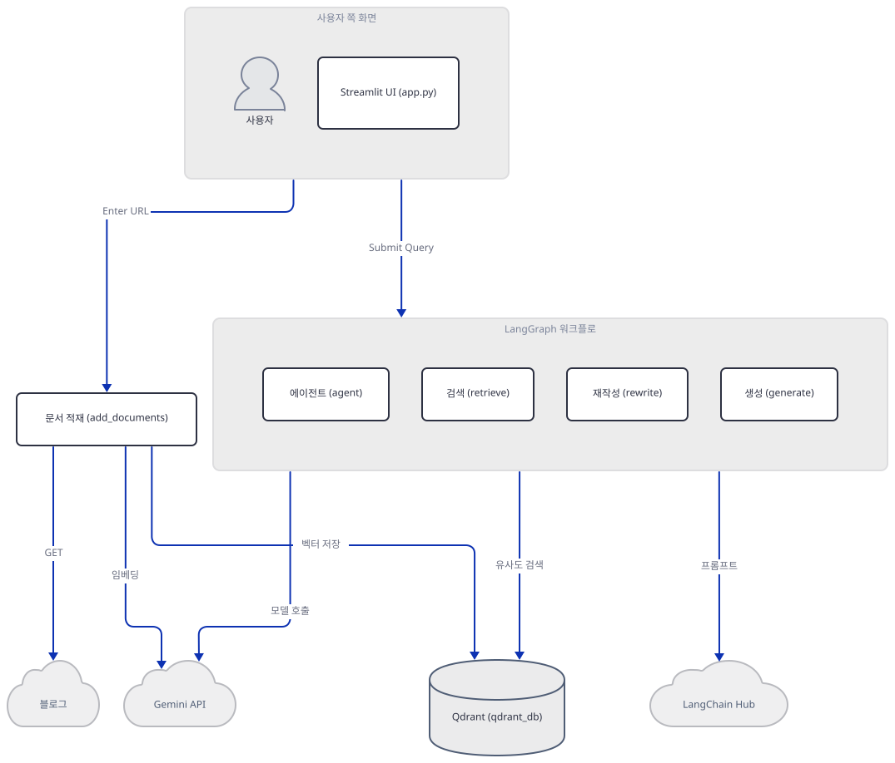
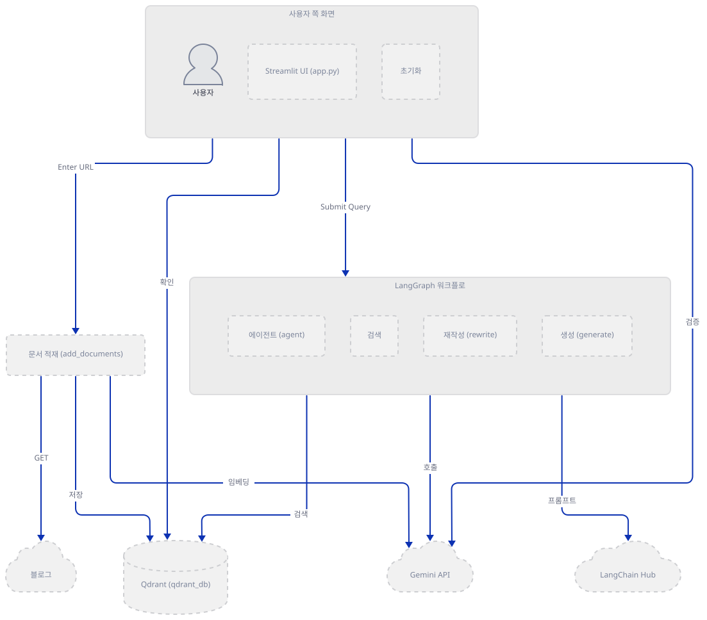
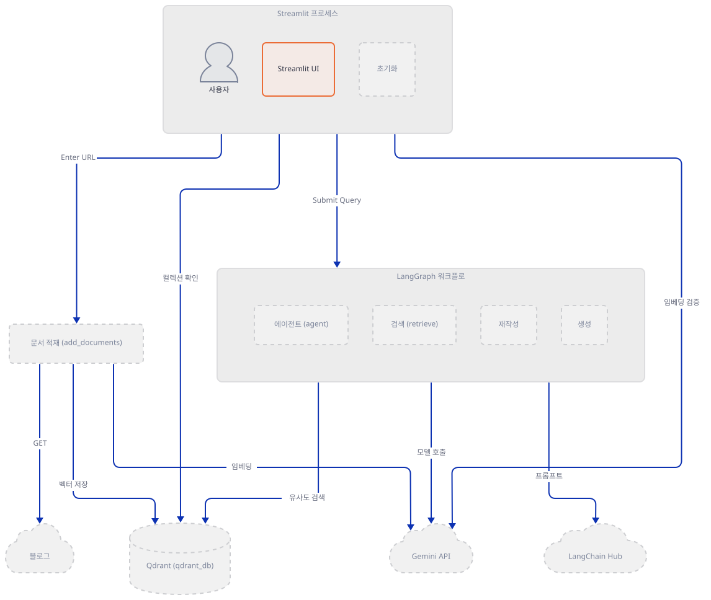
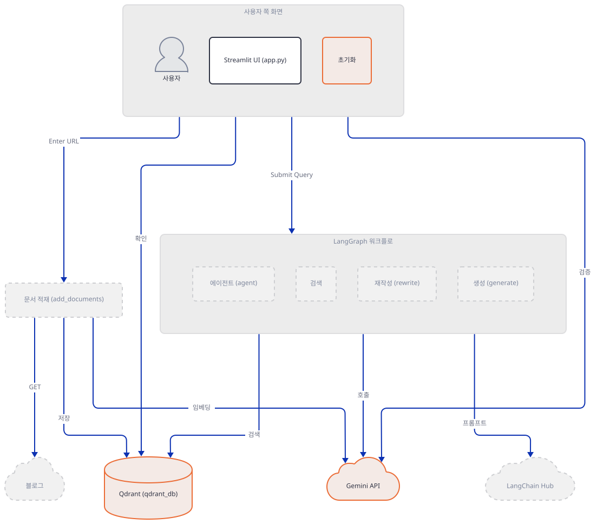
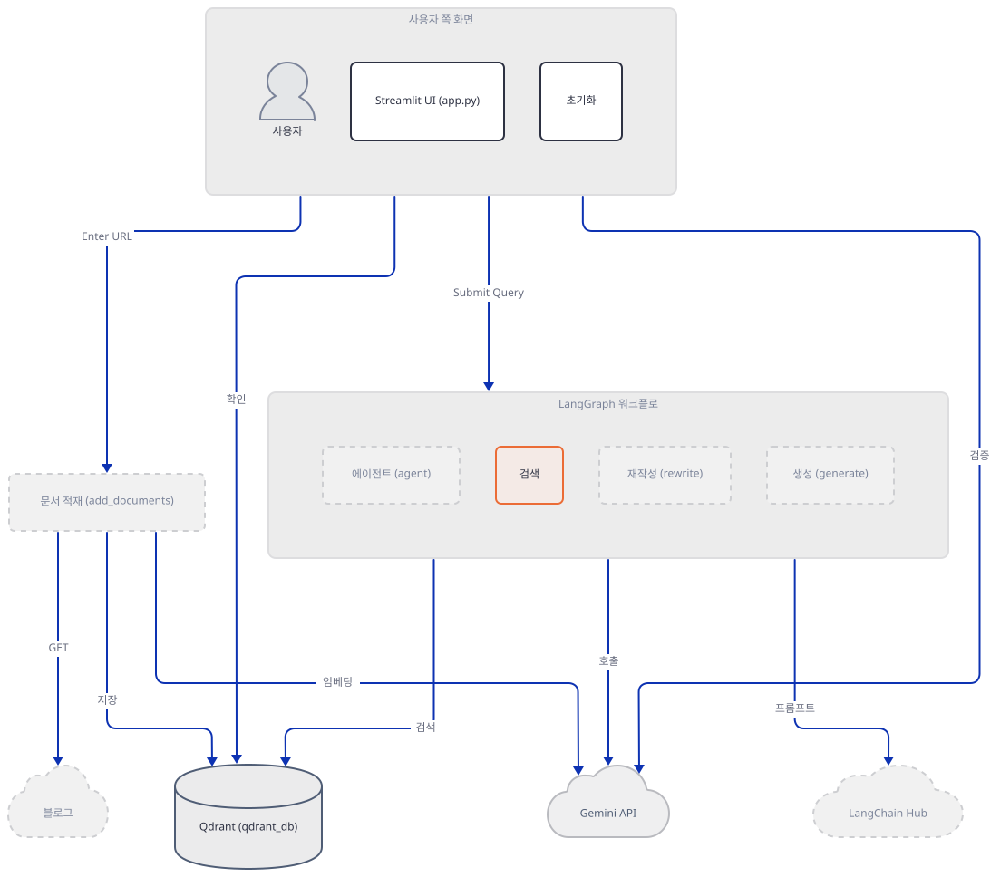
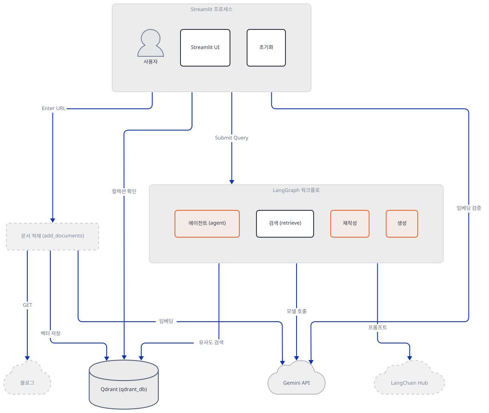
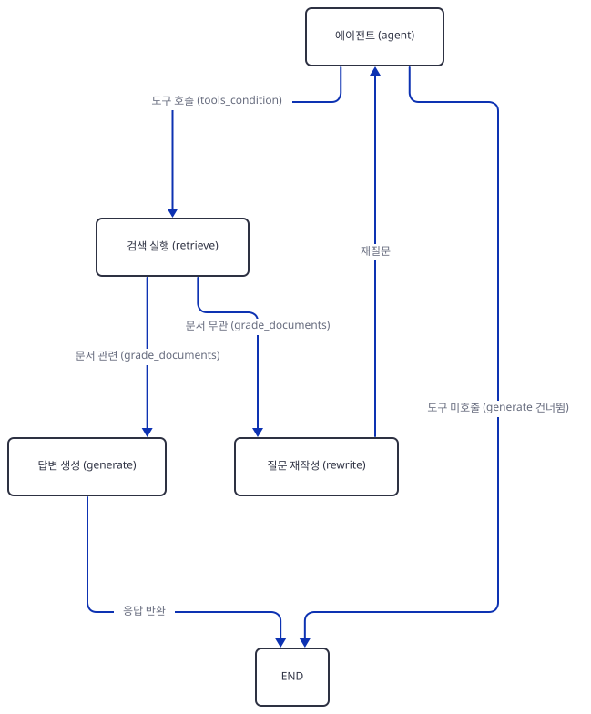
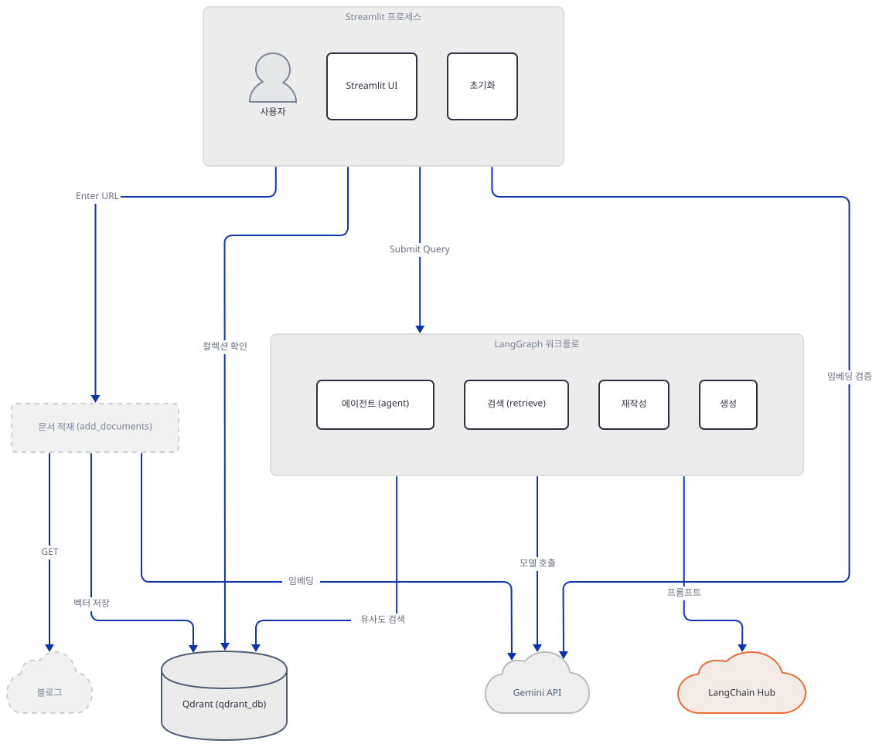
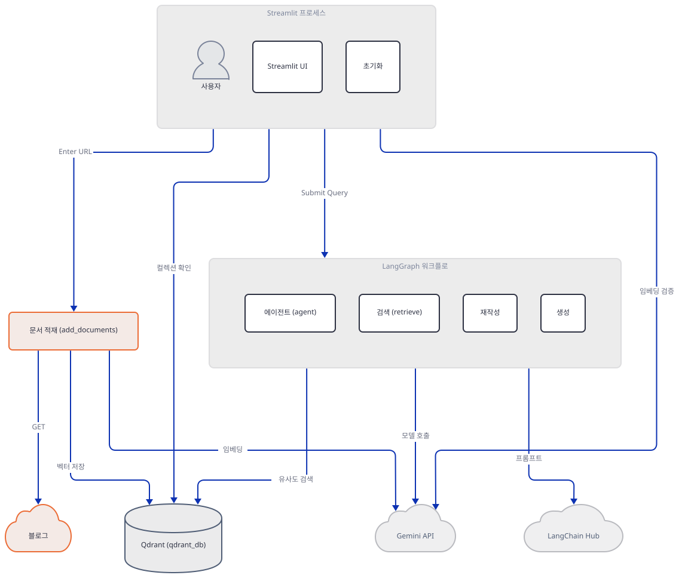
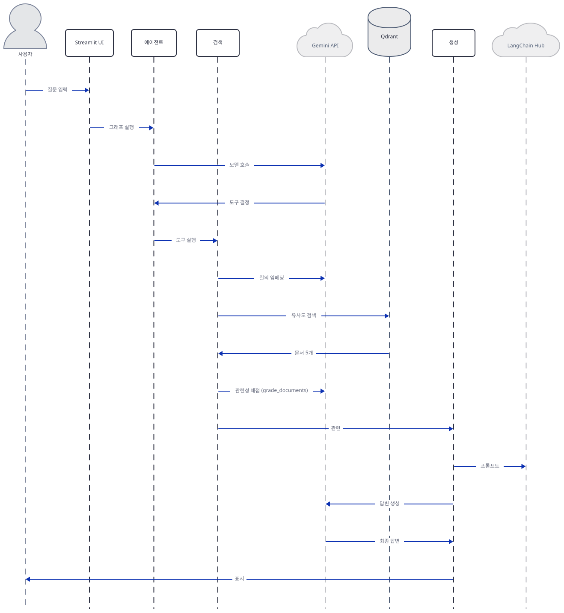

# Day 059 · 📰 AI Blog Search (RAG)

> 볼륨 5 📀 RAG · 난이도 ★★☆ ⚠ · 예상 소요 100분(키 없이 막히는 지점이 여럿으로 나뉘어 있어 — 설치, 초기화, 그래프 종료 — 그때마다 오프라인 재현이 필요합니다) · API 비용 대략 도구를 부르지 않는 질문은 초기화의 `dummy_text` 임베딩 1회 + `agent` 채팅 1회뿐이고, 도구를 부르면 질의 임베딩 1회가 더해지고 문서가 관련 있으면 `grade_documents` 채점 1회 + `generate` 1회, 무관하면 `rewrite` 1회가 더해져 `agent`부터 다시 돕니다(캐싱이 없어 재실행마다 초기화 임베딩이 반복됨, Step 3·5·6) + 블로그 등록 시 청크마다가 아니라 최대 100개씩 묶어(langchain-google-genai 기본 배치 크기) 임베딩 호출(Step 7) — 대략치(키가 없어 실제 과금은 확인 못함, 그리고 아래에서 보듯 이 두 모델은 이미 종료돼 애초에 응답을 받을 수 없습니다) · 원본 앱: `rag_tutorials/ai_blog_search`

## 오늘 만들 것

문서를 청크로 나눠 임베딩하고 저장소에 넣은 뒤 질문이 오면 같은 방식으로 검색해 답을 만드는 흐름 — Day 047부터 이 볼륨이 반복해 온 것 — 을 오늘도 그대로 쓰지만, 오늘 앱은 그 검색을 고정된 파이프라인이 아니라 LangGraph 상태 그래프로 감쌉니다. 질문이 오면 에이전트(`agent`)가 검색 도구를 부를지 스스로 판단하고(Step 5), 도구를 불렀다면 결과 문서가 관련 있는지 또 다른 LLM 호출로 채점한 뒤(`grade_documents`, Step 6) 관련 있으면 LangChain Hub에서 받은 프롬프트로 답을 만들고(`generate`), 관련 없으면 질문을 다시 써서(`rewrite`) 에이전트로 되돌립니다. 임베딩(`models/embedding-001`, 앱 주석에 따르면 768차원)과 채팅(`gemini-2.0-flash`) 모두 Google Gemini 하나로 몰아 쓰고, 벡터 저장소는 사이드바에 호스트 URL과 API 키를 직접 입력하는 Qdrant입니다(Step 2·3). 그런데 이 두 모델 이름 자체가 이미 문제입니다 — Google 공식 사용 중단 페이지 기준으로 `models/embedding-001`은 2025-10-30에(Day 052 Step 2에서 이미 확인한 사실), `gemini-2.0-flash`는 2026-06-01에 이미 서비스가 종료됐습니다(2026-09-26 확인) — 즉 **키가 아무리 정확해도** 이 두 모델 이름으로는 더 이상 응답을 받을 수 없습니다. 그런데 이 383줄을 그대로 설치해 실행해 보면(직접 확인, Step 1) API 키와는 전혀 무관한 곳에서 먼저 막힙니다 — `requirements.txt` 10줄 어디에도 `streamlit` 자체가 없어서 `streamlit run app.py`는 애초에 실행되지 않고, 설령 그 명령을 넘긴다 해도 이 파일이 버전을 하나도 고정하지 않은 탓에 오늘 설치하면 `langchain==1.4.2`가 풀리는데 이 버전은 파일이 실제로 쓰는 두 경로(`langchain.tools.retriever`, `langchain.hub`)를 다른 곳으로 옮겨 버려 임포트 자체가 실패합니다(둘 다 직접 확인, Step 1). 이 두 문제를 우회해 화면을 띄워도 Qdrant·Gemini 키를 넣는 사이드바의 "Done" 버튼은 세 칸이 비어 있지 않은지만 볼 뿐 실제 접속은 시도하지 않고(소스로 확인, Step 2), 진짜 첫 네트워크 시도는 `initialize_components`가 컬렉션 존재를 확인하는 순간에야 일어나며(직접 확인, Step 3) 이 함수는 캐싱 없이 재실행마다 매번 새로 불립니다. 그리고 질문이 검색 도구를 아예 타지 않고 끝나면 — 즉 블로그 내용과 무관한 질문이면 — 이 그래프는 `generate` 노드를 거치지 않고 곧장 끝나는데, 화면에 답을 옮기는 `generate_message`는 정확히 `"generate"`라는 키의 출력만 주워 담으므로(그래프 구조는 직접 확인, 처리 로직은 소스로 확인, Step 5·6) 화면에는 조용히 빈 문자열만 뜹니다. 완성하면 블로그 링크를 등록하고 질문하는 화면을 로컬에서 띄우게 되며, 이 문서가 진짜로 확인하는 것은 그 화면 뒤에서 정확히 어떤 조건에 어떤 외부 호출이 몇 번 일어나고, 키 없이는 어디서 멈추는지입니다. 아래는 완성된 아키텍처입니다.



## 사전 준비

| 서비스/도구 | 용도 | 발급·설치 |
|---|---|---|
| Google Gemini API 키 | 임베딩(`models/embedding-001`)과 채팅(`gemini-2.0-flash`) 호출 인증 — 다만 두 모델 모두 이미 서비스 종료 상태라 키가 맞아도 응답은 못 받습니다(Step 3, Google 공식 사용 중단 페이지 2026-09-26 확인) | https://aistudio.google.com/apikey |
| Qdrant 인스턴스(Cloud 또는 자체 호스팅) | 벡터 저장소(`qdrant_db` 컬렉션). `QdrantClient` 생성자 시그니처상 요구하는 것은 도달 가능한 호스트 URL과 비어 있지 않은 API 키 문자열뿐이라, 인증 없는 로컬 Qdrant도 API 키 칸에 아무 문자열이나 채우면 통과할 것으로 보입니다(소스로 확인 — Step 3에서 직접 재현한 것은 인메모리 인스턴스와 차단된 가짜 클라우드 주소뿐입니다) | https://cloud.qdrant.io 가입 후 클러스터 생성, 또는 Day 047처럼 로컬 Docker Qdrant |
| streamlit (별도 설치) | 앱의 UI 프레임워크 — `requirements.txt` 10줄 어디에도 없어 기본 설치로는 빠짐(Step 1에서 직접 확인) | Step 1의 `uv pip install -r requirements.txt streamlit "langchain<1.0"`로 한 번에 |
| uv | 가상환경 생성과 패키지 설치 | [공통 사전 준비](../README.md#공통-사전-준비-한-번만) 절 참고 |

## 아키텍처 한눈에 보기

| 컴포넌트 | 역할 | 코드 위치 |
|---|---|---|
| 사용자 | 블로그 URL 입력, 질문 입력 | 코드 없음 (브라우저) |
| Streamlit UI (`set_sidebar`/`main`) | 사이드바 자격증명 폼, URL·질문 입력창, 결과 표시 | `rag_tutorials/ai_blog_search/app.py:39-55`, `rag_tutorials/ai_blog_search/app.py:320-382` |
| 컴포넌트 초기화 (`initialize_components`) | 임베딩 모델·Qdrant 클라이언트 생성, 컬렉션 확인/생성, 벡터 저장소 연결 | `rag_tutorials/ai_blog_search/app.py:57-97` |
| 문서 적재 (`add_documents_to_qdrant`) | 블로그 URL → 청크 분할(토큰 기준) → 임베딩 → Qdrant 저장 | `rag_tutorials/ai_blog_search/app.py:306-318` |
| LangGraph 워크플로 (`get_graph`) | `agent`·`retrieve`·`rewrite`·`generate` 노드와 조건부 엣지로 이뤄진 상태 그래프 | `rag_tutorials/ai_blog_search/app.py:251-294` |
| Qdrant 컬렉션 (`qdrant_db`) | 청크 벡터(768차원, 코사인 거리) 저장 | `rag_tutorials/ai_blog_search/app.py:80-84` |
| Google Gemini API | 임베딩(`embedding-001`)·채팅(`gemini-2.0-flash`) 생성 | 코드 없음 (외부 서비스) |
| LangChain Hub | RAG 프롬프트(`rlm/rag-prompt`) 실시간 다운로드 | `rag_tutorials/ai_blog_search/app.py:235` |

## 단계별 진행

### Step 1. 환경 만들기 — 버전 고정이 하나도 없고, streamlit 자체가 빠졌다

**목적.** `requirements.txt` 10줄을 그대로 설치했을 때 실제로 무엇이 풀리는지, 그리고 이 파일의 모든 import가 오늘 통과하는지 확인합니다.

**할 일.**

```bash
cd rag_tutorials/ai_blog_search
uv venv
uv pip install -r requirements.txt
```

(pip 대안: `python -m venv .venv && source .venv/bin/activate && pip install -r requirements.txt`. Windows PowerShell은 활성화만 `.venv\Scripts\Activate.ps1`로 바꿉니다.)

`rag_tutorials/ai_blog_search/requirements.txt:1-10`

```text
langchain
langgraph
langchainhub
langchain-community
langchain-google-genai
langchain-qdrant
langchain-text-splitters
tiktoken
beautifulsoup4
python-dotenv
```

(10줄, 마지막 줄에 개행이 없어 `wc -l`은 9로 셉니다. `app.py`도 마지막 줄에 개행이 없어 `wc -l`은 383줄을 382줄로 셉니다.) 10줄 전부 버전 표시가 전혀 없습니다 — Day 057의 14줄짜리 `requirements.txt`가 13개를 정확히 고정했던 것과 대조적입니다. 오늘 이 그대로 설치하면(직접 확인) 79개 패키지가 풀리며, `langchain==1.4.2`·`langchain-core==1.6.5`·`langgraph==1.2.12`처럼 이 글을 쓰는 시점 기준 최신 메이저 버전이 들어옵니다 — 버전을 고정하지 않은 파일이므로 이 정확한 숫자들은 설치 시점마다 달라질 수 있습니다.

```
Resolved 79 packages in ...
Prepared 7 packages in ...
Installed 79 packages in ...
```

(설치 소요 시간은 캐시·회선 상태에 따라 실행마다 바뀌므로 생략합니다 — 고정된 것은 패키지 개수와 버전입니다.)

그런데 설치된 79개 안에 **`streamlit`이 없습니다** — 이 앱은 `import streamlit as st`(`app.py:26`)로 시작하는 Streamlit 앱인데도, `requirements.txt` 10줄 어디에도 이름이 없습니다(직접 확인).



**확인.** 먼저 방금 설치한 환경에 `streamlit`이 정말 없는지 확인합니다.

```bash
uv run --no-project python -m streamlit run app.py
```

직접 확인한 출력:

```
...\python.exe: No module named streamlit
```

(경로 앞부분은 스크래치 가상환경의 절대 경로라 생략했습니다. `streamlit` 실행 파일 자체가 없어 셸에 따라 "streamlit: command not found"처럼 보일 수도 있습니다 — 위 출력은 `python -m streamlit`로 모듈을 직접 불러 확인한 것입니다.) `uv pip install streamlit`으로 이 문제 하나는 넘어갈 수 있지만, 이어서 이 파일의 import를 한 줄씩 그대로 실행해 보면 다른 두 곳이 더 막힙니다(직접 확인).

```bash
uv run --no-project python -c "
lines = [
    'from langchain_google_genai import GoogleGenerativeAIEmbeddings',
    'from langchain_qdrant import QdrantVectorStore',
    'from qdrant_client import QdrantClient',
    'from qdrant_client.models import Distance, VectorParams',
    'from uuid import uuid4',
    'from langchain_community.document_loaders import WebBaseLoader',
    'from langchain_text_splitters import RecursiveCharacterTextSplitter',
    'from langchain.tools.retriever import create_retriever_tool',
    'from langchain import hub',
    'from langgraph.graph import END, StateGraph, START',
    'from langgraph.prebuilt import ToolNode, tools_condition',
]
ns = {}
for line in lines:
    try:
        exec(line, ns)
        print('OK  ', line)
    except Exception as e:
        print('FAIL', line, '->', type(e).__name__, str(e))
"
```

직접 확인한 출력(맨 앞 `USER_AGENT` 경고 한 줄은 생략):

```
OK   from langchain_google_genai import GoogleGenerativeAIEmbeddings
OK   from langchain_qdrant import QdrantVectorStore
OK   from qdrant_client import QdrantClient
OK   from qdrant_client.models import Distance, VectorParams
OK   from uuid import uuid4
OK   from langchain_community.document_loaders import WebBaseLoader
OK   from langchain_text_splitters import RecursiveCharacterTextSplitter
FAIL from langchain.tools.retriever import create_retriever_tool -> ModuleNotFoundError No module named 'langchain.tools.retriever'
FAIL from langchain import hub -> ImportError cannot import name 'hub' from 'langchain' (...\site-packages\langchain\__init__.py)
OK   from langgraph.graph import END, StateGraph, START
OK   from langgraph.prebuilt import ToolNode, tools_condition
```

즉 두 경로 다 실제로 깨집니다 — `langchain==1.4.2`는 예전 `langchain.tools.retriever`와 `langchain.hub` 경로를 없애고(소스로 확인 — 이 두 이름은 이제 `langchain_core.tools.retriever`와, 레거시 기능을 모아 둔 `langchain-classic==1.0.8` 패키지의 `langchain_classic.hub`/`langchain_classic.tools.retriever`에 있습니다), `langchain` 최상위 패키지 자체는 `__version__` 한 줄만 남을 정도로 얇아졌습니다(소스로 확인). 이 파일을 실제로 `python app.py`처럼 위에서 아래로 실행하면, `streamlit`이 없다는 사실보다 **먼저** 8번째 import 줄(`app.py:8`)에서 `ModuleNotFoundError`로 멈춥니다 — `streamlit`(`app.py:26`)은 파일의 가장 마지막 import라 그 자리까지 도달하지도 못합니다.

이 문서의 나머지 스텝을 실제로 실행해 보려면 `streamlit`과 `langchain<1.0`처럼 예전 경로가 남아 있는 버전이 모두 필요합니다. 여기서 중요한 것은 **한 번에** 해석되도록 설치하는 것입니다 — 이미 설치된 상태에 `uv pip install streamlit "langchain<1.0"`을 따로 얹으면, uv는 이 두 번째 호출이 요구하는 만큼만(`langchain`과 그것이 직접 끌어오는 것들만) 버전을 낮추고 `langgraph`·`langchain-google-genai`·`langchain-qdrant`처럼 여전히 1.x를 요구하는 나머지는 그대로 둡니다(직접 확인 — 그렇게 하면 `uv pip check`가 `Found 8 incompatibilities`를 보고하고, 이어지는 import는 `ImportError: cannot import name 'ContextOverflowError' from 'langchain_core.exceptions'`처럼 처음 보는 오류로 또 실패합니다). `requirements.txt`까지 같은 호출에 다시 넣어야 uv가 전체를 한 번에 재해석합니다.

```bash
uv pip install -r requirements.txt streamlit "langchain<1.0"
uv pip check
```

직접 확인한 출력:

```
All installed packages are compatible
```

이제 `langchain==0.3.30`·`langchain-google-genai==2.1.12`·`langchain-qdrant==0.2.1`·`langgraph==1.0.1`·`streamlit==1.64.0`으로 110개 패키지가 서로 호환되게 다시 풀립니다(직접 확인). `python -m py_compile`은 문법만 보므로 위 import 파손을 가리지 못합니다 — 실제로 통과하는지는 import 자체로 확인해야 합니다.

```bash
uv run --no-project python -c "import app; print('import app OK')"
```

직접 확인한 출력(Streamlit bare-mode 경고 여러 줄은 생략):

```
import app OK
```

### Step 2. 사이드바 게이트 — 값이 있는지만 보고, 접속은 보지 않는다

**목적.** `set_sidebar`가 세 값을 어떻게 검증하는지, 그리고 그 검증을 통과하기 전까지 화면에 무엇이 보이는지 확인합니다.

**할 일.**

`rag_tutorials/ai_blog_search/app.py:39-55`

```python
def set_sidebar():
    """Setup sidebar for API keys and configuration."""
    with st.sidebar:
        st.subheader("API Configuration")
        
        qdrant_host = st.text_input("Enter your Qdrant Host URL:", type="password")
        qdrant_api_key = st.text_input("Enter your Qdrant API key:", type="password")
        gemini_api_key = st.text_input("Enter your Gemini API key:", type="password")

        if st.button("Done"):
            if qdrant_host and qdrant_api_key and gemini_api_key:
                st.session_state.qdrant_host = qdrant_host
                st.session_state.qdrant_api_key = qdrant_api_key
                st.session_state.gemini_api_key = gemini_api_key
                st.success("API keys saved!")
            else:
                st.warning("Please fill all API fields")
```

세 입력창 모두 `type="password"`입니다 — Qdrant 호스트 URL은 비밀값이 아닌데도 별표로 가려집니다. "Done"을 누르면 검증하는 것은 세 값이 **비어 있지 않은지**뿐입니다(소스로 확인) — 형식이 URL처럼 보이는지, 실제로 접속되는지는 이 시점에 전혀 보지 않습니다. 통과하면 `st.session_state`에 그대로 옮겨 담고 "API keys saved!"를 띄웁니다. 이 값들이 처음 생성되는 곳은 `app.py:32-37`이며, 셋 다 빈 문자열로 시작합니다.



**확인.** 키를 하나도 입력하지 않은 초기 화면을 `AppTest`로 확인합니다(네트워크가 필요 없는 상태 — 사이드바만 그려집니다).

```bash
uv run --no-project python -c "
from streamlit.testing.v1 import AppTest
at = AppTest.from_file('app.py')
at.run()
print('exception:', at.exception)
print('header:', [h.value for h in at.header])
print('sidebar text_input labels:', [ti.label for ti in at.sidebar.text_input])
print('warning messages:', [w.value for w in at.warning])
"
```

직접 확인한 출력:

```
exception: ElementList()
header: [':blue[Agentic RAG with LangGraph:] :green[AI Blog Search]']
sidebar text_input labels: ['Enter your Qdrant Host URL:', 'Enter your Qdrant API key:', 'Enter your Gemini API key:']
warning messages: ['Please configure your API keys in the sidebar first']
```

예외 없이 렌더되고, 헤더와 사이드바 세 칸은 보이지만 URL·질문 입력창은 아직 없습니다 — `main()`의 `if not all([...]): st.warning(...); return`(`app.py:324-328`)이 그 자리에서 멈추기 때문입니다.

### Step 3. 컴포넌트 초기화 — 진짜 네트워크는 여기서 처음 나간다

**목적.** `initialize_components`가 임베딩 모델·Qdrant 클라이언트·벡터 저장소를 만드는 순서를 확인하고, 그중 어디가 실제로 네트워크를 타는지 키 없이 직접 확인합니다.

**할 일.**

`rag_tutorials/ai_blog_search/app.py:57-97`

```python
def initialize_components():
    """Initialize components that require API keys"""
    if not all([st.session_state.qdrant_host, 
               st.session_state.qdrant_api_key, 
               st.session_state.gemini_api_key]):
        return None, None, None

    try:
        # Initialize embedding model with API key
        embedding_model = GoogleGenerativeAIEmbeddings(
            model="models/embedding-001",
            google_api_key=st.session_state.gemini_api_key
        )

        # Initialize Qdrant client
        client = QdrantClient(
            st.session_state.qdrant_host,
            api_key=st.session_state.qdrant_api_key
        )

        # QdrantVectorStore validates the collection on construction and raises a
        # 404 if it doesn't exist, so create it up front on a fresh instance.
        # 768 = dimension of models/embedding-001.
        if not client.collection_exists("qdrant_db"):
            client.create_collection(
                collection_name="qdrant_db",
                vectors_config=VectorParams(size=768, distance=Distance.COSINE),
            )

        # Initialize vector store
        db = QdrantVectorStore(
            client=client,
            collection_name="qdrant_db",
            embedding=embedding_model
        )

        return embedding_model, client, db
        
    except Exception as e:
        st.error(f"Initialization error: {str(e)}")
        return None, None, None
```

이 함수 전체가 `try` 하나로 묶여 있어서, 임베딩 생성이든 Qdrant 접속이든 어디서 실패하든 화면에는 항상 같은 형태의 `"Initialization error: {...}"`만 뜹니다. 어디가 진짜로 네트워크를 타는지 키 없이, 소켓을 막고 직접 확인했습니다 — 가짜 값으로 각 줄을 그대로 재현합니다.



**확인.** `GoogleGenerativeAIEmbeddings`와 `QdrantClient` 생성 자체는 네트워크를 타지 않는다는 것부터 확인합니다(소켓 연결과 DNS 조회 둘 다, 루프백이 아니면 막아 둔 채로).

```bash
uv run --no-project python -c "
import socket
_connect = socket.socket.connect
def _blocked(self, address, *a, **k):
    host = address[0] if isinstance(address, tuple) else address
    if host in ('127.0.0.1', '::1', 'localhost'):
        return _connect(self, address, *a, **k)
    raise RuntimeError(f'network blocked (tried {address!r})')
socket.socket.connect = _blocked
_getaddrinfo = socket.getaddrinfo
def _blocked_dns(host, *a, **k):
    if host in ('127.0.0.1', '::1', 'localhost'):
        return _getaddrinfo(host, *a, **k)
    raise RuntimeError(f'network blocked (tried to resolve {host!r})')
socket.getaddrinfo = _blocked_dns

from langchain_google_genai import GoogleGenerativeAIEmbeddings
from qdrant_client import QdrantClient

embedding_model = GoogleGenerativeAIEmbeddings(model='models/embedding-001', google_api_key='fake-gemini-key')
print('embedding model constructed:', type(embedding_model).__name__)

client = QdrantClient('https://fake-cluster.example.qdrant.io', api_key='fake-qdrant-key')
print('qdrant client constructed:', type(client).__name__)

try:
    client.collection_exists('qdrant_db')
    print('UNEXPECTED: no error')
except Exception as e:
    print('collection_exists raised:', type(e).__name__)
"
```

직접 확인한 출력(소켓 연결과 DNS 조회를 모두 막아 둔 상태 — 실제 요청은 나가지 않았습니다):

```
embedding model constructed: GoogleGenerativeAIEmbeddings
qdrant client constructed: QdrantClient
collection_exists raised: ResponseHandlingException
```

즉 임베딩 모델과 Qdrant 클라이언트 생성(66-75행)은 둘 다 즉시 반환되고, **`client.collection_exists("qdrant_db")`(80행)가 이 함수에서 처음 실제 네트워크를 시도하는 지점**입니다. 다만 이 시점에 Gemini 키는 전혀 안 쓰였을 뿐 검증을 건너뛴 것은 아닙니다 — 80-84행이 컬렉션을 먼저 만들어 두기 때문에, 바로 다음 `QdrantVectorStore(...)`(87-91행) 생성이 **같은 함수 호출 안에서 곧바로** Gemini 임베딩을 검증합니다(아래). Day 057의 Cohere처럼 "키 확인이 나중 업로드 때에야 드러나는" 구조와는 다릅니다 — 컬렉션이 이미 존재하면 생성 시점에 `embedding.embed_documents(["dummy_text"])`로 임베딩 차원을 검증합니다. 이것은 실제 Google 클라이언트 대신 네트워크가 필요 없는 가짜 임베더로, 그리고 `initialize_components`와 똑같이 "컬렉션이 방금 막 생성된 경우"까지 재현해 확인합니다.

```bash
uv run --no-project python -c "
from qdrant_client import QdrantClient
from qdrant_client.models import Distance, VectorParams
from langchain_qdrant import QdrantVectorStore
from langchain_core.embeddings import Embeddings

class ProbeEmbeddings(Embeddings):
    def embed_documents(self, texts):
        print('embed_documents called with:', texts)
        return [[0.0] * 768 for _ in texts]
    def embed_query(self, text):
        return [0.0] * 768

# app.py:80-91 그대로: 컬렉션이 없으면 만들고, 곧바로 QdrantVectorStore를 생성합니다.
client = QdrantClient(location=':memory:')
if not client.collection_exists('qdrant_db'):
    client.create_collection('qdrant_db', vectors_config=VectorParams(size=768, distance=Distance.COSINE))
QdrantVectorStore(client=client, collection_name='qdrant_db', embedding=ProbeEmbeddings())
print('QdrantVectorStore constructed')
"
```

직접 확인한 출력:

```
embed_documents called with: ['dummy_text']
QdrantVectorStore constructed
```

이 검증 호출에는 `st.cache_resource` 같은 캐싱이 전혀 없어(소스 전체에 `cache` 문자열 자체가 없음, grep으로 직접 확인) `initialize_components()`는 `main()`이 실행될 때마다 — 즉 URL을 넣든 질문을 하든, 상호작용 한 번마다 — 처음부터 다시 불립니다. 이제 사이드바에 아무 문자열이나 채우고 제출했을 때 실제로 무슨 일이 일어나는지 `AppTest`로 재현합니다(네트워크는 막아 둔 채로).

```bash
uv run --no-project python -c "
import socket
_connect = socket.socket.connect
def _blocked(self, address, *a, **k):
    host = address[0] if isinstance(address, tuple) else address
    if host in ('127.0.0.1', '::1', 'localhost'):
        return _connect(self, address, *a, **k)
    raise RuntimeError(f'network blocked (tried {address!r})')
socket.socket.connect = _blocked
_getaddrinfo = socket.getaddrinfo
def _blocked_dns(host, *a, **k):
    if host in ('127.0.0.1', '::1', 'localhost'):
        return _getaddrinfo(host, *a, **k)
    raise RuntimeError(f'network blocked (tried to resolve {host!r})')
socket.getaddrinfo = _blocked_dns

from streamlit.testing.v1 import AppTest
at = AppTest.from_file('app.py')
at.run()
at.sidebar.text_input[0].set_value('https://fake-cluster.example.qdrant.io')
at.sidebar.text_input[1].set_value('fake-qdrant-key')
at.sidebar.text_input[2].set_value('fake-gemini-key')
at.sidebar.button[0].click().run()
print('success messages:', [s.value for s in at.success])
print('error messages:', [e.value for e in at.error])
print('main text_input count:', len(at.main.text_input))
"
```

직접 확인한 출력:

```
success messages: ['API keys saved!']
error messages: ["Initialization error: network blocked (tried to resolve 'fake-cluster.example.qdrant.io')"]
main text_input count: 0
```

"API keys saved!"가 뜬 바로 그 재실행 안에서 `initialize_components()`가 실패하고, `main()`은 `if not all([embedding_model, client, db]): return`(`app.py:332-333`)으로 그 자리에서 끝나 URL·질문 입력창은 **끝내 렌더되지 않습니다**. 실제 환경에서 가짜 값 대신 오탈자가 있는 진짜 Qdrant URL을 넣었다면 이 자리에 뜨는 것은 DNS 실패나 연결 실패 문구가 될 것입니다 — 원인은 다르지만 화면에 아무것도 더 뜨지 않는다는 결론은 같습니다. 그리고 Qdrant URL·두 키가 전부 정확해도 이 자리는 넘지 못합니다 — 오늘 만들 것에서 밝혔듯 `models/embedding-001`이 이미 종료된 모델이라, 바로 이 `QdrantVectorStore(...)` 생성이 부르는 `dummy_text` 임베딩 요청 자체가 실패해 여전히 `Initialization error: ...`로 멈춥니다(Day 052 Step 2 참고 — 다만 그 정확한 오류 문구는 실제 키가 있어야 나오므로 이 문서에서 직접 재현하지는 못했습니다).

### Step 4. 검색 도구 — 문턱값 없이 항상 5개

**목적.** `db.as_retriever(...)`와 `create_retriever_tool(...)`가 에이전트에게 어떤 도구를 쥐어 주는지 확인합니다.

**할 일.**

`rag_tutorials/ai_blog_search/app.py:336-342`

```python
    retriever = db.as_retriever(search_type="similarity", search_kwargs={"k": 5})
    retriever_tool = create_retriever_tool(
        retriever,
        "retrieve_blog_posts",
        "Search and return information about blog posts on LLMs, LLM agents, prompt engineering, and adversarial attacks on LLMs.",
    )
    tools = [retriever_tool]
```

`search_type="similarity"`에는 Day 057의 `score_threshold` 같은 문턱값이 없습니다 — 컬렉션에 무엇이 들어 있든 상위 5개(또는 그보다 적으면 있는 만큼)를 그대로 돌려주고, 결과가 실제로 질문과 관련 있는지는 다음 스텝의 `grade_documents`가 별도 LLM 호출로 판단합니다. 도구 이름·설명(`retrieve_blog_posts`, "Search and return information about blog posts on LLMs, LLM agents, prompt engineering, and adversarial attacks on LLMs.")은 에이전트가 이 도구를 언제 부를지 고르는 유일한 단서입니다 — 이 설명과 거리가 먼 질문일수록 에이전트가 도구를 아예 안 부르고 끝낼 가능성이 커집니다(Step 6에서 이어집니다). 이 줄이 쓰는 `create_retriever_tool`은 파일 8번째 줄 `from langchain.tools.retriever import create_retriever_tool`로 들여오는데, Step 1에서 본 대로 오늘 버전 고정 없이 설치하면 이 경로 자체가 사라집니다 — 소스로 확인한 바로는 `langchain-core`(레포가 실제로 설치하는 버전은 설치 시점마다 다름)의 `langchain_core.tools.retriever`에 같은 함수가 있습니다.



**확인.** 진짜 Qdrant 없이, 더미 리트리버로 도구가 만들어지는지만 확인합니다.

```bash
uv run --no-project python -c "
from langchain.tools.retriever import create_retriever_tool
from langchain_core.retrievers import BaseRetriever
from langchain_core.documents import Document

class DummyRetriever(BaseRetriever):
    def _get_relevant_documents(self, query, *, run_manager):
        return [Document(page_content='dummy')]

tool = create_retriever_tool(DummyRetriever(), 'retrieve_blog_posts', 'Search blog posts.')
print('tool name:', tool.name)
print('tool description:', tool.description)
"
```

직접 확인한 출력:

```
tool name: retrieve_blog_posts
tool description: Search blog posts.
```

### Step 5. LangGraph 상태 그래프 — 노드 넷과 조건부 엣지 둘

**목적.** `get_graph`가 `agent`·`retrieve`·`rewrite`·`generate` 네 노드를 어떤 엣지로 잇는지, 그리고 그 구조가 실제로 컴파일되는지 키 없이 확인합니다.

**할 일.**

`rag_tutorials/ai_blog_search/app.py:251-294`

```python
def get_graph(retriever_tool):
    tools = [retriever_tool]  # Create tools list here
    
    # Define a new graph
    workflow = StateGraph(AgentState)

    # Use partial to pass tools to the agent function
    workflow.add_node("agent", partial(agent, tools=tools))
    
    # Rest of the graph setup remains the same
    retrieve = ToolNode(tools)
    workflow.add_node("retrieve", retrieve)
    workflow.add_node("rewrite", rewrite)  # Re-writing the question
    workflow.add_node(
        "generate", generate
    )  # Generating a response after we know the documents are relevant
    # Call agent node to decide to retrieve or not
    workflow.add_edge(START, "agent")

    # Decide whether to retrieve
    workflow.add_conditional_edges(
        "agent",
        # Assess agent decision
        tools_condition,
        {
            # Translate the condition outputs to nodes in our graph
            "tools": "retrieve",
            END: END,
        },
    )

    # Edges taken after the `action` node is called.
    workflow.add_conditional_edges(
        "retrieve",
        # Assess agent decision
        grade_documents,
    )
    workflow.add_edge("generate", END)
    workflow.add_edge("rewrite", "agent")

    # Compile
    graph = workflow.compile()

    return graph
```

`agent`의 조건부 엣지(271-280행)는 매핑 딕셔너리(`{"tools": "retrieve", END: END}`)를 명시하지만, `retrieve`의 조건부 엣지(283-287행)는 매핑 없이 `grade_documents`의 반환값(`"generate"`/`"rewrite"`, `app.py:104`의 `Literal` 타입으로 선언됨)을 그대로 노드 이름으로 씁니다 — 같은 "조건부 엣지"라도 코드에 적힌 방식이 다릅니다. **가장 눈여겨볼 것은 `agent`가 도구를 부르지 않기로 하면(`tools_condition`이 `END`를 반환하면) 그래프가 `generate`를 거치지 않고 곧장 끝난다는 점**입니다 — 이 사실은 다음 스텝에서 화면에 미치는 영향으로 이어집니다.



**확인.** 진짜 리트리버·API 키 없이, 더미 도구로 그래프만 컴파일해 노드·엣지 구조를 그대로 확인합니다(컴파일은 노드를 실행하지 않습니다).

```bash
uv run --no-project python -c "
from langchain.tools.retriever import create_retriever_tool
from langchain_core.retrievers import BaseRetriever
from langchain_core.documents import Document
import app

class DummyRetriever(BaseRetriever):
    def _get_relevant_documents(self, query, *, run_manager):
        return [Document(page_content='dummy')]

g = app.get_graph(create_retriever_tool(DummyRetriever(), 'retrieve_blog_posts', 'Search blog posts.'))
for e in g.get_graph().edges:
    print(e.source, '->', e.target, '(conditional)' if e.conditional else '')
"
```

이 코드는 `app.py`를 모듈로 import하므로(24행에서 `import streamlit as st`) `streamlit`과 Step 1에서 하나로 재해석해 설치한 `langchain<1.0` 환경이 필요합니다(import만 하면 `st.session_state`를 실제로 쓰지 않는 한 문제없이 로드됩니다). `app.py`의 실제 `get_graph`를 더미 리트리버 도구로 직접 불러 확인한 결과(Streamlit bare-mode 경고 여러 줄은 생략):

```
__start__ -> agent
agent -> __end__ (conditional)
agent -> retrieve (conditional)
retrieve -> generate (conditional)
retrieve -> rewrite (conditional)
rewrite -> agent
generate -> __end__
```

`agent -> __end__` 간선이 실제로 존재한다는 것, 즉 `retrieve`·`generate`를 한 번도 거치지 않고 끝나는 경로가 그래프 구조 자체에 있다는 것을 이렇게 직접 확인했습니다. 전체 상태 기계는 아래 그림에 따로 담았습니다.



### Step 6. 노드 로직 — 채팅 모델을 매번 새로 만들고, 끝나면 답이 사라지기도 한다

**목적.** `grade_documents`·`agent`·`rewrite`·`generate` 네 노드가 각각 어떤 프롬프트로 Gemini를 부르는지, 그리고 `generate_message`가 그 결과를 화면으로 어떻게 옮기는지 확인합니다.

**할 일.**

`rag_tutorials/ai_blog_search/app.py:104-159`

```python
def grade_documents(state) -> Literal["generate", "rewrite"]:
    """
    Determines whether the retrieved documents are relevant to the question.

    Args:
        state (messages): The current state

    Returns:
        str: A decision for whether the documents are relevant or not
    """

    print("---CHECK RELEVANCE---")

    # Data model
    class grade(BaseModel):
        """Binary score for relevance check."""

        binary_score: str = Field(description="Relevance score 'yes' or 'no'")

    # LLM
    model = ChatGoogleGenerativeAI(api_key=st.session_state.gemini_api_key, temperature=0, model="gemini-2.0-flash", streaming=True)

    # LLM with tool and validation
    llm_with_tool = model.with_structured_output(grade)

    # Prompt
    prompt = PromptTemplate(
        template="""You are a grader assessing relevance of a retrieved document to a user question. \n 
        Here is the retrieved document: \n\n {context} \n\n
        Here is the user question: {question} \n
        If the document contains keyword(s) or semantic meaning related to the user question, grade it as relevant. \n
        Give a binary score 'yes' or 'no' score to indicate whether the document is relevant to the question.""",
        input_variables=["context", "question"],
    )

    # Chain
    chain = prompt | llm_with_tool

    messages = state["messages"]
    last_message = messages[-1]

    question = messages[0].content
    docs = last_message.content

    scored_result = chain.invoke({"question": question, "context": docs})

    score = scored_result.binary_score

    if score == "yes":
        print("---DECISION: DOCS RELEVANT---")
        return "generate"

    else:
        print("---DECISION: DOCS NOT RELEVANT---")
        print(score)
        return "rewrite"
```

`grade_documents`(124행)·`agent`(`app.py:176`)·`rewrite`(`app.py:212`)·`generate`(`app.py:238`) 네 곳 모두 `ChatGoogleGenerativeAI(model="gemini-2.0-flash", temperature=0, streaming=True, api_key=...)`를 **각자 새로 생성합니다** — 하나를 만들어 재사용하지 않습니다(직접 확인 — grep으로 네 줄 모두 확인). 몇 번 생성되는지는 경로에 따라 다릅니다 — `agent`가 도구를 아예 안 부르면 `agent` 1곳뿐이고, 도구를 불렀는데 문서가 관련 있으면 `agent`·`grade_documents`·`generate` 3곳, 무관해서 재작성이 걸리면 `agent`·`grade_documents`·`rewrite`에 다시 `agent`부터 반복되어 4곳 이상입니다. `generate`가 쓰는 프롬프트는 하드코딩 대신 `hub.pull("rlm/rag-prompt")`(`app.py:235`)로 매번 LangChain Hub에서 받아 옵니다 — Day 057 Step 5에서 확인한 `hub.pull("langchain-ai/retrieval-qa-chat")`과 같은 매커니즘(`langchain.hub` → `langsmith.Client().pull_prompt(...)`, API 키 없이도 시도되지만 네트워크는 필요)이며, 이 앱은 다른 프롬프트 이름을 받아 옵니다.



**확인.** 네 함수 모두 `ChatGoogleGenerativeAI`를 새로 만든다는 것을 grep으로 확인합니다.

```bash
grep -n "ChatGoogleGenerativeAI(" app.py
```

직접 확인한 출력:

```
124:    model = ChatGoogleGenerativeAI(api_key=st.session_state.gemini_api_key, temperature=0, model="gemini-2.0-flash", streaming=True)
176:    model = ChatGoogleGenerativeAI(api_key=st.session_state.gemini_api_key, temperature=0, streaming=True, model="gemini-2.0-flash")
212:    model = ChatGoogleGenerativeAI(api_key=st.session_state.gemini_api_key, temperature=0, model="gemini-2.0-flash", streaming=True)
238:    chat_model = ChatGoogleGenerativeAI(api_key=st.session_state.gemini_api_key, model="gemini-2.0-flash", temperature=0, streaming=True)
```

이제 Step 5에서 직접 확인한 `agent -> __end__` 간선이 화면에 어떤 영향을 주는지 `generate_message`(`app.py:296-304`)를 읽어 확인합니다.

`rag_tutorials/ai_blog_search/app.py:296-304`

```python
def generate_message(graph, inputs):
    generated_message = ""

    for output in graph.stream(inputs):
        for key, value in output.items():
            if key == "generate" and isinstance(value, dict):
                generated_message = value.get("messages", [""])[0]
    
    return generated_message
```

`generated_message`는 `""`로 시작하고, 루프 안에서 **정확히 `key == "generate"`인 출력이 나올 때만** 값이 바뀝니다(소스로 확인). Step 5에서 그래프 구조 자체에 `agent -> __end__`(도구를 안 부르고 끝나는 경로)가 있다는 것을 직접 확인했으므로, 블로그 내용과 무관해 에이전트가 도구를 부르지 않는 질문에서는 이 루프가 `"generate"` 키를 한 번도 만나지 못한 채 끝나고, `generate_message`는 빈 문자열을 그대로 돌려줍니다. 이 값은 `app.py:375`의 `st.write(response)`로 화면에 그대로 나가므로, 에이전트가 내부적으로 무언가 응답했더라도 화면에는 빈 줄만 보입니다 — 이 마지막 단계(실제 질문에 대한 그래프 실행)는 Gemini·Qdrant 키가 있어야 재현되므로 이 문서에서 끝까지 실행해 보지는 못했고, 위 두 가지(그래프 구조, `generate_message`의 필터링 조건)를 각각 확인해 이어붙인 결론입니다.

### Step 7. 문서 적재와 화면 배선 — 청크는 글자가 아니라 토큰 단위

**목적.** `add_documents_to_qdrant`가 블로그 URL을 어떤 크기로 쪼개는지, 그리고 URL 입력·질문 입력 화면이 어떻게 이어지는지 확인합니다. 이 배선 자체는 여러 날 반복된 Streamlit 패턴이라 새로 설명하지 않습니다.

**할 일.**

`rag_tutorials/ai_blog_search/app.py:306-318`

```python
def add_documents_to_qdrant(url, db):
    try:
        docs = WebBaseLoader(url).load()
        text_splitter = RecursiveCharacterTextSplitter.from_tiktoken_encoder(
            chunk_size=100, chunk_overlap=50
        )
        doc_chunks = text_splitter.split_documents(docs)
        uuids = [str(uuid4()) for _ in range(len(doc_chunks))]
        db.add_documents(documents=doc_chunks, ids=uuids)
        return True
    except Exception as e:
        st.error(f"Error adding documents: {str(e)}")
        return False
```

`from_tiktoken_encoder(chunk_size=100, chunk_overlap=50)`는 `model_name`을 넘기지 않으므로 기본 인코딩 `"gpt2"`를 쓰고, 청크 경계를 **글자 수가 아니라 GPT-2 BPE 토큰 수**로 잽니다(소스로 확인, `langchain-text-splitters==0.3.11`의 `from_tiktoken_encoder` — `model_name`이 없으면 `tiktoken.get_encoding(encoding_name)`을 부르고 `encoding_name` 기본값이 `"gpt2"`). 청크당 100토큰은 Day 057의 1000**글자**·겹침 200글자보다 훨씬 잘게 자르는 값입니다. 아이디는 내용이나 URL과 무관한 `uuid4()`(313행)라서, 같은 URL을 두 번 등록하면 이전 청크는 그대로 둔 채 새 청크가 추가로 쌓입니다 — 중복 제거가 없습니다(소스로 확인).

`rag_tutorials/ai_blog_search/app.py:344-357`

```python
    # URL input section
    url = st.text_input(
        ":link: Paste the blog link:",
        placeholder="e.g., https://lilianweng.github.io/posts/2023-06-23-agent/"
    )
    if st.button("Enter URL"):
        if url:
            with st.spinner("Processing documents..."):
                if add_documents_to_qdrant(url, db):
                    st.success("Documents added successfully!")
                else:
                    st.error("Failed to add documents")
        else:
            st.warning("Please enter a URL")
```

`WebBaseLoader(url).load()`는 사용자가 붙여넣은 임의의 URL로 실제 GET 요청을 보내므로, 이 문서는 이 함수를 실제 URL로 실행해 보지 않았습니다(외부로 요청을 보내는 코드는 소스로만 확인). 파일 마지막 두 줄은 배선이 끝났다는 표시입니다.

`rag_tutorials/ai_blog_search/app.py:379-380`

```python
    st.markdown("---")
    st.write("Built with :blue-background[LangChain] | :blue-background[LangGraph] by [Charan](https://www.linkedin.com/in/codewithcharan/)")
```



**확인.** `from_tiktoken_encoder`가 정말 토큰 단위로 재는지, 인코딩이 무엇인지 소스에서 확인합니다(실제 인코딩 파일을 내려받으면 외부 요청이 나가므로 이 문서는 실행하지 않습니다 — `tiktoken`은 처음 쓰는 인코딩을 원격에서 내려받습니다).

```bash
grep -n "def from_tiktoken_encoder" -A 20 "$(uv run --no-project python -c 'import langchain_text_splitters, os; print(os.path.dirname(langchain_text_splitters.__file__))')/base.py" | head -25
```

소스로 확인한 결과(발췌, `langchain-text-splitters==0.3.11`):

```
    def from_tiktoken_encoder(
        cls,
        encoding_name: str = "gpt2",
        model_name: Optional[str] = None,
        ...
        if model_name is not None:
            enc = tiktoken.encoding_for_model(model_name)
        else:
            enc = tiktoken.get_encoding(encoding_name)
```

`app.py:309-311`은 `model_name`을 넘기지 않으므로 `encoding_name` 기본값 `"gpt2"`가 그대로 쓰입니다.

## 요청 한 건이 흐르는 과정



이 그림은 오늘의 "행복 경로" — 에이전트가 도구를 부르고, 검색된 문서가 관련 있다고 채점되어 `generate`까지 가는 경로 — 를 그린 것입니다. 질문이 오면 에이전트는 먼저 Gemini에 도구 바인딩 모델 호출을 보내 도구 호출 여부를 결정하고(Step 5·6), 도구를 부르기로 하면 `retrieve`가 (리트리버 내부에서) 질의를 Gemini로 먼저 임베딩한 뒤 그 벡터로 Qdrant에 유사도 검색(k=5)을 보냅니다(Step 4). 그 결과는 `retrieve` 자신이 아니라 **`retrieve`에 이어지는 조건부 엣지 함수 `grade_documents`**가 Gemini에 다시 보내 관련성을 채점하고("yes"/"no", Step 6), 관련 있으면 `generate`로 넘어가 LangChain Hub에서 프롬프트를 받고(Step 6) Gemini에 답변 생성을 요청해 화면에 표시합니다. 반대로 채점이 "no"였다면 이 그림과 다른 경로를 탑니다 — `generate` 대신 `rewrite`가 질문을 다시 써서 `agent`로 돌아가며(Step 5), 에이전트가 애초에 도구를 부르지 않기로 했다면 `retrieve` 자체를 거치지 않고 곧장 끝나 화면에는 빈 응답만 남습니다(Step 6). 이 시퀀스는 각 구간을 소스와 Step 2~6에서 개별적으로 확인한 것을 이어붙인 것이며, Gemini·Qdrant 키가 없어 처음부터 끝까지 한 번에 재현하지는 못했습니다.

## 실행 체크리스트

- [ ] `uv venv && uv pip install -r requirements.txt`가 버전 고정 없이 끝나며, 설치된 패키지 목록에 `streamlit`이 없다는 것을 직접 확인했다
- [ ] 오늘 설치되는 `langchain`(1.x)에서 `langchain.tools.retriever`와 `langchain.hub` 두 경로가 모두 사라졌다는 것을 직접 확인했다
- [ ] 사이드바의 "Done"이 세 칸이 비어 있지 않은지만 보고 실제 접속은 시도하지 않는다는 것을 이해했다
- [ ] `initialize_components`에서 임베딩 모델·Qdrant 클라이언트 생성은 네트워크를 타지 않고, `client.collection_exists(...)`가 첫 실제 네트워크 시도이며, 그 직후 같은 호출 안에서 Gemini 임베딩도 곧바로 검증된다는 것을 직접 확인했다
- [ ] 자격증명 제출 후 초기화가 실패하면 URL·질문 입력창 자체가 렌더되지 않는다는 것을 `AppTest`로 직접 확인했다
- [ ] `models/embedding-001`·`gemini-2.0-flash`가 이미 서비스 종료 상태라, 두 키가 모두 정확해도 초기화를 넘지 못한다는 것을 Google 공식 사용 중단 페이지로 확인했다
- [ ] `db.as_retriever(...)`에 문턱값이 없어 항상 상위 5개를 그대로 반환하고, 관련성 판단은 `grade_documents`가 별도로 한다는 것을 확인했다
- [ ] LangGraph 그래프에 `agent -> __end__`(도구 미호출 시 `generate`를 건너뛰는 경로)가 실제로 존재한다는 것을 그래프 컴파일로 직접 확인했다
- [ ] `generate_message`가 `"generate"` 키의 출력만 주워 담아, 도구를 안 부르고 끝난 질문에는 빈 문자열이 반환된다는 것을 소스로 확인했다
- [ ] `grade_documents`·`agent`·`rewrite`·`generate` 네 곳이 각자 `ChatGoogleGenerativeAI`를 새로 만든다는 것을 grep으로 확인했다
- [ ] 청크 크기(`chunk_size=100`)가 글자가 아니라 GPT-2 토큰 단위라는 것을 소스로 확인했다

## 문제 해결

| 증상 | 원인 | 해결 |
|---|---|---|
| `streamlit run app.py`(또는 `python -m streamlit run app.py`)가 "No module named streamlit"으로 실패 | `requirements.txt` 10줄 어디에도 `streamlit`이 없음(직접 확인, Step 1) | `uv pip install streamlit` 별도 설치(다만 그 다음 행의 import 파손도 함께 있으므로 아래 행의 한 번에 설치하는 명령을 바로 쓰는 편이 낫습니다) |
| `streamlit`을 설치해도 `ModuleNotFoundError: No module named 'langchain.tools.retriever'` 또는 `ImportError: cannot import name 'hub'`로 실패 | `requirements.txt`에 버전 고정이 전혀 없어 오늘 설치하면 `langchain` 1.x가 풀리는데, 이 버전은 두 경로를 `langchain_core`/`langchain_classic`으로 옮김(직접 확인, Step 1) | `uv pip install -r requirements.txt streamlit "langchain<1.0"`처럼 **한 번에** 재해석되도록 설치(따로따로 설치하면 `langchain-core` 버전이 서로 어긋나 `uv pip check`가 비호환을 보고함 — 리포의 `requirements.txt`는 고치지 않음) |
| 사이드바에 아무 문자열이나 채워도 "API keys saved!"가 뜸 | "Done"은 세 칸이 비어 있지 않은지만 확인하고 실제 연결은 시도하지 않음(소스로 확인, Step 2) | 그 다음에 뜨는 "Initialization error" 메시지를 확인 |
| 자격증명 제출 후 "Initialization error: ..."만 뜨고 URL·질문 입력창이 안 보임 | `initialize_components()`가 예외를 잡으면 `main()`이 그 자리에서 `return`해 이후 UI 코드가 실행되지 않음 — Qdrant 접속 실패든, 컬렉션 생성 직후의 Gemini 임베딩 검증 실패든 원인과 무관하게 같은 문구로 뜸(직접 확인, Step 3) | Qdrant 호스트가 실제로 접속 가능한지, Gemini 키와 모델 이름이 유효한지 확인(아래 행도 참고) |
| 두 키를 다 정확히 넣었는데도 "Initialization error: ..."가 뜸 | `models/embedding-001`이 2025-10-30에, `gemini-2.0-flash`가 2026-06-01에 이미 서비스 종료됨(Google 공식 사용 중단 페이지, 2026-09-26 확인, Day 052 Step 2) — `QdrantVectorStore` 생성이 곧바로 부르는 `dummy_text` 임베딩 요청 자체가 실패함(Step 3) | 코드를 고친다면 현재 지원되는 임베딩·채팅 모델 이름으로 바꾼다(리포 코드는 그대로 둠) |
| 블로그와 무관한 질문(예: 인사말)을 하면 화면에 빈 응답만 뜸 | `tools_condition`이 `END`를 반환하면 그래프가 `generate`를 거치지 않고 끝나는데, `generate_message`는 `"generate"` 키의 출력만 받아 감(그래프 구조는 직접 확인, 처리 로직은 소스로 확인, Step 5·6) | 등록한 블로그 내용과 관련된 질문하기 |
| 같은 블로그 URL을 두 번 등록하면 컬렉션에 같은 내용이 중복 저장됨 | `add_documents_to_qdrant`(`app.py:313`)가 매번 새 `uuid4()`를 청크 ID로 써서 이전 청크와 무관하게 항상 추가만 됨(소스로 확인) | 같은 URL을 반복해서 등록하지 않기 |

## 더 해보기

- `uv pip install -r requirements.txt streamlit "langchain<1.0"`로 환경을 고치고(모델 이름은 이미 종료된 `embedding-001`·`gemini-2.0-flash` 대신 현재 지원되는 것으로 바꿔야 실제로 응답을 받을 수 있습니다 — 리포 코드는 그대로 둔 채 자신의 사본에서), 실제 Gemini·Qdrant 키로 블로그 URL을 등록해 블로그 내용과 관련된 질문과 무관한 질문을 각각 던져 `generate` 경로와 `agent -> END` 경로가 실제로 어떻게 갈리는지 관찰해보기
- `db.as_retriever(...)`(`rag_tutorials/ai_blog_search/app.py:336`)의 `k` 값을 바꿔, `grade_documents`의 관련성 판정과 최종 답변 품질이 어떻게 달라지는지 실험해보기
- `generate_message`(`rag_tutorials/ai_blog_search/app.py:296-304`)가 `"generate"` 키만 보는 대신 그래프의 마지막 메시지를 항상 반환하도록 자신의 사본에서 고쳐, 도구를 호출하지 않은 질문에도 답이 표시되는지 확인해보기(리포 코드 자체는 고치지 않음)

## 다음 날 예고

[Day 060 · 📠 RAG with Database Routing](../day060-rag-database-routing/README.md) — 여러 데이터베이스 중 질문에 맞는 곳으로 요청을 돌려보내는 387줄짜리 라우팅 RAG를 다룹니다.
