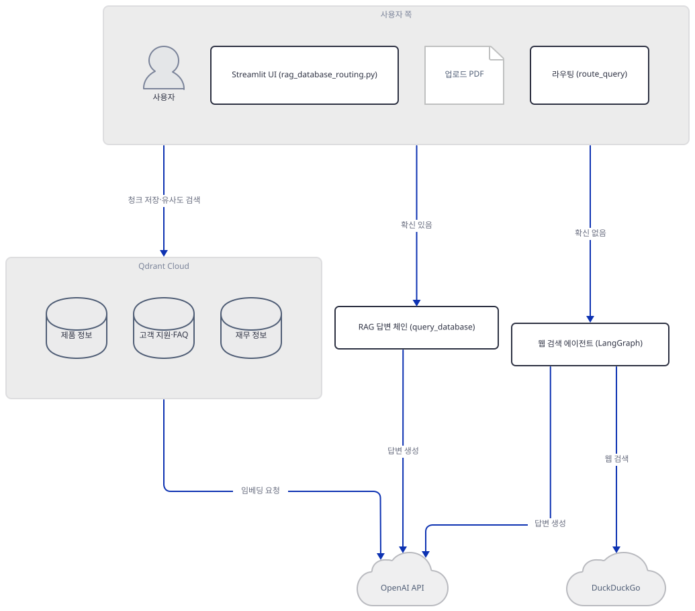
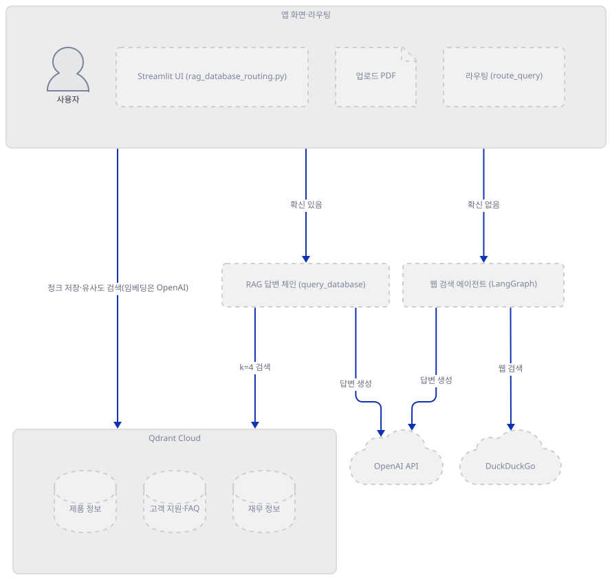
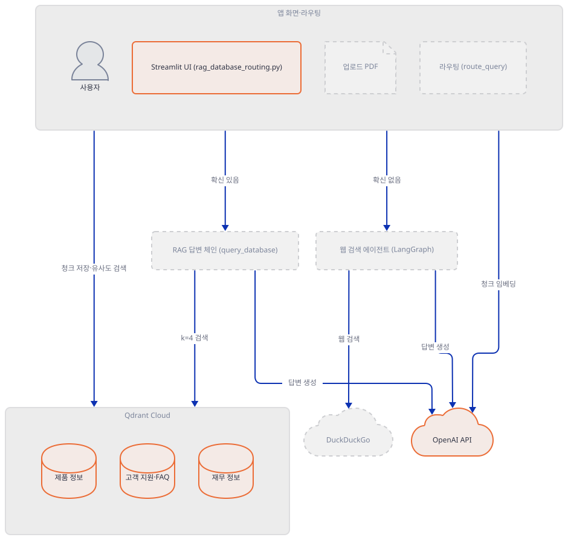
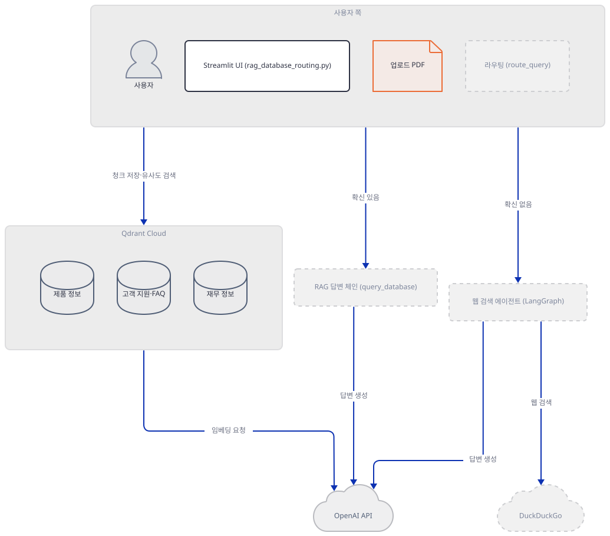
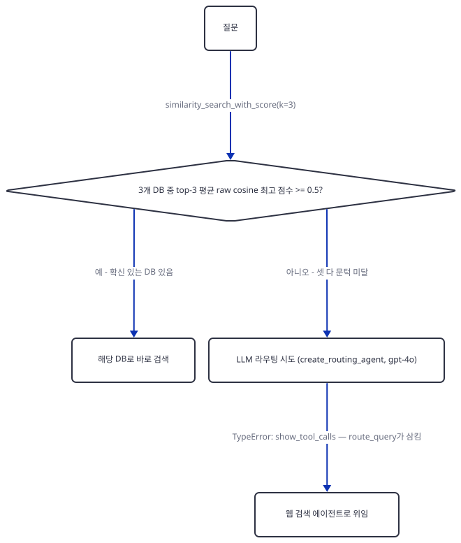
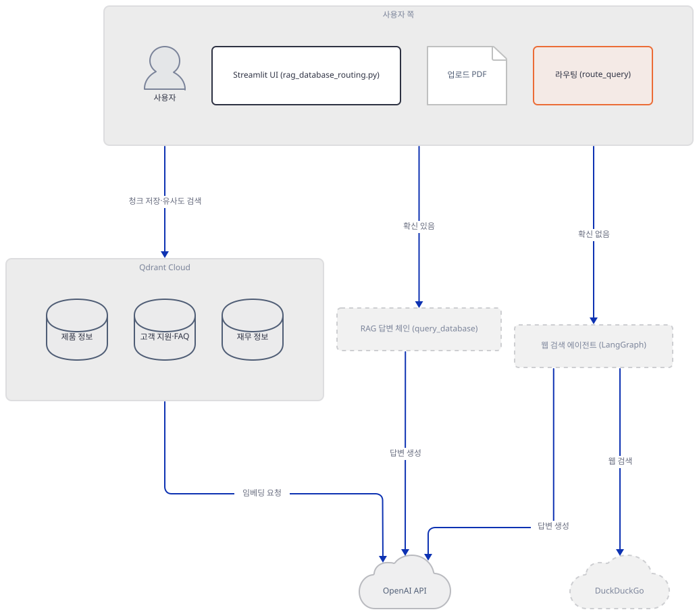
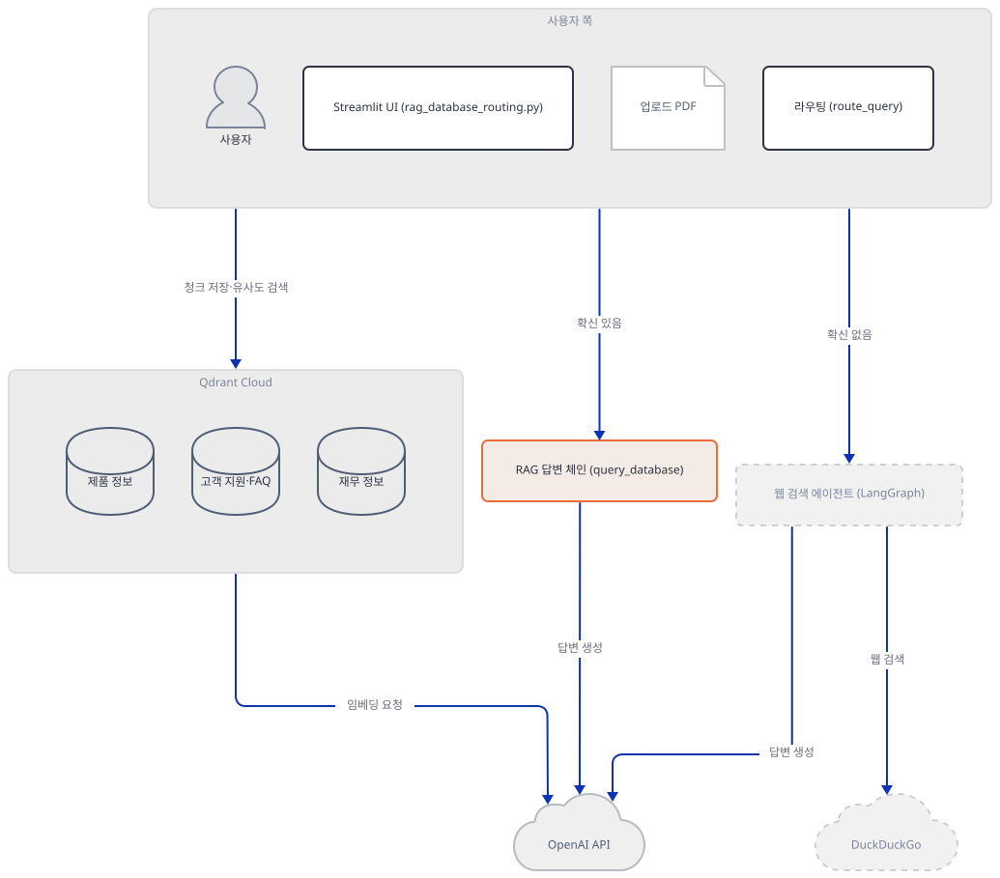
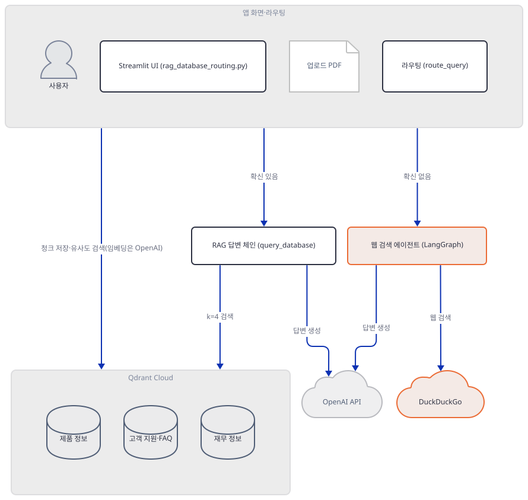
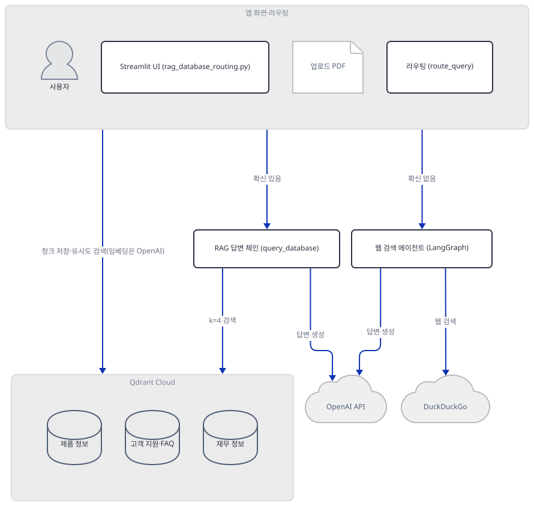
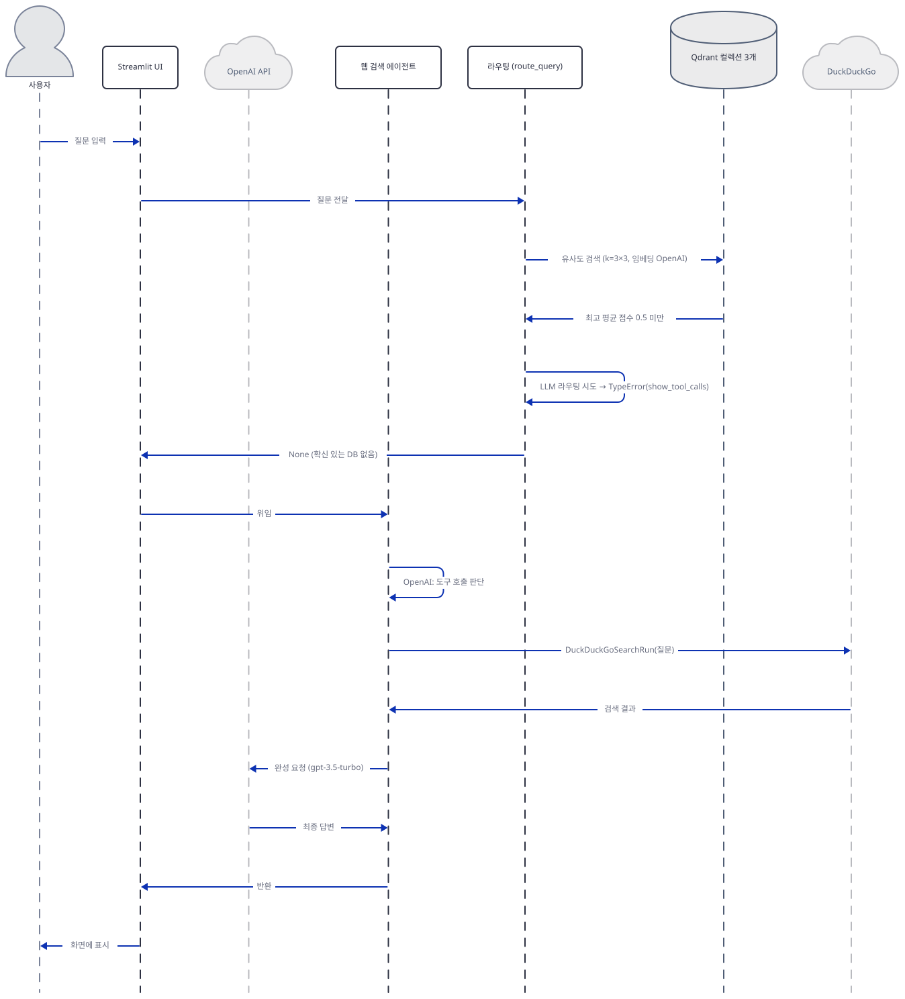

# Day 060 · 📠 RAG with Database Routing

> 볼륨 5 📀 RAG · 난이도 ★★☆ ⚠ · 예상 소요 90분(직접 재현이 소켓 차단·인메모리 Qdrant·로컬 서버 기동까지 여럿이라 읽는 시간보다 손으로 돌려 보는 시간이 깁니다) · API 비용 대략 질문 1건마다 임베딩 호출 3회(3개 컬렉션 유사도 검색, Step 4)에 더해 확신 있는 DB가 있으면 `query_database`가 리트리버를 두 번 불러 같은 질문을 두 번 더 임베딩(Step 5, 직접 확인) — 채팅 완성은 확신 있는 경로가 `gpt-3.5-turbo` 1회, 웹 검색 경로는 도구 호출 여부 판단 1회+최종 답변 1회로 최소 2회(Step 6, 직접 확인) — 업로더에서 파일을 지우지 않으면 질문마다(재실행마다) 그 문서 전체가 다시 임베딩·저장되어 중복 비용이 쌓임(Step 3, 직접 확인) — 대략치(키가 없어 실제 과금은 확인 못함) · 원본 앱: `rag_tutorials/rag_database_routing`

## 오늘 만들 것

문서를 세 개의 독립된 데이터베이스(제품/고객 지원/재무)로 나눠 저장하고, 질문이 들어오면 그중 어디를 찾아야 할지 자동으로 정하는 RAG 앱입니다. "청크 → 임베딩 → 저장 → 검색 → 답변"이라는 골격 자체는 Day 047부터 반복돼 왔고 청크 크기(1000자/겹침 200자)도 Day 057과 같지만, 오늘 새로 들어오는 것은 라우팅입니다. `route_query`는 먼저 3개 컬렉션 모두에 유사도 검색을 돌려 평균 점수가 0.5 이상인 곳이 있으면 그리로 바로 보내고, 없으면 agno 에이전트(`gpt-4o`)에게 어느 DB인지 물어보는 2단계 폴백을 둡니다 — 이 0.5는 정규화 점수가 아니라 Qdrant가 돌려주는 원점수 코사인 그대로입니다(소스로 확인, Step 4). 그런데 이 저장소를 그대로 설치해 돌려보면(직접 확인, Step 1·4) 그 2단계 폴백은 실제로는 한 번도 성공하지 못합니다 — `requirements.txt`가 `agno` 버전을 고정하지 않아(8번째 줄, `agno` 그대로) 오늘 설치되는 3.0.11의 `Agent.__init__`이 이 코드가 넘기는 `show_tool_calls` 인자를 더는 받지 않기 때문입니다 — Day 049에서 본 같은 agno 인자 제거가 여기서는 라우팅 폴백 전체를 죽입니다. `create_routing_agent()`를 직접 호출해 확인한 예외 그대로입니다.

```
TypeError: Agent.__init__() got an unexpected keyword argument 'show_tool_calls'
```

이 예외는 `route_query`의 넓은 `except`가 그대로 삼켜 화면에 "Routing error: ..." 배너만 띄우고 `None`을 반환하므로, 벡터 검색이 문턱을 못 넘는 질문은 키가 있어도 없어도 곧장 LangGraph 웹 검색 에이전트로 넘어갑니다(Step 4·6, 인메모리 Qdrant로 직접 재현). 문서 기반 답변이든 웹 검색 답변이든 최종 생성은 같은 모델이 맡는데, `ChatOpenAI(temperature=0)`가 `model=`을 지정하지 않아 기본값인 `gpt-3.5-turbo`로 떨어진다는 것도 직접 확인했습니다(Step 5) — `gpt-4o`는 이 앱에서 라우팅 시도(그리고 항상 실패)에만 쓰입니다. 아래는 이 구조를 그린 완성 아키텍처입니다.



## 사전 준비

| 서비스/도구 | 용도 | 발급·설치 |
|---|---|---|
| OpenAI API 키 | 임베딩(`text-embedding-3-small`)과 두 채팅 모델(`gpt-4o` 라우팅 시도, 기본값으로 떨어지는 `gpt-3.5-turbo` 답변) 호출 인증 | https://platform.openai.com/api-keys |
| Qdrant Cloud 클러스터 | `products_collection`/`support_collection`/`finance_collection` 3개 저장 — 코드가 실제로 요구하는 건 URL과 키가 모두 있는 Qdrant 인스턴스뿐이라 로컬 Qdrant도 됩니다(Step 2에서 소스로 확인) | https://cloud.qdrant.io 가입 후 클러스터 생성, API 키·URL 확보 |
| 인터넷 연결 | PyPI 설치, OpenAI API, Qdrant Cloud API, DuckDuckGo 접속 — `--server.headless true`로 띄우면 Streamlit이 배너용 외부 IP를 얻으려 `checkip.amazonaws.com`에도 접속(Step 7) | 별도 설치 없음. 사내망이면 이 다섯 곳 아웃바운드 허용 필요 |
| uv | 가상환경 생성과 패키지 설치 | [공통 사전 준비](../README.md#공통-사전-준비-한-번만) 절 참고 |

## 아키텍처 한눈에 보기

| 컴포넌트 | 역할 | 코드 위치 |
|---|---|---|
| 사용자 | 질문 입력, PDF 업로드 | 코드 없음 (브라우저) |
| 세션 상태·자격증명 게이트 (`init_session_state`/`main`) | 3개 자격증명을 다 채워야 이 아래 로직이 실행되고, 안 채우면 `st.stop()`이 그 자리에서 멈춤 | `rag_tutorials/rag_database_routing/rag_database_routing.py:25-38`, `rag_tutorials/rag_database_routing/rag_database_routing.py:291-333` |
| 초기화 (`initialize_models`) | OpenAI 임베딩·채팅 객체 생성, Qdrant 접속·컬렉션 3개 생성/확인 | `rag_tutorials/rag_database_routing/rag_database_routing.py:70-110` |
| 문서 적재 (`process_document`) | PDF → 청크(1000자/겹침 200) | `rag_tutorials/rag_database_routing/rag_database_routing.py:112-134` |
| 라우팅 (`route_query`/`create_routing_agent`) | 벡터 유사도(원점수 코사인 0.5) 우선, 부족하면 agno 에이전트(`gpt-4o`)로 폴백 — 오늘 설치되는 agno로는 이 폴백이 항상 TypeError | `rag_tutorials/rag_database_routing/rag_database_routing.py:158-206`, `rag_tutorials/rag_database_routing/rag_database_routing.py:136-156` |
| RAG 답변 체인 (`query_database`) | 확신 있는 DB에서 k=4 검색 후 `gpt-3.5-turbo`로 답변 생성 | `rag_tutorials/rag_database_routing/rag_database_routing.py:228-260` |
| 웹 검색 에이전트 (`create_fallback_agent`/`_handle_web_fallback`) | LangGraph `create_react_agent` + DuckDuckGo 도구 1개 | `rag_tutorials/rag_database_routing/rag_database_routing.py:208-226`, `rag_tutorials/rag_database_routing/rag_database_routing.py:262-283` |
| Qdrant 컬렉션 3개 | 청크 벡터(1536차원, OpenAI 공식 문서 기준 `text-embedding-3-small`의 차원)와 원문 저장 | `rag_tutorials/rag_database_routing/rag_database_routing.py:52-68` |
| OpenAI API | 임베딩·채팅 생성 | 코드 없음 (외부 서비스) |
| DuckDuckGo | 웹 검색 폴백 | 코드 없음 (외부 서비스) |

## 단계별 진행

### Step 1. 환경 만들기 — 11줄과 조용히 딸려오는 PyTorch

**목적.** 격리된 가상환경에 `requirements.txt` 11줄을 설치하고, 이 파일의 모든 import가 통과하는지 확인합니다.

**할 일.**

```bash
cd rag_tutorials/rag_database_routing
uv venv
uv pip install -r requirements.txt
```

(pip 대안: `python -m venv .venv && source .venv/bin/activate && pip install -r requirements.txt`. Windows PowerShell은 활성화만 `.venv\Scripts\Activate.ps1`로 바꿉니다.)

이 저장소는 루트에 `pyproject.toml`이 있어 `uv run`이 방금 만든 환경 대신 루트 `.venv`를 쓰므로, 이후 모든 `uv run`에는 `--no-project`를 붙입니다.

`rag_tutorials/rag_database_routing/requirements.txt:1-11`

```text
langchain==0.3.12
langchain-community==0.3.12
langchain-core==0.3.28
qdrant-client==1.12.1
streamlit>=1.29.0
pypdf>=4.0.0
sentence-transformers>=2.2.2
agno
langchain-openai==0.2.14
langgraph==0.2.53
duckduckgo-search>=6.4.2,<9
```

(11줄, 마지막 줄에 개행이 없어 `wc -l`은 10으로 셉니다.) `agno`만 버전이 아예 없고, 나머지는 고정(`==`) 또는 범위입니다. 직접 설치하면(직접 확인) 125개 패키지가 해석됩니다.

```
Resolved 125 packages in …
Installed 125 packages in …
```

(설치 시간은 캐시·회선에 따라 매번 바뀌므로 패키지 수만 옮깁니다 — 이 실행은 각각 49ms·6.08s였습니다.)

`agno`는 오늘 3.0.11로 풀리고(직접 확인, 아래 Step 4에서 이 버전이 문제가 됩니다), `sentence-transformers>=2.2.2`는 6.1.0으로 풀리면서 **이 파일이 어디에서도 import하지 않는** `torch`(2.14.0)와 `transformers`(5.17.0)까지 함께 설치합니다 — `uv pip show sentence-transformers`의 `Required-by:`가 비어 있어, 다른 패키지가 필요로 해서 딸려온 것도 아닙니다(직접 확인). `rag_database_routing.py` 전체를 뒤져도 `sentence_transformers`나 `SentenceTransformer`를 언급하는 줄은 없습니다(grep으로 직접 확인) — 임베딩은 전부 OpenAI API로 하므로 이 패키지는 설치만 되고 쓰이지 않습니다.



**확인.** 파일이 컴파일되고 모든 최상위 import가 성공하는지 확인합니다.

```bash
uv run --no-project python -m py_compile rag_database_routing.py && echo compiled
```

```
compiled
```

```bash
uv run --no-project python -c "
import os
from typing import List, Dict, Any, Literal, Optional
from dataclasses import dataclass
import streamlit as st
from langchain_core.documents import Document
from langchain.text_splitter import RecursiveCharacterTextSplitter
from langchain_community.document_loaders import PyPDFLoader
from langchain_community.vectorstores import Qdrant
from langchain_openai import OpenAIEmbeddings, ChatOpenAI
from agno.agent import Agent
from agno.models.openai import OpenAIChat
from langgraph.prebuilt import create_react_agent
from langchain_community.tools import DuckDuckGoSearchRun
from qdrant_client import QdrantClient
from qdrant_client.models import Distance, VectorParams
print('ALL IMPORTS OK')
"
```

```
ALL IMPORTS OK
```

### Step 2. 세션 상태와 자격증명 게이트 — 셋을 다 채워야 코드 밑변이 실행된다

**목적.** `init_session_state`가 무엇을 준비하는지, 사이드바 3칸을 다 채우기 전에는 `main()`의 나머지 부분(문서 업로드, 질문 입력)이 왜 전혀 렌더되지 않는지 확인합니다.

**할 일.**

`rag_tutorials/rag_database_routing/rag_database_routing.py:25-38`

```python
def init_session_state():
    """Initialize session state variables"""
    if 'openai_api_key' not in st.session_state:
        st.session_state.openai_api_key = ""
    if 'qdrant_url' not in st.session_state:
        st.session_state.qdrant_url = ""
    if 'qdrant_api_key' not in st.session_state:
        st.session_state.qdrant_api_key = ""
    if 'embeddings' not in st.session_state:
        st.session_state.embeddings = None
    if 'llm' not in st.session_state:
        st.session_state.llm = None
    if 'databases' not in st.session_state:
        st.session_state.databases = {}
```

이 함수는 파일이 임포트되는 순간 바로 한 번 호출됩니다(40행, 모듈 최상위). `main()`의 사이드바는 3개 입력칸을 받고, 하나라도 비면 `st.stop()`으로 그 실행을 멈춥니다.

`rag_tutorials/rag_database_routing/rag_database_routing.py:315-333`

```python
        # Update session state
        if api_key:
            st.session_state.openai_api_key = api_key
        if qdrant_url:
            st.session_state.qdrant_url = qdrant_url
        if qdrant_api_key:
            st.session_state.qdrant_api_key = qdrant_api_key
            
        # Initialize models if all credentials are provided
        if (st.session_state.openai_api_key and 
            st.session_state.qdrant_url and 
            st.session_state.qdrant_api_key):
            if initialize_models():
                st.success("Connected to OpenAI and Qdrant successfully!")
            else:
                st.error("Failed to initialize. Please check your credentials.")
        else:
            st.warning("Please enter all required credentials to continue")
            st.stop()
```

`st.stop()`은 `st.title(...)`(288행) **다음**, `with st.sidebar:` 블록 **안**에서 호출됩니다 — Day 057은 제목보다 먼저 멈췄지만, 이 앱은 제목은 이미 그린 뒤 사이드바 안에서 멈추므로 화면에는 제목과 사이드바 폼, 경고 문구는 보이고 "Document Upload" 이하는 전혀 렌더되지 않습니다. `initialize_models()`가 실제로 무엇을 하는지도 확인합니다.

`rag_tutorials/rag_database_routing/rag_database_routing.py:70-89`

```python
def initialize_models():
    """Initialize OpenAI models and Qdrant client"""
    if (st.session_state.openai_api_key and 
        st.session_state.qdrant_url and 
        st.session_state.qdrant_api_key):
        
        os.environ["OPENAI_API_KEY"] = st.session_state.openai_api_key
        st.session_state.embeddings = OpenAIEmbeddings(model="text-embedding-3-small")
        st.session_state.llm = ChatOpenAI(temperature=0)
        
        try:
            client = QdrantClient(
                url=st.session_state.qdrant_url,
                api_key=st.session_state.qdrant_api_key
            )
            
            # Test connection
            client.get_collections()
            vector_size = 1536  
            st.session_state.databases = {}
```

`QdrantClient(...)`에는 `timeout=`이 지정돼 있지 않습니다(Day 057의 Cohere 앱은 `timeout=60`을 명시했습니다) — 오탈자 URL에서 얼마나 기다릴지는 라이브러리 기본값에 달려 있다는 뜻입니다. 코드가 실제로 요구하는 것은 URL과 키가 모두 채워진 `QdrantClient`뿐이라, 사이드바 URL 자리 표시자(`https://your-cluster.qdrant.tech`)와 달리 로컬 Qdrant(`http://localhost:6333`)를 URL로 넣어도 이 함수 자체는 막지 않습니다 — 다만 `qdrant_api_key`가 빈 문자열이면 `initialize_models()` 호출 전 324-326행의 게이트에서 `st.stop()`에 걸리므로, 인증 없는 로컬 Qdrant라도 API 키 칸에는 아무 문자열이나 채워야 합니다(소스로 확인).



**확인.** 먼저 키 없이 실행하면 어디까지 렌더되는지 `AppTest`로 직접 확인합니다(네트워크 없음).

```bash
uv run --no-project python -c "
from streamlit.testing.v1 import AppTest
at = AppTest.from_file('rag_database_routing.py')
at.run()
print('exception:', at.exception)
print('title:', [t.value for t in at.title])
print('sidebar headers:', [h.value for h in at.sidebar.header])
print('main headers:', [h.value for h in at.header])
print('warning:', [w.value for w in at.warning])
"
```

직접 확인한 출력:

```
exception: ElementList()
title: ['📠 RAG Agent with Database Routing']
sidebar headers: ['Configuration']
main headers: ['Configuration']
warning: ['Please enter all required credentials to continue']
```

제목은 떴지만 `main headers`에 "Document Upload"·"Ask Questions"가 없습니다 — `st.stop()`이 그 앞에서 실행을 멈췄다는 뜻입니다. 이어서 `QdrantClient` 생성과 `get_collections()` 호출 중 실제로 어디서 네트워크를 타는지, 소켓 연결 자체를 막아 직접 확인합니다(가짜 URL·키, 패킷은 나가지 않습니다).

```bash
uv run --no-project python -c "
import socket, time
def _blocked(*a, **k): raise RuntimeError('blocked')
socket.socket.connect = lambda self, *a, **k: _blocked()
socket.getaddrinfo = lambda *a, **k: _blocked()
from qdrant_client import QdrantClient
t0 = time.monotonic()
client = QdrantClient(url='https://fake-cluster.example.cloud.qdrant.io:6333', api_key='fake-key', timeout=5)
print(f'constructed in {time.monotonic()-t0:.3f}s, no error yet')
try:
    client.get_collections()
except Exception as e:
    print('get_collections() ->', type(e).__name__, str(e)[:80])
"
```

직접 확인한 출력(생성 시간은 매 실행 바뀌므로 자릿수만 옮깁니다):

```
constructed in 0.2s, no error yet
get_collections() -> ResponseHandlingException blocked
```

`QdrantClient(...)` 생성 자체는 즉시 반환하고, `get_collections()`에서만 실제 접속(DNS 조회부터)을 시도합니다 — 이 앱에는 버튼이 하나도 없으므로(`grep -n "st.button\|form_submit" rag_database_routing.py` 0건, 직접 확인) 반응이 없다면 "Submit"이 아니라 세 번째 칸을 채운 직후의 자동 재실행이 바로 이 지점에서 멈춘 것입니다. 같은 방식으로 `OpenAIEmbeddings`·`ChatOpenAI` 생성도 네트워크를 타지 않는다는 것을 확인합니다.

```bash
uv run --no-project python -c "
import socket
socket.socket.connect = lambda self, *a, **k: (_ for _ in ()).throw(RuntimeError('blocked'))
socket.getaddrinfo = lambda *a, **k: (_ for _ in ()).throw(RuntimeError('blocked'))
from langchain_openai import OpenAIEmbeddings, ChatOpenAI
emb = OpenAIEmbeddings(model='text-embedding-3-small', api_key='fake-key')
llm = ChatOpenAI(temperature=0, api_key='fake-key')
print('constructed with no error -> no DNS/connect at construction time')
print('ChatOpenAI default model_name (app never passes model=):', llm.model_name)
"
```

직접 확인한 출력:

```
constructed with no error -> no DNS/connect at construction time
ChatOpenAI default model_name (app never passes model=): gpt-3.5-turbo
```

`rag_database_routing.py:78`의 `ChatOpenAI(temperature=0)`는 `model=`을 넘기지 않으므로 `langchain-openai==0.2.14`의 기본값인 `gpt-3.5-turbo`로 떨어집니다 — 이 사실은 Step 5·6의 답변 생성 전부에 적용됩니다.

### Step 3. 문서 업로드와 청크 저장 — pypdf는 이미 있다

**목적.** `process_document`가 PDF를 어떻게 청크로 쪼개는지, 3개 탭 UI가 어떤 컬렉션에 저장하는지 확인하고, Step 1 환경만으로 실제 PDF가 끝까지 처리되는지 실행해 봅니다.

**할 일.**

`rag_tutorials/rag_database_routing/rag_database_routing.py:112-134`

```python
def process_document(file) -> List[Document]:
    """Process uploaded PDF document"""
    try:
        with tempfile.NamedTemporaryFile(delete=False, suffix='.pdf') as tmp_file:
            tmp_file.write(file.getvalue())
            tmp_path = tmp_file.name
            
        loader = PyPDFLoader(tmp_path)
        documents = loader.load()
        
        # Clean up temporary file
        os.unlink(tmp_path)
        
        text_splitter = RecursiveCharacterTextSplitter(
            chunk_size=1000,
            chunk_overlap=200
        )
        texts = text_splitter.split_documents(documents)
        
        return texts
    except Exception as e:
        st.error(f"Error processing document: {e}")
        return []
```

청크 크기(1000자)·겹침(200자)은 Day 057과 같은 값입니다. Day 057의 앱과 달리 `pypdf`는 `requirements.txt`에 이미 있어(6번째 줄) `PyPDFLoader`가 곧바로 실패하는 일은 없습니다 — 실제 PDF로 직접 확인했습니다.

업로드 탭은 `COLLECTIONS`의 3개 항목마다 하나씩 생성됩니다.

`rag_tutorials/rag_database_routing/rag_database_routing.py:337-361`

```python
    st.header("Document Upload")
    st.info("Upload documents to populate the databases. Each tab corresponds to a different database.")
    tabs = st.tabs([collection_config.name for collection_config in COLLECTIONS.values()])
    
    for (collection_type, collection_config), tab in zip(COLLECTIONS.items(), tabs):
        with tab:
            st.write(collection_config.description)
            uploaded_files = st.file_uploader(
                f"Upload PDF documents to {collection_config.name}",
                type="pdf",
                key=f"upload_{collection_type}",
                accept_multiple_files=True  
            )
            
            if uploaded_files:
                with st.spinner('Processing documents...'):
                    all_texts = []
                    for uploaded_file in uploaded_files:
                        texts = process_document(uploaded_file)
                        all_texts.extend(texts)
                    
                    if all_texts:
                        db = st.session_state.databases[collection_type]
                        db.add_documents(all_texts)
                        st.success("Documents processed and added to the database!")
```

`accept_multiple_files=True`라 탭당 여러 PDF를 한 번에 올릴 수 있고, 청크가 하나도 안 나오면(`all_texts`가 비면) `add_documents` 자체를 호출하지 않습니다 — Day 057의 조용한 "성공" 배너 문제(빈 리스트도 저장 성공으로 표시됨)는 여기서는 일어나지 않습니다.

이 블록에는 "이미 저장했다"를 기억하는 장치(버튼, 세션 상태 플래그)가 전혀 없습니다. Streamlit은 질문 입력처럼 사소한 상호작용에도 스크립트 전체를 처음부터 다시 실행하는데, 업로더가 파일을 계속 들고 있는 한(사용자가 직접 지우기 전까지) `uploaded_files`는 매 재실행에서도 그대로 채워져 있습니다 — 즉 질문 하나를 물을 때마다 방금 올린 문서 전체가 다시 청크화·임베딩·저장됩니다. 가짜 임베딩과 인메모리 Qdrant로, 같은 업로드가 세 번의 "재실행"을 거치는 동안 무슨 일이 일어나는지 직접 확인합니다.

```bash
uv run --no-project python -c "
from langchain_core.embeddings import Embeddings
from langchain_core.documents import Document
from langchain_community.vectorstores import Qdrant
from qdrant_client import QdrantClient
from qdrant_client.models import Distance, VectorParams

calls = {'embed_documents': 0}
class CountingEmbeddings(Embeddings):
    def embed_documents(self, texts):
        calls['embed_documents'] += 1
        return [[0.0, 0.0] for _ in texts]
    def embed_query(self, text):
        return [0.0, 0.0]

client = QdrantClient(location=':memory:')
client.create_collection('products_c', vectors_config=VectorParams(size=2, distance=Distance.COSINE))
db = Qdrant(client=client, collection_name='products_c', embeddings=CountingEmbeddings())

def one_rerun(label):
    all_texts = [Document(page_content='같은 청크 내용')]  # uploaded_files가 재실행에도 남아있다고 가정
    db.add_documents(all_texts)
    print(label, '-> embed_documents 누적 호출:', calls['embed_documents'], '/ 저장된 점:', client.count('products_c').count)

one_rerun('업로드 직후')
one_rerun('질문 1개 후 재실행')
one_rerun('질문 2개 후 재실행')
"
```

직접 확인한 출력:

```
업로드 직후 -> embed_documents 누적 호출: 1 / 저장된 점: 1
질문 1개 후 재실행 -> embed_documents 누적 호출: 2 / 저장된 점: 2
질문 2개 후 재실행 -> embed_documents 누적 호출: 3 / 저장된 점: 3
```

같은 문서가 재실행마다 다시 임베딩되고 중복된 점으로 쌓입니다 — 업로더에서 파일을 지우지 않는 한 계속됩니다.



**확인.** 실제 PDF(빈 페이지 1장)를 만들어 `process_document`를 직접 호출해, 예외 없이 동작하는지 확인합니다.

```bash
uv run --no-project python -c "
import io
from pypdf import PdfWriter
import rag_database_routing as app

buf = io.BytesIO()
writer = PdfWriter()
writer.add_blank_page(width=200, height=200)
writer.write(buf)

class FakeUpload:
    def __init__(self, data): self._data = data
    def getvalue(self): return self._data

texts = app.process_document(FakeUpload(buf.getvalue()))
print('process_document returned', len(texts), 'chunks (blank page -> no extractable text)')
"
```

직접 확인한 출력:

```
process_document returned 0 chunks (blank page -> no extractable text)
```

예외 없이 끝까지 실행되어 빈 리스트를 돌려줍니다 — `pypdf`가 정말 설치돼 있고 `PyPDFLoader`가 정상 동작한다는 뜻입니다(텍스트가 없는 페이지라 청크가 0개인 것은 정상입니다).

### Step 4. 라우팅 — 원점수 코사인 0.5, 그리고 실제로는 한 번도 안 도는 2단계

**목적.** `route_query`가 3개 DB 중 하나를 고르는 정확한 조건과, 확신이 없을 때 시도하는 `create_routing_agent()`가 오늘 설치되는 agno로는 왜 항상 실패하는지 확인합니다.

**할 일.**

`rag_tutorials/rag_database_routing/rag_database_routing.py:158-184`

```python
def route_query(question: str) -> Optional[DatabaseType]:
    """Route query by searching all databases and comparing relevance scores.
    Returns None if no suitable database is found."""
    try:
        best_score = -1
        best_db_type = None
        all_scores = {}  # Store all scores for debugging
        
        # Search each database and compare relevance scores
        for db_type, db in st.session_state.databases.items():
            results = db.similarity_search_with_score(
                question,
                k=3
            )
            
            if results:
                avg_score = sum(score for _, score in results) / len(results)
                all_scores[db_type] = avg_score
                
                if avg_score > best_score:
                    best_score = avg_score
                    best_db_type = db_type
        
        confidence_threshold = 0.5
        if best_score >= confidence_threshold and best_db_type:
            st.success(f"Using vector similarity routing: {best_db_type} (confidence: {best_score:.3f})")
            return best_db_type
```

이 앱은 `langchain_qdrant`가 아니라 옛 `langchain_community.vectorstores.Qdrant`를 씁니다(8행). 그 클래스의 `similarity_search_with_score`는 `similarity_search_with_score_by_vector`를 거쳐 `self.client.search(...)`가 돌려준 `result.score`를 어떤 정규화도 없이 그대로 반환합니다(소스로 확인, `langchain-community==0.3.12`의 `qdrant.py:610-634`, 특히 `result.score`를 그대로 튜플에 담는 623-634행) — `COSINE` 거리에서 이 값은 Qdrant가 계산한 코사인 유사도 원점수(-1~1)입니다. 즉 Day 057이 썼던 `(cos+1)/2` 정규화(그쪽은 `similarity_search_with_relevance_scores` 경로를 탔습니다)는 여기 없고, **`confidence_threshold = 0.5`는 원점수 코사인과 직접 비교됩니다.** 인메모리 Qdrant와 코사인 값을 직접 정한 가짜 임베딩으로 이 조건을 재현합니다(네트워크 없음, 이 앱이 실제로 쓰는 `route_query` 함수를 그대로 호출합니다).

```bash
uv run --no-project python -c "
import math
from langchain_core.embeddings import Embeddings
from langchain_core.documents import Document
from langchain_community.vectorstores import Qdrant
from qdrant_client import QdrantClient
from qdrant_client.models import Distance, VectorParams
import rag_database_routing as app

def vec(cos): return [cos, math.sqrt(max(0.0, 1-cos*cos))]
class Fixed(Embeddings):
    def __init__(self, m): self.m = m
    def embed_documents(self, texts): return [self.m.get(t, [1.0, 0.0]) for t in texts]
    def embed_query(self, text): return [1.0, 0.0]

client = QdrantClient(location=':memory:')
def make_db(name, coses):
    m = {f'{name}-{i}': vec(c) for i, c in enumerate(coses)}
    client.create_collection(name, vectors_config=VectorParams(size=2, distance=Distance.COSINE))
    db = Qdrant(client=client, collection_name=name, embeddings=Fixed(m))
    db.add_documents([Document(page_content=t) for t in m])
    return db

app.st.session_state.databases = {
    'products': make_db('products', [0.9, 0.8, 0.7]),   # 평균 0.8
    'support': make_db('support', [0.2, 0.1, 0.0]),
    'finance': make_db('finance', [0.3, 0.2, 0.1]),
}
print('avg cosine 0.8인 products 있음 ->', app.route_query('dummy question'))
"
```

직접 확인한 출력:

```
avg cosine 0.8인 products 있음 -> products
```

셋 다 문턱을 못 넘으면 `route_query`는 agno 라우팅 에이전트로 넘어갑니다.

`rag_tutorials/rag_database_routing/rag_database_routing.py:136-156`

```python
def create_routing_agent() -> Agent:
    """Creates a routing agent using agno framework"""
    return Agent(
        model=OpenAIChat(
            id="gpt-4o",
            api_key=st.session_state.openai_api_key
        ),
        tools=[],
        description="""You are a query routing expert. Your only job is to analyze questions and determine which database they should be routed to.
        You must respond with exactly one of these three options: 'products', 'support', or 'finance'. The user's question is: {question}""",
        instructions=[
            "Follow these rules strictly:",
            "1. For questions about products, features, specifications, or item details, or product manuals → return 'products'",
            "2. For questions about help, guidance, troubleshooting, or customer service, FAQ, or guides → return 'support'",
            "3. For questions about costs, revenue, pricing, or financial data, or financial reports and investments → return 'finance'",
            "4. Return ONLY the database name, no other text or explanation",
            "5. If you're not confident about the routing, return an empty response"
        ],
        markdown=False,
        show_tool_calls=False
    )
```

`route_query`의 나머지 절반(`rag_tutorials/rag_database_routing/rag_database_routing.py:185-206`)이 이 함수를 호출합니다.

```python
        st.warning(f"Low confidence scores (below {confidence_threshold}), falling back to LLM routing")
        
        # Fallback to LLM routing
        routing_agent = create_routing_agent()
        response = routing_agent.run(question)
        
        db_type = (response.content
                  .strip()
                  .lower()
                  .translate(str.maketrans('', '', '`\'"')))
        
        if db_type in COLLECTIONS:
            st.success(f"Using LLM routing decision: {db_type}")
            return db_type
            
        st.warning("No suitable database found, will use web search fallback")
        return None
        
    except Exception as e:
        st.error(f"Routing error: {str(e)}")
        return None
```

`Agent(...)` 생성 호출에 넘기는 `show_tool_calls=False`(155행)가 문제입니다 — agno 3.0.11의 `Agent.__init__`은 108개 매개변수 중에 `show_tool_calls`가 없습니다(직접 확인, `inspect.signature`). 키도 네트워크도 필요 없이, `create_routing_agent()`를 그냥 호출하기만 해도 즉시 실패합니다. Day 049가 다른 앱(`autorag.py`)의 같은 `Agent(...)` 호출에서 이미 확인한 것과 같은 인자 제거이며(`docs/tutorials/day049-autonomous-rag/README.md:580`), 여기서는 그 결과로 라우팅 폴백 전체가 죽는다는 점이 다릅니다.





**확인.** 이 앱의 실제 함수를 키 없이 직접 호출합니다.

```bash
uv run --no-project python -c "
import rag_database_routing as app
app.st.session_state.openai_api_key = 'fake-key-not-real'
try:
    app.create_routing_agent()
except TypeError as e:
    print('create_routing_agent() ->', type(e).__name__, ':', str(e))
"
```

직접 확인한 출력:

```
create_routing_agent() -> TypeError : Agent.__init__() got an unexpected keyword argument 'show_tool_calls'
```

이 예외가 `route_query` 안에서 실제로 어떻게 삼켜지는지, 3개 DB를 전부 빈 컬렉션(문서 업로드 전 상태)으로 두고 `st.warning`/`st.error` 호출을 가로채 순서대로 확인합니다.

```bash
uv run --no-project python -c "
import streamlit as st
from qdrant_client import QdrantClient
from qdrant_client.models import Distance, VectorParams
from langchain_community.vectorstores import Qdrant
from langchain_core.embeddings import Embeddings
import rag_database_routing as app

captured = []
for name in ('warning', 'error'):
    def make(n):
        def f(msg, *a, **k): captured.append((n, msg))
        return f
    setattr(st, name, make(name))

class Null(Embeddings):
    def embed_documents(self, texts): return [[0.0, 0.0] for _ in texts]
    def embed_query(self, text): return [0.0, 0.0]

client = QdrantClient(location=':memory:')
dbs = {}
for name in ('products', 'support', 'finance'):
    client.create_collection(f'{name}_c', vectors_config=VectorParams(size=2, distance=Distance.COSINE))
    dbs[name] = Qdrant(client=client, collection_name=f'{name}_c', embeddings=Null())
app.st.session_state.databases = dbs
app.st.session_state.openai_api_key = 'fake-key-not-real'

result = app.route_query('What is your refund policy?')
print('route_query returned:', result)
for kind, msg in captured:
    print(f'  st.{kind}: {msg}')
"
```

직접 확인한 출력:

```
route_query returned: None
  st.warning: Low confidence scores (below 0.5), falling back to LLM routing
  st.error: Routing error: Agent.__init__() got an unexpected keyword argument 'show_tool_calls'
```

빈 컬렉션(업로드 전)이든, 문서는 있지만 관련성이 낮은 질문이든, 벡터 라우팅이 0.5를 못 넘기는 모든 경우에 이 순서로 흘러 `None`이 돌아오고 — main()에서 그대로 웹 검색 폴백으로 넘어갑니다(Step 6).

### Step 5. 확신 있는 답변 생성 — gpt-3.5-turbo가 실제로 답을 만든다

**목적.** `route_query`가 DB 하나를 확정했을 때 `query_database`가 어떻게 답을 만드는지 확인합니다.

**할 일.**

`rag_tutorials/rag_database_routing/rag_database_routing.py:228-236`

```python
def query_database(db: Qdrant, question: str) -> tuple[str, list]:
    """Query the database and return answer and relevant documents"""
    try:
        retriever = db.as_retriever(
            search_type="similarity",
            search_kwargs={"k": 4}
        )

        relevant_docs = retriever.get_relevant_documents(question)
```

`route_query`가 이미 `k=3`으로 유사도 점수를 확인했는데도(Step 4), `query_database`는 같은 질문으로 `k=4` 검색을 **다시** 돌립니다 — 문턱 없이 단순 유사도 검색이라 컬렉션이 비어 있지 않은 한 거의 항상 문서를 반환합니다.

`rag_tutorials/rag_database_routing/rag_database_routing.py:238-260`

```python
        if relevant_docs:
            # Use simpler chain creation with hub prompt
            retrieval_qa_prompt = ChatPromptTemplate.from_messages([
                ("system", """You are a helpful AI assistant that answers questions based on provided context.
                             Always be direct and concise in your responses.
                             If the context doesn't contain enough information to fully answer the question, acknowledge this limitation.
                             Base your answers strictly on the provided context and avoid making assumptions."""),
                ("human", "Here is the context:\n{context}"),
                ("human", "Question: {input}"),
                ("assistant", "I'll help answer your question based on the context provided."),
                ("human", "Please provide your answer:"),
            ])
            combine_docs_chain = create_stuff_documents_chain(st.session_state.llm, retrieval_qa_prompt)
            retrieval_chain = create_retrieval_chain(retriever, combine_docs_chain)
            
            response = retrieval_chain.invoke({"input": question})
            return response['answer'], relevant_docs
        
        raise ValueError("No relevant documents found in database")

    except Exception as e:
        st.error(f"Error: {str(e)}")
        return "I encountered an error. Please try rephrasing your question.", []
```

239행의 주석 "Use simpler chain creation with hub prompt"는 낡았습니다 — 실제 코드는 `from langchain import hub`(17행)를 import는 하지만 파일 전체에서 `hub.pull` 같은 호출은 한 번도 없습니다(grep으로 직접 확인, `hub`가 등장하는 곳은 17행 import와 이 주석뿐). Day 057의 `hub.pull("langchain-ai/retrieval-qa-chat")`(매 질문마다 LangChain Hub에 접속)과 달리, 이 앱은 프롬프트를 240-249행에서 직접 짜 넣으므로 그 세 번째 외부 서비스 의존은 없습니다. `create_stuff_documents_chain(st.session_state.llm, ...)`의 `st.session_state.llm`은 Step 2에서 확인했듯 `ChatOpenAI(temperature=0)` — 즉 `model=`이 없어 `gpt-3.5-turbo`입니다. `main()`은 이 함수가 돌려주는 `relevant_docs`를 받기만 하고 화면에는 답변 텍스트만 씁니다 — 어떤 청크가 근거였는지는 UI에 표시되지 않습니다(소스로 확인, `rag_tutorials/rag_database_routing/rag_database_routing.py:378-384`).

이 함수는 질문을 **두 번** 임베딩합니다 — 236행의 `retriever.get_relevant_documents(question)`가 한 번, 그리고 668행(발췌 위 639-668)의 `create_retrieval_chain(retriever, combine_docs_chain)`이 만드는 체인이 `retrieval_chain.invoke({"input": question})` 안에서 같은 리트리버를 또 부릅니다(소스로 확인, `langchain==0.3.12`의 `chains/retrieval.py`: `retrieval_docs = (lambda x: x["input"]) | retriever`). 즉 "한 번 더"가 아니라 이 함수 안에서만 임베딩 호출이 2회입니다.



**확인.** `hub`가 실제로 안 쓰인다는 것과, `query_database`가 실제로 질문을 두 번 임베딩한다는 것을 이 앱의 함수를 그대로 호출해 확인합니다.

```bash
grep -n "hub" rag_database_routing.py
```

```
17:from langchain import hub
239:            # Use simpler chain creation with hub prompt
```

(정의/주석 두 줄뿐, 호출부가 없다는 뜻입니다.)

```bash
uv run --no-project python -c "
from langchain_core.embeddings import Embeddings
from langchain_core.documents import Document
from langchain_core.language_models.fake_chat_models import FakeListChatModel
from langchain_community.vectorstores import Qdrant
from qdrant_client import QdrantClient
from qdrant_client.models import Distance, VectorParams
import rag_database_routing as app

calls = {'embed_query': 0}
class CountingEmbeddings(Embeddings):
    def embed_documents(self, texts): return [[1.0, 0.0] for _ in texts]
    def embed_query(self, text):
        calls['embed_query'] += 1
        return [1.0, 0.0]

client = QdrantClient(location=':memory:')
client.create_collection('products_c', vectors_config=VectorParams(size=2, distance=Distance.COSINE))
db = Qdrant(client=client, collection_name='products_c', embeddings=CountingEmbeddings())
db.add_documents([Document(page_content='제품 매뉴얼 내용')])
app.st.session_state.llm = FakeListChatModel(responses=['fake answer, no network needed'])

answer, docs = app.query_database(db, '이 제품의 반품 정책은?')
print('embed_query calls inside query_database:', calls['embed_query'])
"
```

직접 확인한 출력:

```
embed_query calls inside query_database: 2
```

### Step 6. 웹 검색 폴백 — LangGraph 에이전트와 DuckDuckGo

**목적.** `route_query`가 `None`을 반환했을 때(Step 4에서 확인했듯 오늘은 사실상 항상) `_handle_web_fallback`이 어떤 에이전트로 웹을 검색하는지 확인합니다. `create_react_agent`의 기본 상태 스키마와 DuckDuckGo 레이트리밋 재시도 패턴은 Day 057 Step 6에서 이미 다뤘으므로 다시 설명하지 않습니다.

**할 일.**

`rag_tutorials/rag_database_routing/rag_database_routing.py:208-226`

```python
def create_fallback_agent(chat_model: BaseLanguageModel):
    """Create a LangGraph agent for web research."""
    
    def web_research(query: str) -> str:
        """Web search with result formatting."""
        try:
            search = DuckDuckGoSearchRun(num_results=5)
            results = search.run(query)
            return results
        except Exception as e:
            return f"Search failed: {str(e)}. Providing answer based on general knowledge."

    tools = [web_research]
    
    agent = create_react_agent(model=chat_model,
                             tools=tools,
                             debug=False)
    
    return agent
```

Day 057과 달리 이 앱은 레이트리밋 재시도 클래스(`RateLimitedDuckDuckGo` 같은 것)를 두지 않고 평범한 `DuckDuckGoSearchRun(num_results=5)`를 그대로 씁니다. `create_react_agent`도 `state_schema`를 넘기지 않아 langgraph 기본 스키마를 그대로 씁니다(Day 057 Step 6에서 다룬 것과 같은 동작).

`rag_tutorials/rag_database_routing/rag_database_routing.py:262-283`

```python
def _handle_web_fallback(question: str) -> tuple[str, list]:
    st.info("No relevant documents found. Searching web...")
    fallback_agent = create_fallback_agent(st.session_state.llm)
    
    with st.spinner('Researching...'):
        agent_input = {
            "messages": [
                HumanMessage(content=f"Research and provide a detailed answer for: '{question}'")
            ],
            "is_last_step": False
        }
        
        try:
            response = fallback_agent.invoke(agent_input, config={"recursion_limit": 100})
            if isinstance(response, dict) and "messages" in response:
                answer = response["messages"][-1].content
                return f"Web Search Result:\n{answer}", []
                
        except Exception:
            # Fallback to general LLM response
            fallback_response = st.session_state.llm.invoke(question).content
            return f"Web search unavailable. General response: {fallback_response}", []
```

`response`가 예외 없이 반환됐는데 `dict`도 아니고 `"messages"` 키도 없는 경우(276행 조건이 거짓), 이 함수는 명시적 `return` 없이 끝까지 흘러 **암묵적으로 `None`을 반환**합니다 — `main()`의 `answer, relevant_docs = _handle_web_fallback(question)`은 그러면 `TypeError: cannot unpack non-iterable NoneType object`로 죽습니다(소스로 확인). `create_react_agent`가 만드는 컴파일된 그래프는 항상 상태 스키마와 같은 모양의 `dict`를 반환하므로 이 경로는 실제로는 거의 도달하지 않는 방어 코드입니다.



**확인.** 실제 DuckDuckGo 요청은 보내지 않고, 도구를 호출하지 않는 가짜 채팅 모델로 `_handle_web_fallback`을 그대로 실행해 배선을 확인합니다(이 앱의 함수를 그대로 호출합니다).

```bash
uv run --no-project python -c "
from langchain_core.language_models.fake_chat_models import FakeListChatModel
import rag_database_routing as app

class FakeToolModel(FakeListChatModel):
    def bind_tools(self, tools, **kwargs): return self

app.st.session_state.llm = FakeToolModel(responses=['final answer, no tool call'])
answer, docs = app._handle_web_fallback('What is the refund policy?')
print('answer:', repr(answer))
print('docs:', docs)
"
```

직접 확인한 출력:

```
answer: 'Web Search Result:\nfinal answer, no tool call'
docs: []
```

가짜 모델이 도구를 부르지 않고 바로 답하면 276행 조건이 참이 되어 정상적으로 문자열을 반환합니다 — 위에서 지적한 암묵적 `None` 경로는 이번 호출에서는 일어나지 않았습니다.

실제로 질문 대부분은 도구를 한 번은 부르므로(문서가 하나도 없는 상태에서는 검색할 것이 있기 때문), 이번에는 도구 호출을 흉내 내는 가짜 모델로 채팅 완성이 몇 번 오가는지 셉니다 — `DuckDuckGoSearchRun`도 가짜로 바꿔 실제 검색 요청은 나가지 않습니다.

```bash
uv run --no-project python -c "
from langchain_core.language_models.fake_chat_models import FakeMessagesListChatModel
from langchain_core.messages import AIMessage
import rag_database_routing as app

calls = {'chat': 0}

class FakeSearch:
    def __init__(self, *a, **k): pass
    def run(self, query): return f'[fake search result for: {query}]'

app.DuckDuckGoSearchRun = FakeSearch
messages = [
    AIMessage(content='', tool_calls=[{'name': 'web_research', 'args': {'query': 'refund policy'}, 'id': 'call_1'}]),
    AIMessage(content='Based on the search, here is the final answer.'),
]

class CountingFakeModel(FakeMessagesListChatModel):
    def bind_tools(self, tools, **kwargs): return self
    def _generate(self, *a, **k):
        calls['chat'] += 1
        return super()._generate(*a, **k)

app.st.session_state.llm = CountingFakeModel(responses=messages)
answer, docs = app._handle_web_fallback('What is the refund policy?')
print('chat completions used:', calls['chat'])
"
```

직접 확인한 출력:

```
chat completions used: 2
```

도구를 한 번 부르는 경로는 채팅 완성이 1회가 아니라 2회입니다 — 첫 호출이 도구 호출 여부를 정하고, 도구 결과를 받은 뒤 두 번째 호출이 최종 답을 만듭니다.

### Step 7. 화면 배선과 실행

**목적.** 지금까지 확인한 함수들이 `main()`에서 어떻게 이어지는지 확인하고, 키 없이도 앱이 로컬 서버로 뜨는지 확인합니다.

**할 일.**

`rag_tutorials/rag_database_routing/rag_database_routing.py:363-387`

```python
    # Query section
    st.header("Ask Questions")
    st.info("Enter your question below to find answers from the relevant database.")
    question = st.text_input("Enter your question:")
    
    if question:
        with st.spinner('Finding answer...'):
            # Route the question
            collection_type = route_query(question)
            
            if collection_type is None:
                # Use web search fallback directly
                answer, relevant_docs = _handle_web_fallback(question)
                st.write("### Answer (from web search)")
                st.write(answer)
            else:
                # Display routing information and query the database
                st.info(f"Routing question to: {COLLECTIONS[collection_type].name}")
                db = st.session_state.databases[collection_type]
                answer, relevant_docs = query_database(db, question)
                st.write("### Answer")
                st.write(answer)

if __name__ == "__main__":
    main()
```

`route_query`가 `None`이면 웹 검색, 아니면 해당 DB 검색 — Step 4에서 확인했듯 오늘 설치되는 agno로는 벡터 라우팅이 문턱을 못 넘는 모든 질문이 왼쪽(웹 검색) 경로로 갑니다. 두 경로 모두 `answer`만 화면에 쓰고 `relevant_docs`는 변수에만 남습니다.



**확인.** 키 없이 실제로 로컬 서버를 띄워, 응답이 오는지(자격증명 폼까지만) 확인합니다. `--server.address localhost`를 반드시 붙입니다 — Streamlit 1.64.0은 `--server.headless true`만 주면 배너의 External URL을 채우려고 `checkip.amazonaws.com`에 실제로 접속을 시도합니다(소스로 확인, `streamlit/web/bootstrap.py`의 `net_util.get_external_ip()`, `net_util.py`). 소켓 차단으로 직접 재현했습니다 — `--server.address localhost` 없이 돌리면:

```
[netblock] blocked connect: ('8.8.8.8', 1)
[netblock] blocked getaddrinfo: 'checkip.amazonaws.com'
[netblock] blocked getaddrinfo: 'checkip.amazonaws.com'
```

세 번의 외부 접속 시도가 나갑니다(하나는 로컬 IP를 알아내려는 UDP `connect`라 패킷은 안 나가지만, 나머지 둘은 실제 DNS 조회입니다). `--server.address localhost`를 더하면 이 시도가 0건이 됩니다(직접 확인). 포트는 다른 실습과 겹치지 않게 49152~65535 범위에서 무작위로 고른 58231을 씁니다.

```bash
uv run --no-project streamlit run rag_database_routing.py --server.headless true --server.address localhost --server.port 58231 &
sleep 3
curl -s -o /dev/null -w "HTTP_STATUS:%{http_code}\n" http://localhost:58231
kill %1
```

직접 확인한 출력:

```
HTTP_STATUS:200
```

서버가 정상적으로 뜨고 로컬 요청에 200을 돌려줍니다 — Step 2의 `AppTest` 결과와 함께 보면, 이 화면은 자격증명 폼까지만 그려진 상태입니다.

## 요청 한 건이 흐르는 과정



이 그림은 오늘 가장 자주 일어나는 경로 — 벡터 유사도가 0.5를 못 넘고, agno 라우팅 시도가 `TypeError`로 실패해 웹 검색으로 넘어가는 흐름 — 을 그린 것입니다. UI는 질문을 `route_query`에 넘기고, `route_query`는 3개 컬렉션 모두에 유사도 검색(k=3×3, 질의 임베딩은 Qdrant가 아니라 OpenAI가 합니다)을 보낸 뒤 최고 평균 점수가 0.5 미만이면 자기 자신 안에서 LLM 라우팅을 시도하다 `show_tool_calls` 인자 때문에 즉시 실패합니다(Step 4) — 이 실패는 `route_query`의 `except`가 삼켜 UI에는 `None`만 돌아갑니다. UI는 이를 받아 웹 검색 에이전트에 위임하고, 에이전트는 먼저 OpenAI에 도구 호출 여부를 묻고 나서 `DuckDuckGoSearchRun`으로 검색한 뒤 그 결과를 다시 OpenAI(`gpt-3.5-turbo`)에 넘겨 최종 답을 만듭니다(Step 6에서 확인했듯 채팅 완성이 2회입니다). 반대로 어느 한 DB의 평균 점수가 0.5를 넘었다면 이 그림과 다른 경로를 탑니다 — 웹 검색 대신 `query_database`가 같은 DB를 다시 검색해(k=4, 이번에도 질의 임베딩은 OpenAI) `gpt-3.5-turbo`로 곧장 답을 생성합니다(Step 5). 이 시퀀스는 Step 2·4·5·6에서 각 구간을 개별적으로 확인한 것을 이어붙인 것이며, 키가 없어 처음부터 끝까지 한 번에 재현하지는 못했습니다.

## 실행 체크리스트

- [ ] `uv venv && uv pip install -r requirements.txt`가 125개 패키지를 충돌 없이 설치한다는 것을 확인했다
- [ ] `sentence-transformers`가 코드 어디에서도 import되지 않는데도 torch·transformers까지 함께 설치된다는 것을 확인했다
- [ ] 자격증명 3칸을 모두 채우기 전에는 `st.stop()`이 실행을 멈춰 "Document Upload" 이하가 전혀 렌더되지 않는다는 것을 `AppTest`로 직접 확인했다
- [ ] `QdrantClient(...)` 생성 자체는 네트워크를 타지 않고 `client.get_collections()`에서만 실제 접속을 시도한다는 것을 소켓 차단으로 직접 확인했다
- [ ] `process_document`가 실제 PDF를 예외 없이 처리한다는 것을 직접 확인했다
- [ ] `route_query`의 확신 문턱(0.5)이 정규화 점수가 아니라 원점수 코사인이라는 것을 소스와 인메모리 재현으로 확인했다
- [ ] `create_routing_agent()`가 오늘 설치되는 agno 3.0.11에서 `show_tool_calls` 인자 때문에 항상 `TypeError`로 실패한다는 것을 직접 호출해 확인했다
- [ ] 문서 기반 답변과 웹 검색 답변 모두 결국 `gpt-3.5-turbo`(`ChatOpenAI` 기본값)로 생성된다는 것을 확인했다
- [ ] `query_database`가 질문을 2회 임베딩하고, 도구를 부르는 웹 검색 경로는 채팅 완성이 2회라는 것을 이 앱의 함수를 직접 호출해 확인했다
- [ ] 업로더에서 파일을 지우지 않으면 질문마다 같은 문서가 다시 임베딩·저장된다는 것을 직접 확인했다
- [ ] `streamlit run`이 키 없이도 로컬 서버로 뜨고(HTTP 200) 자격증명 폼까지만 보여준다는 것과, `--server.address localhost`가 없으면 `checkip.amazonaws.com`으로 외부 요청이 나간다는 것을 직접 확인했다

## 문제 해결

| 증상 | 원인 | 해결 |
|---|---|---|
| 질문을 아무리 바꿔도 항상 웹 검색 답변만 나옴 | 벡터 유사도가 0.5(원점수 코사인)를 못 넘으면 agno 라우팅으로 넘어가는데, `create_routing_agent()`의 `show_tool_calls=False`를 agno 3.0.11이 더는 받지 않아 `TypeError`로 즉시 실패하고 `route_query`가 조용히 `None`을 반환하기 때문(직접 확인, Step 4) | 리포 코드는 고치지 않는 것이 방침. 재현해 보려면 `rag_tutorials/rag_database_routing/rag_database_routing.py:155`의 `show_tool_calls=False` 줄을 지워보기 |
| 원본 앱 README의 "How to Run?" 안내에서 "Setup Qdrant Cloud"와 "Upload Documents"가 둘 다 5번으로 매겨져 있음 | 앱 자체 README의 번호 매기기 오탈자(직접 확인, `rag_tutorials/rag_database_routing/README.md:38,46`) | 번호 대신 이 문서의 사전 준비·체크리스트를 따르기 |
| 인증 없는 로컬 Qdrant를 쓰는데 "Please enter all required credentials"에서 막힘 | `initialize_models()`는 URL과 키가 둘 다 채워진 `QdrantClient`만 요구해 로컬 URL도 통과하지만, 그 앞의 게이트(`rag_tutorials/rag_database_routing/rag_database_routing.py:324-326`)는 Qdrant API 키 칸이 비어 있으면 무조건 `st.stop()`을 부름(소스로 확인) | 로컬 Qdrant라면 API 키 칸에 아무 문자열이나 채워 넣기 |
| `uv pip install`이 예상보다 오래 걸리고 PyTorch까지 받음 | `requirements.txt`의 `sentence-transformers`(7번째 줄)가 이 파일에서 전혀 쓰이지 않는데도 `torch`(2.14.0)·`transformers`(5.17.0)를 함께 설치함(직접 확인) | 실행에는 필요 없으므로 설치가 끝날 때까지 기다리면 됨 |
| 세 번째 자격증명 칸을 채운 뒤 한동안 반응이 없음(이 앱에는 "Submit" 버튼이 없음 — `grep` 0건, 직접 확인) | `QdrantClient(...)` 생성 자체는 0.2초 안에 끝남(직접 확인) — 이 앱은 `timeout=`을 지정하지 않아, 오탈자 URL이면 `client.get_collections()`가 라이브러리 기본 타임아웃만큼 걸릴 수 있음(Step 2) | URL을 다시 확인하고 기다리거나 취소 후 재시도 |
| 업로드한 문서를 지우지 않은 채 질문을 여러 번 물으면 같은 문서가 계속 다시 저장됨 | 업로드 블록이 `if uploaded_files:`뿐이라(`:351`) 버튼이나 처리-완료 플래그가 없음 — Streamlit은 질문 입력 같은 모든 상호작용마다 스크립트를 처음부터 다시 실행하므로, 업로더에 파일이 남아 있는 한 재실행마다 `process_document`→`add_documents`가 다시 돎(직접 확인, Step 3) | 저장이 끝나면 업로더에서 파일을 지우기(× 버튼) |
| `streamlit run ... --server.headless true`로 띄웠는데 독자 컴퓨터에서 외부로 나가는 요청이 잡힘 | Streamlit 1.64.0은 headless 모드에서 배너의 External URL을 채우려고 `checkip.amazonaws.com`에 실제로 접속을 시도함(`web/bootstrap.py`·`net_util.py`, 소스로 확인) — Step 7의 명령처럼 `--server.address localhost`를 붙이지 않으면 이 요청이 나감(직접 확인) | `--server.address localhost`를 함께 준다 |

## 더 해보기

- `rag_tutorials/rag_database_routing/rag_database_routing.py:155`의 `show_tool_calls=False`를 지우고 실제 키로 `create_routing_agent()`가 `'products'`/`'support'`/`'finance'` 중 하나를 정말 반환하는지 확인해보기 — 성공한 실행마다 agno가 `os-api.agno.com`으로 익명 사용 통계를 보낸다는 것(Day 047 Step 5)도 함께 확인해보기
- Step 4의 인메모리 재현 스크립트를 바탕으로 `confidence_threshold`(`rag_tutorials/rag_database_routing/rag_database_routing.py:181`)를 0.3이나 0.7로 바꿔가며 벡터 라우팅과 LLM 라우팅의 경계가 어떻게 바뀌는지 실험해보기
- `main()`이 버리는 `relevant_docs`(`rag_tutorials/rag_database_routing/rag_database_routing.py:382`)를 `st.write`로 화면에 추가해, 어떤 청크가 답변 근거가 됐는지 직접 확인해보기

## 다음 날 예고

[Day 061 · 🔄 Corrective RAG (CRAG)](../day061-corrective-rag/README.md) — 검색 결과를 평가해 스스로 교정하는 CRAG 패턴을 다룹니다.
