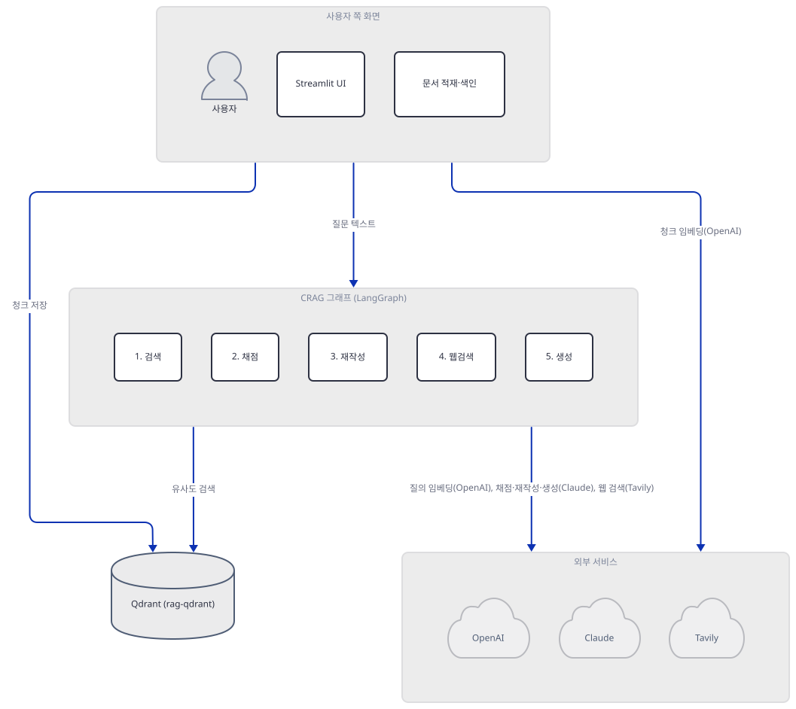
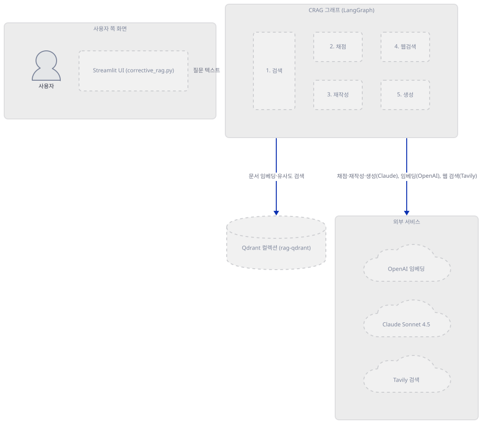
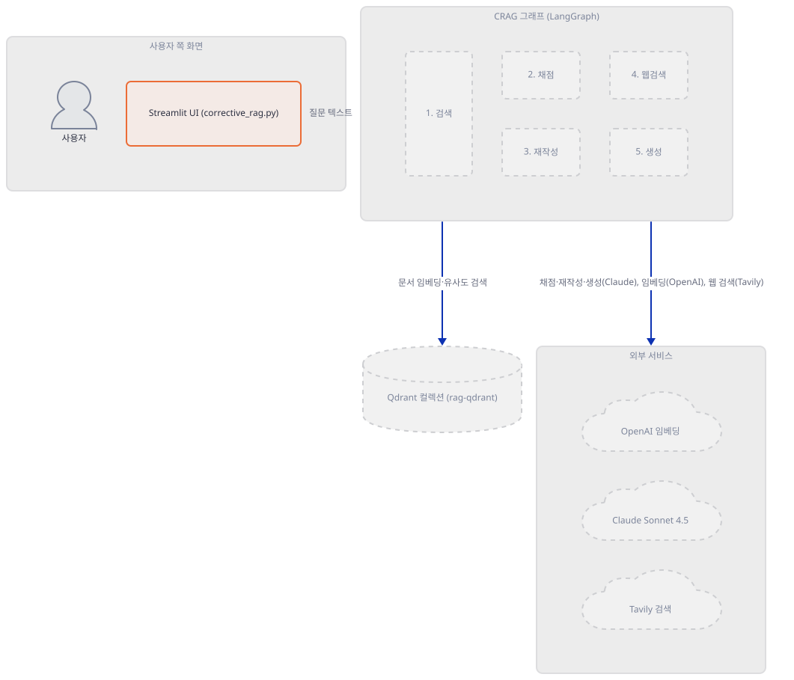
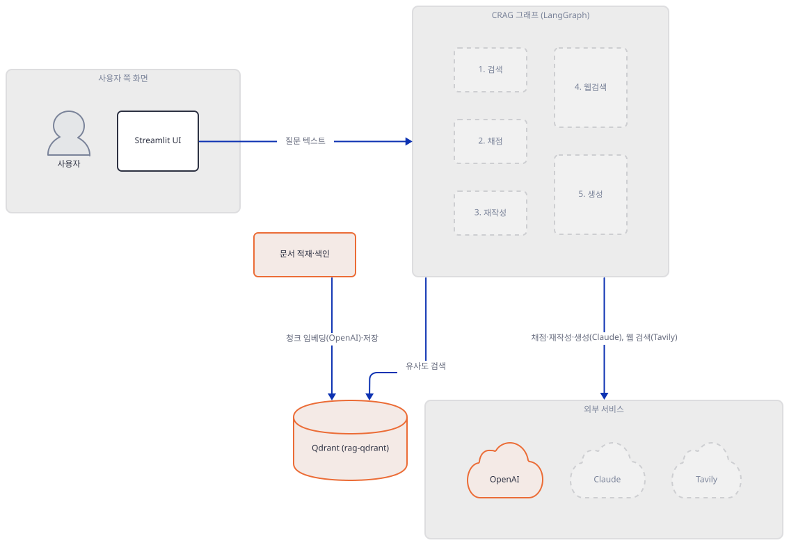
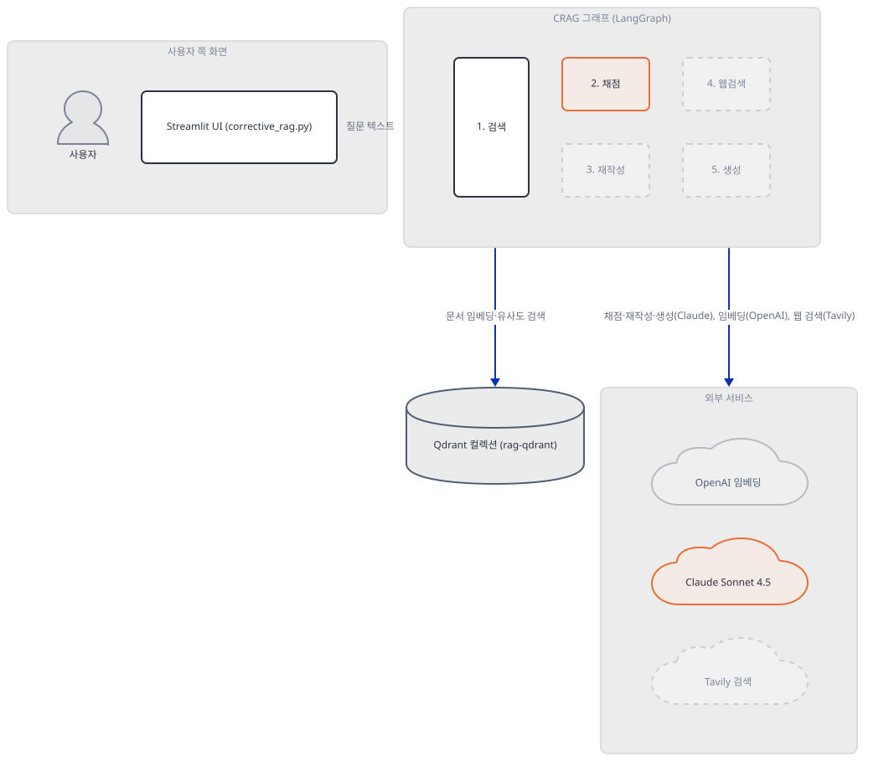
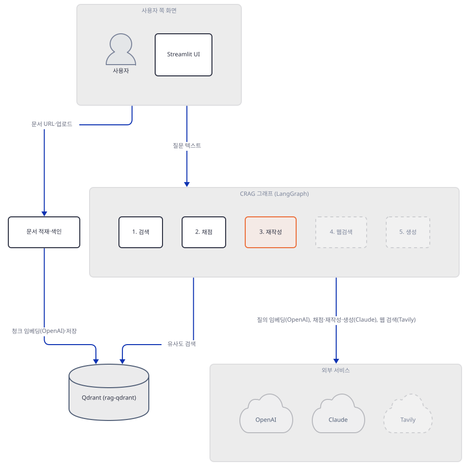
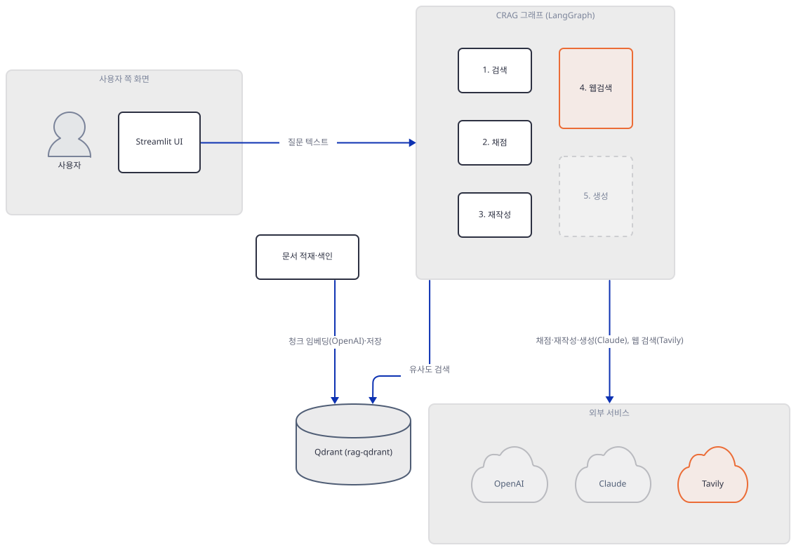
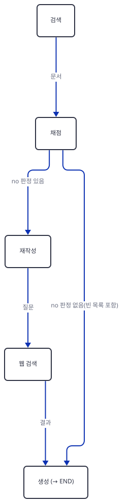
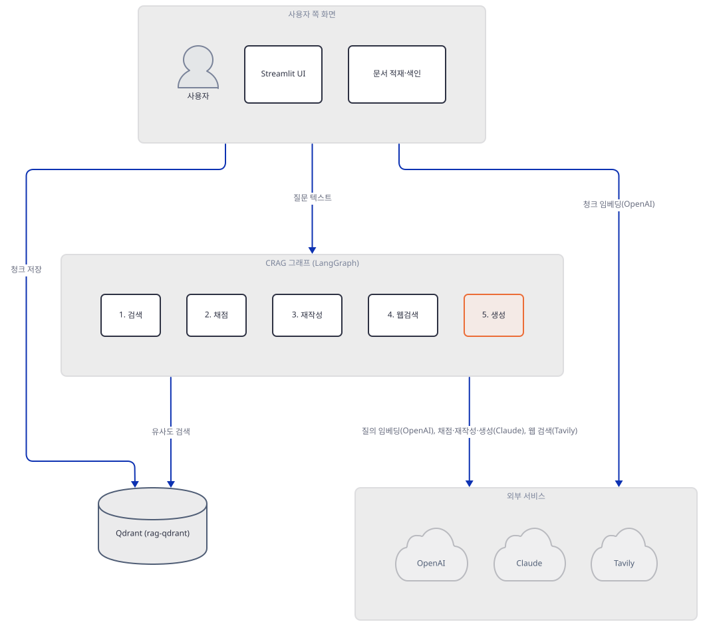
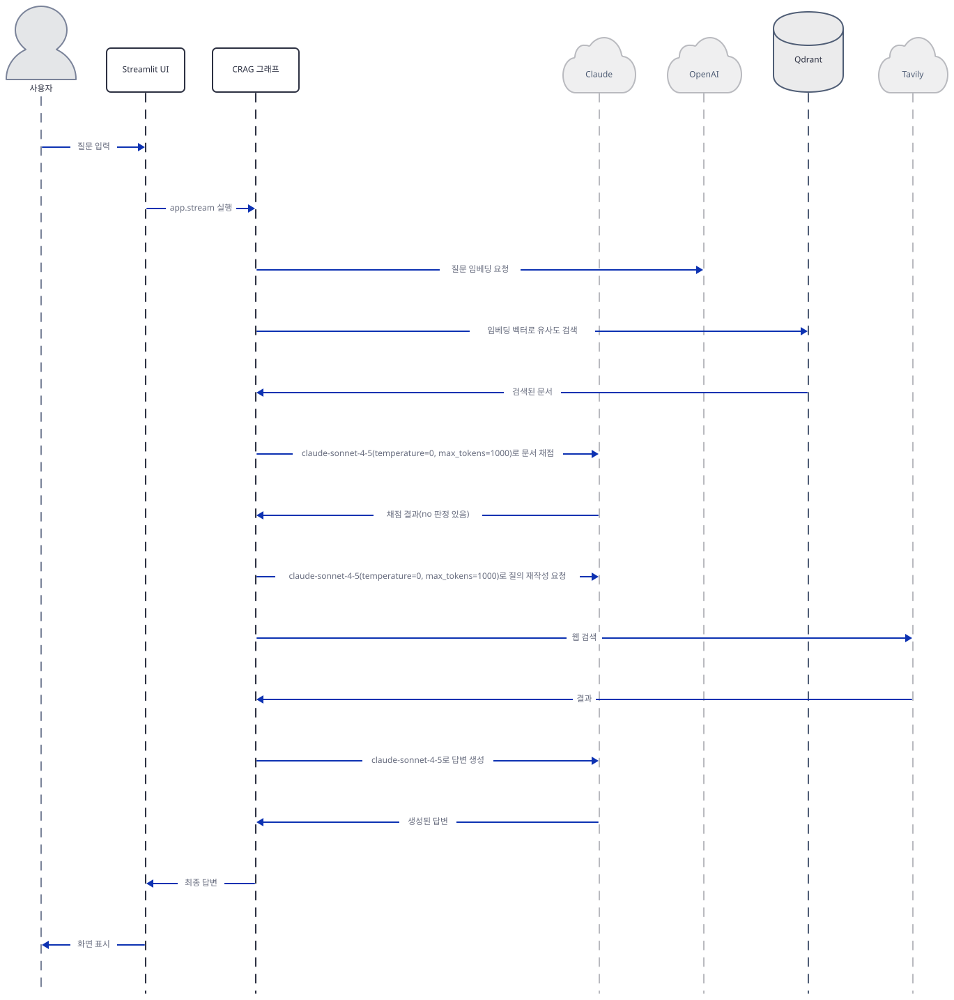

# Day 061 · 🔄 Corrective RAG (CRAG)

> 볼륨 5 📀 RAG · 난이도 ★★☆ ⚠ · 예상 소요 100분 · API 비용 대략 질문 1건당 OpenAI 임베딩 1회(질문 임베딩) + Claude 호출 1~6회(빈 문서 경로: 생성 1회뿐 / 문서 경로: 채점 최대 4회 — retriever 기본 k=4, 소스로 확인 — + 생성 1회 / 웹 검색 경로: 채점 + 재작성 + 생성) + Tavily 호출은 사이드바 Tavily 칸이 비어 있거나 `TAVILY_API_KEY` 환경변수가 없으면 0회(Step 6에서 직접 확인 — 둘 다 채워야 최대 3회 시도) + 문서 업로드 시 청크를 묶어서 임베딩 호출(청크마다 1회가 아님) — 대략치(키가 없어 실제 과금은 확인 못함) · 원본 앱: `rag_tutorials/corrective_rag`

## 오늘 만들 것

오늘은 문서를 검색해 답하다가 검색 품질이 부실하면 스스로 질문을 다시 쓰고 웹을 뒤져 바로잡는 Corrective RAG(CRAG)를 다룹니다. Day 047부터 이 볼륨이 반복해 온 "청크 → 임베딩 → 저장 → 검색 → 생성" 골격은 다시 설명하지 않고, 오늘 새로 얹히는 것 — LangGraph `StateGraph`로 짠 5노드 그래프(검색 → 채점 → [재작성 → 웹 검색] → 생성)와 그 조건부 분기 — 에 집중합니다. 그런데 이 468줄을 실제로 설치해 돌려보면(직접 확인, Step 1·3·6), "관련성이 없으면 웹으로 고친다"는 오늘의 핵심 아이디어 자체가 세 군데에서 걸립니다. 첫째, `requirements.txt` 18줄 어디에도 `pypdf`가 없는데 이 앱이 기본으로 제시하는 문서 URL 자체가 PDF(`arxiv.org`의 논문)라서, 아무 설정도 하지 않고 그대로 실행하면 `PyPDFLoader`가 `ImportError`로 곧바로 막힙니다(직접 확인, Step 3) — 이 실패는 네트워크 요청이 나가기 전에 일어난다는 것까지 소켓을 막아 직접 확인했습니다. 둘째, 그 실패로 문서가 하나도 들어오지 않은 상태(또는 실제 검색이 정말 아무것도 찾지 못한 상태)에서 `grade_documents`의 채점 루프는 "조사할 문서가 없다"와 "조사했더니 전부 관련 있다"를 구분하지 못합니다(직접 확인, Step 4) — 두 경우 모두 `run_web_search`가 초기값 `"No"`로 남아, 웹 검색 교정이 정확히 그것이 가장 필요한 순간에 건너뛰어집니다. 셋째, 앞의 두 문제를 모두 피해 `run_web_search`가 정말 `"Yes"`가 되어도, 웹 검색을 실제로 켜려면 **서로 다른 두 곳을 동시에** 채워야 합니다 — 사이드바 Tavily 칸이 비어 있으면 98행이 그 자리에서 돌아가 버리고, 칸을 채워도 `TavilySearchResults(api_key=...)`의 `api_key` 인자는 langchain-community 0.3.12에서 이미 버려지는 인자라 조용히 무시되며 실제 검증은 환경변수 `TAVILY_API_KEY`만 보기 때문에, 둘 중 하나만 채우면 여전히 웹 검색은 **한 번도 일어나지 않습니다**(직접 확인, Step 6). 이 문서는 이 세 가지를 모두 직접 재현하며 자격증명 게이트(Step 2)부터 그래프 조립·실행(Step 7)까지 다섯 개 노드를 하나씩 따라갑니다. 아래는 완성된 아키텍처입니다.



## 사전 준비

| 서비스/도구 | 용도 | 발급·설치 |
|---|---|---|
| Anthropic API 키 | 문서 채점·질의 재작성·답변 생성 세 곳 모두 Claude Sonnet 4.5(`claude-sonnet-4-5`) 호출 인증. 사이드바에 비어 있으면 전체 앱이 `st.stop()`으로 멈춤(Step 2) | https://console.anthropic.com/settings/keys |
| OpenAI API 키 | 문서·질문 임베딩(`text-embedding-3-small`) 인증. 마찬가지로 비어 있으면 전체 앱이 멈춤(Step 2) | https://platform.openai.com/api-keys |
| Qdrant 인스턴스(로컬 또는 클라우드) | 벡터 저장소. 코드 기본값은 로컬 `http://localhost:6333`이고 API 키 칸을 비워도 게이트를 통과함(Step 2에서 직접 확인) | 로컬: `docker run -p 6333:6333 qdrant/qdrant` / 클라우드: https://cloud.qdrant.io |
| Tavily API 키 | 검색된 문서가 부실할 때 웹 검색 교정. **두 곳에 다 있어야 합니다** — 98행의 게이트는 사이드바 칸이 비어 있으면 그 자리에서 건너뛰므로 칸을 반드시 채워야 하고(값 자체는 검증되지 않아 아무 문자열이나 통과합니다), 정작 검색에 실제로 쓰이는 키는 그 값이 아니라 환경변수 `TAVILY_API_KEY`뿐입니다(Step 6에서 직접 확인) | https://app.tavily.com |
| pypdf(별도 설치) | `PyPDFLoader`가 실제로 import하는 패키지 — `requirements.txt` 18줄 어디에도 없어 기본 설치로는 빠짐(Step 1·3에서 직접 확인) | `uv pip install pypdf` |
| 인터넷 연결(첫 적재 시) | `pypdf` 설치 후 문서를 처음 적재하면 청크 분할이 쓰는 `tiktoken`의 `gpt2` 인코딩 파일을 `openaipublic.blob.core.windows.net`에서 내려받습니다(소스로 확인, Day 059 Step 7이 이미 다룬 사실) | 별도 설치 없음 |
| uv | 가상환경 생성과 패키지 설치 | [공통 사전 준비](../README.md#공통-사전-준비-한-번만) 절 참고 |

## 아키텍처 한눈에 보기

| 컴포넌트 | 역할 | 코드 위치 |
|---|---|---|
| 사용자 | 문서 URL/업로드, 질문 입력 | 코드 없음 (브라우저) |
| 자격증명 게이트 (`setup_sidebar`) | 6개 입력을 모두 그리지만 실제 통과 조건은 OpenAI·Anthropic 키뿐 — 통과 못하면 이 아래 모든 함수·그래프 정의 자체가 실행되지 않음 | `rag_tutorials/corrective_rag/corrective_rag.py:44-59` |
| 문서 적재 (`load_documents`) | URL/업로드, PDF·txt/md·웹페이지 분기 후 청크 분할(500토큰/겹침 100토큰, `from_tiktoken_encoder`의 gpt2 인코딩 — Day 059 Step 7) | `rag_tutorials/corrective_rag/corrective_rag.py:156-178`, `rag_tutorials/corrective_rag/corrective_rag.py:205-208` |
| Qdrant 컬렉션 (`rag-qdrant`) | 새 문서가 들어올 때마다 삭제 후 재생성 — 한 번에 문서 하나만 보관 | `rag_tutorials/corrective_rag/corrective_rag.py:210-222` |
| CRAG 그래프 (LangGraph `StateGraph`) | retrieve → grade_documents → (조건부: transform_query 또는 generate) → web_search → generate | `rag_tutorials/corrective_rag/corrective_rag.py:421-445` |
| 문서 검색 (`retrieve`) | Qdrant 유사도 검색(기본 k=4), retriever가 없으면 빈 리스트 반환 | `rag_tutorials/corrective_rag/corrective_rag.py:244-253` |
| 관련성 평가 (`grade_documents`) | 문서별로 Claude에 yes/no 채점, 하나라도 "no"면 `run_web_search="Yes"` | `rag_tutorials/corrective_rag/corrective_rag.py:295-351` |
| 질의 재작성 (`transform_query`) | Claude로 질문을 검색 최적화 버전으로 완전히 교체 | `rag_tutorials/corrective_rag/corrective_rag.py:354-386` |
| 웹 검색 (`web_search`) | Tavily 검색(최대 3회 시도, 재시도 2회) — 사이드바 칸이 비어 있으면 98행에서 건너뛰고, 채워도 실제 키는 `TAVILY_API_KEY` 환경변수만 통함(Step 6), 결과를 문서 1건으로 합쳐 추가 | `rag_tutorials/corrective_rag/corrective_rag.py:85-153` |
| 답변 생성 (`generate`) | 문서+질문 컨텍스트로 Claude 호출, 실패 시 대체 문구 반환 | `rag_tutorials/corrective_rag/corrective_rag.py:256-293` |
| OpenAI 임베딩 | `text-embedding-3-small`, 1536차원 | `rag_tutorials/corrective_rag/corrective_rag.py:69-73` |
| Claude Sonnet 4.5 (Anthropic) | 채점·재작성·생성 세 곳에서 각각 새 인스턴스를 만들어 호출 | `rag_tutorials/corrective_rag/corrective_rag.py:266`, `rag_tutorials/corrective_rag/corrective_rag.py:302`, `rag_tutorials/corrective_rag/corrective_rag.py:373-374` |
| Tavily 검색 API | 웹 검색 폴백 | `rag_tutorials/corrective_rag/corrective_rag.py:81-83`, `rag_tutorials/corrective_rag/corrective_rag.py:104-109` |

## 단계별 진행

### Step 1. 환경 만들기 — 18줄 중 하나가 빠졌다

**목적.** 격리된 가상환경에 `requirements.txt` 18줄을 설치하고, 이 파일의 모든 import가 통과하는지 확인합니다. 동시에 이 앱의 기본 예시 문서가 실제로 요구하는 패키지가 설치 목록에 있는지 미리 확인합니다.

**할 일.**

```bash
cd rag_tutorials/corrective_rag
uv venv
uv pip install -r requirements.txt
```

(pip 대안: `python -m venv .venv && source .venv/bin/activate && pip install -r requirements.txt`. Windows PowerShell은 활성화만 `.venv\Scripts\Activate.ps1`로 바꿉니다.)

이 저장소는 루트에 `pyproject.toml`이 있어 `uv run`이 방금 만든 환경 대신 루트의 `.venv`를 쓰므로, 이후 모든 `uv run` 명령에는 `--no-project`를 붙입니다.

`rag_tutorials/corrective_rag/requirements.txt:1-18`

```text
# Core dependencies
langchain==0.3.12
langgraph==0.2.53
qdrant-client==1.12.1
langchain-openai==0.2.14
langchain-anthropic==0.3.0
tavily-python==0.5.0
langchain-community==0.3.12
langchain-core==0.3.28
streamlit==1.41.1
tenacity==8.5.0
anthropic>=0.7.0
openai>=1.12.0
tiktoken>=0.6.0
pydantic>=2.0.0
numpy>=1.24.0
PyYAML>=6.0.0
nest-asyncio>=1.5.0
```

이 목록에 `pypdf`는 없습니다. 실제로 설치하면(직접 확인) 102개 패키지가 풀리고, 요청하지 않은 `langchain-text-splitters==0.3.4`가 `langchain`의 전이 의존성으로 함께 따라옵니다(이 파일이 쓰는 `from langchain_text_splitters import RecursiveCharacterTextSplitter`가 바로 이 패키지입니다) — `pypdf`는 이 102개 어디에도 없습니다.



**확인.** 먼저 이 파일이 컴파일되고 모든 import가 성공하는지 확인합니다.

```bash
uv run --no-project python -m py_compile corrective_rag.py && echo COMPILE_OK
```

```
COMPILE_OK
```

```bash
uv run --no-project python -c "
from langchain import hub
from langchain_core.output_parsers import PydanticOutputParser, StrOutputParser
from langchain_core.documents import Document
from pydantic import BaseModel, Field
import streamlit as st
from langchain_text_splitters import RecursiveCharacterTextSplitter
from langchain_community.document_loaders import PyPDFLoader, TextLoader, WebBaseLoader
from langchain_community.tools import TavilySearchResults
from langchain_community.vectorstores import Qdrant
from langchain_openai import OpenAIEmbeddings, ChatOpenAI
from langchain_core.messages import HumanMessage
from langgraph.graph import END, StateGraph
from langchain_core.prompts import PromptTemplate
import pprint, yaml, nest_asyncio, tempfile, os
from qdrant_client import QdrantClient
from qdrant_client.models import Distance, VectorParams
from urllib.parse import urlparse
from langchain_anthropic import ChatAnthropic
from tenacity import retry, stop_after_attempt, wait_exponential
print('ALL IMPORTS OK')
"
```

직접 확인한 출력(경고는 뜨지만 실패는 아닙니다):

```
USER_AGENT environment variable not set, consider setting it to identify your requests.
ALL IMPORTS OK
```

이어서 `pypdf`가 정말 빠졌는지 확인합니다.

```bash
uv run --no-project python -c "import pypdf"
```

직접 확인한 출력:

```
ModuleNotFoundError: No module named 'pypdf'
```

### Step 2. 자격증명 게이트 — 통과 전까지는 이 파일의 나머지 전부가 존재하지 않는다

**목적.** 사이드바가 6개 입력 중 실제로 무엇을 검사하는지, 그리고 그 검사를 통과하기 전에는 이 아래 모든 함수·클래스·그래프 정의 자체가 실행되지 않는다는 것을 확인합니다.

**할 일.**

`rag_tutorials/corrective_rag/corrective_rag.py:44-59`

```python
def setup_sidebar():
    """Setup sidebar for API keys and configuration."""
    with st.sidebar:
        st.subheader("API Configuration")
        st.session_state.anthropic_api_key = st.text_input("Anthropic API Key", value=st.session_state.anthropic_api_key, type="password", help="Required for Claude 3 model")
        st.session_state.openai_api_key = st.text_input("OpenAI API Key", value=st.session_state.openai_api_key, type="password")
        st.session_state.tavily_api_key = st.text_input("Tavily API Key", value=st.session_state.tavily_api_key, type="password")
        st.session_state.qdrant_url = st.text_input("Qdrant URL", value=st.session_state.qdrant_url)
        st.session_state.qdrant_api_key = st.text_input("Qdrant API Key", value=st.session_state.qdrant_api_key, type="password")
        st.session_state.doc_url = st.text_input("Document URL", value=st.session_state.doc_url)
        
        if not all([st.session_state.openai_api_key, st.session_state.anthropic_api_key, st.session_state.qdrant_url]):
            st.warning("Please provide the required API keys and URLs")
            st.stop()
        
        st.session_state.initialized = True
```

`qdrant_url`은 `initialize_session_state`(`rag_tutorials/corrective_rag/corrective_rag.py:32-42`)에서 `"http://localhost:6333"`로 미리 채워지므로 사용자가 손대지 않아도 항상 참입니다. 즉 `all([...])`이 실제로 요구하는 것은 OpenAI·Anthropic 키 두 개뿐이고, Tavily 키와 Qdrant API 키는 이 게이트에서 전혀 검사되지 않습니다. 또한 이 파일은 함수로 감싸여 있지 않은 평서문 스크립트라서, 55~59행의 `if`가 `st.stop()`을 부르면 그 아래 있는 `load_documents`·`retrieve`·`grade_documents`·`transform_query`·`web_search`·`generate`·`decide_to_generate` 정의와 `StateGraph` 조립(421-445행)까지 전부 — 정의조차 — 실행되지 않습니다(Day 057의 `rag_agent_cohere.py`도 게이트 뒤에 모든 함수·클래스 정의를 두는 같은 패턴이었습니다 — 이 파일은 거기서 한 걸음 더 나아가 그래프 조립 자체도 모듈 최상위 코드라 게이트에 함께 묶입니다).



**확인.** 키를 하나도 넣지 않았을 때 정확히 무엇이 뜨는지, `streamlit.testing.v1.AppTest`로 네트워크 없이 확인합니다.

```bash
uv run --no-project python -c "
from streamlit.testing.v1 import AppTest
at = AppTest.from_file('corrective_rag.py')
at.run()
print('title:', [t.value for t in at.title])
print('sidebar text_input labels:', [ti.label for ti in at.sidebar.text_input])
print('warning messages:', [w.value for w in at.warning])
"
```

직접 확인한 출력:

```
title: []
sidebar text_input labels: ['Anthropic API Key', 'OpenAI API Key', 'Tavily API Key', 'Qdrant URL', 'Qdrant API Key', 'Document URL']
warning messages: ['Please provide the required API keys and URLs']
```

제목이 비어 있다는 것은 `st.title(...)`(447행)까지 실행이 아예 도달하지 않았다는 뜻입니다. 이번엔 가짜 OpenAI·Anthropic 키를 채우고, 아웃바운드 프록시를 죽은 포트로 돌리고 소켓 연결(`connect`)과 DNS 조회(`getaddrinfo`) 둘 다 루프백 외에는 막은 채로(어디든 실제로 네트워크에 나가려 하면 예외가 나도록) 같은 파일을 다시 실행해, 게이트를 통과한 뒤에도 외부로 나가는 시도가 없는지 확인합니다.

```bash
HTTP_PROXY=http://127.0.0.1:9 HTTPS_PROXY=http://127.0.0.1:9 NO_PROXY=localhost,127.0.0.1 \
uv run --no-project python -c "
import socket
_orig_connect = socket.socket.connect
def _guarded_connect(self, address, *a, **k):
    host = address[0] if isinstance(address, tuple) else address
    if host in ('127.0.0.1', '::1', 'localhost'):
        return _orig_connect(self, address, *a, **k)
    raise RuntimeError(f'network blocked: connect {address!r}')
socket.socket.connect = _guarded_connect
_orig_gai = socket.getaddrinfo
def _guarded_gai(host, *a, **k):
    if host in ('127.0.0.1', '::1', 'localhost', None):
        return _orig_gai(host, *a, **k)
    raise RuntimeError(f'network blocked: getaddrinfo {host!r}')
socket.getaddrinfo = _guarded_gai

from streamlit.testing.v1 import AppTest
at = AppTest.from_file('corrective_rag.py')
at.run()
for ti in at.sidebar.text_input:
    if ti.label == 'OpenAI API Key': ti.set_value('fake-openai-key')
    if ti.label == 'Anthropic API Key': ti.set_value('fake-anthropic-key')
at.run()
print('exception:', [e.message for e in at.exception])
print('title:', [t.value for t in at.title])
print('error messages:', [e.value for e in at.error])
"
```

(PowerShell: `$env:HTTP_PROXY="http://127.0.0.1:9"; $env:HTTPS_PROXY="http://127.0.0.1:9"; $env:NO_PROXY="localhost,127.0.0.1"` 을 먼저 실행)

직접 확인한 출력(qdrant-client가 먼저 내는 경고는 실패가 아닙니다):

```
UserWarning: Api key is used with an insecure connection.
exception: []
title: ['🔄 Corrective RAG Agent']
error messages: ['Error loading document: pypdf package not found, please install it with `pip install pypdf`']
```

가짜 키만으로도 게이트를 통과해 제목까지 렌더되고, 468행 전체가 예외 없이 끝까지 실행됩니다 — 실제로 뜨는 오류는 Step 3에서 다룰 `pypdf` 부재이지, 네트워크 차단이 아닙니다(루프백 외 연결·조회에서 `RuntimeError`가 하나도 나지 않았습니다). `OpenAIEmbeddings`·`QdrantClient` 생성 자체도 연결·조회를 시도하지 않는다는 것을 같은 방식으로 따로 확인했습니다.

```bash
HTTP_PROXY=http://127.0.0.1:9 HTTPS_PROXY=http://127.0.0.1:9 NO_PROXY=localhost,127.0.0.1 \
uv run --no-project python -c "
import socket
def _blocked(*a, **k): raise RuntimeError('network blocked')
socket.socket.connect = _blocked
socket.getaddrinfo = _blocked
from langchain_openai import OpenAIEmbeddings
from qdrant_client import QdrantClient
OpenAIEmbeddings(model='text-embedding-3-small', api_key='fake-openai-key')
QdrantClient(url='http://localhost:6333', api_key='')
print('both constructed, no RuntimeError')
"
```

직접 확인한 출력:

```
UserWarning: Api key is used with an insecure connection.
both constructed, no RuntimeError
```

### Step 3. 문서 적재 — 기본 예시가 이미 실패한다

**목적.** `load_documents`가 URL·업로드, PDF·텍스트·웹페이지를 어떻게 나누는지 확인하고, 이 앱의 기본 문서 URL이 Step 1에서 확인한 `pypdf` 부재로 왜 항상 실패하는지, 그 실패가 네트워크보다 먼저 일어나는지 직접 확인합니다.

**할 일.**

`rag_tutorials/corrective_rag/corrective_rag.py:156-178`

```python
def load_documents(file_or_url: str, is_url: bool = True) -> list:
    try:
        if is_url:
            # A .pdf URL must be parsed as a PDF; WebBaseLoader would run an HTML
            # parser over the binary body and embed decoded garbage.
            if urlparse(file_or_url).path.lower().endswith(".pdf"):
                loader = PyPDFLoader(file_or_url)
            else:
                loader = WebBaseLoader(file_or_url)
                loader.requests_per_second = 1
        else:
            file_extension = os.path.splitext(file_or_url)[1].lower()
            if file_extension == '.pdf':
                loader = PyPDFLoader(file_or_url)
            elif file_extension in ['.txt', '.md']:
                loader = TextLoader(file_or_url)
            else:
                raise ValueError(f"Unsupported file type: {file_extension}")
        
        return loader.load()
    except Exception as e:
        st.error(f"Error loading document: {str(e)}")
        return []
```

기본 문서 URL은 `initialize_session_state`가 채워 두는 `"https://arxiv.org/pdf/2307.09288.pdf"`(`rag_tutorials/corrective_rag/corrective_rag.py:42`)이고, 이 경로는 `.pdf`로 끝나므로 무조건 `PyPDFLoader`를 탑니다. `langchain-community==0.3.12`의 `PyPDFLoader.__init__`은(소스로 확인) `import pypdf`를 가장 먼저 시도하고, 실패하면 `requests.get(...)`으로 URL을 내려받는 `BasePDFLoader.__init__`을 호출하기도 전에 `ImportError`를 던집니다 — 즉 **URL이 맞든 틀리든, 인터넷이 되든 안 되든, `pypdf`가 없으면 네트워크 요청 자체가 나가지 않습니다.** 소켓을 완전히 막고 직접 실행해 확인했습니다.



**확인.**

```bash
uv run --no-project python -c "
import socket
def _blocked(self, *a, **k): raise RuntimeError('network blocked')
socket.socket.connect = _blocked
from langchain_community.document_loaders import PyPDFLoader
try:
    PyPDFLoader('https://arxiv.org/pdf/2307.09288.pdf')
except Exception as e:
    print('EXCEPTION TYPE:', type(e).__name__)
    print('EXCEPTION TEXT:', str(e))
"
```

직접 확인한 출력(소켓을 막았는데도 `RuntimeError`가 아니라 `ImportError`가 먼저 납니다 — 네트워크를 아예 시도하지 않았다는 뜻):

```
EXCEPTION TYPE: ImportError
EXCEPTION TEXT: pypdf package not found, please install it with `pip install pypdf`
```

`load_documents`의 `except Exception as e:`가 이 예외를 그대로 삼켜 `st.error(...)`만 띄우고 `[]`를 반환하므로(177-178행), 화면에는 Step 2에서 이미 본 붉은 오류 배너만 남고 `docs`는 빈 리스트가 됩니다. 문서를 성공적으로 불러온 뒤에는 `rag_tutorials/corrective_rag/corrective_rag.py:199-222`가 청크로 쪼개 Qdrant에 넣습니다.

```python
# Streamlit re-runs this whole script on every widget interaction (e.g. asking a
# question), so ingest only when the source actually changes — otherwise every
# question would delete the collection and re-embed the entire document.
source_key = url if input_option == "URL" else (uploaded_file.name if uploaded_file else None)

if docs and st.session_state.get("ingested_source") != source_key:
    text_splitter = RecursiveCharacterTextSplitter.from_tiktoken_encoder(
        chunk_size=500, chunk_overlap=100
    )
    all_splits = text_splitter.split_documents(docs)

    client = QdrantClient(url=st.session_state.qdrant_url, api_key=st.session_state.qdrant_api_key)
    collection_name = "rag-qdrant"

    try:
        # Try to delete the collection if it exists
        client.delete_collection(collection_name)
    except Exception:
        pass

    client.create_collection(
        collection_name=collection_name,
        vectors_config=VectorParams(size=1536, distance=Distance.COSINE),
    )
```

199~201행 주석이 이미 밝히듯 이 앱은 소스가 바뀔 때만 재적재합니다 — 그렇지 않으면 질문 하나마다(Streamlit이 스크립트를 처음부터 다시 실행하므로) 컬렉션을 지우고 다시 임베딩할 뻔했습니다. 다만 `docs`가 빈 리스트면(`if docs and ...`) 이 블록 전체가 건너뛰어지므로, `pypdf`가 없는 한 컬렉션은 절대 채워지지 않고 `client.delete_collection`/`create_collection`도 호출되지 않습니다. `delete_collection`이 무조건 먼저 불리는 것도 눈여겨볼 부분입니다 — 새 문서를 올릴 때마다 이전 컬렉션을 통째로 지우므로, 이 앱은 한 번에 문서 하나만 기억합니다.

### Step 4. 관련성 평가 — "문서가 없다"와 "전부 관련 있다"를 구분하지 못한다

**목적.** `grade_documents`가 Claude의 채점 응답을 어떻게 JSON으로 해석하는지, 그리고 오늘의 핵심 발견 — 검색된 문서가 하나도 없을 때 웹 검색 교정이 왜 건너뛰어지는지 — 를 직접 실행해 확인합니다.

**할 일.**

`rag_tutorials/corrective_rag/corrective_rag.py:295-351`

```python
def grade_documents(state):
    """Determines whether the retrieved documents are relevant."""
    print("~-check relevance-~")
    state_dict = state["keys"]
    question = state_dict["question"]
    documents = state_dict["documents"]

    llm = ChatAnthropic(model="claude-sonnet-4-5", api_key=st.session_state.anthropic_api_key,
                       temperature=0, max_tokens=1000)

    prompt = PromptTemplate(template="""You are grading the relevance of a retrieved document to a user question.
        Return ONLY a JSON object with a "score" field that is either "yes" or "no".
        Do not include any other text or explanation.
        
        Document: {context}
        Question: {question}
        
        Rules:
        - Check for related keywords or semantic meaning
        - Use lenient grading to only filter clear mismatches
        - Return exactly like this example: {{"score": "yes"}} or {{"score": "no"}}""",
        input_variables=["context", "question"])

    chain = (
        prompt 
        | llm 
        | StrOutputParser()
    )

    filtered_docs = []
    search = "No"
    
    for d in documents:
        try:
            response = chain.invoke({"question": question, "context": d.page_content})
            import re
            json_match = re.search(r'\{.*\}', response)
            if json_match:
                response = json_match.group()
            
            import json
            score = json.loads(response)
            
            if score.get("score") == "yes":
                print("~-grade: document relevant-~")
                filtered_docs.append(d)
            else:
                print("~-grade: document not relevant-~")
                search = "Yes"
                
        except Exception as e:
            print(f"Error grading document: {str(e)}")
            # On error, keep the document to be safe
            filtered_docs.append(d)
            continue

    return {"keys": {"documents": filtered_docs, "question": question, "run_web_search": search}}
```

`search`는 `"No"`로 초기화되고(325행), `for d in documents:` 루프 안에서 어떤 문서가 `"no"`로 채점될 때만 `"Yes"`로 바뀝니다(342-343행). 이 구조에는 빈틈이 하나 있습니다 — **`documents`가 애초에 빈 리스트라면 루프 본문이 한 번도 실행되지 않아 `search`는 `"No"`로 남습니다.** `retrieve`(`rag_tutorials/corrective_rag/corrective_rag.py:244-253`)는 전역 `retriever`가 `None`이면 바로 빈 리스트를 반환하므로(249-250행), Step 3의 `pypdf` 부재로 컬렉션이 한 번도 채워지지 않은 상태 — 또는 실제 검색이 정말 아무것도 찾지 못한 상태 — 는 모두 이 "빈 리스트" 경로를 탑니다. 즉 **"검토할 문서가 없었다"와 "검토했더니 전부 관련 있었다"가 똑같이 `run_web_search="No"`로 귀결되어, `decide_to_generate`(Step 5)는 웹 검색 교정 없이 곧장 `generate`로 갑니다** — CRAG가 웹 검색으로 고쳐야 할 바로 그 상황(쓸 문서가 없음)에서 고침이 일어나지 않는 것입니다. 이 루프는 LLM 호출 부분만 빼면 순수 파이썬 로직이라, 실제로 그대로 실행해 확인할 수 있습니다.



**확인.** 325~349행의 필터링 로직을 그대로 옮겨(빈 리스트에서는 루프 본문이 실행되지 않으므로 `chain`은 정의만 하고 부르지 않아도 동일합니다), 빈 문서 리스트를 넣었을 때 무엇이 나오는지 확인합니다.

```bash
uv run --no-project python -c "
def grade_documents_filter_only(documents, chain=None):
    filtered_docs = []
    search = 'No'
    for d in documents:
        try:
            response = chain.invoke({'question': 'q', 'context': d.page_content})
            import re, json
            json_match = re.search(r'\{.*\}', response)
            if json_match:
                response = json_match.group()
            score = json.loads(response)
            if score.get('score') == 'yes':
                filtered_docs.append(d)
            else:
                search = 'Yes'
        except Exception:
            filtered_docs.append(d)
            continue
    return filtered_docs, search

docs, search = grade_documents_filter_only([])
print('filtered_docs =', docs, ' run_web_search =', repr(search))
"
```

직접 확인한 출력:

```
filtered_docs = []  run_web_search = 'No'
```

JSON 파싱의 정규식 우회(330-336행)도 같은 방식으로 직접 확인했습니다 — 순수 텍스트에 JSON이 섞여 있어도 뽑아내지만, JSON 자체가 없으면 파싱이 실패해 `except`로 떨어져 347-348행("On error, keep the document to be safe" 주석과 함께) **문서를 버리지 않고 그대로 유지**합니다 — `search`는 바뀌지 않습니다.

```bash
uv run --no-project python -c "
import re, json
def extract_score(response):
    m = re.search(r'\{.*\}', response)
    if m: response = m.group()
    return json.loads(response)
print(extract_score('{\"score\": \"yes\"}'))
print(extract_score('Sure, here it is: {\"score\": \"no\"} -- done.'))
"
```

직접 확인한 출력:

```
{'score': 'yes'}
{'score': 'no'}
```

### Step 5. 질의 재작성과 조건부 분기

**목적.** `decide_to_generate`가 정확히 무엇을 보고 갈림길을 정하는지, 그리고 `transform_query`가 원래 질문을 어떻게 바꾸는지 확인합니다.

**할 일.**

`rag_tutorials/corrective_rag/corrective_rag.py:389-400`

```python
def decide_to_generate(state):
    print("~-decide to generate-~")
    state_dict = state["keys"]
    search = state_dict["run_web_search"]

    if search == "Yes":
     
        print("~-decision: transform query and run web search-~")
        return "transform_query"
    else:
        print("~-decision: generate-~")
        return "generate"
```

조건은 딱 한 줄, `search == "Yes"` 뿐입니다 — Step 4에서 본 대로 이 값을 만드는 것이 전부입니다.

`rag_tutorials/corrective_rag/corrective_rag.py:354-386`

```python
def transform_query(state):
    """Transform the query to produce a better question."""
    print("~-transform query-~")
    state_dict = state["keys"]
    question = state_dict["question"]
    documents = state_dict["documents"]

    # Create a prompt template
    prompt = PromptTemplate(
        template="""Generate a search-optimized version of this question by 
        analyzing its core semantic meaning and intent.
        \n ------- \n
        {question}
        \n ------- \n
        Return only the improved question with no additional text:""",
        input_variables=["question"],
    )

    # Use Claude instead of Gemini
    llm = ChatAnthropic(
        model="claude-sonnet-4-5",
        anthropic_api_key=st.session_state.anthropic_api_key,
        temperature=0,
        max_tokens=1000
    )

    # Prompt
    chain = prompt | llm | StrOutputParser()
    better_question = chain.invoke({"question": question})

    return {
        "keys": {"documents": documents, "question": better_question}
    }
```

372행의 "Use Claude instead of Gemini"라는 주석은 이 파일이 한 번은 Gemini에서, 한 번은 "Claude 3"(48·257행의 도움말·독스트링에 남은 이름)에서 지금의 `claude-sonnet-4-5`로 적어도 두 번 모델을 바꿔 왔다는 흔적입니다(소스로 확인) — 실제 호출 문자열은 세 곳(266·302·373-374행) 모두 `claude-sonnet-4-5`로 일치하므로 동작에는 영향이 없습니다. 주목할 점은 `better_question`이 원래 질문을 **대체**한다는 것입니다(384-386행에서 `question` 키가 사라지고 `better_question`이 그 자리를 차지) — 이후 `web_search`도, 관련 문서가 있었다면 건너뛰었을 `generate`도 재작성된 질문만 보게 됩니다.



**확인.** `decide_to_generate`의 분기 로직만 그대로 옮겨 두 입력에서 실행해 확인합니다.

```bash
uv run --no-project python -c "
def decide_to_generate(state):
    search = state['keys']['run_web_search']
    return 'transform_query' if search == 'Yes' else 'generate'

print('search=Yes ->', decide_to_generate({'keys': {'run_web_search': 'Yes'}}))
print('search=No  ->', decide_to_generate({'keys': {'run_web_search': 'No'}}))
"
```

직접 확인한 출력:

```
search=Yes -> transform_query
search=No  -> generate
```

### Step 6. 웹 검색 보강 — 사이드바 Tavily 키는 실제로 쓰이지 않는다

**목적.** `web_search`가 Tavily 키가 없을 때 어떻게 조용히 건너뛰는지 확인하고, 키가 "있을" 때조차 사이드바에 입력한 값이 실제로는 버려진다는 것 — 오늘의 세 번째 핵심 발견 — 을 직접 실행해 확인합니다.

**할 일.**

`rag_tutorials/corrective_rag/corrective_rag.py:85-100`

```python
def web_search(state):
    """Web search based on the re-phrased question using Tavily API."""
    print("~-web search-~")
    state_dict = state["keys"]
    question = state_dict["question"]
    documents = state_dict["documents"]
    
    # Create progress placeholder
    progress_placeholder = st.empty()
    progress_placeholder.info("Initiating web search...")
    
    try:
        # Validate Tavily API key
        if not st.session_state.tavily_api_key:
            progress_placeholder.warning("Tavily API key not provided - skipping web search")
            return {"keys": {"documents": documents, "question": question}}
```

Step 2에서 확인했듯 사이드바 게이트는 `tavily_api_key`를 전혀 검사하지 않으므로, 이 98-100행이 "키를 아예 안 넣었을 때"의 유일한 방어선입니다. 문제는 키를 넣었을 때입니다 — 106행이 그 값을 `TavilySearchResults`에 어떻게 넘기는지 보겠습니다.

`rag_tutorials/corrective_rag/corrective_rag.py:104-109`

```python
        # Initialize Tavily search tool
        tool = TavilySearchResults(
            api_key=st.session_state.tavily_api_key,
            max_results=3,
            search_depth="advanced"
        )
```

langchain-community==0.3.12의 `TavilySearchResults`(소스로 확인, `tool.py:146`)에는 `api_key` 필드가 없습니다 — 있는 것은 `api_wrapper: TavilySearchAPIWrapper = Field(default_factory=TavilySearchAPIWrapper)`뿐이라, 106행의 `api_key=...`는 pydantic이 조용히 무시하는 미지의 키워드 인자가 되고, `default_factory`는 인자 없이 `TavilySearchAPIWrapper()`를 만듭니다. 그 클래스(소스로 확인, `tavily_search.py:21-34`)는 `get_from_dict_or_env(values, "tavily_api_key", "TAVILY_API_KEY")`로 키를 찾으므로, **사이드바 값이 아니라 환경변수 `TAVILY_API_KEY`만 봅니다.** 즉 사이드바에 진짜 Tavily 키를 넣어도 이 줄은 매번 "키가 없다"는 예외로 실패합니다.



**확인.** 실제 웹 검색(외부 요청)은 실행하지 않고, `TavilySearchResults` 생성자만 프록시를 죽은 포트로 돌리고 소켓을 막은 채로 직접 호출해 확인합니다.

```bash
HTTP_PROXY=http://127.0.0.1:9 HTTPS_PROXY=http://127.0.0.1:9 NO_PROXY=localhost,127.0.0.1 \
uv run --no-project python -c "
import socket
def _blocked(*a, **k): raise RuntimeError('network blocked')
socket.socket.connect = _blocked
socket.getaddrinfo = _blocked
from langchain_community.tools import TavilySearchResults
try:
    tool = TavilySearchResults(api_key='fake-tavily-key', max_results=3, search_depth='advanced')
    print('constructed OK, wrapper key =', tool.api_wrapper.tavily_api_key.get_secret_value())
except Exception as e:
    print(type(e).__name__, ':', str(e).splitlines()[0])
"
```

직접 확인한 출력(사이드바와 똑같이 `api_key=`만 넘기고 환경변수는 비워 둔 경우):

```
ValidationError : 1 validation error for TavilySearchAPIWrapper
```

환경변수를 채우면 통과하지만, 실제로 쓰이는 키는 사이드바 값이 아니라 환경변수 값입니다:

```bash
HTTP_PROXY=http://127.0.0.1:9 HTTPS_PROXY=http://127.0.0.1:9 NO_PROXY=localhost,127.0.0.1 TAVILY_API_KEY=fake-env-key \
uv run --no-project python -c "
import socket
socket.socket.connect = lambda *a, **k: (_ for _ in ()).throw(RuntimeError('blocked'))
from langchain_community.tools import TavilySearchResults
tool = TavilySearchResults(api_key='fake-tavily-key', max_results=3, search_depth='advanced')
print('constructed OK, wrapper key =', tool.api_wrapper.tavily_api_key.get_secret_value())
"
```

직접 확인한 출력:

```
constructed OK, wrapper key = fake-env-key
```

`fake-tavily-key`(사이드바에 해당하는 값)가 아니라 `fake-env-key`(환경변수 값)가 실제로 저장된다는 뜻입니다. 그런데 이 지점(106행)에 실제로 도달하려면 **그 앞의 98행 게이트부터 통과해야 합니다** — 그 게이트가 보는 것은 사이드바 값이 비어 있는지 아닌지뿐, 환경변수와는 무관합니다. `web_search` 함수 본문을 소스에서 그대로 떼어(`ast`로 함수 정의만 추출 — 모듈 전체를 import하지 않으므로 사이드바 등 나머지 코드는 실행되지 않습니다) `st`를 얇은 스텁으로 바꿔, **사이드바 칸을 비워 둔 채 환경변수만 설정한 경우**(제가 맨 처음 이 문서에 잘못 적었던 "우회법")를 직접 실행해 확인했습니다(프록시를 죽은 포트로 돌리고 소켓·DNS를 막은 채로, 네트워크 시도 0건).

```bash
HTTP_PROXY=http://127.0.0.1:9 HTTPS_PROXY=http://127.0.0.1:9 NO_PROXY=localhost,127.0.0.1 TAVILY_API_KEY=fake-env-key \
uv run --no-project python -c "
import socket
def _blocked(*a, **k): raise RuntimeError('network blocked')
socket.socket.connect = _blocked
socket.getaddrinfo = _blocked
import ast, types
src = open('corrective_rag.py', encoding='utf-8').read()
tree = ast.parse(src)
func_src = next(ast.get_source_segment(src, n) for n in tree.body if isinstance(n, ast.FunctionDef) and n.name == 'web_search')

class Placeholder:
    def __getattr__(self, name):
        return lambda msg=None: print(f'  placeholder.{name} | {msg}')

class St(types.SimpleNamespace):
    session_state = types.SimpleNamespace(tavily_api_key='')  # 사이드바 Tavily 칸을 비워 둔 상태
    @staticmethod
    def empty(): return Placeholder()

# corrective_rag.py 최상위에서 web_search가 참조하는 이름들을 같은 네임스페이스에 준비
setup_src = '''
from langchain_community.tools import TavilySearchResults
from tenacity import retry, stop_after_attempt, wait_exponential
@retry(stop=stop_after_attempt(3), wait=wait_exponential(multiplier=1, min=4, max=10))
def execute_tavily_search(tool, query):
    return tool.invoke({\"query\": query})
'''
ns = {'st': St}
exec(compile(setup_src, '<setup>', 'exec'), ns)
exec(compile(func_src, 'corrective_rag.py', 'exec'), ns)
result = ns['web_search']({'keys': {'question': 'q', 'documents': ['kept doc']}})
print('documents after web_search:', result['keys']['documents'])
"
```

직접 확인한 출력:

```
  placeholder.info | Initiating web search...
  placeholder.warning | Tavily API key not provided - skipping web search
  placeholder.empty | None
documents after web_search: ['kept doc']
```

98행의 `if not st.session_state.tavily_api_key:`가 **환경변수와 무관하게** 사이드바 값만 보고 곧바로 돌아가 버립니다 — `TavilySearchAPIWrapper`(106행)까지 가지도 못하므로, 환경변수를 아무리 채워도 사이드바 칸이 비어 있으면 웹 검색이 절대 켜지지 않습니다. 이전 판의 "사이드바 대신 환경변수만 설정하면 된다"는 안내는 **틀렸습니다** — 이 재현으로 정정합니다.

반대로 **사이드바 칸에 아무 문자열이나 채운 경우**는 98행을 통과해 106행의 `TavilySearchResults(...)` 생성까지 갑니다 — 바로 위에서 이미 확인한 "환경변수를 채우면 통과" 시험이 정확히 이 지점입니다(그 시험에서 사용한 `api_key='fake-tavily-key'`가 106행이 넘기는 값과 같은 자리입니다). 그다음 줄(`execute_tavily_search` → `tool.invoke(...)`)은 실제 검색 요청을 내보내므로 이 문서는 실행하지 않습니다. 즉 **사이드바 칸과 환경변수 둘 다 채워야** — 칸의 값 자체는 검증되지 않으니 아무 문자열이나 되지만, 칸이 비어 있으면 절대 안 됩니다 — 106행까지 도달합니다.

키는 채웠지만 방식이 틀린 경우(예: 진짜 키를 사이드바에만 넣고 환경변수는 비움)는 어떻게 되는지도 이미 위에서 확인했습니다 — `ValidationError`가 나고 `finally: progress_placeholder.empty()`(151-152행)가 그 배너를 **화면에서 즉시 지웁니다.** 콘솔에는 `print(error_msg)`(148행)로 남지만, 사용자는 "no" 판정을 봤는데도 왜 웹 검색 결과가 안 보이는지 화면만으로는 알 길이 없습니다. 성공했다면 최대 3건의 결과를 제목·본문으로 합쳐 **문서 하나**로 만들어 기존 `documents`에 추가했을 것입니다(`rag_tutorials/corrective_rag/corrective_rag.py:134-143`, 재시도는 `@retry(stop_after_attempt(3), wait_exponential(...))`, `rag_tutorials/corrective_rag/corrective_rag.py:81-83`).

정리하면, 이 앱에서 웹 검색을 실제로 켜려면 **두 가지를 동시에** 해야 합니다 — 사이드바 Tavily 칸에 아무 문자열이나(진짜 키가 아니어도) 채우고, 그와 별개로 셸에 진짜 키를 `TAVILY_API_KEY`로 설정한 뒤 앱을 띄웁니다:

```bash
TAVILY_API_KEY=여기에_실제_키 uv run --no-project streamlit run corrective_rag.py
# 그리고 브라우저의 사이드바 Tavily 칸에는 아무 문자열이나 입력(빈 칸이면 98행에서 곧바로 건너뜀)
```

```powershell
$env:TAVILY_API_KEY="여기에_실제_키"; uv run --no-project streamlit run corrective_rag.py
# 사이드바 Tavily 칸은 위와 동일하게 아무 문자열이나 채웁니다
```

### Step 7. 답변 생성과 그래프 조립·실행

**목적.** `generate`가 Claude를 어떻게 호출하는지, `StateGraph`가 다섯 노드를 어떻게 잇는지, 그리고 Streamlit 루프가 각 노드의 중간 상태를 어떻게 화면에 펼치는지 확인합니다.

**할 일.**

`rag_tutorials/corrective_rag/corrective_rag.py:256-278`

```python
def generate(state):
    """Generate answer using Claude 3 model"""
    print("~-generate-~")
    state_dict = state["keys"]
    question, documents = state_dict["question"], state_dict["documents"]
    try:
        prompt = PromptTemplate(template="""Based on the following context, please answer the question.
            Context: {context}
            Question: {question}
            Answer:""", input_variables=["context", "question"])
        llm = ChatAnthropic(model="claude-sonnet-4-5", api_key=st.session_state.anthropic_api_key,
                           temperature=0, max_tokens=1000)
        context = "\n\n".join(doc.page_content for doc in documents)

        # Create and run chain
        rag_chain = (
            {"context": lambda x: context, "question": lambda x: question} 
            | prompt 
            | llm 
            | StrOutputParser()
        )

        generation = rag_chain.invoke({})
```

`documents`가 비어 있어도 `context`는 그냥 빈 문자열이 될 뿐 이 함수는 실패하지 않습니다 — Step 4에서 본 "문서가 없어도 웹 검색으로 가지 않는" 경로의 마지막 도착지가 바로 여기이며, 프롬프트의 `Context:` 자리가 빈 채로 Claude에 그대로 넘어갑니다. Claude가 이런 빈 컨텍스트에서 정확히 어떻게 답하는지는 키가 없어 실행으로 확인하지 못했습니다. 그래프 조립은 다음과 같습니다.

`rag_tutorials/corrective_rag/corrective_rag.py:421-445`

```python
workflow = StateGraph(GraphState)

# Define the nodes by langgraph
workflow.add_node("retrieve", retrieve) 
workflow.add_node("grade_documents", grade_documents)  
workflow.add_node("generate", generate) 
workflow.add_node("transform_query", transform_query)  
workflow.add_node("web_search", web_search) 

# Build graph
workflow.set_entry_point("retrieve")
workflow.add_edge("retrieve", "grade_documents")
workflow.add_conditional_edges(
    "grade_documents",
    decide_to_generate,
    {
        "transform_query": "transform_query",
        "generate": "generate",
    },
)
workflow.add_edge("transform_query", "web_search")
workflow.add_edge("web_search", "generate")
workflow.add_edge("generate", END)

app = workflow.compile()
```

이 상태 기계 전체는 `diagrams/extra-graph.svg`에 따로 그렸습니다 — "no 판정이 하나도 없음"(전부 관련 있음 **또는** Step 4에서 본 빈 목록) 경로가 `transform_query`·`web_search`를 완전히 건너뛰고 `grade_documents`에서 곧장 `generate`로 간다는 것을 한눈에 볼 수 있습니다.



마지막으로 화면 배선입니다.

`rag_tutorials/corrective_rag/corrective_rag.py:454-468`

```python
if user_question:
    inputs = {
        "keys": {
            "question": user_question,
        }
    }

    for output in app.stream(inputs):
        for key, value in output.items():
            with st.expander(f"Step '{key}':"):
                st.text(pprint.pformat(format_state(value["keys"]), indent=2, width=80))

    final_generation = value['keys'].get('generation', 'No final generation produced.')
    st.subheader("Final Generation:")
    st.write(final_generation)
```

`app.stream(inputs)`은 노드가 끝날 때마다 그 시점의 상태를 내보내므로, 화면에는 노드 이름별 접이식 패널이 실행 순서대로 쌓입니다. 마지막 `value`(파이썬 루프 변수가 루프 종료 후에도 남는다는 성질을 이용)에서 `generation`을 꺼내 최종 답으로 보여줍니다.



**확인.** Step 2에서 가짜 키로 실행한 `AppTest`가 이미 이 전체 조립(421-445행)과 화면 배선(447-468행)을 예외 없이 통과했다는 것은 `exception: []`이고 `title`이 채워졌다는 것으로 확인됩니다(질문을 실제로 입력하지 않았으므로 `app.stream`은 호출되지 않았고, 그래프 조립 자체만 검증한 것입니다). 421-445행의 배선이 정확히 어떤 노드·간선을 만드는지는 노드 함수를 빈 스텁으로 바꿔 키 없이 직접 컴파일해 확인할 수 있습니다.

```bash
uv run --no-project python -c "
from langgraph.graph import END, StateGraph
from typing import Dict, TypedDict

class GraphState(TypedDict):
    keys: Dict[str, any]

def retrieve(state): return state
def grade_documents(state): return state
def generate(state): return state
def transform_query(state): return state
def web_search(state): return state
def decide_to_generate(state):
    return 'transform_query' if state['keys'].get('run_web_search') == 'Yes' else 'generate'

workflow = StateGraph(GraphState)
workflow.add_node('retrieve', retrieve)
workflow.add_node('grade_documents', grade_documents)
workflow.add_node('generate', generate)
workflow.add_node('transform_query', transform_query)
workflow.add_node('web_search', web_search)
workflow.set_entry_point('retrieve')
workflow.add_edge('retrieve', 'grade_documents')
workflow.add_conditional_edges('grade_documents', decide_to_generate, {'transform_query': 'transform_query', 'generate': 'generate'})
workflow.add_edge('transform_query', 'web_search')
workflow.add_edge('web_search', 'generate')
workflow.add_edge('generate', END)
app = workflow.compile()
for e in app.get_graph().edges:
    print(e.source, '->', e.target, '(conditional)' if e.conditional else '')
"
```

직접 확인한 출력(pydantic이 `Dict[str, any]`의 소문자 `any`를 두고 내는 경고 한 줄은 생략 — 240-241행 `GraphState`가 `typing.Any`가 아니라 내장 함수 `any`를 그대로 타입 힌트에 쓴 탓입니다, 소스로 확인):

```
__start__ -> retrieve
generate -> __end__
retrieve -> grade_documents
transform_query -> web_search
web_search -> generate
grade_documents -> transform_query (conditional)
grade_documents -> generate (conditional)
```

`grade_documents`에서 나가는 두 간선만 `(conditional)`로 표시됩니다 — Step 4~5에서 본 분기가 그래프 구조 자체에도 정확히 그렇게 반영돼 있다는 뜻입니다.

## 요청 한 건이 흐르는 과정



이 시퀀스는 오늘 다섯 노드를 모두 거치는 "교정" 경로 — 검색된 문서 중 일부가 "no"로 채점되어 질의 재작성과 웹 검색까지 가는 경우 — 를 그린 것입니다. 그래프는 먼저 OpenAI로 질문을 임베딩한 뒤 그 벡터로 Qdrant에 유사도 검색을 보내고, 돌아온 문서를 Claude로 한 건씩 채점합니다. 하나라도 "no"가 나오면 Claude에 질의 재작성을 요청하고 Tavily 웹 검색을 실행한 뒤, 원래 검색 결과와 웹 결과를 합쳐 Claude에게 최종 답을 생성시킵니다 — **다만 이 Tavily 구간은 사이드바 Tavily 칸과 `TAVILY_API_KEY` 환경변수가 둘 다 채워져 있을 때의 그림입니다.** Step 6에서 확인했듯 둘 중 하나라도 비어 있으면(사이드바만 비었거나, 사이드바는 채웠지만 환경변수가 없거나) `web_search`는 경고나 예외를 콘솔에 남기고 문서 목록을 그대로 돌려주므로, 이 시퀀스의 Tavily 왕복 없이 곧장 `generate`로 넘어갑니다. 반대로 채점된 문서에 "no"가 하나도 없었다면(전부 관련 있음, 또는 Step 4에서 본 대로 애초에 검색된 문서가 하나도 없었다면) 그래프는 `grade_documents`에서 곧장 `generate`로 건너뜁니다 — 그 분기는 `diagrams/extra-graph.svg`가 보여줍니다. Anthropic·OpenAI·Tavily 키가 없어 이 흐름을 처음부터 끝까지 한 번에 재현하지는 못했고, 각 구간은 Step 2~7에서 소스와 격리된 실행으로 따로 확인한 것을 이어붙였습니다.

## 실행 체크리스트

- [ ] Anthropic·OpenAI API 키와 Qdrant 인스턴스(로컬 또는 클라우드)를 준비했다. Tavily는 실제로 켜려면 환경변수가 필요하다는 것을 알아 두었다
- [ ] `uv venv && uv pip install -r requirements.txt`가 102개 패키지로 끝나고 `pypdf`는 그 안에 없다는 것을 직접 확인했다
- [ ] 이 파일이 함수로 감싸여 있지 않아, 키를 넣지 않으면 사이드바 아래 모든 정의·그래프 조립 자체가 실행되지 않는다는 것을 `AppTest`로 확인했다
- [ ] 기본 문서 URL(arxiv PDF)이 `pypdf` 부재로 항상 실패하고, 그 실패가 네트워크 요청보다 먼저 일어난다는 것을 소켓·DNS를 막아 직접 확인했다
- [ ] `grade_documents`가 빈 문서 리스트를 받으면 `run_web_search`가 `"No"`로 남아 웹 검색 교정이 건너뛰어진다는 것을 직접 실행해 확인했다
- [ ] Tavily 웹 검색을 실제로 켜려면 사이드바 칸(비어 있으면 98행이 건너뜀)과 `TAVILY_API_KEY` 환경변수(값 자체는 이것만 쓰임) 둘 다 필요하다는 것을, 하나만 채운 두 경우를 각각 직접 실행해 확인했다
- [ ] CRAG 그래프의 다섯 노드와 조건부 분기를 `diagrams/extra-graph.svg`와 `app.get_graph().edges` 출력으로 따라갔다

## 문제 해결

| 증상 | 원인 | 해결 |
|---|---|---|
| 기본 문서 URL이나 PDF 업로드에서 "Error loading document: pypdf package not found..." | `requirements.txt` 18줄에 `pypdf`가 없어 `PyPDFLoader.__init__`이 네트워크 요청 전에 `ImportError`로 실패(직접 확인) | `uv pip install pypdf` 추가 설치 |
| 검색된 문서가 없거나 채점이 전부 통과했는데도 웹 검색으로 넘어가지 않아 의아함 | `grade_documents`의 `search` 초기값이 `"No"`이고 빈 문서 리스트에서는 루프가 한 번도 안 돌아 바뀌지 않음(직접 확인) | 리포 코드는 고치지 않는 방침. 재현하려면 `documents`가 정말 비어 있는지 콘솔 로그(`~-retrieve-~` 다음 줄)로 먼저 확인 |
| 사이드바 Tavily 칸을 비워 뒀는데 셸에는 `TAVILY_API_KEY`를 설정해 두어 웹 검색을 기대했지만 화면에 "Tavily API key not provided - skipping web search"만 뜸 | 98행의 게이트가 환경변수와 무관하게 사이드바 값만 보고 곧바로 돌아감(직접 확인) | 사이드바 칸에 아무 문자열이나 채우기(빈 칸이 아니기만 하면 됨) |
| 사이드바 칸도 채우고 `TAVILY_API_KEY`도 설정했는데(또는 사이드바에만 진짜 키를 넣었는데) 웹 결과가 안 붙고 콘솔에 "Web search error: 1 validation error for TavilySearchAPIWrapper"가 남음 | `TavilySearchResults`에 `api_key` 필드가 없어 사이드바 값이 조용히 버려지고, 내부 `TavilySearchAPIWrapper`는 환경변수 `TAVILY_API_KEY`만 봄(직접 확인) | 사이드바 칸(아무 문자열)과 `TAVILY_API_KEY`(진짜 키) 둘 다 채우기 — 하나만으로는 안 됨 |

## 더 해보기

- `pypdf`를 설치한 뒤 실제 PDF를 올려 컬렉션이 채워지는지, 그다음 질문이 정말 Step 3~4의 검색·채점 경로를 타는지 직접 확인해보기
- `grade_documents`(`rag_tutorials/corrective_rag/corrective_rag.py:324-325`)의 `search = "No"` 초기값을 `documents`가 비어 있을 때 `"Yes"`로 바꿔보고, "검토할 문서가 없으면 곧장 웹 검색"이 되도록 동작이 어떻게 달라지는지 실험해보기
- `transform_query`(`rag_tutorials/corrective_rag/corrective_rag.py:354-386`)가 실제로 어떤 질문을 만들어내는지, 원래 질문과 나란히 로그로 남겨 비교해보기
- 실제 Tavily 키가 있다면 사이드바 칸에 아무 문자열이나 채우고 셸에는 `TAVILY_API_KEY`로 진짜 키를 설정한 뒤(둘 다 필요합니다 — Step 6) `web_search`가 정말 웹 결과를 붙이는지 확인해보기 — 이왕이면 `TavilySearchResults(api_key=...)`를 실제로 통하게 고치려면 몇 줄이 필요한지도 가늠해보기(리포 코드는 고치지 않는 것이 방침이므로 가늠만)

## 다음 날 예고

[Day 062 · 🤔 Gemini Agentic RAG](../day062-gemini-agentic-rag/README.md) — Gemini 2.0 Flash Thinking과 Agno 에이전트, Exa AI 웹 검색을 조합한 RAG 앱을 다룹니다.
