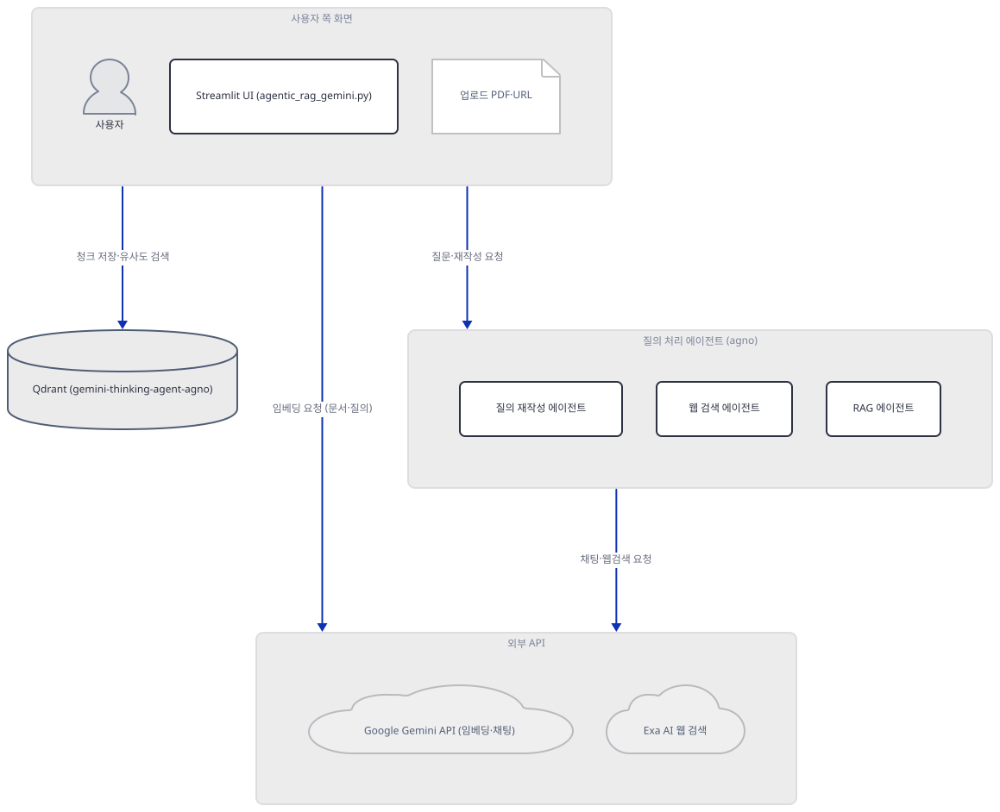
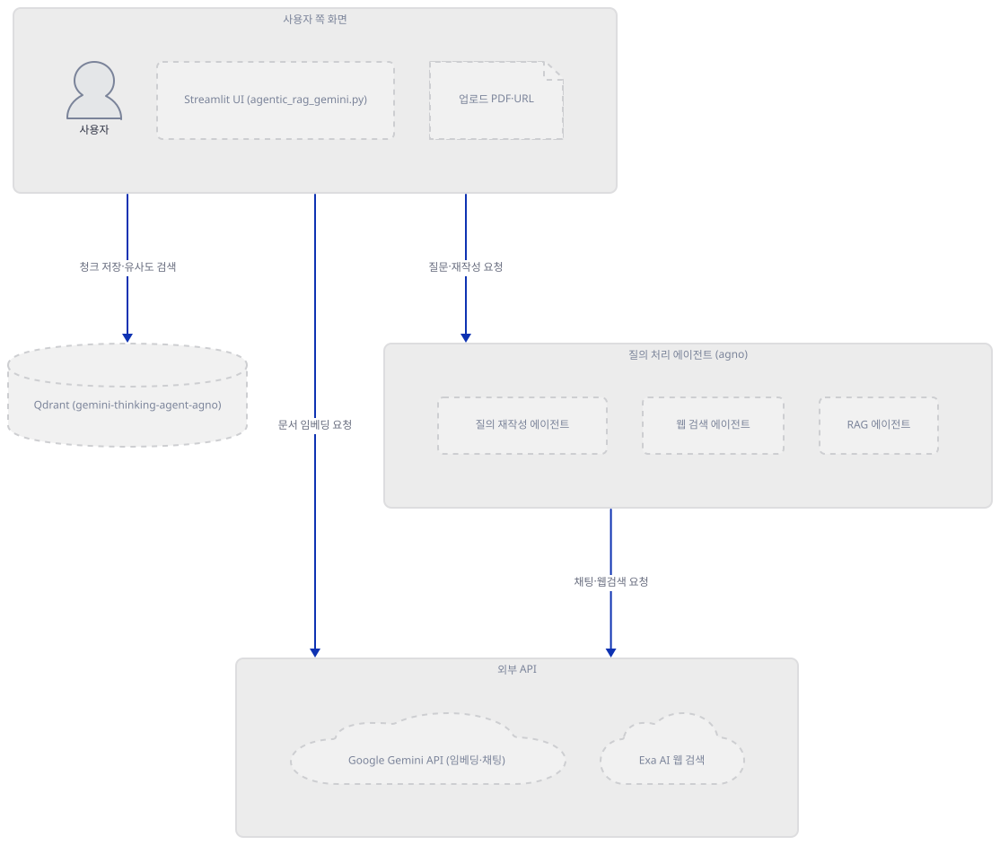
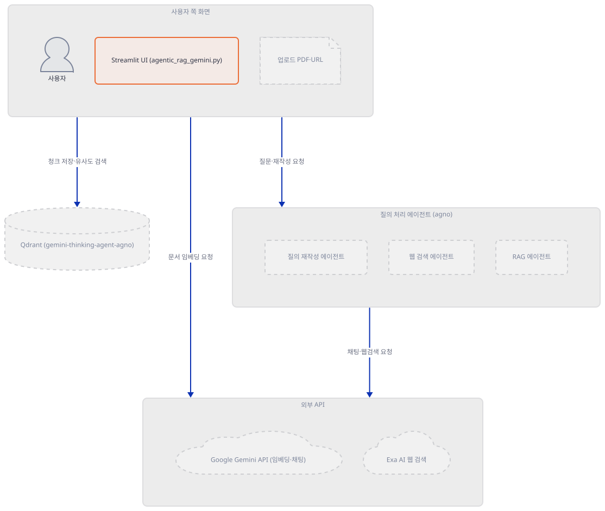
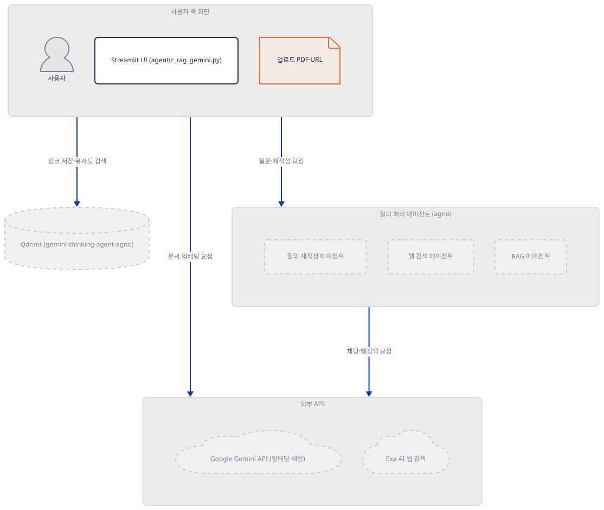
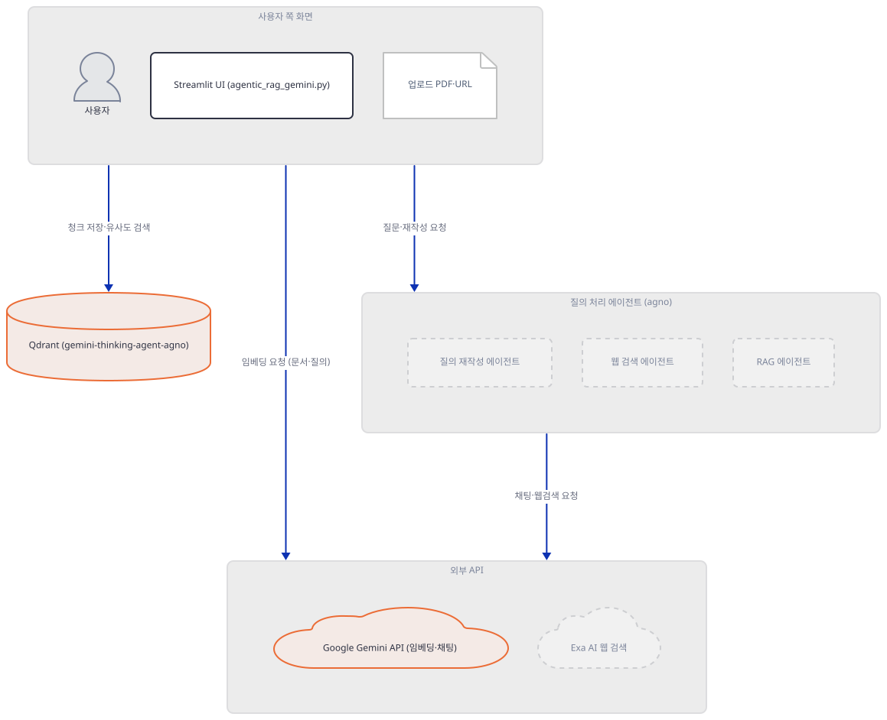
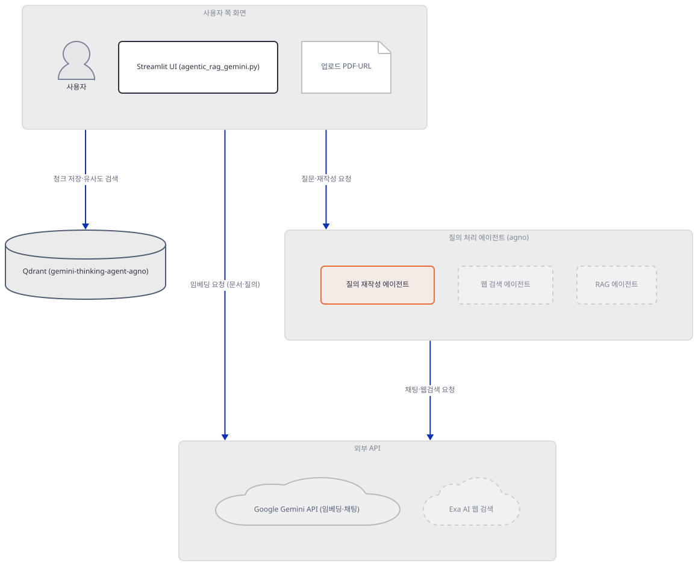
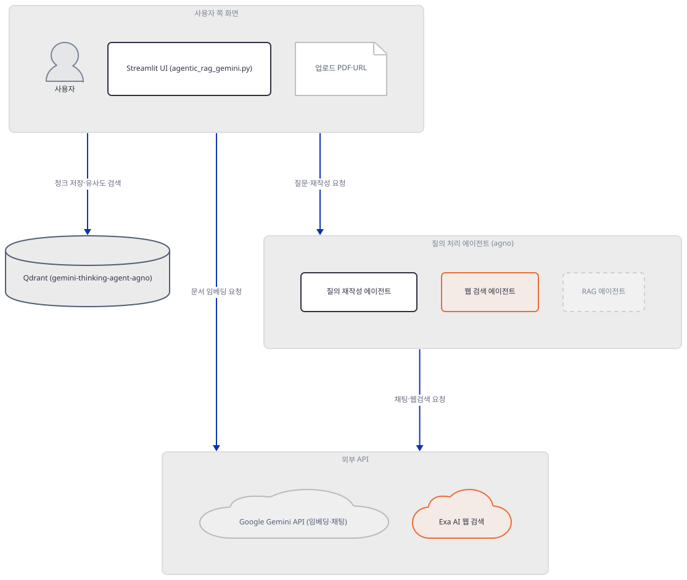
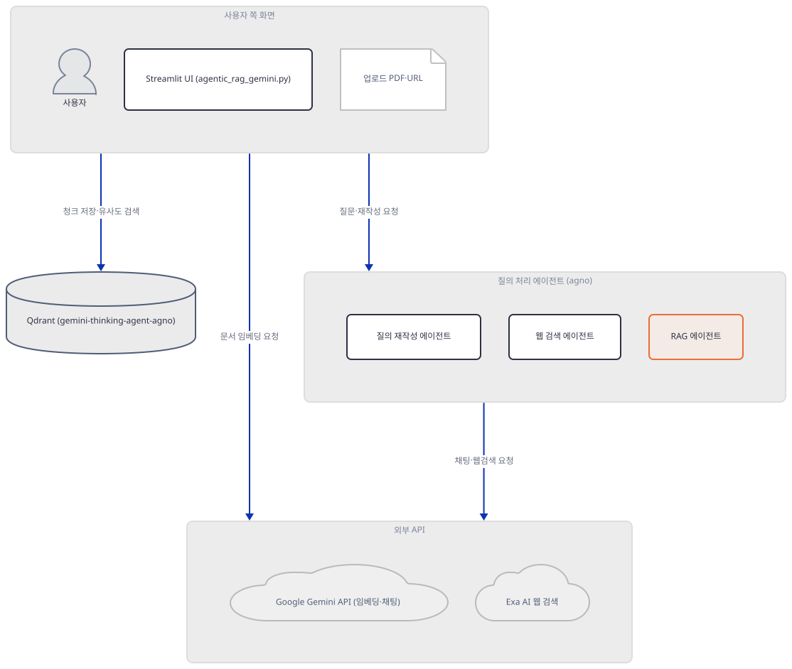
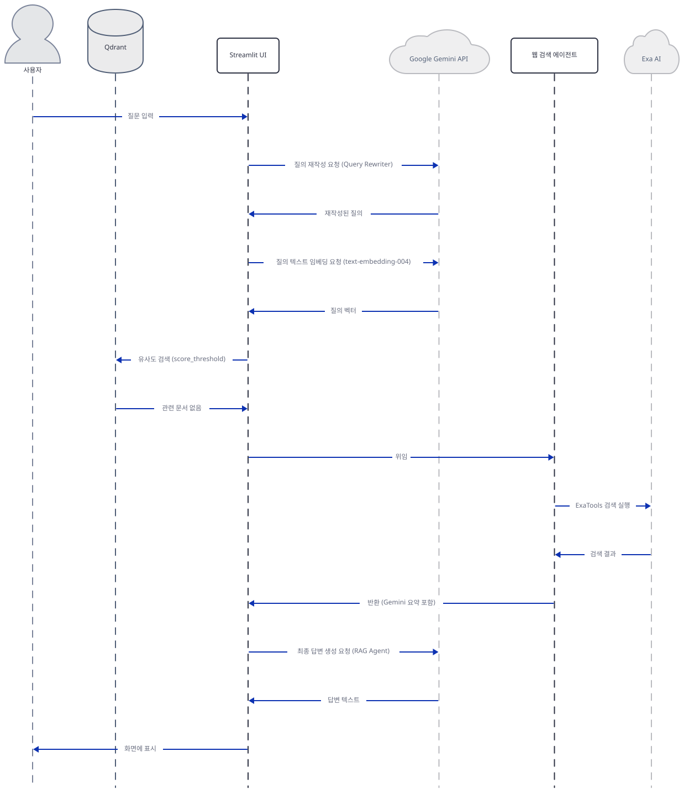

# Day 062 · 🤔 Gemini Agentic RAG

> 볼륨 5 📀 RAG · 난이도 ★★☆ ⚠ · 예상 소요 100분 · API 비용 대략 문서 임베딩(청크 수만큼)과 질의 임베딩(검색 시 1회)은 키만 있으면 실제로 나가지만, 채팅 관련 호출(질의 재작성·웹 검색·최종 생성)은 오늘 설치되는 agno에서 에이전트 생성 자체가 항상 실패해 사실상 발생하지 않습니다(직접 확인, Step 5) — 정확한 단가는 키가 없어 확인 못함 · 원본 앱: `rag_tutorials/gemini_agentic_rag`

## 오늘 만들 것

오늘은 Gemini의 실험용 "thinking" 모델과 agno 에이전트 프레임워크, Qdrant 벡터 저장소를 엮은 Agentic RAG 앱을 다룹니다. 질문이 들어오면 먼저 별도 에이전트가 질문을 검색하기 좋게 다시 쓰고(질의 재작성), Qdrant에서 유사도 임계값(기본 0.7)을 넘는 문서를 찾아 문맥으로 삼으며, 문서가 없거나 사용자가 토글을 켜면 Exa AI로 웹을 검색해 대신 답합니다 — Day 047부터 이 볼륨이 반복해 온 "재작성 → 검색 → (웹 폴백) → 생성" 골격 그대로입니다. 오늘 새로 보는 것은 임베딩까지 Gemini 하나로 몰아준 `GeminiEmbedder`라는 자체 클래스(`google-genai`의 새 클라이언트를 LangChain의 `Embeddings` 인터페이스에 맞게 감쌉니다)입니다. 그런데 이 476줄을 실제로 설치해 그대로 실행해 보면(직접 확인, Step 1·5), 이 세련된 분기 이전에 두 개의 벽이 있습니다. 첫째, `requirements.txt` 7줄 어디에도 `beautifulsoup4`가 없는데 9번째 줄이 파일 맨 위에서 `import bs4`로 그것을 요구해서, 패키지를 더 설치하지 않으면 Streamlit 화면은 제목조차 뜨지 않고 `ModuleNotFoundError`로 통째로 멈춥니다(직접 확인, Step 1). 둘째, 그 벽을 넘어 화면이 뜨고 Google API 키까지 넣어도, 질의 재작성 에이전트·웹 검색 에이전트·최종 답변 에이전트 셋 다 — 셋 다 생성자에 `show_tool_calls=`를 넘기는데 — 오늘 설치되는 agno 3.0.11의 `Agent.__init__()`이 그 인자를 더 이상 받지 않아 `TypeError`로 즉시 실패합니다(직접 확인, Step 5). 이 오류는 각각 `try/except`로 감싸여 있어 앱이 죽지는 않지만, 화면에는 질문마다 오류 배너만 뜨고 실제 답변은 한 번도 만들어지지 않습니다. 문서 임베딩·저장은 이 세 에이전트와 무관한 별도 경로(`GeminiEmbedder`가 `google-genai` 클라이언트를 직접 부름)라서 키만 맞으면 실제로 호출이 나가지만, 그 임베딩조차 질의용 벡터에도 문서용 `task_type`(`RETRIEVAL_DOCUMENT`)을 그대로 쓰는 비대칭을 소스에서 확인했습니다(Step 4). 완성하면 PDF를 올리거나 URL을 넣고 질문하는 화면을 띄우게 되며, 이 문서는 그 화면 뒤에서 정확히 어느 줄이 왜 멈추는지를 직접 재현하며 따라갑니다. 아래는 완성된 아키텍처입니다.



## 사전 준비

| 서비스/도구 | 용도 | 발급·설치 |
|---|---|---|
| Google API 키 | 임베딩(`text-embedding-004`)과 채팅(`gemini-exp-1206`, `gemini-2.0-flash-thinking-exp-01-21`) 호출 인증. 사이드바가 비어 있으면 전체 앱이 사이드바만 남기고 멈춤(Step 2) | https://aistudio.google.com/apikey |
| Qdrant 인스턴스(로컬 또는 클라우드) | 벡터 저장소(`gemini-thinking-agent-agno` 컬렉션). 코드 기본값은 빈 문자열이고 URL·키가 모두 있어야만 클라이언트가 만들어짐(Step 2) | 로컬: `docker run -p 6333:6333 qdrant/qdrant` / 클라우드: https://cloud.qdrant.io |
| beautifulsoup4(별도 설치) | 9번째 줄의 최상단 `import bs4`가 요구 — 없으면 키와 무관하게 앱 전체가 뜨지 않음(Step 1에서 직접 확인) | `uv pip install beautifulsoup4` |
| pypdf(별도 설치) | `PyPDFLoader`가 PDF를 실제로 읽을 때 요구 — `requirements.txt`에 없음(Step 3에서 직접 확인) | `uv pip install pypdf` |
| Exa AI API 키(선택) | 웹 검색 폴백(`ExaTools`) 인증. 사이드바 체크박스를 켜야 입력칸이 나타남 | https://exa.ai |
| uv | 가상환경 생성과 패키지 설치 | [공통 사전 준비](../README.md#공통-사전-준비-한-번만) 절 참고 |

## 아키텍처 한눈에 보기

| 컴포넌트 | 역할 | 코드 위치 |
|---|---|---|
| 사용자 | PDF 업로드, URL 입력, 질문 입력 | 코드 없음 (브라우저) |
| Streamlit UI (세션 상태·사이드바·게이트) | 키·설정 입력, 최상위 `if google_api_key:`로 나머지 전부를 가둠 | `rag_tutorials/gemini_agentic_rag/agentic_rag_gemini.py:49-119`, `rag_tutorials/gemini_agentic_rag/agentic_rag_gemini.py:324-327` |
| `GeminiEmbedder` | `google-genai` 클라이언트로 텍스트를 768차원 벡터로 변환 | `rag_tutorials/gemini_agentic_rag/agentic_rag_gemini.py:21-38` |
| 문서 적재 (`process_pdf`/`process_web`/`create_vector_store`) | PDF·URL → 청크(1000자/겹침 200) → Qdrant 컬렉션 생성·저장 | `rag_tutorials/gemini_agentic_rag/agentic_rag_gemini.py:139-193`, `rag_tutorials/gemini_agentic_rag/agentic_rag_gemini.py:197-229` |
| Qdrant (`gemini-thinking-agent-agno`) | 청크 벡터(768차원)와 원문 저장 | `rag_tutorials/gemini_agentic_rag/agentic_rag_gemini.py:42`, `rag_tutorials/gemini_agentic_rag/agentic_rag_gemini.py:204-208` |
| 질의 재작성 에이전트 (`get_query_rewriter_agent`) | 질문을 검색 친화적으로 재작성 | `rag_tutorials/gemini_agentic_rag/agentic_rag_gemini.py:233-255` |
| 웹 검색 에이전트 (`get_web_search_agent`) | `ExaTools`로 웹 검색 후 요약 | `rag_tutorials/gemini_agentic_rag/agentic_rag_gemini.py:258-275` |
| RAG 에이전트 (`get_rag_agent`) | 문맥(문서 또는 웹) 기반 최종 답변 생성 | `rag_tutorials/gemini_agentic_rag/agentic_rag_gemini.py:278-297` |
| Google Gemini API | 임베딩·채팅 생성 | 코드 없음 (외부 서비스) |
| Exa AI | 웹 검색 | 코드 없음 (외부 서비스) |

## 단계별 진행

### Step 1. 환경 만들기 — bs4 하나가 전체를 막는다

**목적.** 격리된 가상환경에 `requirements.txt` 7줄을 설치하고, 이 파일이 실제로 무엇을 더 요구하는지 확인합니다.

**할 일.**

```bash
cd rag_tutorials/gemini_agentic_rag
uv venv
uv pip install -r requirements.txt
```

(pip 대안: `python -m venv .venv && source .venv/bin/activate && pip install -r requirements.txt`. Windows PowerShell은 활성화만 `.venv\Scripts\Activate.ps1`로 바꿉니다.)

이 저장소는 루트에 `pyproject.toml`이 있어 `uv run`이 방금 만든 환경 대신 루트의 `.venv`를 쓰므로, 이후 모든 `uv run` 명령에는 `--no-project`를 붙입니다. `uv venv`는 인자 없이 실행하면 Python 3.13.3을 그대로 골랐습니다(직접 확인).

`rag_tutorials/gemini_agentic_rag/requirements.txt:1-7`

```text
agno
exa-py
qdrant-client==1.12.1
langchain-qdrant==0.2.0
langchain-community==0.3.13
streamlit==1.41.1
google-genai>=0.1.0
```

7줄 중 2개(`agno`, `exa-py`)는 버전 지정이 아예 없고 `google-genai`도 하한(`>=0.1.0`)만 있습니다. 오늘 실제로 설치하면(직접 확인, `uv pip list` 기준 헤더 제외 110줄) **agno 3.0.11**, **exa-py 2.22.2**, **google-genai 2.25.0**이 풀렸고, 나머지 4개는 고정한 버전 그대로(`qdrant-client 1.12.1`, `langchain-qdrant 0.2.0`, `langchain-community 0.3.13`, `streamlit 1.41.1`) 설치됐습니다. 요청하지 않은 `openai 3.19.2`도 함께 딸려 왔는데, 이것은 agno 때문이 아니라 `exa-py` 자신이 `openai>=1.48`을 필수로 요구하기 때문입니다(직접 확인, `importlib.metadata.requires('exa-py')`) — agno의 의존성 목록에는 `openai`가 `extra == "dev"/"openai"/"demo"/"models"` 뒤에만 있어 이번 설치에는 관여하지 않았습니다. `py_compile`은 통과합니다.

```bash
uv run --no-project python -m py_compile agentic_rag_gemini.py && echo compiled
```

```
compiled
```

그런데 이 파일의 import를 그대로 시도하면 9번째 줄에서 막힙니다 — `from langchain_community.document_loaders import ...`처럼 지연 import가 아니라, 파일 맨 위의 평범한 `import bs4`이기 때문입니다.

```bash
uv run --no-project python -c "import agentic_rag_gemini" 2>&1 | tail -3
```

직접 확인한 출력:

```
    import bs4
ModuleNotFoundError: No module named 'bs4'
```

`requirements.txt` 어디에도 `beautifulsoup4`(`bs4`가 import하는 패키지 이름)가 없고, `langchain-community`의 전이 의존성에도 포함되지 않아 이번 설치 110개 안에 없습니다(직접 확인). 이 실패는 키나 네트워크와 무관하게 **Streamlit이 스크립트를 한 줄도 더 실행하지 못하게** 막습니다 — `streamlit.testing.v1.AppTest`로 확인해도 제목조차 뜨지 않습니다.

```bash
uv run --no-project python -c "
from streamlit.testing.v1 import AppTest
at = AppTest.from_file('agentic_rag_gemini.py')
at.run()
print('exception:', [e.value for e in at.exception])
print('title:', [t.value for t in at.title])
"
```

직접 확인한 출력:

```
exception: ["No module named 'bs4'"]
title: []
```



**확인.** `beautifulsoup4`를 별도로 설치하면(`pypdf`는 아직 없어도) 이 파일의 모든 import가 성공합니다 — `PyPDFLoader`는 실제로 PDF를 열 때만 `pypdf`를 지연 import하기 때문입니다(Step 3).

```bash
uv pip install beautifulsoup4
uv run --no-project python -c "
import os, tempfile
from datetime import datetime
from typing import List
import streamlit as st
from google import genai
from google.genai import types
import bs4
from agno.agent import Agent
from agno.models.google import Gemini
from langchain_community.document_loaders import PyPDFLoader, WebBaseLoader
from langchain.text_splitter import RecursiveCharacterTextSplitter
from langchain_qdrant import QdrantVectorStore
from qdrant_client import QdrantClient
from qdrant_client.models import Distance, VectorParams
from langchain_core.embeddings import Embeddings
from agno.tools.exa import ExaTools
print('ALL IMPORTS OK')
"
```

```
ALL IMPORTS OK
```

### Step 2. 세션 상태와 최상위 게이트 — 키가 없으면 사이드바만 남는다

**목적.** 사이드바가 무엇을 초기화하는지, 그리고 `if st.session_state.google_api_key:`라는 단 한 줄짜리 최상위 조건이 그 아래 330줄 전부(문서 업로드·채팅·에이전트 호출)를 어떻게 가두는지 확인합니다.

**할 일.**

`rag_tutorials/gemini_agentic_rag/agentic_rag_gemini.py:49-68`

```python
if 'google_api_key' not in st.session_state:
    st.session_state.google_api_key = ""
if 'qdrant_api_key' not in st.session_state:
    st.session_state.qdrant_api_key = ""
if 'qdrant_url' not in st.session_state:
    st.session_state.qdrant_url = ""
if 'vector_store' not in st.session_state:
    st.session_state.vector_store = None
if 'processed_documents' not in st.session_state:
    st.session_state.processed_documents = []
if 'history' not in st.session_state:
    st.session_state.history = []
if 'exa_api_key' not in st.session_state:
    st.session_state.exa_api_key = ""
if 'use_web_search' not in st.session_state:
    st.session_state.use_web_search = False
if 'force_web_search' not in st.session_state:
    st.session_state.force_web_search = False
if 'similarity_threshold' not in st.session_state:
    st.session_state.similarity_threshold = 0.7
```

`qdrant_api_key`와 `qdrant_url` 모두 빈 문자열로 시작합니다 — Day 061의 `corrective_rag.py`가 `qdrant_url`을 `"http://localhost:6333"`으로 미리 채워 두던 것과 다릅니다. 즉 이 앱은 사용자가 Qdrant 값을 직접 입력하기 전까지는 로컬 기본값조차 없습니다.

`rag_tutorials/gemini_agentic_rag/agentic_rag_gemini.py:71-87`

```python
# Sidebar Configuration
st.sidebar.header("🔑 API Configuration")
google_api_key = st.sidebar.text_input("Google API Key", type="password", value=st.session_state.google_api_key)
qdrant_api_key = st.sidebar.text_input("Qdrant API Key", type="password", value=st.session_state.qdrant_api_key)
qdrant_url = st.sidebar.text_input("Qdrant URL", 
                                 placeholder="https://your-cluster.cloud.qdrant.io:6333",
                                 value=st.session_state.qdrant_url)

# Clear Chat Button
if st.sidebar.button("🗑️ Clear Chat History"):
    st.session_state.history = []
    st.rerun()

# Update session state
st.session_state.google_api_key = google_api_key
st.session_state.qdrant_api_key = qdrant_api_key
st.session_state.qdrant_url = qdrant_url
```

Qdrant 값을 실제로 검증하는 곳은 별도 함수입니다.

`rag_tutorials/gemini_agentic_rag/agentic_rag_gemini.py:123-135`

```python
def init_qdrant():
    """Initialize Qdrant client with configured settings."""
    if not all([st.session_state.qdrant_api_key, st.session_state.qdrant_url]):
        return None
    try:
        return QdrantClient(
            url=st.session_state.qdrant_url,
            api_key=st.session_state.qdrant_api_key,
            timeout=60
        )
    except Exception as e:
        st.error(f"🔴 Qdrant connection failed: {str(e)}")
        return None
```

두 값 중 하나라도 비어 있으면 **오류 메시지 없이** `None`을 반환합니다 — `st.error`는 `QdrantClient(...)` 생성 자체가 예외를 던질 때만 나옵니다. 이 함수를 부르는 지점이 바로 오늘의 게이트입니다.

`rag_tutorials/gemini_agentic_rag/agentic_rag_gemini.py:324-327`

```python
if st.session_state.google_api_key:
    os.environ["GOOGLE_API_KEY"] = st.session_state.google_api_key
    
    qdrant_client = init_qdrant()
```

Google API 키 하나가 전체 스크립트의 나머지 부분(파일 끝 476번째 줄까지)을 가두는 유일한 조건입니다. 반대편은 짧습니다.

`rag_tutorials/gemini_agentic_rag/agentic_rag_gemini.py:475-476`

```python
else:
    st.warning("⚠️ Please enter your Google API Key to continue")
```

`st.title(...)`(46번째 줄)은 이 조건보다 앞에 있어 키가 없어도 항상 뜹니다 — Day 057·061의 `st.stop()` 패턴(제목보다 뒤에서 멈춰 제목까지 사라짐)과 다른 지점입니다.



**확인.** 키가 없을 때 정확히 무엇이 뜨는지 `AppTest`로 확인합니다.

```bash
uv run --no-project python -c "
from streamlit.testing.v1 import AppTest
at = AppTest.from_file('agentic_rag_gemini.py')
at.run(timeout=60)
print('title:', [t.value for t in at.title])
print('sidebar headers:', [h.value for h in at.sidebar.header])
print('sidebar text_input labels:', [ti.label for ti in at.sidebar.text_input])
print('warning messages:', [w.value for w in at.warning])
print('main chat_input count:', len(at.chat_input))
"
```

직접 확인한 출력:

```
title: ['🤔 Agentic RAG with Gemini Thinking and Agno']
sidebar headers: ['🔑 API Configuration', '🌐 Web Search Configuration', '🎯 Search Configuration']
sidebar text_input labels: ['Google API Key', 'Qdrant API Key', 'Qdrant URL']
warning messages: ['⚠️ Please enter your Google API Key to continue']
main chat_input count: 0
```

제목과 사이드바 설정 3종은 보이지만 "📁 Data Upload"도, 채팅 입력창도 없습니다. 가짜 키를 넣으면(루프백 외 소켓은 차단한 채로) 게이트가 열립니다.

```bash
uv run --no-project python -c "
import socket
_orig = socket.socket.connect
def _guarded(self, address, *a, **k):
    host = address[0] if isinstance(address, tuple) else address
    if host in ('127.0.0.1', '::1', 'localhost'):
        return _orig(self, address, *a, **k)
    raise RuntimeError(f'network blocked: {address!r}')
socket.socket.connect = _guarded

from streamlit.testing.v1 import AppTest
at = AppTest.from_file('agentic_rag_gemini.py')
at.run(timeout=60)
for ti in at.sidebar.text_input:
    if ti.label == 'Google API Key':
        ti.set_value('fake-google-key')
at.run(timeout=60)
print('exception:', [e.value for e in at.exception])
print('sidebar headers:', [h.value for h in at.sidebar.header])
print('main chat_input count:', len(at.chat_input))
"
```

직접 확인한 출력(가짜 키만으로 예외 없이 통과 — 루프백 외 연결 시도는 0건):

```
exception: []
sidebar headers: ['🔑 API Configuration', '🌐 Web Search Configuration', '🎯 Search Configuration', '📁 Data Upload']
main chat_input count: 1
```

`init_qdrant()`의 두 분기도 네트워크 없이 확인할 수 있습니다 — 두 값이 모두 비면 `None`, 가짜 값이라도 채워지면(형식만 맞으면) 생성 자체는 성공합니다.

```bash
uv run --no-project python -c "
from qdrant_client import QdrantClient
def init_qdrant(api_key, url):
    if not all([api_key, url]):
        return None
    return QdrantClient(url=url, api_key=api_key, timeout=60)
print('both empty ->', init_qdrant('', ''))
print('both fake  ->', type(init_qdrant('fake-key', 'https://fake.example.cloud.qdrant.io:6333')).__name__)
"
```

```
both empty -> None
both fake  -> QdrantClient
```

### Step 3. 문서 적재 — PDF와 URL, 그리고 requirements.txt에 없는 두 번째 패키지

**목적.** `process_pdf`와 `process_web`이 업로드된 문서를 어떻게 청크로 쪼개는지, 그리고 `pypdf`가 없을 때 정확히 어디서 멈추는지 확인합니다.

**할 일.**

`rag_tutorials/gemini_agentic_rag/agentic_rag_gemini.py:139-162`

```python
def process_pdf(file) -> List:
    """Process PDF file and add source metadata."""
    try:
        with tempfile.NamedTemporaryFile(delete=False, suffix='.pdf') as tmp_file:
            tmp_file.write(file.getvalue())
            loader = PyPDFLoader(tmp_file.name)
            documents = loader.load()
            
            # Add source metadata
            for doc in documents:
                doc.metadata.update({
                    "source_type": "pdf",
                    "file_name": file.name,
                    "timestamp": datetime.now().isoformat()
                })
                
            text_splitter = RecursiveCharacterTextSplitter(
                chunk_size=1000,
                chunk_overlap=200
            )
            return text_splitter.split_documents(documents)
    except Exception as e:
        st.error(f"📄 PDF processing error: {str(e)}")
        return []
```

`source_type`·`file_name`을 메타데이터에 남겨 두는 것은 나중에 답변 화면에서 "어느 파일에서 나온 문단인지" 표시하기 위해서입니다(Step 7). `PyPDFLoader`는 생성 시점이 아니라 `.load()`를 부르는 순간에야 `pypdf`를 지연 import합니다.

```bash
uv run --no-project python -c "import pypdf"
```

직접 확인한 출력:

```
ModuleNotFoundError: No module named 'pypdf'
```

URL 경로는 구조가 같지만 추가로 `bs4.SoupStrainer`를 씁니다.

`rag_tutorials/gemini_agentic_rag/agentic_rag_gemini.py:165-193`

```python
def process_web(url: str) -> List:
    """Process web URL and add source metadata."""
    try:
        loader = WebBaseLoader(
            web_paths=(url,),
            bs_kwargs=dict(
                parse_only=bs4.SoupStrainer(
                    class_=("post-content", "post-title", "post-header", "content", "main")
                )
            )
        )
        documents = loader.load()
        
        # Add source metadata
        for doc in documents:
            doc.metadata.update({
                "source_type": "url",
                "url": url,
                "timestamp": datetime.now().isoformat()
            })
            
        text_splitter = RecursiveCharacterTextSplitter(
            chunk_size=1000,
            chunk_overlap=200
        )
        return text_splitter.split_documents(documents)
    except Exception as e:
        st.error(f"🌐 Web processing error: {str(e)}")
        return []
```

`class_=("post-content", "post-title", ...)` 필터는 Substack·Medium류 블로그 템플릿에 맞춘 값이라, 이 클래스 이름을 쓰지 않는 사이트는 본문을 하나도 못 건지고 빈 문서 리스트만 돌아올 수 있습니다(소스로 확인 — 이 목록은 하드코딩되어 있고 URL마다 바뀌지 않습니다). 두 함수 모두 예외를 삼켜 `st.error`만 띄우고 빈 리스트를 반환하므로, 화면만 보고는 "PDF가 비어서" 실패했는지 "pypdf가 없어서" 실패했는지 구분하려면 오류 배너의 문구를 직접 읽어야 합니다.



**확인.** `process_pdf`와 같은 임시 파일 패턴으로, 가짜 바이트를 `.pdf`로 저장해 `PyPDFLoader`에 넘겨 정확한 예외 문구를 봅니다.

```bash
uv run --no-project python -c "
import tempfile, os
from langchain_community.document_loaders import PyPDFLoader
with tempfile.NamedTemporaryFile(delete=False, suffix='.pdf') as tmp_file:
    tmp_file.write(b'not a real pdf')
    tmp_path = tmp_file.name
try:
    PyPDFLoader(tmp_path).load()
except Exception as e:
    print('EXCEPTION TYPE:', type(e).__name__)
    print('EXCEPTION TEXT:', str(e))
finally:
    os.unlink(tmp_path)
"
```

직접 확인한 출력:

```
EXCEPTION TYPE: ImportError
EXCEPTION TEXT: pypdf package not found, please install it with `pip install pypdf`
```

### Step 4. `GeminiEmbedder`와 벡터 저장소 — 질의에도 문서용 task_type을 쓴다

**목적.** `GeminiEmbedder`가 `google-genai` 클라이언트를 어떻게 감싸는지, `create_vector_store`가 Qdrant 컬렉션을 어떻게 만드는지, 그리고 두 곳 모두 실제로 네트워크를 시도하는 정확한 지점을 확인합니다.

**할 일.**

`rag_tutorials/gemini_agentic_rag/agentic_rag_gemini.py:21-38`

```python
class GeminiEmbedder(Embeddings):
    def __init__(self, model_name="models/text-embedding-004"):
        # Initialize the new genai client here
        if not st.session_state.google_api_key:
            raise ValueError("Google API Key not set in session state.")
        self.client = genai.Client(api_key=st.session_state.google_api_key)
        self.model = model_name

    def embed_documents(self, texts: List[str]) -> List[List[float]]:
        return [self.embed_query(text) for text in texts]

    def embed_query(self, text: str) -> List[float]:
        response = self.client.models.embed_content(
            model=self.model,
            contents=text,
            config=types.EmbedContentConfig(task_type="RETRIEVAL_DOCUMENT")
        )
        return response.embeddings[0].values
```

`embed_documents`는 텍스트마다 `embed_query`를 그대로 호출합니다 — 즉 문서 청크든 사용자 질문이든 **똑같은 메서드, 똑같은 `task_type="RETRIEVAL_DOCUMENT"`**를 씁니다(소스로 확인). Google의 임베딩 API가 문서용(`RETRIEVAL_DOCUMENT`)과 질의용(`RETRIEVAL_QUERY`) task_type을 구분해 두는 것은 검색 쪽 벡터를 비대칭적으로 최적화하기 위해서인데, 이 클래스는 질의를 임베딩할 때도 문서용 상수를 그대로 넘겨 그 경로를 쓰지 않습니다 — 실제 검색 품질에 어떤 영향을 주는지는 API를 호출해야 알 수 있어 이 문서에서 확인하지는 못했지만, 코드가 그렇게 되어 있다는 것은 소스만으로 확인됩니다. `google.genai.Client(...)` 생성 자체는 네트워크를 타지 않고, 실제 요청은 `embed_content(...)`를 부르는 순간에야 나갑니다 — 소켓을 막아 직접 확인했습니다.

```bash
uv run --no-project python -c "
import socket
def _blocked(self, *a, **k): raise RuntimeError('network blocked: ' + repr(a))
socket.socket.connect = _blocked
from google import genai
from google.genai import types
import time
t0 = time.monotonic()
client = genai.Client(api_key='fake-google-key')
print(f'Client constructed in {time.monotonic()-t0:.3f}s, no network yet')
try:
    client.models.embed_content(model='models/text-embedding-004', contents='hello', config=types.EmbedContentConfig(task_type='RETRIEVAL_DOCUMENT'))
    print('UNEXPECTED SUCCESS')
except RuntimeError as e:
    print('embed_content attempted network (blocked):', str(e)[:80])
"
```

직접 확인한 출력:

```
Client constructed in 0.593s, no network yet
embed_content attempted network (blocked): network blocked: (('172.217.118.4', 443),)
```

`create_vector_store`는 컬렉션을 만들고 이 임베더로 청크를 저장합니다.

`rag_tutorials/gemini_agentic_rag/agentic_rag_gemini.py:197-229`

```python
def create_vector_store(client, texts):
    """Create and initialize vector store with documents."""
    try:
        # Create collection if needed
        try:
            client.create_collection(
                collection_name=COLLECTION_NAME,
                vectors_config=VectorParams(
                    size=768,  # Gemini embedding-004 dimension
                    distance=Distance.COSINE
                )
            )
            st.success(f"📚 Created new collection: {COLLECTION_NAME}")
        except Exception as e:
            if "already exists" not in str(e).lower():
                raise e
        
        # Initialize vector store
        vector_store = QdrantVectorStore(
            client=client,
            collection_name=COLLECTION_NAME,
            embedding=GeminiEmbedder()
        )
        
        # Add documents
        with st.spinner('📤 Uploading documents to Qdrant...'):
            vector_store.add_documents(texts)
            st.success("✅ Documents stored successfully!")
            return vector_store
            
    except Exception as e:
        st.error(f"🔴 Vector store error: {str(e)}")
        return None
```

`size=768`은 주석 그대로 `text-embedding-004`의 실제 차원에 맞춘 값입니다. 이 함수는 게이트를 지난 뒤 실제로 문서를 올릴 때만 호출되므로, 여기까지 오면 `GeminiEmbedder()` 생성에 필요한 `st.session_state.google_api_key`는 이미 채워져 있어 그 안의 `ValueError` 가드는 실질적으로 발동하지 않는 방어 코드입니다.



**확인.** `create_vector_store`가 호출되는 조건 — 텍스트가 있고 **또한** Qdrant 클라이언트가 있어야 함 — 을 그대로 옮겨 확인합니다. 이 조건이 오늘의 또 다른 조용한 실패로 이어집니다(Step 5에서 계속).

```bash
uv run --no-project python -c "
def upload_branch(texts, qdrant_client):
    added = False
    if texts and qdrant_client:
        added = True
    return added
print('texts=O, qdrant_client=None ->', upload_branch(['chunk'], None))
print('texts=O, qdrant_client=O    ->', upload_branch(['chunk'], object()))
"
```

```
texts=O, qdrant_client=None -> False
texts=O, qdrant_client=O    -> True
```

`rag_tutorials/gemini_agentic_rag/agentic_rag_gemini.py:330-346`이 바로 이 조건을 실제로 씁니다.

```python
    st.sidebar.header("📁 Data Upload")
    uploaded_file = st.sidebar.file_uploader("Upload PDF", type=["pdf"])
    web_url = st.sidebar.text_input("Or enter URL")
    
    # Process documents
    if uploaded_file:
        file_name = uploaded_file.name
        if file_name not in st.session_state.processed_documents:
            with st.spinner('Processing PDF...'):
                texts = process_pdf(uploaded_file)
                if texts and qdrant_client:
                    if st.session_state.vector_store:
                        st.session_state.vector_store.add_documents(texts)
                    else:
                        st.session_state.vector_store = create_vector_store(qdrant_client, texts)
                    st.session_state.processed_documents.append(file_name)
                    st.success(f"✅ Added PDF: {file_name}")
```

`st.session_state.processed_documents.append(...)`와 `st.success(...)` 둘 다 `if texts and qdrant_client:` 안에 들여쓰기되어 있습니다. Qdrant 자격증명을 아직 넣지 않은 채(Step 2에서 본 대로 `qdrant_client`는 조용히 `None`) PDF를 올리면, `process_pdf`는 정상적으로 청크를 만들어내지만 **성공 메시지도, 실패 메시지도, 사이드바의 "처리된 소스" 목록에도 아무 흔적이 남지 않습니다** — 업로드가 그냥 허공으로 사라집니다. URL 입력 경로(`rag_tutorials/gemini_agentic_rag/agentic_rag_gemini.py:348-358`)도 같은 구조를 그대로 반복합니다.

### Step 5. 질의 재작성 에이전트 — `show_tool_calls`가 세 에이전트를 모두 막는다

**목적.** `get_query_rewriter_agent`가 무엇을 만드는지, 그리고 오늘 설치되는 agno에서 이 생성 자체가 왜 실패하는지 정확한 예외로 확인합니다.

**할 일.**

`rag_tutorials/gemini_agentic_rag/agentic_rag_gemini.py:233-255`

```python
def get_query_rewriter_agent() -> Agent:
    """Initialize a query rewriting agent."""
    return Agent(
        name="Query Rewriter",
        model=Gemini(id="gemini-exp-1206"),
        instructions="""You are an expert at reformulating questions to be more precise and detailed. 
        Your task is to:
        1. Analyze the user's question
        2. Rewrite it to be more specific and search-friendly
        3. Expand any acronyms or technical terms
        4. Return ONLY the rewritten query without any additional text or explanations
        
        Example 1:
        User: "What does it say about ML?"
        Output: "What are the key concepts, techniques, and applications of Machine Learning (ML) discussed in the context?"
        
        Example 2:
        User: "Tell me about transformers"
        Output: "Explain the architecture, mechanisms, and applications of Transformer neural networks in natural language processing and deep learning"
        """,
        show_tool_calls=False,
        markdown=True,
    )
```

`model=Gemini(id="gemini-exp-1206")`은 `api_key=`를 넘기지 않습니다 — agno의 `Gemini` 클래스는 생성자에서 `self.api_key = self.api_key or getenv("GOOGLE_API_KEY")`로 환경변수를 대신 읽으므로(소스로 확인, agno 3.0.11 `agno/models/google/gemini.py`), Step 2의 `os.environ["GOOGLE_API_KEY"] = ...`가 정확히 이 자리에서 쓰입니다. `gemini-exp-1206`이라는 이름 자체가 2024년 12월의 실험용 프리뷰 스냅샷임을 그대로 드러냅니다 — 이 이름이 오늘도 Gemini API에 살아 있는지는 실제로 호출해야 알 수 있어 이 문서는 확인하지 못했습니다(사전 준비의 Google AI Studio에서 현재 이름을 다시 확인하세요). 그런데 이 앱은 그 이름이 유효한지 확인해 볼 기회조차 오늘은 얻지 못합니다 — `Agent(...)` 생성 자체가 먼저 막히기 때문입니다.

```bash
uv run --no-project python -c "
import os
os.environ['GOOGLE_API_KEY'] = 'fake-google-key'
from agno.agent import Agent
from agno.models.google import Gemini
try:
    Agent(name='Query Rewriter', model=Gemini(id='gemini-exp-1206'), instructions='x', show_tool_calls=False, markdown=True)
    print('constructed OK (unexpected)')
except TypeError as e:
    print('TypeError:', e)
"
```

직접 확인한 출력:

```
TypeError: Agent.__init__() got an unexpected keyword argument 'show_tool_calls'
```

`inspect.signature(Agent.__init__)`로 108개 매개변수를 모두 나열해 봐도(직접 확인, agno 3.0.11) `show_tool_calls`는 없습니다 — 대신 `debug_mode`·`debug_level`·`stream_events` 같은 다른 이름들이 있지만, 이 앱이 의도했던 "도구 호출을 화면에 보여줄지"와 이름이 같은 대체 인자는 없습니다. `show_tool_calls=`를 빼고 나머지 인자(`name`·`model`·`instructions`·`markdown`)만 넘기면 생성은 정상적으로 끝납니다 — 즉 막는 인자는 이것 하나뿐입니다.

```bash
uv run --no-project python -c "
import os
os.environ['GOOGLE_API_KEY'] = 'fake-google-key'
from agno.agent import Agent
from agno.models.google import Gemini
a = Agent(name='Query Rewriter', model=Gemini(id='gemini-exp-1206'), instructions='rewrite it', markdown=True)
print('OK without show_tool_calls')
"
```

```
OK without show_tool_calls
```

이 실패가 화면에 어떻게 나타나는지는 호출부에서 결정됩니다.

`rag_tutorials/gemini_agentic_rag/agentic_rag_gemini.py:385-396`

```python
        # Step 1: Rewrite the query for better retrieval
        with st.spinner("🤔 Reformulating query..."):
            try:
                query_rewriter = get_query_rewriter_agent()
                rewritten_query = query_rewriter.run(prompt).content
                
                with st.expander("🔄 See rewritten query"):
                    st.write(f"Original: {prompt}")
                    st.write(f"Rewritten: {rewritten_query}")
            except Exception as e:
                st.error(f"❌ Error rewriting query: {str(e)}")
                rewritten_query = prompt
```

`get_query_rewriter_agent()`가 던진 `TypeError`는 `except Exception`에 그대로 잡혀 `st.error("❌ Error rewriting query: Agent.__init__() got an unexpected keyword argument 'show_tool_calls'")`로 표시되고, `rewritten_query`는 원래 질문 그대로 남습니다. 앱이 죽지는 않지만, 재작성은 사실상 항상 실패합니다.



**확인.** 위 두 명령이 이미 이 Step의 확인입니다 — `TypeError`의 정확한 문구와, `show_tool_calls`를 빼면 나머지 구성은 문제없다는 것을 직접 실행으로 확인했습니다.

### Step 6. 검색 전략과 웹 검색 폴백 — 문턱값과 두 번째 벽

**목적.** 문서 검색이 유사도 임계값을 어떻게 쓰는지, 언제 웹 검색으로 넘어가는지, 그리고 `get_web_search_agent`가 Step 5와 같은 이유로 어떻게 막히는지 확인합니다.

**할 일.**

`rag_tutorials/gemini_agentic_rag/agentic_rag_gemini.py:398-415`

```python
        # Step 2: Choose search strategy based on force_web_search toggle
        context = ""
        docs = []
        if not st.session_state.force_web_search and st.session_state.vector_store:
            # Try document search first
            retriever = st.session_state.vector_store.as_retriever(
                search_type="similarity_score_threshold",
                search_kwargs={
                    "k": 5, 
                    "score_threshold": st.session_state.similarity_threshold
                }
            )
            docs = retriever.invoke(rewritten_query)
            if docs:
                context = "\n\n".join([d.page_content for d in docs])
                st.info(f"📊 Found {len(docs)} relevant documents (similarity > {st.session_state.similarity_threshold})")
            elif st.session_state.use_web_search:
                st.info("🔄 No relevant documents found in database, falling back to web search...")
```

`search_type="similarity_score_threshold"`와 `QdrantVectorStore`(langchain-qdrant 0.2.0) 조합은 Day 057에서 이미 확인한 것과 같습니다 — `score_threshold`는 Qdrant가 돌려주는 원시 코사인 유사도가 아니라 `(cos+1)/2`로 정규화한 값과 비교됩니다(Day 057 Step 4). 즉 기본값 0.7은 코사인 유사도 0.4에 해당합니다. 이 검색 로직과 거의 같은 일을 하는 함수가 이미 따로 정의되어 있지만 실제로는 쓰이지 않습니다.

`rag_tutorials/gemini_agentic_rag/agentic_rag_gemini.py:300-320`

```python
def check_document_relevance(query: str, vector_store, threshold: float = 0.7) -> tuple[bool, List]:
    """
    Check if documents in vector store are relevant to the query.
    
    Args:
        query: The search query
        vector_store: The vector store to search in
        threshold: Similarity threshold
        
    Returns:
        tuple[bool, List]: (has_relevant_docs, relevant_docs)
    """
    if not vector_store:
        return False, []
        
    retriever = vector_store.as_retriever(
        search_type="similarity_score_threshold",
        search_kwargs={"k": 5, "score_threshold": threshold}
    )
    docs = retriever.invoke(query)
    return bool(docs), docs
```

이 함수 이름을 파일 전체에서 검색하면 정의 줄 하나만 나옵니다 — 메인 흐름은 이 함수를 부르는 대신 398-410행에서 거의 같은 코드를 그대로 다시 씁니다.

```bash
grep -n "check_document_relevance" agentic_rag_gemini.py
```

```
300:def check_document_relevance(query: str, vector_store, threshold: float = 0.7) -> tuple[bool, List]:
```

문서 검색이 실패하거나 건너뛰어지면 웹 검색 여부는 세 조건의 곱으로 정해집니다.

`rag_tutorials/gemini_agentic_rag/agentic_rag_gemini.py:417-432`

```python
        # Step 3: Use web search if:
        # 1. Web search is forced ON via toggle, or
        # 2. No relevant documents found AND web search is enabled in settings
        if (st.session_state.force_web_search or not context) and st.session_state.use_web_search and st.session_state.exa_api_key:
            with st.spinner("🔍 Searching the web..."):
                try:
                    web_search_agent = get_web_search_agent()
                    web_results = web_search_agent.run(rewritten_query).content
                    if web_results:
                        context = f"Web Search Results:\n{web_results}"
                        if st.session_state.force_web_search:
                            st.info("ℹ️ Using web search as requested via toggle.")
                        else:
                            st.info("ℹ️ Using web search as fallback since no relevant documents were found.")
                except Exception as e:
                    st.error(f"❌ Web search error: {str(e)}")
```

`use_web_search`는 사이드바 체크박스 기본값이 꺼짐(`False`)이라, 토글을 강제로 켜더라도(`force_web_search`) 체크박스 자체를 켜지 않으면 이 블록은 절대 실행되지 않습니다.

```bash
uv run --no-project python -c "
def will_web_search(force_web_search, context, use_web_search, exa_api_key):
    return bool((force_web_search or not context) and use_web_search and exa_api_key)
print('force=True,  체크박스 꺼짐        ->', will_web_search(True, 'ctx', False, 'key'))
print('force=True,  체크박스 켜짐, 키 없음 ->', will_web_search(True, 'ctx', True, ''))
print('force=False, 문서 없음, 체크박스 켜짐, 키 있음 ->', will_web_search(False, '', True, 'key'))
"
```

```
force=True,  체크박스 꺼짐        -> False
force=True,  체크박스 켜짐, 키 없음 -> False
force=False, 문서 없음, 체크박스 켜짐, 키 있음 -> True
```

세 조건을 모두 만족해 실제로 실행되더라도 `get_web_search_agent()`는 Step 5와 똑같은 `show_tool_calls` 인자를 씁니다.

`rag_tutorials/gemini_agentic_rag/agentic_rag_gemini.py:258-275`

```python
def get_web_search_agent() -> Agent:
    """Initialize a web search agent."""
    return Agent(
        name="Web Search Agent",
        model=Gemini(id="gemini-exp-1206"),
        tools=[ExaTools(
            api_key=st.session_state.exa_api_key,
            include_domains=search_domains,
            num_results=5
        )],
        instructions="""You are a web search expert. Your task is to:
        1. Search the web for relevant information about the query
        2. Compile and summarize the most relevant information
        3. Include sources in your response
        """,
        show_tool_calls=True,
        markdown=True,
    )
```

`ExaTools(api_key=..., include_domains=..., num_results=5)` 자체는 오늘의 agno·exa-py에서도 그대로 유효합니다(직접 확인, `inspect.signature(ExaTools.__init__)`에 세 인자 모두 있고 `enable_search` 기본값도 `True`) — 문제는 오직 `Agent(..., show_tool_calls=True, ...)` 쪽입니다. `search_domains`는 90-109행의 "🌐 Web Search Configuration" 체크박스 블록 **안에서만** 정의되는 지역변수라서, 체크박스가 꺼진 채로 만에 하나 이 함수가 호출되면 `NameError`가 날 수 있는 구조지만, 실제로는 `use_web_search`가 True일 때만 이 함수가 불리므로(위 세 조건 확인) 같은 스크립트 실행 안에서 `search_domains`는 이미 정의된 뒤입니다.



**확인.** `show_tool_calls`를 뺀 나머지 구성이 (가짜 키로도) 문제없이 만들어지는지 확인합니다.

```bash
uv run --no-project python -c "
import os
os.environ['GOOGLE_API_KEY'] = 'fake-google-key'
from agno.agent import Agent
from agno.models.google import Gemini
from agno.tools.exa import ExaTools
ws = Agent(name='Web Search Agent', model=Gemini(id='gemini-exp-1206'), tools=[ExaTools(api_key='fake-exa-key', include_domains=['arxiv.org'], num_results=5)], instructions='search', markdown=True)
print('web search agent OK without show_tool_calls')
"
```

```
web search agent OK without show_tool_calls
```

### Step 7. 답변 생성과 화면 배선 — 매 질문마다 오류 배너만 남는다

**목적.** `get_rag_agent`가 최종 답변을 어떻게 요청하는지, 그리고 오늘 이 앱에 실제로 질문을 던지면 화면에 정확히 무엇이 보이는지 종합합니다.

**할 일.**

`rag_tutorials/gemini_agentic_rag/agentic_rag_gemini.py:278-297`

```python
def get_rag_agent() -> Agent:
    """Initialize the main RAG agent."""
    return Agent(
        name="Gemini RAG Agent",
        model=Gemini(id="gemini-2.0-flash-thinking-exp-01-21"),
        instructions="""You are an Intelligent Agent specializing in providing accurate answers.
        
        When given context from documents:
        - Focus on information from the provided documents
        - Be precise and cite specific details
        
        When given web search results:
        - Clearly indicate that the information comes from web search
        - Synthesize the information clearly
        
        Always maintain high accuracy and clarity in your responses.
        """,
        show_tool_calls=True,
        markdown=True,
    )
```

`gemini-2.0-flash-thinking-exp-01-21`도 이름 자체가 2025년 1월의 실험용 프리뷰 스냅샷임을 드러냅니다. agno 3.0.11의 `Gemini` 생성자에는 이제 `thinking_budget`·`include_thoughts`·`thinking_level`이라는 별도 매개변수가 있어(직접 확인, `inspect.signature`), 오늘의 설계는 "사고 모드 전용 모델 이름"이 아니라 "일반 모델 + 파라미터"로 사고 기능을 켜는 쪽으로 옮겨간 것으로 보입니다 — 다만 이 앱은 그런 매개변수를 하나도 넘기지 않고 예전 방식(모델 이름 자체)에 그대로 의존합니다. 이 세부보다 먼저, 이 함수도 Step 5·6과 같은 `show_tool_calls=True` 때문에 생성 시점에 막힙니다.

`rag_tutorials/gemini_agentic_rag/agentic_rag_gemini.py:434-473`

```python
        # Step 4: Generate response using the RAG agent
        with st.spinner("🤖 Thinking..."):
            try:
                rag_agent = get_rag_agent()
                
                if context:
                    full_prompt = f"""Context: {context}

Original Question: {prompt}
Rewritten Question: {rewritten_query}

Please provide a comprehensive answer based on the available information."""
                else:
                    full_prompt = f"Original Question: {prompt}\nRewritten Question: {rewritten_query}"
                    st.info("ℹ️ No relevant information found in documents or web search.")

                response = rag_agent.run(full_prompt)
                
                # Add assistant response to history
                st.session_state.history.append({
                    "role": "assistant",
                    "content": response.content
                })
                
                # Display assistant response
                with st.chat_message("assistant"):
                    st.write(response.content)
                    
                    # Show sources if available
                    if not st.session_state.force_web_search and 'docs' in locals() and docs:
                        with st.expander("🔍 See document sources"):
                            for i, doc in enumerate(docs, 1):
                                source_type = doc.metadata.get("source_type", "unknown")
                                source_icon = "📄" if source_type == "pdf" else "🌐"
                                source_name = doc.metadata.get("file_name" if source_type == "pdf" else "url", "unknown")
                                st.write(f"{source_icon} Source {i} from {source_name}:")
                                st.write(f"{doc.page_content[:200]}...")

            except Exception as e:
                st.error(f"❌ Error generating response: {str(e)}")
```

이 네 블록(재작성·문서 검색·웹 검색·생성)은 하나의 큰 `try` 안에 중첩된 것이 아니라 **각자 독립된 `try/except`**입니다 — 앞 블록이 실패해도 뒤 블록은 그대로 실행됩니다. 그 결과 오늘 이 앱에 실제로 질문을 하나 던지면(문서 검색은 성공하거나 실패하거나 상관없이): 재작성 단계에서 "❌ Error rewriting query: ...show_tool_calls..." 배너가 뜨고, 원래 질문이 그대로 재작성 질문 자리를 대신하고, (웹 검색이 활성화되어 걸렸다면 "❌ Web search error: ...show_tool_calls..." 배너가 하나 더 뜨고), 마지막으로 생성 단계에서 "❌ Error generating response: ...show_tool_calls..." 배너가 뜨며 `response`도 만들어지지 않아 `st.session_state.history`에 assistant 메시지가 추가되지 않습니다. 즉 **키를 아무리 정확히 넣어도 오늘의 agno로는 실제 답변이 화면에 한 번도 나타나지 않고, 질문마다 오류 배너 2~3개만 쌓입니다.**



**확인.** Step 5·6에서 이미 각 에이전트 생성이 동일한 `TypeError`로 실패한다는 것을 직접 확인했으므로, `get_rag_agent()`도 같은 인자 구성이라 같은 예외를 던진다는 것을 한 번 더 확인합니다.

```bash
uv run --no-project python -c "
import os
os.environ['GOOGLE_API_KEY'] = 'fake-google-key'
from agno.agent import Agent
from agno.models.google import Gemini
try:
    Agent(name='Gemini RAG Agent', model=Gemini(id='gemini-2.0-flash-thinking-exp-01-21'), instructions='answer', show_tool_calls=True, markdown=True)
except TypeError as e:
    print('TypeError:', e)
"
```

```
TypeError: Agent.__init__() got an unexpected keyword argument 'show_tool_calls'
```

## 요청 한 건이 흐르는 과정



이 그림은 문서 검색이 아무것도 찾지 못해 웹 검색까지 가는, 오늘 앱이 의도한 전체 경로를 그린 것입니다. 사용자의 질문에 UI는 먼저 Gemini에 질의 재작성을 요청하고, 재작성된 질의로 Qdrant에 유사도 검색(threshold)을 보냅니다. 관련 문서가 없으면 UI는 웹 검색 에이전트에 위임하고, 이 에이전트는 Exa AI로 검색을 실행한 뒤 그 결과를 다시 Gemini에 보내 요약을 받아 UI로 돌려줍니다. 마지막으로 UI는 (문서 문맥이든 웹 요약이든) 지금까지 모은 문맥과 함께 Gemini에 최종 답변을 요청해 화면에 표시합니다. 이 그림은 설계된 구조를 그린 것이며, Step 5·7에서 확인했듯 오늘 실제로 이 앱을 실행하면 "질의 재작성 요청"과 "최종 답변 생성 요청"이 에이전트 생성 단계(`Agent(..., show_tool_calls=...)`)에서 막혀 Gemini에 도달하기 전에 예외로 끝나므로, 이 시퀀스 중 Qdrant로 가는 유사도 검색(임베딩 포함)만 오늘 실제로 성공할 수 있는 구간입니다. Google·Qdrant·Exa 키가 없어 이 흐름을 처음부터 끝까지 한 번에 재현하지는 못했고, 각 구간은 Step 2~7에서 소스와 격리된 실행으로 따로 확인한 것을 이어붙였습니다.

## 실행 체크리스트

- [ ] `uv venv && uv pip install -r requirements.txt`만으로는 `import bs4`가 `ModuleNotFoundError`로 실패해 앱이 아예 뜨지 않는다는 것을 직접 확인했다
- [ ] `beautifulsoup4`를 추가로 설치해야 `AppTest`가 예외 없이 돌고, 그래도 `pypdf`는 PDF를 실제로 열 때만 필요하다는 것을 확인했다
- [ ] Google API 키 하나가 최상위 `if`로 파일 끝까지 전부를 가두고, 제목은 그보다 앞에 있어 키가 없어도 항상 뜬다는 것을 `AppTest`로 확인했다
- [ ] `init_qdrant()`가 자격증명이 비어 있으면 오류 없이 조용히 `None`을 반환하고, 업로드 성공 메시지도 그 `None` 때문에 함께 조용히 사라진다는 것을 확인했다
- [ ] `GeminiEmbedder.embed_query`가 질의 임베딩에도 문서용 `task_type`(`RETRIEVAL_DOCUMENT`)을 그대로 쓴다는 것을 소스로 확인했다
- [ ] 질의 재작성·웹 검색·RAG 세 에이전트 모두 `Agent(..., show_tool_calls=...)`가 오늘의 agno 3.0.11에서 `TypeError`로 실패하고, 이 인자 하나만 빼면 나머지 구성은 문제없다는 것을 직접 확인했다
- [ ] `check_document_relevance`가 정의만 되고 실제로는 쓰이지 않는다는 것을 grep으로 확인했다
- [ ] `use_web_search` 체크박스가 꺼져 있으면 `force_web_search` 토글을 켜도 웹 검색이 실행되지 않는다는 것을 확인했다
- [ ] 오늘 이 앱에 실제로 질문을 던지면 문서 검색과 무관하게 매번 오류 배너 2~3개만 뜨고 답변은 한 번도 만들어지지 않는다는 것을 소스와 재현으로 이해했다

## 문제 해결

| 증상 | 원인 | 해결 |
|---|---|---|
| `streamlit run`이 뜨지도 않고 `ModuleNotFoundError: No module named 'bs4'` | `requirements.txt`에 `beautifulsoup4`가 없는데 9번째 줄이 최상단에서 `import bs4`를 요구(직접 확인) | `uv pip install beautifulsoup4` |
| PDF 업로드 시 "📄 PDF processing error: pypdf package not found..." | `requirements.txt`에 `pypdf`가 없어 `PyPDFLoader.load()`가 지연 import에서 실패(직접 확인) | `uv pip install pypdf` |
| 질문을 하면 매번 "❌ Error rewriting query"·"❌ Error generating response" 배너만 뜨고 답이 안 나옴 | agno 3.0.11의 `Agent.__init__()`이 `show_tool_calls` 인자를 더 이상 받지 않음(직접 확인, Step 5) | 리포 코드는 고치지 않는 것이 이 시리즈의 방침. 재현하려면 233·258·278행 근처 `get_*_agent` 세 함수에서 `show_tool_calls=...,` 줄을 지우기 |
| Qdrant API Key·URL을 비워 둔 채 PDF를 올려도 성공도 실패도 뜨지 않음 | `init_qdrant()`가 조용히 `None`을 반환하고, 업로드 성공 메시지가 `if texts and qdrant_client:` 안에 있어 함께 건너뛰어짐(직접 확인) | 사이드바에 Qdrant API Key·URL을 모두 채우기(로컬이면 아무 문자열이나 Key 칸에) |
| 웹 검색 토글(🌐)을 켰는데도 웹 검색이 실행되지 않음 | 그 토글은 `force_web_search`일 뿐, "Enable Web Search Fallback" 체크박스(`use_web_search`)가 별도로 꺼져 있으면 세 조건의 곱이 거짓이 됨(소스로 확인) | 사이드바 "🌐 Web Search Configuration"의 체크박스도 함께 켜기 |
| `gemini-exp-1206`·`gemini-2.0-flash-thinking-exp-01-21` 호출 시 모델을 찾을 수 없다는 오류가 날 수 있음 | 두 이름 모두 2024년 12월·2025년 1월의 실험용 프리뷰 스냅샷(이름 자체로 확인) — 지금도 유효한지는 키가 없어 확인 못함 | Google AI Studio에서 현재 사용 가능한 모델 이름을 확인 |

## 더 해보기

- `get_query_rewriter_agent`·`get_web_search_agent`·`get_rag_agent`(`rag_tutorials/gemini_agentic_rag/agentic_rag_gemini.py:233-255`, `rag_tutorials/gemini_agentic_rag/agentic_rag_gemini.py:258-275`, `rag_tutorials/gemini_agentic_rag/agentic_rag_gemini.py:278-297`)에서 `show_tool_calls=...,` 줄을 지우고, 실제 Google API 키로 세 에이전트가 정말 응답을 돌려주는지 확인해보기
- `GeminiEmbedder.embed_query`(`rag_tutorials/gemini_agentic_rag/agentic_rag_gemini.py:32-38`)에 `is_query` 같은 인자를 추가해 질의일 때는 `task_type="RETRIEVAL_QUERY"`를 쓰도록 바꾸고, 검색 결과 순위가 달라지는지 실험해보기
- `init_qdrant`(`rag_tutorials/gemini_agentic_rag/agentic_rag_gemini.py:123-135`)가 `None`을 반환할 때 `st.sidebar.warning(...)`을 띄우도록 고쳐, Step 4에서 본 조용한 업로드 실패를 없애보기

## 다음 날 예고

[Day 063 · 🕸️ Knowledge Graph RAG with Citations](../day063-knowledge-graph-rag-citations/README.md) — Ollama 로컬 LLM과 Neo4j 지식 그래프로 다중 홉 추론과 출처 검증을 구현한 RAG 앱을 다룹니다.
