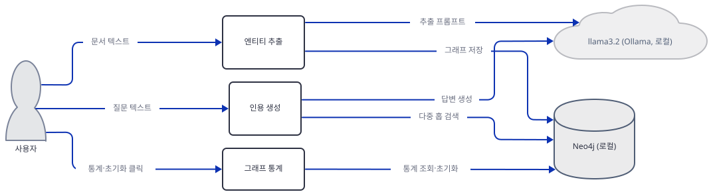
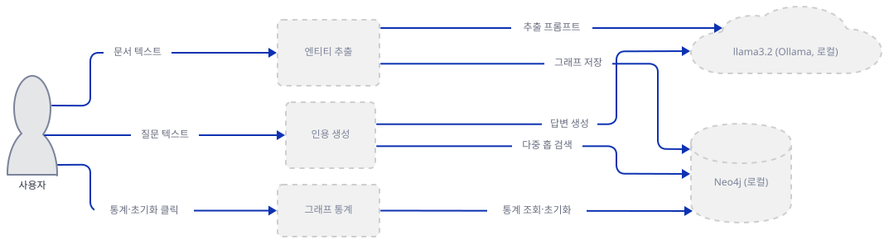
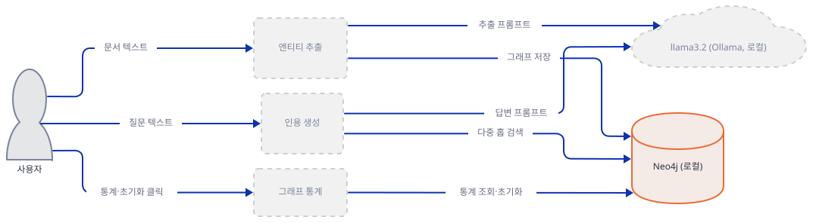
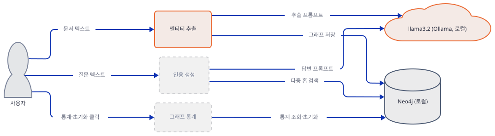
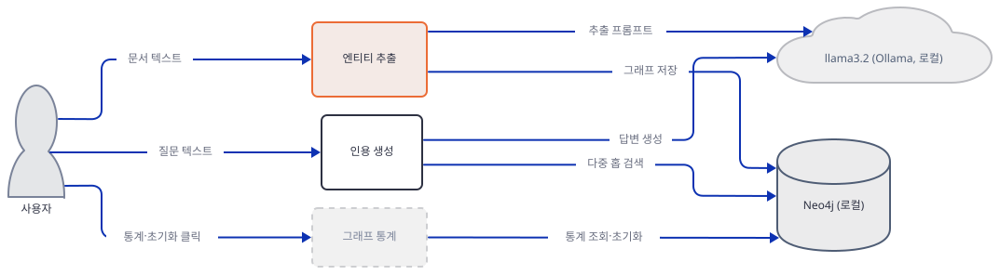
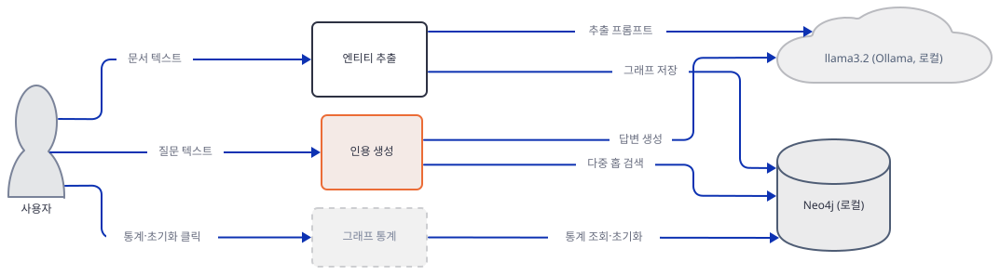
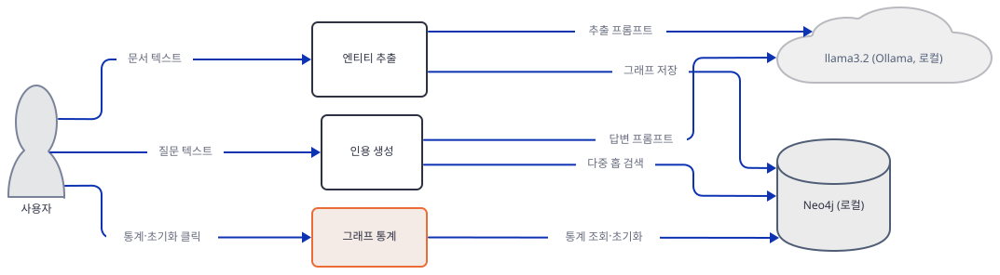
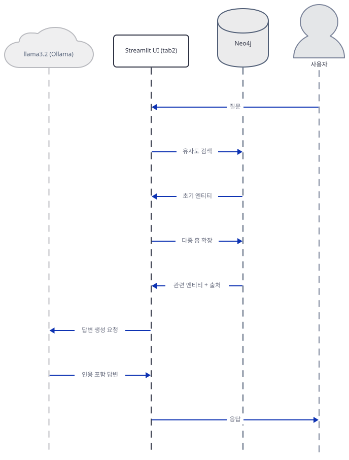

# Day 063 · 🕸️ Knowledge Graph RAG with Citations

> 볼륨 5 📀 RAG · 난이도 ★★☆ ⚠ · 예상 소요 100분(한국어 검색 주장을 직접 매칭까지 재현하고 Step 7에서 화면을 실제로 띄워 확인하는 절차가 더해져 다른 RAG 날보다 깁니다) · API 비용 무료(API 키 불필요 — 모델 추론과 그래프 저장은 이 컴퓨터에서 끝남. 다만 Streamlit이 브라우저에서 사용 통계를 보내는 것은 별개, Step 7) · 원본 앱: `rag_tutorials/knowledge_graph_rag_citations`

## 오늘 만들 것

오늘은 벡터 유사도 대신 Neo4j 지식 그래프로 다중 홉 추론과 출처 인용을 보여주는 524줄짜리 Streamlit 앱을 다룹니다(직접 확인, `wc -l`). 지금까지 이 볼륨의 RAG 앱들은 대부분 벡터 저장소(Qdrant·Chroma 등)를 썼지만(예외: Day 051·056·058), 오늘은 처음으로 그래프 데이터베이스가 등장합니다 — 문서에서 뽑은 엔티티가 노드로, 관계가 `RELATES_TO` 간선으로 저장되고, 질문이 들어오면 시작 엔티티에서 최대 2홉까지 그래프를 타고 관련 정보를 모읍니다(아래 `diagrams/extra-schema.svg`). 이 앱은 이 볼륨에서 보기 드물게 API 키가 단 하나도 필요 없습니다 — `import`문 10줄(12-21행, 직접 확인) 어디에도 `requests`나 `httpx` 같은 임의 HTTP 클라이언트가 없고 agno도 쓰지 않아(소스로 확인) Day 047이 확인했던 S3 다운로드나 `os.agno.com` 컨트롤 플레인, 익명 사용 통계 같은 숨은 네트워크 호출은 없습니다. 다만 이것이 "완전 로컬"을 뜻하지는 않습니다 — `import`문에 없다는 것은 이 코드가 직접 호출을 안 한다는 뜻일 뿐 `ollama` 0.6.2 같은 서드파티 패키지 자체의 동작까지 막지는 못하고, 실제로 Streamlit 1.64.0은 기본값(`browser.gatherUsageStats=True`)으로 브라우저가 화면을 열 때 사용 통계를 자체 서버에 보냅니다(Day 054가 이미 확인한 사실 — Step 7에서 콘솔 문구로 다시 확인합니다). 이 앱이 실제로 좁혀 말할 수 있는 것은 "API 키 없이 모델 추론·그래프 저장이 이 컴퓨터에서 끝난다"는 것입니다. 사이드바에 `st.stop()`이 단 한 곳도 없어서(직접 확인, grep) 이 볼륨 대부분의 RAG 앱이 가진 "키 없으면 여기서 멈춘다"는 게이트 자체가 없고, 대신 Neo4j·Ollama가 없을 때 무엇이 어떻게 실패하는지를 실제로 실행해 확인하는 것이 오늘의 핵심입니다. `KnowledgeGraphManager.__init__`이 만드는 `GraphDatabase.driver(...)`는 생성 시점에는 연결을 시도하지 않고(직접 확인, 0.000초) 실제 쿼리(`session.run`)에서야 접속을 시도해 약 4초 뒤 `ServiceUnavailable`로 실패합니다(직접 확인) — 이 지연 순서 때문에 두 UI 탭이 실패를 다루는 방식이 서로 달라집니다. "문서 추가" 탭은 Ollama 호출(`extract_entities_with_llm`)을 먼저 하고 Neo4j는 나중에 건드리는데, 이 함수가 모든 예외를 삼켜 빈 리스트를 돌려주는 바람에 Ollama가 꺼져 있어도 화면에는 "✅ Extracted 0 entities and 0 relationships"라는 성공 배너가 뜹니다(직접 확인, `AppTest`) — 반면 "질문 응답" 탭은 Neo4j 검색을 먼저 하므로 같은 상황에서 진짜 `st.error` 배너가 뜹니다(직접 확인). `generate_answer_with_citations`의 마지막 Ollama 호출도 실패를 스스로 삼켜, "💬 Answer" 표시 영역에는 오류 대신 "Error generating answer: ..."라는 문장이 마치 모델의 답인 것처럼 나타납니다(직접 확인, 스텁 그래프로 재현). 여기에 더해 `semantic_search`의 검색어 정규식(`[A-Za-z0-9]{3,}`)은 한글을 전혀 못 걸러내, 라틴 문자·숫자 3자 이상이 하나도 없는 순수 한국어 질문은 질문 전체가 검색어 하나가 되어 사실상 매치되지 않습니다(정규식은 직접 확인, 0건 자체는 Neo4j 없이 추정 — 라틴 문자·숫자가 3자 이상 연달아 있는 토큰이 하나라도 있으면 이 규칙에 안 걸립니다). 이 문서는 이 다섯 가지를 Step 1~7에서 순서대로 재현합니다. 아래는 완성된 아키텍처입니다.



## 사전 준비

| 서비스/도구 | 용도 | 발급·설치 |
|---|---|---|
| Ollama | 엔티티 추출·답변 생성 두 곳에서 호출하는 로컬 LLM(기본 `llama3.2`) | https://ollama.com/download 설치 후 `ollama pull llama3.2`(이 문서를 쓰는 컴퓨터에는 이미 받아져 있었습니다 — 직접 받지 않았습니다) |
| Neo4j (Docker) | 엔티티·관계를 저장하는 그래프 데이터베이스, 기본 `bolt://localhost:7687` | `docker run -d --name neo4j -p 7474:7474 -p 7687:7687 -e NEO4J_AUTH=neo4j/password neo4j:latest`(이 문서는 띄우지 않습니다 — 큰 이미지를 받는 대신 코드로 실패 지점을 확인합니다. 이 조합은 사이드바 기본값 `neo4j`/`password`와 그대로 맞습니다 — 코드는 자격증명을 검증하지 않고 그대로 전달합니다, 소스로 확인) |
| 인터넷 연결 | PyPI 패키지 설치, `ollama pull llama3.2`, `docker pull neo4j`에 필요 — 설치·다운로드가 끝나면 앱 코드 자체는 Ollama·Neo4j 외의 호스트를 직접 호출하지 않습니다(`import`문 10줄에 `requests`·`httpx` 없음, 소스로 확인). 다만 Streamlit이 브라우저에서 보내는 사용 통계는 별개입니다(Step 7) | 별도 설치 없음 |
| uv | 가상환경 생성과 패키지 설치 | [공통 사전 준비](../README.md#공통-사전-준비-한-번만) 절 참고 |

## 아키텍처 한눈에 보기

| 컴포넌트 | 역할 | 코드 위치 |
|---|---|---|
| 사용자 | 문서 입력, 질문 입력, 그래프 통계 조회·초기화 클릭 | 코드 없음 (브라우저) |
| 데이터 모델(`Entity`·`Relationship`·`Citation`·`AnswerWithCitations`) | 추출 결과와 인용의 자료구조 | `rag_tutorials/knowledge_graph_rag_citations/knowledge_graph_rag.py:32-68` |
| `KnowledgeGraphManager` | Neo4j 드라이버를 감싸 엔티티·관계 저장, 다중 홉 검색, 통계·초기화를 수행 | `rag_tutorials/knowledge_graph_rag_citations/knowledge_graph_rag.py:75-166` |
| 엔티티 추출(`extract_entities_with_llm`) | Ollama에 문서를 보내 엔티티·관계를 JSON으로 추출 | `rag_tutorials/knowledge_graph_rag_citations/knowledge_graph_rag.py:173-240` |
| 다중 홉 검색·인용 생성(`generate_answer_with_citations`) | 그래프 검색 → 컨텍스트 구성 → Ollama로 인용 포함 답변 생성 | `rag_tutorials/knowledge_graph_rag_citations/knowledge_graph_rag.py:247-354` |
| 문서 추가 탭(`main`, tab1) | 문서 선택·입력, 추출 실행, 결과 표시 | `rag_tutorials/knowledge_graph_rag_citations/knowledge_graph_rag.py:394-449` |
| 질문 응답 탭(`main`, tab2) | 질문 입력, 답변·추론 과정·인용 표시 | `rag_tutorials/knowledge_graph_rag_citations/knowledge_graph_rag.py:451-490` |
| 그래프 통계 탭(`main`, tab3) | 노드·관계 수 조회, 그래프 초기화 | `rag_tutorials/knowledge_graph_rag_citations/knowledge_graph_rag.py:492-520` |
| Neo4j 그래프 DB | 엔티티·관계 저장, Cypher 질의 처리 | 코드 없음 (외부 서비스, 로컬) |
| Ollama(`llama3.2`) | 엔티티 추출·답변 생성에 쓰이는 로컬 LLM | 코드 없음 (외부 런타임, 로컬) |

## 단계별 진행

### Step 1. 환경 만들기 — 키가 하나도 없다

**목적.** 격리된 가상환경에 `requirements.txt` 3줄을 설치하고, 이 파일이 컴파일되고 모든 import가 성공하는지 확인합니다.

**할 일.**

```bash
cd rag_tutorials/knowledge_graph_rag_citations
uv venv
uv pip install -r requirements.txt
```

(pip 대안: `python -m venv .venv && source .venv/bin/activate && pip install -r requirements.txt`. Windows PowerShell은 활성화만 `.venv\Scripts\Activate.ps1`로 바꿉니다.)

이 저장소는 루트에 `pyproject.toml`이 있어 `uv run`이 방금 만든 환경 대신 루트의 `.venv`를 쓰므로, 이후 모든 `uv run` 명령에는 `--no-project`를 붙입니다.

`rag_tutorials/knowledge_graph_rag_citations/requirements.txt:1-3`

```text
streamlit>=1.28.0
ollama>=0.1.0
neo4j>=5.0.0
```

3줄 모두 하한만 있는 범위입니다. 오늘 실제로 설치하면 46개 패키지로 풀리고(직접 확인), 그중 핵심 셋은 각각 **streamlit 1.64.0**, **ollama 0.6.2**, **neo4j 6.3.1**로 정해졌습니다(직접 확인 — 하한이 느슨해 2026-09-26 기준 최신입니다). 이 파일에는 `agno`도, `qdrant-client`도, `langchain` 계열도 없습니다 — 이 볼륨에서 반복돼 온 벡터 임베딩·벡터 저장소 역할이 통째로 빠지고 그 자리를 Neo4j 그래프 저장이 대신합니다.



**확인.** 컴파일과 import를 확인합니다.

```bash
uv run --no-project python -m py_compile knowledge_graph_rag.py && echo COMPILE_OK
```

직접 확인한 출력:

```
COMPILE_OK
```

```bash
uv run --no-project python -c "
import streamlit as st
import ollama
from ollama import Client as OllamaClient
from neo4j import GraphDatabase
from typing import List, Dict, Tuple
import re, os, json, hashlib
from dataclasses import dataclass
print('ALL IMPORTS OK')
"
```

직접 확인한 출력:

```
ALL IMPORTS OK
```

### Step 2. 데이터 모델과 `KnowledgeGraphManager` — 드라이버는 게으르다

**목적.** 엔티티·관계·인용을 담는 4개 데이터클래스와 `KnowledgeGraphManager`의 여섯 메서드를 확인하고, `GraphDatabase.driver(...)`가 정말 연결을 미루는지, 실제 쿼리에서 무엇이 나는지 직접 실행해 확인합니다.

**할 일.**

`rag_tutorials/knowledge_graph_rag_citations/knowledge_graph_rag.py:32-68`

```python
@dataclass
class Entity:
    """Represents an entity extracted from documents."""
    id: str
    name: str
    entity_type: str
    description: str
    source_doc: str
    source_chunk: str


@dataclass
class Relationship:
    """Represents a relationship between entities."""
    source: str
    target: str
    relation_type: str
    description: str
    source_doc: str


@dataclass
class Citation:
    """Represents a verifiable citation for a claim."""
    claim: str
    source_document: str
    source_text: str
    confidence: float
    reasoning_path: List[str]


@dataclass
class AnswerWithCitations:
    """Final answer with full attribution."""
    answer: str
    citations: List[Citation]
    reasoning_trace: List[str]
```

네 클래스 모두 순수한 자료구조이고, 매 엔티티·관계마다 `source_doc`(그리고 엔티티는 `source_chunk`까지) 필드를 갖고 다닙니다 — "모든 주장은 출처로 되짚을 수 있다"는 오늘 앱의 핵심 약속이 자료구조 단계부터 박혀 있습니다. 이 값들이 실제로 Neo4j에 어떻게 저장되는지는 `KnowledgeGraphManager`가 맡습니다.

`rag_tutorials/knowledge_graph_rag_citations/knowledge_graph_rag.py:75-125`

```python
class KnowledgeGraphManager:
    """Manages the Neo4j knowledge graph for RAG."""
    
    def __init__(self, uri: str, user: str, password: str):
        self.driver = GraphDatabase.driver(uri, auth=(user, password))
    
    def close(self):
        self.driver.close()
    
    def clear_graph(self):
        """Clear all nodes and relationships."""
        with self.driver.session() as session:
            session.run("MATCH (n) DETACH DELETE n")
    
    def add_entity(self, entity: Entity):
        """Add an entity to the knowledge graph."""
        with self.driver.session() as session:
            session.run(
                """
                MERGE (e:Entity {id: $id})
                SET e.name = $name,
                    e.type = $entity_type,
                    e.description = $description,
                    e.source_doc = $source_doc,
                    e.source_chunk = $source_chunk
                """,
                id=entity.id,
                name=entity.name,
                entity_type=entity.entity_type,
                description=entity.description,
                source_doc=entity.source_doc,
                source_chunk=entity.source_chunk
            )
    
    def add_relationship(self, rel: Relationship):
        """Add a relationship between entities."""
        with self.driver.session() as session:
            session.run(
                """
                MATCH (a:Entity {name: $source})
                MATCH (b:Entity {name: $target})
                MERGE (a)-[r:RELATES_TO {type: $rel_type}]->(b)
                SET r.description = $description,
                    r.source_doc = $source_doc
                """,
                source=rel.source,
                target=rel.target,
                rel_type=rel.relation_type,
                description=rel.description,
                source_doc=rel.source_doc
            )
```

`add_entity`는 해시 `id`(89-107행)를 병합 키로 쓰지만, `add_relationship`은 **이름**(114-115행)으로 노드를 찾습니다 — 이 둘의 키가 다르다는 것 자체는 소스를 읽으면 바로 보이는 사실입니다. `extract_entities_with_llm`(Step 3)이 만드는 `id`는 `이름_문서명` 해시라서(직접 확인, Step 3), 같은 이름의 엔티티가 서로 다른 문서에서 추출되면 `id`가 서로 달라 별개의 노드가 됩니다. 그런데 `add_relationship`은 이름만 보고 `MATCH`하므로, 이름이 같은 노드가 여럿이면 그 전부에 관계가 걸리고, LLM이 매번 정확히 같은 이름을 쓰지 않으면(예: "Microsoft"와 "Microsoft Research") `MATCH`가 아무 노드도 찾지 못해 관계 저장 자체가 조용히 아무 일도 하지 않습니다 — 이는 Cypher의 표준 동작이라 소스만으로 알 수 있지만, 이 컴퓨터에는 실행 가능한 Neo4j가 없어 실제로 재현하지는 못했습니다(소스로 확인).



**확인.** 먼저 `driver(...)` 생성이 정말 연결을 시도하지 않는지 시간을 재고, 실제 쿼리에서 무엇이 나는지 봅니다(Neo4j를 띄우지 않은 채 `localhost:7687`로 접속을 시도하므로, 이 컴퓨터를 벗어나지 않습니다).

```bash
uv run --no-project python -c "
import time
from neo4j import GraphDatabase
t0 = time.monotonic()
driver = GraphDatabase.driver('bolt://localhost:7687', auth=('neo4j', 'password'))
print(f'driver() constructed in {time.monotonic()-t0:.3f}s, no exception')
t0 = time.monotonic()
try:
    with driver.session() as session:
        session.run('MATCH (n) DETACH DELETE n').consume()
except Exception as e:
    print(f'session.run() after {time.monotonic()-t0:.3f}s -> {type(e).__name__}: {e}')
driver.close()
"
```

직접 확인한 출력(마지막 줄은 한국어 Windows의 오류 문구입니다 — 다른 운영체제·언어 설정에서는 문구가 다릅니다):

```
driver() constructed in 0.000s, no exception
session.run() after 4.054s -> ServiceUnavailable: Couldn't connect to localhost:7687 (resolved to ('[::1]:7687', '127.0.0.1:7687')):
Failed to establish connection to ResolvedIPv6Address(('::1', 7687, 0, 0)) (reason [WinError 10061] 대상 컴퓨터에서 연결을 거부했으므로 연결하지 못했습니다)
Failed to establish connection to ResolvedIPv4Address(('127.0.0.1', 7687)) (reason [WinError 10061] 대상 컴퓨터에서 연결을 거부했으므로 연결하지 못했습니다)
```

`driver()` 생성은 0초에 가깝게 끝나 예외가 없고, 실제로 무언가 잘못됐다는 것은 4초 뒤 첫 쿼리에서야 드러납니다 — IPv6·IPv4를 순서대로 시도하는 시간입니다. 거부된 루프백 연결을 주소마다 약 2초씩 재시도하는 것은 이 문서를 검증한 Windows의 동작입니다 — Linux·macOS는 대개 곧바로 실패합니다(이 문서는 Windows에서만 검증했습니다). `driver.close()`도 연결을 한 번도 맺지 않은 채 안전하게 끝납니다(직접 확인, 별도 실행에서 예외 없음).

### Step 3. 엔티티 추출 — 성공은 진짜고, 실패는 조용히 사라진다

**목적.** `extract_entities_with_llm`이 Ollama를 어떻게 호출하는지, 실제로 성공하면 무엇을 돌려주는지, 그리고 Ollama가 없을 때 무엇을 돌려주는지 두 경우 모두 직접 실행해 확인합니다.

**할 일.**

`rag_tutorials/knowledge_graph_rag_citations/knowledge_graph_rag.py:173-241`

```python
def extract_entities_with_llm(text: str, source_doc: str, model: str = "llama3.2") -> Tuple[List[Entity], List[Relationship]]:
    """Use LLM to extract entities and relationships from text."""
    
    extraction_prompt = f"""Analyze the following text and extract:
1. KEY ENTITIES (people, organizations, concepts, technologies, events)
2. RELATIONSHIPS between these entities

For each entity, provide:
- name: The entity name
- type: Category (PERSON, ORGANIZATION, CONCEPT, TECHNOLOGY, EVENT, LOCATION)
- description: Brief description based on the text

For each relationship, provide:
- source: Source entity name
- target: Target entity name  
- type: Relationship type (e.g., WORKS_FOR, CREATED, USES, LOCATED_IN)
- description: Description of how they relate

TEXT:
{text}

Respond in JSON format:
{{
  "entities": [
    {{"name": "...", "type": "...", "description": "..."}}
  ],
  "relationships": [
    {{"source": "...", "target": "...", "type": "...", "description": "..."}}
  ]
}}
"""
    
    try:
        response = ollama_client.chat(
            model=model,
            messages=[{"role": "user", "content": extraction_prompt}],
            format="json"
        )
        
        data = json.loads(response['message']['content'])
        
        entities = []
        for e in data.get('entities', []):
            entity_id = hashlib.md5(f"{e['name']}_{source_doc}".encode()).hexdigest()[:12]
            entities.append(Entity(
                id=entity_id,
                name=e['name'],
                entity_type=e['type'],
                description=e['description'],
                source_doc=source_doc,
                source_chunk=text[:200] + "..."
            ))
        
        relationships = []
        for r in data.get('relationships', []):
            relationships.append(Relationship(
                source=r['source'],
                target=r['target'],
                relation_type=r['type'],
                description=r['description'],
                source_doc=source_doc
            ))
        
        return entities, relationships
    
    except Exception as e:
        st.warning(f"Entity extraction error: {e}")
        return [], []
```

`entity_id`(216행)는 `이름_문서명`을 MD5로 해시한 값입니다 — Step 2에서 본 대로 같은 이름이라도 문서명이 다르면 다른 `id`가 됩니다. `source_chunk`(223행)는 원문의 앞 200자에 `"..."`을 무조건 붙이는데, 200자보다 짧은 텍스트에도 그대로 붙어 잘리지 않았는데 잘린 것처럼 보입니다(직접 확인, 아래). 가장 중요한 것은 238-240행입니다 — Ollama 호출이든 JSON 파싱이든 그 사이 어디서 실패하든 `except Exception`이 전부 삼키고 `st.warning`만 띄운 뒤 **빈 리스트 두 개**를 돌려줍니다. 이 함수를 호출하는 쪽(Step 5)은 이 반환값이 "성공했지만 0건"인지 "실패"인지 구분할 방법이 없습니다.



**확인.** 이 컴퓨터에는 `llama3.2`가 이미 받아져 있어(직접 확인, `curl http://127.0.0.1:11434/api/tags` — 이 문서가 받은 것이 아닙니다) 실제로 호출해 봅니다.

```bash
uv run --no-project python -c "
import time
from knowledge_graph_rag import extract_entities_with_llm
text = 'GraphRAG was developed by Microsoft Research. Darren Edge led the project.'
t0 = time.monotonic()
entities, rels = extract_entities_with_llm(text, 'AI Research Paper', model='llama3.2')
print(f'took {time.monotonic()-t0:.1f}s')
for e in entities: print(' ', e)
for r in rels: print(' ', r)
"
```

직접 확인한 출력(모델이 그때그때 만드는 텍스트라 문구는 비결정적이지만, 이 문서를 쓰며 실제로 나온 값입니다):

```
took 15.6s
  Entity(id='76c8cf03c0d4', name='GraphRAG', entity_type='CONCEPT', description='GraphRAG is a software developed by Microsoft Research', source_doc='AI Research Paper', source_chunk='GraphRAG was developed by Microsoft Research. Darren Edge led the project....')
  Entity(id='756f58de0eda', name='Microsoft Research', entity_type='ORGANIZATION', description='Microsoft Research is a research division of Microsoft', source_doc='AI Research Paper', source_chunk='GraphRAG was developed by Microsoft Research. Darren Edge led the project....')
  Entity(id='0d43cd1ff3fa', name='Darren Edge', entity_type='PERSON', description='Darren Edge is a researcher who led the GraphRAG project', source_doc='AI Research Paper', source_chunk='GraphRAG was developed by Microsoft Research. Darren Edge led the project....')
  Relationship(source='Microsoft Research', target='GraphRAG', relation_type='DEVELOPED_BY', description='GraphRAG was developed by Microsoft Research', source_doc='AI Research Paper')
  Relationship(source='Darren Edge', target='GraphRAG', relation_type='LEADS', description='Darren Edge led the GraphRAG project', source_doc='AI Research Paper')
```

원문이 74자뿐인데도 `source_chunk`마다 `"...."`(마침표 하나 + 붙인 점 셋)로 끝나 잘린 것처럼 보인다는 것도 이 출력으로 확인됩니다. 이제 Ollama가 없을 때를 봅니다 — 존재하지 않는 루프백 포트로 클라이언트를 바꿔치기해 실제로 나가는 요청이 이 컴퓨터를 벗어나지 않게 합니다.

```bash
uv run --no-project python -c "
import time
import knowledge_graph_rag as kg
from ollama import Client as OllamaClient
kg.ollama_client = OllamaClient(host='http://127.0.0.1:11499')
t0 = time.monotonic()
entities, rels = kg.extract_entities_with_llm('some text', 'doc1', model='llama3.2')
print(f'took {time.monotonic()-t0:.3f}s')
print('entities:', entities)
print('relationships:', rels)
"
```

직접 확인한 출력(`took` 값은 연결 재시도 시간이라 실행마다 다릅니다):

```
took 2.147s
entities: []
relationships: []
```

`st.warning(...)`은 Streamlit 런타임 밖에서 실행하면 "missing ScriptRunContext" 경고만 남기고 값 자체는 그대로 돌아옵니다 — 호출부 입장에서 이 반환값은 Step 4~5에서 볼 "정말 0건 추출됨"과 구분되지 않습니다.

### Step 4. 다중 홉 검색과 인용 생성 — 나이브 텍스트 매칭과 숨은 답변 위장

**목적.** `semantic_search`·`find_related_entities`가 그래프를 어떻게 훑는지, `generate_answer_with_citations`이 그 결과로 어떻게 인용 달린 답을 만드는지, 그리고 마지막 Ollama 호출이 실패하면 무슨 일이 나는지 확인합니다.

**할 일.**

`rag_tutorials/knowledge_graph_rag_citations/knowledge_graph_rag.py:145-166`

```python
    def semantic_search(self, query: str) -> List[Dict]:
        """Search for relevant entities based on query."""
        # CONTAINS on the whole question can never match an entity name/description,
        # so match any term (case-insensitively) instead of the full raw query.
        terms = re.findall(r"[A-Za-z0-9]{3,}", query) or [query]
        with self.driver.session() as session:
            # Simple text matching (in production, use vector embeddings)
            result = session.run(
                """
                MATCH (e:Entity)
                WHERE any(t IN $terms WHERE toLower(e.name) CONTAINS toLower(t)
                                         OR toLower(e.description) CONTAINS toLower(t))
                RETURN e.name as name,
                       e.description as description,
                       e.source_doc as source,
                       e.source_chunk as chunk,
                       e.type as type
                LIMIT 10
                """,
                terms=terms
            )
            return [dict(record) for record in result]
```

함수 이름과 달리 임베딩도 코사인 유사도도 없습니다 — 149행의 정규식으로 질문에서 영문·숫자 3자 이상 토큰을 뽑아, 엔티티 이름·설명에 그 토큰이 하나라도 포함되면 매치입니다(151행 주석이 스스로 "단순 텍스트 매칭"이라 밝힙니다). 문제는 이 정규식이 `[A-Za-z0-9]{3,}`라서 한글을 전혀 못 거른다는 것입니다 — 정규식이 아무 토큰도 못 찾으면 `or [query]`가 질문 원문 전체를 토큰 하나로 씁니다.


**확인.** 실제 Neo4j 없이 이 정규식과 `WHERE ... CONTAINS` 매치를 Step 3의 엔티티 셋으로 순수 파이썬으로 흉내 내 돌려 봅니다.

```bash
uv run --no-project python -c "
import re
entities = [
    {'name': 'GraphRAG', 'description': 'GraphRAG is a software developed by Microsoft Research'},
    {'name': 'Microsoft Research', 'description': 'Microsoft Research is a research division of Microsoft'},
    {'name': 'Darren Edge', 'description': 'Darren Edge is a researcher who led the GraphRAG project'},
]
def terms(query):
    return re.findall(r'[A-Za-z0-9]{3,}', query) or [query]
def matches(query):
    ts = terms(query)
    return ts, [e['name'] for e in entities if any(t.lower() in e['name'].lower() or t.lower() in e['description'].lower() for t in ts)]
for q in ['Who developed GraphRAG and what organization are they from?', 'GraphRAG을 만든 사람은?', '마이크로소프트 리서치가 만든 기술은?']:
    print(repr(q), '->', matches(q))
"
```

직접 확인한 출력:

```
'Who developed GraphRAG and what organization are they from?' -> (['Who', 'developed', 'GraphRAG', 'and', 'what', 'organization', 'are', 'they', 'from'], ['GraphRAG', 'Darren Edge'])
'GraphRAG을 만든 사람은?' -> (['GraphRAG'], ['GraphRAG', 'Darren Edge'])
'마이크로소프트 리서치가 만든 기술은?' -> (['마이크로소프트 리서치가 만든 기술은?'], [])
```

영어 질문은 "and"·"are"·"they" 같은 불용어까지 전부 검색어가 되어 사실상 아무 필터도 아니고, `GraphRAG`처럼 라틴 문자 엔티티명이 하나라도 섞인 한국어 질문은 그 토큰만 남아 실제로 매치됩니다 — 위 확인의 `GraphRAG을 만든 사람은?`이 그 예로, `terms`는 `['GraphRAG']`가 되고 이 값으로 Step 3의 엔티티 셋에 `WHERE ... CONTAINS`를 순수 파이썬으로 흉내 내 돌리면 `GraphRAG`·`Darren Edge` 두 엔티티가 매치됩니다(직접 확인). 매치가 사실상 항상 실패하는 경우는 라틴 문자·숫자 3자 이상이 하나도 없는 **순수** 한국어 질문뿐입니다 — 그때는 `terms`가 빈 리스트가 되어 `or [query]`가 질문 문장 전체를 토큰으로 쓰고, 그 문장 전체가 영어로 된 엔티티 이름·설명에 그대로 포함돼 있을 리 없기 때문입니다(이 경우의 0건 자체는 Neo4j 없이 추정 — 정규식 동작만 직접 확인). `find_related_entities`(`rag_tutorials/knowledge_graph_rag_citations/knowledge_graph_rag.py:127-143`)는 `hops` 값을 Cypher의 가변 길이 경로(`[*1..{hops}]`)에 f-string으로 직접 넣습니다 — 이 값은 호출부(아래)가 항상 `2`로 고정해 넘기므로 사용자 입력은 아닙니다. f-string을 쓴 이유가 "Neo4j가 가변 길이 경로의 홉 수를 바인드 파라미터로 받지 않기 때문"이라는 것은 이 저장소 밖의 일반적인 Cypher 지식이라, 이 문서에서 소스로 확인한 사실은 아닙니다.

이어서 `generate_answer_with_citations` 전체를 봅니다.

`rag_tutorials/knowledge_graph_rag_citations/knowledge_graph_rag.py:247-354`

```python
def generate_answer_with_citations(
    query: str,
    graph: KnowledgeGraphManager,
    model: str = "llama3.2"
) -> AnswerWithCitations:
    """
    Generate an answer using multi-hop graph traversal with full citations.
    
    This is the core differentiator: every claim is traced back to source documents.
    """
    
    reasoning_trace = []
    citations = []
    
    # Step 1: Initial semantic search
    reasoning_trace.append(f"🔍 Searching knowledge graph for: '{query}'")
    initial_results = graph.semantic_search(query)
    
    if not initial_results:
        return AnswerWithCitations(
            answer="I couldn't find relevant information in the knowledge graph.",
            citations=[],
            reasoning_trace=reasoning_trace
        )
    
    reasoning_trace.append(f"📊 Found {len(initial_results)} initial entities")
    
    # Step 2: Multi-hop expansion
    all_context = []
    for entity in initial_results[:3]:
        reasoning_trace.append(f"🔗 Expanding from entity: {entity['name']}")
        related = graph.find_related_entities(entity['name'], hops=2)
        
        for rel in related:
            all_context.append({
                "entity": rel['name'],
                "description": rel['description'],
                "source": rel['source'],
                "chunk": rel['chunk'],
                "path": rel.get('path_descriptions', [])
            })
            reasoning_trace.append(f"  → Found related: {rel['name']}")
    
    # Step 3: Build context with source tracking
    context_parts = []
    source_map = {}
    
    for i, ctx in enumerate(all_context):
        source_key = f"[{i+1}]"
        context_parts.append(f"{source_key} {ctx['entity']}: {ctx['description']}")
        source_map[source_key] = {
            "document": ctx['source'],
            "text": ctx['chunk'],
            "entity": ctx['entity']
        }
    
    context_text = "\n".join(context_parts)
    reasoning_trace.append(f"📝 Built context from {len(context_parts)} sources")
    
    # Step 4: Generate answer with citation requirements
    answer_prompt = f"""Based on the following knowledge graph context, answer the question.
IMPORTANT: For each claim you make, cite the source using [N] notation.

CONTEXT:
{context_text}

QUESTION: {query}

Provide a comprehensive answer with inline citations [1], [2], etc. for each claim.
"""
    
    try:
        response = ollama_client.chat(
            model=model,
            messages=[{"role": "user", "content": answer_prompt}]
        )
        answer = response['message']['content']
        reasoning_trace.append("✅ Generated answer with citations")
        
        # Step 5: Extract and verify citations
        citation_refs = re.findall(r'\[(\d+)\]', answer)
        
        for ref in set(citation_refs):
            key = f"[{ref}]"
            if key in source_map:
                src = source_map[key]
                citations.append(Citation(
                    claim=f"Reference {key}",
                    source_document=src['document'],
                    source_text=src['text'],
                    confidence=0.85,
                    reasoning_path=[f"Entity: {src['entity']}"]
                ))
        
        reasoning_trace.append(f"🔒 Verified {len(citations)} citations")
        
        return AnswerWithCitations(
            answer=answer,
            citations=citations,
            reasoning_trace=reasoning_trace
        )
        
    except Exception as e:
        return AnswerWithCitations(
            answer=f"Error generating answer: {e}",
            citations=[],
            reasoning_trace=reasoning_trace
        )
```

인용 번호(`[1]`, `[2]`)는 실제 데이터베이스 ID가 아니라 이번 호출에서 `all_context`에 쌓인 순서일 뿐입니다 — `source_map`(292행)이 매 호출마다 새로 만들어지므로, 같은 질문을 다시 물어도 그래프 순회 결과가 조금만 달라지면 `[1]`이 가리키는 출처가 바뀔 수 있습니다. 318행에서 시작해 349행에서 끝나는 `try`가 이 함수의 유일한 예외 처리이고, 그 앞의 `graph.semantic_search`·`graph.find_related_entities` 호출(258-288행)은 어떤 `try`로도 감싸여 있지 않습니다 — Neo4j가 없으면 예외가 이 함수를 그대로 뚫고 나갑니다. 반면 마지막 Ollama 호출(318-322행)만 자체 `try/except`로 감싸여 있어, 실패해도 예외를 던지지 않고 **에러 메시지를 답변 텍스트 자리에 넣은 정상적인 `AnswerWithCitations`**를 돌려줍니다(349-354행).

**확인.** Neo4j 없이도 이 함수를 그대로 실행할 수 있습니다 — `KnowledgeGraphManager`를 흉내 내는 스텁 객체로 그래프 부분만 대신하고, Ollama는 실제로 호출합니다(성공 1회, 실패 1회).

```bash
uv run --no-project python -c "
import knowledge_graph_rag as kg
from ollama import Client as OllamaClient

class StubGraph:
    def semantic_search(self, query):
        return [{'name': 'GraphRAG', 'description': 'A technique by Microsoft Research', 'source': 'AI Research Paper', 'chunk': 'GraphRAG was developed by Microsoft Research...', 'type': 'CONCEPT'}]
    def find_related_entities(self, name, hops=2):
        return [{'name': 'Darren Edge', 'description': 'led the GraphRAG project', 'source': 'AI Research Paper', 'chunk': 'Darren Edge led the project...', 'path_descriptions': ['works_for']}]

result_ok = kg.generate_answer_with_citations('Who developed GraphRAG?', StubGraph(), model='llama3.2')
print('Ollama 정상:', result_ok.answer)
print('citations:', len(result_ok.citations))

kg.ollama_client = OllamaClient(host='http://127.0.0.1:11499')
result_fail = kg.generate_answer_with_citations('Who developed GraphRAG?', StubGraph(), model='llama3.2')
print('Ollama 장애:', result_fail.answer)
print('citations:', len(result_fail.citations))
"
```

직접 확인한 출력(모델 답은 비결정적이지만 이 문서를 쓰며 실제로 나온 값입니다):

```
Ollama 정상: The developer of GraphRAG is Darren Edge [1].
citations: 1
Ollama 장애: Error generating answer: Failed to connect to Ollama. Please check that Ollama is downloaded, running and accessible. https://ollama.com/download
citations: 0
```

두 번째 줄이 오늘의 핵심입니다 — 예외도, `st.error`도 없이 "Error generating answer: ..."라는 문장이 **정상적인 답변**으로 반환됩니다. 이 값을 받는 tab2(Step 6)는 이것이 실패인지 알 방법이 없어 그대로 화면에 답으로 띄웁니다.

### Step 5. 문서 추가 탭 — 0건 추출도 성공이라고 뜬다

**목적.** tab1 버튼 핸들러가 `extract_entities_with_llm`과 `KnowledgeGraphManager`를 어떻게 잇는지 확인하고, Ollama가 꺼져 있을 때 화면에 정확히 무엇이 뜨는지 `AppTest`로 직접 확인합니다.

**할 일.**

`rag_tutorials/knowledge_graph_rag_citations/knowledge_graph_rag.py:420-449`

```python
        if st.button("🔨 Extract & Add to Knowledge Graph"):
            with st.spinner("Extracting entities and relationships..."):
                try:
                    graph = KnowledgeGraphManager(neo4j_uri, neo4j_user, neo4j_password)
                    entities, relationships = extract_entities_with_llm(doc_text, doc_name, llm_model)
                    
                    for entity in entities:
                        graph.add_entity(entity)
                    
                    for rel in relationships:
                        graph.add_relationship(rel)
                    
                    graph.close()
                    
                    st.success(f"✅ Extracted {len(entities)} entities and {len(relationships)} relationships")
                    
                    with st.expander("View Extracted Entities"):
                        for e in entities:
                            st.write(f"**{e.name}** ({e.entity_type}): {e.description}")
                    
                    with st.expander("View Extracted Relationships"):
                        for r in relationships:
                            st.write(f"{r.source} --[{r.relation_type}]--> {r.target}: {r.description}")
                    
                    st.session_state.graph_initialized = True
                    st.session_state.documents.append(doc_name)
                    
                except Exception as e:
                    st.error(f"Error: {e}")
                    st.info("Make sure Neo4j is running and Ollama has the model pulled.")
```

순서를 보면 `extract_entities_with_llm`(424행, Ollama 호출)이 `graph.add_entity`(426-427행, Neo4j 호출)보다 먼저입니다. Step 3에서 확인했듯 Ollama가 실패하면 `entities`·`relationships`가 둘 다 빈 리스트로 돌아오고, 그러면 426-430행의 `for` 루프가 한 번도 돌지 않아 **Neo4j는 아예 호출되지도 않습니다.** `graph.close()`(432행)는 연결을 맺은 적 없는 드라이버를 닫을 뿐이라 안전하게 끝나고(Step 2에서 확인), 곧바로 434행이 `len(entities)=0`, `len(relationships)=0`으로 성공 배너를 씁니다 — 447-449행의 `except`는 이 경로에서 아예 실행되지 않습니다.



**확인.** Ollama를 쓸 수 없는 상태로 만들고(존재하지 않는 루프백 포트), 실제로 버튼을 눌러 화면에 뜨는 값을 `AppTest`로 확인합니다.

```bash
uv run --no-project python -c "
import os
os.environ['OLLAMA_HOST'] = 'http://127.0.0.1:11499'
from streamlit.testing.v1 import AppTest
at = AppTest.from_file('knowledge_graph_rag.py')
at.run(timeout=30)
at.button[0].click().run(timeout=30)
print('warning:', [w.value for w in at.warning])
print('success:', [s.value for s in at.success])
print('error:', [e.value for e in at.error])
"
```

직접 확인한 출력:

```
warning: ['Entity extraction error: Failed to connect to Ollama. Please check that Ollama is downloaded, running and accessible. https://ollama.com/download']
success: ['Extracted 0 entities and 0 relationships']
error: []
```

경고와 성공 배너가 같은 화면에 함께 뜹니다 — 위쪽의 노란 경고를 놓치면, 초록색 "Extracted 0 entities and 0 relationships"만 보고 정상적으로 끝났다고 오해하기 쉽습니다. 이 0건 "성공" 뒤에도 444-445행은 그대로 실행되어 `graph_initialized=True`와 문서 이름이 세션에 남으므로, tab2로 넘어가면 "📚 Knowledge graph contains documents: AI Research Paper"라는 안내가 뜹니다(457행, 소스로 확인) — 그래프에는 아무것도 저장되지 않았는데도 그렇습니다.

### Step 6. 질문 응답 탭 — 이번엔 진짜 오류가 뜬다

**목적.** tab2 버튼 핸들러가 `generate_answer_with_citations`과 결과 표시를 어떻게 잇는지 확인하고, Neo4j가 없을 때는 Step 5와 다르게 진짜 오류 배너가 뜬다는 것을 `AppTest`로 확인합니다.

**할 일.**

`rag_tutorials/knowledge_graph_rag_citations/knowledge_graph_rag.py:451-490`

```python
    with tab2:
        st.header("Step 2: Ask Questions with Verifiable Answers")
        
        if not st.session_state.graph_initialized:
            st.warning("⚠️ Please add documents to the knowledge graph first.")
        else:
            st.info(f"📚 Knowledge graph contains documents: {', '.join(st.session_state.documents)}")
        
        query = st.text_input("Enter your question:", "What are the key concepts in GraphRAG and who developed it?")
        
        if st.button("🔍 Ask with Citations"):
            with st.spinner("Traversing knowledge graph and generating answer..."):
                try:
                    graph = KnowledgeGraphManager(neo4j_uri, neo4j_user, neo4j_password)
                    result = generate_answer_with_citations(query, graph, llm_model)
                    graph.close()
                    
                    # Display reasoning trace
                    st.subheader("🧠 Reasoning Trace")
                    for step in result.reasoning_trace:
                        st.write(step)
                    
                    # Display answer
                    st.subheader("💬 Answer")
                    st.markdown(result.answer)
                    
                    # Display citations
                    st.subheader("📚 Source Citations")
                    if result.citations:
                        for i, citation in enumerate(result.citations):
                            with st.expander(f"Citation {i+1}: {citation.source_document}"):
                                st.write(f"**Source Document:** {citation.source_document}")
                                st.write(f"**Source Text:** {citation.source_text}")
                                st.write(f"**Confidence:** {citation.confidence:.0%}")
                                st.write(f"**Reasoning Path:** {' → '.join(citation.reasoning_path)}")
                    else:
                        st.info("No specific citations extracted for this answer.")
                        
                except Exception as e:
                    st.error(f"Error: {e}")
```

454-457행의 안내 문구는 `st.stop()`이 없는 순수 정보성 배너입니다 — 문서를 하나도 안 넣었어도(`graph_initialized=False`) "🔍 Ask with Citations" 버튼은 그대로 눌립니다. 465행 `generate_answer_with_citations` 호출은 Step 4에서 본 대로 `graph.semantic_search`를 가장 먼저 실행하는데, 이것이 이 함수 안에서 감싸여 있지 않은 호출이라 Neo4j가 없으면 예외가 이 `try`(463행)까지 그대로 올라와 489-490행의 `except Exception as e: st.error(f"Error: {e}")`가 진짜로 실행됩니다 — Step 5의 tab1과 달리 여기서는 실패가 숨지 않습니다.



**확인.** Neo4j 없이(이 컴퓨터에는 실제로 떠 있지 않습니다) 기본 질문 그대로 버튼을 눌러 봅니다.

```bash
uv run --no-project python -c "
from streamlit.testing.v1 import AppTest
at = AppTest.from_file('knowledge_graph_rag.py')
at.run(timeout=30)
at.button[1].click().run(timeout=30)
print('error:', [e.value for e in at.error])
"
```

직접 확인한 출력:

```
error: ["Error: Couldn't connect to localhost:7687 (resolved to ('[::1]:7687', '127.0.0.1:7687')):\nFailed to establish connection to ResolvedIPv6Address(('::1', 7687, 0, 0)) (reason [WinError 10061] 대상 컴퓨터에서 연결을 거부했으므로 연결하지 못했습니다)\nFailed to establish connection to ResolvedIPv4Address(('127.0.0.1', 7687)) (reason [WinError 10061] 대상 컴퓨터에서 연결을 거부했으므로 연결하지 못했습니다)"]
```

Step 2에서 본 것과 같은 `ServiceUnavailable` 메시지가 이번에는 화면의 빨간 오류 배너로 그대로 노출됩니다.

### Step 7. 그래프 통계·초기화 탭 — 같은 패턴, 같은 결과

**목적.** tab3의 두 버튼(통계 조회, 그래프 초기화)이 `KnowledgeGraphManager`를 직접 어떻게 부르는지 확인하고, 둘 다 Neo4j 실패를 tab2와 같은 방식(진짜 `st.error`)으로 보여준다는 것을 확인합니다.

**할 일.**

`rag_tutorials/knowledge_graph_rag_citations/knowledge_graph_rag.py:492-520`

```python
    with tab3:
        st.header("🔬 Knowledge Graph Visualization")
        st.info("This tab shows the structure of your knowledge graph.")
        
        if st.button("📊 Show Graph Statistics"):
            try:
                graph = KnowledgeGraphManager(neo4j_uri, neo4j_user, neo4j_password)
                with graph.driver.session() as session:
                    node_count = session.run("MATCH (n) RETURN count(n) as count").single()['count']
                    rel_count = session.run("MATCH ()-[r]->() RETURN count(r) as count").single()['count']
                
                col1, col2 = st.columns(2)
                col1.metric("Total Entities", node_count)
                col2.metric("Total Relationships", rel_count)
                
                graph.close()
            except Exception as e:
                st.error(f"Error connecting to Neo4j: {e}")
        
        if st.button("🗑️ Clear Graph"):
            try:
                graph = KnowledgeGraphManager(neo4j_uri, neo4j_user, neo4j_password)
                graph.clear_graph()
                graph.close()
                st.session_state.graph_initialized = False
                st.session_state.documents = []
                st.success("Graph cleared!")
            except Exception as e:
                st.error(f"Error: {e}")
```

두 버튼 모두 Ollama를 전혀 거치지 않고 `KnowledgeGraphManager`만 곧장 씁니다 — 통계 버튼은 `graph.driver.session()`을 직접 열어 두 번 카운트 쿼리를 날리고(499-501행), 초기화 버튼은 `clear_graph()`(Step 2에서 본 `MATCH (n) DETACH DELETE n`)를 부릅니다. 둘 다 `except Exception`이 있어 Neo4j 실패가 tab2처럼 곧장 오류 배너로 뜹니다 — tab1(Step 5)의 "실패가 숨는" 경로와 달리, 이 탭은 애초에 Ollama를 부르지 않으므로 그 경로 자체가 존재하지 않습니다.



**확인.** 두 버튼을 각각 눌러 봅니다(Neo4j 없이).

```bash
uv run --no-project python -c "
from streamlit.testing.v1 import AppTest
at = AppTest.from_file('knowledge_graph_rag.py')
at.run(timeout=30)
at.button[2].click().run(timeout=30)
print('stats error:', [e.value for e in at.error])
"
```

직접 확인한 출력(발췌):

```
stats error: ["Error connecting to Neo4j: Couldn't connect to localhost:7687 ..."]
```

```bash
uv run --no-project python -c "
from streamlit.testing.v1 import AppTest
at = AppTest.from_file('knowledge_graph_rag.py')
at.run(timeout=30)
at.button[3].click().run(timeout=30)
print('clear error:', [e.value for e in at.error])
"
```

직접 확인한 출력(발췌):

```
clear error: ["Error: Couldn't connect to localhost:7687 ..."]
```

`at.button`은 화면에 나온 순서대로 인덱싱되므로 0="Extract & Add", 1="Ask with Citations", 2="Show Graph Statistics", 3="Clear Graph"입니다.

마지막으로 완성된 화면을 실제로 띄워 확인합니다.

```bash
uv run --no-project streamlit run knowledge_graph_rag.py
```

(pip 대안: `streamlit run knowledge_graph_rag.py`. PowerShell도 같은 명령입니다.) 브라우저가 열리면 제목 "🔍 Knowledge Graph RAG with Verifiable Citations", 탭 "📄 Add Documents"·"❓ Ask Questions"·"🔬 View Graph", 사이드바 "Neo4j URI"·"Neo4j User"·"Neo4j Password"·"LLM Model"이 뜹니다 — 이 값들은 Step 1~7에서 다룬 소스와 같습니다(소스로 확인). 이 문서는 실제 브라우저 대신 헤드리스로 기동해(`--server.headless true --server.address localhost`, 임의로 비어 있던 높은 포트) `curl`로 확인했습니다 — `--server.address`를 주면 Streamlit이 헤드리스일 때만 시도하는 외부 IP 자동탐지(`net_util.get_external_ip`, Day 054가 이미 확인한 사실)를 건너뜁니다.

직접 확인한 콘솔 출력(포트는 예시입니다):

```
Collecting usage statistics. To deactivate, set browser.gatherUsageStats to false.

2026-09-27 07:05:46.293 Uvicorn server started on localhost:58734

  You can now view your Streamlit app in your browser.

  URL: http://localhost:58734
```

`curl http://localhost:58734/_stcore/health` → `ok`, `External URL`은 뜨지 않았습니다(직접 확인 — 네트워크를 막고 확인한 결과 이 기동에서 다른 호스트로 나간 시도는 0건이었습니다). 다만 콘솔 첫 줄이 스스로 밝히듯, 실제로 브라우저를 열면 Streamlit은 기본값(`browser.gatherUsageStats=True`)으로 사용 통계를 자체 서버에 보냅니다 — 끄려면 `--browser.gatherUsageStats false`를 더합니다.

## 요청 한 건이 흐르는 과정



이 시퀀스는 "질문 응답" 탭에서 문서가 이미 채워져 있다고 가정하고 인용까지 만들어지는 전체 경로를 그린 것입니다. 사용자가 질문을 보내면 UI는 먼저 Neo4j에 검색어 매칭(Step 4에서 본 대로 임베딩도 코사인 유사도도 없는 나이브 텍스트 매칭)을 보내 초기 엔티티를 받고, 그중 최대 3개에서 다시 다중 홉 확장을 요청해 관련 엔티티와 출처를 모읍니다. 이 컨텍스트를 모아 Ollama에 답변 생성을 요청하면 인용 번호가 박힌 답이 돌아오고, UI는 그 답을 화면에 표시합니다. Neo4j·Ollama가 이 컴퓨터에 함께 떠 있지 않아 이 흐름을 처음부터 끝까지 한 번에 재현하지는 못했습니다 — Neo4j 구간(검색어 매칭·다중 홉 확장)은 Step 2·4에서 연결 실패로, Ollama 구간(답변 생성)은 Step 3·4에서 스텁 그래프로 각각 따로 확인한 것을 이어붙인 것입니다. Neo4j가 없으면 이 시퀀스는 첫 번째 화살표에서 곧바로 끊기고 Step 6에서 본 오류 배너로 대체됩니다.

## 실행 체크리스트

- [ ] `uv venv && uv pip install -r requirements.txt`가 46개 패키지로 끝나고, 이 3줄에는 `agno`도 벡터 저장소 클라이언트도 없다는 것을 확인했다
- [ ] 이 앱에는 `st.stop()` 게이트가 하나도 없고 API 키도 요구하지 않는다는 것을 grep으로 확인했다
- [ ] `GraphDatabase.driver(...)`가 즉시 연결하지 않고(0.000초) 실제 쿼리에서만 접속을 시도해 약 4초 뒤 `ServiceUnavailable`로 실패한다는 것을 직접 확인했다
- [ ] `add_entity`는 해시 `id`로, `add_relationship`은 이름으로 노드를 찾아 서로 다른 키를 쓴다는 것을 소스로 확인했다
- [ ] 이미 받아져 있는 `llama3.2`로 `extract_entities_with_llm`을 실제로 호출해 엔티티·관계 JSON을 받았고, Ollama가 없으면 예외를 삼켜 빈 리스트를 돌려준다는 것을 직접 확인했다
- [ ] `semantic_search`의 검색어 정규식이 한글을 걸러낸다는 것과, 라틴 문자가 하나도 없는 순수 한국어 질문이면 매치가 사실상 실패한다는 것을 직접 실행해 확인했다(0건 자체는 Neo4j 없이 추정)
- [ ] `generate_answer_with_citations`의 마지막 Ollama 호출이 실패하면 예외 대신 "Error generating answer: ..."를 정상 답변처럼 돌려준다는 것을 스텁 그래프로 확인했다
- [ ] tab1(문서 추가)은 Ollama 실패를 "0건 성공" 배너로 가리고, tab2·tab3(질문 응답·그래프 통계)은 Neo4j 실패를 진짜 오류 배너로 보여준다는 비대칭을 `AppTest`로 확인했다
- [ ] `uv run --no-project streamlit run knowledge_graph_rag.py`로 실제 화면을 띄워 제목·탭·사이드바가 `AppTest` 결과와 같다는 것을 확인했고, 헤드리스 기동 콘솔에서 Streamlit 사용 통계 안내 문구를 직접 봤다

## 문제 해결

| 증상 | 원인 | 해결 |
|---|---|---|
| "Extract & Add to Knowledge Graph"를 눌렀는데 노란 경고 아래 "✅ Extracted 0 entities and 0 relationships" 초록 배너가 뜸 | `extract_entities_with_llm`이 모든 예외를 삼켜 빈 리스트를 반환하고, 호출부는 그 길이만 세어 성공 배너를 씀(직접 확인, Step 3·5) | 리포 코드는 고치지 않는 방침. Ollama가 실제로 떠 있고 모델이 받아져 있는지 `curl http://localhost:11434/api/tags`로 먼저 확인 |
| "Ask with Citations"·"Show Graph Statistics"·"Clear Graph" 중 아무거나 눌러도 빨간 "Couldn't connect to localhost:7687..." 오류 | Neo4j 서버가 떠 있지 않아 첫 쿼리에서 연결이 거부됨(직접 확인, Step 2·6·7) | Neo4j를 먼저 띄우기(사전 준비의 `docker run` 명령, 이 문서는 띄우지 않음) |
| 순수 한국어로 질문했는데 매번 "찾을 수 없다"는 답만 나옴(추정) | `semantic_search`의 검색어 정규식(`[A-Za-z0-9]{3,}`)이 라틴 문자·숫자만 뽑고, 라틴 문자·숫자가 3자 이상 연달아 있는 토큰이 하나도 없으면 질문 전체가 검색어 하나가 되어 영어 엔티티와 정확히 일치할 리 없음(정규식은 직접 확인, Step 4 — 0건은 Neo4j 없이 추정) | 라틴 문자 고유명사(예: `GraphRAG`, 인명)를 포함해 질문 — 섞여만 있어도 그 부분은 매치됨(Step 4에서 직접 확인) |
| 추출 배너의 관계 수보다 "Show Graph Statistics"의 관계 수가 더 적음(추정) | 관계 끝점 이름이 엔티티 이름과 정확히 같지 않으면(예: "Microsoft" 대 "Microsoft Research") `MATCH`가 0건이라 관계 저장이 조용히 건너뛰어지는데, 추출 직후 배너(434행)는 저장 성공 여부와 무관하게 추출된 개수만 셈(소스로 확인 — Neo4j 미실행으로 직접 재현은 못함) | 리포 코드는 고치지 않는 방침. Neo4j Browser에서 `MATCH ()-[r]->() RETURN count(r)`로 실제 관계 수와 비교 |

## 더 해보기

- `add_relationship`(`rag_tutorials/knowledge_graph_rag_citations/knowledge_graph_rag.py:109-125`)의 `MATCH`를 이름 대신 `id` 기반으로 바꿔보고, 같은 엔티티가 여러 문서에 걸쳐 있을 때 관계가 더 안정적으로 저장되는지 실험해보기
- `semantic_search`(`rag_tutorials/knowledge_graph_rag_citations/knowledge_graph_rag.py:149`)의 정규식을 한글도 포함하도록(`[A-Za-z0-9가-힣]{2,}` 등) 바꿔보고, 한국어 질문의 검색 결과가 달라지는지 확인해보기 — 단 샘플 문서 자체가 영어라, 한국어 문서를 새로 넣어야 정규식을 고친 효과가 드러남
- `extract_entities_with_llm`의 `except` 블록(`rag_tutorials/knowledge_graph_rag_citations/knowledge_graph_rag.py:238-240`)이 `st.warning`만 띄우는 대신 예외를 다시 던지도록 바꿔, tab1(`rag_tutorials/knowledge_graph_rag_citations/knowledge_graph_rag.py:447-449`)의 `except Exception`이 대신 진짜 오류 배너를 띄우게 되는지 확인해보기

## 다음 날 예고

[Day 064 · 🐋 Deepseek Local RAG Agent](../day064-deepseek-local-rag-agent/README.md) — DeepSeek 모델을 로컬로 돌리는 RAG 에이전트를 다룹니다.
