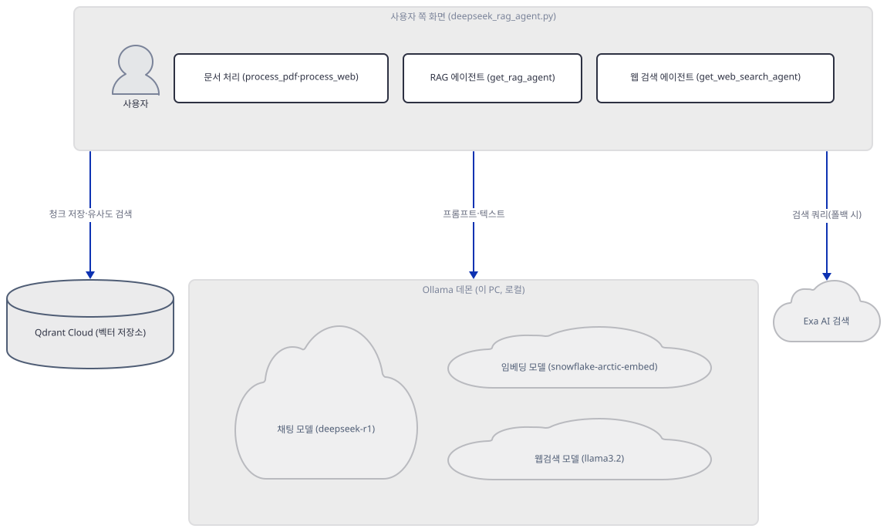
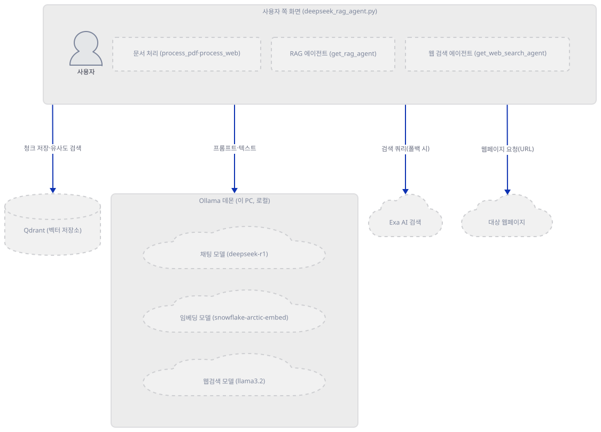
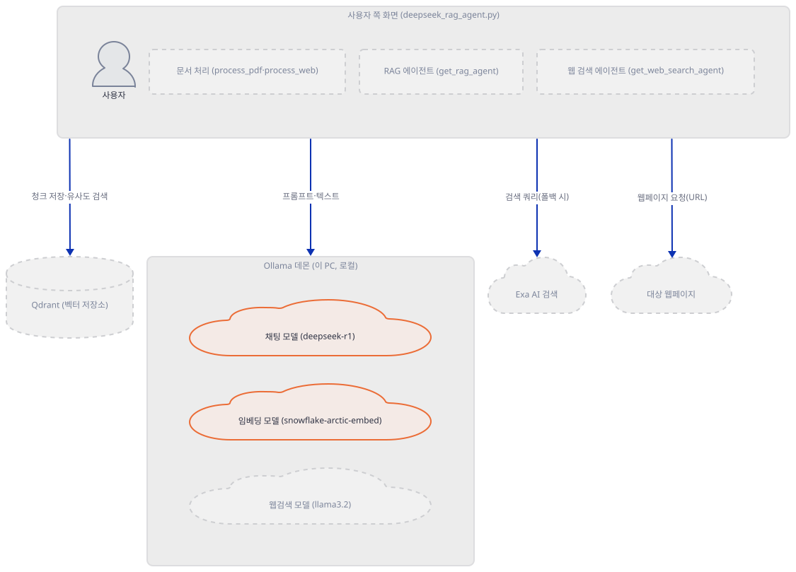
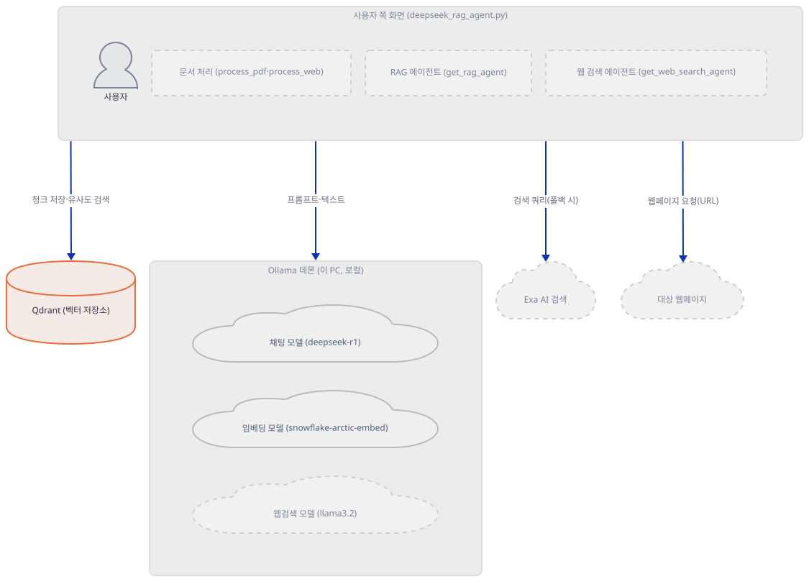
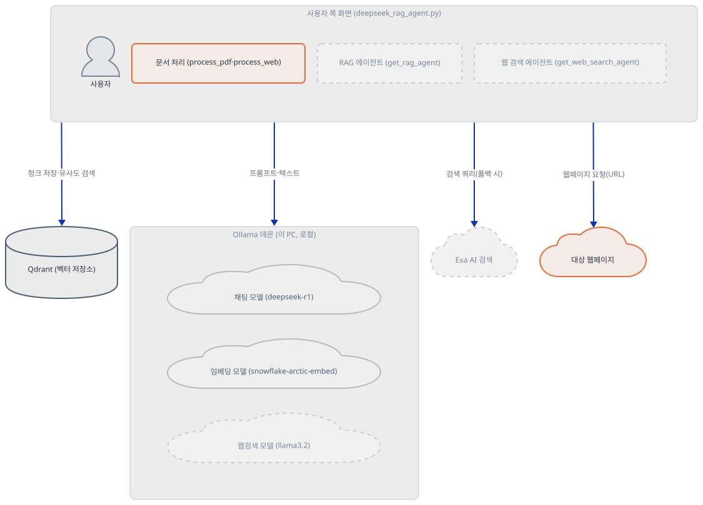
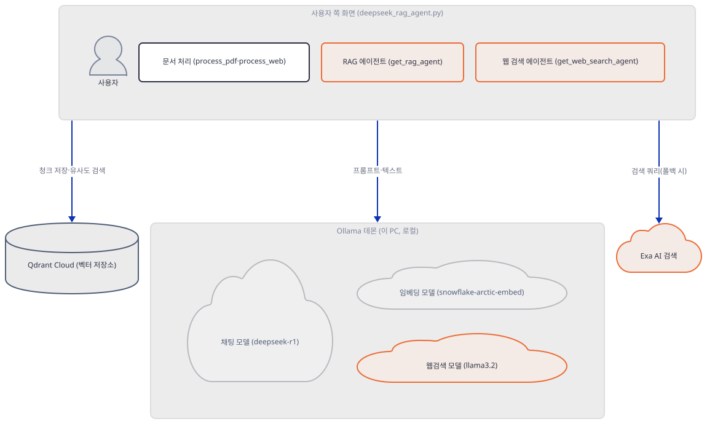
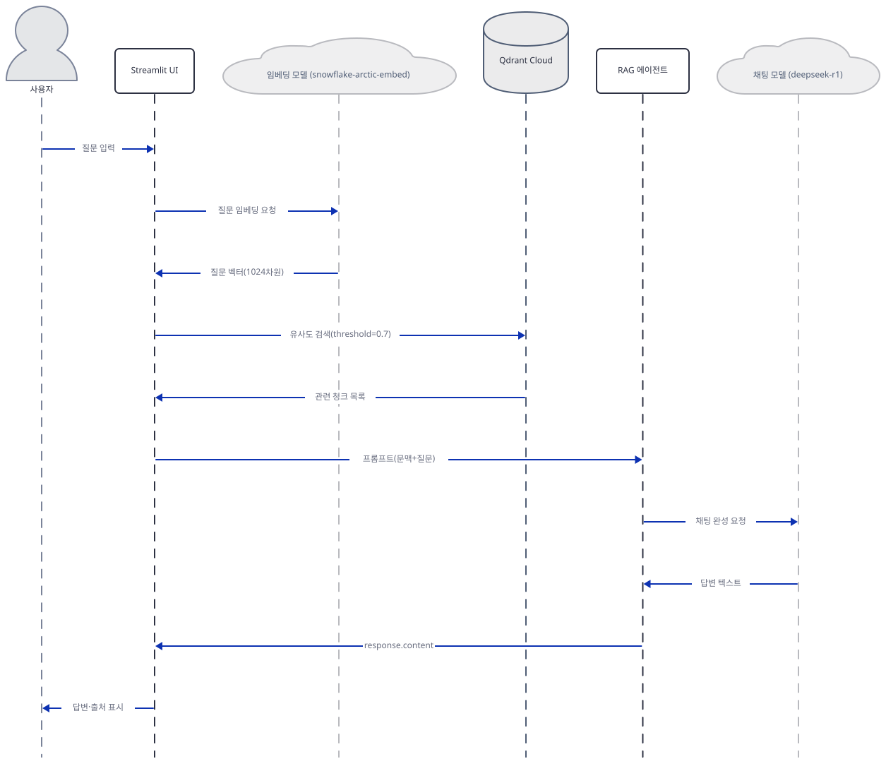

# Day 064 · 🐋 Deepseek Local RAG Agent

> 볼륨 5 📀 RAG · 난이도 ★★☆ · 예상 소요 90분(가짜 로컬 Ollama 서버·로컬 텔레메트리 수신기를 여러 스텝에서 새로 띄우고, `streamlit run`으로 앱을 실제로 기동해 헤드리스 옵션까지 확인하는 손 작업이 포함됩니다) · API 비용 대략 확인 불가(Qdrant Cloud·Exa AI 모두 가입이 필요한 관리형 서비스라 요금표를 확인하지 못했습니다 — 로컬 모델 추론 자체는 무료입니다) · 원본 앱: `rag_tutorials/deepseek_local_rag_agent`

## 오늘 만들 것

이 앱은 DeepSeek R1 추론 모델을 Ollama로 로컬 실행하면서 Qdrant 벡터 저장소와 Exa AI 웹 검색까지 얹은 526줄(마지막 줄에 개행이 없어 `wc -l`은 525로 세지만 편집기·GitHub에서는 526번째 줄까지 보입니다, 직접 확인) 단일 파일 Streamlit 앱입니다. 이름과 달리 "로컬"인 것은 모델 추론뿐입니다 — 기본 안내대로 하면입니다: 앱 자체 README와 사이드바의 URL 입력창 placeholder(`https://your-cluster.cloud.qdrant.io:6333`)는 Qdrant **Cloud**를 권하지만, 코드 자체(`QdrantClient(url=..., api_key=...)`)는 URL을 가리지 않습니다 — API 키를 켠 로컬 Qdrant도 같은 두 칸(URL·API Key)으로 그대로 씁니다(생성자까지 직접 확인, Step 3 — 서버 쪽 동작은 Qdrant 문서 기준). `requirements.txt` 8줄을 그대로 설치하면 6번째 줄의 `import bs4`부터 `ModuleNotFoundError`로 막힙니다 — `beautifulsoup4`가 8개 의존성 어디에도 없기 때문입니다(직접 확인, Step 1). 반대로 Day 047이 겪었던 `ImportError: openai not installed`는 이 앱에서는 일어나지 않습니다 — `exa-py`가 자체적으로 `openai>=1.48`을 요구해 함께 설치되기 때문입니다(직접 확인). 임베딩은 `agno`의 `OllamaEmbedder`를 LangChain의 `Embeddings` 인터페이스로 감싼 `OllamaEmbedderr`(오타가 아니라 실제 클래스 이름입니다) 클래스가 맡고, 기본값을 `snowflake-arctic-embed`/1024차원으로 명시적으로 고정합니다. 채팅 모델은 사이드바에서 `deepseek-r1:1.5b`·`:7b` 중 고르지만, 웹 검색 실패 시 쓰는 보조 에이전트는 `llama3.2`로 하드코딩돼 있어 고를 수 없습니다.

API 키도, 큰 로컬 모델 다운로드도 없이 확인하기 위해 이 문서는 실제 Ollama 데몬 대신 이 PC의 다른 포트에 가짜 로컬 서버를 띄워 채팅(`/api/chat`)·임베딩(`/api/embed`) 왕복을 실제로 재현합니다(Step 2·5). 이 가짜 서버로 `agent.run()`을 성공시키는 순간 agno 3.0.11이 `os-api.agno.com`으로 익명 실행 통계를 실제로 보내려 시도합니다(Day 047 Step 5와 같은 메커니즘, 네트워크를 막고 직접 확인, Step 2) — 이 문서는 그 시도를 차단한 채로 관찰했고, 재현하려면 `AGNO_TELEMETRY=false`로 끄는 것을 권합니다. 그 과정에서 흥미로운 사실 하나를 더 직접 확인했습니다 — 이 앱이 자랑하는 "Thinking process visualization" 기능(단순 모드에만 있는 기능입니다)은 지금 새로 설치되는 agno(3.0.11)에서는 절대 작동하지 않습니다. agno의 `Ollama` 모델이 `<think>` 태그를 응답 파싱 단계에서 이미 떼어 `reasoning_content`로 옮겨 버려서, 이 앱이 497~507행에서 다시 찾는 정규식이 항상 빈손을 짚기 때문입니다(Step 6에서 직접 재현). 완성하면 브라우저에는 문서 업로드 사이드바와 채팅창이 뜨고(Step 7에서 실제로 띄워 봅니다), 이 문서는 키가 없어 실제 Qdrant·Exa 호출은 하지 않고 로컬 스텁으로 배선만 확인합니다. 아래는 완성된 아키텍처입니다.



## 사전 준비

| 서비스/도구 | 용도 | 발급·설치 |
|---|---|---|
| Ollama | `deepseek-r1:1.5b`·`deepseek-r1:7b`(채팅, 택1) · `snowflake-arctic-embed`(임베딩) · `llama3.2`(웹 검색용 채팅) 네 모델을 서빙하는 로컬 데몬 | https://ollama.com 설치 후 `ollama pull deepseek-r1:1.5b`(또는 `:7b`)·`ollama pull snowflake-arctic-embed`·`ollama pull llama3.2` — 이 문서는 받지 않습니다(이 PC에는 대신 `deepseek-r1:8b`·`llama3.2`가 이미 있었고, `ollama list`로 확인만 했습니다) |
| Qdrant | RAG 모드의 벡터 저장소. 앱 안내는 Qdrant Cloud지만 코드는 URL을 가리지 않아 API 키를 켠 로컬 Qdrant도 됩니다(생성자까지 직접 확인, Step 3 — 서버 쪽 동작은 Qdrant 문서 기준) | Cloud: https://cloud.qdrant.io 가입 → 클러스터 생성 → API Key·URL 발급 / 로컬: `QDRANT__SERVICE__API_KEY`를 설정해 띄운 뒤 그 키와 `http://localhost:6333` 입력(이 문서는 키가 없어 어느 쪽도 실행하지 않습니다) |
| Exa AI (선택) | 사이드바의 "Enable Web Search Fallback"을 켰을 때만 필요 | https://exa.ai 가입 후 API Key 발급 |
| beautifulsoup4 | `requirements.txt`에 없지만 6행의 `import bs4`에 필요합니다(Step 1) | `uv pip install beautifulsoup4` 별도 설치 |
| uv | 가상환경 생성과 패키지 설치 | [공통 사전 준비](../README.md#공통-사전-준비-한-번만) 절 참고 |

## 아키텍처 한눈에 보기

| 컴포넌트 | 역할 | 코드 위치 |
|---|---|---|
| Streamlit 사이드바 | 모델·RAG 토글·키 입력 위젯 구성 | `rag_tutorials/deepseek_local_rag_agent/deepseek_rag_agent.py:71-143` |
| Streamlit 채팅 루프 | 업로드 처리·질의 응답 오케스트레이션(사이드바 아래, 파일 나머지 대부분) | `rag_tutorials/deepseek_local_rag_agent/deepseek_rag_agent.py:319-526` |
| 문서 처리 | PDF·웹페이지를 1000자 청크(겹침 200자)로 분할, 소스 메타데이터 부착 | `rag_tutorials/deepseek_local_rag_agent/deepseek_rag_agent.py:167-221` |
| 대상 웹페이지 | 사용자가 입력한 URL — `WebBaseLoader`가 매 처리마다 인터넷에서 새로 받아 옴 | `rag_tutorials/deepseek_local_rag_agent/deepseek_rag_agent.py:196-204` |
| RAG 에이전트 | 검색된 문맥(또는 웹 검색 결과)을 프롬프트에 담아 채팅 모델에 전달 | `rag_tutorials/deepseek_local_rag_agent/deepseek_rag_agent.py:279-301` |
| 웹 검색 에이전트 | Exa 도구를 쥔 별도 agno `Agent`, RAG 실패 시 폴백 | `rag_tutorials/deepseek_local_rag_agent/deepseek_rag_agent.py:259-276` |
| 채팅 모델 (deepseek-r1, Ollama, 로컬) | 최종 답변 생성, 사이드바에서 1.5b/7b 중 선택 | `rag_tutorials/deepseek_local_rag_agent/deepseek_rag_agent.py:283` |
| 임베딩 모델 (snowflake-arctic-embed, Ollama, 로컬) | 청크·질문 텍스트를 1024차원 벡터로 변환 | `rag_tutorials/deepseek_local_rag_agent/deepseek_rag_agent.py:19-33` |
| 웹검색 모델 (llama3.2, Ollama, 로컬) | 웹 검색 에이전트 전용 채팅 모델(선택 불가, 하드코딩) | `rag_tutorials/deepseek_local_rag_agent/deepseek_rag_agent.py:263` |
| Qdrant | 청크 벡터+원문을 저장하는 벡터 저장소, 컬렉션 `test-deepseek-r1`(URL은 로컬·Cloud 모두 가능, Step 3) | `rag_tutorials/deepseek_local_rag_agent/deepseek_rag_agent.py:146-163` |
| Exa AI 검색 | 관련 문서가 없을 때(또는 강제 토글 시) 웹 검색 수행 | `rag_tutorials/deepseek_local_rag_agent/deepseek_rag_agent.py:264-268` |

## 단계별 진행

### Step 1. 환경 만들기 — requirements.txt에 없는 bs4, 그리고 openai를 비껴간 이유

**목적.** 격리된 가상환경에 8줄짜리 `requirements.txt`를 설치하고, 오늘 실제로 풀리는 버전에서 10개 import가 정말 되는지 확인합니다.

**할 일.**

```bash
cd rag_tutorials/deepseek_local_rag_agent
uv venv
uv pip install -r requirements.txt
```

(pip 대안: `python -m venv .venv && source .venv/bin/activate && pip install -r requirements.txt`.) 이 저장소 루트에는 `pyproject.toml`이 있어 이후 `uv run` 명령에는 모두 `--no-project`를 붙입니다.

`rag_tutorials/deepseek_local_rag_agent/requirements.txt:1-8`

```text
agno>=2.2.10
pypdf
exa-py
qdrant-client==1.12.1
langchain-qdrant==0.2.0
langchain-community==0.3.13
streamlit==1.41.1
ollama
```

이 문서를 쓰며 설치했을 때는 **agno 3.0.11**, **exa-py 2.22.2**, **qdrant-client 1.12.1**(고정), **langchain-qdrant 0.2.0**(고정), **langchain-community 0.3.13**(고정), **streamlit 1.41.1**(고정), **ollama(파이썬 클라이언트) 0.6.2**, **pypdf 6.19.0**이 받아졌습니다(직접 확인, 2026-09-26 기준). 눈에 띄는 것은 **openai 3.19.2가 요청하지 않았는데도 자동으로 설치**됐다는 점입니다 — Day 047이 같은 `agno>=2.2.10` 하한에서 `ImportError: openai not installed`를 겪었던 것과 달리, 이 앱은 `exa-py`를 함께 쓰기 때문에 그 문제를 피해 갑니다.

```bash
uv run --no-project python -c "
import importlib.metadata as m
print('exa-py requires:')
for r in sorted(m.requires('exa-py') or []):
    print(' ', r)
"
```

직접 확인한 출력:

```
exa-py requires:
  httpcore (>=1.0.9)
  httpx (>=0.28.1)
  openai (>=1.48)
  pydantic (>=2.10.6)
  python-dotenv (>=1.0.1)
  requests (>=2.32.3)
  typing-extensions (>=4.12.2)
```

`py_compile`은 바로 통과합니다.

```bash
uv run --no-project python -m py_compile deepseek_rag_agent.py && echo compiled
```

```
compiled
```

하지만 파일을 실제로 import하면(예: `streamlit run`이 내부적으로 하는 것과 같은 동작) 6번째 줄에서 막힙니다.

`rag_tutorials/deepseek_local_rag_agent/deepseek_rag_agent.py:1-16`

```python
import os
import tempfile
from datetime import datetime
from typing import List
import streamlit as st
import bs4
from agno.agent import Agent
from agno.models.ollama import Ollama
from langchain_community.document_loaders import PyPDFLoader, WebBaseLoader
from langchain_text_splitters import RecursiveCharacterTextSplitter
from langchain_qdrant import QdrantVectorStore
from qdrant_client import QdrantClient
from qdrant_client.models import Distance, VectorParams
from langchain_core.embeddings import Embeddings
from agno.tools.exa import ExaTools
from agno.knowledge.embedder.ollama import OllamaEmbedder
```

```bash
uv run --no-project python -c "import bs4"
```

직접 확인한 출력(traceback 마지막 줄만):

```
ModuleNotFoundError: No module named 'bs4'
```

`beautifulsoup4`는 8개 의존성 중 어느 것도 전이 설치하지 않습니다 — `langchain-community` 0.3.13은 `Provides-Extra` 자체가 없고 `beautifulsoup4`를 어떤 형태로도 요구하지 않습니다(패키지 메타데이터로 직접 확인). `WebBaseLoader`가 내부적으로 이 패키지를 쓰지만 선언되지 않은 의존성이라 그렇습니다 — `agno`에도 `beautifulsoup4`가 있지만 이 앱이 쓰지 않는 `pages`·`website`라는 별도 extra 뒤에 있어(`beautifulsoup4; extra == "pages"`, 메타데이터로 직접 확인) 무관합니다. (참고로 1행의 `import os`는 파일 전체에서 실제로 한 번도 쓰이지 않는 죽은 import입니다 — 직접 확인.)

```bash
uv pip install beautifulsoup4
```

```bash
uv run --no-project python -c "
import bs4
from agno.agent import Agent
from agno.models.ollama import Ollama
from agno.tools.exa import ExaTools
from agno.knowledge.embedder.ollama import OllamaEmbedder
from langchain_community.document_loaders import PyPDFLoader, WebBaseLoader
from langchain_text_splitters import RecursiveCharacterTextSplitter
from langchain_qdrant import QdrantVectorStore
from qdrant_client import QdrantClient
from qdrant_client.models import Distance, VectorParams
from langchain_core.embeddings import Embeddings
print('ALL IMPORTS OK (bs4 included)')
"
```

**그림.**



**확인.** 위 설치까지 마치면(`bs4` 포함) 11개 import가 모두 성공합니다(직접 확인). `langchain_community`가 임포트되는 순간 stderr에 경고가 먼저 찍히고 그 뒤에 print 결과가 옵니다.

```
USER_AGENT environment variable not set, consider setting it to identify your requests.
ALL IMPORTS OK (bs4 included)
```

### Step 2. 두 얼굴의 Ollama — 채팅 모델 선택과 임베딩 클래스

**목적.** 사이드바가 만드는 `model_version` 값과, 임베딩을 LangChain 인터페이스로 감싸는 `OllamaEmbedderr` 클래스를 확인하고, 실제 모델을 내려받지 않고도 두 경로가 살아 있는지 가짜 로컬 서버로 검증합니다.

**할 일.**

`rag_tutorials/deepseek_local_rag_agent/deepseek_rag_agent.py:19-33`

```python
class OllamaEmbedderr(Embeddings):
    def __init__(self, model_name="snowflake-arctic-embed"):
        """
        Initialize the OllamaEmbedderr with a specific model.

        Args:
            model_name (str): The name of the model to use for embedding.
        """
        self.embedder = OllamaEmbedder(id=model_name, dimensions=1024)

    def embed_documents(self, texts: List[str]) -> List[List[float]]:
        return [self.embed_query(text) for text in texts]

    def embed_query(self, text: str) -> List[float]:
        return self.embedder.get_embedding(text)
```

`rag_tutorials/deepseek_local_rag_agent/deepseek_rag_agent.py:74-86`

```python
st.sidebar.header("📦 Model Selection")
model_help = """
- 1.5b: Lighter model, suitable for most laptops
- 7b: More capable but requires better GPU/RAM

Choose based on your hardware capabilities.
"""
st.session_state.model_version = st.sidebar.radio(
    "Select Model Version",
    options=["deepseek-r1:1.5b", "deepseek-r1:7b"],
    help=model_help
)
st.sidebar.info("Run ollama pull deepseek-r1:7b or deepseek-r1:1.5b respectively")
```

`OllamaEmbedderr`는 사이드바 어디에도 노출되지 않습니다 — 임베딩 모델은 `snowflake-arctic-embed`/1024차원으로 코드에 고정돼 있고, 바뀔 수 있는 것은 채팅 모델(`model_version`)뿐입니다. 이 둘이 실제로 어디로 요청을 보내는지 보려고, Ollama 데몬 대신 이 PC의 11499 포트에 두 엔드포인트(`/api/chat`, `/api/embed`)만 흉내 내는 가짜 서버를 띄웁니다.

```bash
cat > fake_ollama.py <<'PY'
import json
from http.server import BaseHTTPRequestHandler, ThreadingHTTPServer

class FakeOllama(BaseHTTPRequestHandler):
    def do_POST(self):
        n = int(self.headers.get("content-length", 0))
        json.loads(self.rfile.read(n) or b"{}")
        if self.path == "/api/chat":
            reply = {"message": {"role": "assistant", "content": "FAKE_OLLAMA_REPLY: 2+2=4"}, "done": True}
        else:
            reply = {"embeddings": [[0.001] * 1024]}
        data = json.dumps(reply).encode()
        self.send_response(200)
        self.send_header("Content-Type", "application/json")
        self.send_header("Content-Length", str(len(data)))
        self.end_headers()
        self.wfile.write(data)
    def log_message(self, *a):
        pass

ThreadingHTTPServer(("127.0.0.1", 11499), FakeOllama).serve_forever()
PY
uv run --no-project python fake_ollama.py &
```

`agno`가 감싸는 `ollama` 파이썬 클라이언트는 `host=`를 안 주면 `OLLAMA_HOST` 환경변수를 봅니다(소스로 확인, `ollama` 0.6.2의 `_client.py`). 이 변수 하나로 앱 코드를 고치지 않고도 가짜 서버로 돌립니다.

```bash
OLLAMA_HOST=http://127.0.0.1:11499 uv run --no-project python -c "
from agno.agent import Agent
from agno.models.ollama import Ollama
from agno.knowledge.embedder.ollama import OllamaEmbedder
agent = Agent(name='DeepSeek RAG Agent', model=Ollama(id='deepseek-r1:1.5b'))
resp = agent.run('What is 2+2?')
print('chat content:', resp.content)
vec = OllamaEmbedder(id='snowflake-arctic-embed', dimensions=1024).get_embedding('hello')
print('embedding length:', len(vec))
"
```

PowerShell: `$env:OLLAMA_HOST="http://127.0.0.1:11499"; uv run --no-project python -c "..."` (heredoc 대신 파일을 에디터로 저장하거나 `@'...'@ | Set-Content fake_ollama.py`를 씁니다.)

이 `agent.run()`이 성공하는 순간 agno 3.0.11은 `os-api.agno.com`에 익명 실행 통계 한 건을 더 보내려 합니다 — Day 047 Step 5가 이미 다룬 것과 같은 메커니즘·같은 opt-out(`AGNO_TELEMETRY`)입니다. 그 문서의 로컬 수신기 기법을 그대로 재사용해 오늘 버전에서도 여전한지 직접 확인합니다.

```bash
cat > sink.py <<'PY'
from http.server import BaseHTTPRequestHandler, ThreadingHTTPServer
class Sink(BaseHTTPRequestHandler):
    def do_POST(self):
        n = int(self.headers.get("content-length", 0))
        print(self.command, self.path, "\n", self.rfile.read(n).decode())
        self.send_response(200); self.end_headers()
    def log_message(self, *a): pass
ThreadingHTTPServer(("127.0.0.1", 7070), Sink).serve_forever()
PY
uv run --no-project python sink.py &
```

PowerShell: heredoc 대신 파일을 에디터로 저장하거나 `@'...'@ | Set-Content sink.py`를 쓰고, 백그라운드 실행은 `Start-Process -NoNewWindow uv -ArgumentList 'run','--no-project','python','sink.py'`로 대신합니다.

다른 터미널에서 `AGNO_API_RUNTIME=dev`로 통계 주소를 `os-api.agno.com` 대신 이 수신기(`http://localhost:7070`)로 돌린 채, 위 채팅 명령을 그대로 다시 실행합니다.

```bash
AGNO_API_RUNTIME=dev OLLAMA_HOST=http://127.0.0.1:11499 uv run --no-project python -c "
from agno.agent import Agent
from agno.models.ollama import Ollama
agent = Agent(name='DeepSeek RAG Agent', model=Ollama(id='deepseek-r1:1.5b'))
resp = agent.run('What is 2+2?')
print('chat content:', resp.content)
import time; time.sleep(2)
"
```

PowerShell: `$env:AGNO_API_RUNTIME="dev"; $env:OLLAMA_HOST="http://127.0.0.1:11499"; uv run --no-project python -c "..."`

직접 확인한 출력(수신기 쪽, 실제 요청은 이 컴퓨터를 벗어나지 않습니다):

```
POST /telemetry/runs
 {"session_id":"...","run_id":"...","data":{"agent_id":"deepseek-rag-agent","model_provider":"Ollama","model_id":"deepseek-r1:1.5b","has_tools":true,...},"sdk_version":"3.0.11","type":"agent"}
```

`AGNO_TELEMETRY=false`(PowerShell `$env:AGNO_TELEMETRY="false"`)를 같은 명령에 더하면 수신기에 아무것도 도착하지 않습니다(직접 확인).

**그림.**



**확인.** 직접 확인한 출력(실제 모델도, 실제 Ollama 데몬도 쓰지 않습니다):

```
chat content: FAKE_OLLAMA_REPLY: 2+2=4
embedding length: 1024
```

### Step 3. Qdrant 벡터 저장소 — URL은 코드가 가리지 않는다

**목적.** `init_qdrant`·`create_vector_store`가 URL을 실제로 가리는지(Cloud냐 로컬이냐), 키가 없을 때 어떻게 조용히 실패하는지, 그리고 `check_document_relevance`가 죽은 코드라는 것을 확인합니다.

**할 일.**

`rag_tutorials/deepseek_local_rag_agent/deepseek_rag_agent.py:146-163`

```python
def init_qdrant() -> QdrantClient | None:
    """Initialize Qdrant client with configured settings.

    Returns:
        QdrantClient: The initialized Qdrant client if successful.
        None: If the initialization fails.
    """
    if not all([st.session_state.qdrant_api_key, st.session_state.qdrant_url]):
        return None
    try:
        return QdrantClient(
            url=st.session_state.qdrant_url,
            api_key=st.session_state.qdrant_api_key,
            timeout=60
        )
    except Exception as e:
        st.error(f"🔴 Qdrant connection failed: {str(e)}")
        return None
```

`rag_tutorials/deepseek_local_rag_agent/deepseek_rag_agent.py:36-37`

```python
# Constants
COLLECTION_NAME = "test-deepseek-r1"
```

`init_qdrant()`는 `url`·`api_key` 두 칸이 비어 있는지만 볼 뿐, URL이 `cloud.qdrant.io`인지 `localhost`인지는 전혀 가리지 않습니다 — 앱 자체 README와 사이드바 URL 입력창의 placeholder(`https://your-cluster.cloud.qdrant.io:6333`)가 Qdrant Cloud를 권할 뿐입니다. API 키를 켠 로컬 Qdrant(`QDRANT__SERVICE__API_KEY` 환경변수)도 같은 두 칸으로 그대로 씁니다 — `qdrant-client` 1.12.1은 `http://`(비보안) 접속에 키를 실으면 경고만 내고 그대로 만듭니다.

```bash
uv run --no-project python -c "
import warnings
from qdrant_client import QdrantClient
with warnings.catch_warnings(record=True) as w:
    warnings.simplefilter('always')
    c = QdrantClient(url='http://localhost:6333', api_key='any-local-key', timeout=60)
    print('constructed:', type(c).__name__)
    for x in w:
        print('warning:', x.category.__name__, str(x.message))
"
```

직접 확인한 출력(로컬 Qdrant 서버는 띄우지 않았고, 생성자만 호출했습니다 — 네트워크 요청 없음):

```
constructed: QdrantClient
warning: UserWarning Api key is used with an insecure connection.
```

`create_vector_store`(225-257행)는 컬렉션이 이미 있으면 나는 예외를 **문자열 매칭**으로 구분합니다 — `if "already exists" not in str(e).lower(): raise e`. Qdrant 서버가 실제로 그 문구를 쓰는 한에서만 통하는 다소 위태로운 패턴입니다(소스로 확인). 이 문서는 Qdrant 키가 없어 이 함수까지 실행하지 않지만, `init_qdrant()`가 키 없이 예외 없이 `None`을 돌려준다는 것은 Step 7의 전체 부팅 확인에서 다시 나옵니다.

한편 306~316행의 `check_document_relevance`는 정의만 되고 실제 호출부가 없습니다 — 실제 유사도 검색은 393~405행(Step 5)에서 같은 로직을 다시 인라인으로 씁니다.

```bash
grep -n "check_document_relevance" deepseek_rag_agent.py
```

직접 확인한 출력(정의 한 줄뿐, 호출은 없음):

```
306:def check_document_relevance(query: str, vector_store, threshold: float = 0.7) -> tuple[bool, List]:
```

**그림.**



**확인.** 키 없이 전체 화면을 `AppTest`로 띄우면 `init_qdrant()`가 조용히 `None`을 반환해 예외가 나지 않습니다(Step 7에서 전체 목록을 확인합니다). 아래 코드를 `uv run --no-project python -c "..."`로 실행합니다.

```python
from streamlit.testing.v1 import AppTest
at = AppTest.from_file('deepseek_rag_agent.py')
at.run(timeout=30)
print('exception:', list(at.exception))
```

```
exception: []
```

### Step 4. 문서 업로드와 청크화 — 그리고 지워지지 않는 임시 파일

**목적.** PDF·URL이 1000자/겹침 200자 청크가 되는 과정과, `WebBaseLoader`의 클래스 필터가 실제로 무엇을 제한하는지 확인합니다.

**할 일.**

`rag_tutorials/deepseek_local_rag_agent/deepseek_rag_agent.py:167-190`

```python
def process_pdf(file) -> List:
    """Process PDF file and add source metadata."""
    try:
        with tempfile.NamedTemporaryFile(delete=False, suffix='.pdf') as tmp_file:
            tmp_file.write(file.getvalue())
            loader = PyPDFLoader(tmp_file.name)
            documents = loader.load()
            
            # Add source metadata
            for doc in documents:
                doc.metadata.update({
                    "source_type": "pdf",
                    "file_name": file.name,
                    "timestamp": datetime.now().isoformat()
                })
                
            text_splitter = RecursiveCharacterTextSplitter(
                chunk_size=1000,
                chunk_overlap=200
            )
            return text_splitter.split_documents(documents)
    except Exception as e:
        st.error(f"📄 PDF processing error: {str(e)}")
        return []
```

`rag_tutorials/deepseek_local_rag_agent/deepseek_rag_agent.py:196-203`

```python
        loader = WebBaseLoader(
            web_paths=(url,),
            bs_kwargs=dict(
                parse_only=bs4.SoupStrainer(
                    class_=("post-content", "post-title", "post-header", "content", "main")
                )
            )
        )
```

`class_=(...)`는 이 다섯 CSS 클래스를 가진 태그만 남기고 나머지는 버립니다 — 블로그 플랫폼(Substack 등)에는 맞지만, 이 클래스명이 없는 일반 사이트에서는 본문이 통째로 걸러져 빈 문서가 될 수 있습니다(소스로 확인). `WebBaseLoader`는 처리할 때마다 그 URL을 인터넷에서 새로 받아 옵니다 — 그림의 "대상 웹페이지"가 이 외부 호출입니다. `process_pdf`는 업로드된 PDF를 `tempfile.NamedTemporaryFile(delete=False, ...)`로 디스크에 쓰는데, `delete=False`이면 `with` 블록이 끝나도 파일이 지워지지 않고, 이 함수 어디에도 이후 `os.remove`가 없습니다(직접 확인) — 업로드할 때마다 임시 파일이 하나씩 쌓입니다.

```bash
uv run --no-project python -c "
import tempfile, os
with tempfile.NamedTemporaryFile(delete=False, suffix='.pdf') as tmp_file:
    tmp_file.write(b'%PDF-1.4 fake content')
    path = tmp_file.name
print('exists right after the with-block exits:', os.path.exists(path))
os.remove(path)
"
```

**그림.**



**확인.** 직접 확인한 출력(같은 `delete=False` 패턴을 재현):

```
exists right after the with-block exits: True
```

### Step 5. 질의 처리 — 유사도 검색과 웹 검색 폴백의 순서

**목적.** 질문이 Qdrant 검색 → (조건부) Exa 웹 검색 → 채팅 모델 순으로 흐르는 정확한 조건을 확인하고, 가짜 로컬 서버로 전체 왕복을 재현합니다.

**할 일.**

`rag_tutorials/deepseek_local_rag_agent/deepseek_rag_agent.py:393-405`

```python
            if not st.session_state.force_web_search and st.session_state.vector_store:
                # Try document search first
                retriever = st.session_state.vector_store.as_retriever(
                    search_type="similarity_score_threshold",
                    search_kwargs={
                        "k": 5, 
                        "score_threshold": st.session_state.similarity_threshold
                    }
                )
                docs = retriever.invoke(rewritten_query)
                if docs:
                    context = "\n\n".join([d.page_content for d in docs])
                    st.info(f"📊 Found {len(docs)} relevant documents (similarity > {st.session_state.similarity_threshold})")
```

`rag_tutorials/deepseek_local_rag_agent/deepseek_rag_agent.py:409-424`

```python
            # Step 3: Use web search if:
            # 1. Web search is forced ON via toggle, or
            # 2. No relevant documents found AND web search is enabled in settings
            if (st.session_state.force_web_search or not context) and st.session_state.use_web_search and st.session_state.exa_api_key:
                with st.spinner("🔍 Searching the web..."):
                    try:
                        web_search_agent = get_web_search_agent()
                        web_results = web_search_agent.run(rewritten_query).content
                        if web_results:
                            context = f"Web Search Results:\n{web_results}"
                            if st.session_state.force_web_search:
                                st.info("ℹ️ Using web search as requested via toggle.")
                            else:
                                st.info("ℹ️ Using web search as fallback since no relevant documents were found.")
                    except Exception as e:
                        st.error(f"❌ Web search error: {str(e)}")
```

웹 검색은 `force_web_search` 토글이 켜져 있거나 문맥이 비어 있을 때, **그리고** `use_web_search`가 켜져 있고 `exa_api_key`가 있을 때만 실행됩니다 — 셋 중 하나라도 빠지면 조용히 건너뜁니다. `vector_store`가 아예 없으면(이 문서처럼 Qdrant 키가 없으면) 검색 자체를 시도하지 않고 바로 이 조건으로 넘어갑니다. `OLLAMA_HOST`를 Step 2의 가짜 서버로 돌린 채 `AppTest`로 전체 채팅 한 턴을 재현합니다. `get_rag_agent()`가 `debug_mode=True`로 에이전트를 만들기 때문에(279-301행) 실제 실행에는 아래 출력 앞뒤로 agno의 DEBUG 줄이 30여 개 더 찍힙니다 — 여기서는 생략합니다. `uv run --no-project python -c "..."`로 실행합니다.

```python
import os
os.environ["OLLAMA_HOST"] = "http://127.0.0.1:11499"
from streamlit.testing.v1 import AppTest
at = AppTest.from_file('deepseek_rag_agent.py')
at.run(timeout=30)
at.chat_input[0].set_value("What is 2+2?").run(timeout=30)
print('exception:', list(at.exception))
print('info banners:', [i.value for i in at.info])
for m in at.chat_message:
    print(' -', m.name, [w.value for w in m.markdown])
```

**그림.**



**확인.** 직접 확인한 출력(`vector_store`가 없어 "관련 정보 없음" 안내 후 채팅 모델로 바로 감, DEBUG 줄 생략):

```
exception: []
info banners: ['ℹ️ No relevant information found in documents or web search.', 'Run ollama pull deepseek-r1:7b or deepseek-r1:1.5b respectively']
 - user ['What is 2+2?']
 - assistant ['FAKE_OLLAMA_REPLY: 2+2=4']
```

### Step 6. "생각 과정 시각화"가 사라진 이유 — agno가 먼저 태그를 떼어 간다

**목적.** 단순 모드(RAG를 끈 상태)에만 있는 `<think>` 정규식 분리가 지금 agno에서 왜 한 번도 매치되지 않는지, 그 텍스트가 실제로 어디로 가는지 확인합니다. RAG 모드는 이 분리 코드 자체가 없어 처음부터 대상이 아닙니다.

**할 일.**

`rag_tutorials/deepseek_local_rag_agent/deepseek_rag_agent.py:497-507`

```python
                # Extract thinking process and final response
                import re
                think_pattern = r'<think>(.*?)</think>'
                think_match = re.search(think_pattern, response_content, re.DOTALL)
                
                if think_match:
                    thinking_process = think_match.group(1).strip()
                    final_response = re.sub(think_pattern, '', response_content, flags=re.DOTALL).strip()
                else:
                    thinking_process = None
                    final_response = response_content
```

agno 3.0.11의 `Ollama` 모델(`_parse_provider_response` 메서드, 소스로 확인)은 응답에 `<think>`가 있으면 **모델 호출 직후** `extract_thinking_content()`로 그 블록을 떼어 `response.reasoning_content`에 옮기고, `response.content`에는 `</think>` 뒤에 남은 텍스트만 남깁니다. 즉 이 앱의 코드가 497행에 도달했을 때는 `response_content`에 `<think>` 자체가 이미 없어서, `think_match`는 항상 `None`이고 "🤔 See thinking process" 확장 패널은 **단순 모드에서도 한 번도 나타나지 않습니다**(RAG 모드는 이 코드 경로 자체가 없어 애초에 대상이 아닙니다 — RAG 모드에서 `AppTest`가 보여주는 확장 패널은 검색 전 질문을 보여주는 `Evaluating the query`뿐입니다, Step 5와 같은 방식으로 직접 확인). 텍스트가 사라지는 것은 아니고 `reasoning_content`에 남아 있지만, 이 앱은 그 필드를 어디서도 읽지 않습니다.

이 확인이 증명하는 것은 정확히 "`<think>` 태그가 `content`에 **섞여 오면** agno가 뗀다"까지입니다 — 실제 agno가 Ollama에 보내는 요청에는 `think` 관련 키가 없고(가짜 서버가 받는 것은 `messages`·`model`·`stream`·`tools`뿐, 직접 확인), 이 PC의 실제 Ollama(0.34.2)가 최근 모델처럼 사고 과정을 `message.thinking`이라는 **별도 필드**로 돌려준다면 `_parse_provider_response`에는 그 키를 읽는 코드가 아예 없습니다(`grep -n "thinking" agno/models/ollama/chat.py`로 직접 확인 — `<think>` 태그 처리 세 줄 외에는 없음). 그런 모델이라면 패널이 안 뜨는 것은 같지만 `reasoning_content`도 비어, 더 해보기 1이 보여줄 것이 없습니다 — **실제 DeepSeek 모델로는 확인하지 못했습니다.**

Step 2의 `fake_ollama.py`를 아래처럼 바꿔 `<think>` 블록이 섞인 응답을 흉내 냅니다(`/api/chat` 분기의 `reply`만 교체).

```python
if self.path == "/api/chat":
    reply = {"message": {"role": "assistant", "content": "<think>2+2 is basic addition, sum is 4</think>The answer is 4."}, "done": True}
```

```bash
OLLAMA_HOST=http://127.0.0.1:11499 uv run --no-project python -c "
from agno.agent import Agent
from agno.models.ollama import Ollama
agent = Agent(name='t', model=Ollama(id='deepseek-r1:1.5b'))
resp = agent.run('What is 2+2?')
print('content:', repr(resp.content))
print('reasoning_content:', repr(getattr(resp, 'reasoning_content', 'NO ATTR')))
"
```

PowerShell: `$env:OLLAMA_HOST="http://127.0.0.1:11499"; uv run --no-project python -c "..."`

**그림.**


**확인.** 직접 확인한 출력(위처럼 바꾼 `fake_ollama.py`로):

```
content: 'The answer is 4.'
reasoning_content: '2+2 is basic addition, sum is 4'
```

### Step 7. 실행 확인 — 앱을 직접 띄우고, 키 없이 어디까지 뜨는가

**목적.** `streamlit run`으로 앱을 실제로 띄워 화면이 뜨는지, 그리고 `AppTest`로 idle 화면의 안내문이 실제로 RAG 모드 상태와 무관하다는 것을 확인합니다.

**할 일.**

```bash
uv run --no-project streamlit run deepseek_rag_agent.py --server.headless true --server.address localhost --browser.gatherUsageStats false
```

PowerShell도 같은 명령입니다. `--server.headless true`만 주면 Streamlit 1.41.1은 외부 IP를 알아내려고 `http://checkip.amazonaws.com`·`https://checkip.amazonaws.com`에 실제로 접속을 시도합니다(`streamlit/web/bootstrap.py`의 `net_util.get_external_ip()`, Day 054가 이미 다룬 사실과 같음) — 네트워크를 막고 직접 확인하면 이 둘과 내부 IP를 추정하는 UDP `connect(8.8.8.8, 1)`까지 차단 로그에 남습니다. `--server.address localhost`를 더하면 그 분기 자체를 타지 않아(소스로 확인) 같은 조건에서 차단 시도가 0건이 되고, 콘솔도 "Collecting usage statistics" 안내 없이 깔끔해집니다(`--browser.gatherUsageStats false`, 직접 확인). 뜬 뒤 확인:

```bash
curl -s -o /dev/null -w "%{http_code}\n" http://localhost:8501/
```

직접 확인한 출력(포트는 예시 — 실행 로그에 찍히는 실제 포트를 씁니다):

```
200
```

브라우저로 열면 제목 "🐋 Deepseek Local RAG Reasoning Agent", 사이드바의 모델 라디오(`deepseek-r1:1.5b`/`:7b`)와 켜진 "Enable RAG Mode" 토글이 보입니다 — 정확한 위젯 목록은 아래 `AppTest` 결과와 같습니다. 확인이 끝나면 Ctrl+C로 끕니다.

이어서 `rag_tutorials/deepseek_local_rag_agent/deepseek_rag_agent.py:90`, `rag_tutorials/deepseek_local_rag_agent/deepseek_rag_agent.py:371-376`, `rag_tutorials/deepseek_local_rag_agent/deepseek_rag_agent.py:525-526`

```python
st.session_state.rag_enabled = st.sidebar.toggle("Enable RAG Mode", value=st.session_state.rag_enabled)
```

```python
if prompt:
    # Add user message to history
    st.session_state.history.append({"role": "user", "content": prompt})
    with st.chat_message("user"):
        st.write(prompt)
```

```python
else:
    st.warning("You can directly talk to r1 locally! Toggle the RAG mode to upload documents!")
```

마지막 `else`는 `rag_enabled`가 아니라 **`if prompt:`**(371행)에 걸려 있습니다 — 즉 질문을 아직 입력하지 않은 첫 화면에서는 RAG 모드가 켜져 있든(기본값) 꺼져 있든 항상 이 문구가 뜹니다. "RAG 모드를 켜서 업로드하라"는 문구인데, 정작 RAG 모드는 이미 켜져 있고 업로드 UI도 사이드바에 이미 떠 있는 상태에서도 나타납니다.

```bash
PYTHONIOENCODING=utf-8 uv run --no-project python -c "
from streamlit.testing.v1 import AppTest
at = AppTest.from_file('deepseek_rag_agent.py')
at.run(timeout=30)
print('exception:', list(at.exception))
print('sidebar toggle:', [(t.label, t.value) for t in at.sidebar.toggle])
print('warnings:', [w.value for w in at.warning])
print('chat_input placeholder:', [c.placeholder for c in at.chat_input])
"
```

PowerShell: `$env:PYTHONIOENCODING="utf-8"; uv run --no-project python -c "..."`

**그림.**


**확인.** 직접 확인한 출력:

```
exception: []
sidebar toggle: [('Enable RAG Mode', True)]
warnings: ['You can directly talk to r1 locally! Toggle the RAG mode to upload documents!']
chat_input placeholder: ['Ask about your documents...']
```

## 요청 한 건이 흐르는 과정



사용자가 채팅창에 질문을 입력하면, Streamlit UI는 먼저 임베딩 모델에 질문 임베딩을 요청해 1024차원 벡터를 받고, 그 벡터로 Qdrant에 유사도 검색(`threshold=0.7`)을 보내 관련 청크 목록을 돌려받습니다. 이 결과를 문맥으로 묶은 프롬프트를 RAG 에이전트에 넘기면, 에이전트는 채팅 모델(`deepseek-r1`)에 완성을 요청하고 받은 답변 텍스트를 그대로 UI에 돌려주며, UI는 답변과 (있다면) 출처를 화면에 표시합니다. 이 그림은 Qdrant가 관련 문서를 찾은 경우를 그린 것입니다 — 문서가 없으면 Step 5에서 본 대로 Exa 웹 검색으로 갈라지거나, 그마저 없으면 문맥 없이 곧바로 채팅 모델로 갑니다. 그림에는 없지만, 채팅 모델 호출이 성공할 때마다 agno의 익명 실행 통계 한 건이 이 흐름과 별도로 `os-api.agno.com`을 향합니다(Step 2, Day 047 Step 5).

## 실행 체크리스트

- [ ] `uv venv && uv pip install -r requirements.txt`만으로는 6행의 `import bs4`에서 실패하고, `beautifulsoup4`를 따로 설치해야 한다는 것을 확인했다
- [ ] `exa-py`가 `openai`를 함께 설치해 Day 047의 `ImportError`를 이 앱은 겪지 않는다는 것을 `importlib.metadata`로 확인했다
- [ ] 채팅 모델 호출이 성공할 때마다 agno가 `os-api.agno.com`에 익명 실행 통계를 보내려 한다는 것을 로컬 수신기로 직접 확인했다(Day 047 Step 5와 같은 메커니즘, `AGNO_TELEMETRY=false`로 끔)
- [ ] `init_qdrant()`가 URL을 가리지 않아 API 키를 켠 로컬 Qdrant도 되고, 키가 없으면 예외 없이 `None`을 반환한다는 것을 확인했다
- [ ] `check_document_relevance`가 정의만 되고 실제 호출부는 없다는 것을 grep으로 확인했다
- [ ] 가짜 로컬 Ollama 서버로 채팅(`/api/chat`)과 임베딩(`/api/embed`) 왕복이 실제로 되는 것을 확인했다(모델 다운로드 없이)
- [ ] agno가 `<think>` 태그를 자동으로 떼어 `reasoning_content`에 저장하며, 단순 모드에만 있는 이 앱의 정규식 분리는 더 이상 매치되지 않는다는 것을 확인했다(RAG 모드는 이 코드 자체가 없음)
- [ ] `streamlit run`으로 앱을 실제로 띄워 화면이 뜨는 것을 확인했고, `--server.headless true`만 주면 외부 IP 조회가 나가지만 `--server.address localhost`로 막을 수 있다는 것을 확인했다
- [ ] idle 화면의 경고문이 RAG 모드 토글 상태와 무관하게 항상 뜬다는 것을 `AppTest`로 확인했다
- [ ] `process_pdf`가 만드는 임시 PDF 파일이 `delete=False`로 인해 정리되지 않는다는 것을 확인했다

## 문제 해결

| 증상 | 원인 | 해결 |
|---|---|---|
| `streamlit run deepseek_rag_agent.py` 실행 즉시 `ModuleNotFoundError: No module named 'bs4'` | `requirements.txt`에 `beautifulsoup4`가 빠져 있고, 8개 의존성 중 어느 것도 이를 전이 설치하지 않음(직접 확인) | `uv pip install beautifulsoup4` 별도 설치 |
| `--server.headless true`만 주고 띄우면 `~/.streamlit/credentials.toml`이 없는 한 연결 여부와 무관하게 "Collecting usage statistics"가 먼저 뜨고, 이어서 인터넷에 연결된 평범한 환경에서는 콘솔에 "External URL: http://<공인 IP>:8501"이, 오프라인이거나 네트워크를 막았을 때는 "Did not auto detect external IP"가 뜨고 잠깐 멈춤 | "Collecting usage statistics"는 헤드리스 기동이 자격 파일 없이 뜰 때 찍는 안내로 연결 상태를 보지 않음(Streamlit 1.41.1 `streamlit/runtime/credentials.py`의 `check_credentials()`, 소스로 확인) — 그 뒤 외부 IP 줄은 별개로 헤드리스 기동이 `checkip.amazonaws.com`으로 외부 IP를 조회하기 때문(Day 054와 같은 사실, 직접 확인) | `--server.address localhost --browser.gatherUsageStats false`를 함께 줌(Step 7) |
| 종료 직후 `DEBUG Could not send telemetry event to /telemetry/runs: ConnectError`가 보임(오프라인일 때) | `agent.run()`이 성공할 때마다 agno가 `os-api.agno.com`에 실행 통계를 보내려 시도함(직접 확인, Step 2) | 응답 자체는 느려지지 않음(백그라운드 스레드) — 시도 자체를 끄려면 `AGNO_TELEMETRY=false` |
| RAG 모드를 켠 채 질문해도 항상 "관련 문서가 없다"는 안내만 나옴, 또는 PDF·URL을 올려도 아무 메시지 없이 조용함 | Qdrant API Key·URL을 넣지 않으면 `init_qdrant()`가 `None`을 반환하고(153-154행), 이후 업로드 처리의 `if texts and qdrant_client:`(342·354행)가 거짓이 되어 문서 처리 성공 여부와 무관하게 저장을 건너뜀 — 성공해도 실패해도 메시지가 없음(소스로 확인) | 사이드바에 URL·API Key를 입력하고(로컬 Qdrant도 키를 설정하면 됨, Step 3) **그 뒤에 PDF나 URL을 다시 올려 실제로 처리시켜야** `vector_store`가 생김 |
| RAG 모드를 켰는데도 채팅창 위 안내문이 "RAG 모드를 켜서 업로드하라"고 말함 | 525-526행의 `else`가 `rag_enabled`가 아니라 `if prompt:`에 걸려 있어, 질문을 아직 입력하지 않은 첫 화면에서 RAG 모드 상태와 무관하게 항상 뜸(직접 확인) | 리포 코드는 고치지 않는 것이 이 시리즈의 방침 — 문구를 무시하고 사이드바 토글 상태로 판단 |
| "🤔 See thinking process" 확장 패널이 한 번도 나타나지 않음(단순 모드) | 설치되는 agno(3.0.11)가 `<think>` 태그를 응답 파싱 단계에서 이미 떼어 `reasoning_content`로 옮기므로, 이 앱이 497행 근처에서 다시 찾는 `<think>` 태그가 `response.content`에 남아 있지 않음(직접 확인) | 코드는 고치지 않음 — `response.reasoning_content`를 직접 출력해보기(더 해보기 참고) |
| PDF를 여러 번 업로드하면 임시 파일이 계속 쌓임 | `process_pdf`의 `tempfile.NamedTemporaryFile(delete=False, ...)`가 만든 파일을 이후 어디서도 지우지 않음(직접 확인) | 리포 코드는 고치지 않음 — 필요하면 OS 임시 폴더를 주기적으로 비우기 |

## 더 해보기

- `get_rag_agent()`가 돌려주는 `response.reasoning_content`(Step 6 참고)를 화면에 다시 붙여 보기 — 실제 `deepseek-r1`을 받아 시험해야 확인되고(이 문서는 하지 않음), 모델이 `<think>` 태그 대신 별도 `thinking` 필드로 응답하면 이 필드는 비어 있을 수 있다(Step 6)
- `check_document_relevance()`(`rag_tutorials/deepseek_local_rag_agent/deepseek_rag_agent.py:306-316`)를 인라인 검색(`rag_tutorials/deepseek_local_rag_agent/deepseek_rag_agent.py:393-405`) 대신 실제로 호출하도록 바꿔, 동작이 지금과 같은지 확인해보기
- `similarity_threshold` 슬라이더(`rag_tutorials/deepseek_local_rag_agent/deepseek_rag_agent.py:110-117`)를 0.0까지 낮췄을 때 실제 Qdrant Cloud 클러스터로 항상 문서가 "발견"되는지 확인해보기

## 다음 날 예고

[Day 065 · 🖼️ Vision RAG](../day065-vision-rag/README.md) — Cohere Embed-4로 이미지·PDF 페이지를 직접 임베딩하고 Google Gemini 2.5 Flash로 답하는, OCR 없는 멀티모달 RAG를 다룹니다.
