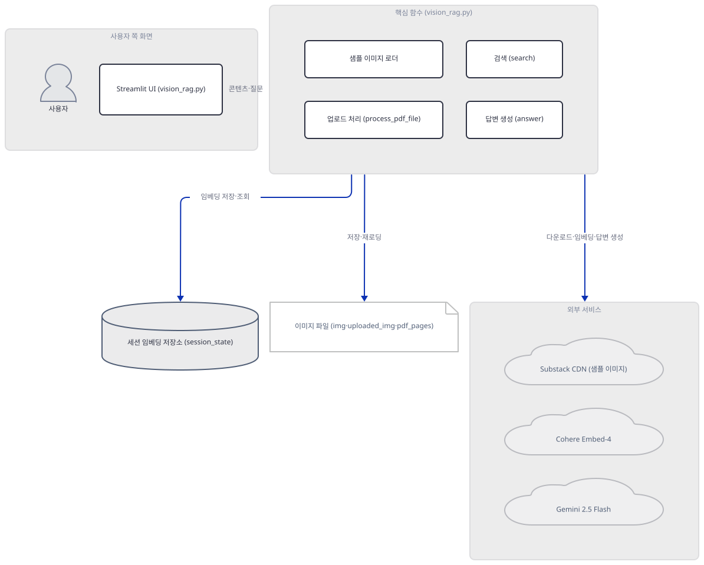
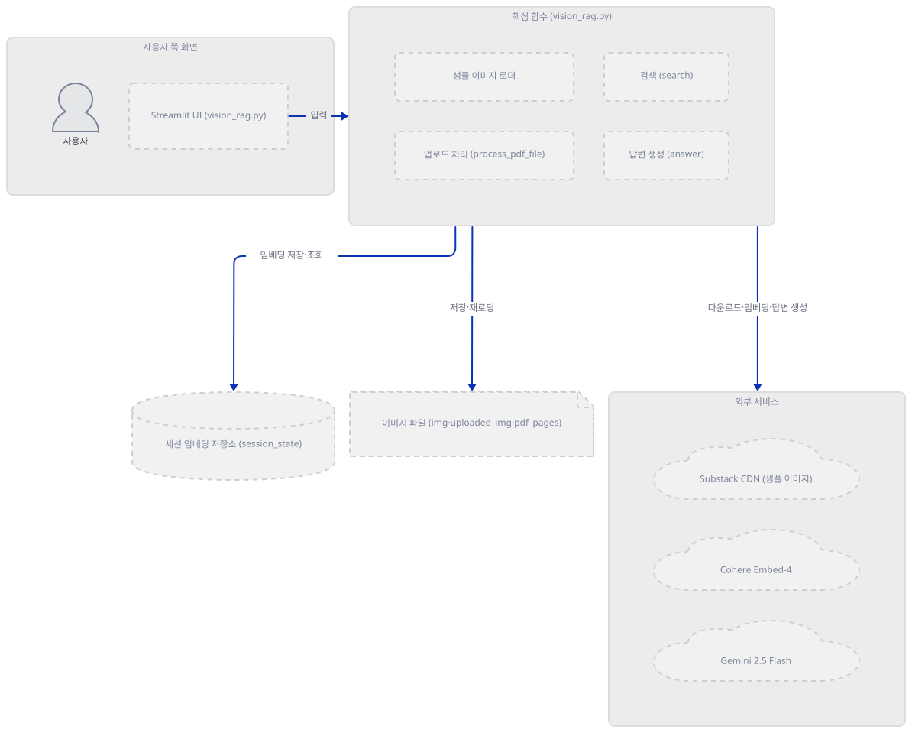
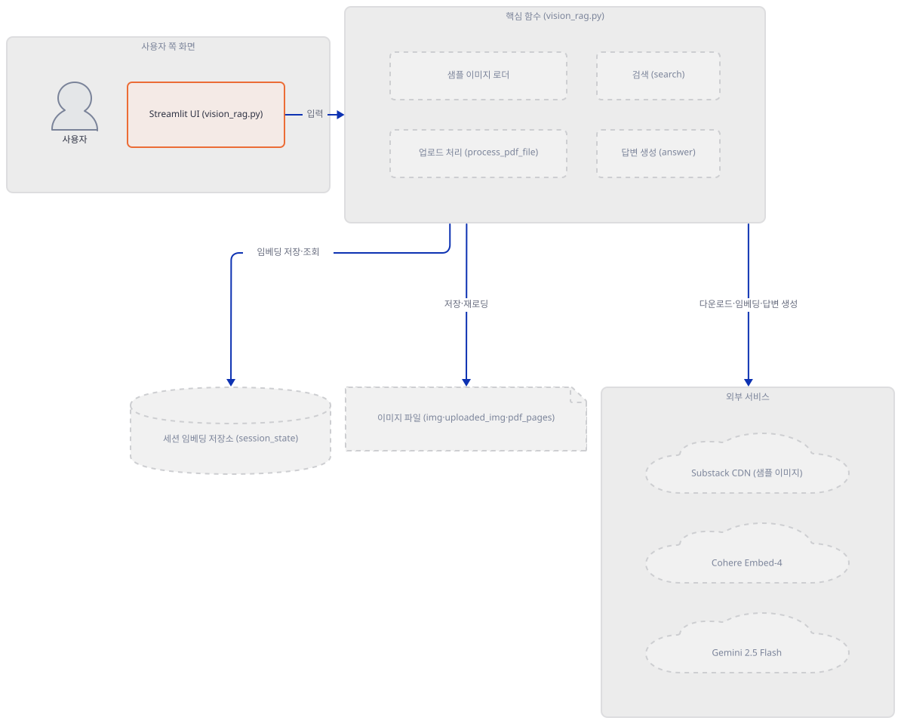
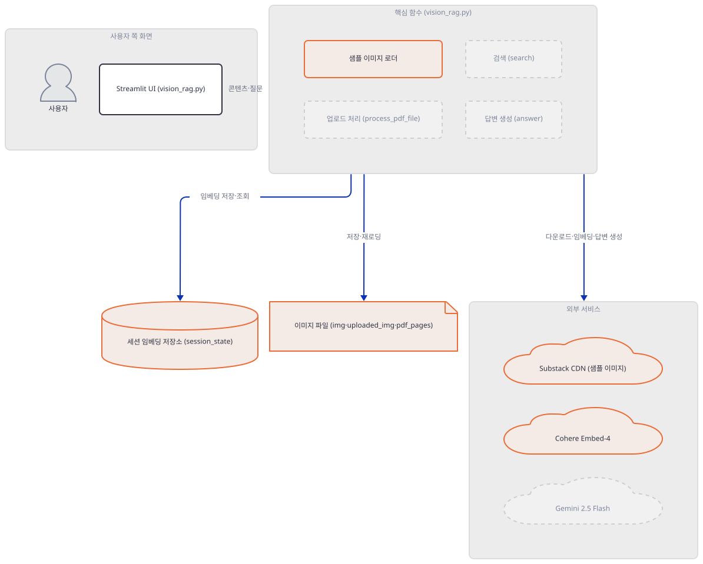
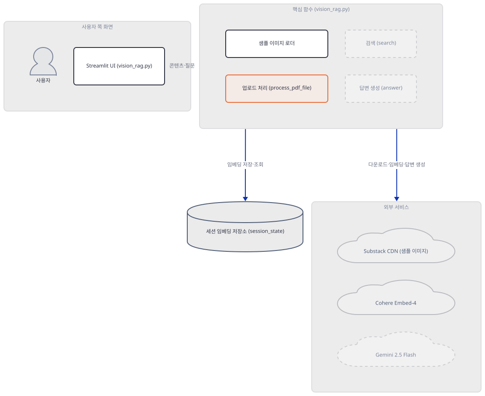
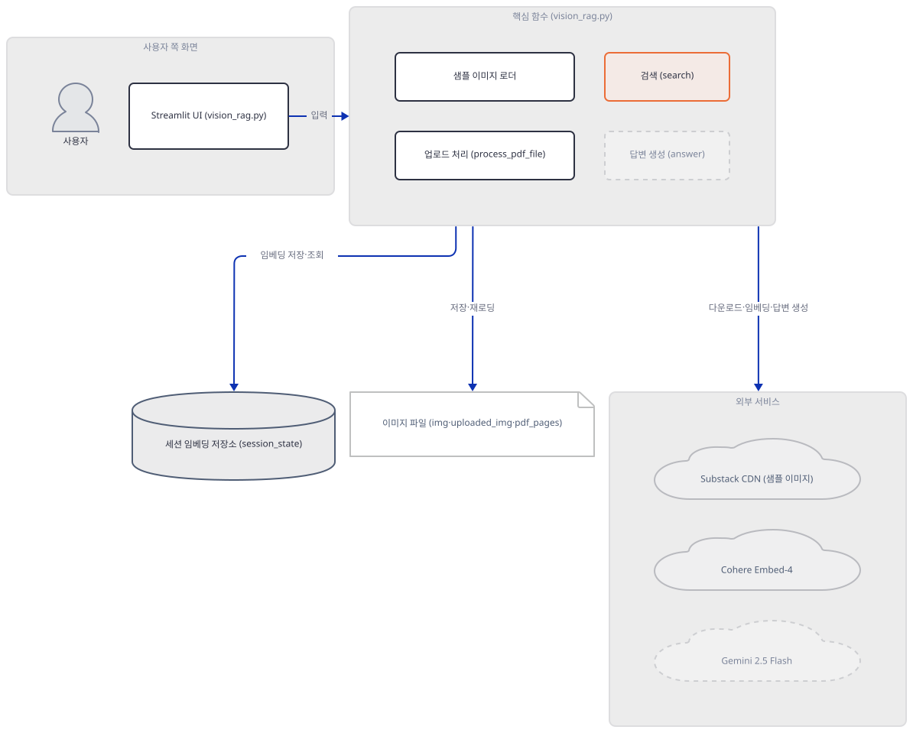
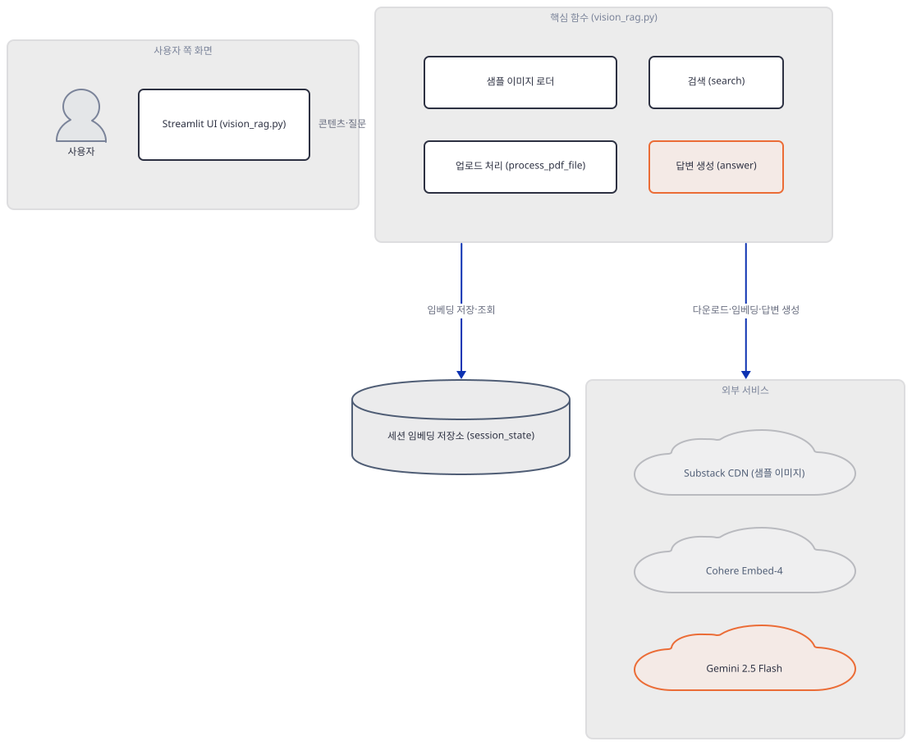
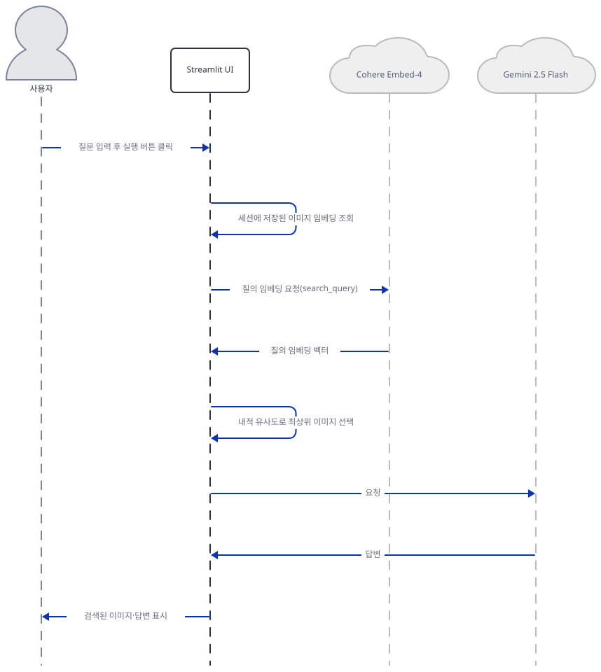

# Day 065 · 🖼️ Vision RAG

> 볼륨 5 📀 RAG · 난이도 ★★☆ · 예상 소요 70분(Step 7에서 헤드리스 기동의 외부 IP 조회를 재현·수정하는 두 번째 명령이 늘었습니다) · API 비용 대략 질문 1건당 Cohere 텍스트 임베딩 1회(embed-v4.0) + Gemini 생성 1회(gemini-2.5-flash) — 콘텐츠 적재 시 이미지 1장·PDF 페이지 1장당 Cohere 이미지 임베딩 1회씩 추가(샘플 6장 또는 업로드 수만큼) — 대략치(키가 없어 실제 과금은 확인 못함) · 원본 앱: `rag_tutorials/vision_rag`

## 오늘 만들 것

오늘은 텍스트가 아니라 **이미지 자체**를 검색 대상으로 삼는 Vision RAG를 다룹니다. Cohere의 멀티모달 임베딩 모델 `embed-v4.0`이 차트·인포그래픽·PDF 페이지를 OCR 없이 그대로 벡터로 바꾸고, 질문이 오면 같은 모델로 질문도 벡터화해 내적(dot product)이 가장 큰 이미지를 고른 뒤, 그 이미지를 Google Gemini 2.5 Flash에 통째로 넘겨 답을 받습니다. Day 047부터 이 볼륨이 반복해 온 "임베딩 → 저장 → 검색 → 생성"이라는 두 단계 RAG 골격은 다시 설명하지 않고, 오늘 새로 얹히는 것 — 텍스트 청크 대신 이미지를 직접 임베딩하는 것, PDF를 페이지 단위 PNG로 렌더링해 같은 파이프라인에 태우는 것 — 에 집중합니다. 그런데 이 554줄을 실제로 설치해 보면(직접 확인, Step 1), 앱 자체의 `requirements.txt` 8줄이 코드가 실제로 쓰는 패키지 이름을 틀리게 적어 두어서, 안내 그대로 설치하면 `from google import genai`가 곧바로 `ImportError`를 냅니다. 또한 이 앱은 Day 057·060·061과 달리 `st.stop()`을 어디에도 쓰지 않아서, API 키를 하나도 넣지 않아도 사이드바 아래 화면 전체가 끝까지 그려집니다(직접 확인, Step 2) — 다만 "샘플 이미지 로드" 버튼 자체가 사라질 뿐입니다. 아래는 완성된 아키텍처입니다.



## 사전 준비

| 서비스/도구 | 용도 | 발급·설치 |
|---|---|---|
| Cohere API 키 | 이미지·질문 임베딩(`embed-v4.0`) 인증. 비어 있으면 클라이언트가 만들어지지 않고 관련 버튼이 숨음(Step 2) | https://dashboard.cohere.com/api-keys |
| Google API 키(Gemini) | 답변 생성(`gemini-2.5-flash`) 인증 | https://aistudio.google.com/app/apikey |
| `google-genai` 패키지(별도 설치) | 코드가 실제로 쓰는 `from google import genai`가 이 패키지에서 옴 — `requirements.txt`엔 없음(Step 1에서 직접 확인) | `uv pip install google-genai` |
| uv | 가상환경 생성과 패키지 설치 | [공통 사전 준비](../README.md#공통-사전-준비-한-번만) 절 참고 |

## 아키텍처 한눈에 보기

| 컴포넌트 | 역할 | 코드 위치 |
|---|---|---|
| 사용자 | 질문 입력, 이미지·PDF 업로드 | 코드 없음 (브라우저) |
| 사이드바 키 입력·클라이언트 초기화 | 키 2개를 받아 Cohere·Gemini 클라이언트를 만듦. 게이트(`st.stop()`)는 없음 | `rag_tutorials/vision_rag/vision_rag.py:19-56` |
| 샘플 이미지 로더 (`download_and_embed_sample_images`) | 고정 URL 6개를 내려받아 Cohere로 임베딩, 1시간 캐시 | `rag_tutorials/vision_rag/vision_rag.py:219-302` |
| 업로드 처리 (`process_pdf_file`, 업로드 배선) | 이미지 업로드 또는 PDF를 페이지별 PNG로 렌더링 후 임베딩 | `rag_tutorials/vision_rag/vision_rag.py:150-217`, `rag_tutorials/vision_rag/vision_rag.py:416-480` |
| 세션 임베딩 저장소 (`st.session_state`) | `image_paths` 리스트와 `doc_embeddings` numpy 배열, 메모리에만 존재 | `rag_tutorials/vision_rag/vision_rag.py:38-41` |
| 이미지 파일 (`img/`·`uploaded_img/`·`pdf_pages/`) | 샘플·업로드·PDF 페이지 이미지를 로컬 디스크에 저장, `answer`가 다시 열어 읽음 | `rag_tutorials/vision_rag/vision_rag.py:358` |
| 검색 (`search`) | 질문 임베딩과 저장된 임베딩의 내적으로 최상위 이미지 1장 선택 | `rag_tutorials/vision_rag/vision_rag.py:304-346` |
| 답변 생성 (`answer`) | 질문과 선택된 이미지를 Gemini에 함께 전달 | `rag_tutorials/vision_rag/vision_rag.py:348-375` |
| Cohere Embed-4 | 이미지·텍스트 공용 멀티모달 임베딩(`embed-v4.0`) | 외부 API |
| Google Gemini 2.5 Flash | 이미지 기반 질의응답 생성 | 외부 API |
| Substack CDN | 샘플 이미지 6장(재무 차트)의 다운로드 출처 | `rag_tutorials/vision_rag/vision_rag.py:224-231` |

## 단계별 진행

### Step 1. 환경 만들기 — `requirements.txt`가 가리키는 패키지가 틀렸다

**목적.** 격리된 가상환경에 의존성을 설치하고, 코드가 실제로 import하는 패키지가 `requirements.txt`에 정말 있는지 직접 확인합니다.

**할 일.**

```bash
cd rag_tutorials/vision_rag
uv venv
uv pip install -r requirements.txt
```

(pip 대안: `python -m venv .venv && source .venv/bin/activate && pip install -r requirements.txt`. Windows PowerShell은 활성화만 `.venv\Scripts\Activate.ps1`로 바꿉니다.)

이 저장소는 루트에 `pyproject.toml`이 있어 `uv run`이 방금 만든 환경 대신 루트의 `.venv`를 쓰므로, 이후 모든 `uv run` 명령에는 `--no-project`를 붙입니다.

`rag_tutorials/vision_rag/requirements.txt:1-8`

```text
streamlit>=1.32.0
cohere>=5.0.0
google-generativeai>=0.3.0
Pillow>=10.0.0
requests>=2.31.0
numpy>=1.24.0
tqdm>=4.66.0
PyMuPDF>=1.23.0
```

`vision_rag.py:11`은 `from google import genai`로 임포트하는데, 이건 `google-genai` 패키지가 제공하는 이름입니다. 위 목록의 `google-generativeai`는 **다른 패키지**(구버전 SDK, `import google.generativeai as genai` 형태로 씀)라서, 이 목록 그대로 설치하면 `genai.Client(...)`를 쓰는 이 앱의 실제 코드와 맞지 않습니다.



**확인.** 먼저 파일이 컴파일되는지 봅니다.

```bash
uv run --no-project python -m py_compile vision_rag.py && echo COMPILE_OK
```

```
COMPILE_OK
```

`requirements.txt` 그대로 설치한 환경에서 실제 임포트를 시도합니다.

```bash
uv run --no-project python -c "from google import genai"
```

직접 확인한 출력:

```
ImportError: cannot import name 'genai' from 'google' (unknown location)
```

`google-generativeai==0.8.6`은 실제로 설치되어 있었지만(`uv pip install -r requirements.txt`가 받는 전체 73개 패키지 중 하나로, `grpcio==1.84.0`도 함께 딸려 옴), `google-genai`는 그 안에 없었습니다. 별도로 설치하면 해결됩니다.

```bash
uv pip install google-genai
uv run --no-project python -c "from google import genai; print('OK')"
```

직접 확인한 출력:

```
Resolved 25 packages in 53ms
Installed 4 packages in 140ms
 + google-genai==2.25.0
OK
```

`google-genai`가 새로 설치한 것은 `distro`·`sniffio`·`tenacity` 3개뿐이지만, 이것만으로는 gRPC를 안 쓴다고 말할 수 없습니다 — `grpcio==1.84.0`은 이미 `google-generativeai`가 깔아 둔 것이라 이 3개 추가 설치와 무관하게 환경에 남아 있기 때문입니다. 실제 증거는 패키지 메타데이터입니다.

```bash
uv run --no-project python -c "
import importlib.metadata as m
for r in m.requires('google-genai'):
    if 'extra ==' not in r:
        print(r)
"
```

직접 확인한 출력(확장 기능용 `extra ==` 의존성 8개는 제외한 코어 10개 전부):

```
anyio<5.0.0,>=4.8.0
google-auth[requests]<3.0.0,>=2.56.0
httpx<1.0.0,>=0.28.1
pydantic<3.0.0,>=2.12.5
requests<3.0.0,>=2.28.1
tenacity<9.2.0,>=8.2.3
websockets<17.0,>=13.0.0
typing-extensions<5.0.0,>=4.14.0
distro<2,>=1.7.0
sniffio
```

`grpc`·`grpcio` 계열은 어디에도 없고 `httpx`가 있습니다 — 뒤에서 볼 `genai.Client`가 gRPC가 아니라 REST(httpx) 경로를 쓴다는 근거입니다. `import fitz`(12행)는 매번 다음 경고도 함께 뜹니다: `The 'fitz' API is deprecated and will be removed in future. Use 'import pymupdf' instead.`(PyMuPDF 1.28.2, 직접 확인) — 오류는 아니지만 이 리포 코드는 여전히 옛 이름을 씁니다. 이 경고는 이 파일을 새 파이썬 프로세스에서 import할 때마다 매번 뜨므로, 이후 Step의 확인 블록에서는 따로 적지 않습니다.

### Step 2. 사이드바 키 입력과 클라이언트 초기화 — 이 앱엔 `st.stop()`이 없다

**목적.** 키가 없을 때 정확히 무엇이 렌더링되고 무엇이 숨는지, 그리고 키가 있을 때 클라이언트 생성 자체가 네트워크를 타는지 확인합니다.

**할 일.**

`rag_tutorials/vision_rag/vision_rag.py:19-31`

```python
with st.sidebar:
    st.header("🔑 API Keys")
    cohere_api_key = st.text_input("Cohere API Key", type="password", key="cohere_key")
    google_api_key = st.text_input("Google API Key (Gemini)", type="password", key="google_key")
    "[Get a Cohere API key](https://dashboard.cohere.com/api-keys)"
    "[Get a Google API key](https://aistudio.google.com/app/apikey)"

    st.markdown("---")
    if not cohere_api_key:
        st.warning("Please enter your Cohere API key to proceed.")
    if not google_api_key:
        st.warning("Please enter your Google API key to proceed.")
    st.markdown("---")
```

`rag_tutorials/vision_rag/vision_rag.py:43-56`

```python
if cohere_api_key and google_api_key:
    try:
        co = cohere.ClientV2(api_key=cohere_api_key)
        st.sidebar.success("Cohere Client Initialized!")
    except Exception as e:
        st.sidebar.error(f"Cohere Initialization Failed: {e}")

    try:
        genai_client = genai.Client(api_key=google_api_key)
        st.sidebar.success("Gemini Client Initialized!")
    except Exception as e:
        st.sidebar.error(f"Gemini Initialization Failed: {e}")
else:
    st.info("Enter your API keys in the sidebar to start.")
```

Day 057·060·061은 키가 없으면 `st.stop()`으로 화면을 아예 멈췄지만, 이 파일엔 `st.stop()`이 한 번도 나오지 않습니다. 즉 키가 없어도 554행 전체가 끝까지 실행되고 "Load Sample Images"·"Upload Your Images"·"Ask a Question" 세 구획이 모두 그려집니다 — 다만 `co`가 `None`으로 남아 그 아래 위젯들이 조건부로 숨거나 비활성화됩니다.



**확인.** 키 없이 `AppTest`로 무엇이 뜨는지 봅니다.

```bash
uv run --no-project python -c "
from streamlit.testing.v1 import AppTest
at = AppTest.from_file('vision_rag.py')
at.run(timeout=30)
print('title:', [t.value for t in at.title])
print('sidebar warnings:', [w.value for w in at.sidebar.warning])
print('subheaders:', [s.value for s in at.subheader])
print('buttons:', [(b.label, b.disabled) for b in at.button])
"
```

직접 확인한 출력:

```
title: ['Vision RAG with Cohere Embed-4 🖼️']
sidebar warnings: ['Please enter your Cohere API key to proceed.', 'Please enter your Google API key to proceed.']
subheaders: ['📊 Load Sample Images', '📤 Upload Your Images', '❓ Ask a Question']
buttons: [('Run Vision RAG', True)]
```

세 구획 제목이 모두 뜨는데 "Load Sample Images" 버튼은 `buttons` 목록에 아예 없습니다(379-403행의 `if cohere_api_key and co:` 분기 때문). 이제 가짜 키를 넣고 클라이언트 생성만 실행합니다 — `embed()`나 `generate_content()` 같은 실제 요청 메서드는 절대 부르지 않습니다. (이 문서는 이 확인을 루프백 외 소켓·DNS 차단 + 프록시 환경변수(`HTTP_PROXY=http://127.0.0.1:9 HTTPS_PROXY=http://127.0.0.1:9 ALL_PROXY=http://127.0.0.1:9 grpc_proxy=http://127.0.0.1:9 NO_PROXY=localhost,127.0.0.1`)까지 건 상태에서 수행해 네트워크 시도가 전혀 없음을 확인했습니다 — 아래 명령 자체는 이 차단 없이 그대로 실행해도 같은 성공 메시지가 나옵니다.)

```bash
uv run --no-project python -c "
from streamlit.testing.v1 import AppTest
at = AppTest.from_file('vision_rag.py')
at.run(timeout=30)
for ti in at.sidebar.text_input:
    if ti.label == 'Cohere API Key': ti.set_value('fake-cohere-key')
    if ti.label == 'Google API Key (Gemini)': ti.set_value('fake-google-key')
at.run(timeout=30)
print('sidebar success:', [s.value for s in at.sidebar.success])
print('buttons:', [(b.label, b.disabled) for b in at.button])
"
```

직접 확인한 출력(소켓·DNS 차단 + 프록시 환경변수 상태에서):

```
sidebar success: ['Cohere Client Initialized!', 'Gemini Client Initialized!']
buttons: [('Load Sample Images', False), ('Run Vision RAG', True)]
```

`RuntimeError`(네트워크 차단 신호) 없이 두 클라이언트 모두 생성에 성공했습니다 — 생성자 자체는 네트워크를 타지 않는다는 뜻입니다. 같은 차단 상태에서 실제 SDK 클래스로 다시 확인했습니다.

```bash
uv run --no-project python -c "
import cohere
co = cohere.ClientV2(api_key='fake-cohere-key')
print('cohere OK:', type(co))
from google import genai
gc = genai.Client(api_key='fake-google-key')
print('genai OK:', type(gc), type(gc.models))
"
```

직접 확인한 출력:

```
cohere OK: <class 'cohere.client_v2.ClientV2'>
genai OK: <class 'google.genai.client.Client'> <class 'google.genai.models.Models'>
```

gRPC를 쓰는 옛 SDK는 파이썬 소켓 패치를 우회할 수 있다고 알려져 있지만, 이 앱이 실제로 쓰는 `google-genai`는 Step 1에서 패키지 메타데이터로 확인했듯 애초에 `grpc`를 요구하지 않습니다 — `.models` 속성 접근까지만 한(호출은 안 함) 이 확인에서 새어 나간 요청은 없었습니다.

### Step 3. 샘플 이미지 로더 — 다운로드와 Cohere 임베딩

**목적.** 샘플 이미지가 어떻게 벡터가 되는지, 그리고 1568×1568을 넘는 이미지는 어떻게 줄어드는지 확인합니다.

**할 일.**

`rag_tutorials/vision_rag/vision_rag.py:219-231`

```python
# Download and embed sample images
@st.cache_data(ttl=3600, show_spinner=False)
def download_and_embed_sample_images(_cohere_client) -> tuple[list[str], np.ndarray | None]:
    """Downloads sample images and computes their embeddings using Cohere's Embed-4 model."""
    # Several images from https://www.appeconomyinsights.com/
    images = {
        "tesla.png": "https://substackcdn.com/image/fetch/w_1456,c_limit,f_webp,q_auto:good,fl_progressive:steep/https%3A%2F%2Fsubstack-post-media.s3.amazonaws.com%2Fpublic%2Fimages%2Fbef936e6-3efa-43b3-88d7-7ec620cdb33b_2744x1539.png",
        "netflix.png": "https://substackcdn.com/image/fetch/w_1456,c_limit,f_webp,q_auto:good,fl_progressive:steep/https%3A%2F%2Fsubstack-post-media.s3.amazonaws.com%2Fpublic%2Fimages%2F23bd84c9-5b62-4526-b467-3088e27e4193_2744x1539.png",
        "nike.png": "https://substackcdn.com/image/fetch/w_1456,c_limit,f_webp,q_auto:good,fl_progressive:steep/https%3A%2F%2Fsubstack-post-media.s3.amazonaws.com%2Fpublic%2Fimages%2Fa5cd33ba-ae1a-42a8-a254-d85e690d9870_2741x1541.png",
        "google.png": "https://substackcdn.com/image/fetch/f_auto,q_auto:good,fl_progressive:steep/https%3A%2F%2Fsubstack-post-media.s3.amazonaws.com%2Fpublic%2Fimages%2F395dd3b9-b38e-4d1f-91bc-d37b642ee920_2741x1541.png",
        "accenture.png": "https://substackcdn.com/image/fetch/w_1456,c_limit,f_webp,q_auto:good,fl_progressive:steep/https%3A%2F%2Fsubstack-post-media.s3.amazonaws.com%2Fpublic%2Fimages%2F08b2227c-7dc8-49f7-b3c5-13cab5443ba6_2741x1541.png",
        "tecent.png": "https://substackcdn.com/image/fetch/w_1456,c_limit,f_webp,q_auto:good,fl_progressive:steep/https%3A%2F%2Fsubstack-post-media.s3.amazonaws.com%2Fpublic%2Fimages%2F0ec8448c-c4d1-4aab-a8e9-2ddebe0c95fd_2741x1541.png"
    }
```

이 함수는 `requests.get(url)`로 6개 URL을 실제로 내려받으므로(소스로 확인, 외부로 요청을 보내는 코드라 이 문서에서는 실행하지 않았습니다) 여기서는 실행하지 않고, 그 아래에서 실제로 쓰는 리사이즈·임베딩 함수만 직접 호출해 확인합니다.

`rag_tutorials/vision_rag/vision_rag.py:82-92`

```python
# Resize too large images
def resize_image(pil_image: PIL.Image.Image) -> None:
    """Resizes the image in-place if it exceeds max_pixels."""
    org_width, org_height = pil_image.size

    # Resize image if too large
    if org_width * org_height > max_pixels:
        scale_factor = (max_pixels / (org_width * org_height)) ** 0.5
        new_width = int(org_width * scale_factor)
        new_height = int(org_height * scale_factor)
        pil_image.thumbnail((new_width, new_height))
```

`max_pixels`는 `vision_rag.py:80`에서 `1568*1568`(약 246만 화소)로 정해져 있습니다. 이어서 이미지를 Cohere에 보낼 base64로 바꾸는 `rag_tutorials/vision_rag/vision_rag.py:126-145`의 `compute_image_embedding`은 `@st.cache_data(ttl=3600, show_spinner=False)`로 캐시되는데, 매개변수 이름이 `_cohere_client`처럼 밑줄로 시작하면 Streamlit이 그 인자를 캐시 키 계산에서 제외합니다 — 그래서 같은 이미지를 다른 클라이언트 인스턴스로 다시 불러도 캐시가 재사용됩니다.



**확인.** 실제 `resize_image`를 2000×2000 합성 이미지에 직접 실행합니다.

```bash
uv run --no-project python -c "
from PIL import Image
import vision_rag as app
big = Image.new('RGB', (2000, 2000))
app.resize_image(big)
print('after:', big.size)
"
```

직접 확인한 출력:

```
after: (1568, 1568)
```

이제 `compute_image_embedding`을 실제로 호출하되, Cohere SDK가 아닌 자체 스텁 객체를 `_cohere_client` 자리에 넣어(네트워크 요청 없음) 캐시가 정말 클라이언트 인자를 무시하는지 확인합니다.

```bash
uv run --no-project python -c "
from PIL import Image
import vision_rag as app

class Stub:
    calls = 0
    def embed(self, model, input_type, embedding_types, images=None, texts=None):
        Stub.calls += 1
        class R:
            class embeddings:
                float_ = [[0.4, 0.3, 0.2, 0.1]]
        return R()

img = Image.new('RGB', (64, 64))
img.save('logo.png')
b64 = app.base64_from_image('logo.png')
emb1 = app.compute_image_embedding(b64, _cohere_client=Stub())
emb2 = app.compute_image_embedding(b64, _cohere_client=Stub())  # 새 인스턴스
print('embedding:', emb1.shape, 'embed() 호출 횟수:', Stub.calls)
"
```

직접 확인한 출력:

```
embedding: (4,) embed() 호출 횟수: 1
```

같은 base64 문자열에 대해 클라이언트 인스턴스를 새로 만들어 두 번 불러도 `embed()`는 한 번만 실행됐습니다 — 캐시 키가 `base64_img`에만 의존한다는 뜻입니다. 이 명령이 앱 폴더에 남긴 `logo.png`는 실제 앱 동작과 무관한 확인용 파일이니 지웁니다.

```bash
rm -f logo.png
```

### Step 4. 업로드 처리 — 이미지와 PDF 페이지를 임베딩하기

**목적.** PDF가 페이지별 PNG로 어떻게 렌더링되는지, 그리고 이 렌더링이 Cohere 없이도 완전히 로컬에서 끝난다는 것을 확인합니다.

**할 일.**

`rag_tutorials/vision_rag/vision_rag.py:175-200`

```python
        for i, page in enumerate(doc.pages()):
            page_num = i + 1
            page_img_path = os.path.join(output_folder, f"page_{page_num}.png")
            page_image_paths.append(page_img_path)

            # Render page to pixmap (image)
            pix = page.get_pixmap(dpi=150) # Adjust DPI as needed for quality/performance
            pil_image = Image.frombytes("RGB", [pix.width, pix.height], pix.samples)

            # Save the page image temporarily
            pil_image.save(page_img_path, "PNG")

            # Convert PIL image to base64
            base64_img = pil_to_base64(pil_image)

            # Compute embedding for the page image
            emb = compute_image_embedding(base64_img, _cohere_client=cohere_client)
            if emb is not None:
                page_embeddings.append(emb)
            else:
                st.warning(f"Could not embed page {page_num} from {pdf_filename}. Skipping.")
                # Add a placeholder to keep lists aligned, will be filtered later
                page_embeddings.append(None)

            # Update progress
            pdf_progress.progress((i + 1) / len(doc))
```

PDF 렌더링(PyMuPDF `get_pixmap(dpi=150)`)은 순수 로컬 연산이라 키나 네트워크 없이 실제로 끝까지 재현할 수 있습니다. 임베딩 부분만 스텁으로 대체하면 `process_pdf_file` 전체를 진짜로 호출해 볼 수 있습니다.



**확인.** 다운로드 없이 직접 만든 2페이지 PDF로 `process_pdf_file`을 실제로 호출합니다.

```bash
uv run --no-project python -c "
import fitz
import vision_rag as app

doc = fitz.open()
for i in range(2):
    p = doc.new_page(width=200, height=100)
    p.insert_text((20, 50), f'page {i+1}', fontsize=20)
pdf_bytes = doc.tobytes()
doc.close()

class FakeUpload:
    name = 'sample.pdf'
    def read(self): return pdf_bytes

class Stub:
    calls = []
    def embed(self, model, input_type, embedding_types, images=None, texts=None):
        Stub.calls.append((model, input_type))
        class R:
            class embeddings:
                float_ = [[0.1, 0.2, 0.3, 0.4]]
        return R()

paths, embs = app.process_pdf_file(FakeUpload(), Stub(), base_output_folder='pdf_pages')
print('paths:', paths)
print('files exist:', [__import__('os').path.exists(p) for p in paths])
print('embed() 호출:', Stub.calls)
"
```

직접 확인한 출력:

```
paths: ['pdf_pages\\sample\\page_1.png', 'pdf_pages\\sample\\page_2.png']
files exist: [True, True]
embed() 호출: [('embed-v4.0', 'search_document'), ('embed-v4.0', 'search_document')]
```

2페이지 모두 실제 PNG 파일로 저장됐고, `embed()`는 `search_document` 타입으로 정확히 2번(페이지당 1번) 호출됐습니다. Windows에서 나온 경로가 `pdf_pages\sample\page_1.png`처럼 **백슬래시**라는 점을 눈여겨보십시오 — Step 7에서 이 사실이 다시 나옵니다. 이 명령이 만든 `pdf_pages/` 폴더도 확인용이니 정리합니다.

```bash
rm -rf pdf_pages
```

### Step 5. 검색 — 질문과 이미지 임베딩의 내적 유사도

**목적.** `search`가 어떻게 최상위 이미지 하나를 고르는지, 그리고 코드 주석이 말하는 "코사인 유사도"가 실제로는 무엇인지 확인합니다.

**할 일.**

`rag_tutorials/vision_rag/vision_rag.py:304-346`

```python
# Search function
def search(question: str, co_client: cohere.Client, embeddings: np.ndarray, image_paths: list[str], max_img_size: int = 800) -> str | None:
    """Finds the most relevant image path for a given question."""
    if not co_client or embeddings is None or embeddings.size == 0 or not image_paths:
        st.warning("Search prerequisites not met (client, embeddings, or paths missing/empty).")
        return None
    if embeddings.shape[0] != len(image_paths):
         st.error(f"Mismatch between embeddings count ({embeddings.shape[0]}) and image paths count ({len(image_paths)}). Cannot perform search.")
         return None

    try:
        # Compute the embedding for the query
        api_response = co_client.embed(
            model="embed-v4.0",
            input_type="search_query",
            embedding_types=["float"],
            texts=[question],
        )

        if not api_response.embeddings or not api_response.embeddings.float_:
            st.error("Failed to get query embedding.")
            return None

        query_emb = np.asarray(api_response.embeddings.float_[0])

        # Ensure query embedding has the correct shape for dot product
        if query_emb.shape[0] != embeddings.shape[1]:
            st.error(f"Query embedding dimension ({query_emb.shape[0]}) does not match document embedding dimension ({embeddings.shape[1]}).")
            return None

        # Compute cosine similarities
        cos_sim_scores = np.dot(query_emb, embeddings.T)

        # Get the most relevant image
        top_idx = np.argmax(cos_sim_scores)
        hit_img_path = image_paths[top_idx]
        print(f"Question: {question}") # Keep for debugging
        print(f"Most relevant image: {hit_img_path}") # Keep for debugging

        return hit_img_path
    except Exception as e:
        st.error(f"Error during search: {e}")
        return None
```

335행 변수 이름은 `cos_sim_scores`지만 실제 계산은 `np.dot`, 즉 순수 내적입니다 — 두 벡터가 이미 단위 벡터일 때만 코사인 유사도와 같아집니다(소스로 확인, 이 파일은 정규화 코드를 어디서도 넣지 않습니다). 함수 시그니처의 `max_img_size: int = 800`도 눈에 띕니다 — 본문 어디에서도 쓰이지 않는 죽은 매개변수입니다(그렙으로 직접 확인).



**확인.** 스텁 클라이언트와 합성 임베딩으로 `search`를 실제로 호출합니다.

```bash
uv run --no-project python -c "
import numpy as np
import vision_rag as app

class Stub:
    def embed(self, model, input_type, embedding_types, texts=None, images=None):
        class R:
            class embeddings:
                float_ = [[1.0, 0.0, 0.0]]
        return R()

embeddings = np.array([[0.0, 1.0, 0.0], [0.9, 0.1, 0.0], [0.5, 0.5, 0.0]])
paths = ['img/a.png', 'img/b.png', 'img/c.png']
print(app.search('what is the profit?', Stub(), embeddings, paths))
print('길이 불일치:', app.search('q', Stub(), embeddings[:2], paths))
"
```

직접 확인한 출력(340-341행이 늘 먼저 찍는 두 줄 포함):

```
Question: what is the profit?
Most relevant image: img/b.png
img/b.png
길이 불일치: None
```

질의 벡터 `[1,0,0]`과 내적이 가장 큰 `[0.9,0.1,0]`(`img/b.png`)이 정확히 선택됐고, 임베딩·경로 개수가 안 맞을 때는 `None`을 돌려줍니다.

### Step 6. 답변 생성 — Gemini에 질문과 이미지를 함께 전달

**목적.** `answer`가 실패를 어떻게 방어하는지, 그리고 실제 Gemini 호출부(`generate_content`)의 모양을 확인합니다.

**할 일.**

`rag_tutorials/vision_rag/vision_rag.py:348-375`

```python
# Answer function
def answer(question: str, img_path: str, gemini_client) -> str:
    """Answers the question based on the provided image using Gemini."""
    if not gemini_client or not img_path or not os.path.exists(img_path):
        missing = []
        if not gemini_client: missing.append("Gemini client")
        if not img_path: missing.append("Image path")
        elif not os.path.exists(img_path): missing.append(f"Image file at {img_path}")
        return f"Answering prerequisites not met ({', '.join(missing)} missing or invalid)."
    try:
        img = PIL.Image.open(img_path)
        prompt = [f"""Answer the question based on the following image. Be as elaborate as possible giving extra relevant information.
Don't use markdown formatting in the response.
Please provide enough context for your answer.

Question: {question}""", img]

        response = gemini_client.models.generate_content(
            model="gemini-2.5-flash",
            contents=prompt
        )

        llm_answer = response.text
        print("LLM Answer:", llm_answer) # Keep for debugging
        return llm_answer
    except Exception as e:
        st.error(f"Error during answer generation: {e}")
        return f"Failed to generate answer: {e}"
```

프롬프트는 텍스트 문자열과 `PIL.Image` 객체를 같은 리스트에 담아 `contents=`로 그대로 넘깁니다 — `google-genai`가 이 혼합 리스트를 이미지+텍스트 멀티모달 입력으로 받아들이는 형태입니다(소스로 확인). 앱 자체의 README는 "How It Works" 절에서 모델 이름을 `gemini-2.5-flash-preview-04-17`이라고 적어 두었지만, 실제 호출 문자열(366행)은 항상 `gemini-2.5-flash`입니다 — README 쪽이 낡았습니다.



**확인.** 실제 Gemini는 부르지 않고, 방어 분기만 실제로 호출해 확인합니다.

```bash
uv run --no-project python -c "
import vision_rag as app
print(app.answer('q', '', None))
print(app.answer('q', 'does/not/exist.png', object()))
"
```

직접 확인한 출력:

```
Answering prerequisites not met (Gemini client, Image path missing or invalid).
Answering prerequisites not met (Image file at does/not/exist.png missing or invalid).
```

### Step 7. 화면 배선과 실행 — 실행 버튼 게이팅과 로컬 기동

**목적.** "Run Vision RAG" 버튼이 정확히 어떤 조건에서 풀리는지, 그리고 PDF 출처 캡션이 왜 이 플랫폼에서 조용히 빠지는지 확인합니다.

**할 일.**

`rag_tutorials/vision_rag/vision_rag.py:512-513`

```python
run_button = st.button("Run Vision RAG", key="main_run_button", 
                      disabled=not (cohere_api_key and google_api_key and question and st.session_state.image_paths and st.session_state.doc_embeddings is not None and st.session_state.doc_embeddings.size > 0))
```

버튼은 키 2개, 질문 텍스트, 이미지 목록, 임베딩 배열까지 다섯 조건이 모두 참이어야 눌립니다. 실행 결과를 다루는 부분은 다음과 같습니다.

`rag_tutorials/vision_rag/vision_rag.py:530-538`

```python
                if top_image_path:
                    caption = f"Retrieved content for: '{question}' (Source: {os.path.basename(top_image_path)})"
                    # Add source PDF name if it's a page image
                    if top_image_path.startswith("pdf_pages/"):
                         parts = top_image_path.split(os.sep)
                         if len(parts) >= 3:
                             pdf_name = parts[1]
                             page_name = parts[-1]
                             caption = f"Retrieved content for: '{question}' (Source: {pdf_name}.pdf, {page_name.replace('.png','')})"
```

533행의 `"pdf_pages/"`는 슬래시(`/`)를 하드코딩한 문자열입니다. 그런데 Step 4에서 직접 확인했듯 이 경로는 `os.path.join`이 만든 것이라 Windows에서는 백슬래시(`pdf_pages\sample\page_1.png`)입니다 — 그래서 `startswith("pdf_pages/")`가 Windows에서는 항상 거짓이 되고, 534행의(플랫폼에 맞는) `os.sep` 분할 코드까지는 아예 도달하지 못합니다. 결과가 틀리지는 않지만(531행의 기본 캡션 `Source: {os.path.basename(...)}`으로 조용히 대체되어 `Source: page_1.png`가 됨 — 폴더 구분이 사라져 서로 다른 PDF가 우연히 같은 페이지 번호를 쓰면 어느 문서에서 왔는지 구분할 수 없습니다), POSIX였다면 나왔을 `Source: sample.pdf, page_1` 형태의 더 자세한 캡션은 이 플랫폼에서 나오지 않습니다.


**확인.** 앱을 로컬로 띄워 화면이 실제로 뜨는지 확인합니다. 다만 `--server.address`를 지정하지 않고 `--server.headless true`만 주면, Streamlit이 시작 배너의 "External URL"을 채우려고 `net_util.get_external_ip()`를 실행해 `http://checkip.amazonaws.com`과 `https://checkip.amazonaws.com`에 실제로 요청을 보냅니다(소스로 확인 — streamlit 1.64.0의 `net_util.py`) — Day 054가 이미 확인한 사실입니다. 직접 재현(소켓·DNS 차단 상태):

```bash
uv run --no-project python -m streamlit run vision_rag.py --server.headless true --server.port 61201
```

직접 확인한 출력(콘솔):

```
Did not auto detect external IP.
Please go to https://docs.streamlit.io/ for debugging hints.
```

이 메시지는 `get_external_ip()`가 `http://checkip.amazonaws.com`과 `https://checkip.amazonaws.com` 두 곳 모두 실패했을 때만 찍힙니다(소스로 확인) — 즉 두 URL 모두에 실제 연결 시도가 있었다는 뜻입니다.

`--server.address localhost`를 더하면 코드가 아예 다른 분기를 타 이 조회 자체를 건너뜁니다(소스로 확인 — streamlit 1.64.0의 `web/bootstrap.py`, `_print_url`) — 이 문서가 실제로 쓰는 명령은 이쪽입니다. 브라우저가 페이지를 열 때만 발생하는 별도의 사용 통계 전송(`data.streamlit.io/metrics.json`, Day 054에서 이미 확인)도 `--browser.gatherUsageStats false`로 함께 꺼 둡니다.

```bash
uv run --no-project python -m streamlit run vision_rag.py --server.headless true --server.address localhost --browser.gatherUsageStats false --server.port 61202
```

직접 확인한 출력(콘솔, 차단 로그 0건):

```
  URL: http://localhost:61202
```

다른 터미널에서(로컬 주소에만 접속):

```bash
curl -s -o /dev/null -w "HTTP_STATUS:%{http_code}\n" http://localhost:61202
```

직접 확인한 출력:

```
HTTP_STATUS:200
```

확인 후 프로세스를 종료했습니다(`kill`, 이후 같은 포트로 재접속 시도는 연결 거부됨을 확인).

## 요청 한 건이 흐르는 과정



이 시퀀스는 이미지가 이미 로드된 상태에서 질문을 실행하는 경로입니다. UI는 먼저 `st.session_state`에 저장된 임베딩을 (같은 프로세스 안에서) 조회한 뒤, 질문 텍스트를 Cohere에 `search_query` 타입으로 보내 질의 임베딩을 받고, 돌아온 벡터와 저장된 임베딩들의 내적을 직접 계산해(Cohere를 다시 부르지 않음) 최상위 이미지 1장을 고릅니다. 그 이미지와 원래 질문을 함께 Gemini에 보내면 최종 답변 텍스트가 돌아오고, UI는 검색된 이미지와 답변을 함께 화면에 표시합니다. 샘플 로딩이나 업로드 시점의 임베딩 생성(Cohere `search_document` 호출)은 이 시퀀스보다 앞서 끝나 있어야 하는 별개의 흐름이라 여기엔 포함하지 않았습니다 — Step 3·4의 구성을 참고하십시오. 두 외부 API 모두 키가 없어 이 왕복을 처음부터 끝까지 한 번에 재현하지는 못했고, 각 구간은 Step 2·3·5·6에서 소스와 격리된 실행으로 따로 확인한 것을 이어붙였습니다.

## 실행 체크리스트

- [ ] Cohere API 키와 Google API 키(Gemini)를 준비했다
- [ ] `requirements.txt` 그대로 설치하면 `from google import genai`가 실패하고, `uv pip install google-genai`로 해결된다는 것을 직접 확인했다
- [ ] 이 앱엔 `st.stop()`이 없어 키가 없어도 화면 전체가 끝까지 그려지지만 "Load Sample Images" 버튼은 사라진다는 것을 `AppTest`로 확인했다
- [ ] `cohere.ClientV2`·`genai.Client`는 생성자만 호출해도 예외 없이 성공한다는 것을 직접 확인했다(요청 메서드는 호출하지 않았다)
- [ ] `process_pdf_file`을 합성 PDF로 실제 호출해 페이지별 PNG 생성과 임베딩 호출 횟수를 확인했다
- [ ] `search`의 "코사인 유사도" 주석이 실제로는 정규화 없는 내적이라는 것을 소스로 확인했다
- [ ] Windows에서 `pdf_pages/` 슬래시 검사가 항상 거짓이 되어 PDF 출처 캡션이 기본형으로 대체된다는 것을 직접 확인했다

## 문제 해결

| 증상 | 원인 | 해결 |
|---|---|---|
| `requirements.txt` 설치 후 `from google import genai`에서 `ImportError` | 코드는 `google-genai` 패키지를 쓰는데 `requirements.txt`엔 다른 패키지 `google-generativeai`만 있음(직접 확인, Step 1) | `uv pip install google-genai` 별도 설치 |
| `import fitz` 시 `The 'fitz' API is deprecated...` 경고 | 설치되는 PyMuPDF 1.28.2가 옛 이름 `fitz`를 곧 없앨 예정이라고 경고(직접 확인) | 오류 아님. 무시해도 이번 버전에서는 동작함 |
| "Load Sample Images" 버튼이 안 보임 | `cohere_api_key and co`가 참이어야 버튼 블록이 그려짐(379행) — 키 하나라도 비면 버튼 자체가 없음 | Cohere·Google 키를 모두 입력 |
| PDF를 올렸는데 캡션에 "Source: sample.pdf, page_1"이 안 뜨고 "Source: page_1.png"만 나옴 | 533행이 `"pdf_pages/"`(슬래시)를 하드코딩해 검사하는데 Windows의 실제 경로는 백슬래시라 항상 거짓(직접 확인, Step 7) | 리포 코드는 고치지 않는 방침. 서로 다른 PDF가 같은 페이지 번호를 쓰면 기본 캡션만으로는 어느 문서인지 구분 못함(직접 확인) |
| 앱 자체 README의 "How It Works"가 `gemini-2.5-flash-preview-04-17`을 언급 | 실제 호출 문자열(366행)은 항상 `gemini-2.5-flash` — README 서술이 코드보다 낡음(소스로 확인) | 실제 동작에는 영향 없음. 코드 쪽을 신뢰 |

## 더 해보기

- `search`(`rag_tutorials/vision_rag/vision_rag.py:335`)에서 두 벡터를 각각 `np.linalg.norm`으로 나눠 정규화한 뒤 내적을 계산해보고, 순위가 실제로 달라지는 질문이 있는지 확인해보기
- `rag_tutorials/vision_rag/vision_rag.py:533`의 `"pdf_pages/"`를 `os.sep`을 쓰도록 바꾸고, 실제 PDF 업로드에서 "Source: sample.pdf, page_1" 캡션이 뜨는지 직접 실행해 비교해보기
- `search`에 유사도 임계값을 추가해, 저장된 이미지 중 어느 것과도 관련 없는 질문에는 "관련 이미지 없음"을 돌려주도록 바꿔보기

## 다음 날 예고

[Day 066 · 📎 Typed Agentic RAG with Pydantic AI](../day066-agentic-typed-rag-pydanticai/README.md) — Pydantic AI로 입출력 타입을 강제하는 에이전틱 RAG를 다룹니다.
