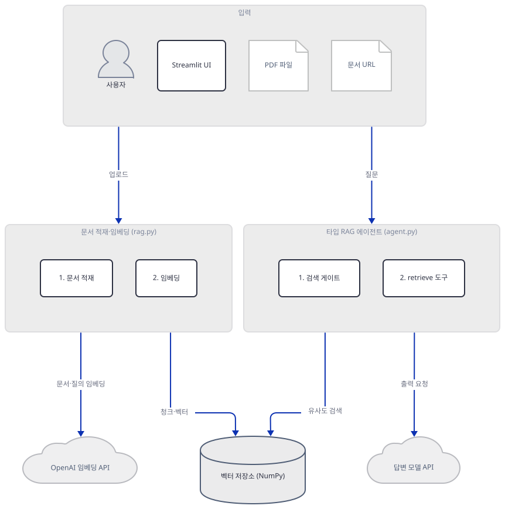
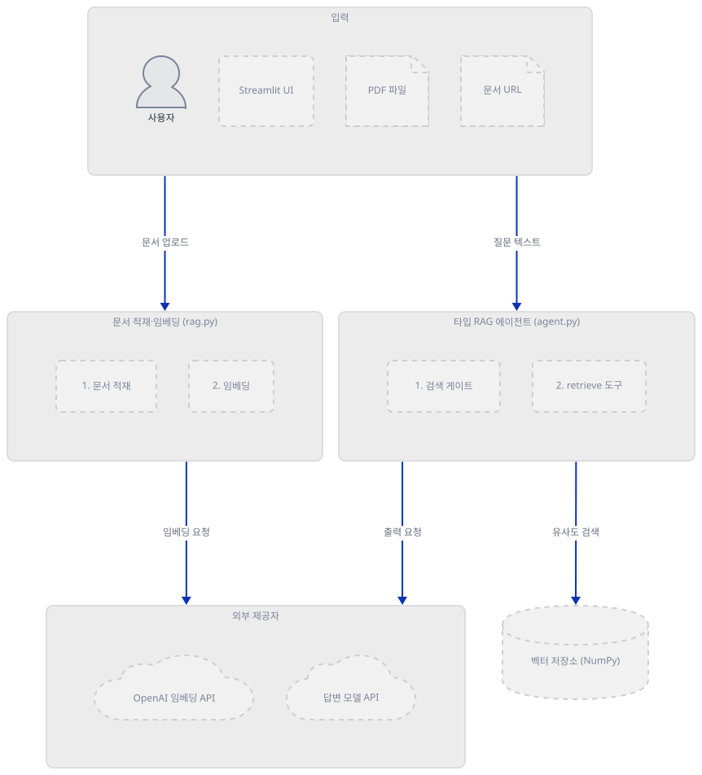
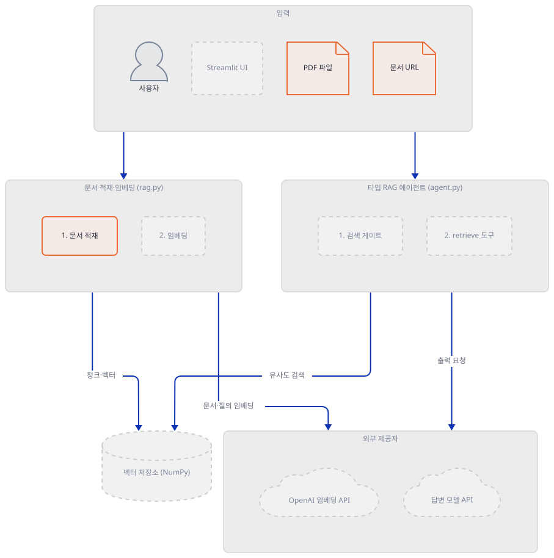
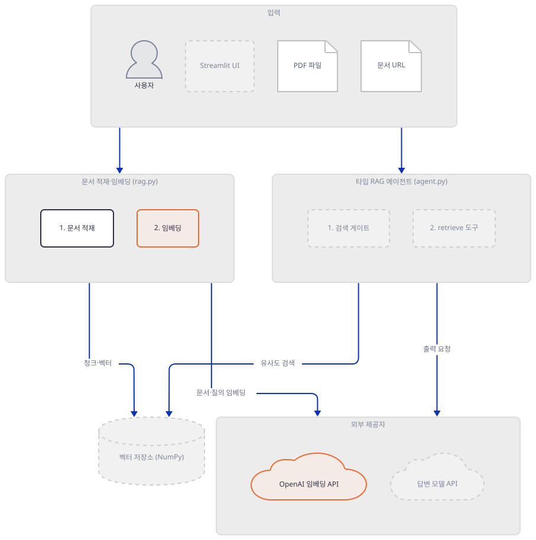
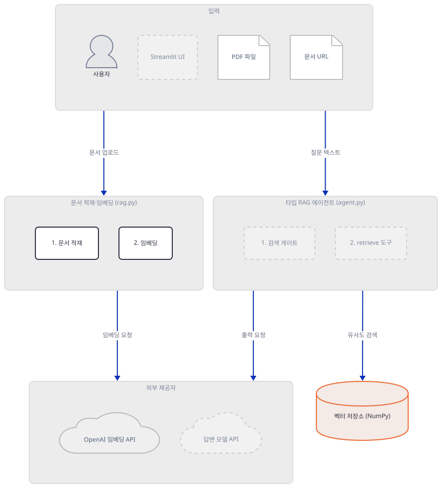
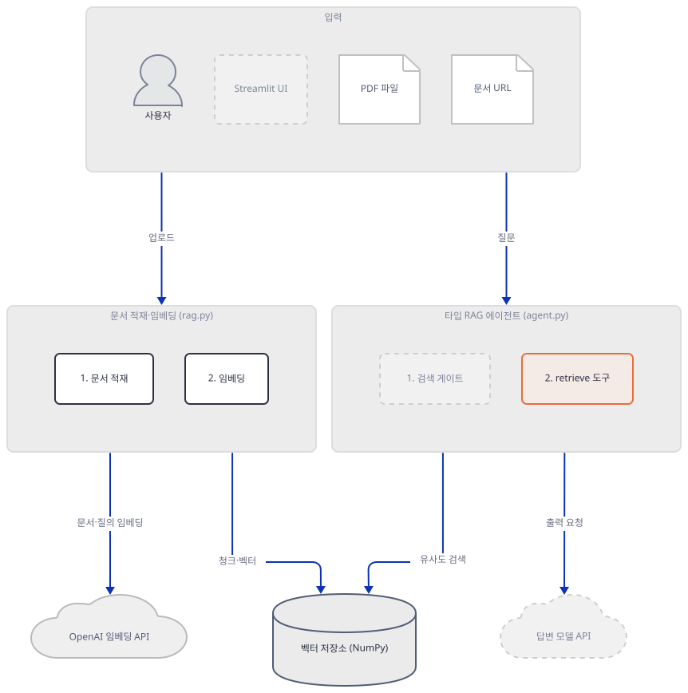
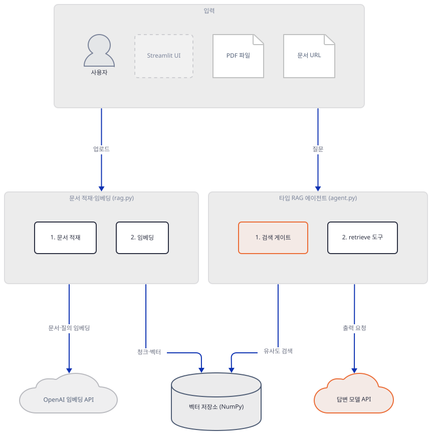
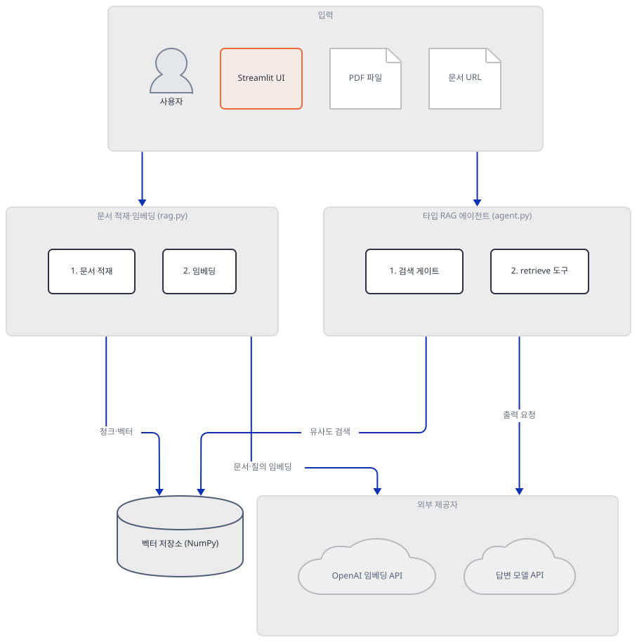
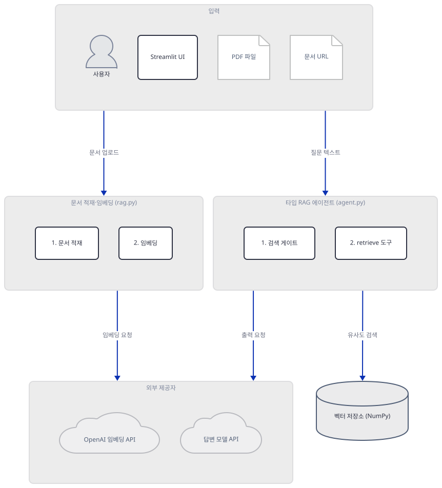
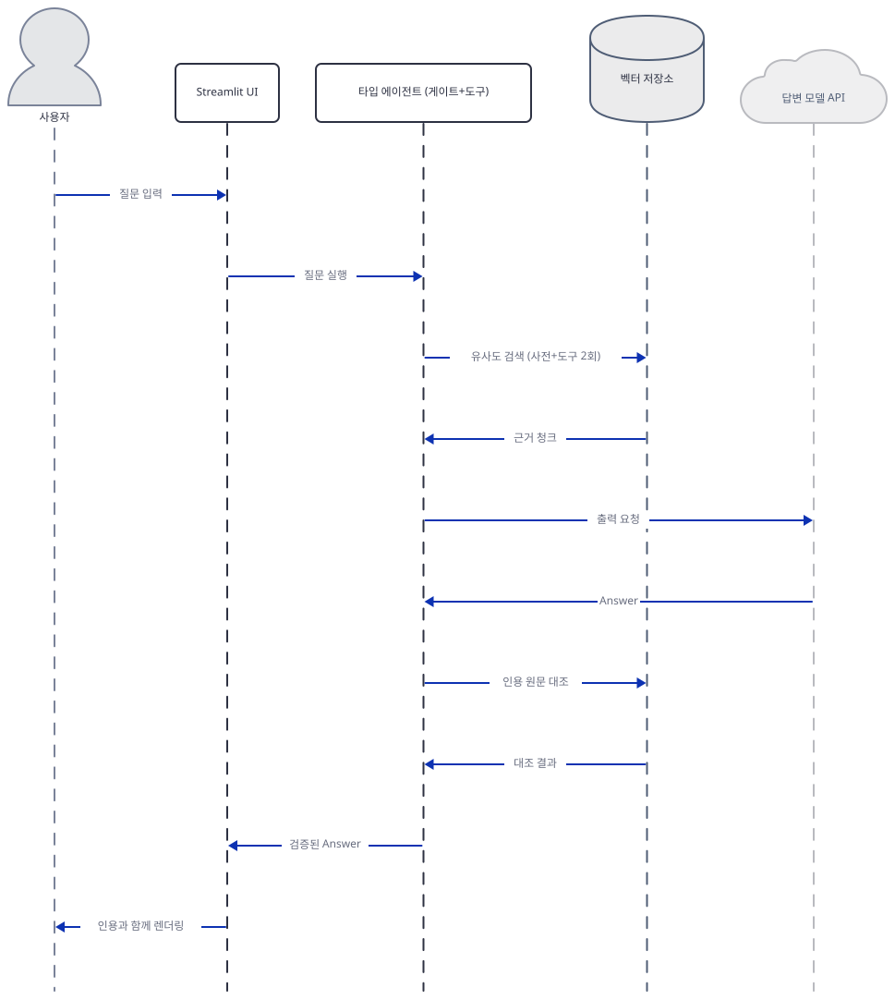

# Day 066 · 📎 Typed Agentic RAG with Pydantic AI

> 볼륨 5 📀 RAG · 난이도 ★★☆ · 예상 소요 80분 · API 비용 대략 PDF·URL 업로드마다 임베딩 호출 1회(청크 전체를 한 번에 배치, OpenAI 임베딩 모드일 때만 발생 — 로컬 해싱 모드는 무료) + 답한 질문마다 질의 임베딩 2회(사전 검색·도구 검색 각 1회, OpenAI 모드, 직접 확인) 및 답변 모델 호출(retrieve 도구 호출을 포함해 보통 왕복 2회, Step 8) — 정확한 단가는 키가 없어 확인 못함 · 원본 앱: `rag_tutorials/agentic_typed_rag_pydanticai`

## 오늘 만들 것

Day 047부터 이 볼륨이 반복해 온 "청크 → 임베딩 → 검색 → 생성" 골격은 오늘도 그대로입니다. 오늘 달라지는 것은 그 골격을 감싸는 타입입니다 — Pydantic AI의 `Agent`가 내놓는 답은 `text`뿐인 문자열이 아니라 인용·신뢰도·응답 여부를 갖춘 `Answer` 모델이고, 에이전트는 반드시 타입이 있는 `retrieve` 도구를 거쳐야 하며, 그 도구가 돌려주는 근거도 `RetrievalEvidence`라는 별도 모델입니다. 검색 점수가 문턱을 넘지 못하면 모델을 아예 부르지 않고 거절하고(Step 6), 모델이 답을 내놓아도 인용한 `quoted_span`이 실제로 저장된 청크 원문에 없으면 그 답은 버려지고 거절로 바뀝니다(Step 6) — LLM의 자기 신고가 아니라 코드가 직접 원문을 대조하는 이중 방어입니다. 벡터 저장소도 Qdrant나 ChromaDB 같은 별도 서비스가 아니라 NumPy 배열 하나로 세션 동안만 사는 `InMemoryVectorStore`이고(Step 4), 임베딩은 OpenAI 키가 있으면 `text-embedding-3-small`을, 없으면 해시 기반 로컬 벡터를 자동으로 씁니다(Step 3) — 다만 이 로컬 대안은 영문·숫자만 토큰으로 남기므로 한국어 문서·질문에는 쓸 수 없습니다(직접 확인, Step 3·문제 해결). 이 앱을 실제로 설치하고 import·테스트를 돌려본 범위에서는(직접 확인, Step 1·8) 이 한계 말고는 결함을 찾지 못했습니다 — 이 볼륨의 여러 날과 달리 앱 자체의 README가 코드와 어긋나는 곳도 없었습니다. 완성하면 PDF나 문서 URL을 올려 지식베이스를 만들고, 질문하면 인용과 신뢰도가 붙은 답 또는 명확한 거절 메시지를 받는 화면을 띄우게 됩니다. 아래는 완성된 아키텍처입니다.



## 사전 준비

| 서비스/도구 | 용도 | 발급·설치 |
|---|---|---|
| OpenAI API 키 또는 Anthropic API 키(둘 중 하나, 둘 다 있어도 됨) | 답변 모델(`gpt-5.2` 또는 `claude-sonnet-4-6`) 호출 인증. 사이드바에서 공급자를 고릅니다(Step 7) | https://platform.openai.com/api-keys 또는 https://console.anthropic.com/settings/keys |
| (선택) OpenAI API 키 | 임베딩을 `text-embedding-3-small`로 쓰려면 필요. 없으면 로컬 해싱 임베딩으로 자동 대체되어 별도 키 없이도 지식베이스를 만들 수 있습니다(Step 3) | 위와 동일 |
| uv | 가상환경 생성과 패키지 설치 | [공통 사전 준비](../README.md#공통-사전-준비-한-번만) 절 참고 |

이 앱은 Day 047 이후 여러 날이 요구했던 별도 벡터 DB(Qdrant, ChromaDB 등)나 Docker가 필요 없습니다 — 저장소가 NumPy 배열 하나이기 때문입니다(Step 4).

## 아키텍처 한눈에 보기

| 컴포넌트 | 역할 | 코드 위치 |
|---|---|---|
| 사용자 | PDF·URL 업로드, 질문 입력 | 코드 없음 (브라우저) |
| Streamlit UI (`app.py`) | 사이드바 설정, 소스 업로드, 채팅과 인용 렌더링 | `rag_tutorials/agentic_typed_rag_pydanticai/app.py:90-227` |
| 문서 적재 (`rag.py`: `chunk_text`/`ingest_pdf`/`fetch_url_text`) | PDF·URL을 겹침 있는 청크로 분할, URL은 사설 주소를 거부 | `rag_tutorials/agentic_typed_rag_pydanticai/rag.py:130-154`, `rag_tutorials/agentic_typed_rag_pydanticai/rag.py:360-377`, `rag_tutorials/agentic_typed_rag_pydanticai/rag.py:411-435` |
| 임베딩 백엔드 (`rag.py`: `HashingEmbeddingBackend`/`OpenAIEmbeddingBackend`) | 청크·질의를 벡터로 변환 — OpenAI 키가 있으면 API, 없으면 로컬 해싱 | `rag_tutorials/agentic_typed_rag_pydanticai/rag.py:190-243` |
| 벡터 저장소 (`InMemoryVectorStore`) | NumPy 코사인 유사도 검색, 세션 동안만 사는 인메모리 인덱스 | `rag_tutorials/agentic_typed_rag_pydanticai/rag.py:246-344` |
| 타입 RAG 에이전트 (`agent.py`: `rag_agent` + `retrieve` 도구) | Pydantic AI `Agent`. `retrieve` 도구로만 근거를 모으고 `Answer`로 구조화 출력 | `rag_tutorials/agentic_typed_rag_pydanticai/agent.py:103-149` |
| 검색 게이트·인용 검증 (`agent.py`: `answer_question`/`validate_grounded_answer`) | 모델 호출 전 사전 검색으로 거절을 결정하고, 응답 후 인용 원문을 대조 | `rag_tutorials/agentic_typed_rag_pydanticai/agent.py:178-243` |
| OpenAI 임베딩 API | `text-embedding-3-small` 임베딩 생성(OpenAI 모드일 때만) | 코드 없음 (외부 서비스) |
| 답변 모델 API (OpenAI 또는 Anthropic) | `Answer` 스키마에 맞춘 구조화 출력 생성 | 코드 없음 (외부 서비스) |

## 단계별 진행

### Step 1. 환경 만들기와 핵심 파일 지도

**목적.** 4개 파일(`rag.py`·`agent.py`·`app.py`·`test_typed_rag.py`, 합쳐서 1,225줄)의 역할을 훑고, 격리된 환경에 고정된 의존성 7개를 설치해 모든 import가 통과하는지 확인합니다.

**할 일.**

```bash
cd rag_tutorials/agentic_typed_rag_pydanticai
uv venv --python 3.12
uv pip install -r requirements.txt
```

(pip 대안: `python3 -m venv .venv && source .venv/bin/activate && pip install -r requirements.txt`. Windows PowerShell은 활성화만 `.venv\Scripts\Activate.ps1`로 바꿉니다.) `uv venv`를 인자 없이 실행하면 이 기기에서는 uv가 자체 관리하는 Python 3.13.3을 그대로 고릅니다(직접 확인) — Day 057에서 본 것과 같은 버전 드리프트이므로 `--python 3.12`를 명시합니다. 이 저장소는 루트에 `pyproject.toml`이 있어 `uv run`이 방금 만든 환경 대신 루트 `.venv`를 쓰므로, 이후 모든 `uv run`에 `--no-project`를 붙입니다.

`rag_tutorials/agentic_typed_rag_pydanticai/requirements.txt:1-7`

```text
anthropic==0.116.0
numpy==2.5.1
openai==2.45.0
pydantic-ai==2.10.0
pypdf==6.14.2
python-dotenv==1.2.2
streamlit==1.59.2
```

7줄 모두 정확한 고정(`==`)입니다. 직접 설치해 보면 충돌 없이 풀립니다(직접 확인, 로그 그대로):

```
Resolved 123 packages in 241ms
Installed 123 packages in 1.99s
```



**확인.** 4개 파일 모두 컴파일되고 import가 통과하는지 확인합니다.

```bash
uv run --no-project python -m py_compile agent.py app.py rag.py test_typed_rag.py && echo compiled
```

```
compiled
```

```bash
uv run --no-project python -c "import rag, agent, app; print('OK')"
```

직접 확인한 출력(Streamlit이 `streamlit run` 밖에서 뜨는 것을 알리는 경고는 이후 생략합니다):

```
OK
```

### Step 2. 문서 적재: PDF와 URL을 겹침 있는 청크로 (rag.py)

**목적.** `chunk_text`가 어떻게 겹치는 단어 창을 만드는지, `ingest_pdf`가 페이지마다 청크 ID를 어떻게 매기는지, `fetch_url_text`가 사설 주소를 어떻게 걸러내는지 확인합니다.

**할 일.**

`rag_tutorials/agentic_typed_rag_pydanticai/rag.py:130-154`

```python
def chunk_text(
    text: str,
    chunk_size: int = DEFAULT_CHUNK_SIZE,
    overlap: int = DEFAULT_CHUNK_OVERLAP,
) -> list[str]:
    """Split text into word windows with deterministic overlap."""
    if chunk_size <= 0:
        raise ValueError("chunk_size must be positive")
    if overlap < 0 or overlap >= chunk_size:
        raise ValueError("overlap must be non-negative and smaller than chunk_size")

    words = text.split()
    if not words:
        return []

    chunks = []
    step = chunk_size - overlap
    for start in range(0, len(words), step):
        window = words[start : start + chunk_size]
        if not window:
            break
        chunks.append(" ".join(window))
        if start + chunk_size >= len(words):
            break
    return chunks
```

기본값은 단어 180개 창에 30개 겹침(`DEFAULT_CHUNK_SIZE`/`DEFAULT_CHUNK_OVERLAP`, `rag_tutorials/agentic_typed_rag_pydanticai/rag.py:21-22`)입니다. PDF는 페이지별로 이 함수를 거친 뒤 `p{페이지번호}:c{순번}` 형식의 청크 ID를 받습니다(`rag_tutorials/agentic_typed_rag_pydanticai/rag.py:360-377`).

```python
async def ingest_pdf(store: InMemoryVectorStore, source: str, data: bytes) -> int:
    """Extract and index all text-bearing pages from a PDF."""
    pages = extract_pdf_pages(data)
    chunks = []
    for page_number, text in enumerate(pages, start=1):
        if text:
            chunks.extend(
                _document_chunks(
                    source,
                    text,
                    locator=f"p{page_number}",
                    chunk_size=DEFAULT_CHUNK_SIZE,
                    overlap=DEFAULT_CHUNK_OVERLAP,
                )
            )
    if not chunks:
        raise ValueError(f"No extractable text found in {source}")
    return await store.add_chunks(chunks)
```

문서 URL은 `fetch_url_text`가 가져오기 전에 `validate_public_url`을 거칩니다 — scheme·자격증명 형식을 확인한 뒤 IP 리터럴이면 바로, 호스트명이면 `socket.getaddrinfo`로 실제 조회해 모든 주소가 공인망(`is_global`)인지 확인합니다.

`rag_tutorials/agentic_typed_rag_pydanticai/rag.py:411-435`

```python
def validate_public_url(url: str) -> None:
    """Reject malformed URLs and hosts that resolve outside the public internet."""
    parsed = urlparse(url)
    if parsed.scheme not in {"http", "https"} or not parsed.hostname:
        raise ValueError("URL must use http or https")
    if parsed.username or parsed.password:
        raise ValueError("URL credentials are not supported")

    hostname = parsed.hostname.rstrip(".").casefold()
    if hostname == "localhost":
        raise ValueError("Private or local URLs are not supported")

    try:
        addresses = {ipaddress.ip_address(hostname)}
    except ValueError:
        try:
            answers = socket.getaddrinfo(hostname, parsed.port, type=socket.SOCK_STREAM)
        except socket.gaierror as exc:
            raise ValueError(f"Could not resolve URL host: {hostname}") from exc
        addresses = {
            ipaddress.ip_address(answer[4][0].split("%", 1)[0]) for answer in answers
        }

    if not addresses or any(not address.is_global for address in addresses):
        raise ValueError("Private or local URLs are not supported")
```



**확인.** 사설 주소 5개가 실제로 거부되는지, 텍스트가 없는 PDF는 어떤 오류를 내는지 직접 실행합니다(둘 다 네트워크 없이 끝납니다).

```bash
uv run --no-project python -c "
from rag import validate_public_url
for url in ['http://localhost/docs', 'http://127.0.0.1/admin', 'http://[::1]/admin', 'http://169.254.169.254/latest/meta-data', 'http://10.0.0.4/internal']:
    try:
        validate_public_url(url)
        print(url, '-> NO ERROR (unexpected)')
    except ValueError as e:
        print(url, '->', e)
"
```

직접 확인한 출력(5줄 모두 `Private or local URLs are not supported`):

```
http://localhost/docs -> Private or local URLs are not supported
http://127.0.0.1/admin -> Private or local URLs are not supported
http://[::1]/admin -> Private or local URLs are not supported
http://169.254.169.254/latest/meta-data -> Private or local URLs are not supported
http://10.0.0.4/internal -> Private or local URLs are not supported
```

### Step 3. 임베딩 두 갈래: OpenAI 아니면 로컬 해싱 (rag.py)

**목적.** `EmbeddingBackend` 프로토콜을 두 클래스가 어떻게 구현하는지, `default_embedding_backend`가 어떤 조건으로 갈라지는지 확인합니다.

**할 일.**

`rag_tutorials/agentic_typed_rag_pydanticai/rag.py:190-243`

```python
class HashingEmbeddingBackend:
    """Offline fallback that maps normalized terms into a fixed vector."""

    def __init__(self, dimensions: int = 768):
        if dimensions < 64:
            raise ValueError("dimensions must be at least 64")
        self.dimensions = dimensions
        self.name = f"local-hashing-{dimensions}"

    def _embed(self, text: str) -> list[float]:
        vector = [0.0] * self.dimensions
        for term in _terms(text):
            digest = hashlib.blake2b(term.encode("utf-8"), digest_size=8).digest()
            position = int.from_bytes(digest, "big") % self.dimensions
            sign = 1.0 if digest[0] & 1 else -1.0
            vector[position] += sign

        norm = math.sqrt(sum(value * value for value in vector))
        if norm:
            vector = [value / norm for value in vector]
        return vector

    async def embed_documents(self, texts: Sequence[str]) -> list[list[float]]:
        return [self._embed(text) for text in texts]

    async def embed_query(self, text: str) -> list[float]:
        return self._embed(text)


class OpenAIEmbeddingBackend:
    """OpenAI embeddings through Pydantic AI's typed Embedder client."""

    def __init__(self, model: str = DEFAULT_EMBEDDING_MODEL):
        self.name = model

    def _embedder(self):
        from pydantic_ai import Embedder

        return Embedder(self.name)

    async def embed_documents(self, texts: Sequence[str]) -> Sequence[Sequence[float]]:
        result = await self._embedder().embed_documents(list(texts))
        return result.embeddings

    async def embed_query(self, text: str) -> Sequence[float]:
        result = await self._embedder().embed_query(text)
        return result.embeddings[0]


def default_embedding_backend() -> EmbeddingBackend:
    """Use hosted embeddings when possible, otherwise stay fully local."""
    if os.getenv("OPENAI_API_KEY"):
        return OpenAIEmbeddingBackend()
    return HashingEmbeddingBackend()
```

`HashingEmbeddingBackend`는 어간을 자른 단어(`_stem`, `rag_tutorials/agentic_typed_rag_pydanticai/rag.py:173-177`)와 인접 바이그램을 blake2b 해시로 고정 차원에 흩뿌려 코사인 유사도를 흉내 냅니다 — 의미가 아니라 어휘 일치에 가깝습니다(앱 자체 README도 같은 취지로 "keyword-oriented"라고 밝힙니다). 그런데 그 단어를 고르는 `_terms`(`rag_tutorials/agentic_typed_rag_pydanticai/rag.py:180-187`)는 `re.findall(r"[a-z0-9]+", text.casefold())`로 영문·숫자만 토큰으로 남기므로, 한국어 문장은 숫자를 빼면 토큰이 하나도 남지 않습니다 — 한국어 PDF·질문을 이 백엔드로 색인·검색하면 항상 벡터가 0에 가까워 사실상 검색이 되지 않습니다(직접 확인, 아래·문제 해결). `pydantic_ai.Embedder`는 이 버전(2.10.0)에 실제로 존재하며(직접 확인), 키가 없어도 객체 생성 자체는 실패하지 않습니다 — 실패는 실제로 `embed_documents`/`embed_query`를 호출할 때에야 일어납니다.



**확인.** 키를 지운 상태에서 `default_embedding_backend`가 무엇을 고르는지, `Embedder` 클래스가 실제로 있는지 직접 확인합니다(생성만 하고 호출은 하지 않습니다 — 외부 API 요청 없음).

```bash
uv run --no-project python -c "
import os
os.environ.pop('OPENAI_API_KEY', None)
import rag
backend = rag.default_embedding_backend()
print('backend:', type(backend).__name__, backend.name)

from pydantic_ai import Embedder
print('Embedder class:', Embedder)
oe = rag.OpenAIEmbeddingBackend()
embedder = oe._embedder()
print('Embedder() constructed without a key:', type(embedder).__name__)
"
```

직접 확인한 출력:

```
backend: HashingEmbeddingBackend local-hashing-768
Embedder class: <class 'pydantic_ai.embeddings.Embedder'>
Embedder() constructed without a key: Embedder
```

한국어 문장이 이 백엔드에서 실제로 어떻게 되는지도 직접 확인합니다.

```bash
uv run --no-project python -c "
from rag import _terms
print('terms:', _terms('직원은 근속 6개월 후 12주의 유급 육아휴직을 받습니다.'))
"
```

직접 확인한 출력(한글은 전부 빠지고 숫자만 남음):

```
terms: ['6', '12', '6:12']
```

### Step 4. 벡터 저장소: NumPy 코사인 인덱스 (rag.py)

**목적.** `InMemoryVectorStore`가 청크를 어떻게 배치 임베딩해 쌓는지, 검색이 코사인 유사도를 어떻게 정렬하는지 확인합니다.

**할 일.**

`rag_tutorials/agentic_typed_rag_pydanticai/rag.py:293-338`

```python
    async def add_chunks(self, chunks: Sequence[DocumentChunk]) -> int:
        """Embed and append prepared chunks in one provider request."""
        if not chunks:
            return 0

        texts = [chunk.text for chunk in chunks]
        vectors = np.asarray(
            await self.embedding_backend.embed_documents(texts), dtype=np.float32
        )
        if vectors.ndim != 2 or vectors.shape[0] != len(chunks):
            raise ValueError("embedding backend returned an unexpected shape")
        vectors = _normalize_rows(vectors)

        if self._vectors is not None and self._vectors.shape[1] != vectors.shape[1]:
            raise ValueError("embedding dimensions changed within one index")

        self._chunks.extend(chunks)
        self._vectors = (
            vectors if self._vectors is None else np.vstack((self._vectors, vectors))
        )
        return len(chunks)

    async def search(self, query: str, limit: int = 4) -> list[SearchResult]:
        """Return the nearest chunks ordered by cosine similarity."""
        if not query.strip() or limit <= 0 or self._vectors is None:
            return []

        query_vector = np.asarray(
            await self.embedding_backend.embed_query(query), dtype=np.float32
        )
        if query_vector.ndim != 1 or query_vector.shape[0] != self._vectors.shape[1]:
            raise ValueError("query embedding dimensions do not match the index")

        norm = float(np.linalg.norm(query_vector))
        if not norm:
            scores = np.zeros(len(self._chunks), dtype=np.float32)
        else:
            scores = self._vectors @ (query_vector / norm)
        order = np.argsort(scores)[::-1][:limit]
        return [
            SearchResult(
                chunk=self._chunks[int(index)],
                score=round(float(np.clip(scores[index], 0.0, 1.0)), 4),
            )
            for index in order
        ]
```

`add_chunks`는 청크 하나하나가 아니라 문서 전체를 한 번의 `embed_documents` 호출로 묶어 보냅니다(머리말 비용 줄의 "PDF·URL 업로드마다 임베딩 호출 1회"의 근거). 검색은 질의 벡터를 정규화한 뒤 저장된 행렬과 내적(`@`)만으로 코사인 유사도를 구하고, `np.clip`으로 0~1 범위에 가둡니다. 저장소는 `st.session_state.rag_store`에 담겨 세션 동안만 살고(`rag_tutorials/agentic_typed_rag_pydanticai/app.py:82-83`), DB 파일이나 별도 서비스가 없습니다.



**확인.** 로컬 해싱 백엔드로 관련 문서와 무관한 문서를 함께 색인해, 검색이 실제로 관련 문서를 상위로 올리는지 확인합니다(테스트 스위트의 한 경우를 그대로 실행).

```bash
uv run --no-project python -c "
import asyncio
from rag import InMemoryVectorStore, HashingEmbeddingBackend

async def main():
    store = InMemoryVectorStore(HashingEmbeddingBackend(dimensions=512))
    await store.add_document('handbook.pdf', 'Employees receive twelve weeks of paid parental leave after six months of service.')
    await store.add_document('astronomy.pdf', 'Europa is an icy moon of Jupiter with a subsurface ocean.')
    relevant = await store.search('How much parental leave do employees receive?')
    print('top match:', relevant[0].chunk.source, 'score=', relevant[0].score)

asyncio.run(main())
"
```

직접 확인한 출력:

```
top match: handbook.pdf score= 0.4588
```

### Step 5. 타입 모델과 에이전트 정의 (agent.py)

**목적.** `Citation`·`Answer`·`RetrievedChunk`·`RetrievalEvidence` 네 모델과 검증자, 그리고 이들을 타입 매개변수로 받는 `Agent`와 `retrieve` 도구를 확인합니다.

**할 일.**

`rag_tutorials/agentic_typed_rag_pydanticai/agent.py:26-73`

```python
class Citation(BaseModel):
    """An exact quote that connects an answer to one stored chunk."""

    source: str = Field(description="Source document name or URL")
    chunk_id: str = Field(description="Stable identifier returned by retrieve")
    quoted_span: str = Field(description="Short verbatim quote from the chunk")

    @field_validator("source", "chunk_id", "quoted_span")
    @classmethod
    def values_must_not_be_blank(cls, value: str) -> str:
        value = value.strip()
        if not value:
            raise ValueError("citation values must not be blank")
        return value


class Answer(BaseModel):
    """Validated output rendered by the Streamlit app."""

    text: str
    citations: list[Citation]
    confidence: float = Field(ge=0.0, le=1.0)
    answered: bool

    @field_validator("text")
    @classmethod
    def text_must_not_be_blank(cls, value: str) -> str:
        value = value.strip()
        if not value:
            raise ValueError("text must not be blank")
        return value

    @model_validator(mode="after")
    def answer_and_citations_must_agree(self) -> "Answer":
        if self.answered and not self.citations:
            raise ValueError("answered responses require at least one citation")
        if not self.answered and self.citations:
            raise ValueError("refused responses must not contain citations")
        return self

    @classmethod
    def insufficient_evidence(cls, top_score: float = 0.0) -> "Answer":
        return cls(
            text=REFUSAL_TEXT,
            citations=[],
            confidence=round(min(max(top_score, 0.0), 1.0), 3),
            answered=False,
        )
```

`model_validator`는 "답했다면 인용이 최소 1개, 거절이면 인용 0개"를 구조적으로 강제합니다 — 모델이 이 규칙을 어기면 Pydantic AI가 `ValidationError`를 받아 자동으로 재시도합니다(`retries=2`, 아래). `RetrievedChunk`와 `RetrievalEvidence`는 `retrieve` 도구의 출력 타입이고(입력은 `query: str` 하나뿐입니다), `RagDependencies`는 `RunContext`로 주입되는 의존성입니다.

`rag_tutorials/agentic_typed_rag_pydanticai/agent.py:76-100`

```python
class RetrievedChunk(BaseModel):
    """A serializable chunk returned by the retrieve tool."""

    source: str
    chunk_id: str
    text: str
    score: float = Field(ge=0.0, le=1.0)


class RetrievalEvidence(BaseModel):
    """The typed result of one vector search."""

    query: str
    enough_evidence: bool
    top_score: float = Field(ge=0.0, le=1.0)
    chunks: list[RetrievedChunk]


@dataclass
class RagDependencies:
    """Per-run resources injected into tools through RunContext."""

    store: InMemoryVectorStore
    min_relevance: float = DEFAULT_MIN_RELEVANCE
    top_k: int = 4
```

에이전트 자체는 시스템 지시문과 함께 `deps_type`·`output_type`을 타입 매개변수로 선언하고, `retrieve` 도구는 `@rag_agent.tool` 데코레이터로 등록됩니다.

`rag_tutorials/agentic_typed_rag_pydanticai/agent.py:103-123`

```python
AGENT_INSTRUCTIONS = """
You answer questions only from evidence returned by the retrieve tool.

Rules:
1. Always call retrieve before producing the final output.
2. If retrieve returns enough_evidence=false, set answered=false, use no citations,
   and say that the indexed sources do not contain enough evidence.
3. If enough evidence exists, answer only claims supported by returned chunks.
4. Every citation must copy source and chunk_id exactly from retrieve.
5. quoted_span must be a short verbatim substring of that chunk's text.
6. confidence is a number from 0 to 1. Lower it when evidence is partial.
7. Never use background knowledge to fill a gap in the sources.
""".strip()


rag_agent: Agent[RagDependencies, Answer] = Agent(
    deps_type=RagDependencies,
    output_type=Answer,
    instructions=AGENT_INSTRUCTIONS,
    retries=2,
)
```

`rag_tutorials/agentic_typed_rag_pydanticai/agent.py:126-149`

```python
async def retrieve_evidence(deps: RagDependencies, query: str) -> RetrievalEvidence:
    """Search dependencies and expose the relevance decision as typed data."""
    results = await deps.store.search(query, limit=deps.top_k)
    top_score = results[0].score if results else 0.0
    return RetrievalEvidence(
        query=query,
        enough_evidence=bool(results and top_score >= deps.min_relevance),
        top_score=top_score,
        chunks=[
            RetrievedChunk(
                source=result.chunk.source,
                chunk_id=result.chunk.chunk_id,
                text=result.chunk.text,
                score=result.score,
            )
            for result in results
        ],
    )


@rag_agent.tool
async def retrieve(ctx: RunContext[RagDependencies], query: str) -> RetrievalEvidence:
    """Retrieve source chunks relevant to the user's question."""
    return await retrieve_evidence(ctx.deps, query)
```

지시문 규칙 1번("Always call retrieve")은 프롬프트 수준의 약속일 뿐입니다 — 모델이 실제로 도구를 불렀는지는 Step 6의 `_used_retrieve`가 메시지 이력을 뒤져 코드로 다시 확인합니다. 참고로 `agent.py`는 환경변수만으로 모델 이름을 고르는 `resolve_model_name()`도 정의하지만, `app.py`는 이 함수를 부르지 않고 사이드바의 `model_for_provider`와 텍스트 입력을 직접 씁니다(grep으로 직접 확인 — `resolve_model_name`은 `test_typed_rag.py`에서만 호출됩니다). 동작에는 차이가 없지만, 어느 파일을 읽든 이 함수의 호출부를 찾으려 하지 않는 편이 낫습니다.



**확인.** `Answer` 모델이 "답했는데 인용 없음"과 "신뢰도 범위 초과"를 실제로 거부하는지 확인합니다.

```bash
uv run --no-project python -c "
from pydantic import ValidationError
from agent import Answer, Citation

try:
    Answer(text='Unsupported', citations=[], confidence=0.8, answered=True)
except ValidationError as e:
    print('no citations while answered ->', e.errors()[0]['msg'])

try:
    Answer(text='Too confident', citations=[Citation(source='x', chunk_id='x:c1', quoted_span='quote')], confidence=1.2, answered=True)
except ValidationError as e:
    print('confidence out of range ->', e.errors()[0]['msg'])
"
```

직접 확인한 출력:

```
no citations while answered -> Value error, answered responses require at least one citation
confidence out of range -> Input should be less than or equal to 1
```

### Step 6. 검색 게이트와 인용 검증: 모델 없이 거절하기 (agent.py)

**목적.** `answer_question`이 모델을 부르기 전에 어떻게 미리 거절을 결정하는지, `validate_grounded_answer`가 응답 뒤에 어떤 이중 방어를 거는지 확인합니다.

**할 일.**

`rag_tutorials/agentic_typed_rag_pydanticai/agent.py:220-243`

```python
async def answer_question(
    question: str,
    deps: RagDependencies,
    model: str | None = None,
) -> Answer:
    """Run the typed agent only after a deterministic retrieval gate."""
    question = question.strip()
    if not question:
        raise ValueError("question must not be empty")

    preflight = await retrieve_evidence(deps, question)
    if not preflight.enough_evidence:
        return Answer.insufficient_evidence(preflight.top_score)

    run_options: dict[str, Any] = {"deps": deps}
    if model is not None:
        run_options["model"] = model
    result = await rag_agent.run(question, **run_options)
    return validate_grounded_answer(
        result.output,
        deps,
        preflight,
        used_retrieve=_used_retrieve(result.all_messages()),
    )
```

`preflight`는 `retrieve` 도구와 똑같은 `retrieve_evidence` 함수를 에이전트 밖에서 먼저 호출합니다 — 즉 질문마다 이 검색이 최소 두 번(사전 1회 + 도구 1회) 일어납니다. 사전 검색 점수가 문턱(`min_relevance`, 사이드바 기본 0.20)을 못 넘으면 `rag_agent.run` 자체를 호출하지 않고 즉시 거절합니다. 문턱을 넘어 모델이 실행된 뒤에는 `validate_grounded_answer`가 두 가지를 추가로 검사합니다 — 도구를 정말 호출했는지, 그리고 인용이 저장된 청크 원문에 실제로 있는지입니다.

`rag_tutorials/agentic_typed_rag_pydanticai/agent.py:178-217`

```python
def _valid_citations(answer: Answer, deps: RagDependencies) -> list[Citation]:
    valid = []
    for citation in answer.citations:
        chunk = deps.store.find_chunk(citation.source, citation.chunk_id)
        quoted_span = _normalize_quote(citation.quoted_span)
        if (
            chunk
            and len(quoted_span) >= 8
            and quoted_span in _normalize_quote(chunk.text)
        ):
            valid.append(citation)
    return valid


def _used_retrieve(messages: list[Any]) -> bool:
    return any(
        getattr(part, "tool_name", None) == "retrieve"
        and getattr(part, "part_kind", None) in {"tool-call", "tool-return"}
        for message in messages
        for part in message.parts
    )


def validate_grounded_answer(
    answer: Answer,
    deps: RagDependencies,
    preflight: RetrievalEvidence,
    *,
    used_retrieve: bool,
) -> Answer:
    """Refuse outputs that skipped retrieval or cite text outside the store."""
    if not answer.answered:
        return Answer.insufficient_evidence(preflight.top_score)
    if not used_retrieve:
        return Answer.insufficient_evidence(preflight.top_score)

    citations = _valid_citations(answer, deps)
    if not citations:
        return Answer.insufficient_evidence(preflight.top_score)
    return answer.model_copy(update={"citations": citations})
```

`_valid_citations`는 공백을 하나로 접고 대소문자를 지운(`_normalize_quote`) 뒤, 인용이 8자 이상이면서 해당 `source`·`chunk_id`로 찾은 청크 원문 안에 실제로 있는지 대조합니다 — 모델이 출처와 ID는 맞게 베끼고 인용문만 지어내면 그 인용은 조용히 빠지고, 남은 인용이 하나도 없으면 전체가 거절로 바뀝니다.



**확인.** 색인에 없는 질문이 모델을 한 번도 부르지 않고 거절되는지 `pydantic_ai.models.ALLOW_MODEL_REQUESTS = False`로 직접 확인합니다(테스트 스위트의 한 경우를 그대로 실행 — 실제 공급자 요청 없음. 위조된 인용이 거절로 바뀌는 나머지 한 경우는 `TestModel`이 필요해 Step 8에서 그대로 실행합니다).

```bash
uv run --no-project python -c "
import asyncio
from pydantic_ai import models
from rag import InMemoryVectorStore, HashingEmbeddingBackend
from agent import RagDependencies, answer_question

async def main():
    store = InMemoryVectorStore(HashingEmbeddingBackend(dimensions=512))
    await store.add_document('benefits.pdf', 'Dental coverage begins on the first day of employment.')
    deps = RagDependencies(store=store, min_relevance=0.2, top_k=3)
    models.ALLOW_MODEL_REQUESTS = False
    answer = await answer_question('How do I configure a Kubernetes ingress?', deps)
    print('answered:', answer.answered, '| citations:', answer.citations)

asyncio.run(main())
"
```

직접 확인한 출력(모델 요청이 금지된 채로 끝까지 실행됨 — 즉 모델을 부르지 않았다는 뜻):

```
answered: False | citations: []
```

### Step 7. Streamlit 화면 배선 (app.py)

**목적.** 사이드바가 공급자·임베딩·거절 문턱을 어떻게 고르게 하는지, 소스 업로드가 어떻게 지식베이스로 이어지는지, `render_answer`가 답변과 거절을 어떻게 다르게 그리는지 확인합니다.

**할 일.**

`rag_tutorials/agentic_typed_rag_pydanticai/app.py:90-109`

```python
with st.sidebar:
    st.header("Model settings")
    configured_model = os.getenv("RAG_MODEL", "").strip()
    prefer_anthropic = (
        configured_model.startswith("anthropic:")
        if configured_model
        else bool(os.getenv("ANTHROPIC_API_KEY")) and not os.getenv("OPENAI_API_KEY")
    )
    provider = st.selectbox(
        "Answer provider",
        ["OpenAI", "Anthropic"],
        index=1 if prefer_anthropic else 0,
    )
    key_name = "OPENAI_API_KEY" if provider == "OpenAI" else "ANTHROPIC_API_KEY"
    if os.getenv(key_name):
        st.success(f"{key_name} loaded", icon="🔑")
    else:
        st.warning(f"Set {key_name} in .env before asking a question.")

    configured_matches_provider = configured_model.startswith(provider.casefold())
```

`ANTHROPIC_API_KEY`만 있고 `OPENAI_API_KEY`가 없으면 `prefer_anthropic`이 참이 되어 공급자 선택이 자동으로 "Anthropic"으로 시작합니다(직접 확인, 아래) — 키가 하나뿐인데 다른 공급자가 기본 선택되어 헤매는 상황을 피합니다. 소스 업로드는 `build_knowledge_base`가 담당합니다.

`rag_tutorials/agentic_typed_rag_pydanticai/app.py:37-62`

```python
def selected_embedding_backend(mode: str):
    if mode == "OpenAI":
        if not os.getenv("OPENAI_API_KEY"):
            raise RuntimeError("OpenAI embeddings require OPENAI_API_KEY")
        return OpenAIEmbeddingBackend()
    if mode == "Local hashing":
        return HashingEmbeddingBackend()
    return default_embedding_backend()


async def build_knowledge_base(files, docs_url: str, embedding_mode: str):
    """Build a fresh vector store from the current source selection."""
    store = InMemoryVectorStore(selected_embedding_backend(embedding_mode))
    indexed = []

    for uploaded_file in files:
        source = PurePath(uploaded_file.name).name
        chunk_count = await ingest_pdf(store, source, uploaded_file.getvalue())
        indexed.append((source, chunk_count))

    if docs_url:
        text = fetch_url_text(docs_url)
        chunk_count = await store.add_document(docs_url, text)
        indexed.append((docs_url, chunk_count))

    return store, indexed
```

"Build knowledge base" 버튼을 누르면 매번 **새** `InMemoryVectorStore`를 만듭니다 — 이전 소스는 이어지지 않고 통째로 교체됩니다. 답변 렌더링은 `answered` 값 하나로 완전히 다른 화면을 그립니다.

`rag_tutorials/agentic_typed_rag_pydanticai/app.py:65-79`

```python
def render_answer(answer: Answer) -> None:
    """Render either a grounded answer card or a clear refusal state."""
    if answer.answered:
        st.markdown(answer.text)
        st.progress(answer.confidence)
        st.caption(f"Answer confidence: {answer.confidence:.0%}")
        st.markdown("**Citations**")
        for citation in answer.citations:
            label = f"{citation.source} | {citation.chunk_id}"
            with st.expander(label):
                st.code(citation.quoted_span, language=None)
    else:
        st.warning(answer.text, icon="🛑")
        st.progress(answer.confidence)
        st.caption(f"Best retrieval similarity: {answer.confidence:.0%}")
```

거절 상태에서도 `st.progress(answer.confidence)`는 그대로 그려지는데, 이때 값은 "확신도"가 아니라 `Answer.insufficient_evidence`가 넣은 사전 검색 최고 점수입니다(Step 6) — 라벨도 "Best retrieval similarity"로 바뀌어 이를 구분합니다.



**확인.** 키를 하나도 넣지 않은 채 `AppTest`로 화면이 예외 없이 뜨는지, 질문 입력이 비활성 상태인지 확인합니다(Streamlit 서버를 띄우지 않고 스크립트만 실행 — 네트워크 없음).

```bash
uv run --no-project python -c "
from streamlit.testing.v1 import AppTest
at = AppTest.from_file('app.py')
at.run()
print('exception:', at.exception)
print('title:', [t.value for t in at.title])
print('chat_input disabled:', at.chat_input[0].disabled)
"
```

직접 확인한 출력:

```
exception: ElementList()
title: ['📎 Typed Agentic RAG']
chat_input disabled: True
```

이어서 `ANTHROPIC_API_KEY`만 채운 채 같은 방식으로 공급자 자동 선택을 확인합니다.

```bash
uv run --no-project python -c "
import os
os.environ.pop('OPENAI_API_KEY', None)
os.environ['ANTHROPIC_API_KEY'] = 'sk-ant-placeholder'
from streamlit.testing.v1 import AppTest
at = AppTest.from_file('app.py')
at.run()
print('provider:', at.sidebar.selectbox[0].value)
print('model field:', at.sidebar.text_input[0].value)
"
```

(`OPENAI_API_KEY`를 먼저 지우는 것은 이 확인만을 위한 것입니다 — 앞서 열어 둔 셸에 그 키가 이미 있으면 `prefer_anthropic` 조건이 거짓이 되어 공급자가 "OpenAI"로 뜹니다, `app.py:93-97`.)

직접 확인한 출력:

```
provider: Anthropic
model field: anthropic:claude-sonnet-4-6
```

앱을 실제로 띄우는 방법도 확인합니다. 먼저 `.env`를 만들고 키를 채웁니다.

```bash
cp .env.example .env
```

(PowerShell: `Copy-Item .env.example .env`) 이어서 `.env`에 `OPENAI_API_KEY=` 또는 `ANTHROPIC_API_KEY=` 뒤에 실제 키 하나를 적습니다 — 앱을 띄우는 데는 키가 필요 없고, 질문을 실제로 할 때만 필요합니다.

```bash
uv run --no-project streamlit run app.py
```

이 명령을 그대로 실행하면 브라우저 탭이 자동으로 열리고 "📎 Typed Agentic RAG" 제목과 사이드바가 뜹니다. 이 문서는 브라우저를 열 수 없어 같은 명령에 헤드리스 옵션만 더해 키 없이 직접 확인했습니다 — 다른 에이전트와 포트가 겹치지 않도록 임의의 높은 포트(49152~65535 범위, 이번엔 61234)를 썼고, `--browser.serverAddress localhost`를 더해 외부 IP 조회를 피했습니다(이 플래그가 없으면 헤드리스 Streamlit이 시작 배너를 만들며 외부 IP를 조회합니다, Day 054 참고).

```bash
uv run --no-project streamlit run app.py --server.headless true --server.port 61234 --browser.serverAddress localhost
```

직접 확인한 콘솔 출력(키 없이도 서버는 뜨고, 질문을 실제로 하기 전까지는 키가 필요 없습니다):

```
Uvicorn server started on localhost:61234

  You can now view your Streamlit app in your browser.

  URL: http://localhost:61234
```

같은 터미널에서 `curl -s -o /dev/null -w "%{http_code}" http://localhost:61234/`로 응답을 확인하면 `200`이 돌아오고(직접 확인), 확인이 끝나면 그 프로세스를 종료합니다(`Ctrl+C` 또는 이 문서가 재현에 쓴 `kill`).

### Step 8. TestModel로 실제 호출 없이 검증하기 (test_typed_rag.py)

**목적.** `pydantic_ai.models.test.TestModel`과 `capture_run_messages`로 도구 호출→답변→검증 전체 경로를 공급자 요청 없이 재현하는 방법을 확인합니다.

**할 일.**

`rag_tutorials/agentic_typed_rag_pydanticai/test_typed_rag.py:216-255`

```python
    def test_forged_citation_forces_refusal(self):
        from pydantic_ai import models
        from pydantic_ai.models.test import TestModel

        store = self.make_store()
        self.run_async(
            store.add_document(
                "travel.pdf",
                "The meal allowance is seventy dollars per day.",
            )
        )
        chunk = store.chunks[0]
        deps = RagDependencies(store=store, min_relevance=0.2, top_k=3)
        model = TestModel(
            call_tools=["retrieve"],
            custom_output_args={
                "text": "The allowance is one hundred dollars.",
                "citations": [
                    {
                        "source": chunk.source,
                        "chunk_id": chunk.chunk_id,
                        "quoted_span": "one hundred dollars per day",
                    }
                ],
                "confidence": 0.95,
                "answered": True,
            },
        )
        previous = models.ALLOW_MODEL_REQUESTS
        models.ALLOW_MODEL_REQUESTS = False
        try:
            with rag_agent.override(model=model):
                answer = self.run_async(
                    answer_question("What is the daily meal allowance?", deps)
                )
        finally:
            models.ALLOW_MODEL_REQUESTS = previous

        self.assertFalse(answer.answered)
        self.assertEqual([], answer.citations)
```

`TestModel(call_tools=["retrieve"], custom_output_args={...})`는 실제 LLM 대신 "이 도구를 부르고 이 값을 최종 출력으로 내라"는 각본을 따르는 가짜 모델입니다. `rag_agent.override(model=model)`로 전역 에이전트의 모델만 일시적으로 바꾸고, `models.ALLOW_MODEL_REQUESTS = False`로 진짜 네트워크 요청이 나가면 그 자리에서 예외가 나도록 막아 둡니다. 이 테스트는 원문에 없는 인용("one hundred dollars per day"는 저장된 "seventy dollars per day"에 없음)을 모델이 우겨도 Step 6의 `_valid_citations`가 걸러 거절로 바뀌는 것을 확인합니다.



**확인.** 전체 스위트 11개를 실행해 모두 통과하는지 확인합니다.

```bash
uv run --no-project python test_typed_rag.py
```

직접 확인한 출력(마지막 세 줄, 여러 번 재현하는 동안 걸린 시간은 0.17~0.97초 사이에서 매번 달랐습니다 — 한 예):

```
----------------------------------------------------------------------
Ran 11 tests in 0.200s

OK
```

증거는 걸린 시간이 아니라 `models.ALLOW_MODEL_REQUESTS = False`를 건 채로 예외 없이 끝났다는 것입니다 — 실제 OpenAI·Anthropic 요청을 시도했다면 이 설정 때문에 그 자리에서 예외가 났을 것입니다.

## 요청 한 건이 흐르는 과정



이 그림은 색인이 이미 끝난 뒤 질문이 답으로 이어지는 경로입니다 — 문턱을 넘어 실제로 답하는 경우만 그렸고, 못 넘으면 "사전 검색" 직후 모델을 부르지 않고 곧장 거절로 끝납니다(Step 6). UI가 질문을 에이전트(`answer_question`)로 넘기면, 에이전트는 먼저 벡터 저장소에 **사전 검색**을 보냅니다(preflight) — 이 시점엔 아직 모델을 부르지 않았습니다. 문턱을 넘으면 에이전트가 답변 모델에 질문과 도구 스키마를 보내고, 모델은 곧바로 답을 내놓는 대신 **도구 호출**을 요구합니다 — 이 요청의 검색어(`query`)는 사용자 질문이 아니라 모델이 고른 문자열입니다. 에이전트가 그 도구를 실행해 벡터 저장소를 **다시** 검색하고(같은 `search`가 이 한 번의 응답 안에서 두 번 불립니다 — 사전 1회 + 도구 1회), 그 청크 원문을 모델에 결과로 돌려주면 모델이 비로소 `Answer` JSON을 완성합니다. 마지막으로 에이전트는 이 답을 그대로 믿지 않고 `find_chunk`로 저장소에서 원문을 다시 가져와 **에이전트 자신이**(`_valid_citations`, Step 6) 인용과 대조합니다 — 저장소는 청크를 찾아 돌려줄 뿐 대조는 하지 않습니다. 이 대조를 통과해야 검증된 `Answer`가 UI로 돌아갑니다.

## 실행 체크리스트

- [ ] `uv venv --python 3.12 && uv pip install -r requirements.txt`가 7개 고정 패키지 그대로 충돌 없이 끝난다는 것을 확인했다
- [ ] `chunk_text`의 겹침 방식과 `ingest_pdf`의 페이지별 청크 ID 규칙을 이해했다
- [ ] `validate_public_url`이 사설·루프백·링크로컬 주소 5종을 실제로 거부한다는 것을 직접 확인했다
- [ ] OpenAI 키가 없으면 `default_embedding_backend`가 `HashingEmbeddingBackend`로 자동 대체되지만, 한국어 문서·질문에는 이 대체가 통하지 않는다는 것(`_terms`가 한글을 전부 버림)을 직접 확인했다
- [ ] `InMemoryVectorStore.add_chunks`가 청크 전체를 한 번의 임베딩 호출로 배치 처리하고, 답한 질문마다 질의 임베딩이 두 번(사전+도구) 나간다는 것을 직접 확인했다
- [ ] `Answer` 모델이 "답했는데 인용 없음"과 "신뢰도 범위 초과"를 거부한다는 것을 직접 확인했다
- [ ] 사전 검색이 문턱을 못 넘으면 `rag_agent.run` 자체가 호출되지 않고 거절된다는 것을 `ALLOW_MODEL_REQUESTS = False`로 직접 확인했다
- [ ] 인용의 `quoted_span`이 저장된 청크 원문과 8자 이상 일치해야 살아남는다는 것을 이해했다
- [ ] 키가 하나도 없어도 Streamlit 화면이 예외 없이 뜨고, `ANTHROPIC_API_KEY`만 있으면 공급자가 자동으로 Anthropic이 된다는 것을 `AppTest`로 직접 확인했다
- [ ] `.env`를 만들고 `uv run --no-project streamlit run app.py`로 앱이 실제로 뜬다는 것을 확인했다(키 없이도 화면은 뜨고, 질문할 때만 키가 필요하다)
- [ ] `TestModel`로 도구 호출·위조 인용 거절을 포함한 11개 테스트가 `ALLOW_MODEL_REQUESTS = False`에서도 예외 없이 통과한다는 것을 직접 확인했다

## 문제 해결

| 증상 | 원인 | 해결 |
|---|---|---|
| 임베딩을 "OpenAI"로 선택했는데 지식베이스 만들기가 `RuntimeError: OpenAI embeddings require OPENAI_API_KEY`로 실패 | `selected_embedding_backend`가 "OpenAI" 모드에서는 `OPENAI_API_KEY` 존재를 명시적으로 확인함(직접 확인, Step 7) | `.env`에 `OPENAI_API_KEY`를 채우거나 임베딩을 "Auto" 또는 "Local hashing"으로 바꾸기 |
| 문서 URL에 사내 서버나 `localhost`, `169.254.169.254` 같은 주소를 넣으면 `ValueError: Private or local URLs are not supported` | `validate_public_url`이 사설·루프백·링크로컬 주소를 전부 거부함(직접 확인, Step 2) — 클라우드 메타데이터 서버로의 SSRF를 막기 위한 설계 | 공인 인터넷에서 접근 가능한 URL만 사용 |
| 스캔 이미지로만 된 PDF를 올리면 `ValueError: No extractable text found in {파일명}` | `ingest_pdf`는 `pypdf`의 `extract_text()`가 빈 문자열을 돌려주는 페이지를 전부 건너뛰고, 청크가 하나도 안 남으면 예외를 냄(직접 확인, Step 2) | OCR로 텍스트 레이어를 추가한 PDF를 올리거나 다른 문서 사용 |
| 질문했는데 항상 "I do not have enough evidence..."만 뜸 | 사이드바의 "Refusal threshold"가 실제 검색 점수보다 높게 설정됨 — 로컬 해싱 임베딩은 의미가 아니라 어휘 일치라 점수가 OpenAI 임베딩보다 낮게 나오는 경향이 있음(Step 3) | 문턱 슬라이더를 낮추거나(예: 0.10) OpenAI 임베딩으로 전환 |
| 한국어 PDF·질문은 임베딩 모드와 무관하게 슬라이더를 최솟값(0.05)까지 낮춰도 항상 거절됨(로컬 해싱일 때) | `_terms`가 `[a-z0-9]+`만 토큰으로 남겨 한글 문장이 통째로 빈 벡터가 됨 — 점수가 정확히 0.0이라 문턱을 아무리 낮춰도 넘지 못함(직접 확인, Step 3) | 임베딩을 "OpenAI"로 바꾸거나(키 필요) 영어 문서·질문으로 시험 |

## 더 해보기

- `agent.py`의 `AGENT_INSTRUCTIONS`(`rag_tutorials/agentic_typed_rag_pydanticai/agent.py:103-115`) 규칙 5번을 지우고, `quoted_span`을 일부러 원문과 다르게 답하도록 유도한 뒤 `_valid_citations`(`rag_tutorials/agentic_typed_rag_pydanticai/agent.py:178-189`)가 정말 그 인용만 걸러내는지 `TestModel`로 재현해보기
- `rag.py`의 `DEFAULT_CHUNK_SIZE`·`DEFAULT_CHUNK_OVERLAP`(`rag_tutorials/agentic_typed_rag_pydanticai/rag.py:21-22`)를 바꿔가며 `ingest_pdf`가 실제로 그 값을 쓰는지 확인해보기 — `test_chunk_text_uses_stable_overlap`(`rag_tutorials/agentic_typed_rag_pydanticai/test_typed_rag.py:61`)은 `chunk_size=10, overlap=2`를 직접 넘기므로 이 상수를 바꿔도 그 테스트 결과는 그대로입니다. 같은 텍스트로 `ingest_pdf`를 두 번 돌려 청크 개수·ID가 달라지는지 보는 편이 확인이 됩니다
- `agent.py`의 `resolve_model_name()`(`rag_tutorials/agentic_typed_rag_pydanticai/agent.py:152-162`)을 `app.py`의 사이드바 로직 대신 실제로 연결해보고, 동작이 바뀌는지 확인해보기

## 다음 날 예고

[Day 067 · 🧬 Multimodal Agentic RAG](../day067-multimodal-agentic-rag/README.md) — 텍스트뿐 아니라 이미지까지 다루는 에이전틱 RAG로 넘어갑니다.
