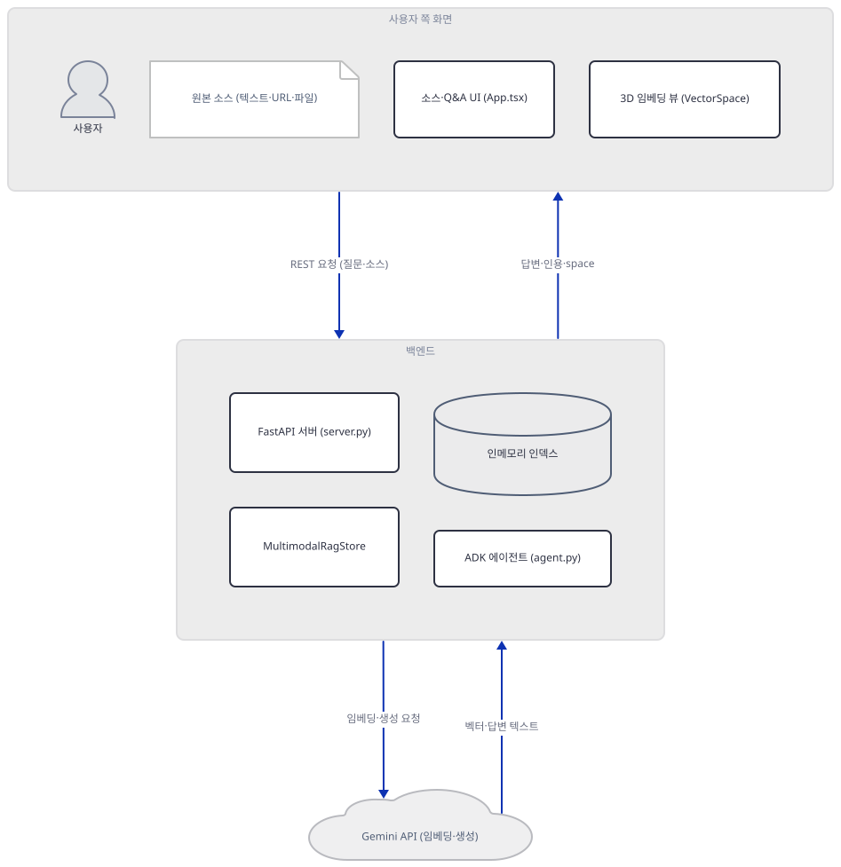
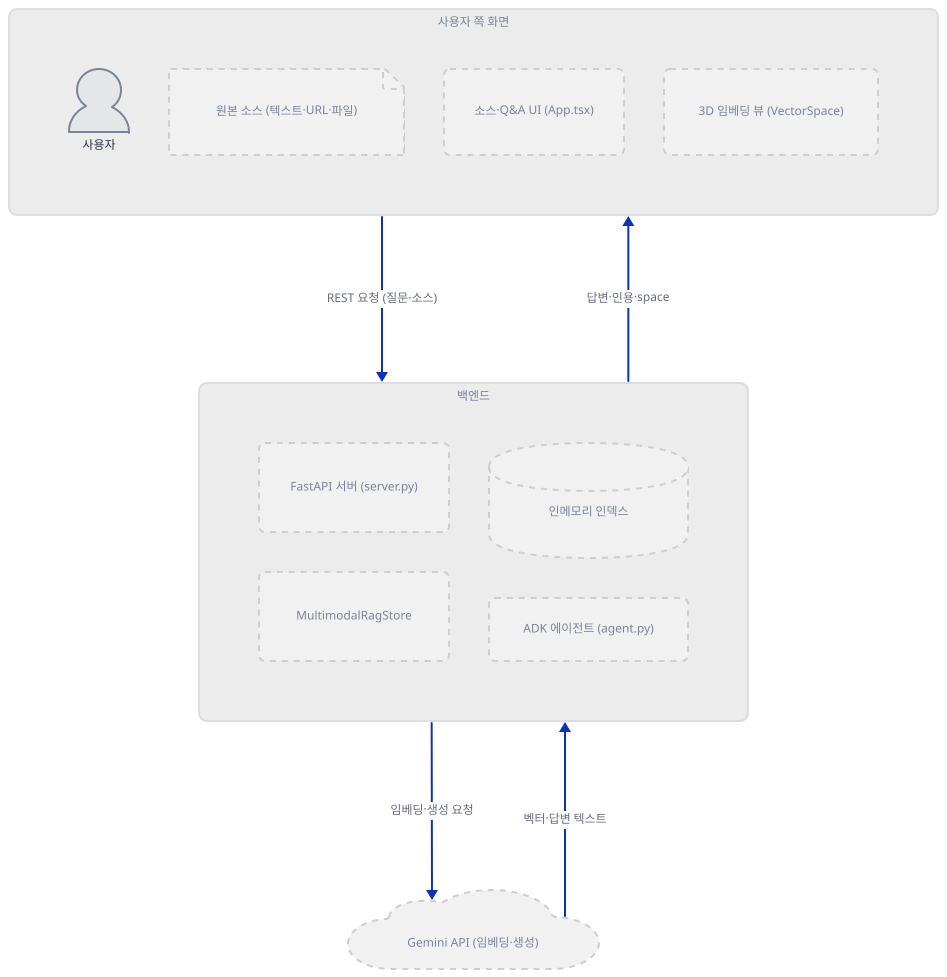
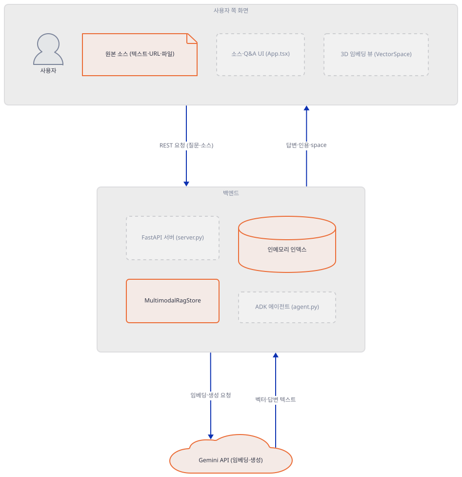
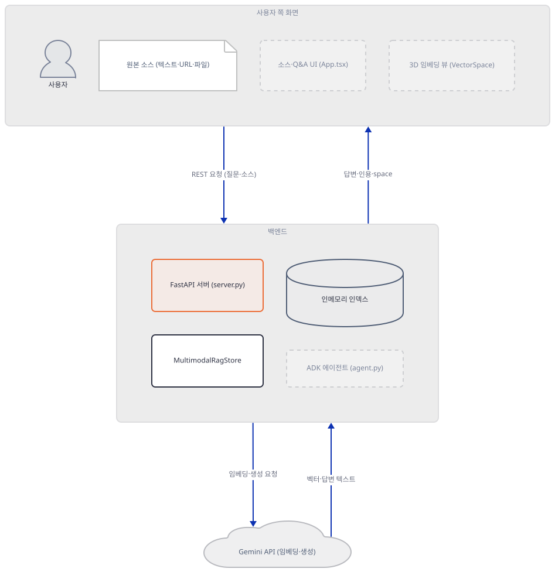
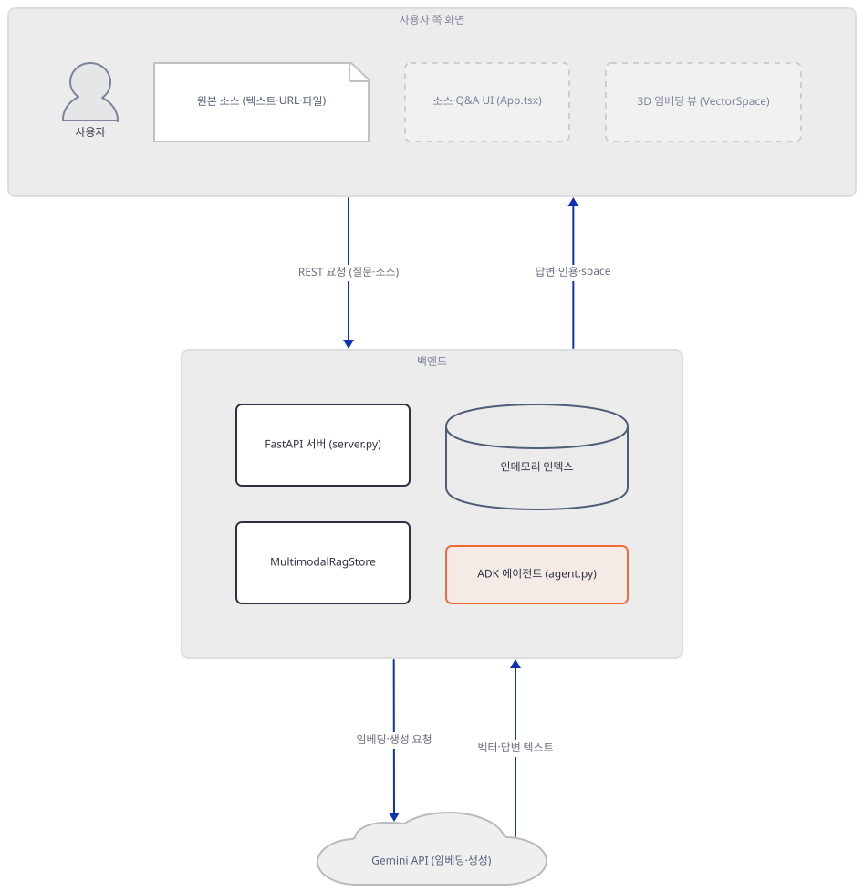
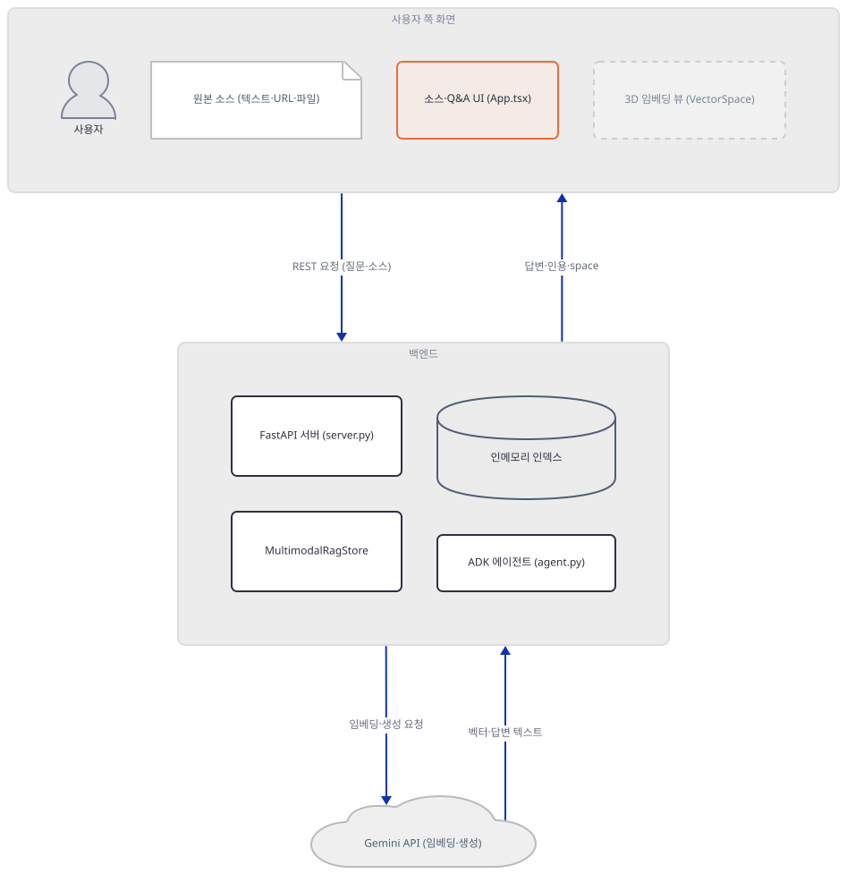
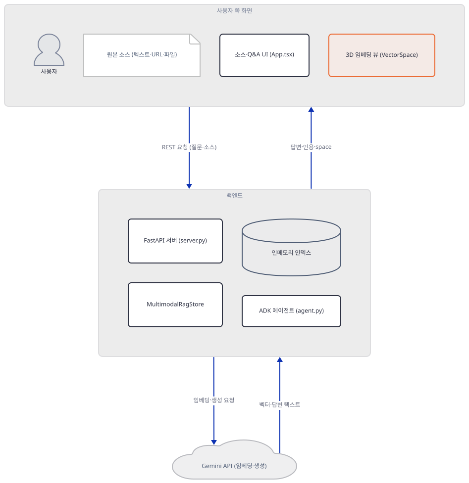
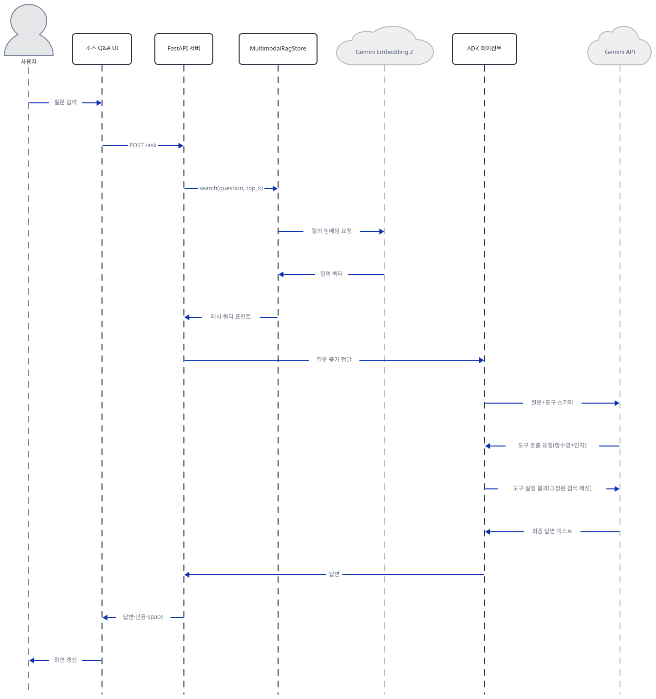

# Day 067 · 🧬 Multimodal Agentic RAG

> 볼륨 5 📀 RAG · 난이도 ★★★ · 예상 소요 90분(백엔드·프런트엔드 두 프로세스를 각각 설치·실행해야 해서 단일 프로세스 앱보다 손이 더 갑니다) · API 비용 대략 소스 하나당 임베딩 호출 1회 이상(텍스트는 청크 수만큼, 파일은 미디어 임베딩 1회+주석 임베딩 1회) + 질문마다 질의 임베딩 1회와 ADK 에이전트의 생성 호출(도구를 몇 번 부르느냐에 따라 1회 이상, 정확한 횟수는 모델이 정함) — 키가 없어 정확한 단가는 확인 못함 · 원본 앱: `rag_tutorials/multimodal_agentic_rag`

## 오늘 만들 것

오늘은 텍스트·URL·PDF·이미지·오디오·비디오를 한 벡터 공간에 넣고, 그 공간을 3D로 직접 들여다보면서 질문에 근거 있는 답을 받는 앱을 다룹니다. 지금까지 이 볼륨의 RAG 앱 스무 개 중 열여덟 개는 Streamlit이었고 FastAPI를 쓴 날은 하나도 없었는데(grep으로 직접 확인), 오늘은 처음으로 Python FastAPI 백엔드와 React+Vite 프런트엔드가 별도 프로세스로 갈라집니다. 백엔드의 `MultimodalRagStore`(507줄)는 Gemini Embedding 2로 여섯 가지 모달리티를 임베딩하고 코사인 유사도로 검색한 뒤, 진짜 PCA 라이브러리 대신 사인·코사인으로 시드를 잡은 자체 거듭제곱 반복(power iteration)으로 768차원 벡터를 3D 좌표로 눌러 담습니다(Step 2, 소스로 확인) — 프런트엔드는 그 좌표를 three.js로 그려 소스와 질의를 떠다니는 점으로 보여줍니다(Step 6). 답변은 Google ADK 에이전트가 만드는데, `/ask`가 검색을 딱 한 번만 실행하고 그 결과 패킷을 UI의 인용 패널과 에이전트의 도구 응답에 동시에 흘려보내는 구조라 두 화면이 서로 다른 근거로 답하는 일이 없습니다(Step 4). 807줄짜리 이 백엔드는 `requirements.txt` 7줄이 빠짐없이 설치되고 오늘의 google-adk 2.10.0에서도 코드의 키워드 인자가 전부 그대로 통한다는 것을 직접 확인했습니다(Step 1) — 그래서 이번 문서가 찾은 진짜 결함은 의존성 문제가 아니라 상태 문제입니다: 소스를 추가할 때 임베딩이 끝나기도 전에 소스 목록에 먼저 등록해 버리는 순서 때문에, 키가 없거나 임베딩이 실패하면 청크 0개짜리 "고아 소스"가 화면에 남습니다(직접 재현, Step 2). 완성하면 브라우저 탭 두 개(백엔드 8897, 프런트엔드 5177)를 오가며 소스를 넣고 3D 공간에서 그 점들이 어떻게 흩어지는지 확인하게 됩니다. 아래는 완성된 아키텍처입니다.



## 사전 준비

| 서비스/도구 | 용도 | 발급·설치 |
|---|---|---|
| Google API 키 (`GOOGLE_API_KEY`) | Gemini Embedding 2 임베딩과 ADK 에이전트의 `gemini-3-flash-preview` 생성 호출 인증. 없으면 백엔드는 뜨지만 소스 추가와 질문이 전부 실패합니다(Step 1) | https://aistudio.google.com/apikey |
| Node.js `^20.19.0` 또는 `>=22.12.0` | 프런트엔드(Vite 7 + React 19) 설치·실행에 필요한 최소 버전 — `npm install`이 실제로 받는 vite 7.3.2 패키지의 `engines` 필드로 소스에서 직접 확인. 이 문서는 Node.js v24.12.0으로 확인 | https://nodejs.org |
| uv | 백엔드 가상환경 생성과 패키지 설치 | [공통 사전 준비](../README.md#공통-사전-준비-한-번만) 절 참고 |

이 볼륨의 다른 날과 달리 Qdrant 같은 별도 벡터 DB 설치가 없습니다 — 저장소가 전부 백엔드 프로세스의 메모리 안에 있습니다(Step 2).

## 아키텍처 한눈에 보기

| 컴포넌트 | 역할 | 코드 위치 |
|---|---|---|
| 사용자 | 소스 추가, 질문 입력 | 코드 없음 (브라우저) |
| 소스·Q&A UI (`App.tsx`) | 텍스트/URL/파일 탭으로 소스 등록, 질문 전송, 답변·인용·트레이스 렌더링 | `rag_tutorials/multimodal_agentic_rag/frontend/src/App.tsx:430-467` |
| 3D 임베딩 뷰 (`VectorSpace`) | three.js로 소스·질의 포인트를 PCA 3D 공간에 그리고 hover로 하이라이트 | `rag_tutorials/multimodal_agentic_rag/frontend/src/App.tsx:187-398` |
| FastAPI 서버 (`server.py`) | 라우팅, CORS, URL SSRF 가드, ADK 실행 오케스트레이션 | `rag_tutorials/multimodal_agentic_rag/backend/server.py:36-51` |
| `MultimodalRagStore` (`rag_store.py`) | 청크·임베딩·코사인 검색·PCA 투영을 관리하는 인메모리 저장소 | `rag_tutorials/multimodal_agentic_rag/backend/rag_store.py:118-132` |
| Google ADK 에이전트 (`agent.py`) | 검색 결과를 근거로 답을 생성하는 코디네이터, 도구 2개 보유 | `rag_tutorials/multimodal_agentic_rag/backend/agentic_rag_agent/agent.py:17-40` |
| Gemini API | 임베딩(`gemini-embedding-2`)과 생성(`gemini-3-flash-preview`) | 코드 없음 (외부 서비스) |

## 단계별 진행

### Step 1. 환경 만들기 — 키 하나, 두 갈래로 쓰인다

**목적.** 격리된 가상환경에 백엔드 `requirements.txt` 7줄을 설치하고, `GOOGLE_API_KEY` 없이도 모든 import와 컴파일이 통과하는지, 그리고 서버가 키의 부재를 어디서 어떻게 감지하는지 확인합니다.

**할 일.**

```bash
cd rag_tutorials/multimodal_agentic_rag/backend
uv venv
uv pip install -r requirements.txt
```

(pip 대안: `python -m venv .venv && source .venv/bin/activate && pip install -r requirements.txt`. Windows PowerShell은 활성화만 `.venv\Scripts\Activate.ps1`로 바꿉니다.)

이 저장소는 루트에 `pyproject.toml`이 있어 `uv run`이 방금 만든 환경 대신 루트 `.venv`를 쓰므로, 이후 모든 `uv run` 명령에는 `--no-project`를 붙입니다.

`rag_tutorials/multimodal_agentic_rag/backend/requirements.txt:1-7`

```text
fastapi>=0.115.0
uvicorn>=0.30.0
google-genai>=1.0.0
google-adk>=1.0.0
python-multipart>=0.0.7
beautifulsoup4>=4.12.0
httpx>=0.27.0
```

버전 지정이 하나도 고정(`==`)이 아니라 전부 하한(`>=`)입니다. 직접 설치하면(`uv pip list` 기준) 이 7줄이 50개 패키지로 풀리고, 그중 **google-adk 2.10.0**과 **google-genai 2.25.0**이 오늘의 최신입니다. `requirements.txt`에 없는 패키지가 빠져서 막히는 일은 없었습니다 — Day 057이 `pypdf` 누락으로, Day 062가 `beautifulsoup4` 누락으로 각각 첫 단계부터 막혔던 것과 다릅니다.

이 앱은 Python 백엔드에 필요한 것을 전부 이 한 파일에 담았고, ADK를 가져오지 못하거나 키가 없을 때 무엇이 달라지는지는 서버 시작 코드 자체가 미리 검사해 둡니다.

`rag_tutorials/multimodal_agentic_rag/backend/server.py:19-33`

```python
try:
    from google.adk.runners import Runner
    from google.adk.sessions import InMemorySessionService
    from agentic_rag_agent.agent import build_agent

    ADK_AVAILABLE = bool(os.getenv("GOOGLE_API_KEY"))
except Exception:
    Runner = None
    InMemorySessionService = None
    build_agent = None
    ADK_AVAILABLE = False
    SETUP_ERROR = "Google ADK could not be imported. Install backend requirements and set GOOGLE_API_KEY."

if not os.getenv("GOOGLE_API_KEY"):
    SETUP_ERROR = "GOOGLE_API_KEY is required for Gemini Embedding 2 and the ADK answer flow."
```

주의할 점은 `ADK_AVAILABLE`이 "ADK가 설치됐는가"가 아니라 "설치됐고 **또한** 키가 있는가"를 뜻한다는 것입니다 — import 자체는 성공해도 키가 없으면 `ADK_AVAILABLE`은 `False`로 남습니다. 반대로 import가 실패하면(예: google-adk 미설치) 키가 있어도 `False`입니다. `SETUP_ERROR`는 두 번째 `if`에서 다시 한번 갱신되므로, import는 성공했지만 키만 없는 가장 흔한 경우에 실제로 화면에 뜨는 문구는 "GOOGLE_API_KEY is required for Gemini Embedding 2 and the ADK answer flow."입니다.



**확인.** 키 없이 모든 import와 컴파일이 통과하는지 직접 확인합니다.

```bash
uv run --no-project python -m py_compile app_state.py rag_store.py server.py agentic_rag_agent/__init__.py agentic_rag_agent/agent.py && echo COMPILE_OK
```

```
COMPILE_OK
```

```bash
uv run --no-project python -c "
from google import genai
from google.genai import types
from google.adk.agents import Agent
from google.adk.runners import Runner
from google.adk.sessions import InMemorySessionService
import fastapi, httpx, bs4
print('ALL IMPORTS OK')
"
```

```
ALL IMPORTS OK
```

이어서 키 없이 서버를 임포트하고 `/health`를 직접 호출해 `SETUP_ERROR`가 정말 그 문구인지 확인합니다(외부 요청 없이 FastAPI `TestClient`로만 — 아래 Step 3에서 같은 방식을 계속 씁니다).

```bash
uv run --no-project python -c "
from fastapi.testclient import TestClient
import server
client = TestClient(server.app, raise_server_exceptions=False)
print(client.get('/health').json())
"
```

직접 확인한 출력:

```
{'status': 'setup_required', 'adk': False, 'setup_error': 'GOOGLE_API_KEY is required for Gemini Embedding 2 and the ADK answer flow.', 'sources': 0, 'chunks': 0, 'dimensions': 768, 'provider': 'gemini-embedding-2', 'modalities': {}, 'chunk_modalities': {}, 'projection': 'pca_3d'}
```

### Step 2. 멀티모달 저장소 — 청크·임베딩·검색·3D 투영 (`rag_store.py`)

**목적.** `MultimodalRagStore`가 텍스트를 어떻게 청크로 나누고, 모달리티별로 임베딩 경로를 어떻게 가르며, 검색과 3D 투영을 어떻게 계산하는지 확인합니다. 그리고 소스 추가 실패가 왜 청크 0개짜리 고아를 남기는지 직접 재현합니다.

**할 일.** 텍스트는 170단어씩, 35단어를 겹치며 잘립니다 — 단 전체가 170단어 이하면 겹침 없이 통째로 청크 1개가 됩니다.

`rag_tutorials/multimodal_agentic_rag/backend/rag_store.py:73-86`

```python
def _chunk_text(text: str) -> list[str]:
    words = _clean_text(text).split()
    if not words:
        return []
    if len(words) <= CHUNK_WORDS:
        return [" ".join(words)]

    chunks: list[str] = []
    step = max(1, CHUNK_WORDS - CHUNK_OVERLAP)
    for start in range(0, len(words), step):
        chunk = words[start : start + CHUNK_WORDS]
        if len(chunk) >= 25:
            chunks.append(" ".join(chunk))
    return chunks
```

프런트엔드가 "Add source" 탭에 기본으로 채워 두는 샘플 텍스트는 59단어(직접 확인)라, 그대로 추가하면 청크는 항상 1개입니다.

파일(이미지·오디오·비디오·PDF)은 텍스트와 다른 경로를 탑니다 — 18MB를 넘거나 비디오·오디오면 Gemini File API로 업로드해 처리 상태를 폴링하고, 그 외(작은 이미지·PDF)는 먼저 인라인 임베딩을 시도합니다.

`rag_tutorials/multimodal_agentic_rag/backend/rag_store.py:189-211`

```python
    def _embed_file(self, data: bytes, mime_type: str, title: str, notes: str) -> tuple[list[float], str]:
        client = self._require_client()

        use_file_api = (
            len(data) > INLINE_MEDIA_LIMIT_BYTES
            or mime_type.startswith("video/")
            or mime_type.startswith("audio/")
        )
        if use_file_api:
            return self._embed_uploaded_file(data, mime_type, title), "gemini-file-api"

        part = types.Part.from_bytes(data=data, mime_type=mime_type)
        try:
            result = client.models.embed_content(
                model=EMBED_MODEL,
                contents=[part],
                config=types.EmbedContentConfig(output_dimensionality=self.dimensions),
            )
            return result.embeddings[0].values, "gemini-inline"
        except Exception:
            if mime_type.startswith(("video/", "audio/")) or mime_type == "application/pdf":
                return self._embed_uploaded_file(data, mime_type, title), "gemini-file-api"
            raise
```

인라인 임베딩이 실패했을 때 PDF·비디오·오디오는 File API로 재시도하지만 **이미지는 재시도 없이 그대로 예외를 다시 던집니다** — `except Exception:` 블록의 조건문에 `image/`가 없기 때문입니다(소스로 확인). File API 경로(`_embed_uploaded_file`, 149-187행)는 최대 90초(2초 간격 폴링)까지 처리 상태를 기다리고, 임베딩이 끝나면 업로드했던 파일을 `finally`에서 지웁니다 — 앱 자체 README의 "Media files uploaded through the Gemini File API are cleaned up after embedding"는 이 부분과 정확히 일치합니다.

파일 소스는 미디어 자체의 임베딩과 "제목 + 메모" 텍스트 임베딩을 0.68:0.32로 섞어 하나의 벡터로 만듭니다 — 메모를 비워 두면 "제목 (MIME 타입) embedded natively..." 같은 자동 문구가 대신 섞입니다. 그래서 이미지·오디오·비디오 인용 카드에 보이는 미리보기 텍스트는 Gemini가 자동으로 만든 설명이 아니라 사용자가 직접 적은 메모(또는 그 자동 문구) 그대로입니다.

`rag_tutorials/multimodal_agentic_rag/backend/rag_store.py:89-96`

```python
def _blend_vectors(primary: list[float], secondary: list[float], secondary_weight: float = 0.32) -> list[float]:
    primary_weight = 1.0 - secondary_weight
    blended = [
        (left * primary_weight) + (right * secondary_weight)
        for left, right in zip(primary, secondary)
    ]
    norm = math.sqrt(sum(value * value for value in blended)) or 1.0
    return [value / norm for value in blended]
```

검색은 질의를 임베딩한 뒤 모든 청크와 코사인 유사도를 계산하고, 소스마다 **가장 점수가 높은 청크 하나만** 남겨 상위 `top_k`개를 돌려줍니다 — 한 소스에 청크가 여러 개여도 인용 패널에는 소스당 한 장만 뜨는 이유입니다.

`rag_tutorials/multimodal_agentic_rag/backend/rag_store.py:401-419`

```python
            for chunk in self.chunks:
                score = round(_cosine(query_vector, chunk.vector), 4)
                current = source_matches.get(chunk.source_id)
                if not current or score > current["score"]:
                    source = source_by_id.get(chunk.source_id)
                    if not source:
                        continue
                    source_matches[chunk.source_id] = {
                        "id": source.id,
                        "source_id": source.id,
                        "title": source.title,
                        "modality": source.modality,
                        "text": chunk.text,
                        "score": score,
                        "projection": projections.get(source.id, {"x": 0.0, "y": 0.0, "z": 0.0}),
                        "metadata": {"best_chunk": chunk.id, **chunk.metadata},
                    }

            matches = sorted(source_matches.values(), key=lambda item: item["score"], reverse=True)[:top_k]
```

3D 좌표는 scikit-learn 같은 라이브러리 없이, 사인·코사인으로 시드를 잡은 후보 벡터를 24회 거듭제곱 반복(power iteration)으로 다듬어 첫 세 주성분을 근사하는 자체 구현입니다 — 매번 같은 데이터에 같은 결과를 내는 결정적 계산이라 재실행해도 점이 흔들리지 않습니다.

`rag_tutorials/multimodal_agentic_rag/backend/rag_store.py:213-232`

```python
    def _pca_projection(self, vectors: dict[str, list[float]]) -> dict[str, dict[str, float]]:
        if not vectors:
            return {}

        ids = list(vectors)
        rows = [vectors[item_id][: self.dimensions] for item_id in ids]
        if len(rows) == 1:
            return {ids[0]: {"x": 0.0, "y": 0.0, "z": 0.0}}

        means = [sum(row[index] for row in rows) / len(rows) for index in range(self.dimensions)]
        centered = [[row[index] - means[index] for index in range(self.dimensions)] for row in rows]
        components: list[list[float]] = []

        for component_index in range(3):
            candidate = [
                math.sin((index + 1) * (component_index + 1) * 0.017)
                + math.cos((index + 1) * (component_index + 2) * 0.013)
                for index in range(self.dimensions)
            ]
            candidate = _normalize(_orthogonalize(candidate, components))
```

소스가 하나뿐이면 그 점은 무조건 원점(0,0,0)입니다 — 위 함수의 `if len(rows) == 1:` 때문입니다. 소스를 하나만 넣고 3D 뷰를 열면 점이 정중앙에 멈춰 있는 것은 버그가 아니라 이 분기 그대로입니다.

이제 오늘의 핵심 결함입니다. `add_text_source`는 소스 메타데이터를 **임베딩을 시작하기 전에** 이미 `self.sources`에 등록합니다.

`rag_tutorials/multimodal_agentic_rag/backend/rag_store.py:297-328`

```python
    def add_text_source(self, title: str, text: str, modality: str = "text", seed: bool = False) -> RackSource:
        with self._lock:
            source_id = uuid.uuid4().hex[:10]
            chunks = _chunk_text(text)
            if not chunks:
                raise ValueError("Source text is empty.")

            source = RackSource(
                id=source_id,
                title=title.strip() or f"{modality.title()} source",
                modality=modality,
                summary=_clean_text(text)[:220],
                chunks=len(chunks),
            )
            self.sources.append(source)

            for index, chunk_text in enumerate(chunks):
                vector = self._embed_text(chunk_text, "task: retrieval document")
                chunk = RackChunk(
                    id=f"{source_id}-{index + 1}",
                    source_id=source_id,
                    title=source.title,
                    modality=modality,
                    text=chunk_text,
                    vector=vector,
                    metadata={"chunk_index": index + 1},
                )
                self.chunks.append(chunk)

            if not seed:
                self._emit("source_added", {"source_id": source_id, "title": source.title, "chunks": len(chunks)})
            return source
```

`self.sources.append(source)`(311행)가 임베딩 루프(313-314행)보다 먼저 실행되므로, 첫 청크의 `_embed_text` 호출이 예외를 던지면(키가 없을 때, 또는 Gemini API가 일시적으로 실패할 때) `source`는 이미 목록에 들어간 뒤이고 `self.chunks`에는 아무것도 쌓이지 않습니다. 반면 `add_file_source`(330-370행)는 순서가 반대입니다 — 미디어와 주석 임베딩(335·337행)이 **먼저** 끝난 뒤에야 `self.sources.append`가 나옵니다.

`rag_tutorials/multimodal_agentic_rag/backend/rag_store.py:330-338`

```python
    def add_file_source(self, title: str, data: bytes, mime_type: str, notes: str = "") -> RackSource:
        with self._lock:
            modality = self._modality_from_mime(mime_type)
            source_id = uuid.uuid4().hex[:10]
            display_text = _clean_text(notes) or f"{title} ({mime_type}) embedded natively in Gemini Embedding 2."
            media_vector, embedding_path = self._embed_file(data, mime_type, title, display_text)
            annotation_text = _clean_text(f"{title}. {display_text}")
            annotation_vector = self._embed_text(annotation_text, "task: retrieval document")
            vector = _blend_vectors(media_vector, annotation_vector)
```

즉 이 순서 문제는 **텍스트 소스에만** 있습니다. 이어서 눈에 띄는 것 하나 더 — `add_text_source`의 `seed: bool = False` 매개변수는 리포 전체에서 이 정의 줄 하나뿐, `seed=True`로 부르는 곳이 없습니다(grep으로 직접 확인). 있으나 마나 한 매개변수라는 뜻입니다.



**확인.** 키 없이 `add_text_source`를 직접 호출해 고아 소스가 정말 생기는지 재현합니다.

```bash
uv run --no-project python -c "
from rag_store import MultimodalRagStore
store = MultimodalRagStore()
try:
    store.add_text_source('orphan note', 'hello world ' * 30)
except RuntimeError as exc:
    print('add_text_source raised:', exc)
print('sources=%d chunks=%d' % (len(store.sources), len(store.chunks)))
"
```

직접 확인한 출력:

```
add_text_source raised: GOOGLE_API_KEY is required for Gemini Embedding 2.
sources=1 chunks=0
```

### Step 3. FastAPI 서버 — 라우팅과 URL 안전장치 (`server.py`)

**목적.** 6개 엔드포인트가 무엇을 하는지, CORS가 프런트엔드 포트와 어떻게 맞춰져 있는지, 그리고 URL 소스 추가가 왜 localhost와 사설 IP를 막는지 확인합니다.

**할 일.**

`rag_tutorials/multimodal_agentic_rag/backend/server.py:39-51`

```python
app = FastAPI(title="Multimodal Agentic RAG ADK")
allowed_origins = [
    origin.strip()
    for origin in os.getenv("ALLOWED_ORIGINS", "http://localhost:5177,http://127.0.0.1:5177").split(",")
    if origin.strip()
]
app.add_middleware(
    CORSMiddleware,
    allow_origins=allowed_origins,
    allow_credentials=False,
    allow_methods=["*"],
    allow_headers=["*"],
)
```

기본 허용 출처는 프런트엔드의 기본 포트(5177)와 정확히 맞춰져 있습니다. 포트를 바꾸면 `ALLOWED_ORIGINS`도 함께 바꿔야 합니다(PowerShell: `$env:ALLOWED_ORIGINS = "http://localhost:5555"`).

URL로 소스를 추가할 때는 요청을 보내기 전에 호스트를 검사합니다.

`rag_tutorials/multimodal_agentic_rag/backend/server.py:79-98`

```python
def _validate_fetch_url(url: str) -> None:
    parsed = urlparse(url)
    if parsed.scheme not in {"http", "https"} or not parsed.hostname:
        raise ValueError("Only HTTP and HTTPS URLs are supported.")

    if os.getenv("ALLOW_PRIVATE_URLS", "").lower() == "true":
        return

    if parsed.hostname.lower() == "localhost":
        raise ValueError("Private and localhost URLs are disabled for URL ingestion.")

    try:
        address_info = socket.getaddrinfo(parsed.hostname, None)
    except socket.gaierror as exc:
        raise ValueError(f"Could not resolve URL host: {parsed.hostname}") from exc

    for item in address_info:
        address = ipaddress.ip_address(item[4][0])
        if address.is_private or address.is_loopback or address.is_link_local or address.is_reserved:
            raise ValueError("Private and localhost URLs are disabled for URL ingestion.")
```

`"localhost"`라는 문자열 자체는 DNS 조회 없이 바로 막히고(87-88행), 그 외 호스트는 `socket.getaddrinfo`로 실제 주소를 구해 사설·루프백·링크로컬·예약 대역인지 봅니다. `ALLOW_PRIVATE_URLS=true`면 이 검사 전체를 건너뛰므로, 사내망 문서를 넣으려는 목적이 아니라면 켜지 않는 것이 안전합니다(SSRF 위험).

나머지 라우트는 전부 `RAG_STORE`를 스레드풀에서 부르는 얇은 래퍼입니다.

`rag_tutorials/multimodal_agentic_rag/backend/server.py:139-146`

```python
@app.get("/health")
async def health():
    return {
        "status": "ok" if ADK_AVAILABLE and not SETUP_ERROR else "setup_required",
        "adk": ADK_AVAILABLE,
        "setup_error": SETUP_ERROR,
        **await run_in_threadpool(RAG_STORE.space_tool),
    }
```

`/ask`만 예외입니다 — `RAG_STORE.search`를 부르는 줄이 try/except로 감싸여 있지 않아서, 키가 없어 `_embed_text`가 `RuntimeError`를 던지면 그대로 처리되지 않은 예외가 되어 FastAPI가 500을 돌려줍니다(다른 라우트는 전부 `except Exception as exc: raise HTTPException(400, ...)`로 감싸져 있는 것과 다릅니다).



**확인.** 키 없이 각 라우트가 정확히 무엇을 돌려주는지, 그리고 URL 가드가 실제로 무엇을 막는지 직접 확인합니다(URL은 검증 함수만 부르고 실제 GET은 보내지 않습니다).

```bash
uv run --no-project python -c "
from fastapi.testclient import TestClient
import server
client = TestClient(server.app, raise_server_exceptions=False)
res = client.post('/sources/text', json={'title': 'n', 'text': 'hello world ' * 30, 'modality': 'text'})
print('POST /sources/text ->', res.status_code, res.json())
res = client.post('/ask', json={'question': 'hi', 'top_k': 3})
print('POST /ask ->', res.status_code)
for url in ['http://localhost:8000/x', 'http://192.168.1.5/x', 'ftp://example.com/x']:
    try:
        server._validate_fetch_url(url)
        print(url, '-> allowed')
    except ValueError as exc:
        print(url, '->', exc)
"
```

직접 확인한 출력:

```
POST /sources/text -> 400 {'detail': 'GOOGLE_API_KEY is required for Gemini Embedding 2.'}
POST /ask -> 500
http://localhost:8000/x -> Private and localhost URLs are disabled for URL ingestion.
http://192.168.1.5/x -> Private and localhost URLs are disabled for URL ingestion.
ftp://example.com/x -> Only HTTP and HTTPS URLs are supported.
```

### Step 4. Google ADK 에이전트 — 도구 두 개와 "같은 증거" 트릭 (`agent.py`)

**목적.** `build_agent`가 에이전트를 어떻게 정의하는지, 그리고 서버가 `/ask` 요청마다 검색 도구를 통째로 바꿔치기해 UI 인용과 에이전트 답변이 항상 같은 증거를 쓰게 만드는 방법을 확인합니다.

**할 일.**

`rag_tutorials/multimodal_agentic_rag/backend/agentic_rag_agent/agent.py:17-40`

```python
def build_agent(retrieval_tool=retrieve_relevant_context) -> Agent:
    return Agent(
        name="multimodal_agentic_rag_agent",
        model="gemini-3-flash-preview",
        description="Agentic RAG coordinator for a multimodal Gemini Embedding 2 workspace.",
        instruction="""
You are the Google ADK coordinator for a multimodal agentic RAG workspace.

For every user question:
1. Use inspect_embedding_space to understand the current workspace.
2. Use retrieve_relevant_context with the user's question before answering.
3. Ground the answer in the retrieved evidence. Do not invent facts that are not supported by the workspace.
4. Do not include raw citation ids, source ids, bracket citations, Markdown bold markers, or asterisk bullets in the answer. The UI shows citations separately.
5. Start with a clear direct answer in 2-3 sentences.
6. If helpful, add a short "Key points:" section with simple hyphen bullets.
7. Explain briefly when the vector evidence is weak or sparse.
8. Keep the answer useful and direct.
""",
        tools=[inspect_embedding_space, retrieval_tool],
        generate_content_config=genai_types.GenerateContentConfig(
            temperature=0.25,
            max_output_tokens=900,
        ),
    )
```

`generate_content_config`는 오늘 설치되는 google-adk 2.10.0의 `Agent`(정확히는 `LlmAgent`) 클래스에 실제로 있는 필드입니다 — pydantic 모델이라 `inspect.signature(Agent.__init__)`로는 보이지 않지만 `Agent.model_fields`에서 `Optional[GenerateContentConfig]` 타입으로 직접 확인됩니다. 인용에서 대괄호나 Markdown 강조 기호를 빼라는 지시(29행)는 프런트엔드의 `cleanAnswerText`(정규식으로 `**`와 `[id-n]` 패턴을 지우는 후처리, Step 5)와 이중 방어를 이룹니다.

`retrieval_tool` 매개변수의 기본값은 파일 맨 위에 정의된 진짜 검색 함수입니다.

`rag_tutorials/multimodal_agentic_rag/backend/agentic_rag_agent/agent.py:1-14`

```python
from google.adk.agents import Agent
from google.genai import types as genai_types

from app_state import RAG_STORE


def retrieve_relevant_context(query: str, top_k: int = 5) -> dict:
    """Retrieve the most relevant multimodal source evidence for a user question."""
    return RAG_STORE.retrieval_tool(query=query, top_k=top_k)


def inspect_embedding_space() -> dict:
    """Inspect current sources, modalities, dimensions, and embedding provider."""
    return RAG_STORE.space_tool()
```

파일 맨 끝의 `root_agent = build_agent()`는 인자 없이 불려 이 진짜 함수를 그대로 쓰므로, ADK CLI(`adk web`/`adk run`)로 이 모듈을 직접 열면 매번 새로 검색합니다. 그런데 `/ask`를 처리하는 `_run_adk_agent`는 `root_agent`를 전혀 쓰지 않고, 요청마다 같은 이름의 **다른** 함수를 새로 만들어 넘깁니다.

`rag_tutorials/multimodal_agentic_rag/backend/server.py:112-136`

```python
async def _run_adk_agent(question: str, retrieval: dict[str, Any]) -> str:
    if not ADK_AVAILABLE:
        raise HTTPException(503, SETUP_ERROR or "Google ADK is unavailable.")

    def retrieve_relevant_context(query: str, top_k: int = 6) -> dict:
        """Return the exact retrieval packet already embedded for this request."""
        return retrieval

    request_agent = build_agent(retrieve_relevant_context)
    request_runner = Runner(agent=request_agent, app_name=APP_NAME, session_service=session_service)
    session = await session_service.create_session(app_name=APP_NAME, user_id=USER_ID)
    content = genai_types.Content(
        role="user",
        parts=[genai_types.Part(text=f"Question: {question}\nUse the retrieval tool result for this exact question.")],
    )
    final_text = ""
    async for event in request_runner.run_async(
        user_id=USER_ID,
        session_id=session.id,
        new_message=content,
    ):
        text = _event_text(event)
        if text:
            final_text = text
    return final_text
```

이 지역 함수는 이름과 매개변수 모양(`query`, `top_k`)은 진짜 도구와 같지만, 실제로는 인자를 전혀 쓰지 않고 `/ask` 핸들러가 **이미 계산해 둔** `retrieval` 딕셔너리를 그대로 돌려줍니다(118행). `/ask`는 이 값을 먼저 `RAG_STORE.search`로 한 번 구한 뒤(Step 2) UI의 인용 패널에도 그대로 보내고, 에이전트에게도 "도구 호출 결과"로 위장해 같은 값을 줍니다 — 그래서 에이전트가 실제로 몇 번을 검색하든, 다른 질의어로 다시 검색하려 하든 결과는 항상 화면과 같습니다. 두 함수의 독스트링도 다릅니다("Retrieve the most relevant..." 대 "Return the exact retrieval packet...") — 같은 도구 이름 뒤에 완전히 다른 동작이 숨어 있는 셈입니다.

키가 없어 `run_async`(실제 Gemini 생성 호출)는 이 문서에서 실행하지 않습니다. 대신 에이전트와 Runner가 키 없이도 **생성까지만**은 문제없이 되는지 확인합니다.



**확인.**

```bash
uv run --no-project python -c "
from agentic_rag_agent.agent import build_agent
from google.adk.runners import Runner
from google.adk.sessions import InMemorySessionService
agent = build_agent()
print('agent constructed:', agent.name, agent.model, 'tools=%d' % len(agent.tools))
runner = Runner(agent=agent, app_name='test_app', session_service=InMemorySessionService())
print('runner constructed OK, no network calls made')
"
```

직접 확인한 출력:

```
agent constructed: multimodal_agentic_rag_agent gemini-3-flash-preview tools=2
runner constructed OK, no network calls made
```

`gemini-3-flash-preview`와 임베딩용 `gemini-embedding-2`가 지금 이 시점에 실제로 호출 가능한 모델명인지는 키가 없어 이 문서에서 확인하지 못했습니다.

### Step 5. 프런트엔드 — 소스 매니저와 Q&A UI (`App.tsx`)

**목적.** Node/npm으로 React+Vite 앱을 설치·빌드하고, 소스 추가와 질문 전송이 어떤 요청을 보내는지, 그리고 "Agent Trace" 패널이 실제로 무엇을 보여주는지 확인합니다.

**할 일.**

```bash
cd rag_tutorials/multimodal_agentic_rag/frontend
npm install
npm run build
```

`rag_tutorials/multimodal_agentic_rag/frontend/vite.config.ts:1-9`

```typescript
import { defineConfig } from "vite";
import react from "@vitejs/plugin-react";

export default defineConfig({
  plugins: [react()],
  server: {
    port: 5177,
  },
});
```

백엔드 주소는 빌드 시점이 아니라 런타임에 `import.meta.env.VITE_API_URL`로 읽습니다 — 기본값은 `http://localhost:8897`이고, 백엔드를 다른 포트로 띄웠다면 `VITE_API_URL=http://localhost:8897 npm run dev -- --port 5177`처럼 넘깁니다(PowerShell: `$env:VITE_API_URL = "http://localhost:8897"; npm run dev -- --port 5177`).

질문 전송은 `top_k`를 6으로 고정해 보냅니다.

`rag_tutorials/multimodal_agentic_rag/frontend/src/App.tsx:532-557`

```typescript
  async function askQuestion() {
    if (!question.trim()) return;
    setIsAsking(true);
    setQaError("");
    setQaStatus("Retrieving evidence and asking the ADK coordinator...");
    setAnswer("");
    try {
      const res = await fetch(`${API}/ask`, {
        method: "POST",
        headers: { "Content-Type": "application/json" },
        body: JSON.stringify({ question, top_k: 6 }),
      });
      const data: AskResponse = await res.json();
      if (!res.ok) throw new Error((data as unknown as { detail?: string }).detail || "Question failed.");
      setAnswer(data.answer);
      setMatches(data.matches);
      setTrace(data.trace);
      setQueryPoint(data.query_point);
      setSpace(data.space);
      setQaStatus(`Retrieved ${data.matches.length} citation${data.matches.length === 1 ? "" : "s"}.`);
    } catch (error) {
      setQaError(error instanceof Error ? error.message : "Something went wrong.");
    } finally {
      setIsAsking(false);
    }
  }
```

`setTrace(data.trace)`가 그대로 렌더되는 곳이 "Agent Trace" 패널입니다.

`rag_tutorials/multimodal_agentic_rag/frontend/src/App.tsx:727-747`

```typescript
          <section className="panel trace-panel">
            <div className="panel-heading">
              <div>
                <h2>Agent Trace</h2>
                <p>Google ADK tool path</p>
              </div>
              <Sparkles size={18} />
            </div>
            <div className="trace-list">
              {(trace.length ? trace : [
                { agent: "source_ingestor", status: "ready", detail: "Waiting for a question" },
                { agent: "retrieval_tool", status: "ready", detail: "Nearest-neighbor evidence will appear here" },
                { agent: "answer_synthesizer", status: "ready", detail: "Cited answer stream target" },
              ]).map((step) => (
                <div className="trace-row" key={step.agent}>
                  <span>{step.agent}</span>
                  <p>{step.detail}</p>
                </div>
              ))}
            </div>
          </section>
```

소제목은 "Google ADK tool path"지만, 프런트엔드는 그저 `rag_tutorials/multimodal_agentic_rag/backend/server.py:220-236`이 매번 만드는 고정된 3줄 배열(`space_inspector`·`retrieval_tool`·`answer_synthesizer`, 상태는 항상 `"complete"`)을 그대로 나열할 뿐입니다 — ADK 런너가 실제로 어떤 이벤트를 냈는지는 `_event_text`가 텍스트만 뽑고 버립니다(Step 4). 에이전트가 도구를 정말 몇 번 불렀는지, 혹은 아예 안 불렀는지는 이 패널만 봐서는 알 수 없습니다.



**확인.** 백엔드 없이 프런트엔드만 빌드되는지, 그리고 개발 서버가 뜨는지 확인합니다.

```bash
npm run build
```

직접 확인한 출력(마지막 줄):

```
✓ built in 6.18s
```

```bash
npm run dev &
curl -s -o /dev/null -w "HTTP %{http_code}\n" http://localhost:5177/
```

(`npm run dev`는 `package.json`에 이미 `vite --host 0.0.0.0`로 정의되어 있어 추가 인자가 필요 없습니다.)

직접 확인한 출력:

```
HTTP 200
```

### Step 6. 3D 임베딩 뷰와 전체 실행

**목적.** `VectorSpace` 컴포넌트가 three.js로 포인트·헤일로를 어떻게 그리고 마우스 hover를 어떻게 처리하는지 확인한 뒤, 백엔드와 프런트엔드를 함께 띄우는 전체 흐름을 정리합니다.

**할 일.** 각 포인트는 PCA 좌표에 1.35배를 곱한 위치에 작은 구를 그리고, 질의점이거나 이번 답변의 인용 대상이면 은은한 빛 번짐(halo) 스프라이트를 추가로 얹습니다.

`rag_tutorials/multimodal_agentic_rag/frontend/src/App.tsx:271-291`

```typescript
    allPoints.forEach((point) => {
      const position = new THREE.Vector3(point.projection.x * 1.35, point.projection.y * 1.35, point.projection.z * 1.35);
      const isQuery = point.modality === "query";
      const isMatched = matchedIds.has(point.source_id);
      if (isQuery || isMatched) {
        const haloMaterial = new THREE.SpriteMaterial({
          map: glowTexture,
          color: new THREE.Color(isQuery ? "#f54e00" : point.color),
          transparent: true,
          opacity: isQuery ? 0.32 : 0.24,
          depthWrite: false,
        });
        const halo = new THREE.Sprite(haloMaterial);
        halo.position.copy(position);
        halo.scale.setScalar(isQuery ? 0.72 : 0.58);
        halo.userData.baseScale = isQuery ? 0.72 : 0.58;
        halo.userData.baseOpacity = isQuery ? 0.32 : 0.24;
        halo.userData.id = point.id;
        halos.push(halo);
        pointGroup.add(halo);
      }
```

`pointermove` 이벤트가 발생할 때마다(애니메이션 프레임이 아니라 실제 마우스 이동마다) `Raycaster`가 화면 좌표를 3D 광선으로 바꿔 어떤 점과 만나는지 계산하고, 맞은 점을 `onSelect`로 부모(`App`)에 알려 우측 하단 카드에 제목·모달리티·미리보기를 띄웁니다.

`rag_tutorials/multimodal_agentic_rag/frontend/src/App.tsx:313-322`

```typescript
    const handlePointer = (event: PointerEvent) => {
      const rect = renderer.domElement.getBoundingClientRect();
      pointer.x = ((event.clientX - rect.left) / rect.width) * 2 - 1;
      pointer.y = -((event.clientY - rect.top) / rect.height) * 2 + 1;
      pointerTarget.set(pointer.x, pointer.y);
      raycaster.setFromCamera(pointer, camera);
      const hit = raycaster.intersectObjects(meshes)[0];
      renderer.domElement.style.cursor = hit ? "pointer" : "default";
      onSelect(hit ? pointMapRef.current.get(hit.object.userData.id) ?? null : null);
    };
```

점들은 정지해 있지 않습니다 — 매 프레임 `Math.cos`/`Math.sin`으로 각자 다른 반지름·위상·속도에 따라 자기 자신의 PCA 기준 위치(`object.base`) 주위를 살짝 공전하고 위아래로 까딱입니다(342-363행, 소스로 확인). 이 흔들림은 장식일 뿐이고, 실제 좌표 정보는 그 기준 위치 자체에 있습니다.

이제 두 프로세스를 함께 띄웁니다.

```bash
# 터미널 1
cd rag_tutorials/multimodal_agentic_rag/backend
export GOOGLE_API_KEY="your-google-ai-studio-key"   # PowerShell: $env:GOOGLE_API_KEY = "your-google-ai-studio-key"
uv run --no-project python server.py

# 터미널 2
cd rag_tutorials/multimodal_agentic_rag/frontend
npm run dev -- --port 5177
```

브라우저에서 `http://localhost:5177`을 열면 왼쪽에 소스 매니저, 가운데에 3D 뷰, 오른쪽에 Q&A·트레이스·인용 패널이 보입니다. 텍스트 소스를 하나 추가하면 그 점이 원점(소스가 하나뿐이므로, Step 2)에 나타나고, 소스를 하나 더 추가한 뒤 질문을 던지면 두 점이 갈라지고 질의점(주황)이 그 사이 어딘가에 나타나는 것을 볼 수 있습니다. 이 실제 임베딩·생성 호출은 키가 있는 독자의 몫이며, 이 문서는 여기까지를 소스와 격리된 실행으로 확인했습니다.



**확인.** 백엔드가 정말 8897번에서, 프런트엔드가 5177번에서 응답하는지는 위 두 명령을 각자 실행해 브라우저나 `curl http://localhost:8897/health` / `curl http://localhost:5177/`로 확인합니다.

## 요청 한 건이 흐르는 과정



질문을 보내면 UI는 `POST /ask`만 호출하고, 나머지는 서버가 순서대로 처리합니다. 서버는 먼저 `MultimodalRagStore.search`로 질의를 임베딩해 코사인 유사도 상위 매치를 구하고(Step 2), 그 결과를 UI로 돌려줄 인용 패킷과 에이전트에게 넘길 "도구 응답"으로 동시에 준비합니다. 이어서 ADK 에이전트를 새로 만들어(Step 4) Gemini API에 프롬프트와 도구 결과를 보내고, 텍스트 답변만 받아 옵니다. 마지막으로 서버는 답변·인용·고정된 3줄 트레이스·갱신된 3D 스냅샷을 한 번에 묶어 UI로 돌려주고, UI는 답변 영역과 3D 뷰를 함께 갱신합니다. 이 시퀀스는 Step 2~5에서 각 구간을 소스와 격리된 실행으로 확인한 것을 이어붙인 것이며, 키가 없어 처음부터 끝까지 한 번에 재현하지는 못했습니다.

## 실행 체크리스트

- [ ] `uv venv && uv pip install -r requirements.txt`로 백엔드 의존성 7줄이 50개 패키지로 풀리고 google-adk 2.10.0이 설치되는 것을 확인했다
- [ ] `GOOGLE_API_KEY` 없이도 모든 import와 `py_compile`이 통과하고, `/health`가 200과 `"status": "setup_required"`를 반환하는 것을 직접 확인했다
- [ ] `add_text_source`가 임베딩 실패 시에도 소스를 먼저 등록해 청크 0개짜리 고아 소스를 남긴다는 것을 직접 재현했다
- [ ] `add_file_source`는 반대로 임베딩을 먼저 끝낸 뒤에만 소스를 등록한다는 차이를 소스로 확인했다
- [ ] `_validate_fetch_url`이 localhost·사설 IP를 막고 http/https가 아닌 스킴도 거부한다는 것을 직접 확인했다
- [ ] `build_agent()`와 `Runner`/`InMemorySessionService`가 키 없이도 생성까지는 성공한다는 것을 확인했고, 실제 생성 호출(`run_async`)은 실행하지 않았다
- [ ] "Agent Trace" 패널의 3줄이 ADK 이벤트가 아니라 서버가 매번 구성하는 고정 요약이라는 것을 소스로 확인했다
- [ ] `npm install && npm run build`로 프런트엔드가 백엔드 없이도 빌드되는 것을 확인했다
- [ ] `npm run dev`로 뜬 Vite 개발 서버가 `http://localhost:5177`에서 200을 응답하는 것을 확인했다

## 문제 해결

| 증상 | 원인 | 해결 |
|---|---|---|
| `GOOGLE_API_KEY` 없이 소스를 추가하면 400 오류가 뜨는데도 왼쪽 소스 목록에 청크 0개짜리 항목이 남는다 | `add_text_source`가 `self.sources.append(source)`를 임베딩 루프보다 먼저 실행해서, 첫 청크 임베딩이 실패해도 소스 메타데이터는 이미 등록된 뒤이기 때문(직접 확인, Step 2) | 리포 코드는 고치지 않는 것이 이 시리즈의 방침. 남은 고아 소스는 UI의 휴지통 버튼(`DELETE /sources/{id}`, 정상 동작)으로 지운다 |
| 질문을 보내면 답 대신 500 Internal Server Error만 뜬다 | `/ask`가 `RAG_STORE.search` 호출을 try/except로 감싸지 않아서, 키가 아예 없으면 `_require_client()`의 `RuntimeError`가 그대로 올라감(직접 확인, Step 3). 키가 틀린 경우는 Gemini API 호출 자체가 실패하며 다른 예외가 나겠지만 키가 없어 이 문서에서는 확인하지 못함 | `GOOGLE_API_KEY`가 설정됐고 올바른지 서버 콘솔 로그로 확인 |
| "Agent Trace" 패널에 항상 똑같은 3줄만 뜨고 실제로 어떤 도구가 몇 번 호출됐는지 알 수 없다 | `/ask`가 반환하는 `trace`는 ADK 실행 이벤트를 읽어 만든 것이 아니라 서버가 매번 같은 문구로 구성하는 고정 요약(소스로 확인, Step 4·5) | 리포 코드는 고치지 않는 것이 방침. 실제 도구 호출을 보려면 `_run_adk_agent`의 `event` 루프에서 `event.get_function_calls()`를 직접 로그로 남겨본다 |
| localhost나 사설 IP로 URL 소스를 추가하면 항상 거부된다 | `_validate_fetch_url`이 `ALLOW_PRIVATE_URLS=true`가 아닌 한 loopback·사설·링크로컬·예약 대역을 전부 막음(직접 확인, Step 3) | 로컬 테스트가 꼭 필요하면 `ALLOW_PRIVATE_URLS=true` 환경변수를 설정(프로덕션에는 SSRF 위험이 있어 권장하지 않음) |

## 더 해보기

- `_run_adk_agent`의 `event` 루프(`rag_tutorials/multimodal_agentic_rag/backend/server.py:128-132`)에서 `event.get_function_calls()`를 모아 실제 도구 호출 로그를 `/ask` 응답에 실어보고, 지금의 고정 3줄 트레이스와 비교해보기
- `add_text_source`(`rag_tutorials/multimodal_agentic_rag/backend/rag_store.py:297-328`)를 `add_file_source`처럼 임베딩을 전부 끝낸 뒤에만 `self.sources.append`하도록 고쳐, 임베딩 실패 시 고아 소스가 더 이상 남지 않는지 확인해보기
- `_embed_file`(`rag_tutorials/multimodal_agentic_rag/backend/rag_store.py:189-211`)의 인라인 실패 폴백 조건에 `image/`를 추가해, 큰 이미지도 File API로 자동 전환되는지 실험해보기

## 다음 날 예고

[Day 068 · 🧠 Agentic RAG with GPT-5](../day068-agentic-rag-gpt5/README.md) — Agno 프레임워크와 GPT-5, LanceDB로 만드는 에이전틱 RAG 앱을 다룹니다.
