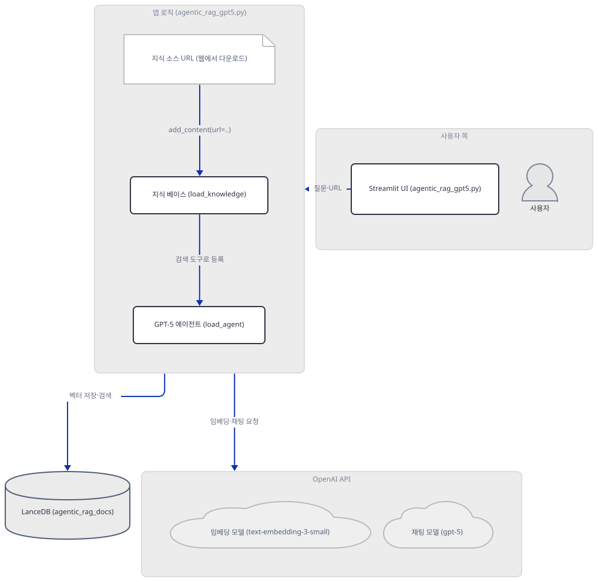
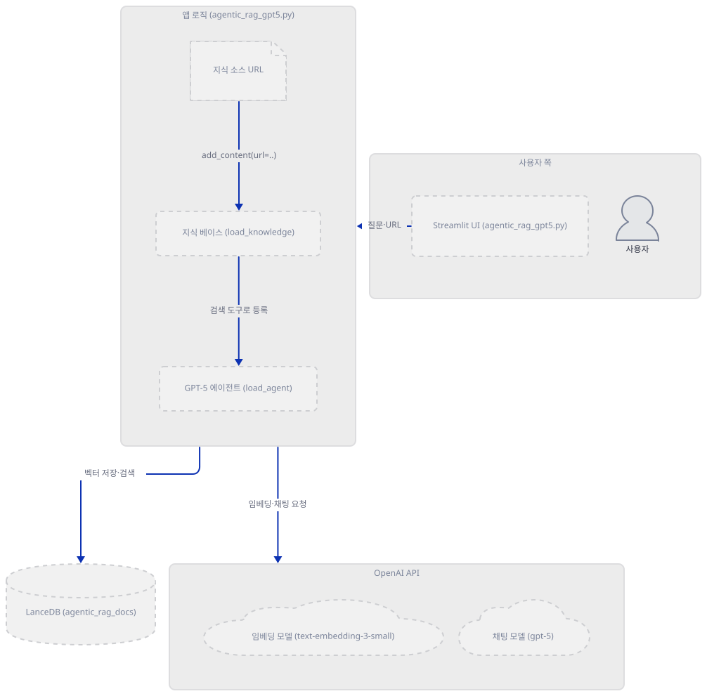
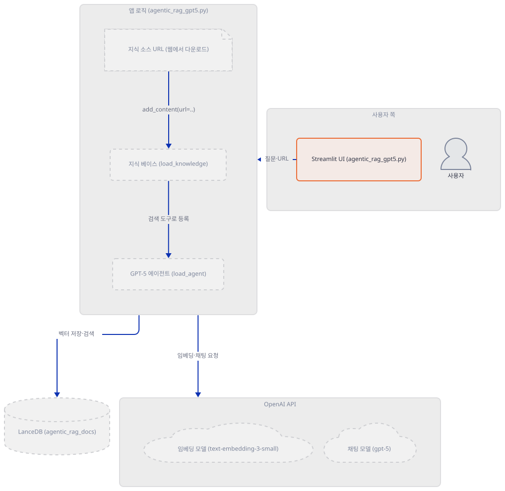
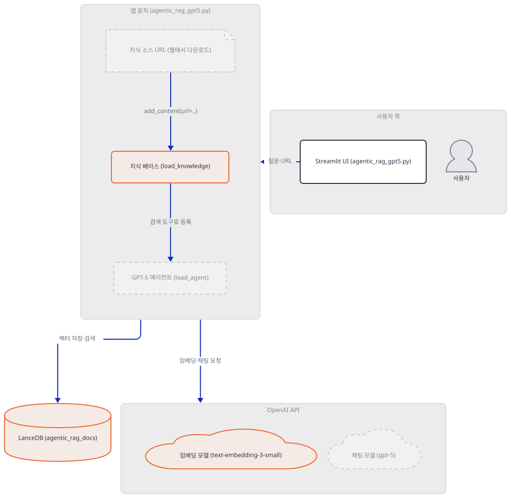
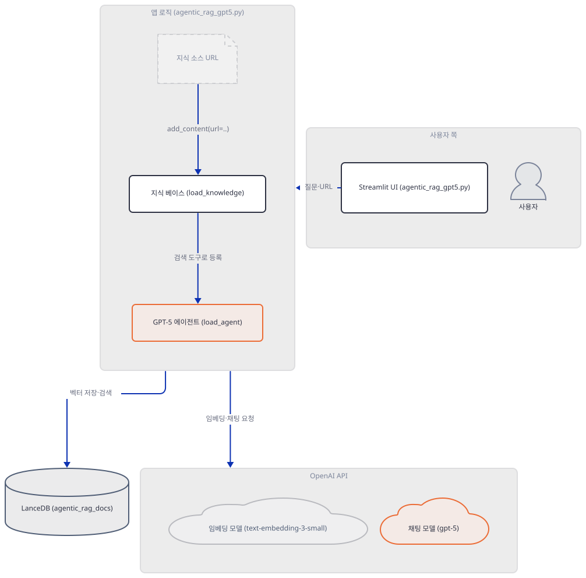
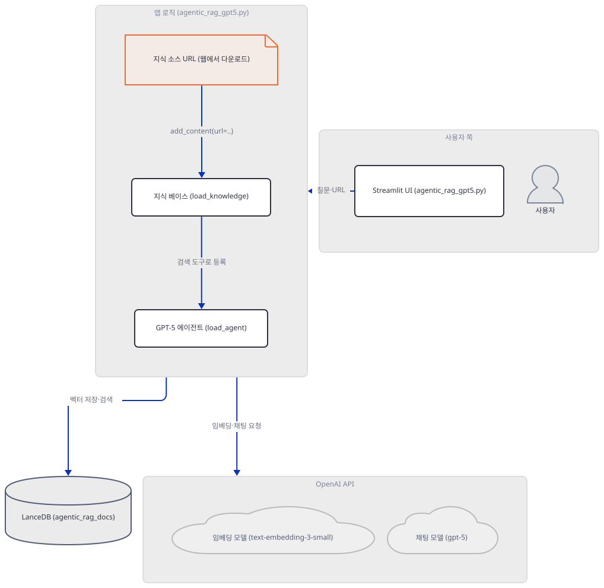
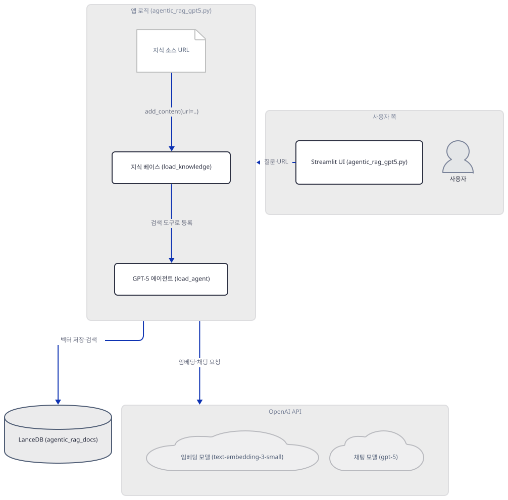
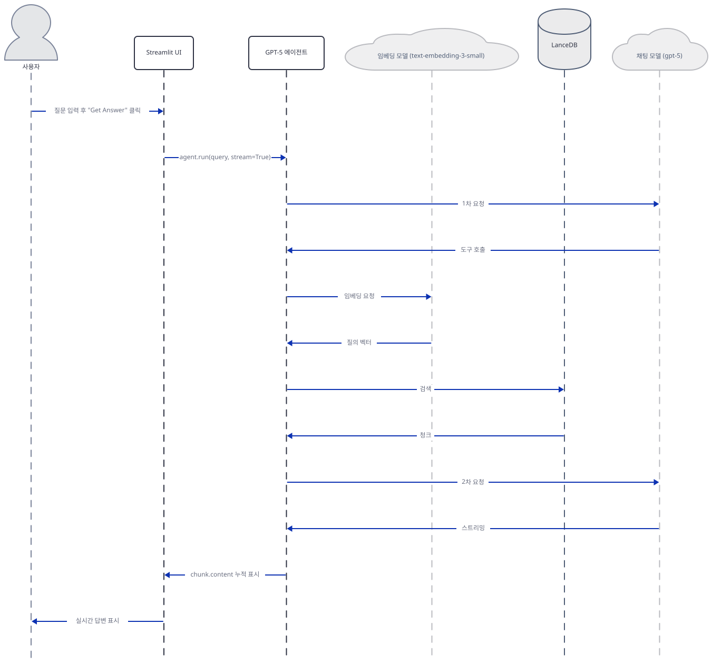

# Day 068 · 🧠 Agentic RAG with GPT-5

> 볼륨 5 📀 RAG · 난이도 ★★☆ · 예상 소요 65분 · API 비용 대략 확인 불가(GPT-5 채팅과 `text-embedding-3-small` 임베딩 모두 토큰 단위 종량제이지만, 이 문서는 코드 결함 때문에 실제 호출 지점까지 가지 못합니다 — Step 5) · 원본 앱: `rag_tutorials/agentic_rag_gpt5`

## 오늘 만들 것

오늘 앱은 217줄짜리 Streamlit 하나로 끝나는 가장 짧은 축의 agentic RAG입니다. 골격은 이 볼륨이 되풀이해 온 것과 같습니다 — agno의 `Knowledge`가 `LanceDb`(벡터 저장소)와 `OpenAIEmbedder`(임베딩)를 묶고, `Agent`가 그 지식 베이스와 채팅 모델(`OpenAIChat(id="gpt-5")`)을 묶어 `search_knowledge_base`라는 도구로 검색 여부를 스스로 판단합니다 — 이 판단 메커니즘 자체는 Day 047이 이미 소스로 확인했으므로 여기서는 되풀이하지 않습니다. 오늘 새로 보는 것은 세 가지입니다. 첫째, GPT-5 자체 — agno의 `OpenAIChat` 기본값이 이미 `gpt-5.4-mini`로 넘어가 있을 만큼(소스로 확인) GPT-5 계열이 일상화됐고, `reasoning_effort`(추론 모델 공통)·`verbosity`(GPT-5 계열) 같은 필드가 클래스에 있지만 이 앱은 그중 무엇도 지정하지 않습니다(Step 4). 둘째, `requirements.txt` 5줄에 `openai`가 이미 들어 있어서 — Day 047·050이 매번 씨름했던 "agno가 요구하는데 선언에는 없는" 패턴이 오늘은 없습니다(Step 1). 셋째, 그리고 가장 중요한 것은, 이 앱이 사이드바에 API 키를 입력하는 순간 108행의 `knowledge.add_content(url=url)`에서 항상 `AttributeError`로 멈춰 질문 입력창에 단 한 번도 이르지 못한다는 사실입니다 — `add_content`가 `insert`로 이름이 바뀐 것은 Day 047·050과 같은 agno 버전 드리프트이지만, 이번엔 Streamlit의 공식 테스트 도구 `AppTest`로 실제 앱 파일을 그대로 실행해 정확히 그 줄에서 멈추는 것을 직접 확인합니다(Step 5·6). 앱 자체 README도 코드와 어긋나는 곳이 여러 군데 있습니다 — 실제로 없는 `UrlKnowledge` 클래스를 언급하고, 모델을 "GPT-5-nano"라 부르지만 코드는 `id="gpt-5"`이며, 기본 지식 소스를 Agno 공식 문서라 하지만 실제 기본 URL은 MCP·A2A를 비교하는 블로그 글이고, 추천 질문 문구도 코드의 버튼 3개와 다릅니다(문제 해결). 완성해도 이 문서 기준으로는 질문 화면 자체를 볼 수 없다는 것이 오늘의 결론이며, 아래는 코드가 의도한 완성 아키텍처입니다.



## 사전 준비

| 서비스/도구 | 용도 | 발급·설치 |
|---|---|---|
| OpenAI API 키 | GPT-5 채팅과 `text-embedding-3-small` 임베딩 호출 인증(이 문서는 코드 결함으로 실제 호출까지 가지 않습니다 — Step 5) | https://platform.openai.com/ 에서 발급 |
| uv | 가상환경 생성과 패키지 설치 | [공통 사전 준비](../README.md#공통-사전-준비-한-번만) 절 참고 |
| 인터넷 연결 | PyPI 설치만 필요합니다. 코드가 URL을 내려받거나 OpenAI에 접속하는 지점에는 이 문서가 도달하지 못합니다(Step 5) | 별도 설치 없음 |

## 아키텍처 한눈에 보기

| 컴포넌트 | 역할 | 코드 위치 |
|---|---|---|
| 사용자 | 사이드바에 API 키·URL 입력, 질문 입력 | 코드 없음 (브라우저) |
| Streamlit UI | API 키·URL 입력 사이드바, 질문 입력과 답변 표시 | `rag_tutorials/agentic_rag_gpt5/agentic_rag_gpt5.py:31-56`, `rag_tutorials/agentic_rag_gpt5/agentic_rag_gpt5.py:149-182` |
| 지식 소스 URL (기본 1개) | `add_content`가 적재를 시도하는 대상 — MCP·A2A 비교 블로그 글 | `rag_tutorials/agentic_rag_gpt5/agentic_rag_gpt5.py:62` |
| 지식 베이스 (load_knowledge) | LanceDB·임베더를 묶어 검색 인터페이스 제공, 프로세스당 한 번만 생성 | `rag_tutorials/agentic_rag_gpt5/agentic_rag_gpt5.py:66-80` |
| 임베딩 모델 (text-embedding-3-small, OpenAI) | 청크·질의 텍스트를 1536차원 벡터로 변환(기본값 — 코드에 모델 id·차원 명시 없음) | `rag_tutorials/agentic_rag_gpt5/agentic_rag_gpt5.py:75-77` |
| LanceDB (agentic_rag_docs) | 벡터·원문을 저장하는 로컬 파일 기반 저장소(`uri="tmp/lancedb"`) | `rag_tutorials/agentic_rag_gpt5/agentic_rag_gpt5.py:71-74` |
| GPT-5 에이전트 (load_agent) | 검색 도구 등록, 최종 답변 생성 | `rag_tutorials/agentic_rag_gpt5/agentic_rag_gpt5.py:82-100` |
| 채팅 모델 (gpt-5, OpenAI) | 최종 답변 생성 | `rag_tutorials/agentic_rag_gpt5/agentic_rag_gpt5.py:87-90` |

## 단계별 진행

### Step 1. 환경 만들기 — 5줄로 6개 import가 곧장 성공한다

**목적.** 격리된 가상환경에 `requirements.txt` 5줄을 설치하고, 이 앱이 쓰는 6개 import가 추가 설치 없이 바로 성공하는지 확인합니다.

**할 일.**

```bash
cd rag_tutorials/agentic_rag_gpt5
uv venv
uv pip install -r requirements.txt
```

(pip 대안: `python -m venv .venv && source .venv/bin/activate && pip install -r requirements.txt`. Windows PowerShell은 활성화만 `.venv\Scripts\Activate.ps1`로 바꿉니다.)

이 저장소는 루트에 `pyproject.toml`이 있어 `uv run`이 방금 만든 환경 대신 루트의 `.venv`를 쓰므로, 이후 `uv run` 명령에는 모두 `--no-project`를 붙입니다.

`rag_tutorials/agentic_rag_gpt5/requirements.txt:1-5`

```text
streamlit
agno>=2.2.10
openai
lancedb
python-dotenv
```

(5줄입니다.) 이 문서를 작성하며 설치했을 때는 **streamlit 1.64.0**, **agno 3.0.11**, **openai 3.19.2**, **lancedb 0.39.0**, **python-dotenv 1.2.3**를 포함해 총 74개 패키지가 받아졌습니다(직접 확인 — `uv pip install` 출력은 `Resolved 74 packages`/`Installed 74 packages`. `uv pip list`가 76줄로 보이는 것은 머리글 2줄(`Package Version`, `---`)까지 센 것입니다. 2026-09-26 기준 — 버전 고정이 느슨해 날짜에 따라 달라질 수 있습니다). `agno>=2.2.10`이 3.0.11로 풀리는 것은 Day 038·047·050이 같은 하한에서 이미 겪은 드리프트지만(Day 037의 앱은 `agno`에 하한 자체가 없습니다), 그 날들과 달리 이 앱의 `requirements.txt`에는 `openai`가 이미 3번째 줄로 들어 있습니다 — agno의 `agno.models.openai` 경로가 요구하는 패키지를 앱이 스스로 선언해 둔 것이라, 별도 설치 없이 곧장 아래 확인이 통과합니다.

**그림.**



**확인.**

```bash
uv run --no-project python -c "
import streamlit as st
import os
from agno.agent import Agent
from agno.knowledge.embedder.openai import OpenAIEmbedder
from agno.knowledge.knowledge import Knowledge
from agno.models.openai import OpenAIChat
from agno.vectordb.lancedb import LanceDb, SearchType
from dotenv import load_dotenv
print('ALL IMPORTS OK')
"
```

직접 확인한 출력:

```
ALL IMPORTS OK
```

### Step 2. 사이드바 — API 키 게이트와 URL 추가 UI

**목적.** API 키 입력창과 URL 추가 UI가 키 없이도 렌더링된다는 것, 그리고 나머지 화면 전체가 `if openai_key:` 뒤에 숨어 있다는 것을 확인합니다.

**할 일.**

`rag_tutorials/agentic_rag_gpt5/agentic_rag_gpt5.py:36-41`

```python
    openai_key = st.text_input(
        "OpenAI API Key",
        type="password",
        value=os.getenv("OPENAI_API_KEY", ""),
        help="Get your key from https://platform.openai.com/"
    )
```

`rag_tutorials/agentic_rag_gpt5/agentic_rag_gpt5.py:44-56`

```python
    st.subheader("🌐 Add Knowledge Sources")
    new_url = st.text_input(
        "Add URL",
        placeholder="https://www.theunwindai.com/p/mcp-vs-a2a-complementing-or-supplementing",
        help="Enter a URL to add to the knowledge base"
    )
    
    if st.button("➕ Add URL", type="primary"):
        if new_url:
            st.session_state.urls_to_add = new_url
            st.success(f"URL added to queue: {new_url}")
        else:
            st.error("Please enter a URL")
```

"Add URL" 버튼은 URL을 곧바로 적재하지 않고 `st.session_state.urls_to_add`에 큐잉만 합니다 — 실제 적재는 59행 이후, 키가 있을 때만 도는 블록이 담당합니다(Step 5). 이 파일 전체에서 `if openai_key:`(59행) 안쪽이 본문의 대부분(59~182행)을 차지하지만, 그렇다고 키를 넣기 전 화면이 사이드바 두 위젯뿐인 것은 아닙니다 — `AppTest`로 직접 확인하면 제목(22행)·설명 마크다운(23~29행)·사이드바(입력 2개·버튼 1개)·안내 문구(184~194행)에 더해, 맨 아래 "How This Works" 펼침(196~217행)까지 이 시점에도 이미 렌더링됩니다. `if openai_key:` 뒤에 숨는 것은 사이드바의 적재된 URL 목록(113~117행)과 URL 추가 처리(119~130행), 그리고 질문 입력·답변 영역(132행 이후)입니다.

**그림.**



**확인.** Streamlit 공식 테스트 도구 `AppTest`로 이 파일을 그대로(수정 없이) 실행해, 키가 없을 때 정확히 위젯 몇 개가 뜨는지 셉니다 — 브라우저를 열지 않고 스크립트만 구동하므로 네트워크가 필요 없습니다. 버튼 라벨에 이모지(`➕`)가 있어서, 출력이 파이프로 나가는 Git Bash 같은 터미널(표준출력이 `cp949`로 잡히는 환경)에서는 `PYTHONIOENCODING=utf-8`을 반드시 앞에 붙여야 `UnicodeEncodeError` 없이 끝까지 출력됩니다 — 진짜 PowerShell 콘솔 창은 이 문제가 없지만 붙여도 무해합니다.

```bash
PYTHONIOENCODING=utf-8 uv run --no-project python -c "
from streamlit.testing.v1 import AppTest
at = AppTest.from_file('agentic_rag_gpt5.py')
at.run(timeout=30)
print('text_input count:', len(at.text_input))
print('button count:', len(at.button))
print('button label:', at.button[0].label)
print('exception count:', len(at.exception))
"
```

(PowerShell: `$env:PYTHONIOENCODING="utf-8"; uv run --no-project python -c "..."`)

직접 확인한 출력:

```
text_input count: 2
button count: 1
button label: ➕ Add URL
exception count: 0
```

(text_input 2개는 API 키·URL 입력창이고, 버튼 1개는 "Add URL"뿐입니다 — "Get Answer"와 추천 질문 3개 버튼은 `if openai_key:` 안쪽이라 이 시점엔 존재하지 않습니다.)

### Step 3. 지식 베이스 정의 — LanceDB는 로컬 파일, 임베더 차원은 기본값

**목적.** `load_knowledge()`가 만드는 `LanceDb`가 서버가 아니라 로컬 파일이라는 것, 그리고 `OpenAIEmbedder()`에 모델 id를 지정하지 않았을 때 실제 기본값이 무엇인지 확인합니다.

**할 일.**

`rag_tutorials/agentic_rag_gpt5/agentic_rag_gpt5.py:66-80`

```python
    # Initialize knowledge base (cached to avoid reloading)
    @st.cache_resource(show_spinner="📚 Loading knowledge base...")
    def load_knowledge() -> Knowledge:
        """Load and initialize the knowledge base with LanceDB"""
        kb = Knowledge(
            vector_db=LanceDb(
                uri="tmp/lancedb",
                table_name="agentic_rag_docs",
                search_type=SearchType.vector,  # Use vector search
                embedder=OpenAIEmbedder(
                    api_key=openai_key
                ),
            ),
        )
        return kb
```

`OpenAIEmbedder(api_key=openai_key)`는 `id`를 넘기지 않는데, agno 3.0.11 소스(`agno/knowledge/embedder/openai.py`)를 보면 `id: str = "text-embedding-3-small"`이 기본값이고 `__post_init__`이 `dimensions`를 `id`에 따라 1536(또는 `text-embedding-3-large`면 3072)으로 채웁니다 — 이 앱은 어느 쪽도 코드에 적지 않았으므로 소스를 보지 않으면 차원을 알 수 없습니다. `LanceDb(uri="tmp/lancedb", ...)`는 Day 050이 이미 확인한 대로 별도 서버가 아니라 로컬 파일 기반 저장소입니다(같은 사실이므로 되풀이하지 않습니다) — 다만 그 클래스 생성자 자체가 `lancedb.connect(uri=...)`로 즉시 연결하고 테이블이 없으면 그 자리에서 만든다는 것(agno 3.0.11의 `agno/vectordb/lancedb/lance_db.py`, `_init_table`)은 이번에 소스로 새로 확인했습니다. `search_type=SearchType.vector`는 Day 050과 같은 순수 벡터 검색입니다.

**그림.**



**확인.** 앱 폴더 안에서(Step 1의 가상환경을 그대로 쓰도록) 더미 키로 실제 생성해 봅니다 — API 키 형식만 맞으면 되고 네트워크 호출은 없습니다. 이 명령은 `tmp/lancedb/`를 실제로 만들지만 `.gitignore:77`의 `lancedb/`에 이미 걸려 있어 커밋될 걱정은 없습니다.

```bash
uv run --no-project python -c "
from agno.knowledge.embedder.openai import OpenAIEmbedder
from agno.knowledge.knowledge import Knowledge
from agno.vectordb.lancedb import LanceDb, SearchType
emb = OpenAIEmbedder(api_key='sk-test-dummy')
print('embedder id:', emb.id, '/ dimensions:', emb.dimensions)
vector_db = LanceDb(uri='tmp/lancedb', table_name='agentic_rag_docs', search_type=SearchType.vector, embedder=emb)
print('vector_db.exists():', vector_db.exists())
kb = Knowledge(vector_db=vector_db)
print('Knowledge OK:', type(kb).__name__)
"
```

직접 확인한 출력(발췌 — 앞의 `INFO Creating table: ...` 로그는 생략):

```
embedder id: text-embedding-3-small / dimensions: 1536
vector_db.exists(): True
Knowledge OK: Knowledge
```

### Step 4. GPT-5 에이전트 정의 — 지정하지 않은 필드들

**목적.** `load_agent()`가 `OpenAIChat(id="gpt-5")`와 지식 베이스를 어떻게 묶는지, 그리고 `reasoning_effort`(추론 모델 공통)·`verbosity`(GPT-5 계열)를 이 앱이 실제로는 건드리지 않는다는 것을 확인합니다.

**할 일.**

`rag_tutorials/agentic_rag_gpt5/agentic_rag_gpt5.py:82-100`

```python
    # Initialize agent (cached to avoid reloading)
    @st.cache_resource(show_spinner="🤖 Loading agent...")
    def load_agent(_kb: Knowledge) -> Agent:
        """Create an agent with reasoning capabilities"""
        return Agent(
            model=OpenAIChat(
                id="gpt-5",
                api_key=openai_key
            ),
            knowledge=_kb,
            search_knowledge=True,  # Enable knowledge search
            instructions=[
                "Always search your knowledge before answering the question.",
                "Provide clear, well-structured answers in markdown format.",
                "Use proper markdown formatting with headers, lists, and emphasis where appropriate.",
                "Structure your response with clear sections and bullet points when helpful.",
            ],
            markdown=True,  # Enable markdown formatting
        )
```

agno 3.0.11 소스(`agno/models/openai/chat.py`)를 보면 `OpenAIChat`의 기본 `id`는 이미 `"gpt-5.4-mini"`입니다(42행) — GPT-5 계열이 이 라이브러리의 기본값이 될 만큼 자리 잡았다는 뜻이고, 이 앱은 그중 `"gpt-5"`를 명시적으로 고른 것입니다. 같은 클래스에는 `reasoning_effort`·`verbosity`·`max_completion_tokens` 같은 필드도 있지만(51~59행), 이들은 GPT-5 전용이 아니라 `frequency_penalty`·`seed`·`top_p` 등과 나란히 요청 딕셔너리(`base_params`, 204~211행)에 들어가는 일반 요청 필드입니다 — `reasoning_effort`는 o 시리즈를 포함한 추론 모델 전반에 공통인 필드이고, `verbosity`가 GPT-5 계열에 특화된 쪽이며, `max_completion_tokens`는 예전 `max_tokens`의 일반 후속 필드입니다(셋 다 GPT-5 전용은 아닙니다). 셋 다 기본값은 `None`입니다. 이 앱은 `id`와 `api_key` 외에는 아무것도 넘기지 않으므로 셋 다 `None`인 채로 요청됩니다. `search_knowledge=True`가 검색 결과를 프롬프트에 강제로 끼워넣는 것이 아니라 모델이 스스로 판단해 호출하는 도구를 등록할 뿐이라는 것은 Day 047이 이미 소스로 확인한 메커니즘이라 여기서는 되풀이하지 않습니다.

**그림.**



**확인.** 생성자 단계는 네트워크를 타지 않으므로 더미 키로 직접 확인합니다.

```bash
uv run --no-project python -c "
from agno.models.openai import OpenAIChat
model = OpenAIChat(id='gpt-5', api_key='sk-test-dummy')
print('id:', model.id)
print('reasoning_effort:', model.reasoning_effort)
print('verbosity:', model.verbosity)
"
```

직접 확인한 출력:

```
id: gpt-5
reasoning_effort: None
verbosity: None
```

### Step 5. 지식 소스 적재 — add_content가 또 사라졌다

**목적.** `knowledge.add_content(url=...)`가 오늘의 agno에서 실제로 어떻게 실패하는지, 그리고 이 호출부가 이 파일에 두 곳(초기 로드 루프·사이드바 동적 추가) 있다는 것을 확인합니다.

**할 일.**

`rag_tutorials/agentic_rag_gpt5/agentic_rag_gpt5.py:105-109`

```python
    # Load initial URLs if any (only load once per URL)
    for url in st.session_state.knowledge_urls:
        if url not in st.session_state.urls_loaded:
            knowledge.add_content(url=url)
            st.session_state.urls_loaded.add(url)
```

`knowledge_urls`는 62행에서 기본값 1개(MCP·A2A 비교 블로그 글)로 초기화되고 `urls_loaded`는 빈 집합으로 시작하므로, 이 루프는 키가 있는 **모든** 재실행에서 이 기본 URL을 적재하려 시도합니다. 그런데 agno 3.0.11의 `Knowledge`에는 `add_content`라는 메서드가 없습니다 — Day 047·050이 각각 다른 앱에서 이미 확인한 것과 같은 드리프트로, `insert(url=..., ...)`로 이름이 바뀌었습니다. 예외가 108행에서 나면 109행(적재 완료 표시)에 이르지 못하므로 `urls_loaded`는 영영 채워지지 않고, 다음 재실행에서도 같은 줄에서 같은 예외가 반복됩니다. 사이드바의 "Add URL"이 성공한 뒤를 처리하는 두 번째 호출부(`rag_tutorials/agentic_rag_gpt5/agentic_rag_gpt5.py:126`)도 같은 메서드를 쓰므로 이론상 같은 이유로 실패하지만, 108행이 매번 먼저 막으므로 실행 중에는 도달조차 하지 않습니다.

**그림.**



**확인.** 먼저 메서드가 정말 없는지, 실제 클래스로 직접 확인합니다.

```bash
uv run --no-project python -c "
from agno.knowledge.embedder.openai import OpenAIEmbedder
from agno.knowledge.knowledge import Knowledge
from agno.vectordb.lancedb import LanceDb, SearchType
kb = Knowledge(vector_db=LanceDb(uri='tmp/lancedb', table_name='agentic_rag_docs', search_type=SearchType.vector, embedder=OpenAIEmbedder(api_key='sk-test-dummy')))
print('has add_content:', hasattr(kb, 'add_content'))
print('has insert:', hasattr(kb, 'insert'))
"
```

직접 확인한 출력:

```
has add_content: False
has insert: True
```

### Step 6. 실행 — 키를 넣는 순간 108행에서 멈춘다

**목적.** 키가 없을 때와 있을 때 이 앱이 실제로 어디까지 화면을 그리는지, `streamlit run`을 직접 띄우지 않고 Streamlit 공식 테스트 도구 `AppTest`로 파일 그대로 재현해 확인합니다.

**할 일.**

`rag_tutorials/agentic_rag_gpt5/agentic_rag_gpt5.py:157-182`

```python
    # Run button
    if st.button("🚀 Get Answer", type="primary"):
        if query:
            # Create container for answer
            st.markdown("### 💡 Answer")
            answer_container = st.container()
            answer_placeholder = answer_container.empty()
            
            # Variables to accumulate content
            answer_text = ""
            
            # Stream the agent's response
            with st.spinner("🔍 Searching and generating answer..."):
                for chunk in agent.run(
                    query,
                    stream=True,  # Enable streaming
                ):
                    # Update answer display - show content from streaming chunks
                    if hasattr(chunk, 'content') and chunk.content and isinstance(chunk.content, str):
                        answer_text += chunk.content
                        answer_placeholder.markdown(
                            answer_text, 
                            unsafe_allow_html=True
                        )
        else:
            st.error("Please enter a question")
```

이 블록은 158행에 있지만, Step 5가 확인한 대로 그보다 앞선 108행이 키가 있는 모든 실행을 먼저 멈춰 세우므로 이 문서 기준으로는 한 번도 실행되지 못합니다 — `agent.run(query, stream=True)`가 실제로 성공했다면 Day 047이 확인한 것과 같은 agno 익명 사용 통계 전송이 뒤따랐겠지만(Day 047 Step 5), 이 앱은 그 지점에 이르지 못하므로 그 전송조차 일어나지 않습니다.

**그림.**



**확인.** 키 없이 한 번, 가짜 키로 한 번, 같은 파일을 `AppTest`로 그대로 실행합니다(브라우저 없이, 네트워크 없이).

```bash
uv run --no-project python -c "
from streamlit.testing.v1 import AppTest
at = AppTest.from_file('agentic_rag_gpt5.py')
at.run(timeout=30)
print('no key -> exceptions:', len(at.exception))
print('no key -> info shown:', at.info[0].value[:20])
at.text_input[0].set_value('sk-fake-not-a-real-key')
at.run(timeout=30)
print('with key -> exceptions:', len(at.exception))
print('with key -> message:', at.exception[0].value if at.exception else None)
"
```

직접 확인한 출력("message" 줄은 Streamlit이 화면에 그대로 띄우는 예외 문구이고, 앞의 리치 트레이스백 패널에는 정확히 108행 `knowledge.add_content(url=url)`가 지목되어 있었습니다 — "info shown" 줄에 이모지가 없는 것은 생략이 아니라 실제 값입니다. Streamlit 1.64.0은 `st.info(...)`의 맨 앞 이모지를 본문(`value`)에서 떼어 `icon` 속성으로 따로 보관합니다):

```
no key -> exceptions: 0
no key -> info shown: **Welcome! To use th
with key -> exceptions: 1
with key -> message: 'Knowledge' object has no attribute 'add_content'
```

(실제 브라우저로 확인하고 싶다면 `uv run --no-project streamlit run agentic_rag_gpt5.py --server.address localhost --server.headless true`로 띄웁니다 — `--server.headless true`를 쓰면서 `--server.address`를 생략하면 Streamlit이 외부 IP를 알아내려고 `checkip.amazonaws.com`에 요청을 보냅니다(소스로 확인, Streamlit 1.64.0). 화면도 결국 같은 108행에서 멈춥니다.)

## 요청 한 건이 흐르는 과정



이 시퀀스는 108행의 결함이 없다고 가정했을 때 코드가 의도한 전체 흐름입니다. 사용자가 질문을 입력하고 "Get Answer"를 누르면 `agent.run(query, stream=True)`가 호출됩니다. Agent는 먼저 도구 스키마를 포함해 GPT-5에 1차 요청을 보내고, 모델이 검색이 필요하다고 판단하면 도구 호출로 응답합니다. 이 지점에서 Agent는 질문 텍스트를 임베딩 모델에 보내 1536차원 벡터를 받고, 그 벡터로 LanceDB의 `agentic_rag_docs` 테이블을 검색해 관련 청크 텍스트를 돌려받습니다. 이 텍스트가 2차 요청에 담겨 GPT-5로 다시 전달되면 모델이 답변을 스트리밍으로 생성하고, Streamlit은 도착하는 `chunk.content` 조각마다 같은 자리에 이어붙여 표시합니다. 이 전체 흐름은 Step 5·6이 확인한 대로 실제로는 한 번도 끝까지 실행되지 못했습니다 — 각 구간(임베더·에이전트 생성, `add_content` 실패 지점)을 개별적으로 확인한 것을 agno 소스와 이어붙인 그림입니다.

## 실행 체크리스트

- [ ] `uv venv && uv pip install -r requirements.txt`만으로(추가 설치 없이) 6개 import가 모두 성공한다는 것을 확인했다
- [ ] `AppTest`로 키 없이 실행하면 위젯은 text_input 2개·button 1개뿐이고, 사이드바의 적재 URL 목록과 질문 입력·답변 영역은 `if openai_key:` 뒤에 있다는 것을 확인했다
- [ ] `OpenAIEmbedder()`의 기본 모델이 `text-embedding-3-small`(1536차원)이며 코드에는 이 값이 적혀 있지 않다는 것을 소스와 직접 실행으로 확인했다
- [ ] `LanceDb(uri="tmp/lancedb")`가 별도 서버가 아니라 로컬 파일 기반 저장소라는 것을 Day 050에 이어 확인했다
- [ ] `OpenAIChat(id="gpt-5")`의 `reasoning_effort`·`verbosity` 필드가 기본값 `None`이고 이 앱은 지정하지 않는다는 것을 확인했다
- [ ] `knowledge.add_content(url=...)`가 `AttributeError`로 실패하고 `insert`로 이름이 바뀌었다는 것을 확인했다
- [ ] `AppTest`로 실제 앱 파일을 실행해, 키를 넣는 순간 항상 108행에서 멈춰 질문 UI에 이르지 못한다는 것을 직접 확인했다
- [ ] 앱 자체 README의 오류 4가지(`UrlKnowledge`, "GPT-5-nano", 기본 지식 URL, 추천 질문 문구)를 실제 코드와 대조해 확인했다

## 문제 해결

| 증상 | 원인 | 해결 |
|---|---|---|
| API 키를 넣는 순간 `AttributeError: 'Knowledge' object has no attribute 'add_content'`로 화면이 멈춤(질문 입력창이 보이지 않음) | agno 3.0.11에서 `Knowledge.add_content`가 `insert`로 이름이 바뀜(Day 047·050과 같은 원인, `url=` 인자는 그대로) | 리포 코드는 고치지 않는 것이 이 시리즈 방침 — 직접 재현하려면 108·126행의 `add_content(...)`를 `insert(...)`로 바꿔 호출 |
| 사이드바에서 새 URL을 추가해도 절대 반영되지 않음 | 126행도 같은 `add_content` 호출이라 같은 이유로 실패하지만, 105~109행 루프가 매 재실행마다 먼저 막아 126행 자체에 도달하지 않음 | 위와 동일하게 `insert`로 바꿔야 하며, 105~109행 루프도 함께 고쳐야 실행이 그 지점까지 간다 |
| 앱 자체 README(`rag_tutorials/agentic_rag_gpt5/README.md:69`)가 `UrlKnowledge`라는 클래스를 언급 | 실제 코드(`rag_tutorials/agentic_rag_gpt5/agentic_rag_gpt5.py:5`)는 `Knowledge`를 쓰고, `UrlKnowledge`는 이 파일 어디에도 없음(앱 자체 README 오류) | 코드 기준으로 `Knowledge`가 맞다 |
| 앱 자체 README(`rag_tutorials/agentic_rag_gpt5/README.md:72`)가 모델을 "GPT-5-nano"라 부름 | 실제 코드(`rag_tutorials/agentic_rag_gpt5/agentic_rag_gpt5.py:88`)는 `id="gpt-5"`(앱 자체 README 오류) | 코드 기준으로 `gpt-5`가 맞다 |
| 앱 자체 README(`rag_tutorials/agentic_rag_gpt5/README.md:96`)가 기본 지식을 "Agno documentation"이라 함 | 실제 기본 URL(`rag_tutorials/agentic_rag_gpt5/agentic_rag_gpt5.py:62`)은 MCP·A2A를 비교하는 theunwindai 블로그 글이지 Agno 문서가 아님(앱 자체 README 오류) | 코드(62행)가 맞다 |
| 앱 자체 README(`rag_tutorials/agentic_rag_gpt5/README.md:60-62`)의 추천 질문이 코드 버튼과 다름("What is Agno?" 등) | 실제 버튼(`rag_tutorials/agentic_rag_gpt5/agentic_rag_gpt5.py:140-147`)은 "What is MCP?"·"MCP vs A2A"·"Agent Communication"(앱 자체 README 오류) | 코드(140~147행)가 맞다 |

## 더 해보기

- `rag_tutorials/agentic_rag_gpt5/agentic_rag_gpt5.py:105-109`와 `rag_tutorials/agentic_rag_gpt5/agentic_rag_gpt5.py:126`의 `add_content(...)`를 `insert(...)`로 바꾸고, 실제 OpenAI 키로 기본 URL 하나가 정말 적재되는지, 이후 질문에 검색 도구가 호출되는지 실험해보기(과금 발생 유의)
- `OpenAIChat(id="gpt-5", ...)`(`rag_tutorials/agentic_rag_gpt5/agentic_rag_gpt5.py:87-90`)에 `reasoning_effort="low"`나 `verbosity="low"`를 추가해보고(agno 소스로 값 범위 확인 필요), 응답 속도·길이가 어떻게 달라지는지 비교해보기
- `rag_tutorials/agentic_rag_gpt5/agentic_rag_gpt5.py:62`의 기본 URL을 다른 페이지로 바꾸고, `insert`로 고친 뒤 실제로 몇 개의 청크로 쪼개지는지 확인해보기

## 다음 날 예고

[Day 069 · 🧠 Math Tutor Agent – Agentic RAG with Feedback Loop](../day069-agentic-rag-math-agent/README.md) — JEE 수준 수학 문제를 벡터 검색과 웹 검색(Tavily) 중 하나로 라우팅하고, 입출력 가드레일과 사람 피드백 기록까지 갖춘 agentic RAG를 다룹니다.
