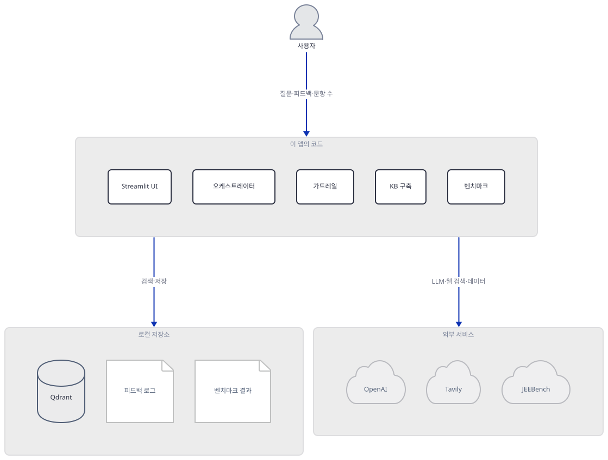
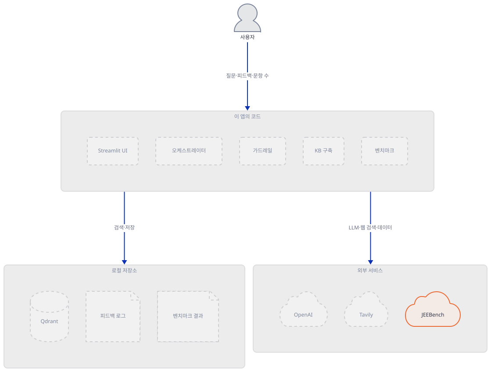
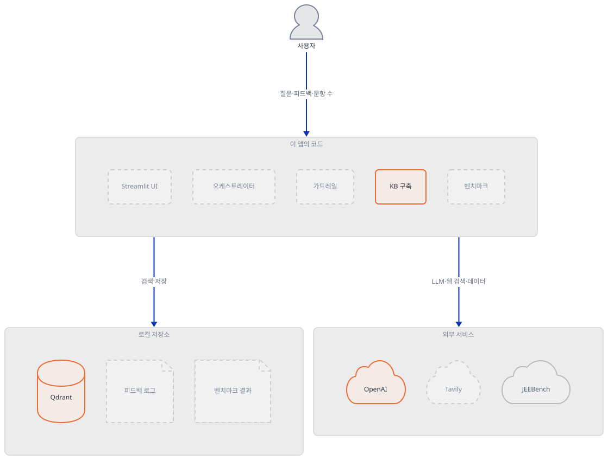
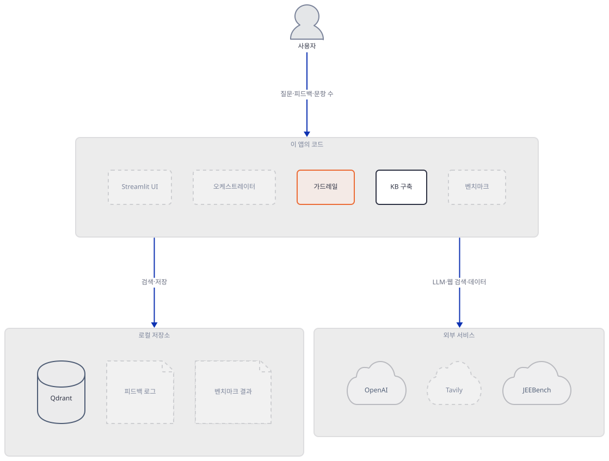
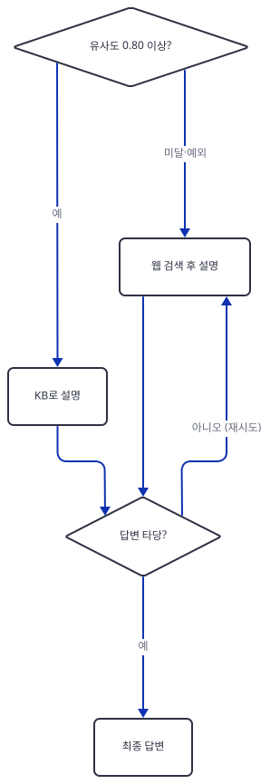
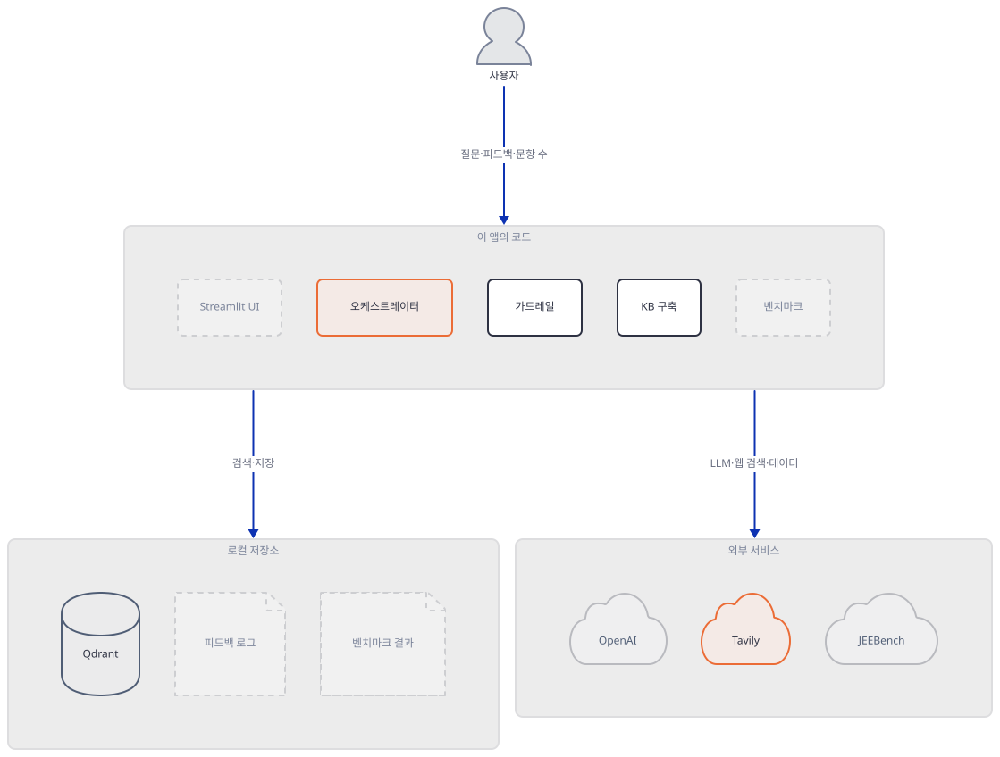
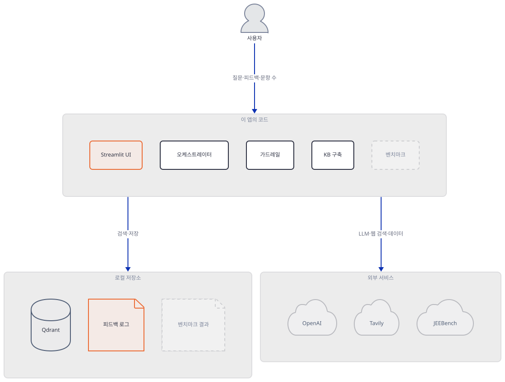
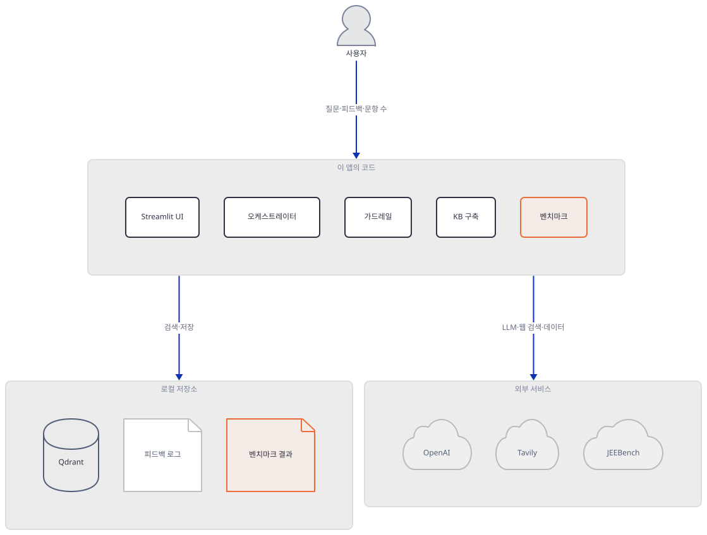
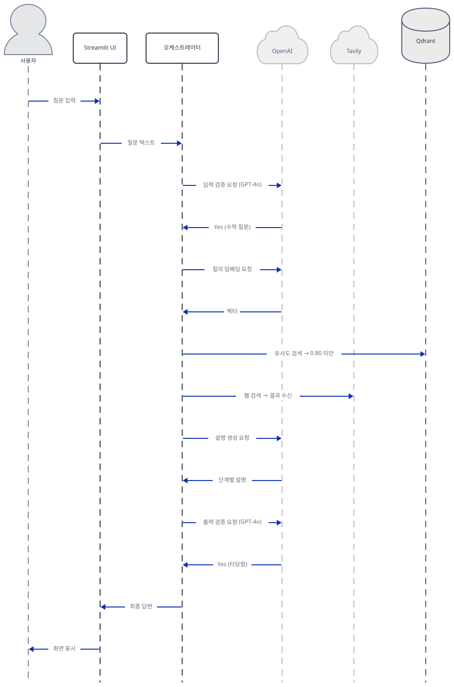

# Day 069 · 🧠 Math Tutor Agent – Agentic RAG with Feedback Loop

> 볼륨 5 📀 RAG · 난이도 ★★★ · 예상 소요 90분(Docker로 로컬 Qdrant를 띄우고 OpenAI·Tavily 키 2개를 발급받는 손 놀리는 시간이 읽는 시간보다 깁니다) · API 비용 대략 질문 1건당 GPT-4o 호출 2~4회(입력 분류·설명 생성·출력 검증, 검증 실패 시 웹 재설명 1회 추가) + KB 검색용 임베딩 호출 1회 + Tavily 검색 0~2회 — KB를 처음 구축할 때 JEEBench 수학 문항 전체에 대한 OpenAI 임베딩 비용이 한 번 더 든다(문항 수는 네트워크가 없어 확인 못함) · 대략치(키가 없어 실제 과금은 확인 못함) · 원본 앱: `rag_tutorials/agentic_rag_math_agent`

## 오늘 만들 것

JEE(인도 공과대학 입시)급 수학 문제에 단계별 풀이를 내놓는 튜터 에이전트입니다. 질문이 오면 먼저 Qdrant에 저장된 JEEBench 문항·정답 벡터를 코사인 유사도로 검색하고, 확신이 없으면(Day 060·061과 같은 "낮으면 웹으로" 패턴) Tavily 웹 검색으로 넘어갑니다. 그 앞뒤로 DSPy 기반 입력·출력 가드레일이 있어 수학이 아닌 질문을 걸러내고 답변의 타당성을 한 번 더 봅니다. Streamlit 화면에서 사용자가 답변에 👍/👎를 누르면 질문·답변·평가가 로컬 JSON에 쌓이는데, 이 로그를 다시 읽어 프롬프트나 검색을 바꾸는 코드는 없습니다 — "피드백 루프"는 기록까지이고, 그 기록으로 무언가를 자동으로 개선하지는 않습니다(소스로 확인). 참고로 앱 자체 README는 설명 모델을 "GPT-4.1"이라고 적어 놓았지만, 실제 코드 세 곳(`rag_tutorials/agentic_rag_math_agent/rag/guardrails.py:11`, `rag_tutorials/agentic_rag_math_agent/rag/query_router.py:81`, `rag_tutorials/agentic_rag_math_agent/rag/query_router.py:127`) 모두 `model="gpt-4o"`를 씁니다 — 앱 README 오류입니다.



## 사전 준비

| 서비스/도구 | 용도 | 발급·설치 |
|---|---|---|
| OpenAI API 키 | GPT-4o(가드레일 판정·설명 생성)와 임베딩(KB 구축·검색) 호출 인증 | https://platform.openai.com/api-keys |
| Tavily API 키 | KB 유사도가 낮을 때 웹 검색 폴백 | https://tavily.com 가입 후 API 키 발급(무료 등급 있음) |
| 로컬 Qdrant 서버 | `math_agent` 컬렉션 저장 — 앱 자체 README에는 안 나오지만 코드가 `host="localhost", port=6333`을 그대로 하드코딩해 직접 띄워야 합니다(소스로 확인, `rag_tutorials/agentic_rag_math_agent/rag/vector.py:35`, `rag_tutorials/agentic_rag_math_agent/rag/query_router.py:30`) | `docker run -p 6333:6333 qdrant/qdrant` (Docker Desktop 필요) |
| 인터넷 연결 | PyPI 설치, OpenAI·Tavily API, HuggingFace Hub(JEEBench 데이터셋) 접속 | 사내망이면 이 세 곳 아웃바운드 허용 필요 |
| uv | 가상환경 생성과 패키지 설치 | [공통 사전 준비](../README.md#공통-사전-준비-한-번만) 참고 |

## 아키텍처 한눈에 보기

| 컴포넌트 | 역할 | 코드 위치 |
|---|---|---|
| 사용자 | 질문 입력, 문항 수 선택, 피드백 클릭 | 코드 없음 (브라우저) |
| Streamlit UI (3탭) | 질문·답변, 피드백 조회, 벤치마크 실행 화면 | `rag_tutorials/agentic_rag_math_agent/app/streamlit.py:1-120` |
| 질의 오케스트레이터 (`answer_math_question`) | 입력 가드레일 → KB/웹 라우팅 → 출력 가드레일까지 한 번에 실행 | `rag_tutorials/agentic_rag_math_agent/rag/query_router.py:92-149` |
| 입력 가드레일 (`InputValidator`) | DSPy로 수학 질문인지 zero-shot 분류(few-shot 예시 35개를 만들어 두고도 쓰지 않음 — Step 3) | `rag_tutorials/agentic_rag_math_agent/rag/guardrails.py:15-78` |
| 출력 가드레일 (`OutputValidator`) | DSPy로 최종 답변의 타당성 재검증 | `rag_tutorials/agentic_rag_math_agent/rag/guardrails.py:81-98` |
| 지식 베이스 구축 (`rag/vector.py`) | JEEBench 문항을 Document화해 Qdrant에 인덱싱하는 1회성 스크립트 | `rag_tutorials/agentic_rag_math_agent/rag/vector.py:17-54` |
| 벤치마크 실행기 (`benchmark_math_agent`) | JEEBench N문항에 오케스트레이터를 반복 호출해 정확도 집계 | `rag_tutorials/agentic_rag_math_agent/app/benchmark.py:12-51` |
| JEEBench 데이터 로더 | HF에서 JEEBench 중 수학 문항만 필터링 — 파일명은 `load_gsm8k_data.py`이지만 GSM8K가 아니라 JEEBench를 읽습니다(소스로 확인) | `rag_tutorials/agentic_rag_math_agent/data/load_gsm8k_data.py:1-9` |
| Qdrant (`math_agent` 컬렉션) | 문항·정답 텍스트의 OpenAI 임베딩, 코사인 유사도 검색 | `rag_tutorials/agentic_rag_math_agent/rag/vector.py:29-51`, `rag_tutorials/agentic_rag_math_agent/rag/query_router.py:29-34` |
| 피드백 로그 | 👍/👎와 질문·답변을 JSON 배열로 누적(읽어서 되먹이는 코드는 없음) | `rag_tutorials/agentic_rag_math_agent/logs/feedback_log.json` (쓰기: `rag_tutorials/agentic_rag_math_agent/app/streamlit.py:57-82`) |
| 벤치마크 결과 CSV | 문항별 정답 여부·소요 시간 | `rag_tutorials/agentic_rag_math_agent/benchmark/results_math_N.csv` (쓰기: `rag_tutorials/agentic_rag_math_agent/app/streamlit.py:111-114`) |

## 단계별 진행

### Step 1. 환경 구성과 JEEBench 데이터셋

**목적.** 의존성을 설치하고, 이 앱의 지식 베이스 재료인 JEEBench 데이터셋을 어디서 어떻게 읽어오는지 확인합니다.

**할 일.**

```bash
cd rag_tutorials/agentic_rag_math_agent
uv venv
uv pip install -r requirements.txt
```

(pip 대안: `python -m venv .venv && source .venv/bin/activate && pip install -r requirements.txt`. 이 저장소 루트에는 `pyproject.toml`이 있어 이후 모든 `uv run`에는 `--no-project`를 붙입니다.)

`config/.env.example`을 `config/.env`로 복사하고 두 키를 채웁니다.

`rag_tutorials/agentic_rag_math_agent/config/.env.example:1-2`

```text
OPENAI_API_KEY=""
TAVILY_API_KEY=""
```

지식 베이스의 재료는 JEEBench 데이터셋입니다. 이 파일 전체를 봅니다.

`rag_tutorials/agentic_rag_math_agent/data/load_gsm8k_data.py:1-9`

```python
import pandas as pd

def load_jeebench_dataset():
    df = pd.read_json("hf://datasets/daman1209arora/jeebench/test.json")
    df = df[df["subject"].str.lower() == "math"]
    return df[['question', 'gold']]

if __name__ == "__main__":
    load_jeebench_dataset()
```

파일명은 `load_gsm8k_data.py`지만 실제로 읽는 것은 GSM8K가 아니라 `daman1209arora/jeebench`입니다(소스로 확인) — 이름만 보고 GSM8K인 줄 알면 헷갈립니다. `hf://` 경로는 `huggingface_hub`가 등록하는 fsspec 프로토콜인데, `requirements.txt`는 이 패키지를 직접 적지 않습니다. 스크래치 가상환경에 설치해 보면(직접 확인) `dspy`가 끌고 오는 `datasets`(5.0.1)를 통해 `huggingface-hub`(1.33.0)·`fsspec`(2026.6.0)가 함께 들어와 있어 `hf://`는 정상 동작합니다.



**확인.** 격리된 가상환경에 설치하고 모든 파일이 컴파일되는지 봅니다(스크래치 venv 기준, 실제 명령·출력을 그대로 옮겼습니다).

```bash
uv pip install -r requirements.txt --python <스크래치 venv>/Scripts/python.exe
uv pip list --python <스크래치 venv>/Scripts/python.exe | tail -n +3 | wc -l
```

```
Checked 12 packages in 30ms
144
```

`requirements.txt`의 최상위 패키지 12개(마지막 줄 `requests==2.32.3`에는 개행이 없어 `wc -l`은 13으로 셉니다 — 실제로는 14줄, 그중 빈 줄 1개와 주석 1개를 빼면 12개)가 전이 의존성을 포함해 총 144개 패키지로 풀립니다.

```bash
uv run --no-project python -m py_compile data/load_gsm8k_data.py rag/vector.py rag/guardrails.py rag/query_router.py app/benchmark.py app/streamlit.py && echo compiled
```

```
compiled
```

### Step 2. 지식 베이스 구축 — JEEBench를 Qdrant에 인덱싱

**목적.** `rag/vector.py`가 JEEBench 문항을 어떻게 문서로 바꿔 Qdrant에 넣는지 확인합니다.

**할 일.**

`rag_tutorials/agentic_rag_math_agent/rag/vector.py:17-26`

```python
def load_jeebench_documents():
    df = pd.read_json("hf://datasets/daman1209arora/jeebench/test.json")
    documents = []
    for i, row in df.iterrows():
        q = row["question"]
        a = row["gold"]
        text = f"Q: {q}\nA: {a}"
        doc = Document(text=text, metadata={"source": "jee_bench", "index": i})
        documents.append(doc)
    return documents
```

이 함수는 데이터 로더(`data/load_gsm8k_data.py`)와 별개로 JEEBench를 다시 읽습니다 — 과목 필터(`subject == "math"`)도 없이 전체를 그대로 문서화합니다(소스로 확인, 같은 데이터셋을 두 코드 경로가 각자 읽는 중복입니다). 이렇게 만든 문서를 청크로 쪼개고 Qdrant 컬렉션을 만듭니다.

`rag_tutorials/agentic_rag_math_agent/rag/vector.py:29-51`

```python
def build_vector_index():
    documents = load_jeebench_documents()

    node_parser = SimpleNodeParser()
    nodes = node_parser.get_nodes_from_documents(documents)

    qdrant_client = QdrantClient(host="localhost", port=6333)
    collection_name = "math_agent"

    if not qdrant_client.collection_exists(collection_name=collection_name):
        qdrant_client.create_collection(
            collection_name=collection_name,
            vectors_config=VectorParams(size=1536, distance=Distance.COSINE)
        )

    vector_store = QdrantVectorStore(client=qdrant_client, collection_name=collection_name)
    embed_model = OpenAIEmbedding(api_key=OPENAI_API_KEY)
    storage_context = StorageContext.from_defaults(vector_store=vector_store)

    index = VectorStoreIndex(nodes=nodes, embed_model=embed_model, storage_context=storage_context)
    index.storage_context.persist()

    print("✅ Qdrant vector index built and saved successfully.")
```

벡터 자체는 Qdrant에, 인덱스 메타데이터(`docstore.json` 등)는 `index.storage_context.persist()`가 기본값인 로컬 `storage/` 폴더에 남깁니다 — 이 폴더는 저장소에 커밋돼 있지 않으므로, 이 스크립트를 최소 한 번 실행해야 다음 Step의 검색이 됩니다(키·Qdrant·인터넷이 모두 필요해 이번 재현에서는 직접 실행하지 못했습니다).



**확인.** 키 없이 이 모듈이 임포트되는지만 확인합니다(네트워크·Qdrant 접속은 하지 않습니다 — `build_vector_index()`는 `if __name__ == "__main__":` 뒤에 있어 임포트만으로는 실행되지 않습니다).

```bash
uv run --no-project python -c "import rag.vector; print(rag.vector.build_vector_index)"
```

```
<function build_vector_index at 0x...>
```

### Step 3. 가드레일 — DSPy로 입력·출력 판정하기

**목적.** 질문이 수학인지 걸러내는 입력 가드레일과, 답변이 타당한지 다시 보는 출력 가드레일이 각각 무엇을 하는지 확인합니다.

**할 일.**

`rag_tutorials/agentic_rag_math_agent/rag/guardrails.py:15-23`

```python
class ClassifyMath(dspy.Signature):
    """
    Decide if a question is related to mathematics — this includes problem-solving,
    formulas, definitions (e.g., 'what is calculus'),examples to any topic, or theoretical topics.

    Return only 'Yes' or 'No' as your final verdict.
    """
    question: str = dspy.InputField()
    verdict: str = dspy.OutputField(desc="Respond with 'Yes' if the question is related to mathematics, 'No' otherwise.")
```

`InputValidator.__init__`은 이 시그니처로 두 모듈을 만듭니다 — 예시 없는 `self.classifier = dspy.Predict(ClassifyMath)`와, "What is a square?" 같은 few-shot 예시 35개를 붙인 `self.validate_question = dspy.ChainOfThought(ClassifyMath, examples=[...])`(`rag_tutorials/agentic_rag_math_agent/rag/guardrails.py:29-73`). 그런데 실제로 판정에 쓰이는 것은 `forward()`뿐입니다.

`rag_tutorials/agentic_rag_math_agent/rag/guardrails.py:75-78`

```python
    def forward(self, question):
        response = self.classifier(question=question)
        print("🧠 InputValidator Response:", response.verdict)
        return response.verdict.lower().strip() == "yes"
```

`forward()`가 부르는 것은 예시 없는 `self.classifier`뿐, 35개 예시를 단 `self.validate_question`은 어디서도 호출되지 않습니다(소스로 확인) — 공들여 넣은 few-shot 예시가 죽은 코드입니다. 출력 가드레일도 구조는 같습니다.

`rag_tutorials/agentic_rag_math_agent/rag/guardrails.py:81-98`

```python
class OutputValidator(dspy.Module):
    class ValidateAnswer(dspy.Signature):
        """Check if the answer is correct, step-by-step, and relevant to the question."""
        question = dspy.InputField(desc="The original math question.")
        answer = dspy.InputField(desc="The model-generated answer.")
        verdict = dspy.OutputField(desc="Answer only 'Yes' or 'No'")

    def __init__(self):
        super().__init__()
        self.validate_answer = dspy.Predict(self.ValidateAnswer)

    def forward(self, question, answer):
        response = self.validate_answer(
            question=question,
            answer=answer
        )
        print("🧠 OutputValidator Response:", response.verdict)
        return response.verdict.lower().strip() == "yes"
```

`question`/`answer` 필드에 타입 힌트(`: str`)가 없는데도(`ClassifyMath`의 필드들과 비교됩니다) DSPy 2.6.18은 문제없이 처리합니다(직접 확인, 아래).



**확인.** 이 파일을 임포트만 해도 8행의 `print(f"🔐 Loaded OPENAI_API_KEY: ...")`가 곧바로 실행되는데, 한국어 Windows 콘솔의 기본 코드페이지 `cp949`는 이 이모지를 인코딩하지 못해 Day 019(Step 2)에서 다룬 것과 같은 증상이 API 키보다 먼저 납니다(직접 확인).

```bash
uv run --no-project python -c "import rag.guardrails"
```

```
UnicodeEncodeError: 'cp949' codec can't encode character '\U0001f510' in position 0: illegal multibyte sequence
```

Day 019와 같은 해법으로 콘솔을 UTF-8로 바꾸면 지나갑니다(PowerShell은 `$env:PYTHONIOENCODING="utf-8"`).

```bash
PYTHONIOENCODING=utf-8 uv run --no-project python -c "
from rag.guardrails import InputValidator
iv = InputValidator()
print(iv.classifier.signature.instructions)
"
```

```
🔐 Loaded OPENAI_API_KEY: ❌ Missing
Decide if a question is related to mathematics — this includes problem-solving,
formulas, definitions (e.g., 'what is calculus'),examples to any topic, or theoretical topics.

Return only 'Yes' or 'No' as your final verdict.
```

`dspy.LM(...)`·`dspy.Predict(...)`·`dspy.ChainOfThought(...)` 생성 자체는 키가 없어도 예외 없이 끝납니다 — 실제 OpenAI 요청은 `.forward()`를 호출할 때 비로소 나가므로, 이번 확인에서는 생성자까지만 부르고 `.forward()`는 부르지 않았습니다.

### Step 4. 질의 오케스트레이션 — KB 우선, 안 되면 웹 폴백

**목적.** `answer_math_question`이 입력 가드레일 → KB 검색 → (필요하면) 웹 검색 → 출력 가드레일을 어떤 순서로 엮는지, 그리고 KB 검색이 실패하면 무슨 일이 나는지 확인합니다.

**할 일.**

`rag_tutorials/agentic_rag_math_agent/rag/query_router.py:36-49`

```python
def query_kb(question: str):
    index = load_kb_index()
    nodes = index.as_retriever(similarity_top_k=1).retrieve(question)
    if not nodes:
        return "I'm not sure.", 0.0

    node = nodes[0]
    matched_text = node.get_text()
    similarity = node.score or 0.0

    print(f"🔍 Matched Score: {similarity}")
    print(f"🧠 Matched Content: {matched_text}")

    return matched_text, similarity
```

`load_kb_index()`는 Step 2가 만든 로컬 `storage/`와 Qdrant 컬렉션을 함께 읽습니다. 이 유사도값을 얼마나 믿을지가 이 앱의 핵심 판단인데, 코드에 남은 주석이 그 이유를 설명합니다.

`rag_tutorials/agentic_rag_math_agent/rag/query_router.py:86-89`

```python
# query_kb returns a cosine similarity (higher = better); with OpenAI embeddings
# almost any two English texts score well above 0, so `> 0.` accepted every query
# and served an arbitrary KB answer as authoritative. Require a real match.
KB_SIMILARITY_THRESHOLD = 0.80
```

이 저장소의 커밋 이력을 보면(`git log -p`로 확인) 문턱은 원래 `similarity > 0.`였다가, "OpenAI 임베딩은 아무 영어 문장 둘을 비교해도 코사인이 대체로 0보다 커서 사실상 모든 질문이 통과했다"는 이유로 0.80으로 올려졌습니다 — Day 060이 만난 "원점수 코사인을 문턱과 직접 비교"하는 같은 종류의 함정을, 이 앱은 이미 고친 상태로 커밋돼 있습니다. 오케스트레이터는 이 값을 이렇게 씁니다.

`rag_tutorials/agentic_rag_math_agent/rag/query_router.py:92-99`

```python
def answer_math_question(question: str):
    print(f"🔍 Query: {question}")

    if not input_validator.forward(question):
        return "⚠️ This assistant only answers math-related academic questions."

    answer = ""
    from_kb = False
```

```python
    try:
        kb_answer, similarity = query_kb(question)
        print("🧪 KB raw answer:", kb_answer)

        if similarity >= KB_SIMILARITY_THRESHOLD:
            print("✅ High similarity KB match, using GPT for step-by-step explanation...")
```

(`rag_tutorials/agentic_rag_math_agent/rag/query_router.py:101-106`)

```python
            llm = OpenAI(api_key=OPENAI_API_KEY, model="gpt-4o")
            answer = llm.complete(prompt).text
            from_kb = True
        else:
            raise ValueError("Low similarity match or empty")
```

(`rag_tutorials/agentic_rag_math_agent/rag/query_router.py:127-131`)

여기서 중요한 것은 `try` 블록 전체가 `query_kb`의 **모든** 예외를 잡는다는 점입니다 — 유사도 미달로 직접 던진 `ValueError`든, Qdrant가 꺼져 있어 나는 접속 예외든 구분하지 않습니다.

`rag_tutorials/agentic_rag_math_agent/rag/query_router.py:133-149`

```python
    except Exception as e:
        print("⚠️ Using Web fallback because:", e)
        web_content = query_web(question)
        answer = explain_with_openai(question, web_content)
        from_kb = False

    print(f"📦 Answer Source: {'KB' if from_kb else 'Web'}")

    # Final Output Guardrail Check
    if not output_validator.forward(question, answer):
        print("⚠️ Final answer failed validation — retrying with web content...")

        web_content = query_web(question)
        answer = explain_with_openai(question, web_content)
        from_kb = False

    return answer
```

즉 Qdrant를 아예 안 띄웠거나 Step 2를 건너뛰어 `storage/`가 없어도, `answer_math_question`은 에러 없이 웹 검색으로 계속 동작합니다 — KB가 조용히 빠져 있다는 것을 로그(`⚠️ Using Web fallback because: ...`) 말고는 알 방법이 없습니다. 출력 가드레일이 실패하면 웹 검색으로 한 번 더 설명을 만들지만, 이 재시도 결과를 다시 검증하지는 않고 그대로 반환합니다(소스로 확인) — "검증 없는 재시도 1회"가 이 앱의 재시도 상한입니다. 이 분기 전체를 그림으로 보면 다음과 같습니다.





**확인.** Qdrant를 띄우지 않은 채(그리고 `storage/`도 없는 채) `query_kb`를 직접 불러 실제로 어떤 예외가 나는지 봅니다 — `answer_math_question`이 감싸는 바로 그 호출입니다.

```bash
PYTHONIOENCODING=utf-8 uv run --no-project python -c "
from rag.query_router import query_kb
try:
    query_kb('what is a circle?')
except Exception as e:
    print(type(e).__name__, ':', e)
"
```

```
ResponseHandlingException : [WinError 10061] 대상 컴퓨터에서 연결을 거부했으므로 연결하지 못했습니다
```

Qdrant가 없으면 `query_kb`는 이렇게 실패하고, `answer_math_question`이라면 이 예외를 그대로 삼켜 `query_web`으로 넘어갑니다.

### Step 5. Streamlit UI와 피드백 로그

**목적.** 3탭 UI 중 질문 탭과 피드백 탭이 무엇을 하는지, 그리고 👍/👎가 실제로 어디에 어떤 형식으로 쌓이는지 확인합니다.

**할 일.**

`rag_tutorials/agentic_rag_math_agent/app/streamlit.py:30-42`

```python
    user_question = st.text_input("Your Question:")

    if st.button("Get Answer"):
        if user_question:
            with st.spinner("Thinking..."):
                answer = answer_math_question(user_question)
            st.session_state["last_question"] = user_question
            st.session_state["last_answer"] = answer
            st.session_state["feedback_given"] = False

    if st.session_state["last_answer"]:
        st.markdown("### ✅ Answer:")
        st.success(st.session_state["last_answer"])
```

답이 나오면 두 버튼이 뜨고, 둘 중 하나를 누르면 그 결과가 로컬 JSON 파일에 그대로 쌓입니다.

`rag_tutorials/agentic_rag_math_agent/app/streamlit.py:44-55`

```python
        if not st.session_state["feedback_given"]:
            st.markdown("### 🙋 Was this helpful?")
            col1, col2 = st.columns(2)

            with col1:
                if st.button("👍 Yes"):
                    feedback = "positive"
                    st.session_state["feedback_given"] = True
            with col2:
                if st.button("👎 No"):
                    feedback = "negative"
                    st.session_state["feedback_given"] = True
```

`rag_tutorials/agentic_rag_math_agent/app/streamlit.py:57-82`

```python
            if st.session_state["feedback_given"]:
                log_entry = {
                    "question": st.session_state["last_question"],
                    "answer": st.session_state["last_answer"],
                    "feedback": feedback
                }

                try:
                    os.makedirs("logs", exist_ok=True)
                    log_file = "logs/feedback_log.json"

                    if os.path.exists(log_file):
                        with open(log_file, "r") as f:
                            existing_logs = json.load(f)
                    else:
                        existing_logs = []

                    existing_logs.append(log_entry)

                    with open(log_file, "w") as f:
                        json.dump(existing_logs, f, indent=2)

                    st.success(f"✅ Feedback recorded as '{feedback}'")
                    st.write("📝 Log entry:", log_entry)
                except Exception as e:
                    st.error(f"⚠️ Error saving feedback: {e}")
```

이것이 "피드백 루프"의 전부입니다 — 매번 파일 전체를 읽고, 항목 하나를 추가하고, 다시 통째로 씁니다. 이 JSON을 다시 읽어 프롬프트나 KB 순위를 바꾸는 코드는 이 저장소 어디에도 없습니다(grep으로 직접 확인 — `feedback_log`를 읽는 곳은 이 파일과 피드백 조회 탭뿐입니다). 피드백 조회 탭은 그 파일을 그대로 표로 보여줄 뿐입니다.

`rag_tutorials/agentic_rag_math_agent/app/streamlit.py:85-94`

```python
with tab2:
    st.subheader("📁 View Collected Feedback")
    try:
        with open("logs/feedback_log.json", "r") as f:
            feedback_logs = json.load(f)
        st.success("Loaded feedback log.")
        st.dataframe(pd.DataFrame(feedback_logs))
    except Exception as e:
        st.warning("No feedback log found or error loading.")
        st.text(str(e))
```



**확인.** 이 저장소에는 이미 이전 실행이 남긴 로그가 커밋돼 있습니다. 실제 답변을 만들지 않고도 그 형식만 직접 확인합니다.

```bash
uv run --no-project python -c "
import json
logs = json.load(open('logs/feedback_log.json', encoding='utf-8'))
print(len(logs), 'entries')
print(list(logs[0].keys()))
print(sum(1 for l in logs if l['feedback'] == 'positive'), 'positive /', len(logs))
"
```

```
14 entries
['question', 'answer', 'feedback']
12 positive / 14
```

### Step 6. 벤치마킹 — JEEBench로 정확도 재기

**목적.** `benchmark_math_agent`가 정답 여부를 어떻게 판정하는지, 그리고 저장소에 이미 남아 있는 벤치마크 결과가 앱 README의 수치와 맞는지 확인합니다.

**할 일.**

`rag_tutorials/agentic_rag_math_agent/app/benchmark.py:12-30`

```python
def benchmark_math_agent(limit: int = 10):
    # ✅ Always filter math-only questions
    df = load_jeebench_dataset()
    df = df.head(limit)  # Limit the number of questions for benchmarking

    total = len(df)
    correct = 0
    results = []

    for idx, row in df.iterrows():
        question = row["question"]
        expected = row["gold"]
        start = time.time()

        try:
            response = answer_math_question(question)
            is_correct = expected.lower() in response.lower()
            if is_correct:
                correct += 1
```

정답 판정은 정확히 일치가 아니라 **부분 문자열 포함**입니다 — 모델 설명 어딘가에 정답 문자열이 한 번이라도 등장하면 정답으로 칩니다(소스로 확인). 이 기준이 문항 유형에 따라 얼마나 다르게 작동하는지 저장소에 커밋된 50문항 결과로 직접 집계해 봤습니다.

```bash
uv run --no-project python -c "
import pandas as pd
df = pd.read_csv('benchmark/results_math_50.csv')
df['exp_len'] = df['Expected'].astype(str).str.len()
multi = df[df['exp_len'] > 1]
single = df[df['exp_len'] == 1]
print('복수 정답(예: BCD) 문항:', len(multi), '중 정답 처리', multi['Correct'].sum(), '건')
print('단일 정답(예: C) 문항:', len(single), '중 정답 처리', single['Correct'].sum(), '건')
"
```

```
복수 정답(예: BCD) 문항: 22 중 정답 처리 6 건
단일 정답(예: C) 문항: 28 중 정답 처리 27 건
```

단일 정답 문항은 28건 중 27건(96%)이 정답 처리됐지만, JEEBench의 복수 정답 문항(정답이 "BC"·"BCD"처럼 보기 여러 개를 합친 문자열)은 22건 중 6건(27%)만 정답 처리됐습니다. 모델이 "B, C, D가 정답입니다"처럼 자연스럽게 설명하면 응답 문자열 어디에도 "bcd"라는 연속된 세 글자가 나타나지 않으므로, 실제로는 맞혔어도 이 채점 기준에서는 틀린 것으로 집계됩니다 — 부분 문자열 포함 판정이 복수 정답 문항에 불리하게 작동한다는 뜻입니다(직접 확인). 앱 README의 "정확도 66%"는 이런 채점 방식까지 포함한 수치입니다. 마지막에 정확도를 계산합니다.

`rag_tutorials/agentic_rag_math_agent/app/benchmark.py:49-51`

```python
    df_result = pd.DataFrame(results)
    accuracy = correct / total * 100
    return df_result, accuracy
```

Streamlit 쪽은 이 결과를 받아 CSV로 저장합니다.

`rag_tutorials/agentic_rag_math_agent/app/streamlit.py:105-120`

```python
    num_questions = st.slider("Select number of math questions to benchmark", min_value=3, max_value=total_math, value=10)

    if st.button("▶️ Run Benchmark Now"):
        with st.spinner(f"Benchmarking {num_questions} math questions..."):
            df_result, accuracy = benchmark_math_agent(limit=num_questions)

            # Save the result
            os.makedirs("benchmark", exist_ok=True)
            result_path = f"benchmark/results_math_{num_questions}.csv"
            df_result.to_csv(result_path, index=False)

            # Show result
            st.success(f"✅ Done! Accuracy: {accuracy:.2f}%")
            st.metric("Accuracy", f"{accuracy:.2f}%")
            st.dataframe(df_result)
            st.download_button("Download Results", data=df_result.to_csv(index=False), file_name=result_path, mime="text/csv")
```

CSV 저장은 `benchmark_math_agent` 안이 아니라 이 UI 코드에 있습니다 — 함수 자체를 스크립트로 재사용하면 결과는 반환값으로만 남습니다.



**확인.** 저장소에 커밋된 50문항 벤치마크 결과를 직접 열어 앱 README의 "정확도 66%" 주장을 검산합니다(키·네트워크 없이, 파일 하나만 읽습니다).

```bash
uv run --no-project python -c "
import pandas as pd
df = pd.read_csv('benchmark/results_math_50.csv')
correct = df['Correct'].sum()
print(f'{correct}/{len(df)} = {correct/len(df)*100:.1f}%')
"
```

```
33/50 = 66.0%
```

앱 README의 "Current Accuracy: 66%"와 일치합니다 — 다만 부분 문자열 포함 판정 기준이라는 것은 이 README에 적혀 있지 않습니다.

## 요청 한 건이 흐르는 과정



이 그림은 KB 유사도가 문턱(0.80)에 못 미쳐 웹 폴백으로 넘어가는, 가장 흔할 경로를 그린 것입니다. 오케스트레이터는 먼저 자기 안에서 입력 가드레일을 통과시키고(자기 자신을 향한 화살표로 표시), Qdrant에 유사도 검색을 보냅니다. 여기서 0.80 미만이 나오면(또는 Qdrant 접속 자체가 실패하면, Step 4) Tavily로 웹 검색을 하고 그 결과를 GPT-4o에 넘겨 설명을 만듭니다. 다시 오케스트레이터 자신이 출력 가드레일을 통과시키고 나서야 Streamlit UI로 돌아가 사용자에게 보여집니다. KB 유사도가 0.80 이상이었다면 웹 검색·Tavily 구간 없이 Qdrant가 돌려준 정답만으로 GPT-4o가 설명을 만드는 더 짧은 경로를 탑니다(Step 4의 `extra-routing.svg` 참고). 이 시퀀스는 키가 없어 실제로 끝까지 실행하지는 못했고, Step 3·4에서 각 구간을 개별적으로 확인한 것과 소스 읽기를 이어 붙인 것입니다.

## 실행 체크리스트

- [ ] `uv pip install -r requirements.txt`가 `hf://` 해석에 필요한 `huggingface-hub`·`datasets`까지 함께 설치한다는 것을 확인했다
- [ ] `config/.env`에 `OPENAI_API_KEY`·`TAVILY_API_KEY`를 채우고, 로컬 Qdrant(`docker run -p 6333:6333 qdrant/qdrant`)를 띄웠다
- [ ] `rag_tutorials/agentic_rag_math_agent/rag/guardrails.py`를 임포트만 해도 한국어 Windows 콘솔에서 `UnicodeEncodeError`가 API 키 확인보다 먼저 난다는 것을 직접 확인했다(Day 019와 같은 증상)
- [ ] `InputValidator.forward()`가 실제로는 few-shot 예시 35개가 붙은 `self.validate_question`이 아니라 예시 없는 `self.classifier`를 호출한다는 것을 소스로 확인했다
- [ ] Qdrant를 띄우지 않은 채 `query_kb`를 직접 호출해 `ResponseHandlingException`이 나는 것을, 그리고 `answer_math_question`은 이 예외를 삼켜 웹 검색으로 넘어간다는 것을 확인했다
- [ ] `logs/feedback_log.json`에 이미 14건의 피드백이 쌓여 있고, 이 파일을 다시 읽어 되먹이는 코드가 없다는 것을 확인했다
- [ ] `benchmark/results_math_50.csv`를 직접 집계해 66.0%(33/50)가 앱 README의 "66%"와 일치한다는 것을 확인했다
- [ ] 벤치마크의 정답 판정이 정확히 일치가 아니라 부분 문자열 포함이라는 것을 소스로 확인했다

## 문제 해결

| 증상 | 원인 | 해결 |
|---|---|---|
| `rag.guardrails`나 이를 임포트하는 아무 모듈이나 불러오면 API 키 오류보다 먼저 `UnicodeEncodeError: 'cp949' codec can't encode character '\U0001f510'...`로 멈춤 | `rag_tutorials/agentic_rag_math_agent/rag/guardrails.py:8`이 이모지가 든 `print`를 모듈 최상위에서 실행하는데, 한국어 Windows 콘솔의 기본 코드페이지 `cp949`는 이모지를 인코딩하지 못함(직접 확인) — Day 019에서 다룬 것과 같은 종류 | `PYTHONIOENCODING=utf-8 uv run --no-project python ...`처럼 환경변수를 지정(PowerShell은 `$env:PYTHONIOENCODING="utf-8"`)하거나 콘솔을 `chcp 65001`로 바꾸기 |
| Qdrant를 안 띄우거나 `rag_tutorials/agentic_rag_math_agent/rag/vector.py`를 안 돌렸는데도 앱이 에러 없이 계속 답을 내놓음 | `answer_math_question`의 `try`가 `query_kb`의 모든 예외(Qdrant 접속 실패 포함)를 잡아 조용히 웹 검색으로 넘어감(소스로 확인, `rag_tutorials/agentic_rag_math_agent/rag/query_router.py:101-137`) | 콘솔 로그의 `⚠️ Using Web fallback because: ...` 줄로 KB가 실제로 쓰였는지 확인하기 |
| 앱 자체 README가 설명 모델을 "GPT-4.1"이라고 적어 헷갈림 | 코드 세 곳(`rag_tutorials/agentic_rag_math_agent/rag/guardrails.py:11`, `rag_tutorials/agentic_rag_math_agent/rag/query_router.py:81`, `rag_tutorials/agentic_rag_math_agent/rag/query_router.py:127`) 모두 `model="gpt-4o"`(앱 README 오류, 직접 확인) | 이 문서와 코드를 기준으로 삼기 |
| `data/load_gsm8k_data.py`라는 이름만 보고 GSM8K 데이터셋인 줄 알았는데 실제로는 다른 문제가 나옴 | 함수 내부는 `hf://datasets/daman1209arora/jeebench/test.json`(JEEBench)를 읽음 — 파일명과 내용이 다름(소스로 확인) | 이름 대신 `pd.read_json(...)`의 실제 경로를 본다 |
| 원본 앱 README의 `streamlit run app/streamlit.py` bash 코드 블록이 GitHub에서 이상하게 보임 | 그 코드 펜스는 여는 표시만 있고 닫는 표시가 없음(직접 확인 — 펜스 표시로 `grep -c`를 돌리면 파일 전체에서 1줄만 걸림) | 명령 자체는 정확하므로 그대로 실행하면 됨 |

## 더 해보기

- `rag_tutorials/agentic_rag_math_agent/rag/guardrails.py:29-73`의 few-shot 예시가 붙은 `self.validate_question`을 `forward()`에서 실제로 호출하도록 바꾸고, `self.classifier`(예시 없음)와 판정이 달라지는 질문이 있는지 실제 키로 비교해보기
- `rag_tutorials/agentic_rag_math_agent/rag/query_router.py:142`의 출력 가드레일 재시도 경로가 재시도한 답을 다시 검증하지 않는다는 것을 이용해, 재시도 후 결과도 `output_validator.forward()`로 한 번 더 확인하는 루프를 만들어보면 몇 번째에 수렴하는지 실제 키로 실험해보기
- `logs/feedback_log.json`의 `negative` 항목 2건(Step 5)을 읽어, 실제로 이 피드백을 KB 우선순위나 프롬프트에 반영하는 간단한 재순위화 로직을 직접 설계해보기 — 이 앱에는 없는 "진짜 피드백 루프"입니다

## 다음 날 예고

[Day 070 · 🐋 Qwen 3 Local RAG Reasoning Agent](../day070-qwen-local-rag/README.md) — 로컬 Qwen 3 추론 모델로 돌아가는 RAG 에이전트를 다룹니다.
