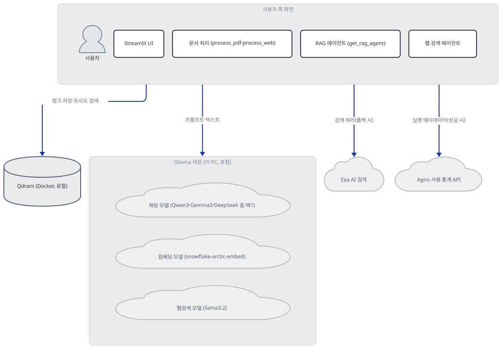
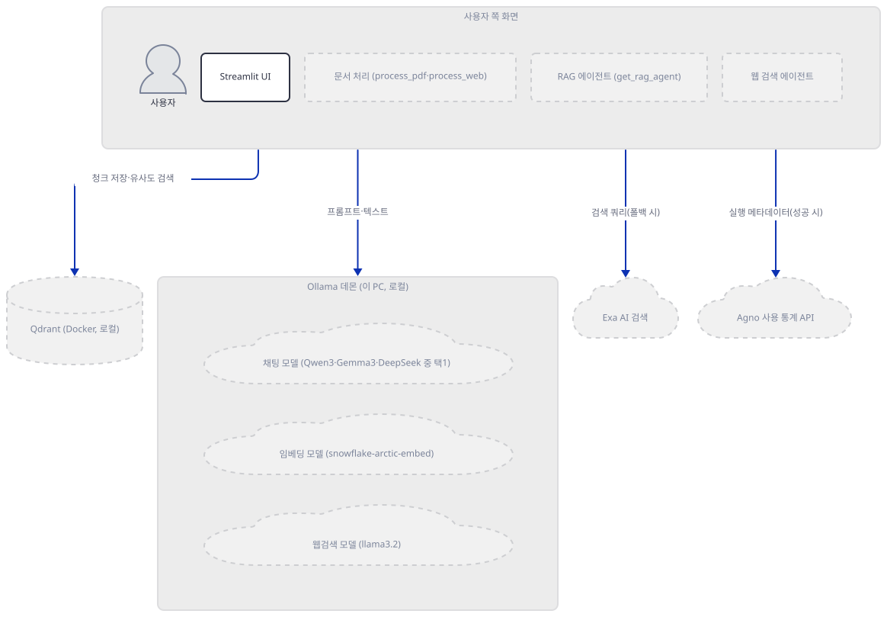
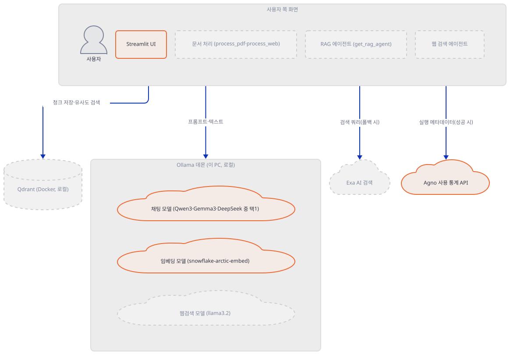
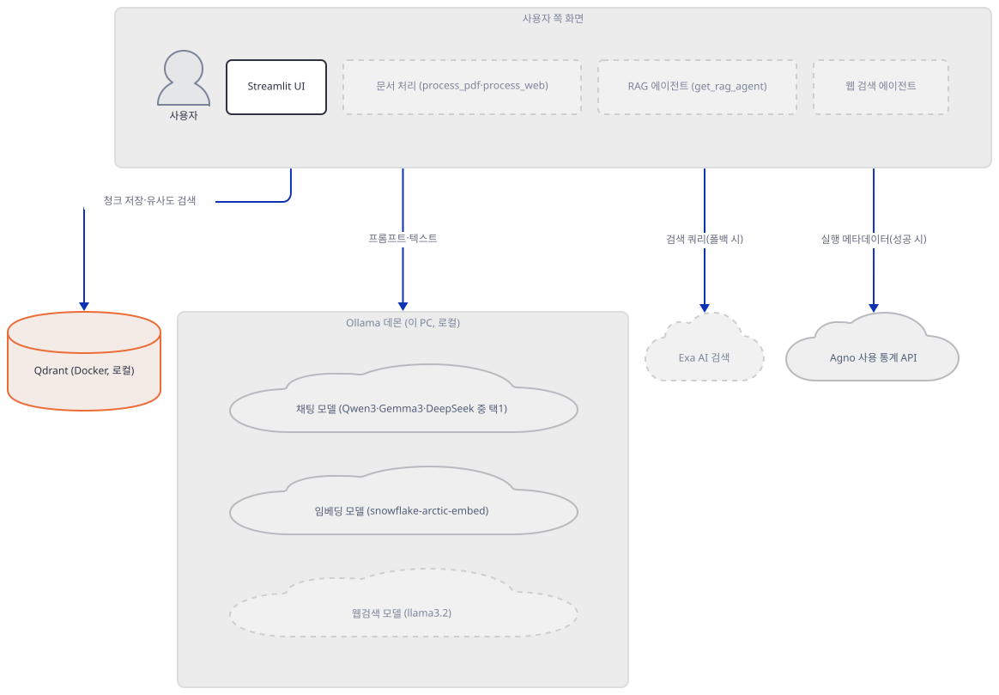
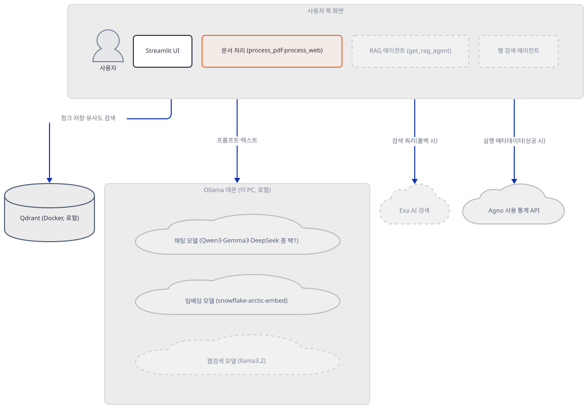
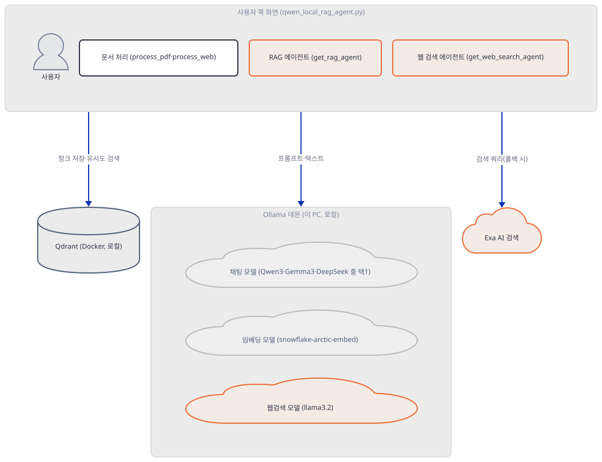
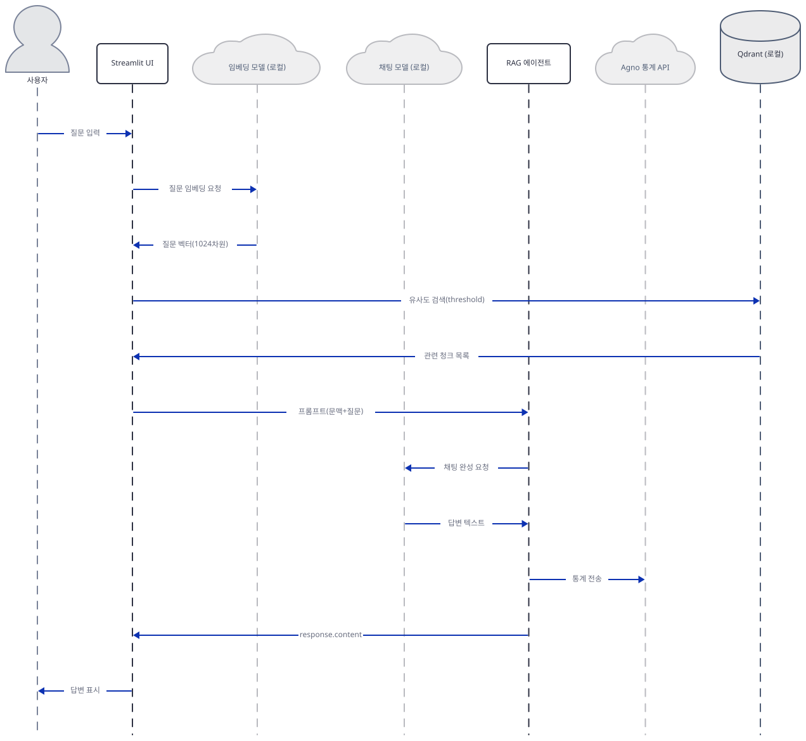

# Day 070 · 🐋 Qwen 3 Local RAG Reasoning Agent

> 볼륨 5 📀 RAG · 난이도 ★★☆ · 예상 소요 85분(가짜 로컬 Ollama 서버와 `AppTest` 명령 여러 개를 Step 2·3·5·6에서 직접 돌리는 시간을 포함합니다) · API 비용 무료(로컬 모델·로컬 Qdrant 모두 비용 없음. Exa AI 웹 검색은 선택 사항이며 가입이 필요한 유료 API라 요금표는 확인하지 못했습니다) · 원본 앱: `rag_tutorials/qwen_local_rag`

## 오늘 만들 것

이 앱은 Qwen3·Gemma3·DeepSeek-R1 중 하나를 사이드바에서 골라 Ollama로 로컬 실행하면서, 벡터 저장소까지 로컬 Docker Qdrant(`http://localhost:6333`)로 채우는 522줄(마지막 줄에 개행이 없어 `wc -l`은 521로 세지만 편집기·GitHub에서는 522번째 줄까지 보입니다, 직접 확인) 단일 파일 Streamlit 앱입니다. 같은 볼륨의 Day 064(DeepSeek Local RAG Agent)와 코드 구조가 거의 같아 — `OllamaEmbedderr` 오타 클래스, `check_document_relevance` 죽은 함수, `<think>` 정규식까지 그대로 옮겨져 있습니다(겹치는 부분은 Step 1·2·6에서 Day 064를 가리킵니다) — 벡터 저장소만은 Qdrant **Cloud**가 아니라 API 키 없이 접속하는 진짜 로컬 Docker 서버라는 점이 다릅니다(소스로 확인). `requirements.txt` 8줄은 모두 고정(`==`)이 없어, 오늘 그대로 설치하면 agno 3.0.11(Day 064와 동일)에 더해 langchain-community 0.4.2·langchain-qdrant 1.1.0·qdrant-client 1.19.1·streamlit 1.64.0처럼 Day 064가 고정했던 버전보다 한 세대 이상 새 패키지가 풀리고, 9행의 `langchain_community` import는 "being sunset and is no longer actively maintained"라는 `DeprecationWarning`까지 새로 냅니다(직접 확인). 6행의 `import bs4`가 실패하는 것은 버전과 무관하게 Day 064에서도 같았던 누락입니다(`beautifulsoup4`가 8개 의존성 어디에도 없음, 직접 확인). `init_qdrant()`의 독스트링은 "Initialize Qdrant client with local Docker setup"이라며 여기서 연결을 확인하는 것처럼 적혀 있지만, 실제로 설치되는 qdrant-client 1.19.1의 `QdrantClient(url=...)`는 예외 없이 곧바로 반환됩니다 — 대신 생성자가 띄우는 백그라운드 호환성 검사 스레드가 곧바로 접속을 시도하고, 서버가 없으면 몇 초 뒤 `UserWarning`을 남깁니다. 그 실패가 **예외**로 처음 드러나는 지점은 `create_vector_store()`의 `create_collection()`입니다(직접 확인, Step 3). 임베딩은 `OllamaEmbedderr`가 `snowflake-arctic-embed`/1024차원으로 고정하고, 채팅 모델은 사이드바의 5개(`qwen3:1.7b` 기본값·`gemma3:1b`·`gemma3:4b`·`deepseek-r1:1.5b`·`qwen3:8b`) 중 하나이며, 문서 검색이 비었을 때(또는 강제 토글 시) 쓰는 보조 에이전트는 `llama3.2`로 하드코딩돼 골라둘 수 없습니다 — `gemma3:4b`를 "MultiModal (Vision)"이라 소개하는 도움말과 달리 이 앱 어디에도 이미지 업로드 경로는 없습니다(소스로 확인). 원본 앱 README는 "Built with Agno v2.0"이라 소개하지만 `requirements.txt`의 하한도, 오늘 실제로 풀리는 버전도 이미 3.x입니다(직접 확인). 이 앱이 "완전 로컬"은 아닙니다 — 두 Agent 모두 `telemetry=False`를 주지 않아 **성공한** `run()`마다 agno가 `os-api.agno.com`에 `agent_id`·`model_id` 등을 담은 익명 사용 통계를 보냅니다(Day 047 Step 5와 같은 동작이며, 이번 버전에서도 이 문서가 직접 만든 로컬 수신기로 그 페이로드를 확인했고 `AGNO_TELEMETRY=false`로 끌 수 있다는 것도 확인했습니다). 이 문서는 API 키도 모델 다운로드도 없이, 이미 쓰는 포트와 겹치지 않는 임의의 높은 포트에 가짜 Ollama 서버를 띄워 채팅·임베딩 왕복을 실제로 재현하며, 화면 확인도 `streamlit run` 대신 `AppTest`로 합니다 — 직접 브라우저로 열어보려면 `uv run --no-project streamlit run qwen_local_rag_agent.py --server.address localhost --server.headless true`(`--server.headless true`로 띄우면서 `--server.address`를 주지 않으면 — 또는 화면 없는 Linux처럼 headless가 기본으로 켜지면 — Streamlit이 자체 IP 확인차 `checkip.amazonaws.com`에 요청을 보냅니다, 소스로 확인 Streamlit 1.64.0). 완성하면 브라우저에는 모델 소개 박스 2개, 사이드바 설정, 문서 업로드 영역, 채팅창이 뜹니다. 아래는 완성된 아키텍처입니다.



## 사전 준비

| 서비스/도구 | 용도 | 발급·설치 |
|---|---|---|
| Ollama | `qwen3:1.7b`·`gemma3:1b`·`gemma3:4b`·`deepseek-r1:1.5b`·`qwen3:8b`(채팅, 택1) · `snowflake-arctic-embed`(임베딩) · `llama3.2`(웹 검색용 채팅) 최대 3개 모델을 서빙하는 로컬 데몬 | https://ollama.com 설치 후 필요한 모델만 `ollama pull` — 이 문서는 받지 않습니다 |
| Qdrant (Docker) | RAG 모드의 로컬 벡터 저장소, `http://localhost:6333` | `docker pull qdrant/qdrant` 후 `docker run -p 6333:6333 -p 6334:6334 -v "$(pwd)/qdrant_storage:/qdrant/storage:z" qdrant/qdrant` — 이 문서는 띄우지 않습니다 |
| Exa AI (선택) | 사이드바 "Enable Web Search Fallback"을 켰을 때만 필요 | https://exa.ai 가입 후 API Key 발급 — 이 문서는 키 없이 진행합니다 |
| beautifulsoup4 | `requirements.txt`에 없지만 6행의 `import bs4`에 필요합니다(Step 1) | `uv pip install beautifulsoup4` 별도 설치 |
| uv | 가상환경 생성과 패키지 설치 | [공통 사전 준비](../README.md#공통-사전-준비-한-번만) 절 참고 |

## 아키텍처 한눈에 보기

| 컴포넌트 | 역할 | 코드 위치 |
|---|---|---|
| Streamlit UI | 사이드바 설정(모델 5종·RAG 토글·검색 튜닝·Exa 키)과 채팅 루프 오케스트레이션 | `rag_tutorials/qwen_local_rag/qwen_local_rag_agent.py:69-132`, `rag_tutorials/qwen_local_rag/qwen_local_rag_agent.py:302-522` |
| 문서 처리 | PDF·웹페이지를 1000자 청크(겹침 200자)로 분할, 소스 메타데이터 부착 | `rag_tutorials/qwen_local_rag/qwen_local_rag_agent.py:150-204` |
| RAG 에이전트 | 검색된 문맥(또는 웹 검색 결과)을 프롬프트에 담아 채팅 모델에 전달 | `rag_tutorials/qwen_local_rag/qwen_local_rag_agent.py:262-284` |
| 웹 검색 에이전트 | Exa 도구를 쥔 별도 agno `Agent`, RAG 실패 시 폴백 | `rag_tutorials/qwen_local_rag/qwen_local_rag_agent.py:242-259` |
| 채팅 모델 (Qwen3·Gemma3·DeepSeek, Ollama, 로컬) | 최종 답변 생성, 사이드바에서 5개 중 선택 | `rag_tutorials/qwen_local_rag/qwen_local_rag_agent.py:266` |
| 임베딩 모델 (snowflake-arctic-embed, Ollama, 로컬) | 청크·질문 텍스트를 1024차원 벡터로 변환 | `rag_tutorials/qwen_local_rag/qwen_local_rag_agent.py:27` |
| 웹검색 모델 (llama3.2, Ollama, 로컬) | 웹 검색 에이전트 전용 채팅 모델(선택 불가, 하드코딩) | `rag_tutorials/qwen_local_rag/qwen_local_rag_agent.py:246` |
| Qdrant (Docker, 로컬) | 청크 벡터+원문을 저장하는 로컬 벡터 저장소, 컬렉션 `test-qwen-r1` | `rag_tutorials/qwen_local_rag/qwen_local_rag_agent.py:135-146` |
| Exa AI 검색 (선택) | 관련 문서가 없을 때(또는 강제 토글 시) 웹 검색 수행 | `rag_tutorials/qwen_local_rag/qwen_local_rag_agent.py:247-251` |

## 단계별 진행

### Step 1. 환경 만들기 — 고정되지 않은 8줄, Day 064보다 새로운 패키지들

**목적.** 격리된 가상환경에 `requirements.txt`를 설치하고, 버전을 고정하지 않았을 때 오늘 실제로 무엇이 풀리는지 확인합니다. `bs4` 누락 자체는 Day 064 Step 1과 원인이 같아 되풀이하지 않습니다.

**할 일.**

```bash
cd rag_tutorials/qwen_local_rag
uv venv
uv pip install -r requirements.txt
```

(pip 대안: `python -m venv .venv && source .venv/bin/activate && pip install -r requirements.txt`.) 이 저장소 루트에는 `pyproject.toml`이 있어 이후 `uv run` 명령에는 모두 `--no-project`를 붙입니다.

`rag_tutorials/qwen_local_rag/requirements.txt:1-8`

```text
agno>=2.2.10
pypdf
exa-py
qdrant-client
langchain-qdrant
langchain-community
streamlit
ollama
```

8줄 모두 고정(`==`)이 없거나 버전 자체가 없습니다(`agno`만 하한 `>=2.2.10`이 있습니다). 이 문서를 쓰며 설치했을 때는 **agno 3.0.11**(Day 064와 동일), **qdrant-client 1.19.1**, **langchain-qdrant 1.1.0**, **langchain-community 0.4.2**, **streamlit 1.64.0**, **ollama(파이썬 클라이언트) 0.6.2**, **pypdf 6.19.0**, **exa-py 2.22.2**가 받아졌습니다(직접 확인, 2026-09-26 기준) — Day 064가 `qdrant-client==1.12.1`·`langchain-qdrant==0.2.0`·`langchain-community==0.3.13`·`streamlit==1.41.1`로 고정했던 것보다 한 세대 이상 새 버전입니다.

`rag_tutorials/qwen_local_rag/qwen_local_rag_agent.py:1-16`

```python
import os
import tempfile
from datetime import datetime
from typing import List
import streamlit as st
import bs4
from agno.agent import Agent
from agno.models.ollama import Ollama
from langchain_community.document_loaders import PyPDFLoader, WebBaseLoader
from langchain_text_splitters import RecursiveCharacterTextSplitter
from langchain_qdrant import QdrantVectorStore
from qdrant_client import QdrantClient
from qdrant_client.models import Distance, VectorParams
from langchain_core.embeddings import Embeddings
from agno.tools.exa import ExaTools
from agno.knowledge.embedder.ollama import OllamaEmbedder
```

6행의 `import bs4`는 이 상태로는 `ModuleNotFoundError`입니다 — Day 064 Step 1과 같은 이유로 `beautifulsoup4`가 8개 의존성 어디에도 전이 설치되지 않기 때문입니다. 별도로 설치합니다.

```bash
uv pip install beautifulsoup4
```

```bash
uv run --no-project python -c "
from agno.agent import Agent
from agno.models.ollama import Ollama
from agno.tools.exa import ExaTools
from agno.knowledge.embedder.ollama import OllamaEmbedder
from langchain_community.document_loaders import PyPDFLoader, WebBaseLoader
from langchain_text_splitters import RecursiveCharacterTextSplitter
from langchain_qdrant import QdrantVectorStore
from qdrant_client import QdrantClient
from qdrant_client.models import Distance, VectorParams
from langchain_core.embeddings import Embeddings
print('ALL IMPORTS OK')
"
```

직접 확인한 출력(`DeprecationWarning`과 `USER_AGENT` 경고는 그대로 남습니다):

```
<string>:6: DeprecationWarning: `langchain-community` is being sunset and is no longer actively maintained. See https://github.com/langchain-ai/langchain-community/issues/674 for details and migration guidance toward standalone integration packages.
USER_AGENT environment variable not set, consider setting it to identify your requests.
ALL IMPORTS OK
```



**확인.**

```bash
uv run --no-project python -m py_compile qwen_local_rag_agent.py && echo compiled
```

```
compiled
```

### Step 2. 모델 선택과 OllamaEmbedderr — 가짜 로컬 Ollama로 채팅·임베딩 왕복

**목적.** 사이드바가 만드는 `model_version`과, 임베딩을 LangChain 인터페이스로 감싸는 `OllamaEmbedderr` 클래스를 확인하고, 실제 모델을 받지 않고도 두 경로가 살아 있는지 검증합니다.

**할 일.**

`rag_tutorials/qwen_local_rag/qwen_local_rag_agent.py:19-33`

```python
class OllamaEmbedderr(Embeddings):
    def __init__(self, model_name="snowflake-arctic-embed"):
        """
        Initialize the OllamaEmbedderr with a specific model.

        Args:
            model_name (str): The name of the model to use for embedding.
        """
        self.embedder = OllamaEmbedder(id=model_name, dimensions=1024)

    def embed_documents(self, texts: List[str]) -> List[List[float]]:
        return [self.embed_query(text) for text in texts]

    def embed_query(self, text: str) -> List[float]:
        return self.embedder.get_embedding(text)
```

`rag_tutorials/qwen_local_rag/qwen_local_rag_agent.py:73-89`

```python
st.sidebar.header("🧠 Model Choice")
model_help = """
- qwen3:1.7b: Lighter model (MoE)
- gemma3:1b: More capable but requires better GPU/RAM(32k context window)
- gemma3:4b: More capable and MultiModal (Vision)(128k context window)
- deepseek-r1:1.5b
- qwen3:8b: More capable but requires better GPU/RAM

Choose based on your hardware capabilities.
"""
st.session_state.model_version = st.sidebar.radio(
    "Select Model Version",
    options=["qwen3:1.7b", "gemma3:1b", "gemma3:4b", "deepseek-r1:1.5b", "qwen3:8b"],
    help=model_help
)

st.sidebar.info("Run ollama pull qwen3:1.7b")
```

이 5개 중 실제로 바뀌는 것은 `get_rag_agent()`의 채팅 모델뿐입니다(`rag_tutorials/qwen_local_rag/qwen_local_rag_agent.py:266`) — 임베딩은 `OllamaEmbedderr`가 `snowflake-arctic-embed`/1024차원으로 고정해 사이드바 선택과 무관하고, 웹 검색 에이전트는 뒤에서 보듯 `llama3.2`로 하드코딩돼 있습니다. `gemma3:4b`의 도움말은 "MultiModal (Vision)"을 내세우지만, 이 파일에는 이미지 업로드나 처리 코드가 전혀 없습니다(그렙으로 확인: `image`·`vision`·`multimodal` 문자열은 45·77행의 소개 문구에만 나타납니다).

두 경로가 실제로 어디로 요청을 보내는지 보려면 Day 064 Step 2의 `fake_ollama.py`를 그대로 씁니다 — `/api/chat` 응답 문자열만 `<think>2+2 is basic addition, sum is 4</think>FAKE_QWEN_REPLY: 2+2=4`로 바꾸고, 포트도 이미 쓰는 포트와 겹치지 않는 높은 포트(예: 58070, 49152~65535 범위)로 바꿔 저장소 밖 임시 폴더에서 띄웁니다. `ollama`(파이썬 클라이언트) 0.6.2가 `host=` 없이 `OLLAMA_HOST` 환경변수를 보는 것도 Day 064 Step 2와 같습니다(소스로 확인, `_client.py:113`).

```bash
OLLAMA_HOST=http://127.0.0.1:58070 uv run --no-project python -c "
from agno.agent import Agent
from agno.models.ollama import Ollama
from agno.knowledge.embedder.ollama import OllamaEmbedder
agent = Agent(name='Qwen 3 RAG Agent', model=Ollama(id='qwen3:1.7b'))
resp = agent.run('What is 2+2?')
print('content:', resp.content)
print('reasoning_content:', getattr(resp, 'reasoning_content', 'NO ATTR'))
vec = OllamaEmbedder(id='snowflake-arctic-embed', dimensions=1024).get_embedding('hello')
print('embedding length:', len(vec))
"
```

PowerShell: `$env:OLLAMA_HOST="http://127.0.0.1:58070"; uv run --no-project python -c "..."`

이 명령은 성공한 `run()`이라 agno의 사용 통계도 함께 보냅니다(오늘 만들 것 참고) — 보내고 싶지 않으면 앞에 `AGNO_TELEMETRY=false`(PowerShell `$env:AGNO_TELEMETRY="false"`)를 붙입니다.



**확인.** 직접 확인한 출력(실제 모델도, 실제 Ollama 데몬도 쓰지 않습니다):

```
content: FAKE_QWEN_REPLY: 2+2=4
reasoning_content: 2+2 is basic addition, sum is 4
embedding length: 1024
```

`content`에 `<think>` 블록이 이미 빠져 있는 이유는 Step 6에서 다룹니다.

### Step 3. 로컬 Qdrant 배선 — 독스트링과 다르게 흐르는 실패

**목적.** `init_qdrant()`의 독스트링이 말하는 것과 실제 qdrant-client 1.19.1의 동작이 어떻게 다른지, 진짜 실패가 어디서 일어나는지 확인합니다.

**할 일.**

`rag_tutorials/qwen_local_rag/qwen_local_rag_agent.py:135-146`

```python
def init_qdrant() -> QdrantClient | None:
    """Initialize Qdrant client with local Docker setup.

    Returns:
        QdrantClient: The initialized Qdrant client if successful.
        None: If the initialization fails.
    """
    try:
        return QdrantClient(url="http://localhost:6333")
    except Exception as e:
        st.error(f"🔴 Qdrant connection failed: {str(e)}")
        return None
```

독스트링과 `try/except`는 Qdrant Docker가 없으면 여기서 실패할 것처럼 적혀 있습니다. 이 PC에 Qdrant를 띄우지 않은 채(이 문서는 띄우지 않습니다) 직접 실행하고 8초 기다려보면 다릅니다 — 생성자 자체는 예외 없이 곧바로 끝나지만, 그 순간 뜨는 백그라운드 스레드가 조금 뒤 경고를 남깁니다.

```bash
uv run --no-project python -c "
import warnings, time
from qdrant_client import QdrantClient
with warnings.catch_warnings(record=True) as w:
    warnings.simplefilter('always')
    t0 = time.time()
    c = QdrantClient(url='http://localhost:6333')
    print('construction OK,', round(time.time()-t0, 3), 's -- no exception here')
    time.sleep(8)
    print('warnings after 8s wait:', len(w))
    for x in w:
        print(' -', x.category.__name__, ':', str(x.message))
"
```

직접 확인한 출력:

```
construction OK, 0.218 s -- no exception here
warnings after 8s wait: 1
 - UserWarning : Failed to obtain server version. Unable to check client-server compatibility. Set check_compatibility=False to skip version check.
```

`QdrantClient(url=...)`는 서버가 없어도 예외 없이 곧바로 반환됩니다 — 하지만 생성자가 띄우는 백그라운드 데몬 스레드(`_check_compatibility`)가 그 순간 곧바로 접속을 시도하고, 실패하면 몇 초 뒤 위 `UserWarning`을 남깁니다(직접 확인). 이 스레드의 실패는 예외로 전파되지 않으므로 `init_qdrant()`의 `try/except`는 여전히 걸릴 일이 없는 죽은 방어 코드지만, 앱을 실제로 띄운 독자는 콘솔에서 이 경고를 보게 됩니다. 진짜 **예외**로 이어지는 실패는 `create_vector_store()`가 컬렉션을 만들 때 처음 일어납니다.

`rag_tutorials/qwen_local_rag/qwen_local_rag_agent.py:208-223`

```python
def create_vector_store(client, texts):
    """Create and initialize vector store with documents."""
    try:
        # Create collection if needed
        try:
            client.create_collection(
                collection_name=COLLECTION_NAME,
                vectors_config=VectorParams(
                    size=1024,  
                    distance=Distance.COSINE
                )
            )
            st.success(f"📚 Created new collection: {COLLECTION_NAME}")
        except Exception as e:
            if "already exists" not in str(e).lower():
                raise e
```

```bash
uv run --no-project python -c "
from qdrant_client import QdrantClient
from qdrant_client.models import Distance, VectorParams
import time
c = QdrantClient(url='http://localhost:6333')
t0 = time.time()
try:
    c.create_collection(collection_name='test-qwen-r1', vectors_config=VectorParams(size=1024, distance=Distance.COSINE))
except Exception as e:
    print('create_collection FAILED:', type(e).__name__, ' took', round(time.time()-t0, 3), 's')
"
```

직접 확인한 출력(약 4초 뒤 연결 거부):

```
create_collection FAILED: ResponseHandlingException  took 4.054 s
```

이 4초는 코드가 아니라 이 PC(Windows)의 성질입니다 — 닫힌 루프백 포트로의 연결은 주소당 약 2초 뒤에 거부되는데(직접 소켓으로 재확인: `127.0.0.1`·`::1` 각각 약 2.0초), `localhost`가 이 두 주소로 풀려 순서대로 시도하므로 합쳐서 약 4초가 됩니다. Linux·macOS에서는 훨씬 빨리 거절됩니다.

같은 파일 316~317행의 `if not qdrant_client:` 분기도 흥미롭습니다 — 이 앱은 `init_qdrant()`가 예외 없이 항상 클라이언트 객체를 돌려주므로 이 분기 자체가 걸릴 일이 없는데, 그 안의 경고 문구는 여전히 "Please configure Qdrant API Key and URL in the sidebar"라고 말합니다. 이 파일에는 Qdrant API Key나 URL을 입력하는 사이드바 필드가 아예 없습니다(그렙으로 확인) — Cloud 버전(Day 064)에서 그대로 옮겨온 문구로 보입니다. 또한 289~299행의 `check_document_relevance`는 정의만 있고 실제 호출부가 없습니다(그렙 한 줄만 매치).



**확인.** 위 두 명령이 이 문서가 직접 실행한 전부입니다 — Qdrant Docker를 띄우면 `create_collection`은 성공하고, 이후 `QdrantVectorStore(client=client, collection_name=..., embedding=OllamaEmbedderr())`가 임베딩 모델을 통해 청크를 벡터화해 업서트합니다(소스로 확인, 226~234행).

### Step 4. 문서 처리 — 1000자 청크와 정리되지 않는 임시 파일

**목적.** PDF·URL이 청크가 되는 과정과, 업로드된 PDF가 남기는 임시 파일을 확인합니다.

**할 일.**

`rag_tutorials/qwen_local_rag/qwen_local_rag_agent.py:150-173`

```python
def process_pdf(file) -> List:
    """Process PDF file and add source metadata."""
    try:
        with tempfile.NamedTemporaryFile(delete=False, suffix='.pdf') as tmp_file:
            tmp_file.write(file.getvalue())
            loader = PyPDFLoader(tmp_file.name)
            documents = loader.load()

            # Add source metadata
            for doc in documents:
                doc.metadata.update({
                    "source_type": "pdf",
                    "file_name": file.name,
                    "timestamp": datetime.now().isoformat()
                })

            text_splitter = RecursiveCharacterTextSplitter(
                chunk_size=1000,
                chunk_overlap=200
            )
            return text_splitter.split_documents(documents)
    except Exception as e:
        st.error(f"📄 PDF processing error: {str(e)}")
        return []
```

`delete=False`로 만든 임시 PDF를 이후 어디서도 지우지 않습니다(그렙으로 확인 — 파일 전체에 `os.remove`·`unlink`가 없습니다). 1행의 `import os`도 이 파일 어디에서도 실제로 쓰이지 않는 죽은 import입니다(그렙으로 확인, `os.`이 한 번도 나오지 않습니다).

```bash
uv run --no-project python -c "
import tempfile, os
with tempfile.NamedTemporaryFile(delete=False, suffix='.pdf') as tmp_file:
    tmp_file.write(b'%PDF-1.4 fake content')
    path = tmp_file.name
print('exists right after the with-block exits:', os.path.exists(path))
os.remove(path)
"
```

`rag_tutorials/qwen_local_rag/qwen_local_rag_agent.py:176-187`

```python
def process_web(url: str) -> List:
    """Process web URL and add source metadata."""
    try:
        loader = WebBaseLoader(
            web_paths=(url,),
            bs_kwargs=dict(
                parse_only=bs4.SoupStrainer(
                    class_=("post-content", "post-title", "post-header", "content", "main")
                )
            )
        )
        documents = loader.load()
```

`class_=(...)`는 이 다섯 CSS 클래스를 가진 태그만 남깁니다 — 이 클래스명이 없는 일반 사이트에서는 본문이 통째로 걸러져 빈 문서가 될 수 있습니다(소스로 확인, Day 064와 동일한 필터).



**확인.** 직접 확인한 출력(같은 `delete=False` 패턴을 재현):

```
exists right after the with-block exits: True
```

### Step 5. 질의 처리 순서 — 검색 → 웹 폴백 → 채팅

**목적.** 질문이 로컬 Qdrant 검색 → (조건부) Exa 웹 검색 → 채팅 모델 순으로 흐르는 정확한 조건을 확인하고, 가짜 로컬 서버로 전체 왕복을 재현합니다.

**할 일.**

`rag_tutorials/qwen_local_rag/qwen_local_rag_agent.py:389-403`

```python
            if not st.session_state.force_web_search and st.session_state.vector_store:
                # Try document search first
                retriever = st.session_state.vector_store.as_retriever(
                    search_type="similarity_score_threshold",
                    search_kwargs={
                        "k": 5, 
                        "score_threshold": st.session_state.similarity_threshold
                    }
                )
                docs = retriever.invoke(rewritten_query)
                if docs:
                    context = "\n\n".join([d.page_content for d in docs])
                    st.info(f"📊 Found {len(docs)} relevant documents (similarity > {st.session_state.similarity_threshold})")
                elif st.session_state.use_web_search:
                    st.info("🔄 No relevant documents found in database, falling back to web search...")
```

`rag_tutorials/qwen_local_rag/qwen_local_rag_agent.py:405-420`

```python
            # Step 3: Use web search if:
            # 1. Web search is forced ON via toggle, or
            # 2. No relevant documents found AND web search is enabled in settings
            if (st.session_state.force_web_search or not context) and st.session_state.use_web_search and st.session_state.exa_api_key:
                with st.spinner("🔍 Searching the web..."):
                    try:
                        web_search_agent = get_web_search_agent()
                        web_results = web_search_agent.run(rewritten_query).content
                        if web_results:
                            context = f"Web Search Results:\n{web_results}"
                            if st.session_state.force_web_search:
                                st.info("ℹ️ Using web search as requested via toggle.")
                            else:
                                st.info("ℹ️ Using web search as fallback since no relevant documents were found.")
                    except Exception as e:
                        st.error(f"❌ Web search error: {str(e)}")
```

웹 검색은 (강제 토글이 켜져 있거나 문맥이 비어 있고) **그리고** `use_web_search`가 켜져 있고 **그리고** `exa_api_key`가 있을 때만 실행됩니다 — 셋 중 하나라도 빠지면 조용히 건너뜁니다. `vector_store`가 없으면(Qdrant를 띄우지 않은 이 문서처럼) 검색 자체를 시도하지 않고 바로 이 조건으로 넘어갑니다. `OLLAMA_HOST`를 Step 2의 가짜 서버로 돌린 채 `AppTest`로 전체 채팅 한 턴을 재현합니다.

```bash
OLLAMA_HOST=http://127.0.0.1:58070 uv run --no-project python -c "
from streamlit.testing.v1 import AppTest
at = AppTest.from_file('qwen_local_rag_agent.py')
at.run(timeout=30)
at.chat_input[0].set_value('What is 2+2?').run(timeout=30)
print('exception:', list(at.exception))
for m in at.chat_message:
    print(' -', m.name, [w.value for w in m.markdown])
"
```

PowerShell: `$env:OLLAMA_HOST="http://127.0.0.1:58070"; uv run --no-project python -c "..."`



**확인.** 직접 확인한 출력(`vector_store`가 없어 "관련 정보 없음" 안내 후 채팅 모델로 바로 감. 두 Agent 모두 `debug_mode=True`라 표준출력에 `DEBUG Agent Run Start…`부터 시스템·사용자 프롬프트 전문, METRICS까지 수십 줄이 먼저 나오는데, 아래는 그중 마지막 판정 줄만 남긴 것입니다):

```
exception: []
 - user ['What is 2+2?']
 - assistant ['FAKE_QWEN_REPLY: 2+2=4']
```

### Step 6. "생각 과정"이 Simple 모드에서만 시도되고도 실패하는 이유

**목적.** `<think>` 정규식 분리가 RAG 모드에는 아예 없고 Simple 모드에만 있다는 것, 그리고 그 분리가 왜 한 번도 매치되지 않는지 확인합니다.

**할 일.**

`rag_tutorials/qwen_local_rag/qwen_local_rag_agent.py:490-503`

```python
                response = rag_agent.run(full_prompt)
                response_content = response.content

                # Extract thinking process and final response
                import re
                think_pattern = r'<think>(.*?)</think>'
                think_match = re.search(think_pattern, response_content, re.DOTALL)

                if think_match:
                    thinking_process = think_match.group(1).strip()
                    final_response = re.sub(think_pattern, '', response_content, flags=re.DOTALL).strip()
                else:
                    thinking_process = None
                    final_response = response_content
```

이 블록은 RAG 모드가 꺼졌을 때(Simple 모드, 461행의 `else`)만 실행됩니다 — RAG 모드의 응답 처리(422~459행)에는 이 `<think>` 분리 코드 자체가 없어서, RAG 모드로 추론 모델을 골라도 "생각 과정" 기능은 처음부터 시도되지 않습니다. 이 정규식이 매치되지 않는 이유(agno가 `<think>`를 응답 파싱 단계에서 먼저 떼어 `reasoning_content`로 옮김)는 Day 064 Step 6과 같은 원인입니다(소스로 확인, agno 3.0.11 `Ollama` 모델). 이 문서에만 있는 사실은 RAG 모드에는 그 시도 자체가 없다는 것뿐입니다.

```bash
OLLAMA_HOST=http://127.0.0.1:58070 uv run --no-project python -c "
from streamlit.testing.v1 import AppTest
at = AppTest.from_file('qwen_local_rag_agent.py')
at.run(timeout=30)
at.sidebar.toggle[0].set_value(False).run(timeout=30)
at.chat_input[0].set_value('What is 2+2?').run(timeout=30)
print('exception:', list(at.exception))
print('expanders:', [e.label for e in at.expander])
"
```

PowerShell: `$env:OLLAMA_HOST="http://127.0.0.1:58070"; uv run --no-project python -c "..."`


**확인.** 직접 확인한 출력(가짜 서버 응답에 일부러 `<think>...</think>`를 넣어도, DEBUG 로그 생략하고 마지막 두 줄만 — 생략한 DEBUG 표준출력에는 `<reasoning>2+2 is basic addition, sum is 4</reasoning>`이 그대로 찍혀, 텍스트 자체가 사라진 게 아니라 `reasoning_content`로 옮겨졌을 뿐임을 보여줍니다):

```
exception: []
expanders: []
```

여기까지 왔으면 Step 2의 가짜 서버는 꺼도 됩니다 — `kill %1`(PowerShell은 그 프로세스를 `Stop-Process`).

### Step 7. 실행 확인 — 키 없이 어디까지 뜨는가

**목적.** 키도 로컬 서버도 없이 전체 화면이 예외 없이 뜨는지, idle 화면의 경고문이 실제로 RAG 모드 상태와 무관하다는 것을 확인합니다.

**할 일.**

`rag_tutorials/qwen_local_rag/qwen_local_rag_agent.py:302-317`

```python
chat_col, toggle_col = st.columns([0.9, 0.1])

with chat_col:
    prompt = st.chat_input("Ask about your documents..." if st.session_state.rag_enabled else "Ask me anything...")

with toggle_col:
    st.session_state.force_web_search = st.toggle('🌐', help="Force web search")

# Check if RAG is enabled 
if st.session_state.rag_enabled:
    qdrant_client = init_qdrant()

    # --- Document Upload Section (Moved to Main Area) ---
    with st.expander("📁 Upload Documents or URLs for RAG", expanded=False):
        if not qdrant_client:
            st.warning("⚠️ Please configure Qdrant API Key and URL in the sidebar to enable document processing.")
```

`rag_tutorials/qwen_local_rag/qwen_local_rag_agent.py:521-522`

```python
else:
    st.warning("You can directly talk to qwen and gemma models locally! Toggle the RAG mode to upload documents!")
```

이 마지막 `else`는 `rag_enabled`가 아니라 **367행의 `if prompt:`에** 걸려 있습니다 — 질문을 아직 입력하지 않은 첫 화면에서는 RAG 모드가 기본값대로 켜져 있어도 항상 이 경고문이 뜹니다.

```bash
PYTHONIOENCODING=utf-8 uv run --no-project python -c "
from streamlit.testing.v1 import AppTest
at = AppTest.from_file('qwen_local_rag_agent.py')
at.run(timeout=30)
print('exception:', list(at.exception))
print('sidebar radio:', [(r.label, r.value) for r in at.sidebar.radio])
print('sidebar toggle:', [(t.label, t.value) for t in at.sidebar.toggle])
print('warnings:', [w.value for w in at.warning])
"
```

PowerShell: `$env:PYTHONIOENCODING="utf-8"; uv run --no-project python -c "..."`


**확인.** 직접 확인한 출력:

```
exception: []
sidebar radio: [('Select Model Version', 'qwen3:1.7b')]
sidebar toggle: [('Enable RAG', True)]
warnings: ['You can directly talk to qwen and gemma models locally! Toggle the RAG mode to upload documents!']
```

## 요청 한 건이 흐르는 과정



사용자가 채팅창에 질문을 입력하면 Streamlit UI는 먼저 임베딩 모델(`snowflake-arctic-embed`)에 질문 임베딩을 요청해 1024차원 벡터를 받고, 로컬 Qdrant에 유사도 검색을 보내 관련 청크 목록을 돌려받습니다. 이 결과를 문맥으로 묶은 프롬프트를 RAG 에이전트에 넘기면, 에이전트는 사이드바에서 고른 채팅 모델에 완성을 요청하고, 답변을 받은 직후(성공한 실행이므로) agno 사용 통계 API에 실행 메타데이터를 보낸 뒤 답변 텍스트를 그대로 UI에 돌려주며, UI는 답변과 (있다면) 출처를 화면에 표시합니다. 이 그림은 Qdrant가 관련 문서를 찾은 경우를 그린 것입니다 — Step 5에서 본 대로 문서가 없으면 Exa 웹 검색으로 갈라지거나(활성화·키가 있을 때만), 그마저 없으면 문맥 없이 곧바로 채팅 모델로 갑니다. 이 문서는 Qdrant를 띄우지 않아 이 전체 왕복을 한 번에 재현하지는 못했고, 임베딩·채팅·통계 전송 구간(Step 2)과 "문서 없음" 경로(Step 5)를 각각 확인한 것을 이어붙인 것입니다.

## 실행 체크리스트

- [ ] `requirements.txt` 8줄이 모두 버전을 고정하지 않아, 오늘은 agno 3.0.11과 함께 Day 064보다 새 langchain-community·langchain-qdrant·qdrant-client·streamlit가 풀린다는 것을 확인했다
- [ ] `beautifulsoup4`가 없어 `import bs4`가 실패하고, 별도 설치가 필요하다는 것을 확인했다
- [ ] 사이드바의 채팅 모델 5종 중 실제로 바뀌는 것은 `get_rag_agent()`뿐이고, 임베딩과 웹검색 모델은 고정이라는 것을 확인했다
- [ ] `QdrantClient(url=...)` 생성은 서버가 없어도 예외 없이 성공하지만 백그라운드 호환성 검사 스레드가 몇 초 뒤 `UserWarning`을 남기고, **예외**로 이어지는 진짜 실패는 `create_collection()`에서 ~4초 뒤(Windows에서 `::1`·`127.0.0.1` 순차 거부) 일어난다는 것을 직접 확인했다
- [ ] `check_document_relevance`가 정의만 되고 호출부는 없다는 것과, "Qdrant API Key and URL" 경고문이 이 앱에 없는 필드를 가리킨다는 것을 확인했다
- [ ] 가짜 로컬 Ollama 서버로 채팅(`/api/chat`)과 임베딩(`/api/embed`) 왕복이 실제로 되는 것을 확인했다(모델 다운로드 없이)
- [ ] agno가 `<think>` 태그를 자동으로 떼어 `reasoning_content`로 옮기며, RAG 모드의 무처리와 Simple 모드의 실패한 정규식이 결국 같은 결과(패널 없음)로 끝난다는 것을 확인했다
- [ ] idle 화면의 경고문이 RAG 모드 토글 상태와 무관하게 항상 뜬다는 것을 `AppTest`로 확인했다
- [ ] 두 Agent 모두 `telemetry=False`를 주지 않아, 성공한 `run()`마다 agno가 `os-api.agno.com`에 익명 통계를 보내고 `AGNO_TELEMETRY=false`로 끌 수 있다는 것을 로컬 수신기로 직접 확인했다

## 문제 해결

| 증상 | 원인 | 해결 |
|---|---|---|
| `streamlit run qwen_local_rag_agent.py` 실행 즉시 `ModuleNotFoundError: No module named 'bs4'` | `requirements.txt`에 `beautifulsoup4`가 빠져 있고, 8개 의존성 중 어느 것도 이를 전이 설치하지 않음(직접 확인) | `uv pip install beautifulsoup4` 별도 설치 |
| RAG 모드를 켠 채 질문해도 항상 "관련 정보 없음"만 나옴 | Qdrant Docker 컨테이너를 띄우지 않으면 `create_vector_store()`의 `create_collection()`이 ~4초 뒤 연결 거부(`ResponseHandlingException`)로 실패해 `vector_store`가 채워지지 않음(135-146·208-223행, 직접 확인) | `docker run -p 6333:6333 qdrant/qdrant`로 먼저 띄우기(이 문서는 띄우지 않음) |
| 앱을 실제로 띄우면 콘솔에 `UserWarning: Failed to obtain server version...`이 찍힘 | `QdrantClient(url=...)` 생성자가 띄우는 백그라운드 호환성 검사 스레드가 곧바로 접속을 시도했다가 Qdrant가 없어 실패함(예외는 아님, 직접 확인) | 기능에는 영향 없음 — Qdrant를 띄우거나 무시 |
| 문서 업로드 영역의 경고문이 "Qdrant API Key and URL을 사이드바에 설정하라"고 말함 | 이 문구는 Qdrant Cloud를 쓰는 자매 앱(Day 064)에서 그대로 옮겨온 것으로 보이며, 이 앱에는 그런 사이드바 필드가 아예 없음(그렙으로 확인) — `init_qdrant()`가 예외 없이 항상 클라이언트를 반환해 이 경고 자체가 뜰 일도 없음 | 리포 코드는 고치지 않음 — 문구를 무시하고 Docker 컨테이너 실행 여부로 판단 |
| `gemma3:4b`를 골라도 이미지를 넣을 곳이 없음 | 사이드바 도움말은 "MultiModal (Vision)"을 내세우지만 이 파일에는 `st.file_uploader(type='pdf')`만 있고 이미지 입력 경로 자체가 없음(그렙으로 확인) | 리포 코드는 고치지 않음 — 텍스트·PDF 전용으로만 사용 |
| "🤔 See thinking process" 확장 패널이 Simple 모드에서도 한 번도 나타나지 않음 | 설치되는 agno(3.0.11)가 `<think>` 태그를 응답 파싱 단계에서 이미 떼어 `reasoning_content`로 옮기므로, 496행 근처의 정규식이 매치할 `<think>`가 `response.content`에 남아 있지 않음(직접 확인) | 코드는 고치지 않음 — `response.reasoning_content`를 직접 출력해보기(더 해보기 참고) |
| 답변마다 알 수 없는 외부 요청이 나가는 것 같음 | 두 Agent 모두 `telemetry=False`를 주지 않아 기본값 `True`로 남아, **성공한** `run()`마다 agno가 `os-api.agno.com`에 익명 사용 통계를 보냄(모델 서버에 닿지 못해 실패한 실행은 보내지 않음 — Day 047 Step 5와 같은 동작, 이번 버전에서 로컬 수신기로 직접 확인) | 실행 전 `AGNO_TELEMETRY=false` 환경변수로 끄기(PowerShell `$env:AGNO_TELEMETRY="false"`) |

## 더 해보기

- `response.reasoning_content`(Step 6 참고)를 화면에 다시 붙여, agno가 떼어낸 Qwen3의 실제 추론 과정을 확인해보기
- `check_document_relevance()`(`rag_tutorials/qwen_local_rag/qwen_local_rag_agent.py:289-299`)를 인라인 검색(`rag_tutorials/qwen_local_rag/qwen_local_rag_agent.py:391-398`) 대신 실제로 호출하도록 바꿔, 동작이 지금과 같은지 확인해보기
- Qdrant Docker를 실제로 띄우고 PDF를 업로드해, `similarity_threshold`를 낮췄을 때 검색 결과 수가 어떻게 달라지는지 확인해보기

## 다음 날 예고

[Day 071 · 💬 Llama3 Stateful Chat](../day071-llama3-stateful-chat/README.md) — 여기까지가 📀 RAG 볼륨입니다. 다음 볼륨(💾 LLM Apps with Memory)은 한 세션 안에서 대화 기록을 `st.session_state`에 쌓아 매 요청에 다시 보내는 가장 단순한 패턴(LM Studio의 로컬 Llama 3)부터 시작합니다.
