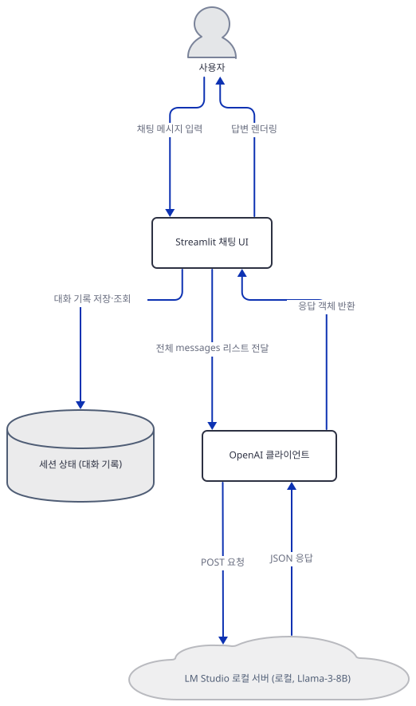
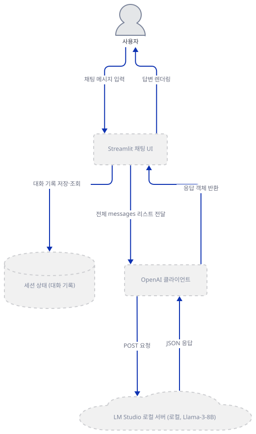
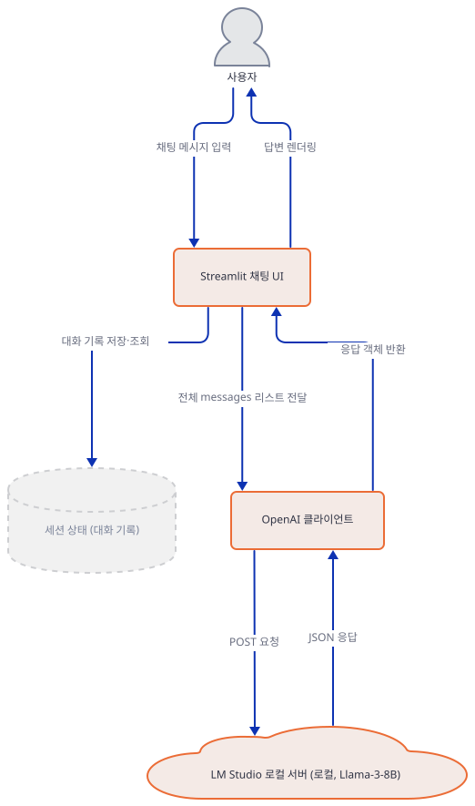
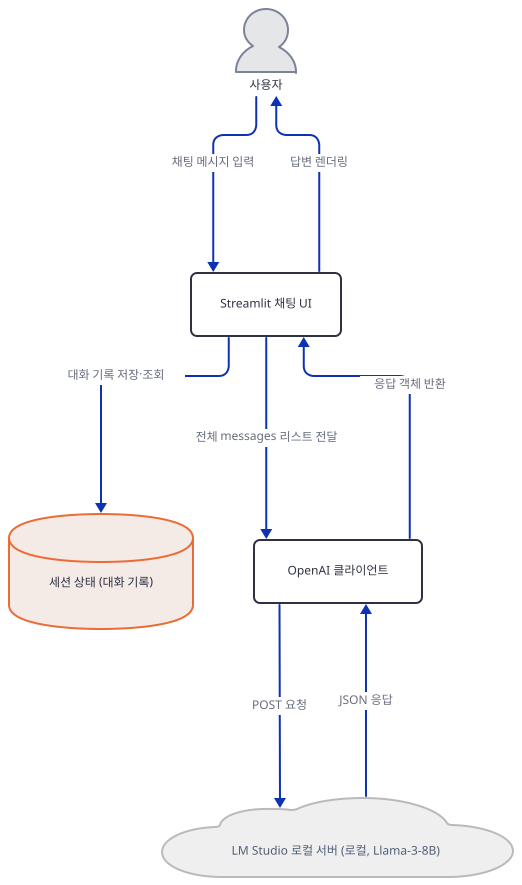
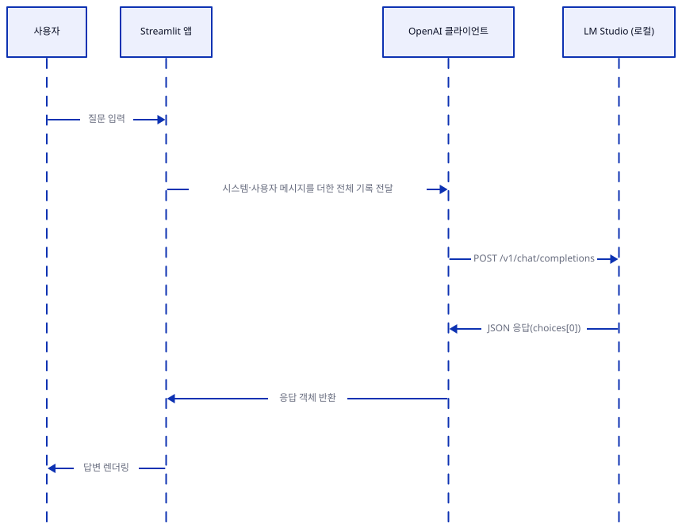

# Day 071 · 💬 Llama3 Stateful Chat

> 볼륨 6 💾 LLM Apps with Memory · 난이도 ★☆☆ · 예상 소요 60분 · API 비용 무료(로컬 — LM Studio가 GPU/CPU로 직접 추론하며, 클라우드 API 호출이 없습니다) · 원본 앱: `advanced_llm_apps/llm_apps_with_memory_tutorials/llama3_stateful_chat`

## 오늘 만들 것

오늘부터 7일간 이어지는 "💾 LLM Apps with Memory" 볼륨을 엽니다. 지난 📀 RAG 볼륨(Day 047~070)은 문서를 임베딩해 벡터로 저장하고 질문마다 유사도 검색으로 문맥을 찾아오는, 이를테면 "외부 지식에 대한 기억"을 다뤘습니다. 이 볼륨은 다른 종류의 기억을 다룹니다 — 한 대화 세션 안에서 "방금 무슨 말을 주고받았는지"를 기억하는 것입니다. Day 070의 예고가 정확히 이 앱을 가리켰습니다: "한 세션 안에서 대화 기록을 `st.session_state`에 쌓아 매 요청에 다시 보내는 가장 단순한 패턴". 오늘의 37줄짜리 `local_llama3_chat.py`가 바로 그 가장 단순한 패턴입니다 — agno도 LangChain도 mem0도 쓰지 않고, 파이썬 리스트 하나(`st.session_state.messages`)에 대화를 쌓고, 매 턴 그 리스트 전체를 다시 모델에 보냅니다. RAG 볼륨의 검색·청킹·벡터 저장소는 이 파일 어디에도 없습니다. 대신 채팅 모델을 클라우드가 아니라 **LM Studio**라는 데스크톱 앱이 로컬로 서빙합니다 — LM Studio는 OpenAI와 똑같은 REST 스키마(`/v1/chat/completions`)로 응답하므로, 이 코드는 `openai` 패키지의 표준 클라이언트를 그대로 쓰면서 `base_url`만 `http://localhost:1234/v1`로 바꿔치기합니다(9행). API 키 자리에는 진짜 키 대신 `"lm-studio"`라는 아무 문자열이나 들어갑니다 — LM Studio가 키를 검사하지 않기 때문입니다(직접 확인, 아래). 이 문서를 쓰며 이 2줄짜리 `requirements.txt`를 설치했을 때는 **streamlit 1.64.0**, **openai 3.19.2**가 받아졌고(직접 확인, 2026-09-28 기준), `python -m py_compile`과 6개 import 모두 문제없이 통과했습니다 — 이 볼륨 첫 날은 RAG 볼륨에서 거의 매일 만났던 버전 드리프트나 이름 바뀐 메서드가 없습니다. 다만 코드 자체에 눈에 띄는 결함이 하나 있습니다 — 사용자가 메시지를 보낼 때마다(22행) `/add`로 시작하는 입력을 특별 취급하라는 시스템 메시지를 조건 없이 대화 기록에 추가하는데, 이 파일 어디에도 `/add`를 실제로 처리하는 코드는 없고, 이 메시지를 지우는 코드도 없습니다 — 대화가 길어질수록 똑같은 시스템 메시지가 계속 쌓입니다(Step 5·6에서 직접 재현합니다). 또한 화면 제목(5행)은 "Local ChatGPT with Memory 🦙"라고 뜹니다 — 이 튜토리얼의 이름(Llama3 Stateful Chat)이나 이 볼륨의 다른 날(Day 076 "Local ChatGPT Clone with Memory")과 헷갈리기 쉬운 이름이지만, 같은 파일 안의 같은 앱입니다(소스로 확인). API 키가 없어도 이 문서는 LM Studio를 실제로 띄우지 않은 채, 임의의 높은 포트에 직접 만든 가짜 OpenAI 호환 서버로 요청·응답 왕복 전체를 재현합니다. 완성하면 브라우저에는 제목과 캡션, 그리고 채팅 입력창 하나만 있는 아주 단순한 화면이 뜹니다. 아래는 완성된 아키텍처입니다.



## 사전 준비

| 서비스/도구 | 용도 | 발급·설치 |
|---|---|---|
| LM Studio | `lmstudio-community/Meta-Llama-3-8B-Instruct-GGUF`를 OpenAI 호환 REST 서버(`http://localhost:1234/v1`)로 로컬 서빙 | https://lmstudio.ai 에서 설치 후 앱 안에서 해당 모델을 내려받고 로컬 서버(Local Server) 탭에서 실행 — 이 문서는 설치·실행하지 않습니다 |
| uv | 가상환경 생성과 패키지 설치 | [공통 사전 준비](../README.md#공통-사전-준비-한-번만) 절 참고 |

## 아키텍처 한눈에 보기

| 컴포넌트 | 역할 | 코드 위치 |
|---|---|---|
| 사용자 (브라우저) | 채팅창에 질문 입력, 답변 확인 | 코드 없음 (외부 UI) |
| Streamlit 채팅 UI | 제목·캡션 표시, 대화 기록 렌더링, 사용자 입력 처리 | `advanced_llm_apps/llm_apps_with_memory_tutorials/llama3_stateful_chat/local_llama3_chat.py:5-6`, `advanced_llm_apps/llm_apps_with_memory_tutorials/llama3_stateful_chat/local_llama3_chat.py:15-27`, `advanced_llm_apps/llm_apps_with_memory_tutorials/llama3_stateful_chat/local_llama3_chat.py:36-37` |
| 세션 상태 (대화 기록) | 턴마다 시스템·사용자·어시스턴트 메시지를 쌓는, 브라우저 세션 동안만 유지되는 인메모리 리스트 | `advanced_llm_apps/llm_apps_with_memory_tutorials/llama3_stateful_chat/local_llama3_chat.py:12-13`, `advanced_llm_apps/llm_apps_with_memory_tutorials/llama3_stateful_chat/local_llama3_chat.py:22`, `advanced_llm_apps/llm_apps_with_memory_tutorials/llama3_stateful_chat/local_llama3_chat.py:24`, `advanced_llm_apps/llm_apps_with_memory_tutorials/llama3_stateful_chat/local_llama3_chat.py:34` |
| OpenAI 클라이언트 | LM Studio의 OpenAI 호환 엔드포인트로 채팅 완성 요청 | `advanced_llm_apps/llm_apps_with_memory_tutorials/llama3_stateful_chat/local_llama3_chat.py:9`, `advanced_llm_apps/llm_apps_with_memory_tutorials/llama3_stateful_chat/local_llama3_chat.py:29-32` |
| LM Studio 로컬 서버 (로컬) | `Meta-Llama-3-8B-Instruct-GGUF` 모델을 OpenAI 호환 API로 서빙 | 코드 없음 (외부 프로세스, `http://localhost:1234/v1`) |

## 단계별 진행

### Step 1. 환경 만들기 — 2줄짜리 requirements.txt

**목적.** 격리된 가상환경에 `streamlit`·`openai`를 설치하고, 오늘 실제로 무엇이 풀리는지, 이 파일이 그대로 컴파일되는지 확인합니다.

**할 일.**

```bash
cd advanced_llm_apps/llm_apps_with_memory_tutorials/llama3_stateful_chat
uv venv
uv pip install -r requirements.txt
```

(pip 대안: `python -m venv .venv && source .venv/bin/activate && pip install -r requirements.txt`. Windows PowerShell은 활성화만 `.venv\Scripts\Activate.ps1`로 바꿉니다.) 이 저장소는 루트에 `pyproject.toml`이 있어 `uv run`이 방금 만든 환경 대신 루트 `.venv`를 쓰므로, 이후 `uv run` 명령에는 모두 `--no-project`를 붙입니다.

`advanced_llm_apps/llm_apps_with_memory_tutorials/llama3_stateful_chat/requirements.txt:1-2`

```text
streamlit 
openai
```

(2줄이지만 마지막 줄에 개행이 없어 `wc -l`은 1로 셉니다 — 편집기·GitHub에서는 그대로 2줄로 보입니다. 1행 끝에는 공백이 하나 더 있습니다.) 이 문서를 쓰며 설치했을 때는 **streamlit 1.64.0**, **openai 3.19.2**가 받아졌습니다(직접 확인, 2026-09-28 기준 — 버전을 고정하지 않아 오늘 기준 최신입니다).

**그림.**



**확인.**

```bash
uv run --no-project python -m py_compile local_llama3_chat.py && echo compiled
uv run --no-project python -c "import streamlit, openai; print('streamlit', streamlit.__version__); print('openai', openai.__version__)"
```

직접 확인한 출력:

```
compiled
streamlit 1.64.0
openai 3.19.2
```

### Step 2. Streamlit 제목과 LM Studio용 OpenAI 클라이언트

**목적.** 화면 제목·캡션이 무엇을 보여주는지, 그리고 `OpenAI(base_url=...)`가 클라우드가 아니라 이 컴퓨터의 LM Studio를 가리키도록 어떻게 바꿔치기됐는지 확인합니다.

**할 일.**

`advanced_llm_apps/llm_apps_with_memory_tutorials/llama3_stateful_chat/local_llama3_chat.py:1-9`

```python
import streamlit as st
from openai import OpenAI

# Set up the Streamlit App
st.title("Local ChatGPT with Memory 🦙")
st.caption("Chat with locally hosted memory-enabled Llama-3 using the LM Studio 💯")

# Point to the local server setup using LM Studio
client = OpenAI(base_url="http://localhost:1234/v1", api_key="lm-studio")
```

`base_url="http://localhost:1234/v1"`는 문자열 그대로 소스에 박혀 있습니다 — 같은 볼륨의 다른 날들이 Ollama에서 봤던 `OLLAMA_HOST` 같은 환경변수 우회는 이 코드에 없습니다(그렙으로 확인, `os.environ`이 이 파일에 한 번도 나오지 않습니다). `api_key="lm-studio"`도 마찬가지로 아무 문자열이나 들어가도 되는 자리표시자입니다 — `OpenAI` 클라이언트는 생성 시점에 키를 검증하지 않고, LM Studio 서버도 이 값을 확인하지 않습니다(LM Studio 자체 문서 기준. 이 문서는 LM Studio를 실제로 띄우지 않았으므로 서버 쪽 동작은 재현하지 못했습니다). 클라이언트 생성 자체는 네트워크 요청이 아니므로 LM Studio가 꺼져 있어도 예외 없이 성공합니다.

**그림.**



**확인.** 클라이언트 생성이 예외 없이 성공하는 것과, `base_url`이 정말 로컬 주소로 고정됐는지 확인합니다.

```bash
uv run --no-project python -c "
from openai import OpenAI
client = OpenAI(base_url='http://localhost:1234/v1', api_key='lm-studio')
print('client created OK, base_url:', client.base_url)
"
```

직접 확인한 출력:

```
client created OK, base_url: http://localhost:1234/v1/
```

LM Studio가 꺼져 있는 상태에서 실제로 완성을 요청하면 어떻게 되는지도, 아무도 듣지 않는 임의의 높은 포트(59321)로 확인했습니다(LM Studio도 실제 서버도 띄우지 않습니다).

```bash
uv run --no-project python -c "
from openai import OpenAI
client = OpenAI(base_url='http://127.0.0.1:59321/v1', api_key='lm-studio')
try:
    client.chat.completions.create(model='lmstudio-community/Meta-Llama-3-8B-Instruct-GGUF', messages=[{'role':'user','content':'hi'}], temperature=0.7)
except Exception as e:
    print('EXCEPTION TYPE:', type(e).__name__)
    print('EXCEPTION MSG:', str(e)[:300])
"
```

직접 확인한 출력:

```
EXCEPTION TYPE: APIConnectionError
EXCEPTION MSG: Connection error.
```

### Step 3. 세션 상태로 대화 기록 만들기

**목적.** `st.session_state.messages`가 언제 처음 만들어지고, 왜 이것이 "기억"의 전부인지 확인합니다.

**할 일.**

`advanced_llm_apps/llm_apps_with_memory_tutorials/llama3_stateful_chat/local_llama3_chat.py:11-13`

```python
# Initialize the chat history
if "messages" not in st.session_state:
    st.session_state.messages = []
```

Streamlit은 스크립트를 매 상호작용마다 처음부터 다시 실행합니다 — `st.session_state`가 없다면 매번 빈 리스트로 되돌아갈 것입니다. `if "messages" not in st.session_state`는 이미 있는 리스트를 덮어쓰지 않도록 지키는 가드입니다. 이 리스트는 파일 시스템이나 데이터베이스가 아니라 브라우저 세션이 유지되는 동안만 서버 프로세스 메모리에 남습니다 — 페이지를 새로고침하면(정확히는 새 세션이 시작되면) 사라집니다. 이것이 이 앱이 가진 "기억"의 전부입니다.

**그림.**



**확인.** 파일에 이 3줄이 그대로 있는지 확인합니다.

```bash
uv run --no-project python -c "
import ast
tree = ast.parse(open('local_llama3_chat.py', encoding='utf-8').read())
src = ast.get_source_segment(open('local_llama3_chat.py', encoding='utf-8').read(), tree.body[3])
print(src)
"
```

직접 확인한 출력(파일의 4번째 최상위 문장 — import 2개, `st.title` 호출에 이어 세 번째 실행문):

```
if "messages" not in st.session_state:
    st.session_state.messages = []
```

### Step 4. 대화 기록을 화면에 그대로 재생

**목적.** 매 재실행마다 지금까지 쌓인 메시지 전체를 어떻게 다시 그리는지 확인합니다.

**할 일.**

`advanced_llm_apps/llm_apps_with_memory_tutorials/llama3_stateful_chat/local_llama3_chat.py:15-18`

```python
# Display the chat history
for message in st.session_state.messages:
    with st.chat_message(message["role"]):
        st.markdown(message["content"])
```

`st.chat_message(role)`은 `role` 문자열을 그대로 받아 말풍선 스타일을 고릅니다 — `"user"`·`"assistant"`뿐 아니라 `"system"`을 넘겨도 예외 없이 렌더링됩니다(Step 5·6에서 직접 확인합니다). 이 루프는 스크립트 맨 위쪽에서 한 번 돌고 끝나므로, **이번 턴에 새로 추가되는 메시지는 이 루프에 잡히지 않습니다** — 그래서 아래 두 스텝은 새 메시지를 `st.chat_message(...)`로 따로 한 번 더 그립니다.

**그림.**


**확인.** 빈 세션에서는 이 루프가 아무것도 그리지 않는다는 것을 확인합니다.

```bash
uv run --no-project python -c "
messages = []
count = 0
for message in messages:
    count += 1
print('rendered bubbles for empty history:', count)
"
```

```
rendered bubbles for empty history: 0
```

### Step 5. 사용자 입력과 매 턴 추가되는 시스템 메시지

**목적.** `st.chat_input`이 입력을 받는 순간 정확히 무슨 일이 일어나는지, 그리고 22행의 시스템 메시지가 왜 계속 쌓이는지 확인합니다.

**할 일.**

`advanced_llm_apps/llm_apps_with_memory_tutorials/llama3_stateful_chat/local_llama3_chat.py:20-27`

```python
# Accept user input
if prompt := st.chat_input("What is up?"):
    st.session_state.messages.append({"role": "system", "content": "When the input starts with /add, don't follow up with a prompt."})
    # Add user message to chat history
    st.session_state.messages.append({"role": "user", "content": prompt})
    # Display user message in chat message container
    with st.chat_message("user"):
        st.markdown(prompt)
```

22행은 입력이 있을 때마다(조건 없이) `/add`로 시작하는 입력을 특별 취급하라는 시스템 메시지를 추가합니다. 문제는 이 파일 어디에도 `/add`를 실제로 검사하거나 처리하는 코드가 없다는 것입니다(그렙으로 확인 — `"/add"` 문자열은 이 22행에만 나옵니다) — 즉 이 지시문은 아무 기능과도 연결되지 않은 채, 대화가 길어질수록 똑같은 내용으로 계속 쌓이기만 합니다. 게다가 Step 4의 표시 루프는 이번 턴이 시작되기 **전**의 기록만 그리므로, 방금 추가한 이 시스템 메시지는 이번 화면에는 나타나지 않고 다음 턴이 되어서야 화면에 보입니다.

**그림.**


**확인.** 실제 앱을 `AppTest`로 두 턴 돌려, 시스템 메시지가 정말 턴마다 하나씩 쌓이는지, 그리고 화면에 언제 나타나는지 확인합니다(LM Studio 대신 임의의 높은 포트(58234)에 직접 만든 가짜 OpenAI 호환 서버를 씁니다 — Step 6에서 자세히 다룹니다). 여기서는 결과만 봅니다.

```bash
uv run --no-project python apptest_lifecycle_check.py
```

직접 확인한 출력(발췌 — 전체 스크립트와 가짜 서버 코드는 Step 6에 있습니다):

```
exception after turn 1: []
 - user ['What is up?']
 - assistant ['FAKE_LLAMA3_REPLY: hello from LM Studio stub']
exception after turn 2: []
 - system ["When the input starts with /add, don't follow up with a prompt."]
 - user ['What is up?']
 - assistant ['FAKE_LLAMA3_REPLY: hello from LM Studio stub']
 - user ['second question']
 - assistant ['FAKE_LLAMA3_REPLY: hello from LM Studio stub']
total messages in session_state after 2 turns: 6
roles: ['system', 'user', 'assistant', 'system', 'user', 'assistant']
system message count: 2
```

1턴째 화면에는 시스템 메시지가 보이지 않다가(Step 4에서 설명한 대로), 2턴째가 되어서야 1턴째의 시스템 메시지가 기록 재생 루프를 통해 화면에 나타납니다 — 이번 턴(2턴째) 것은 또 화면에 없습니다. 세션 상태에는 두 턴 만에 이미 시스템 메시지가 2개 쌓였습니다.

### Step 6. 응답 생성과 세션 상태 갱신

**목적.** `client.chat.completions.create(...)`가 정확히 무엇을 보내고, 응답을 어떻게 세션 상태와 화면 양쪽에 반영하는지 확인합니다.

**할 일.**

`advanced_llm_apps/llm_apps_with_memory_tutorials/llama3_stateful_chat/local_llama3_chat.py:28-37`

```python
    # Generate response
    response = client.chat.completions.create(
        model="lmstudio-community/Meta-Llama-3-8B-Instruct-GGUF",
        messages=st.session_state.messages, temperature=0.7
    )
    # Add assistant response to chat history
    st.session_state.messages.append({"role": "assistant", "content": response.choices[0].message.content})
    # Display assistant response in chat message container
    with st.chat_message("assistant"):
        st.markdown(response.choices[0].message.content)
```

`messages=st.session_state.messages`는 지금까지 쌓인 기록 **전체**(누적된 시스템 메시지 포함)를 그대로 모델에 보냅니다 — 요약도, 오래된 메시지를 잘라내는 것도 없습니다. `model=`은 사이드바 선택지 없이 `"lmstudio-community/Meta-Llama-3-8B-Instruct-GGUF"`로 고정돼 있어, LM Studio에 이 정확한 식별자로 모델이 로드돼 있어야 합니다. LM Studio는 API 키도, 모델 다운로드도 없이 재현하기 위해, 표준 라이브러리만으로 OpenAI 호환 응답을 흉내 내는 서버를 이 문서 밖의 임의의 높은 포트(58234, 49152~65535 범위)에 직접 만들었습니다. 이 앱의 `base_url`은 Step 2에서 본 대로 소스에 문자열로 박혀 있어 환경변수로 못 바꾸므로, 코드는 고치지 않고 **`openai.OpenAI` 클래스만 몬키패치**해 생성자가 항상 이 가짜 포트를 쓰도록 했습니다 — HTTP 요청·응답 처리는 실제 `openai` 라이브러리 그대로입니다.

```python
# apptest_lifecycle_check.py
import openai
from openai import OpenAI as _RealOpenAI

FAKE_PORT = 58234

class RedirectedOpenAI(_RealOpenAI):
    def __init__(self, *args, **kwargs):
        kwargs["base_url"] = f"http://127.0.0.1:{FAKE_PORT}/v1"
        super().__init__(*args, **kwargs)

openai.OpenAI = RedirectedOpenAI

from streamlit.testing.v1 import AppTest

at = AppTest.from_file("local_llama3_chat.py")
at.run(timeout=30)
at.chat_input[0].set_value("What is up?").run(timeout=30)
print("exception after turn 1:", list(at.exception))
for m in at.chat_message:
    print(" -", m.name, [w.value for w in m.markdown])
at.chat_input[0].set_value("second question").run(timeout=30)
print("exception after turn 2:", list(at.exception))
for m in at.chat_message:
    print(" -", m.name, [w.value for w in m.markdown])
msgs = at.session_state["messages"]
print("total messages in session_state after 2 turns:", len(msgs))
print("roles:", [m["role"] for m in msgs])
print("system message count:", sum(1 for m in msgs if m["role"] == "system"))
```

가짜 서버는 받은 요청의 `model`·메시지 개수를 표준출력에 찍고, 항상 같은 텍스트로 답합니다.

```python
# fake_lmstudio.py
import json
from http.server import BaseHTTPRequestHandler, ThreadingHTTPServer

PORT = 58234

class Handler(BaseHTTPRequestHandler):
    def do_POST(self):
        n = int(self.headers.get("content-length", 0))
        body = json.loads(self.rfile.read(n).decode())
        reply = {
            "id": "chatcmpl-fake", "object": "chat.completion", "created": 0,
            "model": body.get("model", "fake"),
            "choices": [{"index": 0, "message": {"role": "assistant", "content": "FAKE_LLAMA3_REPLY: hello from LM Studio stub"}, "finish_reason": "stop"}],
        }
        data = json.dumps(reply).encode()
        self.send_response(200)
        self.send_header("Content-Type", "application/json")
        self.send_header("Content-Length", str(len(data)))
        self.end_headers()
        self.wfile.write(data)
    def log_message(self, *a): pass

ThreadingHTTPServer(("127.0.0.1", PORT), Handler).serve_forever()
```

**그림.**


**확인.** 가짜 서버를 백그라운드로 띄운 뒤 재현 스크립트를 돌립니다.

```bash
uv run --no-project python fake_lmstudio.py &
uv run --no-project python apptest_lifecycle_check.py
```

직접 확인한 출력은 Step 5에 그대로 있습니다 — 두 턴 모두 `exception`이 빈 리스트이고, 어시스턴트 말풍선에 가짜 서버의 고정 응답(`FAKE_LLAMA3_REPLY: hello from LM Studio stub`)이 그대로 나타납니다. 실제 LM Studio를 띄우면 이 자리에 `Llama-3-8B-Instruct`가 생성한, 매번 달라지는 문장이 대신 들어갑니다.

## 요청 한 건이 흐르는 과정



사용자가 채팅창에 질문을 입력하면 Streamlit 앱은 세션 상태에 시스템 메시지(22행, 매 턴 반복)와 사용자 메시지를 더한 전체 기록을 그대로 OpenAI 클라이언트에 넘깁니다. 클라이언트는 이 기록 전체를 담아 LM Studio의 `/v1/chat/completions`에 POST 요청을 보내고, LM Studio는 로컬에서 `Llama-3-8B-Instruct` 모델로 완성을 생성해 OpenAI와 같은 JSON 스키마로 돌려줍니다. 클라이언트가 이 응답 객체를 Streamlit 앱에 돌려주면, 앱은 `response.choices[0].message.content`를 세션 상태에 어시스턴트 메시지로 추가하고 곧바로 화면에 렌더링합니다. 세션 상태는 이 그림에 별도 배우로 넣지 않았습니다 — 벡터 데이터베이스나 외부 API처럼 요청을 주고받는 대상이 아니라, Streamlit 앱과 같은 프로세스 메모리 안에 있는 파이썬 리스트이기 때문입니다(오늘 만들 것·아키텍처 표에서는 구조를 보여주기 위해 별도 컴포넌트로 그렸습니다). 이 왕복은 Step 6에서 가짜 로컬 서버로 직접 재현했습니다 — 실제 LM Studio를 띄운 적은 없습니다.

## 실행 체크리스트

- [ ] `uv venv && uv pip install -r requirements.txt`만으로 `streamlit`·`openai` 임포트가 성공하고, 파일이 그대로 컴파일된다는 것을 확인했다
- [ ] `base_url`이 소스에 문자열로 고정돼 있어 환경변수로 바꿀 수 없고, LM Studio가 꺼져 있으면 `openai.APIConnectionError`로 실패한다는 것을 직접 확인했다
- [ ] `st.session_state.messages`가 브라우저 세션 동안만 유지되는 인메모리 리스트라는 것과, 기록 재생 루프가 이번 턴 이전의 메시지만 그린다는 것을 이해했다
- [ ] 매 턴 조건 없이 추가되는 시스템 메시지(22행)가 `/add` 처리 코드 없이 계속 쌓이기만 하고, 화면에는 다음 턴이 되어서야 나타난다는 것을 `AppTest`로 직접 확인했다
- [ ] `messages=st.session_state.messages`가 누적된 시스템 메시지를 포함한 기록 전체를 매번 다시 보낸다는 것을 소스로 확인했다
- [ ] API 키도 모델 다운로드도 없이, 몬키패치한 클라이언트와 가짜 로컬 서버로 채팅 왕복 전체(사용자 입력 → 응답 렌더링)를 재현했다

## 문제 해결

| 증상 | 원인 | 해결 |
|---|---|---|
| 화면 제목이 "Local ChatGPT with Memory 🦙"로 뜨고 이 튜토리얼 이름과 다름 | 5행의 `st.title(...)` 문자열이 애초에 이 이름으로 적혀 있음(소스로 확인) — 같은 볼륨의 Day 076("Local ChatGPT Clone with Memory")과도 헷갈리기 쉬움 | 정상 동작 — 같은 파일 안의 같은 앱이며, 리포 코드는 고치지 않음 |
| 대화가 길어질수록 똑같은 시스템 메시지가 여러 번 쌓임 | 22행이 입력이 있을 때마다 조건 없이 같은 시스템 메시지를 추가하고, 지우는 코드가 없음(그렙·`AppTest`로 직접 확인) | 리포 코드는 고치지 않음 — 직접 고쳐보려면 더 해보기 참고 |
| `client.chat.completions.create(...)` 호출이 `openai.APIConnectionError: Connection error.`로 실패 | LM Studio 로컬 서버(`http://localhost:1234/v1`)가 떠 있지 않음(직접 확인, Step 2) | LM Studio를 설치하고 `lmstudio-community/Meta-Llama-3-8B-Instruct-GGUF`를 내려받아 로컬 서버로 실행(이 문서는 실행하지 않음) |

## 더 해보기

- 시스템 메시지를 추가하는 줄(`advanced_llm_apps/llm_apps_with_memory_tutorials/llama3_stateful_chat/local_llama3_chat.py:22`)을 `if not any(m["role"] == "system" for m in st.session_state.messages):`로 감싸, 세션당 한 번만 추가되도록 고쳐보고 세션 상태의 메시지 수가 어떻게 달라지는지 확인해보기
- 클라이언트를 생성하는 줄(`advanced_llm_apps/llm_apps_with_memory_tutorials/llama3_stateful_chat/local_llama3_chat.py:9`)의 `base_url`을 `os.environ.get("LMSTUDIO_BASE_URL", "http://localhost:1234/v1")`처럼 환경변수로 바꿔, 코드를 고치지 않고도 포트를 바꿀 수 있게 만들어보기
- LM Studio를 실제로 설치해 모델을 띄우고, `client.chat.completions.create(...)`(`advanced_llm_apps/llm_apps_with_memory_tutorials/llama3_stateful_chat/local_llama3_chat.py:29-32`)에 `stream=True`를 추가해 토큰이 실시간으로 나타나도록 바꿔보기

## 다음 날 예고

[Day 072 · 💾 AI ArXiv Agent with Memory](../day072-ai-arxiv-agent-memory/README.md) — mem0로 Qdrant에 대화 기억을 영구 저장하고, MultiOn으로 arXiv 논문을 검색하는 리서치 에이전트를 다룹니다. 오늘의 파이썬 리스트보다 한 단계 나아간, 세션이 끝나도 남는 기억입니다.
