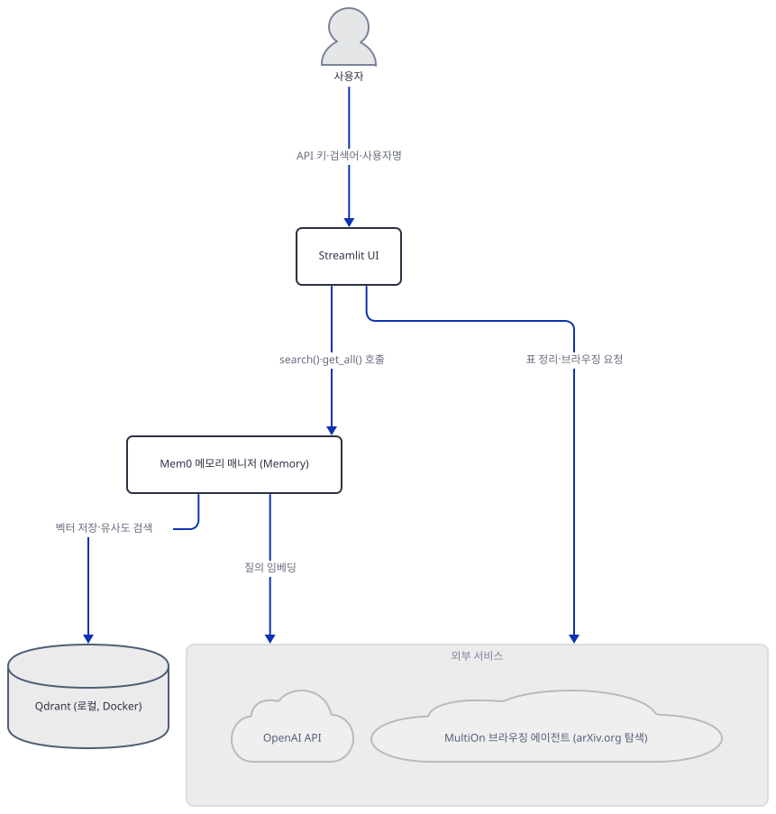
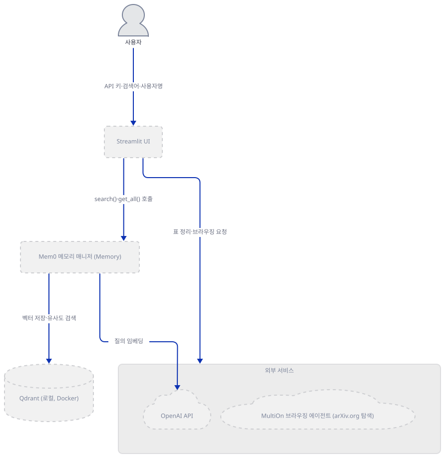
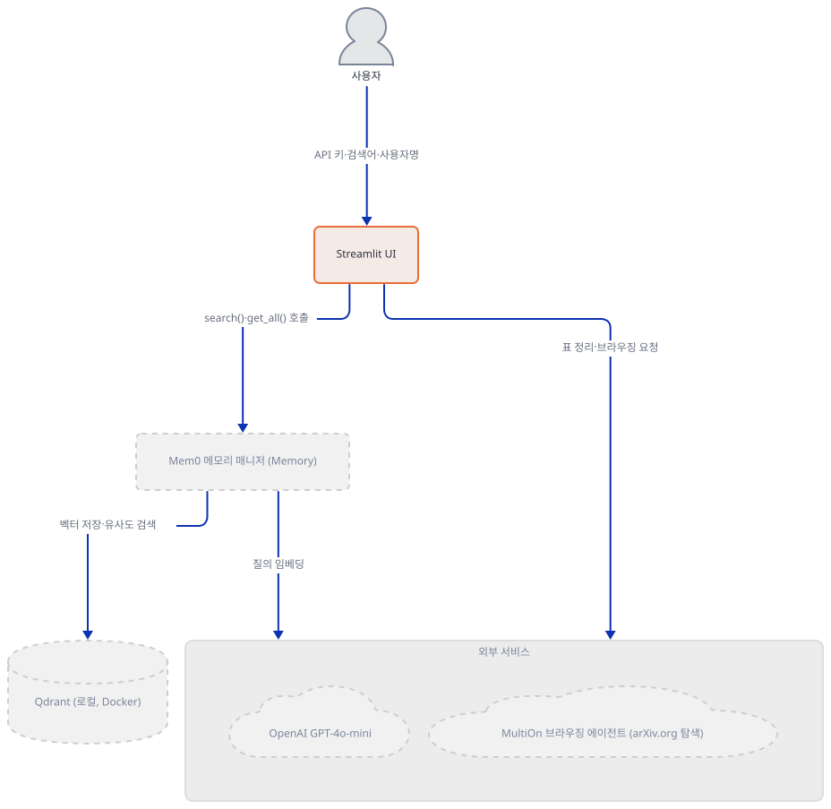
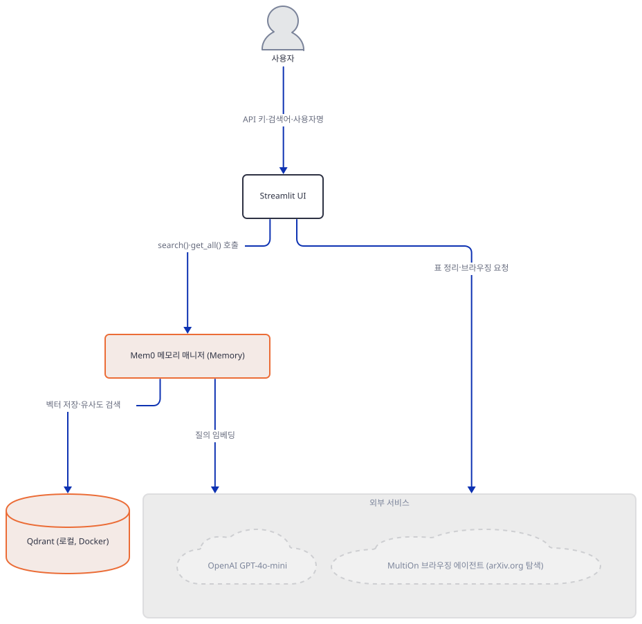
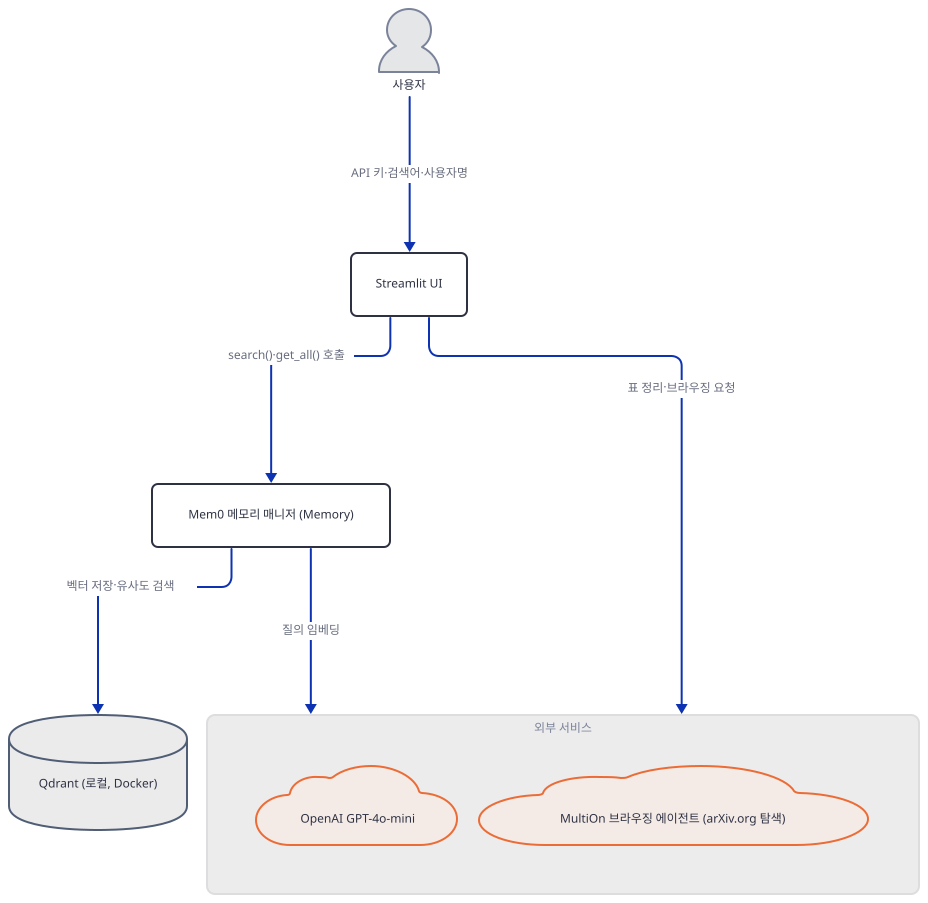
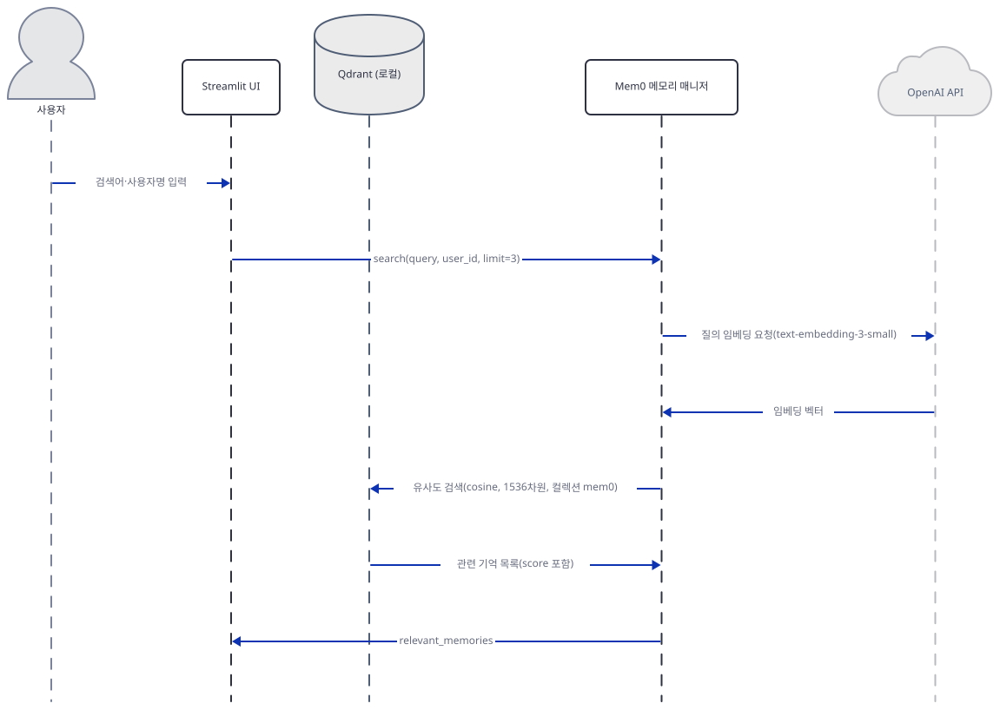

# Day 072 · 💾 AI ArXiv Agent with Memory

> 볼륨 6 💾 LLM Apps with Memory · 난이도 ★★☆ · 예상 소요 50분(오늘 풀리는 버전에서 두 크래시를 직접 재현하는 명령들을 포함합니다) · API 비용 대략 $0.1 이하(OpenAI GPT-4o-mini·임베딩 기준, 실제 키로 실행할 때) — MultiOn 브라우징 요금은 가입이 필요한 유료 상품이라 확인하지 못했습니다 · 원본 앱: `advanced_llm_apps/llm_apps_with_memory_tutorials/ai_arxiv_agent_memory`

## 오늘 만들 것

이 앱은 OpenAI GPT-4o-mini와 MultiOn 브라우징 에이전트, 그리고 Mem0+Qdrant로 만든 사용자별 기억을 하나로 묶어 arXiv 논문을 찾아 표로 정리해 주는 65줄(마지막 줄에 개행이 없어 `wc -l`은 64로 세지만 편집기·GitHub에서는 65번째 줄까지 보입니다, 직접 확인) 단일 파일 Streamlit 앱입니다. 사이드바에 사용자명을 적어 두면 `Memory.search()`로 그 사용자의 과거 검색 맥락을 불러와 MultiOn에게 보낼 프롬프트에 섞고, `Memory.get_all()`로 지금까지 쌓인 기억을 사이드바에 나열하는 것이 이 볼륨의 핵심 개념입니다. 그런데 `requirements.txt` 4줄은 전부 버전 고정이 없어 오늘 그대로 설치하면 mem0ai 2.2.1·openai 3.19.2·multion 1.3.8·streamlit 1.64.0이 풀리고(직접 확인, 2026-09-28 기준), 이 조합 앞에서 이 앱은 두 API 키를 입력하는 순간부터 실행되지 않습니다. 먼저 13~24행의 `vector_store.config`에 있는 `"model": "gpt-4o-mini"` 필드가 mem0ai 2.2.1의 QdrantConfig에는 없는 필드라서 `Memory.from_config(config)`가 pydantic `ValidationError`를 곧바로 던집니다(직접 확인, Step 3) — Qdrant 서버가 떠 있는지조차 확인하기 전에 멈춥니다. 이 한 줄을 고쳐도 56·62행의 `memory.search(search_query, user_id=user_id, limit=3)`·`memory.get_all(user_id=user_id)`는 mem0ai 2.2.1이 더는 받지 않는 예전 호출 방식이라 `ValueError: Top-level entity parameters ... are not supported`로 막힙니다(직접 확인, Step 6·7). 게다가 이 파일 어디에도 `memory.add()` 호출이 없어서(grep 확인) 앞의 두 문제를 다 고쳐도 "View Memory"는 언제나 빈 목록입니다 — 원본 README가 내세우는 "Persistent memory of user interests and past searches" 기능은 애초에 코드에 없습니다. 완성하면 브라우저에는 API 키 입력창 2개, 사이드바의 사용자명·기억 보기 버튼, 검색창과 검색 버튼이 뜹니다. 아래는 완성된 아키텍처입니다.



## 사전 준비

| 서비스/도구 | 용도 | 발급·설치 |
|---|---|---|
| OpenAI API 키 | `process_with_gpt4`의 GPT-4o-mini 표 정리 호출과 Mem0 기본 임베더(`text-embedding-3-small`, 소스로 확인) 양쪽에 쓰입니다 | https://platform.openai.com 에서 발급 — 이 문서는 키 없이 진행합니다 |
| MultiOn API 키 | 자연어 명령으로 arXiv.org를 대신 탐색하는 유료 브라우징 에이전트(기본 API 엔드포인트 `https://api.multion.ai/v1/web`, 소스로 확인) | https://multion.ai 가입 후 발급 — 이 문서는 키 없이 진행합니다 |
| Qdrant (Docker) | Mem0가 쓰는 로컬 벡터 저장소, `localhost:6333`으로 하드코딩되어 있습니다(19~20행) | `docker pull qdrant/qdrant` 후 `docker run -p 6333:6333 -p 6334:6334 -v "$(pwd)/qdrant_storage:/qdrant/storage:z" qdrant/qdrant` — 이 문서는 띄우지 않습니다 |
| uv | 가상환경 생성과 패키지 설치 | [공통 사전 준비](../README.md#공통-사전-준비-한-번만) 절 참고 |

## 아키텍처 한눈에 보기

| 컴포넌트 | 역할 | 코드 위치 |
|---|---|---|
| Streamlit UI | API 키 2개 입력, 사용자명·검색어 입력, 검색·기억 보기 버튼 | `advanced_llm_apps/llm_apps_with_memory_tutorials/ai_arxiv_agent_memory/ai_arxiv_agent_memory.py:7-29` |
| Mem0 메모리 매니저 | `search()`로 사용자 맥락 조회, `get_all()`로 전체 기억 나열(`add()`는 어디에도 없음) | `advanced_llm_apps/llm_apps_with_memory_tutorials/ai_arxiv_agent_memory/ai_arxiv_agent_memory.py:13-24` |
| 결과 정리 함수 (process_with_gpt4) | MultiOn의 브라우징 결과를 GPT-4o-mini로 마크다운 표로 변환 | `advanced_llm_apps/llm_apps_with_memory_tutorials/ai_arxiv_agent_memory/ai_arxiv_agent_memory.py:31-52` |
| OpenAI GPT-4o-mini | 표 정리용 채팅 완성 모델 | `advanced_llm_apps/llm_apps_with_memory_tutorials/ai_arxiv_agent_memory/ai_arxiv_agent_memory.py:49` |
| Mem0 기본 임베더 (OpenAI, text-embedding-3-small) | `memory.search()`가 질의 텍스트를 벡터로 바꿀 때 내부적으로 호출(소스로 확인) | mem0ai 2.2.1 패키지 내부 `mem0/embeddings/openai.py` 15행(저장소 밖) |
| MultiOn 브라우징 에이전트 | 자연어 명령으로 arXiv.org를 탐색해 결과를 돌려주는 외부 SaaS | `advanced_llm_apps/llm_apps_with_memory_tutorials/ai_arxiv_agent_memory/ai_arxiv_agent_memory.py:58` |
| Qdrant (로컬, Docker) | Mem0가 기억 벡터를 저장·검색하는 벡터 저장소, 컬렉션 이름 기본값 `mem0`(소스로 확인) | `advanced_llm_apps/llm_apps_with_memory_tutorials/ai_arxiv_agent_memory/ai_arxiv_agent_memory.py:14-22` |

## 단계별 진행

### Step 1. 환경 만들기 — 고정되지 않은 4줄, 오늘 풀리는 버전

**목적.** 격리된 가상환경에 `requirements.txt`를 설치하고, 버전을 고정하지 않았을 때 오늘 실제로 무엇이 풀리는지 확인합니다.

**할 일.**

```bash
cd advanced_llm_apps/llm_apps_with_memory_tutorials/ai_arxiv_agent_memory
uv venv
uv pip install -r requirements.txt
```

(pip 대안: `python -m venv .venv && source .venv/bin/activate && pip install -r requirements.txt`.) 이 저장소 루트에는 `pyproject.toml`이 있어 이후 `uv run` 명령에는 모두 `--no-project`를 붙입니다.

`advanced_llm_apps/llm_apps_with_memory_tutorials/ai_arxiv_agent_memory/requirements.txt:1-4`

```text
streamlit 
openai
mem0ai
multion
```

4줄 모두 버전이 없습니다. 이 문서를 쓰며 설치했을 때는 **streamlit 1.64.0**, **openai 3.19.2**(1.x가 아니라 이미 메이저 버전 3입니다), **mem0ai 2.2.1**(임포트한 모듈명은 `mem0`), **multion 1.3.8**이 받아졌습니다(직접 확인, 2026-09-28 기준).

`advanced_llm_apps/llm_apps_with_memory_tutorials/ai_arxiv_agent_memory/ai_arxiv_agent_memory.py:1-5`

```python
import streamlit as st
import os
from mem0 import Memory
from multion.client import MultiOn
from openai import OpenAI
```



**확인.**

```bash
uv run --no-project python -m py_compile ai_arxiv_agent_memory.py
uv run --no-project python -c "import streamlit, mem0, multion, openai; print(streamlit.__version__, mem0.__version__, multion.__version__, openai.__version__)"
```

컴파일 오류 없이 끝나고 `1.64.0 2.2.1 1.3.8 3.19.2`가 출력되면(정확한 숫자는 설치 시점에 따라 달라질 수 있습니다) 이 단계가 끝난 것입니다.

### Step 2. API 키 입력 UI와 게이트

**목적.** OpenAI·MultiOn 키를 비밀번호 입력창으로 받고, 둘 다 채워졌을 때만 아래 로직 전체를 실행하게 합니다.

**할 일.**

`advanced_llm_apps/llm_apps_with_memory_tutorials/ai_arxiv_agent_memory/ai_arxiv_agent_memory.py:7-12`

```python
st.title("AI Research Agent with Memory 📚")

api_keys = {k: st.text_input(f"{k.capitalize()} API Key", type="password") for k in ['openai', 'multion']}

if all(api_keys.values()):
    os.environ['OPENAI_API_KEY'] = api_keys['openai']
```

9행의 `k.capitalize()`는 `'openai'`→`"Openai"`, `'multion'`→`"Multion"`으로 보여 줍니다("OpenAI"·"MultiOn"이 아닙니다) — 기능에는 영향이 없는 표시 문제입니다. `all(api_keys.values())`는 두 입력창이 **모두** 채워져야 참이 되므로, 이 시점까지는 OpenAI 키만으로는 아무 것도 시작되지 않습니다.



**확인.** 키를 하나도 넣지 않고 앱을 실행하면 65행의 경고만 뜨고 그 밖에는 아무 것도 실행되지 않습니다(Step 7에서 함께 확인합니다).

### Step 3. Mem0 + Qdrant 메모리 초기화 — 그리고 즉시 나는 ValidationError

**목적.** Qdrant를 벡터 저장소로 쓰는 Mem0 `Memory` 객체를 만듭니다. 오늘 이 코드가 실제로 어디서 멈추는지 직접 확인합니다.

**할 일.**

`advanced_llm_apps/llm_apps_with_memory_tutorials/ai_arxiv_agent_memory/ai_arxiv_agent_memory.py:13-24`

```python
    # Initialize Mem0 with Qdrant
    config = {
        "vector_store": {
            "provider": "qdrant",
            "config": {
                "model": "gpt-4o-mini",
                "host": "localhost",
                "port": 6333,
            }
        },
    }
    memory, multion, openai_client = Memory.from_config(config), MultiOn(api_key=api_keys['multion']), OpenAI(api_key=api_keys['openai'])
```

18행의 `"model": "gpt-4o-mini"`는 mem0ai 2.2.1의 Qdrant 설정 스키마에 없는 필드입니다. 24행은 튜플 우변을 왼쪽부터 평가하므로 `Memory.from_config(config)`가 먼저 실행되고, 여기서 예외가 나면 `MultiOn(...)`·`OpenAI(...)`는 아예 호출되지도 못합니다.



**확인.** 네트워크를 막고(가짜 프록시로 외부 접속을 차단) 두 키에 아무 문자열이나 넣어 Streamlit `AppTest`로 이 스크립트를 실행하면:

```text
pydantic_core._pydantic_core.ValidationError: 1 validation error for MemoryConfig
vector_store
  Value error, Extra fields not allowed: model. Please input only the following fields: host, embedding_model_dims,
  collection_name, api_key, on_disk, client, url, path, https, port
```

가 24행에서 그대로 발생합니다(직접 확인). `"model"` 줄을 지운 config로 다시 시도하면 이번에는 `Memory.from_config()` 생성자 자체가 즉시 로컬 Qdrant(`localhost:6333`)에 접속을 시도하다가 서버가 없어 `ResponseHandlingException`(연결 거부)로 멈춥니다(직접 확인) — Qdrant를 실제로 띄우기 전에는 이 단계를 넘어갈 방법이 없습니다. 이 확인 과정에서 mem0가 기본적으로 `https://us.i.posthog.com`에 익명 사용 통계를 보내려 시도하는 것도 함께 관찰됩니다(프록시가 그 요청을 막았습니다) — mem0ai 2.2.1 패키지 내부 `mem0/memory/telemetry.py` 14행(저장소 밖)이 `MEM0_TELEMETRY` 환경 변수로 끌 수 있다고 밝히고 있습니다. Agno의 익명 통계(Day 047 Step 5)와 같은 종류의 사실이며, 이 앱은 "완전 로컬"이 아닙니다.

### Step 4. MultiOn·OpenAI 클라이언트는 죄가 없다 — 따로 떼어 확인

**목적.** Step 3의 크래시가 `Memory.from_config` 하나의 문제이지 MultiOn·OpenAI 클라이언트 생성 자체의 문제가 아님을 확인합니다.

**할 일.** 24행에서 함께 만들어지는 `MultiOn(api_key=...)`·`OpenAI(api_key=...)`는 둘 다 키의 형식을 검사하지 않는 지연 생성자입니다(소스로 확인). 이어서 26·29행이 사용자명과 검색어 입력창을 만듭니다.

`advanced_llm_apps/llm_apps_with_memory_tutorials/ai_arxiv_agent_memory/ai_arxiv_agent_memory.py:26-29`

```python
    user_id = st.sidebar.text_input("Enter your Username")
    #user_interests = st.text_area("Research interests and background")

    search_query = st.text_input("Research paper search query")
```

27행의 `user_interests` 입력창은 주석 처리되어 있어 실제로는 존재하지 않고, 있었더라도 어디에도 쓰이지 않습니다.



**확인.** 두 생성자만 따로 호출해 봅니다.

```bash
uv run --no-project python -c "
from openai import OpenAI
from multion.client import MultiOn
print(type(OpenAI(api_key='sk-fake')))
print(type(MultiOn(api_key='fake')))
"
```

`<class 'openai.OpenAI'>`와 `<class 'multion.client.MultiOn'>`이 예외 없이 출력됩니다(직접 확인) — Step 3의 실패는 오직 `Memory.from_config`의 문제입니다.

### Step 5. 결과를 표로 다듬는 process_with_gpt4

**목적.** MultiOn이 돌려준 브라우징 결과를 GPT-4o-mini에게 넘겨, 제목·저자·초록·링크를 담은 마크다운 표로 바꿉니다.

**할 일.**

`advanced_llm_apps/llm_apps_with_memory_tutorials/ai_arxiv_agent_memory/ai_arxiv_agent_memory.py:31-52`

```python
    def process_with_gpt4(result):
        """Processes an arXiv search result to produce a structured markdown output.

    This function takes a search result from arXiv and generates a markdown-formatted
    table containing details about each paper. The table includes columns for the 
    paper's title, authors, a brief abstract, and a link to the paper on arXiv. 

    Args:
        result (str): The raw search result from arXiv, typically in a text format.

    Returns:
        str: A markdown-formatted string containing a table with paper details."""
        prompt = f"""
        Based on the following arXiv search result, provide a proper structured output in markdown that is readable by the users. 
        Each paper should have a title, authors, abstract, and link.
        Search Result: {result}
        Output Format: Table with the following columns: [{{"title": "Paper Title", "authors": "Author Names", "abstract": "Brief abstract", "link": "arXiv link"}}, ...]
        """
        response = openai_client.chat.completions.create(model="gpt-4o-mini", messages=[{"role": "user", "content": prompt}], temperature=0.2)
        if not response.choices or response.choices[0].message.content is None:
            raise ValueError("Received empty or null response from OpenAI API")
        return response.choices[0].message.content
```

46행의 `{result}`는 문자열이 아니라 MultiOn `browse()`가 돌려주는 `BrowseOutput` 객체(`message`·`status`·`url`·`screenshot`·`session_id` 필드를 가진 pydantic 모델, 소스로 확인)를 f-string에 그대로 끼워 넣습니다 — GPT-4o-mini는 깔끔한 텍스트가 아니라 이 객체의 필드 나열 문자열을 받게 됩니다.


**확인.** 실제 호출은 외부 API 요청이라 실행하지 않고, 인터페이스만 확인합니다.

```bash
uv run --no-project python -c "
from openai import OpenAI
import inspect
c = OpenAI(api_key='sk-fake')
print('model' in inspect.signature(c.chat.completions.create).parameters)
print('temperature' in inspect.signature(c.chat.completions.create).parameters)
"
```

둘 다 `True`가 출력됩니다(직접 확인) — openai 패키지가 1.x에서 3.x로 메이저 버전이 뛰었어도 이 호출 모양은 그대로입니다.

### Step 6. "Search for Papers" 버튼 — 기억 검색 → MultiOn 브라우징 → 표 렌더링

**목적.** 사용자의 과거 기억을 검색어에 섞어 MultiOn에게 브라우징을 맡기고, 결과를 화면에 표로 띄웁니다.

**할 일.**

`advanced_llm_apps/llm_apps_with_memory_tutorials/ai_arxiv_agent_memory/ai_arxiv_agent_memory.py:54-59`

```python
    if st.button('Search for Papers'):
        with st.spinner('Searching and Processing...'):
            relevant_memories = memory.search(search_query, user_id=user_id, limit=3)
            prompt = f"Search for arXiv papers: {search_query}\nUser background: {' '.join(mem['text'] for mem in relevant_memories)}"
            result = process_with_gpt4(multion.browse(cmd=prompt, url="https://arxiv.org/"))
            st.markdown(result)
```

오늘 실행에서 이 블록은 Step 3의 크래시 때문에 애초에 정의조차 되지 않습니다(24행에서 이미 예외가 났으므로 54행 이하는 도달하지 못합니다). 크래시를 걷어내더라도 56행의 `memory.search(search_query, user_id=user_id, limit=3)`은 mem0ai 2.2.1에서 그대로 막힙니다 — `user_id`를 최상위 키워드 인자로 받지 않고 `filters={"user_id": ...}`만 받도록 바뀌었기 때문입니다.


**확인.** 로컬 온디스크 Qdrant로 살아있는 `Memory` 객체 하나를 따로 만들어 이 호출만 재현합니다(외부 API 요청 없이 재현 가능한 부분입니다).

```bash
uv run --no-project python -c "
from mem0 import Memory
m = Memory.from_config({'vector_store': {'provider': 'qdrant', 'config': {'path': '<스크래치 경로>'}}})
m.search('deep learning papers', user_id='tester', limit=3)
"
```

```text
ValueError: Top-level entity parameters frozenset({'user_id'}) are not supported in search(). Use filters={'user_id': '...'} instead.
```

이 예외가 그대로 재현됩니다(직접 확인). 참고로 `limit=3`은 예전 mem0 API의 인자 이름이고 지금은 `top_k`입니다 — `user_id`와 달리 `limit`은 거부 대상 키가 아니라서 오류 없이 조용히 무시됩니다(소스로 확인, 검색 결과 개수를 실제로 제한하지 못합니다).

### Step 7. 사이드바 "View Memory" 버튼과 비어 있는 기억

**목적.** 지금까지 쌓인 기억을 사이드바에 나열합니다. 그리고 왜 이 목록이 항상 비어 있는지 확인합니다.

**할 일.**

`advanced_llm_apps/llm_apps_with_memory_tutorials/ai_arxiv_agent_memory/ai_arxiv_agent_memory.py:61-62`

```python
    if st.sidebar.button("View Memory"):
        st.sidebar.write("\n".join([f"- {mem['text']}" for mem in memory.get_all(user_id=user_id)]))
```

62행의 `memory.get_all(user_id=user_id)`도 Step 6과 같은 이유(`user_id` 최상위 인자 거부)로 mem0ai 2.2.1에서는 예외가 납니다. 더 근본적인 문제는 따로 있습니다 — 이 파일 65줄 전체에 `memory.add(...)` 호출이 단 한 번도 없습니다(`grep -n "memory\."` 결과 `search`와 `get_all`뿐, 직접 확인). 즉 두 API 오류를 모두 오늘 버전에 맞게 고치더라도 이 앱은 사용자의 검색어나 관심사를 **한 번도 저장하지 않으므로** "View Memory"는 항상 빈 목록을 보여 줍니다. 원본 README가 내세우는 "Persistent memory of user interests and past searches"는 이 코드에 구현되어 있지 않습니다.


**확인.**

```bash
grep -n "memory\." ai_arxiv_agent_memory.py
```

`memory.search(...)`(56행)와 `memory.get_all(...)`(62행) 두 줄만 나오고 `memory.add`는 나오지 않습니다(직접 확인).

## 요청 한 건이 흐르는 과정



이 그림은 두 크래시가 없다고 가정했을 때 이 앱이 원래 의도한 요청 흐름입니다. 사용자가 검색어와 사용자명을 넣고 "Search for Papers"를 누르면, UI는 Mem0 매니저에게 `search()`를 호출하고, Mem0는 내부적으로 OpenAI 임베딩 모델에 질의를 벡터로 바꿔 달라고 요청한 뒤 그 벡터로 Qdrant에서 코사인 유사도 검색을 합니다. 돌아온 관련 기억은 UI로 전달되어 MultiOn에게 보낼 프롬프트에 섞이고, MultiOn은 arXiv.org를 브라우징한 결과(`BrowseOutput`)를 UI에 돌려줍니다. UI는 이 결과를 다시 OpenAI GPT-4o-mini에게 보내 마크다운 표로 정리한 뒤 사용자에게 보여 줍니다. 실제로는 Step 3·6·7에서 본 것처럼 이 흐름은 `Memory.from_config` 단계에서 이미 끊깁니다.

## 실행 체크리스트

- [ ] `uv venv` + `uv pip install -r requirements.txt`로 오늘 풀리는 버전을 확인했다(Step 1)
- [ ] 두 API 키를 넣자마자 `Memory.from_config`가 `"model"` 필드 때문에 `ValidationError`를 낸다는 것을 직접 재현했다(Step 3)
- [ ] `"model"` 필드를 지워도 로컬 Qdrant가 없으면 여전히 접속에 실패한다는 것을 확인했다(Step 3)
- [ ] `MultiOn`·`OpenAI` 생성자 자체는 문제가 없다는 것을 따로 확인했다(Step 4)
- [ ] `memory.search()`/`memory.get_all()`의 `user_id` 최상위 인자가 mem0ai 2.2.1에서 거부된다는 것을 재현했다(Step 6·7)
- [ ] `grep`으로 `memory.add()`가 파일 어디에도 없다는 것을 확인했다(Step 7)

## 문제 해결

| 증상 | 원인 | 해결 |
|---|---|---|
| 두 API 키를 넣자마자 화면에 `pydantic_core._pydantic_core.ValidationError`가 뜬다 | 19행 `vector_store.config`의 `"model": "gpt-4o-mini"`가 mem0ai 2.2.1의 QdrantConfig에 없는 필드 | 그 줄을 지운다(그래도 Qdrant 서버는 따로 필요합니다) |
| `"model"` 줄을 지워도 `ResponseHandlingException`(연결 거부)이 난다 | `host`/`port`로 원격 접속을 시도하는데 로컬 6333번에 아무 것도 없음 | 원본 README 안내대로 `docker run -p 6333:6333 -p 6334:6334 ... qdrant/qdrant`로 먼저 띄운다 |
| 위 두 가지를 고쳐도 검색·기억보기 버튼에서 `ValueError: Top-level entity parameters ...` | mem0ai 2.2.1부터 `search()`/`get_all()`이 `user_id`를 최상위 인자로 안 받고 `filters={"user_id": ...}`만 받음(56·62행) | 두 호출을 `memory.search(search_query, filters={"user_id": user_id}, top_k=3)`·`memory.get_all(filters={"user_id": user_id})` 형태로 오늘 API에 맞게 고쳐야 한다(코드 수정은 이 문서 밖입니다) |
| 위 세 가지를 다 고쳐도 "View Memory"가 항상 비어 있다 | `memory.add(...)` 호출이 파일 어디에도 없다(grep 확인) — 검색해도 아무 것도 저장되지 않는다 | 검색 버튼 안에 `memory.add(f"검색어: {search_query}", user_id=user_id)` 같은 호출을 추가해야 실제로 기억이 쌓인다(원본 앱에는 없습니다) |

## 더 해보기

- `vector_store.config`에서 `"model"` 필드를 지우고 로컬 Qdrant Docker를 띄워 Step 3를 실제로 통과시켜 보세요.
- `memory.search()`/`memory.get_all()` 호출을 `filters={"user_id": ...}` 형태로 고쳐 mem0ai 2.2.1과 맞추고, 어떤 예외가 사라지는지 확인해 보세요.
- "Search for Papers" 버튼 안에 `memory.add(...)` 호출을 추가해 검색어가 실제로 기억에 쌓이게 만들고, "View Memory"로 확인해 보세요.

## 다음 날 예고

[Day 073 · 📝 LLM App with Personalized Memory](../day073-llm-app-personalized-memory/README.md) — MultiOn 없이 OpenAI 채팅에 Mem0+Qdrant 기억을 직접 붙이는 더 단순한 단일 파일 앱입니다.
