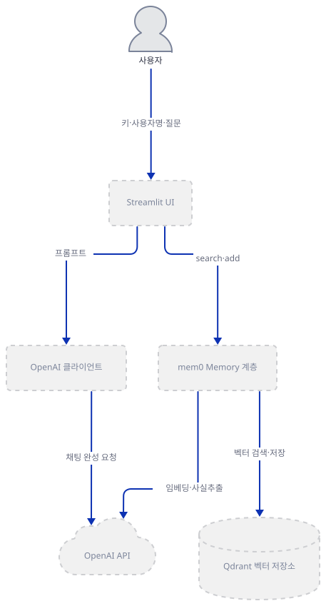
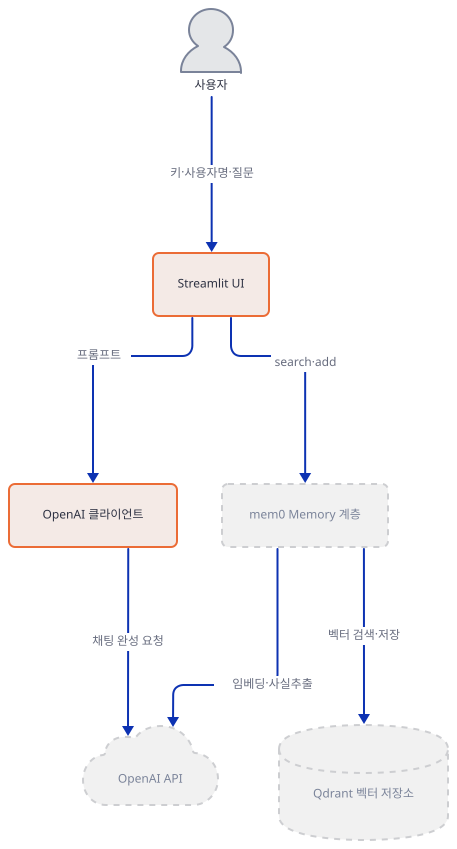
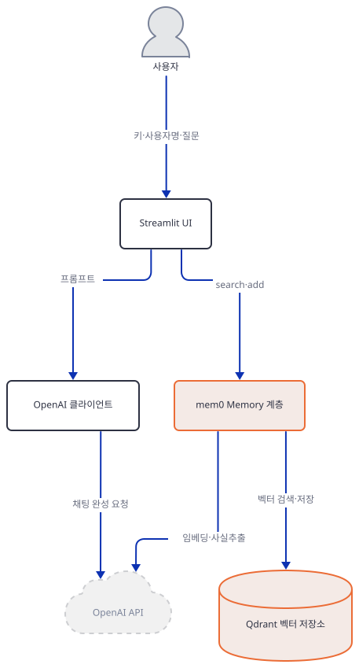
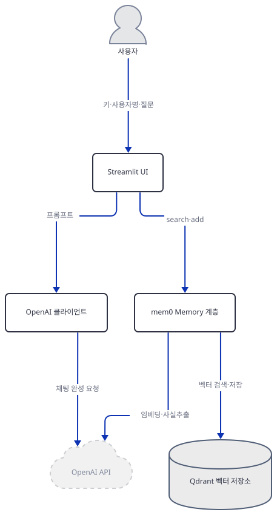
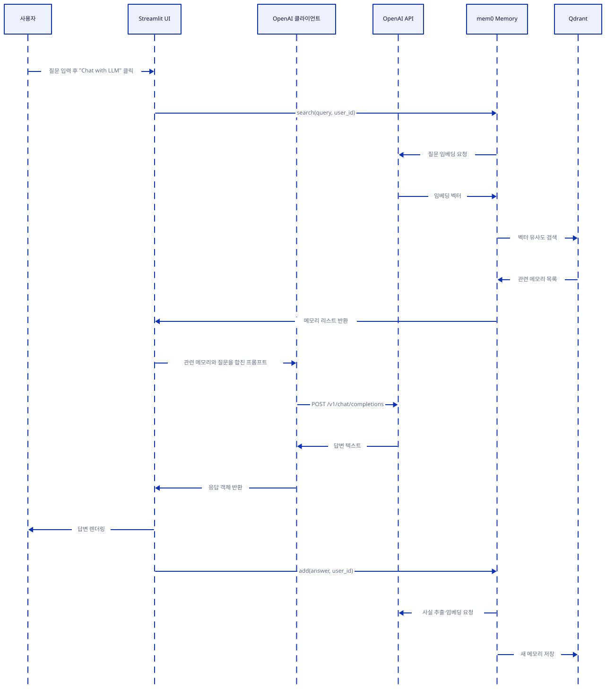

# Day 073 · 📝 LLM App with Personalized Memory

> 볼륨 6 💾 LLM Apps with Memory · 난이도 ★★☆ · 예상 소요 65분 · API 비용 대략 $0.1 이하(이 문서는 대부분 로컬로 재현해 실제 호출은 거의 없음) · 원본 앱: `advanced_llm_apps/llm_apps_with_memory_tutorials/llm_app_personalized_memory`

## 오늘 만들 것

Day 071의 `llama3_stateful_chat`은 세션 하나 안에서만 사는 파이썬 리스트로 "기억"을 흉내 냈습니다. 오늘 앱(`llm_app_memory.py`, 75줄)은 그다음 단계로, **mem0**라는 메모리 프레임워크와 **Qdrant** 벡터 저장소를 붙여 브라우저를 닫고 다시 열어도, 심지어 다른 세션에서도 남는 "개인화된 기억"을 만듭니다. 사용자가 화면에 자기 이름(`user_id`)과 질문을 입력하면, 앱은 그 사용자의 과거 메모리를 벡터 검색으로 찾아 GPT-4o의 프롬프트에 끼워 넣고, 답변을 다시 메모리에 저장합니다 — 같은 사람이 다음에 관련된 질문을 하면 이전 대화의 맥락이 자동으로 딸려 옵니다. 코드 자체는 짧지만(mem0 설정 13줄, 검색·응답·저장 20여 줄, 사이드바 10줄) `mem0ai`라는 프레임워크 하나가 임베딩·사실 추출·벡터 검색·컬렉션 관리를 전부 대신 해 주기 때문입니다.

이 문서를 쓰며 오늘(2026-09-28) `uv pip install -r requirements.txt`로 설치했을 때 **streamlit 1.64.0**, **openai 1.109.1**, **mem0ai 0.1.29**가 그대로 받아졌고 파일도 문제없이 컴파일됩니다(직접 확인, Step 1). 하지만 `requirements.txt`가 버전을 고정한 것은 `mem0ai`뿐이고, mem0ai가 느슨하게 허용하는 범위(`qdrant-client>=1.9.1,<2.0.0`) 안에서 오늘 설치되는 최신판(1.19.1)에는 mem0 0.1.29가 부르는 `QdrantClient.search()`가 없습니다 — `query_points()`로 이름이 바뀌었습니다(직접 확인, Step 5). 그 결과 Qdrant를 Docker로 제대로 띄우고 진짜 OpenAI 키를 넣어도, "Chat with LLM"을 누르는 순간 앱은 `AttributeError`로 죽습니다. 우회해서 검색까지 성공시켜도 코드가 읽는 키(`text`)는 mem0가 실제로 돌려주는 키(`memory`)와 달라 `KeyError`가 나고, 사이드바의 "View My Memory"는 mem0의 기본 반환 형식이 리스트라는 것과 앱의 dict 가정이 어긋나 메모리가 있어도 항상 "기록 없음"만 보여줍니다(모두 직접 재현, Step 5·7). 여기에 더해 `import mem0` 한 줄만으로 홈 디렉터리에 `.mem0/` 폴더가 생기는 부작용도 있습니다(직접 확인, Step 1). 완성 화면은 제목·API 키 입력창·사용자명/질문 입력창·"Chat with LLM" 버튼과, 사이드바의 "View My Memory" 버튼으로 이루어진 단순한 페이지입니다. 아래는 완성된 아키텍처입니다.


## 사전 준비

| 서비스/도구 | 용도 | 발급·설치 |
|---|---|---|
| OpenAI API 키 | 화면에서 입력한 키 하나를 앱의 `gpt-4o` 채팅과 mem0 내부의 `gpt-4o-mini`(사실 추출)·`text-embedding-3-small`(임베딩)이 함께 씀 | https://platform.openai.com/api-keys 에서 발급, 화면의 "Enter OpenAI API Key" 입력창에 붙여넣기 |
| Qdrant | mem0가 사용자별로 뽑아낸 "메모리"를 저장하는 벡터 저장소, `localhost:6333`에 떠 있어야 함(원본 앱 README) | Docker로 `docker run -p 6333:6333 -p 6334:6334 qdrant/qdrant` — 이 문서는 Docker를 띄우지 않고 `qdrant-client`의 `:memory:` 모드로 벡터 저장소 계층만 재현 |
| MEM0_DIR·MEM0_TELEMETRY 환경변수 (선택) | `import mem0`가 홈 디렉터리에 `.mem0/`를 만들고 PostHog로 익명 통계를 보내는 것을 막고 싶을 때 | Step 1에서 함께 설명 |
| uv | 가상환경 생성과 패키지 설치 | [공통 사전 준비](../README.md#공통-사전-준비-한-번만) 참고 |

## 아키텍처 한눈에 보기

| 컴포넌트 | 역할 | 코드 위치 |
|---|---|---|
| 사용자 (브라우저) | API 키·사용자명·질문 입력, 답변·사이드바 확인 | 코드 없음 (외부 UI) |
| Streamlit UI | 제목·입력창·버튼·사이드바 렌더링 | `advanced_llm_apps/llm_apps_with_memory_tutorials/llm_app_personalized_memory/llm_app_memory.py:6-10`, `advanced_llm_apps/llm_apps_with_memory_tutorials/llm_app_personalized_memory/llm_app_memory.py:30-34`, `advanced_llm_apps/llm_apps_with_memory_tutorials/llm_app_personalized_memory/llm_app_memory.py:65-67` |
| OpenAI 클라이언트 | `gpt-4o`로 채팅 완성 요청 | `advanced_llm_apps/llm_apps_with_memory_tutorials/llm_app_personalized_memory/llm_app_memory.py:14`, `advanced_llm_apps/llm_apps_with_memory_tutorials/llm_app_personalized_memory/llm_app_memory.py:47-53` |
| mem0 Memory 계층 | 대화에서 사실을 뽑아 임베딩하고 사용자별로 검색·저장하는 오케스트레이션(mem0ai 0.1.29, 패키지 소스로 확인) | `advanced_llm_apps/llm_apps_with_memory_tutorials/llm_app_personalized_memory/llm_app_memory.py:17-28`, `advanced_llm_apps/llm_apps_with_memory_tutorials/llm_app_personalized_memory/llm_app_memory.py:36`, `advanced_llm_apps/llm_apps_with_memory_tutorials/llm_app_personalized_memory/llm_app_memory.py:62`, `advanced_llm_apps/llm_apps_with_memory_tutorials/llm_app_personalized_memory/llm_app_memory.py:68` |
| OpenAI API (외부) | `gpt-4o` 채팅 완성 + mem0 내부 `gpt-4o-mini` 사실 추출 + `text-embedding-3-small` 임베딩 | 코드 없음 (외부 서비스) |
| Qdrant 벡터 저장소 (외부, Docker) | 사용자별 메모리 벡터를 `llm_app_memory` 컬렉션에 저장 | 코드 없음 (외부 프로세스, `localhost:6333`) |

## 단계별 진행

### Step 1. 환경 만들기 — mem0ai가 끌고 오는 것 확인

**목적.** 격리된 가상환경에 `streamlit`·`openai`·`mem0ai`를 설치하고, 파일이 그대로 컴파일되는지, `mem0ai==0.1.29`가 오늘 기준으로 어떤 `qdrant-client`를 끌고 오는지 확인합니다.

**할 일.**

```bash
cd advanced_llm_apps/llm_apps_with_memory_tutorials/llm_app_personalized_memory
uv venv
uv pip install -r requirements.txt
```

(pip 대안: `python -m venv .venv && source .venv/bin/activate && pip install -r requirements.txt`. Windows PowerShell은 활성화만 `.venv\Scripts\Activate.ps1`로 바꿉니다.) 이 저장소는 루트에 `pyproject.toml`이 있어 `uv run`이 방금 만든 환경 대신 루트 `.venv`를 쓰므로, 이후 `uv run` 명령에는 모두 `--no-project`를 붙입니다.

`advanced_llm_apps/llm_apps_with_memory_tutorials/llm_app_personalized_memory/requirements.txt:1-3`

```text
streamlit 
openai
mem0ai==0.1.29
```

(3줄이지만 마지막 줄에 개행이 없어 `wc -l`은 2로 셉니다. 1행 끝에는 공백이 하나 더 있습니다.) 세 줄 중 버전이 고정된 것은 `mem0ai`뿐입니다.

**그림.**



**확인.**

```bash
uv run --no-project python -m py_compile llm_app_memory.py && echo compiled
uv run --no-project python -c "
import streamlit, openai, mem0
import importlib.metadata as m
print('streamlit', streamlit.__version__)
print('openai', openai.__version__)
print('mem0ai', m.version('mem0ai'))
print('qdrant-client', m.version('qdrant-client'))
"
```

직접 확인한 출력(2026-09-28 기준, 버전을 고정하지 않은 패키지들은 오늘 기준 최신):

```
compiled
streamlit 1.64.0
openai 1.109.1
mem0ai 0.1.29
qdrant-client 1.19.1
```

`mem0ai==0.1.29`는 `qdrant-client`를 `>=1.9.1,<2.0.0`로만 느슨하게 요구합니다(mem0ai 배포 메타데이터로 확인) — 그래서 오늘 설치하면 이 범위의 최신인 1.19.1이 들어옵니다. Step 5에서 이 버전 차이가 실제로 문제를 일으킵니다.

방금 실행한 `import mem0` 한 줄에는 그 자체로 부작용이 있습니다 — mem0가 모듈을 불러오는 시점에 홈 디렉터리 아래 `.mem0/`를 무조건 만듭니다.

```bash
uv run --no-project python -c "import mem0"
ls ~/.mem0
```

직접 확인한 출력(처음 그대로 실행한 결과 — 확인 뒤 바로 지웠습니다):

```
config.json
```

`mem0/memory/setup.py`(패키지 소스로 확인, mem0ai 0.1.29)가 모듈을 불러오는 시점에 `os.path.expanduser("~")` 아래 `os.makedirs(..., exist_ok=True)`를 조건 없이 실행하고, 비어 있으면 익명 UUID가 담긴 `config.json`을 만듭니다. 이어서 `Memory` 객체를 실제로 쓰면 같은 폴더에 대화 이력(`history.db`)도 쌓입니다. 이 위치를 옮기려면 `import mem0`보다 먼저 `MEM0_DIR` 환경변수를 지정합니다 — 이 문서의 나머지 확인 명령은 모두 이렇게 실행했습니다.

```bash
MEM0_DIR="$(pwd)/.mem0_local" uv run --no-project python -c "..."
```

```powershell
$env:MEM0_DIR = "$PWD\.mem0_local"
uv run --no-project python -c "..."
```

mem0는 모듈을 불러오는 순간 PostHog(`https://us.i.posthog.com`)로 보내는 익명 사용 통계 클라이언트도 만들고, `search`·`add`·`get_all`을 부를 때마다 OS·Python 버전과 컬렉션 이름 같은 메타데이터(대화 내용은 아님)를 전송합니다(`mem0/memory/telemetry.py` 소스로 확인). 끄려면 같은 방식으로 `MEM0_TELEMETRY=False`를 지정합니다.

### Step 2. Streamlit 뼈대와 OpenAI 키 입력

**목적.** 제목·캡션이 무엇을 보여주는지, 그리고 화면에서 입력받은 키 하나가 어떻게 환경변수와 `OpenAI` 클라이언트 양쪽에 흘러 들어가는지 확인합니다.

**할 일.**

`advanced_llm_apps/llm_apps_with_memory_tutorials/llm_app_personalized_memory/llm_app_memory.py:1-14`

```python
import os
import streamlit as st
from mem0 import Memory
from openai import OpenAI

st.title("LLM App with Memory 🧠")
st.caption("LLM App with personalized memory layer that remembers ever user's choice and interests")

openai_api_key = st.text_input("Enter OpenAI API Key", type="password")
os.environ["OPENAI_API_KEY"] = openai_api_key

if openai_api_key:
    # Initialize OpenAI client
    client = OpenAI(api_key=openai_api_key)
```

10행의 `os.environ["OPENAI_API_KEY"] = openai_api_key`는 `if` 문 밖에 있어 키를 입력하지 않은 첫 실행에도 조건 없이 실행됩니다(빈 문자열이 들어갈 뿐입니다). 키를 입력해 12행의 게이트를 통과하면, 이 환경변수는 14행의 `OpenAI` 클라이언트뿐 아니라 — Step 3에서 보듯 — mem0가 내부적으로 만드는 별도의 OpenAI 클라이언트에도 그대로 읽힙니다. 화면 캡션(7행)의 "remembers ever user's choice"는 "every"의 오타로 보입니다(소스로 확인, 리포 코드는 고치지 않습니다).

**그림.**



**확인.** 클라이언트 생성 자체는 네트워크 요청이 아니므로 아무 문자열이나 키로 넣어도 예외 없이 성공합니다.

```bash
uv run --no-project python -c "
from openai import OpenAI
client = OpenAI(api_key='sk-test')
print('client OK, base_url:', client.base_url)
"
```

직접 확인한 출력:

```
client OK, base_url: https://api.openai.com/v1/
```

### Step 3. mem0 설정 — Qdrant를 벡터 저장소로 연결

**목적.** `Memory.from_config(...)`에 넘기는 config가 정확히 무엇을 정하는지, 그리고 키나 Qdrant가 없을 때 어디서 어떻게 실패하는지 확인합니다.

**할 일.**

`advanced_llm_apps/llm_apps_with_memory_tutorials/llm_app_personalized_memory/llm_app_memory.py:16-28`

```python
    # Initialize Mem0 with Qdrant
    config = {
        "vector_store": {
            "provider": "qdrant",
            "config": {
                "collection_name": "llm_app_memory",
                "host": "localhost",
                "port": 6333,
            }
        },
    }

    memory = Memory.from_config(config)
```

이 config는 벡터 저장소만 지정합니다 — `llm`이나 `embedder` 키가 없으므로 mem0는 둘 다 기본값인 OpenAI(`gpt-4o-mini`, `text-embedding-3-small`)를 쓰고, 그 클라이언트들은 Step 2에서 본 같은 `OPENAI_API_KEY` 환경변수를 읽습니다(패키지 소스 `mem0/llms/openai.py`·`mem0/embeddings/openai.py`로 확인). `version` 키도 없어 기본값 `"v1.0"`으로 동작하는데, 이는 Step 5·7에서 실제 문제로 이어집니다.

**그림.**



**확인.** 두 가지를 직접 재현했습니다 — 아무도 듣지 않는 로컬 프록시(`127.0.0.1:9`)로 외부 네트워크를 막았습니다.

먼저, OpenAI 키를 아예 지정하지 않으면 벡터 저장소를 Qdrant로 골라도 mem0 자신이 즉시 실패합니다.

```bash
MEM0_DIR="$(pwd)/.mem0_local_a" HTTP_PROXY=http://127.0.0.1:9 HTTPS_PROXY=http://127.0.0.1:9 \
  uv run --no-project python -c "
from mem0 import Memory
config = {'vector_store': {'provider': 'qdrant', 'config': {'collection_name': 'llm_app_memory', 'host': 'localhost', 'port': 6333}}}
memory = Memory.from_config(config)
"
```

직접 확인한 출력(발췌):

```
openai.OpenAIError: The api_key client option must be set either by passing api_key to the client or by setting the OPENAI_API_KEY environment variable
```

키를 (형식만 맞으면 아무 값이나) 지정하면 이 에러는 사라지고, 대신 Qdrant 연결 시도로 넘어갑니다. Qdrant를 띄우지 않은 채로는:

```bash
MEM0_DIR="$(pwd)/.mem0_local_b" OPENAI_API_KEY=sk-anything HTTP_PROXY=http://127.0.0.1:9 HTTPS_PROXY=http://127.0.0.1:9 \
  uv run --no-project python -c "
from mem0 import Memory
config = {'vector_store': {'provider': 'qdrant', 'config': {'collection_name': 'llm_app_memory', 'host': 'localhost', 'port': 6333}}}
memory = Memory.from_config(config)
"
```

직접 확인한 출력:

```
qdrant_client.http.exceptions.ResponseHandlingException: [WinError 10061] 대상 컴퓨터에서 연결을 거부했으므로 연결하지 못했습니다
```

`Memory.from_config`는 생성 시점에 `get_collections()`로 컬렉션 목록부터 확인하므로(패키지 소스 `mem0/vector_stores/qdrant.py`), Qdrant가 `localhost:6333`에 떠 있지 않으면 임베딩이나 채팅 요청 전에 이 단계에서 멈춥니다.

### Step 4. 사용자명과 질문 입력창

**목적.** 사용자를 구분하는 `user_id`와 실제 질문(`prompt`)이 어디서 들어오는지 확인합니다.

**할 일.**

`advanced_llm_apps/llm_apps_with_memory_tutorials/llm_app_personalized_memory/llm_app_memory.py:30-32`

```python
    user_id = st.text_input("Enter your Username")

    prompt = st.text_input("Ask ChatGPT")
```

`user_id`는 로그인이나 세션 식별이 아니라 이 텍스트 입력창에 사용자가 직접 타이핑하는 문자열입니다 — 같은 이름을 입력하면 다른 브라우저·다른 사람도 같은 메모리에 접근합니다(소스로 확인, 별도의 인증은 없습니다).

**그림.**



**확인.** 두 위젯이 파일에 정확히 이 줄에 있는지 확인합니다.

```bash
grep -n "st.text_input" llm_app_memory.py
```

직접 확인한 출력:

```
9:openai_api_key = st.text_input("Enter OpenAI API Key", type="password")
30:    user_id = st.text_input("Enter your Username")
32:    prompt = st.text_input("Ask ChatGPT")
```

### Step 5. 검색 → 컨텍스트 구성 → GPT-4o 호출

**목적.** "Chat with LLM"을 누르면 정확히 무슨 일이 일어나는지, 그리고 오늘 기준 설치에서 이 흐름이 어디서 멈추는지 확인합니다.

**할 일.**

`advanced_llm_apps/llm_apps_with_memory_tutorials/llm_app_personalized_memory/llm_app_memory.py:34-59`

```python
    if st.button('Chat with LLM'):
        with st.spinner('Searching...'):
            relevant_memories = memory.search(query=prompt, user_id=user_id)
            # Prepare context with relevant memories
            context = "Relevant past information:\n"

            for mem in relevant_memories:
                context += f"- {mem['text']}\n"
                
            # Prepare the full prompt
            full_prompt = f"{context}\nHuman: {prompt}\nAI:"

            # Get response from GPT-4
            response = client.chat.completions.create(
                model="gpt-4o",
                messages=[
                    {"role": "system", "content": "You are a helpful assistant with access to past conversations."},
                    {"role": "user", "content": full_prompt}
                ]
            )

            if not response.choices or response.choices[0].message.content is None:
                raise ValueError("Received empty or null response from OpenAI API")
            answer = response.choices[0].message.content

            st.write("Answer: ", answer)
```

버튼을 누르면 GPT를 부르기도 전에 36행에서 `memory.search(...)`부터 호출합니다. 이 한 줄이 오늘 설치 기준으로 무조건 실패합니다. mem0 0.1.29의 벡터 저장소 래퍼는 `self.client.search(...)`를 부르는데(패키지 소스 `mem0/vector_stores/qdrant.py`), Step 1에서 확인한 `qdrant-client 1.19.1`에는 이 메서드가 없습니다 — `query_points`로 이름이 바뀌었습니다.

**그림.**


**확인.** Qdrant를 직접 띄우지 않고도 이 문제는 `qdrant-client` 하나만으로 재현됩니다 — Qdrant 서버가 있고 없고와 무관한, 순수한 버전 문제이기 때문입니다.

```bash
uv run --no-project python -c "
import qdrant_client
c = qdrant_client.QdrantClient(location=':memory:')
print('has search:', hasattr(c, 'search'))
print('has query_points:', hasattr(c, 'query_points'))
"
```

직접 확인한 출력:

```
has search: False
has query_points: True
```

즉 Qdrant를 정상적으로 Docker로 띄우고 진짜 OpenAI 키를 넣어도, 이 코드는 "Chat with LLM"을 누르는 순간 `AttributeError: 'QdrantClient' object has no attribute 'search'`로 죽습니다 — 메모리가 하나도 없는 첫 대화여도 마찬가지입니다(`_search_vector_store`가 컬렉션이 비어 있어도 무조건 `.search()`를 부르기 때문에, 패키지 소스로 확인). 41행의 `mem['text']`도 별도 문제입니다 — mem0 0.1.29가 반환하는 항목의 키는 `text`가 아니라 `memory`입니다. 이 문제는 사실 `.search()`가 살아있던 시절의 `qdrant-client`(mem0ai가 선언한 하한인 1.9.1 등)로 내려야 눈에 보이는데, 그렇게 재현한 결과는 "문제 해결"에 정리했습니다.

### Step 6. 응답을 다시 메모리에 저장

**목적.** `memory.add(...)`가 무엇을 하도록 설계됐는지 확인합니다.

**할 일.**

`advanced_llm_apps/llm_apps_with_memory_tutorials/llm_app_personalized_memory/llm_app_memory.py:61-62`

```python
            # Add AI response to memory
            memory.add(answer, user_id=user_id)
```

실행 중에는 Step 5의 크래시 때문에 이 줄에 도달하지 못합니다. 소스로 보면(`mem0/memory/main.py`), `add()`는 `gpt-4o-mini`에게 방금 텍스트에서 "사실"을 JSON으로 뽑아내라고 시킨 뒤, 새로 뽑은 사실마다 기존에 비슷한 메모리가 있는지 `vector_store.search(...)`로 다시 확인합니다 — 즉 `add()`도 사실은 Step 5와 같은 깨진 `.search()` 호출을 내부에서 한 번 더 거칩니다. 비슷한 메모리가 없으면 임베딩과 함께 새 포인트로 Qdrant에 저장합니다.

**그림.**


**확인.** 파일에 이 줄이 그대로 있는지 확인합니다.

```bash
sed -n '61,62p' llm_app_memory.py
```

직접 확인한 출력:

```
            # Add AI response to memory
            memory.add(answer, user_id=user_id)
```

### Step 7. 사이드바 — 전체 메모리 보기

**목적.** `get_all()`의 반환 형태가 앱이 기대하는 것과 맞는지 확인합니다.

**할 일.**

`advanced_llm_apps/llm_apps_with_memory_tutorials/llm_app_personalized_memory/llm_app_memory.py:65-75`

```python
    # Sidebar option to show memory
    st.sidebar.title("Memory Info")
    if st.button("View My Memory"):
            memories = memory.get_all(user_id=user_id)
            if memories and "results" in memories:
                st.write(f"Memory history for **{user_id}**:")
                for mem in memories["results"]:
                    if "memory" in mem:
                        st.write(f"- {mem['memory']}")
            else:
                st.sidebar.info("No learning history found for this user ID.")
```

69행은 `get_all()`이 `{"results": [...]}` 형태의 dict를 돌려준다고 가정합니다. 이는 mem0의 `api_version="v1.1"`일 때만 맞습니다 — Step 3에서 본 대로 이 앱의 config는 `version`을 지정하지 않아 기본값 `"v1.0"`으로 동작하고, 이 모드의 `get_all()`은 리스트를 그대로 돌려주면서 `DeprecationWarning`을 띄웁니다(패키지 소스 `mem0/memory/main.py`로 확인). 파이썬에서 `"results" in [...]`는 리스트의 **원소** 중에 문자열 `"results"`가 있는지를 묻는 것이라 항상 거짓이 되고, 그러면 70~73행은 절대 실행되지 않습니다 — 메모리가 실제로 쌓여 있어도 사이드바는 항상 "No learning history found"만 보여줍니다. `get_all()`은 내부에서 `vector_store.list()`(`.scroll()`을 씀)를 부르므로 Step 5의 `AttributeError`는 겪지 않습니다 — 이 버튼만 따로 눌러 보면 죽지 않고 조용히 틀린 답을 보여준다는 뜻입니다.

**그림.**


**확인.** `:memory:` 모드의 Qdrant와 로컬 임베딩 스텁으로 벡터 저장소에 메모리 하나를 직접 넣고, 실제 `get_all()`의 반환 형태를 봤습니다(Qdrant Docker나 진짜 OpenAI 키 없이 재현했고, 로컬 스텁 서버는 임의의 높은 포트 61870을 썼습니다).

직접 확인한 출력(발췌):

```
type(all_mem): list
"results" in all_mem: False
```

## 요청 한 건이 흐르는 과정



사용자가 질문을 입력하고 "Chat with LLM"을 누르면, Streamlit UI는 가장 먼저 mem0 Memory 계층에 `search(query, user_id)`를 넘깁니다. mem0는 질문을 OpenAI API로 임베딩으로 바꿔 받은 뒤, 그 벡터로 Qdrant에서 같은 `user_id`의 메모리만 걸러 유사도 검색을 하고, 결과 목록을 UI에 돌려줍니다. UI는 이 목록으로 컨텍스트 문자열을 만들어 OpenAI 클라이언트에 넘기고, 클라이언트는 `POST /v1/chat/completions`로 `gpt-4o`의 답변을 받아 화면에 렌더링합니다. 그 직후 UI는 같은 답변을 `add(answer, user_id)`로 다시 mem0에 넘기고, mem0는 OpenAI API로 사실을 추출·임베딩한 뒤 새 메모리를 Qdrant에 저장합니다 — 그래야 다음 질문의 검색 단계에서 이번 대화가 걸러집니다. Step 5·6에서 직접 확인했듯, 오늘 기준 설치에서는 이 그림의 첫 화살표(`search`)에서 이미 `AttributeError`로 멈추므로 실제로는 이 왕복 전체가 완주되지 않습니다 — 그림은 코드가 원래 의도한 구조를 보여줍니다.

## 실행 체크리스트

- [ ] `uv venv && uv pip install -r requirements.txt`만으로 `streamlit`·`openai`·`mem0ai` 임포트가 성공하고, 파일이 그대로 컴파일된다는 것을 확인했다
- [ ] `import mem0`만 해도 홈 디렉터리에 `.mem0/`가 생긴다는 것과, `MEM0_DIR`로 이를 돌릴 수 있다는 것을 직접 확인했다
- [ ] `Memory.from_config`가 벡터 저장소를 Qdrant로 골라도 OpenAI 키가 없으면 즉시 실패하고, 키가 있어도 Qdrant가 없으면 연결 단계에서 실패한다는 것을 직접 확인했다
- [ ] 오늘 설치되는 `qdrant-client`(mem0ai가 느슨하게 허용하는 범위의 최신판)에 `.search()`가 없어서, `memory.search(...)`가 Qdrant를 제대로 띄워도 `AttributeError`로 죽는다는 것을 직접 확인했다
- [ ] `get_all()`이 기본 `api_version`("v1.0")에서는 dict가 아니라 리스트를 돌려줘서, 사이드바의 `"results" in memories` 검사가 항상 거짓이 된다는 것을 소스와 직접 재현으로 확인했다
- [ ] 한 사용자의 메모리가 다른 브라우저에서도 같은 `user_id` 문자열만 입력하면 그대로 보인다는 것을 이해했다

## 문제 해결

| 증상 | 원인 | 해결 |
|---|---|---|
| "Chat with LLM" 클릭 시 `AttributeError: 'QdrantClient' object has no attribute 'search'`로 앱이 죽음 | `requirements.txt`가 `mem0ai==0.1.29`만 버전을 고정하고 `qdrant-client`는 지정하지 않아, mem0ai가 선언한 범위(`>=1.9.1,<2.0.0`) 안에서 오늘 기준 최신인 1.19.1이 설치됨 — 이 버전은 `.search()`를 제거하고 `.query_points()`로 옮겼는데 mem0ai 0.1.29의 벡터 저장소 코드는 여전히 옛 이름을 부름(직접 확인) | 리포 코드는 고치지 않음 — 재현하려면 `uv pip install "qdrant-client==1.9.1"`(mem0ai가 선언한 하한, `.search()`가 남아 있음)로 내려 설치 |
| "View My Memory"를 눌러도 메모리가 있는데 항상 "No learning history found" | `Memory.from_config`에 `version`을 지정하지 않아 기본값 `"v1.0"`으로 동작 — 이 모드의 `get_all()`은 `{"results": [...]}`가 아니라 리스트를 그대로 반환(+ `DeprecationWarning`)하는데, 앱은 `"results" in memories`로 dict를 기대함(직접 확인) | 리포 코드는 고치지 않음 — 더 해보기에서 `version: "v1.1"`을 직접 넣어봄 |
| (위 두 문제를 우회해 검색이 성공해도) `mem['text']`에서 `KeyError: 'text'` | mem0 0.1.29가 반환하는 각 메모리 항목의 키는 `memory`이지 `text`가 아님(직접 확인) | 리포 코드는 고치지 않음 |
| 원본 앱 README의 clone 안내를 그대로 따라가면 `cd`가 실패 | README가 `cd awesome-llm-apps/llm_apps_with_memory_tutorials/llm_app_personalized_memory`라고 안내하지만, 실제 폴더는 한 단계 위에 `advanced_llm_apps/`가 더 있음(소스로 확인) | `cd advanced_llm_apps/llm_apps_with_memory_tutorials/llm_app_personalized_memory`로 이동 |

## 더 해보기

- `uv pip install "qdrant-client==1.9.1"`로 내려서 실제 Qdrant를 Docker로 띄우고, `advanced_llm_apps/llm_apps_with_memory_tutorials/llm_app_personalized_memory/llm_app_memory.py:41`의 `mem['text']`를 `mem['memory']`로 고쳐 실제 대화가 쌓이는지 확인해보기
- `Memory.from_config`의 config dict에 `"version": "v1.1"`을 추가해 `get_all()`/`search()`의 반환 형태가 어떻게 바뀌는지 확인하고, `advanced_llm_apps/llm_apps_with_memory_tutorials/llm_app_personalized_memory/llm_app_memory.py:67-75`의 사이드바 코드를 그에 맞게 고쳐보기
- `MEM0_TELEMETRY=False`와 `MEM0_DIR=./.mem0_local` 환경변수를 설정해, 홈 디렉터리를 건드리지 않고 PostHog 전송도 끈 채로 앱을 띄워보기

## 다음 날 예고

[Day 074 · 🧠 Multi-LLM Application with Shared Memory](../day074-multi-llm-memory/README.md) — 오늘의 mem0·Qdrant 메모리 계층은 그대로 두고, 그 위에 GPT-4o와 Claude 3.5 Sonnet 두 LLM이 같은 메모리를 공유하며 답하는 앱을 다룹니다.
