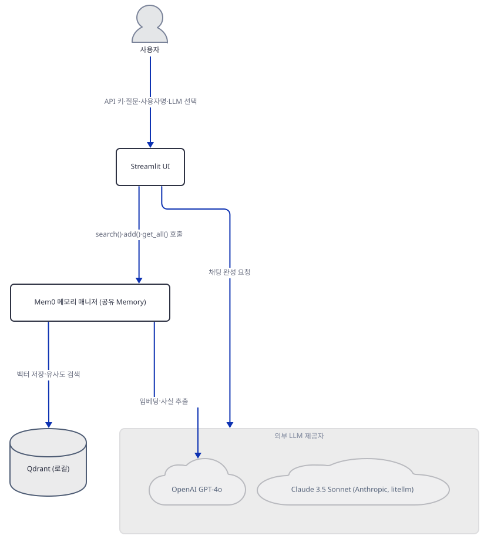
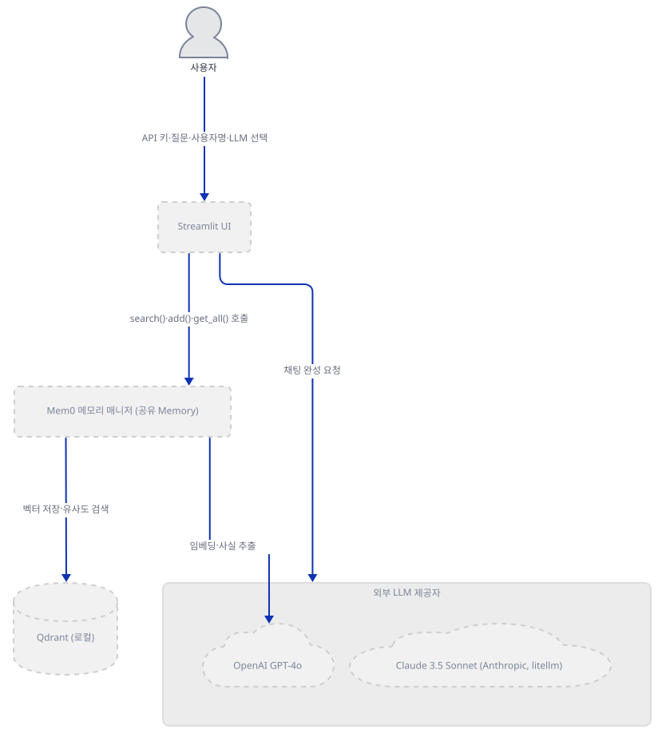
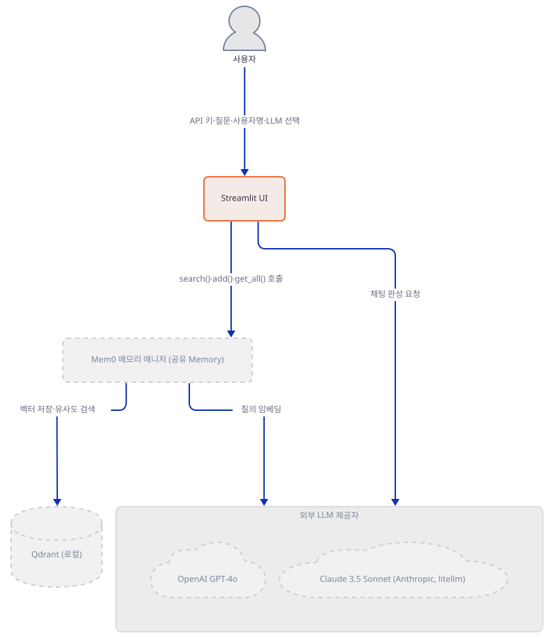
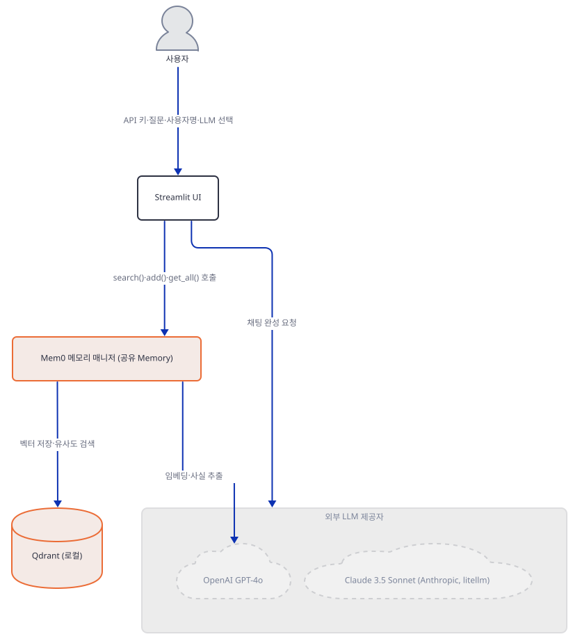
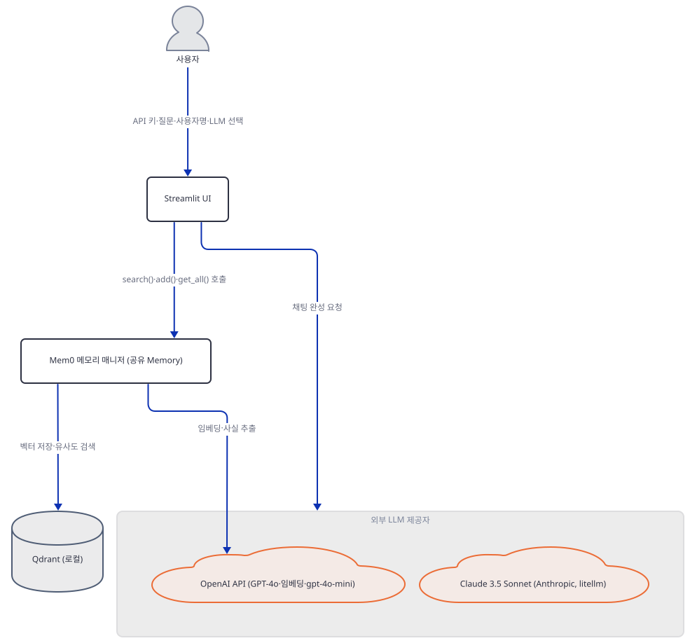
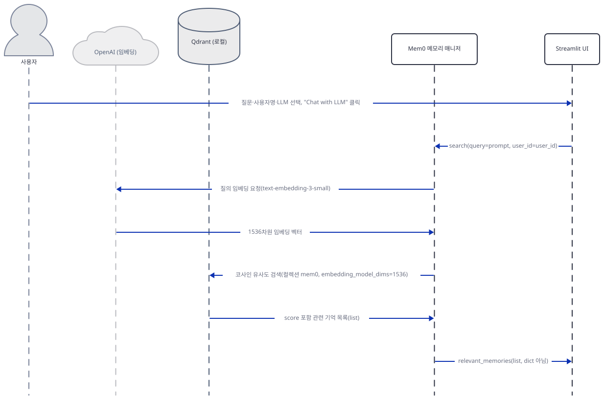
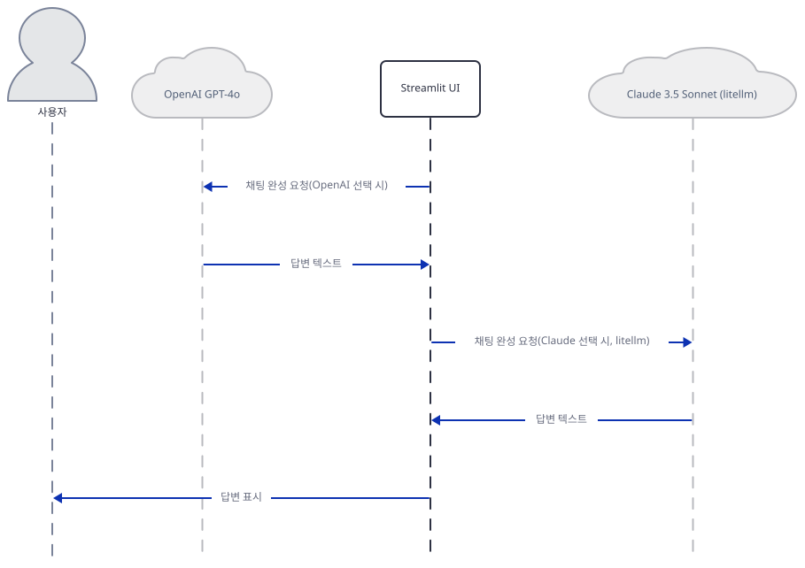
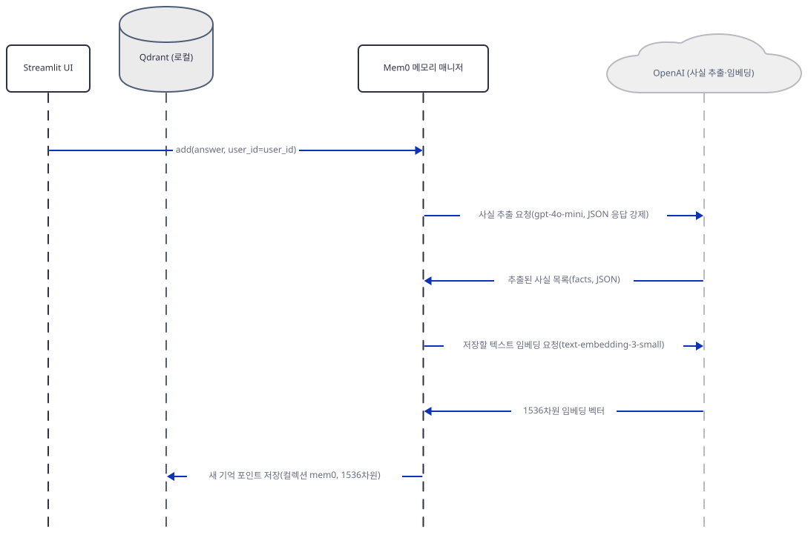

# Day 074 · 🧠 Multi-LLM Application with Shared Memory

> 볼륨 6 💾 LLM Apps with Memory · 난이도 ★★☆ · 예상 소요 100분(세 겹의 크래시(env var·Qdrant 연결·qdrant-client 버전)와 리스트/딕셔너리 버그를 8단계에 걸쳐 직접 재현하고, 실제 앱 기동과 `add()` 내부의 유사 기억 검색까지 포함한 3단계 시퀀스 그림을 확인합니다) · API 비용 대략 $0.1 이하(OpenAI GPT-4o·Anthropic Claude 3.5 Sonnet API, 실제 키로 실행할 때) · 원본 앱: `advanced_llm_apps/llm_apps_with_memory_tutorials/multi_llm_memory`

## 오늘 만들 것

이 앱은 OpenAI GPT-4o와 Anthropic Claude 3.5 Sonnet(litellm 경유) 두 모델을 사이드바 라디오로 오가면서, Mem0+Qdrant로 만든 사용자별 기억 하나를 두 모델이 함께 읽고 쓰게 만드는 94줄(마지막 줄에 개행이 없어 `wc -l`은 93으로 세지만 편집기·GitHub에서는 94번째 줄까지 보입니다, 직접 확인) 단일 파일 Streamlit 앱입니다. `requirements.txt`가 mem0ai를 **0.1.29**로 고정하는 것은 이 볼륨에서 새롭지 않습니다 — Day 073·075와 요구사항·버전 조합이 그대로 같습니다(오늘 설치하면 세 날 모두 streamlit 1.64.0·openai 1.109.1·qdrant-client 1.19.1을 받고, 이 날만 litellm 1.80.0이 추가로 붙습니다, 직접 확인, 2026-09-28 기준). 이 앱은 두 API 키를 입력하는 순간 먼저 멈춥니다 — 10행의 `openai_api_key`는 33행에서 OpenAI 클라이언트에 직접 넘어갈 뿐, 14행의 Anthropic 키와 달리 `os.environ`에 실리지 않습니다. Mem0의 기본 임베더는 이 지역 변수를 볼 수 없고 환경 변수 `OPENAI_API_KEY`만 읽으므로(소스로 확인, mem0ai 0.1.29 `mem0/embeddings/openai.py` 17행, 저장소 밖), `Memory.from_config(config)`는 로컬 Qdrant가 떠 있는지 확인하기도 전에 `openai.OpenAIError`를 던집니다(직접 확인, Step 3) — Day 073은 자기 코드의 10행에서 이 키를 내보내므로 같은 예외를 겪지 않고 곧장 Qdrant 연결 단계로 갑니다. 이 환경 변수를 수동으로 채워도 로컬 Qdrant(`localhost:6333`)가 없으면 `ResponseHandlingException`으로 멈춥니다(직접 확인). **두 문제를 모두 우회해 진짜 Qdrant를 띄워도 "Chat with LLM"은 여전히 죽습니다** — `qdrant-client`를 고정하지 않은 탓에 오늘 풀리는 1.19.1에는 mem0 0.1.29가 부르는 `QdrantClient.search()`가 없고(`query_points()`로 이름이 바뀜), 51행의 `memory.search(...)`가 `AttributeError: 'QdrantClient' object has no attribute 'search'`로 곧바로 죽습니다 — Day 073 Step 5와 같은 원인이며, `add()`도 82행에서 같은 예외로 멈춥니다(직접 확인, Step 5·7). `qdrant-client==1.9.1`로 따로 내려 이 크래시를 우회하면 그다음에야 이 코드의 원래 문제가 드러납니다 — `version`을 지정하지 않은 기본값(`"v1.0"`)에서 `search()`·`get_all()`이 딕셔너리가 아니라 리스트를 돌려주는데 53·88행은 `"results" in ...`로 딕셔너리를 가정해 항상 거짓이 되는 문제로, Day 073 Step 7이 이미 직접 재현해 가르쳤습니다(그대로 가리킵니다). 사이드바에서 "Claude Sonnet 3.5"를 고르면 35-45행이 `client` 변수를 실제로는 다시 쓰이지 않는 두 번째 `Memory` 객체로 덮어씁니다 — 진짜 Claude 응답은 76행의 `completion()` 자유 함수가 따로 만들고, 이 죽은 `client`는 `vector_store`를 지정하지 않아 공유 Qdrant 서버 대신 온디스크 `/tmp/qdrant`로 풀립니다(설정 해석으로 직접 확인, Step 4) — 그것도 조용한 낭비가 아니라, mem0의 Qdrant 래퍼가 `on_disk=False`일 때마다 그 폴더를 `shutil.rmtree`로 지운 뒤 새로 여는 부작용이 있습니다(소스로 확인) — Claude를 고를 때마다 매번입니다. 마지막으로 82행의 `memory.add(answer, user_id=user_id)`는 사용자의 질문이 아니라 **모델의 답변만** 기억에 남깁니다 — 캡션이 내세우는 "각 사용자의 선택과 관심사를 기억한다"는 문구와 달리, 실제로 쌓이는 것은 "AI가 마지막으로 뭐라고 답했는가"입니다. 참고로 `import mem0`만 해도 홈 디렉터리에 `~/.mem0/config.json`을 만듭니다(Day 073 Step 1과 같은 사실, 직접 확인) — 다만 이 import 자체가 posthog로 통계를 **보내지는** 않습니다. 전송은 `Memory()` 생성(`mem0/memory/main.py` 50행의 `capture_event("mem0.init", ...)`)과 `search`/`add`/`get_all` 호출 때 일어납니다(직접 확인, 저장소 밖). `MEM0_DIR`(`mem0/memory/setup.py` 7행)·`MEM0_TELEMETRY`(`mem0/memory/telemetry.py` 11행, 둘 다 저장소 밖)로 각각 끌 수 있습니다. 완성하면 브라우저에는 API 키 입력창 2개, 사이드바의 사용자명·LLM 선택 라디오, 질문 입력창과 "Chat with LLM"·"View My Memory" 두 버튼이 뜹니다. 아래는 완성된 아키텍처입니다.



## 사전 준비

| 서비스/도구 | 용도 | 발급·설치 |
|---|---|---|
| OpenAI API 키 | GPT-4o 채팅 완성(`multi_llm_memory.py:33,61`)과 Mem0 기본 임베더(`text-embedding-3-small`, 소스로 확인) 양쪽에 필요하지만, 이 앱은 후자가 볼 환경 변수를 내보내지 않습니다(Step 3) | https://platform.openai.com 에서 발급 — 이 문서는 키 없이 진행합니다 |
| Anthropic API 키 | litellm을 통한 Claude 3.5 Sonnet 채팅 완성(`multi_llm_memory.py:14,76`) | https://console.anthropic.com 에서 발급 — 이 문서는 키 없이 진행합니다 |
| Qdrant (Docker) | Mem0가 쓰는 로컬 벡터 저장소, `localhost:6333`으로 하드코딩(18-23행) | `docker pull qdrant/qdrant` 후 `docker run -p 6333:6333 -p 6334:6334 -v "$(pwd)/qdrant_storage:/qdrant/storage:z" qdrant/qdrant` — 이 문서는 띄우지 않습니다 |
| uv | 가상환경 생성과 패키지 설치 | [공통 사전 준비](../README.md#공통-사전-준비-한-번만) 절 참고 |

## 아키텍처 한눈에 보기

| 컴포넌트 | 역할 | 코드 위치 |
|---|---|---|
| Streamlit UI | 제목·API 키 2개 입력, 사이드바 사용자명·LLM 선택, 질문 입력과 두 버튼 처리 | `advanced_llm_apps/llm_apps_with_memory_tutorials/multi_llm_memory/multi_llm_memory.py:7-11`, `advanced_llm_apps/llm_apps_with_memory_tutorials/multi_llm_memory/multi_llm_memory.py:29-30`, `advanced_llm_apps/llm_apps_with_memory_tutorials/multi_llm_memory/multi_llm_memory.py:47`, `advanced_llm_apps/llm_apps_with_memory_tutorials/multi_llm_memory/multi_llm_memory.py:49`, `advanced_llm_apps/llm_apps_with_memory_tutorials/multi_llm_memory/multi_llm_memory.py:86` |
| Mem0 공유 메모리 매니저 (Memory) | `search()`로 사용자별 과거 기억 조회, `add()`로 답변 저장, `get_all()`로 전체 나열 — 두 LLM 선택 모두 같은 인스턴스를 공유 | `advanced_llm_apps/llm_apps_with_memory_tutorials/multi_llm_memory/multi_llm_memory.py:27`, `advanced_llm_apps/llm_apps_with_memory_tutorials/multi_llm_memory/multi_llm_memory.py:51`, `advanced_llm_apps/llm_apps_with_memory_tutorials/multi_llm_memory/multi_llm_memory.py:82`, `advanced_llm_apps/llm_apps_with_memory_tutorials/multi_llm_memory/multi_llm_memory.py:87` |
| Qdrant (로컬) | Mem0가 기억 벡터를 저장하는 벡터 저장소, `localhost:6333`으로 하드코딩 | `advanced_llm_apps/llm_apps_with_memory_tutorials/multi_llm_memory/multi_llm_memory.py:18-23` |
| Mem0 기본 임베더 (OpenAI, text-embedding-3-small) | search()/add()가 텍스트를 벡터로 바꿀 때 내부적으로 호출(소스로 확인) — `OPENAI_API_KEY` 환경 변수가 없으면 여기서 즉시 실패 | mem0ai 0.1.29 패키지 내부 `mem0/embeddings/openai.py` 14-19행(저장소 밖) |
| OpenAI GPT-4o | "OpenAI GPT-4o" 선택 시 채팅 완성 모델 | `advanced_llm_apps/llm_apps_with_memory_tutorials/multi_llm_memory/multi_llm_memory.py:33`, `advanced_llm_apps/llm_apps_with_memory_tutorials/multi_llm_memory/multi_llm_memory.py:61-70` |
| Claude 3.5 Sonnet (Anthropic, litellm) | "Claude Sonnet 3.5" 선택 시 litellm을 통한 채팅 완성 | `advanced_llm_apps/llm_apps_with_memory_tutorials/multi_llm_memory/multi_llm_memory.py:71-79` |

## 단계별 진행

### Step 1. 환경 만들기 — mem0ai만 고정된 4줄

**목적.** 격리된 가상환경에 `requirements.txt`를 설치하고, mem0ai를 뺀 나머지가 오늘 실제로 무엇으로 풀리는지 확인합니다.

**할 일.**

```bash
cd advanced_llm_apps/llm_apps_with_memory_tutorials/multi_llm_memory
uv venv
uv pip install -r requirements.txt
```

(pip 대안: `python -m venv .venv && source .venv/bin/activate && pip install -r requirements.txt`.) 이 저장소 루트에는 `pyproject.toml`이 있어 이후 `uv run` 명령에는 모두 `--no-project`를 붙입니다.

`advanced_llm_apps/llm_apps_with_memory_tutorials/multi_llm_memory/requirements.txt:1-4`

```text
streamlit 
openai
mem0ai==0.1.29
litellm
```

4줄 중 `mem0ai==0.1.29`만 버전이 고정되어 있고 나머지 셋은 없습니다. 이 문서를 쓰며 설치했을 때는 **streamlit 1.64.0**, **openai 1.109.1**, **litellm 1.80.0**(패키지 자체는 `__version__` 속성이 없어 `importlib.metadata.version("litellm")`로 따로 확인해야 합니다, 직접 확인), **qdrant-client 1.19.1**이 받아졌습니다(직접 확인, 2026-09-28 기준).



**확인.**

```bash
uv run --no-project python -m py_compile multi_llm_memory.py
MEM0_DIR=/tmp/day074-mem0 MEM0_TELEMETRY=False uv run --no-project python -c "import streamlit, mem0, openai; print(streamlit.__version__, mem0.__version__, openai.__version__)"
```

PowerShell에서는 `VAR=value` 접두 문법이 없으므로 이렇게 씁니다.

```powershell
uv run --no-project python -m py_compile multi_llm_memory.py
$env:MEM0_DIR="C:\temp\day074-mem0"; $env:MEM0_TELEMETRY="False"; uv run --no-project python -c "import streamlit, mem0, openai; print(streamlit.__version__, mem0.__version__, openai.__version__)"
Remove-Item Env:MEM0_DIR, Env:MEM0_TELEMETRY -ErrorAction SilentlyContinue
```

컴파일 오류 없이 끝나고 `1.64.0 0.1.29 1.109.1`이 출력되면(정확한 숫자는 설치 시점에 따라 달라질 수 있습니다) 이 단계가 끝난 것입니다. `MEM0_DIR`을 지정한 이유는 아래에서 바로 설명합니다.

### Step 2. API 키 입력 UI와 게이트 — 그리고 mem0의 숨은 부작용

**목적.** OpenAI·Anthropic 키를 비밀번호 입력창으로 받고, Anthropic 키만 환경 변수로 내보낸 뒤, 두 키가 모두 채워졌을 때만 아래 로직 전체를 실행하게 합니다.

**할 일.**

`advanced_llm_apps/llm_apps_with_memory_tutorials/multi_llm_memory/multi_llm_memory.py:7-14`

```python
st.title("Multi-LLM App with Shared Memory 🧠")
st.caption("LLM App with a personalized memory layer that remembers each user's choices and interests across multiple users and LLMs")

openai_api_key = st.text_input("Enter OpenAI API Key", type="password")
anthropic_api_key = st.text_input("Enter Anthropic API Key", type="password")

if openai_api_key and anthropic_api_key:
    os.environ["ANTHROPIC_API_KEY"] = anthropic_api_key
```

14행은 `anthropic_api_key`만 `os.environ["ANTHROPIC_API_KEY"]`에 싣습니다 — `openai_api_key`를 환경 변수로 내보내는 줄은 이 파일 어디에도 없습니다(grep 확인). 이 비대칭이 Step 3의 첫 크래시로 바로 이어집니다. 한편 `multi_llm_memory.py` 2행의 `from mem0 import Memory`는 이 시점에 이미 실행된 상태입니다 — mem0ai 0.1.29는 `import mem0` 자체가 `mem0/memory/main.py` 23행에서 `setup_config()`를 호출해 홈 디렉터리에 `~/.mem0/config.json`을 만듭니다(소스로 확인, `mem0/memory/setup.py` 11-17행, Day 073 Step 1과 같은 사실). posthog 익명 통계는 이 import만으로는 전송되지 않고, `Memory()` 생성과 `search`/`add`/`get_all` 호출 때 전송됩니다(소스로 확인, `mem0/memory/main.py` 50행). 이 문서의 모든 mem0 관련 명령은 `MEM0_DIR`로 스크래치 경로를 지정하고 `MEM0_TELEMETRY=False`를 걸어 홈 디렉터리를 건드리지 않습니다(소스로 확인, `mem0/memory/setup.py` 7행·`mem0/memory/telemetry.py` 11행).



**확인.** 두 키를 모두 비운 채 Streamlit `AppTest`로 실행합니다.

```bash
MEM0_DIR=/tmp/day074-mem0 MEM0_TELEMETRY=False uv run --no-project python -c "
from streamlit.testing.v1 import AppTest
at = AppTest.from_file('multi_llm_memory.py')
at.run(timeout=40)
print('exception:', list(at.exception))
print('text_input labels:', [w.label for w in at.text_input])
print('sidebar widgets:', len(at.sidebar))
"
```

```powershell
$env:MEM0_DIR="C:\temp\day074-mem0"; $env:MEM0_TELEMETRY="False"; uv run --no-project python -c "
from streamlit.testing.v1 import AppTest
at = AppTest.from_file('multi_llm_memory.py')
at.run(timeout=40)
print('exception:', list(at.exception))
print('text_input labels:', [w.label for w in at.text_input])
print('sidebar widgets:', len(at.sidebar))
"
```

`exception: []`, `text_input labels: ['Enter OpenAI API Key', 'Enter Anthropic API Key']`, `sidebar widgets: 0`이 출력됩니다(직접 확인) — `if openai_api_key and anthropic_api_key:` 아래는 아직 아무 것도 실행되지 않았다는 뜻입니다.

### Step 3. Mem0 + Qdrant 공유 메모리 초기화 — 두 겹의 크래시

**목적.** 두 LLM이 함께 쓸 Qdrant 기반 Mem0 `Memory` 객체를 만들고, 오늘 이 코드가 실제로 어디서 멈추는지 직접 확인합니다.

**할 일.**

`advanced_llm_apps/llm_apps_with_memory_tutorials/multi_llm_memory/multi_llm_memory.py:16-27`

```python
    # Initialize Mem0 with Qdrant
    config = {
        "vector_store": {
            "provider": "qdrant",
            "config": {
                "host": "localhost",
                "port": 6333,
            }
        },
    }

    memory = Memory.from_config(config)
```

이 config는 Day 072의 `ai_arxiv_agent_memory.py`처럼 스키마에 없는 필드를 넣는 실수는 하지 않습니다 — 문제는 필드가 아니라 **키 전달 경로**입니다. `Memory.__init__`은 벡터 저장소보다 임베더를 먼저 만드는데(mem0ai 0.1.29 `mem0/memory/main.py` 33-34행, 저장소 밖), 임베더도 벡터 저장소도 설정이 없으므로 기본값(OpenAI 임베더, Qdrant 벡터 저장소)으로 떨어집니다. OpenAI 임베더는 `self.config.api_key or os.getenv("OPENAI_API_KEY")`로 키를 찾는데(소스로 확인, `mem0/embeddings/openai.py` 17행), Step 2에서 본 대로 이 앱은 `OPENAI_API_KEY`를 한 번도 내보내지 않습니다.



**확인.** 네트워크를 막고(가짜 프록시로 외부 접속을 차단) `OPENAI_API_KEY`를 지운 채 위 config로 `Memory.from_config`를 호출합니다.

```bash
MEM0_DIR=/tmp/day074-mem0 MEM0_TELEMETRY=False \
HTTP_PROXY=http://127.0.0.1:9 HTTPS_PROXY=http://127.0.0.1:9 \
uv run --no-project python -c "
import os
os.environ.pop('OPENAI_API_KEY', None)
from mem0 import Memory
config = {'vector_store': {'provider': 'qdrant', 'config': {'host': 'localhost', 'port': 6333}}}
memory = Memory.from_config(config)
"
```

```text
openai.OpenAIError: The api_key client option must be set either by passing api_key to the client or by setting the OPENAI_API_KEY environment variable
```

PowerShell에서는 다음과 같이 씁니다.

```powershell
$env:MEM0_DIR="C:\temp\day074-mem0"; $env:MEM0_TELEMETRY="False"; $env:HTTP_PROXY="http://127.0.0.1:9"; $env:HTTPS_PROXY="http://127.0.0.1:9"; uv run --no-project python -c "
import os
os.environ.pop('OPENAI_API_KEY', None)
from mem0 import Memory
config = {'vector_store': {'provider': 'qdrant', 'config': {'host': 'localhost', 'port': 6333}}}
memory = Memory.from_config(config)
"
Remove-Item Env:HTTP_PROXY, Env:HTTPS_PROXY, Env:MEM0_DIR, Env:MEM0_TELEMETRY -ErrorAction SilentlyContinue
```

`$env:` 대입은 PowerShell 세션이 끝날 때까지 남습니다 — `HTTP_PROXY`를 지우지 않은 채 이어서 `uv pip install` 같은 명령을 치면 죽은 프록시(`127.0.0.1:9`)로 나가 그 명령이 실패합니다. 위 `Remove-Item` 줄로 이 확인에서 설정한 변수를 즉시 되돌립니다.

이 예외가 27행에서 그대로 발생합니다(직접 확인) — 두 키를 화면에 채워 넣은 순간 항상 재현되는, Qdrant와 무관한 크래시입니다. 이 환경 변수를 임시로 채워 넣고 같은 코드를 다시 돌리면 이번에는 임베더 생성을 통과해 벡터 저장소 생성으로 넘어가고, 로컬 Qdrant가 없어 `qdrant_client.http.exceptions.ResponseHandlingException`(연결 거부)으로 멈춥니다(직접 확인). 이 두 문제를 모두 우회해 진짜 로컬 Qdrant까지 띄워도 이 단계 자체(`Memory.from_config`)는 통과합니다 — 다음 크래시는 Step 5에서, `memory.search()`를 실제로 호출할 때 나옵니다.

### Step 4. LLM 선택 라디오와 죽은 코드

**목적.** 사이드바에서 사용자명과 LLM을 고르고, 두 분기가 만드는 `client`가 실제로 무엇인지 확인합니다.

**할 일.**

`advanced_llm_apps/llm_apps_with_memory_tutorials/multi_llm_memory/multi_llm_memory.py:29-45`

```python
    user_id = st.sidebar.text_input("Enter your Username")
    llm_choice = st.sidebar.radio("Select LLM", ('OpenAI GPT-4o', 'Claude Sonnet 3.5'))

    if llm_choice == 'OpenAI GPT-4o':
        client = OpenAI(api_key=openai_api_key)
    elif llm_choice == 'Claude Sonnet 3.5':
        config = {
            "llm": {
                "provider": "litellm",
                "config": {
                    "model": "claude-3-5-sonnet-20240620",
                    "temperature": 0.5,
                    "max_tokens": 2000,
                }
            }
        }
        client = Memory.from_config(config)
```

OpenAI 분기의 `client`는 33행에서 실제로 61행의 채팅 완성 호출에 쓰입니다. 하지만 Claude 분기의 `client`(45행)는 겉보기엔 비슷해도 전혀 다른 물건입니다 — `Memory.from_config(config)`가 돌려주는 것은 **또 하나의 Mem0 메모리 객체**이고, 진짜 Claude 응답은 이 `client`가 아니라 Step 6에서 볼 76행의 `completion()` 자유 함수가 만듭니다. 즉 45행의 `client`는 만들어지고 나서 두 번 다시 읽히지 않는 죽은 코드입니다. 게다가 이 config에는 `vector_store` 키가 아예 없어서, Mem0가 기본값으로 채우는 경로는 27행의 공유 Qdrant(`localhost:6333`)가 아니라 **온디스크 `/tmp/qdrant`**입니다.



**확인.** 실제로 만들지 않고 설정만 해석해 확인합니다(디스크에 아무 것도 쓰지 않습니다).

```bash
MEM0_DIR=/tmp/day074-mem0 MEM0_TELEMETRY=False uv run --no-project python -c "
from mem0.configs.base import MemoryConfig
cfg = MemoryConfig(**{'llm': {'provider': 'litellm', 'config': {'model': 'claude-3-5-sonnet-20240620', 'temperature': 0.5, 'max_tokens': 2000}}})
print(cfg.vector_store.provider, cfg.vector_store.config.path, cfg.vector_store.config.host)
"
```

PowerShell에서는 다음과 같이 씁니다.

```powershell
$env:MEM0_DIR="C:\temp\day074-mem0"; $env:MEM0_TELEMETRY="False"; uv run --no-project python -c "
from mem0.configs.base import MemoryConfig
cfg = MemoryConfig(**{'llm': {'provider': 'litellm', 'config': {'model': 'claude-3-5-sonnet-20240620', 'temperature': 0.5, 'max_tokens': 2000}}})
print(cfg.vector_store.provider, cfg.vector_store.config.path, cfg.vector_store.config.host)
"
Remove-Item Env:MEM0_DIR, Env:MEM0_TELEMETRY -ErrorAction SilentlyContinue
```

`qdrant /tmp/qdrant None`이 출력됩니다(직접 확인) — `host`는 `None`이라 27행의 공유 서버와는 아예 다른 저장소로 해석된다는 뜻입니다. 이 `client`는 이후 코드에서 다시 읽히지 않지만, 그렇다고 "영향 없음"은 아닙니다 — `on_disk`를 지정하지 않으면 기본값 `False`이고, mem0의 Qdrant 래퍼는 `on_disk=False`일 때 그 경로가 이미 있으면 **`shutil.rmtree`로 통째로 지운 뒤** 새로 엽니다(소스로 확인, `mem0/vector_stores/qdrant.py` 62-64행) — Windows에서는 `C:\tmp\qdrant`이고, "Claude Sonnet 3.5"를 고를 때마다 매번 이 폴더가 지워지고 다시 만들어집니다. 이 분기도 기본 OpenAI 임베더를 만들므로, `OPENAI_API_KEY`가 없으면 27행과 같은 이유로 여기서도 실패합니다.

### Step 5. "Chat with LLM" 버튼 — memory.search()가 즉시 죽는다

**목적.** 사용자의 과거 기억을 검색해 프롬프트에 섞으려 시도합니다. 그리고 오늘 설치 기준으로 이 호출이 정확히 어디서, 왜 멈추는지 확인합니다.

**할 일.**

`advanced_llm_apps/llm_apps_with_memory_tutorials/multi_llm_memory/multi_llm_memory.py:47-58`

```python
    prompt = st.text_input("Ask the LLM")

    if st.button('Chat with LLM'):
        with st.spinner('Searching...'):
            relevant_memories = memory.search(query=prompt, user_id=user_id)
            context = "Relevant past information:\n"
            if relevant_memories and "results" in relevant_memories:
                for mem in relevant_memories["results"]:
                    if "memory" in mem:
                        context += f"- {mem['memory']}\n"
                
            full_prompt = f"{context}\nHuman: {prompt}\nAI:"
```

`memory.search()`의 인자 이름(`query`, `user_id`)은 mem0ai 0.1.29의 시그니처와 정확히 맞습니다(소스로 확인, `mem0/memory/main.py` 379행) — Day 072가 겪은 인자 거부는 없습니다. 문제는 인자가 아니라 **`qdrant-client`의 메서드 이름**입니다. `requirements.txt`가 `qdrant-client`를 고정하지 않아 mem0ai가 느슨하게 허용하는 범위(`>=1.9.1,<2.0.0`) 안에서 오늘 최신인 1.19.1이 설치되는데, 이 버전은 `.search()`를 없애고 `.query_points()`로 옮겼습니다 — mem0ai 0.1.29의 벡터 저장소 코드는 여전히 옛 이름(`self.client.search(...)`)을 부릅니다(소스로 확인, `mem0/vector_stores/qdrant.py` 143행). 그래서 로컬 Qdrant를 정상적으로 띄우고 진짜 OpenAI 키를 넣어도, 51행의 `memory.search(...)`는 `AttributeError: 'QdrantClient' object has no attribute 'search'`로 곧바로 죽습니다 — **Day 073 Step 5와 같은 원인**이며, 메모리가 하나도 없는 첫 대화여도 마찬가지입니다(`_search_vector_store`가 컬렉션이 비어 있어도 무조건 `.search()`를 부르기 때문에, 소스로 확인). `qdrant-client==1.9.1`로 따로 내려 이 크래시를 우회하면 그다음에야 53행이 드러납니다 — `version`을 지정하지 않아 `search()`가 dict가 아니라 list를 돌려주는데(기본값 `"v1.0"`, 소스로 확인 `mem0/memory/main.py` 426-435행) 53행은 `"results" in relevant_memories`로 dict를 가정해 항상 거짓이 되고 과거 기억은 한 번도 섞이지 않습니다 — 이 문제는 Day 073 Step 7이 이미 직접 재현해 가르쳤으므로 그대로 가리킵니다.


**확인.** Qdrant 서버가 있고 없고와 무관한, 순수한 버전 문제이므로 `qdrant-client` 하나만으로 재현됩니다.

```bash
uv run --no-project python -c "
from qdrant_client import QdrantClient
c = QdrantClient(location=':memory:')
print('has search:', hasattr(c, 'search'))
print('has query_points:', hasattr(c, 'query_points'))
"
```

```text
has search: False
has query_points: True
```

이 결과가 그대로 나옵니다(직접 확인) — 로컬 Qdrant를 실제로 띄워도 51행은 이 메서드가 없어서 죽습니다. `qdrant-client==1.9.1`로 내려 이 크래시를 우회했을 때 드러나는 dict 가정 버그는 순수 파이썬으로도 재현됩니다: `relevant_memories`가 리스트일 때 `"results" in relevant_memories`는 "리스트 안에 문자열 `'results'`라는 원소가 있는가"를 묻는 것이 되어 항상 `False`이고, `context`는 `'Relevant past information:\n'`에서 한 글자도 늘지 않습니다(직접 확인 — Day 073 Step 7과 같은 재현입니다, 그대로 가리킵니다).

### Step 6. 두 LLM 분기 호출 — OpenAI 직접 호출과 litellm 경유 Claude

**목적.** 같은 `full_prompt`를 라디오 선택에 따라 서로 다른 두 API로 보내고, 같은 형태의 응답으로 맞춥니다.

**할 일.**

`advanced_llm_apps/llm_apps_with_memory_tutorials/multi_llm_memory/multi_llm_memory.py:60-80`

```python
            if llm_choice == 'OpenAI GPT-4o':
                response = client.chat.completions.create(
                    model="gpt-4o",
                    messages=[
                        {"role": "system", "content": "You are a helpful assistant with access to past conversations."},
                        {"role": "user", "content": full_prompt}
                    ]
                )
                if not response.choices or response.choices[0].message.content is None:
                    raise ValueError("Received empty or null response from OpenAI API")
                answer = response.choices[0].message.content
            elif llm_choice == 'Claude Sonnet 3.5':
                messages=[
                        {"role": "system", "content": "You are a helpful assistant with access to past conversations."},
                        {"role": "user", "content": full_prompt}
                    ]
                response = completion(model="claude-3-5-sonnet-20240620", messages=messages)
                if not response.choices or response.choices[0].message.content is None:
                    raise ValueError("Received empty or null response from Claude API")
                answer = response.choices[0].message.content
            st.write("Answer: ", answer)
```

두 분기 모두 같은 메시지 구조(`system` + `user`)를 만들고, `response.choices[0].message.content`로 같은 방식으로 답을 꺼냅니다 — 76행의 `completion()`은 5행에서 가져온 litellm의 최상위 함수로, Anthropic 모델 문자열(`claude-3-5-sonnet-20240620`)을 받으면 내부적으로 Anthropic Messages API를 부르고 OpenAI 호환 응답 객체로 감싸 돌려줍니다(소스로 확인, litellm 1.80.0). Step 2에서 내보낸 `ANTHROPIC_API_KEY` 환경 변수를 litellm이 이 시점에 읽습니다. `claude-3-5-sonnet-20240620`이 오늘(2026-09-28) Anthropic API에서 여전히 유효한 모델 ID인지는 실제 호출 없이는 확인하지 못했습니다. 이 문서는 실제 채팅 완성 호출은 보내지 않지만, **5행의 `from litellm import completion`(import 그 자체)이 네트워크를 탑니다** — litellm은 모듈을 불러오는 시점에 비용표를 `https://raw.githubusercontent.com/BerriAI/litellm/main/model_prices_and_context_window.json`에서 받으려 시도합니다(소스로 확인, litellm 1.80.0 `__init__.py` 428행 · Day 053 Step 1에 같은 사실이 있습니다). `LITELLM_LOCAL_MODEL_COST_MAP=True`를 걸면 깃허브 대신 패키지에 내장된 백업 JSON을 씁니다(소스로 확인, `litellm_core_utils/get_model_cost_map.py`) — Step 6의 확인 명령은 이 변수를 걸어 실행합니다. 다만 뒤의 "앱을 실제로 띄워보기"에서 `streamlit run`으로 앱을 실제로 켤 때는 이 변수를 걸지 않았으므로, 5행의 import가 이 조회를 다시 시도합니다.


**확인.** 실제 채팅 완성 호출은 외부 API 요청이라 실행하지 않고, `completion` 함수의 인터페이스만 확인합니다.

```bash
LITELLM_LOCAL_MODEL_COST_MAP=True uv run --no-project python -c "
import inspect
from litellm import completion
print(str(inspect.signature(completion))[:80])
"
```

```powershell
$env:LITELLM_LOCAL_MODEL_COST_MAP="True"; uv run --no-project python -c "
import inspect
from litellm import completion
print(str(inspect.signature(completion))[:80])
"
Remove-Item Env:LITELLM_LOCAL_MODEL_COST_MAP -ErrorAction SilentlyContinue
```

`(model: str, messages: List = [], timeout:`로 시작하는 시그니처가 출력됩니다(직접 확인) — 76행이 넘기는 `model=`·`messages=` 키워드와 그대로 맞습니다. `LITELLM_LOCAL_MODEL_COST_MAP` 없이, 프록시만 뺀 채 같은 import를 돌리면 DNS 조회가 `raw.githubusercontent.com`으로 나가는 것을 직접 확인했습니다(가짜 프록시로 실제 연결은 막았습니다).

### Step 7. 답변 저장 — 질문이 아니라 답변만 기억에 남는다

**목적.** `memory.add()`가 실제로 무엇을 저장하는지 확인합니다.

**할 일.**

`advanced_llm_apps/llm_apps_with_memory_tutorials/multi_llm_memory/multi_llm_memory.py:82`

```python
            memory.add(answer, user_id=user_id)
```

인자는 `answer`, 즉 60-79행에서 만든 **모델의 답변**입니다 — 사용자가 입력한 `prompt`는 어디에도 저장되지 않습니다. `add()`도 `version="v1.0"` 기본값에서는 `DeprecationWarning`과 함께 벡터 저장소 결과(리스트)를 그대로 돌려주지만(소스로 확인, `mem0/memory/main.py` 122-135행), 이 반환값은 코드에서 받지도 않습니다 — 완전한 fire-and-forget 호출입니다. 내부적으로는 `messages`가 문자열이면 `[{"role": "user", "content": messages}]`로 감싸(소스로 확인, `mem0/memory/main.py` 110-111행) LLM에게 사실을 추출시킨 뒤, 새로 뽑은 사실마다 비슷한 기존 메모리가 있는지 `vector_store.search(...)`로 다시 확인합니다(소스로 확인, `mem0/memory/main.py` 165행) — 즉 **`add()`도 Step 5의 그 부서진 `.search()` 호출을 내부에서 한 번 더 거칩니다**(Day 073 Step 6과 같은 구조). 실행 순서상으로는 오늘 이 줄에 도달하기도 전에 51행에서 이미 멈추지만, Step 5의 크래시만 우회하면(예: qdrant-client를 임시로 내려서) `add()`는 사실 추출 LLM 호출 1회를 마친 뒤 바로 이 두 번째 `.search()`에서 같은 `AttributeError`로 멈춥니다 — 82행에는 끝내 도달하지 못합니다.


**확인.**

```bash
grep -n "memory\.\(add\|search\|get_all\)" multi_llm_memory.py
```

`memory.search(...)`(51행)·`memory.add(answer, user_id=user_id)`(82행)·`memory.get_all(...)`(87행) 세 줄이 나옵니다(직접 확인) — `add()`에 넘어가는 유일한 텍스트 인자가 `answer`뿐이라는 것도 이 grep 결과로 확인됩니다.

### Step 8. "View My Memory" 사이드바 — 같은 버그, 다른 증상

**목적.** 지금까지 쌓인 기억을 나열합니다. 그리고 `get_all()`은 `search()`와 달리 `qdrant-client` 버전과 무관하게 항상 도달 가능하다는 것과, 그런데도 왜 항상 빈 화면만 보이는지 확인합니다.

**할 일.**

`advanced_llm_apps/llm_apps_with_memory_tutorials/multi_llm_memory/multi_llm_memory.py:84-94`

```python
    # Sidebar option to show memory
    st.sidebar.title("Memory Info")
    if st.button("View My Memory"):
            memories = memory.get_all(user_id=user_id)
            if memories and "results" in memories:
                st.write(f"Memory history for **{user_id}**:")
                for mem in memories["results"]:
                    if "memory" in mem:
                        st.write(f"- {mem['memory']}")
            else:
                st.sidebar.info("No learning history found for this user ID.")
```

85행의 `st.sidebar.title(...)`은 사이드바에 "Memory Info"를 띄우지만, 86행의 버튼 자체는 `st.sidebar.button`이 아니라 그냥 `st.button`이라 화면 본문에 나타납니다(소스로 확인) — 헤딩과 버튼이 서로 다른 자리에 놓이는 사소한 UI 불일치입니다. `get_all()`은 `self.vector_store.list(...)`(`mem0/memory/main.py` 348행)를 부르고, mem0의 Qdrant 래퍼는 이 안에서 `self.client.search(...)`가 아니라 `self.client.scroll(...)`을 씁니다(소스로 확인, `mem0/vector_stores/qdrant.py` 224행) — `scroll`은 1.19.1에서도 이름이 바뀌지 않았으므로 Step 5·7의 `AttributeError`와 무관하게 항상 끝까지 실행됩니다. 그런데도 "View My Memory"는 항상 비어 보입니다. 원인은 Day 073 Step 7이 이미 직접 재현해 가르친 것과 같습니다 — `get_all()`은 `version="v1.0"`에서 리스트를 돌려주는데(소스로 확인, `mem0/memory/main.py` 332-345행) 88행은 `"results" in memories`로 딕셔너리를 가정합니다. `memory.add()`가 실제로 계속 기억을 쌓고 있어도(Step 5·7의 크래시를 우회했다면) 이 조건은 항상 거짓이 되어, 89-92행(성공 시 본문에 `st.write`로 나열)은 결코 실행되지 않고 94행의 `st.sidebar.info("No learning history found for this user ID.")`만 매번 보입니다.


**확인.** Step 5와 같은 방식으로, mem0 없이 조건식만 재현합니다.

```bash
uv run --no-project python -c "
memories = [{'id': 'abc', 'memory': 'User likes sci-fi movies'}]
if memories and 'results' in memories:
    print('메모리 목록을 표시')
else:
    print('No learning history found for this user ID.')
"
```

`No learning history found for this user ID.`가 출력됩니다(직접 확인) — `memories` 리스트가 비어 있지 않은데도 항상 이 문구만 나옵니다.

### 앱을 실제로 띄워보기

지금까지는 코드 조각과 스크립트로만 확인했습니다. 실제 화면은 이 명령으로 뜁니다.

```bash
uv run --no-project streamlit run multi_llm_memory.py
```

브라우저를 열 수 없는 이 문서는 같은 명령에 헤드리스 옵션만 더해 확인했습니다 — 다른 에이전트와 포트가 겹치지 않도록 임의의 높은 포트(49152~65535 범위, 이번엔 58231)를 썼고, `--server.address localhost`로 로컬호스트에만 열리게 했습니다.

```bash
uv run --no-project streamlit run multi_llm_memory.py --server.headless true --server.port 58231 --server.address localhost
```

직접 확인한 콘솔 출력(키를 하나도 넣지 않아도 서버는 뜹니다):

```text
Uvicorn server started on localhost:58231
```

`curl -s -o /dev/null -w "HTTP %{http_code}\n" http://localhost:58231`는 `HTTP 200`을 돌려줬습니다(직접 확인). 확인이 끝나면 이 프로세스를 반드시 종료합니다.

## 요청 한 건이 흐르는 과정

"Chat with LLM" 한 번이 실제로는 검색·답변 생성·저장 세 단계를 거칩니다 — mem0가 내부적으로 Qdrant뿐 아니라 OpenAI에도 직접 요청을 보내는 지점(질의 임베딩, 사실 추출, 저장 임베딩)까지 포함하면 배우가 6명(사용자·UI·Mem0·Qdrant·OpenAI·Claude)까지 늘어납니다. 이 조합을 한 그림에 담으면 Mem0 하나가 세 상대(UI·OpenAI·Qdrant)와 동시에 이어져, 배우를 어떤 순서로 세워도 다른 화살표의 라벨을 지나는 선이 하나 남는다는 것을 전수 탐색으로 확인했습니다. 아래 세 그림은 실제 시간 경계(검색 → 답변 생성 → 저장)로 나눠 이 문제를 없앤 것입니다. 메시지는 모두 원래 순서 그대로 정확히 한 그림에만 있습니다.



1단계는 사용자가 버튼을 누른 뒤 Mem0가 질의를 OpenAI로 임베딩하고 Qdrant에서 유사도 검색을 해 `relevant_memories`를 돌려받기까지입니다. 오늘 설치 기준으로는 이 단계의 두 번째 메시지(`search(...)`)에서 이미 `AttributeError`로 멈춥니다(Step 5) — 이 그림은 로컬 Qdrant와 `OPENAI_API_KEY`가 준비되어 있고 `qdrant-client`도 `.search()`가 남아 있는 버전이라고 가정했을 때 코드가 실행하려는 순서입니다.



2단계는 라디오 선택에 따라 GPT-4o 또는 Claude 3.5 Sonnet 중 하나에만 요청이 가는 부분과, 답변을 화면에 보여주는 부분입니다(구조적 차이는 위 아키텍처 그림과 Step 4·6에서 다룹니다). 1단계의 `relevant_memories`는 여기서 프롬프트에 섞일 예정이었지만, 53행의 딕셔너리 가정 때문에 실제로는 한 번도 반영되지 않습니다(Step 5).



3단계는 `memory.add(answer, user_id=user_id)` 호출 하나가 내부적으로 여는 사실 추출(gpt-4o-mini)과 저장용 임베딩 두 차례의 OpenAI 왕복, 그 뒤 새 사실마다 기존 메모리가 있는지 확인하는 Qdrant 유사 기억 검색, 그리고 새 포인트 저장입니다(Step 7). 이 단계도 `add()`가 내부에서 다시 부르는 `.search()`가 Step 5와 같은 이유로 먼저 멈추므로, 오늘 설치 기준으로는 Qdrant 저장까지 가지 못합니다. 이 유사 기억 검색 결과를 다시 `gpt-4o-mini`에 보여 ADD/UPDATE/DELETE 중 무엇으로 처리할지 판단하는 두 번째 LLM 호출도 있지만(073·075와 같은 구조), 아래 그림은 그 판단 호출은 생략했습니다.

## 실행 체크리스트

- [ ] `uv venv` + `uv pip install -r requirements.txt`로 mem0ai만 0.1.29로 고정되어 있다는 것(Day 073·075와 같은 조합)과 나머지 버전을 확인했다(Step 1)
- [ ] `MEM0_DIR`·`MEM0_TELEMETRY`를 걸어 `~/.mem0`가 새로 생기지 않게 했다(Step 1·2)
- [ ] `openai_api_key`가 환경 변수로 내보내지지 않아 `Memory.from_config`가 `openai.OpenAIError`로 즉시 실패한다는 것을 직접 재현했다(Step 3)
- [ ] 그 환경 변수를 채워도 로컬 Qdrant가 없으면 `ResponseHandlingException`으로 막힌다는 것을 확인했다(Step 3)
- [ ] Claude 분기의 `client = Memory.from_config(config)`가 실제로는 쓰이지 않고, `vector_store`가 없어 `/tmp/qdrant`로 풀리며 매번 `shutil.rmtree`로 지워진다는 것을 확인했다(Step 4)
- [ ] 로컬 Qdrant까지 띄워도 오늘 풀리는 `qdrant-client 1.19.1`에는 `.search()`가 없어 `memory.search()`·`memory.add()`가 `AttributeError`로 죽는다는 것을 재현했다(Step 5·7, Day 073 Step 5·6과 같은 원인)
- [ ] `qdrant-client==1.9.1`로 우회하면 그다음에 `search()`/`get_all()`이 dict가 아니라 list를 반환해 `"results" in ...` 검사가 항상 거짓이 된다는 것을 확인했다(Step 5·8, Day 073 Step 7과 같은 재현)
- [ ] `memory.add(answer, ...)`가 사용자의 질문이 아니라 모델의 답변만 저장한다는 것을 grep으로 확인했다(Step 7)
- [ ] `from litellm import completion`이 import 시점에 GitHub에서 비용표를 받으려 한다는 것과 `LITELLM_LOCAL_MODEL_COST_MAP=True`로 끌 수 있다는 것을 확인했다(Step 6)
- [ ] `uv run --no-project streamlit run multi_llm_memory.py`로 앱이 실제로 뜬다는 것을 확인했다(키 없이도 화면은 뜬다)

## 문제 해결

| 증상 | 원인 | 해결 |
|---|---|---|
| 두 API 키를 넣자마자 `openai.OpenAIError: The api_key client option must be set ...` | 10행 `openai_api_key`가 지역 변수일 뿐 `os.environ["OPENAI_API_KEY"]`로 내보내지지 않음(14행은 Anthropic 키만 내보냄) — Mem0 기본 임베더가 환경 변수만 읽는다(`mem0/embeddings/openai.py` 17행) | 14행 곁에 `os.environ["OPENAI_API_KEY"] = openai_api_key`를 추가해야 한다(코드 수정은 이 문서 밖입니다) |
| 위를 고쳐도 `qdrant_client.http.exceptions.ResponseHandlingException`(연결 거부) | 18-23행이 원격 Qdrant 서버(`localhost:6333`)를 기대하는데 아무 것도 떠 있지 않음 | 원본 README 안내대로 `docker run -p 6333:6333 -p 6334:6334 ... qdrant/qdrant`로 먼저 띄운다 |
| Qdrant까지 띄워도 "Chat with LLM"을 누르면 `AttributeError: 'QdrantClient' object has no attribute 'search'` | `requirements.txt`가 `qdrant-client`를 고정하지 않아 mem0ai가 허용하는 범위(`>=1.9.1,<2.0.0`) 안에서 오늘 최신인 1.19.1이 설치되는데, 이 버전은 `.search()`를 `.query_points()`로 옮김 — mem0ai 0.1.29는 여전히 옛 이름을 부름(직접 확인, Day 073과 같은 원인) | 리포 코드는 고치지 않음 — 우회하려면 `uv pip install "qdrant-client==1.9.1"`(mem0ai가 선언한 하한, `.search()`가 남아 있음)로 내려 설치 |
| 그렇게 내려도 답변에 과거 기억이 전혀 반영되지 않는다(에러 없음) | mem0ai 0.1.29 기본 `version="v1.0"`에서 `search()`가 dict가 아니라 list를 반환하는데 53행이 `"results" in relevant_memories`로 dict를 가정 — 리스트에 그 문자열 원소가 있을 리 없어 항상 거짓(Day 073 Step 7과 같은 원인) | `if relevant_memories:` + `for mem in relevant_memories:`처럼 오늘 버전의 반환 형태에 맞게 고쳐야 한다(코드 수정은 이 문서 밖입니다) |
| 답변을 여러 번 받아도 "View My Memory"가 항상 "No learning history found" | 88행도 같은 dict 가정 버그(`get_all()`도 list 반환) — `get_all()`은 `.search()`가 아니라 이름이 바뀌지 않은 `.scroll()`을 쓰므로 `qdrant-client` 버전과 무관하게 이 문제만 남는다 | `if memories:` + `for mem in memories:`로 고친다 |
| Claude를 선택해도 겉보기엔 아무 차이가 없다 | 35-45행에서 이 분기가 `client`를 실제로는 쓰이지 않는 두 번째 `Memory` 객체로 덮어쓴다 — 진짜 Claude 응답은 76행의 `completion()`이 만든다. 다만 rerun마다 `/tmp/qdrant`(Windows는 `C:\tmp\qdrant`)를 지웠다 새로 만드는 부작용은 남는다 | 이 대입은 지워도 동작에 영향이 없다(죽은 코드) |
| `import litellm`이 몇 초 멈췄다가 넘어간다(오프라인일 때) | 5행의 `from litellm import completion`이 모듈 최상단에서 비용표를 GitHub에서 받으려 시도(소스로 확인, Day 053 Step 1과 같은 사실) | `LITELLM_LOCAL_MODEL_COST_MAP=True` 환경 변수로 로컬 백업 JSON을 쓰게 한다 |

## 더 해보기

- `advanced_llm_apps/llm_apps_with_memory_tutorials/multi_llm_memory/multi_llm_memory.py:14` 옆에 `os.environ["OPENAI_API_KEY"] = openai_api_key`를 추가하고 `advanced_llm_apps/llm_apps_with_memory_tutorials/multi_llm_memory/multi_llm_memory.py:35-45`의 죽은 `client = Memory.from_config(config)`를 지운 뒤, 로컬 Qdrant를 띄워 Step 3을 실제로 통과시켜 보세요.
- `uv pip install "qdrant-client==1.9.1"`로 내려 Step 5·7의 `AttributeError`를 우회하고, `memory.search()`/`memory.get_all()` 주변의 `"results" in ...` 조건을 mem0ai 0.1.29의 리스트 반환에 맞게 고쳐 "View My Memory"가 실제로 목록을 보여주는지 확인해 보세요.
- `memory.add(answer, user_id=user_id)`를 `memory.add(f"Q: {prompt}\nA: {answer}", user_id=user_id)`로 바꿔, 사용자의 질문도 함께 기억에 남도록 만들어 보세요.

## 다음 날 예고

[Day 075 · 🛩️ AI Travel Agent with Memory](../day075-ai-travel-agent-memory/README.md) — 같은 mem0ai 0.1.29 + Qdrant 조합을 쓰면서 LLM을 OpenAI 하나로 좁힌, 여행 상담에 특화된 더 단순한 단일 모델 버전입니다.
