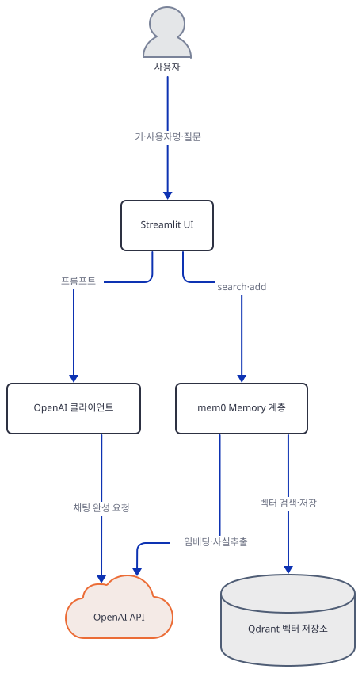
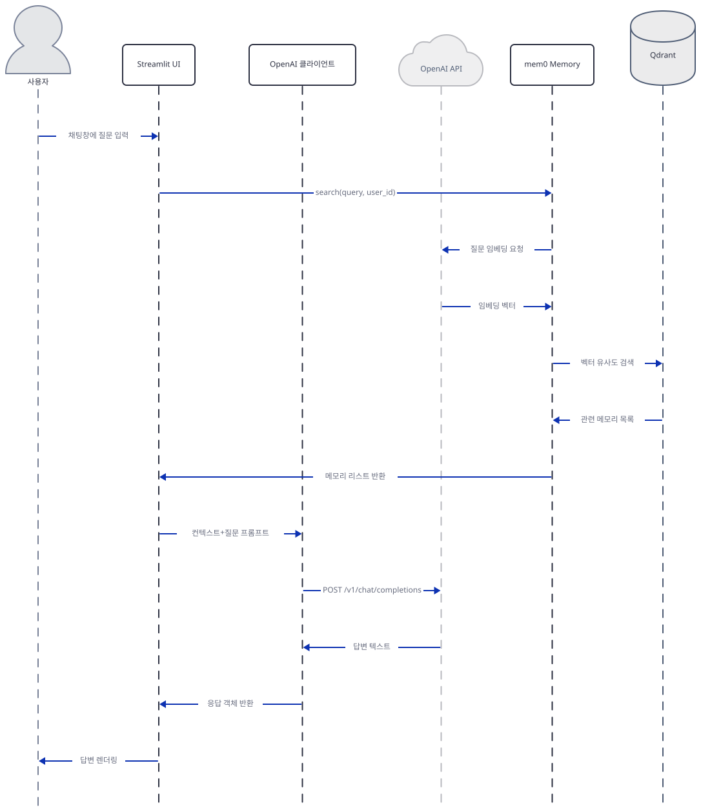

# Day 075 · 🛩️ AI Travel Agent with Memory

> 볼륨 6 💾 LLM Apps with Memory · 난이도 ★★☆ · 예상 소요 65분 · API 비용 대략 $0.1 이하(이 문서는 실제 키·Qdrant 없이 대부분 로컬로 재현) · 원본 앱: `advanced_llm_apps/llm_apps_with_memory_tutorials/ai_travel_agent_memory`

## 오늘 만들 것

Day 073의 `llm_app_memory.py`는 사용자명·질문을 각각 텍스트 입력창에 받고 "Chat with LLM" 버튼을 눌러야 답이 나오는 단발성 폼이었습니다. 오늘 앱(`travel_agent_memory.py`, 101줄)은 같은 **mem0 + Qdrant** 메모리 계층을 그대로 쓰면서 화면만 Streamlit의 채팅 UI(`st.chat_input`·`st.chat_message`)로 바꾼 여행 상담 챗봇입니다. `st.session_state.messages`에 대화 기록을 쌓아 채팅창처럼 보여주고, 사이드바에 입력한 사용자명이 바뀌면 그 기록을 초기화합니다(30-35행). 사용자가 메시지를 보내면 `memory.search()`로 그 사람의 과거 메모리를 찾아 GPT-4o 프롬프트에 끼워 넣고, 답을 받은 뒤에는 사용자 질문과 AI 답변을 `metadata={"role": ...}`를 붙여 **각각 별도로** `memory.add()`에 넘깁니다(98-99행) — Day 073은 답변 하나만 저장했습니다.

`requirements.txt`는 Day 073과 마찬가지로 `mem0ai==0.1.29`만 버전을 고정합니다. 오늘(2026-09-28) 같은 방식으로 설치하면 **streamlit 1.64.0**, **openai 1.109.1**, **mem0ai 0.1.29**, 그리고 mem0ai가 느슨하게 허용하는 범위(`qdrant-client>=1.9.1,<2.0.0`) 안에서 **qdrant-client 1.19.1**이 그대로 받아지고, 파일도 문제없이 컴파일됩니다(직접 확인, Step 1). Day 073에서 이미 확인했듯 이 조합은 구조적으로 깨져 있습니다 — mem0 0.1.29의 Qdrant 래퍼가 부르는 `QdrantClient.search()`가 1.19.1에는 없고 `query_points()`로 이름이 바뀌었습니다. 오늘 앱에서는 이 호출이 버튼 뒤에 숨어 있지 않고 **메시지를 보내는 순간 바로** 실행되므로(70행), Qdrant를 Docker로 제대로 띄우고 진짜 키를 넣어도 챗봇에 아무거나 입력하면 곧장 `AttributeError`로 죽습니다(직접 재현, Step 7). 사이드바의 "View My Memory"도 Day 073과 같은 이유로 항상 "기록 없음"만 보여주는데, 이 앱은 `mem['memory']` 키를 이미 맞게 읽고 있어 Day 073의 `KeyError` 문제는 없습니다(직접 재현, Step 5). 여기에 이 앱만의 화면 배치 버그도 있습니다 — "View My Memory" 버튼이 `st.sidebar.button`이 아니라 `st.button`이라 실제로는 본문에 나타나고, 사이드바에는 버튼을 누르지 않은 모든 순간마다 사용자명과 무관한 에러 문구가 떠 있습니다(소스로 확인, Step 5). 완성 화면은 제목·API 키 입력창, 사이드바의 사용자명 입력·메모리 보기 버튼, 그리고 채팅창으로 이루어집니다. 아래는 완성된 아키텍처입니다.


## 사전 준비

| 서비스/도구 | 용도 | 발급·설치 |
|---|---|---|
| OpenAI API 키 | 화면에서 입력한 키 하나를 앱의 `gpt-4o` 채팅과 mem0 내부의 `gpt-4o-mini`(사실 추출)·`text-embedding-3-small`(임베딩)이 함께 씀 | https://platform.openai.com/api-keys 에서 발급, 화면의 "Enter OpenAI API Key" 입력창에 붙여넣기 |
| Qdrant | mem0가 사용자별로 뽑아낸 메모리를 저장하는 벡터 저장소, `localhost:6333`에 떠 있어야 함(원본 앱 README) — config에 컬렉션 이름을 지정하지 않아 기본값 `mem0` 컬렉션을 씀(패키지 소스로 확인, Day 073의 `llm_app_memory` 컬렉션과 다름) | Docker로 `docker run -p 6333:6333 -p 6334:6334 qdrant/qdrant` — 이 문서는 Docker를 띄우지 않고 `qdrant-client`의 `:memory:` 모드로 벡터 저장소 계층만 재현 |
| MEM0_DIR·MEM0_TELEMETRY 환경변수 (선택) | `import mem0`가 홈 디렉터리에 `.mem0/`를 만들고 PostHog로 익명 통계를 보내는 것을 막고 싶을 때(Day 073에서 이미 확인) | 이 문서의 모든 mem0 관련 명령에 `MEM0_DIR`을 지정 |
| uv | 가상환경 생성과 패키지 설치 | [공통 사전 준비](../README.md#공통-사전-준비-한-번만) 참고 |

## 아키텍처 한눈에 보기

| 컴포넌트 | 역할 | 코드 위치 |
|---|---|---|
| 사용자 (브라우저) | API 키·사용자명·채팅 메시지 입력, 답변·사이드바 확인 | 코드 없음 (외부 UI) |
| Streamlit UI | 제목·키 입력창·사이드바(사용자명, 메모리 보기)·채팅 기록·채팅 입력창 렌더링 | `advanced_llm_apps/llm_apps_with_memory_tutorials/ai_travel_agent_memory/travel_agent_memory.py:5-14`, `advanced_llm_apps/llm_apps_with_memory_tutorials/ai_travel_agent_memory/travel_agent_memory.py:28-49`, `advanced_llm_apps/llm_apps_with_memory_tutorials/ai_travel_agent_memory/travel_agent_memory.py:51-67` |
| OpenAI 클라이언트 | `gpt-4o`로 채팅 완성 요청 | `advanced_llm_apps/llm_apps_with_memory_tutorials/ai_travel_agent_memory/travel_agent_memory.py:2`, `advanced_llm_apps/llm_apps_with_memory_tutorials/ai_travel_agent_memory/travel_agent_memory.py:13-14`, `advanced_llm_apps/llm_apps_with_memory_tutorials/ai_travel_agent_memory/travel_agent_memory.py:81-90` |
| mem0 Memory 계층 | 대화에서 사실을 뽑아 임베딩하고 사용자별로 검색·저장하는 오케스트레이션(mem0ai 0.1.29, 패키지 소스로 확인) | `advanced_llm_apps/llm_apps_with_memory_tutorials/ai_travel_agent_memory/travel_agent_memory.py:3`, `advanced_llm_apps/llm_apps_with_memory_tutorials/ai_travel_agent_memory/travel_agent_memory.py:16-26`, `advanced_llm_apps/llm_apps_with_memory_tutorials/ai_travel_agent_memory/travel_agent_memory.py:40-45`, `advanced_llm_apps/llm_apps_with_memory_tutorials/ai_travel_agent_memory/travel_agent_memory.py:70-75`, `advanced_llm_apps/llm_apps_with_memory_tutorials/ai_travel_agent_memory/travel_agent_memory.py:98-99` |
| OpenAI API (외부) | `gpt-4o` 채팅 완성 + mem0 내부 `gpt-4o-mini` 사실 추출 + `text-embedding-3-small` 임베딩 | 코드 없음 (외부 서비스) |
| Qdrant 벡터 저장소 (외부, Docker) | 사용자별 메모리 벡터를 기본 `mem0` 컬렉션에 저장 | 코드 없음 (외부 프로세스, `localhost:6333`) |

## 단계별 진행

### Step 1. 환경 만들기 — Day 073과 같은 조합인지 확인

**목적.** 격리된 가상환경에 `streamlit`·`openai`·`mem0ai`를 설치하고, 파일이 그대로 컴파일되는지, 오늘 기준으로도 Day 073과 같은 `qdrant-client`가 받아지는지 확인합니다.

**할 일.**

```bash
cd advanced_llm_apps/llm_apps_with_memory_tutorials/ai_travel_agent_memory
uv venv
uv pip install -r requirements.txt
```

(pip 대안: `python -m venv .venv && source .venv/bin/activate && pip install -r requirements.txt`. Windows PowerShell은 활성화만 `.venv\Scripts\Activate.ps1`로 바꿉니다.) 이 저장소는 루트에 `pyproject.toml`이 있어 `uv run`이 방금 만든 환경 대신 루트 `.venv`를 쓰므로, 이후 `uv run` 명령에는 모두 `--no-project`를 붙입니다.

`advanced_llm_apps/llm_apps_with_memory_tutorials/ai_travel_agent_memory/requirements.txt:1-3`

```text
streamlit 
openai
mem0ai==0.1.29
```

(3줄이지만 마지막 줄에 개행이 없어 `wc -l`은 2로 셉니다. 1행 끝에는 공백이 하나 더 있습니다 — Day 073의 `requirements.txt`와 바이트 단위로 같은 모양입니다.)

**그림.**


**확인.**

```bash
uv run --no-project python -m py_compile travel_agent_memory.py && echo compiled
uv run --no-project python -c "
import streamlit, openai, mem0
import importlib.metadata as m
print('streamlit', streamlit.__version__)
print('openai', openai.__version__)
print('mem0ai', m.version('mem0ai'))
print('qdrant-client', m.version('qdrant-client'))
"
```

직접 확인한 출력(2026-09-28 기준):

```
compiled
streamlit 1.64.0
openai 1.109.1
mem0ai 0.1.29
qdrant-client 1.19.1
```

Day 073과 정확히 같은 버전 조합입니다 — 같은 `mem0ai==0.1.29` 고정과 같은 느슨한 `qdrant-client` 범위이기 때문입니다. `import mem0`가 홈 디렉터리에 `.mem0/`를 만들고 PostHog로 익명 통계를 보내는 부작용은 Day 073 Step 1에서 이미 소스(`mem0/memory/setup.py`, `mem0/memory/telemetry.py`)로 확인했으므로, 이 문서의 나머지 명령은 모두 `MEM0_DIR`을 지정해 홈 디렉터리를 건드리지 않습니다.

### Step 2. Streamlit 뼈대와 OpenAI 키 게이트

**목적.** 제목·캡션이 무엇을 보여주는지, 그리고 키 하나가 `OpenAI` 클라이언트로 흘러 들어가는 지점을 확인합니다.

**할 일.**

`advanced_llm_apps/llm_apps_with_memory_tutorials/ai_travel_agent_memory/travel_agent_memory.py:5-14`

```python
# Set up the Streamlit App
st.title("AI Travel Agent with Memory 🧳")
st.caption("Chat with a travel assistant who remembers your preferences and past interactions.")

# Set the OpenAI API key
openai_api_key = st.text_input("Enter OpenAI API Key", type="password")

if openai_api_key:
    # Initialize OpenAI client
    client = OpenAI(api_key=openai_api_key)
```

Day 073과 달리 이 파일은 키를 별도 환경변수에 복사하지 않습니다 — `openai_api_key`는 12행의 `if` 게이트를 통과한 뒤 14행에서 곧바로 `OpenAI(api_key=...)`에 전달됩니다. 이후 16행부터 이어지는 모든 코드(사이드바·mem0 설정·채팅)는 이 `if` 블록 안에 4칸 들여쓰기로 들어 있어, 키를 입력하지 않으면 제목·캡션·키 입력창 외에는 아무것도 렌더링되지 않습니다(소스 들여쓰기로 확인).

**그림.**


**확인.** 클라이언트 생성 자체는 네트워크 요청이 아니므로 아무 문자열이나 키로 넣어도 예외 없이 성공합니다.

```bash
uv run --no-project python -c "
from openai import OpenAI
client = OpenAI(api_key='sk-test')
print('client OK, base_url:', client.base_url)
"
```

직접 확인한 출력:

```
client OK, base_url: https://api.openai.com/v1/
```

### Step 3. mem0 설정 — Qdrant를 벡터 저장소로 연결

**목적.** `Memory.from_config(...)`의 config가 정확히 무엇을 정하는지, 그리고 키나 Qdrant가 없을 때 어디서 실패하는지 확인합니다.

**할 일.**

`advanced_llm_apps/llm_apps_with_memory_tutorials/ai_travel_agent_memory/travel_agent_memory.py:16-26`

```python
    # Initialize Mem0 with Qdrant
    config = {
        "vector_store": {
            "provider": "qdrant",
            "config": {
                "host": "localhost",
                "port": 6333,
            }
        },
    }
    memory = Memory.from_config(config)
```

Day 073의 config는 `collection_name`을 `"llm_app_memory"`로 직접 지정했지만, 이 config에는 그 키가 없습니다 — mem0의 `QdrantConfig`는 `collection_name`의 기본값을 `"mem0"`으로 두므로(패키지 소스 `mem0/configs/vector_stores/qdrant.py`로 확인), 이 앱은 항상 `mem0`라는 이름의 컬렉션을 씁니다. `llm`·`embedder`·`version` 키도 없어 Day 073과 마찬가지로 기본값(OpenAI `gpt-4o-mini`/`text-embedding-3-small`, `api_version="v1.0"`)으로 동작합니다.

**그림.**


**확인.** 키 없이 Qdrant를 provider로 고르기만 해도 mem0 자신이 즉시 실패합니다.

```bash
MEM0_DIR="./.mem0_local_a" HTTP_PROXY=http://127.0.0.1:9 HTTPS_PROXY=http://127.0.0.1:9 \
  uv run --no-project python -c "
from mem0 import Memory
config = {'vector_store': {'provider': 'qdrant', 'config': {'host': 'localhost', 'port': 6333}}}
memory = Memory.from_config(config)
"
```

직접 확인한 출력(발췌):

```
openai.OpenAIError: The api_key client option must be set either by passing api_key to the client or by setting the OPENAI_API_KEY environment variable
```

키를 (형식만 맞으면 아무 값이나) 지정하면 이 에러는 사라지고 Qdrant 연결 시도로 넘어갑니다. Qdrant를 띄우지 않은 채로는:

```bash
MEM0_DIR="./.mem0_local_b" OPENAI_API_KEY=sk-anything HTTP_PROXY=http://127.0.0.1:9 HTTPS_PROXY=http://127.0.0.1:9 \
  uv run --no-project python -c "
from mem0 import Memory
config = {'vector_store': {'provider': 'qdrant', 'config': {'host': 'localhost', 'port': 6333}}}
memory = Memory.from_config(config)
"
```

직접 확인한 출력:

```
qdrant_client.http.exceptions.ResponseHandlingException: [WinError 10061] 대상 컴퓨터에서 연결을 거부했으므로 연결하지 못했습니다
```

`Memory.from_config`는 생성 시점에 `get_collections()`로 컬렉션 목록부터 확인하므로(패키지 소스 `mem0/vector_stores/qdrant.py`의 `create_col()`), Qdrant가 `localhost:6333`에 떠 있지 않으면 임베딩이나 채팅 요청 전에 이 단계에서 멈춥니다 — Day 073과 같은 실패 지점입니다.

### Step 4. 사이드바 — 사용자명과 대화 초기화

**목적.** 사용자를 구분하는 `user_id`가 어디서 들어오고, 사용자명이 바뀌면 채팅 기록이 어떻게 지워지는지 확인합니다.

**할 일.**

`advanced_llm_apps/llm_apps_with_memory_tutorials/ai_travel_agent_memory/travel_agent_memory.py:28-35`

```python
    # Sidebar for username and memory view
    st.sidebar.title("Enter your username:")
    previous_user_id = st.session_state.get("previous_user_id", None)
    user_id = st.sidebar.text_input("Enter your Username")

    if user_id != previous_user_id:
        st.session_state.messages = []
        st.session_state.previous_user_id = user_id
```

`user_id`는 로그인이 아니라 이 입력창에 직접 타이핑하는 문자열입니다(Day 073과 같은 방식, 별도 인증 없음). Day 073에는 없던 로직이 여기 있습니다 — 매 rerun마다 방금 입력한 `user_id`를 이전 rerun에서 저장해 둔 `previous_user_id`와 비교해서, 값이 바뀌면(다른 사람이 이름을 입력했거나 처음 입력했으면) `st.session_state.messages`를 비웁니다. 즉 사용자명을 바꾸면 화면의 채팅창은 새로 시작하지만, mem0에 저장된 메모리 자체는(Qdrant에 남아 있으므로) 지워지지 않습니다.

**그림.**


**확인.** 이 6줄이 파일에 그대로 있는지 확인합니다.

```bash
sed -n '28,35p' travel_agent_memory.py
```

직접 확인한 출력은 위 발췌와 같습니다(줄 번호 28~35).

### Step 5. 사이드바 — 전체 메모리 보기

**목적.** `get_all()`의 반환 형태가 앱의 기대와 맞는지, 그리고 버튼이 실제로 어디에 나타나는지 확인합니다.

**할 일.**

`advanced_llm_apps/llm_apps_with_memory_tutorials/ai_travel_agent_memory/travel_agent_memory.py:37-49`

```python
    # Sidebar option to show memory
    st.sidebar.title("Memory Info")
    if st.button("View My Memory"):
        memories = memory.get_all(user_id=user_id)
        if memories and "results" in memories:
            st.write(f"Memory history for **{user_id}**:")
            for mem in memories["results"]:
                if "memory" in mem:
                    st.write(f"- {mem['memory']}")
        else:
            st.sidebar.info("No learning history found for this user ID.")
    else:
        st.sidebar.error("Please enter a username to view memory info.")
```

39행은 `st.sidebar.button`이 아니라 `st.button`입니다 — 바로 위 38행의 `st.sidebar.title("Memory Info")`는 사이드바에 남지만, 버튼 자체는 화면 본문에 렌더링됩니다(소스로 확인). 41행은 Day 073의 사이드바와 같은 가정을 합니다 — `get_all()`이 `{"results": [...]}` 형태의 dict를 돌려준다고 가정하는데, 이는 `api_version="v1.1"`일 때만 맞습니다. Step 3에서 본 대로 이 config는 `version`을 지정하지 않아 기본값 `"v1.0"`으로 동작하고, 이 모드의 `get_all()`은 리스트를 그대로 돌려주면서 `DeprecationWarning`을 띄웁니다(패키지 소스 `mem0/memory/main.py`로 확인). 다만 Day 073과 달리 44행은 `mem['memory']`를 읽습니다 — 리스트 원소의 실제 키 이름과 이미 일치하므로, dict/list 문제만 없다면 `KeyError`는 나지 않습니다.

**그림.**


**확인.** Qdrant Docker나 OpenAI 키 없이, `:memory:` 모드의 `QdrantClient`에 mem0의 Qdrant 래퍼로 가짜 메모리 하나를 직접 넣고 `get_all()`이 내부에서 부르는 `vector_store.list()`의 반환 형태를 그대로 재현했습니다.

```bash
uv run --no-project python - <<'EOF'
from qdrant_client import QdrantClient
from mem0.vector_stores.qdrant import Qdrant

client = QdrantClient(location=":memory:")
vs = Qdrant(collection_name="mem0", embedding_model_dims=4, client=client)
vs.insert(
    vectors=[[0.1, 0.2, 0.3, 0.4]],
    payloads=[{"memory": "Prefers window seats", "user_id": "alice"}],
    ids=["11111111-1111-1111-1111-111111111111"],
)

# mem0.Memory.get_all()이 api_version 기본값("v1.0")일 때 하는 일과 같은 재구성
mem_items, _ = vs.list(filters={"user_id": "alice"})
shaped = [{"id": str(m.id), "memory": m.payload.get("memory")} for m in mem_items]
print("shaped:", shaped)
print('"results" in shaped:', "results" in shaped)
EOF
```

직접 확인한 출력:

```
shaped: [{'id': '11111111-1111-1111-1111-111111111111', 'memory': 'Prefers window seats'}]
"results" in shaped: False
```

메모리가 실제로 1건 있는데도 41행의 `"results" in memories`는 거짓입니다 — 사이드바는 항상 "No learning history found"만 보여줍니다. 그리고 39행의 버튼을 누르지 않은 모든 rerun(첫 화면 포함, 채팅 중에도 계속)에는 49행의 `else` 분기가 실행되어, 사용자명을 이미 입력했어도 사이드바에 "Please enter a username to view memory info."가 떠 있습니다 — 이 문구는 버튼 클릭 여부를 말할 뿐 사용자명과는 무관합니다(소스로 확인).

### Step 6. 채팅 기록 상태와 입력창

**목적.** 대화가 `st.session_state.messages`에 어떻게 쌓이고 화면에 다시 그려지는지 확인합니다.

**할 일.**

`advanced_llm_apps/llm_apps_with_memory_tutorials/ai_travel_agent_memory/travel_agent_memory.py:51-61`

```python
    # Initialize the chat history
    if "messages" not in st.session_state:
        st.session_state.messages = []

    # Display the chat history
    for message in st.session_state.messages:
        with st.chat_message(message["role"]):
            st.markdown(message["content"])

    # Accept user input
    prompt = st.chat_input("Where would you like to travel?")
```

Streamlit은 상호작용이 있을 때마다 스크립트 전체를 다시 실행하므로, 52-53행처럼 `session_state`에 없을 때만 초기화하는 패턴이 없으면 메시지를 보낼 때마다 기록이 사라집니다. `st.chat_input`(61행)은 값을 받은 그 rerun에서만 문자열을 돌려주고, 다음 rerun부터는 다시 `None`입니다.

**그림.**


**확인.**

```bash
grep -n "st.chat_input\|st.chat_message\|st.session_state" travel_agent_memory.py
```

직접 확인한 출력(발췌):

```
30:    previous_user_id = st.session_state.get("previous_user_id", None)
34:        st.session_state.messages = []
35:        st.session_state.previous_user_id = user_id
52:    if "messages" not in st.session_state:
53:        st.session_state.messages = []
56:    for message in st.session_state.messages:
57:        with st.chat_message(message["role"]):
61:    prompt = st.chat_input("Where would you like to travel?")
```

### Step 7. 검색 → 컨텍스트 구성 → GPT-4o 호출

**목적.** 메시지를 보내면 정확히 무슨 일이 일어나는지, 그리고 오늘 기준 설치에서 이 흐름이 어디서 멈추는지 확인합니다.

**할 일.**

`advanced_llm_apps/llm_apps_with_memory_tutorials/ai_travel_agent_memory/travel_agent_memory.py:63-90`

```python
    if prompt and user_id:
        # Add user message to chat history
        st.session_state.messages.append({"role": "user", "content": prompt})
        with st.chat_message("user"):
            st.markdown(prompt)

        # Retrieve relevant memories
        relevant_memories = memory.search(query=prompt, user_id=user_id)
        context = "Relevant past information:\n"
        if relevant_memories and "results" in relevant_memories:
            for mem in relevant_memories["results"]:
                if "memory" in mem:
                    context += f"- {mem['memory']}\n"

        # Prepare the full prompt
        full_prompt = f"{context}\nHuman: {prompt}\nAI:"

        # Generate response
        response = client.chat.completions.create(
            model="gpt-4o",
            messages=[
                {"role": "system", "content": "You are a travel assistant with access to past conversations."},
                {"role": "user", "content": full_prompt}
            ]
        )
        if not response.choices or response.choices[0].message.content is None:
            raise ValueError("Received empty or null response from OpenAI API")
        answer = response.choices[0].message.content
```

사용자 메시지를 화면에 그린 직후, GPT를 부르기도 전에 70행에서 `memory.search(...)`부터 호출합니다. Day 073은 이 호출이 별도 버튼 뒤에 있었지만, 이 앱은 채팅창에 아무 메시지나 보내는 순간 바로 실행됩니다. mem0 0.1.29의 Qdrant 래퍼는 `self.client.search(...)`를 부르는데(패키지 소스 `mem0/vector_stores/qdrant.py`), Step 1에서 확인한 `qdrant-client 1.19.1`에는 이 메서드가 없습니다.

**그림.**



**확인.** Qdrant 서버 유무와 무관한, 순수한 버전 문제이므로 `qdrant-client`의 `:memory:` 클라이언트만으로 재현됩니다.

```bash
uv run --no-project python -c "
from qdrant_client import QdrantClient
from mem0.vector_stores.qdrant import Qdrant

client = QdrantClient(location=':memory:')
vs = Qdrant(collection_name='mem0', embedding_model_dims=4, client=client)
try:
    vs.search(query=[0.1, 0.2, 0.3, 0.4], limit=5, filters={'user_id': 'alice'})
except AttributeError as e:
    print('AttributeError:', e)
"
```

직접 확인한 출력:

```
AttributeError: 'QdrantClient' object has no attribute 'search'
```

즉 Qdrant를 Docker로 정상적으로 띄우고 진짜 OpenAI 키를 넣어도, 채팅창에 첫 메시지를 보내는 순간 70행에서 이 `AttributeError`가 발생해 화면에는 GPT-4o의 답 대신 처리되지 않은 예외가 뜹니다 — 메모리가 하나도 없는 첫 대화여도 마찬가지입니다(`_search_vector_store`가 컬렉션이 비어 있어도 무조건 `.search()`를 부르기 때문에, 패키지 소스로 확인). 72-75행의 `"results" in relevant_memories`·`mem['memory']` 자체는(Step 5에서 본 대로 default 모드에서는 리스트가 오므로 조건이 거짓이 되어) 코드에 도달해도 조용히 컨텍스트를 비워 둘 뿐 죽지는 않지만, 실행 중에는 그 이전인 70행에서 이미 멈춥니다.

### Step 8. 답변을 다시 메모리에 저장

**목적.** 사용자 질문과 AI 답변이 각각 어떻게 mem0에 저장되도록 설계됐는지 확인합니다.

**할 일.**

`advanced_llm_apps/llm_apps_with_memory_tutorials/ai_travel_agent_memory/travel_agent_memory.py:92-101`

```python
        # Add assistant response to chat history
        st.session_state.messages.append({"role": "assistant", "content": answer})
        with st.chat_message("assistant"):
            st.markdown(answer)

        # Store the user query and AI response in memory
        memory.add(prompt, user_id=user_id, metadata={"role": "user"})
        memory.add(answer, user_id=user_id, metadata={"role": "assistant"})
    elif not user_id:
        st.error("Please enter a username to start the chat.")
```

Day 073은 답변 하나만 `memory.add(answer, user_id=user_id)`로 저장했지만, 이 앱은 98-99행에서 사용자 질문과 AI 답변을 **두 번의 별도 호출**로 저장하며, 각각 `metadata={"role": "user"}`/`{"role": "assistant"}`를 붙입니다. 실행 중에는 Step 7의 크래시 때문에 이 두 줄에 도달하지 못합니다. 소스로 보면(`mem0/memory/main.py`), `add()`는 `gpt-4o-mini`에게 방금 텍스트에서 "사실"을 뽑아내라고 시킨 뒤, 새로 뽑은 사실마다 비슷한 메모리가 있는지 `vector_store.search(...)`로 다시 확인합니다 — 즉 `add()`도 내부에서 Step 7과 같은 깨진 `.search()` 호출을 한 번 더 거치므로, Step 7의 문제를 우회하지 않는 한 이 두 줄도 실행되지 못합니다. 100-101행의 `elif not user_id`는 메시지를 입력했는데 사용자명이 비어 있을 때뿐 아니라, 사용자명도 메시지도 모두 비어 있는 첫 화면에서도 `prompt and user_id`가 거짓이 되어 함께 걸립니다(소스로 확인) — 페이지를 열자마자 "Please enter a username to start the chat."이 보이는 것은 의도된 안내로 보입니다.

**그림.**


**확인.** 파일에 이 줄들이 그대로 있는지 확인합니다.

```bash
sed -n '97,101p' travel_agent_memory.py
```

직접 확인한 출력:

```
        # Store the user query and AI response in memory
        memory.add(prompt, user_id=user_id, metadata={"role": "user"})
        memory.add(answer, user_id=user_id, metadata={"role": "assistant"})
    elif not user_id:
        st.error("Please enter a username to start the chat.")
```

## 요청 한 건이 흐르는 과정



사용자가 채팅창에 메시지를 입력하면, Streamlit UI는 그 메시지를 먼저 화면에 그린 뒤 mem0 Memory 계층에 `search(query, user_id)`를 넘깁니다. mem0는 질문을 OpenAI API로 임베딩한 뒤 그 벡터로 Qdrant에서 같은 `user_id`의 메모리만 걸러 유사도 검색을 하고, 결과 목록을 UI에 돌려줍니다. UI는 이 목록으로 컨텍스트 문자열을 만들어 OpenAI 클라이언트에 넘기고, 클라이언트는 `POST /v1/chat/completions`로 `gpt-4o`의 답을 받아 화면에 렌더링합니다. 그 직후 UI는 사용자 질문과 방금 받은 답을 각각 `add(prompt)`·`add(answer)`로 mem0에 넘기고, mem0는 두 메시지 각각에 대해 OpenAI API로 사실을 추출·임베딩한 뒤 Qdrant에 저장합니다. Step 7·8에서 직접 확인했듯, 오늘 기준 설치에서는 이 그림의 두 번째 화살표(`search`)에서 이미 `AttributeError`로 멈추므로 실제로는 이 왕복이 완주되지 않습니다 — 그림은 코드가 원래 의도한 구조를 보여줍니다.

## 실행 체크리스트

- [ ] `uv venv && uv pip install -r requirements.txt`만으로 오늘도 Day 073과 같은 버전 조합(mem0ai 0.1.29 + qdrant-client 1.19.1)이 설치된다는 것을 확인했다
- [ ] `Memory.from_config`가 config에 `collection_name`을 지정하지 않으면 기본값 `"mem0"` 컬렉션을 쓴다는 것을 소스로 확인했다
- [ ] `memory.search(...)`가 채팅창에 메시지를 보내는 즉시(버튼 뒤가 아니라) 호출되고, 오늘 설치되는 `qdrant-client`에 `.search()`가 없어 `AttributeError`로 죽는다는 것을 직접 재현했다
- [ ] `get_all()`이 기본 `api_version`에서는 dict가 아니라 리스트를 돌려줘서 사이드바가 항상 "기록 없음"만 보여준다는 것과, 이 앱은 (Day 073과 달리) 키 이름 자체는 이미 맞다는 것을 직접 재현했다
- [ ] "View My Memory" 버튼이 `st.button`이라 사이드바가 아니라 본문에 나타나고, 사이드바 에러 문구는 버튼 클릭 여부만 반영한다는 것을 소스로 확인했다
- [ ] 사용자명이 바뀌면 화면의 채팅 기록만 지워질 뿐 Qdrant에 쌓인 메모리는 남는다는 것을 이해했다

## 문제 해결

| 증상 | 원인 | 해결 |
|---|---|---|
| 채팅창에 메시지를 보내는 즉시 `AttributeError: 'QdrantClient' object has no attribute 'search'`로 앱이 죽음 | `requirements.txt`가 `mem0ai==0.1.29`만 버전을 고정하고 `qdrant-client`는 범위(`>=1.9.1,<2.0.0`)만 지정해, 오늘 기준 최신인 1.19.1이 설치됨 — 이 버전은 `.search()`를 `.query_points()`로 옮겼는데 mem0ai 0.1.29는 옛 이름을 부름(직접 확인, Day 073과 같은 원인) | 리포 코드는 고치지 않음 — 재현하려면 `uv pip install "qdrant-client==1.9.1"`로 내려 설치 |
| "View My Memory"를 눌러도 메모리가 있는데 항상 "No learning history found" | config에 `version`을 지정하지 않아 기본값 `"v1.0"`으로 동작 — 이 모드의 `get_all()`은 dict가 아니라 리스트를 그대로 반환하는데, 앱은 `"results" in memories`로 dict를 기대함(직접 확인) | 리포 코드는 고치지 않음 — 더 해보기에서 `version: "v1.1"`을 직접 넣어봄 |
| "View My Memory" 버튼이 사이드바가 아니라 화면 본문에 나타나고, 사이드바에는 사용자명을 입력해도 "Please enter a username to view memory info."가 계속 떠 있음 | 39행이 `st.sidebar.button`이 아니라 `st.button`이라 버튼은 본문에 렌더링되고, else 분기(49행)만 사이드바에 남아 버튼 미클릭 상태(기본값)마다 그 문구가 뜸(소스로 확인) | 리포 코드는 고치지 않음 |
| 원본 앱 README의 clone 안내를 그대로 따라가면 `cd`가 실패 | README가 `cd awesome-llm-apps/llm_apps_with_memory_tutorials/ai_travel_agent_memory`라고 안내하지만, 실제 폴더는 한 단계 위에 `advanced_llm_apps/`가 더 있음(소스로 확인) | `cd advanced_llm_apps/llm_apps_with_memory_tutorials/ai_travel_agent_memory`로 이동 |

## 더 해보기

- `uv pip install "qdrant-client==1.9.1"`로 내려서 실제 Qdrant를 Docker로 띄우고, 채팅이 `AttributeError` 없이 끝까지 완주되는지 확인해보기(이 앱은 `mem['memory']` 키가 이미 맞으므로 Day 073과 달리 그 부분은 고칠 필요가 없습니다)
- `Memory.from_config`의 config dict에 `"version": "v1.1"`을 추가해 `search()`/`get_all()`이 dict를 반환하도록 맞추고, `advanced_llm_apps/llm_apps_with_memory_tutorials/ai_travel_agent_memory/travel_agent_memory.py:41`·`72`의 조건이 실제로 참이 되는지 확인해보기
- `advanced_llm_apps/llm_apps_with_memory_tutorials/ai_travel_agent_memory/travel_agent_memory.py:39`의 `st.button`을 `st.sidebar.button`으로 고쳐, 버튼이 실제로 사이드바 안에 나타나는지 확인해보기

## 다음 날 예고

[Day 076 · 🗄️ Local ChatGPT Clone with Memory](../day076-local-chatgpt-with-memory/README.md) — 지금까지는 OpenAI API로 채팅과 임베딩을 모두 처리했다면, 다음 날은 로컬 모델로 돌아가는 ChatGPT 클론에 메모리를 붙이는 앱을 다룹니다.
