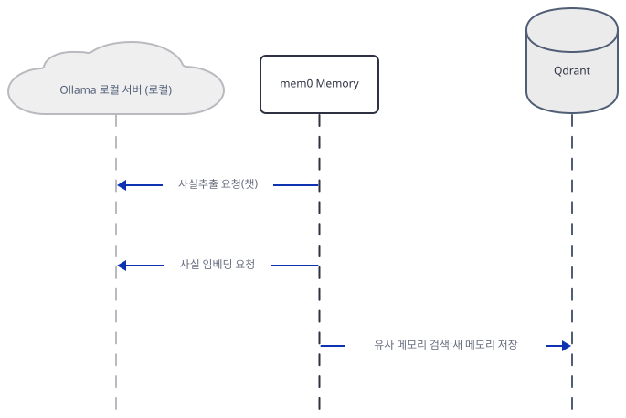

# Day 076 · 🗄️ Local ChatGPT Clone with Memory

> 볼륨 6 💾 LLM Apps with Memory · 난이도 ★★☆ · 예상 소요 105분(머리말이 요약하는 세 가지 실패를 Step 2·6에서 각각 독립적으로 재현합니다 — 그중 첫 번째는 실제 터미널 동작까지 갈라져(y/N 응답별로) 재현이 더 늘고, 두 번째 `add()`의 내부 전개까지 그림 하나를 따로 더 확인하는 날이라 시간이 늘었습니다) · API 비용 무료(로컬 — 채팅·임베딩·메모리 벡터 저장은 모두 Ollama·Qdrant로 처리하지만, "클라우드 호출이 전혀 없다"는 뜻은 아닙니다: litellm은 import 시점에 GitHub에서 가격표를 받으려 하고 mem0는 PostHog로 익명 통계를 보내려 합니다 — 둘 다 환경변수로 끌 수 있습니다, 아래에서 직접 확인) · 원본 앱: `advanced_llm_apps/llm_apps_with_memory_tutorials/local_chatgpt_with_memory`

## 오늘 만들 것

오늘 앱(`local_chatgpt_memory.py`, 137줄 — 마지막 줄에 개행이 없어 `wc -l`은 136으로 세지만 편집기·GitHub에서는 137번째 줄까지 보입니다, 직접 확인)은 이 볼륨에서 처음으로 채팅 모델과 mem0의 사실 추출·임베딩까지 전부 **Ollama** 하나로 돌리는 앱입니다. Day 073의 `llm_app_memory.py`는 mem0 config에 `llm`·`embedder`를 지정하지 않아 기본값인 OpenAI를 그대로 썼지만, 오늘 config는 `vector_store`(Qdrant)뿐 아니라 `llm`과 `embedder`도 명시적으로 `"provider": "ollama"`로 지정합니다(6~34행) — 그래서 원본 앱 README가 내세우는 "Fully local implementation with no external API dependencies"라는 문구는 **채팅·임베딩·메모리 벡터 저장이라는 모델 호출 자체**에 대해서는 소스로 확인됩니다. 다만 이것이 "이 앱을 켜면 어떤 외부 요청도 없다"는 뜻은 아닙니다 — `import litellm`은 그 시점에 `https://raw.githubusercontent.com/BerriAI/litellm/main/model_prices_and_context_window.json`을 받으려 하고(`LITELLM_LOCAL_MODEL_COST_MAP=True`로 끌 수 있음, 직접 확인), `import mem0`는 홈 디렉터리에 `.mem0/`를 만들고 PostHog로 익명 통계를 보내려 합니다(`MEM0_TELEMETRY=False`로 끌 수 있음, Day 073에서 이미 확인한 동작). 둘 다 채팅·임베딩 요청 자체와는 무관한, import·초기화 시점의 부수 효과입니다. 사용자는 사이드바에 아무 이름이나 입력해 "로그인"하고(별도 인증 없음, 47~53행), 채팅창에 메시지를 보내면 앱은 그 메시지를 먼저 mem0에 저장한 뒤(88행), 같은 사용자의 과거 메모리 전체를 `get_all()`로 가져와(91행) 컨텍스트 문자열로 붙이고, `litellm.completion(model="ollama/llama3.1:latest", ...)`로 스트리밍 응답을 받습니다(105~113행). 이 문서를 쓰며 오늘(2026-09-28) `uv pip install -r requirements.txt`로 설치했을 때 **streamlit 1.64.0**, **litellm 1.80.0**, **mem0ai 0.1.29**, **qdrant-client 1.19.1**이 그대로 받아졌고 파일도 문제없이 컴파일됩니다(직접 확인, Step 1). 하지만 mem0ai 0.1.29의 Ollama LLM/임베더 provider는 `ollama`라는 별도 PyPI 패키지에 `from ollama import Client`로 직접 의존하는데, 이 패키지는 `requirements.txt` 4줄에도, mem0ai가 선언한 의존성에도 없습니다(직접 확인, Step 1) — 그 결과 사이드바에 사용자명을 입력하는 순간(=`Memory.from_config(config)` 호출, 59행) 앱은 깔끔한 `ImportError`를 올리는 대신 `input()`으로 설치 여부를 묻는데, Streamlit은 실행 중인 스크립트의 표준입력을 건드리지 않으므로(소스로 확인) 실제 앱에서는 **브라우저가 멈추고 터미널에 `[y/N]` 프롬프트가 뜬 채 대기**하며, 표준입력이 아예 닫혀 있을 때만(예: 이 문서의 `python -c` 재현) 즉시 `EOFError`가 됩니다(직접 재현, Step 2). `ollama` 패키지를 따로 설치해도 두 번째 문제가 남습니다 — mem0ai 0.1.29가 "모델이 이미 있는지" 확인하는 코드는 오늘 설치되는 `ollama` 0.6.2의 응답 스키마와 필드 이름이 어긋나 있어, 모델이 이미 로컬에 있어도 매번 무조건 `pull`을 시도합니다(직접 재현, Step 2). 이 둘을 우회해 `Memory` 객체를 만드는 데 성공해도 **세 번째 문제**가 기다립니다 — `requirements.txt`가 버전을 고정하지 않은 `qdrant-client`는 오늘 설치되는 1.19.1인데, mem0ai 0.1.29의 `add()`는 추출한 사실마다 내부적으로 `self.vector_store.search(...)`를 부르고 그 래퍼는 `self.client.search(...)`를 부릅니다 — 이 메서드는 qdrant-client 1.19.1에 없습니다(`.search()`는 `query_points()`로 이름이 바뀌었습니다). 그래서 88행의 `m.add(prompt, ...)`는 사실이 하나라도 추출되는 순간 `AttributeError`로 죽습니다 — Day 073·075에서 본 것과 같은 원인입니다(직접 재현, Step 6). 이 세 가지를 모두 우회하면(`ollama` 설치 + `/api/pull` 성공 응답 + `qdrant-client==1.9.1`로 다운그레이드) 앱 자체의 로직(v1.1 형식의 `get_all()`, 컨텍스트 구성, 스트리밍 응답 처리)은 설계대로 동작한다는 것도 로컬 스텁 서버로 직접 확인했습니다(Step 6~8) — Day 073에서 본 `get_all()` dict/list 불일치는 오늘 config가 `"version": "v1.1"`을 명시하기 때문에 이 앱에는 없습니다. 완성하면 브라우저에는 제목, 사이드바의 사용자명 입력창과 "View My Memory" 버튼, 그리고 채팅 입력창이 뜹니다. 세 가지를 모두 갖춘 뒤(진짜 Ollama에 두 모델을 받고, `ollama` 패키지를 설치하고, `qdrant-client==1.9.1`로 맞추고, Qdrant를 Docker로 띄운 뒤) 앱 자체를 띄우는 명령은 다음과 같습니다.

```bash
uv run --no-project streamlit run local_chatgpt_memory.py --server.address localhost --server.headless true
```

(`--server.address localhost`가 없으면 Streamlit이 외부 IP 확인차 `checkip.amazonaws.com`에 요청을 보냅니다 — Day 060에서 확인한 동작.) 이 문서는 위 세 가지 우회 없이는 서버는 뜨지만 사용자명을 넣는 순간 화면이 멈추므로(서버 프로세스 자체가 죽는 것은 아닙니다 — 아래 Step 2에서 정확한 동작을 확인합니다) 직접 띄우지 않고, 아래 Step들에서 각 실패와 우회를 라이브러리 수준으로 재현합니다. 아래는 완성된 아키텍처입니다.


## 사전 준비

| 서비스/도구 | 용도 | 발급·설치 |
|---|---|---|
| Ollama | `llama3.1:latest`로 채팅, `nomic-embed-text:latest`로 임베딩을 로컬로 서빙(`localhost:11434`) | https://ollama.com/download 설치 후 `ollama pull llama3.1`·`ollama pull nomic-embed-text` — 이 문서는 두 모델을 내려받지 않고 로컬 스텁 서버로 재현합니다 |
| ollama (PyPI 패키지) | mem0ai 0.1.29의 Ollama LLM/임베더 provider가 직접 의존 — `requirements.txt`와 mem0ai 의존성 어디에도 없음(Step 1에서 직접 확인) | `uv pip install ollama` (pip: `pip install ollama`) |
| Qdrant | mem0가 사용자별 벡터를 저장하는 벡터 저장소, `local-chatgpt-memory` 컬렉션 | Docker: `docker run -p 6333:6333 qdrant/qdrant` — 이 문서는 Docker 대신 `qdrant-client`의 로컬 파일 모드(`path=`)로 벡터 저장소 계층만 재현합니다. `requirements.txt`가 버전을 고정하지 않아 오늘은 1.19.1이 설치되는데, 이 버전은 mem0ai 0.1.29가 부르는 `.search()`가 없어 `AttributeError`가 남 — `uv pip install "qdrant-client==1.9.1"`로 내려야 함(Step 6) |
| MEM0_DIR·MEM0_TELEMETRY 환경변수 | `import mem0`가 홈 디렉터리에 `.mem0/`를 만들고 PostHog로 익명 통계를 보내는 것을 막음(Day 073에서 직접 확인한 것과 같은 동작) | Step 1에서 셸에 한 번 `export`(PowerShell `$env:`)로 지정해 두고 이 문서 전체가 같은 셸에서 이어받습니다 |
| uv | 가상환경 생성과 패키지 설치 | [공통 사전 준비](../README.md#공통-사전-준비-한-번만) 참고 |

## 아키텍처 한눈에 보기

| 컴포넌트 | 역할 | 코드 위치 |
|---|---|---|
| 사용자 (브라우저) | 사용자명·메시지 입력, 답변과 사이드바 메모리 확인 | 코드 없음 (외부 UI) |
| Streamlit UI | 제목·세션 상태·사이드바·채팅 렌더링 | `advanced_llm_apps/llm_apps_with_memory_tutorials/local_chatgpt_with_memory/local_chatgpt_memory.py:36-43`, `advanced_llm_apps/llm_apps_with_memory_tutorials/local_chatgpt_with_memory/local_chatgpt_memory.py:45-69`, `advanced_llm_apps/llm_apps_with_memory_tutorials/local_chatgpt_with_memory/local_chatgpt_memory.py:71-86` |
| mem0 Memory 계층 | 메시지에서 사실을 뽑아 사용자별 벡터로 저장·조회하는 오케스트레이션(mem0ai 0.1.29, 패키지 소스로 확인) | `advanced_llm_apps/llm_apps_with_memory_tutorials/local_chatgpt_with_memory/local_chatgpt_memory.py:6-34`, `advanced_llm_apps/llm_apps_with_memory_tutorials/local_chatgpt_with_memory/local_chatgpt_memory.py:59`, `advanced_llm_apps/llm_apps_with_memory_tutorials/local_chatgpt_with_memory/local_chatgpt_memory.py:88`, `advanced_llm_apps/llm_apps_with_memory_tutorials/local_chatgpt_with_memory/local_chatgpt_memory.py:91` |
| LiteLLM 완성 호출 | Ollama의 `/api/generate`에 스트리밍 채팅 완성 요청(litellm 1.80.0, 패키지 소스로 확인) | `advanced_llm_apps/llm_apps_with_memory_tutorials/local_chatgpt_with_memory/local_chatgpt_memory.py:105-113`, `advanced_llm_apps/llm_apps_with_memory_tutorials/local_chatgpt_with_memory/local_chatgpt_memory.py:116-121` |
| Qdrant 벡터 저장소 (외부, 로컬) | mem0가 뽑은 메모리 벡터를 `local-chatgpt-memory` 컬렉션에 저장 | 코드 없음 (외부 프로세스, `localhost:6333`) |
| Ollama 로컬 서버 (외부, 로컬) | `llama3.1`(챗)·`nomic-embed-text`(임베딩)를 로컬로 서빙 | 코드 없음 (외부 프로세스, `localhost:11434`) |

## 단계별 진행

### Step 1. 환경 만들기 — mem0ai가 무엇을 당기고, 무엇을 빠뜨리는지 확인

**목적.** 격리된 가상환경에 `streamlit`·`openai`·`mem0ai`·`litellm`을 설치하고, 파일이 그대로 컴파일되는지, 그리고 mem0ai가 Ollama를 쓰려면 실제로 무엇이 더 필요한지 확인합니다.

**할 일.**

```bash
cd advanced_llm_apps/llm_apps_with_memory_tutorials/local_chatgpt_with_memory
uv venv
uv pip install -r requirements.txt
```

(pip 대안: `python -m venv .venv && source .venv/bin/activate && pip install -r requirements.txt`. Windows PowerShell은 활성화만 `.venv\Scripts\Activate.ps1`로 바꿉니다.) 이 저장소는 루트에 `pyproject.toml`이 있어 `uv run`이 방금 만든 환경 대신 루트 `.venv`를 쓰므로, 이후 `uv run` 명령에는 모두 `--no-project`를 붙입니다.

`advanced_llm_apps/llm_apps_with_memory_tutorials/local_chatgpt_with_memory/requirements.txt:1-4`

```text
streamlit
openai
mem0ai==0.1.29
litellm
```

(4줄이지만 마지막 줄에 개행이 없어 `wc -l`은 3으로 셉니다. 1행 끝에는 공백이 하나 더 있습니다.) 이 4줄 중 버전이 고정된 것은 `mem0ai`뿐입니다. `openai`는 이 파일이 직접 import하지 않지만(3개 import는 `streamlit`·`mem0.Memory`·`litellm.completion`뿐입니다) litellm 1.80.0 자신이 `openai>=1.99.5`를 의존성으로 선언하므로 어차피 함께 설치됩니다(배포 메타데이터로 확인). 이 목록에는 mem0ai가 Ollama LLM/임베더 provider에서 직접 요구하는 `ollama` 패키지가 빠져 있습니다 — Step 2에서 이게 왜 문제가 되는지 직접 확인합니다.

Day 073에서 이미 확인했듯이 `import mem0`만 해도 홈 디렉터리에 `.mem0/`가 생기고 PostHog로 익명 통계가 나갑니다. 이 문서는 아래 두 변수를 이 셸에 한 번 지정해 두고 이후 모든 `import mem0`가 이 셸에서 계속 이어받게 합니다(새 터미널을 열면 다시 지정해야 합니다).

```bash
export MEM0_DIR="$(pwd)/.mem0_local"
export MEM0_TELEMETRY=False
```

PowerShell: `$env:MEM0_DIR = "$PWD\.mem0_local"; $env:MEM0_TELEMETRY = "False"`.


**확인.**

```bash
uv run --no-project python -m py_compile local_chatgpt_memory.py && echo compiled
uv run --no-project python -c "
import streamlit, litellm, mem0
import importlib.metadata as m
print('streamlit', streamlit.__version__)
print('litellm', m.version('litellm'))
print('mem0ai', m.version('mem0ai'))
print('qdrant-client', m.version('qdrant-client'))
"
uv run --no-project python -c "import ollama"
```

직접 확인한 출력(2026-09-28 기준). 다만 `litellm`은 오늘 최신판이 아닙니다 — 오늘 PyPI 최신은 1.103.0인데(`echo litellm | uv pip compile -`로 확인), 이 최신판은 `openai>=2.20.0,<3.0.0`을 요구합니다(배포 메타데이터로 직접 확인). `mem0ai==0.1.29`는 `openai`를 `>=1.33.0,<2.0.0`으로 묶어 두므로, 그 상한 아래에서 동작하려면 `openai>=1.99.5`만 요구하는 litellm 1.80.0이 마지막 세대입니다(직접 확인):

```
compiled
streamlit 1.64.0
litellm 1.80.0
mem0ai 0.1.29
qdrant-client 1.19.1
```

마지막 명령(`import ollama`)은:

```
ModuleNotFoundError: No module named 'ollama'
```

mem0ai 0.1.29의 배포 메타데이터(`Requires-Dist`)를 봐도 `openai`·`posthog`·`pydantic`·`pytz`·`qdrant-client`·`sqlalchemy`만 있고 `ollama`는 없습니다(직접 확인) — Ollama provider를 실제로 쓰려면 이 패키지를 별도로 설치해야 합니다.

### Step 2. mem0 Memory 설정 — Qdrant + Ollama, 그리고 두 가지 실패

**목적.** config가 벡터 저장소·LLM·임베더를 어떻게 나누는지 확인하고, `Memory.from_config(config)`가 오늘 기준 설치에서 실제로 어디서 어떻게 실패하는지 재현합니다.

**할 일.**

`advanced_llm_apps/llm_apps_with_memory_tutorials/local_chatgpt_with_memory/local_chatgpt_memory.py:1-34`

```python
import streamlit as st
from mem0 import Memory
from litellm import completion

# Configuration for Memory
config = {
    "vector_store": {
        "provider": "qdrant",
        "config": {
            "collection_name": "local-chatgpt-memory",
            "host": "localhost",
            "port": 6333,
            "embedding_model_dims": 768,
        },
    },
    "llm": {
        "provider": "ollama",
        "config": {
            "model": "llama3.1:latest",
            "temperature": 0,
            "max_tokens": 8000,
            "ollama_base_url": "http://localhost:11434",  # Ensure this URL is correct
        },
    },
    "embedder": {
        "provider": "ollama",
        "config": {
            "model": "nomic-embed-text:latest",
            # Alternatively, you can use "snowflake-arctic-embed:latest"
            "ollama_base_url": "http://localhost:11434",
        },
    },
    "version": "v1.1"
}
```

Day 073의 config와 달리 이 config는 `llm`과 `embedder`를 모두 명시적으로 `"provider": "ollama"`로 지정하고, `"version": "v1.1"`도 명시합니다 — 그래서 Day 073에서 본 `get_all()`의 dict/list 불일치는 이 앱에는 없습니다(Step 6에서 직접 확인). 22행의 주석("Ensure this URL is correct")은 코드에 아무 검증도 없다는 뜻으로 읽힙니다 — 이 config dict 자체를 만드는 시점에는 아무 예외도 나지 않지만, 연결 시도는 "나중"이 아니라 59행에서 `Memory.from_config(config)`를 호출하는 즉시 시작됩니다(`OllamaEmbedding.__init__`이 곧바로 `self.client.list()`를 부름, `mem0/embeddings/ollama.py` 소스로 확인 — Step 2의 두 번째 버그가 바로 이 호출에서 납니다).

mem0/memory/main.py 소스로 확인한 `Memory.__init__` 순서는 임베더 → 벡터 저장소 → LLM입니다. 그래서 Qdrant나 Ollama 서버가 있고 없고와 무관하게, 임베더 생성이 가장 먼저 걸립니다.

**확인.** 아무도 듣지 않는 로컬 프록시로 외부 네트워크를 막고, 이 config 그대로 `Memory.from_config()`를 불러봤습니다(Qdrant·Ollama 서버 없이).

```bash
MEM0_DIR="$(pwd)/.mem0_local_a" MEM0_TELEMETRY=False HTTP_PROXY=http://127.0.0.1:9 HTTPS_PROXY=http://127.0.0.1:9 \
ALL_PROXY=http://127.0.0.1:9 NO_PROXY=localhost,127.0.0.1 \
  uv run --no-project python -c "
from mem0 import Memory
config = {'vector_store': {'provider': 'qdrant', 'config': {'collection_name': 'local-chatgpt-memory', 'host': 'localhost', 'port': 6333, 'embedding_model_dims': 768}}, 'llm': {'provider': 'ollama', 'config': {'model': 'llama3.1:latest', 'ollama_base_url': 'http://localhost:11434'}}, 'embedder': {'provider': 'ollama', 'config': {'model': 'nomic-embed-text:latest', 'ollama_base_url': 'http://localhost:11434'}}, 'version': 'v1.1'}
m = Memory.from_config(config)
"
```

PowerShell: `$env:MEM0_DIR="$PWD\.mem0_local_a"; $env:MEM0_TELEMETRY="False"; $env:HTTP_PROXY="http://127.0.0.1:9"; $env:HTTPS_PROXY="http://127.0.0.1:9"; $env:ALL_PROXY="http://127.0.0.1:9"; $env:NO_PROXY="localhost,127.0.0.1"; uv run --no-project python -c "..."`

직접 확인한 출력(발췌, `ollama` 패키지가 없는 상태):

```
    user_input = input("The 'ollama' library is required. Install it now? [y/N]: ")
EOFError: EOF when reading a line
```

mem0ai 0.1.29의 `mem0/embeddings/ollama.py`는 `ollama` 패키지가 없을 때 깔끔한 `ImportError`를 올리는 대신 `input()`으로 설치 여부를 묻습니다(패키지 소스로 확인). Streamlit은 실행 중인 스크립트의 `sys.stdin`을 건드리거나 닫지 않습니다(streamlit 1.64.0 소스 전체에서 `sys.stdin`을 쓰는 곳은 `web/skills.py`의 `isatty()` 검사 한 줄뿐, 그렙으로 확인) — 그래서 `input()`은 Streamlit 서버 프로세스가 물려받은 진짜 터미널의 표준입력을 그대로 읽습니다. 즉 `streamlit run`으로 띄운 실제 앱에서는, 사이드바에 사용자명을 입력해 55행의 `if user_id:`를 통과하는 순간(`Memory.from_config(config)`가 무조건 실행되는 지점) **브라우저 화면이 멈추고**, 앱을 띄운 **터미널**에 `The 'ollama' library is required. Install it now? [y/N]:`가 뜬 채 입력을 기다립니다. 터미널에서 N이나 Enter를 누르면 `sys.exit(1)`로 끝나고, y를 누르면 `sys.executable -m pip install ollama`를 시도하는데 `uv venv`로 만든 환경에는 `pip` 모듈 자체가 없어(직접 확인: `No module named pip`) 이 역시 `sys.exit(1)`로 끝납니다(두 경로 모두 직접 재현, 위 두 명령으로 확인). `EOFError`는 표준입력이 아예 닫혀 있을 때만 나오는 변형입니다(예: 이 문서의 `python -c` 재현처럼 파이프가 없는 자동화 실행, 또는 `< /dev/null`). (`mem0/llms/ollama.py` 쪽은 같은 상황에서 깔끔한 `ImportError`를 올리지만, 임베더가 먼저 생성되므로 여기까지 도달하지 않습니다.)

두 갈래(y·N)를 실제로 확인했습니다 — 먼저 N을 답한 경우:

```bash
uv pip uninstall ollama
echo N | uv run --no-project python -c "
from mem0 import Memory
config = {'vector_store': {'provider': 'qdrant', 'config': {'collection_name': 'x', 'path': './.qdrant_i1a', 'embedding_model_dims': 768}}, 'llm': {'provider': 'ollama', 'config': {'model': 'llama3.1:latest', 'ollama_base_url': 'http://localhost:61076'}}, 'embedder': {'provider': 'ollama', 'config': {'model': 'nomic-embed-text:latest', 'ollama_base_url': 'http://localhost:61076'}}, 'version': 'v1.1'}
m = Memory.from_config(config)
"
```

직접 확인한 출력(발췌):

```
The 'ollama' library is required. Install it now? [y/N]: The required 'ollama' library is not installed.
```

(종료 코드 1) y를 답한 경우:

```bash
echo y | uv run --no-project python -c "
from mem0 import Memory
config = {'vector_store': {'provider': 'qdrant', 'config': {'collection_name': 'x', 'path': './.qdrant_i1b', 'embedding_model_dims': 768}}, 'llm': {'provider': 'ollama', 'config': {'model': 'llama3.1:latest', 'ollama_base_url': 'http://localhost:61076'}}, 'embedder': {'provider': 'ollama', 'config': {'model': 'nomic-embed-text:latest', 'ollama_base_url': 'http://localhost:61076'}}, 'version': 'v1.1'}
m = Memory.from_config(config)
"
```

직접 확인한 출력(발췌):

```
The 'ollama' library is required. Install it now? [y/N]: ...\.venv\Scripts\python.exe: No module named pip
Failed to install 'ollama'. Please install it manually using 'pip install ollama'.
```

(종료 코드 1) 두 경로 모두 결국 `sys.exit(1)`(=`SystemExit`)로 끝납니다. `SystemExit`는 `Exception`의 하위 클래스가 아니어서(파이썬 언어 자체의 특성) 일반적인 `except Exception`으로는 잡히지 않습니다. Streamlit은 사용자 스크립트를 서버와 별도인 스크립트 스레드에서 실행하므로, 이 `SystemExit`는 **그 스레드만** 끝내고 **서버 프로세스는 계속 살아 있습니다** — 화면은 "실행 중" 상태로 멈춘 채 남고, 새로고침하면 스크립트가 처음부터 다시 실행되며 터미널에 같은 질문이 다시 뜹니다(프로세스 자체가 죽는 것이 아닙니다).

`ollama` 패키지를 설치하면 이 설치 질문은 더 이상 뜨지 않지만, 두 번째 문제가 남습니다. mem0ai 0.1.29의 `_ensure_model_exists()`(`mem0/llms/ollama.py`·`mem0/embeddings/ollama.py` 양쪽에 같은 코드가 있음, 패키지 소스로 확인)는 이렇게 모델이 이미 있는지 봅니다:

```python
local_models = self.client.list()["models"]
if not any(model.get("name") == self.config.model for model in local_models):
    self.client.pull(self.config.model)
```

오늘 설치되는 `ollama` 0.6.2의 `list()`는 각 모델을 `name`이 아니라 `model` 필드를 가진 pydantic 객체로 돌려줍니다 — `.get("name")`은 항상 `None`이라 비교가 절대 참이 될 수 없습니다.

```bash
uv pip install ollama
uv run --no-project python -c "
from ollama._types import ListResponse
m = ListResponse.Model(model='llama3.1:latest')
print('get(name):', m.get('name'))
print('get(model):', m.get('model'))
"
```

직접 확인한 출력:

```
get(name): None
get(model): llama3.1:latest
```

즉 `llama3.1:latest`가 로컬에 이미 있어도 `_ensure_model_exists()`는 항상 `self.client.pull(...)`을 호출합니다. `Memory.from_config(config)`는 59행에 있고 `if user_id:` 안에서 조건 없이 실행되므로 — 51~53행은 화면 기록만 비우는 별개의 분기입니다 — 사용자명이 입력된 뒤에는 메시지를 보내거나 버튼을 누를 때마다(Streamlit이 매 상호작용마다 스크립트를 처음부터 다시 돌리므로) **매 재실행마다** 임베더·LLM 각각 한 번씩, 총 두 번 `pull` 시도가 나갑니다(Step 4에서 다시 확인합니다). 이 문서는 이 왕복을 임의의 높은 포트(127.0.0.1:61076)에 `/api/tags`·`/api/pull`·`/api/chat`·`/api/embeddings`·`/api/generate`를 흉내 내는 로컬 스텁 서버로 안전하게 재현했습니다(진짜 Ollama 모델을 내려받지 않습니다) — `/api/tags`가 두 모델이 이미 있다고 정확히 답해도, `/api/pull`을 구현하지 않은 첫 시도는 다음처럼 실패해 `pull()`이 실제로 불린다는 것을 보여줍니다.

```
ollama._types.ResponseError: not found (status code: 404)
```

`/api/pull`에 성공 응답을 추가하면 `Memory.from_config(config)`는 정상적으로 끝납니다(Step 6에서 이어서 씁니다).


### Step 3. Streamlit 페이지 뼈대와 세션 상태

**목적.** 제목·캡션이 무엇을 보여주는지, 그리고 대화 기록과 "이전 사용자" 추적이 어떤 세션 상태 키에 담기는지 확인합니다.

**할 일.**

`advanced_llm_apps/llm_apps_with_memory_tutorials/local_chatgpt_with_memory/local_chatgpt_memory.py:36-43`

```python
st.title("Local ChatGPT using Llama 3.1 with Personal Memory 🧠")
st.caption("Each user gets their own personalized memory space!")

# Initialize session state for chat history and previous user ID
if "messages" not in st.session_state:
    st.session_state.messages = []
if "previous_user_id" not in st.session_state:
    st.session_state.previous_user_id = None
```

`messages`는 화면에 보이는 대화 기록(리스트)이고, `previous_user_id`는 사이드바에서 사용자명이 바뀌었는지 비교하는 데만 쓰입니다(Step 4). 둘 다 mem0와는 별개의, 브라우저 세션 동안만 사는 상태입니다 — mem0/Qdrant에 저장되는 "기억"과 화면에 보이는 "대화 기록"은 서로 다른 저장소라는 뜻입니다.


**확인.**

```bash
grep -n "st.session_state" local_chatgpt_memory.py
```

직접 확인한 출력(발췌):

```
40:if "messages" not in st.session_state:
41:    st.session_state.messages = []
42:if "previous_user_id" not in st.session_state:
43:    st.session_state.previous_user_id = None
```

### Step 4. 사이드바 — 사용자별 메모리 공간

**목적.** 사용자명이 바뀔 때 화면 대화 기록이 어떻게 초기화되는지, 그리고 "View My Memory" 버튼이 무엇을 부르는지 확인합니다.

**할 일.**

`advanced_llm_apps/llm_apps_with_memory_tutorials/local_chatgpt_with_memory/local_chatgpt_memory.py:45-69`

```python
# Sidebar for user authentication
with st.sidebar:
    st.title("User Settings")
    user_id = st.text_input("Enter your Username", key="user_id")
    
    # Check if user ID has changed
    if user_id != st.session_state.previous_user_id:
        st.session_state.messages = []  # Clear chat history
        st.session_state.previous_user_id = user_id  # Update previous user ID
    
    if user_id:
        st.success(f"Logged in as: {user_id}")
        
        # Initialize Memory with the configuration
        m = Memory.from_config(config)
        
        # Memory viewing section
        st.header("Memory Context")
        if st.button("View My Memory"):
            memories = m.get_all(user_id=user_id)
            if memories and "results" in memories:
                st.write(f"Memory history for **{user_id}**:")
                for memory in memories["results"]:
                    if "memory" in memory:
                        st.write(f"- {memory['memory']}")
```

48행의 `user_id`는 로그인이 아니라 텍스트 입력창일 뿐입니다 — 같은 이름을 입력하면 다른 브라우저에서도 같은 메모리에 접근합니다(별도 인증 없음, 소스로 확인). 51행은 Streamlit이 매 상호작용마다 스크립트를 처음부터 다시 실행한다는 점을 이용합니다 — 입력값이 이전 실행 때와 다르면(사용자를 바꾸면) 화면 대화 기록만 비웁니다. **mem0에 저장된 메모리는 지워지지 않습니다** — `user_id`로 스코프될 뿐 Qdrant 컬렉션에는 예전 사용자의 메모리도 그대로 남습니다. 59행은 매 재실행마다 새 `Memory` 객체를 만듭니다 — Step 2에서 본 두 버그(누락된 `ollama` 패키지, 항상 시도되는 `pull`) 모두 사용자명을 입력하는 이 순간 발생합니다.


**확인.**

```bash
grep -n "st.text_input\|st.button" local_chatgpt_memory.py
```

직접 확인한 출력:

```
48:    user_id = st.text_input("Enter your Username", key="user_id")
63:        if st.button("View My Memory"):
```

### Step 5. 채팅 히스토리 렌더와 사용자 입력

**목적.** 로그인 후 메인 영역이 무엇을 보여주고, 새 메시지가 어디서 들어오는지 확인합니다.

**할 일.**

`advanced_llm_apps/llm_apps_with_memory_tutorials/local_chatgpt_with_memory/local_chatgpt_memory.py:71-86`

```python
# Main chat interface
if user_id:  # Only show chat interface if user is "logged in"
    # Display chat history
    for message in st.session_state.messages:
        with st.chat_message(message["role"]):
            st.markdown(message["content"])

    # User input
    if prompt := st.chat_input("What is your message?"):
        # Add user message to chat history
        st.session_state.messages.append({"role": "user", "content": prompt})
        
        # Display user message
        with st.chat_message("user"):
            st.markdown(prompt)

```

72행의 `if user_id:`는 55행과 별개의 검사이지만 같은 값을 봅니다 — 사용자명이 없으면 이 블록 전체(74~134행)를 건너뛰고 else 블록만 실행됩니다(Step 8). 79행의 바다코끼리 연산자(`:=`)는 `chat_input`이 새 메시지를 돌려줄 때만 안쪽 블록을 실행합니다.


**확인.**

```bash
grep -n "st.chat_message\|st.chat_input" local_chatgpt_memory.py
```

직접 확인한 출력:

```
75:        with st.chat_message(message["role"]):
79:    if prompt := st.chat_input("What is your message?"):
84:        with st.chat_message("user"):
99:        with st.chat_message("assistant"):
```

### Step 6. 프롬프트를 메모리에 저장하고 컨텍스트 구성

**목적.** 사용자 메시지가 mem0에 어떻게 들어가고, 과거 메모리가 어떻게 컨텍스트 문자열로 바뀌는지 확인합니다.

**할 일.**

`advanced_llm_apps/llm_apps_with_memory_tutorials/local_chatgpt_with_memory/local_chatgpt_memory.py:87-96`

```python
        # Add to memory
        m.add(prompt, user_id=user_id)
        
        # Get context from memory
        memories = m.get_all(user_id=user_id)
        context = ""
        if memories and "results" in memories:
            for memory in memories["results"]:
                if "memory" in memory:
                    context += f"- {memory['memory']}\n"
```

88행의 `m.add(prompt, ...)`가 91행의 `m.get_all(...)`보다 먼저 실행되므로, 방금 보낸 메시지에서 뽑힌 사실이 같은 턴의 컨텍스트에 곧바로 포함될 수 있습니다 — 첫 메시지도 예외가 아닙니다. 93행의 `"results" in memories`는 config가 `"version": "v1.1"`이므로 항상 dict를 받는다는 전제 위에서만 안전합니다(Day 073의 config는 이 키가 없어 기본값 `"v1.0"`이 되고 `get_all()`이 리스트를 돌려줘 이 검사가 항상 거짓이 됐습니다).


**확인.** Step 2의 두 버그를 우회한 상태(`ollama` 패키지 설치 + `/api/pull`에 성공 응답)에서, Qdrant Docker 대신 로컬 파일 모드(`path=`)와 진짜 Ollama 대신 로컬 스텁 서버(127.0.0.1:61076)로 이 왕복을 재현했습니다. 스텁은 이렇게 생겼습니다 — mem0의 사실 추출 호출(system+user 메시지 2개)과 갱신 판단 호출(user 메시지 1개)을 메시지 개수로 구분해 각각 `{"facts": [...]}`·`{"memory": [...]}` JSON을 돌려주고, `/api/pull`·`/api/embeddings`·`/api/generate`(litellm용, NDJSON 스트림)도 흉내 냅니다.

`fake_ollama.py` (직접 작성, 저장소 코드 아님 — 재현 전용):

```python
import json
from http.server import BaseHTTPRequestHandler, ThreadingHTTPServer

PORT = 61076


class FakeOllama(BaseHTTPRequestHandler):
    def _send(self, obj, code=200):
        data = json.dumps(obj).encode()
        self.send_response(code)
        self.send_header("Content-Type", "application/json")
        self.send_header("Content-Length", str(len(data)))
        self.end_headers()
        self.wfile.write(data)

    def do_GET(self):
        if self.path == "/api/tags":
            self._send({"models": [
                {"name": "llama3.1:latest", "model": "llama3.1:latest"},
                {"name": "nomic-embed-text:latest", "model": "nomic-embed-text:latest"},
            ]})
        else:
            self._send({"error": "not found"}, 404)

    def do_POST(self):
        n = int(self.headers.get("content-length", 0))
        body = json.loads(self.rfile.read(n) or b"{}")
        if self.path == "/api/chat":
            msgs = body.get("messages", [])
            if len(msgs) == 2:
                # mem0 사실 추출 호출: system=FACT_RETRIEVAL_PROMPT, user="Input: <원문>"
                fact = "Replied that hiking is fun" if "Assistant:" in msgs[1].get("content", "") else "Loves hiking on weekends"
                content = json.dumps({"facts": [fact]})
            elif len(msgs) == 1:
                # mem0 갱신 판단 호출: user 메시지 1개(새 사실을 그대로 담음)
                fact = "Replied that hiking is fun" if "fun" in msgs[0].get("content", "") else "Loves hiking on weekends"
                content = json.dumps({"memory": [{"id": "0", "text": fact, "event": "ADD"}]})
            else:
                content = "FAKE_OLLAMA_CHAT_REPLY"
            self._send({"model": body.get("model", "llama3.1:latest"),
                        "message": {"role": "assistant", "content": content}, "done": True})
        elif self.path == "/api/generate":
            lines = [
                json.dumps({"response": "FAKE_OLLAMA_GENERATE_REPLY", "done": False}),
                json.dumps({"response": "", "done": True, "prompt_eval_count": 1, "eval_count": 1}),
            ]
            payload = ("\n".join(lines) + "\n").encode()
            self.send_response(200)
            self.send_header("Content-Type", "application/x-ndjson")
            self.send_header("Content-Length", str(len(payload)))
            self.end_headers()
            self.wfile.write(payload)
        elif self.path == "/api/embeddings":
            self._send({"embedding": [0.001] * 768})
        elif self.path == "/api/pull":
            self._send({"status": "success"})
        else:
            self._send({"error": "not found"}, 404)

    def log_message(self, *a):
        pass


ThreadingHTTPServer(("127.0.0.1", PORT), FakeOllama).serve_forever()
```

이 스텁을 백그라운드로 한 번 띄웁니다(Step 6~8이 공유합니다).

```bash
uv run --no-project python fake_ollama.py &
```

(PowerShell: `Start-Process uv -ArgumentList "run","--no-project","python","fake_ollama.py"`) 먼저 `requirements.txt`가 오늘 그대로 설치하는 **qdrant-client 1.19.1**로 재현하면, 세 번째 문제가 그대로 드러납니다.

```bash
uv run --no-project python -c "
from mem0.memory.main import Memory
config = {
    'vector_store': {'provider': 'qdrant', 'config': {'collection_name': 'local-chatgpt-memory', 'path': './.qdrant_local', 'embedding_model_dims': 768}},
    'llm': {'provider': 'ollama', 'config': {'model': 'llama3.1:latest', 'ollama_base_url': 'http://localhost:61076'}},
    'embedder': {'provider': 'ollama', 'config': {'model': 'nomic-embed-text:latest', 'ollama_base_url': 'http://localhost:61076'}},
    'version': 'v1.1',
}
m = Memory.from_config(config)
print(m.add('I love hiking on weekends', user_id='alice'))
"
```

직접 확인한 출력(발췌):

```
  File ".../mem0/memory/main.py", line 165, in _add_to_vector_store
    existing_memories = self.vector_store.search(
  File ".../mem0/vector_stores/qdrant.py", line 143, in search
    hits = self.client.search(
AttributeError: 'QdrantClient' object has no attribute 'search'
```

Day 073·075와 원인이 같습니다 — mem0ai 0.1.29가 부르는 `.search()`가 qdrant-client 1.19.1에는 없고 `query_points()`로 이름이 바뀌었습니다. Day 073의 처방대로 mem0ai가 선언한 하한으로 내리면 통과합니다.

```bash
uv pip install "qdrant-client==1.9.1"
rm -rf .qdrant_local
uv run --no-project python -c "
from mem0.memory.main import Memory
config = {
    'vector_store': {'provider': 'qdrant', 'config': {'collection_name': 'local-chatgpt-memory', 'path': './.qdrant_local', 'embedding_model_dims': 768}},
    'llm': {'provider': 'ollama', 'config': {'model': 'llama3.1:latest', 'ollama_base_url': 'http://localhost:61076'}},
    'embedder': {'provider': 'ollama', 'config': {'model': 'nomic-embed-text:latest', 'ollama_base_url': 'http://localhost:61076'}},
    'version': 'v1.1',
}
m = Memory.from_config(config)
print(m.add('I love hiking on weekends', user_id='alice'))
print(m.get_all(user_id='alice'))
"
```

직접 확인한 출력:

```
{'results': [{'id': 'ba6e3325-...', 'memory': 'Loves hiking on weekends', 'event': 'ADD'}], 'relations': []}
{'results': [{'id': 'ba6e3325-...', 'memory': 'Loves hiking on weekends', 'hash': '...', 'metadata': None, 'created_at': '...', 'updated_at': None, 'user_id': 'alice'}]}
```

두 응답 모두 `"results"` 키를 가진 dict입니다 — 93행의 검사가 실제로 통과한다는 뜻입니다. 이후 Step 7·8의 확인은 이 `qdrant-client==1.9.1` 상태를 이어서 씁니다.

### Step 7. LiteLLM로 Ollama 스트리밍 응답 생성

**목적.** `completion(...)`이 정확히 어느 엔드포인트를 부르는지, 그리고 스트리밍 청크를 어떻게 텍스트로 모으는지 확인합니다.

**할 일.**

`advanced_llm_apps/llm_apps_with_memory_tutorials/local_chatgpt_with_memory/local_chatgpt_memory.py:98-128`

```python
        # Generate assistant response
        with st.chat_message("assistant"):
            message_placeholder = st.empty()
            full_response = ""
            
            # Stream the response
            try:
                response = completion(
                    model="ollama/llama3.1:latest",
                    messages=[
                        {"role": "system", "content": "You are a helpful assistant with access to past conversations. Use the context provided to give personalized responses."},
                        {"role": "user", "content": f"Context from previous conversations with {user_id}: {context}\nCurrent message: {prompt}"}
                    ],
                    api_base="http://localhost:11434",
                    stream=True
                )
                
                # Process streaming response
                for chunk in response:
                    if hasattr(chunk, 'choices') and len(chunk.choices) > 0:
                        content = chunk.choices[0].delta.get('content', '')
                        if content:
                            full_response += content
                            message_placeholder.markdown(full_response + "▌")
                
                # Final update
                message_placeholder.markdown(full_response)
            except Exception as e:
                st.error(f"Error generating response: {str(e)}")
                full_response = "I apologize, but I encountered an error generating the response."
                message_placeholder.markdown(full_response)
```

106행의 `model="ollama/"` 접두사는 litellm의 "ollama" provider를 고릅니다 — litellm 1.80.0 소스(`llms/ollama/completion/transformation.py`)로 확인하면 이 provider는 `/api/generate`(텍스트 완성용 엔드포인트)를 부릅니다. `ollama_chat/` 접두사였다면 `/api/chat`을 불렀을 것입니다. 이 경로는 mem0와 달리 `ollama` PyPI 패키지에 의존하지 않습니다 — litellm이 직접 HTTP 요청을 만들기 때문에, Step 2의 두 버그와 무관하게 동작합니다. 117~118행의 스트리밍 파싱도 소스로 확인했습니다 — litellm은 `done: true`인 마지막 청크의 텍스트를 항상 빈 문자열로 처리하므로(정상 동작), 마지막 청크에서 `content`가 비어 있는 것은 버그가 아닙니다.


**확인.** 같은 스텁 서버(127.0.0.1:61076)의 `/api/generate`가 `done: false`인 청크 하나(텍스트 포함)와 `done: true`인 마지막 청크를 순서대로 보내도록 하고, 이 코드를 그대로 실행했습니다.

```bash
uv run --no-project python -c "
from litellm import completion
response = completion(
    model='ollama/llama3.1:latest',
    messages=[{'role': 'user', 'content': 'hi'}],
    api_base='http://localhost:61076',
    stream=True,
)
full_response = ''
for chunk in response:
    if hasattr(chunk, 'choices') and len(chunk.choices) > 0:
        content = chunk.choices[0].delta.get('content', '')
        if content:
            full_response += content
print(repr(full_response))
"
```

직접 확인한 출력:

```
'FAKE_OLLAMA_GENERATE_REPLY'
```

### Step 8. 응답을 다시 메모리에 저장

**목적.** 어시스턴트 응답이 화면 기록과 mem0 양쪽에 어떻게 반영되는지, 그리고 로그인 전 화면은 무엇을 보여주는지 확인합니다.

**할 일.**

`advanced_llm_apps/llm_apps_with_memory_tutorials/local_chatgpt_with_memory/local_chatgpt_memory.py:130-137`

```python
        # Add assistant response to chat history
        st.session_state.messages.append({"role": "assistant", "content": full_response})
        
        # Add response to memory
        m.add(f"Assistant: {full_response}", user_id=user_id)

else:
    st.info("👈 Please enter your username in the sidebar to start chatting!")
```

134행은 88행과 같은 패턴으로, 이번에는 어시스턴트의 답변 앞에 `"Assistant: "`를 붙여 저장합니다 — mem0의 사실 추출 프롬프트에는 화자 구분이 없으므로, 이 접두사가 사실 추출 결과에 어떤 영향을 주는지는 모델 출력에 달려 있습니다(소스로는 확인했지만 실제 사실 추출 결과까지 결정하지는 못했습니다). 136~137행은 72행의 조건이 거짓일 때(사용자명 미입력)만 실행됩니다.


**확인.** `qdrant-client`의 로컬 파일 모드는 프로세스가 끝나야 디스크에 안전하게 반영되므로(파이썬 인터프리터 종료 중에는 `QdrantClient.__del__`이 제대로 못 닫는 경우가 있음, 직접 확인), Step 6의 `m`을 별도 프로세스에서 그대로 이어받을 수 없습니다. 그래서 Step 6의 설정을 그대로 반복한 뒤 두 번째 `add()`까지 **한 스크립트**로 실행했습니다 — 실제 앱도 세션 하나 안에서 같은 `m` 객체를 계속 씁니다(59행).

```bash
uv run --no-project python -c "
from mem0.memory.main import Memory
config = {
    'vector_store': {'provider': 'qdrant', 'config': {'collection_name': 'local-chatgpt-memory', 'path': './.qdrant_local2', 'embedding_model_dims': 768}},
    'llm': {'provider': 'ollama', 'config': {'model': 'llama3.1:latest', 'ollama_base_url': 'http://localhost:61076'}},
    'embedder': {'provider': 'ollama', 'config': {'model': 'nomic-embed-text:latest', 'ollama_base_url': 'http://localhost:61076'}},
    'version': 'v1.1',
}
m = Memory.from_config(config)
print('ADD1', m.add('I love hiking on weekends', user_id='alice'))
print('ADD2', m.add('Assistant: FAKE_OLLAMA_GENERATE_REPLY', user_id='alice'))
print('GET', m.get_all(user_id='alice'))
"
```

직접 확인한 출력:

```
ADD1 {'results': [{'id': 'ba6e3325-...', 'memory': 'Loves hiking on weekends', 'event': 'ADD'}], 'relations': []}
ADD2 {'results': [{'id': '6554a7a4-...', 'memory': 'Replied that hiking is fun', 'event': 'ADD'}], 'relations': []}
GET {'results': [{'id': '6554a7a4-...', 'memory': 'Replied that hiking is fun', ...}, {'id': 'ba6e3325-...', 'memory': 'Loves hiking on weekends', ...}]}
```

`results` 배열에 두 메모리가 모두 남습니다 — 134행의 두 번째 `add()`가 첫 번째를 지우지 않고 쌓는다는 뜻입니다.

Step 6에서 띄운 스텁 서버는 다 쓰면 멈춥니다 — 포트를 실제로 물고 있는 프로세스만 정확히 짚어서 끕니다(`Stop-Process -Name python`류는 이 컴퓨터의 다른 python 프로세스까지 모두 죽이므로 쓰지 않습니다).

```bash
kill %1
netstat -ano | grep :61076   # 아무 줄도 없어야 함
```

PowerShell(`Start-Process`는 자식으로 python을 띄우므로, PID는 포트를 직접 물고 있는 프로세스에서 찾습니다):

```powershell
$stubPid = (Get-NetTCPConnection -LocalPort 61076 -State Listen).OwningProcess
Stop-Process -Id $stubPid
Get-NetTCPConnection -LocalPort 61076 -ErrorAction SilentlyContinue   # 아무 줄도 없어야 함
```

## 요청 한 건이 흐르는 과정


사용자가 메시지를 보내면 Streamlit UI는 먼저 mem0에 `add(prompt, user_id)`를 넘깁니다. mem0는 Ollama에 사실 추출을 요청하고(LLM 호출), 뽑힌 사실을 다시 Ollama에 임베딩으로 바꾼 뒤(별도 호출 — Qdrant가 임베딩을 만드는 것이 아닙니다), 그 벡터로 Qdrant에서 비슷한 기존 메모리를 검색하고 결과를 저장합니다. 이어서 UI는 `get_all(user_id)`로 그 사용자의 전체 메모리를 Qdrant에서 다시 조회해 컨텍스트 문자열을 만듭니다. UI는 이 컨텍스트와 프롬프트를 LiteLLM의 `completion(stream=True)` 호출에 넘기고, LiteLLM은 Ollama의 `POST /api/generate`로 요청해 토큰 스트림을 받아 UI에 청크 단위로 돌려줍니다. UI는 완성된 답변을 렌더링한 뒤, 그 답변을 다시 `add(assistant 응답, user_id)`로 mem0에 넘깁니다. Step 2·6에서 직접 확인했듯, 오늘 기준 설치에서는 이 그림을 실제로 완주하기 전에 세 곳에서 막힙니다 — ① `Memory.from_config()`를 만드는 순간 `ollama` 패키지 부재로 설치 질문이 뜨고(실제 앱은 터미널이 멈추고, 표준입력이 닫힌 자동화 실행만 `EOFError`), ② 우회해도 `_ensure_model_exists()`가 항상 `pull`을 시도, ③ 그것도 우회해 `Memory`를 만들어도 그림의 세 번째 화살표(mem0 → Qdrant "유사 메모리 검색")에서 `qdrant-client` 1.19.1에 없는 `.search()`를 불러 `AttributeError`. 세 가지를 모두 우회해야 그림 전체가 완주됩니다 — 그림 자체는 코드가 원래 의도한 구조를 보여줍니다.



마지막 `add(assistant 응답, user_id)`도 첫 번째 `add()`와 똑같은 절차(사실 추출 → 임베딩 → 검색·저장)를 그대로 반복합니다 — 다른 점은 이번 사실이 사용자의 말이 아니라 어시스턴트의 답변에서 뽑힌다는 것뿐입니다. 이 왕복을 별도 그림으로 뗀 것은 사용자 입장에서는 이미 화면에 답이 뜬 뒤 조용히 일어나는, 응답 렌더링과는 다른 시간대의 일이기 때문입니다(위 sequence.svg는 세로 상한 1500px 안에 들어가야 해서, 두 번째 `add()`의 내부 전개까지 한 그림에 넣으면 넘칩니다).

## 실행 체크리스트

- [ ] `uv venv && uv pip install -r requirements.txt`만으로 `streamlit`·`litellm`·`mem0ai` 임포트가 성공하고 파일이 그대로 컴파일된다는 것을 확인했다
- [ ] `requirements.txt`와 mem0ai 배포 메타데이터 어디에도 `ollama` 패키지가 없어 `import ollama`가 실패한다는 것을 직접 확인했다
- [ ] `ollama` 패키지가 없으면 사용자명을 입력하는 순간(`Memory.from_config`) mem0가 `ImportError` 대신 `input()`으로 설치를 묻고, 실제 Streamlit에서는 터미널이 멈춰 `[y/N]`을 기다린다는 것(표준입력이 닫혀 있을 때만 `EOFError`)을 소스와 직접 재현으로 확인했다 — y를 답해도 `uv venv`에는 `pip`이 없어 결국 실패한다는 것도 확인했다
- [ ] `ollama` 0.6.2의 응답 객체가 `name`이 아니라 `model` 필드를 써서, mem0ai 0.1.29의 `_ensure_model_exists()`가 모델이 이미 있어도 항상 `pull`을 시도한다는 것을 직접 확인했다
- [ ] `requirements.txt`가 고정하지 않은 `qdrant-client`가 오늘 1.19.1로 설치되어 `.search()`가 없고, mem0ai 0.1.29의 `add()`가 이를 불러 `AttributeError`로 죽는다는 것을 직접 재현했다(Day 073·075와 같은 원인)
- [ ] `qdrant-client==1.9.1`로 내리면 이 `AttributeError`가 사라지고 `add()`·`get_all()`이 정상 동작한다는 것을 직접 확인했다
- [ ] config의 `"version": "v1.1"` 덕분에 `get_all()`이 dict를 돌려주고, Day 073에서 본 dict/list 불일치가 이 앱에는 없다는 것을 직접 확인했다
- [ ] litellm의 `ollama/` provider가 `/api/generate`를 부르고, `ollama` PyPI 패키지 없이도 동작한다는 것을 소스와 재현으로 확인했다
- [ ] `import litellm`이 GitHub에서 가격표를 받으려 하고(`LITELLM_LOCAL_MODEL_COST_MAP=True`로 끔) `import mem0`가 PostHog로 통계를 보내려 한다는 것(`MEM0_TELEMETRY=False`로 끔)을 직접 확인해, "완전 로컬"이 모델 호출에만 해당한다는 것을 이해했다
- [ ] 세 가지 실패를 모두 우회하면 로컬 스텁 서버로 `add → get_all → completion → add` 전체 왕복이 설계대로 동작한다는 것을 확인했다

## 문제 해결

| 증상 | 원인 | 해결 |
|---|---|---|
| 사이드바에 사용자명을 입력하면 브라우저가 "실행 중"에서 멈추고, 앱을 띄운 터미널에 `The 'ollama' library is required. Install it now? [y/N]:`가 뜬 채 응답을 기다림(표준입력이 닫힌 자동화 실행에서는 대신 `EOFError`) | mem0ai 0.1.29의 `mem0/embeddings/ollama.py`가 `ollama` 패키지 부재 시 `ImportError` 대신 `input()`으로 설치 여부를 묻는데, `requirements.txt`에 이 패키지가 없음. Streamlit은 스크립트의 표준입력을 건드리지 않으므로 `input()`은 앱을 띄운 진짜 터미널을 읽음(직접 확인) | 리포 코드는 고치지 않음 — `uv pip install ollama`로 별도 설치(터미널에서 y를 답해도 `uv venv`에는 `pip`이 없어 자동 설치는 실패함, 직접 확인) |
| `ollama` 패키지 설치 후에도, 사용자명이 입력된 뒤 메시지를 보내거나 버튼을 누를 때마다(매 재실행마다) 이미 있는 모델에 대해 `pull` 요청이 두 번씩(임베더·LLM 각각) 나감 | mem0ai 0.1.29의 `_ensure_model_exists()`가 `model.get("name")`으로 모델 존재를 확인하는데, 오늘 설치되는 `ollama` 0.6.2의 응답 객체는 `name`이 아니라 `model` 필드를 씀 — 비교가 항상 거짓이 되어 매번 pull 시도(직접 확인). `Memory.from_config(config)`(59행)가 `if user_id:` 안에서 조건 없이 매 재실행마다 실행되기 때문이지, 사용자를 바꿀 때만 그런 것이 아님 | 리포 코드는 고치지 않음 — 진짜 Ollama와 함께 쓰면 대화할 때마다 재검증 트래픽이 생긴다는 것만 유의 |
| 위 둘을 우회해도, 메시지를 보내면 `AttributeError: 'QdrantClient' object has no attribute 'search'`로 죽음 | `requirements.txt`가 `qdrant-client` 버전을 고정하지 않아 오늘 1.19.1이 설치되는데, mem0ai 0.1.29의 `add()`는 사실마다 내부적으로 `self.vector_store.search(...)` → `self.client.search(...)`를 부름 — 1.19.1은 이 메서드를 `query_points()`로 바꿔 이름이 없음(직접 확인, Day 073·075와 같은 원인) | 리포 코드는 고치지 않음 — `uv pip install "qdrant-client==1.9.1"`(mem0ai가 선언한 하한)로 내려 설치 |

## 더 해보기

- 진짜 Ollama를 설치하고(`ollama pull llama3.1`·`ollama pull nomic-embed-text`) `uv pip install ollama`와 `uv pip install "qdrant-client==1.9.1"`까지 마친 뒤, 실제 Qdrant Docker와 함께 `uv run --no-project streamlit run local_chatgpt_memory.py --server.address localhost --server.headless true`로 앱을 띄워 두 사용자명으로 전환하며 메모리가 사용자별로 분리되는지 확인해보기
- mem0ai 0.1.29의 `mem0/llms/ollama.py`·`mem0/embeddings/ollama.py`를 로컬에서 몽키패치해 `model.get("name")`을 `model.get("model")`로 고치고, `_ensure_model_exists()`가 더 이상 불필요한 `pull`을 하지 않는지 확인해보기
- `advanced_llm_apps/llm_apps_with_memory_tutorials/local_chatgpt_with_memory/local_chatgpt_memory.py:106`의 모델 이름을 로컬에 실제로 있는 다른 Ollama 모델로 바꿔, 코드의 나머지 부분을 고치지 않고도 동작하는지 확인해보기

## 다음 날 예고

[Day 077 · 🎯 AI Career Coach with Memory (ADK Multi-Agent)](../day077-adk-career-coach-agent-memory/README.md) — 이 볼륨의 마지막 날로, Google ADK 멀티에이전트가 진로 상담에 메모리를 사용하는 앱을 다룹니다.
