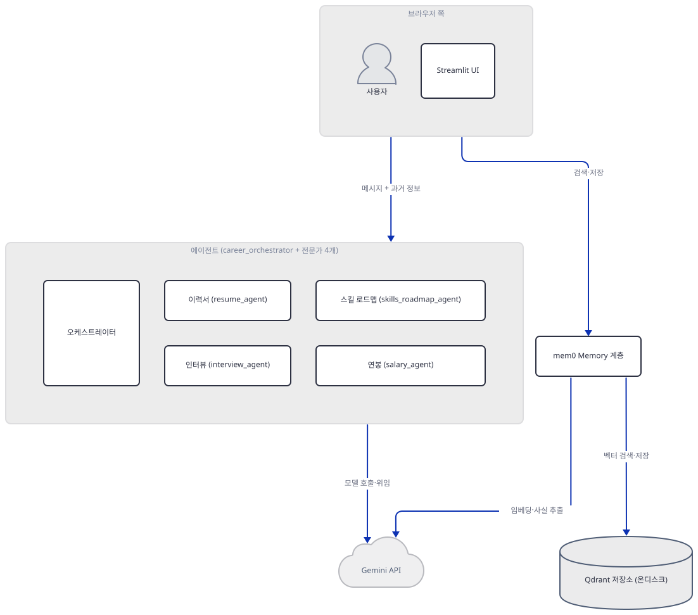
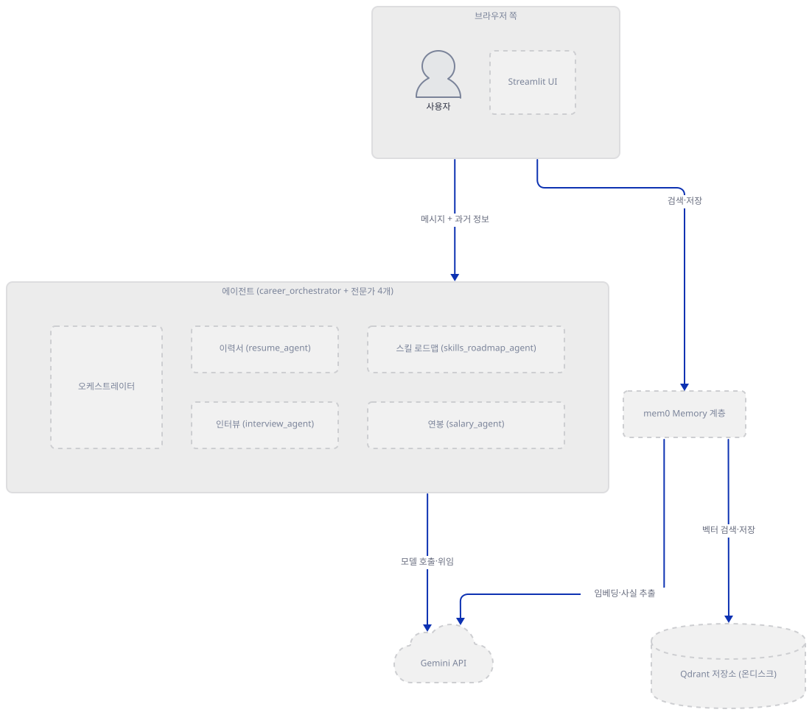
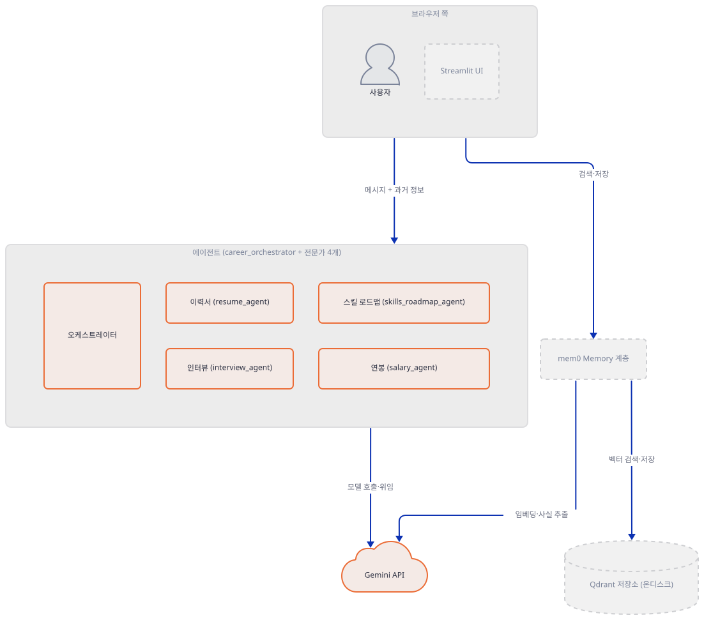
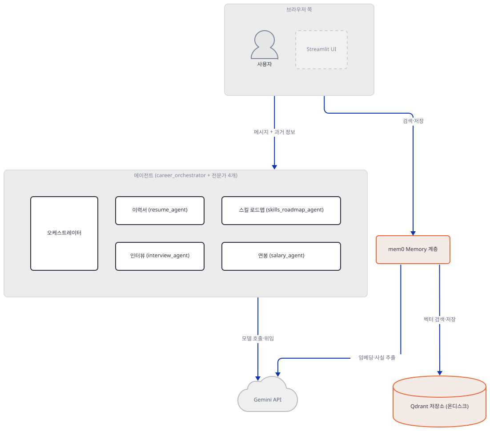
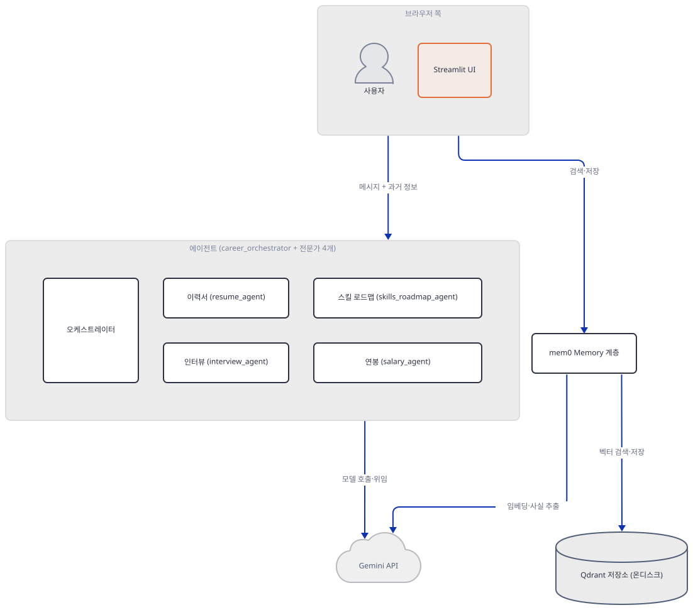
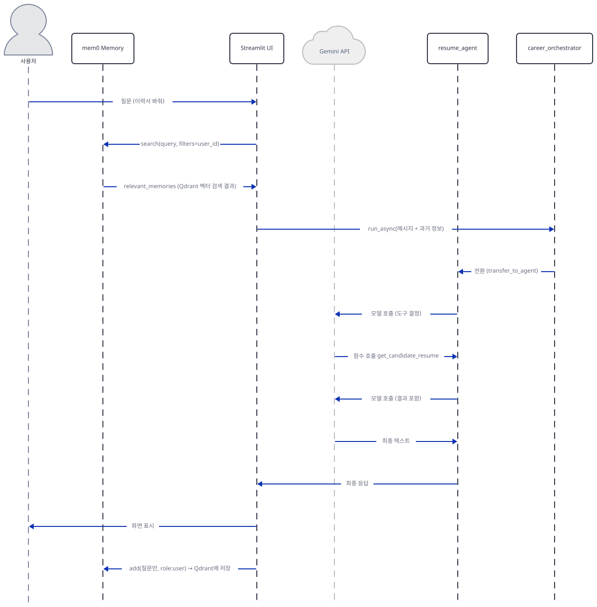
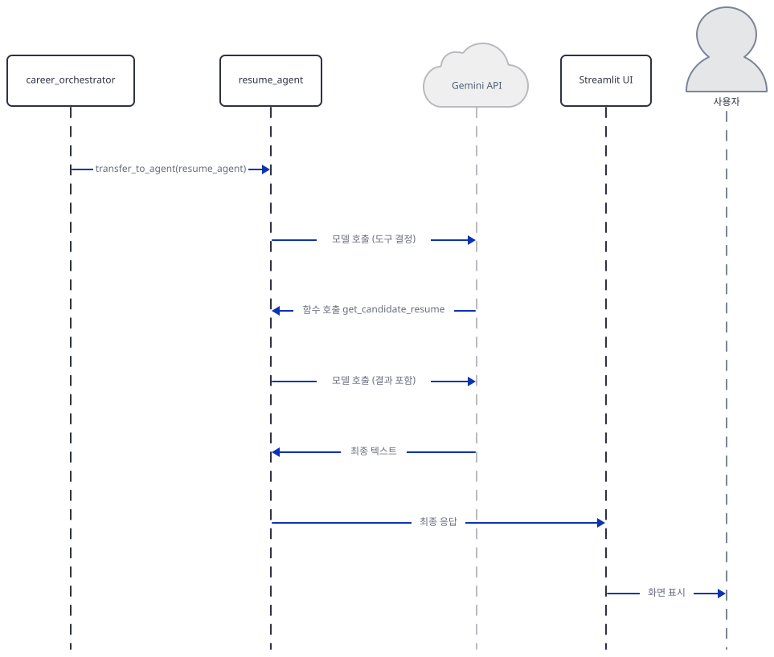
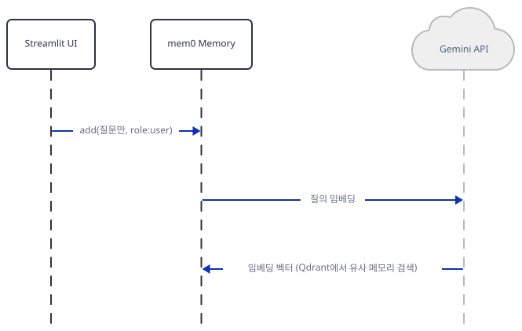
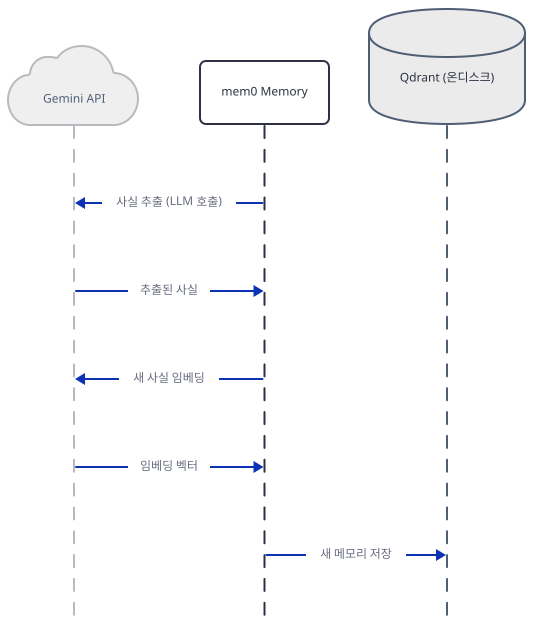

# Day 077 · 🎯 AI Career Coach with Memory (ADK Multi-Agent)

> 볼륨 6 💾 LLM Apps with Memory · 난이도 ★★☆ · 예상 소요 100분(Step 3·4에서 ADK가 자동으로 얹는 전환 지시문과 mem0의 두 겹 부작용을 각각 콜백·재현 명령으로 직접 증명하는 데 시간이 걸립니다) · API 비용 대략 $0.1 이하(이 문서는 실제 키·네트워크 호출 없이 대부분 로컬로 재현) · 원본 앱: `advanced_llm_apps/llm_apps_with_memory_tutorials/adk_career_coach_agent_memory`

## 오늘 만들 것

"💾 LLM Apps with Memory" 볼륨의 마지막 날입니다. `requirements.txt`로 이 볼륨의 mem0 버전을 비교하면: Day 072만 `mem0ai` 버전을 고정하지 않아(그날 리포트 기준 2.2.1이 깔림) 최신 라이브러리에 예전 코드(Qdrant config의 없는 필드, 최상위 `user_id=` 인자)가 안 맞아 깨졌고, Day 073·074·075·076은 전부 `mem0ai==0.1.29`로 그보다 훨씬 오래된 버전을 고정해 각자 다른 지점에서 깨졌습니다(073·075는 신버전 `qdrant-client`가 지운 `.search()`를 부르다 `AttributeError`, 074는 키를 환경변수로 넘기지 않아 `Memory.from_config` 자체가 `openai.OpenAIError`, 076은 Ollama provider가 요구하는 별도 패키지가 없어 실패). 오늘 앱(`adk_career_coach_agent_memory.py`, 312줄)은 `mem0ai==2.0.14`를 고정합니다 — 073~076의 0.1.29보다는 새롭지만 072가 받은 2.2.1보다는 이전 버전이고, 코드도 그 버전의 API(`filters=`, `top_k=`)에 맞춰 쓰여 있습니다. 여기에 `llm`·`embedder`를 둘 다 명시적으로 Gemini로, `vector_store`를 Docker 없는 온디스크 Qdrant로 지정한 결과, `Memory.from_config(...)`가 실제로 예외 없이 성공하고 `get_all()`도 이 앱이 기대하는 `{"results": [...]}` 형태를 그대로 돌려줍니다(직접 확인, Step 4). 이 볼륨에서 mem0 설정 자체가 처음으로 별 탈 없이 맞물리는 날입니다. 대신 오늘의 진짜 주제는 **Google ADK의 멀티 에이전트**입니다 — Day 021(`8_simple_multi_agent`)에서 `sub_agents=`(전환, 복귀 보장 없음)와 `AgentTool`(호출-복귀)이 서로 다른 메커니즘이라는 것을 소스와 실행으로 확인했는데, 오늘 `career_orchestrator`는 이력서·인터뷰·스킬 로드맵·연봉 네 전문가를 **전부 `sub_agents=`로만** 붙입니다 — `AgentTool`은 코드 어디에도 없습니다(그렙 확인). 즉 오늘 앱은 Day 021이 다룬 두 메커니즘 중 한쪽만 골라 쓴, 더 단순한 라우터입니다. 여기에 mem0 기억이 끼어드는 지점이 특이합니다 — Day 073·075도 검색 결과로 같은 "Relevant past information:\n- ..." 블록을 만들어 사용자 메시지에 붙이는 것은 같지만, 오늘 앱은 여기에 도구가 기대하는 `"Candidate email: ..."` 줄까지 더해(`format_memories`, 226-231행) ADK 메시지 형식에 맞춥니다. 기억을 쓰는 방향도 다릅니다: Day 073은 AI의 답변만, Day 075는 질문과 답변을 각각 별도로 `memory.add()`했지만, 오늘은 **후보자의 질문만** 저장합니다(308행) — 코드 주석이 그 이유를 "메모리는 후보자에 대한 사실만 담아야 하고, 호출을 절반으로 줄여 추출 비용도 아낀다"고 직접 밝힙니다. `import mem0` 한 줄만으로도 홈 디렉터리에 `~/.mem0/`가 생기고 PostHog로 익명 통계가 나가려 하는 것은 mem0ai 2.0.14도 마찬가지입니다(Day 073에서 이미 확인한 부작용과 같음) — 이 문서의 모든 명령은 `MEM0_DIR`·`MEM0_TELEMETRY=False`를 임포트 전에 지정해 재현합니다. `requirements.txt` 4줄(버전 고정은 `mem0ai`뿐)로 오늘(2026-09-28) 설치하면 **streamlit 1.64.0**, **google-adk 2.10.0**, **mem0ai 2.0.14**, **qdrant-client 1.19.1**이 받아지고 파일도 그대로 컴파일됩니다(직접 확인, Step 1). API 키 없이도 이 문서는 `Memory.from_config`가 실제로 어디서 멈추는지, 네 에이전트가 정말 전부 형제 `sub_agents`인지, 그리고 모델 응답을 흉내 낸 콜백으로 "질문 → 위임 → 도구 호출 → 답변"이 실제로 어떻게 흐르는지를 전부 직접 실행해 확인합니다. 완성하면 브라우저에는 Google API 키 입력창 하나, 사이드바의 이메일 입력과 "View my memory" 버튼, 그리고 채팅창이 뜹니다. 아래는 완성된 아키텍처입니다.



## 사전 준비

| 서비스/도구 | 용도 | 발급·설치 |
|---|---|---|
| Google API 키 (`GOOGLE_API_KEY`) | 네 에이전트의 `gemini-3.7-flash` 채팅, mem0 내부의 사실 추출(같은 모델)과 임베딩(`models/gemini-embedding-001`)까지 전부 이 키 하나로 커버 | https://aistudio.google.com/apikey 에서 발급, 화면의 "Enter Google API Key" 입력창에 붙여넣기 |
| uv | 가상환경 생성과 패키지 설치 | [공통 사전 준비](../README.md#공통-사전-준비-한-번만) 참고 |

Qdrant는 Docker나 별도 서버가 필요 없습니다 — `MEM0_CONFIG`가 `path="./qdrant_storage"`로 지정한 온디스크 모드라, 첫 실행 시 **현재 작업 폴더** 밑에 폴더가 자동으로 생깁니다(상대 경로이므로, 앱 폴더에서 `streamlit run`을 실행할 때만 스크립트 옆이 됩니다. 소스로 확인, Step 4).

## 아키텍처 한눈에 보기

| 컴포넌트 | 역할 | 코드 위치 |
|---|---|---|
| 사용자 (브라우저) | 이메일·질문 입력, 답변·사이드바 확인 | 코드 없음 (외부 UI) |
| Streamlit UI | 제목·키 입력·사이드바·채팅 렌더링 | `advanced_llm_apps/llm_apps_with_memory_tutorials/adk_career_coach_agent_memory/adk_career_coach_agent_memory.py:234-278` |
| `career_orchestrator` + Runner (ADK) | 메시지를 읽고 전문가 넷 중 하나에게 위임 | `advanced_llm_apps/llm_apps_with_memory_tutorials/adk_career_coach_agent_memory/adk_career_coach_agent_memory.py:119-223` |
| 전문가 에이전트 4개 (`LlmAgent` + 목업 도구) | 이력서·인터뷰·스킬·연봉 각각 답변 | `advanced_llm_apps/llm_apps_with_memory_tutorials/adk_career_coach_agent_memory/adk_career_coach_agent_memory.py:85-172` |
| mem0 Memory 계층 (Gemini LLM + Gemini 임베더) | 후보자별 과거 정보 검색·저장 | `advanced_llm_apps/llm_apps_with_memory_tutorials/adk_career_coach_agent_memory/adk_career_coach_agent_memory.py:19-37`, `advanced_llm_apps/llm_apps_with_memory_tutorials/adk_career_coach_agent_memory/adk_career_coach_agent_memory.py:208-215` |
| Qdrant 저장소 (온디스크) | 후보자별 메모리 벡터 저장 | `advanced_llm_apps/llm_apps_with_memory_tutorials/adk_career_coach_agent_memory/adk_career_coach_agent_memory.py:28-36` (config), 코드 없음 (로컬 폴더 `qdrant_storage/`) |
| Gemini API | 네 에이전트의 추론, mem0의 사실 추출·임베딩 | 코드 없음 (외부 서비스) |

## 단계별 진행

### Step 1. 환경 만들기 — `mem0ai`만 고정된 4줄

**목적.** 격리된 가상환경에 의존성을 설치하고, 파일이 그대로 컴파일되는지, 오늘 기준으로 어떤 버전이 받아지는지 확인합니다.

**할 일.**

```bash
cd advanced_llm_apps/llm_apps_with_memory_tutorials/adk_career_coach_agent_memory
uv venv
uv pip install -r requirements.txt
```

(bash·PowerShell 모두 이 세 줄은 글자까지 같습니다 — 환경변수 문법이 갈리는 명령부터 아래에 PowerShell 형태를 따로 둡니다.) (pip 대안: `python -m venv .venv && source .venv/bin/activate && pip install -r requirements.txt`. Windows PowerShell은 활성화만 `.venv\Scripts\Activate.ps1`로 바꿉니다.) 원본 앱 README는 이 자리에서 `pip install -r requirements.txt`를 그대로 안내하지만, `uv venv`로 새로 만든 가상환경에는 `pip`이 기본으로 들어 있지 않아 그대로 치면 `No module named pip`으로 실패합니다(Day 014에서 이미 확인한 것과 같은 원인) — 그래서 `uv pip install`을 씁니다. 이 저장소는 루트에 `pyproject.toml`이 있어 `uv run`이 방금 만든 환경 대신 루트 `.venv`를 쓰므로, 이후 `uv run` 명령에는 모두 `--no-project`를 붙입니다.

`advanced_llm_apps/llm_apps_with_memory_tutorials/adk_career_coach_agent_memory/requirements.txt:1-4`

```text
streamlit
google-adk
mem0ai==2.0.14
qdrant-client
```

4줄 중 버전이 고정된 것은 `mem0ai`뿐입니다. 이 문서를 쓰며 설치했을 때는 **streamlit 1.64.0**, **google-adk 2.10.0**, **mem0ai 2.0.14**, **qdrant-client 1.19.1**이 받아졌고, 의존성 충돌 경고는 없었습니다(직접 확인, 2026-09-28 기준).

**그림.**



**확인.**

```bash
uv run --no-project python -m py_compile adk_career_coach_agent_memory.py && echo compiled
MEM0_DIR="$(pwd)/.mem0_local" MEM0_TELEMETRY=False uv run --no-project python -c "
import streamlit, google.adk, mem0
import importlib.metadata as m
print('streamlit', streamlit.__version__)
print('google-adk', google.adk.__version__)
print('mem0ai', m.version('mem0ai'))
print('qdrant-client', m.version('qdrant-client'))
"
```

```powershell
uv run --no-project python -m py_compile adk_career_coach_agent_memory.py
if ($?) { echo "compiled" }
$env:MEM0_DIR = "$PWD\.mem0_local"
$env:MEM0_TELEMETRY = "False"
uv run --no-project python -c "<위와 같은 코드>"
```

`import mem0`는 이 한 줄만으로 홈 디렉터리에 `~/.mem0/`를 만들고 PostHog로 익명 통계를 보내려 합니다(mem0ai 2.0.14도 마찬가지, Day 073에서 이미 확인한 부작용) — 그래서 이 문서에서 mem0를 임포트하는 모든 명령은 `MEM0_DIR`·`MEM0_TELEMETRY=False`를 앞세웁니다.

직접 확인한 출력:

```
compiled
streamlit 1.64.0
google-adk 2.10.0
mem0ai 2.0.14
qdrant-client 1.19.1
```

### Step 2. 목업 데이터와 전문가별 도구 함수

**목적.** 네 전문가가 호출하는 함수 도구가 실제로는 하드코딩된 딕셔너리를 조회할 뿐이라는 것을 확인합니다. 함수를 그대로 도구로 쓰는 방식 자체는 Day 017(`4_2_function_tools`)에서 이미 다뤘으므로, 여기서는 이 앱의 데이터 모양만 봅니다.

**할 일.**

`advanced_llm_apps/llm_apps_with_memory_tutorials/adk_career_coach_agent_memory/adk_career_coach_agent_memory.py:85-90`

```python
def get_candidate_resume(candidate_email: str) -> dict:
    """Fetches the resume on file for a candidate (experience, current role, skills, bullet points)."""
    resume = MOCK_RESUMES.get(candidate_email.strip().lower())
    if resume:
        return {"status": "success", "candidate_email": candidate_email, "resume": resume}
    return {"status": "error", "message": f"No resume on file for {candidate_email}."}
```

나머지 세 함수(`get_practice_question`, `get_learning_resource`, `get_salary_benchmark`, `advanced_llm_apps/llm_apps_with_memory_tutorials/adk_career_coach_agent_memory/adk_career_coach_agent_memory.py:93-116`)도 같은 모양입니다 — 입력을 소문자로 정규화해 딕셔너리를 찾고, 없으면 `{"status": "error", ...}`를 돌려줍니다. 원본이 되는 딕셔너리 네 개(`MOCK_INTERVIEW_QUESTIONS`·`MOCK_LEARNING_RESOURCES`·`MOCK_SALARY_DATA`·`MOCK_RESUMES`, `advanced_llm_apps/llm_apps_with_memory_tutorials/adk_career_coach_agent_memory/adk_career_coach_agent_memory.py:40-82`)는 앱 README도 밝히듯 실제 이력서·문제은행·연봉 데이터를 대신하는 스텁입니다. 이 모듈에는 후보자가 `demo@example.com` 단 하나뿐입니다(`MOCK_RESUMES`).

**그림.**


**확인.**

```bash
GOOGLE_API_KEY= MEM0_DIR="$(pwd)/.mem0_local" MEM0_TELEMETRY=False uv run --no-project python -c "
from adk_career_coach_agent_memory import get_candidate_resume, get_practice_question
print(get_candidate_resume('demo@example.com'))
print(get_candidate_resume('nobody@example.com'))
print(get_practice_question('Amazon', 'System Design'))
"
```

```powershell
$env:GOOGLE_API_KEY = ""
$env:MEM0_DIR = "$PWD\.mem0_local"
$env:MEM0_TELEMETRY = "False"
uv run --no-project python -c "<위와 같은 코드>"
```

`adk_career_coach_agent_memory`를 임포트하면 최상단의 `from mem0 import Memory`(9행)도 함께 실행되므로, 이 명령을 포함해 이 모듈을 임포트하는 이 문서의 모든 명령은 `MEM0_DIR`·`MEM0_TELEMETRY=False`를 **임포트 전에** 지정합니다 — 안 그러면 `import mem0`가 홈 디렉터리에 `~/.mem0/`를 만들고 PostHog로 익명 통계를 보내려 합니다(Day 073에서 이미 확인). `GOOGLE_API_KEY=`를 빈 값으로 준 것도 같은 이유입니다: 값이 있으면 임포트 시점에 234-252행이 실행되어 `get_memory()`·`get_runner()`까지 함께 만들어집니다 — Step 4에서 이 부작용을 자세히 다룹니다.

직접 확인한 출력:

```
{'status': 'success', 'candidate_email': 'demo@example.com', 'resume': {'years_experience': 4, 'current_role': 'Backend Engineer', 'skills': ['Python', 'PostgreSQL', 'REST APIs', 'Docker'], 'bullet_points': ['Worked on the payments team maintaining backend services.', 'Helped onboard new engineers to the codebase.']}}
{'status': 'error', 'message': 'No resume on file for nobody@example.com.'}
{'status': 'success', 'company': 'Amazon', 'interview_type': 'System Design', 'question': 'Design a URL shortener that can handle millions of requests per day.'}
```

### Step 3. 전문가 네 명 + 오케스트레이터 — 전부 `sub_agents`

**목적.** `career_orchestrator`가 네 전문가를 붙이는 방식이 Day 021의 `sub_agents=`/`AgentTool` 중 어느 쪽인지, 그리고 그 결과 전환 대상이 실제로 어떻게 얽히는지 확인합니다.

**할 일.**

`advanced_llm_apps/llm_apps_with_memory_tutorials/adk_career_coach_agent_memory/adk_career_coach_agent_memory.py:121-135`

```python
    resume_agent = LlmAgent(
        name="resume_agent",
        model=MODEL,
        description="Reviews a candidate's resume and gives feedback tailored to a target role.",
        instruction=(
            "You help candidates improve their resume. Use the get_candidate_resume tool, "
            "passing the 'Candidate email' given in the message context, to fetch their resume "
            "on file. Then give specific, tailored suggestions based on their years of "
            "experience, current role, and skills versus the target role -- don't just restate "
            "the resume back to them. If the candidate also pastes a specific bullet point or "
            "section they're drafting, give feedback on that text directly, using the fetched "
            "resume as context for consistency and experience level."
        ),
        tools=[get_candidate_resume],
    )
```

`interview_agent`·`skills_roadmap_agent`·`salary_agent`(`advanced_llm_apps/llm_apps_with_memory_tutorials/adk_career_coach_agent_memory/adk_career_coach_agent_memory.py:137-172`)도 이름·모델·설명·지시문·도구 하나씩만 다른, 같은 모양의 `LlmAgent`입니다. 이 넷을 묶는 자리는 오케스트레이터뿐입니다.

`advanced_llm_apps/llm_apps_with_memory_tutorials/adk_career_coach_agent_memory/adk_career_coach_agent_memory.py:174-188`

```python
    career_orchestrator = LlmAgent(
        name="career_orchestrator",
        model=MODEL,
        description="Routes career coaching questions to the right specialist.",
        instruction=(
            "You are the first point of contact for a career coaching app. Read the "
            "candidate's message, including any 'Relevant past information' block included "
            "with it, and decide whether this is about resume feedback, interview practice, "
            "a skill gap/learning roadmap, or salary/negotiation. Delegate to the matching "
            "specialist. If it's genuinely unclear, ask a clarifying question yourself "
            "instead of guessing."
        ),
        sub_agents=[resume_agent, interview_agent, skills_roadmap_agent, salary_agent],
    )
    return career_orchestrator
```

`AgentTool`은 이 파일 어디에도 임포트되지 않습니다(그렙 확인) — Day 021의 `research_agent`(`AgentTool`, 호출-복귀)와 달리, 오늘 네 전문가는 전부 Day 021의 `summarizer_agent`·`critic_agent`와 같은 부류(전환, 복귀 보장 없음)입니다. 실제로 ADK 객체를 만들어 `google.adk.flows.llm_flows.agent_transfer._get_transfer_targets`로 확인하면, 네 전문가는 전부 `career_orchestrator`를 부모로 두고 **서로가 서로의 전환 대상**입니다. 앱의 지시문 어디에도 "부모에게 돌아가라"는 문장은 없지만(그렙 확인), 되돌아갈 수단이 없다는 뜻은 아닙니다 — 전환 대상이 있는 에이전트에게는 ADK가 매 요청마다 `transfer_to_agent` 도구와 함께 전환 지시문을 자동으로 덧붙이고, 그 지시문 자체에 "당신도 다른 에이전트도 적합하지 않다면 부모 에이전트 `career_orchestrator`에게 넘기라"는 문장이 들어 있습니다(google-adk 2.10.0 소스 `flows/llm_flows/extensions/_agent_transfer.py`로 확인). 즉 부모나 동료에게 넘길지는 앱 지시문이 아니라 이 자동 지시문을 본 모델이 그때그때 정하는 것이고, 키 없이는 실제로 어느 쪽으로 결정되는지 확인할 수 없습니다.

**그림.**



**확인.** 먼저 키 없이 에이전트 트리와 전환 대상을 확인합니다.

```bash
GOOGLE_API_KEY= MEM0_DIR="$(pwd)/.mem0_local" MEM0_TELEMETRY=False uv run --no-project python -c "
from google.adk.flows.llm_flows.agent_transfer import _get_transfer_targets
from adk_career_coach_agent_memory import build_career_orchestrator

root = build_career_orchestrator()
print('root:', root.name, '| sub_agents:', [a.name for a in root.sub_agents])
for a in root.sub_agents:
    print(' -', a.name, '| parent:', a.parent_agent.name,
          '| transfer targets:', [t.name for t in _get_transfer_targets(a)])
"
```

```powershell
$env:GOOGLE_API_KEY = ""
$env:MEM0_DIR = "$PWD\.mem0_local"
$env:MEM0_TELEMETRY = "False"
uv run --no-project python -c "<위와 같은 코드>"
```

직접 확인한 출력:

```
root: career_orchestrator | sub_agents: ['resume_agent', 'interview_agent', 'skills_roadmap_agent', 'salary_agent']
 - resume_agent | parent: career_orchestrator | transfer targets: ['career_orchestrator', 'interview_agent', 'skills_roadmap_agent', 'salary_agent']
 - interview_agent | parent: career_orchestrator | transfer targets: ['career_orchestrator', 'resume_agent', 'skills_roadmap_agent', 'salary_agent']
 - skills_roadmap_agent | parent: career_orchestrator | transfer targets: ['career_orchestrator', 'resume_agent', 'interview_agent', 'salary_agent']
 - salary_agent | parent: career_orchestrator | transfer targets: ['career_orchestrator', 'resume_agent', 'interview_agent', 'skills_roadmap_agent']
```

이어서, `resume_agent`가 실제로 받는 요청에 자동 전환 지시문이 실려 있는지도 확인합니다. 두 에이전트의 `before_model_callback`으로 실제 모델 호출을 가짜 응답으로 바꿔치기해(Step 5와 같은 기법) 진짜 요청은 전혀 보내지 않습니다.

```bash
GOOGLE_API_KEY= MEM0_DIR="$(pwd)/.mem0_local2" MEM0_TELEMETRY=False uv run --no-project python -c "
import asyncio
from google.adk.models.llm_response import LlmResponse
from google.adk.runners import Runner
from google.adk.sessions import InMemorySessionService
from google.genai import types
from adk_career_coach_agent_memory import build_career_orchestrator, APP_NAME

root = build_career_orchestrator()
resume_agent = next(a for a in root.sub_agents if a.name == 'resume_agent')
captured = {}
def peek(ctx, req):
    instr = req.config.system_instruction or ''
    captured['has_parent_transfer_line'] = 'transfer to your parent agent career_orchestrator' in instr
    captured['tools'] = sorted(req.tools_dict.keys())
    return LlmResponse(content=types.Content(role='model', parts=[types.Part(text='stub')]))
resume_agent.before_model_callback = peek

async def main():
    session_service = InMemorySessionService()
    runner = Runner(agent=root, app_name=APP_NAME, session_service=session_service)
    await session_service.create_session(app_name=APP_NAME, user_id='u', session_id='s')
    def root_cb(ctx, req):
        fc = types.FunctionCall(name='transfer_to_agent', args={'agent_name': 'resume_agent'})
        return LlmResponse(content=types.Content(role='model', parts=[types.Part(function_call=fc)]))
    root.before_model_callback = root_cb
    msg = types.Content(role='user', parts=[types.Part(text='hi')])
    async for _ in runner.run_async(user_id='u', session_id='s', new_message=msg):
        pass
    print('resume_agent tools offered:', captured['tools'])
    print('resume_agent instruction has parent-transfer line:', captured['has_parent_transfer_line'])

asyncio.run(main())
"
```

직접 확인한 출력:

```
resume_agent tools offered: ['get_candidate_resume', 'transfer_to_agent']
resume_agent instruction has parent-transfer line: True
```

즉 `resume_agent`가 실제로 받는 시스템 지시문에는 (앱이 쓰지 않은) "If neither you nor the other agents are best for the question, transfer to your parent agent career_orchestrator."라는 문장이 ADK에 의해 자동으로 들어 있습니다.

### Step 4. mem0 메모리 계층 — Gemini 하나로 LLM·임베더·저장소까지

**목적.** `MEM0_CONFIG`가 무엇을 지정하는지, 그리고 키가 없을 때 정확히 어느 줄에서 어떤 예외가 나는지 확인합니다.

**할 일.**

`advanced_llm_apps/llm_apps_with_memory_tutorials/adk_career_coach_agent_memory/adk_career_coach_agent_memory.py:19-37`

```python
MEM0_CONFIG = {
    "llm": {
        "provider": "gemini",
        "config": {"model": MODEL, "temperature": 0.2},
    },
    "embedder": {
        "provider": "gemini",
        "config": {"model": "models/gemini-embedding-001", "embedding_dims": 768},
    },
    "vector_store": {
        "provider": "qdrant",
        "config": {
            "collection_name": "adk_career_coach",
            "path": "./qdrant_storage",
            "embedding_model_dims": 768,
            "on_disk": True,
        },
    },
}
```

`llm`·`embedder`를 둘 다 `"gemini"`로 명시했으므로 mem0는 OpenAI 기본값(Day 072·073·075가 썼던 조합) 대신 `mem0/llms/gemini.py`·`mem0/embeddings/gemini.py`(mem0ai 2.0.14 패키지 소스로 확인)를 씁니다. 이 두 클래스는 생성 시점에 곧바로 `genai.Client(api_key=...)`를 만듭니다 — Day 014에서 본 ADK 쪽 지연 검증(모델을 실제로 호출할 때만 키를 확인)과 달리, mem0 쪽은 `Memory.from_config(...)` 호출 **그 자리**에서 키를 확인합니다.

`advanced_llm_apps/llm_apps_with_memory_tutorials/adk_career_coach_agent_memory/adk_career_coach_agent_memory.py:208-215`

```python
@st.cache_resource
def get_memory() -> Memory:
    # Embedded/on-disk Qdrant only allows one open client per storage path
    # per process (it takes a file lock) -- cache_resource makes this a
    # single instance shared by every browser session on this server,
    # instead of one per session, which would crash the 2nd concurrent
    # user with "Storage folder ... already accessed by another instance".
    return Memory.from_config(MEM0_CONFIG)
```

`@st.cache_resource`는 이 함수를 프로세스당 한 번만 실행해 결과를 재사용합니다 — 주석이 밝히듯, 온디스크 Qdrant는 저장 경로마다 파일 잠금을 하나만 허용하므로 세션마다 새로 만들면 두 번째 사용자부터 충돌합니다.

**그림.**



**확인.** `GOOGLE_API_KEY`를 지정하지 않고 `Memory.from_config`만 호출해, 어느 컴포넌트가 먼저 실패하는지 봅니다(프록시로 외부 네트워크를 막았고, 생성자만 부르며 실제 요청 메서드는 부르지 않았습니다). `import mem0`는 그 자체로 홈 디렉터리에 `~/.mem0/`를 만들고 PostHog로 익명 통계를 보내려 하므로(Day 073에서 이미 확인한 것과 같은 부작용), 아래 모든 명령은 `MEM0_DIR`·`MEM0_TELEMETRY=False`를 **임포트 전에** 지정합니다. `GOOGLE_API_KEY=`를 빈 값으로 명시한 것은 독자의 셸에 이미 이 변수가 남아 있을 수 있기 때문입니다 — 값이 있으면 `adk_career_coach_agent_memory`를 임포트하는 순간 248-252행이 실행되어 `get_memory()`가 먼저 온디스크 Qdrant를 열어 버리므로, 아래에서 기대하는 `ValueError` 대신 곧 볼 잠금 충돌이 먼저 납니다.

```bash
GOOGLE_API_KEY= MEM0_DIR="$(pwd)/.mem0_local" MEM0_TELEMETRY=False HTTP_PROXY=http://127.0.0.1:9 HTTPS_PROXY=http://127.0.0.1:9 uv run --no-project python -c "
from mem0 import Memory
from adk_career_coach_agent_memory import MEM0_CONFIG
Memory.from_config(MEM0_CONFIG)
"
```

```powershell
$env:GOOGLE_API_KEY = ""
$env:MEM0_DIR = "$PWD\.mem0_local"
$env:MEM0_TELEMETRY = "False"
$env:HTTP_PROXY = "http://127.0.0.1:9"
$env:HTTPS_PROXY = "http://127.0.0.1:9"
uv run --no-project python -c "<위와 같은 코드>"
```

직접 확인한 출력(발췌 — 트레이스백은 `mem0/embeddings/gemini.py`의 `genai.Client(api_key=api_key)`에서 끝남):

```
File "...\mem0\memory\main.py", line 466, in __init__
  self.embedding_model = EmbedderFactory.create(...)
File "...\mem0\embeddings\gemini.py", line 20, in __init__
  self.client = genai.Client(api_key=api_key)
ValueError: No API key was provided. Please pass a valid API key. ...
```

`llm`이 아니라 **임베더**가 먼저 만들어지다가 멈춥니다(`mem0/memory/main.py`의 `__init__` 순서, 패키지 소스로 확인). 화면에서 비어 있지 않은 아무 문자열이나(가짜 키) 입력하면 이 지점은 통과합니다 — `genai.Client`는 키의 형식이나 유효성을 생성 시점에 검사하지 않기 때문입니다.

여기서부터가 이 스텝의 진짜 함정입니다: `GOOGLE_API_KEY`가 있는 채로 `adk_career_coach_agent_memory`를 다시 **임포트**하면, 234-252행의 최상위 코드가 그대로 실행되어 `get_memory()`(→`Memory.from_config(MEM0_CONFIG)`)와 `get_runner()`가 이미 한 번 불립니다 — 즉 임포트 자체가 온디스크 Qdrant 클라이언트를 엽니다. 그 상태에서 같은 경로로 `Memory.from_config`를 **또** 부르면 두 번째 클라이언트가 되어 실패합니다(직접 확인):

```bash
GOOGLE_API_KEY=fake-key-123 MEM0_DIR="$(pwd)/.mem0_local" MEM0_TELEMETRY=False HTTP_PROXY=http://127.0.0.1:9 HTTPS_PROXY=http://127.0.0.1:9 uv run --no-project python -c "
from mem0 import Memory
from adk_career_coach_agent_memory import MEM0_CONFIG
Memory.from_config(MEM0_CONFIG)
"
```

```
File "...\qdrant_client\local\qdrant_local.py", line 173, in _load
    raise RuntimeError(
RuntimeError: Storage folder ./qdrant_storage is already accessed by another instance of Qdrant client. If you require concurrent access, use Qdrant server instead.
```

그러니 이미 만들어진 인스턴스를 다시 만들지 말고, 임포트가 이미 준비해 둔 `app.memory`를 그대로 씁니다:

```bash
GOOGLE_API_KEY=fake-key-123 MEM0_DIR="$(pwd)/.mem0_local2" MEM0_TELEMETRY=False HTTP_PROXY=http://127.0.0.1:9 HTTPS_PROXY=http://127.0.0.1:9 uv run --no-project python -c "
import adk_career_coach_agent_memory as app
print('Memory OK:', type(app.memory).__name__)
print(app.memory.get_all(filters={'user_id': 'demo@example.com'}))
"
```

```powershell
$env:GOOGLE_API_KEY = "fake-key-123"
$env:MEM0_DIR = "$PWD\.mem0_local2"
$env:MEM0_TELEMETRY = "False"
$env:HTTP_PROXY = "http://127.0.0.1:9"
$env:HTTPS_PROXY = "http://127.0.0.1:9"
uv run --no-project python -c "<위와 같은 코드>"
```

직접 확인한 출력:

```
Memory OK: Memory
{'results': []}
```

`get_all(filters={"user_id": ...})`은 아직 메모리가 없을 때 `{"results": []}`를 돌려줍니다 — 사이드바 코드(`(memories or {}).get("results") or []`)가 기대하는 바로 그 형태입니다. 현재 작업 폴더에는 `qdrant_storage/`(`.lock`·`collection/`·`meta.json`)가 실제로 생겼습니다(직접 확인). 실제 벡터 검색·임베딩·사실 추출은 Gemini API에 진짜 요청을 보내야 하므로 이 문서에서는 호출하지 않았습니다.

### Step 5. ADK Runner·세션과 호출 헬퍼

**목적.** `Runner`와 `InMemorySessionService`가 어떻게 만들어지고, 채팅 한 번이 이 둘을 통해 어떻게 텍스트로 바뀌는지 확인합니다.

**할 일.**

`advanced_llm_apps/llm_apps_with_memory_tutorials/adk_career_coach_agent_memory/adk_career_coach_agent_memory.py:191-205`

```python
async def ensure_session(session_service, user_id, session_id):
    await session_service.create_session(app_name=APP_NAME, user_id=user_id, session_id=session_id)


async def call_agent(runner, user_id, session_id, message_text) -> str:
    content = types.Content(role="user", parts=[types.Part(text=message_text)])
    final_text = ""
    async for event in runner.run_async(user_id=user_id, session_id=session_id, new_message=content):
        if event.is_final_response() and event.content and event.content.parts:
            final_text = event.content.parts[0].text
    return final_text


def run_agent_sync(runner, user_id, session_id, message_text) -> str:
    return asyncio.run(call_agent(runner, user_id, session_id, message_text))
```

`call_agent`는 이벤트 스트림을 끝까지 순회하며 `is_final_response()`인 이벤트의 텍스트만 남깁니다 — 중간에 전환이 몇 번 일어나든, Day 021에서 본 것처럼 **마지막으로 응답한 에이전트**의 텍스트가 결과가 됩니다. Streamlit 스크립트의 최상단(Step 6·7에서 보는 부분)은 동기 코드로 실행되므로, 비동기 함수인 `call_agent`를 그 자리에서 바로 부를 수 없습니다 — `run_agent_sync`가 `asyncio.run`으로 감싸는 이유입니다.

`advanced_llm_apps/llm_apps_with_memory_tutorials/adk_career_coach_agent_memory/adk_career_coach_agent_memory.py:218-223`

```python
@st.cache_resource
def get_runner():
    career_orchestrator = build_career_orchestrator()
    session_service = InMemorySessionService()
    runner = Runner(agent=career_orchestrator, app_name=APP_NAME, session_service=session_service)
    return runner, session_service
```

`get_memory()`와 마찬가지로 프로세스당 한 번만 만들어져 모든 브라우저 세션이 같은 `Runner`·`SessionService`를 공유합니다 — `InMemorySessionService`이므로 대화 기록 자체는 서버가 살아 있는 동안만 유지되는 짧은 기억이고, 후보자에 대한 긴 기억은 Step 4의 mem0가 따로 맡습니다.

**그림.**


**확인.** 콜백으로 모델 응답을 흉내 내(Day 021과 같은 기법, 실제 요청 없음) `resume_agent`가 도구를 부르고 끝까지 답하는 왕복을 직접 실행합니다.

```bash
PYTHONUNBUFFERED=1 GOOGLE_API_KEY= MEM0_DIR="$(pwd)/.mem0_local3" MEM0_TELEMETRY=False uv run --no-project python -c "
import asyncio
from google.adk.models.llm_response import LlmResponse
from google.adk.runners import Runner
from google.adk.sessions import InMemorySessionService
from google.genai import types
from adk_career_coach_agent_memory import build_career_orchestrator, ensure_session, call_agent, APP_NAME

def fn_call(name, args):
    return types.Content(role='model', parts=[types.Part(function_call=types.FunctionCall(name=name, args=args))])
def text(t):
    return types.Content(role='model', parts=[types.Part(text=t)])

async def main():
    root = build_career_orchestrator()
    resume_agent = next(a for a in root.sub_agents if a.name == 'resume_agent')
    calls = {'root': 0, 'resume': 0}
    def root_cb(ctx, req):
        calls['root'] += 1
        return LlmResponse(content=fn_call('transfer_to_agent', {'agent_name': 'resume_agent'}))
    def resume_cb(ctx, req):
        calls['resume'] += 1
        if calls['resume'] == 1:
            return LlmResponse(content=fn_call('get_candidate_resume', {'candidate_email': 'demo@example.com'}))
        return LlmResponse(content=text('Your 4 years as a Backend Engineer line up well; tighten the payments bullet.'))
    root.before_model_callback = root_cb
    resume_agent.before_model_callback = resume_cb
    session_service = InMemorySessionService()
    runner = Runner(agent=root, app_name=APP_NAME, session_service=session_service)
    await ensure_session(session_service, 'demo@example.com', 'session-demo@example.com')
    answer = await call_agent(runner, 'demo@example.com', 'session-demo@example.com', 'Candidate email: demo@example.com\nCandidate says: review my resume')
    print('FINAL ANSWER:', answer)

asyncio.run(main())
"
```

```powershell
$env:PYTHONUNBUFFERED = "1"
$env:GOOGLE_API_KEY = ""
$env:MEM0_DIR = "$PWD\.mem0_local3"
$env:MEM0_TELEMETRY = "False"
uv run --no-project python -c "<위와 같은 코드>"
```

직접 확인한 출력:

```
FINAL ANSWER: Your 4 years as a Backend Engineer line up well; tighten the payments bullet.
```

### Step 6. Streamlit 뼈대 — 키 게이트와 사이드바

**목적.** 키를 입력하기 전과 후 화면이 어떻게 다른지, 그리고 사이드바의 "View my memory"가 무엇을 보여주는지 확인합니다.

**할 일.**

`advanced_llm_apps/llm_apps_with_memory_tutorials/adk_career_coach_agent_memory/adk_career_coach_agent_memory.py:234-252`

```python
# --- Streamlit app ---
st.title("🎯 AI Career Coach (ADK Multi-Agent + Memory)")
st.caption(
    "An orchestrator agent routes your question to a resume, interview, skills, "
    "or salary specialist (Google ADK), while Mem0 + Qdrant remember your career "
    "history across sessions."
)

google_api_key = st.text_input(
    "Enter Google API Key (for Gemini)",
    type="password",
    value=os.getenv("GOOGLE_API_KEY", ""),
)

if google_api_key:
    os.environ["GOOGLE_API_KEY"] = google_api_key

    memory = get_memory()
    runner, session_service = get_runner()
```

키를 입력하는 순간 `os.environ["GOOGLE_API_KEY"]`에 그대로 반영되고, 곧바로 `get_memory()`가 불립니다 — Step 4에서 본 대로 이 한 줄은 (비어 있지 않은 아무 문자열이라도) 성공하고, 정말 비어 있으면 여기서 `ValueError`가 납니다.

`advanced_llm_apps/llm_apps_with_memory_tutorials/adk_career_coach_agent_memory/adk_career_coach_agent_memory.py:254-277`

```python
    st.sidebar.title("Candidate")
    previous_user_id = st.session_state.get("previous_user_id")
    user_id = st.sidebar.text_input("Your email", value="demo@example.com")

    if user_id != previous_user_id:
        st.session_state.messages = []
        st.session_state.previous_user_id = user_id
        st.session_state.pop("session_ready", None)

    if st.sidebar.button("View my memory"):
        memories = memory.get_all(filters={"user_id": user_id})
        results = (memories or {}).get("results") or []
        if results:
            for mem in results:
                st.sidebar.write(f"- {mem['memory']}")
        else:
            st.sidebar.info("No memory on file for you yet.")

    if "messages" not in st.session_state:
        st.session_state.messages = []

    for message in st.session_state.messages:
        with st.chat_message(message["role"]):
            st.markdown(message["content"])
```

이메일(`user_id`)은 로그인이 아니라 그냥 텍스트 입력창입니다(Day 073에서 이미 확인한 것과 같은 패턴) — 이메일을 바꾸면 대화 기록만 새로 시작하고, mem0의 기억은 `user_id` 문자열이 같으면 그대로 이어집니다.

**그림.**



**확인.** 파일을 임포트하지 않고 소스를 AST로 파싱해 `st.title(...)` 호출 문자열만 뽑습니다(Streamlit 서버도, 모듈 임포트도 하지 않으므로 mem0 부작용이 없습니다). `n.func.value`가 `st` 자신인 호출만 걸러야 합니다 — 그냥 `attr == 'title'`로만 거르면 254행의 `st.sidebar.title("Candidate")`까지 같이 걸립니다.

```bash
PYTHONIOENCODING=utf-8 uv run --no-project python -c "
import ast
src = open('adk_career_coach_agent_memory.py', encoding='utf-8').read()
tree = ast.parse(src)
titles = [
    n.args[0].value for n in ast.walk(tree)
    if isinstance(n, ast.Call) and getattr(n.func, 'attr', None) == 'title'
    and isinstance(n.func.value, ast.Name) and n.func.value.id == 'st'
]
print('st.title 호출 문자열:', titles)
"
```

```powershell
$env:PYTHONIOENCODING = "utf-8"
uv run --no-project python -c "<위와 같은 코드>"
```

직접 확인한 출력:

```
st.title 호출 문자열: ['🎯 AI Career Coach (ADK Multi-Agent + Memory)']
```

여기까지 뼈대가 갖춰졌으니, 실제로 앱을 띄우는 명령도 확인합니다.

```bash
uv run --no-project streamlit run adk_career_coach_agent_memory.py
```

이 명령을 그대로 실행하면 브라우저 탭이 자동으로 열리고 제목과 "Enter Google API Key" 입력창이 뜹니다 — 이 문서는 브라우저를 열 수 없어 같은 명령에 헤드리스 옵션만 더해, 다른 에이전트와 포트가 겹치지 않는 임의의 높은 포트(61437, 49152~65535 범위)로 직접 확인했습니다.

```bash
uv run --no-project streamlit run adk_career_coach_agent_memory.py --server.headless true --server.port 61437 --server.address localhost
```

`--server.address localhost`가 없으면 헤드리스 시작 배너가 외부 IP를 조회하려고 `checkip.amazonaws.com`에 요청을 보냅니다(Day 060에서 이미 확인한 동작) — 이 문서는 그 요청도 함께 막았습니다. 직접 확인한 콘솔 출력(키 없이도 서버는 뜹니다 — 브라우저에서 열면 "Please enter your Google API key to continue." 화면만 보입니다):

```
Collecting usage statistics. To deactivate, set browser.gatherUsageStats to false.

Uvicorn server started on localhost:61437

  You can now view your Streamlit app in your browser.

  URL: http://localhost:61437
```

확인이 끝나면 이 프로세스는 반드시 종료합니다(`Ctrl+C`, 또는 이 문서처럼 백그라운드로 띄웠다면 해당 PID를 종료).

### Step 7. 채팅 처리 — 검색 → 위임 → 응답 → 저장

**목적.** 메시지 한 번이 mem0 검색부터 저장까지 정확히 어떤 순서로 지나가는지, 그리고 왜 사용자의 질문만 저장되는지 확인합니다.

**할 일.**

`advanced_llm_apps/llm_apps_with_memory_tutorials/adk_career_coach_agent_memory/adk_career_coach_agent_memory.py:279-294`

```python
    prompt = st.chat_input("Ask about your resume, an interview, a skill, or salary...")

    if prompt and user_id:
        session_id = f"session-{user_id}"
        if not st.session_state.get("session_ready"):
            asyncio.run(ensure_session(session_service, user_id, session_id))
            st.session_state.session_ready = True

        st.session_state.messages.append({"role": "user", "content": prompt})
        with st.chat_message("user"):
            st.markdown(prompt)

        # Long-term memory: pull what Mem0 knows about this candidate before routing.
        relevant_memories = memory.search(query=prompt, filters={"user_id": user_id}, top_k=5)
        context = format_memories(relevant_memories)
        full_message = f"Candidate email: {user_id}\n{context}\nCandidate says: {prompt}"
```

`memory.search(..., filters={"user_id": user_id}, top_k=5)`는 mem0ai 2.0.14의 현재 API를 그대로 씁니다 — `filters=` 딕셔너리 인자는 Day 073이 재현했던 옛 mem0ai 0.1.29의 최상위 `user_id=` 인자와 다르고, `top_k=`는 Day 072가 재현했던, 최신 mem0ai가 거부하는 `user_id=`+`limit=` 조합과도 다릅니다. `format_memories`(226-231행)가 이 결과를 "Relevant past information:" 블록으로 다듬고, 최종 메시지에 이메일·과거 정보·질문을 한 문자열로 합칩니다.

`advanced_llm_apps/llm_apps_with_memory_tutorials/adk_career_coach_agent_memory/adk_career_coach_agent_memory.py:296-312`

```python
        with st.chat_message("assistant"):
            with st.spinner("Routing to the right specialist..."):
                answer = run_agent_sync(runner, user_id, session_id, full_message)
            st.markdown(answer)
        st.session_state.messages.append({"role": "assistant", "content": answer})

        # Write this exchange back to long-term memory for future sessions.
        # Only the candidate's own message goes in: one memory.add() call
        # instead of two (half the extraction latency/cost, since infer=True
        # runs an LLM call per add()), and the fact store stays candidate
        # facts only -- the coach's own advice text never gets treated as a
        # fact about the candidate.
        memory.add(prompt, user_id=user_id, metadata={"role": "user"})
    elif not user_id:
        st.error("Please enter your email to start chatting.")
else:
    st.warning("Please enter your Google API key to continue.")
```

`memory.add(prompt, ...)`는 `answer`가 아니라 `prompt`만 저장합니다 — 주석이 밝히듯 "후보자에 대한 사실"만 장기 기억에 남기려는 의도적인 선택이고, 호출도 한 번뿐이라 `infer=True`가 매 `add()`마다 돌리는 LLM 추출 호출도 절반입니다. Day 073(답변만 저장)·Day 075(질문·답변 각각 저장)와 비교하면 오늘 앱이 세 번째 선택지를 씁니다.

**그림.**


**확인.** `format_memories`가 검색 결과 유무에 따라 어떤 문자열을 만드는지 직접 봅니다.

```bash
GOOGLE_API_KEY= MEM0_DIR="$(pwd)/.mem0_local4" MEM0_TELEMETRY=False uv run --no-project python -c "
from adk_career_coach_agent_memory import format_memories
print(repr(format_memories({'results': [{'memory': 'targets fintech backend roles'}, {'memory': 'weak at system design interviews'}]})))
print(repr(format_memories({'results': []})))
"
```

```powershell
$env:GOOGLE_API_KEY = ""
$env:MEM0_DIR = "$PWD\.mem0_local4"
$env:MEM0_TELEMETRY = "False"
uv run --no-project python -c "<위와 같은 코드>"
```

직접 확인한 출력:

```
'Relevant past information:\n- targets fintech backend roles\n- weak at system design interviews\n'
''
```

## 요청 한 건이 흐르는 과정



사용자가 채팅창에 질문을 보내면, Streamlit UI는 곧바로 mem0 Memory에 `search(query, filters={"user_id": ...})`를 호출합니다. mem0는 먼저 질의를 Gemini로 임베딩한 뒤 그 벡터로 Qdrant에서 관련 메모리를 찾아 돌려주고(Step 4), UI는 이를 `format_memories`로 다듬어 질문과 합친 메시지를 `career_orchestrator`의 Runner에 넘깁니다. 오케스트레이터는 자신의 Gemini 모델 호출로 어느 전문가가 맡을지 정하고, Gemini는 `transfer_to_agent` 함수 호출로 응답합니다.



Day 021에서 확인했듯 이 전환에는 복귀 보장이 없고, 앱 지시문에도 되돌아가라는 문장은 없습니다. 다만 Step 3에서 확인했듯 ADK가 `resume_agent`에게 자동으로 얹는 지시문 자체에 "적합하지 않으면 부모 `career_orchestrator`에게 넘기라"는 문장이 있어, 실제로 되돌아갈지는 모델의 판단에 달려 있습니다(키가 없어 이 문서에서는 확인하지 못했습니다). 위 그림은 이력서 질문이 끝까지 `resume_agent`에 머무는 경우를 보여줍니다: 이 에이전트는 먼저 도구 호출을 결정하는 모델 호출을 하고, ADK가 로컬 함수 `get_candidate_resume`을 실행한 뒤, 그 결과를 포함한 두 번째 모델 호출로 최종 텍스트를 얻습니다. 이 텍스트가 그대로 UI에 최종 응답으로 돌아가 화면에 표시됩니다. 오케스트레이터에서 `resume_agent`로 넘어가는 시점을 그림 두 장으로 나눈 것은 그 전환이 실제로 제어가 넘어가는 경계이기 때문입니다.



화면 표시가 끝난 뒤에도 왕복이 남아 있습니다 — 사용자 입장에서는 이미 답을 본 뒤에 조용히 일어나는, 응답과는 다른 시간대의 일이라 별도 그림으로 뗐습니다. UI는 사용자의 **질문만**(응답은 제외) `memory.add()`로 mem0에 넘기고, mem0ai 2.0.14의 `add(infer=True)`는 소스로 확인한 순서 그대로 움직입니다(`mem0/memory/main.py`): 가장 먼저 질의를 Gemini로 임베딩합니다.



이 벡터로 Qdrant에서 비슷한 기존 메모리가 있는지 검색한 뒤(중복 방지), Gemini에 한 번 더 요청해 이번 메시지에서 실제로 저장할 만한 사실을 추출하고(LLM 호출 1회), 추출된 사실 텍스트를 다시 Gemini로 임베딩한 뒤에야 Qdrant에 새 메모리로 저장합니다 — Gemini API 왕복이 세 번(검색용 임베딩·LLM 추출·저장용 임베딩), Qdrant 왕복이 두 번(검색·저장)인 다섯 단계입니다. 다음에 같은 사용자가 관련 질문을 하면 이 사실이 검색 결과에 포함됩니다. Step 3·4·5에서 확인했듯 이 문서는 가짜 키와 콜백 스텁으로 `Memory.from_config`·에이전트 구조·요청 안에 실리는 지시문까지만 재현했고, 실제 Gemini 응답·임베딩 요청은 보내지 않았습니다.

## 실행 체크리스트

- [ ] `uv venv && uv pip install -r requirements.txt`(원본 README의 `pip install`이 아니라)로 4개 패키지가 설치되고 파일이 그대로 컴파일된다는 것을 확인했다
- [ ] 네 전문가 에이전트가 전부 `sub_agents=`로만 붙고 `AgentTool`은 쓰지 않는다는 것을, 그리고 서로가 서로의 전환 대상이라는 것을 `_get_transfer_targets`로 확인했다
- [ ] `Memory.from_config`가 임베더 생성 시점에 `GOOGLE_API_KEY`를 확인하고, 비어 있지 않은 아무 문자열로도 통과한다는 것을 직접 재현했다
- [ ] `get_all(filters={"user_id": ...})`이 이 앱이 기대하는 `{"results": [...]}` 형태를 그대로 돌려준다는 것을 확인했다(Day 073의 dict/list 불일치가 오늘은 없다)
- [ ] 콜백으로 모델을 흉내 내 "질문 → 위임 → 도구 호출 → 최종 텍스트" 전체 왕복을 키 없이 재현했다
- [ ] `memory.add()`가 답변이 아니라 사용자의 질문만 저장한다는 것과 그 이유를 코드 주석으로 확인했다
- [ ] ADK가 전환 대상이 있는 에이전트마다 "적합하지 않으면 부모에게 넘기라"는 지시문과 `transfer_to_agent` 도구를 자동으로 얹는다는 것을 실제 요청 안에서 확인했다(앱 지시문에는 없다)
- [ ] `uv run --no-project streamlit run adk_career_coach_agent_memory.py --server.headless true --server.address localhost`로 서버가 실제로 뜬다는 것을 확인했다(키 없이도 뜨고, "Enter Google API Key" 화면만 보인다)

## 문제 해결

| 증상 | 원인 | 해결 |
|---|---|---|
| `uv venv`로 만든 환경에서 원본 README대로 `pip install -r requirements.txt`를 치면 `No module named pip` | `uv venv`가 만드는 가상환경에는 `pip`이 기본으로 들어 있지 않음(Day 014와 같은 원인, 직접 확인) | `uv pip install -r requirements.txt`를 대신 사용 |
| Step 4의 재현 명령에서 `RuntimeError: Storage folder ./qdrant_storage is already accessed by another instance...`가 남 | 셸에 `GOOGLE_API_KEY`가 이미 있는 채로 `adk_career_coach_agent_memory`를 임포트하면 234-252행이 실행되어 `get_memory()`가 먼저 온디스크 Qdrant를 열고, 이어서 `Memory.from_config`를 다시 부르면 두 번째 클라이언트가 됨(직접 확인, Step 4) | 이미 임포트가 만들어 둔 `app.memory`를 그대로 쓰거나, 명령 앞에 `GOOGLE_API_KEY=`(빈 값)를 붙여 재현한다 |
| 비어 있지 않은 아무 문자열을 키로 넣으면 `Memory.from_config`는 성공하지만(직접 확인) 실제 채팅에서는 인증 오류가 날 것으로 예상됨(요청을 보내지 않아 직접 보지는 못함) | `genai.Client(api_key=...)`가 생성 시점에는 키의 형식·유효성을 전혀 검사하지 않고, 실제 요청을 보낼 때만 Gemini가 거부함(생성자 통과는 직접 확인, Step 4) | 실제 Google API 키를 발급해 입력 |
| Streamlit을 두 번째 프로세스로 띄우면 `Memory.from_config`가 "Storage folder ... already accessed by another instance"로 실패할 수 있음 | 온디스크 Qdrant는 저장 경로(`./qdrant_storage`)마다 파일 잠금을 하나만 허용함(코드 주석 210-214행, `get_memory` 자체가 `@st.cache_resource`로 이를 프로세스당 한 번으로 막음) | 같은 폴더에서 Streamlit 프로세스를 하나만 띄운다 |

## 더 해보기

- `advanced_llm_apps/llm_apps_with_memory_tutorials/adk_career_coach_agent_memory/adk_career_coach_agent_memory.py:308`의 `memory.add(prompt, ...)` 옆에 `memory.add(answer, user_id=user_id, metadata={"role": "assistant"})`를 사본에 추가해, Day 075처럼 질문·답변을 각각 저장하도록 바꿔보고 "View my memory"에 어떤 차이가 나타나는지 비교해보기
- `advanced_llm_apps/llm_apps_with_memory_tutorials/adk_career_coach_agent_memory/adk_career_coach_agent_memory.py:186`의 `sub_agents=[...]` 중 하나(예: `resume_agent`)를 Day 021처럼 `tools=[AgentTool(resume_agent)]`로 바꾼 사본을 만들어, `_get_transfer_targets`로 전환 대상이 어떻게 달라지는지 확인해보기
- 새 전문가(예: "negotiation_agent")를 추가해 `sub_agents=`에 넣고, 오케스트레이터의 지시문(`advanced_llm_apps/llm_apps_with_memory_tutorials/adk_career_coach_agent_memory/adk_career_coach_agent_memory.py:178-185`)에 위임 규칙을 한 줄 보태 실제로 라우팅되는지 확인해보기(원본 앱 README의 "Notes / next steps"가 제안하는 확장과 같은 방향)

## 다음 날 예고

오늘로 "💾 LLM Apps with Memory" 볼륨이 끝납니다. 내일부터는 Day 078~111의 34일간 이어지는 "🚀 Advanced AI Agents" 볼륨입니다.

[Day 078 · 📈 AI Investment Agent](../day078-ai-investment-agent/README.md) — 새 볼륨의 첫 날로, 단일 에이전트로 돌아가 투자 정보를 다룹니다.
