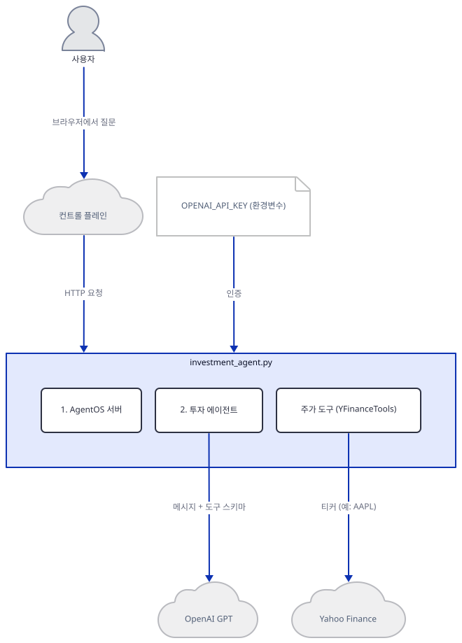
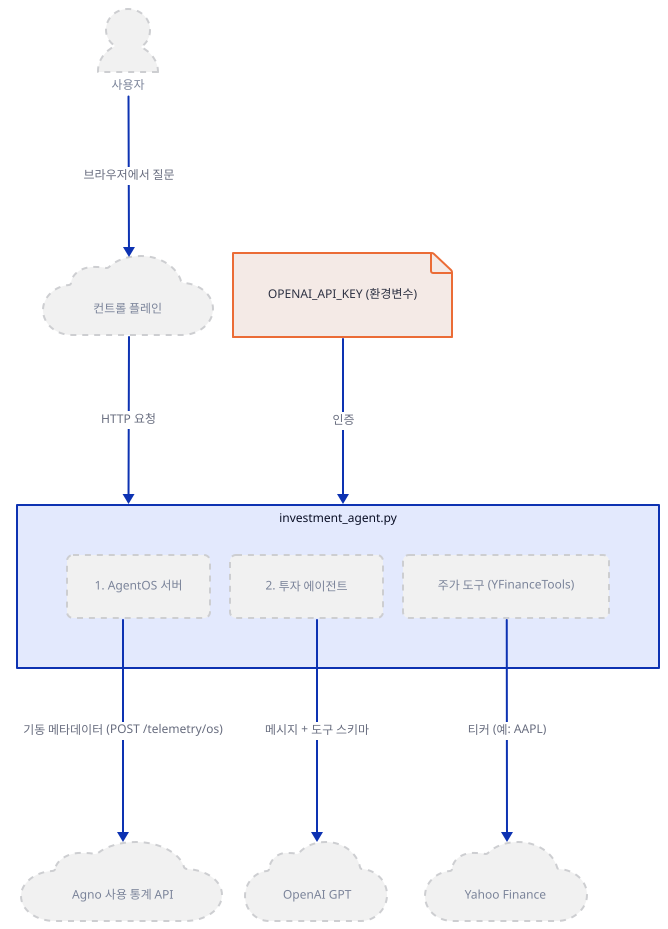
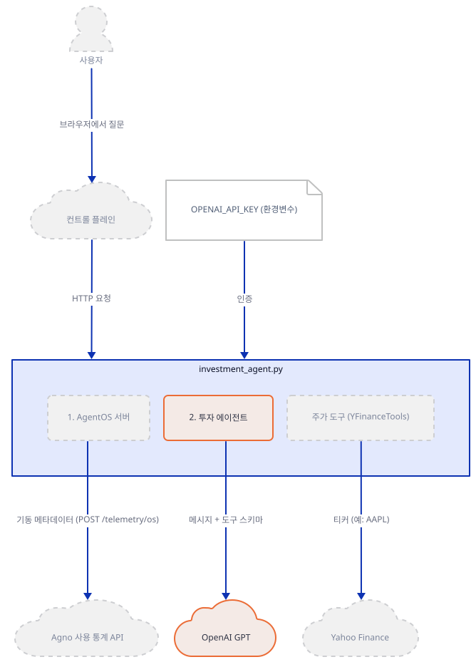
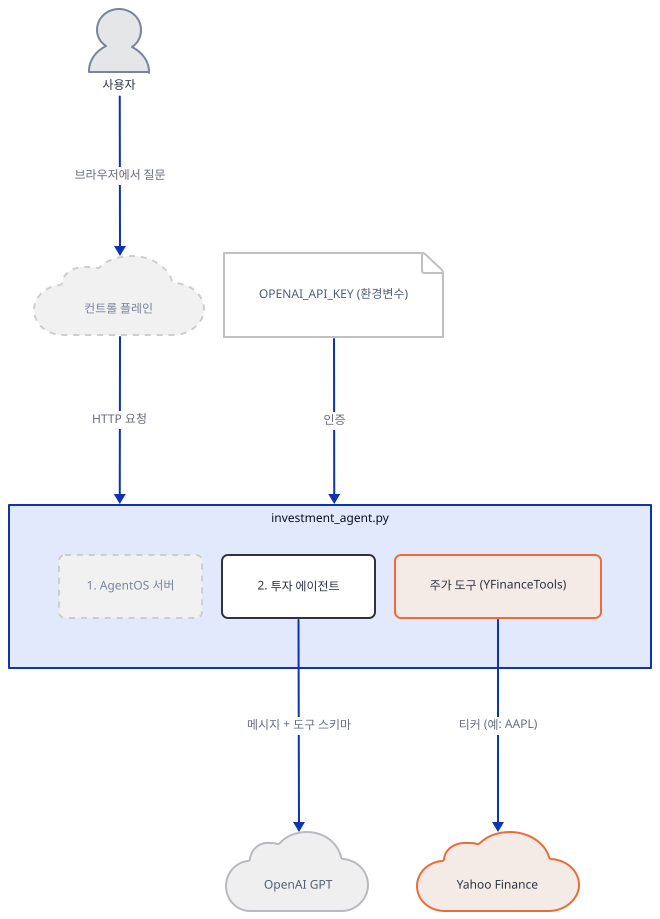
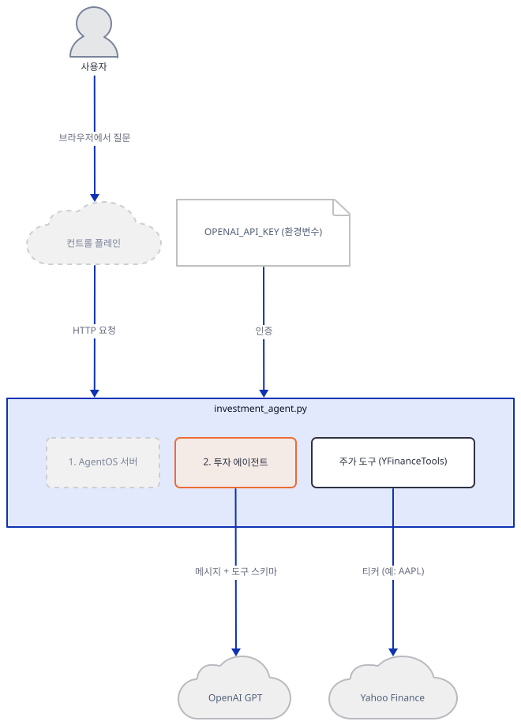
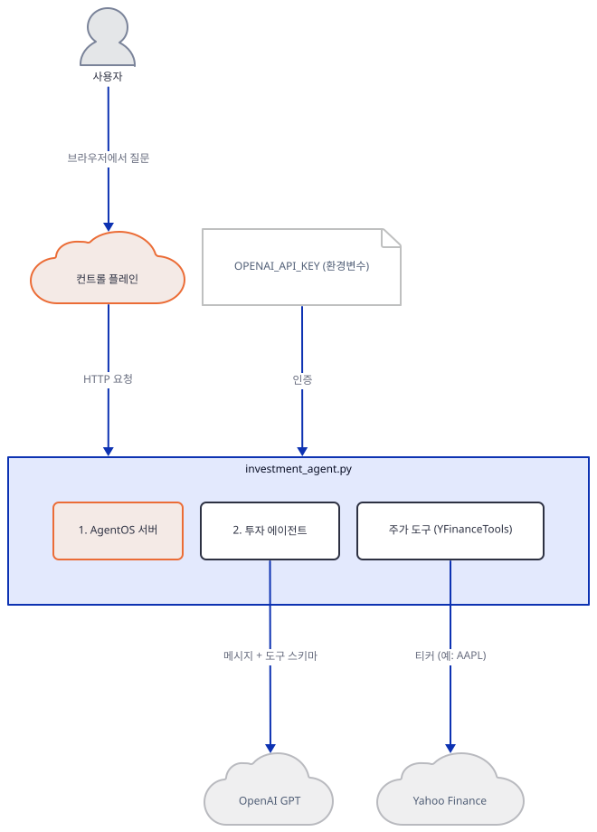
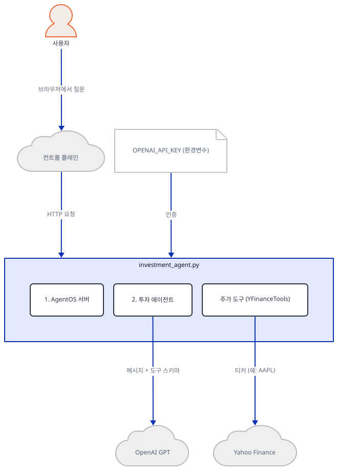
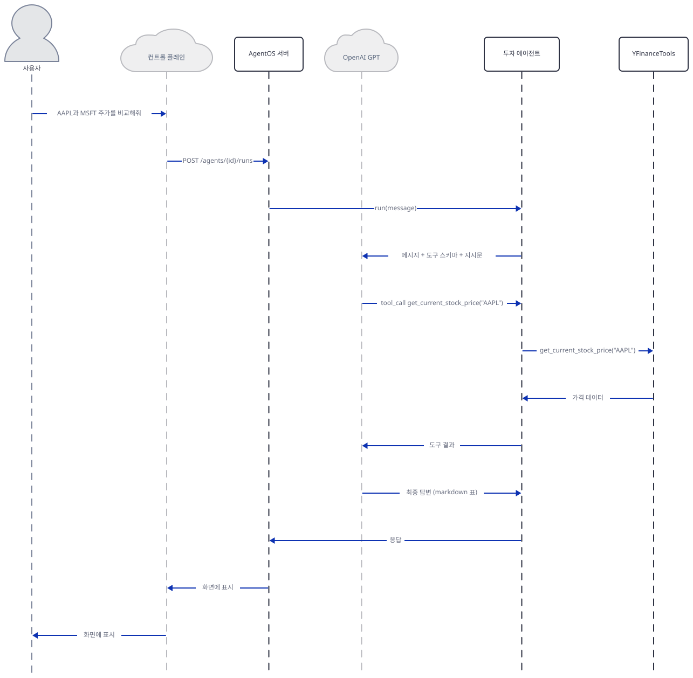

# Day 078 · 📈 AI Investment Agent

> 볼륨 7 🚀 Advanced AI Agents · 난이도 ★☆☆ · 예상 소요 55분(골격 자체는 Day 001과 같지만, 확인마다 직접 명령을 돌려 봐야 해서 읽는 시간보다 손으로 돌려 보는 시간이 더 걸립니다) · API 비용 대략 질문 10개에 수십~백여 원 이하(OpenAI 공식 요금표 기준 `gpt-5.2` 표준가 입력 $1.75/출력 $14.00, 1M 토큰당, 대략치 — 코드가 못박은 스냅샷 id `gpt-5.2-2025-12-11`은 요금표에 따로 없어 `gpt-5.2` 기준가로 계산) · 원본 앱: `advanced_ai_agents/single_agent_apps/ai_investment_agent`

## 오늘 만들 것

오늘부터 34일간 이어지는 "🚀 Advanced AI Agents" 볼륨을 엽니다. 지난 볼륨(Day 071~077, "💾 LLM Apps with Memory")은 이름 그대로 대화가 끝나도 상태가 남는 것이 핵심이었습니다. 오늘의 27줄짜리 `investment_agent.py`에는 그런 장치가 전혀 없습니다 — `db=`도 세션도 없고, 질문 하나마다 완전히 새로 시작합니다. 대신 이 코드는 이 시리즈가 Day 001에서 이미 배운 3요소 뼈대(모델·도구·AgentOS 서버)를 그대로 반복합니다. 다른 점은 둘입니다. 첫째, LLM이 xAI Grok(Day 001)에서 OpenAI로 바뀌었고, 코드는 agno의 기본값(`gpt-5.4-mini` — Day 068이 같은 agno 3.0.11에서 이미 확인)을 쓰지 않고 `gpt-5.2-2025-12-11`이라는 날짜가 박힌 스냅샷 id를 직접 지정합니다. 둘째, 도구가 `YFinanceTools()` 하나뿐입니다 — 그런데 이 클래스가 기본값으로 켜는 함수는 Day 001이 이미 확인한 대로 `get_current_stock_price` 하나뿐이고(이번 agno 3.0.11에서도 재확인), 기업 정보·재무제표·손익계산서·재무비율·애널리스트 추천·기업 뉴스·기술 지표·역사적 가격까지 나머지 여덟 개 함수는 전부 `enable_*=False`로 꺼져 있습니다(생성자 시그니처를 직접 확인). 그런데도 에이전트 자신의 `description`과 `instructions`(코드에 그대로 있습니다)는 "애널리스트 추천"과 "재무 펀더멘털"을 언급하고, 앱 자체 README도 "두 종목 비교"·"포괄적 기업 정보"·"최신 기업 뉴스와 애널리스트 추천"을 기능으로 내세웁니다 — 코드가 실제로 줄 수 있는 것은 현재가 하나뿐인데도입니다. `requirements.txt` 3줄에는 `openai`가 이미 들어 있어 Day 001이 겪은 다섯 개짜리 누락 설치는 없지만, `agno.os`가 필요로 하는 `fastapi`·`uvicorn`·`python-multipart`는 여전히 빠져 있습니다(직접 확인, Day 001과 같은 원인). `OPENAI_API_KEY` 없이도 에이전트 객체와 AgentOS 서버는 그대로 만들어지고 뜹니다(직접 확인) — 실패는 실제로 모델을 호출하는 순간(`get_client()`가 `openai.OpenAI()`를 만드는 지점, 소스로 확인)에만 로컬에서 일어납니다. 서버가 뜨는 순간 agno가 `POST /telemetry/os`를 보내려 시도하는 것도(직접 확인) Day 047이 이미 다룬 사실 그대로입니다. 완성하면 로컬 AgentOS(포트 7777)를 `os.agno.com` 컨트롤 플레인에 연결해 주가를 물어볼 수 있지만, 애널리스트 추천이나 기업 뉴스를 물으면 도구가 아니라 모델 자신의 지식(또는 거절)에 의존하게 됩니다. 아래는 완성된 아키텍처입니다.



## 사전 준비

| 서비스/도구 | 용도 | 발급·설치 |
|---|---|---|
| OpenAI API 키 | `gpt-5.2-2025-12-11`(GPT-5.2 계열) 모델 호출 인증 | https://platform.openai.com/ 가입 후 발급, `OPENAI_API_KEY` 환경변수로 설정(이 문서는 키가 없어 실제 호출은 하지 않습니다) |
| uv | 가상환경 생성과 패키지 설치 | [공통 사전 준비](../README.md#공통-사전-준비-한-번만) 절 참고 |
| 인터넷 연결 | PyPI 설치, Yahoo Finance 주가 조회, OpenAI API 호출, 채팅 화면 접속(`os.agno.com` 컨트롤 플레인), agno 사용 통계 전송(문제 해결) | 별도 설치 없음 |

## 아키텍처 한눈에 보기

| 컴포넌트 | 역할 | 코드 위치 |
|---|---|---|
| 사용자 / 컨트롤 플레인 | 브라우저에서 `os.agno.com` 컨트롤 플레인에 접속해 질문(로컬 AgentOS는 포트 7777) | 코드 없음 (외부 UI) |
| AgentOS 서버 | 에이전트를 FastAPI 앱으로 감싸 웹으로 서빙 | `advanced_ai_agents/single_agent_apps/ai_investment_agent/investment_agent.py:22-24`, `advanced_ai_agents/single_agent_apps/ai_investment_agent/investment_agent.py:26-27` |
| 투자 에이전트 (Agent) | 지시문에 따라 모델과 도구를 조합해 답변을 만듦 | `advanced_ai_agents/single_agent_apps/ai_investment_agent/investment_agent.py:8-20` |
| 모델 (OpenAI `gpt-5.2-2025-12-11`) | 실제 추론을 수행하는 LLM, 도구 호출 여부를 판단 | `advanced_ai_agents/single_agent_apps/ai_investment_agent/investment_agent.py:3`, `advanced_ai_agents/single_agent_apps/ai_investment_agent/investment_agent.py:10` |
| 주가 도구 (YFinanceTools) | 기본값으로 `get_current_stock_price` 함수 하나만 노출 | `advanced_ai_agents/single_agent_apps/ai_investment_agent/investment_agent.py:4`, `advanced_ai_agents/single_agent_apps/ai_investment_agent/investment_agent.py:11` |
| 외부 API (OpenAI, Yahoo Finance) | 실제 LLM 추론과 주가 데이터를 제공하는 서드파티 서비스 | 코드 없음 (외부 서비스) |

## 단계별 진행

### Step 1. 환경 만들기 — AgentOS 확장 누락은 여전합니다

**목적.** 격리된 가상환경에 3줄짜리 `requirements.txt`를 설치하고, 오늘 실제로 풀리는 agno 버전에서 이 27줄이 곧바로 동작하는지 확인합니다.

**할 일.**

```bash
cd advanced_ai_agents/single_agent_apps/ai_investment_agent
uv venv
uv pip install -r requirements.txt
```

(pip을 쓴다면 `python -m venv .venv && source .venv/bin/activate && pip install -r requirements.txt`.)

이 저장소는 루트에 `pyproject.toml`이 있어 `uv run`이 방금 만든 환경 대신 루트의 `.venv`를 쓰므로, 이후 `uv run` 명령에는 모두 `--no-project`를 붙입니다.

`requirements.txt`는 `agno>=2.2.10`, `openai`, `yfinance` 세 줄뿐이라 xAI 모델을 썼던 Day 001과 달리 `openai` 패키지는 이미 선언돼 있습니다. 하지만 `agno.os`(AgentOS 웹 서빙 계층)가 요구하는 `fastapi`·`uvicorn`·`python-multipart`는 이번에도 빠져 있습니다 — Day 001이 같은 원인으로 겪은 것과 같은 누락입니다.

```bash
uv run --no-project python -c "from agno.os import AgentOS"
```

직접 확인한 오류(발췌):

```
ModuleNotFoundError: No module named 'fastapi'
```

```bash
uv pip install fastapi uvicorn python-multipart
```



**확인.**

```bash
uv run --no-project python -c "import agno; print(agno.__version__)"
uv run --no-project python -m py_compile investment_agent.py && echo OK
```

직접 확인한 출력:

```
3.0.11
OK
```

`agno>=2.2.10`는 상한이 없어 이 문서를 쓰며 설치했을 때는 agno **3.0.11**이 풀렸습니다. 여러분이 설치하는 시점의 최신 버전이 다르면 이후 확인 명령의 출력도 조금 다를 수 있습니다.

### Step 2. 모델 연결 — agno 기본값 대신 날짜가 박힌 스냅샷

**목적.** `OpenAIChat`이 어떻게 에이전트에 연결되는지, 그리고 이 앱이 agno의 기본 모델 대신 특정 스냅샷 id를 직접 고른 것임을 확인합니다.

**할 일.**

`advanced_ai_agents/single_agent_apps/ai_investment_agent/investment_agent.py:3`

```python
from agno.models.openai import OpenAIChat
```

`advanced_ai_agents/single_agent_apps/ai_investment_agent/investment_agent.py:8-10`

```python
agent = Agent(
    name="AI Investment Agent",
    model=OpenAIChat(id="gpt-5.2-2025-12-11"),
```

agno 3.0.11 소스(`agno/models/openai/chat.py`)를 보면 `OpenAIChat`의 기본 `id`는 이미 `"gpt-5.4-mini"`입니다(42행) — Day 068이 같은 agno 버전에서 이미 확인한 사실입니다. 이 앱은 그 기본값을 쓰지 않고 `"gpt-5.2-2025-12-11"`을 명시적으로 고른 것입니다. `OpenAIChat(...)`는 키가 없어도 객체 자체는 만들어집니다 — 실제 OpenAI 클라이언트는 `get_client()`가 호출될 때(즉 `agent.run()`이 모델을 부르는 순간)에야 `openai.OpenAI(**client_params)`로 만들어집니다(소스로 확인). 이 문서는 외부 API 클라이언트의 요청 메서드를 부르지 않는다는 원칙에 따라 `agent.run()`은 부르지 않고, 그 대신 같은 클라이언트를 키 없이 직접 생성만 해 봤습니다.



**확인.**

```bash
uv run --no-project python -c "
from agno.models.openai import OpenAIChat
m = OpenAIChat(id='gpt-5.2-2025-12-11')
print(m.id)
"
```

```
gpt-5.2-2025-12-11
```

```bash
uv run --no-project python -c "
import os
os.environ.pop('OPENAI_API_KEY', None)
from openai import OpenAI
try:
    OpenAI()
except Exception as e:
    print(type(e).__name__, e)
"
```

직접 확인한 출력(발췌):

```
OpenAIError Missing credentials. Please pass an `api_key`, ... or set the `OPENAI_API_KEY` ... environment variable.
```

`OpenAIChat.get_client()`가 만드는 클라이언트가 바로 이 `OpenAI()`이므로(소스로 확인), 키 없이 `agent.run()`을 불렀다면 실제 네트워크 요청 전에 이 지점에서 로컬로 막혔을 것입니다.

### Step 3. 도구 연결 — 켜진 함수는 하나뿐입니다

**목적.** `YFinanceTools()`가 기본값으로 어떤 함수를 노출하는지, 그리고 에이전트의 설명·지시문이 약속하는 기능과 실제로 얼마나 어긋나는지 확인합니다.

**할 일.**

`advanced_ai_agents/single_agent_apps/ai_investment_agent/investment_agent.py:4`

```python
from agno.tools.yfinance import YFinanceTools
```

`advanced_ai_agents/single_agent_apps/ai_investment_agent/investment_agent.py:11`

```python
    tools=[YFinanceTools()],
```

도구가 파이썬 함수 하나하나를 LLM에 노출하는 방식은 Day 001이 이미 다룬 메커니즘이라 여기서는 되풀이하지 않습니다. `YFinanceTools()`를 인자 없이 쓰면 어떤 함수가 켜지는지는 Day 001이 이미 확인했고 — 기본값은 `get_current_stock_price` 하나뿐입니다. 이번 agno 3.0.11에서도 같은 결과를 재확인했습니다.



**확인.**

```bash
uv run --no-project python -c "
from agno.tools.yfinance import YFinanceTools
print(sorted(YFinanceTools().functions))
"
```

```
['get_current_stock_price']
```

```bash
uv run --no-project python -c "
import inspect
from agno.tools.yfinance import YFinanceTools
print(inspect.signature(YFinanceTools.__init__))
"
```

직접 확인한 생성자 시그니처(발췌):

```
(self, enable_stock_price: bool = True, enable_company_info: bool = False, enable_stock_fundamentals: bool = False, enable_income_statements: bool = False, enable_key_financial_ratios: bool = False, enable_analyst_recommendations: bool = False, enable_company_news: bool = False, enable_technical_indicators: bool = False, enable_historical_prices: bool = False, all: bool = False, ...)
```

`enable_stock_price`만 `True`이고 나머지 여덟 개는 모두 `False`입니다. 그런데 `investment_agent.py:12`의 `description`은 "researches stock prices, **analyst recommendations**, and **stock fundamentals**"라 적혀 있고, `instructions`(`investment_agent.py:15`)도 "provide detailed analysis including price trends, **fundamentals**, and **analyst recommendations**"를 요구하며, 앱 자체 README(`advanced_ai_agents/single_agent_apps/ai_investment_agent/README.md:9-11`)도 "Compare the performance of two stocks", "Retrieve comprehensive company information", "Get the latest company news and analyst recommendations"를 기능으로 내세웁니다. 코드가 실제로 호출할 수 있는 함수는 현재가 조회 하나뿐이므로, 이 약속들은 코드가 아니라 모델 자신의 사전 지식에 기댄 것입니다(문제 해결).

### Step 4. 지시문과 설명 — 도구가 못 주는 것을 지시문이 요구합니다

**목적.** `description`·`instructions`·`debug_mode`·`markdown`이 에이전트의 답변 스타일과 내용을 어떻게 못박는지, 그리고 Step 3에서 본 도구 제약과 어떻게 어긋나는지 확인합니다.

**할 일.**

`advanced_ai_agents/single_agent_apps/ai_investment_agent/investment_agent.py:12`

```python
    description="You are an investment analyst that researches stock prices, analyst recommendations, and stock fundamentals.",
```

`advanced_ai_agents/single_agent_apps/ai_investment_agent/investment_agent.py:13-19`

```python
    instructions=[
        "Format your response using markdown and use tables to display data where possible.",
        "When comparing stocks, provide detailed analysis including price trends, fundamentals, and analyst recommendations.",
        "Always provide actionable insights for investors."
    ],
    debug_mode=True,
    markdown=True,
```

`instructions`가 시스템 프롬프트로 들어가 답변 스타일을 지정하고, `debug_mode=True`가 모델에 보내는 메시지와 도구 호출을 터미널에 `DEBUG` 로그로 찍는다는 것은 Day 001이 이미 확인한 메커니즘이라 되풀이하지 않습니다. 여기서 새로 볼 것은 지시문의 **내용**입니다 — 두 번째 지시문이 요구하는 "fundamentals"와 "analyst recommendations"는 Step 3에서 확인한 대로 켜진 도구가 하나도 제공하지 않는 정보입니다. 모델은 이 지시문을 어기지 않으려면 도구 결과가 아니라 사전 학습 지식(또는 존재하지 않는 실시간 데이터인 것처럼 보이는 답)으로 그 항목들을 채우게 됩니다.



**확인.**

```bash
uv run --no-project python -c "
import os
os.environ.pop('OPENAI_API_KEY', None)
from agno.agent import Agent
from agno.models.openai import OpenAIChat
from agno.tools.yfinance import YFinanceTools
agent = Agent(
    name='AI Investment Agent',
    model=OpenAIChat(id='gpt-5.2-2025-12-11'),
    tools=[YFinanceTools()],
    debug_mode=True,
    markdown=True,
)
print('agent built:', agent.name)
"
```

직접 확인한 출력(발췌, `debug_mode=True`가 객체 생성 순간 찍는 로그를 포함합니다):

```
DEBUG   Agent initialized: ai-investment-agent
agent built: AI Investment Agent
```

### Step 5. AgentOS로 서비스 — 서버를 켜자마자 나가는 텔레메트리

**목적.** 완성된 에이전트를 로컬 REST API 서버로 띄우고, 질문을 하기도 전에 agno가 무엇을 외부로 보내려 하는지 확인합니다.

**할 일.**

`advanced_ai_agents/single_agent_apps/ai_investment_agent/investment_agent.py:5`

```python
from agno.os import AgentOS
```

`advanced_ai_agents/single_agent_apps/ai_investment_agent/investment_agent.py:22-24`

```python
# UI for investment agent using AgentOS
agent_os = AgentOS(agents=[agent])
app = agent_os.get_app()
```

`advanced_ai_agents/single_agent_apps/ai_investment_agent/investment_agent.py:26-27`

```python
if __name__ == "__main__":
    agent_os.serve(app="investment_agent:app", reload=True)
```

`AgentOS(agents=[agent])`·`get_app()`·`serve(...)`가 하는 일은 Day 001이 이미 다룬 메커니즘과 같습니다. 다른 것은, 서버가 뜨는 순간(`serve()` 호출 또는 lifespan 시작) agno가 익명 사용 통계 `POST /telemetry/os`를 보내려 시도한다는 사실입니다 — 이 메커니즘 자체와 끄는 방법(`AGNO_TELEMETRY=false` + `AgentOS(..., telemetry=False)`)은 Day 047 Step 5("agno의 익명 사용 통계")가 이미 자세히 확인했으므로 여기서는 되풀이하지 않습니다.



**확인.** `OPENAI_API_KEY` 없이도 서버 자체는 뜹니다(직접 실행해 확인). 이 문서는 텔레메트리 요청이 실제로 나가지 않도록 `HTTP_PROXY`/`HTTPS_PROXY`를 로컬의 존재하지 않는 포트로 걸고 재현했습니다(프로젝트 규칙 — 실제 환경에서는 이 프록시 없이 요청이 그대로 전송됩니다, Day 047에서 직접 확인된 사실).

```bash
uv run --no-project python investment_agent.py
```

직접 확인한 로그(발췌):

```
DEBUG   Agent initialized: ai-investment-agent
+--------------- AgentOS ----------------+
|          https://os.agno.com/          |
|  OS running on: http://localhost:7777  |
+----------------------------------------+
INFO:     Uvicorn running on http://localhost:7777 (Press CTRL+C to quit)
INFO:     Application startup complete.
DEBUG   Could not send telemetry event to /telemetry/os: ConnectError
```

`ConnectError`는 이 문서가 걸어 둔 가짜 프록시 때문에 생긴 것으로, 실제로는 이 요청이 시도된다는 신호입니다. 이어서 다른 터미널에서 자동 생성된 API 문서가 응답하는지 확인합니다.

```bash
curl -s -o /dev/null -w "%{http_code}\n" http://localhost:7777/docs
```

```
200
```

확인 후 서버는 `Ctrl+C`로 멈춥니다. 포트 7777이 이미 쓰이고 있을 때의 대처는 Day 001 문제 해결을 참고하세요.

### Step 6. 질문 실행 — 여기서부터는 키가 필요합니다

**목적.** AgentOS 컨트롤 플레인에서 실제로 질문을 던졌을 때 무엇이 가능하고 무엇이 불가능한지 정리합니다.

**할 일.** 이 단계는 OpenAI API 키가 있어야 끝까지 진행할 수 있습니다. 브라우저에서 https://os.agno.com 에 접속해 로컬 AgentOS(`http://localhost:7777`)를 연결한 뒤, 채팅창에 "AAPL과 MSFT 주가를 비교해줘" 같은 질문을 입력합니다. 현재가 조회 하나만 켜져 있으므로(Step 3), 모델은 같은 함수를 티커만 바꿔(`"AAPL"`, 이어서 `"MSFT"`) 두 번 호출하는 식으로 답을 모을 것입니다. 반대로 "이 종목 애널리스트 추천 알려줘"처럼 켜지지 않은 기능을 물으면, 호출할 도구가 없으므로 모델은 학습된 지식으로 답하거나 정보가 없다고 답하는 것 중 하나를 스스로 고르게 됩니다 — 이 문서는 키가 없어 이 갈림을 실제로 실행해 확인하지는 못했습니다.



**확인.** 키가 있다면, 서버를 띄운 터미널에 `debug_mode=True`가 찍는 `tool_call` 로그를 보고 실제로 몇 번 호출됐는지, 그리고 애널리스트 추천을 물었을 때 도구 호출이 아예 없는지 확인합니다.

## 요청 한 건이 흐르는 과정



사용자의 질문은 컨트롤 플레인에서 HTTP POST로 로컬 AgentOS 서버에 도착하고, 서버는 이를 `agent.run(message)` 호출로 바꿔 투자 에이전트에 넘깁니다(이 라우팅 자체는 Day 001이 이미 다뤘습니다). 에이전트는 지시문과 `get_current_stock_price` 하나뿐인 도구 스키마를 얹어 OpenAI에 보냅니다. 도구가 하나뿐이므로 "두 종목을 비교해줘"처럼 티커가 둘인 질문에서도 모델은 같은 함수를 인자만 바꿔 두 번 호출하는 식으로 답을 모읍니다 — 도구 호출 루프 자체는 Day 001이 확인한 메커니즘과 같고, 위 시퀀스는 그중 AAPL 쪽 첫 호출만 그립니다(MSFT 쪽 호출은 같은 모양이 한 번 더 반복됩니다). 애널리스트 추천이나 기업 뉴스를 묻는 질문에는 애초에 호출할 도구가 없으므로, 모델은 학습된 지식으로 답하거나 정보가 없다고 답하는 것을 스스로 고르게 됩니다.

## 실행 체크리스트

- [ ] 격리된 가상환경에 `requirements.txt`와 AgentOS 확장 3종(`fastapi`, `uvicorn`, `python-multipart`)을 설치했다
- [ ] `agno.__version__`이 3.0.11(또는 그 이상)임을 확인했다
- [ ] `YFinanceTools()` 기본값이 `get_current_stock_price` 하나만 노출한다는 것을 직접 확인했다
- [ ] 에이전트의 `description`·`instructions`가 언급하는 "애널리스트 추천"·"펀더멘털"이 실제로 켜진 도구로는 조회되지 않는다는 것을 확인했다
- [ ] `OPENAI_API_KEY` 없이도 `python investment_agent.py`로 로컬 AgentOS 서버(포트 7777)가 뜨는 것을 확인했다
- [ ] agno가 서버 기동 시 `POST /telemetry/os`를 보낸다는 사실과 끄는 방법(Day 047)을 확인했다
- [ ] (키가 있다면) `os.agno.com` 컨트롤 플레인에서 로컬 AgentOS에 연결해 질문을 실행했다

## 문제 해결

| 증상 | 원인 | 해결 |
|---|---|---|
| `from agno.os import AgentOS` 시점에 `ModuleNotFoundError: No module named 'fastapi'` | `requirements.txt`(`agno`, `openai`, `yfinance`)가 AgentOS 웹 서빙 계층이 필요로 하는 `fastapi`·`uvicorn`·`python-multipart`를 선언하지 않음(직접 설치해 확인 — Day 001과 같은 누락 패턴) | `uv pip install fastapi uvicorn python-multipart` 추가 실행 |
| `OPENAI_API_KEY` 없이 `agent.run()`을 부르면(이 문서는 실행하지 않음) 실제 요청 전에 로컬에서 실패할 것으로 예상됨 | `OpenAIChat.get_client()`가 `openai.OpenAI(**client_params)`를 그대로 생성하는데(소스로 확인), 이 생성자가 키를 못 찾으면 `OpenAIError`를 즉시 던짐(직접 확인, `OpenAI()` 생성자만 별도 테스트) | 키를 환경변수로 설정하거나 `OpenAIChat(..., api_key=...)`로 직접 전달 |
| 에이전트의 `description`·`instructions`, 그리고 앱 자체 README가 애널리스트 추천·기업 뉴스·재무 펀더멘털을 기능으로 내세우지만 실제로는 현재가만 조회됨 | `YFinanceTools()`가 기본으로 켜는 함수는 `get_current_stock_price` 하나뿐이고, 나머지 여덟 개는 `enable_*=False`(생성자 시그니처 직접 확인) | 필요한 만큼 `YFinanceTools(enable_analyst_recommendations=True, enable_stock_fundamentals=True, enable_company_news=True, enable_company_info=True)`처럼 플래그를 명시적으로 켠다 |
| 질문을 하기도 전에, 서버를 띄우자마자 외부로 요청을 시도하는 로그가 보임 | `AgentOS.serve()`가 기동 시 익명 사용 통계 `POST /telemetry/os`를 보냄(Day 047이 같은 메커니즘을 직접 확인) | `AGNO_TELEMETRY=false`와 `AgentOS(agents=[agent], telemetry=False)`를 함께 설정(Day 047 Step 5 참고) |

## 더 해보기

- `YFinanceTools(enable_analyst_recommendations=True, enable_stock_fundamentals=True)`로 바꾸고 `sorted(YFinanceTools(...).functions)`가 어떻게 늘어나는지 확인해보기
- `model=OpenAIChat(id="gpt-5.2-2025-12-11")`를 agno 기본값 `"gpt-5.4-mini"`로 바꿔 코드에 아무 것도 지정하지 않았을 때와 비교해보기
- Day 047 방식대로 `AGNO_API_RUNTIME=dev`로 로컬 수신기를 띄우고, `AGNO_TELEMETRY=false`와 `AgentOS(..., telemetry=False)`를 하나씩만 걸어 `POST /telemetry/os`·`POST /telemetry/runs`가 각각 몇 건 도착하는지 직접 세어보기

## 다음 날 예고

[Day 079 · 🎬 AI Movie Production Agent](../day079-ai-movie-production-agent/README.md) — Claude 3.5 Sonnet으로 영화 각본 개요와 배역 캐스팅을 함께 제안하는 어시스턴트를 만듭니다.
