# Day 079 · 🎬 AI Movie Production Agent

> 볼륨 7 🚀 Advanced AI Agents · 난이도 ★★★ · 예상 소요 55분 · API 비용 대략 컨셉 1건에 `gemini-2.5-flash` 호출 여러 회(ScriptWriter·CastingDirector·팀 리더 각 1회 이상) + SerpApi 검색 1회 안팎, 요금표 기준 대략 $0.01~0.05 수준으로 추정(대략치 — 키가 없어 실제 호출 횟수·과금은 확인하지 못함) · 원본 앱: `advanced_ai_agents/single_agent_apps/ai_movie_production_agent`

## 오늘 만들 것

이번 튜토리얼부터 "🚀 Advanced AI Agents" 볼륨입니다. 지금까지 78일 동안 agno의 `Agent`를 여러 개 만들 때는 전부 파이썬 변수로 손수 이어 붙였습니다 — Day 038의 3-에이전트 파이프라인(News Collector → Summary Writer → Trend Analyzer)은 `.run()`을 세 번 순서대로 호출하며 앞 결과를 다음 프롬프트 문자열에 끼워 넣는 식이었습니다(소스로 확인). 오늘의 85줄짜리 `movie_production_agent.py`는 처음으로 agno의 `Team` 클래스를 씁니다 — `ScriptWriter`·`CastingDirector` 두 `Agent`를 `Team(members=[...])`으로 묶고, 누구에게 무엇을 맡길지 그 판단 자체를 팀 리더(자신의 `Gemini` 모델을 별도로 가짐)에게 넘깁니다. 리포 안에서 `from agno.team import Team`을 쓰는 파일은 8개뿐이고 그중 나머지 7개는 모두 Day 081 이후에 나오는 "multi_agent_apps" 폴더에 있으므로(소스 검색으로 확인), 오늘이 이 시리즈에서 `Team`을 처음 만나는 날입니다.

원본 앱 자체 README는 "Claude 3.5 Sonnet 모델"을 쓴다고 소개하고 3단계 설치 안내에서도 Anthropic API 키를 발급받으라고 하지만, 실제 코드(`movie_production_agent.py:7`, `movie_production_agent.py:15`)는 `from agno.models.google import Gemini`를 임포트하고 화면에는 "Enter Google API Key to access Gemini 2.5 Flash"라는 문구로 Google 키를 요구합니다 — README가 모델을 바꾼 뒤 갱신되지 않은 것으로 보입니다(README와 소스 대조로 확인). `requirements.txt` 4줄에는 agno의 Gemini 인터페이스가 필요로 하는 `google-genai`가 빠져 있어서(agno가 선언한 `extra == "google"` 목록에 있음, `importlib.metadata.requires('agno')`로 확인), 오늘 기준 설치(agno 3.0.11)에서는 Streamlit 화면이 뜨기도 전에 7번째 import 줄에서 `ImportError`로 멈춥니다(직접 확인, Step 1) — 이 문제는 agno 버전과 무관하게 애초부터 있었습니다(agno 2.3.2에서도 같은 extra 구조를 소스로 확인).

두 키(Google API 키, SerpAPI 키)를 모두 입력하면 영화 아이디어·장르·대상·러닝타임을 받는 폼이 나타납니다. 버튼을 누르면 ScriptWriter가 3~5인 캐릭터의 3막 구조 각본 아웃라인을 쓰고, CastingDirector가 `SerpApiTools`의 `search_google` 도구로 배우 현황을 실제로 검색해 캐스팅을 제안하며, MovieProducer(Team)가 둘의 결과를 하나의 영화 컨셉으로 종합합니다. 아래는 완성된 아키텍처입니다.

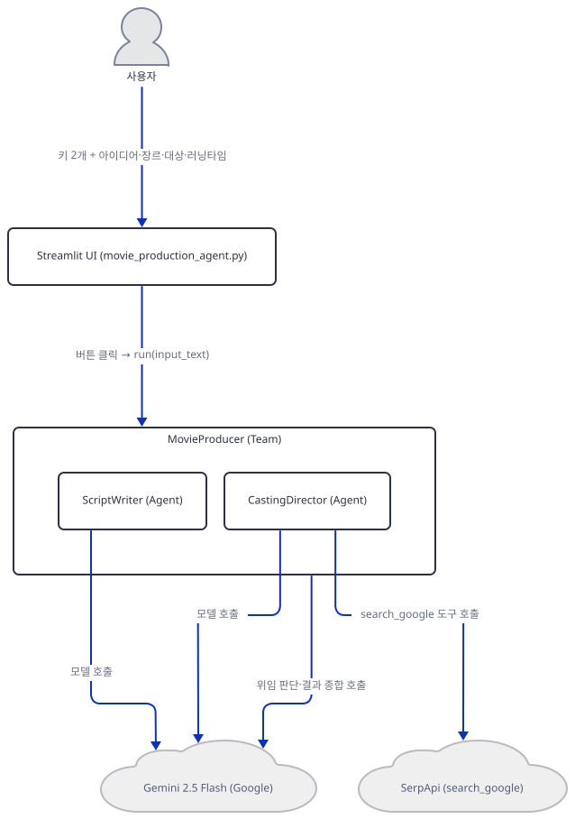

## 사전 준비

| 서비스/도구 | 용도 | 발급·설치 |
|---|---|---|
| Google AI Studio API 키 | ScriptWriter·CastingDirector·MovieProducer가 공유하는 `gemini-2.5-flash` 모델 호출 인증. 화면 입력창에 직접 붙여넣는다(환경변수 아님) | https://aistudio.google.com/apikey 가입 후 발급 |
| SerpAPI 키 | CastingDirector가 `search_google` 도구로 배우의 실제 상태를 검색할 때 사용 | https://serpapi.com/ 가입 후 발급 |
| uv | 가상환경 생성과 패키지 설치 | [공통 사전 준비](../README.md#공통-사전-준비-한-번만) 절 참고 |
| 인터넷 연결 | PyPI 설치, Gemini API·SerpApi 접속 | 별도 설치 없음. 사내망이면 두 도메인 접속 허용 필요 |

## 아키텍처 한눈에 보기

| 컴포넌트 | 역할 | 코드 위치 |
|---|---|---|
| 사용자 | 브라우저에서 키 2개와 영화 아이디어·장르·대상·러닝타임 입력 | 코드 없음 (브라우저) |
| Streamlit UI | 제목·캡션·두 키 입력창·폼을 그리고 버튼 클릭에 MovieProducer를 실행 | `advanced_ai_agents/single_agent_apps/ai_movie_production_agent/movie_production_agent.py:10-19,68-85` |
| ScriptWriter (Agent) | 아이디어·장르로 3~5인 캐릭터, 3막 구조, 반전 2~3개짜리 각본 아웃라인 작성 (도구 없음) | `advanced_ai_agents/single_agent_apps/ai_movie_production_agent/movie_production_agent.py:20-34` |
| CastingDirector (Agent) | 각 배역에 배우 2~3명을 제안하고 `search_google`로 실제 상태를 확인 | `advanced_ai_agents/single_agent_apps/ai_movie_production_agent/movie_production_agent.py:36-52` |
| MovieProducer (Team) | ScriptWriter·CastingDirector를 멤버로 묶어 위임하고 결과를 하나의 컨셉으로 종합 | `advanced_ai_agents/single_agent_apps/ai_movie_production_agent/movie_production_agent.py:54-66` |
| Gemini 2.5 Flash | 세 곳(ScriptWriter·CastingDirector·팀 리더)이 공유하는 추론 모델 | 코드 없음 (외부 서비스, 호출 지점 `movie_production_agent.py:22,38,56`) |
| SerpApi | CastingDirector가 배우 현황을 검색하는 실제 웹 검색 API | 코드 없음 (외부 서비스) |

## 단계별 진행

### Step 1. 환경 만들기 — 빠진 `google-genai`

**목적.** 격리된 가상환경에 4줄짜리 `requirements.txt`를 설치하고, 오늘 실제로 풀리는 agno 버전에서 이 앱이 곧바로 뜨는지 확인합니다.

**할 일.**

```bash
cd advanced_ai_agents/single_agent_apps/ai_movie_production_agent
uv venv
uv pip install -r requirements.txt
```

(pip 대안: `python -m venv .venv && source .venv/bin/activate && pip install -r requirements.txt`. Windows PowerShell은 활성화만 `.venv\Scripts\Activate.ps1`로 바꿉니다.)

이 저장소는 루트에 `pyproject.toml`이 있어 `uv run`이 방금 만든 환경 대신 루트의 `.venv`를 쓰므로, 이후 `uv run` 명령에는 모두 `--no-project`를 붙입니다.

`advanced_ai_agents/single_agent_apps/ai_movie_production_agent/requirements.txt:1-4`

```text
streamlit 
agno>=2.2.10
google-search-results  
lxml_html_clean
```

(4줄, 마지막 줄에 개행이 없어 `wc -l`은 3으로 셉니다.) 이 문서를 작성하며 설치했을 때는 **agno 3.0.11**, **streamlit 1.64.0**, **google-search-results 2.4.2**, **lxml_html_clean 0.4.5**가 받아졌습니다(직접 확인 — 넷 다 버전 고정이 느슨해 2026-09-28 기준 최신입니다). `lxml_html_clean`은 agno가 `agno.tools.newspaper`/`newspaper4k`(기사 본문 스크래핑 도구)를 쓸 때만 요구하는 패키지인데(`importlib.metadata.requires('agno')`의 `extra == "newspaper"` 목록으로 확인) 이 앱은 그 도구를 쓰지 않으므로, 설치는 되지만 실제로는 쓰이지 않는 줄입니다. `py_compile`은 통과합니다.

```bash
uv run --no-project python -m py_compile movie_production_agent.py && echo compiled
```

```
compiled
```

그런데 파일을 그대로 실행하면 7번째 import 줄에서 막힙니다.

```bash
uv run --no-project python movie_production_agent.py
```

직접 확인한 출력(발췌):

```
  File "...\agno\utils\gemini.py", line 11, in <module>
    from google.genai.types import (
    ...
ModuleNotFoundError: No module named 'google.genai'

During handling of the above exception, another exception occurred:

  File "...\movie_production_agent.py", line 7, in <module>
    from agno.models.google import Gemini
  ...
ImportError: `google-genai` not installed. Please install it using `pip install google-genai`
```

`agno.models.google.Gemini`가 내부에서 쓰는 `agno.utils.gemini` 모듈이 `google.genai`를 무조건 임포트하는데, 이 패키지는 agno의 일반 설치에 포함되지 않고 `agno[google]` extra 뒤에 있습니다(`importlib.metadata.requires('agno')`의 `extra == "google"` 목록으로 확인). 이 한 줄을 추가로 설치하면 임포트가 끝까지 통과합니다.

```bash
uv pip install google-genai
uv run --no-project python -c "from agno.models.google import Gemini; print('import ok')"
```

직접 확인한 출력:

```
import ok
```

**그림.**

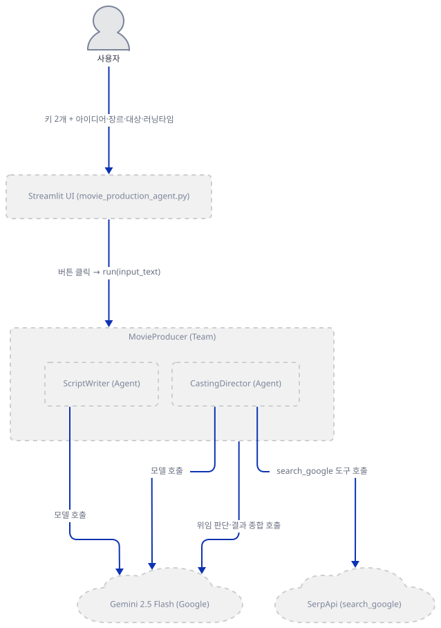

**확인.** 위 두 명령(`py_compile`, `import ok`)이 그대로 통과하는지 봅니다.

### Step 2. 제목·캡션과 두 키 게이트

**목적.** 화면에 무엇이 먼저 뜨는지, 그리고 두 키가 모두 있어야 나머지 코드가 실행되는 구조를 확인합니다.

**할 일.**

`advanced_ai_agents/single_agent_apps/ai_movie_production_agent/movie_production_agent.py:10-19`

```python
# Set up the Streamlit app
st.title("AI Movie Production Agent 🎬")
st.caption("Bring your movie ideas to life with the teams of script writing and casting AI agents")

# Get Google API key from user
google_api_key = st.text_input("Enter Google API Key to access Gemini 2.5 Flash", type="password")
# Get SerpAPI key from the user
serp_api_key = st.text_input("Enter Serp API Key for Search functionality", type="password")

if google_api_key and serp_api_key:
```

19행의 `if` 이후 나머지 코드(20~85행) 전부가 4칸 들여쓰기로 이 블록 안에 있습니다(소스 들여쓰기로 확인) — 두 키 중 하나라도 비어 있으면 제목·캡션·키 입력창 두 개 외에는 아무것도 그려지지 않습니다.

**그림.**

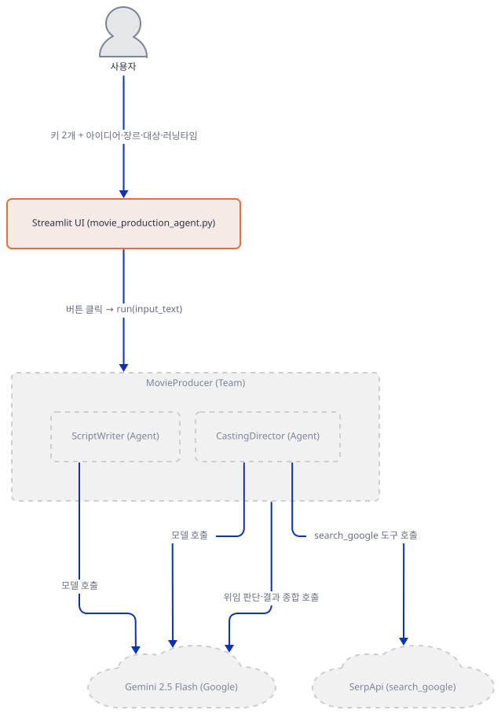

**확인.**

```bash
sed -n '10,19p' movie_production_agent.py
```

직접 확인한 출력은 위 발췌와 같습니다(줄 번호 10~19).

### Step 3. ScriptWriter 에이전트 — 도구 없는 순수 작문

**목적.** agno `Agent`가 모델·설명·지시문만으로 어떻게 동작하는지 봅니다(모델·지시문 구조 자체는 Day 001에서 다룬 것과 같습니다).

**할 일.**

`advanced_ai_agents/single_agent_apps/ai_movie_production_agent/movie_production_agent.py:20-34`

```python
    script_writer = Agent(
        name="ScriptWriter",
        model=Gemini(id="gemini-2.5-flash", api_key=google_api_key),
        description=dedent(
            """\
        You are an expert screenplay writer. Given a movie idea and genre, 
        develop a compelling script outline with character descriptions and key plot points.
        """
        ),
        instructions=[
            "Write a script outline with 3-5 main characters and key plot points.",
            "Outline the three-act structure and suggest 2-3 twists.",
            "Ensure the script aligns with the specified genre and target audience.",
        ],
    )
```

`Gemini`의 기본 모델 id는 `gemini-2.0-flash-001`이지만(agno 소스로 확인) 22행이 `id="gemini-2.5-flash"`로 명시해 덮어씁니다. `Gemini(...)`를 만드는 시점 자체는 네트워크를 타지 않습니다 — 실제 클라이언트는 `get_client()`가 처음 호출될 때(즉 `.run()`이 실제로 모델을 부를 때) 지연 생성됩니다(agno 소스로 확인). ScriptWriter에는 `tools`가 없으므로 검색 없이 오직 프롬프트만으로 아웃라인을 씁니다.

**그림.**

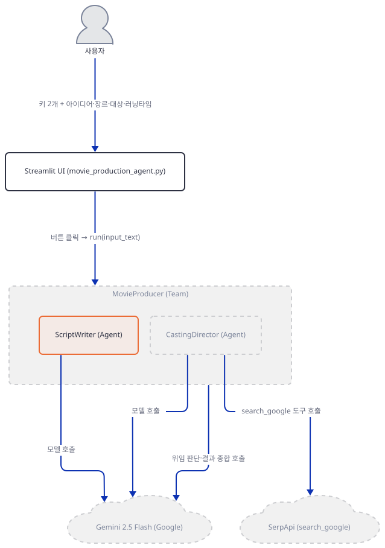

**확인.** 가짜 키로도 객체 생성 자체는 예외 없이 성공합니다(네트워크 호출이 아니므로).

```bash
uv run --no-project python -c "
from agno.agent import Agent
from agno.models.google import Gemini
a = Agent(name='ScriptWriter', model=Gemini(id='gemini-2.5-flash', api_key='fake-key'))
print('constructed OK', a.model.id)
"
```

직접 확인한 출력:

```
constructed OK gemini-2.5-flash
```

### Step 4. CastingDirector 에이전트 — `search_google` 도구 연결

**목적.** `SerpApiTools`가 무엇을 노출하고, 지시문이 그 도구 이름을 어떻게 직접 지목하는지 확인합니다.

**할 일.**

`advanced_ai_agents/single_agent_apps/ai_movie_production_agent/movie_production_agent.py:36-52`

```python
    casting_director = Agent(
        name="CastingDirector",
        model=Gemini(id="gemini-2.5-flash", api_key=google_api_key),
        description=dedent(
            """\
        You are a talented casting director. Given a script outline and character descriptions,
        suggest suitable actors for the main roles, considering their past performances and current availability.
        """
        ),
        instructions=[
            "Suggest 2-3 actors for each main role.",
            "Check actors' current status using `search_google`.",
            "Provide a brief explanation for each casting suggestion.",
            "Consider diversity and representation in your casting choices.",
        ],
        tools=[SerpApiTools(api_key=serp_api_key)],
    )
```

47행은 지시문 안에 도구 함수 이름 `search_google`을 문자 그대로 박아 둡니다 — 모델이 스스로 도구 존재를 추론하는 대신, 프롬프트가 직접 어떤 함수를 쓰라고 지목하는 방식입니다. `SerpApiTools`는 기본값(`enable_search_google=True`)만으로 `search_google` 함수 하나를 노출하며, 내부에서 `google-search-results` 패키지가 설치한 `serpapi` 모듈의 `GoogleSearch`를 호출합니다(agno 소스 `agno/tools/serpapi.py`로 확인) — 이 패키지는 `requirements.txt`에 이미 있으므로 Step 1의 `google-genai` 누락과 달리 문제가 없습니다.

**그림.**

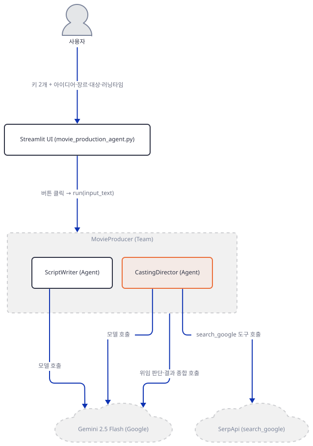

**확인.**

```bash
uv run --no-project python -c "
from agno.tools.serpapi import SerpApiTools
t = SerpApiTools(api_key='fake-serp-key')
print([f.name for f in t.functions.values()])
"
```

직접 확인한 출력:

```
['search_google']
```

### Step 5. MovieProducer — 처음 쓰는 agno `Team`

**목적.** `Team`이 `Agent` 여러 개를 어떻게 하나로 묶는지, 그리고 기본값만으로 무엇이 결정되는지 확인합니다.

**할 일.**

`advanced_ai_agents/single_agent_apps/ai_movie_production_agent/movie_production_agent.py:54-66`

```python
    movie_producer = Team(
        name="MovieProducer",
        model=Gemini(id="gemini-2.5-flash", api_key=google_api_key),
        members=[script_writer, casting_director],
        description="Experienced movie producer overseeing script and casting.",
        instructions=[
            "Ask ScriptWriter for a script outline based on the movie idea.",
            "Pass the outline to CastingDirector for casting suggestions.",
            "Summarize the script outline and casting suggestions.",
            "Provide a concise movie concept overview.",
        ],
        markdown=True,
    )
```

`Team`도 `members`와는 별개로 자기 자신의 `model`(56행)을 가집니다 — 이 모델이 "팀 리더" 역할입니다. agno 소스의 파라미터 주석으로 확인한 두 기본값이 이 앱의 동작을 정합니다: `determine_input_for_members=True`(기본값)라서 리더가 각 멤버에게 정확히 무엇을 넘길지 스스로 결정하고, `respond_directly=False`(기본값)라서 리더가 멤버들의 응답을 그대로 돌려주지 않고 직접 처리(가공)한 뒤 반환합니다 — 62행의 지시문("Summarize the script outline and casting suggestions.")이 바로 이 종합 단계를 가리킵니다. `markdown=True`는 최종 응답 텍스트가 마크다운 형식이 되도록 지시합니다. agno의 `Team`도 `Agent`와 마찬가지로 `telemetry` 기본값이 `True`입니다(직접 확인) — agno의 익명 사용 통계 자체는 Day 047 Step 5에서 이미 다룬 사실과 같습니다.

**그림.**

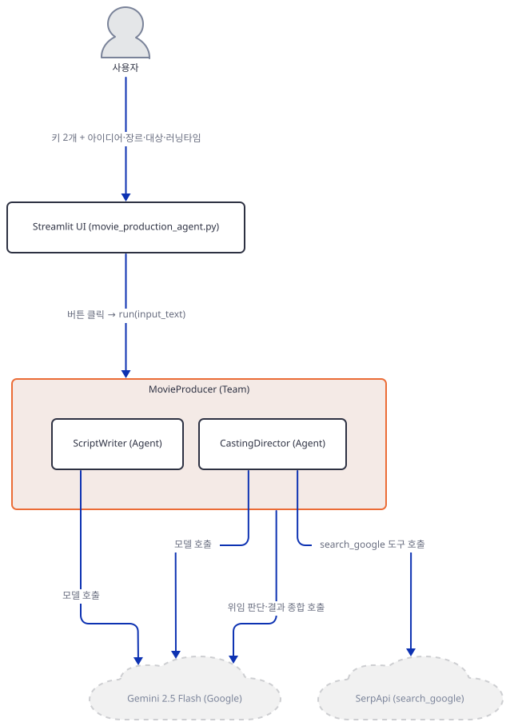

**확인.**

```bash
uv run --no-project python -c "
from agno.agent import Agent
from agno.team import Team
from agno.models.google import Gemini
sw = Agent(name='ScriptWriter', model=Gemini(id='gemini-2.5-flash', api_key='fake-key'))
cd = Agent(name='CastingDirector', model=Gemini(id='gemini-2.5-flash', api_key='fake-key'))
team = Team(name='MovieProducer', model=Gemini(id='gemini-2.5-flash', api_key='fake-key'), members=[sw, cd], markdown=True)
print('members:', [m.name for m in team.members])
print('telemetry:', team.telemetry)
"
```

직접 확인한 출력:

```
members: ['ScriptWriter', 'CastingDirector']
telemetry: True
```

### Step 6. 입력 폼 — 아이디어·장르·대상·러닝타임

**목적.** 사용자가 실제로 채우는 4개 입력 위젯을 확인합니다.

**할 일.**

`advanced_ai_agents/single_agent_apps/ai_movie_production_agent/movie_production_agent.py:68-74`

```python
    # Input field for the report query
    movie_idea = st.text_area("Describe your movie idea in a few sentences:")
    genre = st.selectbox("Select the movie genre:", 
                         ["Action", "Comedy", "Drama", "Sci-Fi", "Horror", "Romance", "Thriller"])
    target_audience = st.selectbox("Select the target audience:", 
                                   ["General", "Children", "Teenagers", "Adults", "Mature"])
    estimated_runtime = st.slider("Estimated runtime (in minutes):", 60, 180, 120)
```

68행의 주석 "Input field for the report query"는 이 4줄이 실제로 하는 일(영화 아이디어 입력)과 맞지 않는 문구입니다 — 다른 앱에서 그대로 옮겨온 주석으로 보입니다(소스로 확인). `genre`는 7개, `target_audience`는 5개 중 하나를 고르는 드롭다운이고, 러닝타임은 60~180분 사이에서 기본값 120분인 슬라이더입니다.

**그림.**

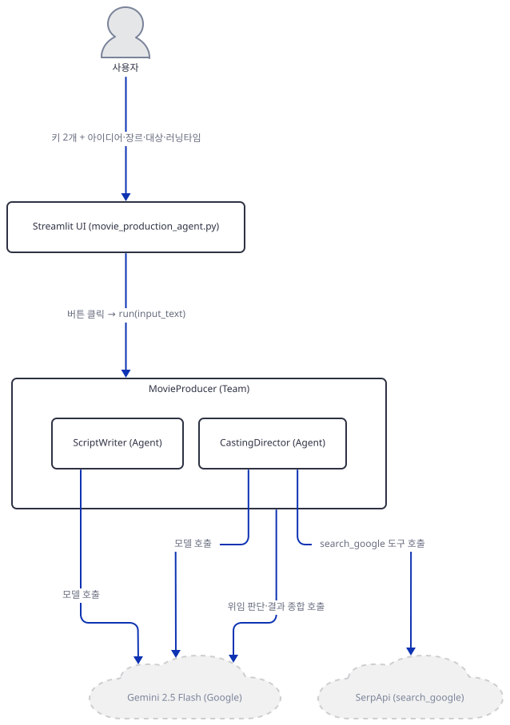

**확인.**

```bash
grep -n "st.text_area\|st.selectbox\|st.slider" movie_production_agent.py
```

직접 확인한 출력(발췌, 줄 번호 69~74):

```
69:    movie_idea = st.text_area("Describe your movie idea in a few sentences:")
70:    genre = st.selectbox("Select the movie genre:", 
72:    target_audience = st.selectbox("Select the target audience:", 
74:    estimated_runtime = st.slider("Estimated runtime (in minutes):", 60, 180, 120)
```

### Step 7. 실행 — 버튼 클릭부터 `response.content`까지

**목적.** 버튼을 누른 뒤 입력이 어떻게 하나의 문자열로 합쳐져 `Team.run()`에 전달되고, 그 결과가 어떻게 화면에 나오는지 확인합니다.

**할 일.**

`advanced_ai_agents/single_agent_apps/ai_movie_production_agent/movie_production_agent.py:76-85`

```python
    # Process the movie concept
    if st.button("Develop Movie Concept"):
        with st.spinner("Developing movie concept..."):
            input_text = (
                f"Movie idea: {movie_idea}, Genre: {genre}, "
                f"Target audience: {target_audience}, Estimated runtime: {estimated_runtime} minutes"
            )
            # Get the response from the assistant
            response: RunOutput = movie_producer.run(input_text, stream=False)
            st.write(response.content)
```

79~82행은 4개 입력을 콤마로 구분한 문장 하나로 합칩니다. `movie_producer.run(input_text, stream=False)`는 `Team.run()`을 호출하는데, 이 메서드의 실제 반환 타입은 `TeamRunOutput`입니다 — 84행의 타입 힌트 `RunOutput`(4행에서 임포트)은 실행에는 영향 없는 사소한 오표기입니다(둘 다 `.content` 필드를 가지므로 85행의 `response.content`는 그대로 동작합니다, agno 소스로 확인). 실제 키를 넣고 버튼을 누르면 이 한 번의 호출 안에서 팀 리더가 ScriptWriter·CastingDirector에 차례로 위임하고 결과를 종합하는데, 그 과정은 아래 시퀀스에서 다룹니다. 잘못된 키를 넣으면 `get_client()`가 실제 Gemini API를 호출하는 순간 인증 오류가 나겠지만, 이 문서는 실제 요청을 보내지 않으므로 이 지점은 소스로만 확인했습니다(Step 3에서 본 지연 생성 구조).

**그림.**

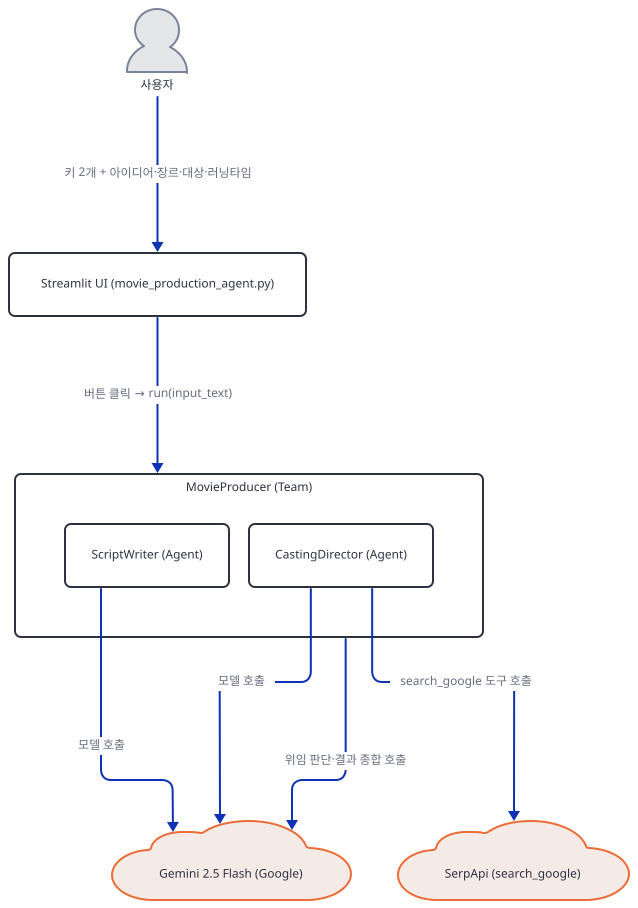

**확인.**

```bash
sed -n '76,85p' movie_production_agent.py
```

직접 확인한 출력은 위 발췌와 같습니다(줄 번호 76~85, 85행에 개행이 없어 `wc -l`은 84로 셉니다).

## 요청 한 건이 흐르는 과정

한 번의 "Develop Movie Concept" 클릭이 실제로는 세 단계를 거칩니다 — 아래 세 그림은 그 순서 그대로입니다.

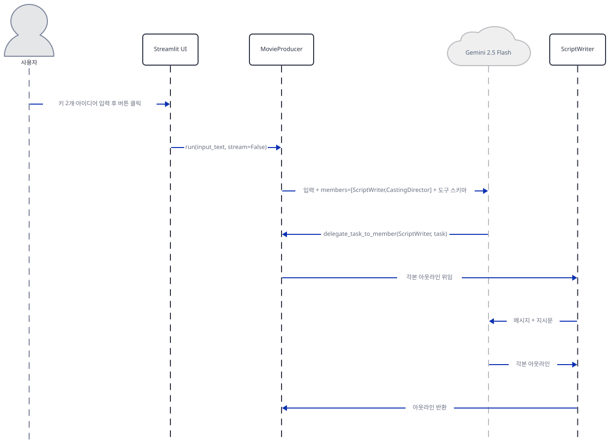

1단계는 버튼 클릭이 MovieProducer의 `run()` 호출로 이어지고, ScriptWriter가 각본 아웃라인을 받아 돌려주는 부분만 그립니다.

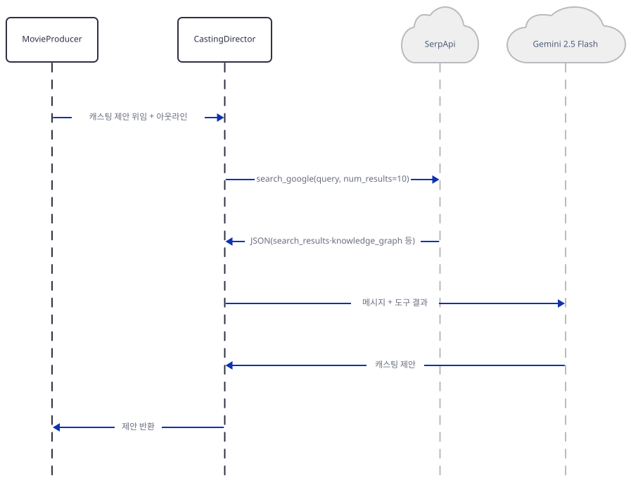

2단계는 MovieProducer가 아웃라인을 들려 CastingDirector에 위임하고, CastingDirector가 SerpApi로 배우를 검색한 뒤 그 결과를 Gemini에 다시 넘겨 캐스팅 제안을 받는 부분만 그립니다.

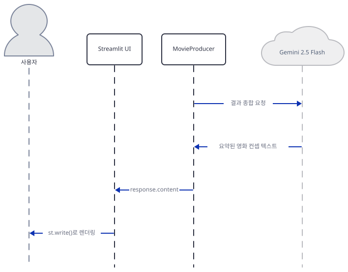

3단계는 MovieProducer 자신이 Gemini를 한 번 더 호출해 두 멤버의 결과를 하나의 영화 컨셉으로 종합하고, 그 결과가 Streamlit UI를 거쳐 화면에 렌더링되는 부분만 그립니다.

두 키를 넣고 아이디어를 적은 뒤 "Develop Movie Concept"를 누르면, Streamlit UI는 `movie_producer.run(input_text, stream=False)`를 호출합니다. MovieProducer는 먼저 ScriptWriter에게 각본 아웃라인을 위임하고, ScriptWriter는 Gemini를 한 번 호출해 아웃라인을 받아 MovieProducer에 돌려줍니다. 이어서 MovieProducer는 그 아웃라인과 함께 캐스팅 제안을 CastingDirector에 위임합니다. CastingDirector는 `search_google(query, num_results=10)`으로 SerpApi를 호출해 검색 결과 JSON(`search_results`·`knowledge_graph` 등)을 받고, 그 결과를 Gemini에 다시 넘겨 캐스팅 제안 텍스트를 받아 MovieProducer에 돌려줍니다. 두 멤버의 결과가 모이면 MovieProducer 자신의 Gemini 호출(Step 5에서 본 `respond_directly=False` 기본값에 따른 종합 단계)로 하나의 영화 컨셉으로 합쳐지고, 그 `response.content`가 Streamlit UI로 돌아와 `st.write()`로 화면에 렌더링됩니다.

## 실행 체크리스트

- [ ] `uv pip install -r requirements.txt`만으로는 `google-genai`가 빠져 있어 Streamlit이 뜨기도 전에 `ImportError`로 멈춘다는 것을 직접 확인했다
- [ ] 원본 앱 README가 "Claude 3.5 Sonnet"을 소개하지만 실제 코드는 Google Gemini 2.5 Flash를 쓴다는 것을 README와 소스 대조로 확인했다
- [ ] `Team(members=[...])`이 `determine_input_for_members`로 멤버별 입력을 스스로 정하고 `respond_directly=False`로 결과를 종합해 반환한다는 것을 agno 소스로 확인했다
- [ ] CastingDirector의 지시문이 도구 함수 이름 `search_google`을 문자 그대로 지목한다는 것을 소스로 확인했다
- [ ] agno `Team`의 텔레메트리 기본값이 `Agent`와 같이 `True`라는 것을 직접 확인했다(Day 047 Step 5와 같은 사실)
- [ ] 두 API 키를 모두 입력해야만 폼과 실행 버튼이 나타나는 게이트 구조라는 것을 들여쓰기로 확인했다

## 문제 해결

| 증상 | 원인 | 해결 |
|---|---|---|
| `requirements.txt`대로 설치해도 `streamlit run` 즉시 `ImportError: google-genai not installed`로 멈춤 | agno의 Gemini 인터페이스가 요구하는 `google-genai`가 `agno[google]` extra 뒤에 있는데 `requirements.txt`가 이 extra를 선언하지 않음(직접 확인, agno 버전과 무관) | 리포 코드는 고치지 않음 — 재현하려면 `uv pip install google-genai` 추가 설치 |
| 원본 앱 README의 소개와 설치 안내가 "Claude 3.5 Sonnet"·Anthropic 키를 말함 | 모델을 Gemini로 바꾼 뒤 README를 갱신하지 않음(README와 소스 대조로 확인) | 이 문서는 실제 코드 기준으로 Google API 키를 안내 |
| `requirements.txt`에 `lxml_html_clean`이 있지만 이 앱에서 쓰이는 곳이 없음 | agno의 `newspaper`/`newspaper4k` 도구 extra에 딸린 패키지인데 이 앱은 그 도구를 쓰지 않음(소스로 확인) | 동작에는 영향 없음 — 설치만 되고 무시됨 |

## 더 해보기

- `uv pip install google-genai`까지 마친 뒤 실제 두 키를 넣고 버튼을 눌러, MovieProducer가 종합한 컨셉과 CastingDirector가 실제로 찾아온 배우 이름을 비교해보기
- `Team(..., respond_directly=True)`로 바꿔 팀 리더의 종합 단계를 건너뛰면 응답이 멤버들의 원본 출력 목록으로 어떻게 달라지는지 확인해보기(`advanced_ai_agents/single_agent_apps/ai_movie_production_agent/movie_production_agent.py:54-66`)
- `SerpApiTools(api_key=serp_api_key, enable_search_youtube=True)`를 추가해 CastingDirector가 유튜브 검색 결과도 캐스팅 근거로 쓰게 해보기

## 다음 날 예고

[Day 080 · 🧬 AI Self-Evolving Agent](../day080-ai-self-evolving-agent/README.md) — 다음 날은 agno가 아니라 evoagentx라는 다른 프레임워크로, 목표 문장 하나에서 워크플로 그래프를 자동 생성하고 코드를 만들어 검증까지 하는 자기진화형 에이전트를 다룹니다.
