# Day 080 · 🧬 AI Self-Evolving Agent

> 볼륨 7 🚀 Advanced AI Agents · 난이도 ★★★ · 예상 소요 85분(가상환경 둘·설치 다섯 번 — `evoagentx[tools,rag,multimodal]`까지 확장하며 torch 등 약 470MB를 받는 설치까지 포함 — 으로 evoagentx의 import 실패 사슬을 직접 재현하는 시간이 읽는 시간보다 깁니다) · API 비용 알 수 없음(에이전트 수·토큰 수가 실행마다 달라 정확한 금액은 알 수 없습니다) — 코드 경로상 OpenAI gpt-4o-mini 호출 최소 3회(계획 1회 + 에이전트 생성 ≥1회 + 워크플로 실행 ≥1회)는 과금이 확정되고, 이어서 부르는 Anthropic 스냅샷(41행)은 2026-02-19에 폐기되어 있어 검증 단계에서 예외로 끝납니다(실제 호출은 하지 않아 과금 여부까지는 확인 못함) · 원본 앱: `advanced_ai_agents/multi_agent_apps/ai_self_evolving_agent`

## 오늘 만들 것

오늘 앱(`ai_Self-Evolving_agent.py`, 86줄, 소스로 확인)은 에이전트의 역할이나 프롬프트를 코드로 직접 짜지 않고, EvoAgentX(오늘 기준 PyPI 0.1.4, 직접 확인)라는 프레임워크에 자연어 목표 하나만 던져 워크플로우 자체를 자동으로 설계하게 합니다. 다만 앱 이름의 "자기진화(Self-Evolving)"가 실제로 일어나지는 않습니다 — `WorkFlowGenerator`의 리뷰어 단계는 주석 처리돼 있고(`workflow_generator.py`의 `# TODO add WorkFlowReviewer`, 소스로 확인), EvoAgentX가 제공하는 TextGrad·AFlow·MIPRO 같은 옵티마이저도 이 스크립트는 쓰지 않습니다. 이 스크립트가 실제로 하는 일은 생성 → 실행 → 검증 한 번뿐입니다. 코드는 목표("브라우저에서 플레이할 수 있는 테트리스 게임의 HTML 코드를 생성하라")를 `WorkFlowGenerator`에 넘겨 계획을 한 번 세우고 하위 작업마다 에이전트를 만들며(24~25행), `AgentManager`가 그 결과를 실제 에이전트 인스턴스로 등록하고(34~35행), `WorkFlow`가 에이전트들을 실행해 코드를 생성합니다(37~38행). **결정적인 문제가 하나 있습니다. 41행이 부르는 검증 모델 `claude-3-7-sonnet-20250219`는 2026-02-19에 이미 폐기되었습니다.** Anthropic 공식 문서 "Model deprecations"에 "Claude Sonnet 3.7 model … This model was retired February 19, 2026"과 "Recommended replacement: `claude-sonnet-4-6`"이 그대로 있고(직접 확인, 오늘 2026-09-28 기준 접속), litellm 1.103.0에 내장된 요금표(`model_prices_and_context_window_backup.json`)에도 이 모델 id에 `"deprecation_date": "2026-02-19"`가 있습니다(직접 확인). 즉 두 키를 다 넣고 코드를 그대로 실행하면 워크플로우 생성·실행(OpenAI 호출, 비용 발생)까지는 진행되지만, `code_verifier.execute()`가 이 스냅샷을 호출하는 45행에서 예외가 나며 끝납니다 — `CodeVerification.execute()`는 `WorkFlow.execute()`와 달리 `llm.generate()` 호출을 try/except로 감싸지 않고 그대로 올립니다(소스로 확인, Step 4). 파일은 저장되지 않습니다. 41행의 모델 문자열을 현재 서빙되는 모델(예: `anthropic/claude-sonnet-4-6`)로 바꿔야 끝까지 갑니다(Step 7). 이 문서를 쓰며 그 밖에 직접 확인한 것들도 있습니다. 원본 README는 `pip install -r requirements.txt` 뒤에 `pip install git+https://github.com/ANative-Lab/EvoAgentX.git`을 안내하는데, 이 URL 자체는 지금도 유효합니다 — GitHub이 `github.com/EvoAgentX/EvoAgentX`를 이 주소로 301 리다이렉트하는 것으로 직접 확인했습니다(조직 이름이 바뀐 것으로 보입니다). 다만 evoagentx는 이제 PyPI에 배포돼 있어(0.1.4) 소스 빌드 없이 `pip install evoagentx`만으로 설치할 수 있습니다. 그런데 그것만으로는 부족합니다 — 이 스크립트의 import는 **두 갈래**로 더 걸립니다. 3행의 `evoagentx.models`는 `prompts → tools → interpreter_docker`로 이어져 `docker`·`html2text`가 없으면 막히고(직접 확인), 4행의 `evoagentx.workflow`는 `agents.agent → memory.long_term_memory → rag`로 이어져 `llama_index`·`voyageai`가 없으면 막힙니다(직접 확인) — 최소 `evoagentx[tools,rag,multimodal]`까지 설치해야 이 스크립트의 import 6줄이 전부 통과합니다(더 넓은 `evoagentx[all]`도 되지만 dspy·textgrad·optuna·matplotlib 등 17개를 더 얹습니다). 게다가 `evoagentx[rag]`가 고정하는 `faiss-cpu==1.8.0.post1`은 Python 3.13·3.14용 바이너리 휠이 없어(직접 확인) 이 설치 전체가 Python 3.12 이하에서만 됩니다. 이 설치를 다 통과하면, `OPENAI_API_KEY`·`ANTHROPIC_API_KEY` 없이도 `OpenAILLMConfig`·`OpenAILLM`·`WorkFlowGenerator` 객체는 그대로 만들어집니다(직접 확인) — 이 시점에는 아무 예외도 없습니다. 검증된 코드가 코드 블록 1개로 떨어지는지는 Claude의 실행 시점 출력이 정합니다 — 프롬프트는 `verified_code` 아래 코드 블록 하나를 요청하지만, 구조화 파싱이 실패하면 응답의 모든 코드 블록을 이어 붙이므로(소스로 확인) "테트리스 게임" 같은 단순 목표에서는 블록 1개로 떨어져 63행 이후의 `CodeExtraction` 경로가 실행되지 않을 가능성이 높습니다(보장은 아닙니다). 41행을 고쳐 두 키로 끝까지 실행하면 `examples/output/tetris_game/index.html`이 만들어지고, 콘솔에 찍히는 경로를 직접 열면 브라우저에서 볼 수 있습니다. 아래는 완성된 아키텍처입니다.

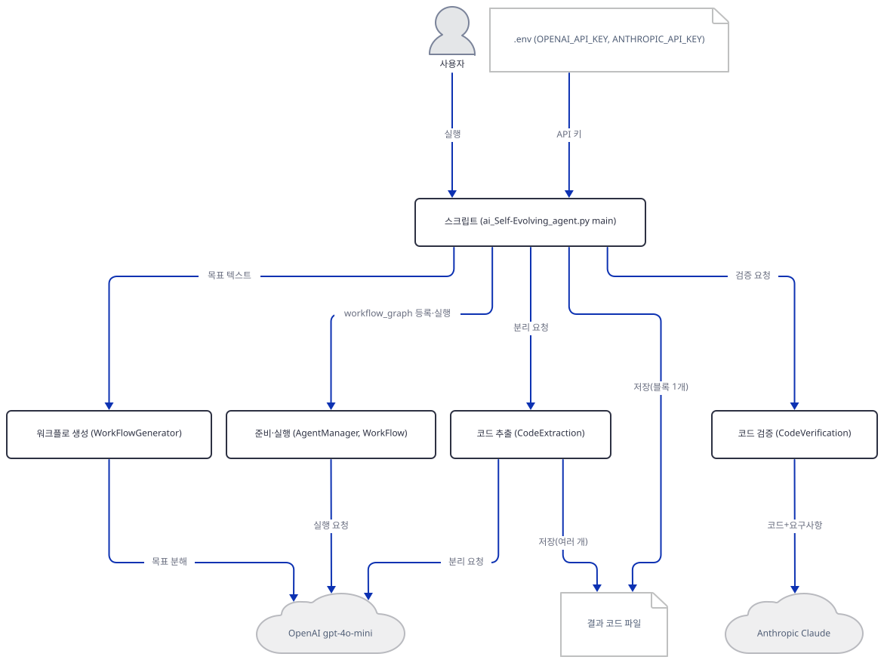

## 사전 준비

| 서비스/도구 | 용도 | 발급·설치 |
|---|---|---|
| OpenAI API 키 | 워크플로우 생성(`WorkFlowGenerator`)과 실행(`WorkFlow`) 양쪽에서 `gpt-4o-mini` 호출 | https://platform.openai.com/ 가입 후 발급, `OPENAI_API_KEY` 환경변수(이 문서는 키 없이 설치와 객체 생성까지만 직접 확인합니다) |
| Anthropic API 키 | 생성된 코드를 검증·수정하는 Claude 호출(LiteLLM 경유) — **41행이 지정한 `claude-3-7-sonnet-20250219`는 2026-02-19에 폐기되었습니다**(Anthropic "Model deprecations" 문서, 직접 확인). 끝까지 실행하려면 41행을 현재 모델(예: `anthropic/claude-sonnet-4-6`)로 바꿔야 합니다 | https://console.anthropic.com/ 가입 후 발급, `ANTHROPIC_API_KEY` 환경변수 |
| evoagentx (PyPI) | 워크플로우 자동 생성·실행·코드 검증·추출을 제공하는 프레임워크(오늘 기준 0.1.4) | `uv pip install "evoagentx[tools,rag,multimodal]"` — 기본 설치(extra 없음)만으로는 이 스크립트의 import가 끝까지 통과하지 않습니다(Step 1에서 직접 확인) |
| Python 3.12 이하 | evoagentx가 고정하는 `faiss-cpu==1.8.0.post1`에 Python 3.13·3.14용 바이너리 휠이 없음(직접 확인) | `uv venv --python 3.12` |
| uv | 가상환경 생성과 패키지 설치 | [공통 사전 준비](../README.md#공통-사전-준비-한-번만) 참고 |

## 아키텍처 한눈에 보기

| 컴포넌트 | 역할 | 코드 위치 |
|---|---|---|
| .env / 환경변수 | `OPENAI_API_KEY`·`ANTHROPIC_API_KEY` 로드 | `advanced_ai_agents/multi_agent_apps/ai_self_evolving_agent/ai_Self-Evolving_agent.py:10-12` |
| 스크립트 (`ai_Self-Evolving_agent.py`의 `main()`) | 아래 컴포넌트를 순서대로 호출하고 결과를 다음 단계로 전달, 코드 블록이 1개면 결과 파일도 직접 저장 | `advanced_ai_agents/multi_agent_apps/ai_self_evolving_agent/ai_Self-Evolving_agent.py:14`, `advanced_ai_agents/multi_agent_apps/ai_self_evolving_agent/ai_Self-Evolving_agent.py:54-61` |
| 워크플로 생성 (WorkFlowGenerator) | 목표 텍스트를 분해해 에이전트 워크플로우 그래프를 자동 생성 | `advanced_ai_agents/multi_agent_apps/ai_self_evolving_agent/ai_Self-Evolving_agent.py:4`, `advanced_ai_agents/multi_agent_apps/ai_self_evolving_agent/ai_Self-Evolving_agent.py:24-25` |
| 에이전트 준비 (AgentManager) | 그래프 노드마다 실제 에이전트 인스턴스를 등록 | `advanced_ai_agents/multi_agent_apps/ai_self_evolving_agent/ai_Self-Evolving_agent.py:5`, `advanced_ai_agents/multi_agent_apps/ai_self_evolving_agent/ai_Self-Evolving_agent.py:34-35` |
| 워크플로 실행 (WorkFlow) | 등록된 에이전트를 실행해 코드를 생성 | `advanced_ai_agents/multi_agent_apps/ai_self_evolving_agent/ai_Self-Evolving_agent.py:4`, `advanced_ai_agents/multi_agent_apps/ai_self_evolving_agent/ai_Self-Evolving_agent.py:37-38` |
| 코드 검증 (CodeVerification) | Claude로 생성된 코드를 검증·수정(41행의 스냅샷은 폐기됨 — 위 참고) | `advanced_ai_agents/multi_agent_apps/ai_self_evolving_agent/ai_Self-Evolving_agent.py:7`, `advanced_ai_agents/multi_agent_apps/ai_self_evolving_agent/ai_Self-Evolving_agent.py:41-51` |
| 코드 추출 (CodeExtraction) | 코드 문자열이 여러 파일이면 분리해 저장 | `advanced_ai_agents/multi_agent_apps/ai_self_evolving_agent/ai_Self-Evolving_agent.py:6`, `advanced_ai_agents/multi_agent_apps/ai_self_evolving_agent/ai_Self-Evolving_agent.py:63-70` |
| OpenAI gpt-4o-mini (외부) | 워크플로우 생성·실행 양쪽의 실제 추론 담당 | 코드 없음 (외부 서비스) |
| Anthropic Claude (외부, LiteLLM 경유) | 코드 검증·수정 담당 | `advanced_ai_agents/multi_agent_apps/ai_self_evolving_agent/ai_Self-Evolving_agent.py:41` |
| 결과 코드 파일 | 코드 블록 1개면 스크립트가 직접 `index.html`로 저장 | `advanced_ai_agents/multi_agent_apps/ai_self_evolving_agent/ai_Self-Evolving_agent.py:54-61` |

## 단계별 진행

### Step 1. 환경 만들기 — evoagentx가 무엇을 당기고, 무엇을 빠뜨리는지 직접 따라가기

**목적.** 앱 폴더에 격리된 가상환경을 만들고, evoagentx의 import 사슬이 어떤 순서로 무엇을 요구하는지 하나씩 설치해 가며 직접 확인합니다.

**할 일.**

```bash
cd advanced_ai_agents/multi_agent_apps/ai_self_evolving_agent
uv venv --python 3.12
uv pip install evoagentx python-dotenv
```

(pip 대안: `python -m venv .venv && source .venv/bin/activate && pip install evoagentx python-dotenv`. Windows PowerShell은 활성화만 `.venv\Scripts\Activate.ps1`로 바꿉니다.) 이 저장소는 루트에 `pyproject.toml`이 있어 `uv run`이 방금 만든 환경 대신 루트 `.venv`를 쓰므로, 이후 `uv run` 명령에는 모두 `--no-project`를 붙입니다.

`advanced_ai_agents/multi_agent_apps/ai_self_evolving_agent/ai_Self-Evolving_agent.py:1-19`

```python
import os 
from dotenv import load_dotenv 
from evoagentx.models import OpenAILLMConfig, OpenAILLM, LiteLLMConfig, LiteLLM
from evoagentx.workflow import WorkFlowGenerator, WorkFlowGraph, WorkFlow
from evoagentx.agents import AgentManager
from evoagentx.actions.code_extraction import CodeExtraction
from evoagentx.actions.code_verification import CodeVerification 
from evoagentx.core.module_utils import extract_code_blocks

load_dotenv() # Loads environment variables from .env file
OPENAI_API_KEY = os.getenv("OPENAI_API_KEY")
ANTHROPIC_API_KEY = os.getenv("ANTHROPIC_API_KEY") 

def main():

    # LLM configuration
    openai_config = OpenAILLMConfig(model="gpt-4o-mini", openai_key=OPENAI_API_KEY, stream=True, output_response=True, max_tokens=16000)
    # Initialize the language model
    llm = OpenAILLM(config=openai_config)
```

원본 앱의 `requirements.txt`(52줄)는 이 스크립트가 실제로 필요로 하는 것과 거의 무관합니다 — `pytest`·`ruff`·`textgrad`·`fastapi`·`celery`·`redis`·`sqlalchemy` 등 EvoAgentX 저장소 자체의 개발용 의존성처럼 보이는 항목들이 섞여 있고, 정작 `evoagentx` 패키지 자신은 이 목록에 없습니다(직접 확인). 게다가 35행의 `faiss-cpu==1.8.0.post1` 고정 버전에는 Python 3.13·3.14용(`cp313`·`cp314`) 바이너리 휠이 없습니다(직접 확인) — Python 3.13은 이미 안정판이 나온 지 1년 넘었고 오늘 기준 3.14도 안정판, 3.15도 베타로 나와 있으므로(`uv python list`로 확인) "최신 Python"은 아닙니다. 11~12행은 두 키를 모두 `None`이 될 수 있는 채로 읽습니다 — 아래 확인에서 보듯, 이 시점에는 아무 예외도 나지 않습니다.

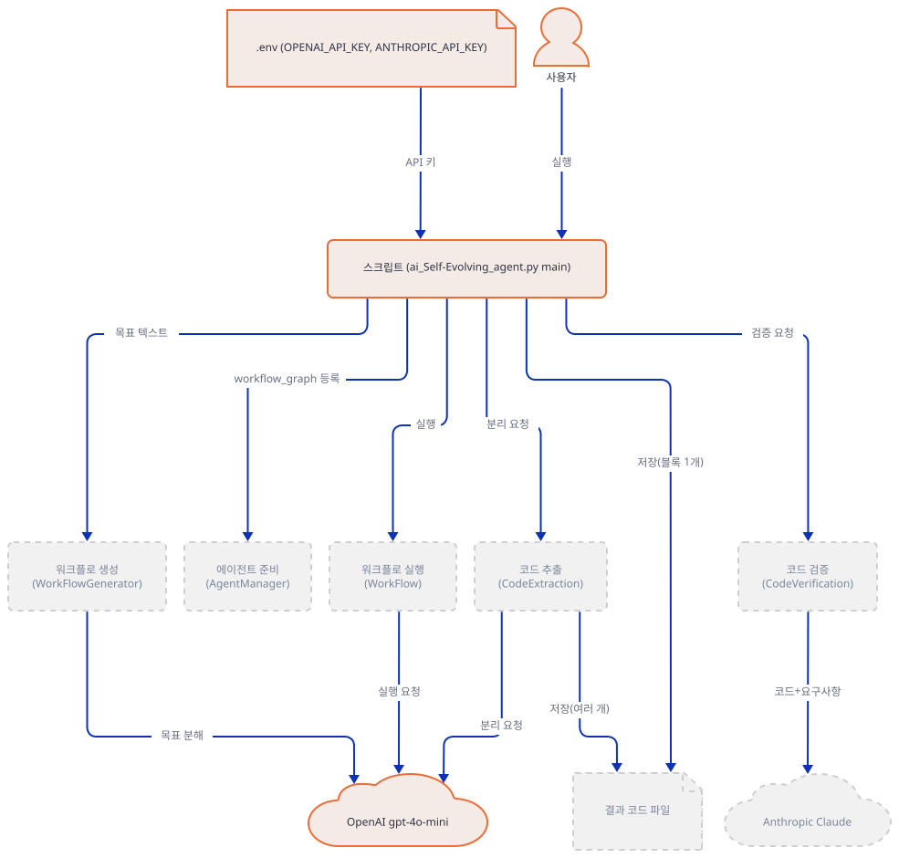

**확인.** 먼저 3.13에서는 원본 `requirements.txt`조차 설치되지 않는다는 것을 직접 봅니다(같은 폴더에 별도 3.13 venv를 하나 더 만듭니다).

```bash
uv venv .venv313 --python 3.13
uv pip install --python .venv313/Scripts/python.exe -r requirements.txt
```

직접 확인한 출력(발췌):

```
× No solution found when resolving dependencies:
  ╰─▶ Because faiss-cpu==1.8.0.post1 has no wheels with a matching Python
      ABI tag (e.g., `cp313`) and you require faiss-cpu==1.8.0.post1, we can
      conclude that your requirements are unsatisfiable.
```

이제 처음 만든 3.12 환경(`.venv`, extra 없이 evoagentx만 설치된 상태)에서 이 스크립트의 import를 하나씩 따라갑니다.

```bash
uv run --no-project python -c "from evoagentx.models import OpenAILLMConfig"
```

직접 확인한 출력(발췌):

```
ModuleNotFoundError: No module named 'docker'
```

```bash
uv pip install docker
uv run --no-project python -c "from evoagentx.models import OpenAILLMConfig"
```

```
ModuleNotFoundError: No module named 'html2text'
```

`evoagentx.models`는 여기서 끝입니다(`docker`·`html2text` 둘만 더 있으면 통과). 이번엔 `evoagentx.workflow`를 추가로 import해 봅니다.

```bash
uv pip install "evoagentx[tools]"
uv run --no-project python -c "
from evoagentx.models import OpenAILLMConfig
print('models ok')
from evoagentx.workflow import WorkFlowGenerator
"
```

직접 확인한 출력:

```
models ok
ModuleNotFoundError: No module named 'llama_index'
```

```bash
uv pip install "evoagentx[rag]"
uv run --no-project python -c "from evoagentx.workflow import WorkFlowGenerator"
```

```
ModuleNotFoundError: No module named 'voyageai'
```

```bash
uv pip install "evoagentx[multimodal]"
uv run --no-project python -m py_compile ai_Self-Evolving_agent.py && echo compiled
uv run --no-project python -c "
from evoagentx.models import OpenAILLMConfig, OpenAILLM, LiteLLMConfig, LiteLLM
from evoagentx.workflow import WorkFlowGenerator, WorkFlowGraph, WorkFlow
from evoagentx.agents import AgentManager
from evoagentx.actions.code_extraction import CodeExtraction
from evoagentx.actions.code_verification import CodeVerification
from evoagentx.core.module_utils import extract_code_blocks
print('all app imports OK')
"
```

직접 확인한 출력(2026-09-28 기준, Python 3.12.10 + evoagentx 0.1.4):

```
compiled
all app imports OK
```

`evoagentx[tools,rag,multimodal]`(위 세 extra를 합친 것과 같습니다) 하나로 한 번에 설치해도 결과는 같습니다 — `evoagentx[all]`까지 갈 필요는 없습니다(그쪽은 dspy·textgrad·optuna·matplotlib 등 17개를 더 설치합니다).

API 키 없이 `OpenAILLMConfig`·`OpenAILLM`·`WorkFlowGenerator`를 만들어도 예외가 나지 않는다는 것도 확인했습니다(아무도 듣지 않는 로컬 프록시로 외부 네트워크를 막은 채):

```bash
HTTP_PROXY=http://127.0.0.1:9 HTTPS_PROXY=http://127.0.0.1:9 ALL_PROXY=http://127.0.0.1:9 \
NO_PROXY=localhost,127.0.0.1 \
  uv run --no-project python -c "
import os
from evoagentx.models import OpenAILLMConfig, OpenAILLM
from evoagentx.workflow import WorkFlowGenerator
config = OpenAILLMConfig(model='gpt-4o-mini', openai_key=os.getenv('OPENAI_API_KEY'), stream=True, output_response=True, max_tokens=16000)
llm = OpenAILLM(config=config)
wf = WorkFlowGenerator(llm=llm)
print('config OK, key value:', repr(config.openai_key))
"
```

(PowerShell: `$env:HTTP_PROXY="http://127.0.0.1:9"; $env:HTTPS_PROXY="http://127.0.0.1:9"; $env:ALL_PROXY="http://127.0.0.1:9"; $env:NO_PROXY="localhost,127.0.0.1"`을 먼저 실행한 뒤 같은 `uv run` 줄을 씁니다.)

직접 확인한 출력(발췌, 키를 설정하지 않은 상태):

```
config OK, key value: None
```

이 호출 과정에서 litellm(evoagentx가 내부적으로 씀)이 모델 요금표를 `raw.githubusercontent.com`에서 받아오려 시도하는 것도 함께 관찰했습니다 — Day 069에서 이미 다룬 것과 같은 동작입니다(`docs/tutorials/day069-agentic-rag-math-agent/README.md:18`, `LITELLM_LOCAL_MODEL_COST_MAP=True`로 끌 수 있습니다). 로그에는 "attempt 1/3"·"attempt 2/3"·"after 3 attempts"가 찍히므로 정확히는 "3회 재시도"가 아니라 "시도 3회"(최초 1회 + 재시도 2회)입니다. 프록시가 연결을 거부해 매번 안전하게 실패하고 내장된 로컬 백업으로 대체됩니다(외부로 새어 나가지 않음, 직접 확인).

### Step 2. 목표 정의와 워크플로우 자동 생성

**목적.** 자연어 목표 하나가 `WorkFlowGenerator`를 거쳐 어떻게 멀티에이전트 워크플로우 그래프가 되는지 확인합니다.

**할 일.**

`advanced_ai_agents/multi_agent_apps/ai_self_evolving_agent/ai_Self-Evolving_agent.py:21-28`

```python
    goal = "Generate html code for the Tetris game that can be played in the browser."
    target_directory = "examples/output/tetris_game"
    
    wf_generator = WorkFlowGenerator(llm=llm)
    workflow_graph: WorkFlowGraph = wf_generator.generate_workflow(goal=goal)

    # [optional] display workflow
    workflow_graph.display()
```

evoagentx 0.1.4 소스(`evoagentx/workflow/workflow_generator.py`)로 확인하면, `generate_workflow()`는 목표 문자열이 10자 미만이면 즉시 `ValueError`를 냅니다(21행의 목표는 이 조건을 가볍게 넘습니다). 통과하면 내부적으로 `TaskPlanner`가 목표를 하위 작업으로 쪼개고, `AgentGenerator`가 작업마다 에이전트를 배정하거나 새로 만들어 `WorkFlowGraph`를 완성합니다 — 이 두 컴포넌트 모두 19행에서 만든 `llm`(OpenAI `gpt-4o-mini`)을 그대로 씁니다. 워크플로우 그래프 자체는 이 두 단계의 결과를 로컬에서 조립한 것이라(`build_workflow_from_plan`, 소스로 확인), OpenAI가 그래프 JSON을 통째로 돌려주는 것은 아닙니다 — 계획 요청 1회, 그리고 하위 작업 수만큼의 에이전트 생성 요청이 오갑니다. 즉 "어떤 에이전트가 몇 개 필요한지" 자체가 모델의 출력이므로, 같은 목표라도 실행마다 그래프 구조가 달라질 수 있습니다. `target_directory`(22행)는 상대 경로이므로 스크립트를 실행하는 위치가 결과물의 실제 저장 위치를 정합니다.

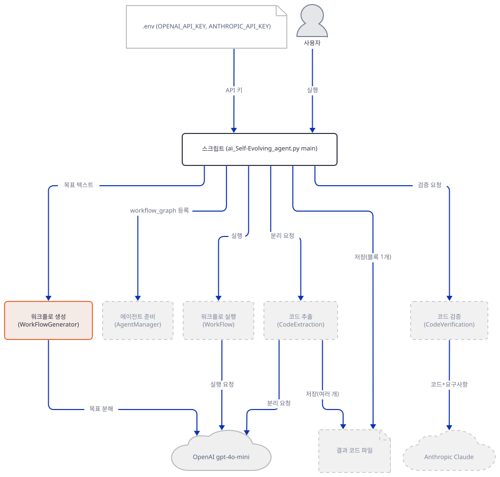

**확인.**

```bash
grep -n "class WorkFlowGenerator" -A 5 .venv/Lib/site-packages/evoagentx/workflow/workflow_generator.py
```

직접 확인한 출력:

```
20:class WorkFlowGenerator(BaseModule):
21-    """
22-    Automated workflow generation system based on high-level goals.
23-    
24-    The WorkFlowGenerator is responsible for creating complete workflow graphs
25-    from high-level goals or task descriptions. It breaks down the goal into
```

### Step 3. 에이전트 준비와 워크플로우 실행

**목적.** 그래프의 노드가 실제 에이전트 객체로 바뀌는 지점과, 그 에이전트들이 실행되어 코드를 만드는 지점을 확인합니다.

**할 일.**

`advanced_ai_agents/multi_agent_apps/ai_self_evolving_agent/ai_Self-Evolving_agent.py:34-38`

```python
    agent_manager = AgentManager()
    agent_manager.add_agents_from_workflow(workflow_graph, llm_config=openai_config)

    workflow = WorkFlow(graph=workflow_graph, agent_manager=agent_manager, llm=llm)
    output = workflow.execute()
```

evoagentx 소스(`evoagentx/agents/agent_manager.py`)로 확인하면, 35행은 `workflow_graph.nodes`를 순회하며 노드마다 딸린 에이전트 스펙을 `add_agent()`로 등록합니다 — 스펙이 dict이면 그때 `llm_config`(OpenAI 설정)로 `CustomizeAgent`를 만듭니다. 38행의 `workflow.execute()`는 내부적으로 `async_execute()`를 동기 래핑한 것으로(소스로 확인), 그래프의 각 작업을 순서대로 실행하며 필요한 에이전트를 호출합니다 — 이 호출들이 실제로 OpenAI에 요청을 보내는 지점입니다. `execute()`의 반환값은 코드 문자열이 아니라 `WorkflowResult`(`status`·`result`·`error_msg` 필드를 가진 객체)입니다 — `async_execute()`는 실행 중 예외를 전부 잡아 `status="failed"`로 바꾸므로(소스로 확인, `workflow/workflow.py`), 워크플로우 실행이 내부적으로 실패해도 스크립트는 여기서 멈추지 않습니다. 38행은 이 객체를 그대로 `output`에 담고, 다음 단계는 이것을 문자열로 다룹니다(`WorkflowResult`도 `BaseModule`이라 `__str__`이 있어 문자열로 바뀔 수 있습니다).

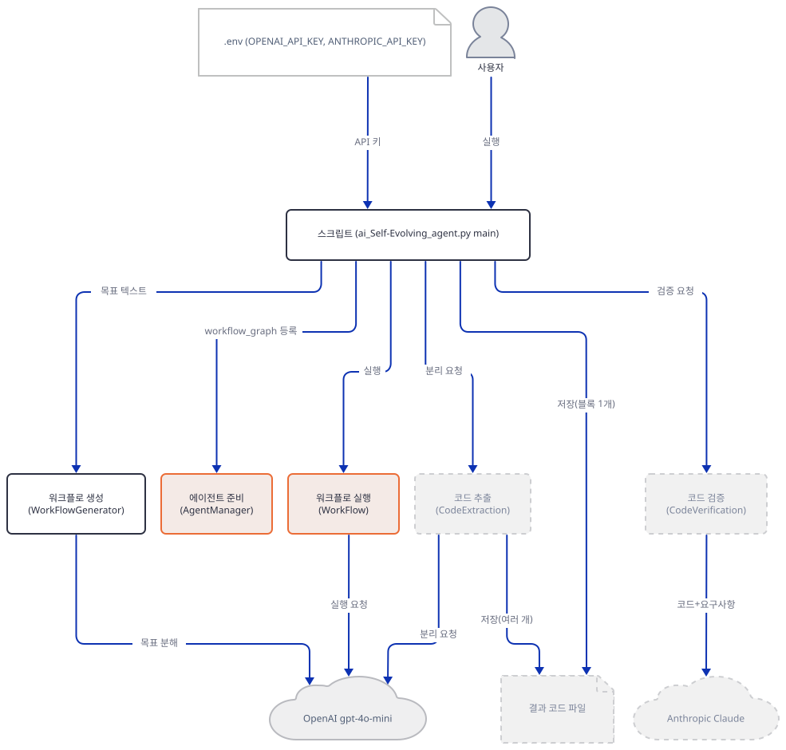

**확인.**

```bash
uv run --no-project python -c "
from evoagentx.agents import AgentManager
am = AgentManager()
print(hasattr(am, 'add_agents_from_workflow'))
"
```

직접 확인한 출력:

```
True
```

### Step 4. Claude로 코드 검증 — 그리고 여기서 막히는 이유

**목적.** 생성된 코드가 왜 다른 모델을 한 번 더 거치는지, 검증 결과가 어떤 형식으로 오는지, 그리고 지금 코드 그대로는 왜 여기서 예외로 끝나는지 확인합니다.

**할 일.**

`advanced_ai_agents/multi_agent_apps/ai_self_evolving_agent/ai_Self-Evolving_agent.py:40-51`

```python
    # verfiy the code
    verification_llm_config = LiteLLMConfig(model="anthropic/claude-3-7-sonnet-20250219", anthropic_key=ANTHROPIC_API_KEY, stream=True, output_response=True, max_tokens=20000)
    verification_llm = LiteLLM(config=verification_llm_config)
    
    code_verifier = CodeVerification()
    output = code_verifier.execute(
        llm = verification_llm, 
        inputs={
            "requirements": goal, 
            "code": output
        }
    ).verified_code
```

41행은 생성 모델과 다른 제공자(Anthropic)를 LiteLLM으로 감쌉니다 — 코드 생성과 코드 검증을 서로 다른 모델에 맡기는 것이 이 앱 이름의 "검증" 절반입니다. **그런데 41행이 지정한 `claude-3-7-sonnet-20250219`는 2026-02-19에 폐기되었습니다.** Anthropic 공식 문서 "Model deprecations"의 표에 "Retirement date: February 19, 2026 · Deprecated model: `claude-3-7-sonnet-20250219` · Recommended replacement: `claude-sonnet-4-6`"이 그대로 있고(직접 확인), litellm 1.103.0에 내장된 요금표(`.venv/Lib/site-packages/litellm/model_prices_and_context_window_backup.json`)의 같은 모델 항목에도 `"deprecation_date": "2026-02-19"`가 있습니다(직접 확인). evoagentx 소스(`evoagentx/actions/code_verification.py`)로 확인하면, `execute()`는 48행의 `requirements`(검증 기준 — 원래 목표 `goal` 문자열)와 49행의 `code`(실제 검증 대상 — `output`)를 고정 프롬프트에 채워 `llm.generate()`를 한 번 호출합니다. 이 호출에는 try/except가 없으므로, 모델이 존재하지 않아 API가 오류를 돌려주면 `CodeVerification.execute()`는 그 예외를 그대로 위로 올립니다 — `WorkFlow.execute()`(Step 3)가 모든 예외를 삼켜 `status="failed"`로 바꾸는 것과 다릅니다. 즉 두 키를 넣고 그대로 실행하면 워크플로우 생성·실행 비용은 이미 쓴 뒤, 이 45행에서 스크립트 자체가 traceback과 함께 죽고 파일은 저장되지 않습니다. 응답이 정상적으로 온다면 `analysis_summary`·`issues_identified`·`verified_code` 등의 필드로 파싱을 시도하고, 구조화된 파싱이 실패하면 응답에서 코드 블록만 다시 추출하는 방식으로 대체합니다(소스로 확인) — 이 부분은 모델을 현재 서빙되는 것으로 바꾸면 그대로 유효합니다.

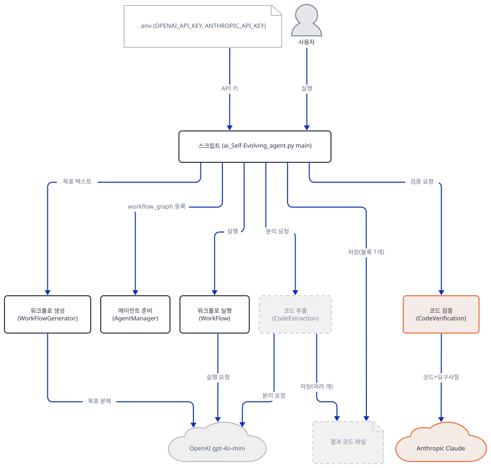

**확인.**

```bash
grep -n "def execute" -A 10 .venv/Lib/site-packages/evoagentx/actions/code_verification.py
```

직접 확인한 출력:

```
39:    def execute(self, llm: Optional[BaseLLM] = None, inputs: Optional[dict] = None, sys_msg: Optional[str]=None, return_prompt: bool = False, **kwargs) -> CodeVerificationOutput:
40-
41-        if not inputs:
42-            logger.error("CodeVerification action received invalid `inputs`: None or empty.")
43-            raise ValueError('The `inputs` to CodeVerification action is None or empty.')
44-
45-        prompt_params_names = ["code", "requirements"]
46-        prompt_params_values = {param: inputs.get(param, "Not Provided") for param in prompt_params_names}
47-        prompt = self.prompt.format(**prompt_params_values)
48-        response = llm.generate(prompt = prompt, system_message=sys_msg)
49-
```

폐기된 스냅샷을 실제로 호출하지는 않았으므로(키가 없고, 규칙상 실제 API 호출은 하지 않습니다), 여기서 나는 예외의 정확한 문구·클래스는 확인하지 못했습니다.

### Step 5. 단일 코드 블록이면 그대로 저장

**목적.** 41행을 고쳐 검증까지 끝냈다고 가정하고, 검증된 코드가 파일로 저장되는 첫 번째 경로(코드 블록이 1개일 때)를 확인합니다.

**할 일.**

`advanced_ai_agents/multi_agent_apps/ai_self_evolving_agent/ai_Self-Evolving_agent.py:53-61`

```python
    # extract the code 
    os.makedirs(target_directory, exist_ok=True)
    code_blocks = extract_code_blocks(output)
    if len(code_blocks) == 1:
        file_path = os.path.join(target_directory, "index.html")
        with open(file_path, "w") as f:
            f.write(code_blocks[0])
        print(f"You can open this HTML file in a browser to play the Tetris game: {file_path}")
        return
```

55행의 `extract_code_blocks()`(evoagentx 유틸리티)는 마크다운 코드 펜스로 감싸인 블록을 찾아 리스트로 돌려줍니다. "테트리스 게임"이라는 목표는 검증된 코드가 HTML 하나로 떨어질 가능성이 높고(Step 2에서 본 프롬프트 구조상), 그 경우 이 조건이 참이 되어 파일명을 **항상 `index.html`로 고정**한 채 저장하고 `return`으로 함수를 끝냅니다 — 원래 코드가 CSS나 JS를 분리해서 냈더라도 이 분기에서는 하나로 합쳐진 블록이어야만 여기로 옵니다. 57행의 파일명 고정 때문에, 다른 언어(예: Python)로 된 단일 블록이어도 확장자는 항상 `.html`이 됩니다 — 소스로 확인한, 코드 자체의 한계입니다.

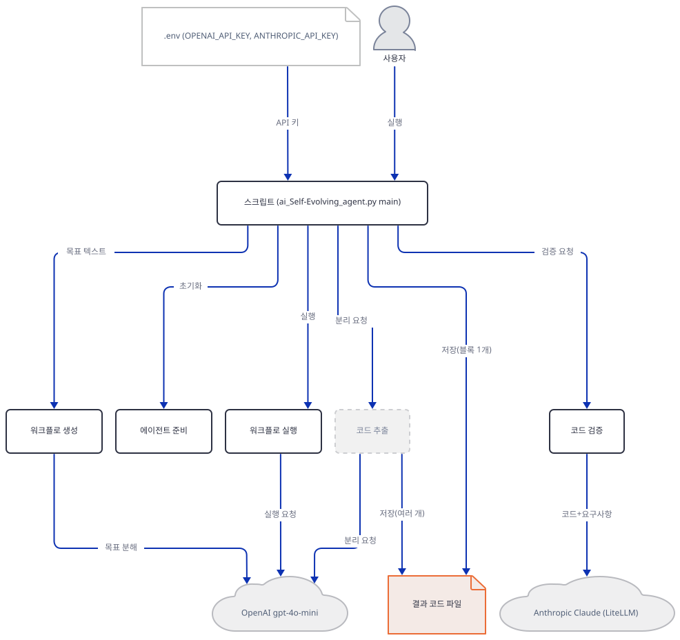

**확인.**

```bash
grep -n "extract_code_blocks" .venv/Lib/site-packages/evoagentx/core/module_utils.py | head -3
```

직접 확인한 출력:

```
268:def extract_code_blocks(text: str, return_type: bool = False) -> Union[List[str], List[tuple]]:
```

### Step 6. 여러 파일이면 CodeExtraction으로 분리 저장

**목적.** 코드 블록이 여러 개일 때 실행되는, 이 앱의 두 번째 저장 경로를 확인합니다.

**할 일.**

`advanced_ai_agents/multi_agent_apps/ai_self_evolving_agent/ai_Self-Evolving_agent.py:63-83`

```python
    code_extractor = CodeExtraction()
    results = code_extractor.execute(
        llm=llm, 
        inputs={
            "code_string": output, 
            "target_directory": target_directory,
        }
    )

    print(f"Extracted {len(results.extracted_files)} files:")
    for filename, path in results.extracted_files.items():
        print(f"  - {filename}: {path}")
    
    if results.main_file:
        print(f"\nMain file: {results.main_file}")
        file_type = os.path.splitext(results.main_file)[1].lower()
        if file_type == '.html':
            print(f"You can open this HTML file in a browser to play the Tetris game")
        else:
            print(f"This is the main entry point for your application")
```

63행은 19행에서 만든 `llm`(OpenAI `gpt-4o-mini`)을 다시 씁니다 — Claude가 아니라 처음 모델로 되돌아갑니다. evoagentx 소스(`evoagentx/actions/code_extraction.py`)로 확인하면, `execute()`는 `llm.generate()`로 코드 문자열을 언어별 블록으로 분류한 뒤 각 블록을 실제로 `target_directory`에 파일로 씁니다 — CodeExtraction 자신이 파일 저장까지 담당합니다. `identify_main_file()`은 `index.html`·`main.py`·`app.py` 같은 우선순위 목록과 확장자 휴리스틱으로 진입점을 추정합니다. Step 5에서 봤듯 "테트리스 게임"처럼 단일 HTML로 떨어지기 쉬운 목표에서는 이 경로에 도달하지 않을 가능성이 높지만, 응답이 여러 코드 블록으로 나뉘면(예: HTML·CSS·JS를 각각 펜스로 감싸 돌려주면) 이 경로가 실행됩니다 — 보장된 동작은 아닙니다.

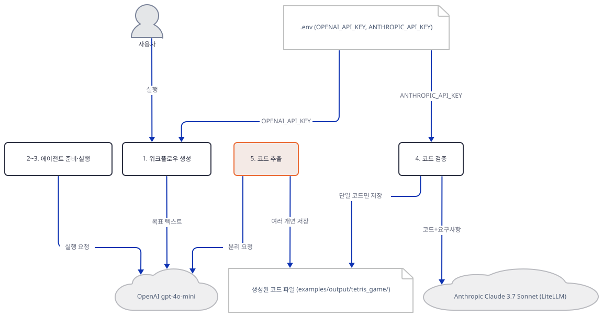

**확인.**

```bash
grep -n "os.makedirs\|open(file_path" .venv/Lib/site-packages/evoagentx/actions/code_extraction.py
```

직접 확인한 출력:

```
168:        os.makedirs(target_directory, exist_ok=True)
192:            with open(file_path, 'w', encoding='utf-8') as f:
```

### Step 7. 전체 실행 — 키 설정, 실행 명령, 그리고 41행을 고쳐야 하는 이유

**목적.** 두 키를 실제로 설정하고 앱을 끝까지 실행하는 명령을 확인하며, 지금 코드 그대로는 어디서 멈추는지 정리합니다.

**할 일.** 키를 설정합니다.

```bash
export OPENAI_API_KEY="sk-..."
export ANTHROPIC_API_KEY="sk-ant-..."
```

PowerShell:

```powershell
$env:OPENAI_API_KEY = "sk-..."
$env:ANTHROPIC_API_KEY = "sk-ant-..."
```

또는 앱 폴더에 `.env` 파일을 만들어 같은 내용을 두 줄로 적어도 됩니다(10~12행이 `load_dotenv()`로 읽습니다). 실행 명령은 다음과 같습니다.

```bash
uv run --no-project python ai_Self-Evolving_agent.py
```

지금 코드 그대로 이 명령을 실행하면, 워크플로우 생성·실행(OpenAI 호출, 비용 발생)까지는 진행되지만 Step 4에서 본 대로 41행의 모델이 폐기되어 있어 45행에서 예외가 나며 끝납니다 — `examples/output/tetris_game/`에는 아무 파일도 생기지 않습니다. 끝까지 실행하려면 41행의 `"anthropic/claude-3-7-sonnet-20250219"`를 현재 서빙되는 모델 문자열(예: `"anthropic/claude-sonnet-4-6"`)로 직접 바꿔야 합니다.

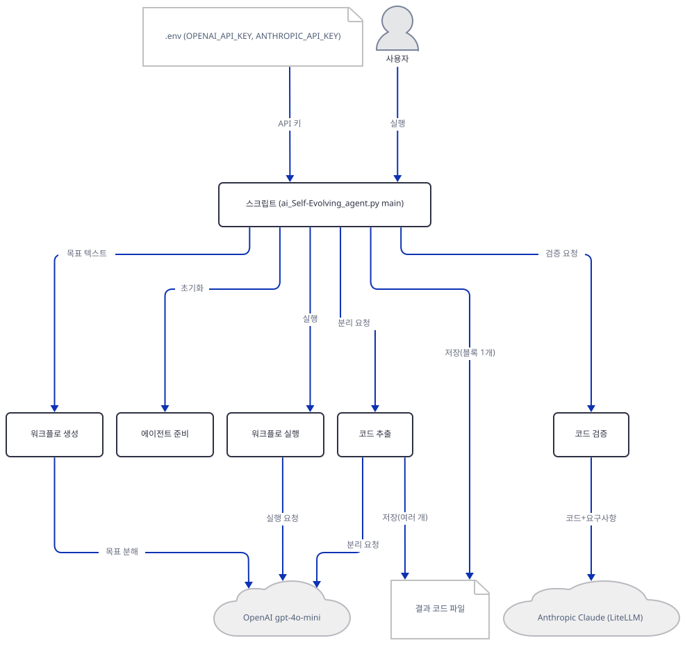

**확인.** 키가 아예 없을 때 어디까지는 예외 없이 가는지도 확인했습니다(비용 없이).

```bash
uv run --no-project python -c "
import os
os.environ.pop('OPENAI_API_KEY', None)
os.environ.pop('ANTHROPIC_API_KEY', None)
from evoagentx.models import OpenAILLMConfig, OpenAILLM
from evoagentx.workflow import WorkFlowGenerator
config = OpenAILLMConfig(model='gpt-4o-mini', openai_key=None, stream=True, output_response=True, max_tokens=16000)
llm = OpenAILLM(config=config)
wf = WorkFlowGenerator(llm=llm)
print('여기까지는 키 없이도 예외 없음')
"
```

직접 확인한 출력:

```
여기까지는 키 없이도 예외 없음
```

`generate_workflow(goal=...)`을 실제로 부르면 OpenAI에 네트워크 요청이 나가므로(규칙상 이 문서는 여기서 멈춥니다), 키가 없거나 네트워크가 없으면 이 지점부터는 연결 오류로 실패합니다.

## 요청 한 건이 흐르는 과정

이 요청은 세 구간으로 나뉩니다. 8명(사용자·스크립트·WorkFlowGenerator·OpenAI·WorkFlow·CodeVerification·Anthropic·결과 파일)이 한 그림에 다 들어가면 폭이 넘쳐(직접 확인, 1703px) 앱의 실제 시간 경계(생성 → 실행 → 검증·저장)로 나눴습니다. 메시지는 모두 원래 순서 그대로 정확히 한 그림에 있습니다.

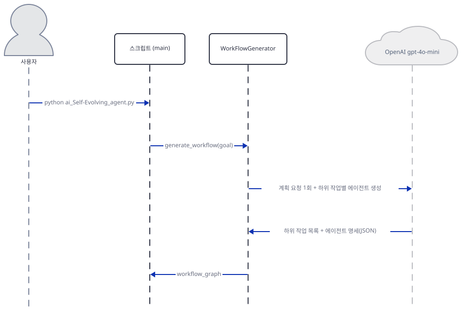

사용자가 스크립트를 실행하면 `WorkFlowGenerator`가 계획을 한 번 요청하고 하위 작업마다 에이전트 생성을 요청합니다(그림의 화살표 하나로 접었지만 실제로는 계획 1회 + 하위 작업 수만큼의 요청입니다, Step 2). OpenAI는 하위 작업 목록과 에이전트 명세를 돌려주고, `WorkFlowGenerator`는 이를 조립한 `workflow_graph`를 스크립트에 돌려줍니다.

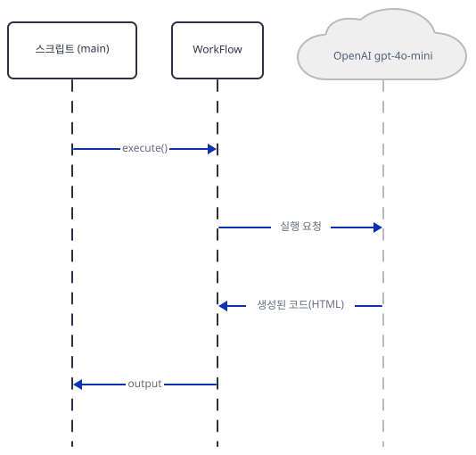

스크립트는 이 그래프로 `WorkFlow`를 실행하고, `WorkFlow`는 다시 OpenAI에 요청해 실제 코드(HTML)를 생성합니다. 여기까지의 결과가 `output`(정확히는 `WorkflowResult` 객체, Step 3)에 담깁니다.

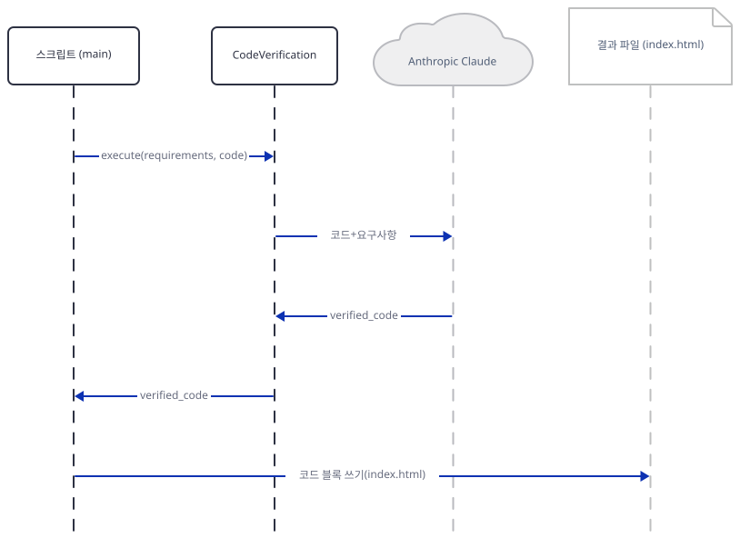

스크립트는 이 `output`을 `CodeVerification`에 넘기고, `CodeVerification`은 Anthropic Claude에 코드와 요구사항을 함께 보내 `verified_code`를 돌려받습니다 — **다만 지금 코드가 부르는 스냅샷은 폐기되어 있어(Step 4), 실제로는 이 화살표에서 예외가 나며 끝납니다.** 41행을 현재 모델로 고친 뒤라면, 검증된 코드가 다시 `output`을 덮어쓰고, 스크립트는 코드 블록 개수를 세어 1개면 `index.html`로 직접 저장합니다. 여러 개였다면 `CodeExtraction`이 세 번째로 OpenAI를 호출해 파일별로 나눠 저장했을 것입니다(Step 6) — "테트리스 게임" 같은 단순 목표에서는 블록 1개로 떨어질 가능성이 높아 이 경로를 타지 않을 수 있습니다(보장은 아닙니다).

## 실행 체크리스트

- [ ] Python 3.12 가상환경에서 `evoagentx`를 extra 없이 설치하면 import가 `docker`→`html2text`→(`[tools]` 설치 후) `llama_index`→(`[rag]` 설치 후) `voyageai` 순으로 `ModuleNotFoundError`를 낸다는 것을 직접 재현했다
- [ ] `evoagentx[tools,rag,multimodal]`까지 설치하면 이 스크립트의 import 6줄이 전부 통과한다는 것을 직접 확인했다(`[all]`까지는 필요 없다)
- [ ] `requirements.txt`의 `faiss-cpu==1.8.0.post1`에 Python 3.13·3.14용 바이너리 휠이 없어 그 환경에서는 설치 자체가 실패한다는 것을 직접 확인했다
- [ ] `OPENAI_API_KEY`·`ANTHROPIC_API_KEY` 없이도 `OpenAILLMConfig`·`OpenAILLM`·`WorkFlowGenerator` 객체 생성까지는 예외 없이 된다는 것을 직접 확인했다
- [ ] **41행이 부르는 `claude-3-7-sonnet-20250219`가 2026-02-19에 폐기되어, 키를 넣고 그대로 실행하면 OpenAI 비용을 쓴 뒤 45행에서 예외로 끝난다는 것을 Anthropic 공식 문서와 litellm 요금표로 확인했다**
- [ ] 두 키를 설정하고 `uv run --no-project python ai_Self-Evolving_agent.py`로 실행하는 방법을 확인했다(41행을 고치기 전에는 끝까지 가지 않는다)
- [ ] litellm이 모델 요금표를 GitHub에서 받으려 시도하고, 네트워크를 막으면 연결 거부로 안전하게 실패한다는 것을 직접 확인했다(Day 069와 같은 동작)

## 문제 해결

| 증상 | 원인 | 해결 |
|---|---|---|
| 두 키를 넣고 그대로 실행하면 OpenAI 비용을 쓴 뒤 45행에서 예외로 끝나고 파일이 저장되지 않음 | 41행이 부르는 `claude-3-7-sonnet-20250219`가 2026-02-19에 폐기됨(Anthropic 공식 "Model deprecations" 문서, litellm 1.103.0 내장 요금표 둘 다로 확인) | 리포 코드는 고치지 않으면 실행 불가 — 41행의 모델 문자열을 현재 서빙되는 모델(예: `anthropic/claude-sonnet-4-6`)로 바꿔야 함 |
| Python 3.13(또는 3.14)에서 `uv pip install -r requirements.txt`가 evoagentx를 설치하기도 전에 실패 | `requirements.txt` 35행의 `faiss-cpu==1.8.0.post1`에 `cp313`·`cp314` 바이너리 휠이 없음(직접 확인) | 리포 코드는 고치지 않음 — Python 3.12 이하 가상환경 사용 |
| `evoagentx` 설치 후 이 스크립트의 import 문장들이 `ModuleNotFoundError: No module named 'docker'`(고치면 `html2text`, `llama_index`, `voyageai` 순으로 계속) | evoagentx 0.1.4의 base 패키지 import 사슬이 `tools`·`rag`·`multimodal` extra의 의존성까지 끌어들이는데, extra를 지정하지 않으면 그 패키지들이 없음(직접 확인) | `pip install "evoagentx[tools,rag,multimodal]"`로 설치(리포 코드는 고치지 않음) |
| 원본 README의 `pip install git+https://github.com/ANative-Lab/EvoAgentX.git`가 매번 소스 빌드를 함 | evoagentx가 이제 PyPI(0.1.4)에 배포돼 있어 git 설치가 더 이상 필요하지 않음(직접 확인) — URL 자체는 유효함(GitHub 301 리다이렉트로 확인) | `pip install evoagentx` 계열로 대체 가능(리포 코드는 고치지 않음, 설치 안내일 뿐) |

## 더 해보기

- `ai_Self-Evolving_agent.py:41`의 모델 문자열을 `anthropic/claude-sonnet-4-6`(Anthropic 공식 권장 대체 모델)으로 바꾸고 두 키를 넣어 실제로 끝까지 실행해, `examples/output/tetris_game/index.html`이 만들어지는지 직접 확인해보기 — 이 수정 없이는 앱이 끝까지 가지 않습니다
- `ai_Self-Evolving_agent.py:21`의 목표를 "여러 개의 파일로 구성된 정적 웹사이트를 만들어라"처럼 바꿔, `CodeExtraction` 경로(`ai_Self-Evolving_agent.py:63-83`)가 실제로 실행되고 `results.extracted_files`에 여러 항목이 담기는지 확인해보기
- `ai_Self-Evolving_agent.py:28`의 `workflow_graph.display()` 출력을 같은 목표로 여러 번 실행해 비교하며, `WorkFlowGenerator`가 매번 같은 개수·구조의 에이전트를 만드는지 확인해보기

## 다음 날 예고

[Day 081 · 🗞️ AI Journalist Agent](../day081-ai-journalist-agent/README.md) — agno `Team`(Editor)이 Searcher·Writer를 이끄는 앱으로, Day 079에 이은 이 시리즈 두 번째 Team 날입니다.
