# Day 081 · 🗞️ AI Journalist Agent

> 볼륨 7 🚀 Advanced AI Agents · 난이도 ★★★ · 예상 소요 70분 · API 비용 대략 기사 1건에 `gpt-4o` 호출 다회(리더의 위임 판단·종합 2회 이상 + Searcher의 검색어 생성·분석 1회 이상 + SerpApi 검색 최대 3회 + Writer의 기사 읽기(고른 URL마다)·집필 1회 이상) — Writer가 기사 원문 전체 텍스트를 그대로 컨텍스트에 넣고 15문단 이상 글을 쓰므로 입출력 토큰이 커질 수 있어, OpenAI 공식 요금표(`gpt-4o` 기준 입력 $2.50·출력 $10.00, 1M 토큰당, 직접 확인) 대입 시 대략 $0.1~$0.5 수준으로 폭넓게 추정(대략치 — 키가 없어 실제 호출 횟수·토큰 수는 확인하지 못함) · 원본 앱: `advanced_ai_agents/single_agent_apps/ai_journalist_agent`

## 오늘 만들 것

지난 Day 080은 evoagentx라는 다른 프레임워크를 다뤘고, 오늘은 다시 agno로 돌아옵니다. Day 079가 이 시리즈에서 agno `Team`을 처음 만난 날이었고(소스 검색으로 확인한 사실, `docs/tutorials/day079-ai-movie-production-agent/README.md`), 오늘의 92줄짜리 `journalist_agent.py`(마지막 줄에 개행이 없어 `wc -l`은 91로 세지만 실제로는 92줄, 직접 확인)가 두 번째 `Team` 날입니다. 구조는 Day 079와 닮았습니다 — `Searcher`·`Writer` 두 `Agent`를 `Editor`라는 `Team`이 묶고, 위임 여부를 팀 리더(자신의 `OpenAIChat` 모델을 따로 가짐)가 판단합니다. 다른 점 두 가지가 오늘의 핵심입니다. 첫째, 두 `Agent` 모두 `role=` 인자를 받습니다(Day 079의 `ScriptWriter`·`CastingDirector`에는 없던 인자, 소스로 확인) — 이 문자열은 리더가 "누구에게 무엇을 시킬지" 판단할 때 보는 멤버 목록에 그대로 들어갑니다. 둘째, Day 079는 `CastingDirector` 하나만 외부 도구(SerpApi)를 가졌지만, 오늘은 `Searcher`(SerpApi 검색)와 `Writer`(`Newspaper4kTools`로 기사 원문 읽기) **둘 다** 외부 도구를 가져, 그림에 외부 대상이 하나 더 늘었습니다.

`Writer`의 지시문(52~61행)에는 흥미로운 어긋남이 있습니다. "`get_article_text`로 기사를 읽으라"고 시키는데, 정작 7행이 임포트하는 `Newspaper4kTools`(`agno.tools.newspaper4k`)가 실제로 노출하는 함수는 `read_article` 하나뿐입니다(직접 확인, 아래 Step 4). `get_article_text`는 agno의 **다른** 구식 툴킷 `agno.tools.newspaper.NewspaperTools`(`newspaper3k` 기반)가 쓰던 이름입니다(소스로 확인) — 그리고 앱 자체 README(`advanced_ai_agents/single_agent_apps/ai_journalist_agent/README.md:40`)도 "Writer: Retrieves the text from the provided URLs using the **NewspaperToolkit**"이라 적어, 코드가 실제로 쓰는 `Newspaper4kTools`가 아니라 이 구식 이름을 가리킵니다. 즉 지시문 텍스트와 앱 자체 README 둘 다, 코드가 `Newspaper4kTools`로 갈아탄 뒤 갱신되지 않은 흔적입니다(README·소스 대조로 확인). 두 키(OpenAI, SerpAPI)를 모두 입력하고 주제를 적으면, Editor가 Searcher에게 검색을 맡기고 Writer에게 집필을 맡긴 뒤 결과를 종합합니다. 아래는 완성된 아키텍처입니다.

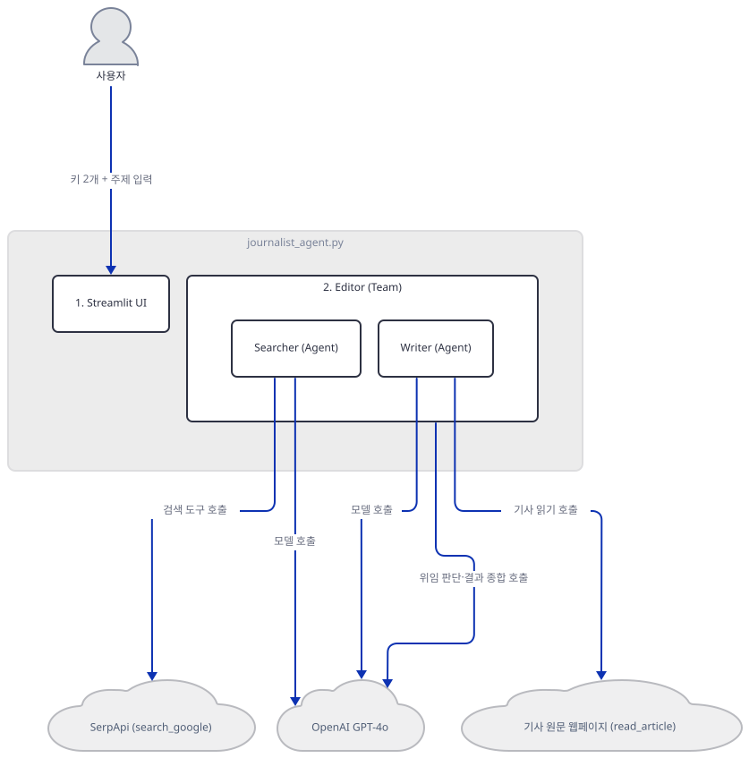

## 사전 준비

| 서비스/도구 | 용도 | 발급·설치 |
|---|---|---|
| OpenAI API 키 | Searcher·Writer·Editor가 공유하는 `gpt-4o` 모델 호출 인증. 화면 입력창에 직접 붙여넣는다(환경변수 아님) | https://platform.openai.com/ 가입 후 발급 |
| SerpAPI 키 | Searcher가 `search_google` 도구로 실제 검색 결과를 가져올 때 사용 | https://serpapi.com/ 가입 후 발급 |
| uv | 가상환경 생성과 패키지 설치 | [공통 사전 준비](../README.md#공통-사전-준비-한-번만) 절 참고 |
| 인터넷 연결 | PyPI 설치, OpenAI·SerpApi 접속, Writer가 읽을 기사 원문 웹페이지 접속 | 별도 설치 없음. 사내망이면 관련 도메인 접속 허용 필요 |

## 아키텍처 한눈에 보기

| 컴포넌트 | 역할 | 코드 위치 |
|---|---|---|
| 사용자 | 브라우저에서 키 2개와 기사 주제 입력 | 코드 없음 (브라우저) |
| Streamlit UI | 제목·캡션·키 입력창 2개·주제 입력창을 그리고, 주제가 채워지면 Editor를 실행 | `advanced_ai_agents/single_agent_apps/ai_journalist_agent/journalist_agent.py:11-21,85-92` |
| Searcher (Agent) | 주제로 검색어 3개를 만들고 `search_google`로 관련 URL 10개를 추림 | `advanced_ai_agents/single_agent_apps/ai_journalist_agent/journalist_agent.py:22-41` |
| Writer (Agent) | URL들의 기사 원문을 읽어 15문단 이상의 기사 초안을 작성 | `advanced_ai_agents/single_agent_apps/ai_journalist_agent/journalist_agent.py:42-65` |
| Editor (Team) | Searcher·Writer를 멤버로 묶어 위임하고 결과를 하나의 기사로 종합 | `advanced_ai_agents/single_agent_apps/ai_journalist_agent/journalist_agent.py:67-83` |
| OpenAI GPT-4o | 세 곳(Searcher·Writer·팀 리더)이 공유하는 추론 모델 | 코드 없음 (외부 서비스, 호출 지점 `journalist_agent.py:25,45,69`) |
| SerpApi | Searcher가 검색어마다 호출하는 실제 웹 검색 API | 코드 없음 (외부 서비스) |
| 기사 원문 웹페이지 | Writer가 `read_article`로 직접 내려받는 임의의 URL(별도 API 아님) | 코드 없음 (외부 웹) |

## 단계별 진행

### Step 1. 환경 만들기 — 이번엔 빠진 패키지가 없습니다

**목적.** 격리된 가상환경에 6줄짜리 `requirements.txt`를 설치하고, 이 파일만으로 앱의 임포트 7줄이 곧바로 통과하는지 확인합니다.

**할 일.**

```bash
cd advanced_ai_agents/single_agent_apps/ai_journalist_agent
uv venv
uv pip install -r requirements.txt
```

(pip 대안: `python -m venv .venv && source .venv/bin/activate && pip install -r requirements.txt`. Windows PowerShell은 활성화만 `.venv\Scripts\Activate.ps1`로 바꿉니다.) 이 저장소는 루트에 `pyproject.toml`이 있어 `uv run`이 방금 만든 환경 대신 루트의 `.venv`를 쓰므로, 이후 `uv run` 명령에는 모두 `--no-project`를 붙입니다.

`advanced_ai_agents/single_agent_apps/ai_journalist_agent/requirements.txt:1-6`

```text
streamlit 
agno>=2.2.10
openai
google-search-results 
newspaper4k 
lxml_html_clean
```

(6줄, 마지막 줄에 개행이 없어 `wc -l`은 5로 셉니다.) 이 문서를 작성하며 설치했을 때는 **agno 3.0.11**, **streamlit 1.64.0**, **openai 3.19.2**, **google-search-results 2.4.2**, **newspaper4k 0.9.6**, **lxml_html_clean 0.4.5**가 받아졌습니다(직접 확인, 2026-09-28 기준 최신). Day 079의 `requirements.txt`와 달리 이번엔 실제로 쓰는 도구(`Newspaper4kTools`)가 요구하는 `lxml_html_clean`이 이미 목록에 있어서, 설치만으로 임포트 7줄이 전부 통과합니다 — 빠진 패키지를 찾아 추가 설치할 필요가 없습니다.

```bash
uv run --no-project python -m py_compile journalist_agent.py && echo compiled
uv run --no-project python -c "
from textwrap import dedent
from agno.agent import Agent
from agno.team import Team
from agno.run.agent import RunOutput
from agno.tools.serpapi import SerpApiTools
from agno.tools.newspaper4k import Newspaper4kTools
import streamlit as st
from agno.models.openai import OpenAIChat
print('all imports OK')
"
```

직접 확인한 출력:

```
compiled
all imports OK
```

`from agno.tools.newspaper4k import Newspaper4kTools` 줄에서 "`UserWarning: nltk is not installed. Some NLP features will be unavailable.`"라는 경고가 함께 찍히지만(직접 확인), 이 앱은 요약(`include_summary`) 기능을 쓰지 않으므로 무시해도 됩니다(문제 해결).

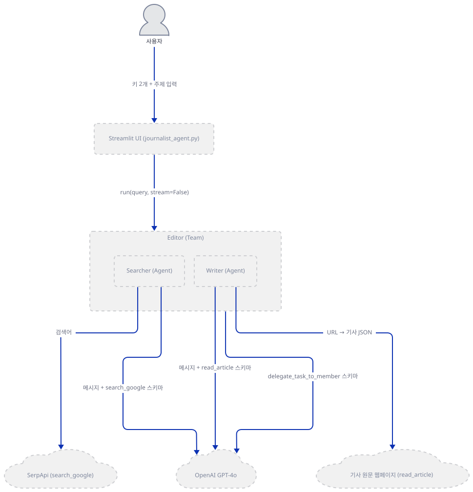

**확인.** 위 두 명령(`compiled`, `all imports OK`)이 그대로 통과하는지 봅니다.

### Step 2. 제목·캡션과 두 키 게이트

**목적.** 화면에 무엇이 먼저 뜨는지, 그리고 두 키가 모두 있어야 나머지 코드가 실행되는 구조를 확인합니다. 이 게이트 패턴 자체는 Day 079 Step 2와 같습니다(소스로 확인) — 여기서는 이 앱의 실제 문구만 봅니다.

**할 일.**

`advanced_ai_agents/single_agent_apps/ai_journalist_agent/journalist_agent.py:11-21`

```python
# Set up the Streamlit app
st.title("AI Journalist Agent 🗞️")
st.caption("Generate High-quality articles with AI Journalist by researching, wriritng and editing quality articles on autopilot using GPT-4o")

# Get OpenAI API key from user
openai_api_key = st.text_input("Enter OpenAI API Key to access GPT-4o", type="password")

# Get SerpAPI key from the user
serp_api_key = st.text_input("Enter Serp API Key for Search functionality", type="password")

if openai_api_key and serp_api_key:
```

13행의 캡션에는 "wriritng"이라는 오타가 그대로 있습니다(소스 그대로 인용). 21행의 `if` 이후 나머지 코드(22~92행) 전부가 4칸 들여쓰기로 이 블록 안에 있어(소스 들여쓰기로 확인), 두 키 중 하나라도 비어 있으면 제목·캡션·키 입력창 두 개 외에는 아무것도 그려지지 않습니다.

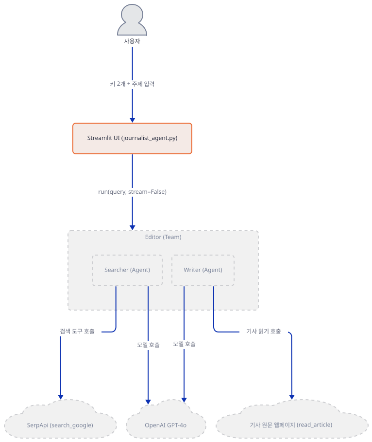

**확인.**

```bash
sed -n '11,21p' journalist_agent.py
```

직접 확인한 출력은 위 발췌와 같습니다(줄 번호 11~21).

### Step 3. Searcher 에이전트 — `role`이 리더에게 하는 일

**목적.** `SerpApiTools`가 무엇을 노출하는지(Day 012·079에서 이미 확인한 사실과 같습니다), 그리고 이번에 처음 쓰는 `role=` 인자가 무엇을 위한 것인지 확인합니다.

**할 일.**

`advanced_ai_agents/single_agent_apps/ai_journalist_agent/journalist_agent.py:22-41`

```python
    searcher = Agent(
        name="Searcher",
        role="Searches for top URLs based on a topic",
        model=OpenAIChat(id="gpt-4o", api_key=openai_api_key),
        description=dedent(
            """\
        You are a world-class journalist for the New York Times. Given a topic, generate a list of 3 search terms
        for writing an article on that topic. Then search the web for each term, analyse the results
        and return the 10 most relevant URLs.
        """
        ),
        instructions=[
            "Given a topic, first generate a list of 3 search terms related to that topic.",
            "For each search term, `search_google` and analyze the results."
            "From the results of all searcher, return the 10 most relevant URLs to the topic.",
            "Remember: you are writing for the New York Times, so the quality of the sources is important.",
        ],
        tools=[SerpApiTools(api_key=serp_api_key)],
        add_datetime_to_context=True,
    )
```

35~36행은 쉼표 없이 문자열 리터럴 두 개가 나란히 있습니다 — 파이썬이 인접한 문자열 리터럴을 자동으로 하나로 합치므로, `instructions` 리스트의 이 항목은 실제로는 "For each search term...analyze the results.From the results...to the topic."이 붙은 문자열 **하나**입니다(줄바꿈 없이 이어짐, 소스 들여쓰기·쉼표 위치로 확인). 리스트 항목이 하나 줄었을 뿐 프롬프트에 들어가는 문장 자체는 거의 같아 동작에 영향은 없습니다. 24행의 `role`은 33~38행의 `instructions`와 별개로, **Editor가 위임을 판단할 때 보는 멤버 소개**로 쓰입니다 — agno 소스(`_messages.py:136-137`, `agno/team/` 아래 — Searcher·Writer는 `Agent`이므로 멤버가 `Team`일 때의 122~123행이 아니라 이 else 분기가 해당합니다)로 확인하면, 멤버 목록을 만들 때 `role`이 있으면 `Role: {member.role}` 줄을 그 멤버의 설명(`Description:`) 앞에 넣습니다. `SerpApiTools`가 기본값으로 노출하는 함수는 `search_google` 하나뿐이라는 것은 Day 012·079가 이미 확인했으므로 되풀이하지 않습니다.

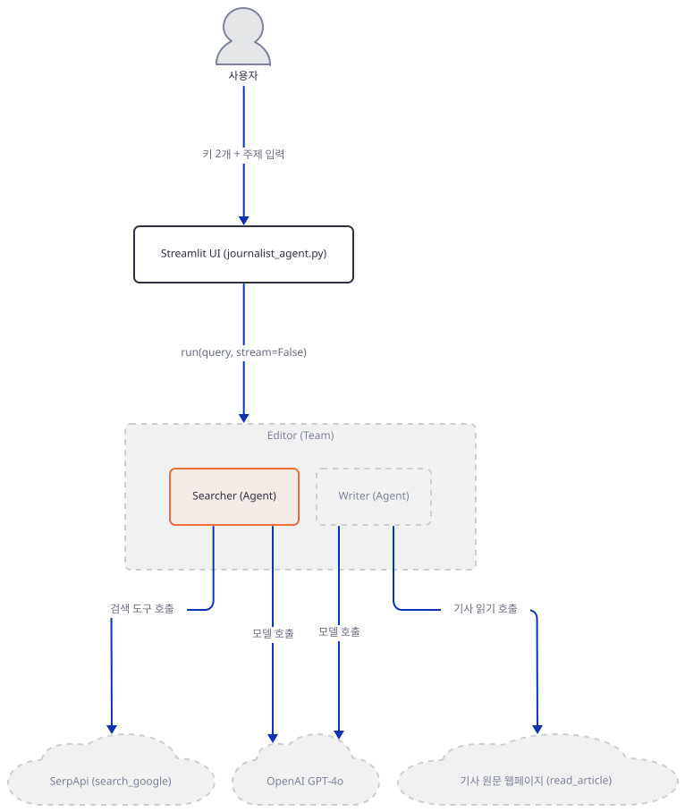

**확인.**

```bash
grep -n "role=" journalist_agent.py
uv run --no-project python -c "
from agno.tools.serpapi import SerpApiTools
print(sorted(SerpApiTools(api_key='fake').functions.keys()))
"
```

직접 확인한 출력:

```
24:        role="Searches for top URLs based on a topic",
44:        role="Retrieves text from URLs and writes a high-quality article",
['search_google']
```

### Step 4. Writer 에이전트 — 지시문이 부르는 함수가 실제로 없습니다

**목적.** `Newspaper4kTools`가 실제로 노출하는 함수 이름을 확인하고, Writer의 지시문이 부르는 이름과 왜 어긋나는지 소스로 추적합니다.

**할 일.**

`advanced_ai_agents/single_agent_apps/ai_journalist_agent/journalist_agent.py:42-65`

```python
    writer = Agent(
        name="Writer",
        role="Retrieves text from URLs and writes a high-quality article",
        model=OpenAIChat(id="gpt-4o", api_key=openai_api_key),
        description=dedent(
            """\
        You are a senior writer for the New York Times. Given a topic and a list of URLs,
        your goal is to write a high-quality NYT-worthy article on the topic.
        """
        ),
        instructions=[
            "Given a topic and a list of URLs, first read the article using `get_article_text`."
            "Then write a high-quality NYT-worthy article on the topic."
            "The article should be well-structured, informative, and engaging",
            "Ensure the length is at least as long as a NYT cover story -- at a minimum, 15 paragraphs.",
            "Ensure you provide a nuanced and balanced opinion, quoting facts where possible.",
            "Remember: you are writing for the New York Times, so the quality of the article is important.",
            "Focus on clarity, coherence, and overall quality.",
            "Never make up facts or plagiarize. Always provide proper attribution.",
        ],
        tools=[Newspaper4kTools()],
        add_datetime_to_context=True,
        markdown=True,
    )
```

53~55행은 Step 3에서 본 것보다 더 심합니다 — 쉼표 없는 문자열 리터럴이 **세 개** 이어져("...using `get_article_text`." + "Then write..." + "The article should be well-structured, informative, and engaging"), 55행 끝에야 쉼표가 나옵니다. 즉 이 세 문장이 지시문 리스트의 한 항목으로 합쳐집니다(소스로 확인). 더 중요한 것은 그 안의 내용입니다 — "read the article using `get_article_text`"라고 명시적으로 함수 이름을 지목하는데, 62행이 만드는 `Newspaper4kTools()`는 agno 3.0.11 기준 `read_article` 함수 하나만 노출합니다(생성자 기본값 `enable_read_article=True`, 소스 `agno/tools/newspaper4k.py`로 확인). `get_article_text`는 이 파일에 없습니다 — 그 이름은 agno의 또 다른 툴킷 `agno.tools.newspaper.NewspaperTools`(`newspaper3k` 기반, 소스로 확인)가 노출하던 함수입니다. 앱 자체 README(`advanced_ai_agents/single_agent_apps/ai_journalist_agent/README.md:40`)도 Writer가 "NewspaperToolkit"을 쓴다고 적어, 코드가 실제로 임포트하는 `Newspaper4kTools`(7행)와 다른 이름을 가리킵니다. 실제 실행에서는 모델이 도구 스키마 자체를 보고 `read_article`을 호출하므로(도구 이름은 함수 스키마로 전달되지, 지시문 텍스트가 실행을 좌우하지 않습니다) 이 어긋남이 동작을 완전히 막지는 않을 것으로 보이지만, 실제 키로 확인하지는 못했습니다(문제 해결).

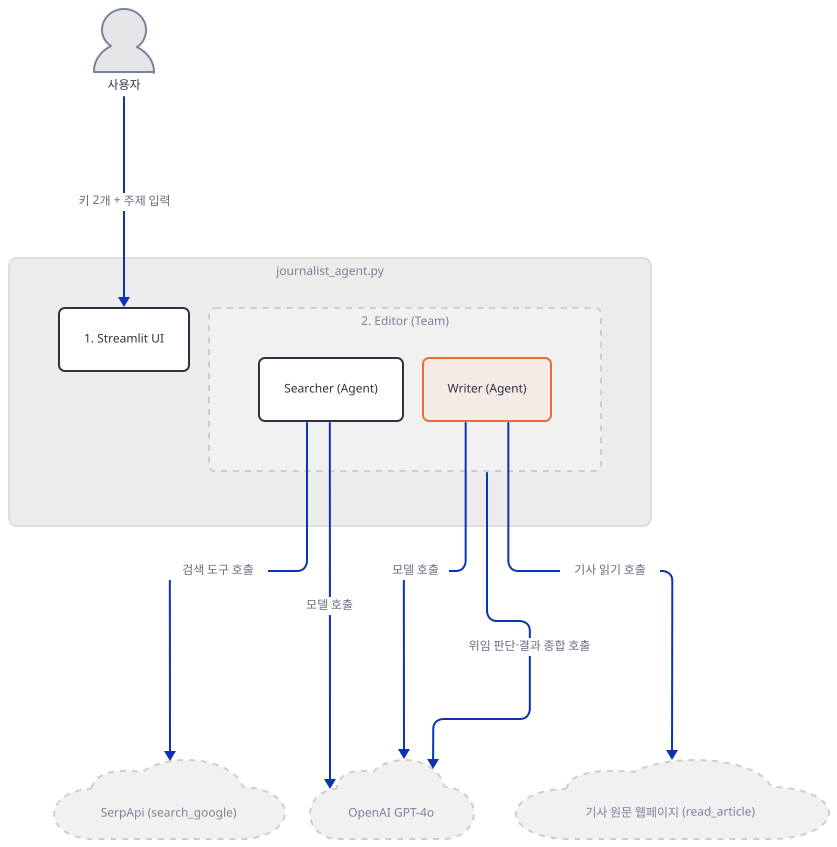

**확인.**

```bash
uv run --no-project python -c "
from agno.tools.newspaper4k import Newspaper4kTools
print(sorted(Newspaper4kTools().functions.keys()))
"
```

직접 확인한 출력:

```
['read_article']
```

### Step 5. Editor — 두 번째로 쓰는 agno `Team`

**목적.** `Team`이 이번에도 `coordinate` 모드로 동작한다는 것을 확인하고, Day 079와 달라진 점(멤버 둘 다 도구를 가짐)이 시퀀스에 어떤 영향을 주는지 짚습니다.

**할 일.**

`advanced_ai_agents/single_agent_apps/ai_journalist_agent/journalist_agent.py:67-83`

```python
    editor = Team(
        name="Editor",
        model=OpenAIChat(id="gpt-4o", api_key=openai_api_key),
        members=[searcher, writer],
        description="You are a senior NYT editor. Given a topic, your goal is to write a NYT worthy article.",
        instructions=[
            "Given a topic, ask the search journalist to search for the most relevant URLs for that topic.",
            "Then pass a description of the topic and URLs to the writer to get a draft of the article.",
            "Edit, proofread, and refine the article to ensure it meets the high standards of the New York Times.",
            "The article should be extremely articulate and well written. "
            "Focus on clarity, coherence, and overall quality.",
            "Ensure the article is engaging and informative.",
            "Remember: you are the final gatekeeper before the article is published.",
        ],
        add_datetime_to_context=True,
        markdown=True,
    )
```

76~77행에 같은 쉼표 누락 패턴이 한 번 더 있습니다("...well written. " + "Focus on clarity...")— 이 파일의 세 `instructions` 블록 모두에서 나타나는 습관입니다. `mode`를 지정하지 않아 기본값 `coordinate`로 동작하는 것, 위임이 리더 모델의 `delegate_task_to_member(member_id, task)` 도구 호출로 일어나는 것, `determine_input_for_members=True`·`respond_directly=False` 기본값, `Team`의 `telemetry` 기본값이 `True`인 것은 모두 Day 079 Step 5가 같은 agno 3.0.11에서 이미 확인한 사실이므로 되풀이하지 않습니다(`mode.py`, `_default_tools.py:479`, 둘 다 `agno/team/` 아래, Day 047 Step 5). 다른 점은 멤버 **둘 다** 도구를 가진다는 것입니다 — Day 079의 `ScriptWriter`는 도구가 없어 리더 위임 후 자신의 모델만 한 번 불렀지만, 오늘은 Searcher도 Writer도 리더의 위임을 받은 뒤 저마다 도구 호출 루프를 한 차례씩 더 돕니다(아래 시퀀스). 위임이 성공할 때마다 각 `Agent.run()`도 agno의 `POST /telemetry/runs`를 내부적으로 보낼 것으로 보이지만(Day 047의 일반 메커니즘에 따른 추정이며, 이 문서는 실제 실행으로 몇 건이 나가는지 확인하지는 못했습니다), 리더 자신의 `Team.run()` 성공 시 1건은 Day 047·079가 이미 직접 확인한 것과 같습니다.

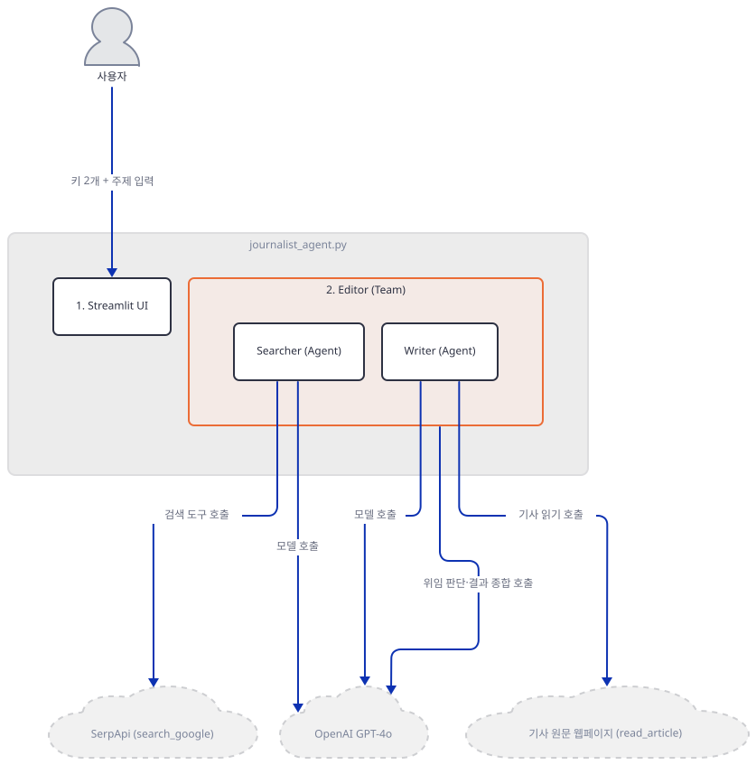

**확인.**

```bash
uv run --no-project python -c "
from agno.agent import Agent
from agno.team import Team
from agno.models.openai import OpenAIChat
s = Agent(name='Searcher', model=OpenAIChat(id='gpt-4o', api_key='fake'))
w = Agent(name='Writer', model=OpenAIChat(id='gpt-4o', api_key='fake'))
team = Team(name='Editor', model=OpenAIChat(id='gpt-4o', api_key='fake'), members=[s, w], markdown=True)
print('mode:', team.mode)
print('members:', [m.name for m in team.members])
print('telemetry:', team.telemetry)
"
```

직접 확인한 출력:

```
mode: TeamMode.coordinate
members: ['Searcher', 'Writer']
telemetry: True
```

### Step 6. 질문 입력과 실행 — 버튼이 없습니다

**목적.** 이 앱에는 Day 079의 `st.button`이 없다는 것을 확인하고, 그 대신 무엇이 실행을 트리거하는지, 그리고 `editor.run()`의 반환값이 어떻게 화면에 그려지는지 봅니다.

**할 일.**

`advanced_ai_agents/single_agent_apps/ai_journalist_agent/journalist_agent.py:85-92`

```python
    # Input field for the report query
    query = st.text_input("What do you want the AI journalist to write an Article on?")

    if query:
        with st.spinner("Processing..."):
            # Get the response from the assistant
            response: RunOutput = editor.run(query, stream=False)
            st.write(response.content)
```

86행의 `query` 입력창에는 `st.button`이 따로 없습니다 — `if query:`(88행)가 빈 문자열이 아니면 바로 블록을 실행합니다. `st.text_input`의 기본값(`live=False`)은 "폼 밖에서는 포커스를 잃거나 Enter를 눌러야 값이 커밋된다"이므로(streamlit 1.64.0 소스 `text_widgets.py:568-569`(`elements/widgets/` 아래)로 확인, 직접 설치해 확인), 글자를 입력하는 동안이 아니라 입력을 마치고 다른 곳을 클릭하거나 Enter를 눌러야 `query`가 실제 값을 갖고 스크립트가 다시 실행됩니다. 91행의 `response: RunOutput`은 5행에서 가져온 타입 힌트지만, `Team.run()`의 실제 반환 타입은 `TeamRunOutput`입니다(agno 소스로 확인) — Day 079 Step 7과 같은 사소한 오표기로, 두 타입 모두 `.content` 필드를 가지므로 92행은 그대로 동작합니다.

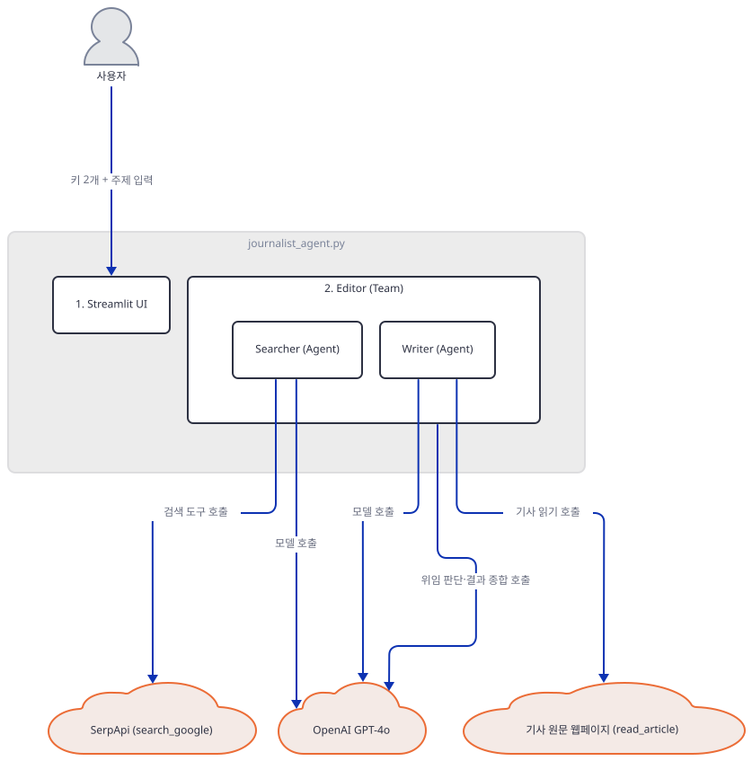

**확인.**

```bash
sed -n '85,92p' journalist_agent.py
```

직접 확인한 출력은 위 발췌와 같습니다(줄 번호 85~92, 92행에 개행이 없어 `wc -l`은 91로 셉니다).

키까지 설정한 뒤에는 다음 명령으로 앱을 실제로 띄웁니다.

```bash
uv run --no-project streamlit run journalist_agent.py
```

(headless로 확인만 하려면 `--server.address localhost --server.headless true`를 붙입니다. 이 문서는 임의의 높은 포트(59417)로 headless 기동만 재현했습니다 — 서버가 `_stcore/health`에 `ok`로 응답하며 켜져 있는 것은 직접 확인했습니다. 다만 두 키를 넣고 주제를 적어 실제로 실행하는 것은 이 문서의 범위 밖입니다.)

## 요청 한 건이 흐르는 과정

한 번의 기사 요청이 실제로는 여섯 단계를 거칩니다 — 아래 여섯 그림은 그 순서 그대로입니다(8명의 배우가 한 그림에 다 들어가면 폭이 넘쳐 앱의 실제 시간 경계로 나눴습니다 — 메시지는 모두 원래 순서 그대로 정확히 한 그림에 있습니다). agno 3.0.11의 `Team` 기본 모드는 `coordinate`이고, 위임은 팀 리더 **모델**이 `delegate_task_to_member(member_id, task)`라는 도구를 부르는 방식으로 일어납니다(Day 079가 이미 확인한 사실과 같습니다) — 그래서 Editor가 Searcher·Writer를 부르기 전마다 리더 자신의 GPT-4o 호출이 하나씩 있습니다.

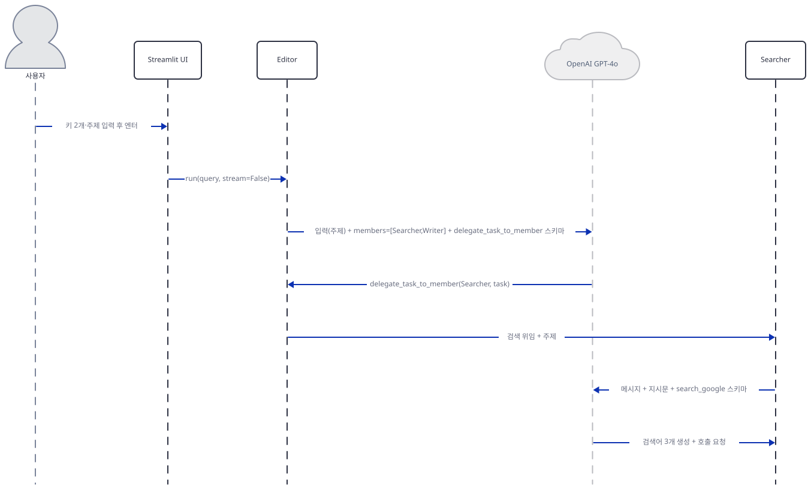

1단계는 사용자가 주제를 입력해 엔터를 누른 뒤, Editor가 GPT-4o에게 `delegate_task_to_member` 도구 스키마를 보내 "Searcher에게 시켜라"는 결정을 받고, Searcher가 검색어 3개를 생성하며 `search_google` 호출을 준비하는 부분까지 그립니다.

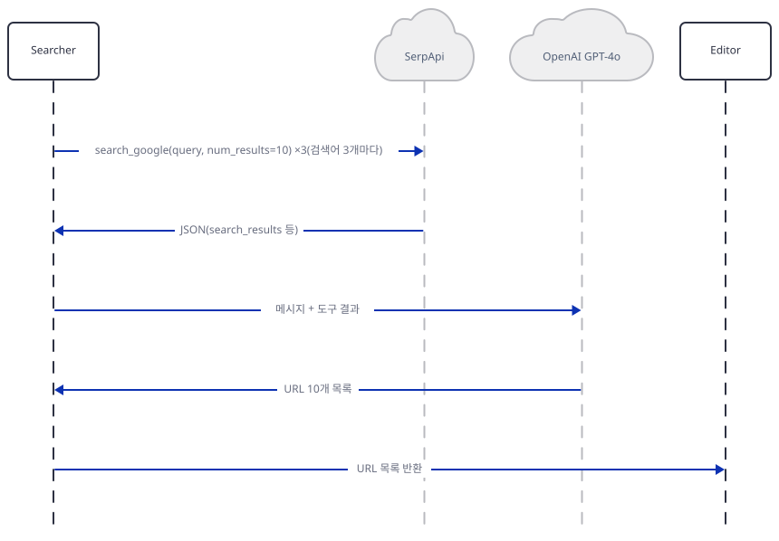

2단계는 Searcher가 검색어마다 실제로 `search_google`을 호출해 결과 JSON을 받고, 이를 다시 GPT-4o에 넘겨 URL 10개 목록으로 추리며, 그 목록을 Editor에 돌려주는 부분을 그립니다. 이 JSON의 `search_results` 키는 SerpApi 자신이 아니라 agno의 `SerpApiTools.search_google`이 SerpApi의 `organic_results`를 이름만 바꿔 담은 것입니다(Day 079가 같은 파일 `serpapi.py`로 이미 확인한 사실과 같습니다).

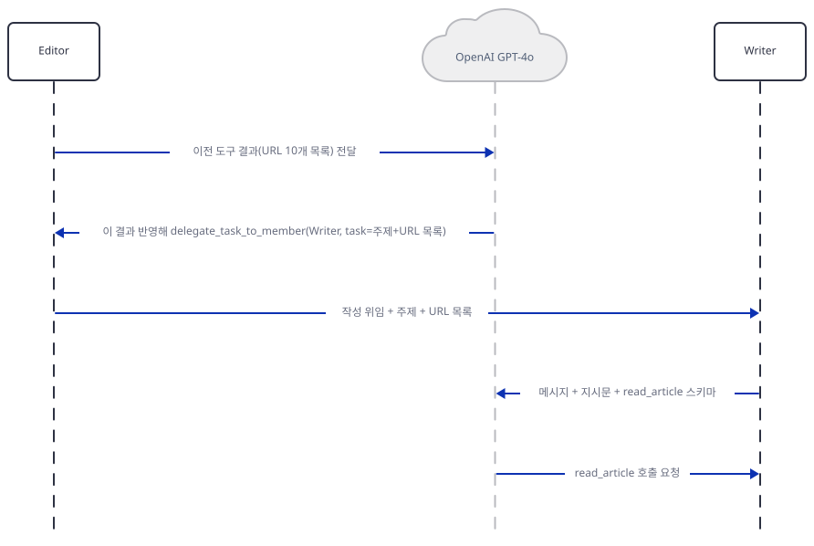

3단계는 Searcher가 돌려준 URL 목록이 Editor의 GPT-4o 호출에 도구 결과로 들어가고, Editor가 이어서 `delegate_task_to_member(Writer, task)`를 받아 Writer에게 주제와 URL 목록을 위임한 뒤, Writer가 자신의 GPT-4o에 `read_article` 스키마를 보내 호출 요청을 받는 부분까지를 그립니다.

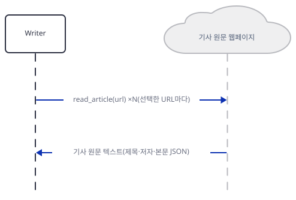

4단계는 Writer가 실제로 `read_article(url)`을 호출해 기사 원문 웹페이지에서 제목·저자·본문을 JSON으로 받는 부분을 그립니다. 이 JSON 구조 자체는 Step 4에서 본 `Newspaper4kTools.read_article`의 반환값과 같습니다.

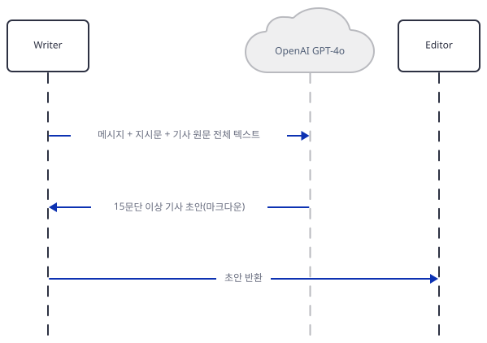

5단계는 Writer가 받은 원문 전체를 자신의 GPT-4o에 넘겨 15문단 이상의 초안을 받고(56행 지시문 "at a minimum, 15 paragraphs"가 요구하는 최소 분량), 그 초안을 Editor에 돌려주는 부분을 그립니다.

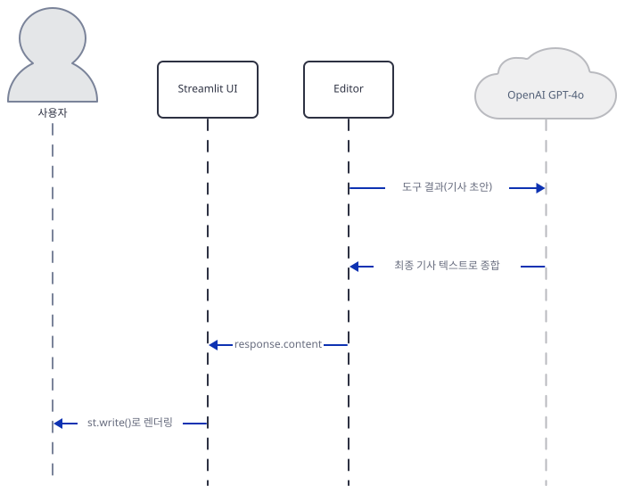

마지막으로 Editor는 Writer의 초안을 도구 결과로 받아 더 이상 위임할 멤버가 없으므로, 같은 GPT-4o 대화에서 편집·교정을 거친 최종 기사 텍스트로 종합합니다(72~80행의 지시문이 요구하는 동작). 그 `response.content`가 Streamlit UI로 돌아와 `st.write()`로 화면에 렌더링됩니다. 실제 키로 호출해 보지는 않았으므로, 이 순서가 정말 하나씩 순차로 일어나는지 — 아니면 한 응답에서 여러 도구 호출을 동시에 낼 수도 있는지 — 는 agno 소스만으로 판단했습니다(Day 079와 같은 유보).

## 실행 체크리스트

- [ ] `requirements.txt`(6줄)만 설치해도 이 앱의 임포트 7줄이 전부 통과한다는 것을 직접 확인했다(Day 079와 달리 빠진 패키지가 없음)
- [ ] Searcher·Writer 모두 `role=` 인자를 받으며, 이 값이 Editor의 위임 판단 프롬프트에 `Role: …` 줄로 들어간다는 것을 agno 소스(`agno/team/_messages.py`)로 확인했다
- [ ] `Newspaper4kTools()`가 실제로 노출하는 함수는 `read_article` 하나뿐이고, Writer의 지시문이 부르는 `get_article_text`는 다른(구식) 툴킷의 함수 이름이라는 것을 직접 확인했다
- [ ] 앱 자체 README가 "NewspaperToolkit"을 언급하지만 코드는 `Newspaper4kTools`를 쓴다는 것을 README·소스 대조로 확인했다
- [ ] 세 `instructions` 블록 모두에서 쉼표 없는 문자열 리터럴이 이어져 항목이 예상보다 적게 만들어진다는 것을 소스로 확인했다
- [ ] `Editor(Team)`이 Day 079와 같은 `coordinate` 모드·`delegate_task_to_member` 메커니즘으로 동작한다는 것을 소스로 재확인했다
- [ ] 이 앱에는 실행 버튼이 없고, `st.text_input`이 Enter 또는 포커스 아웃 시에만 값을 커밋한다는 것을 streamlit 소스로 확인했다
- [ ] `uv run --no-project streamlit run journalist_agent.py --server.address localhost --server.headless true`로 헤드리스 기동까지 직접 확인했다(이 문서 작성 시 검증에는 `--server.port`로 임의의 높은 포트 59417을 추가로 지정했다 — 독자는 기본 포트 그대로 실행해도 된다)

## 문제 해결

| 증상 | 원인 | 해결 |
|---|---|---|
| Writer의 지시문이 "`get_article_text`로 읽으라"고 하지만 실제 도구(`Newspaper4kTools`)에는 그 이름의 함수가 없음(`read_article`만 있음) | 코드가 구식 `agno.tools.newspaper.NewspaperTools`(함수명 `get_article_text`)에서 `agno.tools.newspaper4k.Newspaper4kTools`(함수명 `read_article`)로 갈아탄 뒤 지시문 텍스트를 갱신하지 않음(소스로 확인) | 리포 코드는 고치지 않음 — 모델은 지시문 텍스트가 아니라 도구 스키마를 보고 함수를 고르므로 실행 자체는 될 것으로 보이나, 실제 키로 확인하지는 못함 |
| 앱 자체 README가 Writer를 "NewspaperToolkit"으로 소개 | 위와 같은 원인으로, README도 함께 갱신되지 않음(README·소스 대조로 확인) | 이 문서는 실제 코드 기준(`Newspaper4kTools`)으로 안내 |
| `Newspaper4kTools` 임포트 시 `UserWarning: nltk is not installed...` 경고가 찍힘 | `newspaper4k` 패키지가 요약(`include_summary`) 기능에만 필요한 `nltk`가 없다고 알리는 경고(직접 확인) — 이 앱은 `include_summary`를 쓰지 않음 | 무시해도 동작에 영향 없음 |

## 더 해보기

- `advanced_ai_agents/single_agent_apps/ai_journalist_agent/journalist_agent.py:53`의 `get_article_text`를 실제 함수 이름 `read_article`로 고친 뒤, 응답 품질이나 도구 호출 빈도가 달라지는지 비교해보기
- `Newspaper4kTools(article_length=2000)`처럼 길이 제한을 걸어, Writer가 매우 긴 기사 원문을 그대로 컨텍스트에 넣을 때보다 토큰 사용량이 어떻게 줄어드는지 확인해보기
- `SerpApiTools(api_key=serp_api_key, enable_search_youtube=True)`를 추가해 Searcher가 유튜브 결과도 소스로 쓰게 해보기

## 다음 날 예고

[Day 082 · 🔬 AI Research Planner & Executor (Google Interactions API)](../day082-research-agent-gemini-interaction-api/README.md) — 다음 날은 Google의 Interactions API를 쓰는 리서치 플래너·실행기 앱을 다룹니다.
