# Day 082 · 🔬 AI Research Planner & Executor (Google Interactions API)

> 볼륨 7 🚀 Advanced AI Agents · 난이도 ★★☆ · 예상 소요 85분(103줄짜리 단일 파일이지만, Interactions API가 2026년 5~6월에 응답 스키마를 통째로 바꿨고 Phase 3a·3b가 쓰는 모델 둘은 이미 서비스가 종료돼, 그 이력을 공식 문서 여러 개로 하나씩 확인하는 시간이 코드를 읽는 시간보다 깁니다) · API 비용 알 수 없음(딥리서치 단계가 내부적으로 도는 검색·추론 루프 수가 실행마다 달라 토큰 수를 예측할 수 없습니다) — 참고로 공식 가격 문서(2026-09-28 확인) 기준 Gemini 3 Flash Preview 표준가는 입력 $0.50/출력 $3.00(1M 토큰당), Gemini 3.1 Pro Preview는 입력 $2~4/출력 $12~18, Gemini 3 Pro Image는 이미지 한 장당 약 $0.134이며, 딥리서치는 "검색·추론 루프에서 쓰는 토큰까지 표준 요금대로" 과금된다고 명시되어 있습니다 · 원본 앱: `advanced_ai_agents/single_agent_apps/research_agent_gemini_interaction_api`

## 오늘 만들 것

오늘의 `research_planner_executor_agent.py`(103줄)는 Google의 **Gemini Interactions API**(`client.interactions`) 하나로 3단계 리서치 파이프라인을 만듭니다 — 목표를 입력하면 Gemini 3 Flash가 번호 매긴 태스크 목록을 짜고(Phase 1), 선택한 태스크를 Deep Research 에이전트가 웹 검색을 곁들여 조사하며(Phase 2), 그 결과를 Gemini 3 Pro가 임원 보고서로 종합하고 Gemini 3 Pro Image가 TL;DR 인포그래픽까지 그려 줍니다(Phase 3). 이 앱이 보여 주려는 핵심은 `previous_interaction_id`입니다 — 이전 단계의 응답 id 하나만 다음 호출에 넘기면 Google 서버가 대화 기록을 대신 들고 있어 줍니다(공식 문서 확인, 2026-09-28: "서버가 이 id로 대화 기록을 찾아오므로, 전체 대화 기록을 다시 보낼 필요가 없다"). Day 071이 `st.session_state`에 메시지를 쌓아 매번 통째로 다시 보내는 로컬 방식이었다면, 오늘 앱은 상태 자체를 서버에 맡기고 `st.session_state`(24~25행)는 각 단계의 id·텍스트만 기억하는 얇은 캐시로 씁니다. 앱 자신의 README는 "Beta API"라고 적어 두었지만, 공식 문서를 오늘(2026-09-28) 다시 열어 보면 "2026년 6월부터 정식 출시(Generally Available)되어 모든 신규 프로젝트에 권장됨"이라고 갱신되어 있습니다(공식 문서 확인) — 문서가 앱보다 먼저 GA로 넘어간 셈입니다. 그런데 이 앱은 지금 그대로는 키를 넣어도 끝까지 가지 않습니다. 이유가 둘입니다. 첫째, Interactions API 자체가 **2026년 5~6월에 응답 스키마를 바꿨습니다** — 기존 `outputs` 배열을 없애고 `steps`라는 구조화된 타임라인으로 바꿨고(공식 "Breaking changes — May 2026" 문서 확인), 새 스키마가 2026-05-26부터 기본이 됐으며 레거시 스키마는 **2026-06-08에 완전히 제거**됐습니다("Python 1.x.x and JS 1.x.x SDK versions will break for Interactions API calls"). 이 코드가 세 번 쓰는 `get_text(i.outputs)`(48·62·75행)는 그래서 오늘 호출하면 응답에 `outputs` 자체가 없어 `AttributeError`로 끝납니다(Step 3에서 직접 재현합니다) — 이 앱의 `requirements.txt`가 `google-genai>=1.55.0`처럼 **하한만** 고정해 오늘 2.25.0이 받아지는 것(직접 확인)과 SDK 생성기가 1.x(stainless)에서 2.x(speakeasy)로 바뀐 것은, 이 서버 쪽 스키마 변경을 SDK가 뒤따라간 결과이지 원인이 아닙니다 — `google-genai<2`로 내려도 서버가 더 이상 `outputs`를 주지 않으므로 소용없습니다. 둘째, `outputs` 문제를 고쳐도 Phase 3a·3b는 끝까지 가지 않습니다 — **두 단계가 쓰는 모델이 이미 Google 공식 "Model deprecations" 문서에서 서비스 종료로 확인됩니다**: `gemini-3-pro-preview`는 **2026-03-09** 종료(대체 `gemini-3.1-pro-preview`), `gemini-3-pro-image-preview`는 **2026-06-25** 종료(대체 `gemini-3-pro-image`) — 같은 문서에서 Phase 1의 `gemini-3-flash-preview`만 "No shutdown date announced"로 남아 있습니다. 즉 Flash 계획과 Deep Research 조사(비용 발생)까지는 끝나도, 74행에서 실패해 임원 보고서는 나오지 않습니다. 아래는 완성된 아키텍처입니다.

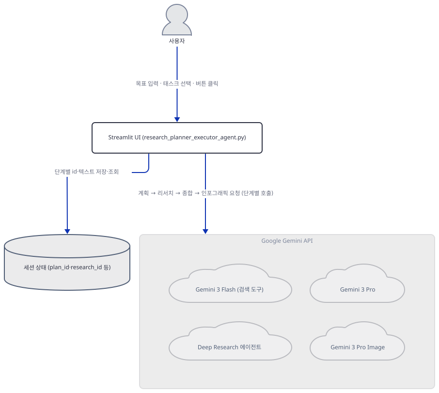

## 사전 준비

| 서비스/도구 | 용도 | 발급·설치 |
|---|---|---|
| Google API 키 | Gemini Interactions API(`client.interactions`)와 표준 `generate_content` API 인증 | https://ai.google.dev/ 에서 Google AI Studio 가입 후 발급 — 환경변수가 아니라 앱 사이드바의 텍스트 입력창(28행)에 붙여넣습니다 |
| google-genai (PyPI) | `client.interactions.create/get`, `client.models.generate_content` 등 SDK 전체 | `uv pip install "google-genai>=1.55.0"` — 2026-09-28 기준 이 하한만 지정하면 2.25.0이 설치됩니다(직접 확인, 아래 Step 3 참고) |
| streamlit | UI 렌더링 | `uv pip install "streamlit>=1.28.0"` |
| uv | 가상환경 생성과 패키지 설치 | [공통 사전 준비](../README.md#공통-사전-준비-한-번만) 참고 |

## 아키텍처 한눈에 보기

| 컴포넌트 | 역할 | 코드 위치 |
|---|---|---|
| 헬퍼 함수 3개 (`get_text`·`parse_tasks`·`wait_for_completion`) | 응답 텍스트 추출·계획 파싱·background 폴링 | `advanced_ai_agents/single_agent_apps/research_agent_gemini_interaction_api/research_planner_executor_agent.py:6-18` |
| 세션 상태 초기화 | `plan_id`·`research_id`·`synthesis_text` 등 7개 키를 세션에 준비 | `advanced_ai_agents/single_agent_apps/research_agent_gemini_interaction_api/research_planner_executor_agent.py:24-25` |
| 사이드바 (키 입력·Reset·설명) | API 키 게이트, 상태 초기화, 4단계 흐름 설명 | `advanced_ai_agents/single_agent_apps/research_agent_gemini_interaction_api/research_planner_executor_agent.py:27-40` |
| Phase 1 — 계획 생성 | 목표 문자열을 Gemini 3 Flash + `google_search` 도구로 번호 매긴 태스크로 분해 | `advanced_ai_agents/single_agent_apps/research_agent_gemini_interaction_api/research_planner_executor_agent.py:44-49` |
| Phase 2 — 태스크 선택·딥리서치 | 선택된 태스크를 `previous_interaction_id`로 이어 Deep Research 에이전트에 background 실행·폴링 | `advanced_ai_agents/single_agent_apps/research_agent_gemini_interaction_api/research_planner_executor_agent.py:52-67` |
| Phase 3a — 종합 리포트 | 리서치 결과를 `previous_interaction_id`로 이어 Gemini 3 Pro가 임원 보고서로 합성 | `advanced_ai_agents/single_agent_apps/research_agent_gemini_interaction_api/research_planner_executor_agent.py:71-76` |
| Phase 3b — 인포그래픽·렌더 | 표준 `generate_content`로 Gemini 3 Pro Image가 TL;DR 이미지 생성, 화면 렌더·다운로드 버튼 | `advanced_ai_agents/single_agent_apps/research_agent_gemini_interaction_api/research_planner_executor_agent.py:78-101` |
| Gemini 3 Flash / Deep Research 에이전트 / Gemini 3 Pro (외부) | Interactions API 엔드포인트로 계획·리서치·종합을 담당 | 코드 없음(외부 서비스) |
| Gemini 3 Pro Image (외부) | 표준 `generate_content` 엔드포인트로 인포그래픽 이미지를 생성 | 코드 없음(외부 서비스) |

## 단계별 진행

### Step 1. 환경 준비와 헬퍼 함수 확인

**목적.** 이 앱만을 위한 가상환경을 만들고 의존성을 설치한 뒤, 나머지 코드 전체가 기대는 세 헬퍼 함수(`get_text`·`parse_tasks`·`wait_for_completion`)를 API 키 없이 직접 돌려 봅니다.

**할 일.**

```bash
cd advanced_ai_agents/single_agent_apps/research_agent_gemini_interaction_api
uv venv
uv pip install -r requirements.txt
```

(pip 대안: `python -m venv .venv && source .venv/bin/activate && pip install -r requirements.txt`. Windows PowerShell은 활성화만 `.venv\Scripts\Activate.ps1`로 바꿉니다.) 이 저장소는 루트에 `pyproject.toml`이 있어 `uv run`이 방금 만든 환경 대신 루트 `.venv`를 쓰므로, 이후 모든 `uv run` 명령에 `--no-project`를 붙입니다.

`advanced_ai_agents/single_agent_apps/research_agent_gemini_interaction_api/research_planner_executor_agent.py:1-18`

```python
"""Research Planner using Gemini Interactions API - demonstrates stateful conversations, model mixing, and background execution."""

import streamlit as st, time, re
from google import genai

def get_text(outputs): return "\n".join(o.text for o in (outputs or []) if hasattr(o, 'text') and o.text) or ""

def parse_tasks(text):
    return [{"num": m.group(1), "text": m.group(2).strip().replace('\n', ' ')} 
            for m in re.finditer(r'^(\d+)[\.\)\-]\s*(.+?)(?=\n\d+[\.\)\-]|\n\n|\Z)', text, re.MULTILINE | re.DOTALL)]

def wait_for_completion(client, iid, timeout=300):
    progress, status, elapsed = st.progress(0), st.empty(), 0
    while elapsed < timeout:
        interaction = client.interactions.get(iid)
        if interaction.status != "in_progress": progress.progress(100); return interaction
        elapsed += 3; progress.progress(min(90, int(elapsed/timeout*100))); status.text(f"⏳ {elapsed}s..."); time.sleep(3)
    return client.interactions.get(iid)
```

`get_text()`(6행)는 응답의 각 출력 조각(`o`)에 `.text`가 있으면 이어 붙입니다. `parse_tasks()`(8~10행)는 정규식으로 "숫자+구분자(`.`·`)`·`-`)" 패턴을 찾아 태스크 리스트로 쪼갭니다. `wait_for_completion()`(12~18행)은 `background=True`로 시작한 인터랙션을 3초 간격으로 최대 300초까지 폴링하며 `st.progress`·`st.empty`로 진행률을 보여 줍니다.

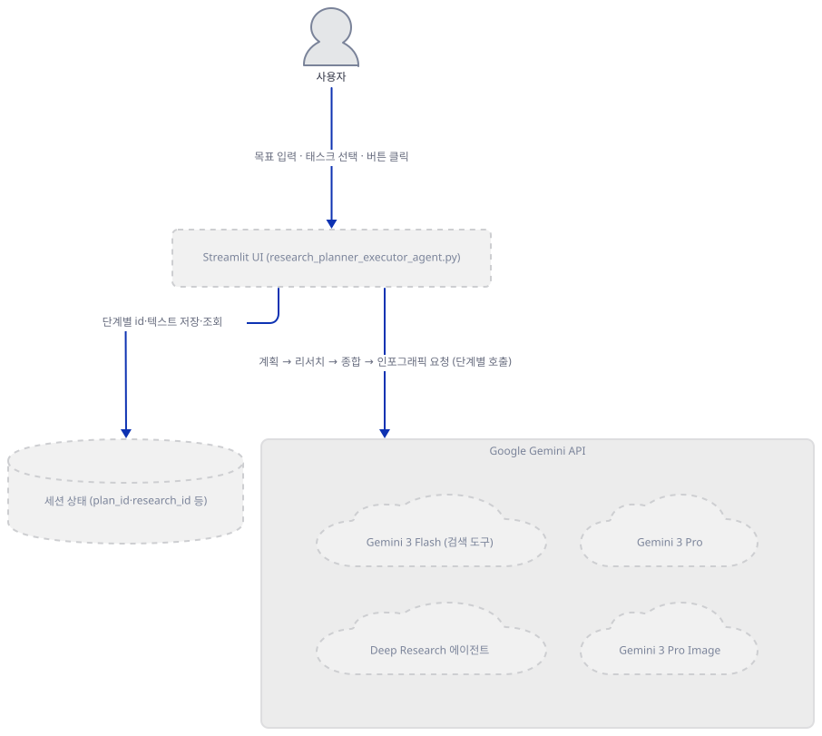

**확인.** 먼저 설치와 임포트가 되는지 봅니다.

```bash
uv run --no-project python -m py_compile research_planner_executor_agent.py && echo compiled
uv run --no-project python -c "import streamlit, re, time; from google import genai; print('imports OK')"
```

직접 확인한 출력(2026-09-28, Python 3.12.10):

```
compiled
imports OK
```

이어서 `parse_tasks()`를 프롬프트가 요청하는 형식("1. [Task] - [Details]", 47행)으로 직접 돌려 봅니다.

```bash
uv run --no-project python -c "
from research_planner_executor_agent import parse_tasks
sample = '''1. Market size - Estimate the TAM/SAM/SOM.
2. Competitors - Identify the top 5 vendors.
3. Regulations - Summarize compliance requirements.'''
print(len(parse_tasks(sample)), '개 태스크')
"
```

직접 확인한 출력(Streamlit bare-mode 경고 여러 줄은 생략 — 예: "Warning: to view a Streamlit app on a browser, use Streamlit in a file and run it with the following command", "Session state does not function when running a script without `streamlit run`"):

```
3 개 태스크
```

그런데 모델이 이 형식을 살짝 벗어나면(번호와 구분자 사이에 공백이 끼면) 태스크가 앞 태스크에 합쳐집니다 — 정규식(10행)이 `\d+[\.\)\-]`(숫자 바로 뒤에 구분자)만 다음 항목의 시작으로 인식하기 때문입니다.

```bash
uv run --no-project python -c "
from research_planner_executor_agent import parse_tasks
sample = '''1. Market size - Estimate the TAM/SAM/SOM.
2) Competitors - Identify the top 5 vendors.
3 - Regulations - Summarize compliance requirements.'''
print(len(parse_tasks(sample)), '개 태스크')
"
```

직접 확인한 출력(Streamlit bare-mode 경고 생략):

```
2 개 태스크
```

세 번째 태스크("3 - Regulations …")가 사라진 게 아니라 두 번째 태스크 텍스트 뒤에 그대로 이어 붙습니다(직접 확인) — 47행이 요청한 형식을 모델이 그대로 지키면 나타나지 않는 문제입니다.

### Step 2. Streamlit 셋업, 세션 상태, API 키 게이트

**목적.** 페이지 설정과 세션 상태 초기화, 사이드바(키 입력·Reset·안내), 그리고 키가 없을 때 나머지 코드 전체를 막는 게이트를 확인합니다.

**할 일.**

`advanced_ai_agents/single_agent_apps/research_agent_gemini_interaction_api/research_planner_executor_agent.py:20-40`

```python
# Setup
st.set_page_config(page_title="Research Planner", page_icon="🔬", layout="wide")
st.title("🔬 AI Research Planner & Executor Agent (Gemini Interactions API) ✨")

for k in ["plan_id", "plan_text", "tasks", "research_id", "research_text", "synthesis_text", "infographic"]:
    if k not in st.session_state: st.session_state[k] = [] if k == "tasks" else None

with st.sidebar:
    api_key = st.text_input("🔑 Google API Key", type="password")
    if st.button("Reset"): [setattr(st.session_state, k, [] if k == "tasks" else None) for k in ["plan_id", "plan_text", "tasks", "research_id", "research_text", "synthesis_text", "infographic"]]; st.rerun()
    st.markdown("""
    ### How It Works
    1. **Plan** → Gemini 3 Flash creates research tasks
    2. **Select** → Choose which tasks to research  
    3. **Research** → Deep Research Agent investigates
    4. **Synthesize** → Gemini 3 Pro writes report + TL;DR infographic
    
    Each phase chains via `previous_interaction_id` for context.
    """)
client = genai.Client(api_key=api_key) if api_key else None
if not client: st.info("👆 Enter API key to start"); st.stop()
```

Day 071에서 다룬 `st.session_state`가 여기서는 대화 기록이 아니라 **단계 사이의 다리** 역할을 합니다 — 24~25행이 준비하는 7개 키(`plan_id`·`plan_text`·`tasks`·`research_id`·`research_text`·`synthesis_text`·`infographic`)는 버튼을 눌러 `st.rerun()`이 일어나도 사라지지 않고, 다음 Phase가 그 값을 읽어 갑니다. 39~40행은 이 앱의 유일한 진입 방어선입니다 — 키가 비어 있으면 `client`가 `None`이 되어 `st.info`와 `st.stop()`으로 스크립트 실행이 그 자리에서 끝나므로, 아래 Phase들은 아예 평가되지 않습니다.

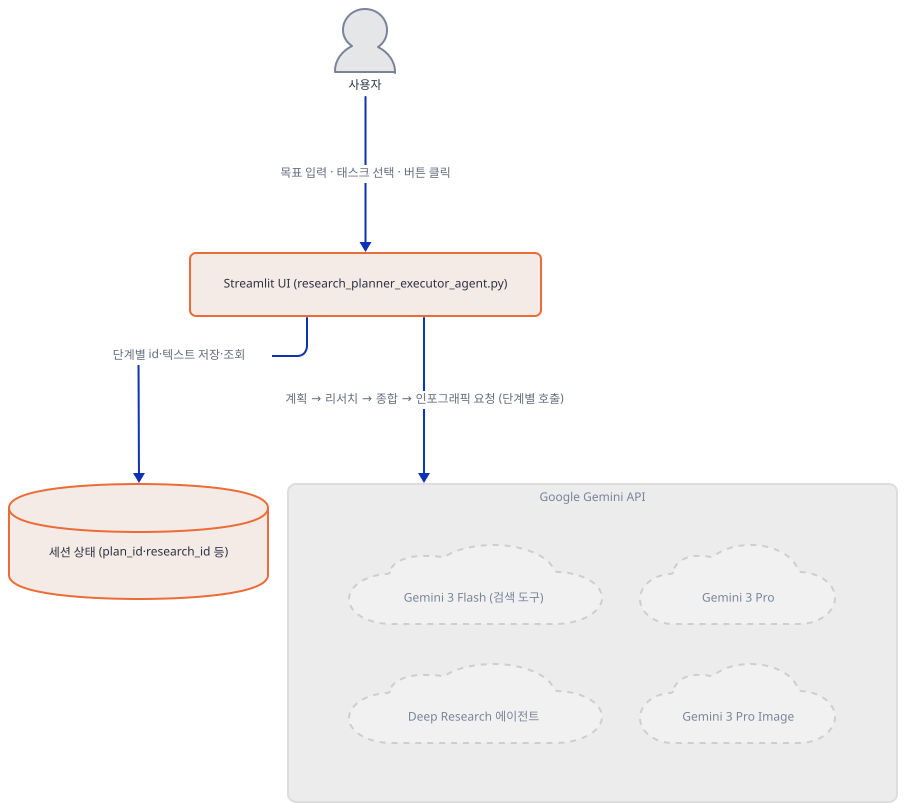

**확인.** 키 없이 헤드리스로 띄워 서버가 외부 IP 조회 없이 로컬에서만 뜨는지 직접 봅니다(포트는 겹치지 않는 임의의 높은 번호를 씁니다).

```bash
uv run --no-project streamlit run research_planner_executor_agent.py --server.address localhost --server.headless true --server.port 61417
```

직접 확인한 출력(2026-09-28):

```
Uvicorn server started on localhost:61417
You can now view your Streamlit app in your browser.
URL: http://localhost:61417
```

`curl -s -o /dev/null -w "%{http_code}" http://localhost:61417`로 `200`을 직접 확인했습니다(외부 IP 조회 요청은 관찰되지 않았습니다 — `--server.address`를 지정했기 때문입니다). "👆 Enter API key to start" 문구 자체는 Streamlit이 브라우저에서 React로 그리는 화면 요소라 `curl`로는 보이지 않습니다 — 39~40행 소스로 확인한 동작입니다. 확인이 끝나면 `Ctrl+C`로 서버를 멈춥니다.

### Step 3. Phase 1 — 계획 생성 (Gemini 3 Flash)

**목적.** 목표 문자열이 `client.interactions.create()`를 거쳐 번호 매긴 태스크 목록이 되는 과정을 보고, 오늘 설치되는 SDK에서 이 호출의 응답 처리 코드가 실제로 어디서 깨지는지 직접 확인합니다.

**할 일.**

`advanced_ai_agents/single_agent_apps/research_agent_gemini_interaction_api/research_planner_executor_agent.py:42-49`

```python
# Phase 1: Plan
research_goal = st.text_area("📝 Research Goal", placeholder="e.g., Research B2B HR SaaS market in Germany")
if st.button("📋 Generate Plan", disabled=not research_goal, type="primary"):
    with st.spinner("Planning..."):
        try:
            i = client.interactions.create(model="gemini-3-flash-preview", input=f"Create a numbered research plan for: {research_goal}\n\nFormat: 1. [Task] - [Details]\n\nInclude 5-8 specific tasks.", tools=[{"type": "google_search"}], store=True)
            st.session_state.plan_id, st.session_state.plan_text, st.session_state.tasks = i.id, get_text(i.outputs), parse_tasks(get_text(i.outputs))
        except Exception as e: st.error(f"Error: {e}")
```

47행은 `model=`(에이전트가 아니라 모델 문자열), `input=`(그냥 문자열), `tools=[{"type": "google_search"}]`(내장 검색 도구), `store=True`(이후 단계가 `previous_interaction_id`로 이어 쓸 수 있게 서버에 저장)를 한 번에 넘깁니다. 문제는 48행입니다 — `get_text(i.outputs)`가 기대하는 `i.outputs`(출력 조각 리스트)는 이 앱의 `requirements.txt`가 하한으로 지정한 `google-genai>=1.55.0`(1.55.0 소스로 확인: `Interaction.outputs: Optional[List[Output]]`) 시절에는 실제로 서버가 그렇게 응답했지만, **Interactions API 자체가 2026년 5~6월에 응답 스키마를 `outputs`에서 `steps`로 바꾸면서**(공식 "Breaking changes — May 2026" 문서 확인, 레거시 스키마는 2026-06-08 제거) 오늘 서버가 돌려주는 응답에는 `outputs` 키가 아예 없습니다. 2.25.0의 `Interaction`(소스로 확인, `google/genai/_gaos/types/interactions/interaction.py`)은 대신 `output_text`·`output_image`·`output_audio`·`output_video`라는 개별 필드를 두고 `steps`를 훑어 자동으로 채워 줍니다(주석 "Note: this is added by the SDK"). 이 모델의 설정(소스로 확인, `_gaos/types/basemodel.py`)은 `extra="allow"`라서, 서버가 실제로 `outputs`를 보냈다면 `i.outputs`는 예외 없이 그 값을 그대로 돌려줬을 것입니다(직접 확인: `Interaction.model_validate({'status':'completed','outputs':[...]}).outputs` → 리스트 그대로 나옵니다) — 오늘 `AttributeError`가 나는 진짜 이유는 SDK가 필드를 지운 것이 아니라 **서버 응답 자체에 `outputs`가 없기 때문**입니다.

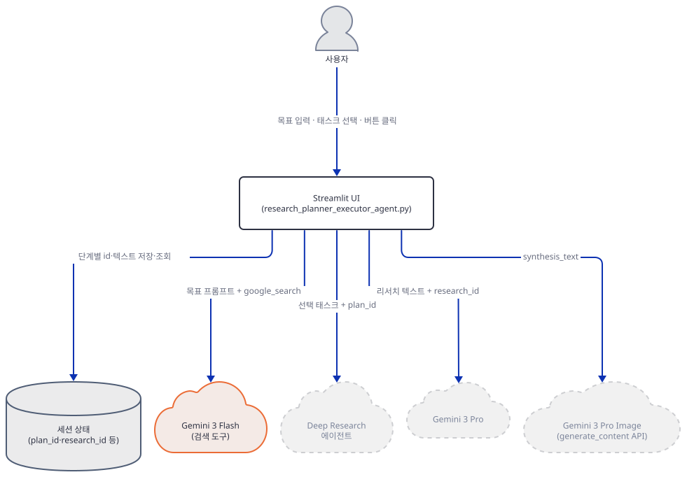

**확인.** 실제 호출 없이(규칙상 외부 API를 부르지 않습니다) 응답 객체를 흉내 내어 속성 접근만 해 봅니다. 2.25.0의 `Interaction`은 after-validator가 `output_text`를 항상 `steps`에서 다시 계산해 덮어쓰므로(소스 주석: "Always derived from the trailing model-output text; a str, \"\" when none."), 생성할 때 `output_text`를 직접 넘겨도 무시됩니다.

```bash
uv pip install "google-genai>=1.55.0"
uv run --no-project python -c "
from google.genai._gaos.types.interactions.interaction import Interaction
i = Interaction(status='completed', output_text='hello world')
print('output_text (직접 넘긴 값은 무시됨):', repr(i.output_text))
i.outputs
"
```

직접 확인한 출력(2026-09-28, 설치된 google-genai 2.25.0, traceback은 마지막 줄만 발췌):

```
output_text (직접 넘긴 값은 무시됨): ''
AttributeError: 'Interaction' object has no attribute 'outputs'
```

`output_text`가 `steps`에서 계산된다는 것은 `steps`를 직접 채워 주면 그대로 확인됩니다.

```bash
uv run --no-project python -c "
from google.genai._gaos.types.interactions.interaction import Interaction
i = Interaction(status='completed', steps=[{'type':'model_output','content':[{'type':'text','text':'hello world'}]}])
print('steps에서 계산된 output_text:', repr(i.output_text))
"
```

직접 확인한 출력:

```
steps에서 계산된 output_text: 'hello world'
```

즉 키를 넣고 47행을 그대로 호출해 응답을 받아도, 48행이 `i.outputs`를 읽으려는 순간 `AttributeError`가 나고(49행의 `except Exception as e: st.error(...)`가 이를 잡아 화면에는 "Error: 'Interaction' object has no attribute 'outputs'"만 뜹니다), 계획 자체는 성공적으로 만들어졌더라도 화면에는 나타나지 않습니다. 48행을 `i.output_text`로 바꾸면 위에서 본 대로 `steps`에서 계산된 텍스트가 그대로 나옵니다.

### Step 4. Phase 2 — 태스크 선택과 딥리서치

**목적.** 선택한 태스크가 `previous_interaction_id`로 Phase 1과 이어지고, `background=True`로 시작된 리서치가 `wait_for_completion()`으로 폴링되는 과정을 확인합니다.

**할 일.**

`advanced_ai_agents/single_agent_apps/research_agent_gemini_interaction_api/research_planner_executor_agent.py:51-67`

```python
# Phase 2: Select & Research  
if st.session_state.plan_text:
    st.divider(); st.subheader("🔍 Select Tasks & Research")
    selected = [f"{t['num']}. {t['text']}" for t in st.session_state.tasks if st.checkbox(f"**{t['num']}.** {t['text']}", True, key=f"t{t['num']}")]
    st.caption(f"✅ {len(selected)}/{len(st.session_state.tasks)} selected")
    
    if st.button("🚀 Start Deep Research", type="primary", disabled=not selected):
        with st.spinner("Researching (2-5 min)..."):
            try:
                i = client.interactions.create(agent="deep-research-pro-preview-12-2025", input=f"Research these tasks thoroughly with sources:\n\n" + "\n\n".join(selected), previous_interaction_id=st.session_state.plan_id, background=True, store=True)
                i = wait_for_completion(client, i.id)
                st.session_state.research_id, st.session_state.research_text = i.id, get_text(i.outputs) or f"Status: {i.status}"
                st.rerun()
            except Exception as e: st.error(f"Error: {e}")

if st.session_state.research_text:
    st.divider(); st.subheader("📄 Research Results"); st.markdown(st.session_state.research_text)
```

60행은 47행과 달리 `model=` 대신 `agent="deep-research-pro-preview-12-2025"`를 씁니다 — 앱 자신의 README가 "Agent vs Model: Deep Research uses `agent` parameter, not `model`"이라고 적은 그대로이고, 소스로 확인하면 이 값은 별도의 `AgentOption` 타입입니다. `previous_interaction_id=st.session_state.plan_id`가 Phase 1과의 연결고리이고, `background=True`는 이 호출이 즉시 `status="in_progress"`인 인터랙션을 돌려주게 만들어 61행의 `wait_for_completion()`이 폴링을 시작할 수 있게 합니다. 62행은 48행과 같은 `get_text(i.outputs)` 패턴을 다시 쓰므로 Step 3의 `AttributeError`가 여기서도 그대로 재현됩니다.

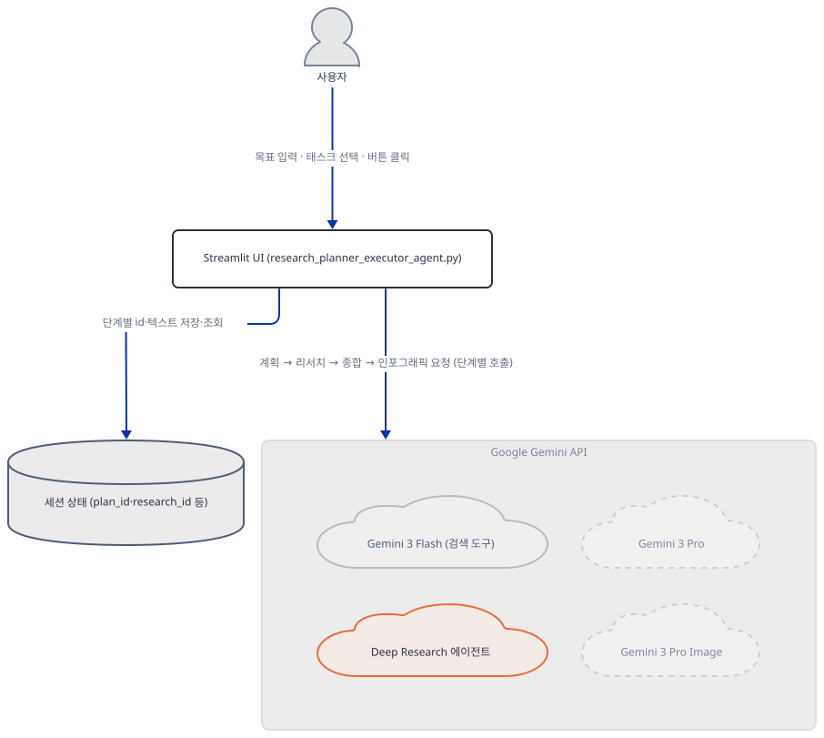

**확인.** `deep-research-pro-preview-12-2025`가 오늘 설치되는 SDK의 타입 목록에 여전히 있는지, 그리고 더 최신 변형이 있는지 확인합니다(설치는 Step 1에서 만든 가상환경 기준입니다). SDK 타입 목록에 있다는 것은 클라이언트가 이 문자열을 거부하지 않는다는 뜻일 뿐, Google 서버가 실제로 이 에이전트를 서빙한다는 뜻은 아닙니다.

```bash
grep -n "deep-research\|antigravity" .venv/Lib/site-packages/google/genai/_gaos/types/interactions/agentoption.py
```

직접 확인한 출력:

```
28:        "deep-research-pro-preview-12-2025",
30:        "deep-research-preview-04-2026",
32:        "deep-research-max-preview-04-2026",
34:        "antigravity-preview-05-2026",
```

60행이 쓰는 값은 SDK 타입 목록에 그대로 있습니다 — 다만 공식 Deep Research 문서(https://ai.google.dev/gemini-api/docs/deep-research, 2026-09-28 확인)에는 `deep-research-preview-04-2026`·`deep-research-max-preview-04-2026` 둘만 나오고 `deep-research-pro-preview-12-2025`는 없습니다. 같은 문서는 결과를 `interaction.steps[-1].content[0].text`로 읽으라고 안내합니다 — 이 앱의 `get_text(i.outputs)`와 다른, `steps` 기반 접근입니다(더 해보기 참고).

### Step 5. Phase 3a — 종합 리포트 (Gemini 3 Pro)

**목적.** 리서치 결과가 `previous_interaction_id`로 다시 이어져 임원 보고서로 합성되는 과정을 보고, 이 단계가 쓰는 모델이 Google 공식 문서에서 이미 서비스 종료로 확인된다는 것을 봅니다.

**할 일.**

`advanced_ai_agents/single_agent_apps/research_agent_gemini_interaction_api/research_planner_executor_agent.py:69-76`

```python
# Phase 3: Synthesis + Infographic
if st.session_state.research_id:
    if st.button("📊 Generate Executive Report", type="primary"):
        with st.spinner("Synthesizing report..."):
            try:
                i = client.interactions.create(model="gemini-3-pro-preview", input=f"Create executive report with Summary, Findings, Recommendations, Risks:\n\n{st.session_state.research_text}", previous_interaction_id=st.session_state.research_id, store=True)
                st.session_state.synthesis_text = get_text(i.outputs)
            except Exception as e: st.error(f"Error: {e}"); st.stop()
```

74행은 다시 `model=`(이번엔 `gemini-3-pro-preview`)과 `previous_interaction_id=st.session_state.research_id`로 Phase 2 결과에 이어 붙습니다. 75행도 같은 `get_text(i.outputs)` 패턴이라 Step 3의 `AttributeError`가 여기서도 재현됩니다. 그런데 `outputs` 문제를 고치더라도 이 단계는 끝까지 가지 않습니다 — Google 공식 "Model deprecations" 문서(https://ai.google.dev/gemini-api/docs/deprecations, 2026-09-28 확인)에 `gemini-3-pro-preview`가 **2026-03-09에 이미 서비스 종료(shutdown)**됐고 권장 대체 모델은 `gemini-3.1-pro-preview`라고 명시되어 있습니다.

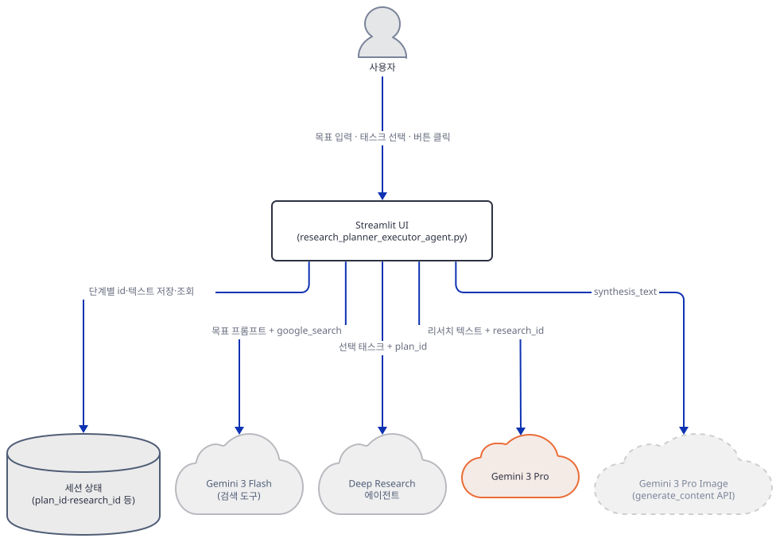

**확인.** 가장 강한 근거는 공식 문서입니다 — 표의 해당 행은 "`gemini-3-pro-preview` | November 18, 2025 | March 9, 2026 | `gemini-3.1-pro-preview`"입니다(공식 문서 확인). 오늘 설치되는 SDK도 같은 사실과 어긋나지 않습니다.

```bash
grep -c '"gemini-3-pro-preview"' .venv/Lib/site-packages/google/genai/_gaos/types/interactions/model.py
grep -n '"gemini-3.1-pro-preview"' .venv/Lib/site-packages/google/genai/_gaos/types/interactions/model.py
```

직접 확인한 출력:

```
0
48:        "gemini-3.1-pro-preview",
```

`Model` 필드는 `Union[Literal[...], UnrecognizedStr]` 형태라(소스로 확인) 목록에 없는 문자열이어도 클라이언트 쪽에서는 예외 없이 그대로 전송됩니다 — 그 요청을 서버가 실제로 어떤 오류로 거부하는지는 호출해 보지 않아 확인하지 못했습니다(규칙상 실제 API 호출은 하지 않습니다). 확실한 것은 공식 문서가 이 모델을 이미 퇴역 목록에 올렸다는 사실입니다.

### Step 6. Phase 3b — 인포그래픽 생성, 화면 렌더, 다운로드

**목적.** 합성된 리포트가 (Interactions API가 아닌) 표준 `generate_content` API로 이미지 모델에 전달되어 인라인 이미지 바이트를 받고, 최종 화면과 다운로드 버튼까지 이어지는 마지막 구간을 확인하며, 이 모델도 이미 서비스 종료됐다는 것을 봅니다.

**할 일.**

`advanced_ai_agents/single_agent_apps/research_agent_gemini_interaction_api/research_planner_executor_agent.py:78-101`

```python
        with st.spinner("Creating TL;DR infographic..."):
            try:
                response = client.models.generate_content(
                    model="gemini-3-pro-image-preview",
                    contents=f"Create a whiteboard summary infographic for the following: {st.session_state.synthesis_text}"
                )
                for part in response.candidates[0].content.parts:
                    if hasattr(part, 'inline_data') and part.inline_data:
                        st.session_state.infographic = part.inline_data.data
                        break
            except Exception as e: st.warning(f"Infographic error: {e}")
        st.rerun()

if st.session_state.synthesis_text:
    st.divider(); st.markdown("## 📊 Executive Report")
    
    # TL;DR Infographic at the top
    if st.session_state.infographic:
        st.markdown("### 🎨 TL;DR")
        st.image(st.session_state.infographic, use_container_width=True)
        st.divider()
    
    st.markdown(st.session_state.synthesis_text)
    st.download_button("📥 Download Report", st.session_state.synthesis_text, "research_report.md", "text/markdown")
```

80~83행은 지금까지와 다른 API를 씁니다 — `client.interactions.create()`가 아니라 `client.models.generate_content()`이고, `previous_interaction_id`도 없습니다. 대신 24~89행 사이에서 이미 세션에 저장해 둔 `synthesis_text`를 새 프롬프트 안에 문자열로 끼워 넣어 매번 새 요청으로 보냅니다. 84~87행은 응답의 `candidates[0].content.parts`를 순회하며 `inline_data`가 있는 첫 조각(이미지 바이트)만 꺼냅니다. `generate_content()`의 `model=`은 Interactions API의 `Model` 타입과 달리 임의의 문자열을 받으므로(소스로 확인), Step 5처럼 SDK의 `Model` 목록에서 찾는 것은 이 호출 자체에는 맞지 않는 근거입니다 — 대신 같은 공식 "Model deprecations" 문서에 81행의 `gemini-3-pro-image-preview`가 **2026-06-25에 서비스 종료**됐고 권장 대체는 `gemini-3-pro-image`라고 명시되어 있습니다(2026-09-28 확인).

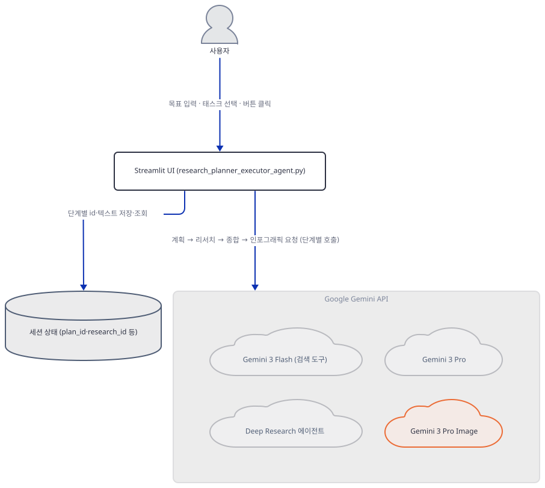

**확인.** 공식 문서의 해당 행은 "`gemini-3-pro-image-preview` | November 20, 2025 | June 25, 2026 | `gemini-3-pro-image`"입니다(공식 문서 확인). SDK의 Interactions API용 `Model` 목록도 같은 흐름을 보여 주지만, 위에서 말했듯 `generate_content()`에는 강제되지 않는 참고 자료일 뿐입니다.

```bash
grep -c '"gemini-3-pro-image-preview"' .venv/Lib/site-packages/google/genai/_gaos/types/interactions/model.py
grep -n '"gemini-3-pro-image"\|nano-banana-pro-preview' .venv/Lib/site-packages/google/genai/_gaos/types/interactions/model.py
```

직접 확인한 출력:

```
0
54:        "gemini-3-pro-image",
56:        "nano-banana-pro-preview",
```

81행의 `gemini-3-pro-image-preview`(프리뷰 접미사 포함)는 두 근거 모두에서 사라졌습니다 — 접미사 없는 `gemini-3-pro-image`(공식 대체 모델)와 "Gemini 3 Pro Image Preview"라는 설명이 붙은 `nano-banana-pro-preview`가 대신 있습니다.

## 요청 한 건이 흐르는 과정

이 앱은 코드 자신이 `# Phase 1`(42행)·`# Phase 2`(51행)·`# Phase 3`(69행) 주석으로 구간을 나눠 두었고, Phase 3 안에서도 종합(72~76행)과 인포그래픽(78~88행)이 서로 다른 `st.spinner`·`try/except` 블록으로 갈라져 있습니다. 그래서 시퀀스도 같은 경계로 넷으로 나눴습니다 — 메시지는 모두 원래 순서 그대로 정확히 한 그림에 있습니다.

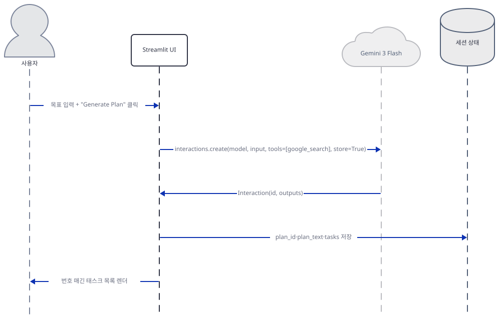

사용자가 목표를 입력하고 "Generate Plan"을 누르면 Streamlit UI가 Gemini 3 Flash에 `interactions.create()`를 보내고, 받은 `Interaction`(id, steps — 앱은 `.outputs`를 읽으려다 실패합니다)에서 `plan_id`·`plan_text`·`tasks`를 세션 상태에 저장한 뒤 번호 매긴 태스크 목록을 화면에 그립니다(Step 3).

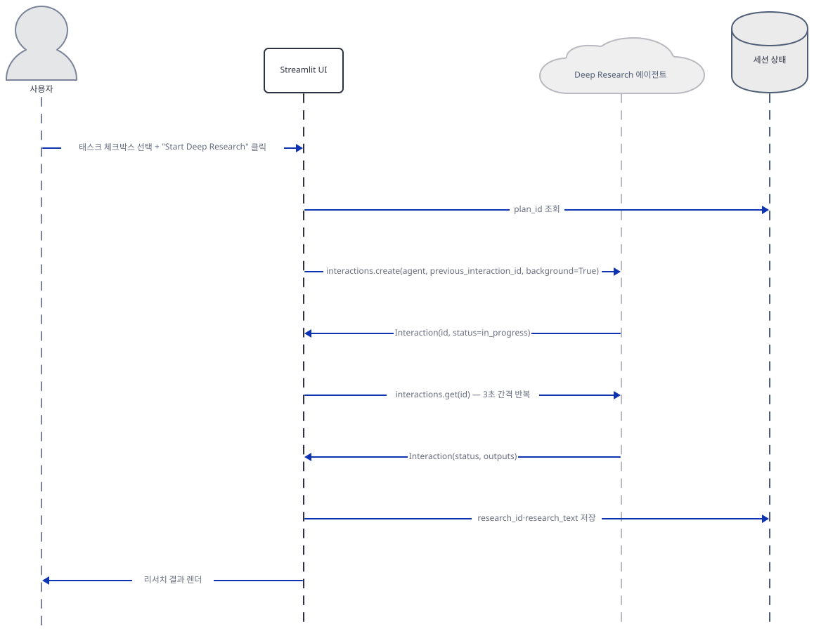

태스크를 선택해 "Start Deep Research"를 누르면 UI가 세션에서 `plan_id`를 꺼내 Deep Research 에이전트에 `previous_interaction_id`로 이어 붙인 background 요청을 보냅니다. 에이전트는 즉시 `status="in_progress"`인 인터랙션을 돌려주고, UI는 `interactions.get(id)`를 3초 간격으로 반복하다가 상태가 바뀌면 `research_id`·`research_text`를 저장하고 결과를 렌더합니다(Step 4).

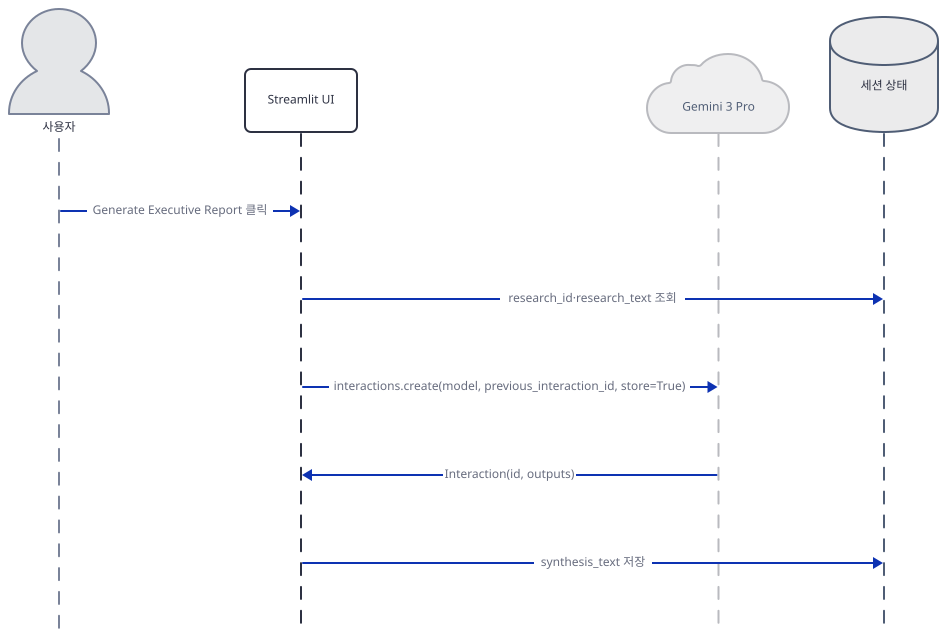

"Generate Executive Report"를 누르면 UI가 세션에서 리서치 텍스트를 꺼내 Gemini 3 Pro에 `previous_interaction_id`로 이어 붙인 요청을 보내고, 받은 결과를 `synthesis_text`로 저장합니다(Step 5).

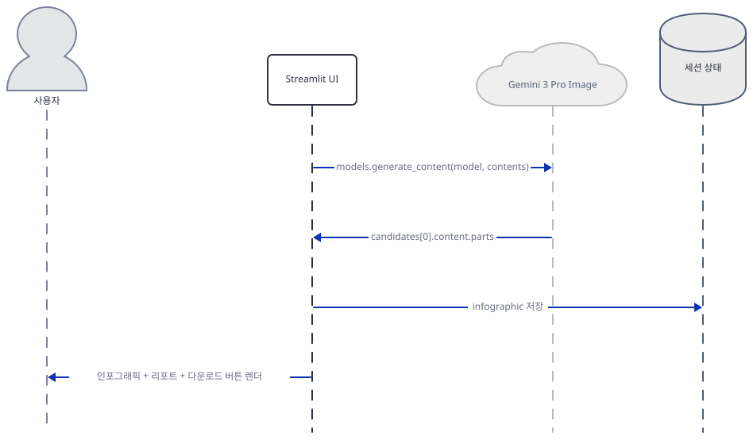

곧바로 이어서 UI는 (아이디 체인 없이) `synthesis_text`를 새 프롬프트에 끼워 Gemini 3 Pro Image에 표준 `generate_content()`를 보내고, `candidates[0].content.parts`에서 이미지 바이트를 꺼내 세션에 저장한 뒤 화면을 다시 그립니다 — 인포그래픽이 맨 위에, 전체 리포트와 다운로드 버튼이 그 아래에 나타납니다(Step 6).

## 실행 체크리스트

- [ ] 스크래치 가상환경에서 `google-genai`·`streamlit` 설치와 `py_compile`·임포트가 되는 것을 직접 확인했다
- [ ] `parse_tasks()`가 "1. Task - Detail" 형식에서는 정상 동작하지만, 번호와 구분자 사이에 공백이 끼면(예: "3 - Task") 앞 태스크에 합쳐진다는 것을 직접 재현했다
- [ ] Interactions API가 2026년 5~6월에 응답 스키마를 `outputs`→`steps`로 바꿨고(레거시 스키마는 2026-06-08 제거) 오늘(2026-09-28) `uv pip install "google-genai>=1.55.0"`이 설치하는 2.25.0의 `Interaction`에는 `outputs` 속성이 없어 `i.outputs`가 `AttributeError`를 낸다는 것을 공식 문서와 직접 재현으로 확인했다(생성자·속성 접근만, 실제 API 호출 없음) — SDK 생성기가 바뀐 것은 결과이지 원인이 아니다
- [ ] Phase 3a·3b가 쓰는 `gemini-3-pro-preview`(2026-03-09 종료)·`gemini-3-pro-image-preview`(2026-06-25 종료)가 Google 공식 "Model deprecations" 문서에서 이미 서비스 종료로 확인된다는 것을 확인했다(`outputs`를 고쳐도 이 두 모델 때문에 끝까지 가지 않음)
- [ ] `deep-research-pro-preview-12-2025`는 오늘 SDK의 `AgentOption`에 여전히 남아 있다는 것을 직접 확인했다(공식 Deep Research 문서에는 이 값 대신 04-2026 계열만 나옴)
- [ ] API 키가 비어 있으면 `client`가 `None`이 되어 `st.stop()`으로 이후 코드 전체가 평가되지 않는다는 것을 소스로 확인했다
- [ ] `streamlit run`을 `--server.address localhost --server.headless true`로 띄워 외부 IP 조회 없이 로컬에서만 뜨는 것을 직접 확인했다(포트는 61417, 확인 후 종료)

## 문제 해결

| 증상 | 원인 | 해결 |
|---|---|---|
| "Generate Plan"을 누르면 화면에 "Error: 'Interaction' object has no attribute 'outputs'"가 뜸(API 호출 자체는 성공) | Interactions API 자체가 2026년 5~6월에 응답 스키마를 `outputs`→`steps`로 바꿨고(레거시 스키마는 2026-06-08 제거, 공식 문서 확인) 오늘 설치되는 google-genai 2.25.0의 `Interaction`에는 `outputs`가 없음(직접 확인) — SDK를 `google-genai<2`로 내려도 서버가 더 이상 `outputs`를 보내지 않으므로 소용없음 | 리포 코드는 고치지 않음 — 직접 실행한다면 48·62·75행의 `get_text(i.outputs)`를 `i.output_text`로 바꿈 |
| 계획 태스크 개수가 요청한 5~8개보다 적게 파싱됨 | `parse_tasks()`(10행)의 정규식이 번호와 구분자 사이에 공백이 끼면(`"3 - "`) 다음 항목의 시작을 못 찾고 이전 태스크에 이어 붙임(직접 재현) | 리포 코드는 고치지 않음 — 모델이 프롬프트가 요청한 "1. [Task] - [Details]" 형식을 그대로 지키면 나타나지 않음 |
| `outputs`를 `output_text`로 고쳐도 74행에서 임원 보고서가 나오지 않음(실행 안 함, 공식 문서로 확인) | Phase 3a·3b가 쓰는 `gemini-3-pro-preview`(2026-03-09 종료)·`gemini-3-pro-image-preview`(2026-06-25 종료)를 Google이 이미 서비스 종료함(공식 "Model deprecations" 문서 확인) | 리포 코드는 고치지 않음 — 74행을 `gemini-3.1-pro-preview`로, 81행을 `gemini-3-pro-image`로 바꿔야 끝까지 감 |
| `streamlit run`을 `--server.headless true`만 주고(주소 지정 없이) 띄우면 시작 시 외부 IP 조회 시도 | headless 모드에서만 나타나는 Streamlit 기본 동작(`checkip.amazonaws.com` 호출) — 브라우저가 열리는 일반 실행에서는 일어나지 않음(Day 060 확인, streamlit 1.64.0 소스 확인) | `--server.address localhost`를 함께 붙임(본 문서 모든 실행 명령에 이미 반영) |

## 더 해보기

- `research_planner_executor_agent.py:60`의 `agent="deep-research-pro-preview-12-2025"`를 Step 4에서 확인한 `deep-research-max-preview-04-2026`으로 바꿔, 더 깊은 리서치 모드가 결과·소요 시간에 어떤 차이를 내는지 비교해보기
- `research_planner_executor_agent.py:48,62,75`의 `get_text(i.outputs)`를 `i.output_text`로 바꾸고, `research_planner_executor_agent.py:74`의 `gemini-3-pro-preview`를 `gemini-3.1-pro-preview`로, `research_planner_executor_agent.py:81`의 `gemini-3-pro-image-preview`를 `gemini-3-pro-image`로 함께 바꿔, 오늘 설치되는 google-genai 2.25.0에서 이 앱이 실제로 끝까지 실행되는지 확인해보기(Step 3~6) — `outputs`만 고치면 두 모델이 이미 서비스 종료돼 있어 `research_planner_executor_agent.py:74`에서 다시 막힘
- `research_planner_executor_agent.py:10`의 정규식을 번호와 구분자 사이의 공백도 허용하도록 고쳐(예: `\d+\s*[\.\)\-]`), "3 - Task" 같은 변형이 더 이상 앞 태스크에 합쳐지지 않는지 Step 1의 재현 명령으로 확인해보기

## 다음 날 예고

[Day 083 · 🔍 AI Deep Research Agent](../day083-ai-deep-research-agent/README.md) — 같은 볼륨에서 이어지는 리서치 에이전트 날로, 원본 경로는 `advanced_ai_agents/single_agent_apps/ai_deep_research_agent`입니다.
