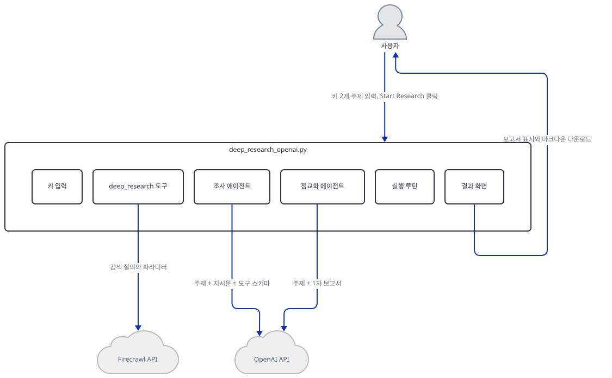
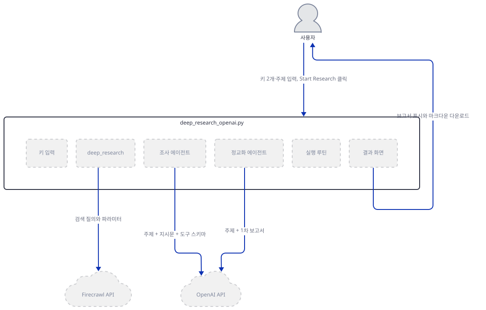
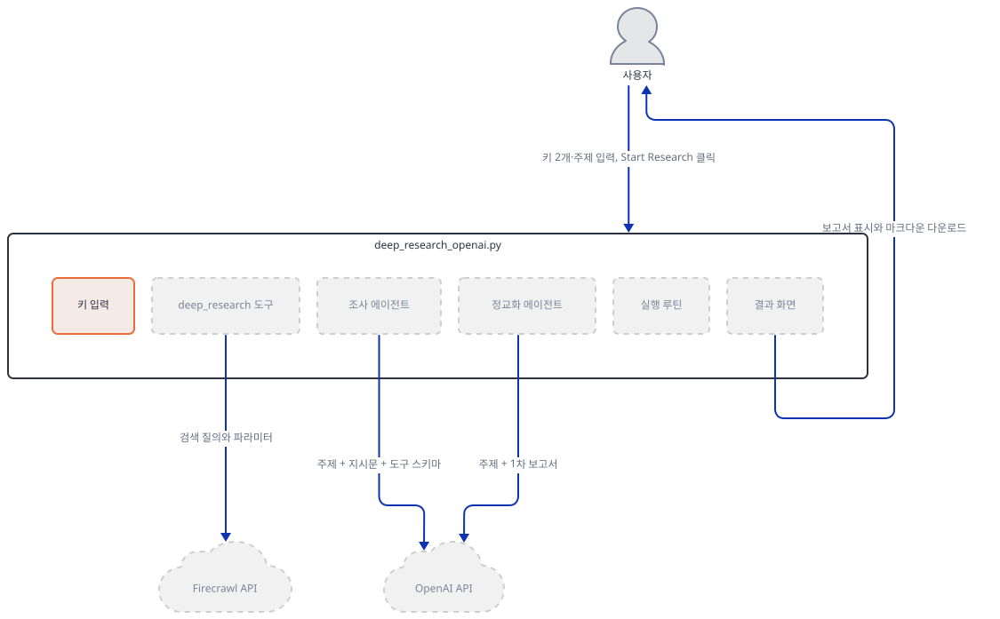
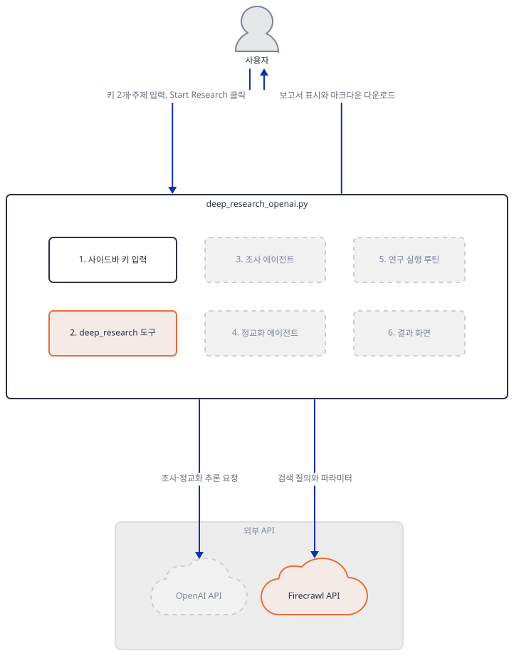
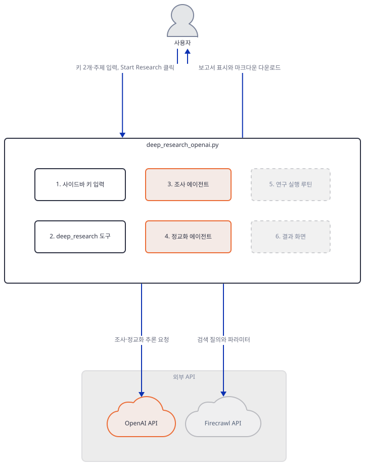
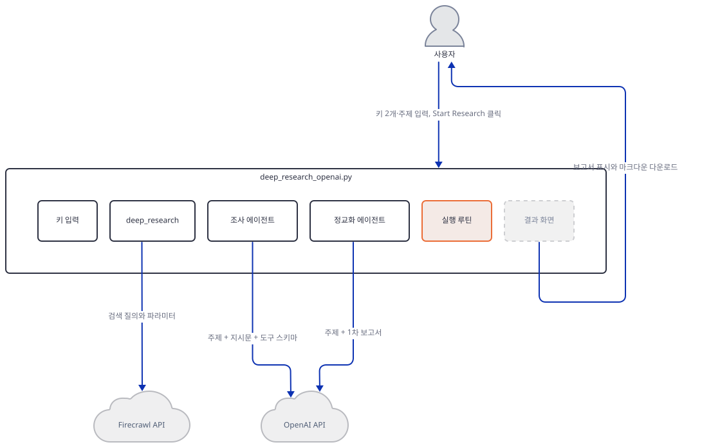
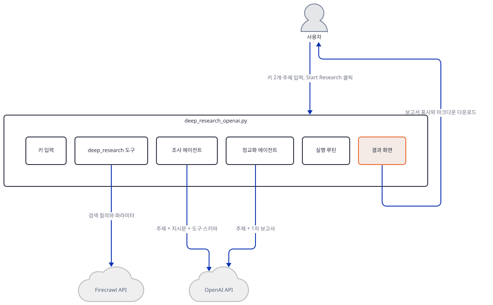
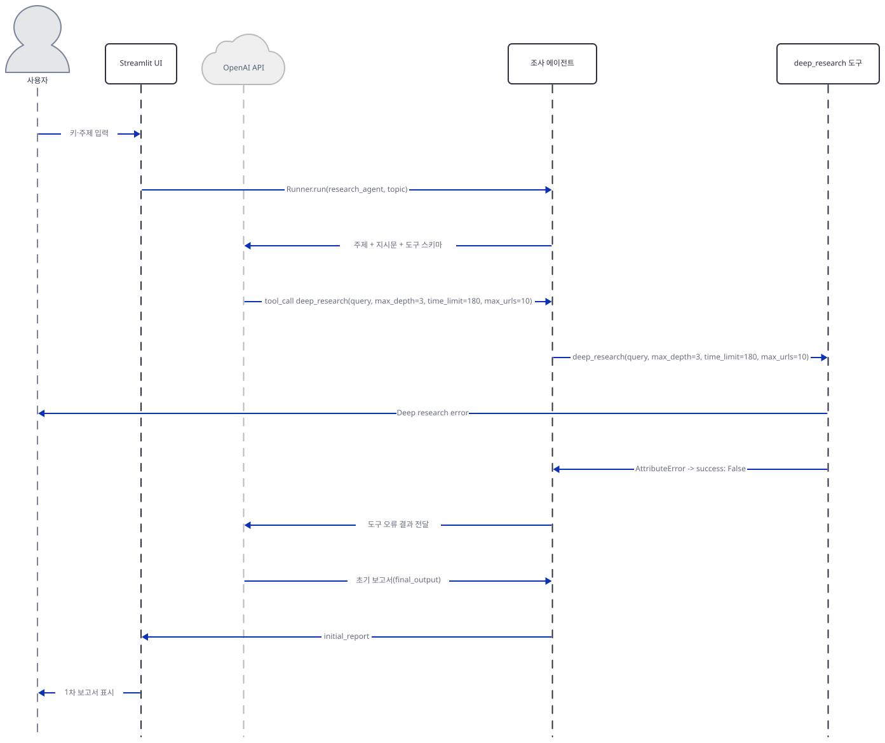
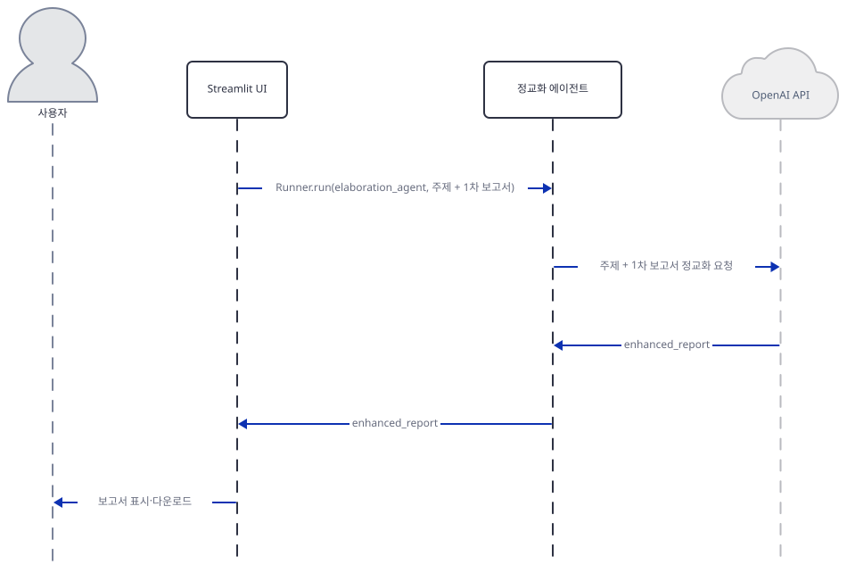

# Day 083 · 🔍 AI Deep Research Agent

> 볼륨 7 🚀 Advanced AI Agents · 난이도 ★★☆ · 예상 소요 65분(단일 파일이지만 openai-agents SDK와 firecrawl 패키지 소스를 직접 뒤져 확인해야 하는 명령이 6개 Step에 걸쳐 있고, `deep_research` 도구가 옮겨진 게 아니라 폐기된 API라는 것까지 소스·공식 문서로 겹쳐 확인해야 해 손으로 돌려 보는 시간이 큽니다) · API 비용 대략 조사 1회에 OpenAI 공식 요금표 기준 gpt-5.6-luna 표준가 입력 $0.20/출력 $1.20(1M 토큰당, 짧은 컨텍스트 기준)로 추정하면 수십 원 이하, Firecrawl API는 오늘 버전에서 도구가 항상 실패해 실제로는 호출되지 않습니다(키가 없어 실제 과금은 확인 못함) · 원본 앱: `advanced_ai_agents/single_agent_apps/ai_deep_research_agent`

## 오늘 만들 것

이 앱은 185줄(마지막 줄에 개행이 없어 `wc -l`은 184로 세지만 편집기·GitHub에서는 185번째 줄까지 보입니다, 직접 확인) 단일 파일 Streamlit 앱으로, agno가 아니라 Day 013이 이미 배운 OpenAI 자체의 Agents SDK(`openai-agents` 패키지, import 이름은 `agents`)를 씁니다. `Agent`·`Runner.run`·`@function_tool` 같은 어휘 자체는 Day 013이 이미 다뤘으므로 여기서는 되풀이하지 않습니다. 이 앱이 다른 점은 구조가 훨씬 단순하다는 것입니다 — 에이전트는 핸드오프도 pydantic `output_type`도 없이 둘뿐이고(조사 에이전트, 정교화 에이전트), 둘 다 `model=`을 지정하지 않아 openai-agents 0.22.3이 고르는 기본값(`gpt-5.6-luna`, `agents/models/default_models.py` 103행, 소스로 확인)을 그대로 씁니다. 조사 에이전트가 쥔 도구는 Firecrawl의 "딥 리서치" 엔드포인트를 부르도록 설계된 `deep_research` 하나뿐인데, 오늘 `requirements.txt`가 버전을 고정하지 않아 풀리는 firecrawl 4.45.0에서는 이 도구가 항상 실패합니다 — `FirecrawlApp(...)`(실제로는 `firecrawl.client.Firecrawl`의 별칭)의 최상위 인스턴스에는 `deep_research` 메서드가 없습니다(직접 확인, Step 3). 그 메서드가 남아 있는 `.v1` 프록시로 옮겨 불러도 문제가 끝나지 않습니다 — Firecrawl 자신이 그 메서드를 **폐기(deprecated)** 표시해 뒀기 때문입니다. `firecrawl/v1/client.py`의 `deep_research` 독스트링에는 `.. deprecated:: /v1/deep-research is deprecated. Use /v2/search for web research...`가 적혀 있고 호출할 때마다 `DeprecationWarning`을 던집니다(소스로 확인). Firecrawl 공식 문서(https://docs.firecrawl.dev/features/alpha/deep-research)는 이 레거시 v1 API가 2025-06-30로 종료됐고 그 뒤로는 더 이상 유지보수되지 않는다고 밝힙니다. 앱 코드의 넓은 `try/except`가 실제로 일어나는 `AttributeError`를 잡아 `{"success": False, "error": ...}`로 감싸 돌려주지만, 그 전에 85행의 `st.error(...)`가 화면에 빨간 오류 상자("Deep research error: ...")를 먼저 그립니다 — 화면이 죽지는 않지만 조용히 넘어가지도 않습니다. 앱 자체 README가 내세우는 "자동으로 웹을 검색하고 내용을 추출해 종합한다"는 첫 기능은 오늘 설치로는 실현되지 않습니다. `requirements.txt` 4줄에는 `firecrawl`과 `firecrawl-py`가 나란히 적혀 있는데, 오늘 이 둘은 완전히 같은 배포판(같은 파일, 동일 SHA-256)이라 한 줄이 다른 줄이 이미 설치한 파일을 그대로 덮어씁니다(직접 확인). 키 입력은 Day 013(환경변수)과 달리 사이드바 텍스트 입력창입니다. 4행에서 `trace`를 가져오지만 실제로 쓰는 코드는 한 줄도 없는데(그렙으로 확인), openai-agents SDK는 `Runner.run()`마다 자동으로 트레이스 컨텍스트를 열고(`agents/run.py` 750~759행, 소스로 확인) 기본값 `tracing_disabled=False`(`agents/run_config.py` 397행, 소스로 확인)로 남아 있어, `set_default_openai_key(key)`가 기본 인자 `use_for_tracing=True`로 같은 키를 트레이싱에도 씁니다(소스로 확인) — 코드가 트레이스를 한 번도 요청한 적이 없어도 나가는 셈입니다(Step 4). 완성하면 사이드바에 키 2개, 본문에 주제 입력창과 Start Research 버튼이 뜨고, 실행하면(실제로는 도구 실패를 안은 채) 1차 보고서 확장 패널과 정교화된 최종 보고서, 다운로드 버튼이 나타납니다. 아래는 완성된 아키텍처입니다.



## 사전 준비

| 서비스/도구 | 용도 | 발급·설치 |
|---|---|---|
| OpenAI API 키 | 두 에이전트의 gpt-5.6-luna(기본값) 호출 인증 | https://platform.openai.com/ 가입 후 발급, 사이드바 입력창에 붙여넣기 |
| Firecrawl API 키 | `deep_research` 도구가 Firecrawl에 인증하려는 용도(오늘 버전에서는 도구 자체가 항상 실패해 실제로 호출되지 않습니다) | https://www.firecrawl.dev 가입 후 발급, 사이드바 입력창에 붙여넣기 — 이 문서는 키 없이 진행합니다 |
| uv | 가상환경 생성과 패키지 설치 | [공통 사전 준비](../README.md#공통-사전-준비-한-번만) 절 참고 |
| 인터넷 연결 | PyPI 설치, OpenAI API 호출, (설계상) Firecrawl 호출, openai-agents 트레이스 업로드 | 별도 설치 없음 |

## 아키텍처 한눈에 보기

| 컴포넌트 | 역할 | 코드 위치 |
|---|---|---|
| Streamlit UI | 사이드바 키 입력, 주제 입력, 실행 버튼, 결과 표시·다운로드 | `advanced_ai_agents/single_agent_apps/ai_deep_research_agent/deep_research_openai.py:9-14`, `advanced_ai_agents/single_agent_apps/ai_deep_research_agent/deep_research_openai.py:22-47`, `advanced_ai_agents/single_agent_apps/ai_deep_research_agent/deep_research_openai.py:154-181` |
| 세션 상태 | 사이드바에 입력한 두 키를 세션 동안 보관 | `advanced_ai_agents/single_agent_apps/ai_deep_research_agent/deep_research_openai.py:16-20`, `advanced_ai_agents/single_agent_apps/ai_deep_research_agent/deep_research_openai.py:36-40` |
| deep_research 도구 | FirecrawlApp으로 웹 리서치를 수행하도록 설계된 비동기 함수 도구(오늘 버전에서 항상 실패) | `advanced_ai_agents/single_agent_apps/ai_deep_research_agent/deep_research_openai.py:50-86` |
| 조사 에이전트 (research_agent) | 지시문에 따라 deep_research 도구를 호출해 1차 보고서 작성 | `advanced_ai_agents/single_agent_apps/ai_deep_research_agent/deep_research_openai.py:89-105` |
| 정교화 에이전트 (elaboration_agent) | 도구 없이 1차 보고서를 확장·보강 | `advanced_ai_agents/single_agent_apps/ai_deep_research_agent/deep_research_openai.py:107-124` |
| 연구 실행 루틴 (run_research_process) | 두 에이전트를 순서대로 Runner.run으로 호출 | `advanced_ai_agents/single_agent_apps/ai_deep_research_agent/deep_research_openai.py:126-152` |
| OpenAI API | 두 에이전트의 실제 추론(기본 모델 gpt-5.6-luna) | 코드 없음 (외부 서비스) |
| Firecrawl API | deep_research 도구가 설계상 요청하려는 대상(오늘은 도달하지 않음) | 코드 없음 (외부 서비스) |

## 단계별 진행

### Step 1. 환경 만들기 — 중복 선언된 firecrawl 패키지

**목적.** 격리된 가상환경에 `requirements.txt`를 설치하고, `firecrawl`과 `firecrawl-py`가 오늘 실제로 어떤 관계인지 확인합니다.

**할 일.**

```bash
cd advanced_ai_agents/single_agent_apps/ai_deep_research_agent
uv venv
uv pip install -r requirements.txt
```

(pip 대안: `python -m venv .venv && source .venv/bin/activate && pip install -r requirements.txt`.) 이 저장소 루트에는 `pyproject.toml`이 있어 이후 `uv run` 명령에는 모두 `--no-project`를 붙입니다.

`advanced_ai_agents/single_agent_apps/ai_deep_research_agent/requirements.txt:1-4`

```text
openai-agents
firecrawl
streamlit
firecrawl-py
```

버전 고정이 하나도 없습니다. 이 문서를 쓰며 설치했을 때는 **openai-agents 0.22.3**, **streamlit 1.64.0**, **firecrawl 4.45.0**, **firecrawl-py 4.45.0**이 받아졌습니다(직접 확인, 2026-09-28 기준). 2·4행의 `firecrawl`과 `firecrawl-py`는 이름만 다를 뿐 오늘은 완전히 같은 배포판입니다 — 두 `dist-info`의 `RECORD`를 대조하면 `firecrawl/__init__.py`의 SHA-256 해시까지 같습니다(직접 확인). 즉 한 줄은 다른 줄이 이미 설치한 파일을 그대로 다시 씁니다.



**확인.**

```bash
uv run --no-project python -c "
from agents import Agent, Runner, trace, set_default_openai_key
from agents.tool import function_tool
from firecrawl import FirecrawlApp
print('ALL IMPORTS OK')
"
uv run --no-project python -m py_compile deep_research_openai.py && echo OK
```

직접 확인한 출력:

```
ALL IMPORTS OK
OK
```

### Step 2. 세션 상태와 사이드바 키 입력

**목적.** 세션 상태 초기화와 사이드바의 두 키 입력창이 어떻게 이어지는지 확인합니다.

**할 일.**

`advanced_ai_agents/single_agent_apps/ai_deep_research_agent/deep_research_openai.py:16-20`

```python
# Initialize session state for API keys if not exists
if "openai_api_key" not in st.session_state:
    st.session_state.openai_api_key = ""
if "firecrawl_api_key" not in st.session_state:
    st.session_state.firecrawl_api_key = ""
```

`advanced_ai_agents/single_agent_apps/ai_deep_research_agent/deep_research_openai.py:36-40`

```python
    if openai_api_key:
        st.session_state.openai_api_key = openai_api_key
        set_default_openai_key(openai_api_key)
    if firecrawl_api_key:
        st.session_state.firecrawl_api_key = firecrawl_api_key
```

Day 013은 `OPENAI_API_KEY` 환경변수를 요구하고 없으면 `st.stop()`으로 멈췄지만, 이 앱은 사이드바 텍스트 입력창(`type="password"`)에서 직접 받습니다. `set_default_openai_key(key)`는 기본 인자 `use_for_tracing=True`를 가진 함수라(소스로 확인), 이 키를 모델 호출뿐 아니라 트레이스 업로드에도 그대로 씁니다 — 이 사실은 Step 4에서 다시 다룹니다. Firecrawl 키는 세션 상태에만 저장되고 별도 함수 호출 없이 Step 3의 도구가 직접 읽습니다.



**확인.** 네트워크를 막은 채 Streamlit `AppTest`로 키·주제를 채우지 않은 첫 화면을 확인합니다.

```bash
uv run --no-project python -c "
from streamlit.testing.v1 import AppTest
at = AppTest.from_file('deep_research_openai.py')
at.run(timeout=30)
print('exception:', list(at.exception))
print('button disabled:', [(b.label, b.disabled) for b in at.button])
"
```

직접 확인한 출력:

```
exception: []
button disabled: [('Start Research', True)]
```

### Step 3. deep_research 도구 — 오늘 버전에서 항상 실패하는 호출

**목적.** `deep_research` 도구가 무엇을 하도록 설계됐는지, 그리고 오늘 설치되는 firecrawl 4.45.0에서 왜 항상 실패하는지 직접 확인합니다.

**할 일.**

`advanced_ai_agents/single_agent_apps/ai_deep_research_agent/deep_research_openai.py:50-86`

```python
@function_tool
async def deep_research(query: str, max_depth: int, time_limit: int, max_urls: int) -> Dict[str, Any]:
    """
    Perform comprehensive web research using Firecrawl's deep research endpoint.
    """
    try:
        # Initialize FirecrawlApp with the API key from session state
        firecrawl_app = FirecrawlApp(api_key=st.session_state.firecrawl_api_key)
        
        # Define research parameters
        params = {
            "maxDepth": max_depth,
            "timeLimit": time_limit,
            "maxUrls": max_urls
        }
        
        # Set up a callback for real-time updates
        def on_activity(activity):
            st.write(f"[{activity['type']}] {activity['message']}")
        
        # Run deep research
        with st.spinner("Performing deep research..."):
            results = firecrawl_app.deep_research(
                query=query,
                params=params,
                on_activity=on_activity
            )
        
        return {
            "success": True,
            "final_analysis": results['data']['finalAnalysis'],
            "sources_count": len(results['data']['sources']),
            "sources": results['data']['sources']
        }
    except Exception as e:
        st.error(f"Deep research error: {str(e)}")
        return {"error": str(e), "success": False}
```

`@function_tool`이 비동기 함수를 도구로 감싸 JSON 스키마를 만드는 메커니즘은 Day 013이 이미 다뤘으므로 되풀이하지 않습니다. 여기서 새로 볼 것은 72행의 `firecrawl_app.deep_research(...)` 호출입니다. `FirecrawlApp`은 오늘 firecrawl 4.45.0에서 `firecrawl.client.Firecrawl`의 별칭일 뿐인데, 이 클래스의 `__init__`은 `scrape`·`crawl`·`search` 같은 메서드는 인스턴스 속성으로 직접 붙이면서도 `deep_research`는 붙이지 않습니다 — 그 메서드는 `self.v1 = V1Proxy(self._v1_client)`를 통해 `firecrawl_app.v1.deep_research`로만 노출됩니다(`firecrawl/client.py`, 소스로 확인). 즉 72행이 부르는 `firecrawl_app.deep_research`는 오늘 버전엔 아예 없는 이름입니다. 그런데 `.v1.deep_research`는 단순히 "옮겨진" 최신 메서드가 아니라 **폐기된 v1 호환 API**입니다 — `firecrawl/v1/client.py`의 `deep_research` 정의(2619행)를 보면 독스트링에 `.. deprecated:: /v1/deep-research is deprecated. Use /v2/search for web research, or the v2 research paper index (search_papers()) for scientific literature.`가 있고, 함수 본문 맨 앞에서 `warnings.warn(..., DeprecationWarning, stacklevel=2)`를 실제로 던집니다(소스로 확인). Firecrawl 공식 문서(https://docs.firecrawl.dev/features/alpha/deep-research)에 따르면 이 레거시 v1 API는 2025-06-30에 종료됐고 그 뒤로는 더 이상 유지보수되지 않습니다 — 이 문서가 §4가 요구하는 "폐기된 API"에 해당합니다. 게다가 `.v1.deep_research`로 바꿔 불러도 73행의 `params=params`(딕셔너리 통짜 전달)는 맞지 않습니다 — 오늘 버전의 시그니처는 `max_depth`·`time_limit`·`max_urls`를 키워드 인자로 각각 받습니다(`inspect.signature`로 직접 확인). 84행의 넓은 `try/except Exception`이 이 `AttributeError`까지 잡지만, 그 직전 85행의 `st.error(f"Deep research error: {str(e)}")`가 먼저 실행되어 화면에 빨간 오류 상자를 그립니다 — 이 도구는 `asyncio.run(...)` 안에서도 Streamlit 스크립트와 같은 스레드로 돌기 때문에 `st.error`가 예외 없이 그대로 그려집니다(소스로 판단, 키가 없어 실제 화면은 보지 못했습니다). 이후 도구는 예외가 아니라 `{"error": ..., "success": False}` 딕셔너리를 돌려주므로, 도구를 부른 모델은 실패를 알리는 평범한 값을 받습니다.



**확인.** 가짜 키로, 실제 네트워크 요청 없이 이 실패를 직접 재현합니다(생성자와 속성 접근까지만 — 실제 요청 메서드는 부르지 않습니다).

```bash
uv run --no-project python -c "
from firecrawl import FirecrawlApp
app = FirecrawlApp(api_key='fake-key-123')
print('has deep_research on instance:', hasattr(app, 'deep_research'))
print('has deep_research on .v1:', hasattr(app.v1, 'deep_research'))
try:
    app.deep_research(query='test', params={}, on_activity=lambda x: None)
except AttributeError as e:
    print('AttributeError:', e)
"
```

직접 확인한 출력:

```
has deep_research on instance: False
has deep_research on .v1: True
AttributeError: 'Firecrawl' object has no attribute 'deep_research'
```

`.v1.deep_research`가 폐기 표시라는 것도 실제 요청 없이(소스만 읽어) 확인합니다.

```bash
uv run --no-project python -c "
import inspect
from firecrawl.v1.client import V1FirecrawlApp
src = inspect.getsource(V1FirecrawlApp.deep_research)
print('deprecated docstring:', '.. deprecated::' in src)
print('DeprecationWarning raised:', 'warnings.warn' in src and 'DeprecationWarning' in src)
"
```

직접 확인한 출력:

```
deprecated docstring: True
DeprecationWarning raised: True
```

### Step 4. 두 에이전트 정의 — 모델을 지정하지 않고, 트레이스는 기본으로 나간다

**목적.** research_agent·elaboration_agent의 지시문 차이와, 둘 다 `model=`을 지정하지 않았을 때 무엇이 실행되는지 확인합니다.

**할 일.**

`advanced_ai_agents/single_agent_apps/ai_deep_research_agent/deep_research_openai.py:89-105`

```python
research_agent = Agent(
    name="research_agent",
    instructions="""You are a research assistant that can perform deep web research on any topic.

    When given a research topic or question:
    1. Use the deep_research tool to gather comprehensive information
       - Always use these parameters:
         * max_depth: 3 (for moderate depth)
         * time_limit: 180 (3 minutes)
         * max_urls: 10 (sufficient sources)
    2. The tool will search the web, analyze multiple sources, and provide a synthesis
    3. Review the research results and organize them into a well-structured report
    4. Include proper citations for all sources
    5. Highlight key findings and insights
    """,
    tools=[deep_research]
)
```

`advanced_ai_agents/single_agent_apps/ai_deep_research_agent/deep_research_openai.py:107-124`

```python
elaboration_agent = Agent(
    name="elaboration_agent",
    instructions="""You are an expert content enhancer specializing in research elaboration.

    When given a research report:
    1. Analyze the structure and content of the report
    2. Enhance the report by:
       - Adding more detailed explanations of complex concepts
       - Including relevant examples, case studies, and real-world applications
       - Expanding on key points with additional context and nuance
       - Adding visual elements descriptions (charts, diagrams, infographics)
       - Incorporating latest trends and future predictions
       - Suggesting practical implications for different stakeholders
    3. Maintain academic rigor and factual accuracy
    4. Preserve the original structure while making it more comprehensive
    5. Ensure all additions are relevant and valuable to the topic
    """
)
```

Day 013의 세 에이전트는 `output_type=` pydantic 모델로 출력 구조를 못박고 핸드오프를 선언했지만, 이 둘은 그런 장치가 전혀 없습니다 — 둘 다 자유 형식 텍스트를 돌려주고, `elaboration_agent`는 `tools=`조차 없어 1차 보고서를 확장할 때 어떤 외부 정보도 새로 가져오지 못하고 모델 자신의 사전 지식에만 기댑니다. `max_depth: 3`처럼 도구 호출값을 정하는 것도 코드가 아니라 지시문 텍스트입니다 — 모델이 지시를 따르지 않으면 다른 값으로 도구를 부를 수도 있습니다. 두 `Agent(...)` 모두 `model=`을 넘기지 않으므로 openai-agents 0.22.3의 기본값을 그대로 씁니다 — 소스(`agents/models/default_models.py`, 103행)를 보면 `get_default_model()`은 환경변수 `OPENAI_DEFAULT_MODEL`이 없으면 `"gpt-5.6-luna"`를 돌려줍니다.

4행에서 가져온 `trace`는 이 파일 어디에서도 불리지 않습니다(그렙으로 확인, `trace(` 매치 0건). 그런데도 `Runner.run(...)`은 호출마다 내부적으로 트레이스 컨텍스트를 엽니다 — 소스(`agents/run.py`, 750~759행)를 보면 `TraceCtxManager`가 `run_config.tracing_disabled`(기본값 `False`, `agents/run_config.py` 397행)만 볼 뿐, 사용자가 `trace()`를 명시적으로 불렀는지는 보지 않습니다. Step 2의 `set_default_openai_key(key)`도 기본 인자 `use_for_tracing=True`라 이 트레이스 업로드에 같은 키를 씁니다. 즉 이 코드는 트레이스를 한 번도 요청하지 않았지만, 매 실행마다 OpenAI 트레이스 대시보드로 스팬이 올라갈 수 있습니다.



**확인.** 키 없이 두 에이전트 객체가 만들어지는지, 그리고 오늘 버전의 기본 모델 이름을 직접 확인합니다.

```bash
uv run --no-project python -c "
from agents import Agent
from agents.tool import function_tool
from agents.models.default_models import get_default_model

@function_tool
async def deep_research(query: str, max_depth: int, time_limit: int, max_urls: int):
    return {'success': True}

research_agent = Agent(name='research_agent', instructions='test', tools=[deep_research])
elaboration_agent = Agent(name='elaboration_agent', instructions='test')
print('research_agent model:', research_agent.model)
print('elaboration_agent model:', elaboration_agent.model)
print('default model:', get_default_model())
"
```

직접 확인한 출력:

```
research_agent model: None
elaboration_agent model: None
default model: gpt-5.6-luna
```

`model: None`은 `Agent`가 실행 시점까지 기본 모델 선택을 미룬다는 뜻입니다(`agents/agent.py` 337행, 소스로 확인) — 실제로 어떤 모델이 불리는지는 `get_default_model()`이 답한 이름으로 확인합니다.

### Step 5. 연구 실행 루틴 — 두 단계 Runner.run과 중간 결과 노출

**목적.** `run_research_process`가 두 에이전트를 어떤 순서로 부르고, 1차 보고서를 어떻게 화면에 노출하는지 확인합니다.

**할 일.**

`advanced_ai_agents/single_agent_apps/ai_deep_research_agent/deep_research_openai.py:126-152`

```python
async def run_research_process(topic: str):
    """Run the complete research process."""
    # Step 1: Initial Research
    with st.spinner("Conducting initial research..."):
        research_result = await Runner.run(research_agent, topic)
        initial_report = research_result.final_output
    
    # Display initial report in an expander
    with st.expander("View Initial Research Report"):
        st.markdown(initial_report)
    
    # Step 2: Enhance the report
    with st.spinner("Enhancing the report with additional information..."):
        elaboration_input = f"""
        RESEARCH TOPIC: {topic}
        
        INITIAL RESEARCH REPORT:
        {initial_report}
        
        Please enhance this research report with additional information, examples, case studies, 
        and deeper insights while maintaining its academic rigor and factual accuracy.
        """
        
        elaboration_result = await Runner.run(elaboration_agent, elaboration_input)
        enhanced_report = elaboration_result.final_output
    
    return enhanced_report
```

첫 번째 `Runner.run(research_agent, topic)`의 결과(`final_output`)를 `st.expander`로 즉시 노출한 뒤, 그 텍스트를 그대로 f-string에 박아 두 번째 `Runner.run(elaboration_agent, elaboration_input)`의 입력으로 씁니다 — Day 013의 `triage_result.to_input_list()`처럼 대화 이력 객체를 넘기는 것이 아니라, 완성된 보고서 문자열 하나만 새 프롬프트에 이어 붙이는 더 단순한 방식입니다. `research_agent`가 Step 3에서 본 도구 실패를 만나도 이 함수는 멈추지 않습니다 — `deep_research` 도구가 예외 대신 `{"success": False, ...}` 딕셔너리를 돌려주므로 `Runner.run`은 정상적으로 끝나고, `initial_report`는 모델이 그 실패 메시지를 보고 스스로 작성한 텍스트가 됩니다(실제로 무엇을 쓰는지는 키가 없어 확인하지 못했습니다).



**확인.** 파일 안에 정의된 비동기 함수 목록을 확인해, `deep_research`와 `run_research_process`가 이 실행 경로의 유일한 async 함수임을 봅니다.

```bash
uv run --no-project python -c "
import ast
tree = ast.parse(open('deep_research_openai.py', encoding='utf-8').read())
funcs = [n.name for n in ast.walk(tree) if isinstance(n, ast.AsyncFunctionDef)]
print('async def 목록:', funcs)
"
```

직접 확인한 출력:

```
async def 목록: ['deep_research', 'run_research_process']
```

### Step 6. 실행 화면 — 버튼 활성화 조건과 다운로드

**목적.** Start Research 버튼이 언제 눌리는지, 결과가 어떻게 표시·다운로드되는지 확인합니다.

**할 일.**

`advanced_ai_agents/single_agent_apps/ai_deep_research_agent/deep_research_openai.py:154-181`

```python
# Main research process
if st.button("Start Research", disabled=not (openai_api_key and firecrawl_api_key and research_topic)):
    if not openai_api_key or not firecrawl_api_key:
        st.warning("Please enter both API keys in the sidebar.")
    elif not research_topic:
        st.warning("Please enter a research topic.")
    else:
        try:
            # Create placeholder for the final report
            report_placeholder = st.empty()
            
            # Run the research process
            enhanced_report = asyncio.run(run_research_process(research_topic))
            
            # Display the enhanced report
            report_placeholder.markdown("## Enhanced Research Report")
            report_placeholder.markdown(enhanced_report)
            
            # Add download button
            st.download_button(
                "Download Report",
                enhanced_report,
                file_name=f"{research_topic.replace(' ', '_')}_report.md",
                mime="text/markdown"
            )
            
        except Exception as e:
            st.error(f"An error occurred: {str(e)}")
```

버튼 자체는 두 키와 주제가 모두 채워져야 눌리게 되어 있지만(`disabled=`), 안쪽의 경고문 두 줄은 버튼이 이미 눌린 뒤(즉 셋이 모두 채워진 뒤)에만 평가되므로 실제로는 걸릴 일이 없는 죽은 방어 코드입니다(읽기로 확인). `asyncio.run(...)`이 동기 Streamlit 스크립트 안에서 새 이벤트 루프를 만들어 두 번의 `await Runner.run(...)`을 순서대로 끝내고, 결과는 `report_placeholder`에 표시된 뒤 `st.download_button`으로 `{주제}_report.md` 파일이 됩니다.

이 앱을 실제로 띄우려면 앱 폴더에서 다음을 실행합니다.

```bash
uv run --no-project streamlit run deep_research_openai.py
```

확인용으로 헤드리스 실행만 해 본다면 외부 IP 조회 요청을 막기 위해 `--server.address`를 함께 붙입니다.

```bash
uv run --no-project streamlit run deep_research_openai.py --server.headless true --server.address localhost
```



**확인.** 두 키와 주제를 모두 채웠을 때 버튼이 활성화되는 것만 확인합니다(실제 클릭은 OpenAI에 요청을 보내므로 이 문서는 하지 않습니다).

```bash
uv run --no-project python -c "
from streamlit.testing.v1 import AppTest
at = AppTest.from_file('deep_research_openai.py')
at.run(timeout=30)
at.sidebar.text_input[0].set_value('sk-fake-openai-key')
at.sidebar.text_input[1].set_value('fc-fake-firecrawl-key')
at.text_input[0].set_value('Latest developments in AI')
at.run(timeout=30)
print('exception:', list(at.exception))
print('button disabled:', [(b.label, b.disabled) for b in at.button])
"
```

직접 확인한 출력:

```
exception: []
button disabled: [('Start Research', False)]
```

## 요청 한 건이 흐르는 과정

한 번의 조사 요청은 실제로 `run_research_process` 안의 두 구간(1차 조사, 정교화)을 거칩니다 — 아래 두 그림은 그 순서 그대로입니다.



1단계는 Start Research 클릭부터 1차 보고서가 화면에 뜨기까지입니다. Streamlit UI는 `Runner.run(research_agent, topic)`으로 조사 에이전트를 시작시키고, 조사 에이전트는 주제와 지시문, `deep_research` 도구 스키마를 OpenAI API에 보냅니다. 모델이 `tool_call deep_research(query, max_depth=3, time_limit=180, max_urls=10)`을 요청하면 도구가 그 인자 그대로 실행됩니다 — 여기서 Step 3이 확인한 대로 `firecrawl_app.deep_research`가 오늘 버전엔 없어 `AttributeError`가 나고, 도구의 85행 `st.error(...)`가 먼저 화면에 빨간 오류 상자를 그린 뒤(`tool -> 사용자`), 도구 자신의 `try/except`가 이를 잡아 `success: False`로 조사 에이전트에 되돌립니다(직접 확인). 조사 에이전트는 이 실패 결과를 다시 OpenAI에 보내 초기 보고서(`final_output`)를 받고, Streamlit UI는 그 텍스트를 `initial_report`로 넘겨받아 `st.expander`로 화면에 표시합니다.



2단계는 주제와 1차 보고서를 담은 `elaboration_input`을 `Runner.run(elaboration_agent, ...)`으로 정교화 에이전트에 넘기는 부분입니다. 정교화 에이전트는 도구 없이 같은 데이터를 OpenAI에 다시 보내 확장된 보고서(`enhanced_report`)를 받고, Streamlit UI에 돌려주면 UI는 이를 화면에 표시하고 다운로드 버튼을 띄웁니다. 이 그림들은 도구 실패 이후 모델이 실제로 어떤 문장을 만드는지까지는 보여주지 않습니다 — 키가 없어 실행으로 확인하지 못했습니다.

## 실행 체크리스트

- [ ] 격리된 가상환경에 `requirements.txt`를 설치했고, `firecrawl`과 `firecrawl-py`가 오늘 동일 배포판이라는 것을 확인했다
- [ ] `firecrawl_app.deep_research(...)`가 오늘 firecrawl 4.45.0에서 `AttributeError`로 실패하고, `.v1.deep_research`는 옮겨진 최신 메서드가 아니라 2025-06-30에 종료된 폐기(v1) API라는 것을 소스(독스트링·`DeprecationWarning`)와 Firecrawl 공식 문서로 확인했다
- [ ] `.v1.deep_research`로 바꿔도 `params=` 딕셔너리 전달은 오늘 버전의 키워드 인자 시그니처와 맞지 않는다는 것을 `inspect.signature`로 확인했다
- [ ] 두 에이전트 모두 `model=`을 지정하지 않아 openai-agents 0.22.3의 기본값(`gpt-5.6-luna`)을 쓴다는 것을 소스와 실행으로 확인했다
- [ ] `trace`를 가져오기만 하고 부르지 않아도 `Runner.run()`마다 트레이스가 기본으로 열리고, `set_default_openai_key`가 같은 키를 트레이싱에도 쓴다는 것을 소스로 확인했다
- [ ] 두 키와 주제를 모두 채워야 Start Research 버튼이 활성화된다는 것을 `AppTest`로 확인했다
- [ ] (키가 있다면) 실제로 조사를 실행해, 도구 실패 이후 초기 보고서에 무엇이 담기는지 확인했다

## 문제 해결

| 증상 | 원인 | 해결 |
|---|---|---|
| `firecrawl_app.deep_research(...)` 호출이 `AttributeError: 'Firecrawl' object has no attribute 'deep_research'`로 실패(직접 확인) | 오늘 설치되는 firecrawl 4.45.0의 `Firecrawl.__init__`이 `deep_research`를 최상위 인스턴스가 아니라 `.v1` 프록시(`V1Proxy`)에만 붙이고, 그 `.v1.deep_research`마저 2025-06-30에 종료된 **폐기(deprecated) v1 API**임(독스트링·`DeprecationWarning`, Firecrawl 공식 문서로 확인) | `firecrawl_app.search(...)`(v2 검색) 또는 `search_papers(...)`(학술 문헌)처럼 Firecrawl이 안내하는 대체 API로 바꿔야 함(리포 코드는 고치지 않음) — `.v1.deep_research(query=query, max_depth=max_depth, time_limit=time_limit, max_urls=max_urls, on_activity=on_activity)`로 임시 우회해도 `DeprecationWarning`이 남고 언제 끊겨도 이상하지 않음 |
| `requirements.txt`에 `firecrawl`과 `firecrawl-py`가 나란히 있어 뭔가 충돌하는 것처럼 보임 | 오늘 두 패키지는 완전히 같은 배포판(동일 SHA-256)이라 충돌이 아니라 중복 설치(직접 확인) | 실행에는 지장 없음 — 리포 코드는 고치지 않음, 원한다면 한 줄만 남겨도 됨 |
| Start Research 버튼이 계속 비활성 | `disabled=not (openai_api_key and firecrawl_api_key and research_topic)`이 셋 모두를 요구함(직접 확인) | 사이드바에 키 2개, 본문에 주제를 모두 입력 |
| 조사를 시작하면 화면에 빨간 "Deep research error: ..." 오류 상자가 뜸 | `deep_research` 도구의 85행 `st.error(...)`가 `AttributeError`를 딕셔너리로 감싸기 **전에** 화면에 먼저 그려짐(소스로 판단, 키가 없어 실제 화면은 보지 못함) | 오류 상자는 무시해도 됨 — 도구는 이어서 `{"success": False, ...}`를 돌려주고 에이전트가 이를 이어받음(리포 코드는 고치지 않음) |
| `trace()`를 한 번도 부르지 않았는데 OpenAI 트레이스 대시보드에 실행 기록이 남을 수 있음 | openai-agents가 `Runner.run()`마다 자동으로 트레이스 컨텍스트를 열고(`agents/run.py`, 소스로 확인) 기본값 `tracing_disabled=False`로 남아 있으며, `set_default_openai_key(key)`도 기본 `use_for_tracing=True`라 같은 키를 트레이싱에 씀(소스로 확인) | `OPENAI_AGENTS_DISABLE_TRACING=true` 환경변수를 설정하거나 `Runner.run(..., run_config=RunConfig(tracing_disabled=True))`로 호출을 바꿔야 함(리포 코드는 고치지 않음) |

## 더 해보기

- `firecrawl_app.deep_research(...)`를 폐기되지 않은 `firecrawl_app.search(...)`(v2 검색)로 바꿔보고, 도구의 반환값 처리(`results['data']['finalAnalysis']` 등)를 새 응답 구조에 맞게 고쳐 실제 키로 성공하는지 확인해보기
- `Runner.run(research_agent, topic, run_config=RunConfig(tracing_disabled=True))`처럼 트레이스를 꺼 보고, `OPENAI_AGENTS_DISABLE_TRACING=true`와 비교해 두 방법이 같은 효과인지 확인해보기
- `elaboration_agent`에 `tools=[deep_research]`를 추가해 정교화 단계도 새 정보를 검색할 수 있게 바꿔보고, 지시문을 어떻게 고쳐야 하는지 생각해보기

## 다음 날 예고

[Day 084 · 📑 AI Meeting Agent](../day084-ai-meeting-agent/README.md) — CrewAI 에이전트 여럿이 Anthropic Claude와 Serper 웹 검색으로 회의 준비 자료(맥락 분석·업계 동향·전략·브리핑)를 만듭니다.
