# Day 084 · 📑 AI Meeting Agent

> 볼륨 7 🚀 Advanced AI Agents · 난이도 ★★★ · 예상 소요 85분(에이전트 4개짜리 크루를 조립해야 하고, `anthropic` 패키지가 빠진 것·잘못된 버전(게다가 uv 버전에 따라 고치는 명령까지 달라짐)·폐기된 모델이라는 세 겹의 함정을 직접 재현하는 손 시간이 읽는 시간보다 깁니다) · API 비용 대략 회의 준비 1회에 권장 대체 모델 `claude-sonnet-4-6` 기준(Anthropic 공식 요금표: 입력 $3/출력 $15, 1M 토큰당) 순차 LLM 호출 6회와 누적되는 컨텍스트를 고려하면 대략 $0.2~0.5 — 원래 코드에 박힌 모델은 폐기되어 호출 자체가 안 되므로(문제 해결) 실측치는 아닙니다 · 원본 앱: `advanced_ai_agents/single_agent_apps/ai_meeting_agent`

## 오늘 만들 것

이 앱은 186줄(마지막 줄에 개행이 없어 `wc -l`은 185로 세지만 편집기·GitHub에서는 186번째 줄까지 보입니다, 직접 확인) 단일 파일 Streamlit 앱입니다. crewai 패키지 자체는 이 시리즈에 이미 나왔습니다 — Day 017이 Google ADK 크래시 코스에서 crewai 1.15.22와 crewai-tools를 설치하고 `CrewaiTool` 어댑터로 CrewAI의 스크레이핑 도구를 ADK 에이전트에 감싸 썼습니다. 오늘 처음인 것은 `Agent`(역할·목표·배경 이야기), `Task`(지시문과 기대 출력), `Crew`(에이전트와 Task를 묶어 실행), `Process.sequential`(Task를 순서대로 실행)로 **직접 크루를 짜는 것**입니다. 앱은 회사명·회의 목표·참석자·소요 시간·주요 관심사를 입력받아, 같은 `claude` LLM 객체를 공유하는 에이전트 4개 — 컨텍스트 분석(`context_analyzer`), 산업 분석(`industry_insights_generator`), 전략 수립(`strategy_formulator`), 경영진 브리핑(`executive_briefing_creator`) — 를 차례로 돌려 회의 준비 자료를 만듭니다. 이 중 검색 도구(`SerperDevTool`)를 쥔 것은 앞의 두 에이전트뿐이고(코드에서 `tools=[search_tool]`이 있는 것도 이 둘뿐입니다, 직접 확인), 전략·브리핑 에이전트는 도구 없이 앞 단계의 결과만으로 씁니다. `Process.sequential`은 각 Task의 `context` 필드를 명시하지 않으면(오늘 코드가 그렇습니다) 이전 Task들의 출력을 자동으로 다음 Task의 컨텍스트에 이어 붙입니다 — crewai 자신의 `NOT_SPECIFIED` 기본값과 `Crew._get_context`가 하는 일입니다(소스로 확인, crewai 1.15.22).

오늘 재현에서 겹으로 확인한 문제가 셋입니다. 첫째, `requirements.txt` 4줄(`streamlit`, `crewai`, `crewai-tools`, `openai`)에는 Anthropic 모델을 쓰는 코드에 정작 필요한 `anthropic` 패키지가 빠져 있습니다 — crewai의 `LLM` 팩토리는 모델 이름이 `claude-`로 시작하면 네이티브 Anthropic 공급자(`AnthropicCompletion`)로 라우팅하는데, 이 클래스를 불러오는 모듈이 `anthropic` SDK를 최상단에서 `import`하고 없으면 즉시 `ImportError`를 던집니다 — 이 오류는 `try/except`로 감싸이지 않고 `LLM.__new__` 밖으로 그대로 빠져나갑니다(소스로 확인, crewai 1.15.22). 그 결과 사이드바에 키 2개를 모두 입력하는 순간(Streamlit이 스크립트를 다시 실행하는 순간) 22행의 `LLM(...)` 생성에서 앱이 그대로 죽습니다 — 회의 정보 입력창도, Prepare Meeting 버튼도 뜨기 전입니다(직접 재현, Step 3). 둘째, 이 문제를 그냥 `uv pip install anthropic`로 넘기면 **더 조용한 실패**가 기다립니다 — 이 문서를 쓸 때 풀리는 anthropic 1.x(설치 시점에 따라 1.8.0·1.9.0 등)는 v1.0부터 `temperature`·`top_p`·`top_k` 매개변수를 아예 없앴는데, 22행은 `temperature=0.7`을 넘기고 crewai 1.15.22는 이 값을 그대로 `messages.create(**params)`에 담아 호출하므로 Claude에 요청을 보내기도 전에 로컬에서 `TypeError`가 납니다(직접 서명 대조로 확인, Step 3). crewai가 스스로 요구하는 것은 `crewai[anthropic]` extra(`anthropic~=0.73.0`)이고, 이 버전에는 `temperature`가 그대로 있습니다 — 단 이미 `anthropic` 1.x가 깔려 있으면 uv 버전에 따라 `crewai[anthropic]`만으로는 안 내려갈 수 있어 `--reinstall-package anthropic`을 붙여야 합니다(Step 3). 셋째, 이 둘을 모두 바로잡아도 코드가 못박은 스냅샷 `claude-3-5-sonnet-20240620`은 Anthropic 공식 문서 기준 2025-10-28부로 **폐기(retired)** 되어 있습니다 — 권장 대체는 `claude-sonnet-4-6`입니다(Anthropic 공식 모델 폐기 문서로 확인).

앱 자체 README는 "OpenAI의 GPT-4와 Anthropic의 Claude를 함께 쓴다"고 소개하지만, `meeting_agent.py`에는 OpenAI 모델을 만드는 코드가 한 줄도 없습니다(그렙으로 확인) — `requirements.txt`의 `openai` 줄은 지연 의존성이 아니라 그냥 중복입니다. crewai 1.15.22 자체가 `openai<3,>=2.30.0`을 extra 없는 필수 의존성으로 갖고 있어(METADATA로 확인) crewai만 설치해도 openai는 항상 함께 깔립니다. 한 가지 더, `kickoff()`가 시작되면 crewai가 OpenTelemetry span을 만들어 기본값으로 `telemetry.crewai.com:4319`에 백그라운드 전송을 시도하고, `Crew()`를 만드는 순간 곧바로 `%LOCALAPPDATA%\CrewAI\<실행 폴더 이름>\latest_kickoff_task_outputs.db`에 빈 SQLite 파일이 생겼다가 실제 `kickoff()`를 실행할 때마다 그 안에 Task 입력·출력이 저장됩니다(직접 재현 — 문제 해결). 완성하면 사이드바에 키 입력창 2개, 본문에 회의 정보 입력창 5개와 Prepare Meeting 버튼이 뜨고, 버튼을 누르면(키와 모델이 온전하다는 전제 아래) 네 에이전트가 순서대로 실행되며 마지막에 실행 결과가 마크다운으로 표시됩니다. 아래는 완성된 아키텍처입니다.

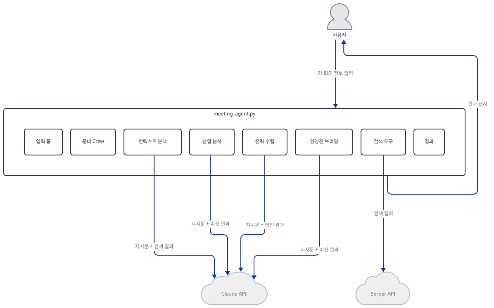

## 사전 준비

| 서비스/도구 | 용도 | 발급·설치 |
|---|---|---|
| Anthropic API 키 | 네 에이전트가 공유하는 `claude` LLM 객체 인증(코드에 박힌 스냅샷은 폐기되어 최신 모델로 바꿔야 실제 호출이 됩니다 — 문제 해결) | https://console.anthropic.com 가입 후 발급, 사이드바 입력창에 붙여넣기 |
| Serper API 키 | `SerperDevTool`이 컨텍스트·산업 분석 에이전트의 웹 검색에 사용 | https://serper.dev 가입 후 발급(무료 크레디트 2,500회), 사이드바 입력창에 붙여넣기 — 이 문서는 키 없이 진행합니다 |
| uv | 가상환경 생성과 패키지 설치 | [공통 사전 준비](../README.md#공통-사전-준비-한-번만) 절 참고 |
| 인터넷 연결 | PyPI 설치, Anthropic API 호출, Serper 검색, crewai 자체 사용 통계 전송(문제 해결) | 별도 설치 없음 |
| (선택) `CREWAI_STORAGE_DIR` 환경변수 | crewai가 실행마다 `%LOCALAPPDATA%\CrewAI\<폴더 이름>\latest_kickoff_task_outputs.db`에 남기는 Task 입력·출력 SQLite 저장 위치를 바꿈(문제 해결) | `export CREWAI_STORAGE_DIR=원하는_경로` (PowerShell은 `$env:CREWAI_STORAGE_DIR="원하는_경로"`) |

## 아키텍처 한눈에 보기

| 컴포넌트 | 역할 | 코드 위치 |
|---|---|---|
| Streamlit UI / 사이드바 키 입력 | 페이지 제목, 사이드바에 Anthropic·Serper 키 입력창 2개 | `advanced_ai_agents/single_agent_apps/ai_meeting_agent/meeting_agent.py:7-14` |
| 입력 게이트 | 키 2개가 모두 있어야 이하 코드가 실행됨 | `advanced_ai_agents/single_agent_apps/ai_meeting_agent/meeting_agent.py:17` |
| LLM (`claude`) | 4개 에이전트가 공유하는 crewai `LLM` 객체(Anthropic 네이티브 공급자로 라우팅) | `advanced_ai_agents/single_agent_apps/ai_meeting_agent/meeting_agent.py:22` |
| 검색 도구 (`SerperDevTool`) | Serper API로 웹 검색(컨텍스트·산업 분석 에이전트만 사용) | `advanced_ai_agents/single_agent_apps/ai_meeting_agent/meeting_agent.py:23` |
| 회의 정보 입력 필드 | 회사명·목표·참석자·소요 시간·포커스 5개 입력 | `advanced_ai_agents/single_agent_apps/ai_meeting_agent/meeting_agent.py:26-30` |
| 컨텍스트 분석 에이전트 (`context_analyzer`) | 회사 배경 조사(검색 도구 사용) | `advanced_ai_agents/single_agent_apps/ai_meeting_agent/meeting_agent.py:33-41` |
| 산업 분석 에이전트 (`industry_insights_generator`) | 업계 동향·경쟁 구도 분석(검색 도구 사용) | `advanced_ai_agents/single_agent_apps/ai_meeting_agent/meeting_agent.py:43-51` |
| 전략 수립 에이전트 (`strategy_formulator`) | 시간표 기반 의제·전략 수립(도구 없음, 이전 결과만 사용) | `advanced_ai_agents/single_agent_apps/ai_meeting_agent/meeting_agent.py:53-60` |
| 경영진 브리핑 에이전트 (`executive_briefing_creator`) | 최종 브리핑 작성(도구 없음, 이전 결과만 사용) | `advanced_ai_agents/single_agent_apps/ai_meeting_agent/meeting_agent.py:62-69` |
| Task 4개 | 각 에이전트에게 줄 지시문(f-string으로 입력값 삽입)과 기대 출력 | `advanced_ai_agents/single_agent_apps/ai_meeting_agent/meeting_agent.py:72-155` |
| 미팅 준비 Crew (`meeting_prep_crew`) | `Process.sequential`로 Task 4개를 순서대로 실행, 이전 출력을 자동으로 다음 컨텍스트에 전달 | `advanced_ai_agents/single_agent_apps/ai_meeting_agent/meeting_agent.py:158-163` |
| 실행 버튼 & 결과 표시 | `kickoff()` 호출과 `st.markdown(result)` | `advanced_ai_agents/single_agent_apps/ai_meeting_agent/meeting_agent.py:166-169` |
| Claude API (Anthropic) | 4개 에이전트의 실제 추론 | 코드 없음 (외부 서비스) |
| Serper API | 웹 검색 | 코드 없음 (외부 서비스) |

위 개요 그림은 폭 1200×높이 1000px 안에 넣으려고 Crew와 에이전트·입력·결과 사이의 배선(누가 누구에게 속하고 누구에게 결과를 돌려주는지)을 뺐습니다 — 그 구조만 따로 그리면 이렇습니다.

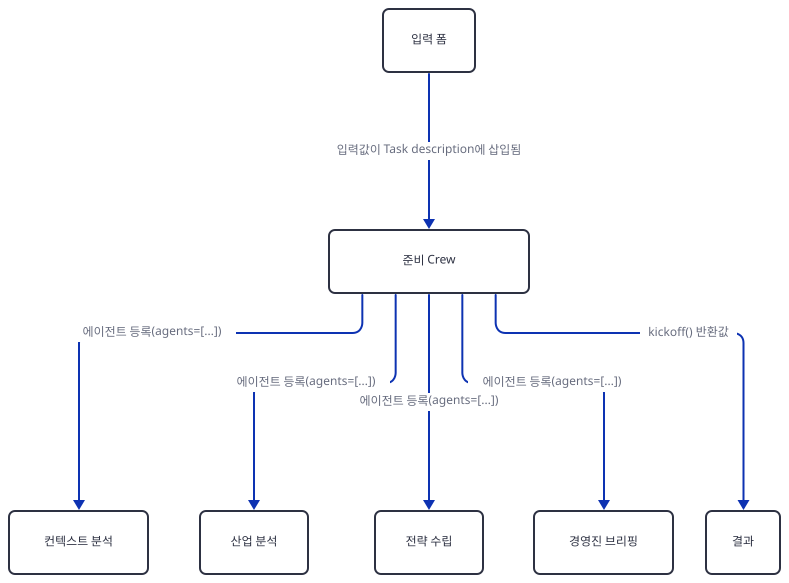

## 단계별 진행

### Step 1. 환경 만들기 — `requirements.txt`에 빠진 `anthropic` 패키지

**목적.** 격리된 가상환경에 `requirements.txt`를 설치하고, 오늘 실제로 풀리는 버전에서 이 186줄이 곧바로 컴파일되는지, 그리고 Anthropic 모델을 쓰는데도 `anthropic` 패키지가 빠져 있다는 사실을 확인합니다.

**할 일.**

```bash
cd advanced_ai_agents/single_agent_apps/ai_meeting_agent
uv venv
uv pip install -r requirements.txt
```

(pip을 쓴다면 `python -m venv .venv && source .venv/bin/activate && pip install -r requirements.txt`.)

이 저장소는 루트에 `pyproject.toml`이 있어 `uv run`이 방금 만든 환경 대신 루트의 `.venv`를 쓰므로, 이후 `uv run` 명령에는 모두 `--no-project`를 붙입니다.

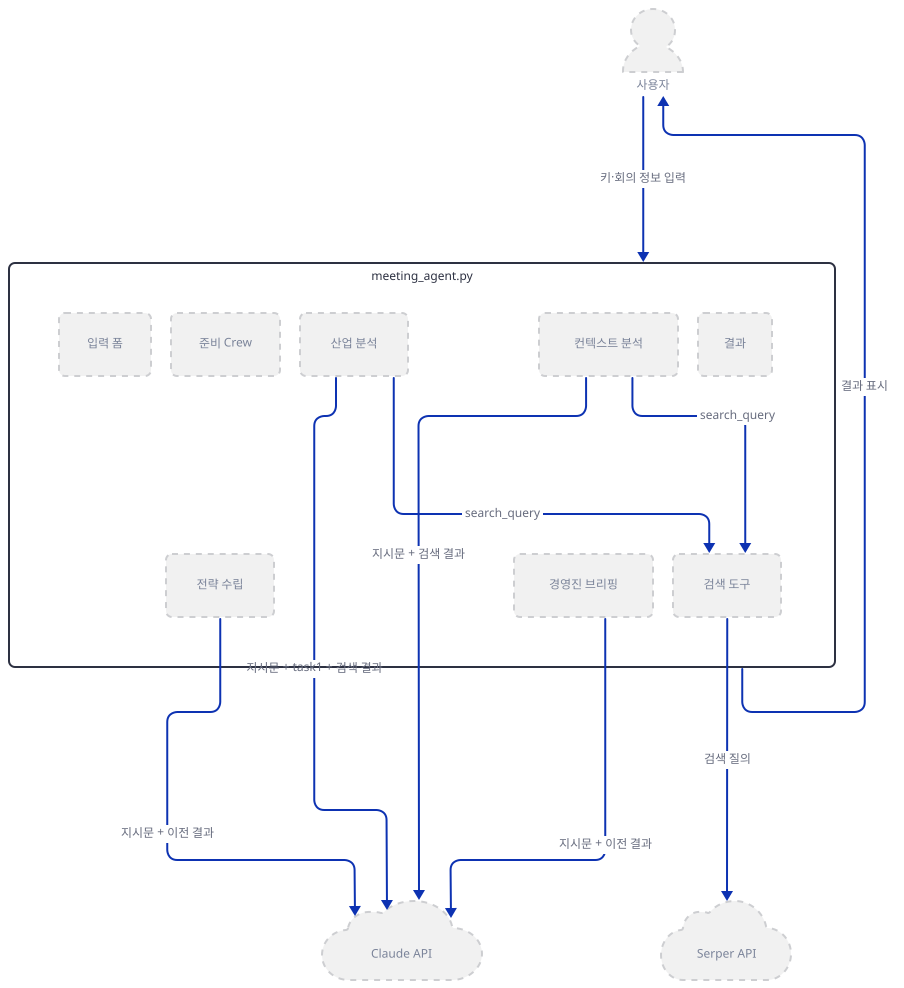

**확인.**

```bash
uv run --no-project python -m py_compile meeting_agent.py && echo OK
uv run --no-project python -c "import crewai, crewai_tools, streamlit, openai; print(crewai.__version__, streamlit.__version__)"
```

직접 확인한 출력:

```
OK
1.15.22 1.64.0
```

`requirements.txt` 4줄 중 어느 것도 버전을 고정하지 않아, 이 문서를 쓰며 설치했을 때는 crewai **1.15.22**, crewai-tools **1.15.22**, streamlit **1.64.0**, openai **2.54.0**이 풀렸습니다. 눈에 띄는 점은 `anthropic` 패키지가 이 4줄 어디에도 없다는 것입니다 — 22행의 `LLM(model="claude-3-5-sonnet-20240620", ...)`은 Anthropic 모델을 쓰는데도입니다. 이 문제는 Step 3에서 실제로 재현합니다.

### Step 2. Streamlit 골격과 입력 폼 — 사이드바 키 2개, 회의 정보 5개

**목적.** 페이지 제목과 사이드바 키 입력, 그리고 키 2개가 모두 있어야 나머지 코드가 실행되는 게이트 구조를 확인합니다.

**할 일.**

`advanced_ai_agents/single_agent_apps/ai_meeting_agent/meeting_agent.py:1-20`

```python
import streamlit as st
from crewai import Agent, Task, Crew, LLM
from crewai.process import Process
from crewai_tools import SerperDevTool
import os

# Streamlit app setup
st.set_page_config(page_title="AI Meeting Agent 📝", layout="wide")
st.title("AI Meeting Preparation Agent 📝")

# Sidebar for API keys
st.sidebar.header("API Keys")
anthropic_api_key = st.sidebar.text_input("Anthropic API Key", type="password")
serper_api_key = st.sidebar.text_input("Serper API Key", type="password")

# Check if all API keys are set
if anthropic_api_key and serper_api_key:
    # # Set API keys as environment variables
    os.environ["ANTHROPIC_API_KEY"] = anthropic_api_key
    os.environ["SERPER_API_KEY"] = serper_api_key
```

키를 사이드바 텍스트 입력창(둘 다 `type="password"`)에서 받는 방식은 Day 083의 사이드바 키 입력과 같은 패턴입니다(되풀이하지 않습니다). `if anthropic_api_key and serper_api_key:` 게이트 안쪽(17~184행)이 이 앱의 실질적인 본문이고, 키가 하나라도 비면 186행의 `else` 경고만 뜹니다. 게이트를 통과하면 이어서 회의 정보 입력 필드 5개가 만들어집니다.

`advanced_ai_agents/single_agent_apps/ai_meeting_agent/meeting_agent.py:25-30`

```python
    # Input fields
    company_name = st.text_input("Enter the company name:")
    meeting_objective = st.text_input("Enter the meeting objective:")
    attendees = st.text_area("Enter the attendees and their roles (one per line):")
    meeting_duration = st.number_input("Enter the meeting duration (in minutes):", min_value=15, max_value=180, value=60, step=15)
    focus_areas = st.text_input("Enter any specific areas of focus or concerns:")
```

이 다섯 값은 뒤에서 Task 설명 f-string에 그대로 삽입됩니다(Step 5).

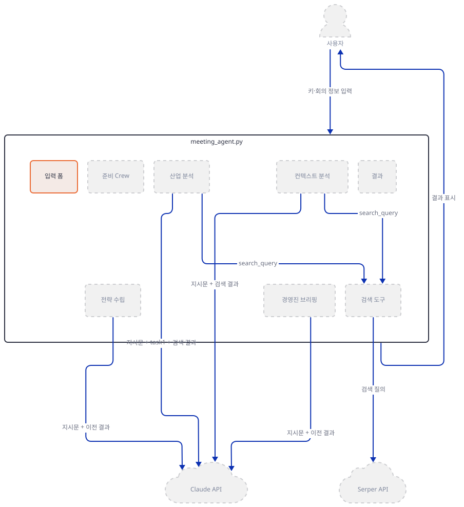

**확인.** 헤드리스로 잠깐 띄워 페이지 자체가 뜨는지만 봅니다. `--server.address localhost`를 꼭 붙입니다 — 없으면 Streamlit이 시작하며 외부 IP를 알아내려고 `checkip.amazonaws.com`에 요청을 보냅니다(Day 060에서 확인, 이번 streamlit 1.64.0도 headless·주소 미지정 조합에서 소스로 같은 동작을 확인했습니다 — 주소를 **빼고** 띄워 실제로 요청이 나가는 것까지 이번에 재현하지는 않았습니다).

```bash
uv run --no-project streamlit run meeting_agent.py --server.headless true --server.address localhost --server.port 58421
```

```powershell
# Windows PowerShell
uv run --no-project streamlit run meeting_agent.py --server.headless true --server.address localhost --server.port 58421
```

직접 확인한 로그:

```
Uvicorn server started on localhost:58421
  You can now view your Streamlit app in your browser.
  URL: http://localhost:58421
```

`curl -s -o /dev/null -w "%{http_code}" http://localhost:58421`은 `200`을 돌려주었습니다(직접 확인) — HTML 껍데기만 받는 확인이라 실제로 어떤 위젯이 뜨는지는 이것만으로 알 수 없습니다. 어떤 위젯이 뜨는지는 `streamlit.testing.v1.AppTest`로 스크립트를 직접 실행해 확인했습니다(Step 6에서 같은 도구로 더 확인합니다). 확인이 끝나면 프로세스를 반드시 종료하고 포트가 비었는지(`netstat -ano | grep 58421`) 봅니다.

이 문서의 모든 재현 명령은 프록시·네트워크 차단 변수(`HTTP_PROXY` 등)와 PATH에서 루트 `.venv`를 뺀 상태로 실행했습니다 — 이것들은 이 문서를 쓰는 재현 환경을 격리하기 위한 것이라 독자가 그대로 셸에 `export`할 필요는 없습니다. 루트에 `.venv`가 활성화되어 있어 `streamlit`이 그쪽 것을 집는다면(`which streamlit`으로 확인) PATH에서 그 부분만 빼면 됩니다.

### Step 3. 모델 연결 — 빠진 패키지, 잘못된 버전, 폐기된 스냅샷

**목적.** crewai의 `LLM` 팩토리가 모델 이름에서 공급자를 어떻게 추론하는지, 그리고 이 앱이 왜 세 겹으로 깨지는지(패키지 부재 → `anthropic` 아무 버전이나 넣으면 `temperature` 인자 충돌 → 올바른 버전으로 고쳐도 모델 폐기) 소스와 재현으로 확인합니다.

**할 일.**

`advanced_ai_agents/single_agent_apps/ai_meeting_agent/meeting_agent.py:22-23`

```python
    claude = LLM(model="claude-3-5-sonnet-20240620", temperature= 0.7, api_key=anthropic_api_key)
    search_tool = SerperDevTool()
```

crewai 1.15.22의 `LLM.__new__`는 모델 문자열에 공급자 접두사(`anthropic/…`)가 없으면 `_infer_provider_from_model`로 넘어가는데, 이 함수는 먼저 자신의 `ANTHROPIC_MODELS` 상수 목록(오늘 버전은 `claude-sonnet-5`·`claude-opus-5` 같은 2025년 이후 모델만 담고 있어 2024년 스냅샷은 없습니다)을 보고, 없으면 `claude` 접두사 패턴으로 판정합니다 — 어느 쪽이든 결과는 `"anthropic"`입니다(소스로 확인). 이어서 `_get_native_provider("anthropic")`가 `crewai.llms.providers.anthropic.completion`에서 `AnthropicCompletion`을 불러오는데, 이 모듈은 맨 위에서 `from anthropic import Anthropic, AsyncAnthropic, ...`를 시도하고 실패하면 `ImportError('Anthropic native provider not available, to install: uv add "crewai[anthropic]"')`를 곧바로 던집니다 — 이 예외는 `LLM.__new__`의 `try/except`가 감싸는 범위 **밖**(공급자 클래스를 가져오는 줄 자체)에서 일어나므로 그대로 밖으로 전파됩니다(소스로 확인, crewai 1.15.22). 직접 재현(격리 가상환경, 프록시로 외부 요청 차단, 가짜 키만 사용):

```bash
uv run --no-project python -c "
from crewai import LLM
LLM(model='claude-3-5-sonnet-20240620', temperature=0.7, api_key='sk-fake-key-not-real')
"
```

직접 확인한 오류:

```
ImportError: Anthropic native provider not available, to install: uv add "crewai[anthropic]"
```

여기서 **`uv pip install anthropic`로 넘기면 안 됩니다.** 이 문서를 쓸 때 이 명령이 까는 것은 **anthropic 1.x**(설치 시점에 따라 1.8.0·1.9.0 등 patch 번호가 바뀔 수 있습니다 — 실제로 이 문서를 쓰는 하루 사이에도 1.8.0에서 1.9.0으로 올라갔습니다)이고, Anthropic Python SDK는 v1.0부터 `temperature`·`top_p`·`top_k`를 클라이언트 메서드에서 아예 없앴습니다. 그런데 22행은 `temperature=0.7`을 넘기고, crewai 1.15.22의 `AnthropicCompletion`(`crewai/llms/providers/anthropic/completion.py`)은 `self.temperature is not None`이면 `params["temperature"] = self.temperature`를 채운 뒤 `self._get_sync_client().messages.create(**params)`를 호출합니다(소스로 확인) — `except`는 컨텍스트 초과만 따로 잡고 나머지는 그대로 다시 던집니다. 직접 서명 대조로 확인:

```bash
uv pip install anthropic
uv run --no-project python -c "
import anthropic, inspect
print('anthropic', anthropic.__version__)
sig = inspect.signature(anthropic.Anthropic(api_key='x').messages.create)
print('temperature 매개변수 있음:', 'temperature' in sig.parameters)
"
```

직접 확인한 출력:

```
anthropic 1.9.0
temperature 매개변수 있음: False
```

`sig.bind(..., temperature=0.7)`도 `TypeError: got an unexpected keyword argument 'temperature'`로 실패합니다(직접 확인) — Claude에 요청을 보내기도 전에 로컬에서 나는 오류입니다. crewai가 스스로 요구하는 것은 `anthropic` 단독이 아니라 **`crewai[anthropic]` extra**입니다(오류 문구의 `uv add "crewai[anthropic]"`도 이것을 가리킵니다). 이 extra는 `anthropic~=0.73.0`을 고정합니다(crewai 1.15.22 METADATA `Requires-Dist: anthropic~=0.73.0; extra == 'anthropic'`, 직접 확인). **여기서 uv 버전에 따라 갈립니다.** 방금처럼 `anthropic`을 먼저 설치해 둔 채로 `uv pip install "crewai[anthropic]"`만 실행하면, uv **0.7.2**(이 문서를 쓴 PC의 버전, `uv --version`으로 확인)는 이미 `anthropic`이 설치돼 있다는 이유만으로 `Audited 1 package`를 찍고 1.9.0을 그대로 둡니다 — extra의 `~=0.73.0` 제약을 다시 확인하지 않습니다(직접 재현). 최신 uv(0.12.19)는 같은 명령으로 곧바로 `- anthropic==1.9.0 / + anthropic==0.73.0`으로 내려 줍니다(직접 재현). uv 버전에 상관없이 안전하려면 `--reinstall-package anthropic`을 붙입니다:

```bash
uv pip install "crewai[anthropic]" --reinstall-package anthropic
uv run --no-project python -c "
import anthropic, inspect
print('anthropic', anthropic.__version__)
sig = inspect.signature(anthropic.Anthropic(api_key='x').messages.create)
sig.bind(model='claude-sonnet-4-6', max_tokens=100, messages=[{'role':'user','content':'hi'}], temperature=0.7)
print('bind OK')
"
```

직접 확인한 출력(uv 0.7.2에서도 `--reinstall-package`를 붙이면 이렇게 내려갑니다):

```
 - anthropic==1.9.0
 + anthropic==0.73.0
anthropic 0.73.0
bind OK
```

(처음부터 `anthropic`을 따로 설치하지 않고 `uv pip install "crewai[anthropic]"`만 실행하는 새 환경이라면 uv 버전과 상관없이 바로 0.73.0이 깔립니다 — 이 문제는 "이미 깔린 1.x 위에 extra만 더할 때"만 일어납니다.)

이걸로 첫 번째 문제(패키지 부재)와 두 번째 문제(`temperature` 제거)가 함께 풀립니다. 하지만 세 번째 문제가 남습니다: `claude-3-5-sonnet-20240620`은 Anthropic 공식 모델 폐기 문서 기준 **2025-08-13에 폐기 공지, 2025-10-28에 완전히 폐기(retired)** 되었고, 권장 대체는 `claude-sonnet-4-6`입니다 — "폐기(retired)"는 "요청 자체가 실패한다"는 뜻이라고 같은 문서가 명시합니다. 이 리포 코드는 고치지 않으므로, 실제로 이 앱을 돌리려면 22행의 모델 문자열을 직접 바꿔야 합니다(더 해보기).

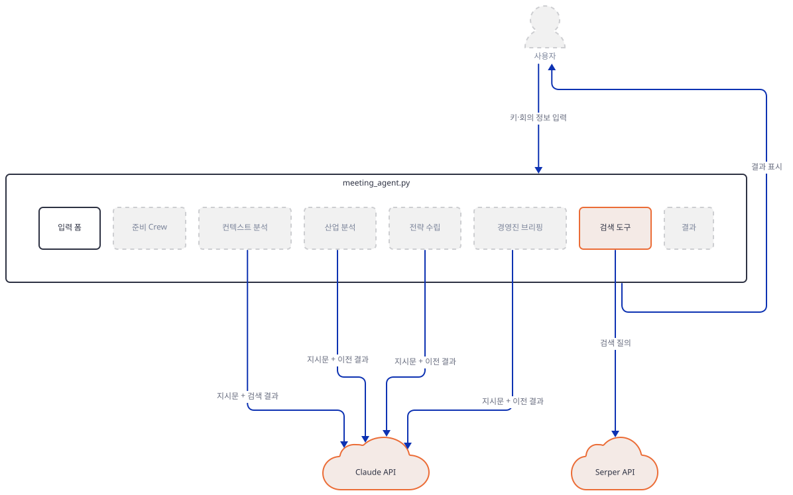

**확인.** 위 재현 명령과 출력이 곧 확인입니다. `search_tool = SerperDevTool()`은 생성 시점에는 환경변수를 요구하지 않고, 실제 검색 호출 때 `SERPER_API_KEY`가 필요합니다(소스로 확인, `base_url="https://google.serper.dev"`).

### Step 4. 에이전트 4개 정의 — 검색 도구는 둘만

**목적.** crewai `Agent`의 `role`·`goal`·`backstory`·`llm`·`tools` 패턴을 확인하고, 4개 에이전트 중 정확히 둘만 검색 도구를 쥔다는 사실을 코드로 확인합니다.

**할 일.**

`advanced_ai_agents/single_agent_apps/ai_meeting_agent/meeting_agent.py:33-41`

```python
    context_analyzer = Agent(
        role='Meeting Context Specialist',
        goal='Analyze and summarize key background information for the meeting',
        backstory='You are an expert at quickly understanding complex business contexts and identifying critical information.',
        verbose=True,
        allow_delegation=False,
        llm=claude,
        tools=[search_tool]
    )
```

나머지 세 에이전트(`advanced_ai_agents/single_agent_apps/ai_meeting_agent/meeting_agent.py:43-69`)도 같은 형태이되, `industry_insights_generator`(43-51행)만 `context_analyzer`처럼 `tools=[search_tool]`을 함께 갖고, `strategy_formulator`(53-60행)와 `executive_briefing_creator`(62-69행)는 `tools=` 자체가 없습니다 — 이 둘은 검색을 하지 않고 앞 Task들의 결과(자동 전달되는 컨텍스트)만으로 씁니다(직접 그렙으로 확인: `tools=`가 있는 줄은 2개뿐). 네 에이전트 모두 `llm=claude`로 Step 3의 같은 `LLM` 객체를 공유합니다.

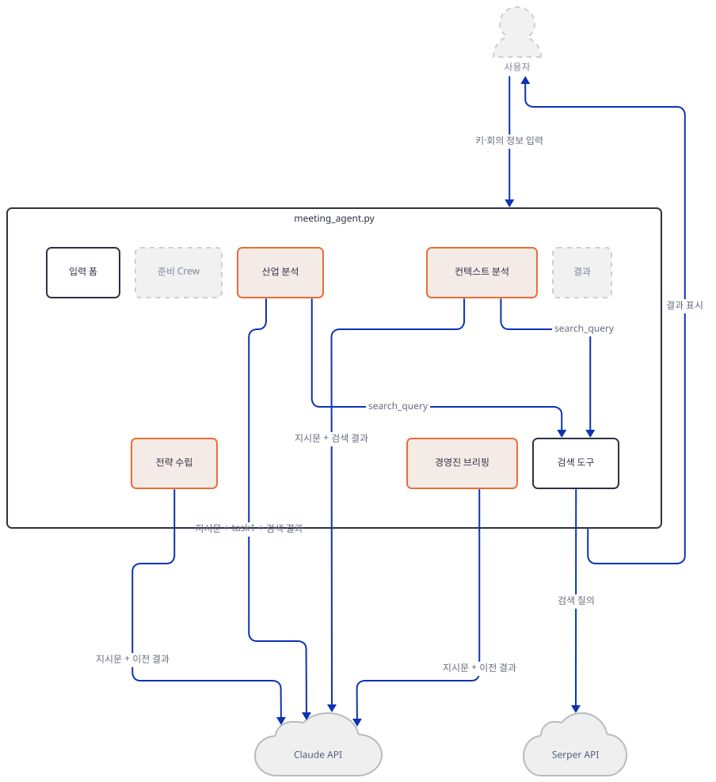

**확인.**

```bash
grep -n "tools=\[search_tool\]" meeting_agent.py
```

직접 확인한 출력: 40행과 50행 두 줄만 나옵니다.

### Step 5. Task 4개와 Crew 구성 — `Process.sequential`의 자동 컨텍스트 전달

**목적.** Task 설명이 f-string으로 어떻게 입력값을 담는지, 그리고 `context`를 명시하지 않은 `Process.sequential`이 이전 Task 출력들을 어떻게 자동으로 다음 Task에 넘기는지 확인합니다.

**할 일.**

`advanced_ai_agents/single_agent_apps/ai_meeting_agent/meeting_agent.py:72-90`

```python
    context_analysis_task = Task(
        description=f"""
        Analyze the context for the meeting with {company_name}, considering:
        1. The meeting objective: {meeting_objective}
        2. The attendees: {attendees}
        3. The meeting duration: {meeting_duration} minutes
        4. Specific focus areas or concerns: {focus_areas}

        Research {company_name} thoroughly, including:
        1. Recent news and press releases
        2. Key products or services
        3. Major competitors

        Provide a comprehensive summary of your findings, highlighting the most relevant information for the meeting context.
        Format your output using markdown with appropriate headings and subheadings.
        """,
        agent=context_analyzer,
        expected_output="A detailed analysis of the meeting context and company background, including recent developments, financial performance, and relevance to the meeting objective, formatted in markdown with headings and subheadings."
    )
```

나머지 세 Task(`advanced_ai_agents/single_agent_apps/ai_meeting_agent/meeting_agent.py:92-155`)도 같은 형태로, Step 2의 입력값과 `expected_output`이 각각 다릅니다. 어느 Task도 `context=`를 지정하지 않습니다 — crewai의 `Task.context` 필드 기본값은 `None`이 아니라 `NOT_SPECIFIED`라는 별도 센티널이고, `Crew._get_context`는 `task.context is NOT_SPECIFIED`일 때 그때까지 나온 모든 Task 출력을 이어붙여(`aggregate_raw_outputs_from_task_outputs`) 다음 Task의 컨텍스트로 넘깁니다(소스로 확인, crewai 1.15.22) — 그래서 세 번째·네 번째 Task는 명시적으로 참조하지 않아도 앞선 Task들의 결과를 이미 프롬프트에 포함해 받습니다. 이어서 Crew를 만듭니다.

`advanced_ai_agents/single_agent_apps/ai_meeting_agent/meeting_agent.py:157-163`

```python
    # Create the crew
    meeting_prep_crew = Crew(
        agents=[context_analyzer, industry_insights_generator, strategy_formulator, executive_briefing_creator],
        tasks=[context_analysis_task, industry_analysis_task, strategy_development_task, executive_brief_task],
        verbose=True,
        process=Process.sequential
    )
```

`agents=`와 `tasks=`는 같은 순서로 대응하고(`Process.sequential`은 `tasks` 리스트 순서대로 실행합니다), `Crew` 객체를 만드는 시점 자체는 네트워크를 쓰지 않습니다 — 직접 재현(가짜 키, 소켓·DNS 차단)에서 `Agent`·`Task`·`Crew` 생성까지 아무 요청도 나가지 않았습니다.

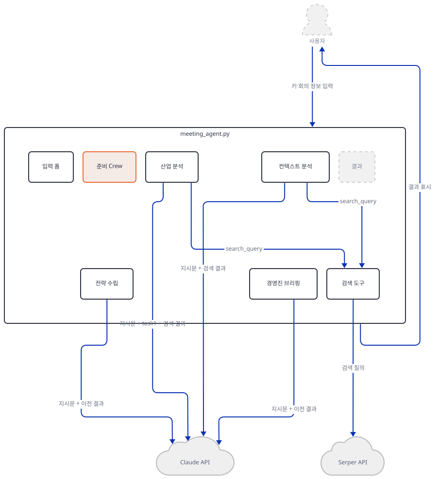

**확인.**

```bash
uv run --no-project python -c "
from crewai import Agent, Task, Crew, LLM
from crewai.process import Process
from crewai_tools import SerperDevTool
claude = LLM(model='claude-3-5-sonnet-20240620', api_key='sk-fake-key-not-real')
a = Agent(role='x', goal='y', backstory='z', llm=claude, tools=[SerperDevTool()])
t = Task(description='d', agent=a, expected_output='e')
c = Crew(agents=[a], tasks=[t], process=Process.sequential)
print('OK', type(c).__name__)
"
```

직접 확인한 출력(사전에 `uv pip install "crewai[anthropic]" --reinstall-package anthropic` 필요 — Step 3):

```
OK Crew
```

### Step 6. 실행 버튼과 결과 표시

**목적.** `kickoff()` 호출부터 결과가 화면에 뜨기까지의 마지막 연결을 확인합니다.

**할 일.**

`advanced_ai_agents/single_agent_apps/ai_meeting_agent/meeting_agent.py:166-169`

```python
    if st.button("Prepare Meeting"):
        with st.spinner("AI agents are preparing your meeting..."):
            result = meeting_prep_crew.kickoff()        
        st.markdown(result)
```

버튼을 누르면 `meeting_prep_crew.kickoff()`가 Task 4개를 `Process.sequential`대로 실행하고(Step 5), 돌아온 `CrewOutput`을 `st.markdown(result)`가 그대로 렌더링합니다. 사이드바 아래쪽(171-184행)에는 정적인 "사용법" 안내 마크다운이 있고, 키가 하나라도 비면 185-186행의 `else` 분기가 실행됩니다.

`advanced_ai_agents/single_agent_apps/ai_meeting_agent/meeting_agent.py:185-186`

```python
else:
    st.warning("Please enter all API keys in the sidebar before proceeding.")
```

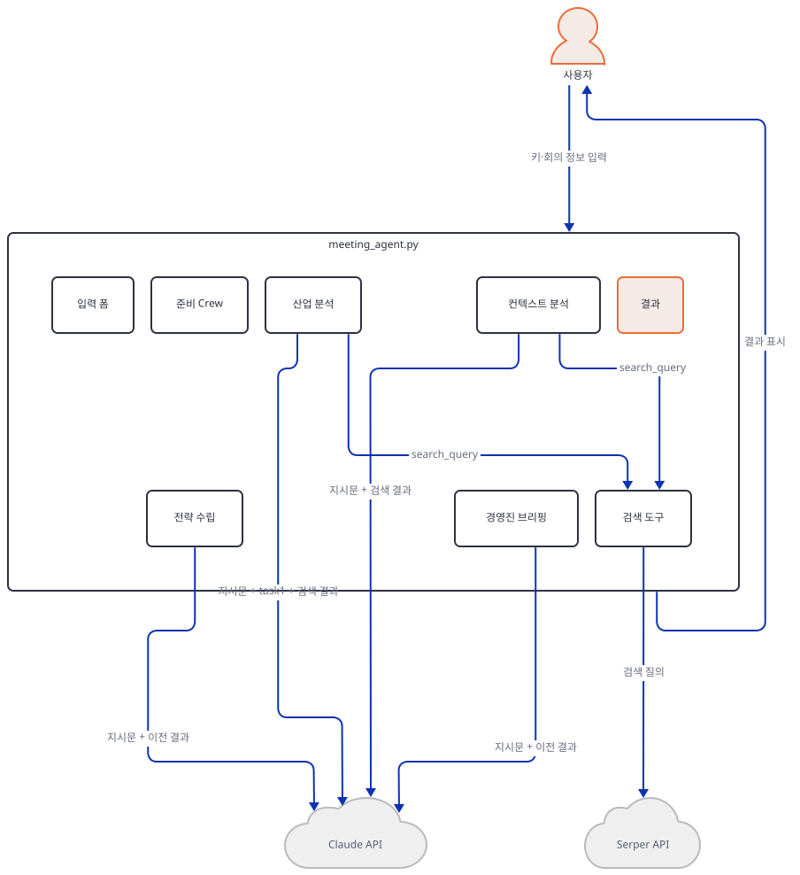

**확인.** `streamlit.testing.v1.AppTest`로 스크립트를 직접 실행해(브라우저 없이) 키 상태별로 어떤 위젯이 뜨는지 확인합니다. 먼저 키를 비워 둔 채로:

```bash
uv run --no-project python -c "
from streamlit.testing.v1 import AppTest
at = AppTest.from_file('meeting_agent.py')
at.run(timeout=30)
print('exceptions:', at.exception)
print('warnings:', [w.value for w in at.warning])
print('button count:', len(at.button))
"
```

직접 확인한 출력:

```
exceptions: ElementList()
warnings: ['Please enter all API keys in the sidebar before proceeding.']
button count: 0
```

이제 사이드바 키 2개에 가짜 값을 채우고 다시 실행합니다 — 아래 명령을 두 환경에 각각 돌렸습니다:

```bash
uv run --no-project python -c "
from streamlit.testing.v1 import AppTest
at = AppTest.from_file('meeting_agent.py')
at.run(timeout=30)
at.text_input[0].set_value('sk-fake-key-not-real')
at.text_input[1].set_value('fake-serper-key')
at.run(timeout=30)
print('exceptions:', [str(e.value) for e in at.exception])
print('text_input count:', len(at.text_input))
print('text_area count:', len(at.text_area))
print('number_input count:', len(at.number_input))
print('button count:', len(at.button))
"
```

직접 확인한 출력 — `crewai[anthropic]`가 없는 환경(Step 3의 `ImportError`가 여기서도 그대로 잡히고, 22행에서 죽어 그 아래 회의 정보 입력 필드는 만들어지지도 않습니다):

```
exceptions: ['Anthropic native provider not available, to install: uv add "crewai[anthropic]"']
text_input count: 2
text_area count: 0
number_input count: 0
button count: 0
```

직접 확인한 출력 — `crewai[anthropic]`를 설치한 환경:

```
exceptions: []
text_input count: 5
text_area count: 1
number_input count: 1
button count: 1
```

`text_input count: 5`는 사이드바 키 2개(Anthropic·Serper)와 회의 정보 중 텍스트 입력 3개(회사명·목표·포커스)를 합친 수이고, 참석자는 `text_area`, 소요 시간은 `number_input`이라 따로 셉니다. `kickoff()` 자체는 유효한 키와 살아 있는 모델이 있어야 실행되므로 이 문서에서는 호출하지 않습니다.

## 요청 한 건이 흐르는 과정

한 번의 "Prepare Meeting" 클릭이 실제로는 아홉 단계를 거칩니다 — 순서대로 그렸습니다. 검색 도구를 쥔 Task(1·2)마다 LLM 턴이 **두 번**입니다 — crewai의 에이전트 실행기(`crewai/experimental/agent_executor.py`의 `call_llm_native_tools`, 소스로 확인)는 도구 스키마를 붙여 **먼저 Claude를 부르고**, Claude가 도구 호출(예: `search_query` 인자)로 응답하면 **그때** `SerperDevTool`을 실행한 뒤 결과를 담아 Claude를 **다시** 부릅니다. 검색어 자체도 코드가 아니라 Claude가 고릅니다 — `SerperDevTool._run(**kwargs)`는 `search_query`가 없으면 `ValueError`를 내는데, 이 값은 LLM의 도구 호출 인자로만 채워집니다(소스로 확인, crewai-tools 1.15.22). 도구가 없는 전략·브리핑 에이전트는 이 왕복 없이 LLM을 한 번만 부릅니다(`_invoke_loop_native_no_tools`, 소스로 확인).

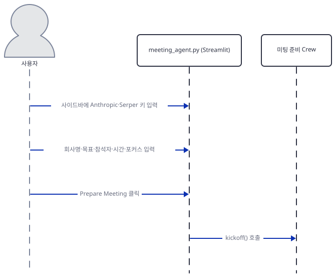

1단계는 사용자가 키와 회의 정보를 입력하고 `kickoff()`가 호출되는 부분만 그립니다.

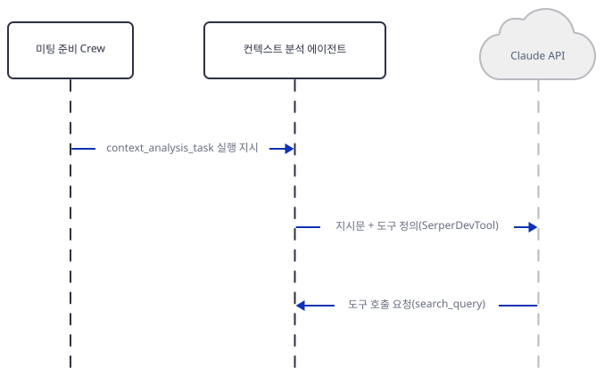

2단계는 Crew가 컨텍스트 분석 에이전트에게 Task1을 맡기고, 에이전트가 도구 정의를 붙여 Claude를 부르면 Claude가 검색 도구 호출을 요청하는 부분입니다 — 아직 검색은 일어나지 않습니다.

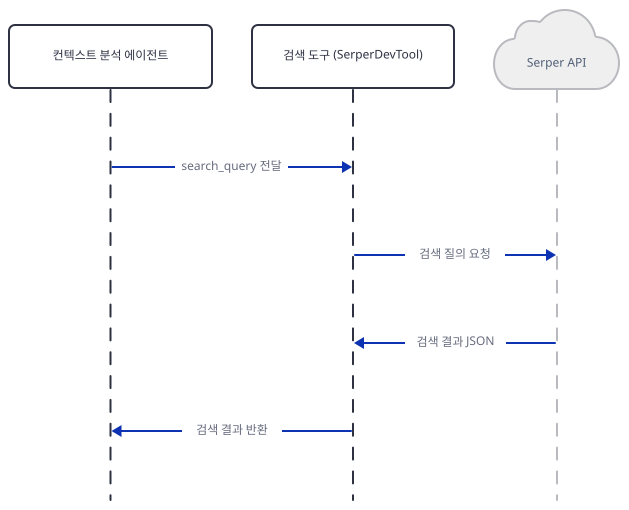

3단계는 Claude가 고른 `search_query`로 실제 검색 도구가 Serper를 거쳐 회사 정보를 모으는 부분입니다.

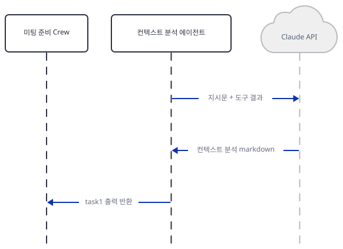

4단계는 검색 결과를 담아 Claude를 다시 불러 컨텍스트 분석 markdown을 받고, Crew에 task1 출력을 돌려주는 부분입니다.

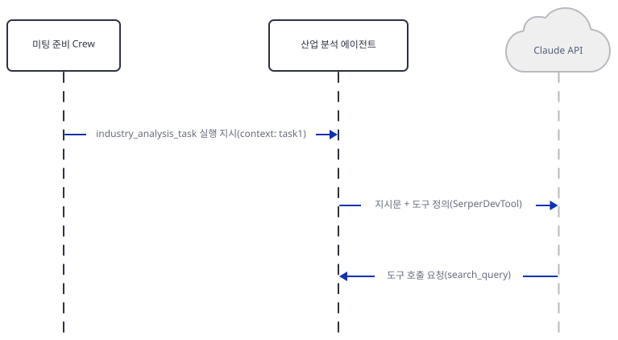

5단계는 Crew가 산업 분석 에이전트에게 Task2를 맡기는 부분입니다 — 이때 넘기는 지시문에는 이미 task1 출력이 컨텍스트로 포함되어 있습니다(Step 5).

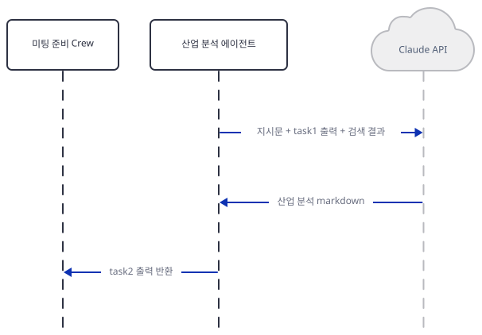

6단계는 Claude가 고른 검색어로 업계 동향을 모으는 부분입니다.

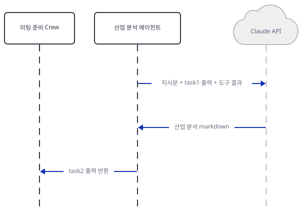

7단계는 검색 결과와 task1 출력을 함께 담아 Claude를 다시 불러 산업 분석 markdown을 받는 부분입니다.

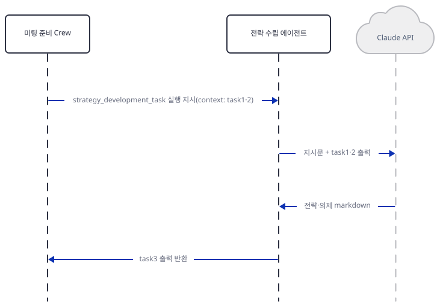

8단계는 전략 수립 에이전트입니다 — 도구가 없으므로 지금까지의 출력(task1·2)만으로 LLM을 한 번 불러 전략·의제 markdown을 받습니다.

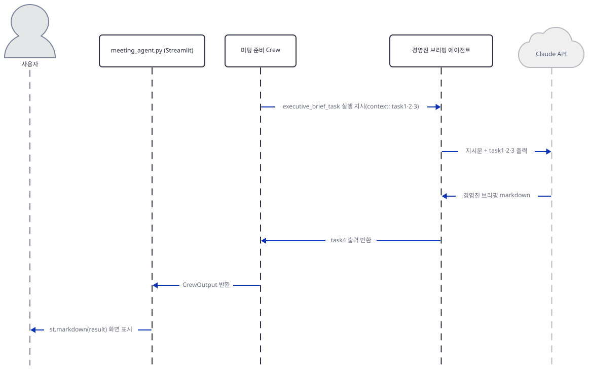

9단계는 경영진 브리핑 에이전트가 지금까지의 출력(task1·2·3)으로 최종 브리핑을 받고, Crew가 `CrewOutput`을 Streamlit으로, Streamlit이 `st.markdown(result)`로 사용자에게 돌려주는 부분입니다.

이 아홉 그림은 소스로 구성했습니다(키가 없어 실제 실행은 확인하지 못했습니다) — `Process.sequential`이 컨텍스트를 자동으로 잇는다는 사실은 Step 5에서, LLM이 먼저 불리고 도구가 그 뒤에 실행된다는 순서는 `agent_executor.py`의 `call_llm_native_tools`/`execute_native_tool` 흐름으로 소스에서 직접 확인했습니다. 도구 호출과 결과 반영 사이의 정확한 메시지 형식(OpenAI 호환 tool-call 스키마)까지 개별 네트워크 호출 단위로 가로채 보지는 않았습니다.

## 실행 체크리스트

- [ ] `uv venv && uv pip install -r requirements.txt`로 격리 환경을 만들었다
- [ ] `uv pip install "crewai[anthropic]" --reinstall-package anthropic`을 추가로 설치했다(맨 `anthropic`만 먼저 넣었다면 1.x가 남아 `temperature`로 깨지고, uv 0.7.2 등 일부 버전은 `crewai[anthropic]`만으로는 안 내려감 — Step 3) — 없으면 `LLM(...)` 생성에서 바로 `ImportError`
- [ ] 22행의 `model="claude-3-5-sonnet-20240620"`을 살아 있는 모델(예: `claude-sonnet-4-6`)로 바꿨다 — 원래 스냅샷은 폐기됨
- [ ] Anthropic·Serper API 키를 발급받았다
- [ ] `uv run --no-project streamlit run meeting_agent.py`로 앱을 띄웠다(headless 확인이면 `--server.headless true --server.address localhost`)
- [ ] 사이드바에 키 2개, 본문에 회의 정보 5개를 입력했다
- [ ] Prepare Meeting을 눌러 네 에이전트가 순서대로 실행되고 결과가 마크다운으로 표시되는지 확인했다

## 문제 해결

| 증상 | 원인 | 해결 |
|---|---|---|
| 키 2개를 입력하는 순간 `ImportError: Anthropic native provider not available, to install: uv add "crewai[anthropic]"` | `requirements.txt`에 `anthropic` 패키지가 빠져 있어 crewai의 네이티브 Anthropic 공급자를 불러오지 못함(직접 재현, Step 3) | `uv pip install "crewai[anthropic]"`(리포 코드는 고치지 않음) — 맨 `anthropic`만 넣으면 다음 증상으로 넘어갈 뿐임 |
| 위 문제를 `uv pip install anthropic`(버전 미지정)으로 넘기면 `TypeError: got an unexpected keyword argument 'temperature'` | 이 문서를 쓸 때 풀리는 anthropic 1.x(1.8.0·1.9.0 등, 패치 번호는 설치 시점마다 바뀜)가 v1.0부터 `temperature`·`top_p`·`top_k`를 없앴는데 22행은 `temperature=0.7`을 넘김(직접 서명 대조로 확인, Step 3) | `uv pip install "crewai[anthropic]" --reinstall-package anthropic`로 anthropic **0.73.0**을 설치해야 함 — `anthropic`을 먼저 넣은 채로 `--reinstall-package` 없이 `crewai[anthropic]`만 실행하면 uv 0.7.2 등 일부 버전은 이미 설치된 1.x를 그대로 둠(직접 재현, Step 3, 리포 코드는 고치지 않음) |
| 위 둘을 고쳐도 Claude 호출 자체가 실패할 것으로 보임(키가 없어 최종 확인은 못함) | 22행에 박힌 `claude-3-5-sonnet-20240620`이 Anthropic 공식 문서 기준 2025-10-28 폐기(retired) — "요청 자체가 실패한다"고 문서가 명시 | 22행의 모델 문자열을 `claude-sonnet-4-6`(Anthropic 권장 대체) 등 살아 있는 모델로 바꿔야 함(리포 코드는 고치지 않음) |
| 앱 자체 README가 "OpenAI의 GPT-4와 Anthropic의 Claude를 함께 쓴다"고 소개하지만 실제로는 Claude만 씀 | `meeting_agent.py`에 `OpenAI(...)`나 OpenAI 모델을 만드는 코드가 없음(그렙으로 확인) — `requirements.txt`의 `openai` 줄은 crewai 1.15.22 자신의 필수 의존성(`openai<3,>=2.30.0`, extra 없음)과 겹치는 중복일 뿐임(METADATA로 확인) | 리포 코드·README는 고치지 않음, 실제로는 Claude 단일 모델 앱으로 이해하면 됨 |
| `streamlit run`을 `--server.address localhost` 없이 headless로 띄우면 시작할 때 외부로 요청이 나감 | Streamlit이 headless이면서 주소를 지정하지 않으면 외부 IP를 알아내려고 `checkip.amazonaws.com`에 요청을 보냄(Day 060에서 확인, 이번 streamlit 1.64.0에서는 소스로만 같은 조건을 재확인 — 주소 미지정 headless 기동은 재현하지 않음) | headless로 띄울 때는 항상 `--server.headless true --server.address localhost`를 함께 씀 |
| 검색 결과가 비거나 도구 호출이 실패함(키가 없어 실제로는 보지 못함) | `SerperDevTool()`은 생성 시점에는 조용하지만 실제 검색 시 `SERPER_API_KEY` 환경변수를 요구함(소스로 확인) | 사이드바에 Serper 키를 입력했는지 확인 |
| `Crew()`를 만든 시점부터 `%LOCALAPPDATA%\CrewAI\<폴더 이름>\latest_kickoff_task_outputs.db`가 생김(직접 재현) | crewai의 kickoff 출력 저장소가 기본으로 이 경로에 SQLite를 만들고, kickoff마다 각 Task의 `output`·`inputs`(회사·참석자 정보 포함)를 저장함(소스로 확인, `crewai/memory/storage/kickoff_task_outputs_storage.py`) | 원치 않으면 `CREWAI_STORAGE_DIR` 환경변수로 저장 위치를 스크래치 등으로 바꾸거나(사전 준비), 실행 뒤 그 폴더를 직접 지움(리포 코드는 고치지 않음) |
| `kickoff()`를 부르면 알지 못하는 사이 외부로 사용 통계가 나갈 수 있음 | crewai가 `CrewKickoffStartedEvent` 시점에 OpenTelemetry span을 만들어 `https://telemetry.crewai.com:4319/v1/traces`로 배치 전송을 시도함(기본값 켜짐, 소스로 확인) — 프롬프트·Task 본문 자체는 `share_crew=True`일 때만 담김 | `CREWAI_DISABLE_TELEMETRY=true`(또는 `OTEL_SDK_DISABLED=true`, `CREWAI_DISABLE_TRACKING=true`) 환경변수로 끌 수 있음(리포 코드는 고치지 않음) |

## 더 해보기

- `advanced_ai_agents/single_agent_apps/ai_meeting_agent/meeting_agent.py:22`의 `model="claude-3-5-sonnet-20240620"`을 `claude-sonnet-4-6`으로 바꾸고 `uv pip install "crewai[anthropic]" --reinstall-package anthropic` 후 실제 키로 실행해, 네 에이전트가 실제로 순서대로 도는지, 그리고 검색 Task마다 LLM이 두 번씩 불리는지 확인해보기
- `strategy_formulator`와 `executive_briefing_creator`에도 `tools=[search_tool]`을 추가하면 전략·브리핑 단계가 검색 없이 앞 단계 요약만으로 쓰는 지금과 결과가 어떻게 달라지는지 비교해보기
- 네 번째 Task(`executive_brief_task`)에 `context=[strategy_development_task]`처럼 이전 Task 하나만 명시적으로 좁혀 보고, `Process.sequential`의 자동 전달(모든 이전 Task 포함)과 어떻게 다른 프롬프트가 만들어지는지 비교해보기

## 다음 날 예고

[Day 085 · 🧠 AI Mental Wellbeing Agent](../day085-ai-mental-wellbeing-agent/README.md) — `advanced_ai_agents/multi_agent_apps` 폴더의 멀티 에이전트 앱으로, 여러 에이전트가 협업해 정신 건강 관련 조언을 만듭니다.
