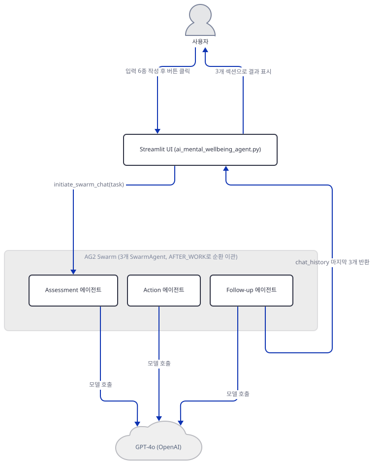
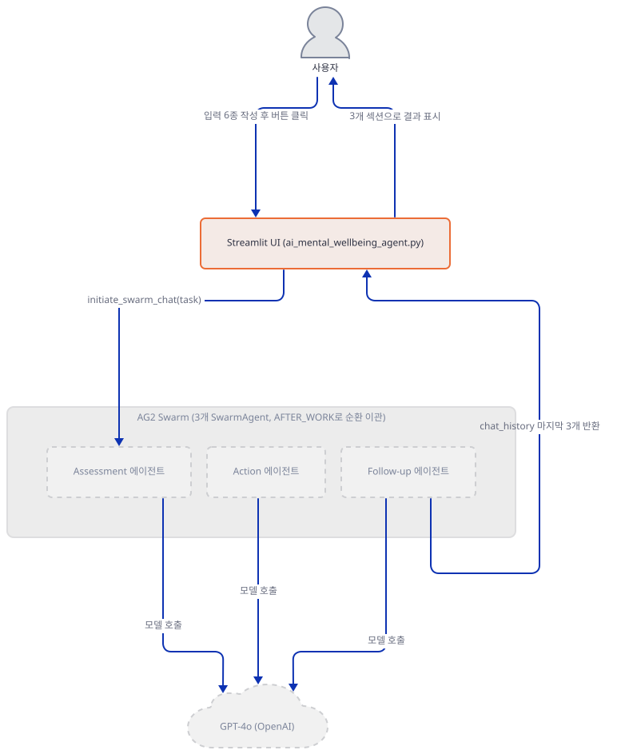
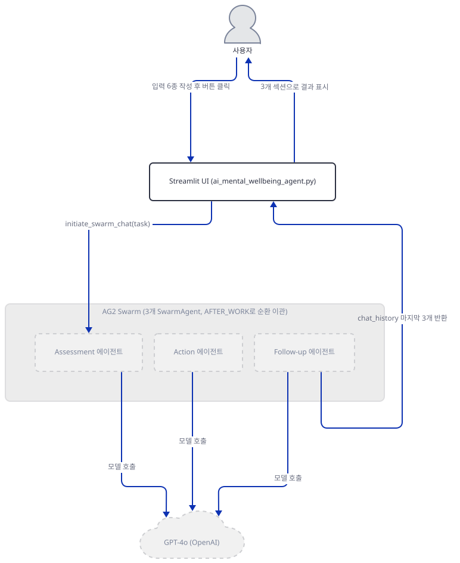
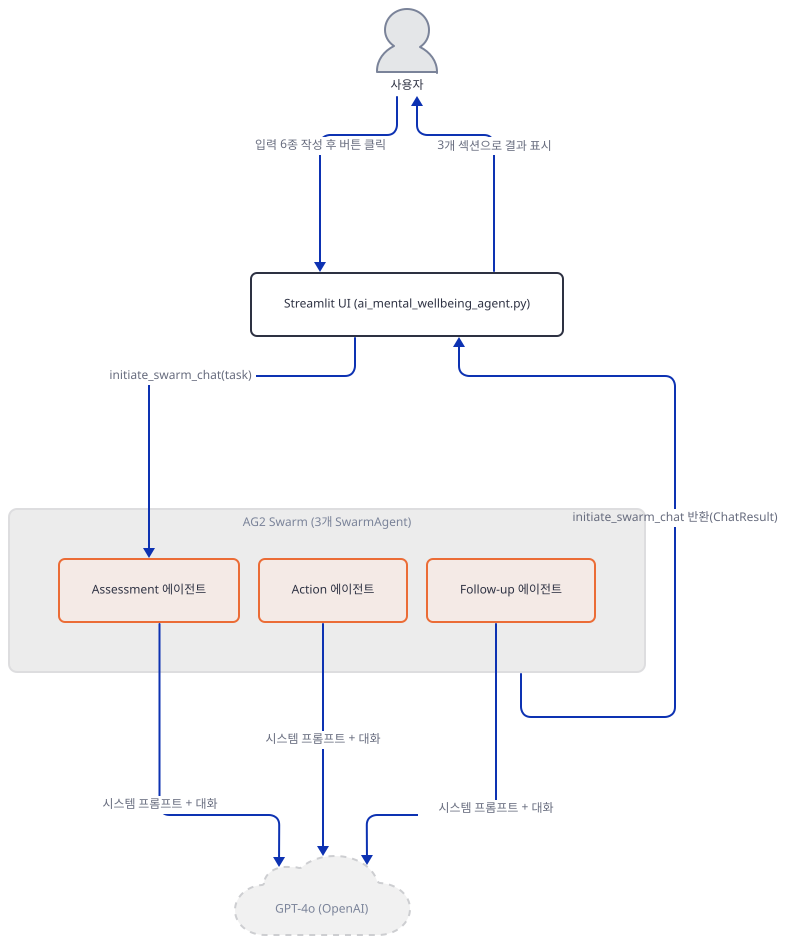
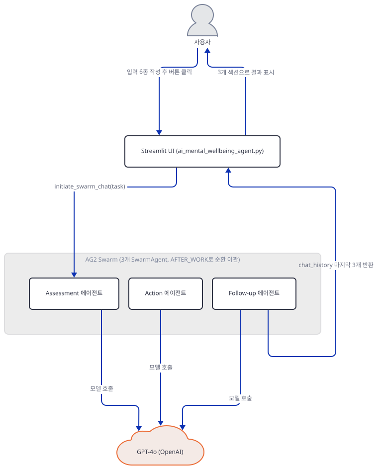
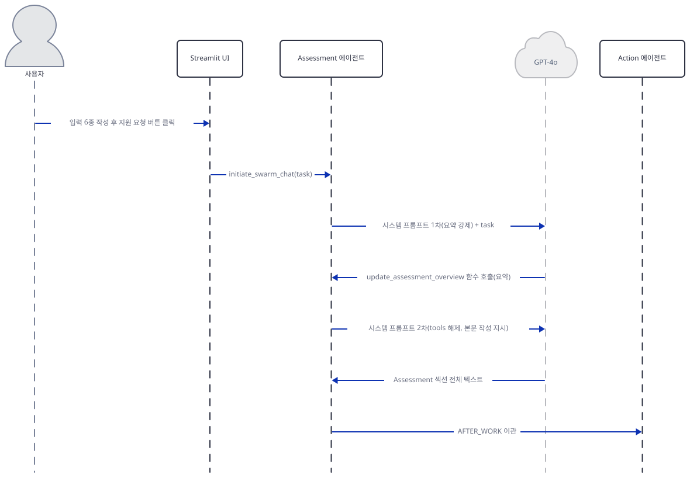
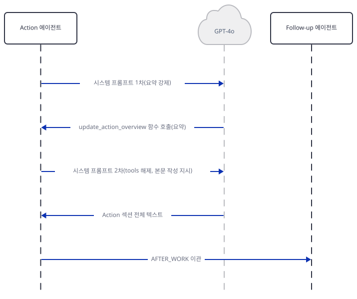
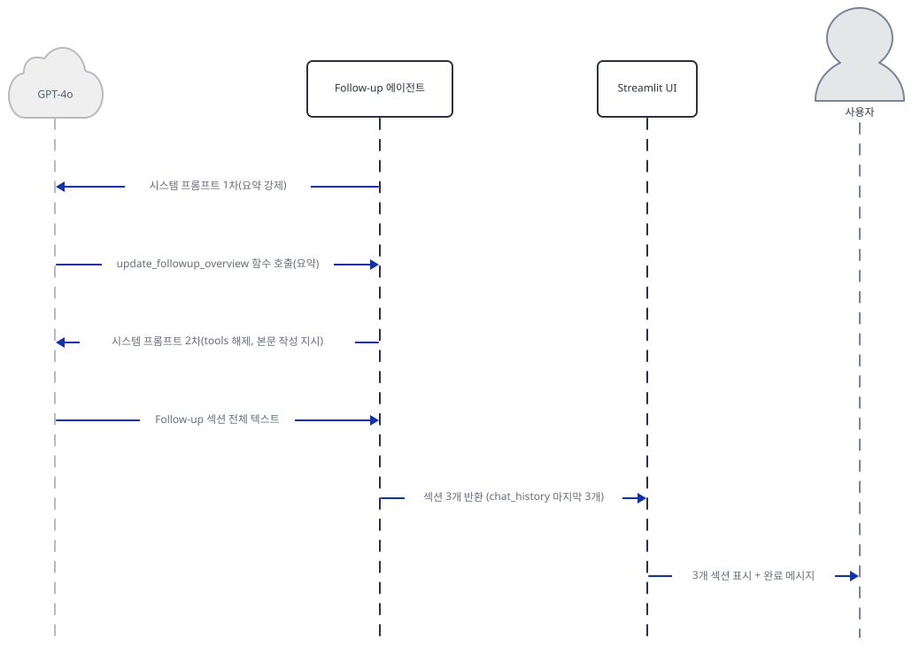

# Day 085 · 🧠 AI Mental Wellbeing Agent

> 볼륨 7 🚀 Advanced AI Agents · 난이도 ★★★ · 예상 소요 80분(단일 파일 226줄이지만 `pyautogen`이라는 이름을 둘러싼 버전 문제를 실제로 세 번 설치를 바꿔가며 재현해야 하고, 시퀀스 그림도 배우 사이 교차를 피하려 셋으로 나눠야 해 손으로 확인하는 시간이 읽는 시간보다 깁니다) · API 비용 대략 요청 1건에 gpt-4o 호출 최대 6회(에이전트 3개 × 2단계 — 1차 요약 강제, 2차 본문 작성이며 뒤로 갈수록 이전 에이전트의 요약이 시스템 프롬프트에 누적됨), OpenAI 공식 요금표 기준(직접 확인, 2026-09-28) gpt-4o 표준가 입력 $2.50/출력 $10.00(1M 토큰당) 대입 시 수백 원대로 추정(대략치 — 키가 없어 실제 호출 횟수·토큰 수는 확인 못함) · 원본 앱: `advanced_ai_agents/multi_agent_apps/ai_mental_wellbeing_agent`

## 오늘 만들 것

이 앱은 226줄 단일 파일 Streamlit 앱으로, 이 시리즈가 주로 다뤄 온 agno나 openai-agents가 아니라 Microsoft AutoGen에서 갈라져 나온 AG2(PyPI 패키지 이름은 지금도 `pyautogen`)의 Swarm 기능(`initiate_swarm_chat`)을 씁니다. 사용자가 감정 상태·수면 시간·스트레스 수준·지지 체계·최근 변화·현재 증상 6가지를 입력하면, `assessment_agent`(상황 평가) → `action_agent`(즉시 대처 계획) → `followup_agent`(장기 지원 전략) 세 `SwarmAgent`가 `AFTER_WORK` 핸드오프로 차례로 넘겨받아 각자 맡은 절을 씁니다. 앱 자체가 사이드바 경고와 자체 README에서 밝히듯 이 앱은 전문 정신건강 치료를 대신하지 않는 지원 도구이고(자살·자해 생각이나 심각한 위기 상황이면 미국 기준 988·911 안내가 붙어 있습니다), 이 문서도 그 틀을 넘어서는 조언은 만들지 않습니다 — 다루는 것은 AG2 Swarm이 세 에이전트를 어떻게 이어 붙이는가이지, 에이전트가 실제로 무슨 말을 쓰는지가 아닙니다(키가 없어 실행하지 못했습니다).

`requirements.txt` 4줄(`autogen-agentchat`, `autogen-ext`, `pyautogen`, `streamlit`) 가운데 버전 고정은 하나도 없는데, 그대로 설치하면 이 앱은 아예 뜨지 못합니다 — 오늘(2026-09-28) `pyautogen`이라는 이름은 더 이상 AG2의 것이 아니라 Microsoft 자체 AutoGen(`autogen-agentchat` 기반 재설계)으로 가는 빈 프록시 패키지 0.10.0을 가리키고, 이 패키지는 `autogen` 최상위 모듈 자체를 만들지 않습니다(직접 확인: `import autogen`이 `ModuleNotFoundError`). 그렇다고 아무 옛날 버전이나 고정하면 되는 것도 아닙니다 — `pyautogen==0.7.6`은 `import autogen`까지는 되지만 그사이 `SwarmAgent`가 통째로 폐기(deprecated)되어 `register_hand_off`가 인스턴스 메서드에서 모듈 최상위 함수로 옮겨졌고(직접 확인: `AttributeError: 'SwarmAgent' object has no attribute 'register_hand_off'`), 이 앱의 196~198행은 정확히 그 메서드 형태(`assessment_agent.register_hand_off(...)`)로 호출합니다. 두 문제를 모두 피하고 코드 그대로 도는 버전은 `pyautogen==0.6.1`뿐임을 직접 확인했습니다(Step 1). `autogen-agentchat`·`autogen-ext`는 이 앱 코드 어디에서도 import되지 않고(그렙으로 확인), 오늘 버전 unpinned `pyautogen`이 Microsoft AutoGen을 딸려 오게 하면서 우연히 끌려온 패키지입니다.

완성하면 사이드바에 키 입력창과 위기 안내, 본문에 입력 폼과 "Get Support Plan" 버튼이 뜨고, 키가 있어 실행하면 평가·행동·후속 세 섹션이 expander로 차례로 펼쳐집니다. 아래는 완성된 아키텍처입니다.



## 사전 준비

| 서비스/도구 | 용도 | 발급·설치 |
|---|---|---|
| OpenAI API 키 | 3개 에이전트(Assessment·Action·Follow-up)의 gpt-4o 호출 인증. 사이드바 입력창(`type="password"`)에 직접 붙여넣습니다(환경변수 아님) | https://platform.openai.com/ 가입 후 발급 |
| uv | 가상환경 생성과 패키지 설치 | [공통 사전 준비](../README.md#공통-사전-준비-한-번만) 절 참고 |
| 인터넷 연결 | PyPI 설치, OpenAI API 호출 | 별도 설치 없음 |

## 아키텍처 한눈에 보기

| 컴포넌트 | 역할 | 코드 위치 |
|---|---|---|
| Streamlit UI | 사이드바 키 입력·위기 안내, 입력 폼, 결과 3종 expander 표시 | `advanced_ai_agents/multi_agent_apps/ai_mental_wellbeing_agent/ai_mental_wellbeing_agent.py:14-25`, `advanced_ai_agents/multi_agent_apps/ai_mental_wellbeing_agent/ai_mental_wellbeing_agent.py:27-66`, `advanced_ai_agents/multi_agent_apps/ai_mental_wellbeing_agent/ai_mental_wellbeing_agent.py:214-223` |
| 세션 상태 | 마지막 결과 3종을 세션 동안 보관 | `advanced_ai_agents/multi_agent_apps/ai_mental_wellbeing_agent/ai_mental_wellbeing_agent.py:6-12`, `advanced_ai_agents/multi_agent_apps/ai_mental_wellbeing_agent/ai_mental_wellbeing_agent.py:208-212` |
| Assessment 에이전트 | 상황을 평가하고 요약 후 Action에 이관(SwarmAgent) | `advanced_ai_agents/multi_agent_apps/ai_mental_wellbeing_agent/ai_mental_wellbeing_agent.py:86-97`, `advanced_ai_agents/multi_agent_apps/ai_mental_wellbeing_agent/ai_mental_wellbeing_agent.py:136-139`, `advanced_ai_agents/multi_agent_apps/ai_mental_wellbeing_agent/ai_mental_wellbeing_agent.py:175-180` |
| Action 에이전트 | 즉시 대처 전략을 제시하고 요약 후 Follow-up에 이관 | `advanced_ai_agents/multi_agent_apps/ai_mental_wellbeing_agent/ai_mental_wellbeing_agent.py:99-110`, `advanced_ai_agents/multi_agent_apps/ai_mental_wellbeing_agent/ai_mental_wellbeing_agent.py:141-144`, `advanced_ai_agents/multi_agent_apps/ai_mental_wellbeing_agent/ai_mental_wellbeing_agent.py:182-187` |
| Follow-up 에이전트 | 장기 지원 전략을 제시하고 요약 후 Assessment에 이관 | `advanced_ai_agents/multi_agent_apps/ai_mental_wellbeing_agent/ai_mental_wellbeing_agent.py:112-123`, `advanced_ai_agents/multi_agent_apps/ai_mental_wellbeing_agent/ai_mental_wellbeing_agent.py:146-149`, `advanced_ai_agents/multi_agent_apps/ai_mental_wellbeing_agent/ai_mental_wellbeing_agent.py:189-194` |
| update_system_message_func | 매 턴마다 2단계(1차 요약 강제 tool_choice → 2차 tools 해제 후 본문 작성) 시스템 프롬프트를 새로 만듦 | `advanced_ai_agents/multi_agent_apps/ai_mental_wellbeing_agent/ai_mental_wellbeing_agent.py:151-171` |
| OpenAI API | 3개 에이전트의 실제 추론(gpt-4o) | 코드 없음 (외부 서비스) |

## 단계별 진행

### Step 1. 환경 만들기 — `pyautogen`이라는 이름을 둘러싼 버전 문제

**목적.** 격리된 가상환경에 `requirements.txt`를 설치하고, unpinned `pyautogen`이 오늘 무엇으로 풀리는지, 그리고 이 앱 코드가 실제로 요구하는 버전이 무엇인지 직접 확인합니다.

**할 일.**

```bash
cd advanced_ai_agents/multi_agent_apps/ai_mental_wellbeing_agent
uv venv
uv pip install -r requirements.txt
```

(pip 대안: `python -m venv .venv && source .venv/bin/activate && pip install -r requirements.txt`.) 이 저장소 루트에는 `pyproject.toml`이 있어 이후 `uv run` 명령에는 모두 `--no-project`를 붙입니다.

`advanced_ai_agents/multi_agent_apps/ai_mental_wellbeing_agent/requirements.txt:1-4`

```text
autogen-agentchat
autogen-ext
pyautogen
streamlit
```

버전 고정이 하나도 없습니다. 이 문서를 쓰며 설치했을 때는 **autogen-agentchat 0.7.5**, **autogen-core 0.7.5**, **autogen-ext 0.7.5**, **pyautogen 0.10.0**, **streamlit 1.64.0**이 받아졌습니다(직접 확인, 2026-09-28 기준). `pyautogen 0.10.0`의 `METADATA`에는 "Proxy package for autogen-agentchat."이라고 적혀 있고 의존성은 `autogen-agentchat` 하나뿐이며, 실제 `pyautogen/__init__.py`는 빈 파일입니다(직접 확인) — 즉 `pyautogen`이라는 이름을 pip install해도 `autogen` 모듈 자체가 생기지 않습니다.

```bash
uv run --no-project python -c "import autogen"
```

직접 확인한 출력:

```
ModuleNotFoundError: No module named 'autogen'
```

이 앱의 2행(`from autogen import (SwarmAgent, ...)`)이 이 지점에서 곧바로 막힙니다. 옛 버전을 고정하면 될 것 같지만 아무 버전이나 되지는 않습니다 — `pyautogen==0.7.6`을 설치하면 `import autogen`은 되지만, `autogen/agentchat/contrib/swarm_agent.py`를 보면 `class SwarmAgent(ConversableAgent)`의 `__init__`이 `DeprecationWarning`만 던지고 끝나며 `register_hand_off`는 더 이상 이 클래스의 메서드가 아니라 같은 파일의 모듈 최상위 함수 `def register_hand_off(agent, hand_off)`로 옮겨져 있습니다(소스로 확인). 이 앱의 196~198행은 `assessment_agent.register_hand_off(AFTER_WORK(action_agent))`처럼 **인스턴스 메서드**로 부르므로 0.7.6에서는 실행 중 실패합니다. 인스턴스 메서드 형태가 아직 살아있는 버전을 찾아 `pyautogen==0.6.1`의 `swarm_agent.py`를 보면 `class SwarmAgent(ConversableAgent)` 안에 `def register_hand_off(self, ...)`가 그대로 정의되어 있고(소스로 확인), `UPDATE_SYSTEM_MESSAGE`·`SwarmResult`·`initiate_swarm_chat`·`AFTER_WORK`·`OpenAIWrapper`도 모두 최상위에서 그대로 임포트됩니다. `autogen-agentchat`·`autogen-ext`는 이 앱 코드 어디에도 `import`되지 않으며(그렙으로 확인 — `autogen_agentchat`·`autogen_ext` 매치 0건), unpinned `pyautogen`이 Microsoft AutoGen을 의존성으로 끌고 오며 우연히 같이 설치되는 것뿐입니다.

`ai_mental_wellbeing_agent.py:1-12`

```python
import streamlit as st
from autogen import (SwarmAgent, SwarmResult, initiate_swarm_chat, OpenAIWrapper,AFTER_WORK,UPDATE_SYSTEM_MESSAGE)
import os

os.environ["AUTOGEN_USE_DOCKER"] = "0"

if 'output' not in st.session_state:
    st.session_state.output = {
        'assessment': '',
        'action': '',
        'followup': ''
    }
```

5행이 `AUTOGEN_USE_DOCKER=0`을 실행마다 코드로 직접 설정합니다 — 앱 자체 README가 안내하는 `.env` 파일 생성은 이미 효과가 없는 중복 지시입니다(앱 README 오류, "문제 해결"에 정리). 7~12행의 세션 상태는 버튼을 누르기 전에도 `st.session_state.output`의 세 키를 빈 문자열로 미리 채워 둡니다.



**확인.**

```bash
uv pip install "pyautogen==0.6.1"
uv run --no-project python -c "
from autogen import SwarmAgent, SwarmResult, initiate_swarm_chat, OpenAIWrapper, AFTER_WORK, UPDATE_SYSTEM_MESSAGE
print('ALL IMPORTS OK')
"
uv run --no-project python -m py_compile ai_mental_wellbeing_agent.py && echo OK
```

직접 확인한 출력:

```
ALL IMPORTS OK
OK
```

### Step 2. 사이드바 — API 키 입력과 위기 안내

**목적.** 키를 어디서 받는지, 그리고 이 앱이 스스로 밝히는 한계와 위기 안내 문구를 확인합니다.

**할 일.**

`ai_mental_wellbeing_agent.py:14-25`

```python
st.sidebar.title("OpenAI API Key")
api_key = st.sidebar.text_input("Enter your OpenAI API Key", type="password")

st.sidebar.warning("""
## ⚠️ Important Notice

This application is a supportive tool and does not replace professional mental health care. If you're experiencing thoughts of self-harm or severe crisis:

- Call National Crisis Hotline: 988
- Call Emergency Services: 911
- Seek immediate professional help
""")
```

키는 환경변수가 아니라 사이드바 텍스트 입력창(`type="password"`)에서 직접 받습니다. 이 경고문은 앱 자체 README에도 그대로 실려 있는 문구이고, 이 문서 역시 이 틀을 그대로 따릅니다 — 이 튜토리얼은 AG2 Swarm이 세 에이전트를 어떻게 잇는지만 다루고, 실제 위기 상황에 대한 조언은 만들지 않습니다.



**확인.** 네트워크를 막은 채 Streamlit `AppTest`로 첫 화면이 예외 없이 뜨는지 확인합니다.

```bash
uv run --no-project python -c "
from streamlit.testing.v1 import AppTest
at = AppTest.from_file('ai_mental_wellbeing_agent.py')
at.run(timeout=30)
print('exception:', list(at.exception))
print('sidebar warning count:', len(at.sidebar.warning))
"
```

직접 확인한 출력:

```
exception: []
sidebar warning count: 1
```

### Step 3. 메인 화면 — 팀 소개와 입력 폼

**목적.** 화면에 어떤 입력 위젯이 있고 각각 무엇을 채우는지 확인합니다.

**할 일.**

`ai_mental_wellbeing_agent.py:27-35`

```python
st.title("🧠 Mental Wellbeing Agent")

st.info("""
**Meet Your Mental Wellbeing Agent Team:**

🧠 **Assessment Agent** - Analyzes your situation and emotional needs
🎯 **Action Agent** - Creates immediate action plan and connects you with resources
🔄 **Follow-up Agent** - Designs your long-term support strategy
""")
```

이어지는 `ai_mental_wellbeing_agent.py:37-59`는 2단 컬럼으로 감정 상태(`text_area`)·수면 시간(`select_slider`, 0~12시간)·스트레스 수준(`slider`, 1~10)·지지 체계(`multiselect`)를 받고, 그 아래 최근 변화(`text_area`)가 이어집니다. 마지막으로 현재 증상을 고릅니다.

`ai_mental_wellbeing_agent.py:61-66`

```python
current_symptoms = st.multiselect(
    "Current Symptoms",
    ["Anxiety", "Depression", "Insomnia", "Fatigue", "Loss of Interest", 
     "Difficulty Concentrating", "Changes in Appetite", "Social Withdrawal",
     "Mood Swings", "Physical Discomfort"]
)
```

여섯 입력 모두 필수가 아닙니다 — 아무것도 채우지 않고 버튼을 눌러도 코드는 막지 않고 `join`이 빈 리스트면 "None reported"로 채웁니다(Step 4).


**확인.**

```bash
uv run --no-project python -c "
from streamlit.testing.v1 import AppTest
at = AppTest.from_file('ai_mental_wellbeing_agent.py')
at.run(timeout=30)
print('text_area count:', len(at.text_area))
print('slider count:', len(at.slider))
print('multiselect count:', len(at.multiselect))
"
```

직접 확인한 출력:

```
text_area count: 2
slider count: 1
multiselect count: 2
```

### Step 4. 요청 조립과 에이전트별 시스템 프롬프트

**목적.** 버튼을 눌렀을 때 여섯 입력이 어떻게 하나의 `task` 문자열로 합쳐지고, 세 에이전트에게 각각 어떤 역할이 주어지는지 확인합니다.

**할 일.**

`ai_mental_wellbeing_agent.py:68-83`

```python
if st.button("Get Support Plan"):
    if not api_key:
        st.error("Please enter your OpenAI API key.")
    else:
        with st.spinner('🤖 AI Agents are analyzing your situation...'):
            try:
                task = f"""
                Create a comprehensive mental health support plan based on:
                
                Emotional State: {mental_state}
                Sleep: {sleep_pattern} hours per night
                Stress Level: {stress_level}/10
                Support System: {', '.join(support_system) if support_system else 'None reported'}
                Recent Changes: {recent_changes}
                Current Symptoms: {', '.join(current_symptoms) if current_symptoms else 'None reported'}
                """
```

키가 비어 있으면 70행에서 곧바로 `st.error`로 멈추고 그 아래 어떤 코드도 실행되지 않습니다 — 네트워크 요청은 전혀 나가지 않습니다(Step 8에서 직접 확인). 키가 있으면 여섯 입력을 f-string 하나로 합쳐 `task`를 만듭니다.

`ai_mental_wellbeing_agent.py:86-97`

```python
                system_messages = {
                    "assessment_agent": """
                    You are an experienced mental health professional speaking directly to the user. Your task is to:
                    1. Create a safe space by acknowledging their courage in seeking support
                    2. Analyze their emotional state with clinical precision and genuine empathy
                    3. Ask targeted follow-up questions to understand their full situation
                    4. Identify patterns in their thoughts, behaviors, and relationships
                    5. Assess risk levels with validated screening approaches
                    6. Help them understand their current mental health in accessible language
                    7. Validate their experiences without minimizing or catastrophizing

                    Always use "you" and "your" when addressing the user. Blend clinical expertise with genuine warmth and never rush to conclusions.
                    """,
```

`system_messages` 딕셔너리는 이렇게 세 키(`assessment_agent`·`action_agent`·`followup_agent`)를 갖고, 나머지 둘도 같은 모양으로 각자의 역할을 길게 적어 둡니다(`ai_mental_wellbeing_agent.py:99-110`의 action_agent, `ai_mental_wellbeing_agent.py:112-123`의 followup_agent). 이 문자열들은 뒤에서 볼 `update_system_message_func`가 실제 시스템 프롬프트로 조립할 때 원재료로 쓰입니다 — 지금 이 시점에는 아직 아무 에이전트 객체도 만들어지지 않았습니다.



**확인.**

```bash
uv run --no-project python -c "
import ast
tree = ast.parse(open('ai_mental_wellbeing_agent.py', encoding='utf-8').read())
dicts = [n for n in ast.walk(tree) if isinstance(n, ast.Dict)]
keys = [k.value for d in dicts for k in d.keys if isinstance(k, ast.Constant) and k.value in ('assessment_agent','action_agent','followup_agent')]
print('system_messages 키:', sorted(set(keys)))
"
```

직접 확인한 출력:

```
system_messages 키: ['action_agent', 'assessment_agent', 'followup_agent']
```

### Step 5. Swarm 상태 갱신 함수 — 요약 저장과 다음 에이전트로 이관

**목적.** 각 에이전트가 자신의 결론을 어떻게 `context_variables`에 남기고 다음 에이전트로 제어를 넘기는지 확인합니다.

**할 일.**

`ai_mental_wellbeing_agent.py:126-149`

```python
                llm_config = {
                    "config_list": [{"model": "gpt-4o", "api_key": api_key}]
                }

                context_variables = {
                    "assessment": None,
                    "action": None,
                    "followup": None,
                }

                def update_assessment_overview(assessment_summary: str, context_variables: dict) -> SwarmResult:
                    context_variables["assessment"] = assessment_summary
                    st.sidebar.success('Assessment: ' + assessment_summary)
                    return SwarmResult(agent="action_agent", context_variables=context_variables)

                def update_action_overview(action_summary: str, context_variables: dict) -> SwarmResult:
                    context_variables["action"] = action_summary
                    st.sidebar.success('Action Plan: ' + action_summary)
                    return SwarmResult(agent="followup_agent", context_variables=context_variables)

                def update_followup_overview(followup_summary: str, context_variables: dict) -> SwarmResult:
                    context_variables["followup"] = followup_summary
                    st.sidebar.success('Follow-up Strategy: ' + followup_summary)
                    return SwarmResult(agent="assessment_agent", context_variables=context_variables)
```

세 에이전트 모두 `llm_config`의 `model`이 `gpt-4o`로 못박혀 있습니다(126~128행). `context_variables`는 세 절(평가·행동·후속)을 담을 그릇이고, 세 `update_*_overview` 함수는 AG2가 "함수 도구"로 각 `SwarmAgent`에 등록할 콜백입니다 — 모델이 이 함수를 호출하면 요약이 `context_variables`에 쓰이고 동시에 `st.sidebar.success(...)`로 사이드바에 바로 표시되며, `SwarmResult(agent=...)`가 다음에 말할 에이전트 이름을 돌려줍니다. 이 `SwarmResult` 반환값이 곧 명시적 핸드오프입니다 — Step 7의 `register_hand_off(AFTER_WORK(...))`는 이 함수 호출이 **없을 때**의 기본 다음 에이전트를 정하는 것이고, 우선순위는 함수 호출 쪽이 높습니다.



**확인.**

```bash
uv run --no-project python -c "
from autogen import SwarmResult
import inspect
print('SwarmResult 필드:', list(SwarmResult.model_fields.keys()))
"
```

직접 확인한 출력:

```
SwarmResult 필드: ['values', 'agent', 'context_variables']
```

### Step 6. 2단계 시스템 프롬프트 훅 — 요약 강제 후 본문 작성

**목적.** 이 앱에서 가장 특이한 부분인 `update_system_message_func`가 매 턴 호출될 때마다 시스템 프롬프트를 어떻게 다시 쓰는지 확인합니다.

**할 일.**

`ai_mental_wellbeing_agent.py:151-173`

```python
                def update_system_message_func(agent: SwarmAgent, messages) -> str:
                    system_prompt = system_messages[agent.name]
                    current_gen = agent.name.split("_")[0]
                    
                    if agent._context_variables.get(current_gen) is None:
                        system_prompt += f"Call the update function provided to first provide a 2-3 sentence summary of your ideas on {current_gen.upper()} based on the context provided."
                        agent.llm_config['tool_choice'] = {"type": "function", "function": {"name": f"update_{current_gen}_overview"}}
                    else:
                        agent.llm_config["tools"] = None
                        agent.llm_config['tool_choice'] = None
                        system_prompt += f"\n\nYour task\nYou task is write the {current_gen} part of the report. Do not include any other parts. Do not use XML tags.\nStart your reponse with: '## {current_gen.capitalize()} Design'."    
                        k = list(agent._oai_messages.keys())[-1]
                        agent._oai_messages[k] = agent._oai_messages[k][:1]

                    system_prompt += f"\n\n\nBelow are some context for you to refer to:"
                    for k, v in agent._context_variables.items():
                        if v is not None:
                            system_prompt += f"\n{k.capitalize()} Summary:\n{v}"

                    agent.client = OpenAIWrapper(**agent.llm_config)
                    return system_prompt
                
                state_update = UPDATE_SYSTEM_MESSAGE(update_system_message_func)
```

이 함수는 `agent.name`(예: `"assessment_agent"`)에서 밑줄 앞부분(`"assessment"`)을 떼어 `current_gen`으로 쓰고, `agent._context_variables`(AG2 내부 비공개 속성, 밑줄 접두사로 확인)에 그 값이 아직 `None`이면 **1차**로 판단해 `tool_choice`를 강제로 `update_{current_gen}_overview` 함수 호출로 고정합니다 — 모델이 2~3문장 요약만 만들고 반드시 그 함수를 부르게 만드는 장치입니다. 이미 값이 채워져 있으면(즉 그 에이전트가 이미 한 번 요약을 냈으면) **2차**로 판단해 `tools`를 꺼 함수 호출을 막고, 대신 `"## Assessment Design"` 같은 제목으로 시작하는 본문 전체를 쓰라고 지시합니다 — 이때 163행이 `agent._oai_messages`(역시 비공개 속성)의 마지막 대화 묶음을 첫 메시지 하나로 잘라, 직전 함수 호출 왕복이 다음 프롬프트에 섞이지 않게 합니다. 두 경우 모두 지금까지 채워진 `context_variables`의 요약들을 프롬프트 끝에 이어 붙이고, `agent.client`를 새 `OpenAIWrapper`로 다시 만든 뒤 이 문자열을 시스템 프롬프트로 돌려줍니다. `UPDATE_SYSTEM_MESSAGE`는 pyautogen 0.6.1에서도 이미 `DeprecationWarning`을 던지는 이름입니다(대체 이름은 `UpdateSystemMessage`) — 동작은 하지만 최신 API는 아닙니다.


**확인.** 비공개 속성 두 개가 이 버전의 `SwarmAgent` 인스턴스에 실제로 있는지 확인합니다.

```bash
uv run --no-project python -c "
from autogen import SwarmAgent
a = SwarmAgent('test_agent', llm_config={'config_list': [{'model': 'gpt-4o', 'api_key': 'sk-fake'}]})
print('has _context_variables:', hasattr(a, '_context_variables'))
print('has _oai_messages:', hasattr(a, '_oai_messages'))
"
```

직접 확인한 출력:

```
has _context_variables: True
has _oai_messages: True
```

### Step 7. 에이전트 생성, 순환 이관 등록, 실행

**목적.** 세 `SwarmAgent`가 실제로 어떻게 만들어지고, `register_hand_off`가 순환 고리를 어떻게 잇는지, `initiate_swarm_chat`이 무엇을 받는지 확인합니다.

**할 일.**

`ai_mental_wellbeing_agent.py:175-206`

```python
                assessment_agent = SwarmAgent(
                    "assessment_agent", 
                    llm_config=llm_config,
                    functions=update_assessment_overview,
                    update_agent_state_before_reply=[state_update]
                )

                action_agent = SwarmAgent(
                    "action_agent",
                    llm_config=llm_config,
                    functions=update_action_overview,
                    update_agent_state_before_reply=[state_update]
                )

                followup_agent = SwarmAgent(
                    "followup_agent",
                    llm_config=llm_config,
                    functions=update_followup_overview,
                    update_agent_state_before_reply=[state_update]
                )

                assessment_agent.register_hand_off(AFTER_WORK(action_agent))
                action_agent.register_hand_off(AFTER_WORK(followup_agent))
                followup_agent.register_hand_off(AFTER_WORK(assessment_agent))

                result, _, _ = initiate_swarm_chat(
                    initial_agent=assessment_agent,
                    agents=[assessment_agent, action_agent, followup_agent],
                    user_agent=None,
                    messages=task,
                    max_rounds=13,
                )
```

세 `SwarmAgent`는 각자 `functions=`로 Step 5의 콜백 하나씩을 도구로 등록하고, `update_agent_state_before_reply=[state_update]`로 Step 6의 훅을 공유합니다. `register_hand_off(AFTER_WORK(...))` 세 줄이 assessment→action→followup→assessment 순환 고리를 만듭니다 — 이것은 함수 호출로 명시적 핸드오프가 없을 때만 쓰이는 **기본값**입니다. `initiate_swarm_chat`은 `initial_agent=assessment_agent`로 시작해 `max_rounds=13`까지 돕니다. 세 에이전트가 각각 1차(요약)·2차(본문) 두 번씩 응답하면 6턴이라 13라운드 안에 한 바퀴는 넉넉히 돕니다.


**확인.** 가짜 키로, 실제 네트워크 요청 없이 세 에이전트 생성과 `register_hand_off` 호출까지만 재현합니다(생성자·설정 확인까지만 — 실제 요청 메서드는 부르지 않습니다).

```bash
uv run --no-project python -c "
from autogen import SwarmAgent, AFTER_WORK, UPDATE_SYSTEM_MESSAGE

llm_config = {'config_list': [{'model': 'gpt-4o', 'api_key': 'sk-fake-123'}]}

def update_system_message_func(agent, messages) -> str:
    return 'system prompt text'

state_update = UPDATE_SYSTEM_MESSAGE(update_system_message_func)
assessment_agent = SwarmAgent('assessment_agent', llm_config=llm_config, update_agent_state_before_reply=[state_update])
action_agent = SwarmAgent('action_agent', llm_config=llm_config, update_agent_state_before_reply=[state_update])
followup_agent = SwarmAgent('followup_agent', llm_config=llm_config, update_agent_state_before_reply=[state_update])

assessment_agent.register_hand_off(AFTER_WORK(action_agent))
action_agent.register_hand_off(AFTER_WORK(followup_agent))
followup_agent.register_hand_off(AFTER_WORK(assessment_agent))
print('3개 SwarmAgent 생성 + register_hand_off 3회 완료')
"
```

직접 확인한 출력(경고 줄 생략):

```
3개 SwarmAgent 생성 + register_hand_off 3회 완료
```

같은 코드를 `pyautogen==0.7.6`에서 실행하면 `assessment_agent.register_hand_off(...)` 줄에서 `AttributeError: 'SwarmAgent' object has no attribute 'register_hand_off'`로 실패한다는 것도 직접 확인했습니다(Step 1의 근거).

### Step 8. 결과 표시

**목적.** `initiate_swarm_chat`의 결과에서 세 섹션을 어떻게 꺼내 화면에 보여주는지, 그리고 키 없이 버튼을 누르면 실제로 무엇이 뜨는지 확인합니다.

**할 일.**

`ai_mental_wellbeing_agent.py:208-226`

```python
                st.session_state.output = {
                    'assessment': result.chat_history[-3]['content'],
                    'action': result.chat_history[-2]['content'],
                    'followup': result.chat_history[-1]['content']
                }

                with st.expander("Situation Assessment"):
                    st.markdown(st.session_state.output['assessment'])

                with st.expander("Action Plan & Resources"):
                    st.markdown(st.session_state.output['action'])

                with st.expander("Long-term Support Strategy"):
                    st.markdown(st.session_state.output['followup'])

                st.success('✨ Mental health support plan generated successfully!')

            except Exception as e:
                st.error(f"An error occurred: {str(e)}")
```

`chat_history[-3:]`는 대화 이력의 **마지막 세 메시지**가 정확히 평가·행동·후속의 2차(본문 작성) 응답 순서로 끝난다고 가정합니다 — Step 7에서 본 순환 구조(assessment→action→followup→assessment)와 각 에이전트의 1차/2차 두 단계를 감안하면 그럴듯하지만, 실제로 그 인덱스가 항상 맞는지는 키가 없어 실행으로 확인하지 못했습니다. 바깥의 넓은 `try/except Exception`은 이 인덱스가 어긋나거나(`IndexError`) API 요청이 실패하는 경우를 포함해 무엇이 나든 `st.error(f"An error occurred: {str(e)}")` 한 줄로 감쌉니다.

이 앱을 실제로 띄우려면 앱 폴더에서 다음을 실행합니다.

```bash
uv run --no-project streamlit run ai_mental_wellbeing_agent.py
```

확인용으로 헤드리스 실행만 해 본다면 외부 IP 조회 요청을 막기 위해 `--server.address`를 함께 붙입니다(오늘 설치되는 Streamlit 1.64.0은 headless이면서 주소를 지정하지 않으면 시작할 때 `checkip.amazonaws.com`에 요청을 보낸다는 것이 이미 확인되어 있습니다, Day 060).

```bash
uv run --no-project streamlit run ai_mental_wellbeing_agent.py --server.headless true --server.address localhost
```


**확인.** 키를 비운 채 버튼을 눌렀을 때 어떤 오류만 뜨고 예외는 없는지 확인합니다(실제 클릭·키 입력은 OpenAI에 요청을 보내므로 이 문서는 하지 않습니다).

```bash
uv run --no-project python -c "
from streamlit.testing.v1 import AppTest
at = AppTest.from_file('ai_mental_wellbeing_agent.py')
at.run(timeout=30)
at.button[0].click().run(timeout=30)
print('exception:', list(at.exception))
print('error boxes:', [e.value for e in at.error])
"
```

직접 확인한 출력:

```
exception: []
error boxes: ['Please enter your OpenAI API key.']
```

## 요청 한 건이 흐르는 과정

한 번의 요청은 실제로 세 에이전트가 순서대로 두 단계(1차 요약, 2차 본문)씩 응답하는 세 구간을 거칩니다 — 배우가 한 그림에 다 들어가면 GPT-4o를 사이에 둔 수명선이 다른 메시지 라벨을 가로질러, 앱의 실제 시간 경계(에이전트별 라운드)를 따라 세 그림으로 나눴습니다.



1구간은 버튼 클릭부터 Assessment 에이전트의 두 단계 응답이 끝나고 Action 에이전트로 제어가 넘어가기까지입니다. Streamlit UI가 `initiate_swarm_chat(task)`로 스웜을 시작시키면 Assessment 에이전트는 1차(요약 강제) 프롬프트로 GPT-4o를 불러 `update_assessment_overview` 함수 호출을 받고, 곧바로 2차(본문 작성) 프롬프트로 다시 불러 "Assessment 섹션" 전체 텍스트를 받습니다. 그다음 `AFTER_WORK` 기본 핸드오프로 Action 에이전트에 제어가 넘어갑니다.



2구간은 같은 두 단계가 Action 에이전트에서 반복되는 부분입니다. GPT-4o에 1차(요약)·2차(본문) 순서로 다시 요청해 `update_action_overview` 함수 호출과 "Action 섹션" 텍스트를 차례로 받고, `AFTER_WORK`로 Follow-up 에이전트에 넘깁니다.



3구간은 Follow-up 에이전트가 같은 두 단계를 마친 뒤, Streamlit UI가 `chat_history`의 마지막 세 메시지를 받아 평가·행동·후속 세 섹션으로 화면에 표시하는 부분입니다. 세 그림 모두 실제로 어떤 텍스트가 오가는지는 키가 없어 확인하지 못했습니다 — 메시지의 존재와 순서만 소스로 확인한 것입니다.

## 실행 체크리스트

- [ ] 격리된 가상환경에 `requirements.txt`를 그대로 설치하면 `import autogen`이 `ModuleNotFoundError`로 실패한다는 것을 확인했다
- [ ] `pyautogen==0.6.1`로 버전을 고정하면 import와 `py_compile`이 모두 성공한다는 것을 확인했다
- [ ] `pyautogen==0.7.6`처럼 더 새 버전은 `SwarmAgent.register_hand_off`가 인스턴스 메서드에서 빠져 이 앱 코드와 맞지 않는다는 것을 소스와 재현으로 확인했다
- [ ] `update_system_message_func`가 `agent._context_variables` 값 유무로 1차(요약 강제)·2차(본문 작성)를 가른다는 것을 소스로 확인했다
- [ ] `AppTest`로 첫 화면이 예외 없이 뜨고, 키 없이 버튼을 누르면 "Please enter your OpenAI API key." 오류만 뜬다는 것을 확인했다
- [ ] 사이드바 위기 안내와 앱 자체 README 문구를 읽고 이 앱이 전문 치료를 대신하지 않는다는 것을 확인했다
- [ ] (키가 있다면) 실제로 실행해 평가→행동→후속 세 섹션이 `chat_history[-3:]` 순서 그대로 채워지는지 확인했다

## 문제 해결

| 증상 | 원인 | 해결 |
|---|---|---|
| `import autogen`이 `ModuleNotFoundError: No module named 'autogen'`로 실패(직접 확인) | `requirements.txt`의 `pyautogen`이 버전 고정 없이 오늘 Microsoft AutoGen(`autogen-agentchat` 기반)으로 가는 빈 프록시 패키지 0.10.0으로 풀림(직접 확인 — `pip show`로 의존성이 `autogen-agentchat` 하나뿐, `pyautogen/__init__.py`가 빈 파일) | `pyautogen==0.6.1`로 버전을 고정해 설치(리포 코드는 고치지 않음) |
| `assessment_agent.register_hand_off(AFTER_WORK(...))`가 `AttributeError: 'SwarmAgent' object has no attribute 'register_hand_off'`로 실패(직접 확인, `pyautogen==0.7.6`에서) | 0.7.x부터 `SwarmAgent`가 통째로 폐기되어 `ConversableAgent`의 얇은 래퍼가 되었고, `register_hand_off`는 모듈 최상위 함수 `register_hand_off(agent, hand_off)`로 옮겨짐(소스로 확인, `swarm_agent.py`) | `pyautogen==0.6.1`처럼 `register_hand_off`가 아직 인스턴스 메서드인 버전을 씀(리포 코드는 고치지 않음) |
| `requirements.txt`에 `autogen-agentchat`·`autogen-ext`가 있어 이 앱이 그 패키지를 쓰는 것처럼 보임 | 이 앱 코드는 `from autogen import (...)` 한 줄만 쓰고 두 패키지를 한 번도 import하지 않음(그렙으로 확인) — unpinned `pyautogen`이 Microsoft AutoGen을 의존성으로 끌어오며 우연히 같이 설치됨 | 무시해도 됨(리포 코드는 고치지 않음) |
| 앱 자체 README가 `.env`에 `AUTOGEN_USE_DOCKER=0`을 쓰라고 안내함 | 코드 5행이 `os.environ["AUTOGEN_USE_DOCKER"] = "0"`을 이미 실행마다 설정함(직접 확인, 소스) — `.env` 파일은 아무 효과가 없는 중복 지시(앱 README 오류) | `.env` 파일을 만들 필요 없음 |
| `streamlit run`을 헤드리스로 띄우면 시작 중 외부로 IP 조회 요청이 나갈 수 있음 | `--server.address`를 지정하지 않으면 Streamlit이 자신의 외부 IP를 알아내려 `checkip.amazonaws.com`에 요청을 보냄(오늘 설치되는 1.64.0 포함, Day 060에서 확인) | `--server.headless true --server.address localhost`를 함께 지정 |

## 더 해보기

- 최신 `ag2`(오늘 기준 0.9.9)로 올려보고, `register_hand_off(agent, condition)` 형태의 모듈 함수와 `UpdateSystemMessage`(대문자+언더스코어 이름 대신)로 이 앱의 세 호출부를 고쳐 여전히 같은 순환 핸드오프가 되는지 확인해보기
- `max_rounds`를 13에서 더 늘리거나 줄여보고, `chat_history[-3:]`가 항상 평가·행동·후속 순서로 끝나는지, 아니면 다른 값이 필요한지 (키가 있다면) 직접 실행해 확인해보기
- 입력을 OpenAI에 보내기 전에 위기 키워드를 미리 걸러 흐름을 바꾸는 지점을 어디에 넣을지 설계만 해보기(실제 문구나 조언은 만들지 않기 — 이 앱과 이 문서 모두 그 선을 넘지 않습니다)

## 다음 날 예고

[Day 086 · 🏋️‍♂️ AI Health & Fitness Agent](../day086-ai-health-fitness-agent/README.md) — agno의 Dietary·Fitness 두 에이전트가 Google Gemini 2.5 Flash로 맞춤 식단·운동 계획을 짜고, 후속 질문에도 답합니다.
