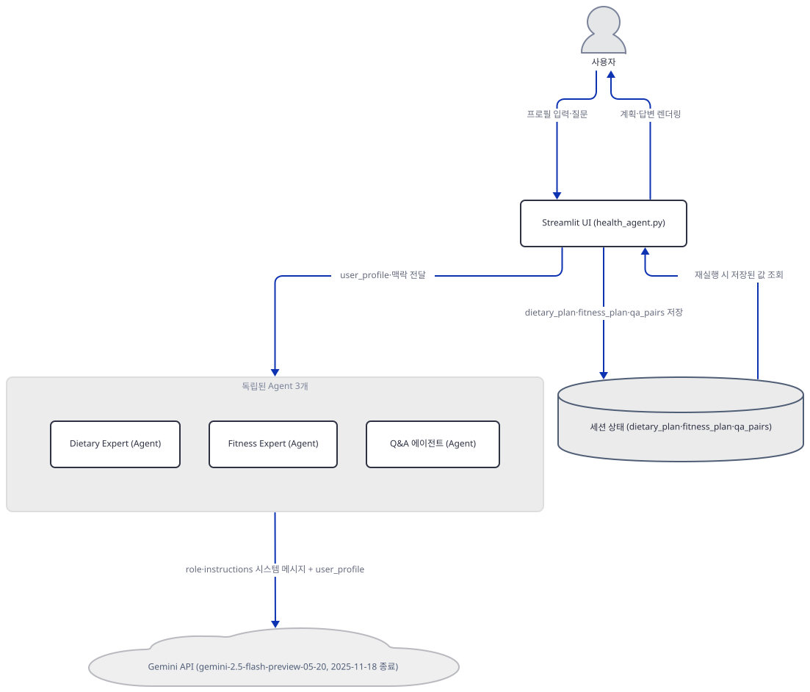
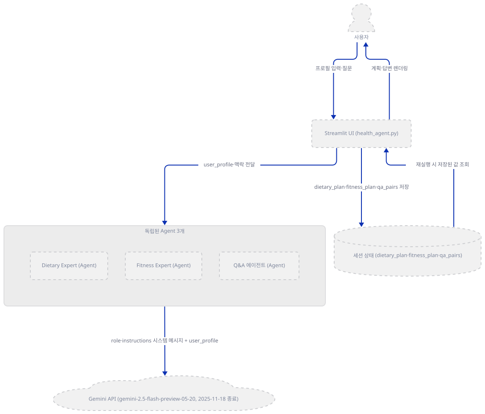
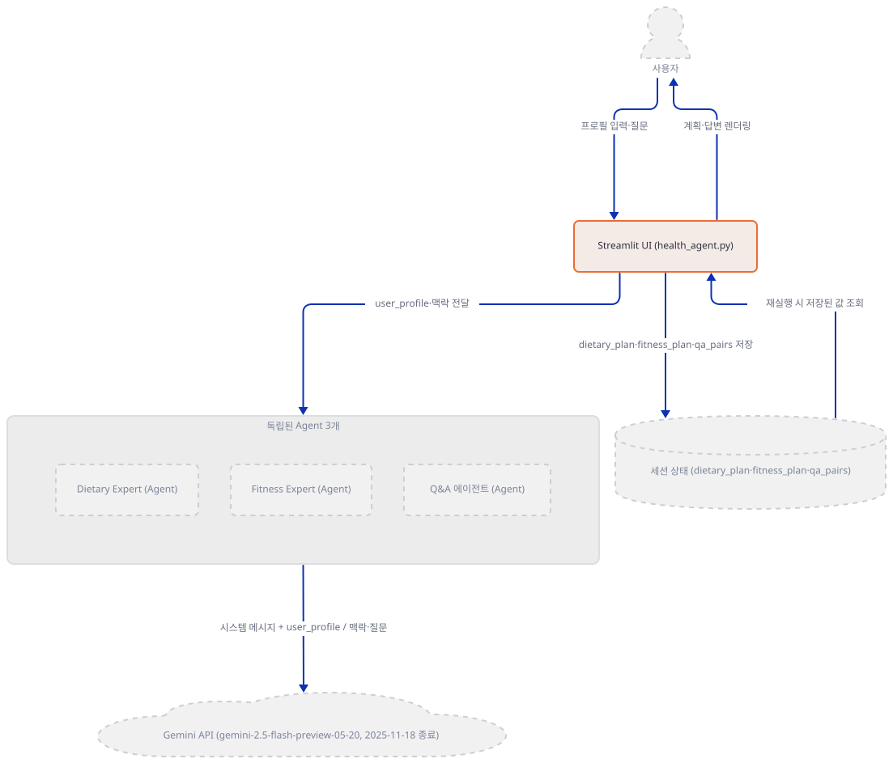
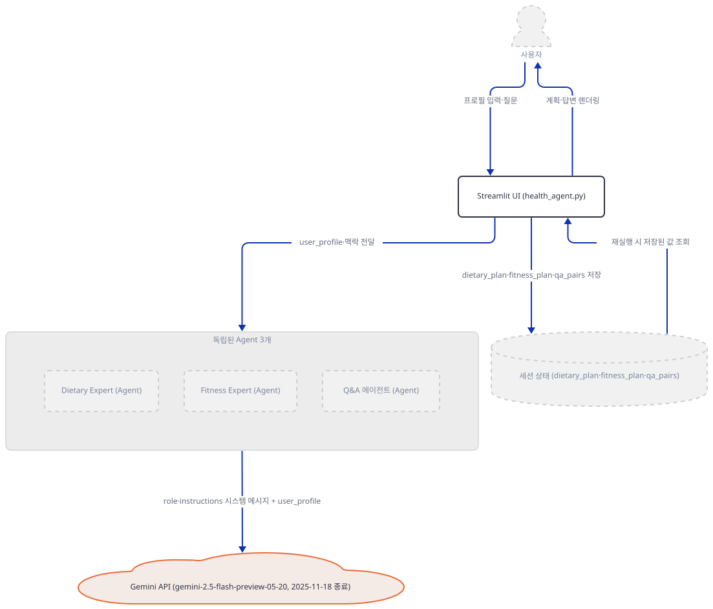
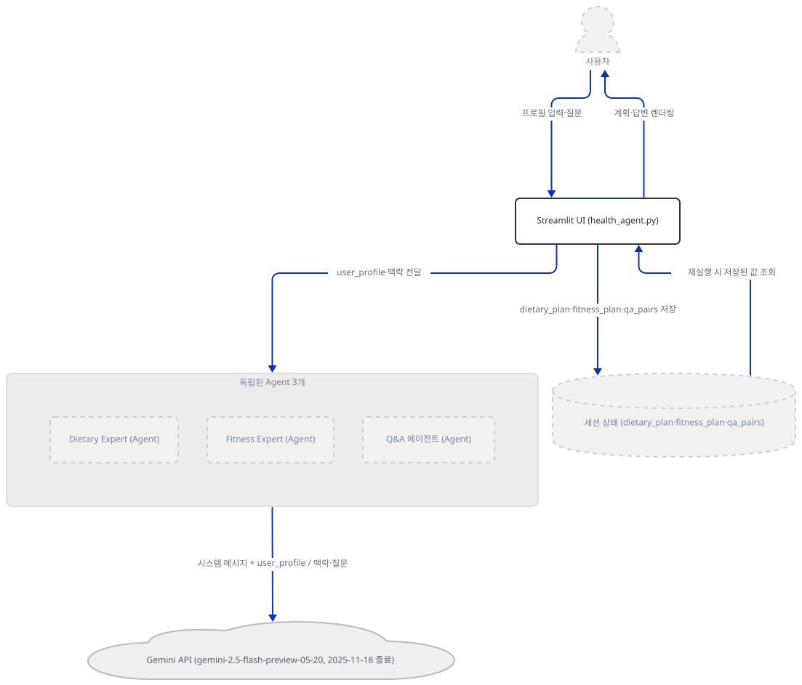
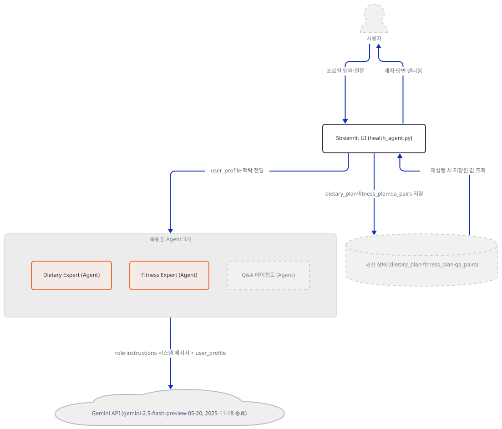
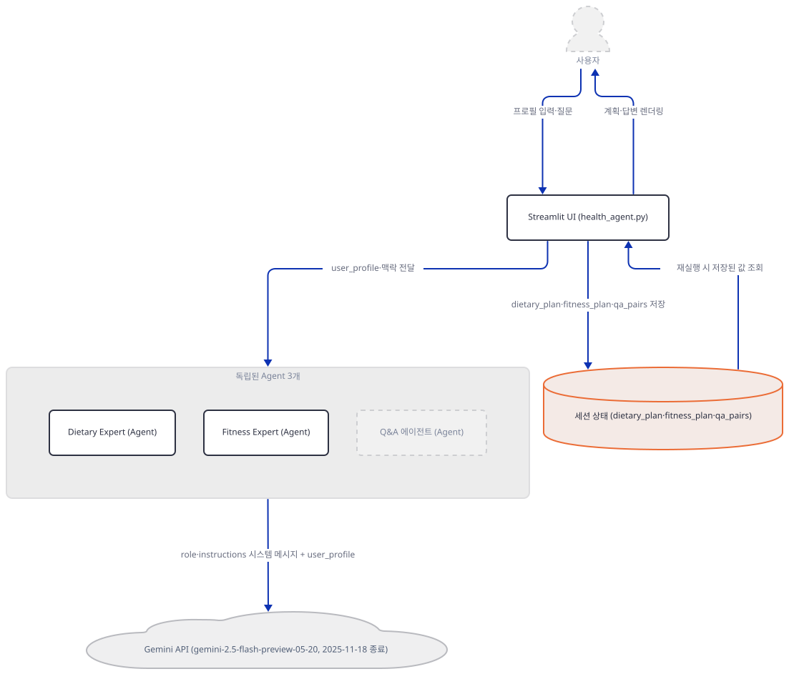
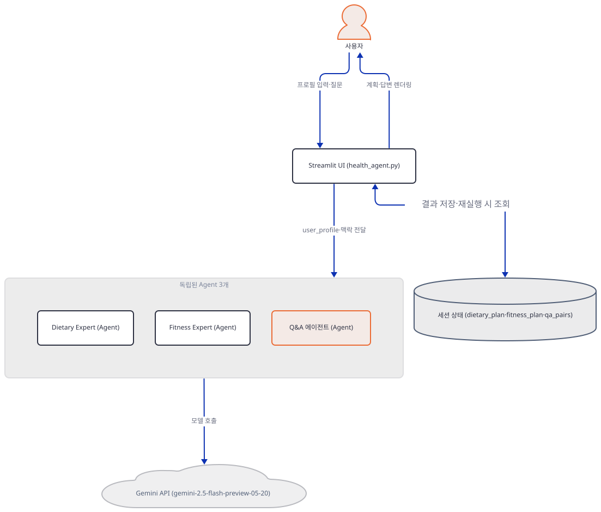
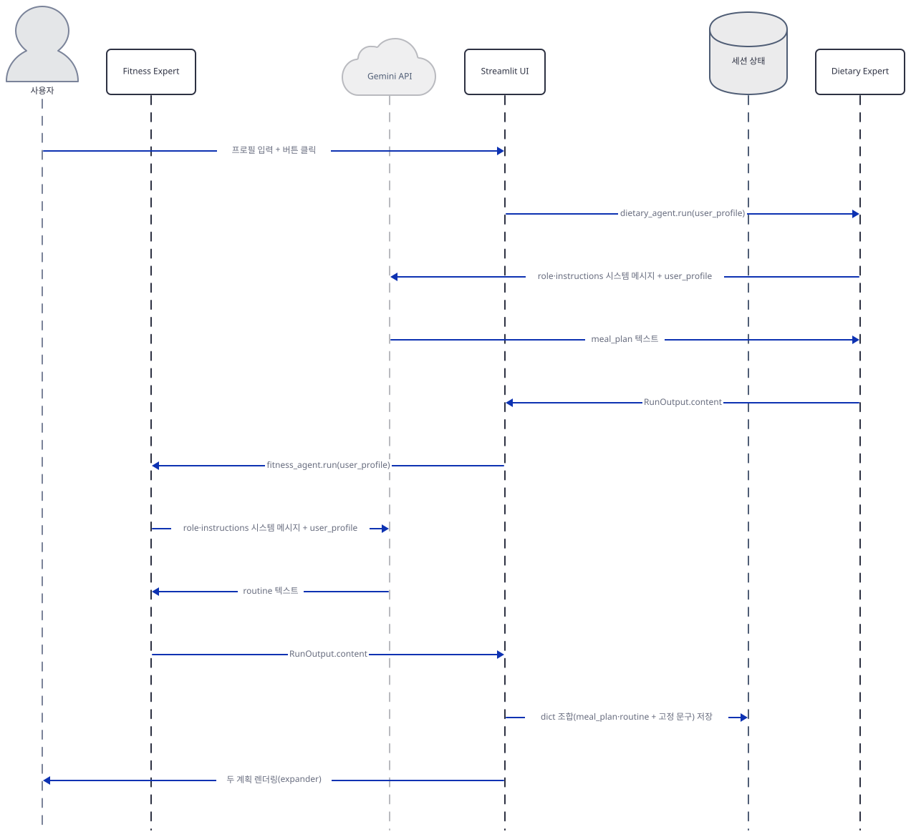

# Day 086 · 🏋️‍♂️ AI Health & Fitness Agent

> 볼륨 7 🚀 Advanced AI Agents · 난이도 ★☆☆ ⚠ · 예상 소요 70분(스텝마다 재현 명령을 직접 돌려 봐야 해서 읽는 시간보다 손으로 확인하는 시간이 더 걸립니다) · API 비용 대략 계획 생성 1건에 호출 2회(식단·운동) + 후속 질문마다 1회, Gemini 요금표 기준 수백 원 이하로 추정 — 다만 코드가 박은 `gemini-2.5-flash-preview-05-20`은 Google 공식 폐기 표에서 **2025-11-18에 이미 종료**돼(https://ai.google.dev/gemini-api/docs/deprecations, 2026-09-28 확인, 권장 대체 `gemini-3.6-flash`) 엔드포인트 자체가 없으므로 키가 있어도 이 id 그대로는 호출이 실패할 가능성이 높습니다(대략치·위 비용도 대체 모델 기준 — 키가 없어 실제 과금·실제 오류는 확인하지 못함) · 원본 앱: `advanced_ai_agents/single_agent_apps/ai_health_fitness_agent`

## 오늘 만들 것

Day 078에서 시작한 "🚀 Advanced AI Agents" 볼륨의 **아홉 번째** 앱이자, agno를 쓰는 **네 번째** 날입니다(078·079·081에 이어 — 이 사이 080·082~085는 agno가 아닌 다른 프레임워크를 씁니다, `from agno`/`import agno` 전체 검색으로 확인). Day 078은 agno `Agent` 하나를 AgentOS로 서빙했고, Day 079는 agno `Team`으로 두 `Agent`를 묶어 위임했습니다. Day 081은 `Team` 편집자(Editor)가 `Agent` 둘(Searcher·Writer)을 멤버로 쓰는 구조였습니다(`advanced_ai_agents/single_agent_apps/ai_journalist_agent/journalist_agent.py:22-70`, 소스로 확인). 오늘의 245줄짜리(마지막 줄에 개행이 없어 `wc -l`은 244로 셉니다) `health_agent.py`는 `Team`을 쓰지 않고 서로 전혀 모르는 독립된 `Agent` 세 개(Dietary Expert·Fitness Expert·이름 없는 Q&A 에이전트)를 Streamlit 버튼 클릭마다 새로 만들어 씁니다. 나이·체중·키·활동량·식단 선호·목표를 입력하면 Dietary Expert와 Fitness Expert가 각각 Gemini를 호출해 식단·운동 텍스트를 만드는데, 화면에 함께 뜨는 "이 계획이 좋은 이유"·"중요 고려사항"(식단)과 "목표"·"팁"(운동) 박스는 그 응답과 무관한 **고정 문자열**입니다(`health_agent.py:179,181-186`·`191,193-198`, 소스로 확인) — 사용자가 Keto를 고르든 Vegetarian을 고르든 "이 계획이 좋은 이유"는 항상 "고단백·건강한 지방·적당한 탄수화물"로 뜹니다. 실제로 입력에 따라 달라지는 것은 `meal_plan`·`routine` 두 필드(LLM 응답 그대로)뿐입니다. `requirements.txt` 3줄(`advanced_ai_agents/single_agent_apps/ai_health_fitness_agent/requirements.txt:1-3`, 마지막 줄 개행 없음)은 구글의 옛 SDK `google-generativeai==0.8.3`을 선언하지만, agno의 `Gemini` 래퍼가 실제로 임포트하는 것은 새 통합 SDK `google.genai`라서(Day 079가 같은 원인을 이미 확인) 설치 그대로는 임포트부터 막힙니다(직접 재현, Step 1). 앱 자체 README도 "two phidata agents"라고 소개하는데(`advanced_ai_agents/single_agent_apps/ai_health_fitness_agent/README.md:11`), 실제 코드는 `from agno.agent import Agent`만 쓰고 phidata는 어디에도 없습니다(README와 소스 대조로 확인 — phidata는 agno의 예전 이름입니다). 이 앱이 만드는 식단·운동 계획은 자격을 갖춘 영양사·트레이너의 검토를 거치지 않은 LLM 생성 텍스트이며, 화면·README 어디에도 의료 자문이 아니라는 고지문은 없습니다(소스 전체 검색으로 확인) — 이 문서가 소개하는 내용도 의학적 조언이 아니라 이 코드가 실제로 만드는 산출물을 그대로 설명한 것입니다. 아래는 완성된 아키텍처입니다.



## 사전 준비

| 서비스/도구 | 용도 | 발급·설치 |
|---|---|---|
| Google AI Studio API 키 | Dietary Expert·Fitness Expert·Q&A 에이전트가 공유하는 `gemini-2.5-flash-preview-05-20` 모델 호출 인증. 사이드바 입력창에 직접 붙여넣는다(환경변수 아님). 이 모델 id는 Google 공식 폐기 표 기준 **2025-11-18 종료**라 키를 넣어도 이 id 그대로는 실패할 가능성이 높다(https://ai.google.dev/gemini-api/docs/deprecations, 2026-09-28 확인, 권장 대체 `gemini-3.6-flash`) | https://aistudio.google.com/apikey 가입 후 발급 |
| uv | 가상환경 생성과 패키지 설치 | [공통 사전 준비](../README.md#공통-사전-준비-한-번만) 절 참고 |
| 인터넷 연결 | PyPI 설치, Gemini API 접속, agno의 익명 사용 통계 전송(`os-api.agno.com`, Day 047 Step 5와 같은 사실) | 별도 설치 없음. 사내망이면 `generativelanguage.googleapis.com`·`os-api.agno.com` 접속 허용 필요 |

## 아키텍처 한눈에 보기

| 컴포넌트 | 역할 | 코드 위치 |
|---|---|---|
| 사용자 | 브라우저에서 API 키·프로필 입력, 후속 질문 | 코드 없음 (브라우저) |
| Streamlit UI | 페이지 설정·키 게이트·프로필 폼·결과 표시·Q&A 폼을 그림 | `advanced_ai_agents/single_agent_apps/ai_health_fitness_agent/health_agent.py:6-11`, `advanced_ai_agents/single_agent_apps/ai_health_fitness_agent/health_agent.py:91-104`, `advanced_ai_agents/single_agent_apps/ai_health_fitness_agent/health_agent.py:113-138` |
| Dietary Expert (Agent) | 사용자 프로필로 식단 텍스트(`meal_plan`)만 생성 | `advanced_ai_agents/single_agent_apps/ai_health_fitness_agent/health_agent.py:143-153` |
| Fitness Expert (Agent) | 사용자 프로필로 운동 텍스트(`routine`)만 생성 | `advanced_ai_agents/single_agent_apps/ai_health_fitness_agent/health_agent.py:155-165` |
| Q&A 에이전트 (Agent) | 이름·지시문 없이, 맥락 + 질문으로 후속 답변 생성 | `advanced_ai_agents/single_agent_apps/ai_health_fitness_agent/health_agent.py:226` |
| Gemini API (`gemini-2.5-flash-preview-05-20`, **2025-11-18 종료**) | 세 에이전트가 공유하는 추론 모델 | `advanced_ai_agents/single_agent_apps/ai_health_fitness_agent/health_agent.py:108` |
| 세션 상태 (`st.session_state`) | `dietary_plan`·`fitness_plan`·`qa_pairs`·`plans_generated` 보관. 탭을 닫거나 새로고침하면 사라짐 | `advanced_ai_agents/single_agent_apps/ai_health_fitness_agent/health_agent.py:77-81`, `advanced_ai_agents/single_agent_apps/ai_health_fitness_agent/health_agent.py:201-204` |

## 단계별 진행

### Step 1. 환경 만들기 — `google-generativeai` 대신 필요한 `google-genai`

**목적.** 격리된 가상환경에 3줄짜리 `requirements.txt`를 설치하고, 오늘 실제로 풀리는 agno 버전에서 이 앱이 곧바로 뜨는지 확인합니다.

**할 일.**

```bash
cd advanced_ai_agents/single_agent_apps/ai_health_fitness_agent
uv venv
uv pip install -r requirements.txt
```

(pip 대안: `python -m venv .venv && source .venv/bin/activate && pip install -r requirements.txt`. Windows PowerShell은 활성화만 `.venv\Scripts\Activate.ps1`로 바꿉니다.)

이 저장소는 루트에 `pyproject.toml`이 있어 `uv run`이 방금 만든 환경 대신 루트의 `.venv`를 쓰므로, 이후 `uv run` 명령에는 모두 `--no-project`를 붙입니다.

`advanced_ai_agents/single_agent_apps/ai_health_fitness_agent/requirements.txt:1-3`

```text
google-generativeai==0.8.3
streamlit==1.40.2
agno>=2.2.10
```

(3줄, 마지막 줄에 개행이 없어 `wc -l`은 2로 셉니다.) 이 문서를 작성하며 설치했을 때는 **agno 3.0.11**, **streamlit 1.40.2**(고정), **google-generativeai 0.8.3**(고정)이 받아졌습니다(직접 확인). `py_compile`은 통과합니다.

```bash
uv run --no-project python -m py_compile health_agent.py && echo compiled
```

```
compiled
```

그런데 파일을 그대로 실행하면 막힙니다.

```bash
uv run --no-project python health_agent.py
```

직접 확인한 출력(발췌):

```
  File "...\agno\utils\gemini.py", line 11, in <module>
    from google.genai.types import (
    ...
ModuleNotFoundError: No module named 'google.genai'

During handling of the above exception, another exception occurred:

  File "...\health_agent.py", line 4, in <module>
    from agno.models.google import Gemini
  ...
ImportError: `google-genai` not installed. Please install it using `pip install google-genai`
```

`requirements.txt`가 선언한 `google-generativeai==0.8.3`은 구글의 옛 SDK로, 설치하면 `google.generativeai` 모듈을 제공합니다(직접 확인: `python -c "import google.generativeai"`는 성공). 하지만 agno 3.0.11의 `agno.models.google.Gemini`가 내부에서 요구하는 것은 이름이 비슷한 별개의 새 통합 SDK `google.genai`입니다(`agno/utils/gemini.py`로 확인) — `google-generativeai`를 설치해도 `google.genai` 모듈은 생기지 않습니다. 같은 원인(agno의 `extra == "google"`이 `google-genai`를 요구)을 Day 079가 이미 확인했는데, 그날은 `requirements.txt`에 구글 SDK 줄 자체가 없었던 반면 오늘은 **틀린(이미 폐기되어 지원이 끝난) 패키지**가 명시적으로 박혀 있다는 점이 다릅니다 — PyPI의 `google-generativeai` 페이지 자체가 "[Deprecated] … All support for this repository ended permanently on November 30, 2025."라고 적어 두었습니다(https://pypi.org/project/google-generativeai/, 2026-09-28 확인).

```bash
uv pip install google-genai
uv run --no-project python -c "from agno.models.google import Gemini; print('import ok')"
```

직접 확인한 출력:

```
import ok
```



**확인.** 위 세 명령(`py_compile`, 임포트 실패, `google-genai` 설치 후 `import ok`)이 그대로 재현되는지 봅니다.

### Step 2. 페이지 설정과 API 키 게이트

**목적.** 화면에 무엇이 먼저 뜨는지, 그리고 키 하나가 없으면 나머지 전부가 왜 안 그려지는지 확인합니다.

**할 일.**

`advanced_ai_agents/single_agent_apps/ai_health_fitness_agent/health_agent.py:6-11`

```python
st.set_page_config(
    page_title="AI Health & Fitness Planner",
    page_icon="🏋️‍♂️",
    layout="wide",
    initial_sidebar_state="expanded"
)
```

이어지는 `st.markdown("""<style>...""")`(`health_agent.py:13-40`)는 `.main`·`.stButton>button`·`div[data-testid="stExpander"]...` 세 규칙은 실제로 화면 요소에 적용되지만, 함께 정의된 `.success-box`·`.warning-box`(`health_agent.py:23-34`)는 파일 전체에서 `class="success-box"`·`class="warning-box"`로 쓰인 곳이 한 곳도 없습니다(전체 검색으로 확인) — 정의만 되고 적용되지 않는 죽은 CSS입니다.

`advanced_ai_agents/single_agent_apps/ai_health_fitness_agent/health_agent.py:91-104`

```python
    with st.sidebar:
        st.header("🔑 API Configuration")
        gemini_api_key = st.text_input(
            "Gemini API Key",
            type="password",
            help="Enter your Gemini API key to access the service"
        )
        
        if not gemini_api_key:
            st.warning("⚠️ Please enter your Gemini API Key to proceed")
            st.markdown("[Get your API key here](https://aistudio.google.com/apikey)")
            return
        
        st.success("API Key accepted!")
```

102행의 `return`은 `main()` 함수 자체를 끝냅니다 — Day 079가 `if google_api_key and serp_api_key:` 블록으로 나머지 코드를 감싼 것과 달리, 이 앱은 키가 없으면 사이드바를 그린 시점에 바로 함수를 빠져나가는 방식입니다. 결과는 같습니다: 키가 없으면 제목·안내문·사이드바 외에는 아무것도 그려지지 않습니다.



**확인.**

```bash
sed -n '91,104p' health_agent.py
grep -n "success-box\|warning-box" health_agent.py
```

직접 확인한 출력은 위 발췌와 같고(줄 번호 91~104), `grep`은 23행과 29행(정의)만 찾고 사용처는 찾지 못합니다.

### Step 3. Gemini 모델 연결 — 미리보기 스냅샷 id, 로컬에서 끝나는 키 검증

**목적.** `Gemini(...)`가 언제 실패하는지, 그리고 agno 기본값 대신 이 앱이 어떤 모델 id를 고르는지 확인합니다.

**할 일.**

`advanced_ai_agents/single_agent_apps/ai_health_fitness_agent/health_agent.py:108`

```python
            gemini_model = Gemini(id="gemini-2.5-flash-preview-05-20", api_key=gemini_api_key)
```

agno 3.0.11 기준 `Gemini`의 기본 id는 `gemini-3.7-flash`이지만(직접 확인: `Gemini().id`), 이 줄이 `"gemini-2.5-flash-preview-05-20"`(2025년 5월 날짜가 박힌 미리보기 스냅샷)로 덮어씁니다. 이 id는 이미 살아 있지 않습니다 — Google의 공식 Gemini 폐기 표는 `gemini-2.5-flash-preview-05-20`을 "Shutdown date: November 18, 2025, Recommended replacement: `gemini-3.6-flash`"로 올려 두었고, 종료 뒤에는 "it is completely turned off, and the endpoint is no longer available"라고 적습니다(https://ai.google.dev/gemini-api/docs/deprecations, 2026-09-28 확인). 즉 108행을 그대로 두면 키가 유효해도 실제 요청은 이 엔드포인트가 없어져 실패할 가능성이 높습니다 — 다만 키가 없어 이 실패 자체(오류 문구 등)는 이 문서에서 재현하지 못했습니다. 키 검증 위치는 Day 078의 OpenAI 경로와 다릅니다 — agno의 `OpenAIChat`은 키가 없으면 클라이언트를 만들기도 전에 자신의 예외를 던지는 반면(Day 078 Step 2), `Gemini.get_client()`(agno 소스 `agno/models/google/gemini.py`의 172~216행 부근, 소스로 확인)는 키가 없으면 `log_error(...)`만 찍고도 그대로 `genai.Client(**client_params)`를 호출합니다. 실제 검증은 `google.genai`의 `Client.__init__` 자신이 합니다: 키가 완전히 비어 있으면(`api_key=None`, 환경변수도 없음) `ValueError: No API key was provided...`를 던지지만(직접 재현), 이 앱의 사이드바 게이트(Step 2)는 빈 문자열을 이미 걸러내므로 실제로는 어떤 문자열이든(가짜 값이라도) `api_key`로 넘어가고, 그 경우 `Client(...)` 생성 자체는 조용히 성공합니다(직접 재현) — 진짜 인증 실패는 이 앱 코드 안이 아니라 첫 실제 요청이 Gemini 서버에 닿는 순간 일어날 것으로 보이며, 이 문서는 실제 키가 없어 그 지점은 재현하지 못했습니다.



**확인.**

```bash
uv run --no-project python -c "
from agno.models.google import Gemini
print('기본값:', Gemini().id)
m = Gemini(id='gemini-2.5-flash-preview-05-20', api_key='fake-key-12345')
c = m.get_client()
print('클라이언트 생성 성공(가짜 키):', type(c).__name__)
"
```

직접 확인한 출력:

```
기본값: gemini-3.7-flash
클라이언트 생성 성공(가짜 키): Client
```

### Step 4. 사용자 프로필 폼 — 나이부터 목표까지 7개 위젯

**목적.** 사용자가 실제로 채우는 7개 입력 위젯과 각 드롭다운의 선택지를 확인합니다.

**할 일.**

`advanced_ai_agents/single_agent_apps/ai_health_fitness_agent/health_agent.py:113-138`

```python
        st.header("👤 Your Profile")
        
        col1, col2 = st.columns(2)
        
        with col1:
            age = st.number_input("Age", min_value=10, max_value=100, step=1, help="Enter your age")
            height = st.number_input("Height (cm)", min_value=100.0, max_value=250.0, step=0.1)
            activity_level = st.selectbox(
                "Activity Level",
                options=["Sedentary", "Lightly Active", "Moderately Active", "Very Active", "Extremely Active"],
                help="Choose your typical activity level"
            )
            dietary_preferences = st.selectbox(
                "Dietary Preferences",
                options=["Vegetarian", "Keto", "Gluten Free", "Low Carb", "Dairy Free"],
                help="Select your dietary preference"
            )

        with col2:
            weight = st.number_input("Weight (kg)", min_value=20.0, max_value=300.0, step=0.1)
            sex = st.selectbox("Sex", options=["Male", "Female", "Other"])
            fitness_goals = st.selectbox(
                "Fitness Goals",
                options=["Lose Weight", "Gain Muscle", "Endurance", "Stay Fit", "Strength Training"],
                help="What do you want to achieve?"
            )
```

두 칼럼에 나눠 그리는 것은 레이아웃일 뿐 값 자체와는 무관합니다 — 7개 위젯(나이·키·활동량·식단 선호·체중·성별·목표)의 값은 모두 뒤에서 하나의 `user_profile` 문자열로 합쳐집니다(Step 5).



**확인.**

```bash
grep -n "st.number_input\|st.selectbox" health_agent.py
```

직접 확인한 출력(발췌, 줄 번호 118~136)은 위 7개 위젯과 일치합니다.

### Step 5. 버튼 클릭 — 서로 모르는 두 Agent를 매번 새로 만듦

**목적.** `Agent(role=...)`가 실제로 무엇을 하는지, 그리고 Dietary Expert·Fitness Expert가 같은 모델 객체를 공유하면서도 서로의 존재를 모른다는 것을 확인합니다.

**할 일.**

`advanced_ai_agents/single_agent_apps/ai_health_fitness_agent/health_agent.py:143-165`

```python
                    dietary_agent = Agent(
                        name="Dietary Expert",
                        role="Provides personalized dietary recommendations",
                        model=gemini_model,
                        instructions=[
                            "Consider the user's input, including dietary restrictions and preferences.",
                            "Suggest a detailed meal plan for the day, including breakfast, lunch, dinner, and snacks.",
                            "Provide a brief explanation of why the plan is suited to the user's goals.",
                            "Focus on clarity, coherence, and quality of the recommendations.",
                        ]
                    )

                    fitness_agent = Agent(
                        name="Fitness Expert",
                        role="Provides personalized fitness recommendations",
                        model=gemini_model,
                        instructions=[
                            "Provide exercises tailored to the user's goals.",
                            "Include warm-up, main workout, and cool-down exercises.",
                            "Explain the benefits of each recommended exercise.",
                            "Ensure the plan is actionable and detailed.",
                        ]
                    )
```

Day 078·079의 `description=`과 달리 이 두 `Agent`는 `role=`을 씁니다. `role`은 agno `Team` 멤버 전용이 아닙니다 — `Agent`가 단독으로 쓰여도 시스템 메시지를 만들 때 `agent.role`이 `None`이 아니면 `<your_role>...</your_role>` 태그로 그대로 끼워 넣습니다(agno 소스 `agno/agent/_messages.py`의 276~278행 부근, 소스로 확인). 두 에이전트는 `model=gemini_model`로 **같은** `Gemini` 객체를 공유하므로(직접 확인) 실제 클라이언트도 하나만 지연 생성됩니다 — 다만 둘은 서로의 `name`·`instructions`를 전혀 모르는 독립된 객체이고, 묶어 주는 `Team`도 없습니다(Day 079와의 차이). 두 에이전트 모두 `telemetry` 기본값은 `True`입니다(직접 확인) — agno가 `Agent.run()`마다 익명 실행 이벤트를 보내는 사실 자체는 Day 047 Step 5("agno의 익명 사용 통계")가 이미 다뤘으므로 여기서는 되풀이하지 않습니다. 끄려면 `AGNO_TELEMETRY=false`를 겁니다.



**확인.**

```bash
uv run --no-project python -c "
from agno.agent import Agent
from agno.models.google import Gemini
m = Gemini(id='gemini-2.5-flash-preview-05-20', api_key='fake-key-12345')
dietary_agent = Agent(name='Dietary Expert', role='Provides personalized dietary recommendations', model=m, instructions=['Consider the user input.'])
fitness_agent = Agent(name='Fitness Expert', role='Provides personalized fitness recommendations', model=m, instructions=['Provide exercises.'])
print('같은 모델 공유:', dietary_agent.model is fitness_agent.model)
print('role 필드:', dietary_agent.role, '|', fitness_agent.role)
"
```

직접 확인한 출력:

```
같은 모델 공유: True
role 필드: Provides personalized dietary recommendations | Provides personalized fitness recommendations
```

### Step 6. 결과 조합 — LLM이 실제로 채우는 필드는 절반뿐

**목적.** `dietary_plan`·`fitness_plan` 딕셔너리의 네 필드 중 어느 것이 실제 Gemini 응답이고 어느 것이 고정 문자열인지 정확히 가려냅니다.

**할 일.**

`advanced_ai_agents/single_agent_apps/ai_health_fitness_agent/health_agent.py:177-199`

```python
                    dietary_plan_response: RunOutput = dietary_agent.run(user_profile)
                    dietary_plan = {
                        "why_this_plan_works": "High Protein, Healthy Fats, Moderate Carbohydrates, and Caloric Balance",
                        "meal_plan": dietary_plan_response.content,
                        "important_considerations": """
                        - Hydration: Drink plenty of water throughout the day
                        - Electrolytes: Monitor sodium, potassium, and magnesium levels
                        - Fiber: Ensure adequate intake through vegetables and fruits
                        - Listen to your body: Adjust portion sizes as needed
                        """
                    }

                    fitness_plan_response: RunOutput = fitness_agent.run(user_profile)
                    fitness_plan = {
                        "goals": "Build strength, improve endurance, and maintain overall fitness",
                        "routine": fitness_plan_response.content,
                        "tips": """
                        - Track your progress regularly
                        - Allow proper rest between workouts
                        - Focus on proper form
                        - Stay consistent with your routine
                        """
                    }
```

`Agent.run()`의 실제 반환 타입은 `RunOutput`이므로 177·189행의 타입 힌트는 정확합니다(agno 소스로 확인 — Day 079가 지적한 `Team.run()`의 `TeamRunOutput` 오표기와 달리, 이 앱은 `Team`을 쓰지 않아 애초에 그 문제가 없습니다). 다만 각 딕셔너리 4개 필드 중 `dietary_plan_response.content`·`fitness_plan_response.content`가 들어가는 `meal_plan`·`routine`만 실제 모델 호출 결과이고, `why_this_plan_works`·`important_considerations`·`goals`·`tips`는 사용자의 프로필이나 모델 응답과 무관하게 코드에 그대로 적힌 문자열입니다. 즉 화면의 "이 계획이 좋은 이유"·"중요 고려사항"·"목표"·"팁" 네 박스는 매번 똑같이 뜨고, 실제로 개인화되는 것은 "식단"·"운동 루틴" 두 박스뿐입니다.

`advanced_ai_agents/single_agent_apps/ai_health_fitness_agent/health_agent.py:42-57`

```python
def display_dietary_plan(plan_content):
    with st.expander("📋 Your Personalized Dietary Plan", expanded=True):
        col1, col2 = st.columns([2, 1])
        
        with col1:
            st.markdown("### 🎯 Why this plan works")
            st.info(plan_content.get("why_this_plan_works", "Information not available"))
            st.markdown("### 🍽️ Meal Plan")
            st.write(plan_content.get("meal_plan", "Plan not available"))
        
        with col2:
            st.markdown("### ⚠️ Important Considerations")
            considerations = plan_content.get("important_considerations", "").split('\n')
            for consideration in considerations:
                if consideration.strip():
                    st.warning(consideration)
```

`display_dietary_plan`·`display_fitness_plan`(`health_agent.py:42-74`)은 이 딕셔너리를 그대로 받아 `st.expander` 안에 2:1 칼럼으로 렌더링할 뿐, 어느 필드가 고정값인지는 구분하지 않습니다. 결과는 `st.session_state.dietary_plan`·`st.session_state.fitness_plan`에 저장되고(`health_agent.py:201-204`) 두 함수가 호출됩니다(`health_agent.py:206-207`).



**확인.**

```bash
sed -n '177,199p' health_agent.py
```

직접 확인한 출력은 위 Step 6 발췌(177~199행)와 글자까지 같습니다. 그 안에서 `.content`가 붙는 줄은 180행(`meal_plan`)·192행(`routine`) 둘뿐이고, `why_this_plan_works`(179행)·`important_considerations`(181~186행)·`goals`(191행)·`tips`(193~198행)는 모두 `.content`가 아닌 리터럴 문자열입니다.

### Step 7. 후속 질문 — 매번 새로 태어나는 범용 에이전트

**목적.** Q&A 버튼이 어떤 맥락을 조합해 넘기는지, 그리고 "답을 못 만들었다"는 안내문이 왜 실제로는 절대 뜨지 않는지 확인합니다.

**할 일.**

`advanced_ai_agents/single_agent_apps/ai_health_fitness_agent/health_agent.py:212-236`

```python
        if st.session_state.plans_generated:
            st.header("❓ Questions about your plan?")
            question_input = st.text_input("What would you like to know?")

            if st.button("Get Answer"):
                if question_input:
                    with st.spinner("Finding the best answer for you..."):
                        dietary_plan = st.session_state.dietary_plan
                        fitness_plan = st.session_state.fitness_plan

                        context = f"Dietary Plan: {dietary_plan.get('meal_plan', '')}\n\nFitness Plan: {fitness_plan.get('routine', '')}"
                        full_context = f"{context}\nUser Question: {question_input}"

                        try:
                            agent = Agent(model=gemini_model, debug_mode=True, markdown=True)
                            run_response: RunOutput = agent.run(full_context)

                            if hasattr(run_response, 'content'):
                                answer = run_response.content
                            else:
                                answer = "Sorry, I couldn't generate a response at this time."

                            st.session_state.qa_pairs.append((question_input, answer))
                        except Exception as e:
                            st.error(f"❌ An error occurred while getting the answer: {e}")
```

222행의 `context`는 `dietary_plan`·`fitness_plan`에서 `meal_plan`·`routine`만 뽑습니다 — Step 6에서 본 고정 필드(`why_this_plan_works` 등)는 애초에 이 맥락에 들어가지 않습니다. 226행이 만드는 `Agent(model=gemini_model, debug_mode=True, markdown=True)`는 `name`도 `instructions`도 없는 범용 에이전트이고(직접 확인: 이렇게 만들면 `agent.name`은 `None`), Dietary Expert·Fitness Expert와 달리 질문마다 새로 만들어집니다. `debug_mode=True`·`markdown=True`도 Dietary/Fitness Expert에는 없는 설정입니다. 229행의 `hasattr(run_response, 'content')`는 항상 참입니다 — agno의 `RunOutput`은 `content` 필드를 기본값 `None`으로 항상 갖고 있으므로(직접 확인) 231~232행의 "Sorry, I couldn't generate..." 분기는 도달할 수 없는 죽은 코드입니다.



**확인.**

```bash
uv run --no-project python -c "
from agno.run.agent import RunOutput
r = RunOutput()
print('content 속성 항상 존재:', hasattr(r, 'content'), '| 값:', r.content)
from agno.agent import Agent
from agno.models.google import Gemini
m = Gemini(id='gemini-2.5-flash-preview-05-20', api_key='fake-key-12345')
a = Agent(model=m, debug_mode=True, markdown=True)
print('qa 에이전트 이름:', a.name)
"
```

직접 확인한 출력:

```
content 속성 항상 존재: True | 값: None
qa 에이전트 이름: None
```

`google-genai`까지 설치한 뒤에는 다음 명령으로 앱을 실제로 띄웁니다.

```bash
uv run --no-project streamlit run health_agent.py
```

(headless로 확인만 하려면 `--server.address localhost --server.headless true`를 붙입니다. `streamlit==1.40.2` 소스(`streamlit/web/bootstrap.py`의 172~185행 부근, `streamlit/net_util.py`)로 확인한 대로, 주소를 지정하지 않고 headless로 띄우면 외부 IP를 알아내려고 `checkip.amazonaws.com`에 요청을 보내는데, `--server.address localhost`를 붙이면 `config.is_manually_set("server.address")`가 참이 되어 이 조회 자체를 건너뜁니다. 이 문서는 임의의 높은 포트(61987)로 headless 기동을 직접 재현했습니다(`HOME`·`USERPROFILE`·`LOCALAPPDATA`·`APPDATA`를 모두 스크래치로 돌려, 실제 사용자 홈에 이미 있는 `~/.streamlit/credentials.toml`을 보지 않는 첫 실행 상태로 재현) — 프록시를 걸어 외부 요청을 막은 채로 `_stcore/health`가 `200`을 돌려주고, 로그에는 `Collecting usage statistics. To deactivate, set browser.gatherUsageStats to false.`와 `URL: http://localhost:61987` 두 줄만 찍히며 외부 IP 조회(`checkip.amazonaws.com`)는 한 번도 시도되지 않는 것을 직접 확인했습니다.)

## 요청 한 건이 흐르는 과정



"Generate My Personalized Plan" 버튼을 한 번 누르면, Streamlit UI가 `dietary_agent.run(user_profile)`을 먼저 호출합니다. Dietary Expert는 자신의 지시문과 `user_profile` 텍스트를 Gemini에 보내고, 받은 `meal_plan` 텍스트를 `RunOutput.content`로 돌려줍니다. 이어서 UI는 같은 방식으로 `fitness_agent.run(user_profile)`을 호출해 `routine` 텍스트를 받습니다. 두 응답이 모이면 UI는 Step 6에서 본 대로 고정 문구를 섞은 딕셔너리를 조합해 `st.session_state`에 저장하고, 두 계획을 expander로 렌더링합니다. 이 시퀀스는 Dietary Expert와 Fitness Expert가 완전히 순차적으로(하나가 끝난 뒤 다음이 시작) 호출된다는 것을 보여줍니다 — Day 079의 `Team` 위임과 달리 두 호출 사이에 "누구에게 시킬지" 판단하는 별도의 모델 호출이 없습니다(각자 독립된 `Agent`이기 때문입니다). 화면에 "Questions about your plan?" 폼이 나타난 뒤 후속 질문을 보내는 흐름은 별도 그림 없이 Step 7에서 다뤘습니다 — 요약하면 `meal_plan`·`routine`과 질문을 하나의 문자열로 합쳐 이름 없는 새 `Agent`에 한 번 보내고, 받은 `RunOutput.content`를 `qa_pairs` 목록에 쌓아 화면에 누적 표시하는 훨씬 단순한 구조입니다.

## 실행 체크리스트

- [ ] 격리된 가상환경에 `requirements.txt`를 설치한 뒤, `google-generativeai`만으로는 `agno.models.google.Gemini` 임포트가 `ImportError`로 막힌다는 것을 직접 확인했다
- [ ] `uv pip install google-genai` 추가 설치로 임포트가 통과하는 것을 확인했다
- [ ] `.success-box`·`.warning-box` CSS 클래스가 정의만 되고 실제로는 어디에도 쓰이지 않는다는 것을 확인했다
- [ ] `Gemini.get_client()`가 키가 없어도 예외 없이 `genai.Client(...)`를 호출을 시도하고, 실제 검증은 `google.genai` 자신이 한다는 것을 직접 확인했다
- [ ] Dietary Expert·Fitness Expert가 같은 `Gemini` 객체를 공유하면서도 서로의 존재를 모르는 독립된 `Agent`라는 것을 확인했다
- [ ] `dietary_plan`·`fitness_plan`의 네 필드 중 `meal_plan`·`routine`만 실제 LLM 응답이고, 나머지 둘은 고정 문자열이라는 것을 소스로 확인했다
- [ ] `hasattr(run_response, 'content')`가 항상 참이라 "답을 못 만들었다" 분기가 도달 불가능한 죽은 코드라는 것을 직접 확인했다
- [ ] `advanced_ai_agents/single_agent_apps/ai_health_fitness_agent/health_agent.py:108`의 `gemini-2.5-flash-preview-05-20`이 Google 공식 폐기 표 기준 2025-11-18 종료라는 것을 확인했다(공식 문서, 키가 없어 실행 자체는 확인 못함)
- [ ] (키가 있다면) 108행을 권장 대체 `gemini-3.6-flash`로 바꾼 뒤 `streamlit run health_agent.py`로 앱을 띄우고 실제 계획을 생성해 두 박스의 문구가 프로필과 무관하게 항상 같은지 비교했다

## 문제 해결

| 증상 | 원인 | 해결 |
|---|---|---|
| `python health_agent.py` 또는 `streamlit run`이 `ModuleNotFoundError: No module named 'google.genai'` → `ImportError: google-genai not installed`로 끝남(직접 확인) | `requirements.txt`가 구글의 옛 SDK `google-generativeai==0.8.3`을 선언하지만, agno의 `Gemini`가 요구하는 것은 별개의 새 SDK `google.genai`(agno `extra == "google"`, 소스로 확인) | 리포 코드는 고치지 않음 — 재현하려면 `uv pip install google-genai` 추가 설치 |
| 앱 자체 README가 "two phidata agents"라고 소개함 | 실제 코드는 `agno.agent.Agent`를 사용(phidata는 agno의 예전 이름, README 갱신 안 됨, README와 소스 대조로 확인) | 이 문서는 실제 코드 기준 agno로 설명 |
| 사용자가 어떤 식단 선호(Keto·Vegetarian 등)를 고르든 "이 계획이 좋은 이유"·"중요 고려사항"·"목표"·"팁" 박스 문구가 항상 동일함 | 이 네 필드가 `dietary_plan_response.content`/`fitness_plan_response.content`가 아니라 코드에 고정된 문자열(`health_agent.py:179,181-186,191,193-198`, 소스로 확인) | 코드는 고치지 않음 — 실제로 개인화되는 것은 `meal_plan`·`routine` 텍스트뿐임을 유의 |
| Q&A에서 답변 생성이 실패해도 "Sorry, I couldn't generate a response at this time." 문구가 뜨는 것을 본 적이 없음 | `RunOutput`이 항상 `content` 필드(기본값 `None`)를 가지므로 `hasattr(run_response, 'content')`가 항상 참이라 231~232행 분기가 도달 불가능(직접 확인) | 코드는 고치지 않음 — 실패는 대신 `except Exception`(235행)이 잡아 `st.error`(236행)로 표시됨 |
| 유효한 키를 넣고 계획을 생성해도 계획 생성·Q&A가 모두 모델 오류로 끝날 가능성이 높음 | `advanced_ai_agents/single_agent_apps/ai_health_fitness_agent/health_agent.py:108`이 박은 `gemini-2.5-flash-preview-05-20`이 Google 공식 폐기 표 기준 2025-11-18에 이미 종료되어 엔드포인트가 꺼짐(https://ai.google.dev/gemini-api/docs/deprecations, 2026-09-28 확인 — 키가 없어 실제 오류 문구는 재현하지 못함) | 코드는 고치지 않음 — 재현하려면 108행의 `id`를 권장 대체 `gemini-3.6-flash`(또는 그 시점의 최신 안정 모델)로 바꿔서 실행 |

## 더 해보기

- `google-genai` 설치 후 실제 키로 앱을 띄우고, `dietary_plan["why_this_plan_works"]`를 `meal_plan` 텍스트에서 실제로 뽑아내도록 바꿔(`advanced_ai_agents/single_agent_apps/ai_health_fitness_agent/health_agent.py:179`) 두 방식의 결과가 얼마나 달라지는지 비교해보기
- Dietary Expert·Fitness Expert의 `role=`을 `description=`으로 바꾸고 `debug_mode=True`를 추가해, agno가 시스템 메시지에 넣는 태그(`<your_role>` vs `description` 위치)가 실제로 달라지는지 확인해보기
- Q&A 에이전트(`health_agent.py:226`)에 `instructions=["Answer only using the given diet and fitness plan."]`처럼 지시문을 추가해, 범용 답변과 어떻게 달라지는지 비교해보기
- `advanced_ai_agents/single_agent_apps/ai_health_fitness_agent/health_agent.py:108`의 `id="gemini-2.5-flash-preview-05-20"`를 Google이 권장하는 대체 `id="gemini-3.6-flash"`(또는 그 시점의 최신 안정 모델)로 바꾼 뒤 실제 키로 실행해, 폐기된 id 그대로일 때와 어떻게 다른지 비교해보기

## 다음 날 예고

[Day 087 · 🏗️ AI System Architect Agent](../day087-ai-system-architect-r1/README.md) — DeepSeek R1의 추론과 Claude의 설명을 이어 붙여 소프트웨어 아키텍처 분석·구현 로드맵을 만드는 2-모델 파이프라인을 다룹니다(원본 앱 README 기준, API 키 2개 필요).
