# Day 087 · 🏗️ AI System Architect Agent

> 볼륨 7 🚀 Advanced AI Agents · 난이도 ★★☆ ⚠ · 예상 소요 75분(TypeError가 오늘의 최신판만이 아니라 `requirements.txt`가 선언한 하한과 그 이전 1.x에서도 재현되는지 가상환경 두 개를 더 만들어 확인하는 등, 재현 단계가 많아 읽는 시간보다 손으로 확인하는 시간이 더 걸립니다) · API 비용 대략 요청 1건에 DeepSeek Reasoner 호출 1회 + Claude 호출 1회(각 모델 요금표 기준 대략 수백 원 이하로 추정 — 키가 없어 실제 과금은 확인 못함, 아래처럼 Claude 호출은 오늘 그대로 실행하면 모델 자체가 없어 과금 전에 실패할 가능성이 높습니다) · 원본 앱: `advanced_ai_agents/single_agent_apps/ai_system_architect_r1`

## 오늘 만들 것

Day 078에서 시작한 "🚀 Advanced AI Agents" 볼륨의 **열 번째** 앱이자, agno를 쓰는 **다섯 번째** 날입니다(078·079·081·086에 이어 — 이 사이 080·082~085는 agno가 아닌 다른 프레임워크를 씁니다, `agno` 전체 검색으로 확인). 지금까지 agno를 쓴 날들은 각각 OpenAI(078·081)·Gemini(079·086) 모델을 썼는데(각 파일의 `from agno.models import` 문으로 확인), 오늘은 이 볼륨에서 처음으로 agno의 `Claude` 모델 래퍼가 나오고, 동시에 이 볼륨에서 처음으로 DeepSeek API가 등장합니다(078~086 전체를 "deepseek" 문자열로 검색해 확인). 318줄짜리(마지막 줄에 개행이 없어 `wc -l`은 317로 셉니다) `ai_system_architect_r1.py` 하나가 이 둘을 엮습니다 — 사용자가 시스템 요구사항을 한 문단으로 적어 채팅창에 보내면, 먼저 `openai` SDK로 DeepSeek의 `deepseek-reasoner` 모델을 호출해 아키텍처 패턴·인프라·보안·비용을 다룬 기술 분석을 JSON 형식으로 받고, 그 추론 내용과 분석 결과를 다시 agno `Agent`(Claude 래퍼)에 통째로 넘겨 사람이 읽을 상세 설명과 구현 로드맵을 받는 2단계 파이프라인입니다. 코드 위쪽에는 `ArchitecturePattern`·`TechnicalAnalysis` 같은 Pydantic 모델과 Enum이 잔뜩 정의돼 있어 마치 구조화 출력을 엄격히 강제하는 것처럼 보이지만, 이 클래스들은 파일 어디에서도 인스턴스화되지 않습니다(`TechnicalAnalysis(`·`json.loads`·`model_validate` 전체 검색으로 확인) — 실제로 JSON 형식을 지키라고 시키는 것은 DeepSeek에게 주는 프롬프트 문자열 하나뿐이고, 그 프롬프트가 요구하는 필드 중 일부(`ml_capabilities`·`audit_config` 등)는 대응하는 Pydantic 클래스조차 없습니다. 더 근본적인 문제도 있습니다: 코드의 Claude 호출부(237~239행)는 `self.agent.run(message=message)`로 부르는데, 이것은 agno 1.x 시절 `Agent.run()`의 인자 이름입니다. `requirements.txt`가 선언한 **하한** `agno==2.2.10`을 정확히 설치해도 `Agent.run()`의 필수 인자 이름은 이미 `message`가 아니라 `input`이고(agno 소스로 직접 확인, 아래), 오늘 실제로 깔리는 3.0.11도 마찬가지입니다 — 반대로 `message=`를 그대로 받는 1.x(마지막 1.8.4)에는 이 코드가 12행에서 임포트하는 `agno.run.agent` 모듈 자체가 없어 임포트 단계에서부터 막힙니다. 즉 이것은 버전 상한이 없어서 생긴 드리프트가 아니라 `agno>=2.2.10`을 만족하는 **어떤 버전에서도** 돌지 않는 원래 결함이고, 키를 두 개 다 정확히 넣어도 네트워크·키와 무관하게 그대로 재현됩니다(Step 5). 게다가 코드가 박은 Claude 모델 id `claude-3-5-sonnet-20241022`는 Anthropic 공식 배포 중단 표에서 2025-10-28에 이미 리타이어되었습니다(https://platform.claude.com/docs/en/about-claude/model-deprecations, 2026-09-29 확인). 아래는 완성된 아키텍처입니다.

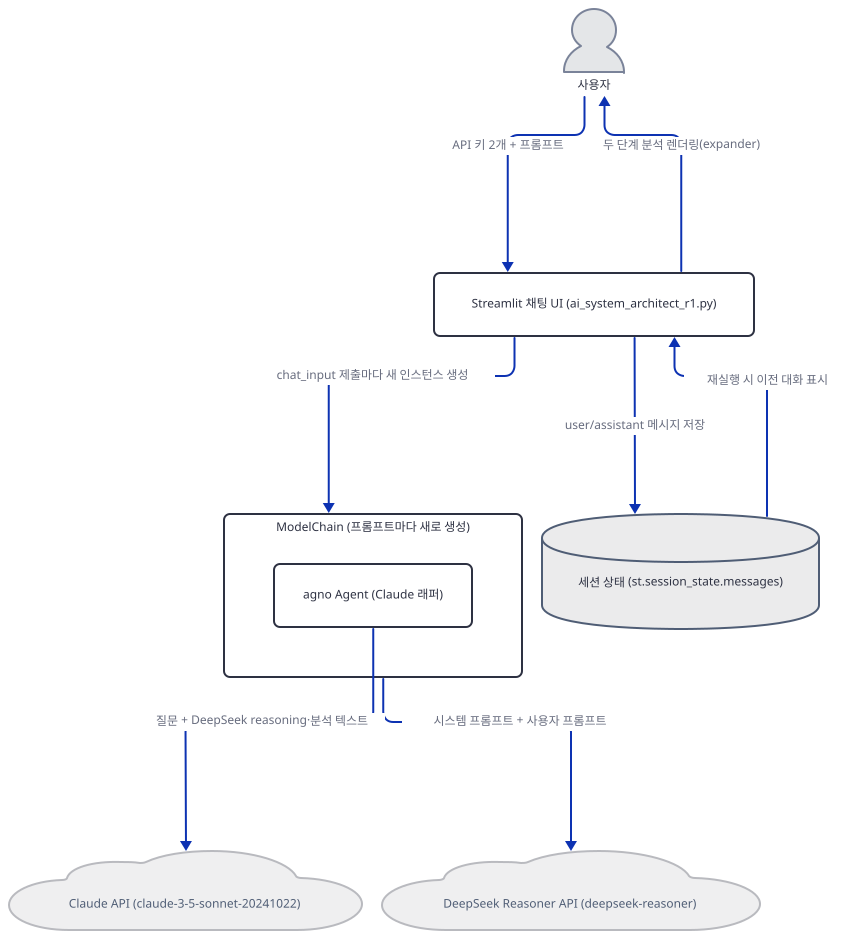

## 사전 준비

| 서비스/도구 | 용도 | 발급·설치 |
|---|---|---|
| DeepSeek API 키 | `ModelChain`의 OpenAI 호환 클라이언트(`base_url="https://api.deepseek.com"`)가 `deepseek-reasoner` 모델을 호출할 때 인증. 사이드바 입력창에 붙여넣는다(환경변수 아님) | DeepSeek 플랫폼에서 발급(앱 자체 README는 발급 URL을 적어 두지 않았습니다) |
| Anthropic API 키 | agno `Claude` 에이전트가 Claude API를 호출할 때 인증. 사이드바에 붙여넣는다. 코드가 박은 `claude-3-5-sonnet-20241022`는 이미 리타이어된 모델이라 키가 유효해도 이 id 그대로는 호출이 실패할 가능성이 높다(위 "오늘 만들 것" 참고) | https://console.anthropic.com/ 가입 후 발급 |
| uv | 가상환경 생성과 패키지 설치 | [공통 사전 준비](../README.md#공통-사전-준비-한-번만) 절 참고 |
| 인터넷 연결 | PyPI 설치, DeepSeek·Anthropic API 접속, agno의 익명 사용 통계 전송(`os-api.agno.com`, Day 047 Step 5와 같은 사실 — 단 agno는 `run()`이 **성공**할 때만 이걸 보내므로, Step 5의 `TypeError`를 고치기 전까지는 나가지 않습니다) | 별도 설치 없음. 사내망이면 `api.deepseek.com`·`api.anthropic.com`·`os-api.agno.com` 접속 허용 필요 |

`python-dotenv`가 7행(`from dotenv import load_dotenv`)에서 임포트되지만 `load_dotenv()` 호출은 파일 어디에도 없습니다(전체 검색으로 확인) — `.env` 파일을 만들 필요가 없고, 두 키는 오직 사이드바 입력창으로만 들어갑니다.

## 아키텍처 한눈에 보기

| 컴포넌트 | 역할 | 코드 위치 |
|---|---|---|
| 사용자 | 브라우저에서 키 2개·프롬프트 입력 | 코드 없음 (브라우저) |
| Streamlit 채팅 UI | 페이지·사이드바 구성, 키 게이트, 대화 이력 렌더, `chat_input` 처리 | `advanced_ai_agents/single_agent_apps/ai_system_architect_r1/ai_system_architect_r1.py:249-315` |
| ModelChain (오케스트레이터) | DeepSeek용 OpenAI 호환 클라이언트·agno `Agent`(Claude 래퍼) 초기화, 두 단계 호출 순서 관리 | `advanced_ai_agents/single_agent_apps/ai_system_architect_r1/ai_system_architect_r1.py:71-99` |
| DeepSeek Reasoner API | 사용자 요구사항을 아키텍처·인프라·보안 등 JSON 형태 기술 분석으로 변환 | `advanced_ai_agents/single_agent_apps/ai_system_architect_r1/ai_system_architect_r1.py:186-218` |
| agno Agent (Claude 래퍼) | DeepSeek 결과를 받아 사람이 읽을 상세 설명·로드맵 생성 | `advanced_ai_agents/single_agent_apps/ai_system_architect_r1/ai_system_architect_r1.py:220-247` |
| 세션 상태 (`st.session_state.messages`) | 채팅 메시지 이력 보관. 탭을 닫거나 새로고침하면 사라짐 | `advanced_ai_agents/single_agent_apps/ai_system_architect_r1/ai_system_architect_r1.py:284-286` |

## 단계별 진행

### Step 1. 환경 만들기 — `agno>=2.2.10`이 오늘 실제로 무엇을 까는지

**목적.** 격리된 가상환경에 4줄짜리 `requirements.txt`를 설치하고, 오늘 실제로 풀리는 agno 버전이 무엇인지 직접 확인합니다.

**할 일.**

```bash
cd advanced_ai_agents/single_agent_apps/ai_system_architect_r1
uv venv
uv pip install -r requirements.txt
```

(pip 대안: `python -m venv .venv && source .venv/bin/activate && pip install -r requirements.txt`. Windows PowerShell은 활성화만 `.venv\Scripts\Activate.ps1`로 바꿉니다.)

이 저장소는 루트에 `pyproject.toml`이 있어 `uv run`이 방금 만든 환경 대신 루트의 `.venv`를 쓰므로, 이후 `uv run` 명령에는 모두 `--no-project`를 붙입니다.

`advanced_ai_agents/single_agent_apps/ai_system_architect_r1/requirements.txt:1-4`

```text
streamlit
openai
anthropic
agno>=2.2.10
```

오늘 이 조건을 만족하는 최신 버전은 3.0.11입니다(직접 확인, 아래). 4번째 줄에 상한이 없는 것 자체는 원인이 아닙니다 — Step 5에서 보듯 `requirements.txt`가 선언한 **하한** 2.2.10을 정확히 설치해도 앱을 멈추는 `TypeError`가 똑같이 나므로, 버전을 어디에 고정하든 이 결함은 피할 수 없습니다.

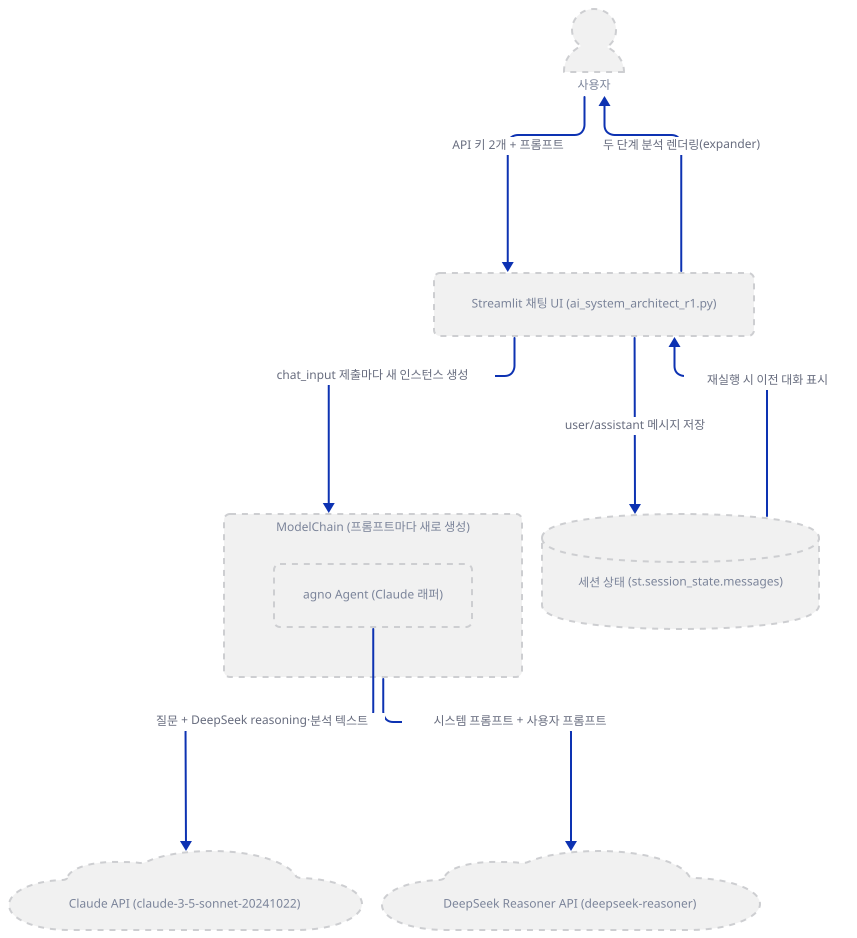

**확인.**

```bash
uv run --no-project python -m py_compile ai_system_architect_r1.py
uv run --no-project python -c "import agno; import importlib.metadata as m; print('agno', m.version('agno'))"
```

직접 확인한 출력:

```
agno 3.0.11
```

(오류 없이 컴파일되고, 설치된 agno 버전이 3.0.11임을 확인했습니다. `python -m py_compile`은 아무 출력 없이 끝나면 성공입니다.)

### Step 2. 페이지 설정과 두 API 키 게이트

**목적.** `main()`이 그리는 화면 골격 — 제목·프롬프트 작성 가이드(249-272행, 별도 인용 생략)·사이드바 키 입력 2개·대화 초기화 — 을 확인합니다.

**할 일.**

`advanced_ai_agents/single_agent_apps/ai_system_architect_r1/ai_system_architect_r1.py:274-286`

```python
    # Sidebar for API keys
    with st.sidebar:
        st.header("⚙️ Configuration")
        deepseek_api_key = st.text_input("DeepSeek API Key", type="password")
        anthropic_api_key = st.text_input("Anthropic API Key", type="password")
        
        if st.button("🗑️ Clear Chat History"):
            st.session_state.messages = []
            st.rerun()

    # Initialize session state for messages
    if "messages" not in st.session_state:
        st.session_state.messages = []
```

두 키 모두 `type="password"` 텍스트 입력창으로만 들어가고(환경변수·`.env` 아님), "Clear Chat History" 버튼은 `st.session_state.messages`만 비웁니다. 실제로 키가 비어 있을 때 어떻게 막는지는 Step 6(294-297행)에서 다룹니다.

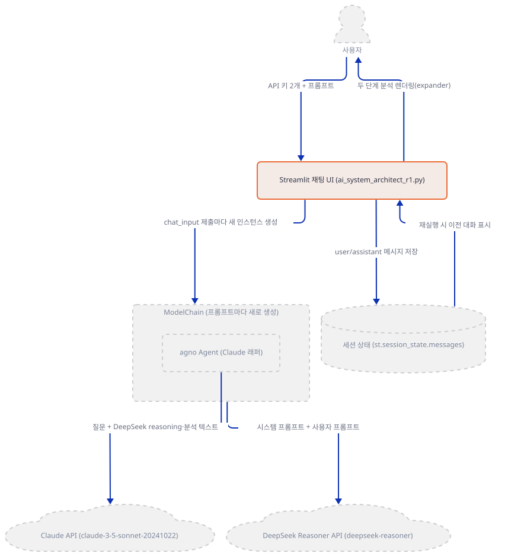

**확인.** 임의의 높은 포트로 헤드리스 기동해 이 화면이 예외 없이 뜨는지 직접 확인합니다.

```bash
uv run --no-project streamlit run ai_system_architect_r1.py --server.headless true --server.address localhost --server.port 58731
```

직접 확인한 출력(프록시 변수로 외부 요청을 막은 상태, 포트 58731):

```
2026-09-29 06:20:29.023 Uvicorn server started on localhost:58731

  You can now view your Streamlit app in your browser.

  URL: http://localhost:58731
```

다른 터미널에서 `curl -o /dev/null -w "%{http_code}" http://localhost:58731/`는 `200`을 돌려주었고, 로그에 예외는 찍히지 않았습니다(직접 확인). 이 재현은 이미 `~/.streamlit/credentials.toml`이 있는 홈에서 돌려 위 두 줄만 찍혔습니다 — `~/.streamlit`이 아예 없는 첫 실행이라면 그 앞에 `Collecting usage statistics. To deactivate, set browser.gatherUsageStats to false.` 줄이 먼저 찍힐 수 있습니다(streamlit 1.64.0 소스로 확인, 저장소 밖 패키지라 경로는 인용하지 않습니다).

### Step 3. ModelChain 초기화 — 두 클라이언트와 agno 에이전트, 그리고 조용히 죽어있는 필드들

**목적.** 생성자가 만드는 세 가지(DeepSeek용 OpenAI 호환 클라이언트, 쓰이지 않는 Anthropic 원시 클라이언트, agno Claude 에이전트)를 확인하고, 정의만 되고 실제로는 안 쓰이는 필드들을 짚어 둡니다.

**할 일.**

`advanced_ai_agents/single_agent_apps/ai_system_architect_r1/ai_system_architect_r1.py:71-99`

```python
class ModelChain:
    def __init__(self, deepseek_api_key: str, anthropic_api_key: str) -> None:
        self.client = OpenAI(
            api_key=deepseek_api_key,
            base_url="https://api.deepseek.com" 
        )
        self.claude_client = anthropic.Anthropic(api_key=anthropic_api_key)
        
        # Create Claude model with system prompt
        claude_model = Claude(
            id="claude-3-5-sonnet-20241022", 
            api_key=anthropic_api_key,
            system_prompt="""Given the user's query and the DeepSeek reasoning:
            1. Provide a detailed analysis of the architecture decisions
            2. Generate a project implementation roadmap
            3. Create a comprehensive technical specification document
            4. Format the output in clean markdown with proper sections
            5. Include diagrams descriptions in mermaid.js format"""
        )
        
        # Initialize agent with configured model
        self.agent = Agent(
            model=claude_model,
            markdown=True
        )
        
        self.deepseek_messages: List[Dict[str, str]] = []
        self.claude_messages: List[Dict[str, Any]] = []
        self.current_model: str = CLAUDE_MODEL
```

실제로 요청을 나르는 것은 73행의 `self.client`(DeepSeek 호출용)와 92행의 `self.agent`(Claude 호출용) 둘뿐입니다. 77행의 `self.claude_client`는 이 파일 어디에서도 다시 읽히지 않는 죽은 필드입니다(`claude_client` 전체 검색으로 확인). 97~98행의 `self.deepseek_messages`·`self.claude_messages`도 채워지지 않는 빈 리스트로 남습니다 — 매 프롬프트마다 `ModelChain`을 통째로 새로 만들기 때문에(Step 6) 이전 대화를 기억할 자리 자체가 없습니다. 99행이 대입하는 `CLAUDE_MODEL`(17행 상수)조차 `self.current_model`에 담긴 뒤로 다시 읽히지 않고, 16행의 `DEEPSEEK_MODEL` 상수는 파일 전체에서 단 한 번도 참조되지 않습니다 — 같은 값 `"deepseek-reasoner"`이 188행에 리터럴로 다시 박혀 있습니다(전체 검색으로 확인).

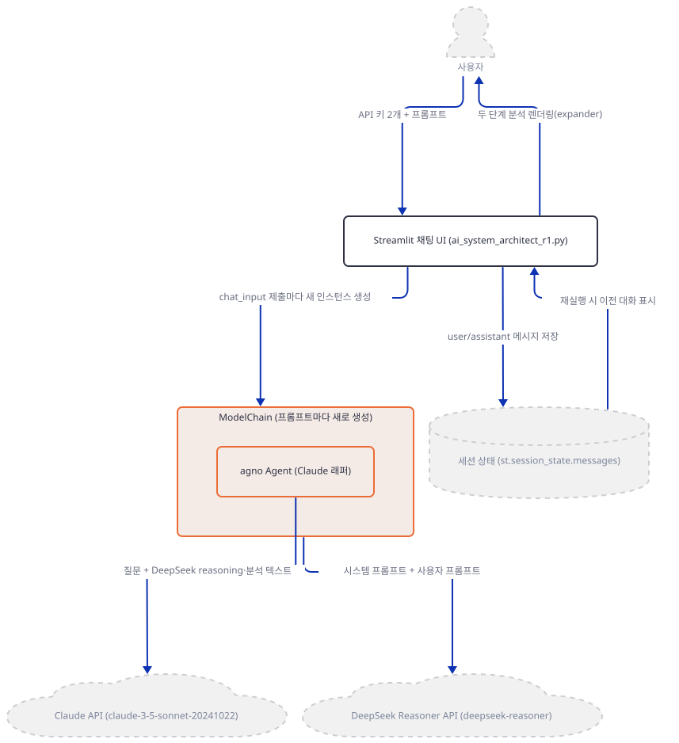

**확인.** 네트워크를 프록시로 막은 채 더미 키로 생성자만 호출해, 이 단계에서는 실제 API 호출이 전혀 일어나지 않는다는 것을 확인합니다.

```bash
uv run --no-project python -c "
from agno.agent import Agent
from agno.models.anthropic import Claude
claude_model = Claude(id='claude-3-5-sonnet-20241022', api_key='dummy-key', system_prompt='test')
agent = Agent(model=claude_model, markdown=True)
print('agent 생성 OK, 모델 id:', agent.model.id)

import ai_system_architect_r1 as m
chain = m.ModelChain('dummy-deepseek-key', 'dummy-anthropic-key')
print('ModelChain 생성 OK:', chain.client.base_url, chain.agent.model.id)
"
```

직접 확인한 출력(`HTTP_PROXY`·`HTTPS_PROXY`를 존재하지 않는 로컬 주소로 걸어 실제 네트워크 연결이 시도되면 바로 실패하게 만든 상태에서 실행):

```
agent 생성 OK, 모델 id: claude-3-5-sonnet-20241022
ModelChain 생성 OK: https://api.deepseek.com claude-3-5-sonnet-20241022
```

### Step 4. 1차 추론 — DeepSeek Reasoner 호출과 `reasoning_content` 분리

**목적.** `get_deepseek_reasoning`이 무엇을 보내고, DeepSeek 고유 필드 `reasoning_content`를 어떻게 받아 화면에 나누어 표시하는지 확인합니다.

**할 일.**

`advanced_ai_agents/single_agent_apps/ai_system_architect_r1/ai_system_architect_r1.py:186-218`

```python
        try:
            deepseek_response = self.client.chat.completions.create(
                model="deepseek-reasoner",
                messages=[
                    {"role": "system", "content": system_prompt},
                    {"role": "user", "content": user_input}
                ],
                max_tokens=3000,
                stream=False   
            )

            if not deepseek_response.choices or deepseek_response.choices[0].message is None:
                raise ValueError("DeepSeek returned an empty or filtered response")
            reasoning_content = deepseek_response.choices[0].message.reasoning_content
            normal_content = deepseek_response.choices[0].message.content
            
            # Display the reasoning separately
            with st.expander("DeepSeek Reasoning", expanded=True):
                st.markdown(reasoning_content)
            
                
            with st.expander("💭 Technical Analysis", expanded=True):
                st.markdown(normal_content)
                elapsed_time = time.time() - start_time
                time_str = f"{elapsed_time/60:.1f} minutes" if elapsed_time >= 60 else f"{elapsed_time:.1f} seconds"
                st.caption(f"⏱️ Analysis completed in {time_str}")

                # Return both reasoning and normal content
                return reasoning_content, normal_content

        except Exception as e:
            st.error(f"Error in DeepSeek analysis: {str(e)}")
            return "Error occurred while analyzing", ""
```

103~184행(별도 인용 생략)의 시스템 프롬프트는 "JSON 객체만 반환하라"고 문장으로만 지시할 뿐, OpenAI SDK의 `response_format`이나 `output_config` 같은 강제 기능은 쓰지 않습니다(코드 전체 검색으로 확인) — DeepSeek이 실제로 JSON을 지키는지는 순전히 프롬프트 준수에 달려 있습니다. 199행의 `reasoning_content`는 OpenAI의 공식 응답 스키마에는 없는 DeepSeek 전용 필드인데, 이 앱이 쓰는 `openai` SDK의 `ChatCompletionMessage` 모델이 `extra="allow"`로 정의돼 있어(설치된 `openai` 3.20.0 소스로 확인 — 저장소 밖 패키지라 경로는 인용하지 않습니다) 정의되지 않은 필드도 속성으로 그대로 읽힙니다.

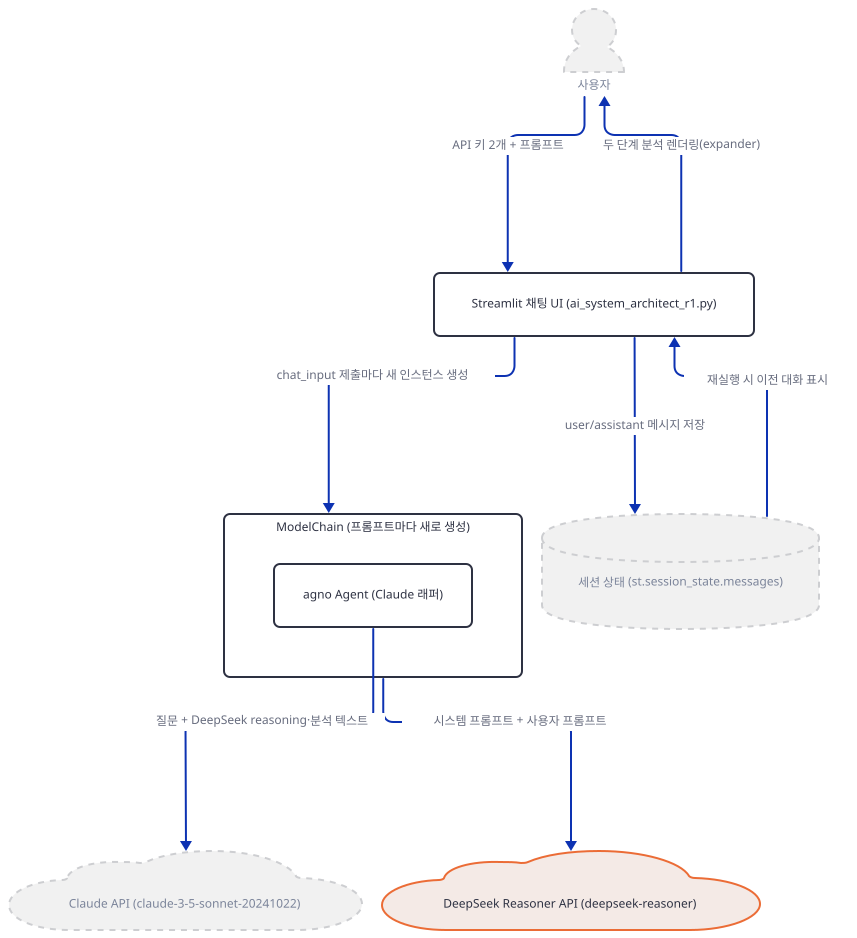

**확인.** `openai` 3.20.0의 메시지 모델이 DeepSeek의 비표준 필드를 실제로 통과시키는지 직접 확인합니다(네트워크 호출 없이 로컬에서 값을 채워 넣는 재현).

```bash
uv run --no-project python -c "
from openai.types.chat.chat_completion_message import ChatCompletionMessage
m = ChatCompletionMessage.model_validate({'role': 'assistant', 'content': 'hi', 'reasoning_content': 'my reasoning'})
print('content:', m.content)
print('reasoning_content:', m.reasoning_content)
"
```

직접 확인한 출력:

```
content: hi
reasoning_content: my reasoning
```

### Step 5. 2차 합성 — agno Agent 호출과 오늘 실제로 터지는 `TypeError`

**목적.** `get_claude_response`가 DeepSeek 결과를 어떻게 합쳐 Claude에 넘기는지 확인하고, 오늘 설치되는 agno 버전에서 이 호출이 왜 실패하는지 직접 재현합니다.

**할 일.**

`advanced_ai_agents/single_agent_apps/ai_system_architect_r1/ai_system_architect_r1.py:220-247`

```python
    def get_claude_response(self, user_input: str, deepseek_output: tuple[str, str]) -> str:
        try:
            reasoning_content, normal_content = deepseek_output
            
            # Create expander for Claude's response
            with st.expander("🤖 Claude's Response", expanded=True):
                response_placeholder = st.empty()
                
                # Prepare the message with user input, reasoning and normal output
                message = f"""User Query: {user_input}

                DeepSeek Reasoning: {reasoning_content}

                DeepSeek Technical Analysis: {normal_content}
                Give detailed explanation for each key value pair in brief in the JSON object, and why we chose it clearly. Dont use your own opinions, use the reasoning and the structured output to explain the choices."""
                
                # Use Claude Agent to get response
                response: RunOutput = self.agent.run(
                    message=message
                )
                
                dub = response.content
                st.markdown(dub)
                return dub

        except Exception as e:
            st.error(f"Error in Claude response: {str(e)}")
            return "Error occurred while getting response"
```

237~239행이 `self.agent.run(message=message)`로 Claude를 호출합니다 — `message=`는 agno 1.x 시절 `Agent.run()`의 인자 이름입니다. `requirements.txt`가 선언한 **하한** `agno==2.2.10`을 정확히 설치해도, 그리고 오늘 실제로 깔리는 3.0.11에서도 `Agent.run()`의 필수 인자 이름은 `input`입니다(agno 소스의 `inspect.signature(Agent.run)`으로 두 버전 모두 직접 확인, 아래). `input`은 기본값이 없는 필수 인자이고 `run()`은 `**kwargs`도 받으므로, `message=message`는 조용히 무시되는 대신 `input`이 없다는 `TypeError`로 즉시 실패합니다. 반대로 `message=`를 그대로 받는 1.x(마지막 1.8.4)에는 12행이 임포트하는 `agno.run.agent` 모듈 자체가 없어 그 버전으로는 애초에 임포트 단계에서 막힙니다(직접 확인) — 즉 `agno>=2.2.10`을 만족하는 어떤 버전으로 고정해도 피할 수 없는 원래 결함이지, 상한이 없어서 생긴 버전 드리프트가 아닙니다. 이것은 네트워크나 키의 유효성과 무관한 순수 파이썬 인자 바인딩 문제라서, 키가 하나도 없어도 그대로 재현됩니다(245~247행의 `except Exception`이 이 예외를 잡아 `st.error`로만 보여주고 넘어가므로, 화면에서는 "Claude 응답 오류" 정도로만 보일 뿐 원인을 알기 어렵습니다).

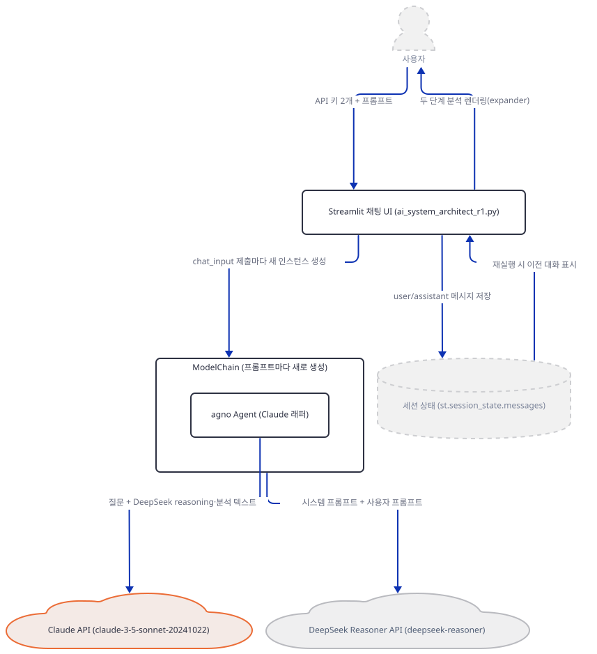

**확인.** 실제 키·네트워크 없이 `agent.run(message=...)` 호출 하나만으로 이 `TypeError`가 재현되는지 확인합니다.

```bash
uv run --no-project python -c "
from agno.agent import Agent
from agno.models.anthropic import Claude
agent = Agent(model=Claude(id='claude-3-5-sonnet-20241022', api_key='dummy-key'), markdown=True)
try:
    agent.run(message='hello world')
    print('NO ERROR')
except TypeError as e:
    print('TypeError:', e)
"
```

직접 확인한 출력:

```
TypeError: Agent.run() missing 1 required positional argument: 'input'
```

이것이 상한 없는 `requirements.txt` 탓에 오늘 우연히 깔린 최신 버전만의 문제가 아니라는 것도 직접 확인했습니다 — `requirements.txt`가 선언한 하한을 정확히 설치해도, 그보다 오래된 1.x로 내려가도 결과는 같습니다.

```bash
uv venv .venv-2210 && uv pip install --python .venv-2210 "agno==2.2.10" anthropic
uv run --no-project --python .venv-2210 python -c "
import importlib.metadata as m
print('agno', m.version('agno'))
from agno.agent import Agent
from agno.models.anthropic import Claude
agent = Agent(model=Claude(id='claude-3-5-sonnet-20241022', api_key='dummy-key'), markdown=True)
agent.run(message='hello world')
"
```

직접 확인한 출력(같은 `TypeError`):

```
agno 2.2.10
TypeError: Agent.run() missing 1 required positional argument: 'input'
```

반대로 `message=`를 그대로 받는 agno 1.x(`agno<2`, 마지막 1.8.4)에는 12행이 임포트하는 `agno.run.agent` 모듈 자체가 없어 더 일찍, 임포트 단계에서 막힙니다(직접 확인: `uv pip install "agno<2" --no-deps` 후 `python -c "import agno.run.agent"`가 `ModuleNotFoundError: No module named 'agno.run.agent'`). 즉 이 코드는 `agno>=2.2.10`을 만족하는 범위 안에서 버전을 어디에 고정해도 고쳐지지 않습니다.

### Step 6. 채팅 흐름 조립 — 세션 상태와 `chat_input`

**목적.** 대화 이력을 어떻게 그리고 저장하는지, 그리고 두 키가 갖춰지지 않았을 때 앱이 어디서 멈추는지 확인합니다.

**할 일.**

`advanced_ai_agents/single_agent_apps/ai_system_architect_r1/ai_system_architect_r1.py:288-315`

```python
    # Display chat messages
    for message in st.session_state.messages:
        with st.chat_message(message["role"]):
            st.markdown(message["content"])

    # Chat input
    if prompt := st.chat_input("What would you like to know?"):
        if not deepseek_api_key or not anthropic_api_key:
            st.error("⚠️ Please enter both API keys in the sidebar.")
            return

        # Initialize ModelChain
        chain = ModelChain(deepseek_api_key, anthropic_api_key)

        # Add user message to chat
        st.session_state.messages.append({"role": "user", "content": prompt})
        with st.chat_message("user"):
            st.markdown(prompt)

        # Get AI response
        with st.chat_message("assistant"):
            with st.spinner("🤔 Thinking..."):
                deepseek_output = chain.get_deepseek_reasoning(prompt)
            
            
            with st.spinner("✍️ Responding..."):
                response = chain.get_claude_response(prompt, deepseek_output)
                st.session_state.messages.append({"role": "assistant", "content": response})
```

295~297행의 키 게이트는 단순한 빈 문자열 검사입니다 — 키를 하나라도 비워 두고 채팅창에 아무 말이나 보내면 오류 문구만 뜨고 `return`으로 조용히 멈춥니다. 300행은 프롬프트를 보낼 때마다 `ModelChain`을 통째로 새로 만듭니다 — Step 3에서 본 빈 리스트들이 채워지지 않는 이유이자, Day 086의 Dietary/Fitness Expert처럼 이 앱도 이전 대화를 기억하지 않는 단발성 호출이라는 뜻입니다.

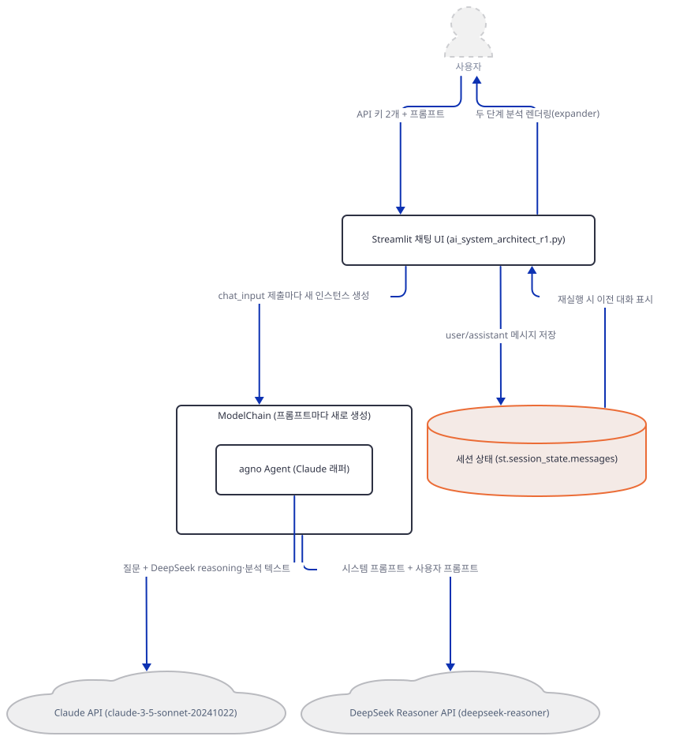

**확인.** 295행의 키 게이트 조건(`not deepseek_api_key or not anthropic_api_key`)이 키 하나만 비어 있어도 참이 되는지, Streamlit 없이 그 조건식만 그대로 떼어 확인합니다.

```bash
uv run --no-project python -c "
deepseek_api_key = ''
anthropic_api_key = 'anthropic-key-here'
print('키 게이트 발동 여부:', not deepseek_api_key or not anthropic_api_key)
"
```

직접 확인한 출력:

```
키 게이트 발동 여부: True
```

(Streamlit은 위젯을 브라우저 쪽 React로 그리므로 서버가 반환하는 정적 `index.html`에는 `chat_input`이 나타나지 않아, 실제 클릭·입력까지 포함한 동작은 Step 7의 헤드리스 기동 재현으로 갈음합니다.)

### Step 7. 실행 확인 — 헤드리스 기동, 키 게이트, 그리고 `agent.run` 버그 재확인

**목적.** 지금까지 다룬 내용을 하나로 묶어, 앱을 실제로 띄워 보고 키 없이/있어도 어디서 멈추는지 정리합니다.

**할 일.** 독자가 브라우저로 앱을 직접 열 때는 다음 한 줄이면 됩니다.

```bash
uv run --no-project streamlit run ai_system_architect_r1.py
```

헤드리스로 부팅만 확인하려면 `--server.headless true --server.address localhost`를 붙입니다(주소를 지정하지 않고 headless로 띄우면 Streamlit이 외부 IP를 알아내려고 `checkip.amazonaws.com`에 요청을 보냅니다 — 설치된 `streamlit` 1.64.0의 `net_util.py` 소스로 확인, 저장소 밖 패키지라 경로는 인용하지 않습니다).

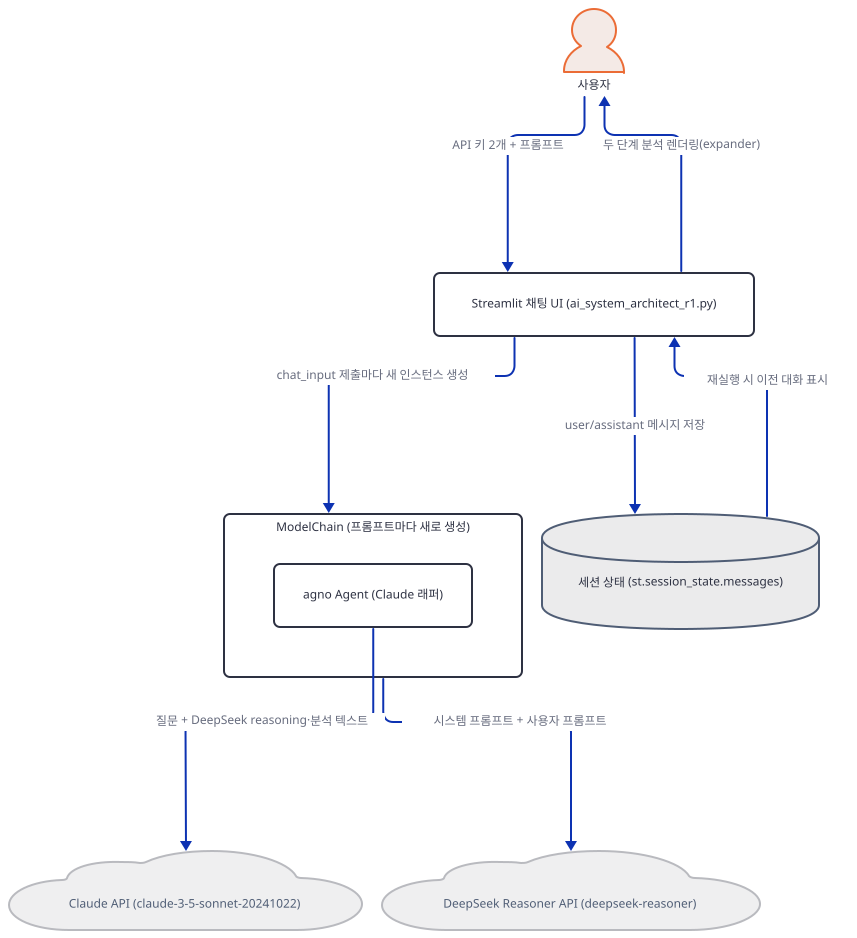

**확인.** 헤드리스 기동 자체는 Step 2에서 이미 직접 확인했습니다(포트 58731, HTTP 200). 여기서는 지금까지 다룬 두 갈래 — 키가 없을 때와 있을 때 — 가 각각 어디서 멈추는지 정리합니다. 키 두 개를 비워 두고 채팅창에 아무 말이나 보내면 296행의 "⚠️ Please enter both API keys in the sidebar."만 뜨고 멈춘다는 것은 소스로 확인했습니다(브라우저 자동화 없이는 클릭을 재현할 수 없어 "직접 확인"이 아닙니다). 키를 둘 다 유효하게 넣더라도, DeepSeek 호출까지는 성공할 가능성이 있지만 그다음 `self.agent.run(message=...)`에서 Step 5가 재현한 `TypeError`로 멈춘다는 것은 키·네트워크와 무관하게 이미 직접 확인했습니다(그 `TypeError`는 `requirements.txt`의 하한·오늘의 최신판·1.x 모두에서 같은 결론이라는 것도 Step 5에서 확인했습니다).

## 요청 한 건이 흐르는 과정

채팅창에 프롬프트를 보내면 실제로는 서로 다른 시점에 일어나는 세 구간이 있습니다 — 그림도 그 경계에서 셋으로 나눴습니다.

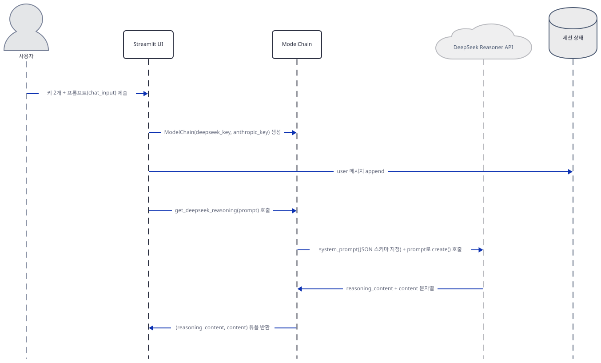

Streamlit UI가 먼저 `ModelChain`을 새로 만들고(이전 대화와 무관한 새 인스턴스), **DeepSeek 호출 전에** 사용자 메시지를 세션 상태에 먼저 append합니다(303행). 그다음 `get_deepseek_reasoning()`을 호출하면 `ModelChain`은 DeepSeek Reasoner API에 시스템 프롬프트(JSON 스키마 지시)와 사용자 프롬프트를 담아 `chat.completions.create()`를 부르고, `reasoning_content`(추론 과정)와 `content`(정리된 분석)를 튜플로 돌려받습니다 — 이 둘을 두 개의 expander로 표시하는 것은 UI(main)가 아니라 `ModelChain.get_deepseek_reasoning` 자신입니다(203-211행).

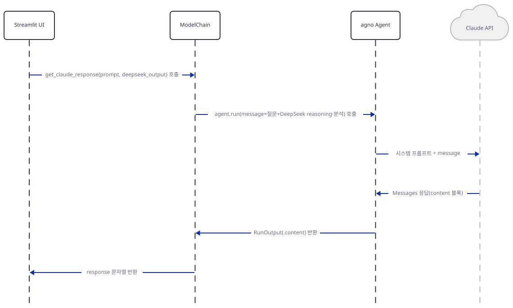

이어서 UI가 `get_claude_response()`를 호출하면 `ModelChain`은 agno `Agent`의 `run()`을 `message=`라는 이름으로 부르는데 — 그림에는 코드가 의도한 대로의 흐름을 그렸지만, Step 5에서 직접 확인했듯이 오늘 설치되는 agno 버전(그리고 `requirements.txt`가 선언한 하한 2.2.10 자체)에서 이 호출은 인자 이름 불일치로 `TypeError`를 던지며 여기서 끊깁니다. 의도한 흐름대로라면 agno `Agent`가 시스템 프롬프트와 합쳐진 `message`를 Claude API에 보내고, Claude가 돌려주는 것은 agno의 `RunOutput`이 아니라 Anthropic Messages API의 응답(`content` 블록)입니다 — agno `Agent`가 그것을 받아 **자신의** `RunOutput` 객체로 감싸 `ModelChain`에 돌려줍니다(`RunOutput`은 agno가 만드는 객체이지 Claude API가 직접 주는 것이 아닙니다).

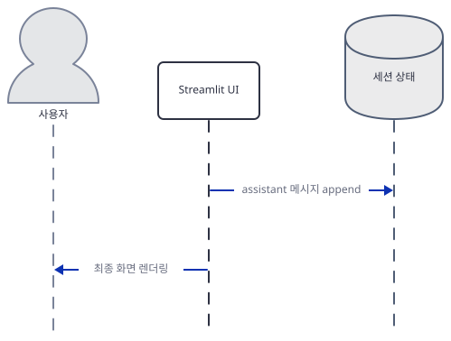

`response.content`를 `ModelChain`이 문자열로 돌려주면, UI는 **Claude 단계가 끝난 뒤에** assistant 메시지를 세션 상태에 append하고(315행) 화면에 최종 렌더링합니다. 즉 두 세션 쓰기(303행 user·315행 assistant)는 한 요청 안에서 DeepSeek 단계를 사이에 두고 시간상 멀리 떨어져 있습니다. Day 086의 순차 호출(Dietary → Fitness)과 달리 이 앱은 서로 다른 두 제공자(DeepSeek·Anthropic)를 순서대로 엮는다는 점이 다릅니다 — 앞 호출의 텍스트 결과가 다음 호출의 프롬프트 안에 그대로 삽입됩니다.

## 실행 체크리스트

- [ ] `uv pip install -r requirements.txt`가 예외 없이 끝나고 `python -m py_compile ai_system_architect_r1.py`가 조용히 통과한다
- [ ] 설치된 `agno` 버전이 `3.x`(직접 확인: 3.0.11)라는 것을 알고, `requirements.txt`가 선언한 **하한** `agno==2.2.10`에서도 Step 5의 `TypeError`가 똑같이 난다는 것을 직접 확인했다(버전 고정으로는 고쳐지지 않는 원래 결함)
- [ ] `ModelChain("x", "y")` 생성자가 네트워크 요청 없이 즉시 끝난다는 것을 더미 키로 직접 확인했다
- [ ] `openai` 3.20.0의 `ChatCompletionMessage`가 DeepSeek 전용 필드 `reasoning_content`를 예외 없이 통과시킨다는 것을 직접 확인했다
- [ ] `agent.run(message=...)`가 오늘 설치되는 agno에서 `TypeError: Agent.run() missing 1 required positional argument: 'input'`으로 실패한다는 것을 키 없이 직접 확인했다
- [ ] `--server.headless true --server.address localhost`로 띄우면 외부 IP 조회 없이 `200`이 뜬다는 것을 직접 확인했다
- [ ] 코드가 박은 `claude-3-5-sonnet-20241022`가 Anthropic 공식 배포 중단 표에서 2025-10-28에 리타이어되었다는 것을 확인했다(공식 문서, 키가 없어 실제 호출 오류는 재현 못함)

## 문제 해결

| 증상 | 원인 | 해결 |
|---|---|---|
| 두 키를 다 넣고 실행해도 DeepSeek 분석까지는 뜨는데 그다음 "Error in Claude response: Agent.run() missing 1 required positional argument: 'input'"로 멈춤(키 없이 직접 재현, 버전을 `agno==2.2.10`으로 고정해도 동일) | 코드(237-239행)가 agno 1.x 시절의 인자 이름 `message=`로 `Agent.run()`을 부르는데, `requirements.txt`가 선언한 **하한** 2.2.10에서도 이미 필수 인자 이름이 `input`이다(agno 소스로 확인) — 상한이 없어서 생긴 버전 드리프트가 아니라 `agno>=2.2.10`을 만족하는 어떤 버전에서도 나는 원래 결함 | `ai_system_architect_r1.py:237-239`를 `self.agent.run(input=message)`로 바꾸거나 `self.agent.run(message)` 위치 인자로 호출 |
| (위를 고쳐도) 유효한 키로 Claude를 호출하면 모델을 찾을 수 없다는 오류가 날 가능성이 높음 | 코드가 박은 `claude-3-5-sonnet-20241022`는 Anthropic 공식 배포 중단 표에서 2025-10-28에 이미 리타이어됨(https://platform.claude.com/docs/en/about-claude/model-deprecations, 2026-09-29 확인) | `ai_system_architect_r1.py:81`의 `id`를 살아있는 모델(예: `claude-sonnet-4-6`)로 바꾼다 |
| `--server.address` 없이 헤드리스로 띄우면 시작이 느리거나 외부로 요청이 나가는 것처럼 보임 | 주소를 지정하지 않으면 Streamlit이 외부 IP를 알아내려고 `checkip.amazonaws.com`에 접속을 시도한다(설치된 streamlit 1.64.0 소스로 확인) | 헤드리스로 띄울 때는 항상 `--server.address localhost`를 함께 쓴다 |
| DeepSeek 응답의 `reasoning_content`가 `AttributeError`로 읽히지 않을까 걱정됨 | 실제로는 문제없음 — `openai` SDK의 메시지 모델이 `extra="allow"`로 정의돼 있어 DeepSeek 고유 필드도 그대로 통과한다(직접 확인, Step 4) | 해당 없음(설계상 안전) |

## 더 해보기

- `ai_system_architect_r1.py:237-239`를 `self.agent.run(input=message)`로 고치고 `ai_system_architect_r1.py:81`의 모델 id를 살아있는 것으로 바꾼 뒤, 실제 키 두 개로 끝까지 돌려 DeepSeek 추론과 Claude 설명이 실제로 어떻게 이어지는지 비교해보기
- `TechnicalAnalysis` 등 정의만 되고 쓰이지 않는 Pydantic 스키마(`ai_system_architect_r1.py:19-68`)를 실제로 연결해보기 — DeepSeek 응답에 `json.loads`를 적용하고 `TechnicalAnalysis.model_validate(...)`로 검증해, 프롬프트가 요구하는 필드(`ml_capabilities` 등)가 실제로 왜 이 스키마와 어긋나는지 직접 확인해보기
- `DEEPSEEK_MODEL`·`CLAUDE_MODEL` 상수(`ai_system_architect_r1.py:16-17`)를 실제 호출부(`ai_system_architect_r1.py:188`의 `model="deepseek-reasoner"`, `ai_system_architect_r1.py:81`의 `id="claude-3-5-sonnet-20241022"`)에 연결해 하드코딩 중복을 없애보기

## 다음 날 예고

[Day 088 · 🤝 AI Consultant Agent](../day088-ai-consultant-agent/README.md) — Google ADK로 만든 컨설턴트 에이전트로, Perplexity AI 웹 검색을 시장 분석·전략 추천에 연결합니다(원본 앱 README 기준).
