# Day 088 · 🤝 AI Consultant Agent

> 볼륨 7 🚀 Advanced AI Agents · 난이도 ★★☆ · 예상 소요 73분(Step마다 실제로 함수를 호출해 보고 `adk web`까지 띄워 확인하는 손 시간이 읽는 시간만큼 듭니다) · API 비용 대략 상담 1건에 Gemini 호출 여러 회(도구 호출마다 왕복) + Perplexity Sonar 호출 1회, 두 요금표 기준 수백 원 이하로 추정(키가 없어 실제 과금은 확인하지 못함) · 원본 앱: `advanced_ai_agents/single_agent_apps/ai_consultant_agent`

## 오늘 만들 것

이 볼륨("🚀 Advanced AI Agents", Day 078~)에서는 처음 등장하는 `google-adk` 앱입니다(078~086 전체를 "google.adk" 문자열로 검색해 확인 — 이 사이 아흐레는 전부 다른 프레임워크를 씁니다). 시리즈 전체로 보면 Day 014~023의 크래시 코스, Day 067(Multimodal Agentic RAG), Day 077(AI Career Coach with Memory)에 이어 네 번째로 이 프레임워크를 다루는 자리입니다(024~087 경로를 "google.adk"로 검색해 확인). 구조는 Day 014의 `LlmAgent` 선언 한 번, `adk web`이 서버를 대신 띄우는 패턴 그대로지만, 오늘의 310줄짜리(마지막 줄에 개행이 없어 `wc -l`은 309로 셉니다) `ai_consultant_agent.py`는 도구를 세 개 얹습니다. 이 중 둘(`analyze_market_data`, `generate_strategic_recommendations`)은 키워드 매칭 시뮬레이션입니다 — `analyze_market_data`는 코드 주석이 스스로 "실제 구현이라면 검색 결과를 처리했을 것"이라고 밝히지만(98행), `generate_strategic_recommendations`엔 그런 주석이 없고 소스를 직접 읽어야 같은 패턴임을 알 수 있습니다. 나머지 하나(`perplexity_search`)만 `requests.post`로 실제 외부 API(Perplexity Sonar)에 닿습니다 — 셋 다 `safe_tool_wrapper`라는 데코레이터로 감싸져 있는데, 이 래퍼는 예외를 잡고 `bytes`를 문자열로 바꾸는 안전장치이자 `@wraps`로 원본 시그니처를 유지해 ADK가 여전히 진짜 파라미터를 읽게 만드는 역할을 겸합니다(코드 주석 75~76행이 그 이유를 직접 적어 뒀습니다). `google.adk.tools.google_search`를 임포트만 해 두고 `tools=[...]`에는 끝내 넣지 않은 죽은 줄(11행)도 있습니다. 이 문서는 키 없이 이 구조가 어디까지 실제로 동작하는지 — 세 도구를 직접 호출해 반환값을 보고, `adk web`을 띄워 세션을 만들고, 정확히 어느 지점에서 `ValueError`로 멈추는지 — 를 전부 직접 실행해 확인합니다. 완성 아키텍처는 다음과 같습니다.

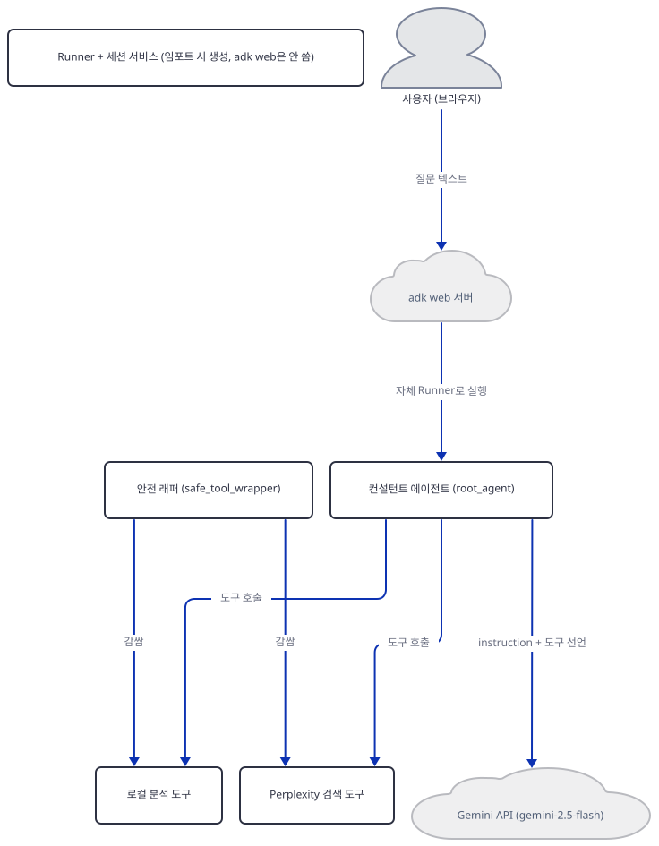

## 사전 준비

| 서비스/도구 | 용도 | 발급·설치 |
|---|---|---|
| Google AI Studio API 키 (`GOOGLE_API_KEY`) | `gemini-2.5-flash` 호출 인증. 사이드바가 아니라 `adk web`을 띄우기 **전에 셸 환경변수로**(`export GOOGLE_API_KEY=...`, PowerShell은 `$env:GOOGLE_API_KEY="..."`) 설정하거나, `ai_consultant_agent/` 안에 `.env` 파일로 둔다 — `adk web`은 `cli/utils/envs.py`의 `load_dotenv_for_agent`로 에이전트 폴더의 `.env`를 자동으로 읽는다(소스로 확인, Day 014의 `.env.example` 방식과 같은 메커니즘). 이 문서는 키를 발급하지 않고 없을 때 어디서 멈추는지만 확인한다 | https://aistudio.google.com/apikey 가입 후 발급. `gemini-2.5-flash`는 폐기 예정은 아니지만 Google이 "이전에 실제로 써 본 사용자"로 접근을 제한하기 시작했다(https://ai.google.dev/gemini-api/docs/deprecations, 2026-09-29 확인) |
| Perplexity API 키 (`PERPLEXITY_API_KEY`) | `perplexity_search` 도구가 `sonar` 모델로 웹 검색할 때 인증. 이것도 셸 환경변수나 같은 `.env`로 설정한다. 이 문서는 발급하지 않는다 | https://www.perplexity.ai/settings/api 에서 발급 |
| uv | 가상환경 생성과 패키지 설치 | [공통 사전 준비](../README.md#공통-사전-준비-한-번만) 절 참고 |
| 인터넷 연결 | PyPI 설치, 키가 있다면 Gemini·Perplexity API 접속 | 별도 설치 없음 |

## 아키텍처 한눈에 보기

| 컴포넌트 | 역할 | 코드 위치 |
|---|---|---|
| 사용자 (브라우저) | ADK 개발자 웹 UI로 상담 질문 전송 | 코드 없음 (외부 UI) |
| `adk web` 서버 | `ai_consultant_agent` 폴더를 스캔·임포트해 FastAPI 앱과 채팅 UI를 자체 구동 (Day 014와 같은 CLI) | 코드 없음 (google-adk 2.10.0 CLI — 직접 확인) |
| 패키지 진입점 (`agent.py`, `__init__.py`) | 둘 다 `ai_consultant_agent.py`에서 `root_agent`를 재노출한다. `__init__.py`는 `session_service`·`runner`·`APP_NAME`과 `agent` 모듈까지 함께 내보내 `agent.py`보다 범위가 넓다 | `advanced_ai_agents/single_agent_apps/ai_consultant_agent/agent.py:1-5`, `advanced_ai_agents/single_agent_apps/ai_consultant_agent/__init__.py:1-5` |
| 컨설턴트 에이전트 (`root_agent`, `LlmAgent`) | `gemini-2.5-flash` 모델과 지시문, 도구 3개를 선언 | `advanced_ai_agents/single_agent_apps/ai_consultant_agent/ai_consultant_agent.py:266-273` |
| 도구 안전 래퍼 (`safe_tool_wrapper`) | 예외를 dict로 바꾸고 `bytes`를 정리하며, `@wraps`로 원본 시그니처를 유지 | `advanced_ai_agents/single_agent_apps/ai_consultant_agent/ai_consultant_agent.py:52-77` |
| 로컬 분석 도구 (`analyze_market_data`, `generate_strategic_recommendations`) | 키워드 매칭으로 미리 정해 둔 인사이트·추천을 반환 (시뮬레이션 — `analyze_market_data`는 코드 주석이 스스로 밝히고, `generate_strategic_recommendations`는 소스로 확인) | `advanced_ai_agents/single_agent_apps/ai_consultant_agent/ai_consultant_agent.py:87-133`, `advanced_ai_agents/single_agent_apps/ai_consultant_agent/ai_consultant_agent.py:135-192` |
| Perplexity 검색 도구 (`perplexity_search`) | `requests.post`로 Perplexity Sonar에 실제 HTTPS 요청 | `advanced_ai_agents/single_agent_apps/ai_consultant_agent/ai_consultant_agent.py:194-213` |
| Runner + `InMemorySessionService` | 모듈을 임포트하는 순간(함수 호출이 아니라 최상위 코드) 함께 생성되지만, `adk web`은 이 인스턴스를 쓰지 않고 `_create_runner`로 자기 것을 따로 만든다 | `advanced_ai_agents/single_agent_apps/ai_consultant_agent/ai_consultant_agent.py:276-281` |
| Gemini API (`gemini-2.5-flash`) | 실제 추론과 도구 호출 결정 | 코드 없음 (외부 서비스) |
| Perplexity API (`sonar`) | 실제 웹 검색 | 코드 없음 (외부 서비스) |

## 단계별 진행

### Step 1. 환경 만들기 — README의 `cd` 한 줄이 가리키는 곳이 다르다

**목적.** 격리된 가상환경에 4줄짜리 `requirements.txt`를 설치하고, 앱 자신의 README가 안내하는 설치 명령이 실제로 그대로 되는지 확인합니다.

**할 일.**

```bash
cd advanced_ai_agents/single_agent_apps/ai_consultant_agent
uv venv
uv pip install -r requirements.txt
```

(pip 대안: `python -m venv .venv && source .venv/bin/activate && pip install -r requirements.txt`. Windows PowerShell은 활성화만 `.venv\Scripts\Activate.ps1`로 바꿉니다. `uv venv`가 만든 환경엔 pip이 없어 `pip install`을 그대로 쓰면 실패한다는 것은 Day 014에서 이미 확인했으므로 위 명령은 처음부터 `uv pip install`을 씁니다.)

이 저장소는 루트에 `pyproject.toml`이 있어 `uv run`이 방금 만든 환경 대신 루트의 `.venv`를 쓰므로, 이후 `uv run` 명령에는 모두 `--no-project`를 붙입니다.

`advanced_ai_agents/single_agent_apps/ai_consultant_agent/requirements.txt:1-4`

```text
google-adk>=1.5.0
google-genai>=0.3.0
python-dotenv>=1.0.0
pydantic>=2.0.0
```

(4줄, 마지막 줄에 개행이 없어 `wc -l`은 3으로 셉니다.) 직접 설치해 보면 **google-adk 2.10.0**, **google-genai 2.25.0**이 받아집니다. 그런데 `python-dotenv`는 `load_dotenv()` 호출이 파일 어디에도 없고(전체 검색으로 확인), `pydantic`도 이 파일에서 직접 임포트되지 않습니다(둘 다 google-adk의 의존 패키지로 어차피 함께 설치됩니다) — 두 줄은 이 앱 자신의 코드에는 쓰이지 않는 선언입니다. 앱 자신의 `README.md`는 클론 뒤 `cd advanced_ai_agents/single_agent_apps`까지만 이동한 상태에서 곧바로 `pip install -r requirements.txt`를 실행하라고 안내하는데(`advanced_ai_agents/single_agent_apps/ai_consultant_agent/README.md:39-45`), `requirements.txt`는 그보다 한 단계 아래인 `ai_consultant_agent/`에 있어 그 자리에서는 파일을 찾지 못합니다(직접 확인 — `single_agent_apps`에는 이 파일이 없습니다). 위 Step처럼 `ai_consultant_agent` 폴더까지 들어와야 합니다.

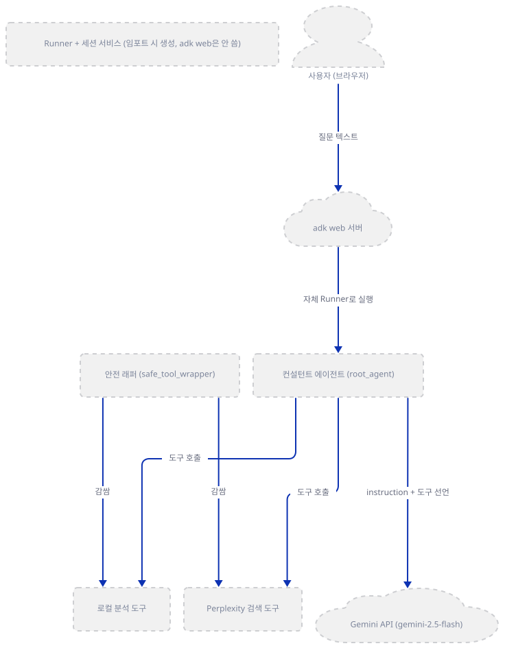

**확인.**

```bash
uv run --no-project python -c "import google.adk, google.genai; print('google-adk', google.adk.__version__); print('google-genai', google.genai.__version__)"
```

```
google-adk 2.10.0
google-genai 2.25.0
```

(설치 시점에 따라 버전은 다를 수 있습니다 — 위 값은 이 문서를 작성하며 직접 확인한 값입니다.)

### Step 2. 에이전트 선언과 지시문 — 도구 이름은 있지만 쓰이지 않는 임포트도 있다

**목적.** `root_agent`가 무엇으로 구성되는지, 그리고 지시문이 세 도구를 어떤 순서로 쓰라고 시키는지 확인합니다.

**할 일.** 패키지 진입점 두 개를 먼저 봅니다.

`advanced_ai_agents/single_agent_apps/ai_consultant_agent/agent.py:1-5`

```python

from .ai_consultant_agent import root_agent

# Export for ADK CLI discovery
__all__ = ['root_agent']
```

`advanced_ai_agents/single_agent_apps/ai_consultant_agent/__init__.py:1-5`

```python

from .ai_consultant_agent import root_agent, session_service, runner, APP_NAME
from . import agent

__all__ = ['root_agent', 'session_service', 'runner', 'APP_NAME', 'agent']
```

두 파일 모두 `root_agent`를 재노출하는 얇은 껍데기입니다. `__init__.py`가 `from . import agent`로 `agent.py`까지 임포트하므로 실제로는 `ai_consultant_agent.py`가 두 경로로 한 번씩 참조되지만, 파이썬 모듈 캐시 덕분에 실행은 한 번만 됩니다. 진짜 선언은 `ai_consultant_agent.py`에 있습니다.

`advanced_ai_agents/single_agent_apps/ai_consultant_agent/ai_consultant_agent.py:266-273`

```python
root_agent = LlmAgent(
    model=MODEL_ID,
    name=APP_NAME,
    description="An AI business consultant that provides market research, strategic analysis, and actionable recommendations.",
    instruction=INSTRUCTIONS,
    tools=consultant_tools,
    output_key="consultation_response"
)
```

`output_key="consultation_response"`는 Day 016에서 이미 다룬 파라미터로, 모델 응답이 끝나는 즉시 `event.actions.state_delta[self.output_key]`에 값을 넣습니다(Step 6에서 이 세션이 누구 것인지 다시 다룹니다). 지시문(`INSTRUCTIONS`, 222~263행, 42줄)은 도구 사용 순서를 명시적으로 못박습니다.

`advanced_ai_agents/single_agent_apps/ai_consultant_agent/ai_consultant_agent.py:222-236`

```python
INSTRUCTIONS = """You are a senior AI business consultant specializing in market analysis and strategic planning.

Your expertise includes:
- Business strategy development and recommendations
- Risk assessment and mitigation planning
- Implementation planning with timelines
- Market analysis using your knowledge and available tools
- Real-time web research using Perplexity AI search capabilities

When consulting with clients:
1. Use Perplexity search to gather current market data, competitor information, and industry trends from the web
2. Use the market analysis tool to process business queries and generate insights
3. Use the strategic recommendations tool to create actionable business advice
4. Provide clear, specific recommendations with implementation timelines
5. Focus on practical solutions that drive measurable business outcomes
```

나머지(237~263행)는 "핵심 책임"·"엄수 규칙"·"검색 전략" 세 단락을 더 얹어 같은 순서(검색 → 분석 → 추천)를 거듭 강조합니다. 그런데 정작 11행에서 `from google.adk.tools import google_search`로 임포트해 둔 ADK 내장 검색 도구는 `consultant_tools` 리스트 어디에도 들어가지 않습니다(전체 검색으로 확인) — 죽은 임포트입니다. 실제로 쓰이는 도구는 아래 Step에서 다루는 세 개뿐입니다.

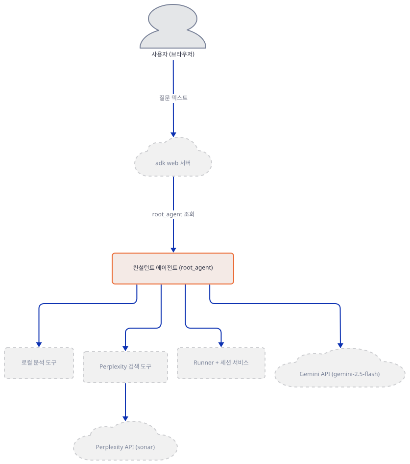

**확인.**

```bash
cd ..
uv run --no-project --python ai_consultant_agent/.venv python -c "
from ai_consultant_agent import root_agent
print(root_agent.name, '|', root_agent.model, '|', root_agent.output_key)
print('tools:', [t.__name__ for t in root_agent.tools])
"
```

(`cd ..`로 `ai_consultant_agent`의 부모 폴더 — `single_agent_apps` — 로 나옵니다. 이 폴더 임포트는 `ai_consultant_agent`가 패키지로 보이는 부모 폴더에서만 되는데, 가상환경은 자식 폴더의 `ai_consultant_agent/.venv`에 있어 `uv run`이 기본으로는 못 찾고 다른 인터프리터를 집어 `ModuleNotFoundError: No module named 'requests'`로 실패합니다 — `--python ai_consultant_agent/.venv`로 그 가상환경을 직접 가리켜야 합니다(직접 확인).)

```
ai_consultant_agent | gemini-2.5-flash | consultation_response
tools: ['analyze_market_data', 'generate_strategic_recommendations', 'perplexity_search']
```

### Step 3. 도구 안전 래퍼 — 예외를 삼키고 `bytes`를 정리하면서 시그니처는 지킨다

**목적.** `safe_tool_wrapper`가 실제로 무엇을 감싸는지 직접 실험으로 확인합니다.

**할 일.** 전체 26줄을 봅니다.

`advanced_ai_agents/single_agent_apps/ai_consultant_agent/ai_consultant_agent.py:52-77`

```python
def safe_tool_wrapper(tool_func):
    """
    Wrapper to ensure tool functions never return bytes objects.
    
    Args:
        tool_func: The original tool function
        
    Returns:
        Wrapped function that sanitizes output
    """
    @wraps(tool_func)
    def wrapped_tool(*args, **kwargs):
        try:
            result = tool_func(*args, **kwargs)
            return sanitize_bytes_for_json(result)
        except Exception as e:
            logger.error(f"Error in tool {tool_func.__name__}: {e}")
            return {
                "error": f"Tool execution failed: {str(e)}",
                "tool": tool_func.__name__,
                "status": "error"
            }

    # @wraps copies __wrapped__ so ADK's inspect.signature() sees the real
    # parameters (a bare *args/**kwargs wrapper is declared to Gemini with none).
    return wrapped_tool
```

`wrapped_tool(*args, **kwargs)`만 놓고 보면 ADK가 스키마를 뽑을 때 파라미터가 하나도 없는 함수로 오인할 위험이 있습니다 — 코드 자신의 주석(75~76행)이 바로 이 문제와 `@wraps`가 그것을 막는 이유를 적어 뒀습니다. `bytes` 정리는 별도 함수(`sanitize_bytes_for_json`, 26~50행)가 맡는데, UTF-8로 디코드되면 문자열로, 안 되면 base64 문자열로 바꿉니다.

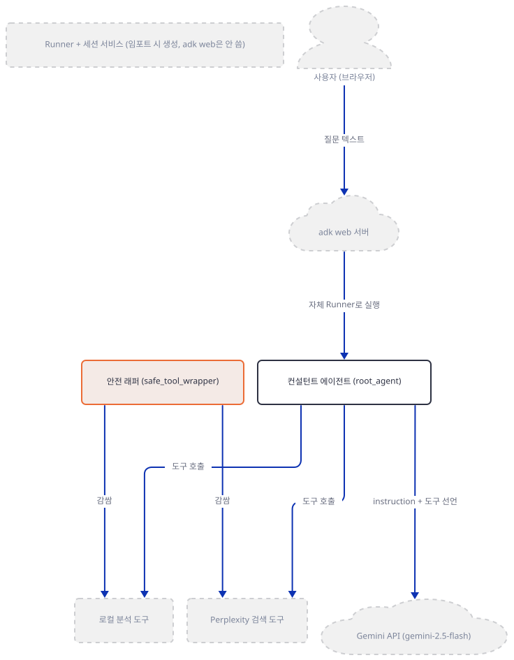

`safe_tool_wrapper`가 실제로 감싸는 도구는 둘(로컬 분석 도구, Perplexity 검색 도구)이고 각각 받는 인자가 다릅니다 — 개요 그림 한 장에 다 넣으면 너무 빽빽해져서, 이 관계만 따로 그렸습니다.

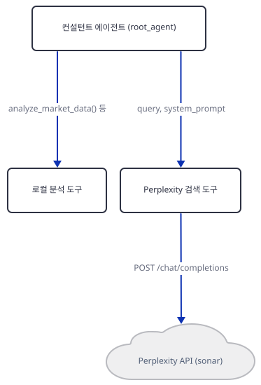

**확인.** 직접 가짜 도구 두 개(bytes를 반환하는 것, 예외를 던지는 것)로 실험합니다.

```bash
uv run --no-project --python ai_consultant_agent/.venv python -c "
import inspect
from ai_consultant_agent.ai_consultant_agent import safe_tool_wrapper

def bytes_tool(x: str) -> dict:
    '''returns bytes'''
    return {'raw': b'hello-bytes', 'nested': [b'a', {'k': b'\xff\xfe'}]}

def broken_tool(x: str) -> dict:
    '''raises'''
    raise ValueError('boom')

wrapped_bytes = safe_tool_wrapper(bytes_tool)
wrapped_broken = safe_tool_wrapper(broken_tool)
print('signature:', inspect.signature(wrapped_bytes))
print('bytes result:', wrapped_bytes('q'))
print('error result:', wrapped_broken('q'))
"
```

(Step 2와 같은 이유로 `single_agent_apps`에서, `--python`으로 `ai_consultant_agent/.venv`를 직접 가리켜 실행합니다.)

```
signature: (x: str) -> dict
bytes result: {'raw': 'hello-bytes', 'nested': ['a', {'k': '//4='}]}
error result: {'error': 'Tool execution failed: boom', 'tool': 'broken_tool', 'status': 'error'}
```

(앱이 `logging.basicConfig(level=logging.INFO)`를 걸어 둬서(23행) `stderr`에 `ERROR:ai_consultant_agent.ai_consultant_agent:Error in tool broken_tool: boom` 로그 한 줄이 위 출력과 섞여 찍힙니다 — `logger.error(...)` 호출 때문입니다, 68행.)

`inspect.signature`가 `(*args, **kwargs)`가 아니라 원본 그대로인 `(x: str) -> dict`를 돌려주고, `bytes`가 전부 문자열이 됐으며, 예외가 서버를 죽이지 않고 구조화된 dict로 바뀐 것을 직접 확인했습니다.

### Step 4. 로컬 분석 도구 — 진짜 분석이 아니라 키워드 매칭

**목적.** `analyze_market_data`·`generate_strategic_recommendations`가 실제로 무엇을 하는지 확인합니다.

**할 일.** `analyze_market_data`의 핵심부만 봅니다(전체는 47줄).

`advanced_ai_agents/single_agent_apps/ai_consultant_agent/ai_consultant_agent.py:87-117`

```python
def analyze_market_data(research_query: str, industry: str = "") -> Dict[str, Any]:
    """
    Analyze market data and generate insights
    
    Args:
        research_query: The business query to analyze
        industry: Optional industry context
        
    Returns:
        Market analysis insights and recommendations
    """
    # Simulate market analysis - in real implementation this would process actual search results
    insights = []
    
    if "startup" in research_query.lower() or "launch" in research_query.lower():
        insights.extend([
            MarketInsight("Market Opportunity", "Growing market with moderate competition", 0.8, "Market Research"),
            MarketInsight("Risk Assessment", "Standard startup risks apply - funding, competition", 0.7, "Analysis"),
            MarketInsight("Recommendation", "Conduct MVP testing before full launch", 0.9, "Strategic Planning")
        ])
    
    if "saas" in research_query.lower() or "software" in research_query.lower():
        insights.extend([
            MarketInsight("Technology Trend", "Cloud-based solutions gaining adoption", 0.9, "Tech Analysis"),
            MarketInsight("Customer Behavior", "Businesses prefer subscription models", 0.8, "Market Study")
        ])
    
    if industry:
        insights.append(
            MarketInsight("Industry Specific", f"{industry} sector shows growth potential", 0.7, "Industry Report")
        )
```

98행의 주석이 스스로 인정하듯 이것은 시뮬레이션입니다 — 질문에 "startup"·"launch"·"saas"·"software" 같은 단어가 있는지만 보고 미리 써 둔 `MarketInsight` 객체를 그대로 돌려줍니다. `generate_strategic_recommendations`(135~192행)도 같은 패턴으로, 인사이트의 `finding` 문자열에 "startup"·"saas"가 있는지만 보고 미리 정해 둔 추천 dict를 반환하며, 무엇이 들어오든 "Risk Management" 추천 하나는 항상 포함됩니다(178~190행).

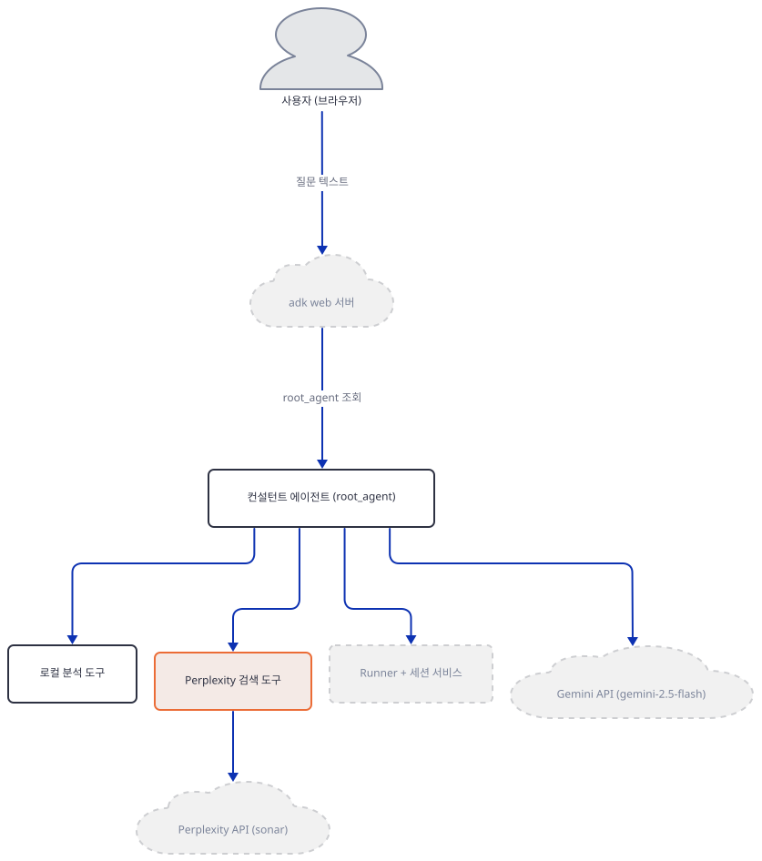

**확인.**

```bash
uv run --no-project --python ai_consultant_agent/.venv python -c "
from ai_consultant_agent.ai_consultant_agent import analyze_market_data, generate_strategic_recommendations
r = analyze_market_data('I want to launch a SaaS startup', 'fintech')
print('insights:', r['total_insights'])
rec = generate_strategic_recommendations(r)
print('first recommendation:', rec[0]['category'], '|', rec[0]['recommendation'])
"
```

(Step 2와 같은 이유로 `single_agent_apps`에서, `--python`으로 `ai_consultant_agent/.venv`를 직접 가리켜 실행합니다.)

```
insights: 6
first recommendation: Market Entry Strategy | Implement phased market entry with MVP testing
```

"SaaS"·"startup"·"launch" 세 단어가 모두 들어간 질문이라 `analyze_market_data`의 세 `if` 블록이 전부 걸려 인사이트 6개가 나왔습니다 — 실제 시장 데이터를 조사한 결과가 아니라 단어 매칭의 결과입니다.

### Step 5. Perplexity 검색 도구 — 키 확인이 네트워크 호출보다 먼저다

**목적.** 세 도구 중 유일하게 실제 외부 API를 부르는 `perplexity_search`가 키 없이 어디서 멈추는지 확인합니다.

**할 일.** 전체 20줄을 봅니다.

`advanced_ai_agents/single_agent_apps/ai_consultant_agent/ai_consultant_agent.py:194-213`

```python
def perplexity_search(query: str, system_prompt: str = "Be precise and concise. Focus on business insights and market data.") -> Dict[str, Any]:
    """Search the web using Perplexity AI for real-time information and insights."""
    try:
        api_key = os.getenv("PERPLEXITY_API_KEY")
        if not api_key:
            return {"error": "Perplexity API key not found. Please set PERPLEXITY_API_KEY environment variable.", "query": query, "status": "error"}
        
        response = requests.post("https://api.perplexity.ai/chat/completions", 
            json={"model": "sonar", "messages": [{"role": "system", "content": system_prompt}, {"role": "user", "content": query}]},
            headers={"Authorization": f"Bearer {api_key}", "Content-Type": "application/json"}, timeout=30)
        response.raise_for_status()
        result = response.json()
        
        if "choices" in result and result["choices"]:
            return {"query": query, "content": result["choices"][0]["message"]["content"], "citations": result.get("citations", []), 
                   "search_results": result.get("search_results", []), "status": "success", "source": "Perplexity AI", 
                   "model": result.get("model", "sonar"), "usage": result.get("usage", {}), "response_id": result.get("id", ""), "created": result.get("created", 0)}
        return {"error": "No response content found", "query": query, "status": "error", "raw_response": result}
    except Exception as e:
        return {"error": f"Error: {str(e)}", "query": query, "status": "error"}
```

197~199행이 핵심입니다 — `requests.post`를 부르기 **전에** `PERPLEXITY_API_KEY`가 있는지부터 확인하고, 없으면 그 자리에서 에러 dict를 돌려줍니다. 즉 키가 없는 이 문서의 환경에서는 이 함수를 직접 호출해도 실제 네트워크 요청이 전혀 나가지 않습니다 — Day 014의 Gemini 클라이언트(생성 시점에 키를 확인)와 달리 이 함수는 자체 검사로 그보다 먼저 멈춥니다.

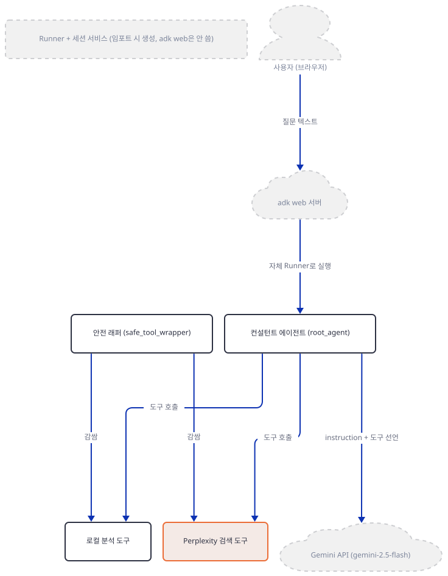

**확인.**

```bash
uv run --no-project --python ai_consultant_agent/.venv python -c "
from ai_consultant_agent.ai_consultant_agent import perplexity_search
print(perplexity_search('current market size'))
"
```

(Step 2와 같은 이유로 `single_agent_apps`에서, `--python`으로 `ai_consultant_agent/.venv`를 직접 가리켜 실행합니다. `PERPLEXITY_API_KEY`를 설정하지 않은 상태입니다.)

```
{'error': 'Perplexity API key not found. Please set PERPLEXITY_API_KEY environment variable.', 'query': 'current market size', 'status': 'error'}
```

### Step 6. Runner와 세션 서비스 — 만들어지지만 `adk web`은 쓰지 않는다

**목적.** `Runner`·`InMemorySessionService`가 함수 호출이 아니라 모듈 최상위 코드로 선언되어, 이 모듈을 임포트하는 순간 자동으로 만들어진다는 것을 확인합니다. 그리고 `adk web`은 이 객체들을 쓰지 않고 **자기 자신의** Runner와 세션 서비스를 따로 만든다는 것도 함께 확인합니다. `Runner`·세션 서비스 자체의 역할은 Day 077에서 이미 다뤘으므로 여기서는 누가 무엇을 만들고 누가 그것을 실제로 쓰는지만 봅니다.

**할 일.**

`advanced_ai_agents/single_agent_apps/ai_consultant_agent/ai_consultant_agent.py:276-281`

```python
session_service = InMemorySessionService()
runner = Runner(
    agent=root_agent,
    app_name=APP_NAME,
    session_service=session_service
)
```

`if __name__ == "__main__":` 블록(283행부터) 밖에 있으므로, 이 파일을 그냥 `import`하기만 해도 (직접 실행하지 않아도) `runner`와 `session_service`가 즉시 만들어집니다. 그런데 `adk web`은 `agent_loader.py`(google-adk 2.10.0)로 패키지에서 `root_agent`만 가져오고, `api_server.py`의 `_create_runner`로 **자기 자신의** `Runner`와 세션 서비스를 새로 만듭니다(소스로 확인) — 이 파일의 `runner`·`session_service` 변수는 아무도 참조하지 않습니다. 이 둘이 실제로 쓰이는 곳은 `__main__` 블록의 안내 출력(309~310행)뿐이고, 그것도 `type(runner).__name__`처럼 타입 이름만 찍습니다. Step 7에서 `POST /apps/.../sessions/s1`로 만드는 세션과 `consultation_response`가 저장되는 세션은 `adk web` 자신의 세션 서비스이지, 여기서 만든 `session_service`가 아닙니다.

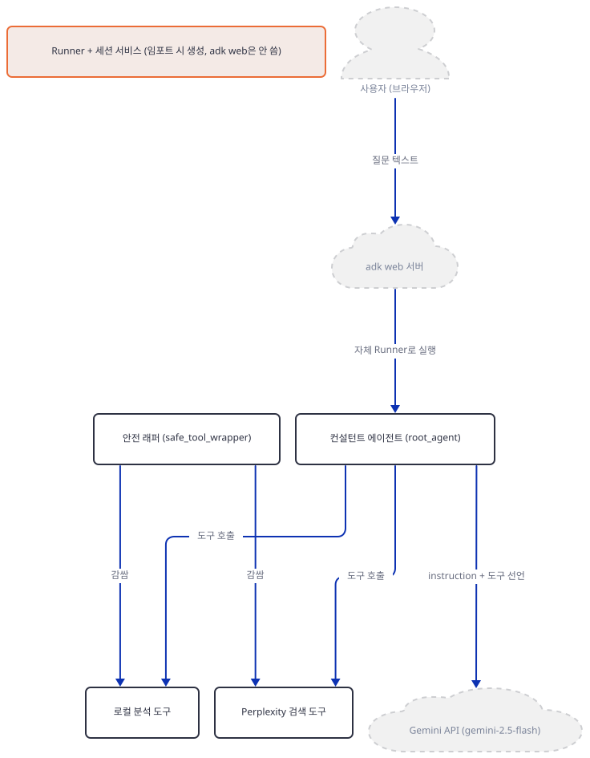

**확인.**

```bash
uv run --no-project --python ai_consultant_agent/.venv python -c "
from ai_consultant_agent.ai_consultant_agent import runner, session_service
print(type(runner).__name__, '|', type(session_service).__name__)
"
```

(Step 2와 같은 이유로 `single_agent_apps`에서, `--python`으로 `ai_consultant_agent/.venv`를 직접 가리켜 실행합니다.)

```
Runner | InMemorySessionService
```

(임포트만 했을 뿐 `adk web`도, `Runner(...)` 호출도 따로 하지 않았는데 두 객체가 이미 존재합니다 — 다만 이 인스턴스들은 `adk web`이 만드는 것과는 다른, 아무도 쓰지 않는 별개의 객체입니다.)

### Step 7. `adk web`으로 띄우기 — 폴더 하나만 가리켜 다른 앱을 안 건드린다

**목적.** 이 앱을 실제로 띄우고, 키 없이 세션을 만들면 정확히 어디서 멈추는지 Day 014와 같은 방식으로 직접 확인합니다. 이번엔 `single_agent_apps` 전체가 아니라 `ai_consultant_agent` 폴더 하나만 가리켜, 그 옆의 수십 개 다른 앱을 건드리지 않는 실행 방법도 함께 확인합니다.

**할 일.** `ai_consultant_agent` 폴더 **안에서** 실행합니다.

```bash
cd advanced_ai_agents/single_agent_apps/ai_consultant_agent
uv run --no-project adk web --no_use_local_storage .
```

`adk` 계열 명령을 대화형 터미널(`sys.stdin.isatty()`)에서 처음 실행하면 Day 014에서 이미 본 텔레메트리 동의 프롬프트가 뜨고, 답하면 `~/.adk/config.json`에 동의 여부가 저장됩니다 — 이건 문제가 아니라 정상 설정 파일입니다(`google/adk/utils/_telemetry_config.py`, 프롬프트 문구도 "This is OFF by default"). 이 경로는 `pathlib.Path.home()`인데, 이 함수는 Windows에서 `USERPROFILE`, macOS/Linux에서 `HOME` 환경변수를 그대로 따르므로(소스로 확인) 위치를 스크래치로 돌리고 싶으면 그 변수를 바꾸면 됩니다 — "고정 경로"가 아닙니다. 또한 이 동의 코드 자체가 `sys.stdin.isatty()`일 때만 실행되므로(`cli_tools_click.py`), 이 문서처럼 비대화형으로 `adk web`만 띄우면 아무 파일도 쓰지 않습니다(직접 확인) — 파일이 생기는 것은 프롬프트에 답하거나 `adk telemetry enable`/`disable`을 직접 칠 때뿐입니다. `.`을 `single_agent_apps`가 아니라 이 폴더 자체로 준 것은 `adk web --help`가 밝히는 대로 이 버전의 AGENTS_DIR이 "여러 에이전트가 든 폴더"뿐 아니라 "에이전트 폴더 하나를 직접 가리키는 경로"도 받기 때문입니다(직접 확인 — 저장소에는 없는 가짜 옆 폴더를 스크래치에 만들어 두고 `/list-apps`를 불러도 그 폴더는 목록에 없었습니다).

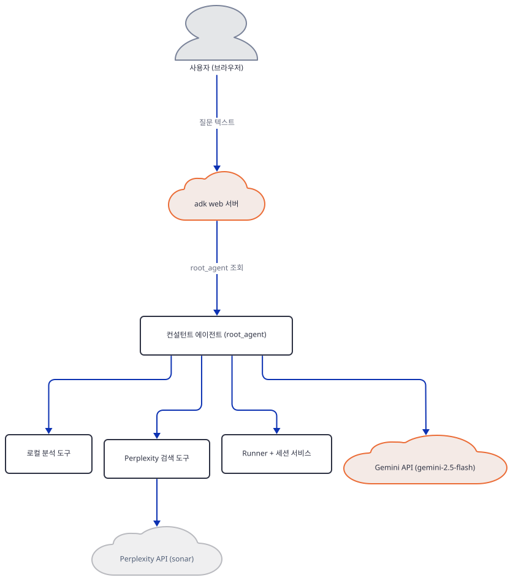

**확인.** 배너가 뜬 뒤, 다른 터미널에서 목록부터 봅니다.

```bash
curl.exe -s http://127.0.0.1:8000/list-apps
```

```
["ai_consultant_agent"]
```

세션을 만들고 메시지를 보냅니다.

```bash
curl.exe -s -X POST "http://127.0.0.1:8000/apps/ai_consultant_agent/users/u1/sessions/s1" -H "Content-Type: application/json" -d "{}"
curl.exe -s -o /dev/null -w "HTTP %{http_code}\n" -X POST http://127.0.0.1:8000/run -H "Content-Type: application/json" -d '{"appName":"ai_consultant_agent","userId":"u1","sessionId":"s1","newMessage":{"role":"user","parts":[{"text":"I want to launch a SaaS startup"}]}}'
```

```
HTTP 500
```

서버 터미널에는 Day 014와 정확히 같은 마지막 줄이 찍힙니다(직접 확인, 발췌).

```
ValueError: No API key was provided. Please pass a valid API key. Learn how to create an API key at https://ai.google.dev/gemini-api/docs/api-key.
```

`root_agent` 조회, 지시문·도구 선언 조립까지는 전부 성공하고, ADK가 `gemini-2.5-flash`를 실제로 호출하려고 `google-genai`의 `Client`를 만드는 바로 그 순간에만 멈춥니다 — Perplexity 검색이 필요한지 여부와 무관하게, 첫 Gemini 호출 자체가 이 지점에서 끊깁니다.

## 요청 한 건이 흐르는 과정

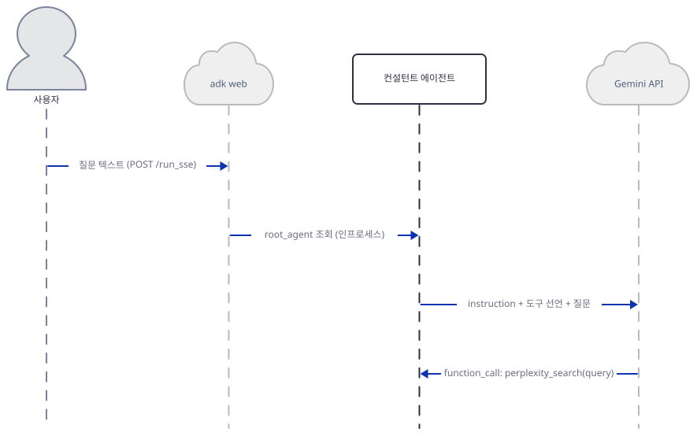

사용자가 ADK 개발자 웹 UI로 질문을 보내면 실제로는 `POST /run_sse`로 스트리밍 응답을 받습니다(google-adk 2.10.0의 웹 UI 번들 `cli/browser/main-45TAU4AN.js`에서 `runSse()`가 이 경로를 부르는 것을 확인) — 이 문서의 Step 7 `curl` 명령이 쓰는 `/run`은 스트리밍이 아닌 대안 경로입니다. 어느 쪽이든 서버는 `agent_loader.py`로 이미 찾아 둔 `root_agent`를 조회해(Step 6에서 확인했듯 이때 `adk web` 자신의 Runner·세션 서비스를 새로 만듭니다), Gemini에 instruction과 세 도구의 선언을 담아 첫 추론을 요청합니다. 지시문이 시킨 순서대로 Gemini가 먼저 `perplexity_search`의 `function_call`을 돌려주면, `root_agent`는 `safe_tool_wrapper`(그림의 "도구 안전 래퍼")가 감싼 실제 함수를 실행합니다 — 이 순간에만 `POST /chat/completions`로 Perplexity에 진짜 HTTPS 요청이 나갑니다. 결과가 `bytes` 없는 dict로 정리되어 Gemini에 `function_response`로 돌아가면, 이어서 두 번째 그림(아래)이 시작됩니다.

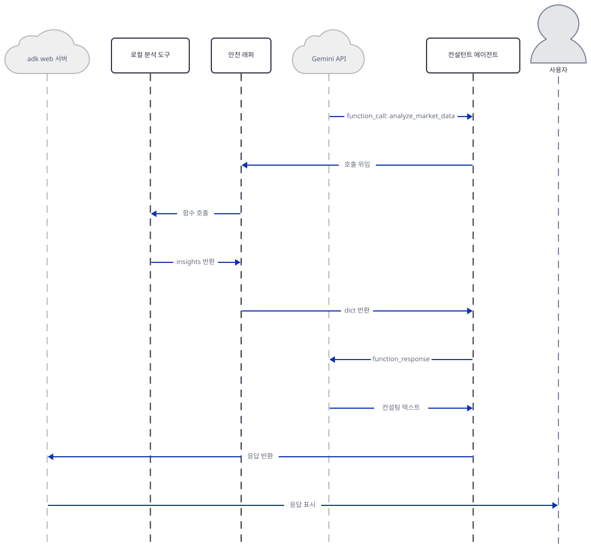

Gemini가 이번엔 `analyze_market_data`의 `function_call`을 돌려주고, 이 호출도 `safe_tool_wrapper`를 거치되 네트워크로는 전혀 나가지 않습니다 — 미리 써 둔 `MarketInsight` 인사이트를 키워드 매칭으로 골라 그대로 반환합니다(지시문은 이어서 `generate_strategic_recommendations`도 쓰라고 시키지만, 이 함수는 `analyze_market_data`와 완전히 같은 모양의 왕복이라 그림에는 대표로 하나만 그렸습니다 — 소스는 `ai_consultant_agent.py:135-192`). 그 결과까지 받은 Gemini가 마지막으로 생성한 컨설팅 텍스트가 `consultation_response`라는 이름으로 **`adk web` 자신의 세션**(Step 7에서 `POST /apps/.../sessions/s1`로 만든 것) 상태에 저장되고, `adk web`이 이를 그대로 사용자에게 표시합니다 — 이 앱의 모듈 최상위 `session_service`(Step 6)가 아닙니다. 이 문서는 키가 없어 이 마지막 두 단계(Gemini의 실제 추론과 최종 텍스트 생성)까지는 직접 관찰하지 못했고, Step 7에서 확인한 것처럼 첫 Gemini 호출 자체가 `ValueError`로 끊기는 지점 이전까지만 실제로 실행했습니다.

## 실행 체크리스트

- [ ] `uv venv && uv pip install -r requirements.txt`로 설치하고, 앱 자신의 README가 안내하는 `cd` 위치가 실제로는 한 단계 얕다는 것을 확인했다
- [ ] `agent.py`와 `__init__.py`가 둘 다 `root_agent`를 재노출하는 얇은 껍데기라는 것을 직접 읽었다
- [ ] `google_search`가 임포트만 되고 `tools=[...]`에는 들어가지 않는 죽은 줄이라는 것을 전체 검색으로 확인했다
- [ ] `safe_tool_wrapper`로 감싼 가짜 도구 두 개를 직접 만들어, 시그니처 유지·`bytes` 정리·예외 처리를 각각 확인했다
- [ ] `analyze_market_data`를 직접 호출해, 실제 시장 조사가 아니라 키워드 매칭이라는 것을 확인했다
- [ ] `perplexity_search`를 키 없이 호출해, `requests.post`가 나가기 전에 자체적으로 멈춘다는 것을 확인했다
- [ ] `runner`·`session_service`가 함수 호출 없이 임포트만으로 생성된다는 것을 확인했다
- [ ] `adk web`을 `ai_consultant_agent` 폴더 안에서 띄우고 `/list-apps`·`/run`으로 Day 014와 같은 `ValueError` 지점을 재현했다

## 문제 해결

| 증상 | 원인 | 해결 |
|---|---|---|
| 앱 자신의 README대로 `cd advanced_ai_agents/single_agent_apps` 후 `pip install -r requirements.txt`를 실행하면 파일을 찾지 못함 | `requirements.txt`가 그보다 한 단계 아래인 `ai_consultant_agent/`에 있다(직접 확인) | `cd ai_consultant_agent`까지 한 단계 더 들어간 뒤 설치 |
| `adk` 계열 명령을 대화형 터미널에서 실행할 때마다 텔레메트리 동의 프롬프트가 다시 뜬다 | 아직 `~/.adk/config.json`에 동의 여부를 저장하지 않았다(`sys.stdin.isatty()`일 때만 묻는다, 소스로 확인) | 프롬프트에 한 번 답하거나 `adk telemetry disable`을 실행 — 이후로는 조용히 넘어간다 |
| `/run`에 메시지를 보내면 응답 본문이 `Internal Server Error`뿐이고 원인은 응답에 없음 | `GOOGLE_API_KEY`가 없으면 `google-genai`의 `Client` 생성자가 `ValueError`를 던지고 ADK는 이를 HTTP 500으로만 반환한다(Day 014에서 이미 확인한 것과 같은 지점) | `GOOGLE_API_KEY`를 셸 환경변수로 설정하고 서버 재시작. 원인은 서버 터미널 로그에서 확인 |
| Windows PowerShell에서 이 문서의 `curl` 명령이 매개변수 오류를 낸다 | PowerShell이 `curl`을 `Invoke-WebRequest`의 별칭으로 미리 정의해 둔다(Day 014에서 이미 확인) | `curl.exe`처럼 확장자를 붙여 호출 |

## 더 해보기

- `analyze_market_data`(`advanced_ai_agents/single_agent_apps/ai_consultant_agent/ai_consultant_agent.py:87-133`)의 `if "startup" in ...` 키워드 매칭을 실제 `perplexity_search` 결과의 `content` 텍스트를 분석하도록 바꿔보고, 반환되는 인사이트가 입력에 따라 실제로 달라지는지 비교해보기
- `google_search`(`advanced_ai_agents/single_agent_apps/ai_consultant_agent/ai_consultant_agent.py:11`에서 임포트만 되는 죽은 줄)를 `consultant_tools`에 실제로 추가해보고, `root_agent.tools`에 내장 도구와 함수 도구가 함께 등록되는지 Day 017의 방식으로 확인해보기
- 실제 `GOOGLE_API_KEY`와 `PERPLEXITY_API_KEY`를 발급받아 `adk web`으로 진짜 상담을 진행해보고, Eval 탭으로 세션을 저장해 재실행했을 때 같은 도구 호출 순서가 재현되는지 확인해보기

## 다음 날 예고

[Day 089 · 🚀 AI Product Launch Intelligence Agent](../day089-product-launch-intelligence-agent/README.md) — Streamlit + Agno(GPT-4o) + Firecrawl로 경쟁사 분석·시장 반응·출시 지표 세 전문 에이전트가 팀으로 협업하는 앱을 다룹니다(원본 앱 README 기준).
