# Day 089 · 🚀 AI Product Launch Intelligence Agent

> 볼륨 7 🚀 Advanced AI Agents · 난이도 ★★★ · 예상 소요 80분(coordinate 모드의 위임 메커니즘을 소스로 따라가고, FirecrawlTools 생성자 크래시를 여러 각도로 직접 재현하는 손 작업이 섞여 있습니다) · API 비용 실측 불가 — 두 키를 모두 넣는 순간 FirecrawlTools 생성자가 `TypeError`로 죽어 실행 자체가 막힙니다(Step 3, 직접 확인). 소스로 보면 분석 1건(불릿 생성 + 리포트 변환)마다 gpt-4o 호출이 리더의 위임·통합 판단과 멤버의 도구 호출 왕복을 합쳐 최소 5회 이상이고, 여기에 Firecrawl 검색·크롤링 비용이 더해집니다 · 원본 앱: `advanced_ai_agents/multi_agent_apps/product_launch_intelligence_agent`

## 오늘 만들 것

Day 078에서 시작한 "🚀 Advanced AI Agents" 볼륨의 열두 번째 앱이자, agno를 쓰는 여섯 번째 날입니다(078·079·081·086·087에 이어 — 그 사이 080(EvoAgentX)·083(OpenAI Agents SDK)·084(CrewAI)·085(AG2)·088(ADK)는 다른 프레임워크, 082는 프레임워크 없이 `google-genai`를 직접 씁니다, Day 086·087 README 확인). 483줄짜리 `product_launch_intelligence_agent.py`는 경쟁사 제품 출시를 분석하는 세 전문 `Agent`(Product Launch Analyst·Market Sentiment Specialist·Launch Metrics Specialist)를 하나의 `Team`으로 묶습니다. `Team`이 `mode=`를 지정하지 않으면 agno 3.0.11에서 `TeamMode.coordinate`로 정해지고 리더가 `delegate_task_to_member(member_id, task)` 도구로 멤버를 고른다는 것은 Day 079 Step 5가 이미 소스로 확인했고 Day 081도 같은 사실을 가리켰습니다(Step 4에서 되풀이하지 않습니다) — 오늘 다른 점은 멤버 셋이 각자 독립된 `OpenAIChat`·`FirecrawlTools`를 만들고, "어떤 멤버에게 시킬지"가 오직 자연어 `instructions`에만 의존한다는 것입니다. 회사명을 입력하고 세 탭(경쟁사 분석·시장 반응·출시 지표) 중 하나에서 버튼을 누르면, UI는 같은 `product_intelligence_team`에 `.run()`을 **두 번** 호출합니다 — 첫 번째는 태그가 붙은 불릿 최대 16개를 만들라는 프롬프트이고, 두 번째는 `expand_competitor_report()` 같은 헬퍼 함수가 그 불릿을 표·콜아웃이 섞인 마크다운 리포트로 다시 써 달라는 프롬프트입니다(`product_launch_intelligence_agent.py:134-199`).

이 문서를 쓰며 오늘(2026-09-29) 설치한 버전은 **agno 3.0.11**, **firecrawl 4.45.0**, **streamlit 1.64.0**입니다(직접 확인). `requirements.txt` 3줄에는 `openai`가 빠져 있어 `from agno.models.openai import OpenAIChat`가 `ModuleNotFoundError`를 거쳐 agno 자신의 `ImportError`(" `openai` not installed. Please install using `pip install openai`")로 막힙니다(직접 확인, Step 1) — `openai` 3.20.0을 추가로 깔면 통과합니다. 이 관문을 넘어도 이 앱은 `requirements.txt`가 허용하는 어떤 agno 버전으로도 뜨지 않습니다 — 최저 판 agno 2.2.10에서도 같은 오류를 직접 재현했습니다(문제 해결). 세 `Agent` 모두 도구를 `FirecrawlTools(search=True, crawl=True, poll_interval=10)`으로 만드는데(`product_launch_intelligence_agent.py:60,82,105`), agno 3.0.11의 `FirecrawlTools.__init__`이 실제로 받는 매개변수는 `search=`·`crawl=`가 아니라 `enable_search=`·`enable_crawl=`입니다(agno 3.0.11 `agno/tools/firecrawl.py`, 43~57행 부근, 소스로 확인) — 앱이 쓴 이름은 `**kwargs`로 흘러 들어가 `Toolkit.__init__(name=..., tools=..., **kwargs)`에 그대로 전달되고, `Toolkit`은 이런 여분의 키워드를 받지 않으므로 `TypeError: Toolkit.__init__() got an unexpected keyword argument 'search'`가 그 자리에서 터집니다. 사이드바에 OpenAI·Firecrawl 키를 **둘 다** 채우는 순간(`if openai_key and firecrawl_key:`, 45행) 이 생성자가 곧바로 실행되므로, 실제 네트워크 요청은커녕 첫 `Agent` 하나도 완성되지 못한 채 페이지 전체가 Streamlit의 빨간 예외 화면으로 바뀝니다 — Streamlit `AppTest`로 가짜 키 문자열 두 개만 넣고 직접 재현했습니다(Step 3). 사이드바의 "Quick Actions"는 J·K·L 키로 세 분석을 실행할 수 있다고 광고하지만(앱 자체 README도 같은 주장), 코드 전체를 검색해도 키보드 이벤트를 잇는 코드는 한 줄도 없습니다(Step 6). 아래는 완성된(그러나 오늘은 세 번째 스텝에서 막히는) 아키텍처입니다.

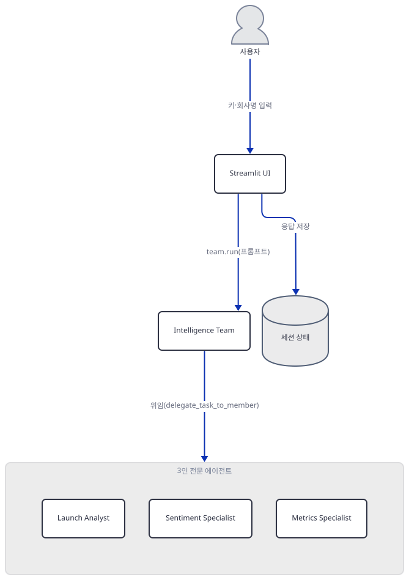

리더·멤버·도구·두 외부 API 사이의 구체적인 호출 관계는 별도 구조도에 그렸습니다(아키텍처 표 다음).

## 사전 준비

| 서비스/도구 | 용도 | 발급·설치 |
|---|---|---|
| OpenAI API 키 | 팀 리더와 세 전문 에이전트가 공유하는 `gpt-4o` 모델 호출 인증. 사이드바 입력창(`type="password"`)에 직접 붙여넣거나 `.env`의 `OPENAI_API_KEY`로 제공 | https://platform.openai.com/ 가입 후 발급 |
| Firecrawl API 키 | 세 에이전트의 `FirecrawlTools`가 쓰는 검색·크롤링 API 인증(사이드바 또는 `FIRECRAWL_API_KEY`) | https://www.firecrawl.dev/ 가입 후 발급 |
| uv | 가상환경 생성과 패키지 설치 | [공통 사전 준비](../README.md#공통-사전-준비-한-번만) 절 참고 |
| (주의) 실행 자체가 막혀 있음 | 두 키를 모두 넣는 순간 `FirecrawlTools` 생성자가 `TypeError`로 죽습니다(Step 3) — 오늘 버전 조합으로는 실제 키가 있어도 분석까지 갈 수 없습니다 | 재현하려면 코드의 `search=`·`crawl=`을 `enable_search=`·`enable_crawl=`로 고쳐야 합니다("더 해보기") |
| 인터넷 연결 | PyPI 설치, (코드를 고쳐 실행한다면) OpenAI·Firecrawl API 호출, agno의 익명 사용 통계 전송(Day 047 Step 5와 같은 사실 — 다만 이 앱은 크래시 때문에 `run()`에 도달하지 못해 오늘은 전송되지 않습니다) | 별도 설치 없음 |

## 아키텍처 한눈에 보기

| 컴포넌트 | 역할 | 코드 위치 |
|---|---|---|
| Streamlit UI | 페이지 설정, 사이드바 키 게이트, 회사명 입력, 3개 탭, 사이드바 상태판을 그림 | `product_launch_intelligence_agent.py:12-17`, `product_launch_intelligence_agent.py:23-42`, `product_launch_intelligence_agent.py:201-229` |
| Intelligence Team (Team) | `mode` 미지정 → coordinate 기본값. `delegate_task_to_member` 도구로 멤버 하나에게 위임 후 결과를 통합 | `product_launch_intelligence_agent.py:113-129` |
| Launch Analyst / Sentiment Specialist / Metrics Specialist (Agent) | 각자 `description`·`tools=[FirecrawlTools(...)]`을 갖는 독립 `Agent` 3개(같은 모델 id를 각자 새로 생성) | `product_launch_intelligence_agent.py:47-65`, `product_launch_intelligence_agent.py:68-87`, `product_launch_intelligence_agent.py:90-110` |
| FirecrawlTools (도구) | 세 에이전트가 각자 만드는 검색·크롤링 도구 래퍼 — 오늘 버전에서 생성자 자체가 실패 | `product_launch_intelligence_agent.py:60,82,105` |
| 외부 API (OpenAI gpt-4o · Firecrawl) | 실제 추론과 웹 검색·크롤링을 수행하는 서드파티 서비스 | 코드 없음 (외부 서비스) |
| 세션 상태 | 탭별 응답 3종(`competitor_response`·`sentiment_response`·`metrics_response`) 보관 | `product_launch_intelligence_agent.py:232-237`, `:288,350,412` |

전체 구조가 위 그림 하나에 다 들어가지 않아(세로 상한 1000px), 리더→멤버 위임과 멤버·도구·두 외부 API의 관계만 따로 그렸습니다.

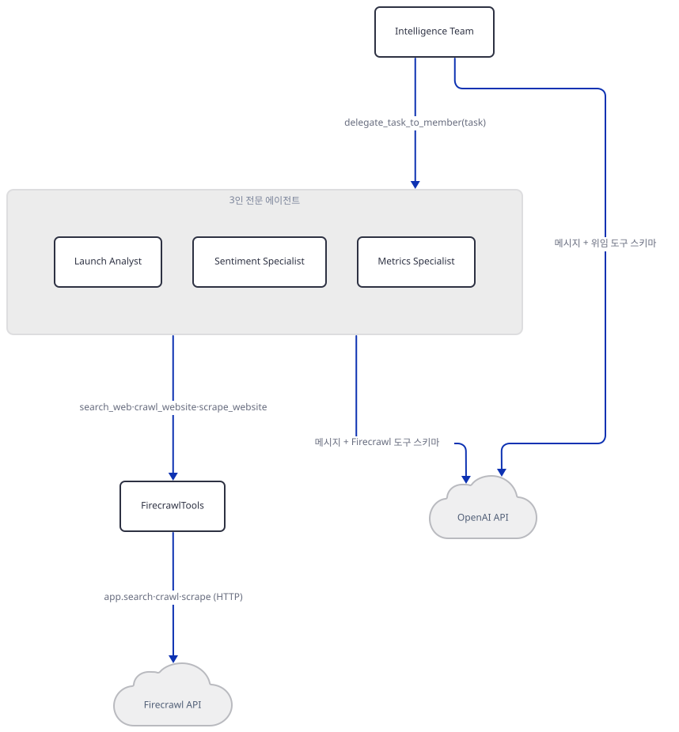

## 단계별 진행

### Step 1. 환경 만들기 — `openai` 패키지 누락

**목적.** 격리된 가상환경에 3줄짜리 `requirements.txt`를 설치하고, 오늘 실제로 풀리는 버전 조합에서 이 앱이 곧바로 임포트되는지 확인합니다.

**할 일.**

```bash
cd advanced_ai_agents/multi_agent_apps/product_launch_intelligence_agent
uv venv
uv pip install -r requirements.txt
```

(pip 대안: `python -m venv .venv && source .venv/bin/activate && pip install -r requirements.txt`. Windows PowerShell은 활성화만 `.venv\Scripts\Activate.ps1`로 바꿉니다.) 이 저장소 루트에는 `pyproject.toml`이 있어 이후 `uv run` 명령에는 모두 `--no-project`를 붙입니다.

`advanced_ai_agents/multi_agent_apps/product_launch_intelligence_agent/requirements.txt:1-3`

```text
streamlit
agno>=2.2.10
firecrawl
```

이 문서를 쓰며 설치했을 때는 **agno 3.0.11**, **firecrawl 4.45.0**, **streamlit 1.64.0**이 받아졌습니다(직접 확인). `py_compile`은 통과합니다.

```bash
uv run --no-project python -m py_compile product_launch_intelligence_agent.py && echo compiled
```

```
compiled
```

그런데 `agno.models.openai.OpenAIChat`을 임포트하면 막힙니다.

```bash
uv run --no-project python -c "from agno.models.openai import OpenAIChat"
```

직접 확인한 출력(발췌):

```
ModuleNotFoundError: No module named 'openai'
...
ImportError: `openai` not installed. Please install using `pip install openai`
```

`requirements.txt`가 `openai` 패키지 자체를 선언하지 않는데도 agno의 `OpenAIChat` 클래스는 내부에서 `from openai import APIConnectionError, ...`를 요구합니다(agno 3.0.11 `agno/models/openai/chat.py`, 24~31행 부근, 소스로 확인). 추가로 설치하면 통과합니다.

```bash
uv pip install openai
uv run --no-project python -c "from agno.models.openai import OpenAIChat; print('import ok')"
```

직접 확인한 출력:

```
import ok
```

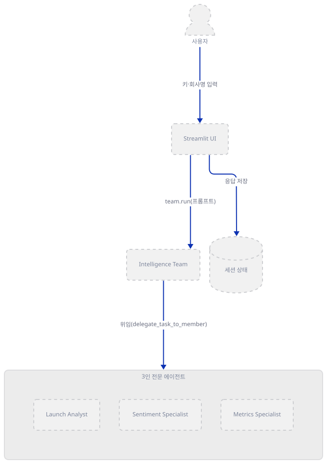

**확인.** 위 세 명령(`py_compile`, 임포트 실패, `openai` 설치 후 `import ok`)이 그대로 재현되는지 봅니다.

### Step 2. 페이지 설정과 사이드바 API 키 게이트

**목적.** 화면에 무엇이 먼저 뜨는지, 그리고 두 키가 어떻게 환경변수로 다시 쓰이는지 확인합니다.

**할 일.**

`product_launch_intelligence_agent.py:12-17`

```python
st.set_page_config(
    page_title="AI Product Intelligence Agent", 
    page_icon="🚀", 
    layout="wide",
    initial_sidebar_state="expanded"
)
```

`product_launch_intelligence_agent.py:23-42`

```python
st.sidebar.header("🔑 API Configuration")
with st.sidebar.container():
    openai_key = st.text_input(
        "OpenAI API Key", 
        type="password", 
        value=os.getenv("OPENAI_API_KEY", ""),
        help="Required for AI agent functionality"
    )
    firecrawl_key = st.text_input(
        "Firecrawl API Key", 
        type="password", 
        value=os.getenv("FIRECRAWL_API_KEY", ""),
        help="Required for web search and crawling"
    )

# Set environment variables
if openai_key:
    os.environ["OPENAI_API_KEY"] = openai_key
if firecrawl_key:
    os.environ["FIRECRAWL_API_KEY"] = firecrawl_key
```

두 입력창의 기본값은 `.env`나 환경변수에서 읽고(`os.getenv`), 사용자가 사이드바에 값을 넣으면 그 값이 다시 `os.environ`에 쓰입니다 — 이후 `Team`·`Agent`·`FirecrawlTools`가 생성될 때 읽는 것도 결국 이 환경변수입니다. 45행의 `if openai_key and firecrawl_key:`가 둘 다 있어야만 다음 스텝의 객체들을 만듭니다.

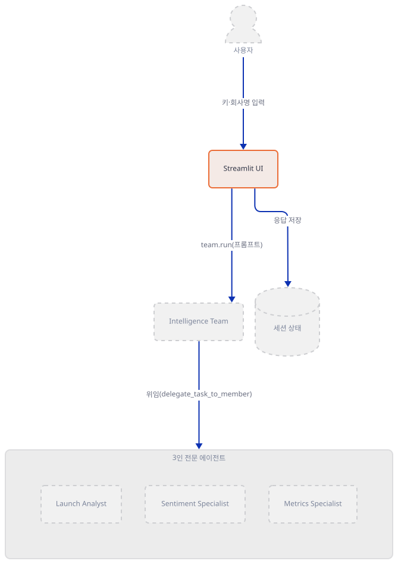

**확인.** 키 없이 첫 화면이 예외 없이 뜨는지 봅니다(가짜 네트워크 요청 없이).

```bash
uv run --no-project python -c "
from streamlit.testing.v1 import AppTest
at = AppTest.from_file('product_launch_intelligence_agent.py')
at.run(timeout=30)
print('exception:', list(at.exception))
print('sidebar text_input count:', len(at.sidebar.text_input))
"
```

직접 확인한 출력:

```
exception: []
sidebar text_input count: 2
```

### Step 3. 3인 전문 에이전트 정의 — `FirecrawlTools` 생성자 크래시

**목적.** 세 `Agent`가 어떻게 정의되는지 보고, 두 키를 모두 채우는 순간 실제로 무슨 일이 일어나는지 직접 재현합니다.

**할 일.**

`product_launch_intelligence_agent.py:47-65`

```python
    launch_analyst = Agent(
        name="Product Launch Analyst",
        description=dedent("""
            You are a senior Go-To-Market strategist who evaluates competitor product launches with a critical, evidence-driven lens.
            ...
        """),
        model=OpenAIChat(id="gpt-4o"),
        tools=[FirecrawlTools(search=True, crawl=True, poll_interval=10)],
        debug_mode=True,
        markdown=True,
        exponential_backoff=True,
        delay_between_retries=2,
    )
```

`sentiment_analyst`(68-87행)·`metrics_analyst`(90-110행)도 같은 모양이고, 셋 다 자신만의 `OpenAIChat(id="gpt-4o")`를 새로 만듭니다(같은 id지만 서로 다른 객체 — Day 086의 두 에이전트가 모델 객체 하나를 공유했던 것과 다릅니다). 문제는 세 곳 모두 똑같은 `tools=[FirecrawlTools(search=True, crawl=True, poll_interval=10)]`입니다. agno 3.0.11의 실제 생성자 시그니처를 보면 이렇습니다(agno 3.0.11 `agno/tools/firecrawl.py`, 43~57행 부근, 소스로 확인).

```python
def __init__(
    self,
    api_key: Optional[str] = None,
    enable_scrape: bool = True,
    enable_crawl: bool = False,
    enable_mapping: bool = False,
    enable_search: bool = False,
    all: bool = False,
    ...
    **kwargs,
):
    ...
    super().__init__(name="firecrawl_tools", tools=tools, **kwargs)
```

`search=`·`crawl=`이라는 이름의 매개변수는 없습니다 — 앱이 넘긴 두 값은 `**kwargs`로 흘러 들어가 그대로 `Toolkit.__init__(name=..., tools=..., **kwargs)`에 전달되고, `Toolkit`은 정의되지 않은 키워드를 받지 않으므로 그 자리에서 예외를 던집니다. 사이드바에 두 키를 모두 채우면(45행의 `if openai_key and firecrawl_key:`) 이 코드가 곧바로 실행되므로, Streamlit `AppTest`로 가짜 키 문자열 두 개만 넣어도 재현됩니다 — 생성자·설정 확인까지만이고 실제 요청 메서드는 부르지 않았습니다.

```bash
uv run --no-project python -c "
from streamlit.testing.v1 import AppTest
at = AppTest.from_file('product_launch_intelligence_agent.py')
at.run(timeout=30)
at.sidebar.text_input[0].set_value('sk-fake-openai-123')
at.sidebar.text_input[1].set_value('fc-fake-firecrawl-456')
at.run(timeout=30)
print('exception:', [e.value for e in at.exception])
"
```

직접 확인한 출력:

```
exception: ["Toolkit.__init__() got an unexpected keyword argument 'search'"]
```

Streamlit 화면에서는 이 트레이스백이 60행(`launch_analyst`의 `tools=` 줄)을 정확히 가리키는 빨간 예외 박스로 뜹니다 — 세 에이전트 모두 같은 버그를 갖고 있지만, 파이썬이 위에서 아래로 실행되므로 실제로는 첫 번째(`launch_analyst`)에서 멈춥니다. 올바른 매개변수 이름(`enable_search=True, enable_crawl=True`)으로 바꾸면 생성자는 통과하고, `enable_scrape`(기본값 `True`)까지 합쳐 도구 3개(`scrape_website`·`crawl_website`·`search_web`)가 등록되는 것도 직접 확인했습니다(생성만, 실제 호출 없음).

```bash
uv run --no-project python -c "
from agno.tools.firecrawl import FirecrawlTools
t = FirecrawlTools(enable_search=True, enable_crawl=True, poll_interval=10, api_key='fake-fc-key')
print('functions:', list(t.functions.keys()))
"
```

직접 확인한 출력:

```
functions: ['scrape_website', 'crawl_website', 'search_web']
```

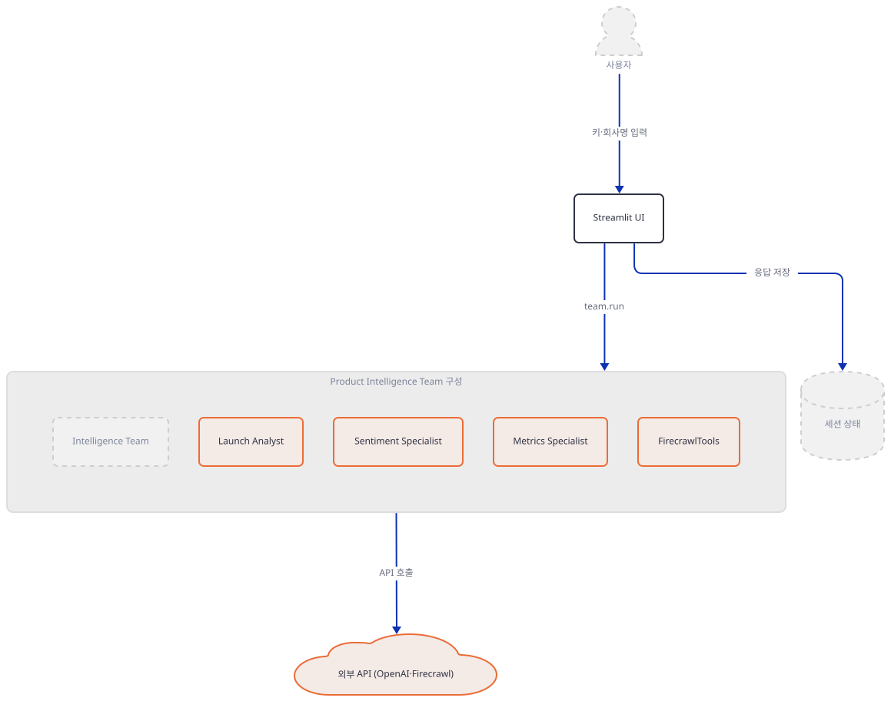

**확인.** 위 두 명령(원래 코드의 `TypeError`, 고친 kwarg의 성공)이 그대로 재현되는지 봅니다.

### Step 4. Team 결합 — coordinate 모드는 Day 079·081이 이미 다룬 사실

**목적.** `Team(...)`이 세 멤버를 어떻게 묶는지, 그리고 이 앱만의 새로운 부분이 무엇인지 확인합니다.

**할 일.**

`product_launch_intelligence_agent.py:113-129`

```python
    product_intelligence_team = Team(
        name="Product Intelligence Team",
        model=OpenAIChat(id="gpt-4o"),
        members=[launch_analyst, sentiment_analyst, metrics_analyst],
        instructions=[
            "Coordinate the analysis based on the user's request type:",
            "1. For competitor analysis: Use the Product Launch Analyst to evaluate positioning, strengths, weaknesses, and strategic insights",
            "2. For market sentiment: Use the Market Sentiment Specialist to analyze social media sentiment, customer feedback, and brand perception",
            "3. For launch metrics: Use the Launch Metrics Specialist to track KPIs, adoption rates, press coverage, and performance indicators",
            ...
        ],
        markdown=True,
        debug_mode=True,
        show_members_responses=True,
    )
```

`mode=`가 없으면 agno 3.0.11에서 `TeamMode.coordinate`로 정해지고 리더가 `delegate_task_to_member(member_id, task)` 도구로 멤버를 고른다는 것은 Day 079 Step 5가 이미 소스(`agno/team/_init.py`·`agno/team/_default_tools.py`)로 확인했고, Day 081도 같은 사실을 가리키며 "멤버가 각자 도구를 갖고 리더 위임 뒤 도구 호출 루프를 한 번 더 돈다"는 것까지 다뤘습니다 — 여기서는 되풀이하지 않습니다. 오늘 다른 점 둘: (1) 멤버 셋이 각자 독립된 `OpenAIChat`·`FirecrawlTools`를 만들어 서로 아무것도 공유하지 않고(Step 3), (2) "어떤 멤버에게 시킬지"가 113-125행의 자연어 `instructions` 문구에만 의존합니다 — "경쟁사 분석 탭은 항상 Product Launch Analyst가 처리한다"는 코드가 아니라 프롬프트 수준의 약속입니다.

```bash
uv run --no-project python -c "
from agno.team import Team
from agno.agent import Agent
from agno.models.openai import OpenAIChat
t = Team(members=[Agent(model=OpenAIChat(id='gpt-4o'))], model=OpenAIChat(id='gpt-4o'))
print('mode:', t.mode)
"
```

직접 확인한 출력(이 앱의 `Team(...)` 호출과 같은 모양으로 재확인, Day 079와 같은 방법):

```
mode: TeamMode.coordinate
```

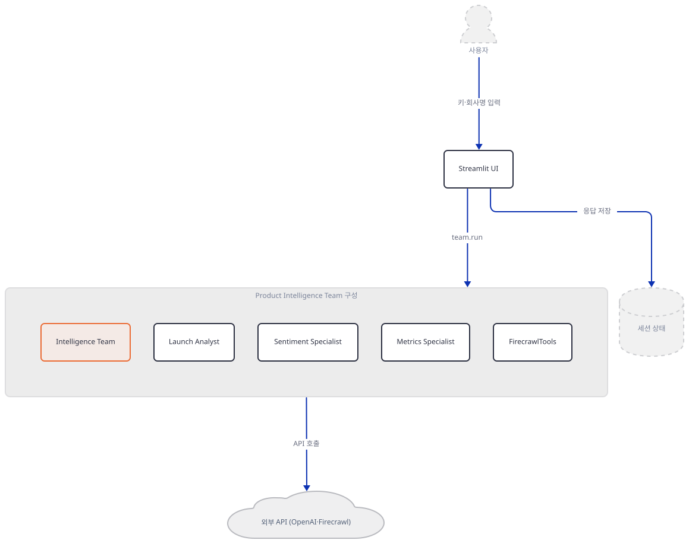

**확인.** 위 명령으로 이 앱의 `Team(...)`도 `mode=`를 지정하지 않아 `coordinate`로 정해지는지 재확인합니다(가짜 최소 구성, 실제 키 없이).

### Step 5. 탭 UI와 2단계 파이프라인 — 불릿 생성 후 다시 리포트로

**목적.** 버튼 한 번이 실제로는 `team.run()`을 왜 두 번 부르는지 확인합니다.

**할 일.**

`product_launch_intelligence_agent.py:134-159`

```python
def expand_competitor_report(bullet_text: str, competitor: str) -> str:
    if not product_intelligence_team:
        st.error("⚠️ Please enter both API keys in the sidebar first.")
        return ""

    prompt = (
        f"Transform the insight bullets below into a professional launch review for product managers analysing {competitor}.\n\n"
        ...
    )
    resp: RunOutput = product_intelligence_team.run(prompt)
    return resp.content if hasattr(resp, "content") else str(resp)
```

`product_launch_intelligence_agent.py:272-292`

```python
            if analyze_btn:
                if not product_intelligence_team:
                    st.error("⚠️ Please enter both API keys in the sidebar first.")
                else:
                    with st.spinner("🔍 Product Intelligence Team analyzing competitive strategy..."):
                        try:
                            bullets: RunOutput = product_intelligence_team.run(
                                f"Generate up to 16 evidence-based insight bullets about {company_name}'s most recent product launches.\n"
                                ...
                            )
                            long_text = expand_competitor_report(
                                bullets.content if hasattr(bullets, "content") else str(bullets),
                                company_name
                            )
                            st.session_state.competitor_response = long_text
                            st.success("✅ Competitor analysis ready")
                            st.rerun()
                        except Exception as e:
                            st.error(f"❌ Error: {e}")
```

"Analyze Competitor Strategy" 버튼 하나가 같은 `product_intelligence_team`에 `.run()`을 **두 번** 부릅니다 — 첫 번째(278행)는 태그가 붙은 불릿 최대 16개를 요청하고, 두 번째는 `expand_competitor_report()`(위 발췌) 안에서 그 불릿 텍스트를 다시 팀에 보내 표·콜아웃이 섞인 마크다운 리포트로 바꿔 달라고 요청합니다. 두 호출 모두 `product_intelligence_team.run(prompt)`이지 특정 멤버를 직접 부르는 것이 아니므로, coordinate 모드의 리더가 매번 새로 라우팅을 판단합니다 — 두 번째 호출은 이미 만들어진 텍스트를 다듬는 작업이라 도구가 필요 없어, 리더가 위임 없이 직접 답할 수도 있습니다(소스상 가능한 경로일 뿐, 실제 어느 쪽인지는 키가 없어 확인하지 못했습니다). Market Sentiment 탭(`:319-354`)·Launch Metrics 탭(`:381-416`)도 프롬프트 문구만 다를 뿐 똑같이 "불릿 생성 → `expand_*_report()`로 재요청" 2단계 구조입니다. 성공하면 `st.session_state.competitor_response`(233행에서 `None`으로 초기화)에 최종 리포트가 저장되고 `st.rerun()`이 화면을 다시 그립니다.

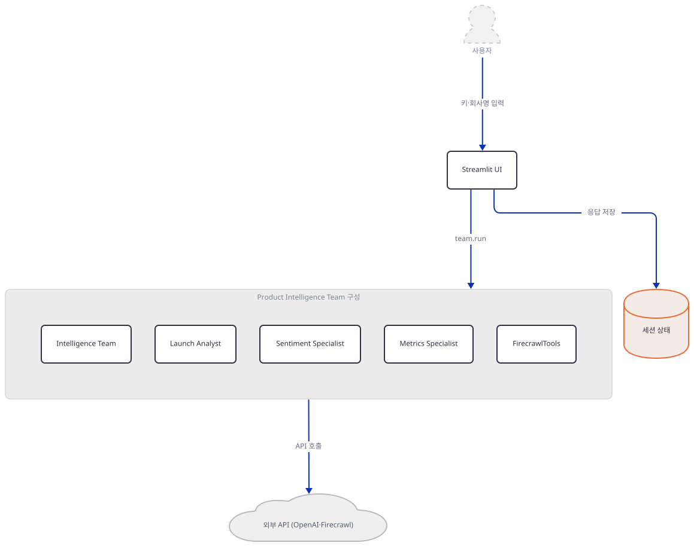

**확인.** 세 탭 모두 같은 2단계 호출 패턴을 쓰는지 grep으로 봅니다.

```bash
grep -n "product_intelligence_team.run(" product_launch_intelligence_agent.py
```

직접 확인한 출력은 6곳(세 탭의 불릿 생성 호출 3곳 + `expand_*_report` 안의 재요청 3곳)입니다.

### Step 6. 사이드바 상태판 — 그리고 동작하지 않는 J/K/L 단축키

**목적.** 사이드바 하단이 무엇을 보여주는지, 그리고 "Quick Actions"가 광고하는 키보드 단축키가 실제로 연결되어 있는지 확인합니다.

**할 일.**

`product_launch_intelligence_agent.py:427-451`

```python
with st.sidebar.container():
    st.markdown("### 🤖 System Status")
    if openai_key and firecrawl_key:
        st.success("✅ Product Intelligence Team ready")
    else:
        st.error("❌ API keys required")
...
with st.sidebar.container():
    st.markdown("### 🎯 Coordinated Team")
    agents_info = [
        ("🔍", "Product Launch Analyst", "Strategic GTM expert"),
        ("💬", "Market Sentiment Specialist", "Consumer perception expert"),
        ("📈", "Launch Metrics Specialist", "Performance analytics expert")
    ]
```

`product_launch_intelligence_agent.py:475-483`

```python
with st.sidebar.container():
    st.markdown("### ⚡ Quick Actions")
    if company_name:
        st.markdown("""
        **J** - Competitor analysis  
        **K** - Market sentiment  
        **L** - Launch metrics
        """)
```

이 블록은 J·K·L 세 글자를 적은 마크다운 텍스트를 그릴 뿐입니다. 파일 전체를 검색해도 `keyboard`·`components.html`·`addEventListener`·`st_javascript`처럼 키보드 이벤트를 연결할 만한 코드는 한 줄도 없습니다 — 세 버튼(`competitor_btn`·`sentiment_btn`·`metrics_btn`, 261·325·387행)은 오직 마우스 클릭으로만 눌립니다. 앱 자체 README도 "press J/K/L to trigger the three analyses without touching the UI"라고 똑같이 광고하므로, 이것은 이 문서만의 오독이 아니라 앱 자체의 오류입니다.

```bash
grep -n "keyboard\|components.html\|addEventListener\|st_javascript\|hotkey" product_launch_intelligence_agent.py
echo "exit=$?"
```

직접 확인한 출력은 빈 결과(`exit=1`)입니다 — 일치하는 줄이 없습니다.

이 앱을 실제로 띄우려면 앱 폴더에서 다음을 실행합니다(오늘 버전 조합으로는 두 키를 모두 넣는 순간 Step 3의 `TypeError`로 멈춥니다).

```bash
uv run --no-project streamlit run product_launch_intelligence_agent.py
```

확인용으로 헤드리스 실행만 해 본다면 `--server.address localhost`를 반드시 붙입니다 — 오늘 설치되는 Streamlit 1.64.0은 주소를 지정하지 않고 headless로 띄우면 외부 IP를 조회하려고 `checkip.amazonaws.com`에 요청을 보냅니다(Day 060에서 확인한 사실과 같습니다).

```bash
uv run --no-project streamlit run product_launch_intelligence_agent.py --server.headless true --server.address localhost
```

이 문서는 임의의 높은 포트(61423)로 이 headless 기동을 직접 재현했습니다(`HOME`·`USERPROFILE`·`LOCALAPPDATA`·`APPDATA`를 모두 스크래치로 돌려 실제 홈의 `~/.streamlit/`를 건드리지 않았고, 프록시 변수로 외부 요청을 막았습니다) — `_stcore/health`가 `200`을 돌려주고, 로그에 `Uvicorn server started on localhost:61423`·`URL: http://localhost:61423` 등은 찍히지만 외부 IP 조회(`checkip.amazonaws.com`)는 한 번도 시도되지 않는 것을 확인했습니다. 실행 뒤 프로세스를 종료하고 포트가 비는 것도 확인했습니다.

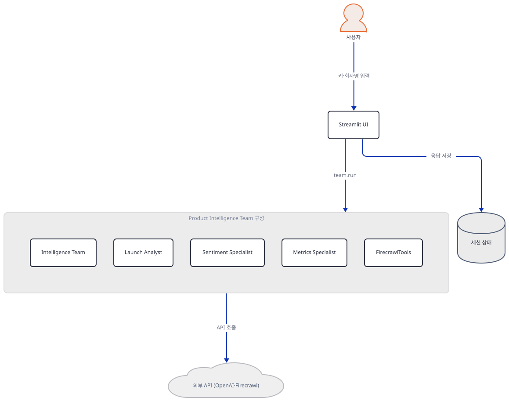

**확인.** 위 grep이 빈 결과를 내는지, 그리고 headless 기동이 외부 IP 조회 없이 `200`을 돌려주는지 봅니다.

## 요청 한 건이 흐르는 과정

Competitor Analysis 탭에서 "Analyze Competitor Strategy"를 누르면 버튼 클릭 한 번이 같은 `product_intelligence_team`에 `.run()`을 두 번(불릿 생성 → 리포트 변환) 부릅니다(Step 5). 이 두 호출이 소스상(coordinate 모드의 `delegate_task_to_member`와 각 `Agent`의 도구 호출 루프) 어떻게 흐르는지 4단계로 나눠 그렸습니다 — 실제 키가 없어 모델·Firecrawl의 응답 문장 자체는 확인하지 못했지만, 어떤 도구가 몇 번 오가는지는 agno 3.0.11 소스로 확인한 그대로입니다. 그림을 하나로 합치면 OpenAI API의 긴 수명선이 이웃 메시지의 라벨 뒤를 지나가 버려서, 리더의 위임 결정 → 멤버의 도구 호출 → 위임 결과 통합·반환 → 리포트 변환, 이렇게 앱의 실제 인과 경계로 나눴습니다 — 메시지는 하나도 지우지 않고 그대로 옮겼습니다.

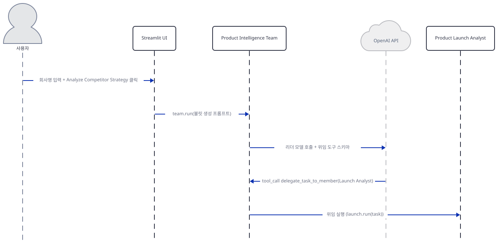

사용자가 회사명을 입력하고 버튼을 누르면 Streamlit UI가 `product_intelligence_team.run(prompt)`(첫 번째 호출, 불릿 생성)을 호출합니다. 리더(`Product Intelligence Team`)는 자신의 `gpt-4o`에 `instructions`와 `delegate_task_to_member` 도구 스키마를 실어 보내고, 모델이 `tool_call delegate_task_to_member(member_id="Product Launch Analyst", ...)`를 돌려주면 리더는 그 멤버의 `run(task)`를 내부에서 호출합니다(Step 4).

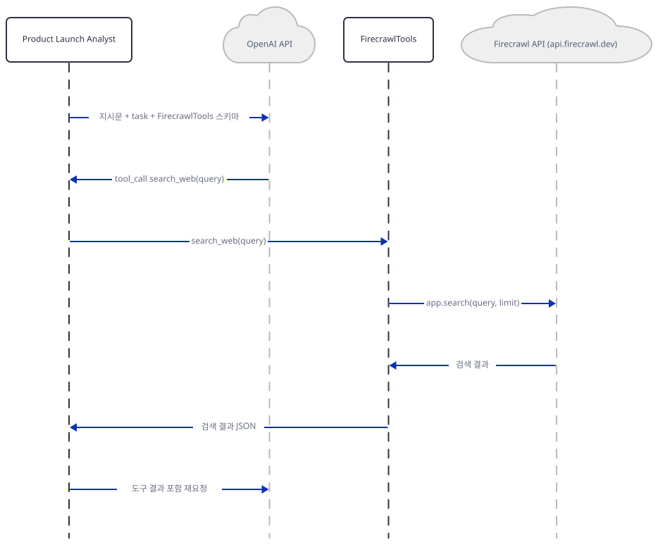

위임받은 Product Launch Analyst는 자신의 지시문·task에 `FirecrawlTools` 스키마를 얹어 다시 OpenAI를 부릅니다. 모델이 `tool_call search_web(query)`를 돌려주면 에이전트는 실제로 `FirecrawlTools.search_web()`을 호출하고, 이 함수가 내부에서 `FirecrawlApp.search()`로 `api.firecrawl.dev`에 진짜 HTTP 요청을 보냅니다(agno 3.0.11 `agno/tools/firecrawl.py`, 144행 부근, 소스로 확인) — 검색 결과를 받아 다시 OpenAI에 "도구 결과 포함 재요청"을 보냅니다. 이 왕복은 OpenAI 함수 호출의 표준 2단계 패턴(요청→도구 호출 지시→도구 실행→결과 포함 재요청)이고, Day 081이 이미 다룬 "Team 멤버가 각자 도구를 갖고 위임 뒤 도구 호출 루프를 한 번 더 도는" 구조와 같은 메커니즘입니다.

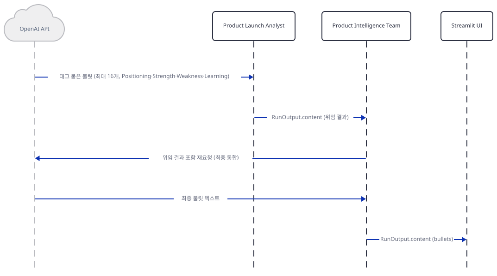

OpenAI가 태그 붙은 불릿 최대 16개를 돌려주면 Product Launch Analyst는 이 텍스트를 `RunOutput.content`로 리더에게 반환합니다(이때부터 Product Launch Analyst는 더 이상 등장하지 않습니다). 리더는 이 위임 결과를 포함해 자신의 `gpt-4o`에 다시 요청해 최종 불릿 텍스트를 만들고, `RunOutput.content`로 Streamlit UI에 돌려줍니다 — 여기까지가 **첫 번째** `team.run()`입니다. UI는 이 불릿 텍스트를 곧바로 `expand_competitor_report()`에 넘겨 **두 번째** `team.run()`을 시작합니다.

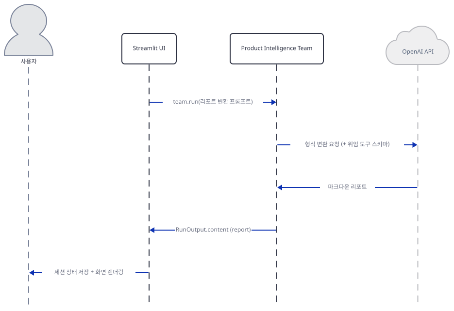

두 번째 호출은 불릿을 표·콜아웃이 섞인 마크다운 리포트로 바꿔 달라는 프롬프트입니다. 리더는 이번에도 `delegate_task_to_member` 스키마를 그대로 갖고 있으므로(도구 자체가 사라지는 것은 아닙니다), 형식만 바꾸는 작업이라 위임 없이 직접 답할 수도, 다시 멤버에게 위임할 수도 있습니다 — 위 그림은 위임 없이 직접 답하는 경로를 그렸고, 실제 어느 쪽인지는 키가 없어 확인하지 못했습니다(Step 5). 받은 리포트를 `RunOutput.content`로 UI에 돌려주면, UI는 `st.session_state.competitor_response`에 저장하고 `st.rerun()`으로 화면에 렌더링합니다. Market Sentiment·Launch Metrics 탭도 프롬프트 문구만 다를 뿐 이 네 그림과 같은 모양입니다.

## 실행 체크리스트

- [ ] 격리된 가상환경에 `requirements.txt`를 그대로 설치하면 `openai`가 없어 `agno.models.openai.OpenAIChat` 임포트가 `ImportError`로 막힌다는 것을 직접 확인했다
- [ ] `uv pip install openai` 추가 설치로 임포트가 통과하는 것을 확인했다
- [ ] 사이드바에 OpenAI·Firecrawl 키를 모두 입력하면 `FirecrawlTools(search=True, crawl=True, ...)`가 `TypeError: Toolkit.__init__() got an unexpected keyword argument 'search'`로 페이지 전체를 크래시시킨다는 것을 Streamlit `AppTest`로 직접 확인했다
- [ ] agno 3.0.11의 `FirecrawlTools` 실제 매개변수 이름이 `enable_search=`·`enable_crawl=`이고, `enable_search=True, enable_crawl=True`로 고치면 생성자가 통과해 도구 3개(`scrape_website`·`crawl_website`·`search_web`)가 등록된다는 것을 확인했다
- [ ] `Team(...)`이 `mode=`를 지정하지 않으면 소스상 `TeamMode.coordinate`로 정해지고, 리더가 `delegate_task_to_member` 도구로 멤버를 고른다는 것을 확인했다
- [ ] 탭 하나의 버튼 클릭이 같은 `product_intelligence_team`에 `.run()`을 두 번(불릿 생성 → 리포트 변환) 부른다는 것을 grep으로 확인했다
- [ ] 사이드바 "Quick Actions"가 광고하는 J/K/L 단축키가 코드 어디에도 연결되어 있지 않다는 것을 grep으로 확인했다(앱 자체 README도 같은 주장)
- [ ] `--server.address localhost --server.headless true`를 붙여 headless로 기동하면, 임의의 높은 포트에서 외부 IP 조회 없이 `_stcore/health`가 `200`을 돌려준다는 것을 확인했다
- [ ] (실제 키가 있다면) 코드의 `search=`·`crawl=`을 `enable_search=`·`enable_crawl=`로 고친 뒤 실제로 팀이 응답하는지, 두 번째 `team.run()`이 위임 없이 리더가 직접 답하는지 `debug_mode=True` 로그로 확인했다

## 문제 해결

| 증상 | 원인 | 해결 |
|---|---|---|
| `python product_launch_intelligence_agent.py` 또는 임포트가 `ModuleNotFoundError: No module named 'openai'` → `ImportError: openai not installed`로 끝남(직접 확인) | `requirements.txt`에 `openai` 패키지 선언이 아예 없음(소스로 확인) — agno의 `OpenAIChat`이 내부에서 요구 | 리포 코드는 고치지 않음 — 재현하려면 `uv pip install openai` 추가 설치 |
| 사이드바에 OpenAI·Firecrawl 키를 둘 다 넣는 순간 페이지 전체가 빨간 예외로 바뀜, `TypeError: Toolkit.__init__() got an unexpected keyword argument 'search'`(직접 확인) | `product_launch_intelligence_agent.py:60,82,105`가 `FirecrawlTools(search=True, crawl=True, ...)`를 쓰는데, agno 3.0.11의 실제 매개변수 이름은 `enable_search=`·`enable_crawl=`(소스로 확인, `agno/tools/firecrawl.py`) | 리포 코드는 고치지 않음 — 재현하려면 세 곳 모두 `enable_search=True, enable_crawl=True`로 고쳐야 함("더 해보기") |
| 사이드바 "Quick Actions"에 적힌 J/K/L 키를 눌러도 분석이 시작되지 않음 | 코드에 키보드 이벤트를 잇는 부분이 전혀 없음(그렙으로 확인) — 앱 자체 README도 같은 주장을 하는 오류임 | 무시하고 마우스로 버튼을 클릭 |
| headless로 `streamlit run`을 띄우면 시작 중 외부로 IP 조회 요청이 나갈 수 있음 | `--server.address`를 지정하지 않으면 Streamlit이 자신의 외부 IP를 알아내려 `checkip.amazonaws.com`에 요청을 보냄(Day 060에서 확인한 사실과 같음, 오늘 설치되는 1.64.0도 동일) | `--server.headless true --server.address localhost`를 함께 지정 |
| (실제 키가 있어도) FirecrawlTools 크래시를 고친 뒤에도 어느 멤버가 응답을 만들었는지 화면만으로는 알기 어려움 | coordinate 모드의 위임은 `instructions`라는 자연어 규칙에 의존하고, 어느 멤버가 실제로 선택됐는지 보여주는 UI 요소가 없음. `show_members_responses=True`(128행)는 agno의 `print_response()` 경로(`agno/team/_cli.py`)에서만 읽히는데 이 앱은 `.run()`만 부르므로 이 값은 **이 앱에서는 아무 효과가 없습니다**(소스로 확인) | `debug_mode=True`가 이미 켜져 있으므로 콘솔 로그에서 `delegate_task_to_member` 호출을 직접 확인 |

## 더 해보기

- `product_launch_intelligence_agent.py:60,82,105`의 `FirecrawlTools(search=True, crawl=True, poll_interval=10)`을 `FirecrawlTools(enable_search=True, enable_crawl=True, poll_interval=10)`으로 고친 사본을 만들어, 실제 키로 세 탭이 각각 응답하는지 확인해보기
- `Team(...)`에 `mode="route"`(또는 `respond_directly=True`)를 명시해 무엇이 달라지는지 비교해보기 — route도 같은 `delegate_task_to_member` 도구를 쓰지만, `stop_after_tool_call=True`로 리더의 두 번째 모델 호출(도구 결과를 통합해 다시 답하는 단계)만 생략합니다(agno 3.0.11 `agno/team/_default_tools.py`, 소스로 확인)
- 실제 키로 두 번째 `team.run()`(리포트 변환)을 `debug_mode=True` 로그로 관찰해, 리더가 위임 없이 직접 답하는지 아니면 다시 `delegate_task_to_member`를 호출하는지 확인해보기
- `product_launch_intelligence_agent.py:261,325,387`의 세 `st.button(...)` 호출에 오늘 설치되는 streamlit 1.64.0이 이미 제공하는 `shortcut=` 인자(예: `st.button(..., shortcut="j")`, `streamlit/elements/widgets/button.py` 소스로 확인)를 추가해, 광고만 되어 있는 J/K/L을 서드파티 없이 실제로 동작하게 만들어보기

## 다음 날 예고

[Day 090 · 🛡️ Trust-Gated Multi-Agent Research Team](../day090-trust-gated-agent-team/README.md) — 여러 에이전트의 출력을 신뢰도로 걸러 통과시키는 리서치 팀 구조를 다룹니다(원본 앱 README 기준).
