# Day 091 · 👨🏻‍💼 AI Sales Intelligence Agent Team

> 볼륨 7 🚀 Advanced AI Agents · 난이도 ★★☆ ⚠(모델 서비스 종료) · 예상 소요 95분(Step마다 스텁 콜백으로 파이프라인 7단계를 직접 실행해 보고, 서비스 종료된 모델 둘을 SDK 소스로 재확인하고, `adk web`까지 띄워 확인하는 손 시간이 읽는 시간만큼 듭니다) · API 비용 배틀카드 1건에 Gemini 호출이 **최소 12회**(코디네이터 1 + 1~5단계 5 + 6·7단계 각 2(도구 선택 + 함수 응답 요약) + 도구 안 직접 `Client()` 호출 2) 들어가는 구조지만 `gemini-3-*-preview` 요금표를 확인하지 못해 원화 추정은 하지 않습니다(키가 없어 실제 과금도 확인 못함) — 게다가 3~5단계와 7단계 도구가 쓰는 모델 둘은 **이미 서비스가 종료돼** 키를 넣어도 3단계에서 멈춥니다(아래) · 원본 앱: `advanced_ai_agents/multi_agent_apps/agent_teams/ai_sales_intelligence_agent_team`

## 오늘 만들 것

Day 078에서 시작한 "🚀 Advanced AI Agents" 볼륨의 열네 번째 앱입니다. Day 088(AI Consultant Agent)에 이어 이 볼륨에서 두 번째로 `google-adk`를 쓰는 날이고(078~087·089·090은 agno·EvoAgentX·OpenAI Agents SDK·CrewAI·AG2·프레임워크 없음 등 다른 조합이었습니다 — Day 090 README가 078~089를 프레임워크별로 정리해 뒀습니다), 시리즈 전체로 보면 Day 014~023 크래시 코스, Day 067, Day 077, Day 088에 이어 다섯 번째로 이 프레임워크를 다루는 자리입니다. 오늘의 441줄짜리 `agent.py`(마지막 줄은 빈 줄, `wc -l` 그대로)는 `LlmAgent` 7개를 `SequentialAgent`로 묶어 "경쟁사 리서치 → 기능 분석 → 포지셔닝 분석 → SWOT → 반박 스크립트 → 배틀카드 생성 → 비교 차트 생성" 순서를 선언 순서 그대로 강제합니다(Day 022가 이미 확인한 `SequentialAgent`의 `for`문 실행 방식 그대로). 다만 이번 조합은 이 시리즈에서 처음 나오는 것입니다 — 코디네이터(`root_agent`, `LlmAgent`)가 자신의 `sub_agents`에 다른 `LlmAgent`가 아니라 이 `SequentialAgent` 자체를 넣고, `transfer_to_agent`(Day 021이 확인한 자동 주입 도구)로 제어를 통째로 넘깁니다. Day 001~090 앱 소스 전체에서 `LlmAgent`의 `sub_agents`에 워크플로 에이전트(`SequentialAgent`·`LoopAgent`·`ParallelAgent`)가 들어간 예를 찾아도 없습니다(전체 검색으로 직접 확인 — google-adk를 쓰는 Day 014~023·067·077·088의 `sub_agents`는 전부 다른 `LlmAgent`이거나 워크플로 에이전트 자신이 `Runner`의 루트입니다) — 그래서 이 조합은 오늘이 처음입니다. (참고로 `SequentialAgent`와 `output_key`가 같은 파일에 함께 있는 앱은 리포 전체에 6곳— 이 앱과 Day 092의 원본 앱을 포함합니다 — 이지만, `sub_agents`에 워크플로 에이전트를 넣는 패턴 자체는 그중에도 이 앱이 처음 보여줍니다.) Step 6에서 "워크플로 에이전트로 전환하면 무슨 일이 일어나는가"를 스텁 콜백으로 직접 실행해 확인합니다. 또 하나, 7단계 중 마지막 두 단계(`battle_card_generator_agent`, `comparison_chart_agent`)는 ADK가 자동으로 부르는 모델 호출과는 별개로, 자신의 커스텀 도구 안에서 `google.genai.Client()`를 직접 만들어 **두 번째** Gemini 호출을 겁니다 — 하나는 HTML 배틀카드 텍스트를, 하나는 `response_modalities=["TEXT","IMAGE"]`로 실제 비교 인포그래픽 이미지를 생성합니다(이미지 생성 자체는 Day 082가 이미 다뤘지만, `response_modalities`를 명시적으로 요청 설정에 넣는 것은 오늘 처음입니다 — Step 5에서 비교합니다). **다만 오늘 앱의 7단계 중 넷(포지셔닝·SWOT·반박 스크립트 단계와 비교 차트 도구 — 앞 문단의 "6곳"과는 별개로, 이 앱 하나 안에서의 얘기입니다)이 쓰는 `gemini-3-pro-preview`·`gemini-3-pro-image-preview`는 Day 082가 이미 "서비스 종료"로 확인한 바로 그 모델입니다** — Google 공식 "Model deprecations" 문서(https://ai.google.dev/gemini-api/docs/deprecations, Day 082가 2026-09-28에 확인)에 따르면 `gemini-3-pro-preview`는 2026-03-09에, `gemini-3-pro-image-preview`는 2026-06-25에 이미 종료됐고, 이 문서를 쓰며 설치한 google-genai 2.25.0의 모델 목록(`_gaos/types/interactions/model.py`)에도 이 두 이름은 없고 대체 모델 `gemini-3.1-pro-preview`·`gemini-3-pro-image`만 있습니다(직접 확인, 2026-09-29 — Day 082의 확인과 같은 파일, 같은 결과). 즉 키를 넣어도 3단계(`positioning_analyzer_agent`)에서 멈춰 배틀카드·차트는 끝까지 나오지 않습니다 — Step 5·문제 해결에서 다시 짚습니다. 완성 아키텍처는 다음과 같습니다.

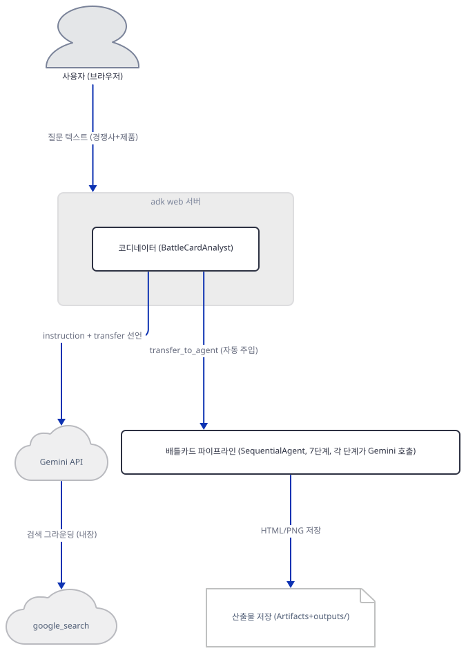

## 사전 준비

| 서비스/도구 | 용도 | 발급·설치 |
|---|---|---|
| Google AI Studio API 키 (`GOOGLE_API_KEY`) | `gemini-3-flash-preview`(1·2·6·7단계) 호출 인증. `adk web`을 띄우기 **전에** 셸 환경변수(`export GOOGLE_API_KEY=...`, PowerShell은 `$env:GOOGLE_API_KEY="..."`)나 앱 폴더의 `.env` 파일로 설정한다(Day 014·088과 같은 `load_dotenv_for_agent` 메커니즘). 이 문서는 키를 발급하지 않고 없을 때 어디서 멈추는지만 확인한다 | https://aistudio.google.com/apikey. **3~5단계(`gemini-3-pro-preview`)와 7단계 도구(`gemini-3-pro-image-preview`)는 이미 서비스가 종료됐다** — Google 공식 "Model deprecations" 문서(2026-03-09·2026-06-25 종료, Day 082가 2026-09-28에 확인) — 키를 넣어도 3단계에서 멈춘다 |
| uv | 가상환경 생성과 패키지 설치 | [공통 사전 준비](../README.md#공통-사전-준비-한-번만) 절 참고 |
| 인터넷 연결 | PyPI 설치, 키가 있다면 Gemini API 접속 | 별도 설치 없음 |

## 아키텍처 한눈에 보기

| 컴포넌트 | 역할 | 코드 위치 |
|---|---|---|
| 사용자 (브라우저) | `adk web` 개발자 웹 UI로 "경쟁사 + 우리 제품" 입력 | 코드 없음 (외부 UI) |
| `adk web` 서버 | 앱 폴더를 스캔해 `root_agent`를 로드하고 자체 Runner로 실행 (Day 014·088과 같은 CLI) | 코드 없음 (google-adk 2.10.0 CLI — 직접 확인) |
| 패키지 진입점 (`__init__.py`) | `.agent`에서 `root_agent`만 재노출하는 얇은 껍데기 | `advanced_ai_agents/multi_agent_apps/agent_teams/ai_sales_intelligence_agent_team/__init__.py:1-5` |
| 코디네이터 (`root_agent`, `LlmAgent`) | 사용자 의도를 확인하고 `transfer_to_agent`로 파이프라인에 제어를 넘김 | `advanced_ai_agents/multi_agent_apps/agent_teams/ai_sales_intelligence_agent_team/agent.py:397-437` |
| 배틀카드 파이프라인 (`battle_card_pipeline`, `SequentialAgent`) | `LlmAgent` 7개를 선언 순서대로 끝까지 실행 | `advanced_ai_agents/multi_agent_apps/agent_teams/ai_sales_intelligence_agent_team/agent.py:378-390` |
| 리서치 3단계 (`competitor_research_agent`·`product_feature_agent`·`positioning_analyzer_agent`) | `google_search` 도구를 얹어 Gemini에게 검색을 켜 달라고 요청하고, 결과를 `output_key`로 상태에 저장 | `agent.py:10-54`, `agent.py:61-105`, `agent.py:112-158` |
| 합성 2단계 (`swot_agent`·`objection_handler_agent`) | 도구 없이 이전 `output_key`들을 종합 | `agent.py:165-206`, `agent.py:213-258` |
| 산출물 생성 2단계 (`battle_card_generator_agent`·`comparison_chart_agent`) | 커스텀 함수 도구를 호출 — 도구 안에서 별도 Gemini 호출이 한 번 더 나감 | `agent.py:265-305`, `agent.py:312-371` |
| HTML 배틀카드 도구 (`generate_battle_card_html`) | `google.genai.Client()`로 직접 텍스트 생성 후 ADK 아티팩트 + `outputs/`에 저장 | `advanced_ai_agents/multi_agent_apps/agent_teams/ai_sales_intelligence_agent_team/tools.py:19-111` |
| 비교 차트 도구 (`generate_comparison_chart`) | `response_modalities=["TEXT","IMAGE"]`로 이미지 생성 후 저장 | `advanced_ai_agents/multi_agent_apps/agent_teams/ai_sales_intelligence_agent_team/tools.py:114-208` |
| Gemini API | `gemini-3-flash-preview`(1·2·6·7단계, 종료일 미고지)·`gemini-3-pro-preview`(3~5단계, **2026-03-09 종료**)·`gemini-3-pro-image-preview`(7단계 도구, **2026-06-25 종료**) — 뒤 둘은 Day 082가 이미 "서비스 종료"로 확인한 모델(아래 참고) | 코드 없음 (외부 서비스) |
| `google_search` | Gemini 내장 도구(google-adk 2.10.0의 `tools/google_search_tool.py`, "automatically invoked by Gemini models" — 소스로 확인) — 앱 프로세스가 직접 검색을 호출하는 게 아니라 리서치 3단계가 이 도구를 얹으면 Gemini가 스스로 검색을 그라운딩한다 | 코드 없음 (google-adk 제공, 실제 검색은 Gemini 쪽) |

## 단계별 진행

### Step 1. 환경 만들기 — 의존성 2줄짜리 패키지

**목적.** 격리된 가상환경에 `google-adk`·`google-genai`만 설치하고, 세 파일이 컴파일·임포트되는지 확인합니다. `tools.py`는 모듈 최상위에서 `OUTPUTS_DIR.mkdir(exist_ok=True)`를 실행해(`tools.py:15-16`) **임포트만 해도** 자기 폴더 옆에 `outputs/`를 만듭니다 — 이 폴더는 앱이 실제로 쓰는 정상적인 산출물 폴더이므로 직접 실행하며 따라가는 독자에게는 문제가 아니지만, 이 문서는 여러 에이전트가 동시에 같은 저장소를 커밋하는 중이라 소스 트리에 새 파일을 남기면 안 되므로 앱 폴더를 스크래치로 복사한 사본에서만 임포트·실행합니다.

**할 일.**

```bash
cd advanced_ai_agents/multi_agent_apps/agent_teams/ai_sales_intelligence_agent_team
uv venv
uv pip install -r requirements.txt
```

(pip 대안: `python -m venv .venv && source .venv/bin/activate && pip install -r requirements.txt`. Windows PowerShell은 활성화만 `.venv\Scripts\Activate.ps1`로 바꿉니다.)

이 저장소는 루트에 `pyproject.toml`이 있어 `uv run`이 방금 만든 환경 대신 루트의 `.venv`를 쓰므로, 이후 `uv run` 명령에는 모두 `--no-project`를 붙입니다.

`advanced_ai_agents/multi_agent_apps/agent_teams/ai_sales_intelligence_agent_team/requirements.txt:1-2`

```text
google-adk>=1.0.0
google-genai>=1.0.0
```

(2줄, 끝에 빈 줄 하나 더 있어 `wc -l`은 3으로 셉니다.) 상한 없는 `>=`라 직접 설치하면 **google-adk 2.10.0**, **google-genai 2.25.0**이 받아집니다(직접 확인) — Day 088이 같은 시점에 확인한 버전과 동일합니다.

```bash
uv run --no-project python -c "import google.adk, google.genai; print('google-adk', google.adk.__version__); print('google-genai', google.genai.__version__)"
```

```
google-adk 2.10.0
google-genai 2.25.0
```

```bash
uv run --no-project python -m py_compile agent.py tools.py __init__.py && echo compiled
```

```
compiled
```

(이 문서는 여러 에이전트가 동시에 저장소를 커밋하는 중이라 실제 컴파일·임포트는 앱 폴더를 스크래치로 복사한 사본에서 실행했고, `PYTHONPYCACHEPREFIX`로 `__pycache__` 위치도 스크래치로 돌려 원본 저장소에는 아무것도 남기지 않았습니다 — 독자는 이 격리 없이 앱 폴더 안에서 바로 실행해도 됩니다. `__pycache__/`는 이 저장소의 `.gitignore`에 이미 등록돼 있습니다.)

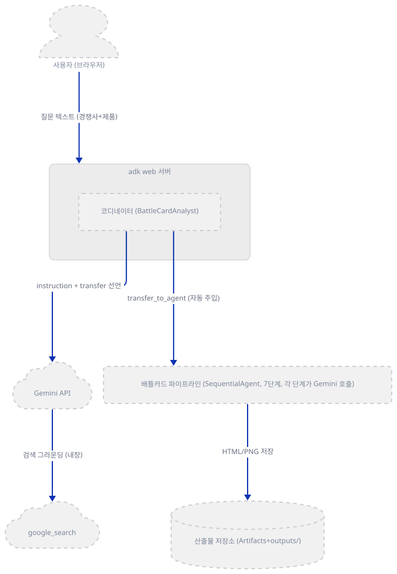

**확인.** 위 컴파일 명령이 `compiled`를 출력합니다(직접 확인).

### Step 2. 코디네이터 선언 — `sub_agents`에 워크플로 에이전트를 넣는다

**목적.** `root_agent`가 무엇으로 구성되는지, 그리고 `sub_agents`에 다른 `LlmAgent`가 아니라 `SequentialAgent`를 넣으면 ADK가 실제로 어떻게 반응하는지 확인합니다.

**할 일.** 코디네이터 선언은 이렇습니다.

`advanced_ai_agents/multi_agent_apps/agent_teams/ai_sales_intelligence_agent_team/agent.py:397-437`

```python
root_agent = LlmAgent(
    name="BattleCardAnalyst",
    model="gemini-3-flash-preview",
    description="AI-powered competitive intelligence analyst for sales teams",
    instruction="""
You are a competitive intelligence analyst helping sales teams win against competitors.

**WHAT YOU NEED FROM THE USER:**

1. **Competitor**: The company to analyze (name or URL)
2. **Your Product**: What you're selling (so we can compare)

**EXAMPLES OF VALID REQUESTS:**

- "Create a battle card for Salesforce. We sell HubSpot."
- "Battle card against Slack - we're selling Microsoft Teams"
- "Competitive analysis of Zendesk vs our product Freshdesk"
- "Help me compete against Monday.com, I sell Asana"

**WHEN USER PROVIDES BOTH:**
→ transfer_to_agent to "BattleCardPipeline"

The pipeline will:
1. Research the competitor thoroughly
2. Analyze their product features
3. Uncover their positioning strategy
4. Create SWOT analysis
5. Generate objection handling scripts
6. Create a professional battle card
7. Generate a visual comparison chart

**IF USER ONLY PROVIDES COMPETITOR:**
Ask them: "What product are you selling against [Competitor]?"

**FOR GENERAL QUESTIONS:**
Answer questions about competitive selling, battle cards, or how you can help.

After analysis, summarize key findings and mention the generated artifacts.
""",
    sub_agents=[battle_card_pipeline],
)
```

지시문 안의 `transfer_to_agent to "BattleCardPipeline"`은 파이썬 코드가 아니라 모델에게 주는 자연어 지시일 뿐입니다 — `tools=`에는 아무것도 선언돼 있지 않은데도, Day 021이 확인한 대로 `sub_agents`가 있으면 ADK의 `AutoFlow`가 `transfer_to_agent` 함수 도구를 매 모델 호출 전에 자동으로 얹습니다(`google/adk/flows/llm_flows/extensions/_agent_transfer.py`, 소스로 확인). 다른 점은 대상입니다 — Day 021의 `summarizer_agent`·`critic_agent`는 둘 다 `LlmAgent`였지만, 여기 `battle_card_pipeline`은 `SequentialAgent`(`BaseAgent`를 직접 상속, Day 022가 이미 확인)입니다. `_get_transfer_targets`는 대상의 타입을 가리지 않으므로 이 조합도 그대로 성립합니다.

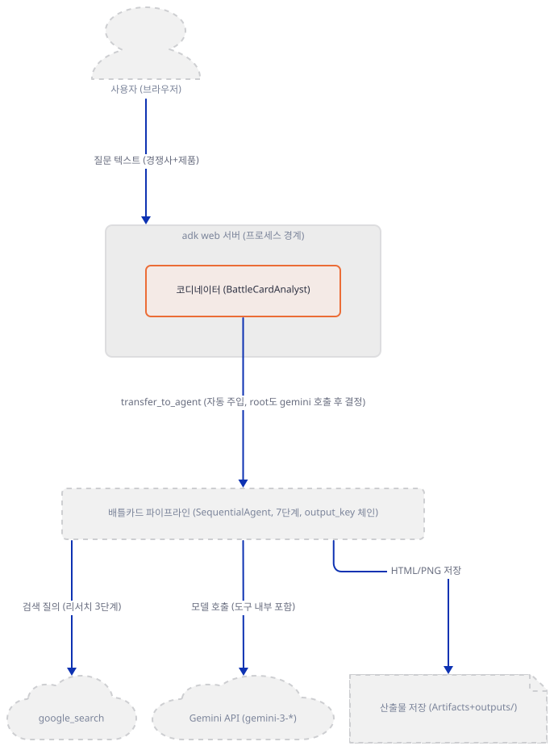

**확인.** `agent.py`는 상대 임포트(`from .tools import ...`)를 쓰므로 패키지 폴더의 **부모** 폴더(`agent_teams`)에서 실행해야 임포트가 됩니다. 그런데 가상환경은 Step 1에서 만든 자식 폴더의 `ai_sales_intelligence_agent_team/.venv`에 있어서, 그냥 `cd .. && uv run --no-project`만 쓰면 `uv`가 부모 폴더 위로 `.venv`를 찾다가 못 찾고 시스템 대체 인터프리터를 집어 `ModuleNotFoundError: No module named 'google'`로 실패합니다(직접 확인) — Day 088의 `ai_consultant_agent`와 같은 이유이고, 처방도 같습니다: `--python`으로 그 가상환경을 직접 가리킵니다.

```bash
cd ..
uv run --no-project --python ai_sales_intelligence_agent_team/.venv python -c "
from ai_sales_intelligence_agent_team.agent import root_agent, battle_card_pipeline
print('root_agent:', root_agent.name, '|', root_agent.model)
print('root sub_agents:', [a.name for a in root_agent.sub_agents])
print('pipeline parent:', battle_card_pipeline.parent_agent.name)
"
```

(저장소 루트에서 곧바로 시작한다면 `cd advanced_ai_agents/multi_agent_apps/agent_teams`를 씁니다. 이후 Step들의 명령은 모두 이 `agent_teams` 폴더에서, 같은 `--python ai_sales_intelligence_agent_team/.venv`를 붙여 실행합니다.)

직접 확인한 출력:

```
root_agent: BattleCardAnalyst | gemini-3-flash-preview
root sub_agents: ['BattleCardPipeline']
pipeline parent: BattleCardAnalyst
```

### Step 3. 리서치 3단계 — `google_search`와 `output_key`

**목적.** 첫 스테이지의 도구·지시문·`output_key`를 보고, 이후 스테이지들이 같은 모양을 반복하는지 확인합니다.

**할 일.** 전체 45줄 중 선언부만 봅니다.

`advanced_ai_agents/multi_agent_apps/agent_teams/ai_sales_intelligence_agent_team/agent.py:10-13`

```python
competitor_research_agent = LlmAgent(
    name="CompetitorResearchAgent",
    model="gemini-3-flash-preview",
    description="Researches competitor company information using web search",
```

`agent.py:52-54`

```python
    tools=[google_search],
    output_key="competitor_profile",
)
```

`output_key`는 Day 016에서 이미 다룬 파라미터로, 모델 응답이 끝나는 즉시 `event.actions.state_delta[self.output_key]`에 값을 넣습니다. 2·3단계(`product_feature_agent`, `positioning_analyzer_agent`)도 같은 모양(`model`·`description`·`instruction`·`tools=[google_search]`·`output_key`)이고, 지시문 맨 앞에 이전 단계의 값을 `{competitor_profile}`처럼 그대로 박아 둡니다(`agent.py:68-69`, `agent.py:119-123`) — 이것은 파이썬 f-string이 아니라 ADK가 지시문 문자열 안의 `{state_key}`를 세션 상태 값으로 치환하는 자체 템플리팅입니다. `google_search`는 google-adk 2.10.0의 `tools/google_search_tool.py`(소스로 확인)에 "A built-in tool that is automatically invoked by Gemini models"라고 적혀 있는 **Gemini 내장 도구**입니다 — 3단계 모두 이 앱의 프로세스가 검색 서버에 직접 요청을 보내는 게 아니라, Gemini에게 검색을 켜 달라고 요청만 하고 실제 검색은 Gemini 쪽에서 일어납니다.

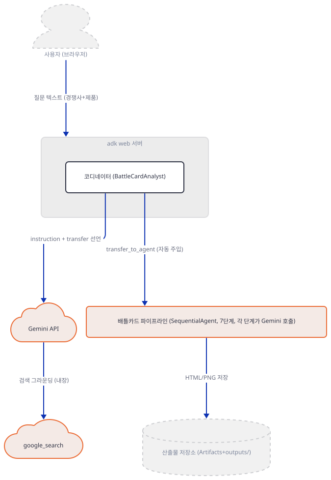

위 그림(개요)은 파이프라인 전체를 한 상자로 묶어 "각 단계가 Gemini 호출"이라고만 적어 뒀습니다 — 어느 단계가 정확히 무엇을 보내는지는 아래에 단계별로 풀었습니다. `google_search`는 별도 노드로 두되 화살표는 언제나 Gemini에서 나가야 방향이 사실과 맞습니다.

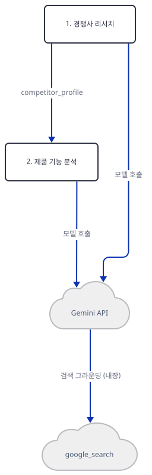

세 단계를 `google_search`까지 한 장에 그리면 세로 1027px로 상한(1000px)을 넘겨, 2단계를 다리로 겹쳐 두 장으로 나눴습니다.

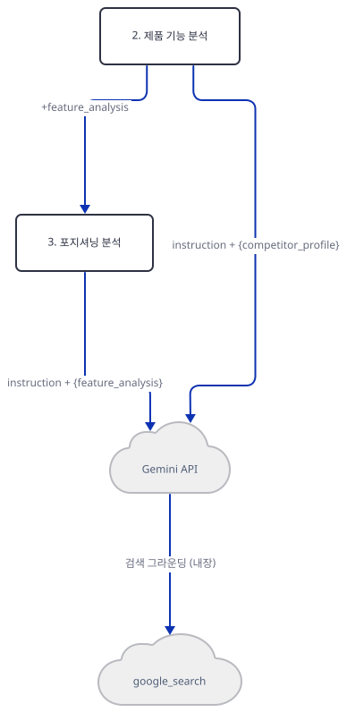

**확인.** Gemini 호출은 재현할 수 없으므로 Day 019~021처럼 `before_model_callback`으로 모델 응답을 흉내 내, `{competitor_profile}` 템플릿이 실제로 이전 단계 값으로 채워지는지 **파이프라인 전체**(`battle_card_pipeline`)를 스텁으로 돌려 직접 봅니다 — 1단계만 따로 돌리면 아직 아무 상태도 없어 템플릿 자체가 없으므로, 2단계 이상이 실제로 뭘 받는지 봐야 합니다.

```bash
PYTHONUNBUFFERED=1 uv run --no-project --python ai_sales_intelligence_agent_team/.venv python -c "
import asyncio
import ai_sales_intelligence_agent_team.agent as m
from google.adk.runners import InMemoryRunner
from google.adk.models.llm_response import LlmResponse
from google.genai import types

def text(t):
    return types.Content(role='model', parts=[types.Part(text=t)])

seen = {}
def make_cb(name):
    def cb(ctx, llm_request):
        seen[name] = llm_request.config.system_instruction if llm_request.config else None
        return LlmResponse(content=text(f'{name.upper()} OUTPUT'))
    return cb

for a in m.battle_card_pipeline.sub_agents:
    a.before_model_callback = make_cb(a.name)

async def main():
    runner = InMemoryRunner(agent=m.battle_card_pipeline, app_name='p')
    await runner.session_service.create_session(app_name='p', user_id='u', session_id='s')
    async for _ in runner.run_async(user_id='u', session_id='s', new_message=text('go')):
        pass
    i = seen['ProductFeatureAgent'].find('COMPETITOR PROFILE:')
    print('ProductFeatureAgent saw:', repr(seen['ProductFeatureAgent'][i:i+55]))
asyncio.run(main())
" 2>&1 | grep -v 'UserWarning\|declaration = tool._get_declaration'
```

직접 확인한 출력:

```
ProductFeatureAgent saw: 'COMPETITOR PROFILE:\nCOMPETITORRESEARCHAGENT OUTPUT\n\nUse'
```

캔 응답 `COMPETITORRESEARCHAGENT OUTPUT`이 `{competitor_profile}` 자리에 그대로 들어간 것을 직접 확인했습니다 — 파이썬 f-string이 아니라 ADK 자신의 템플리팅이 실제로 작동한다는 뜻입니다.

### Step 4. 합성 2단계 — 도구 없이 이전 결과만 종합

**목적.** SWOT·반박 스크립트 두 단계가 도구를 하나도 쓰지 않고, `output_key`로 쌓인 이전 값들만으로 응답을 만든다는 것을 확인합니다.

**할 일.** `swot_agent`의 지시문 앞부분입니다.

`advanced_ai_agents/multi_agent_apps/agent_teams/ai_sales_intelligence_agent_team/agent.py:169-181`

```python
    instruction="""
You are a competitive strategist creating a SWOT analysis.

COMPETITOR PROFILE:
{competitor_profile}

FEATURE ANALYSIS:
{feature_analysis}

POSITIONING INTEL:
{positioning_intel}

**CREATE A BRUTALLY HONEST SWOT ANALYSIS:**
```

앞 3단계의 `output_key` 세 개를 모두 참조합니다. 그런데 다음 단계인 `objection_handler_agent`(`agent.py:217-224`)는 `{competitor_profile}`과 `{swot_analysis}` 딱 둘만 참조하고 `feature_analysis`·`positioning_intel`은 건너뜁니다 — `positioning_intel`은 이 앱 전체에서 `swot_agent` 한 곳만 읽고, 그 뒤로는 어느 지시문에도 다시 등장하지 않습니다(전체 검색으로 확인). `output_key`로 상태에 저장되는 것과 나중에 실제로 읽히는 것은 다른 문제라는 뜻입니다 — Day 022가 `9_3_parallel_agent`에서 본 것(코드 주석·README는 `output_key` 공유를 말하지만 실제 코드엔 `output_key`가 아예 없어 `None`이었던 것, `day022…/README.md:519`)과는 다른 결의 어긋남입니다: 이번엔 `output_key`가 실제로 있고 값도 저장되지만, 그중 일부(`positioning_intel`)만 나중에 읽히지 않습니다.

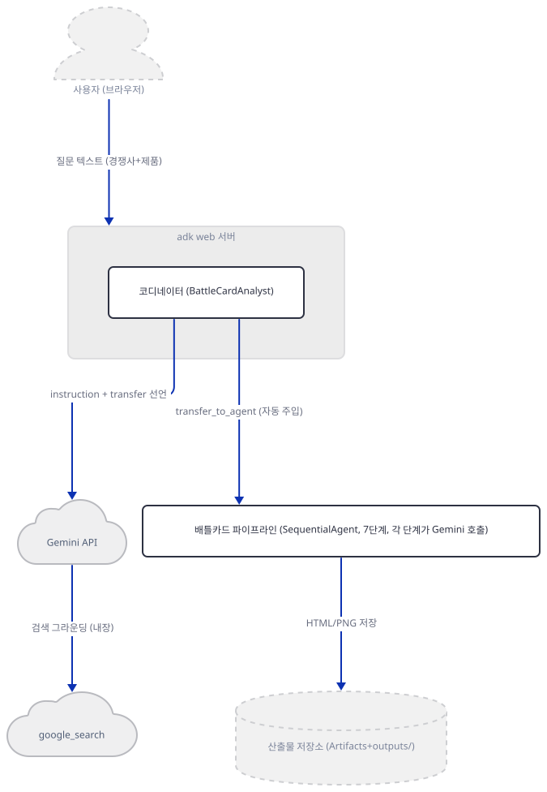

위 그림도 파이프라인을 한 상자로 묶었을 뿐이라, 4·5단계 각자가 Gemini에 무엇을 보내는지는 3단계를 다리로 이어 아래에 풀었습니다 — 이번 단계에서 5단계(`objection_handler_agent`)까지는 아직 새 산출물이 없습니다(산출물 저장은 다음 Step부터).

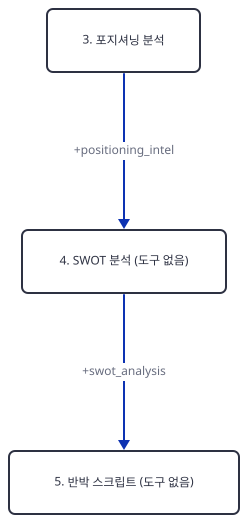

**확인.**

```bash
uv run --no-project --python ai_sales_intelligence_agent_team/.venv python -c "
from ai_sales_intelligence_agent_team.agent import swot_agent, objection_handler_agent
import re
for a in (swot_agent, objection_handler_agent):
    vars_used = re.findall(r'\{(\w+)\}', a.instruction)
    print(a.name, '| tools:', a.tools, '| 참조하는 state 키:', vars_used)
"
```

직접 확인한 출력:

```
StrengthsWeaknessesAgent | tools: [] | 참조하는 state 키: ['competitor_profile', 'feature_analysis', 'positioning_intel']
ObjectionHandlerAgent | tools: [] | 참조하는 state 키: ['competitor_profile', 'swot_analysis']
```

### Step 5. 산출물 생성 2단계 — 도구 안에서 두 번째 Gemini 호출

**목적.** 마지막 두 스테이지가 커스텀 함수 도구를 부르고, 그 도구가 ADK와 무관하게 자기 손으로 `google.genai.Client()`를 만들어 **또 한 번** Gemini를 호출한다는 것을 확인합니다.

**할 일.** HTML 배틀카드 도구의 핵심부입니다.

`advanced_ai_agents/multi_agent_apps/agent_teams/ai_sales_intelligence_agent_team/tools.py:68-95`

```python
    try:
        client = Client()
        response = await client.aio.models.generate_content(
            model="gemini-3-flash-preview",
            contents=prompt,
        )

        html_content = response.text

        # Clean up markdown wrapping if present
        if "```html" in html_content:
            start = html_content.find("```html") + 7
            end = html_content.rfind("```")
            html_content = html_content[start:end].strip()
        elif "```" in html_content:
            start = html_content.find("```") + 3
            end = html_content.rfind("```")
            html_content = html_content[start:end].strip()

        # Save as ADK artifact
        timestamp = datetime.now().strftime("%Y%m%d_%H%M%S")
        artifact_name = f"battle_card_{timestamp}.html"
        html_artifact = types.Part.from_bytes(
            data=html_content.encode('utf-8'),
            mime_type="text/html"
        )

        version = await tool_context.save_artifact(filename=artifact_name, artifact=html_artifact)
```

`Client()`는 `agent.py`의 어느 `LlmAgent`와도 무관한, `tools.py`가 직접 만드는 별도의 클라이언트입니다 — 즉 `battle_card_generator_agent`가 이 도구를 호출하는 순간, Gemini에는 두 번 닿습니다: ① ADK가 `battle_card_generator_agent` 자신의 모델 호출로 "이 도구를 쓰라"고 결정할 때, ② 그 도구 함수 내부에서 `client.aio.models.generate_content`로 실제 HTML을 생성할 때. `comparison_chart_agent`의 도구(`generate_comparison_chart`)도 같은 구조지만 이미지 모델과 응답 모달리티가 다릅니다.

`advanced_ai_agents/multi_agent_apps/agent_teams/ai_sales_intelligence_agent_team/tools.py:165-174`

```python
        response = await client.aio.models.generate_content(
            model="gemini-3-pro-image-preview",
            contents=prompt,
            config=types.GenerateContentConfig(
                response_modalities=["TEXT", "IMAGE"]
            )
        )

        # Look for image in response
        for part in response.candidates[0].content.parts:
```

Day 082가 이미 `gemini-3-pro-image-preview`로 인포그래픽을 만드는 것을 다뤘지만(`research_planner_executor_agent.py:78-84`), 그 코드는 `config=` 없이 모델 자체의 기본 동작에 맡겼습니다. 오늘 코드는 `response_modalities=["TEXT", "IMAGE"]`를 명시적으로 요청에 실어 텍스트와 이미지를 함께 받겠다고 선언합니다 — 이 옵션 하나가 다릅니다. 다만 두 모델 다 실제로는 부를 수 없습니다 — Day 082가 같은 자리에서 이미 확인했듯, Google 공식 "Model deprecations" 문서(https://ai.google.dev/gemini-api/docs/deprecations, 2026-09-28 확인)에 `gemini-3-pro-preview`는 2026-03-09에, `gemini-3-pro-image-preview`는 2026-06-25에 이미 서비스 종료로 올라 있고, 대체 모델은 각각 `gemini-3.1-pro-preview`·`gemini-3-pro-image`입니다. 오늘 설치된 google-genai 2.25.0의 모델 목록에서 직접 확인했습니다.

```bash
grep -c '"gemini-3-pro-preview"\|"gemini-3-pro-image-preview"' ai_sales_intelligence_agent_team/.venv/Lib/site-packages/google/genai/_gaos/types/interactions/model.py
grep -n '"gemini-3.1-pro-preview"\|"gemini-3-pro-image"' ai_sales_intelligence_agent_team/.venv/Lib/site-packages/google/genai/_gaos/types/interactions/model.py
```

(macOS/Linux에서 `uv pip install`이 만드는 경로는 `.venv/lib/python3.x/site-packages`로 다릅니다 — 위 경로는 Windows의 `uv venv` 기준입니다.)

직접 확인한 출력:

```
0
48:        "gemini-3.1-pro-preview",
54:        "gemini-3-pro-image",
```

두 옛 이름은 SDK의 모델 목록 어디에도 없고(카운트 0), 대체 이름만 있습니다(2026-09-29 확인) — Day 082가 같은 파일로 확인한 것과 같은 결과입니다. 키를 넣어도 3단계(`positioning_analyzer_agent`, `gemini-3-pro-preview`)에서 멈추므로, 6·7단계의 이 두 번째 Gemini 호출까지는 실제로 도달하지 못합니다. 문제 해결에 다시 적습니다.

두 도구 모두 `Client()` 생성 자체가 실패할 수 있는 지점을 `try/except`로 감싸 두어서, 키가 없으면 예외가 서버를 죽이지 않고 구조화된 dict로 바뀝니다(`tools.py:109-111`, `tools.py:206-208`).

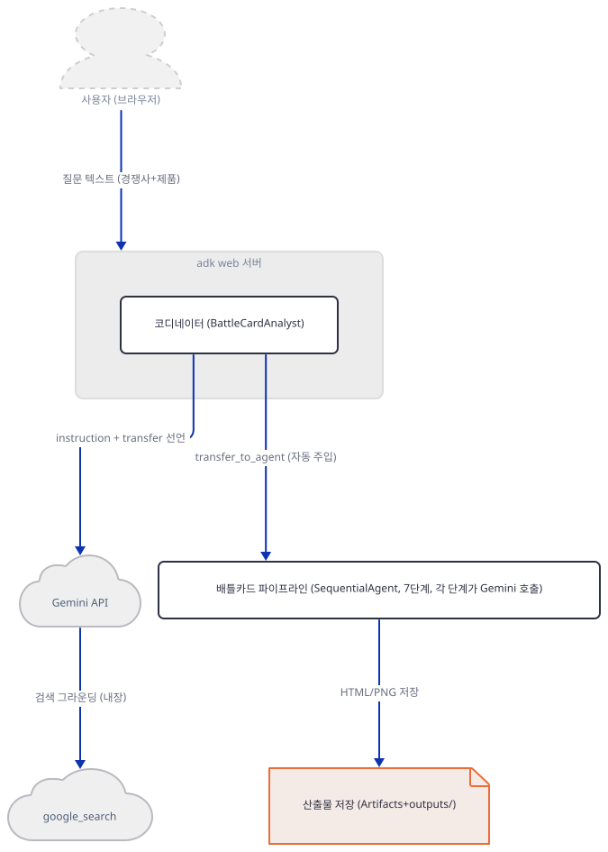

두 단계 각자 자신의 ADK 모델 호출(도구를 쓸지 정하고, 함수 응답 뒤 요약하는 2회)과, 그 도구 함수 내부의 별도 `Client()` 호출까지 합쳐 두 장으로 나눠 그렸습니다 — 한 장에 다 넣으면 화살표가 몰려 겹칩니다.

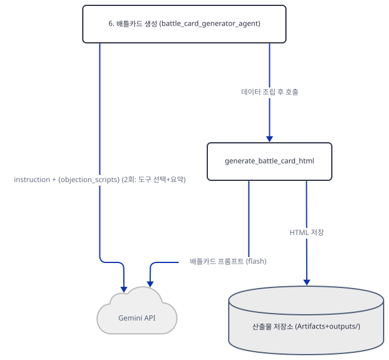

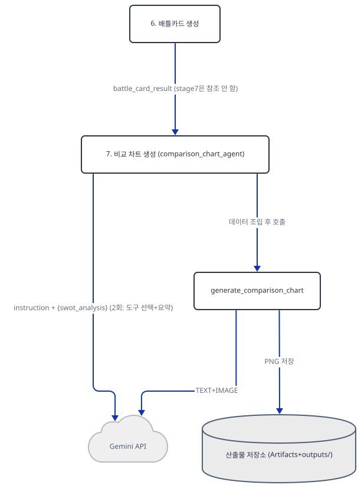

**확인.** 키 없이 두 도구를 직접 호출해 어디서 멈추는지 봅니다(스크래치로 복사한 사본에서 실행 — `outputs/` 생성 때문입니다, Step 1 참고).

```bash
uv run --no-project --python ai_sales_intelligence_agent_team/.venv python -c "
import asyncio
from ai_sales_intelligence_agent_team.tools import generate_battle_card_html, generate_comparison_chart
async def main():
    r1 = await generate_battle_card_html('fake data', None)
    print('battle_card:', r1)
    r2 = await generate_comparison_chart('Salesforce', 'HubSpot', 'fake comparison', None)
    print('chart:', r2)
asyncio.run(main())
"
```

직접 확인한 출력(표준출력):

```
battle_card: {'status': 'error', 'message': 'No API key was provided. Please pass a valid API key. Learn how to create an API key at https://ai.google.dev/gemini-api/docs/api-key.'}
chart: {'status': 'error', 'message': 'No API key was provided. Please pass a valid API key. Learn how to create an API key at https://ai.google.dev/gemini-api/docs/api-key.'}
```

표준에러에는 두 함수의 `logger.error(...)` 호출(`tools.py:110`, `tools.py:207`)이 남긴 줄과, `Client()`가 만든 내부 HTTP 클라이언트를 이벤트 루프가 정리하는 과정에서 나는 무해한 트레이스백이 각각 하나씩 함께 찍힙니다(직접 확인 — 이 앱의 버그가 아니라 google-genai 2.25.0 자신의 정리 코드 문제입니다):

```
Error generating battle card: No API key was provided. ...
Error generating comparison infographic: No API key was provided. ...
Task exception was never retrieved
...AttributeError("'BaseApiClient' object has no attribute '_async_httpx_client'")
Task exception was never retrieved
...AttributeError("'BaseApiClient' object has no attribute '_async_httpx_client'")
```

`Client()` 생성자 자체가 `ValueError`를 던지는 지점은 Day 014·088과 똑같지만, 여기서는 그 예외가 함수 안의 `try/except`에 잡혀 `perplexity_search`(Day 088)처럼 사전 검사로 막는 게 아니라 사후에 dict로 정리됩니다 — 그래서 두 도구 모두 `tool_context`에 `None`을 넘겨도(진짜 `ToolContext`가 아니어도) 저장 코드에 닿기 전에 이미 멈춰 오류가 나지 않습니다.

### Step 6. 코디네이터 → 워크플로 에이전트 전환 — 이번 요청 안에서는 돌아오지 않는다

**목적.** Day 021이 "전환에는 복귀 보장이 없다"고 확인한 것을, 대상이 `LlmAgent`가 아니라 `SequentialAgent`일 때는 어떻게 되는지, 그리고 7단계 각각이 정말 텍스트 이벤트를 내는지 직접 실행으로 봅니다. `agent.py`는 고치지 않고 임포트한 객체에 콜백만 얹습니다.

**할 일.** 7개 스테이지 전부에 `before_model_callback`을 얹어 실제 Gemini 없이 파이프라인 전체를 끝까지 돌리고, 이번엔 텍스트가 나오는 이벤트를 **전부** 모읍니다(직전 버전은 마지막 것만 남겼는데, 그러면 나머지 6개가 실제로 났는지는 확인되지 않습니다).

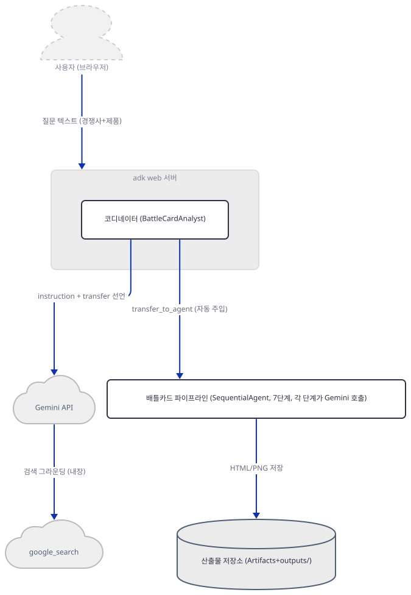

**확인.**

```bash
PYTHONUNBUFFERED=1 uv run --no-project --python ai_sales_intelligence_agent_team/.venv python -c "
import asyncio
import ai_sales_intelligence_agent_team.agent as m
from google.adk.runners import InMemoryRunner
from google.adk.models.llm_response import LlmResponse
from google.genai import types

def text(t):
    return types.Content(role='model', parts=[types.Part(text=t)])
def fn_call(name, args):
    return types.Content(role='model', parts=[types.Part(function_call=types.FunctionCall(name=name, args=args))])

CANNED = {
    'CompetitorResearchAgent': 'COMPETITOR PROFILE: Salesforce.',
    'ProductFeatureAgent': 'FEATURES: strong automation.',
    'PositioningAnalyzer': 'POSITIONING: enterprise IT buyers.',
    'StrengthsWeaknessesAgent': 'SWOT: they win ecosystem, we win UX.',
    'ObjectionHandlerAgent': 'OBJECTIONS: too expensive -> TCO.',
    'BattleCardGenerator': 'BATTLE CARD TEXT.',
    'ComparisonChartAgent': 'COMPARISON CHART TEXT.',
}
def make_cb(name):
    def cb(ctx, llm_request):
        return LlmResponse(content=text(CANNED[name]))
    return cb
def root_cb(ctx, llm_request):
    return LlmResponse(content=fn_call('transfer_to_agent', {'agent_name': 'BattleCardPipeline'}))

m.root_agent.before_model_callback = root_cb
for a in m.battle_card_pipeline.sub_agents:
    a.before_model_callback = make_cb(a.name)

async def main():
    runner = InMemoryRunner(agent=m.root_agent, app_name='p')
    await runner.session_service.create_session(app_name='p', user_id='u', session_id='s')
    msg = types.Content(role='user', parts=[types.Part(text='Battle card for Salesforce, we sell HubSpot')])
    authors, text_events = [], []
    async for event in runner.run_async(user_id='u', session_id='s', new_message=msg):
        authors.append(event.author)
        if event.content and event.content.parts and getattr(event.content.parts[0], 'text', None):
            text_events.append((event.author, event.content.parts[0].text))
    print('event authors:', authors)
    print('text events:')
    for a, t in text_events:
        print(' -', a, '|', t)
asyncio.run(main())
"
```

직접 확인한 출력(표준에러의 `context_cache_config` 경고와 `UserWarning` 두 줄은 Day 021에서 이미 본 것과 같은 무해한 안내라 생략합니다):

```
event authors: ['BattleCardAnalyst', 'BattleCardAnalyst', 'CompetitorResearchAgent', 'ProductFeatureAgent', 'PositioningAnalyzer', 'StrengthsWeaknessesAgent', 'ObjectionHandlerAgent', 'BattleCardGenerator', 'ComparisonChartAgent']
text events:
 - CompetitorResearchAgent | COMPETITOR PROFILE: Salesforce.
 - ProductFeatureAgent | FEATURES: strong automation.
 - PositioningAnalyzer | POSITIONING: enterprise IT buyers.
 - StrengthsWeaknessesAgent | SWOT: they win ecosystem, we win UX.
 - ObjectionHandlerAgent | OBJECTIONS: too expensive -> TCO.
 - BattleCardGenerator | BATTLE CARD TEXT.
 - ComparisonChartAgent | COMPARISON CHART TEXT.
```

`root_agent`가 `transfer_to_agent(BattleCardPipeline)`를 부른 뒤로는 **이번 요청 안에서는** 두 번 다시 등장하지 않고, 7단계 **전부**가 각자 텍스트 이벤트를 냅니다 — 마지막 것만 나는 게 아닙니다. 코디네이터 지시문이 약속한 "After analysis, summarize key findings"를 코디네이터 자신이 실행할 자리는 이번 요청 안엔 없습니다. Day 021의 `LlmAgent → LlmAgent` 전환은 대상이 마음먹으면(지시문에 그렇게 적으면) 같은 요청 안에서도 되돌아올 **가능성**이라도 있었지만, `SequentialAgent`는 `LlmAgent`가 아니어서 애초에 `transfer_to_agent` 도구 자체가 없습니다(Day 022가 확인한 것과 같은 이유) — 이번 요청 안에서 되돌아올 길이 없습니다. 다만 이것이 "영원히 못 돌아온다"는 뜻은 아닙니다 — 같은 세션에 **다음** 메시지를 새로 보내면 `adk web`은 다시 `root_agent`부터 시작합니다. 이유는 세션이 마지막 작성자를 잊어서가 아니라(오히려 ADK는 마지막 작성자를 **기억해서 이어가려고 먼저 시도**합니다) 그 작성자가 이어받을 자격이 없기 때문입니다 — google-adk 2.10.0의 `_find_agent_to_run`(`runners.py`, 소스로 확인)은 "마지막에 답한 `LlmAgent`가 에이전트 계층 전체로 전환 가능하면" 그 에이전트를 이어서 쓰는데, `is_transferable_across_agent_tree`(`agents/_agent_router.py`, 소스로 확인)는 조상을 부모 쪽으로 타고 올라가며 전부 `disallow_transfer_to_parent` 필드를 가진 `LlmAgent`인지 확인합니다. `ComparisonChartAgent`의 부모는 이 필드가 없는 `SequentialAgent`라 이 검사가 그 자리에서 `False`로 끝나고, 그래서 이어받지 못한 채 `root_agent`로 되돌아갑니다.

### Step 7. `adk web`으로 띄우기 — 첫 Gemini 호출에서 멈춘다

**목적.** 이 앱을 실제로 띄우고, 키 없이 세션을 만들면 정확히 어디서 멈추는지 Day 014·088과 같은 방식으로 확인합니다.

**할 일.** `ai_sales_intelligence_agent_team` 폴더 **안에서** 실행합니다(Step 2~6과 달리 부모 폴더가 아닙니다 — `adk web`은 에이전트 폴더 자체를 인자로 받습니다).

```bash
cd ai_sales_intelligence_agent_team
uv run --no-project adk web --no_use_local_storage .
```

(저장소 루트에서 곧바로 시작한다면 `cd advanced_ai_agents/multi_agent_apps/agent_teams/ai_sales_intelligence_agent_team`을 씁니다. `--no_use_local_storage`는 Day 088도 이미 쓴 적이 있는 플래그입니다(088:409) — 다만 이 옵션이 막는 로컬 저장소는 홈 디렉터리가 아니라 **에이전트 폴더 자신의 `.adk/`**입니다. google-adk 2.10.0의 `cli/utils/dot_adk_folder.py`(소스로 확인)를 보면 `DotAdkFolder.dot_adk_dir`가 `agent_dir / ".adk"`이고 그 안에 `session.db`·`artifacts/`를 둡니다 — 이 옵션 없이 띄우면 `ai_sales_intelligence_agent_team/.adk/`가 생긴다는 뜻입니다.)

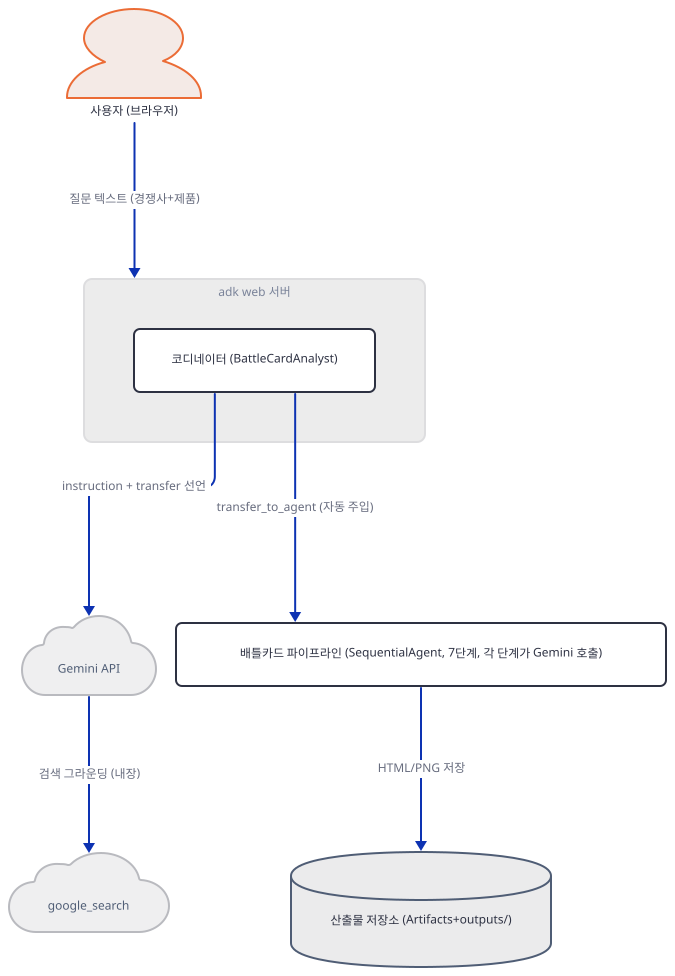

**확인.** 배너가 뜬 뒤, 다른 터미널에서 목록부터 봅니다.

```bash
curl.exe -s http://127.0.0.1:8000/list-apps
```

```
["ai_sales_intelligence_agent_team"]
```

세션을 만들고 메시지를 보냅니다.

```bash
curl.exe -s -X POST "http://127.0.0.1:8000/apps/ai_sales_intelligence_agent_team/users/u1/sessions/s1" -H "Content-Type: application/json" -d "{}"
curl.exe -s -o /dev/null -w "HTTP %{http_code}\n" -X POST http://127.0.0.1:8000/run -H "Content-Type: application/json" -d '{"appName":"ai_sales_intelligence_agent_team","userId":"u1","sessionId":"s1","newMessage":{"role":"user","parts":[{"text":"Create a battle card for Salesforce. We sell HubSpot."}]}}'
```

```
HTTP 500
```

서버 터미널에는 Day 014·088과 정확히 같은 마지막 줄이 찍힙니다.

```
ValueError: No API key was provided. Please pass a valid API key. Learn how to create an API key at https://ai.google.dev/gemini-api/docs/api-key.
```

`root_agent` 조회, 지시문 조립까지는 전부 성공하고, ADK가 코디네이터 자신의 첫 모델 호출을 위해 `google-genai`의 `Client`를 만들려는 바로 그 순간에 멈춥니다 — 파이프라인으로 전환되기도 전입니다. (Windows PowerShell에서 `curl`은 `Invoke-WebRequest`의 별칭이라 `curl.exe`처럼 확장자를 붙여야 합니다 — Day 014에서 이미 확인했습니다.)

## 요청 한 건이 흐르는 과정

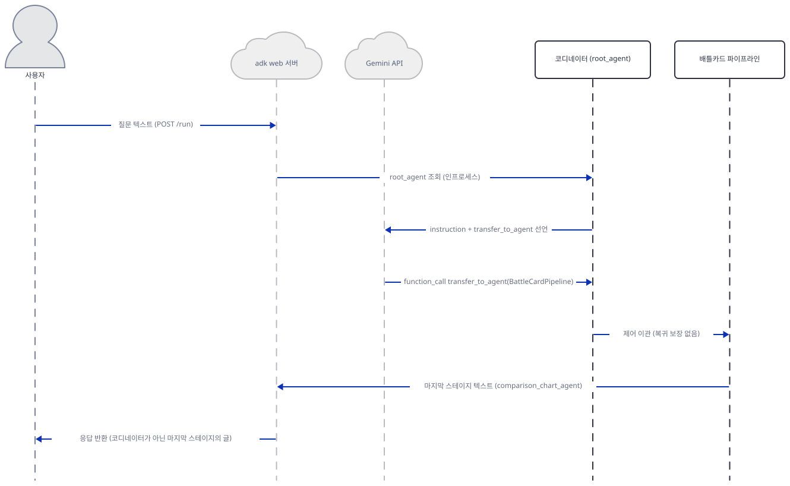

사용자가 "Create a battle card for Salesforce. We sell HubSpot."을 보내면 `adk web`이 `POST /run_sse`로 `root_agent`를 조회해 실행합니다(google-adk 2.10.0 웹 UI 번들의 `runSse()`가 이 경로를 부릅니다 — Day 088과 같은 사실). 코디네이터의 첫 모델 호출엔 `transfer_to_agent` 하나만 도구로 실려 있고(Step 2에서 확인한 대로 `tools=`가 비어 있으므로), Gemini가 `function_call: transfer_to_agent(agent_name="BattleCardPipeline")`를 돌려주면 그 순간부터 제어는 파이프라인으로 넘어갑니다.

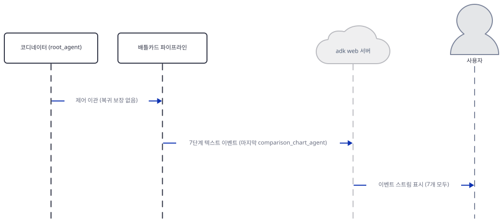

여기서부터 7단계가 이어지는 자세한 과정은 시간 경계별로 그림에 나눠 뒀습니다 — 리서치 3단계는 위 [리서치 1~2단계](diagrams/extra-research1.svg)·[리서치 2~3단계](diagrams/extra-research2.svg), 합성 2단계는 [합성 2단계](diagrams/extra-synthesis.svg), 산출물 생성 2단계는 [6단계: 배틀카드 생성](diagrams/extra-generation1.svg)·[7단계: 비교 차트 생성](diagrams/extra-generation2.svg)입니다. Step 6이 직접 실행으로 확인했듯 **7단계 전부**가 각자 텍스트 이벤트를 내고, `adk_web`은 이 이벤트들을 스트림으로 그대로 사용자에게 돌려줍니다 — 코디네이터가 다시 실행되어 요약하는 일은 일어나지 않고, 마지막으로 화면에 남는 것은 `comparison_chart_agent`의 글입니다. 이 문서는 키가 없어 실제 Gemini 응답까지는 관찰하지 못했고, Step 1~7에서 직접 실행한 것은 의존성 설치·소스 구조·상태 템플리팅·전환 메커니즘·`adk web`의 실제 정지 지점까지입니다.

## 실행 체크리스트

- [ ] `uv venv && uv pip install -r requirements.txt`로 설치하고 `google-adk`·`google-genai` 버전을 확인했다
- [ ] `tools.py`를 임포트하면 `outputs/`가 소스 폴더에 즉시 생기는 것을 확인하고, 스크래치 사본에서만 실행했다
- [ ] `root_agent.sub_agents`에 `SequentialAgent`가 들어 있고, `tools=`가 비어 있는데도 `transfer_to_agent`가 자동으로 붙는 것을 확인했다
- [ ] 리서치 3단계가 같은 모양(`google_search` + `output_key`)을 반복하고, `{state_key}` 템플릿이 실제 값으로 치환되는 것을 확인했다
- [ ] `positioning_intel`이 `swot_agent` 한 곳에서만 읽히고 그 뒤로는 참조되지 않는 것을 정규식으로 확인했다
- [ ] `generate_battle_card_html`·`generate_comparison_chart`를 키 없이 호출해 `Client()` 생성자가 `ValueError`를 던지고 dict로 정리되는 것을 확인했다
- [ ] 스텁 콜백으로 파이프라인 전체를 돌려 `root_agent`가 이번 요청 안에서는 다시 실행되지 않고, 7단계 전부가 각자 텍스트 이벤트를 내는 것을 확인했다
- [ ] `ai_sales_intelligence_agent_team` 폴더 안에서 `adk web --no_use_local_storage .`을 띄우고 `/list-apps`·`/run`으로 Day 014·088과 같은 `ValueError` 지점을 재현했다
- [ ] (키가 있다면) 실제 `GOOGLE_API_KEY`로 띄워 배틀카드를 생성해 본다 — 단, 3단계 모델이 서비스 종료라 지금 리포 코드 그대로는 끝까지 가지 않는다

## 문제 해결

| 증상 | 원인 | 해결 |
|---|---|---|
| 앱 자신의 README대로 `cd awesome-llm-apps/advanced_ai_agents/multi_agent_apps/agent_team/ai_sales_intelligence_team`을 실행하면 폴더를 찾지 못함 | 실제 경로는 `agent_team`이 아니라 `agent_teams`(복수형)이고, 폴더명도 `ai_sales_intelligence_team`이 아니라 `ai_sales_intelligence_agent_team`이다(직접 확인 — 두 군데가 다르다) | `advanced_ai_agents/multi_agent_apps/agent_teams/ai_sales_intelligence_agent_team`으로 이동 |
| `tools.py`를 임포트하거나 앱을 실행하면 소스 폴더 옆에 `outputs/`가 생김 | `OUTPUTS_DIR.mkdir(exist_ok=True)`가 모듈 최상위 코드라 **임포트 시점에** 실행된다(`tools.py:15-16`, 직접 확인) | 저장소 안에서 재현할 때는 앱 폴더를 스크래치로 복사한 사본에서 임포트·실행한다 |
| `adk web`을 대화형 터미널에서 처음 실행하면 텔레메트리 동의 프롬프트가 뜬다 | Day 014·088과 같은 `sys.stdin.isatty()` 분기(`google/adk/utils/_telemetry_config.py`) | 비대화형으로 실행하면(`< /dev/null`) 프롬프트 텍스트만 찍히고 막히지 않는다. 또는 한 번 답하거나 `adk telemetry disable` |
| `/run`에 메시지를 보내면 응답 본문이 `Internal Server Error`뿐 | `GOOGLE_API_KEY`가 없으면 첫 Gemini 호출(코디네이터 자신의 모델 호출)에서 `google-genai`의 `Client` 생성자가 `ValueError`를 던지고 ADK는 이를 HTTP 500으로만 반환한다(Day 014·088과 같은 지점) | `GOOGLE_API_KEY`를 셸 환경변수로 설정하고 서버 재시작. 원인은 서버 터미널 로그에서 확인 |
| Windows PowerShell에서 `curl` 명령이 매개변수 오류를 냄 | PowerShell이 `curl`을 `Invoke-WebRequest`의 별칭으로 미리 정의해 둔다(Day 014에서 이미 확인) | `curl.exe`처럼 확장자를 붙여 호출 |
| 실제 키를 넣고 `adk web`으로 돌려도 3단계(`positioning_analyzer_agent`)에서 멈추고 배틀카드·차트가 나오지 않음 | 3~5단계가 쓰는 `gemini-3-pro-preview`(2026-03-09 종료)와 7단계 도구가 쓰는 `gemini-3-pro-image-preview`(2026-06-25 종료)가 이미 Google 공식 문서에서 서비스 종료로 확인된다(Day 082가 같은 모델로 먼저 확인, Step 5에서 SDK 모델 목록으로 재확인) | 리포 코드는 고치지 않음 — `agent.py:114,167,215`를 `gemini-3.1-pro-preview`로, `tools.py:166`을 `gemini-3-pro-image`로 바꿔야 끝까지 감 |

## 더 해보기

- `agent.py:114`(`positioning_analyzer_agent`)·`agent.py:167`(`swot_agent`)·`agent.py:215`(`objection_handler_agent`)의 `gemini-3-pro-preview`를 `gemini-3.1-pro-preview`로, `tools.py:166`의 `gemini-3-pro-image-preview`를 `gemini-3-pro-image`로 사본에서 바꾸고, 실제 `GOOGLE_API_KEY`로 `adk web`을 띄워 7단계가 이번엔 정말 끝까지 도는지, Artifacts 탭에 `battle_card_*.html`과 `comparison_infographic_*.png`가 함께 올라오는지 확인해 보기
- `objection_handler_agent`(`agent.py:213-258`)의 지시문에 `{positioning_intel}` 블록을 추가해 보고, `product_feature_agent`처럼 6번째 스테이지(`battle_card_generator_agent`)까지 그 값이 실제로 전달되는지 Step 3의 스텁 콜백 방식으로 확인해 보기
- `comparison_chart_agent`의 도구(`tools.py:114-208`)에서 `response_modalities=["TEXT", "IMAGE"]`를 `["IMAGE"]`만으로 바꿔 보고, `response.text`(HTML 도구가 쓰는 필드)가 비게 되는지, `for part in response.candidates[0].content.parts`가 여전히 안전한지 소스로 따라가 보기

## 다음 날 예고

[Day 092 · 📊 AI VC Due Diligence Agent Team](../day092-ai-vc-due-diligence-agent-team/README.md) — 같은 Google ADK `SequentialAgent` 패턴으로, 스타트업 이름이나 URL 하나로 시장 분석·재무 모델링·리스크 평가를 거쳐 맥킨지 스타일 실사 보고서와 인포그래픽을 만드는 7단계 파이프라인을 다룹니다(원본 앱 README 기준).
