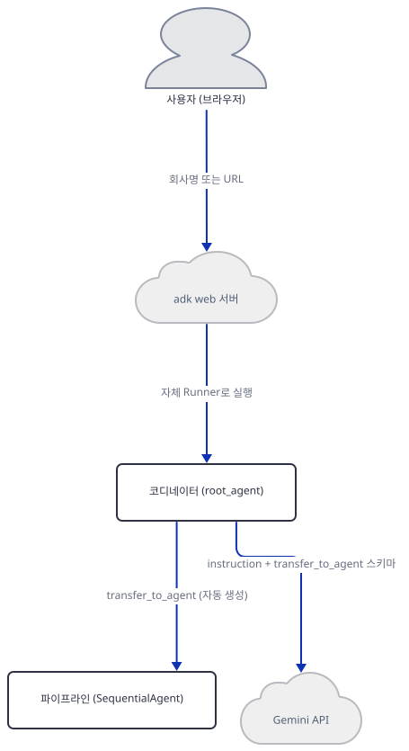
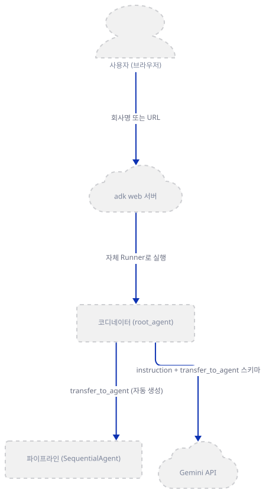
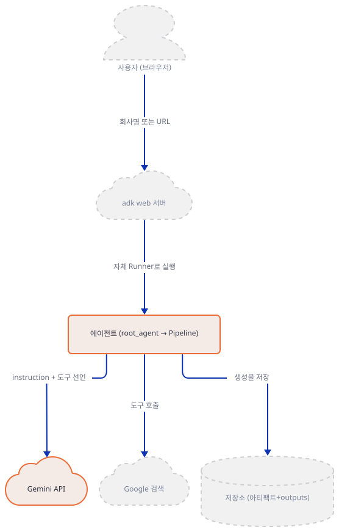
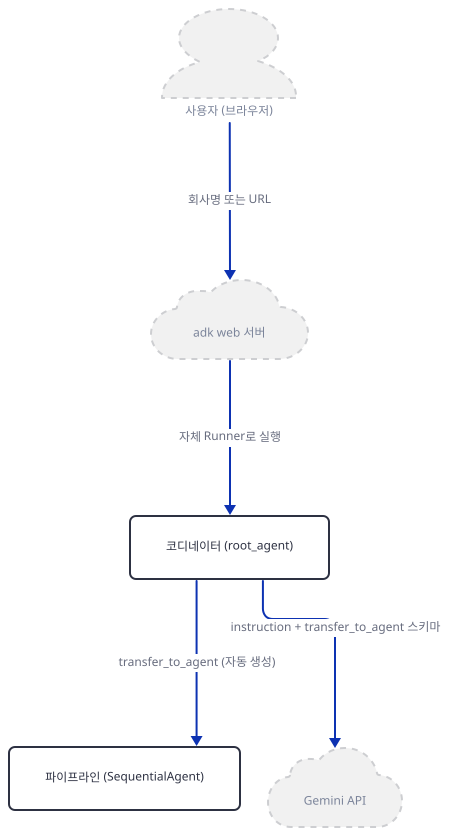
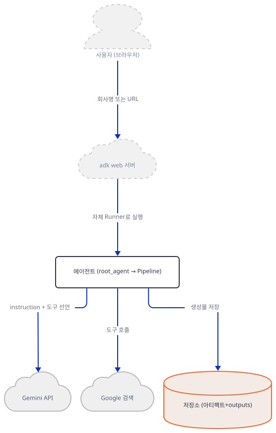
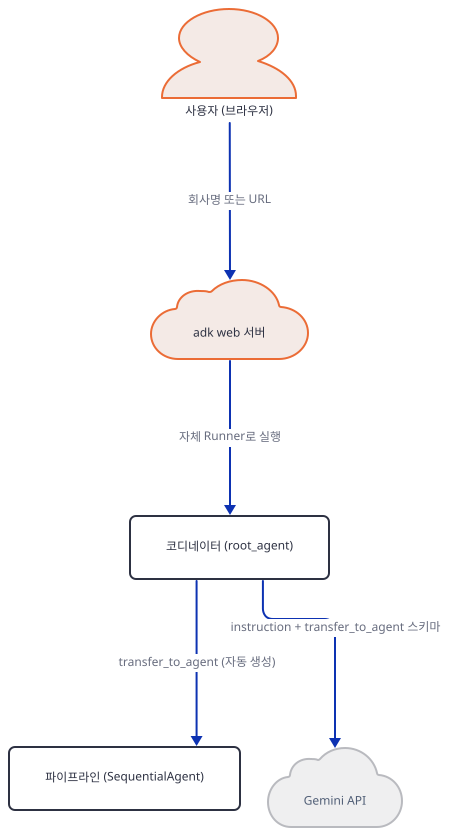
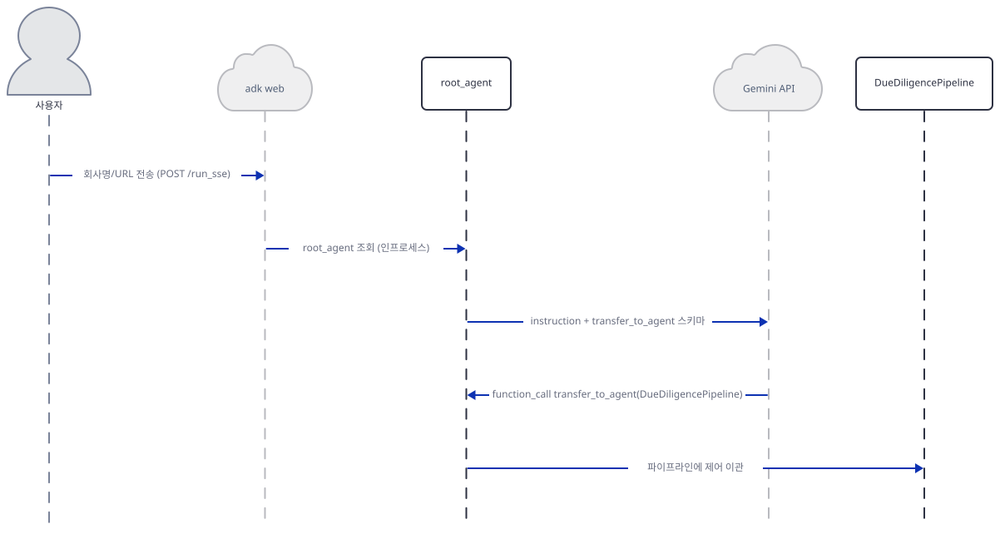
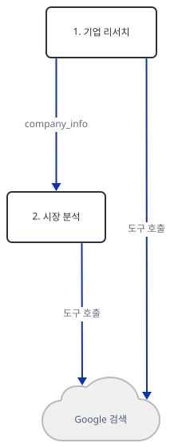
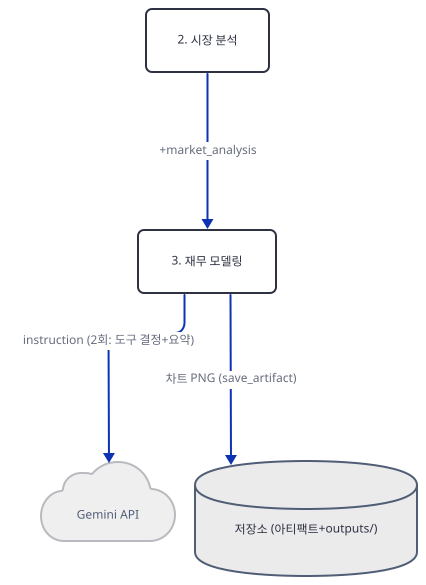
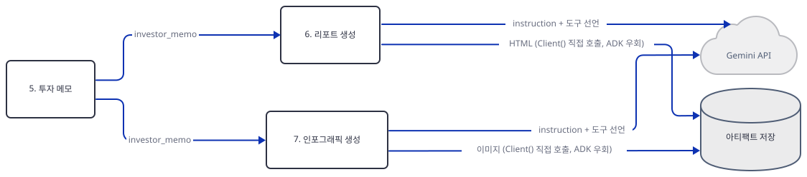

# Day 092 · 📊 AI VC Due Diligence Agent Team

> 볼륨 7 🚀 Advanced AI Agents · 난이도 ★★★ · 예상 소요 60분(google-adk 2.10.0 site-packages 소스로 자동 전환 대상 규칙을 직접 확인하고, 도구 3개를 가짜 `ToolContext`로 하나씩 실행해 보고, `adk web`을 격리 환경에서 띄워 확인하는 손 작업이 섞여 있습니다) · API 비용 대략 분석 1건에 Gemini 호출 최소 7회(파이프라인 각 단계 1회씩, 2단계는 `google_search` 왕복이 더해짐) + 리포트·인포그래픽 도구 안의 직접 `Client()` 호출 2회 — 키가 없어 실측 못함(대략치) · 원본 앱: `advanced_ai_agents/multi_agent_apps/agent_teams/ai_vc_due_diligence_agent_team`

## 오늘 만들 것

Day 078에서 시작한 "🚀 Advanced AI Agents" 볼륨에서 google-adk를 쓰는 다섯 번째 자리입니다(Day 014~023 크래시 코스, Day 067, Day 077, Day 088에 이어 — Day 088 README의 확인 그대로, 그 사이 089·090·091은 다른 프레임워크입니다). Day 088의 `ai_consultant_agent`는 `LlmAgent` 하나에 도구 3개를 얹은 단일 에이전트였지만, 오늘의 `agent.py`(386줄)는 `LlmAgent` 8개를 두 겹으로 묶습니다 — 코디네이터 `root_agent` 하나가 `SequentialAgent`인 `due_diligence_pipeline` 하나를 `sub_agents=`로 받고, 그 파이프라인이 다시 리서치→시장분석→재무모델링→리스크평가→투자메모→리포트생성→인포그래픽생성 순서로 서브 에이전트 7개를 순서대로 실행합니다. `SequentialAgent` 자체의 동작(같은 세션을 공유하는 `for`문, 전환 불가)은 Day 022가 이미 소스로 확인했고, `sub_agents=`가 자동으로 `transfer_to_agent` 도구를 만드는 것은 Day 021이 이미 확인했습니다 — 오늘 새로운 것은 그 자동 전환의 **대상이 다른 `LlmAgent`가 아니라 `SequentialAgent`(워크플로 에이전트) 자신**이라는 점입니다. google-adk 2.10.0 소스(`google/adk/flows/llm_flows/extensions/_agent_transfer.py`)를 직접 읽어 `_get_transfer_targets`가 대상의 타입을 가리지 않고 `sub_agents`를 그대로 전환 대상에 넣는다는 것을 확인했습니다(Step 2).

`tools.py`(280줄)의 도구 3개도 서로 다른 성격입니다. `generate_financial_chart`는 matplotlib로 로컬에서 차트를 그리고 `tool_context.save_artifact`로 저장할 뿐이라 키 없이도 끝까지 실행됩니다(Step 4, 직접 확인) — 반면 `generate_html_report`·`generate_infographic`은 ADK가 관리하는 모델 호출을 아예 쓰지 않고, 함수 안에서 `google.genai`의 `Client()`를 직접 새로 만들어 `client.aio.models.generate_content()`를 호출합니다(`tools.py:161-165`, `tools.py:237-244`) — ADK의 `LlmAgent` 흐름을 완전히 우회하는 별도의 API 호출입니다. 이 저장소 코드가 직접 `Client()`를 만드는 것은 Day 060(RAG 라우팅)이 마지막이었는데, 그때는 임베딩 호출이었고 이번은 **텍스트/이미지 생성**입니다. 아래는 완성 아키텍처입니다.



## 사전 준비

| 서비스/도구 | 용도 | 발급·설치 |
|---|---|---|
| Google AI Studio API 키 (`GOOGLE_API_KEY`, 또는 `GEMINI_API_KEY`) | 파이프라인 8개 에이전트가 공유하는 `gemini-3-flash-preview`·`gemini-3-pro-preview` 호출과, `tools.py`가 직접 만드는 `Client()`의 `gemini-3-pro-image-preview` 호출까지 모두 이 키로 인증한다. 이 앱엔 Streamlit이 없어 `adk web`을 띄우기 **전에** 셸 환경변수로 설정하거나 앱 폴더 안에 `.env`로 둔다 — `load_dotenv_for_agent` 메커니즘은 Day 088에서 이미 확인했다. 이 문서는 키를 발급하지 않고 없을 때 어디서 멈추는지만 확인한다 | https://aistudio.google.com/apikey. `gemini-3-*-preview` 계열은 2026-09-29 기준 이 저장소가 실제로 요청하는 모델명이며, 프리뷰이므로 접근 제한이나 이름 변경 가능성이 있다(소스로 확인, 발급은 하지 않았다) |
| uv | 가상환경 생성과 패키지 설치 | [공통 사전 준비](../README.md#공통-사전-준비-한-번만) 절 참고 |
| 인터넷 연결 | PyPI 설치, 키가 있다면 Gemini API·Google 검색 접속 | 별도 설치 없음 |

## 아키텍처 한눈에 보기

| 컴포넌트 | 역할 | 코드 위치 |
|---|---|---|
| 사용자 (브라우저) | ADK 개발자 웹 UI로 회사명 또는 URL 전송 | 코드 없음 (외부 UI) |
| `adk web` 서버 | 앱 폴더를 스캔·임포트해 FastAPI 앱과 채팅 UI를 자체 구동(Day 014·088과 같은 CLI, google-adk 2.10.0) | 코드 없음 |
| 패키지 진입점 (`__init__.py`) | `root_agent` 하나만 재노출 — Day 088의 `__init__.py`와 달리 `Runner`·`session_service`는 이 앱 어디에도 없다(전체 검색으로 확인) | `advanced_ai_agents/multi_agent_apps/agent_teams/ai_vc_due_diligence_agent_team/__init__.py:1-5` |
| 코디네이터 에이전트 (`root_agent`, `LlmAgent`) | 사용자 입력을 보고 파이프라인으로 전환할지 직접 답할지 결정 | `advanced_ai_agents/multi_agent_apps/agent_teams/ai_vc_due_diligence_agent_team/agent.py:348-383` |
| 파이프라인 (`due_diligence_pipeline`, `SequentialAgent`) | 서브 에이전트 7개를 선언 순서대로 끝까지 실행(Day 022 확인 그대로) | `advanced_ai_agents/multi_agent_apps/agent_teams/ai_vc_due_diligence_agent_team/agent.py:329-341` |
| 파이프라인 서브 에이전트 7개 | 리서치→시장분석→재무모델링→리스크평가→투자메모→리포트생성→인포그래픽생성, `output_key`로 상태를 이어받음 | `advanced_ai_agents/multi_agent_apps/agent_teams/ai_vc_due_diligence_agent_team/agent.py:23-322` |
| 재무 차트 도구 (`generate_financial_chart`) | matplotlib로 Bear/Base/Bull 차트를 로컬에서 그리고 `save_artifact` — 키 없이도 끝까지 동작 | `advanced_ai_agents/multi_agent_apps/agent_teams/ai_vc_due_diligence_agent_team/tools.py:20-118` |
| ADK 우회 도구 (`generate_html_report`, `generate_infographic`) | ADK 모델 흐름을 쓰지 않고 함수 안에서 직접 `Client()`를 만들어 Gemini를 호출 | `advanced_ai_agents/multi_agent_apps/agent_teams/ai_vc_due_diligence_agent_team/tools.py:121-203`, `advanced_ai_agents/multi_agent_apps/agent_teams/ai_vc_due_diligence_agent_team/tools.py:206-280` |
| Google 검색 (`google_search`, ADK 내장 도구) | 1·2단계 에이전트가 기업·시장 정보를 실제로 검색(Day 088의 죽은 임포트와 달리 여기선 실사용) | 코드 없음 (google-adk 내장) |
| Gemini API | 8개 에이전트의 추론 + 우회 도구 2개의 직접 호출까지 두 경로로 도달하는 동일 서비스 | 코드 없음 (외부 서비스) |
| ADK 아티팩트 저장소 | `--no_use_local_storage`로 띄우면 인메모리 아티팩트 서비스가 쓰인다(직접 확인, Step 5) | 코드 없음 (google-adk 런타임) |

## 단계별 진행

### Step 1. 환경 만들기 — docstring이 광고하는 기능 하나는 죽은 임포트다

**목적.** 격리된 가상환경에 4줄짜리 `requirements.txt`를 설치하고, `agent.py`·`tools.py`가 실제로 컴파일·임포트되는지, 모듈 docstring의 주장과 실제 코드가 일치하는지 확인합니다.

**할 일.**

```bash
cd advanced_ai_agents/multi_agent_apps/agent_teams/ai_vc_due_diligence_agent_team
uv venv
uv pip install -r requirements.txt
```

(pip 대안: `python -m venv .venv && source .venv/bin/activate && pip install -r requirements.txt`. `uv venv`가 만든 환경엔 pip이 없어 `pip install`을 그대로 쓰면 실패한다는 것은 Day 014에서 이미 확인했으므로 위 명령은 처음부터 `uv pip install`을 씁니다.) 저장소 루트에 `pyproject.toml`이 있어 이후 `uv run`에는 모두 `--no-project`를 붙입니다.

`advanced_ai_agents/multi_agent_apps/agent_teams/ai_vc_due_diligence_agent_team/requirements.txt:1-4`

```text
google-adk>=1.0.0
google-genai>=1.0.0
python-dotenv>=1.0.0
matplotlib>=3.8.0
```

(4줄, 마지막 줄에 개행이 없어 `wc -l`은 3으로 셉니다.) 직접 설치하면 **google-adk 2.10.0**, **google-genai 2.25.0**이 받아집니다 — Day 088을 쓴 날과 같은 버전입니다(직접 확인).

모듈 맨 위 docstring은 이 앱이 보여 주는 기능 다섯 가지를 광고합니다.

`advanced_ai_agents/multi_agent_apps/agent_teams/ai_vc_due_diligence_agent_team/agent.py:1-16`

```python
"""AI Due Diligence Agent - Multi-Agent Pipeline for Startup Investment Analysis

This demonstrates ADK's SequentialAgent pattern with Gemini's capabilities:
- Web search for company and market research
- Code execution for financial modeling
- Extended reasoning for risk assessment
- Structured output for investor memos
- Image generation for visual summaries

Pattern Reference: https://google.github.io/adk-docs/agents/multi-agents/#sequentialagent
"""

from google.adk.agents import LlmAgent, SequentialAgent
from google.adk.tools import google_search
from google.adk.code_executors import BuiltInCodeExecutor
from .tools import generate_html_report, generate_infographic, generate_financial_chart
```

"Code execution for financial modeling"(5행)이 광고하는 `BuiltInCodeExecutor`는 15행에서 임포트되지만, 파일 전체를 검색해도 `code_executor=`처럼 실제로 쓰는 곳이 한 곳도 없습니다(직접 확인) — 재무 모델링은 Step 4에서 보는 것처럼 코드 실행이 아니라 `generate_financial_chart`라는 일반 함수 도구가 담당합니다. Day 088의 `google_search` 죽은 임포트와 같은 패턴이 이번엔 `BuiltInCodeExecutor`에서 반복됩니다.



**확인.**

```bash
uv run --no-project python -c "import google.adk, google.genai; print('google-adk', google.adk.__version__); print('google-genai', google.genai.__version__)"
uv run --no-project python -m py_compile agent.py tools.py __init__.py && echo compile-ok
```

```
google-adk 2.10.0
google-genai 2.25.0
compile-ok
```

(리포 안 원본 폴더에서 `py_compile`을 실행하면 그 폴더에 `__pycache__`가 생깁니다 — 이 문서는 저장소 밖 스크래치 사본에서 확인했습니다.)

### Step 2. 코디네이터와 SequentialAgent — 전환 대상이 이번엔 다른 LlmAgent가 아니다

**목적.** `root_agent`가 `sub_agents=[due_diligence_pipeline]`로 워크플로 에이전트 하나를 자동 전환 대상으로 삼는다는 것을, google-adk 소스로 직접 확인합니다.

**할 일.** 파이프라인과 코디네이터 선언을 봅니다.

`advanced_ai_agents/multi_agent_apps/agent_teams/ai_vc_due_diligence_agent_team/agent.py:329-341`

```python
due_diligence_pipeline = SequentialAgent(
    name="DueDiligencePipeline",
    description="Complete due diligence pipeline: Research → Market → Financials → Risks → Memo → Report → Infographic",
    sub_agents=[
        company_research_agent,
        market_analysis_agent,
        financial_modeling_agent,
        risk_assessment_agent,
        investor_memo_agent,
        report_generator_agent,
        infographic_generator_agent,
    ],
)
```

`advanced_ai_agents/multi_agent_apps/agent_teams/ai_vc_due_diligence_agent_team/agent.py:348-383`

```python
root_agent = LlmAgent(
    name="DueDiligenceAnalyst",
    model="gemini-3-flash-preview",
    description="AI-powered due diligence analyst for startup investments",
    instruction="""
You are a senior investment analyst helping evaluate startup investment opportunities.

**WHAT YOU ACCEPT:**
- Company name: "Analyze Agno AI"
- Website URL: "Due diligence on https://agno.com"
- Both: "Check out Lovable at https://lovable.dev"

**WHEN USER PROVIDES A COMPANY/URL TO ANALYZE:**
→ transfer_to_agent to "DueDiligencePipeline"

The pipeline will:
1. Research the company (works for both well-known and early-stage startups)
2. Analyze market and competitors
3. Build financial models
4. Assess investment risks
5. Generate investor memo, HTML report, and infographic

**EXAMPLES TO ROUTE TO PIPELINE:**
- "Analyze https://agno.com for seed investment"
- "Due diligence on Lovable - the AI app builder"
- "Evaluate Cursor IDE as a Series A opportunity"
- "Check out https://replit.com for investment"
- "Research this startup: https://v0.dev"

**FOR GENERAL QUESTIONS:**
Answer directly about VC, due diligence, or how you can help.

After analysis, summarize key findings and mention the generated artifacts.
""",
    sub_agents=[due_diligence_pipeline],
)
```

`sub_agents=`가 있으면 ADK의 `AutoFlow`가 자동으로 `transfer_to_agent` 도구를 만든다는 것은 Day 021이 이미 확인했습니다. 그 전환 대상을 고르는 함수가 대상의 타입을 가리는지는 google-adk 2.10.0 패키지 내부의 `_get_transfer_targets`(`google/adk/flows/llm_flows/extensions/_agent_transfer.py`, site-packages, 소스로 확인)를 직접 읽어 확인했습니다 — "Sub-agents of the current agent, excluding those in 'single_turn' mode"라고만 적혀 있고 `LlmAgent`인지 `SequentialAgent`인지는 묻지 않습니다. `root_agent`의 유일한 서브 에이전트는 `SequentialAgent`인 `due_diligence_pipeline`이므로, `root_agent`가 만드는 `transfer_to_agent` 도구의 유일한 대상은 이 워크플로 에이전트 자신입니다 — Day 021·077의 사례는 전환 대상이 전부 다른 `LlmAgent`였다는 점이 다릅니다.



**확인.**

```bash
uv run --no-project --python .venv/Scripts/python.exe python -c "
import sys; sys.path.insert(0, '..')
from ai_vc_due_diligence_agent_team import root_agent
print('root:', root_agent.name, root_agent.model)
print('sub_agents:', [a.name for a in root_agent.sub_agents])
pipeline = root_agent.sub_agents[0]
print('pipeline type:', type(pipeline).__name__)
print('pipeline stages:', [a.name for a in pipeline.sub_agents])
"
```

(부모 폴더에서 패키지로 임포트해야 하므로 `sys.path`에 상위 폴더를 넣거나, `cd ..` 후 실행합니다 — Day 088 Step 2와 같은 이유입니다.)

```
root: DueDiligenceAnalyst gemini-3-flash-preview
sub_agents: ['DueDiligencePipeline']
pipeline type: SequentialAgent
pipeline stages: ['CompanyResearchAgent', 'MarketAnalysisAgent', 'FinancialModelingAgent', 'RiskAssessmentAgent', 'InvestorMemoAgent', 'ReportGeneratorAgent', 'InfographicGeneratorAgent']
```

### Step 3. Google 검색 — 이번엔 죽은 줄이 아니라 실제로 쓰인다

**목적.** 1·2단계 에이전트가 `google_search` 내장 도구를 실제로 `tools=[...]`에 넣어 쓴다는 것과, `output_key`로 다음 단계에 상태를 넘긴다는 것을 확인합니다. `output_key` 자체의 동작은 Day 016이 이미 다뤘으므로 여기서는 이 앱이 그것을 어떻게 잇는지만 봅니다.

**할 일.**

`advanced_ai_agents/multi_agent_apps/agent_teams/ai_vc_due_diligence_agent_team/agent.py:23-60`

```python
company_research_agent = LlmAgent(
    name="CompanyResearchAgent",
    model="gemini-3-flash-preview",
    description="Researches company information using web search",
    instruction="""
You are a senior investment analyst conducting company research.

The user may provide:
- A company name (e.g., "Agno AI")
- A website URL (e.g., "https://agno.com")
- Or both

**RESEARCH STRATEGY:**

1. If URL provided: Start by searching for information about that specific URL/domain
2. If only company name: Search for "[company name] startup funding" and similar queries
3. For lesser-known startups: Search for their domain, LinkedIn, Crunchbase, news mentions

**GATHER THIS INFORMATION:**

1. **Company Basics**: What they do, founded when, HQ location, team size
2. **Founders & Team**: Key people, their backgrounds, LinkedIn profiles
3. **Product/Technology**: Core offering, how it works, target customers
4. **Funding History**: Any rounds raised, investors, amounts (if available)
5. **Traction**: Customers, partnerships, growth signals
6. **Recent News**: Any press coverage, product launches, announcements

**FOR EARLY-STAGE/UNKNOWN STARTUPS:**
- Check their website, LinkedIn company page, Twitter/X
- Look for Crunchbase, PitchBook, or AngelList profiles
- Search for founder interviews or podcast appearances
- Note if information is limited (that's useful data too)

Be thorough but realistic about what's publicly available for early-stage companies.
""",
    tools=[google_search],
    output_key="company_info",
)
```

`market_analysis_agent`(`agent.py:67-94`)도 같은 모양으로 `tools=[google_search]`를 쓰고, 지시문 안에 `{company_info}`를 넣어 앞 단계의 `output_key` 값을 그대로 읽습니다. 두 에이전트 모두 도구가 `google_search` 하나뿐입니다 — Day 088의 `ai_consultant_agent`는 11행에서 같은 도구를 임포트만 하고 `tools=[...]`엔 끝내 넣지 않았지만, 이 앱은 실제로 사용합니다.



**확인.**

```bash
uv run --no-project --python .venv/Scripts/python.exe python -c "
import sys; sys.path.insert(0, '..')
from ai_vc_due_diligence_agent_team.agent import company_research_agent, market_analysis_agent
for a in (company_research_agent, market_analysis_agent):
    print(a.name, '| tools:', [getattr(t, 'name', getattr(t, '__name__', repr(t))) for t in a.tools], '| output_key:', a.output_key)
"
```

```
CompanyResearchAgent | tools: ['google_search'] | output_key: company_info
MarketAnalysisAgent | tools: ['google_search'] | output_key: market_analysis
```

### Step 4. 재무 차트는 키 없이 되고, 리포트·인포그래픽은 `Client()`에서 막힌다

**목적.** 파이프라인 3·6·7단계가 쓰는 도구 셋의 실제 동작을 가짜 `ToolContext`로 직접 실행해, 무엇이 키 없이 되고 무엇이 안 되는지 정확한 경계를 확인합니다.

**할 일.** `generate_financial_chart`는 matplotlib로 그린 PNG를 `tool_context.save_artifact`로 저장할 뿐, 네트워크를 전혀 쓰지 않습니다.

`advanced_ai_agents/multi_agent_apps/agent_teams/ai_vc_due_diligence_agent_team/tools.py:1-17`

```python
"""Custom tools for the Due Diligence Pipeline.

Provides HTML report generation, financial charts, and infographic creation.
"""

import logging
import io
from pathlib import Path
from datetime import datetime
from google.adk.tools import ToolContext
from google.genai import types, Client

logger = logging.getLogger("DueDiligencePipeline")

# Create outputs directory for generated files
OUTPUTS_DIR = Path(__file__).parent / "outputs"
OUTPUTS_DIR.mkdir(exist_ok=True)
```

16~17행은 함수 안이 아니라 **모듈 최상위 코드**입니다 — `import ai_vc_due_diligence_agent_team.tools`만 해도 그 폴더 옆에 `outputs/`가 즉시 생깁니다(직접 확인). 이 문서는 저장소 밖 스크래치 사본에서만 임포트해 원본 폴더에는 아무것도 만들지 않았습니다.

반면 `generate_html_report`·`generate_infographic`은 ADK가 관리하는 모델 호출을 쓰지 않고 함수 안에서 직접 `Client()`를 만듭니다.

`advanced_ai_agents/multi_agent_apps/agent_teams/ai_vc_due_diligence_agent_team/tools.py:160-165`

```python
    try:
        client = Client()
        response = await client.aio.models.generate_content(
            model="gemini-3-flash-preview",
            contents=prompt,
        )
```

`generate_infographic`(`tools.py:236-244`)도 같은 모양으로 `Client()`를 새로 만들고, `response_modalities=["TEXT", "IMAGE"]`를 줘 `gemini-3-pro-image-preview`로 이미지까지 받습니다. 두 함수 모두 `except Exception`으로 감싸 실패를 `{"status": "error", ...}` dict로 돌려주므로, 이 호출이 실패해도 파이프라인 전체가 죽지는 않습니다.



**확인.** 세 도구 모두 `async def`라 진짜 `ToolContext` 대신 `save_artifact`만 흉내 내는 가짜 객체로 직접 호출합니다.

```bash
uv run --no-project --python .venv/Scripts/python.exe python -c "
import sys; sys.path.insert(0, '..')
import asyncio
from ai_vc_due_diligence_agent_team.tools import generate_financial_chart, generate_html_report, generate_infographic

class FakeToolContext:
    async def save_artifact(self, filename, artifact):
        return 1

async def main():
    chart = await generate_financial_chart(
        company_name='TestCo', current_arr=1.2,
        bear_rates='1.5,1.3,1.2,1.1,1.1', base_rates='3.0,2.5,2.0,1.8,1.5', bull_rates='4.5,3.5,2.5,2.0,1.8',
        tool_context=FakeToolContext(),
    )
    print('chart:', chart['status'], chart['summary'])
    html = await generate_html_report(report_data='dummy memo', tool_context=FakeToolContext())
    print('html_report:', html)
    infographic = await generate_infographic(data_summary='dummy summary', tool_context=FakeToolContext())
    print('infographic:', infographic)

asyncio.run(main())
"
```

```
chart: success {'year_5_bear': '$3.4M', 'year_5_base': '$48.6M', 'year_5_bull': '$170.1M'}
html_report: {'status': 'error', 'message': 'No API key was provided. Please pass a valid API key. Learn how to create an API key at https://ai.google.dev/gemini-api/docs/api-key.'}
infographic: {'status': 'error', 'message': 'No API key was provided. Please pass a valid API key. Learn how to create an API key at https://ai.google.dev/gemini-api/docs/api-key.'}
```

`generate_financial_chart`는 키가 전혀 없는 이 환경에서도 끝까지 성공하고 PNG를 `outputs/`에 저장합니다 — 파이프라인 7단계 중 키 없이 완주하는 유일한 단계입니다. 나머지 둘은 함수 안의 `Client()` 생성자 자체가 `ValueError`로 멈추고, 그 예외를 함수가 직접 잡아 오류 dict로 바꿉니다.

### Step 5. `adk web`으로 띄우기 — 이번에도 첫 추론에서 멈춘다

**목적.** 앱을 실제로 띄우고, 키 없이 요청을 보내면 파이프라인이 시작되기도 전에 `root_agent`의 첫 추론에서 멈춘다는 것을 Day 088과 같은 방식으로 확인합니다.

**할 일.** 앱 폴더 **안에서** 실행합니다.

```bash
uv run --no-project adk web --no_use_local_storage .
```

`adk web`을 대화형 터미널에서 처음 실행하면 텔레메트리 동의를 묻는데, 이 프롬프트와 `~/.adk/config.json`의 관계는 Day 088이 이미 소스로 확인했습니다(`sys.stdin.isatty()`일 때만 묻고 저장하며, 비대화형 실행은 아무것도 쓰지 않습니다). `--no_use_local_storage`를 주면 서버 로그에 "Local artifact storage is disabled; using in-memory artifact service"가 찍힙니다(직접 확인) — Step 4에서 확인한 `save_artifact`가 실제로 어디에 쌓이는지의 답입니다.



**확인.** 다른 터미널에서 목록부터 봅니다.

```bash
curl.exe -s http://127.0.0.1:8000/list-apps
```

```
["ai_vc_due_diligence_agent_team"]
```

(Windows PowerShell에서 `curl`이 `Invoke-WebRequest` 별칭인 문제는 Day 014·088이 이미 확인했습니다 — `curl.exe`로 부릅니다.)

세션을 만들고 메시지를 보냅니다.

```bash
curl.exe -s -X POST "http://127.0.0.1:8000/apps/ai_vc_due_diligence_agent_team/users/u1/sessions/s1" -H "Content-Type: application/json" -d "{}"
curl.exe -s -o /dev/null -w "HTTP %{http_code}\n" -X POST http://127.0.0.1:8000/run -H "Content-Type: application/json" -d '{"appName":"ai_vc_due_diligence_agent_team","userId":"u1","sessionId":"s1","newMessage":{"role":"user","parts":[{"text":"Analyze Agno AI for Series A"}]}}'
```

```
HTTP 500
```

서버 터미널 마지막 줄은 Day 014·088과 정확히 같습니다(직접 확인, 임의 포트 59431로 격리 재현).

```
ValueError: No API key was provided. Please pass a valid API key. Learn how to create an API key at https://ai.google.dev/gemini-api/docs/api-key.
```

`root_agent`가 `transfer_to_agent`를 부를지 판단하려고 첫 Gemini 호출을 시도하는 순간 멈춥니다 — 7단계 파이프라인 중 어느 것도 아직 시작되지 않은 시점입니다. Step 4에서 본 재무 차트 도구가 파이프라인 안에서 실제로 실행되는 것을 보려면 이 첫 관문을 통과할 진짜 키가 필요합니다.

## 요청 한 건이 흐르는 과정



사용자가 회사명이나 URL을 보내면 `adk web`은 `POST /run_sse`로 `root_agent`를 인프로세스에서 조회합니다(Day 088과 같은 메커니즘). `root_agent`는 지시문과 함께 자동 생성된 `transfer_to_agent` 스키마를 Gemini에 보내고, 소스로 확인한 대로라면 Gemini는 `function_call: transfer_to_agent(DueDiligencePipeline)`을 돌려줘야 합니다 — 이 문서는 키가 없어 이 지점 대신 Step 5에서 확인한 `ValueError`만 실제로 관찰했습니다. 전환이 성공했다면 제어는 `DueDiligencePipeline`으로 넘어가 1단계(`CompanyResearchAgent`)부터 시작합니다.



1·2단계는 `google_search`를 왕복하며 `company_info`를 만들고 그 값을 그대로 이어받아 `market_analysis`를 만듭니다(Step 3). 이어서 3~5단계는 상태를 계속 누적합니다.



3단계(`FinancialModelingAgent`)만 `generate_financial_chart`로 차트 PNG를 아티팩트에 남기고(Step 4에서 키 없이 확인한 바로 그 경로), 4·5단계는 도구 없이 순수 추론만으로 `risk_assessment`·`investor_memo`를 쌓습니다. 마지막 두 단계는 `investor_memo`를 공통 입력으로 받아 독립적으로 갈라집니다 — `SequentialAgent`의 `for`문이 6번을 7번보다 먼저 실행할 뿐, 7단계가 6단계의 출력을 읽지는 않습니다(agent.py의 각 `instruction`을 대조해 확인).



6·7단계는 각자 ADK 경유로 한 번(도구 호출을 결정하는 자신의 추론), 그리고 도구 함수 안에서 `Client()`로 또 한 번, Gemini에 두 경로로 도달합니다 — Step 4에서 직접 실행해 본 그 `ValueError`가 실제 파이프라인 안에서도 같은 지점에서 발생합니다.

## 실행 체크리스트

- [ ] `uv venv && uv pip install -r requirements.txt`로 설치하고 `google-adk 2.10.0`·`google-genai 2.25.0`을 확인했다
- [ ] `BuiltInCodeExecutor`가 임포트만 되고 실제로는 쓰이지 않는다는 것을 전체 검색으로 확인했다
- [ ] `root_agent.sub_agents`의 유일한 원소가 `SequentialAgent`이고, google-adk 소스로 이것이 유효한 전환 대상임을 확인했다
- [ ] `CompanyResearchAgent`·`MarketAnalysisAgent`가 `google_search`를 실제로 `tools=[...]`에 넣어 쓴다는 것을 확인했다
- [ ] `generate_financial_chart`를 가짜 `ToolContext`로 직접 호출해 키 없이 성공한다는 것을 확인했다
- [ ] `generate_html_report`·`generate_infographic`이 함수 안의 `Client()` 생성자에서 막힌다는 것을 확인했다
- [ ] `adk web`을 앱 폴더 안에서 띄우고 `/list-apps`·`/run`으로 Day 014·088과 같은 `ValueError` 지점을 재현했다

## 문제 해결

| 증상 | 원인 | 해결 |
|---|---|---|
| 모듈 docstring이 "Code execution for financial modeling"을 광고하지만 실제 코드엔 코드 실행이 없음 | `BuiltInCodeExecutor`(`agent.py:15`)가 임포트만 되고 어떤 에이전트에도 `code_executor=`로 연결되지 않음(전체 검색으로 확인) | 재무 모델링은 `generate_financial_chart` 함수 도구가 대신 담당한다 — docstring이 실제 구현보다 앞서 있는 문서 오류로 보고 넘어간다 |
| `tools.py`를 임포트만 했는데 앱 폴더에 `outputs/`가 생김 | `OUTPUTS_DIR.mkdir(exist_ok=True)`(`tools.py:17`)가 함수 안이 아니라 모듈 최상위에 있어 임포트 시점에 실행됨 | 리포 코드를 직접 만지며 확인할 땐 저장소 밖 사본에서 임포트한다 |
| `/run`에 메시지를 보내면 `Internal Server Error`뿐, 원인은 응답 본문에 없음 | 키가 없으면 `google-genai`의 `Client` 생성자가 `ValueError`를 던지고 ADK가 HTTP 500으로만 반환한다(Day 014·088과 같은 지점) | `GOOGLE_API_KEY`를 셸 환경변수로 설정하고 서버 재시작. 원인은 서버 터미널 로그에서 확인 |
| Windows PowerShell에서 이 문서의 `curl` 명령이 매개변수 오류를 낸다 | PowerShell이 `curl`을 `Invoke-WebRequest`의 별칭으로 미리 정의해 둔다(Day 014·088에서 이미 확인) | `curl.exe`처럼 확장자를 붙여 호출 |

## 더 해보기

- `generate_html_report`·`generate_infographic`의 `Client()` 호출부(`tools.py:161`, `tools.py:237`)를 `Client(api_key=...)`로 바꿔 명시적으로 키를 넘기도록 고쳐보고, ADK 자신의 모델 라우팅을 거치는 나머지 6개 에이전트와 실패 지점이 달라지는지 비교해보기
- `BuiltInCodeExecutor`를 `financial_modeling_agent`에 실제로 `code_executor=`로 연결해보고, `generate_financial_chart` 함수 도구 없이도 같은 차트 계산이 재현되는지 Day 022의 방식으로 확인해보기
- 실제 `GOOGLE_API_KEY`를 발급받아 `adk web`으로 전체 7단계를 완주시켜보고, 6단계(`ReportGeneratorAgent`)가 정말 5단계의 `investor_memo`만 읽고 7단계의 결과와는 무관하게 실행되는지 이벤트 로그로 확인해보기

## 다음 날 예고

[Day 093 · 🔍 AI Fraud Investigation Agent](../day093-ai-fraud-investigation-agent/README.md) — 보육시설 인허가 기록과 실제 건물 데이터를 대조해 이상 징후를 찾는 단일 에이전트를 다룹니다(원본 앱 README 기준).
