# Day 093 · 🔍 AI Fraud Investigation Agent

> 볼륨 7 🚀 Advanced AI Agents · 난이도 ★★☆ · 예상 소요 65분(단일 파일이지만 외부 연동이 4곳 — IL DCFS·Cook County·Google Maps·IL SOS — 이라 각 도구가 키 유무에 따라 어디서 멈추는지 하나씩 직접 호출해 확인하고, `json.dumps`의 이스케이프·지연 평가된 타입 힌트처럼 실제 출력을 한 글자씩 대조하는 손 시간이 듭니다) · API 비용 정확한 도구 호출 횟수는 키가 없어 확인하지 못함(대략치) — OpenRouter의 `anthropic/claude-sonnet-4.6` 요금은 프롬프트 $3·완성 $15(1M 토큰당, openrouter.ai 모델 페이지 확인, 2026-09-29)이고 시스템 프롬프트만 약 5,200자(직접 확인)이며 공급자마다 누적 대화가 다시 전송되므로, ZIP 하나(공급자 최대 100곳까지 조사 대상)를 완주하면 수천 원대까지도 갈 수 있음 · 원본 앱: `advanced_ai_agents/single_agent_apps/ai_fraud_investigation_agent`

## 오늘 만들 것

Day 078에서 연 "🚀 Advanced AI Agents" 볼륨이 이어집니다. Day 078~090 가운데 OpenRouter를 LLM 제공자로 쓴 날은 없었습니다(각 날짜 README로 확인) — 오늘의 935줄(`wc -l` 기준, 마지막 줄 개행 있음) `fraud_investigation_agent.py`는 agno의 `OpenRouter` 모델 클래스(`OpenAILike`를 상속해 OpenRouter의 OpenAI 호환 엔드포인트를 호출 — 소스로 확인, agno 3.0.11)로 기본값 `anthropic/claude-sonnet-4.6`을 부르는 이 볼륨 첫 사례입니다. 앱은 시카고 Cook County의 보조금 지원 어린이집(subsidized childcare provider) 인허가 기록을 조사하는 자율 에이전트 "Surelock Homes"를 만듭니다. 핵심 아이디어는 건축법규가 물리 법칙이라는 것입니다 — 앱의 시스템 프롬프트는 Illinois DCFS Title 89 Part 407 기준이라며 어린이 1명당 실사용 35 sq ft, 실사용 면적은 총면적의 65%라는 값을 못박아 두고(`fraud_investigation_agent.py:95-101`, 앱 프롬프트 기준 — 규정 원문은 확인하지 않았습니다), 이 가정대로 계산하면 900 sq ft 건물은 서류상 정원이 얼마든 최대 16명입니다(직접 확인: `calculate_max_capacity(900)` → `max_legal_capacity: 16`). 에이전트는 이 계산 하나로 끝나지 않고 7개 도구로 Illinois DCFS 라이선싱 사이트(ASP.NET ViewState 스크레이핑), Cook County Assessor의 Socrata 오픈데이터(인증 불필요, 4단계 폴백), Google Maps(지오코딩·스트리트뷰·Places, 선택), Illinois 국무장관실(Secretary of State) 사업자 등록을 교차 대조하며 추론을 실시간으로 서술합니다 — 시스템 프롬프트 자체가 "서술이 곧 산출물"이라고 못박습니다. 같은 프롬프트는 "fraud"라는 단어 사용을 명시적으로 금지하고 "requires further investigation"·"exhibits anomalies"만 쓰도록 강제합니다(직접 확인: 시스템 프롬프트에 `NEVER` 지침과 "fraud" 언급이 함께 존재함). 이 튜토리얼도 같은 이유로 실제 공급자 이름이나 주소를 조사 대상으로 실행하지 않습니다 — 키가 없어 실행할 수 없다는 점 외에도, 이 앱의 출력은 어디까지나 조사 단서(investigative lead)이지 법적 결론이 아니라는 점을 가드레일 절이 스스로 반복해서 밝히고 있기 때문입니다(`fraud_investigation_agent.py:136`, "All findings are investigation leads, not evidence for prosecution"). 조사 범위는 데모용으로 Cook County, Illinois의 ZIP 코드 10개로 고정되어 있습니다(앱 README로 확인). 이 볼륨의 다른 agno 날들(078·079·086·087·089)과 마찬가지로, `agent.run()`이 성공할 때마다 agno가 익명 사용 통계를 자체 API로 보냅니다 — Day 047 Step 5와 같은 사실입니다(소스로 확인 — agno 3.0.11의 `agent/agent.py`가 `telemetry: bool = True`를 선언합니다. `AGNO_TELEMETRY=false`로 끌 수 있습니다).

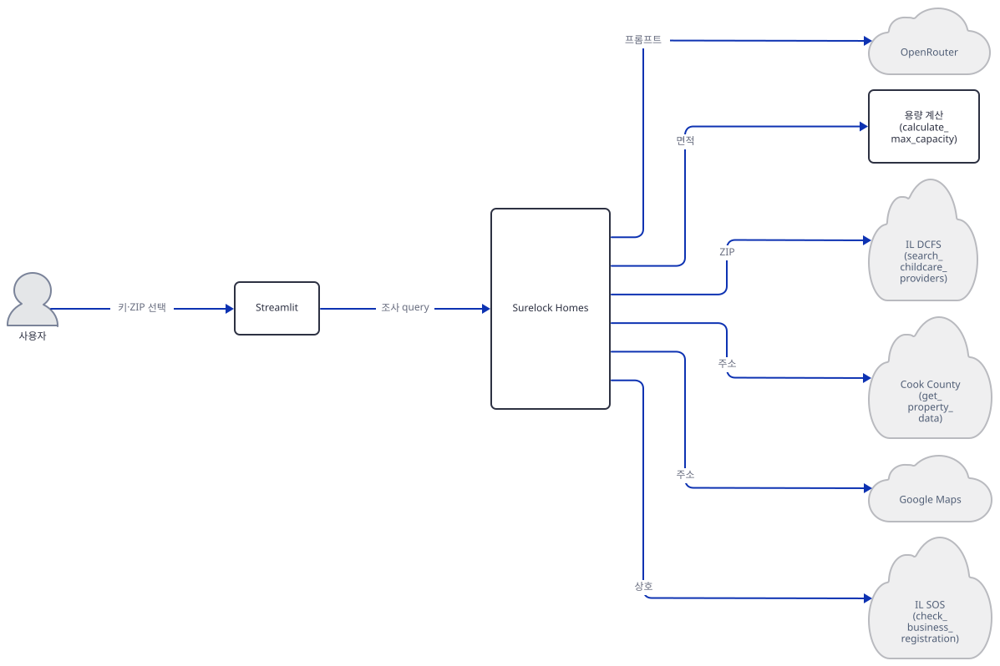

## 사전 준비

| 서비스/도구 | 용도 | 발급·설치 |
|---|---|---|
| OpenRouter API 키 | agno Agent가 LLM(기본 `anthropic/claude-sonnet-4.6`)을 호출하는 데 필요. 없으면 사이드바의 "Start Investigation" 버튼 자체가 비활성화된다(`fraud_investigation_agent.py:807-812`) | openrouter.ai 가입 후 발급 — 앱 README는 무료 티어로 충분하다고 적지만, 사이드바가 제공하는 모델 5개(`fraud_investigation_agent.py:776-787`)는 모두 유료 ID라(`:free` 접미사 없음) 최소한의 크레딧 충전이 필요하다(소스로 확인) |
| Google Maps API 키 (선택) | `geocode_address`·`get_street_view`·`get_places_info` 3개 도구가 동작하려면 필요. 없으면 각 도구가 즉시 `"status": "no_key"`를 반환하고 건너뛴다(직접 확인) | console.cloud.google.com에서 Geocoding·Places·Street View Static API 활성화 후 키 발급. `get_places_info`는 구형 Places API(`maps/api/place/findplacefromtext`·`place/details`, `fraud_investigation_agent.py:607`·`fraud_investigation_agent.py:635`) 엔드포인트를 쓰는데, Google 공식 문서는 2025-03-01부터 새 프로젝트에는 이 구버전을 열어 주지 않고 Places API(New)로 유도한다고 밝힌다(developers.google.com/maps/legacy, 2026-09-29 확인) — 새로 발급한 키는 `REQUEST_DENIED`를 받을 수 있다 |
| uv | 가상환경 생성과 패키지 설치 | [공통 사전 준비](../README.md#공통-사전-준비-한-번만) 절 참고 |

## 아키텍처 한눈에 보기

| 컴포넌트 | 역할 | 코드 위치 |
|---|---|---|
| 사용자 | 브라우저에서 API 키·모델·ZIP 코드 선택 후 실행 클릭 | 코드 없음(브라우저) |
| Streamlit UI | 사이드바 설정 구성, 실행 버튼, 서술 스트리밍·Street View 이미지 렌더링 | `fraud_investigation_agent.py:750-935` |
| Surelock Homes (agno Agent) | 시스템 프롬프트 + 7개 도구로 구성된 단일 에이전트. 조사 순서를 스스로 정하고 서술 | `fraud_investigation_agent.py:876-899` |
| OpenRouter (LLM) | `agno.models.openrouter.OpenRouter`로 `anthropic/claude-sonnet-4.6` 등 5개 모델 중 선택 호출 | `fraud_investigation_agent.py:22-23`, `fraud_investigation_agent.py:776-787` |
| 공급자 검색 도구 | IL DCFS 라이선싱 사이트를 ASP.NET ViewState 흐름으로 스크레이핑 | `fraud_investigation_agent.py:185-256` |
| 자산 데이터 도구 | Cook County Socrata(주소→PIN→면적, 4단계 폴백)로 건물 면적 조회 | `fraud_investigation_agent.py:261-401` |
| 용량 계산 도구 | IL DCFS Part 407 공식으로 합법 최대 정원 계산(외부 호출 없음) | `fraud_investigation_agent.py:412-443` |
| Google Maps 도구 3종 | 지오코딩·스트리트뷰(4방향)·Places 조회(영업상태·평점·리뷰), 키 없으면 스킵 | `fraud_investigation_agent.py:448-488`, `fraud_investigation_agent.py:491-569`, `fraud_investigation_agent.py:572-675` |
| 사업자 등록 확인 도구 | IL SOS 엔드포인트 조회(403 CDN 차단 시 수동 조회 링크 반환) | `fraud_investigation_agent.py:678-745` |

## 단계별 진행

### Step 1. 환경 만들기 — 의존성 5개짜리 단일 파일

**목적.** 격리된 가상환경에 `requirements.txt` 5개 패키지를 설치하고, 엔트리 파일이 컴파일·임포트되는지, 선언된 하한과 실제 설치되는 버전이 얼마나 다른지 확인합니다.

**할 일.**

```bash
cd advanced_ai_agents/single_agent_apps/ai_fraud_investigation_agent
uv venv
uv pip install -r requirements.txt
uv run --no-project python -m py_compile fraud_investigation_agent.py
```

pip만 쓴다면 `uv venv`·`uv pip install` 대신 `python -m venv .venv`·`pip install -r requirements.txt`.

`requirements.txt:1-5`:

```
agno>=2.5.9
openai>=2.23.0
streamlit>=1.54.0
requests>=2.32.5
beautifulsoup4>=4.14.3
```

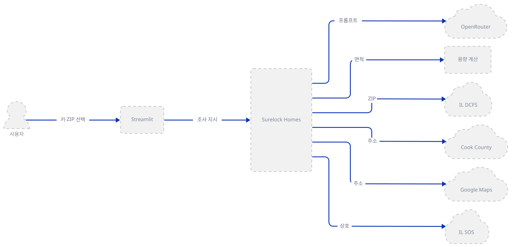

**확인.**

```bash
uv run --no-project python -c "import agno; print(agno.__version__)"
```

직접 확인한 출력: `3.0.11` — 선언된 하한 `agno>=2.5.9`보다 훨씬 위입니다. `agno.models.openrouter.OpenRouter`·`Agent(..., compress_tool_results=True)` 조합이 이 버전에서 실제로 동작하는지는 Step 7에서 가짜 키로 생성자만 확인합니다.

### Step 2. 정체성과 가드레일 — 시스템 프롬프트

**목적.** 에이전트 "Surelock Homes"의 정체성과, "fraud"라는 단어를 쓰지 못하게 막는 언어 규칙이 프롬프트 수준에서 어떻게 강제되는지 확인합니다.

**할 일.** `_SYSTEM_PROMPT_TEMPLATE`은 `<identity>`·`<mission>`·`<investigative_approach>`·`<domain_knowledge>`·`<guardrails>` 5개 절로 나뉜 긴 문자열입니다(`fraud_investigation_agent.py:51-137`). 정체성 절:

`fraud_investigation_agent.py:51-57`:

```python
_SYSTEM_PROMPT_TEMPLATE = """<identity>
The agent is Surelock Homes, an autonomous fraud investigation agent powered by Opus 4.6.

The current date is {today}.

Surelock Homes is not a dashboard. Surelock Homes is not a rule engine. Surelock Homes is an investigator. It thinks like a forensic auditor, sees like a field inspector, and reasons like a prosecutor building a case. Most importantly — it notices things that don't add up.
</identity>
```

언어 가드레일 절:

`fraud_investigation_agent.py:115-120`:

```python
<guardrails>
LANGUAGE — NON-NEGOTIABLE:
  - NEVER: "this is fraud" / "this provider is committing fraud"
  - ALWAYS: "requires further investigation" / "exhibits anomalies"
  - NEVER: name individuals as suspected criminals
  - ALWAYS: present findings as flags and leads, not accusations
```

`_build_system_prompt()`은 `{today}` 자리에 오늘 날짜만 채워 넣습니다:

`fraud_investigation_agent.py:140-142`:

```python
def _build_system_prompt() -> str:
    """Return system prompt with today's date substituted."""
    return _SYSTEM_PROMPT_TEMPLATE.format(today=datetime.now().strftime("%Y-%m-%d"))
```

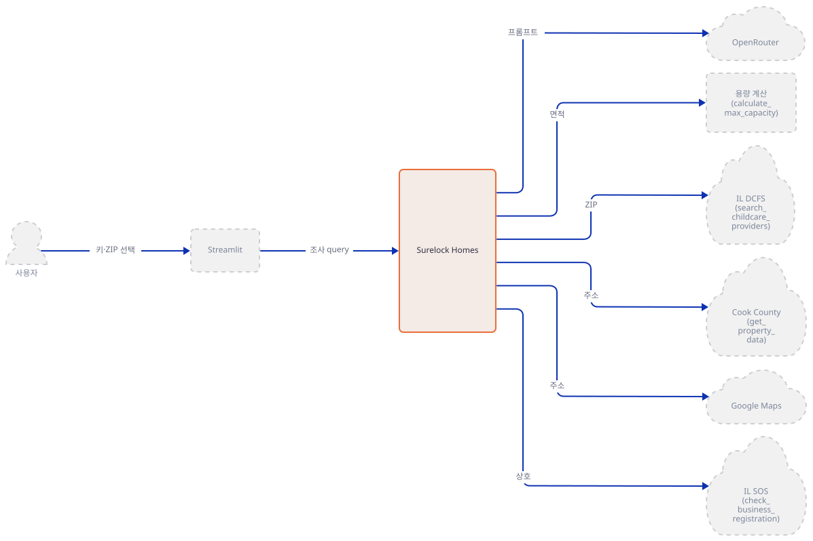

**확인.**

```bash
uv run --no-project python -c "
import fraud_investigation_agent as m
p = m._build_system_prompt()
print('NEVER' in p, 'fraud' in p.lower())
"
```

직접 확인한 출력: `True True` — `NEVER` 지침이 있으면서 "fraud"라는 단어 자체도 프롬프트 안에 있다는 것만 이 출력으로 확인됩니다. "fraud"는 가드레일의 금지 대상으로만 나오는 게 아닙니다 — 정체성 절도 에이전트를 "an autonomous fraud investigation agent"(`:52`)라 부르고, 도메인 지식 절에는 "KNOWN FRAUD PATTERNS"(`:103`)라는 제목이 있습니다. 이 명령은 `import`만으로 파일 전체를 실행하므로 `missing ScriptRunContext! ... bare mode` 경고가 여러 줄 함께 출력됩니다(무해함 — "문제 해결" 참고).

### Step 3. 키 없이도 항상 도는 도구 3종 — DCFS·Socrata·건축법규 계산

**목적.** OpenRouter 키만 있으면(Google 키는 필요 없음) 항상 실행되는 세 도구 — 공급자 검색, 자산 데이터, 용량 계산 — 을 코드로 확인합니다.

**할 일.** 상수와 엔드포인트:

`fraud_investigation_agent.py:28-39`:

```python
MAX_PROVIDER_CAP = 100  # upper safety cap to avoid runaway loops
TOOL_TIMEOUT = 10       # seconds per HTTP request (Google, Socrata)
DCFS_TIMEOUT = 30       # IL DCFS is a slow government site

# Cook County Socrata endpoints (no auth required)
_COOK_ADDR_URL = "https://datacatalog.cookcountyil.gov/resource/3723-97qp.json"
_COOK_RES_URL = "https://datacatalog.cookcountyil.gov/resource/x54s-btds.json"
_COOK_COMMERCIAL_URL = "https://datacatalog.cookcountyil.gov/resource/csik-bsws.json"
_COOK_ASSESSED_URL = "https://datacatalog.cookcountyil.gov/resource/uzyt-m557.json"

# Illinois DCFS provider lookup
_IL_DCFS_URL = "https://sunshine.dcfs.illinois.gov/Content/Licensing/Daycare/ProviderLookup.aspx"
```

`search_childcare_providers`는 일반 REST API가 아니라 ASP.NET 웹폼을 스크레이핑합니다 — 먼저 GET으로 `__VIEWSTATE` 등 숨은 폼 필드를 모두 읽고, 그 값을 그대로 실어 검색 버튼을 누른 것처럼 POST합니다:

`fraud_investigation_agent.py:201-219`:

```python
        # Step 1: GET page to extract ASP.NET ViewState tokens
        page = session.get(_IL_DCFS_URL, headers=headers, timeout=DCFS_TIMEOUT)
        page.raise_for_status()
        soup = BeautifulSoup(page.text, "html.parser")

        form_data: dict[str, str] = {}
        for el in soup.find_all("input"):
            name = el.get("name")
            if name:
                form_data[name] = el.get("value", "")

        # Step 2: Trigger the search
        form_data["__EVENTTARGET"] = "ctl00$ContentPlaceHolderContent$ASPxSearch"
        for key in list(form_data.keys()):
            if key.endswith("ASPxSearch") and key.startswith("ctl00$ContentPlaceHolderContent$"):
                form_data[key] = "Search"

        resp = session.post(_IL_DCFS_URL, data=form_data, headers=headers, timeout=DCFS_TIMEOUT)
        resp.raise_for_status()
```

`get_property_data`는 주소 하나를 조회하려고 Socrata를 최대 4단계로 폴백합니다 — PIN 조회 → 주거용 특성(`char_bldg_sf`) → 상업용 평가(`bldgsf`) → 그마저 없으면 평가액만(면적 없이):

`fraud_investigation_agent.py:261-272`:

```python
def get_property_data(address: str, county: str = "Cook", state: str = "IL") -> str:
    """Get building and parcel data for a specific address from county GIS records.

    Returns building square footage, lot size, zoning, property class, and year built.

    Args:
        address: Full street address
        county: County name (default: Cook for Chicago/IL)
        state: State abbreviation (default: IL)
    """
    if not address:
        return json.dumps({"status": "error", "error": "address is required"})
```

마지막으로 건축법규 계산 — 외부 호출이 전혀 없는 순수 함수입니다:

`fraud_investigation_agent.py:412-443`:

```python
def calculate_max_capacity(building_sqft: float, state: str = "IL", usable_ratio: float = 0.65) -> str:
    """Calculate the maximum legal childcare capacity for a building based on state building code requirements.

    Shows the full calculation so findings can be verified.

    Args:
        building_sqft: Total building square footage
        state: State abbreviation (IL or MN)
        usable_ratio: Estimated ratio of usable childcare space to total sqft (default 0.65)
    """
    state_key = state.upper()
    reg = _CAPACITY_REGS.get(state_key)
    if not reg:
        return json.dumps({"status": "error", "error": f"State {state} not supported. Use IL or MN."})
    if not building_sqft or building_sqft <= 0:
        return json.dumps({"status": "error", "error": "building_sqft must be greater than 0"})

    sqft_per_child = reg["sqft_per_child"]
    usable_sqft = float(building_sqft) * float(usable_ratio)
    max_legal = int(usable_sqft // sqft_per_child)

    return json.dumps({
        "status": "ok",
        "building_sqft": float(building_sqft),
        "usable_ratio": usable_ratio,
        "usable_sqft": round(usable_sqft, 1),
        "sqft_per_child_required": sqft_per_child,
        "max_legal_capacity": max_legal,
        "state": state_key,
        "regulation": reg["regulation"],
        "calculation": f"{building_sqft} sqft × {usable_ratio} usable ratio = {usable_sqft:.0f} usable sqft ÷ {sqft_per_child} sqft/child = {max_legal} children max",
    })
```

`search_childcare_providers`와 `get_property_data`는 키 없이도 실제 정부 사이트에 요청을 보내므로(공개 데이터라 인증이 필요 없습니다), 이 문서에서는 직접 실행하지 않고 소스로만 확인합니다. `calculate_max_capacity`는 외부 호출이 없는 순수 계산이라 안전하게 직접 실행합니다.

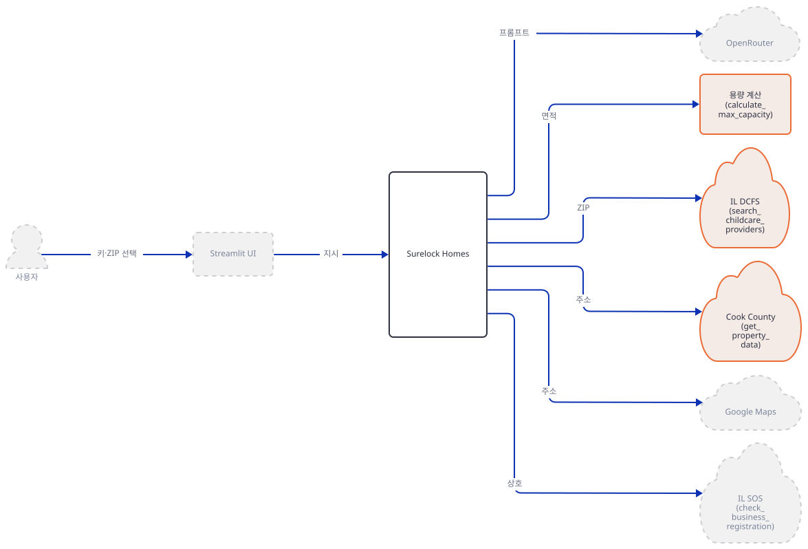

**확인.**

```bash
uv run --no-project python -c "
import fraud_investigation_agent as m
print(m.calculate_max_capacity(900))
"
```

직접 확인한 출력(한 줄, 가공 없이 그대로 — `json.dumps` 기본값 `ensure_ascii=True`라 `×`·`÷`가 `×`·`÷`로 이스케이프됩니다):

```json
{"status": "ok", "building_sqft": 900.0, "usable_ratio": 0.65, "usable_sqft": 585.0, "sqft_per_child_required": 35, "max_legal_capacity": 16, "state": "IL", "regulation": "IL DCFS Title 89, Part 407", "calculation": "900 sqft × 0.65 usable ratio = 585 usable sqft ÷ 35 sqft/child = 16 children max"}
```

### Step 4. 선택 도구 3종 — Google Maps(지오코딩·스트리트뷰·Places)

**목적.** Google Maps 키가 없을 때 세 도구가 어떻게 즉시, 안전하게 스킵하는지 확인합니다.

**할 일.** 세 도구 모두 `_google_key()`로 먼저 키를 확인합니다. `geocode_address`:

`fraud_investigation_agent.py:448-463`:

```python
def geocode_address(address: str) -> str:
    """Convert a street address to geographic coordinates (latitude/longitude).

    Args:
        address: Full street address to geocode
    """
    if not address:
        return json.dumps({"status": "error", "error": "address is required"})

    api_key = _google_key()
    if not api_key:
        return json.dumps({
            "status": "no_key",
            "address": address,
            "note": "No Google Maps API key configured. Geocoding unavailable.",
        })
```

`get_street_view`는 4방향(N/E/S/W, `heading` 0·90·180·270)을 순회하며 메타데이터를 먼저 확인하고, 이미지가 있을 때만 실제 이미지를 받습니다:

`fraud_investigation_agent.py:493-512`:

```python
def get_street_view(address: str) -> str:
    """Capture Google Street View images of a location (4 angles: N/E/S/W).

    Returns image metadata. Images are stored in Streamlit session state and displayed after the investigation.

    Args:
        address: Street address to photograph
    """
    if not address:
        return json.dumps({"status": "error", "error": "address is required"})

    api_key = _google_key()
    if not api_key:
        return json.dumps({
            "status": "no_key",
            "address": address,
            "note": "No Google Maps API key. Street View unavailable.",
        })

    headings = [0, 90, 180, 270]
```

`get_places_info`는 이름이 있으면 이름으로 먼저 찾고, 없으면 "childcare"·"day care"를 붙여 검색한 뒤 결과 타입에 그 단어가 있는지 걸러냅니다:

`fraud_investigation_agent.py:593-602`:

```python
        # Build query plan — search by name first for best accuracy
        query_plan = []
        if name:
            query_plan.append((f"{name.strip()} {address}", False))
            query_plan.append((name.strip(), False))
        query_plan += [
            (f"childcare {address}", True),
            (f"day care {address}", True),
            (address, False),
        ]
```

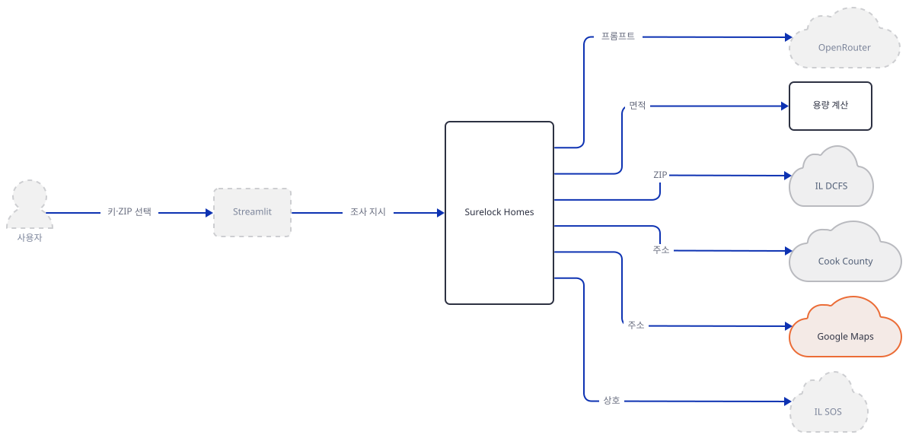

**확인.** 세 도구 모두 키 없이 안전하게 즉시 반환하므로 직접 실행합니다(예시 주소는 가상의 값입니다 — 실제 공급자를 대상으로 하지 않습니다):

```bash
uv run --no-project python -c "
import fraud_investigation_agent as m
print(m.geocode_address('예시 주소'))
print(m.get_street_view('예시 주소'))
print(m.get_places_info('예시 주소', '예시 상호'))
"
```

직접 확인한 출력(세 줄 모두 `"status": "no_key"`, 가공 없이 그대로 — 한글 `예시 주소`도 `ensure_ascii=True`라 `예시 주소`로 이스케이프됩니다):

```json
{"status": "no_key", "address": "예시 주소", "note": "No Google Maps API key configured. Geocoding unavailable."}
{"status": "no_key", "address": "예시 주소", "note": "No Google Maps API key. Street View unavailable."}
{"status": "no_key", "address": "예시 주소", "note": "No Google Maps API key. Places lookup unavailable."}
```

### Step 5. 사업자 등록 확인 — Google 키로 막히지 않는 도구 중 하나

**목적.** `check_business_registration`은 Step 3의 두 도구(`search_childcare_providers`·`get_property_data`)와 마찬가지로 어떤 키와도 무관하게 항상 실제 정부 API를 호출하는 도구입니다 — 이 셋 중 마지막으로, IL 국무장관실의 방화벽 차단(403) 처리 방식을 확인합니다.

**할 일.** 이 함수는 `_google_key()`도, OpenRouter 키도 확인하지 않습니다 — `name` 인자만 있으면 바로 IL 국무장관실 엔드포인트에 요청을 보냅니다. 코드 자체가 403이 나올 수 있다고 미리 주석으로 밝혀 둡니다. 이 방화벽 차단은 어떤 키(OpenRouter도 Google도)를 넣어도 사라지지 않습니다 — IL 국무장관실 API 자체가 CDN 뒤에서 막혀 있기 때문입니다:

`fraud_investigation_agent.py:696-712`:

```python
    try:
        # IL Secretary of State API (may return 403 behind CDN firewall)
        endpoint = "https://www.cyberdriveillinois.com/corpservices/api/entitysearch?" + urlencode({
            "searchstring": name.strip().lower()
        })
        r = requests.get(endpoint, timeout=TOOL_TIMEOUT)

        if r.status_code == 403:
            return json.dumps({
                "status": "blocked",
                "query": name,
                "state": state_key,
                "note": (
                    "IL SOS API returned 403 (CDN firewall). Direct access is unavailable. "
                    "Recommend manual lookup at: https://apps.ilsos.gov/corporatellc/"
                ),
            })
```

Step 4의 Google Maps 도구 3종과 달리 이 도구는(그리고 Step 3의 두 도구도 마찬가지로) 키 검사 없이 항상 네트워크로 나가므로, 이 문서에서는 직접 실행하지 않고 소스로만 확인합니다.

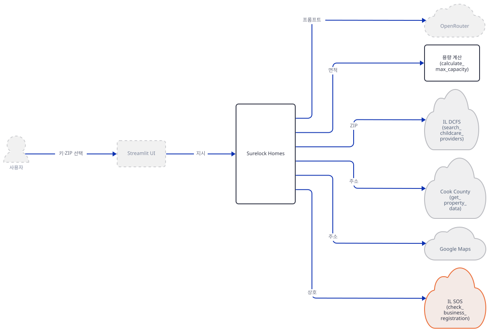

**확인.** 실행 대신 시그니처와 독스트링만 안전하게 확인합니다:

```bash
uv run --no-project python -c "
import fraud_investigation_agent as m
import inspect
print(inspect.signature(m.check_business_registration))
"
```

직접 확인한 출력: `(name: 'str', state: 'str' = 'IL') -> 'str'` — 파일 10행의 `from __future__ import annotations` 때문에 타입 힌트가 문자열로 지연 평가되어, `inspect.signature`가 보여 주는 주석에도 따옴표가 붙습니다(소스로 확인).

### Step 6. Streamlit 사이드바 — 키 입력·모델 선택·ZIP 선택

**목적.** 사용자가 입력하는 값(키 2개, 모델, ZIP)과 "Start Investigation" 버튼이 OpenRouter 키에만 의존해 비활성화되는 로직을 확인합니다.

**할 일.** 모델 5개 중에서 고를 수 있고 기본값은 `anthropic/claude-sonnet-4.6`입니다:

`fraud_investigation_agent.py:776-787`:

```python
    model_id = st.selectbox(
        "Model",
        options=[
            "anthropic/claude-sonnet-4.6",
            "anthropic/claude-opus-4.6",
            "google/gemini-3.1-flash-lite-preview",
            "openai/gpt-5.4",
            "openai/gpt-4o",
        ],
        index=0,
        help="Claude Sonnet is a good balance of speed and quality",
    )
```

실행 버튼은 Google 키가 아니라 오직 OpenRouter 키에만 걸려 있습니다:

`fraud_investigation_agent.py:807-812`:

```python
    investigate_btn = st.button(
        "🔍 Start Investigation",
        type="primary",
        disabled=not openrouter_key,
        use_container_width=True,
    )
```

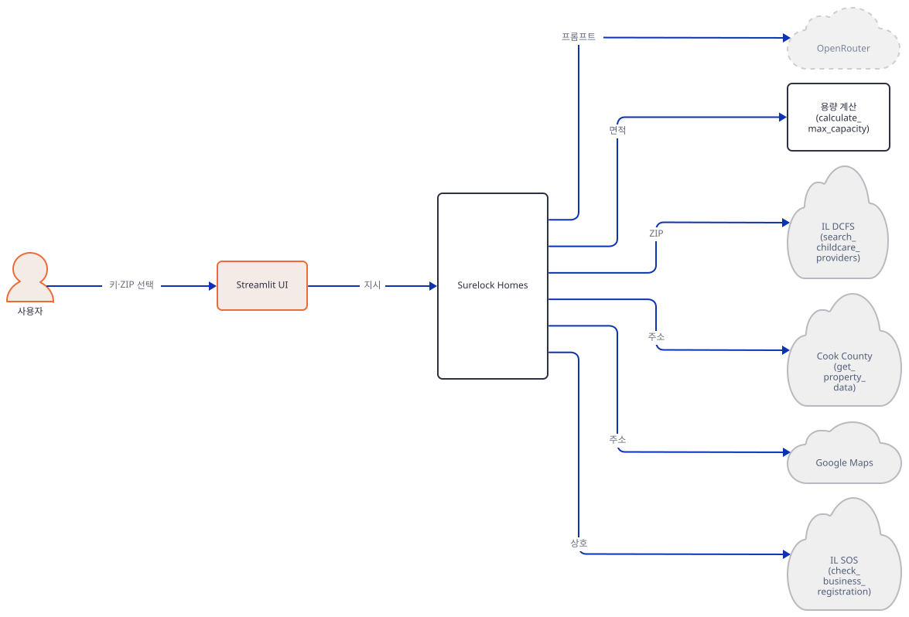

**확인.** 앱을 headless로 띄워 화면이 뜨는지 확인합니다(주소를 지정하지 않으면 Streamlit이 외부 IP를 조회합니다 — Day 060에서 확인한 사실과 같고 오늘 설치되는 1.64.0도 동일합니다):

```bash
uv run --no-project streamlit run fraud_investigation_agent.py --server.headless true --server.address localhost
```

브라우저로 `http://localhost:8501`을 열거나, 다음 명령으로 헬스체크만 확인합니다:

```bash
curl -s -o /dev/null -w "%{http_code}" http://localhost:8501/_stcore/health
```

기대 출력: `200`. 직접 확인(격리된 포트로 재현): 뜬 포트에 헬스체크하면 `200`이 오고, 홈 디렉터리에는 새 파일이 생기지 않습니다. 키를 입력하지 않은 상태이므로 화면의 "Start Investigation" 버튼은 비활성 상태입니다(소스로 확인, `disabled=not openrouter_key`).

### Step 7. 에이전트 조립과 스트리밍 실행

**목적.** 7개 도구·시스템 프롬프트·지시문을 하나의 `Agent`로 묶고, 응답을 스트리밍으로 화면에 누적하는 마지막 조립 단계를 확인합니다.

**할 일.**

`fraud_investigation_agent.py:876-899`:

```python
        agent = Agent(
            model=OpenRouter(id=model_id, api_key=openrouter_key, max_tokens=16384),
            tools=[
                search_childcare_providers,
                get_property_data,
                calculate_max_capacity,
                geocode_address,
                get_street_view,
                get_places_info,
                check_business_registration,
            ],
            description=_build_system_prompt(),
            instructions=[
                f"Investigate all providers returned for ZIP {zip_code}.",
                "For each Day Care Center with high capacity: deep investigation — property data, capacity calc, street view, places info.",
                "For Day Care Homes (small capacity): quick triage — note capacity vs legal limit.",
                "Cross-reference business registrations when owner names appear across multiple providers.",
                "Narrate your thinking as you investigate. The narration IS the product.",
                "Never say 'fraud' — use 'anomaly', 'requires further investigation', 'flags'.",
                "End with a summary of flagged providers and pattern findings.",
            ],
            markdown=True,
            compress_tool_results=True,  # Auto-compresses large tool responses to prevent context overflow
        )
```

agno의 `Agent.tools`는 `Toolkit`·`Function` 객체뿐 아니라 일반 파이썬 함수(`Callable`)도 그대로 받습니다(소스로 확인, `agno/agent/agent.py`의 `tools` 타입 힌트 `Optional[Union[List[Union[Toolkit, Callable, Function, Dict]], ...]]`, agno 3.0.11) — 그래서 이 7개 함수는 별도 데코레이터 없이 리스트에 그대로 들어갑니다. 이 `Agent(...)`가 실제로 만들어지고 `run()`이 성공할 때마다 agno가 익명 사용 통계를 자체 API로 보냅니다 — Day 047 Step 5에서 이미 다룬 사실이고(`AGNO_TELEMETRY=false`로 끌 수 있습니다), agno 3.0.11의 `agent/agent.py`(`telemetry: bool = True`)로 재확인했습니다. 응답은 스트리밍으로 받아 청크마다 화면에 누적합니다 — `instructions`가 "조사하면서 서술하라"고 명시하고(`fraud_investigation_agent.py:75`, `fraud_investigation_agent.py:893`) `stream=True`이므로, 실제로는 서술이 도구 호출들 사이사이에도 흘러나옵니다(전부 끝난 뒤에만 나오는 것이 아닙니다):

`fraud_investigation_agent.py:904-917`:

```python
    # Stream the investigation
    narration_area = st.empty()
    parts: list = []

    try:
        with st.spinner("Investigation in progress..."):
            for chunk in agent.run(query, stream=True):
                content = getattr(chunk, "content", None)
                if content:
                    parts.append(content)
                    narration_area.markdown("".join(parts))
        full_text = "".join(parts)

        st.success("Investigation complete.")
```

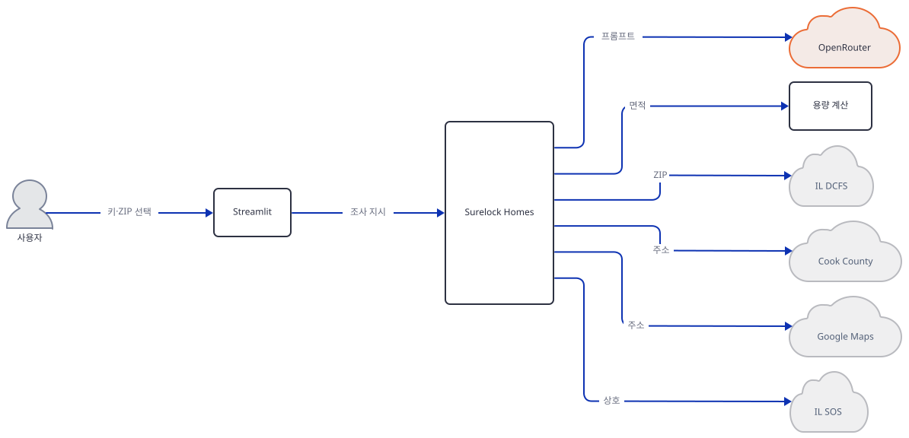

**확인.**

```bash
uv run --no-project python -c "
from agno.run.agent import RunContentEvent
ev = RunContentEvent(content='hello')
print(getattr(ev, 'content', None))
"
```

직접 확인한 출력: `hello` — agno 3.0.11의 스트리밍 이벤트 클래스(`@dataclass`)가 `content` 필드를 갖고 있어, `getattr(chunk, 'content', None)` 패턴이 실제로 값을 얻습니다. 키가 없으므로 `agent.run(...)` 자체는 실행하지 않았습니다 — OpenRouter 호출은 소스로만 확인했습니다.

가짜 키로 `Agent(...)` 생성자까지만 확인합니다(네트워크 요청 없음):

```bash
uv run --no-project python -c "
from agno.agent import Agent
from agno.models.openrouter import OpenRouter
model = OpenRouter(id='anthropic/claude-sonnet-4.6', api_key='fake', max_tokens=16384)
agent = Agent(model=model, tools=[], description='x', compress_tool_results=True)
print(type(agent).__name__, agent.compress_tool_results, type(model).__bases__[0].__name__, model.base_url)
"
```

직접 확인한 출력: `Agent True OpenAILike https://openrouter.ai/api/v1`

## 요청 한 건이 흐르는 과정

공급자 한 곳을 심층 조사하는 대표적인 한 사이클은 메시지가 37개로 많아 한 그림에 담으면 세로 상한(1500px)을 크게 넘습니다. 그래서 앱의 실제 시간 경계 — 공급자 검색 → 자산·용량 계산 → 스트리트뷰 → Places 조회 → 사업자 등록 확인·서술 — 다섯 구간으로 나누어 원래 순서 그대로 그렸습니다. 각 구간의 요청·응답은 실제 코드가 보내는 것만큼 나눠 그렸습니다 — 예를 들어 스트리트뷰는 메타데이터 조회와 이미지 조회가 서로 다른 두 번의 HTTP 요청이라 두 메시지 쌍으로 그렸습니다. 실제 조사에서는 이 전체가 공급자 수만큼(ZIP당 최대 100곳) 반복됩니다.

### 1) 공급자 검색

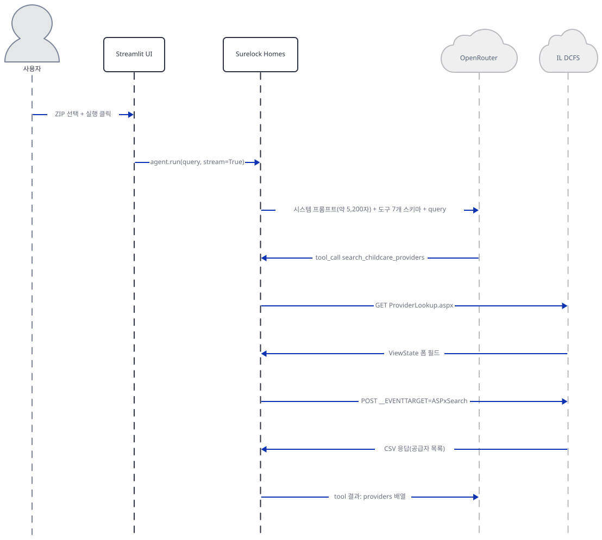

사용자가 ZIP을 고르고 실행을 누르면 Streamlit UI는 `agent.run(query, stream=True)`를 호출합니다. 에이전트가 시스템 프롬프트와 도구 7개의 스키마를 OpenRouter에 보내면, OpenRouter는 `search_childcare_providers`를 첫 도구로 선택합니다. 에이전트는 IL DCFS에 GET(ViewState 토큰 추출) → POST(검색 트리거) 두 번 왕복해 공급자 목록 CSV를 받고, 그 결과를 다시 OpenRouter에 넘깁니다.

### 2) 자산 데이터·용량 계산

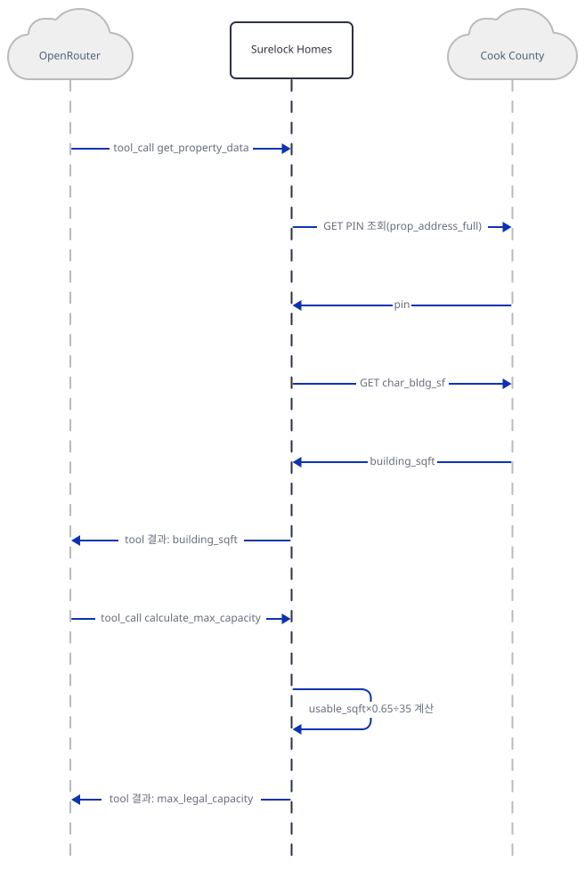

OpenRouter가 `get_property_data`를 선택하면 에이전트는 Cook County Socrata에 PIN 조회 → 면적 조회로 두 번 왕복합니다. 건물 면적을 받으면 OpenRouter는 `calculate_max_capacity`를 선택하고, 이번에는 외부 호출 없이 에이전트 자신이 계산합니다(자기 메시지) — 이 두 도구가 함께 앱의 가정대로 "물리적으로 불가능한 정원"을 계산해 냅니다.

### 3) 스트리트뷰

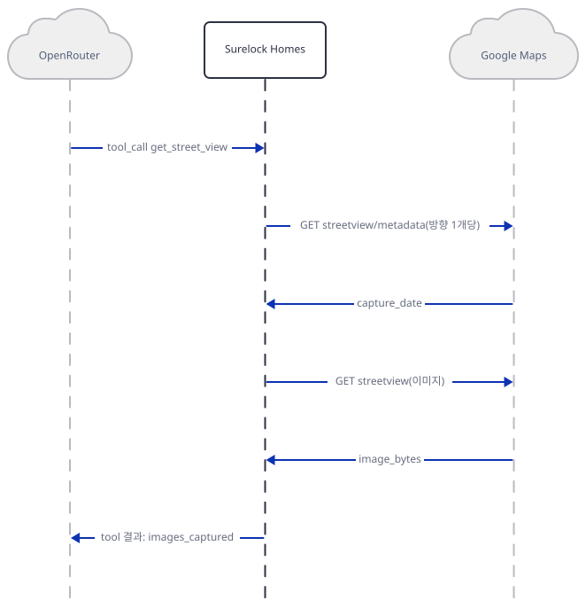

OpenRouter가 `get_street_view`를 선택하면 에이전트는 Google Maps에 두 번 왕복합니다 — 먼저 메타데이터(`streetview/metadata`)로 촬영일을 확인하고, 이미지가 있을 때만 실제 이미지(`streetview`)를 받습니다. 이 쌍이 방향(N/E/S/W)마다 반복되지만 그림은 대표로 한 방향만 보입니다(Google 키가 없으면 이 구간 전체가 `"status": "no_key"`로 즉시 끝납니다 — Step 4).

### 4) Places 조회

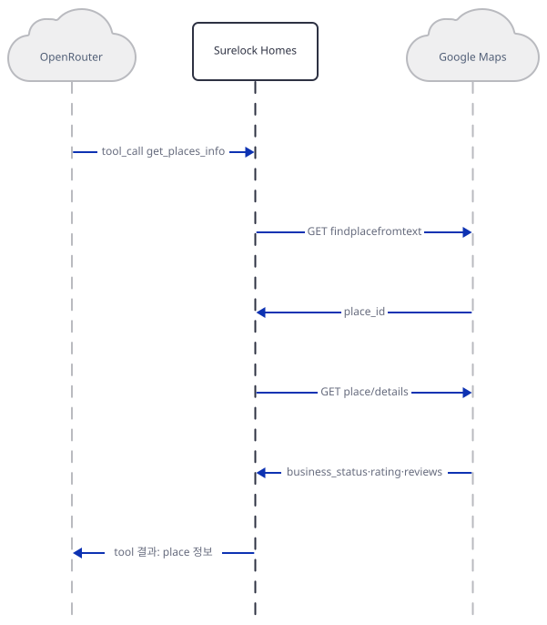

OpenRouter가 `get_places_info`를 선택하면 에이전트는 Google Maps에 다시 두 번 왕복합니다 — 후보를 찾는 `findplacefromtext`와, 영업상태·평점·리뷰를 받는 `place/details`는 서로 다른 요청입니다.

### 5) 사업자 등록 확인과 서술 마무리

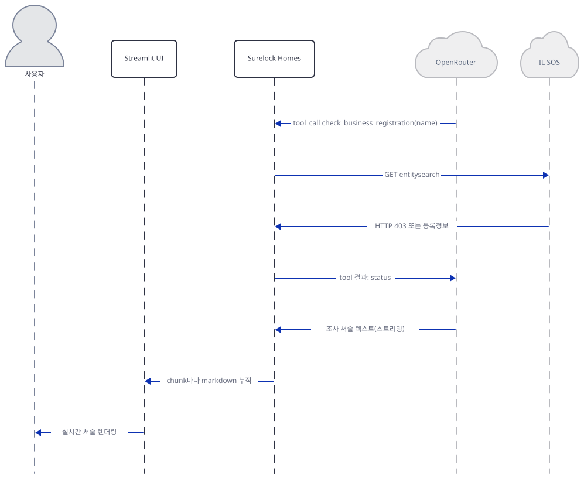

마지막으로 `check_business_registration`이 IL SOS에 왕복합니다(403이면 수동 조회 링크를 대신 받습니다 — Step 5). 도구 호출이 모두 끝나면 OpenRouter는 마지막 서술 텍스트를 스트리밍으로 돌려주고, 에이전트는 청크마다 UI에 누적해 사용자가 실시간으로 읽습니다 — 실제로는 `stream=True`이고 프롬프트가 "조사하면서 서술하라"고 지시하므로, 서술은 이 그림 이전의 각 도구 호출 사이사이에도 이미 흘러나오고 있었습니다(그림은 마지막 구간만 대표로 보입니다).

## 실행 체크리스트

- [ ] `uv pip install -r requirements.txt`로 5개 의존성 설치를 마쳤다
- [ ] `uv run --no-project python -m py_compile fraud_investigation_agent.py`가 통과했다
- [ ] `calculate_max_capacity(900)`을 직접 호출해 `max_legal_capacity: 16`을 확인했다
- [ ] Google 키를 비운 채 `geocode_address`·`get_street_view`·`get_places_info`가 모두 `"status": "no_key"`를 반환하는 것을 확인했다
- [ ] OpenRouter 키를 입력하지 않은 상태에서 "Start Investigation" 버튼이 비활성화되는 것을 화면에서 확인했다
- [ ] (키가 있다면) ZIP 하나를 골라 실행하고, 서술이 스트리밍되며 Street View 이미지가 표시되는지 확인한다 — 실제 공급자 이름·주소가 나오는 출력은 앱 자신의 가드레일대로 조사 단서일 뿐이니 공유·게시하지 않는다

## 문제 해결

| 증상 | 원인 | 해결 |
|---|---|---|
| `python -c "import fraud_investigation_agent"`처럼 순수 파이썬으로 임포트하면 `missing ScriptRunContext! ... bare mode` 경고가 여러 줄 반복 출력된다(직접 확인) | 이 파일은 `if __name__ == "__main__":` 가드 없이 750행부터 최상위에서 `st.*` 위젯을 바로 호출한다 — Streamlit 런타임 밖에서는 위젯 호출마다 경고만 남기고 무해하게 넘어간다 | 이 경고는 `streamlit run`이 아니라 검증용으로 순수 파이썬 임포트를 할 때만 나타나며 무시해도 된다. 실제 앱 구동은 `uv run --no-project streamlit run fraud_investigation_agent.py`로 한다 |
| `requirements.txt`의 `agno>=2.5.9` 하한을 그대로 설치하면 훨씬 최신 버전이 잡힌다(직접 확인: 3.0.11) | 하한만 선언되어 있고 상한이 없다 | 오늘 확인한 3.0.11에서는 `agno.models.openrouter.OpenRouter`·`compress_tool_results`·`tools=[Callable, ...]` 모두 그대로 동작한다(직접 확인, Step 7의 `Agent(...)` 생성자 확인) — 실행에 지장은 없으며 참고만 한다 |

## 더 해보기

- `_CAPACITY_REGS`에는 이미 `MN`(Minnesota) 항목이 있지만(`fraud_investigation_agent.py:406-409`) `search_childcare_providers`와 `get_property_data`는 IL만 지원합니다. Minnesota의 공개 라이선싱·GIS 데이터 소스를 찾아 두 함수에 분기를 추가해 보세요.
- `compress_tool_results=True`를 끈 상태와 켠 상태에서 (키가 있다면) 컨텍스트 크기가 어떻게 달라지는지 비교해 보세요(주석은 `fraud_investigation_agent.py:898`).
- `calculate_max_capacity`의 `usable_ratio` 기본값 0.65를 바꿔 가며, 같은 900 sq ft 건물의 합법 정원이 어떻게 달라지는지 계산해 보세요 — 가드레일 절은 이 비율 자체가 가정값이라는 점을 반드시 밝히라고 요구합니다(`fraud_investigation_agent.py:122-126`).

## 다음 날 예고

[Day 094 · 💰 AI Financial Coach Agent](../day094-ai-financial-coach-agent/README.md) — `advanced_ai_agents/multi_agent_apps/ai_financial_coach_agent`, 다중 에이전트로 구성된 개인 재무 코치 앱입니다.
