# Day 094 · 💰 AI Financial Coach Agent

> 볼륨 7 🚀 Advanced AI Agents · 난이도 ★★★ · 예상 소요 75분 · API 비용 대략 $0.01 이하로 추정 — 요청 1건당 `gemini-2.5-flash` 호출 3회(에이전트당 1회, 구조화된 JSON 출력) 기준, 공식 요금표 입력 $0.30/출력 $2.50(1M 토큰당, https://ai.google.dev/gemini-api/docs/pricing, 2026-09-29 확인) 대입, 실제 토큰 수는 키가 없어 확인하지 못함(대략치) · 원본 앱: `advanced_ai_agents/multi_agent_apps/ai_financial_coach_agent`

## 오늘 만들 것

Day 088(AI Consultant Agent)·091(AI Sales Intelligence Agent Team)·092(AI VC Due Diligence Agent Team)에 이어 이 볼륨에서 **네 번째**로 google-adk를 쓰는 자리입니다(078~093 전체 README를 `google.adk` 문자열로 검색해 확인 — 088·091·092만 걸립니다). 시리즈 전체로는 (Day 014~023 크래시 코스를 한 묶음으로 셀 때) 일곱 번째이고, 크래시 코스 이후 앱 단위로는 **다섯 번째**(067·077·088·091·092에 이어)입니다. 091·092는 코디네이터 `LlmAgent`가 `sub_agents`에 `SequentialAgent`를 넣고 `transfer_to_agent`로 제어를 통째로 넘기는 간접 구조였지만, 오늘의 968줄짜리(마지막 줄에 개행이 없어 `wc -l`은 967로 셉니다) `ai_financial_coach_agent.py`는 그런 감싸는 `LlmAgent` 없이 **`SequentialAgent`(`FinanceCoordinatorAgent`) 자체를 `Runner`에 직접 물립니다** — Day 022의 `9_1_sequential_agent`(`Runner`가 `SequentialAgent`를 바로 구동)와 같은 형태이고, `transfer_to_agent`라는 문자열은 이 파일 어디에도 없습니다(그렙 확인).

예산 분석→저축 전략→부채 상환, 세 전문 `LlmAgent`가 이 순서로 실행되며 각자 중첩된 Pydantic 모델을 `output_schema`로 강제합니다. `output_schema`·`output_key` 자체는 Day 016이 이미 다뤘지만, 오늘 스키마는 `List[SpendingCategory]`나 `PayoffPlans`(그 안에 `PayoffPlan`이 둘) 처럼 **모델 안에 모델이 들어가는 중첩 구조**라는 점이 새롭습니다(Step 2, 직접 확인). 세 에이전트를 만들 때마다 "output_schema cannot co-exist with agent transfer configurations"라는 경고도 뜨는데, Day 022가 이미 확인했듯 `SequentialAgent`의 자식은 애초에 전환 대상이 없어 이 경고 없이도 전환은 불가능합니다 — 그래도 생성자가 이를 별도로, 보수적으로 잠근다는 것을 직접 실행으로 확인합니다(Step 3).

`requirements.txt`가 고정한 `google-adk==0.1.0`은 실제로 설치하면 `deprecated` 패키지가 없어 첫 `import google.adk`부터 깨지는 실제 패키징 버그가 있고(Step 1, 직접 확인), 목록에 있는 `matplotlib`은 앱 코드 어디에서도 쓰이지 않습니다(그렙 확인 — 시각화는 전부 `plotly`가 맡습니다). 키 없이 실제로 파이프라인을 돌리면 `analyze_finances`가 `google.genai`의 `Client()` 생성자에서 `ValueError`로 멈춥니다 — 088·091·092와 같은 지점입니다(Step 5, 직접 확인). 이 앱이 만드는 예산·저축·부채 조언은 Gemini가 그때그때 생성하는 일반적인 제안일 뿐 자격을 가진 재무 상담사의 조언이 아니며, 앱 자신의 코드에도 이를 밝히는 문구는 없습니다(전체 검색으로 확인). 또한 앱 화면은 "All data is processed locally and not stored anywhere"(664행)·"No financial information is stored or transmitted"(956-957행)라고 적지만, 이는 사실이 아닙니다 — 입력한 소득·부양가족·거래·지출·부채는 전부 `json.dumps(financial_data)`로 JSON이 되어 `Runner.run_async`의 사용자 메시지로 Gemini API에 그대로 전송됩니다(232-235행, 소스로 확인). 이 문서에서 입력하는 숫자는 앱이 사이드바에서 내려받게 해 주는 예시 CSV(Step 6)뿐이고, 실제 개인 재무 정보는 넣지 않습니다 — 화면의 "로컬 처리" 문구를 믿고 실제 정보를 넣지 않도록 주의하세요. 완성 아키텍처는 다음과 같습니다.

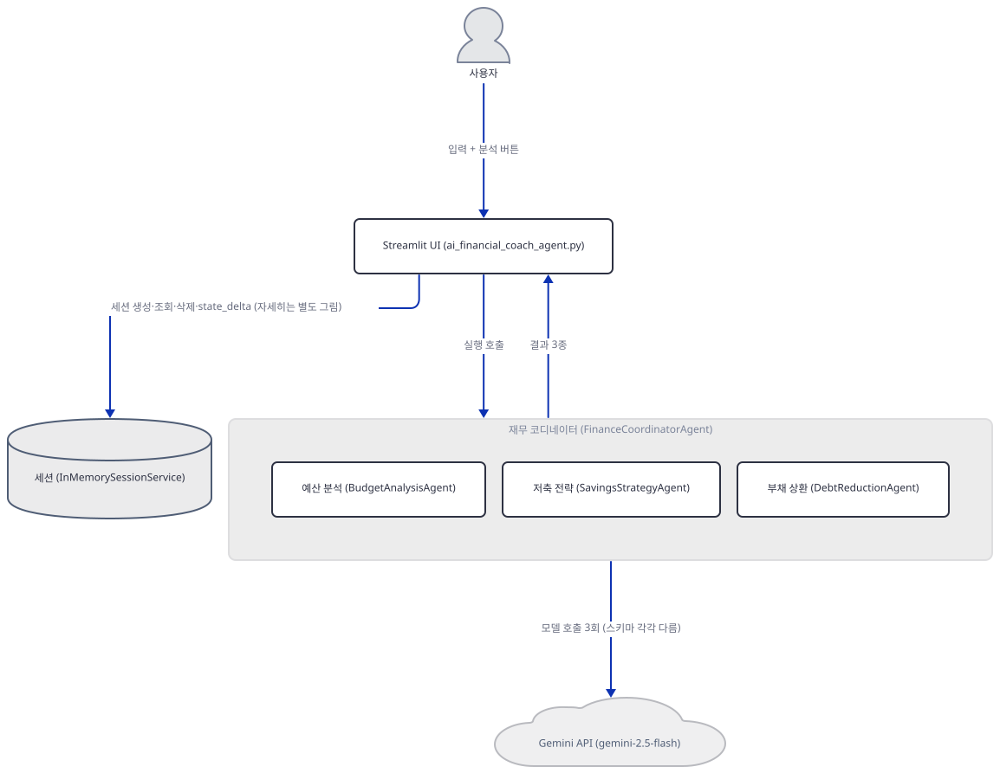

## 사전 준비

| 서비스/도구 | 용도 | 발급·설치 |
|---|---|---|
| Google AI Studio API 키 (`GOOGLE_API_KEY`) | 세 에이전트 모두의 `gemini-2.5-flash` 호출 인증(동일한 키 하나). 이 문서는 키를 발급하지 않고 구조와 실패 지점만 확인합니다 | https://aistudio.google.com/apikey 에서 발급 후 앱 폴더의 `.env`에 `GOOGLE_API_KEY=...`로 설정 (이 실습에서는 생략 가능) |
| uv | 가상환경 생성과 패키지 설치 | [공통 사전 준비](../README.md#공통-사전-준비-한-번만) 절 참고 |
| 인터넷 연결 | PyPI에서 `google-adk`·`Deprecated` 등 설치, 키가 있다면 Gemini API 접속 | 별도 설치 없음 |

## 아키텍처 한눈에 보기

| 컴포넌트 | 역할 | 코드 위치 |
|---|---|---|
| Pydantic 출력 스키마 (`BudgetAnalysis` 외 8개) | 세 에이전트 응답의 모양을 못박음. `SpendingCategory`·`PayoffPlans` 등 중첩 모델 포함 | `advanced_ai_agents/multi_agent_apps/ai_financial_coach_agent/ai_financial_coach_agent.py:28-87` |
| 예산 분석 에이전트 (`BudgetAnalysisAgent`, `LlmAgent`) | 지출을 분류하고 절감안을 `BudgetAnalysis` 스키마로 생성 | `advanced_ai_agents/multi_agent_apps/ai_financial_coach_agent/ai_financial_coach_agent.py:103-135` |
| 저축 전략 에이전트 (`SavingsStrategyAgent`, `LlmAgent`) | `state['budget_analysis']`를 이어받아 비상금·저축 배분 산출 | `advanced_ai_agents/multi_agent_apps/ai_financial_coach_agent/ai_financial_coach_agent.py:137-161` |
| 부채 상환 에이전트 (`DebtReductionAgent`, `LlmAgent`) | avalanche·snowball 두 상환 계획 계산 | `advanced_ai_agents/multi_agent_apps/ai_financial_coach_agent/ai_financial_coach_agent.py:163-187` |
| 재무 코디네이터 (`FinanceCoordinatorAgent`, `SequentialAgent`) | 세 에이전트를 선언 순서대로 끝까지 실행(Day 022 확인 그대로) | `advanced_ai_agents/multi_agent_apps/ai_financial_coach_agent/ai_financial_coach_agent.py:189-197` |
| `Runner` | `FinanceCoordinatorAgent`를 구동하고 세션 서비스와 이어줌 | `advanced_ai_agents/multi_agent_apps/ai_financial_coach_agent/ai_financial_coach_agent.py:199-203` |
| 세션 저장소 (`InMemorySessionService`) | 세션 생성·조회·삭제를 담당(프로세스 메모리, 종료 시 사라짐) | `advanced_ai_agents/multi_agent_apps/ai_financial_coach_agent/ai_financial_coach_agent.py:101` |
| CSV 파싱·검증 (`parse_csv_transactions`, `validate_csv_format`) | 업로드된 거래 내역을 표준 형식으로 변환. 순수 pandas라 키 없이도 동작 | `advanced_ai_agents/multi_agent_apps/ai_financial_coach_agent/ai_financial_coach_agent.py:516-580` |
| 키별 기본값 대체 (`_create_default_results`) | 성공 경로에서도 state 키가 비었거나 JSON 파싱에 실패하면 그 키만 규칙 기반 값으로 조용히 대체(252-254행) | `advanced_ai_agents/multi_agent_apps/ai_financial_coach_agent/ai_financial_coach_agent.py:293-355` |
| Streamlit UI (`main`) | 입력 폼·분석 버튼·결과 탭·plotly 시각화 | `advanced_ai_agents/multi_agent_apps/ai_financial_coach_agent/ai_financial_coach_agent.py:612-965` |
| Gemini API (`gemini-2.5-flash`) | 세 에이전트의 실제 추론 수행 | 코드 없음 (외부 서비스) |

## 단계별 진행

### Step 1. 환경 만들기 — google-adk 0.1.0의 숨은 의존성 버그

**목적.** 의존성을 설치하고, `requirements.txt`가 고정한 아주 오래된 `google-adk==0.1.0`이 실제로 무엇을 받아오는지, 그리고 그대로 import가 되는지 확인합니다.

**할 일.**

```bash
cd advanced_ai_agents/multi_agent_apps/ai_financial_coach_agent
uv venv --python 3.12
uv pip install -r requirements.txt
```

(pip 대안: `python -m venv .venv && source .venv/bin/activate && pip install -r requirements.txt`. 이 저장소는 루트에 `pyproject.toml`이 있어 이후 `uv run`에는 모두 `--no-project`를 붙입니다. `--python 3.12`를 붙이는 이유: `requirements.txt`가 고정한 `numpy==1.26.4`는 cp313 휠이 없어(`uv pip install --only-binary :all: numpy==1.26.4` → "has no usable wheels", 직접 확인) uv 기본 인터프리터가 3.13.x인 PC에서는 소스 빌드로 1분 넘게 걸리거나 컴파일러가 없으면 아예 실패합니다.)

`advanced_ai_agents/multi_agent_apps/ai_financial_coach_agent/requirements.txt:1-7`

```text
google-adk==0.1.0
streamlit>=1.28.0
pandas>=2.0.0
matplotlib>=3.7.0
numpy==1.26.4
python-dotenv>=1.0.0
plotly>=5.15.0
```

7줄 중 버전이 고정된 것은 `google-adk`·`numpy`뿐입니다. `matplotlib`은 설치되지만 이 앱 코드 어디에서도 `import matplotlib`이 없습니다(그렙 확인) — 화면의 파이·바 차트는 전부 `plotly.express`·`plotly.graph_objects`가 그립니다. 이대로 설치한 뒤 `google.adk`를 임포트하면 실제로 실패합니다.

```bash
uv run --no-project python -c "import google.adk"
```

직접 확인한 출력(패키지 내부 경로는 마지막 줄만 옮깁니다 — google-adk 0.1.0 소스로 확인하면 `tools/base_tool.py`의 `from deprecated import deprecated` 줄에서 끝납니다):

```
ModuleNotFoundError: No module named 'deprecated'
```

`google-adk` 0.1.0의 패키지 메타데이터(`METADATA`의 `Requires-Dist`)를 직접 열어 보면 `authlib`·`fastapi`·`google-genai`·`pydantic` 등은 있지만 `deprecated`(또는 `Deprecated`)는 목록에 없습니다 — 그런데 `tools/base_tool.py`는 이 모듈을 직접 임포트합니다. 이 버전 자체의 패키징 버그이고, 리포 코드를 고쳐서 될 일이 아니므로 빠진 패키지를 따로 설치합니다.

```bash
uv pip install Deprecated
uv run --no-project python -m py_compile ai_financial_coach_agent.py && echo compiled
```

직접 확인한 출력(리다이렉트가 없어 `py_compile`이 컴파일 시점에 내는 경고가 그대로 보입니다):

```
ai_financial_coach_agent.py:533: SyntaxWarning: invalid escape sequence '\$'
  df['Amount'] = df['Amount'].replace('[\$,]', '', regex=True).astype(float)
ai_financial_coach_agent.py:574: SyntaxWarning: invalid escape sequence '\$'
  df['Amount'].replace('[\$,]', '', regex=True).astype(float)
compiled
```

정규식 문자열이 raw string(`r'...'`)이 아니라서 나는 경고이고 동작에는 지장이 없습니다(문제 해결 절 참고). 버전을 확인할 때는 `2>/dev/null`로 이 경고와, `import google.adk`가 함께 끌고 오는 `FutureWarning`(google-cloud-aiplatform)·`UserWarning`(`vertexai.preview.rag` deprecated)을 모두 지웁니다.

```bash
uv run --no-project python -c "
import streamlit, pandas, numpy, plotly, google.adk, google.genai
print('streamlit', streamlit.__version__)
print('pandas', pandas.__version__)
print('numpy', numpy.__version__)
print('plotly', plotly.__version__)
print('google-adk', google.adk.__version__)
print('google-genai', google.genai.__version__)
" 2>/dev/null
```

직접 확인한 출력:

```
streamlit 1.64.0
pandas 3.0.6
numpy 1.26.4
plotly 7.1.0
google-adk 0.1.0
google-genai 2.25.0
```

(PowerShell은 `2>/dev/null` 대신 `2>$null`을 씁니다. 이하 명령의 `2>/dev/null`도 마찬가지입니다.) `google-adk`는 `requirements.txt`가 고정한 그대로 0.1.0이 설치되고, `google-genai`는 버전을 고정하지 않아 이 문서를 쓴 시점(2026-09-29) 기준 2.25.0이 받아졌습니다.

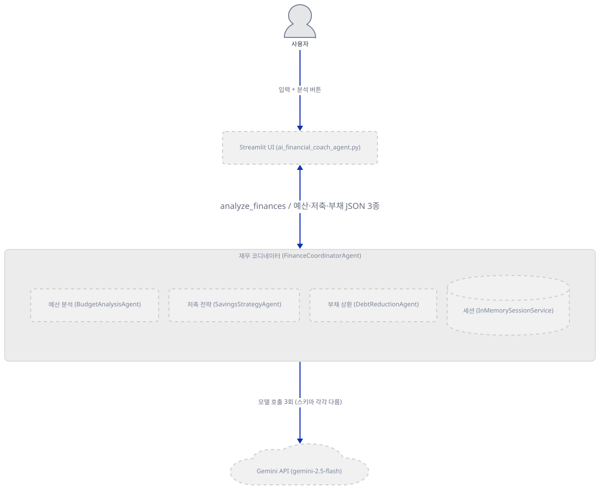

**확인.** `compiled`가 SyntaxWarning 4줄 뒤에 찍히고, 이어서 여섯 버전 줄(`streamlit 1.64.0`부터 `google-genai 2.25.0`까지)이 그대로 나오면 다음 스텝으로 넘어갈 준비가 된 것입니다. 이 시점에는 아직 에이전트·세션 저장소·Gemini 호출 중 무엇도 만들어지지 않았습니다(아래 그림 전체가 `-todo`인 이유).

### Step 2. Pydantic 출력 스키마 — 모델 안에 모델이 들어가는 중첩 구조

**목적.** 세 에이전트가 강제할 응답 모양을 Pydantic으로 어떻게 선언하는지, 그리고 Day 016의 `EmailContent`·`SupportTicket`과 달리 이번 스키마는 **다른 `BaseModel`을 필드 타입으로 품는 중첩 구조**라는 것을 확인합니다.

**할 일.** `SpendingCategory`→`BudgetAnalysis` 체인을 봅니다.

`advanced_ai_agents/multi_agent_apps/ai_financial_coach_agent/ai_financial_coach_agent.py:28-42`

```python
class SpendingCategory(BaseModel):
    category: str = Field(..., description="Expense category name")
    amount: float = Field(..., description="Amount spent in this category")
    percentage: Optional[float] = Field(None, description="Percentage of total spending")

class SpendingRecommendation(BaseModel):
    category: str = Field(..., description="Category for recommendation")
    recommendation: str = Field(..., description="Recommendation details")
    potential_savings: Optional[float] = Field(None, description="Estimated monthly savings")

class BudgetAnalysis(BaseModel):
    total_expenses: float = Field(..., description="Total monthly expenses")
    monthly_income: Optional[float] = Field(None, description="Monthly income")
    spending_categories: List[SpendingCategory] = Field(..., description="Breakdown of spending by category")
    recommendations: List[SpendingRecommendation] = Field(..., description="Spending recommendations")
```

`spending_categories: List[SpendingCategory]`처럼 필드 타입 자체가 다른 `BaseModel`입니다. 부채 쪽은 한 단계 더 들어갑니다 — `PayoffPlans` 하나가 `PayoffPlan` 두 개(avalanche·snowball)를 품습니다.

`advanced_ai_agents/multi_agent_apps/ai_financial_coach_agent/ai_financial_coach_agent.py:74-87`

```python
class PayoffPlans(BaseModel):
    avalanche: PayoffPlan = Field(..., description="Highest interest first method")
    snowball: PayoffPlan = Field(..., description="Smallest balance first method")

class DebtRecommendation(BaseModel):
    title: str = Field(..., description="Title of recommendation")
    description: str = Field(..., description="Details of recommendation")
    impact: Optional[str] = Field(None, description="Expected impact of this action")

class DebtReduction(BaseModel):
    total_debt: float = Field(..., description="Total debt amount")
    debts: List[Debt] = Field(..., description="List of all debts")
    payoff_plans: PayoffPlans = Field(..., description="Debt payoff strategies")
    recommendations: Optional[List[DebtRecommendation]] = Field(None, description="Recommendations for debt reduction")
```

`output_schema`·`output_key`가 `LlmAgent`에 어떻게 붙는지, 결과가 `event.actions.state_delta`의 어디에 들어가는지는 Day 016이 이미 소스로 확인했으므로 되풀이하지 않습니다. 여기서 새로 보는 것은 Pydantic이 이 중첩을 `model_json_schema()`에서 `$defs`·`$ref`로 정확히 풀어낸다는 것뿐입니다.

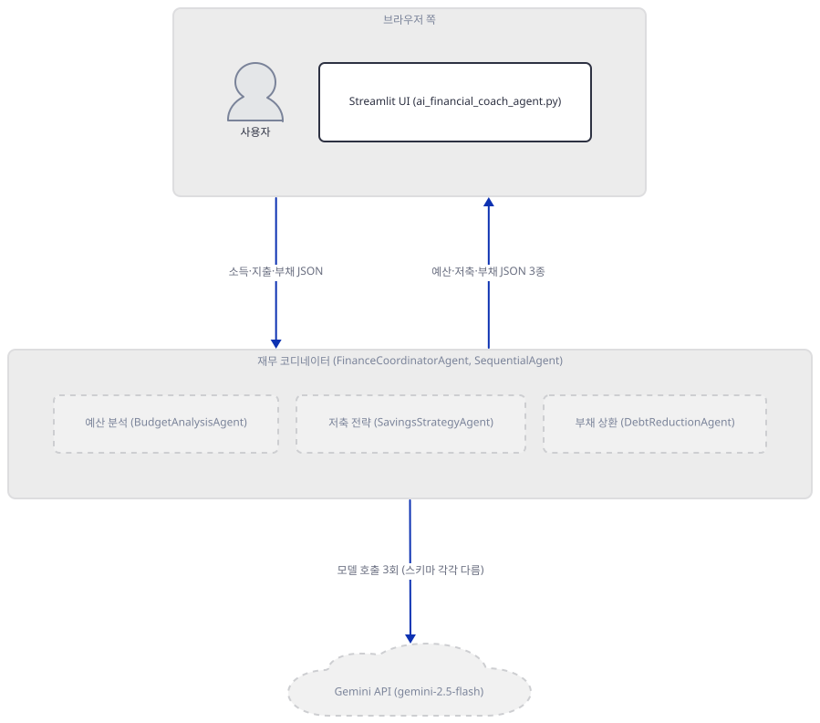

**확인.**

```bash
uv run --no-project python -c "
from ai_financial_coach_agent import BudgetAnalysis, DebtReduction
s1 = BudgetAnalysis.model_json_schema()
print(s1['properties']['spending_categories']['items'])
s2 = DebtReduction.model_json_schema()
print(s2['properties']['payoff_plans'])
print(sorted(s2['\$defs'].keys()))
" 2>/dev/null
```

```powershell
uv run --no-project python -c "
from ai_financial_coach_agent import BudgetAnalysis, DebtReduction
s1 = BudgetAnalysis.model_json_schema()
print(s1['properties']['spending_categories']['items'])
s2 = DebtReduction.model_json_schema()
print(s2['properties']['payoff_plans'])
print(sorted(s2['`$defs'].keys()))
" 2>$null
```

(bash는 `-c` 문자열 안의 `$defs`를 셸 변수로 잘못 풀이하지 않도록 역슬래시로 escape합니다. PowerShell은 백틱 문자로 escape합니다 — 둘 다 파이썬 코드 자체는 `$defs` 그대로입니다.) 직접 확인한 출력:

```
{'$ref': '#/$defs/SpendingCategory'}
{'$ref': '#/$defs/PayoffPlans', 'description': 'Debt payoff strategies'}
['Debt', 'DebtRecommendation', 'PayoffPlan', 'PayoffPlans']
```

### Step 3. 세 `LlmAgent` — `output_schema`가 자동으로 잠그는 것

**목적.** `BudgetAnalysisAgent`·`SavingsStrategyAgent`·`DebtReductionAgent` 셋을 실제로 만들어 보고, `output_schema`가 있으면 google-adk가 전환(`transfer_to_agent`) 관련 설정을 생성 시점에 자동으로 잠근다는 것을 직접 실행으로 확인합니다.

**할 일.** 세 에이전트는 지시문 길이만 다를 뿐 같은 모양입니다 — 첫 번째의 앞뒤만 봅니다.

`advanced_ai_agents/multi_agent_apps/ai_financial_coach_agent/ai_financial_coach_agent.py:103-106`

```python
        self.budget_analysis_agent = LlmAgent(
            name="BudgetAnalysisAgent",
            model="gemini-2.5-flash",
            description="Analyzes financial data to categorize spending patterns and recommend budget improvements",
```

`advanced_ai_agents/multi_agent_apps/ai_financial_coach_agent/ai_financial_coach_agent.py:133-135`

```python
            output_schema=BudgetAnalysis,
            output_key="budget_analysis"
        )
```

`savings_strategy_agent`(137-161)·`debt_reduction_agent`(163-187)도 같은 여섯 인자(`name`·`model`·`description`·`instruction`·`output_schema`·`output_key`) 순서입니다. 셋을 실제로 만들면 로그에 경고가 뜹니다.

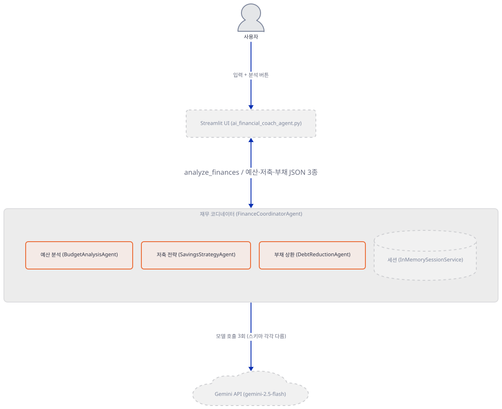

**확인.**

```bash
uv run --no-project python -W ignore -c "
from ai_financial_coach_agent import FinanceAdvisorSystem
system = FinanceAdvisorSystem()
print(system.budget_analysis_agent.output_schema.__name__, system.budget_analysis_agent.output_key)
print(system.budget_analysis_agent.disallow_transfer_to_parent, system.budget_analysis_agent.disallow_transfer_to_peers)
" 2>&1
```

직접 확인한 출력:

```
WARNING:google.adk.agents.llm_agent:Invalid config for agent BudgetAnalysisAgent: output_schema cannot co-exist with agent transfer configurations. Setting disallow_transfer_to_parent=True, disallow_transfer_to_peers=True
WARNING:google.adk.agents.llm_agent:Invalid config for agent SavingsStrategyAgent: output_schema cannot co-exist with agent transfer configurations. Setting disallow_transfer_to_parent=True, disallow_transfer_to_peers=True
WARNING:google.adk.agents.llm_agent:Invalid config for agent DebtReductionAgent: output_schema cannot co-exist with agent transfer configurations. Setting disallow_transfer_to_parent=True, disallow_transfer_to_peers=True
BudgetAnalysis budget_analysis
True True
```

(`-W ignore`는 이 임포트가 함께 끌고 오는 `SyntaxWarning`(Step 1에서 이미 본 것)·`FutureWarning`·`UserWarning`을 모두 지웁니다 — 위 `WARNING:` 세 줄은 `warnings` 모듈이 아니라 `logging` 모듈이 찍는 것이라 그대로 남습니다.) 세 경고 모두 똑같이 `disallow_transfer_to_parent`·`disallow_transfer_to_peers`를 `True`로 바꿉니다. 다만 Day 022가 `SequentialAgent`의 자식은 부모가 `LlmAgent`가 아니라서 애초에 `_get_transfer_targets`의 조건이 성립하지 않아 전환 대상 자체가 없다는 것을 소스로 확인했으므로, 이 경고가 없었어도 세 에이전트는 서로 건너뛸 수 없었습니다 — `output_schema`의 이 자동 잠금은 이 파이프라인에서는 이미 불가능한 일을 한 번 더 막는 보수적인 안전장치입니다.

### Step 4. `SequentialAgent` 코디네이터와 세션 저장소 — `Runner`가 직접 구동

**목적.** 세 에이전트를 묶는 `FinanceCoordinatorAgent`가 `SequentialAgent`이고, `Runner`가 이를 (091·092처럼 감싸는 `LlmAgent` 없이) 직접 구동한다는 것과, 이 셋이 함께 만들어지는 `__init__`에서 `InMemorySessionService`도 같이 준비된다는 것을 확인합니다.

**할 일.**

`advanced_ai_agents/multi_agent_apps/ai_financial_coach_agent/ai_financial_coach_agent.py:189-203`

```python
        self.coordinator_agent = SequentialAgent(
            name="FinanceCoordinatorAgent",
            description="Coordinates specialized finance agents to provide comprehensive financial advice",
            sub_agents=[
                self.budget_analysis_agent,
                self.savings_strategy_agent,
                self.debt_reduction_agent
            ]
        )
        
        self.runner = Runner(
            agent=self.coordinator_agent,
            app_name=APP_NAME,
            session_service=self.session_service
        )
```

`SequentialAgent._run_async_impl`이 앞 에이전트를 완전히 끝까지 소비한 뒤에야 다음으로 넘어간다는 것, 셋 다 같은 세션을 공유해 뒤 에이전트가 앞 에이전트의 대화 기록을 그대로 본다는 것은 Day 022가 이미 소스로 확인했으므로 되풀이하지 않습니다 — 다만 오늘 설치된 0.1.0의 구현은 Day 022가 본 2.9.2와 파일 내용이 다릅니다. 0.1.0은 인덱스나 재개 로직 없는 `for sub_agent in self.sub_agents: async for event in sub_agent.run_async(ctx): yield event`(`google/adk/agents/sequential_agent.py`, 소스로 확인)이고, 2.9.2는 인덱스 기반입니다 — "앞 에이전트를 완전히 소비한 뒤에야 다음으로 넘어간다"는 동작 자체만 같습니다. 오늘 다른 점(감싸는 `LlmAgent` 없음)만 확인합니다.

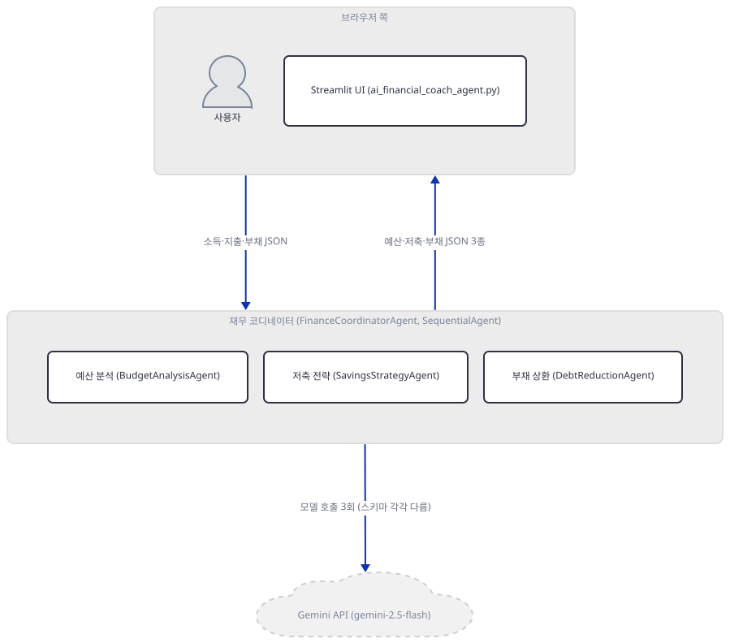

**확인.**

```bash
uv run --no-project python -c "
from ai_financial_coach_agent import FinanceAdvisorSystem
system = FinanceAdvisorSystem()
print(type(system.coordinator_agent).__name__, [a.name for a in system.coordinator_agent.sub_agents])
print(type(system.runner).__name__, type(system.session_service).__name__, system.runner.session_service is system.session_service)
" 2>/dev/null
```

직접 확인한 출력:

```
SequentialAgent ['BudgetAnalysisAgent', 'SavingsStrategyAgent', 'DebtReductionAgent']
Runner InMemorySessionService True
```

### Step 5. `analyze_finances` — 세션 생성부터 삭제까지, 키 없을 때 멈추는 지점

**목적.** 요청 한 번이 세션 생성 → `Runner.run_async` 소비 → 결과 조회 → 세션 삭제로 이어지는 과정을 코드로 확인하고, 키가 없을 때 정확히 어느 줄에서 멈추는지 직접 실행으로 확인합니다. `Runner`·세션 서비스를 직접 구동하는 패턴 자체는 Day 077이 이미 다뤘으므로 되풀이하지 않습니다.

**할 일.**

`advanced_ai_agents/multi_agent_apps/ai_financial_coach_agent/ai_financial_coach_agent.py:205-222`

```python
    async def analyze_finances(self, financial_data: Dict[str, Any]) -> Dict[str, Any]:
        session_id = f"finance_session_{datetime.now().strftime('%Y%m%d_%H%M%S')}"
        
        try:
            initial_state = {
                "monthly_income": financial_data.get("monthly_income", 0),
                "dependants": financial_data.get("dependants", 0),
                "transactions": financial_data.get("transactions", []),
                "manual_expenses": financial_data.get("manual_expenses", {}),
                "debts": financial_data.get("debts", [])
            }
            
            session = self.session_service.create_session(
                app_name=APP_NAME,
                user_id=USER_ID,
                session_id=session_id,
                state=initial_state
            )
```

`advanced_ai_agents/multi_agent_apps/ai_financial_coach_agent/ai_financial_coach_agent.py:251-256`

```python
            results = {}
            for key in ["budget_analysis", "savings_strategy", "debt_reduction"]:
                value = updated_session.state.get(key)
                results[key] = parse_json_safely(value, default_results[key]) if value else default_results[key]
            
            return results
```

`advanced_ai_agents/multi_agent_apps/ai_financial_coach_agent/ai_financial_coach_agent.py:258-266`

```python
        except Exception as e:
            logger.exception(f"Error during finance analysis: {str(e)}")
            raise
        finally:
            self.session_service.delete_session(
                app_name=APP_NAME,
                user_id=USER_ID,
                session_id=session_id
            )
```

`finally` 블록이라 **예외가 나도 세션은 항상 삭제**됩니다 — `InMemorySessionService`이므로 프로세스가 떠 있는 동안만 존재하는 세션이지만, 실패한 세션이 메모리에 쌓이지 않게 하는 것이 이 블록의 역할입니다. 아래 확인처럼 `run_async` 자체가 예외를 던지는 경로에서는 `except`의 `raise`가 먼저 실행되므로 `default_results`는 만들어지기만 하고 쓰이지는 않습니다 — 하지만 이것이 `_create_default_results`가 죽은 코드라는 뜻은 아닙니다. `run_async`가 예외 없이 끝나는 **성공 경로**에서는 252-254행이 `budget_analysis`·`savings_strategy`·`debt_reduction` 세 키 각각에 대해 `updated_session.state`에 그 키가 없거나 값이 JSON으로 안 풀리면 `default_results[key]`로 조용히 대체합니다(Step 6에서 이 함수 자체를 직접 실행해 확인합니다) — "예외 시 전체 폴백"이 아니라 "키별 기본값 대체"입니다.

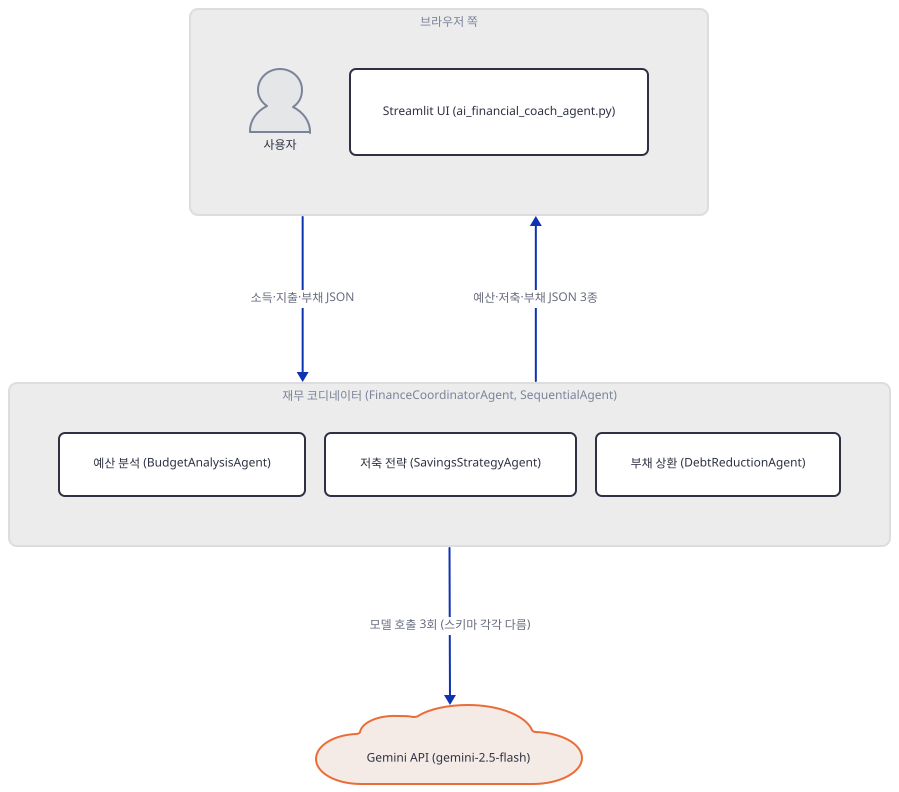

**확인.**

```bash
uv run --no-project python -W ignore -c "
import asyncio
from ai_financial_coach_agent import FinanceAdvisorSystem
system = FinanceAdvisorSystem()
data = {'monthly_income': 4000.0, 'dependants': 1, 'manual_expenses': {'Housing': 1200.0}, 'debts': []}
try:
    asyncio.run(system.analyze_finances(data))
except Exception as e:
    print(type(e).__name__, str(e)[:70])
" 2>&1 | tail -2
```

직접 확인한 출력(패키지 내부 경로는 생략 — google-genai 2.25.0 소스로 확인하면 `_api_client.py`의 `BaseApiClient.__init__`에서 끝납니다. 둘째 줄은 `str(e)[:70]`이 자른 그대로입니다):

```
ValueError: No API key was provided. Please pass a valid API key. Learn how to create an API key at https://ai.google.dev/gemini-api/docs/api-key.
ValueError No API key was provided. Please pass a valid API key. Learn how to cre
```

Day 088·091·092가 키 없이 멈추던 지점(`google.genai`의 `Client()` 생성자)과 정확히 같습니다 — 이번에는 그 앞에 `SequentialAgent`의 첫 자식(`BudgetAnalysisAgent`)이 있을 뿐, 예외가 발생하는 층은 같습니다.

### Step 6. 전처리와 키별 기본값 대체 — 모델 없이도 도는 부분

**목적.** CSV 파싱·검증과 세션 전처리는 순수 pandas·csv 코드라 키 없이도 끝까지 실행된다는 것을, 저장소 안에 실제로 있는 샘플 데이터로 확인합니다.

**할 일.** 사이드바가 내려주는 샘플 CSV는 코드에 그대로 박혀 있습니다.

`advanced_ai_agents/multi_agent_apps/ai_financial_coach_agent/ai_financial_coach_agent.py:637-640`

```python
        sample_csv = """Date,Category,Amount
2024-01-01,Housing,1200.00
2024-01-02,Food,150.50
2024-01-03,Transportation,45.00"""
```

세션에 들어온 거래 내역·수동 입력을 정리하는 함수도 짧습니다.

`advanced_ai_agents/multi_agent_apps/ai_financial_coach_agent/ai_financial_coach_agent.py:268-281`

```python
    def _preprocess_transactions(self, session):
        transactions = session.state.get("transactions", [])
        if not transactions:
            return
        
        df = pd.DataFrame(transactions)
        
        if 'Date' in df.columns:
            df['Date'] = pd.to_datetime(df['Date']).dt.strftime('%Y-%m-%d')
        
        if 'Category' in df.columns and 'Amount' in df.columns:
            category_spending = df.groupby('Category')['Amount'].sum().to_dict()
            session.state["category_spending"] = category_spending
            session.state["total_spending"] = df['Amount'].sum()
```

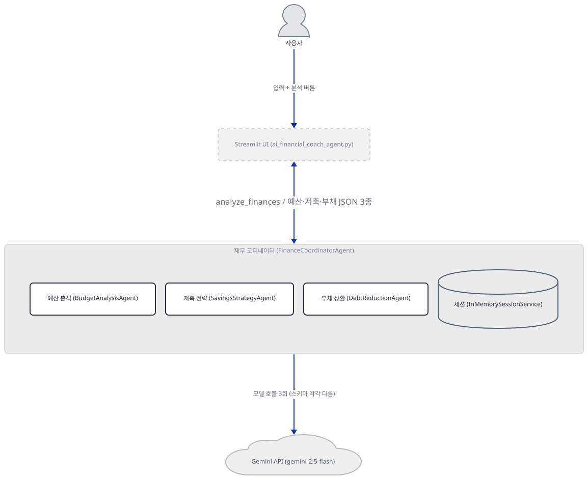

**확인.** 위 샘플 CSV 그대로 `parse_csv_transactions`·`validate_csv_format`을 돌립니다(둘 다 `LlmAgent`를 전혀 부르지 않습니다).

```bash
uv run --no-project python -c "
from ai_financial_coach_agent import parse_csv_transactions, validate_csv_format
sample_csv = '''Date,Category,Amount
2024-01-01,Housing,1200.00
2024-01-02,Food,150.50
2024-01-03,Transportation,45.00'''
class F:
    def __init__(self, t): self.b = t.encode(); self.p = 0
    def read(self): return self.b[self.p:]
    def seek(self, p): self.p = p
print(validate_csv_format(F(sample_csv)))
print(parse_csv_transactions(sample_csv.encode())['category_totals'])
" 2>/dev/null
```

직접 확인한 출력:

```
(True, 'CSV format is valid')
[{'Category': 'Food', 'Amount': 150.5}, {'Category': 'Housing', 'Amount': 1200.0}, {'Category': 'Transportation', 'Amount': 45.0}]
```

`_create_default_results`(293-355)도 순수 계산입니다 — Step 5에서 봤듯 이 함수가 만드는 `default_results`는 **성공 경로에서** 251-254행이 키별로 조용히 갖다 쓰는 값이라, 실제 앱에서도 매번 계산됩니다.

```bash
uv run --no-project python -c "
from ai_financial_coach_agent import FinanceAdvisorSystem
import json
data = {'monthly_income': 4000.0, 'manual_expenses': {'Housing': 1200.0, 'Food': 400.0}, 'debts': []}
system = FinanceAdvisorSystem()
print(json.dumps(system._create_default_results(data)['budget_analysis']))
" 2>/dev/null
```

직접 확인한 출력:

```
{"total_expenses": 1600.0, "monthly_income": 4000.0, "spending_categories": [{"category": "Housing", "amount": 1200.0, "percentage": 75.0}, {"category": "Food", "amount": 400.0, "percentage": 25.0}], "recommendations": [{"category": "General", "recommendation": "Consider reviewing your expenses carefully", "potential_savings": 160.0}]}
```

### Step 7. Streamlit로 띄우기 — 헤드리스 확인과 실행 체크리스트

**목적.** 앱을 실제로 띄우는 명령과, 키가 없을 때 메인 화면이 어디서 멈추는지 소스로 확인합니다.

**할 일.** 키 확인 자체는 사이드바보다 먼저가 아니라 **사이드바를 다 그린 뒤** 메인 영역에서 일어납니다.

`advanced_ai_agents/multi_agent_apps/ai_financial_coach_agent/ai_financial_coach_agent.py:649-651`

```python
    if not GEMINI_API_KEY:
        st.error("🔑 GOOGLE_API_KEY not found in environment variables. Please add it to your .env file.")
        return
```

소스로 확인하면, 사이드바(제목·안내문·CSV 템플릿 다운로드 버튼)는 `GOOGLE_API_KEY` 유무와 무관하게 항상 그려지고, 메인 영역만 이 `st.error` 한 줄을 띄운 뒤 `return`으로 끝나 탭도 입력 폼도 전혀 렌더링되지 않습니다. 앱을 띄우는 명령은 한 줄입니다.

```bash
uv run --no-project streamlit run ai_financial_coach_agent.py
```

이 명령을 그대로 실행하면 브라우저 탭이 열리고 위 화면(키가 없으면 오류 문구만)이 뜹니다 — 이 문서는 브라우저를 열 수 없어 같은 명령에 헤드리스 옵션만 더해, 다른 에이전트와 겹치지 않는 임의의 높은 포트(61234, 49152~65535 범위)로 직접 확인했습니다.

```bash
uv run --no-project streamlit run ai_financial_coach_agent.py --server.headless true --server.port 61234 --server.address localhost
```

`--server.address localhost`가 없으면 헤드리스 시작 배너가 외부 IP를 조회하려고 `checkip.amazonaws.com`에 요청을 보냅니다(Day 060에서 이미 확인한 동작) — 이 문서는 그 요청도 함께 막았습니다. 직접 확인한 콘솔 출력(정규식이 raw string이 아니라 `SyntaxWarning`도 함께 뜹니다 — 문제 해결 절 참고):

```
<unknown>:533: SyntaxWarning: invalid escape sequence '\$'
<unknown>:574: SyntaxWarning: invalid escape sequence '\$'
2026-09-29 16:42:41.116 Uvicorn server started on localhost:61234

  You can now view your Streamlit app in your browser.

  URL: http://localhost:61234
```

키 없이도 서버 자체는 뜨고 HTTP 요청에 정상 응답합니다(`curl -s -o /dev/null -w '%{http_code}' http://localhost:61234` → `200`, 직접 확인). 확인이 끝나면 이 프로세스는 반드시 종료합니다(`Ctrl+C`, 또는 이 문서처럼 백그라운드로 띄웠다면 해당 PID를 종료 — 이 문서에서는 종료 후 `netstat`으로 포트가 비었음도 확인했습니다).

이 스텝에서 비로소 Streamlit UI가 실제로 화면에 뜹니다 — 지금까지는 `ai_financial_coach_agent`를 모듈로 임포트해 클래스·함수만 확인했을 뿐, `streamlit run`으로 띄운 적은 없었습니다(아래 그림에서 UI만 이번에 `-new`인 이유).

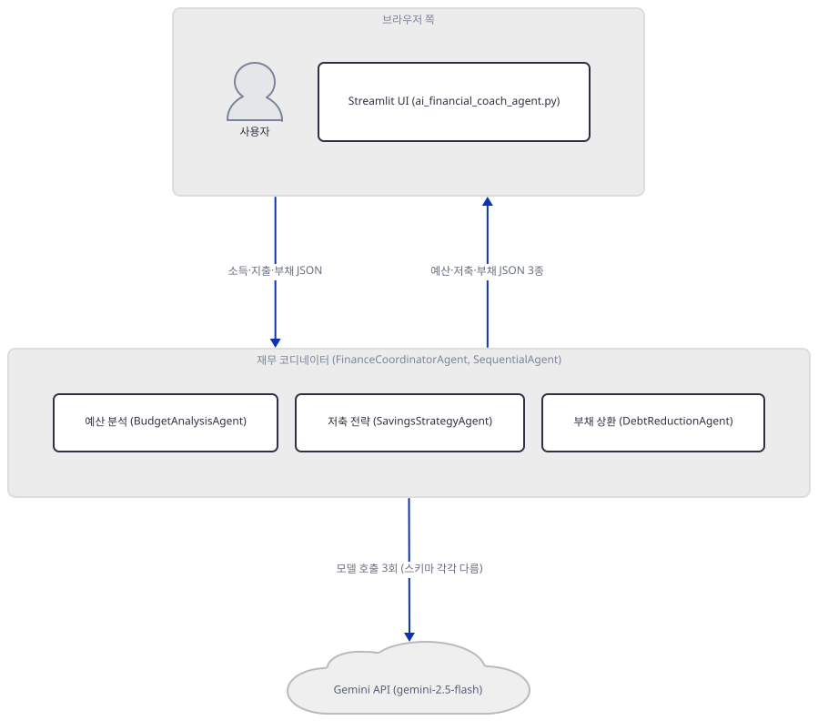

**확인.** 위 `URL: http://localhost:61234` 줄과 `200` 응답이 그대로 나오면, 그리고 종료 뒤 `netstat -ano | grep 61234`에 `LISTENING` 줄이 없으면 이 스텝은 끝입니다.

## 요청 한 건이 흐르는 과정

한 번의 "분석하기" 클릭이 실제로는 네 단계를 거칩니다 — 아래 네 그림은 그 순서 그대로입니다. 세 단계 모두에서 실제로 Gemini를 부르고 상태를 저장하는 쪽은 `BudgetAnalysisAgent`·`SavingsStrategyAgent`·`DebtReductionAgent` 자신이지만, 세션 생성·조회·삭제와 `state_delta` 반영은 `FinanceCoordinatorAgent`(`SequentialAgent`)가 감싸는 `analyze_finances`·`Runner`의 몫이라 코디네이터를 통해서만 `InMemorySessionService`에 닿습니다.

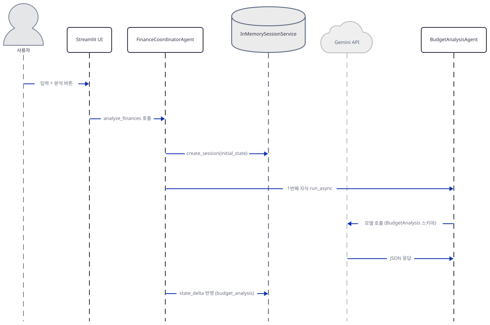

1단계는 사용자 입력이 `analyze_finances` 호출로 이어져 `create_session`으로 세션이 만들어지고, 코디네이터가 첫 자식(`BudgetAnalysisAgent`)을 `run_async`로 실행해 Gemini를 부른 뒤 그 응답을 `state_delta`로 세션에 반영하는 부분까지를 그립니다.

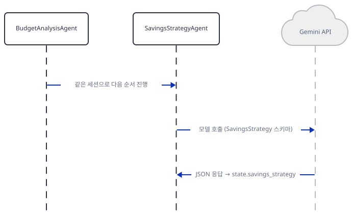

2단계는 `SequentialAgent`가 같은 세션으로 두 번째 자식(`SavingsStrategyAgent`)을 실행하는 부분만 그립니다 — 새 세션이 아니라 1단계와 **같은 세션**입니다(Day 022 확인).

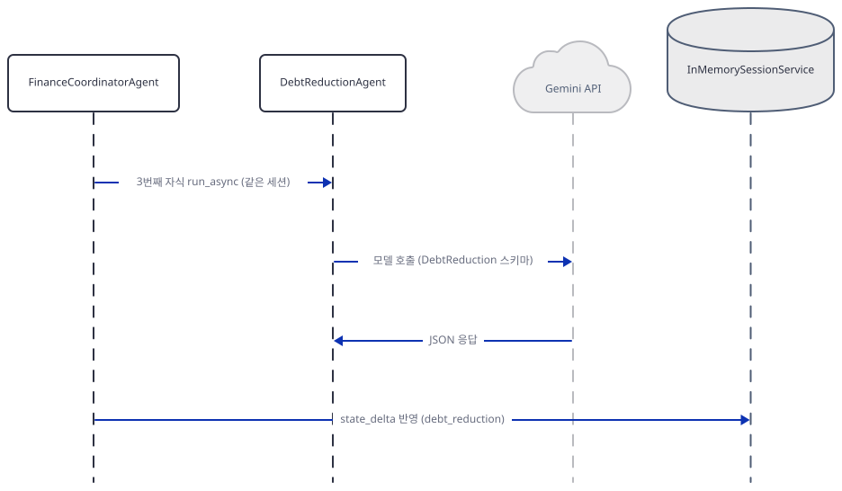

3단계는 마지막 자식(`DebtReductionAgent`)을 같은 방식으로 실행하고 `state_delta`를 반영하는 부분만 그립니다.

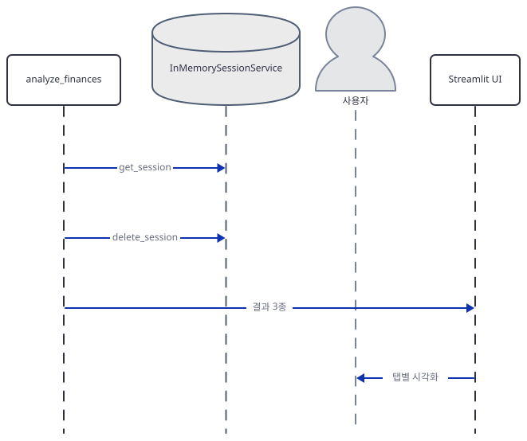

4단계는 세 자식이 모두 끝난 뒤 코디네이터가 `get_session`으로 세 결과를 꺼내고, `finally`의 `delete_session`으로 세션을 지운 뒤, 결과를 Streamlit UI로 돌려줘 탭별로 시각화하는 부분을 그립니다.

## 실행 체크리스트

- [ ] `uv pip install -r requirements.txt` 후 `import google.adk`가 `deprecated` 누락으로 실패하고, `uv pip install Deprecated`로 해결됨을 직접 확인했다
- [ ] `BudgetAnalysis`·`DebtReduction`의 `model_json_schema()`가 `$defs`·`$ref`로 중첩 구조를 담는 것을 확인했다
- [ ] 세 `LlmAgent` 생성 시 `output_schema cannot co-exist with agent transfer configurations` 경고가 뜨고 `disallow_transfer_to_parent`·`disallow_transfer_to_peers`가 `True`로 바뀌는 것을 확인했다
- [ ] `FinanceCoordinatorAgent`가 `SequentialAgent`이고 `Runner`가 감싸는 `LlmAgent` 없이 이를 직접 구동하며, `InMemorySessionService`도 `__init__`에서 함께 만들어진다는 것을 확인했다
- [ ] 키 없이 `analyze_finances`를 호출하면 `google.genai.Client()`에서 `ValueError: No API key was provided`로 끝난다는 것을 확인했다
- [ ] 저장소에 내장된 샘플 CSV로 `parse_csv_transactions`·`validate_csv_format`이 키 없이도 동작하고, `_create_default_results`가 성공 경로에서도 키별 기본값 대체에 쓰인다는 것을 확인했다
- [ ] `uv run --no-project streamlit run ai_financial_coach_agent.py --server.headless true --server.address localhost`로 서버가 뜨고, 종료 후 포트가 비었다는 것을 확인했다
- [ ] 앱 화면의 "로컬 처리·전송 없음" 문구(664, 956-957행)와 달리 입력 값이 `json.dumps`로 Gemini API에 전송된다는 것(232-235행)을 소스로 확인했다

## 문제 해결

| 증상 | 원인 | 해결 |
|---|---|---|
| `uv pip install -r requirements.txt` 후 `import google.adk`가 `ModuleNotFoundError: No module named 'deprecated'`로 실패 | google-adk==0.1.0의 패키지 메타데이터가 `deprecated`를 의존성으로 선언하지 않음(직접 확인, site-packages의 `METADATA`) | `uv pip install Deprecated`를 추가로 설치 |
| `requirements.txt`의 `matplotlib`이 설치는 되지만 실행에 아무 영향이 없음 | 시각화는 전부 `plotly`(`px`·`go`)로 되어 있고 `import matplotlib`이 코드 어디에도 없음(그렙 확인) | 무시해도 됨 — 설치 시간만 늘어남 |
| 키 없이 앱을 열면 입력 폼·"분석하기" 버튼이 아예 안 보이고 오류 문구만 뜸(눌러 볼 버튼 자체가 없음) | 메인 영역은 `GEMINI_API_KEY`가 없으면 `st.error` 한 줄만 띄우고 즉시 `return`해(649-651행) 탭·버튼을 만드는 코드(660행 이후)까지 가지 않음. `FinanceAdvisorSystem`을 직접 호출하면 그 안쪽인 `google.genai.Client()` 생성자의 `ValueError`까지 감(Step 5) | `.env`에 `GOOGLE_API_KEY` 설정 |
| 실행 중 콘솔에 `SyntaxWarning: invalid escape sequence '\$'`가 두 번 뜸 | `df['Amount'].replace('[\$,]', '', regex=True)`의 정규식 문자열이 raw string(`r'...'`)이 아님(533·574행, 직접 확인) | 동작에는 지장 없음(경고일 뿐) — 고치려면 `r'[\$,]'`로 바꾸면 되지만 이 문서는 리포 코드를 고치지 않음 |
| 화면은 "로컬 처리·전송 없음"이라고 하는데 실제로 Gemini에 데이터가 나가는지 헷갈림 | 664·956-957행의 문구는 사실이 아님 — `analyze_finances`가 `json.dumps(financial_data)`로 소득·지출·부채 전체를 사용자 메시지에 담아 `Runner.run_async`로 Gemini API에 보냄(232-235행, 소스로 확인) | 실습에는 예시 CSV만 쓰고 실제 재무 정보는 입력하지 않기 |

## 더 해보기

- 실제 키로 파이프라인을 끝까지 돌려, 세 키 중 하나를 일부러 비우거나(예: `manual_expenses`를 빈 값으로) `_create_default_results`의 규칙 기반 기본값(비상금 = 지출의 6배 등)이 실제로 그 키에만 대체되어 들어가는지 확인해 보세요.
- CSV 업로드 경로와 수동 입력 경로가 각각 만드는 `financial_data` 딕셔너리(`transactions` vs `manual_expenses`)를 직접 찍어 비교하고, `_preprocess_transactions`·`_preprocess_manual_expenses` 중 어느 쪽이 불리는지 확인해 보세요.
- `output_schema`가 있는 `LlmAgent`를 이 앱 밖에서 다른 `LlmAgent`의 `sub_agents=`로 붙여 보고(Day 021의 구조), Step 3에서 본 자동 잠금 때문에 Day 021이 확인한 자동 전환 지시문이 실제로 빠지는지 확인해 보세요.

## 다음 날 예고

[Day 095 · 🏚️ 🍌 AI Home Renovation Agent with Nano Banana Pro](../day095-ai-home-renovation-agent/README.md) — Nano Banana Pro 이미지 모델을 쓰는 AI 홈 리노베이션 에이전트입니다.
