# Day 095 · 🏚️ 🍌 AI Home Renovation Agent with Nano Banana Pro

> 볼륨 7 🚀 Advanced AI Agents · 난이도 ★★★ ⚠(모델 서비스 종료) · 예상 소요 70분(Step마다 함수를 직접 호출해 보고, 부모 폴더에서 `--python`으로 가상환경을 직접 가리키는 실행법을 셸별로 맞춰 보고, `adk web`까지 띄워 어디서 멈추는지 확인하는 손 시간이 듭니다) · API 비용 대략 계획 한 건에 Gemini 호출 최소 10회(코디네이터 1 + VisualAssessor 2 + SearchAgent 1(그라운딩 과금 별도) + DesignPlanner 2 + ProjectCoordinator 2 + 렌더링 도구 자체 호출 2) — 렌더링에 쓰는 모델 둘이 이미 서비스 종료라 실제 키로도 그 단계에서 막혀 실측은 못합니다 · 원본 앱: `advanced_ai_agents/multi_agent_apps/ai_home_renovation_agent`

## 오늘 만들 것

사진 한 장과 예산을 주면 방 사진을 분석하고 디자인 계획을 세운 뒤 Google의 이미지 생성 모델로 리모델링 후 모습을 그려 주는 Google ADK 멀티 에이전트 앱입니다. 코디네이터 하나가 일반 질문·기존 렌더링 수정·신규 계획 셋 중 하나로 요청을 갈라 보내고(Coordinator/Dispatcher), 신규 계획은 시각 분석 → 디자인 → 렌더링 생성의 3단계 `SequentialAgent`가 순서대로 처리합니다. 오늘 배우는 핵심은 두 가지입니다. 하나는 `SequentialAgent`를 다른 `LlmAgent`의 `sub_agents`에 그대로 끼워 넣는 조합인데, `days.json` 경로 1~94를 전수 스캔하면 `SequentialAgent(`가 나오는 날은 022(Runner 루트, 워크플로 자체가 최상위)·091·092·094(역시 Runner 루트)뿐이고, 그중 다른 `LlmAgent`의 `sub_agents`에 직접 섞어 넣는 조합은 Day 091(AI Sales Intelligence Agent Team)이 처음, Day 092(AI VC Due Diligence Agent Team)가 두 번째, 바로 전날인 Day 094는 `SequentialAgent`가 최상위 Runner라 이 조합에 해당하지 않습니다 — 그래서 오늘이 세 번째입니다(그렙으로 직접 확인). 다른 하나는 렌더링 도구 자신이 ADK의 모델 관리를 거치지 않고 `google.genai.Client()`를 직접 만들어 Gemini를 **두 번 연달아** 부르는 패턴입니다 — 먼저 `gemini-3-pro-preview`로 프롬프트를 사진처럼 상세하게 다시 쓰고, 그 결과를 `gemini-3-pro-image-preview`에 넘겨 실제 이미지를 만듭니다. 오늘 제목의 "Nano Banana Pro"는 이 프리뷰 모델의 이름이 아니라 그 GA 후속 모델 `gemini-3-pro-image`의 별명입니다(Google 공식 이미지 생성 문서 https://ai.google.dev/gemini-api/docs/image-generation, 2026-09-29 확인) — 앱이 실제로 부르는 것은 그 전신인 프리뷰 이름입니다. 그런데 이 두 프리뷰 모델은 Google 공식 "Model deprecations" 문서(https://ai.google.dev/gemini-api/docs/deprecations, 2026-09-29 확인)에 각각 2026-03-09·2026-06-25 종료로 올라 있어, 키를 발급해도 이 단계에서 막힙니다 — Day 082·091·092가 같은 모델로 이미 확인한 것과 같은 결과입니다(직접 재확인). 이 문서는 키 없이 이 구조가 어디까지 실제로 동작하는지 — 로컬 도구 두 개를 직접 호출하고, 렌더링 도구 두 개가 키 없이 정확히 어느 줄에서 멈추는지, `adk web`을 띄워 세션을 만들고 같은 지점에서 막히는지 — 를 전부 직접 실행해 확인합니다. 완성 아키텍처는 다음과 같습니다.

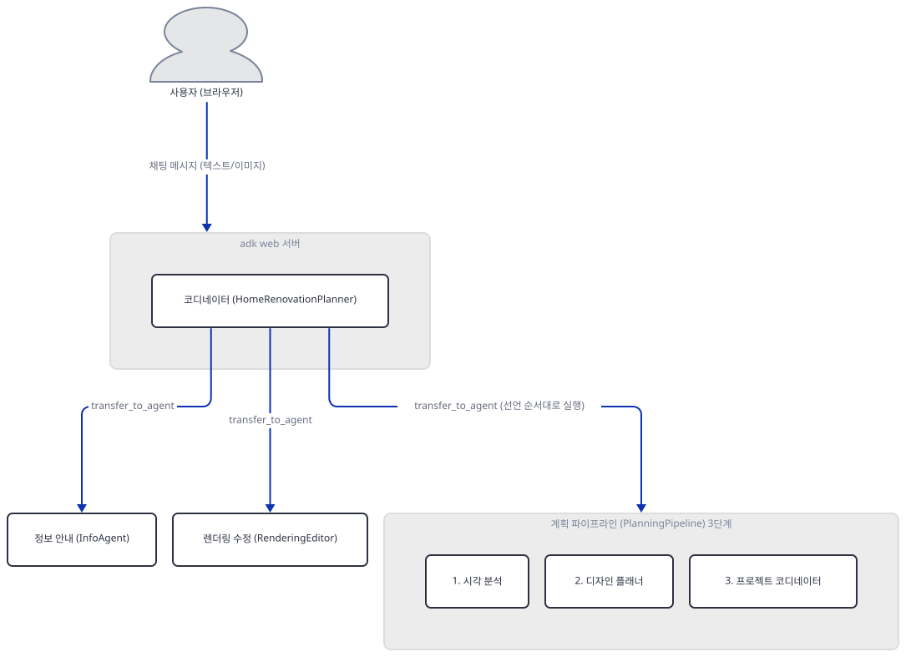

## 사전 준비

| 서비스/도구 | 용도 | 발급·설치 |
|---|---|---|
| Google AI Studio API 키 (`GOOGLE_API_KEY` 또는 `GEMINI_API_KEY`) | 7개 `LlmAgent`의 `gemini-3-flash-preview` 호출과, `tools.py`가 직접 만드는 `Client()`의 `gemini-3-pro-preview`·`gemini-3-pro-image-preview` 호출까지 전부 이 키로 인증한다. `adk web`을 띄우기 **전에** 셸 환경변수(`export GOOGLE_API_KEY=...`, PowerShell은 `$env:GOOGLE_API_KEY="..."`)로 설정하거나 앱 폴더 안에 `.env`로 둔다 — `adk web`은 `cli/utils/envs.py`의 `load_dotenv_for_agent`로 에이전트 폴더의 `.env`를 자동으로 읽는다(Day 088에서 이미 확인한 메커니즘과 같다). 이 문서는 키를 발급하지 않고 없을 때 어디서 멈추는지만 확인한다 | https://aistudio.google.com/apikey. **`gemini-3-pro-preview`(2026-03-09)·`gemini-3-pro-image-preview`(2026-06-25)는 이미 서비스 종료됐다**(Google 공식 문서, 2026-09-29 확인) — 발급해도 렌더링 생성 단계에서 막힌다. `gemini-3-flash-preview`만 종료일 미발표 |

## 아키텍처 한눈에 보기

| 컴포넌트 | 역할 | 코드 위치 |
|---|---|---|
| `adk web` 서버 | `ai_home_renovation_agent` 폴더를 스캔·임포트해 FastAPI 앱과 채팅 UI를 자체 구동 (Day 014와 같은 CLI) | 코드 없음 (google-adk 2.10.0 CLI — 직접 확인) |
| 코디네이터 (`root_agent`, `HomeRenovationPlanner`) | 일반 질문·렌더링 수정·신규 계획 셋 중 하나로 `transfer_to_agent` | `advanced_ai_agents/multi_agent_apps/ai_home_renovation_agent/agent.py:472-513` |
| 정보 안내 에이전트 (`InfoAgent`) | 일반 질문에 2~4문장으로 응답 | `advanced_ai_agents/multi_agent_apps/ai_home_renovation_agent/agent.py:114-134` |
| 렌더링 수정 에이전트 (`RenderingEditor`) | 기존 렌더링을 피드백대로 재편집 | `advanced_ai_agents/multi_agent_apps/ai_home_renovation_agent/agent.py:141-179` |
| 계획 파이프라인 (`PlanningPipeline`, `SequentialAgent`) | 시각 분석 → 디자인 → 렌더링 생성을 선언 순서대로 강제 | `advanced_ai_agents/multi_agent_apps/ai_home_renovation_agent/agent.py:457-465` |
| 시각 분석 에이전트 (`VisualAssessor`) | 사진의 레이아웃·재질을 그대로 문서화 | `advanced_ai_agents/multi_agent_apps/ai_home_renovation_agent/agent.py:186-274` |
| 검색 에이전트 (`SearchAgent`, `AgentTool`) | `google_search` 하나만 물고 리모델링 시세·트렌드 검색 | `advanced_ai_agents/multi_agent_apps/ai_home_renovation_agent/agent.py:30-38` |
| 디자인 플래너 (`DesignPlanner`) | 레이아웃은 그대로 두고 표면 마감만 바꾸는 계획 | `advanced_ai_agents/multi_agent_apps/ai_home_renovation_agent/agent.py:277-350` |
| 프로젝트 코디네이터 (`ProjectCoordinator`) | 예산·일정 요약과 렌더링 생성/편집/목록 호출 | `advanced_ai_agents/multi_agent_apps/ai_home_renovation_agent/agent.py:353-453` |
| 견적·일정·목록 도구 | `estimate_renovation_cost`(방 유형·범위별 단가표)·`calculate_timeline`(범위별 고정 문자열)·`list_renovation_renderings`(세션의 버전 목록) — 키 없이도 끝까지 실행됨(직접 확인) | `advanced_ai_agents/multi_agent_apps/ai_home_renovation_agent/agent.py:45-81`, `agent.py:84-107`, `advanced_ai_agents/multi_agent_apps/ai_home_renovation_agent/tools.py:492-494` |
| 렌더링 생성/편집 도구 | 프롬프트 재작성(`gemini-3-pro-preview`) 후 이미지 생성/편집(`gemini-3-pro-image-preview`), 버전 관리 후 아티팩트 저장 | `advanced_ai_agents/multi_agent_apps/ai_home_renovation_agent/tools.py:123-298`, `advanced_ai_agents/multi_agent_apps/ai_home_renovation_agent/tools.py:305-485` |
| Pydantic 입력 모델 | 도구 하나가 인자 여러 개 대신 모델 하나(`inputs`)를 받는 방식 — ADK의 `JSON_SCHEMA_FOR_FUNC_DECL` 기능(기본 켜짐)은 이를 `parameters_json_schema`로 실을지만 정할 뿐, 꺼도 `parameters`에 같은 중첩 구조가 만들어진다(Step 6에서 확인) | `advanced_ai_agents/multi_agent_apps/ai_home_renovation_agent/tools.py:104-117` |
| 세션 상태 + 아티팩트 저장소 | `tool_context.state`의 버전 카운터와 `tool_context.save_artifact`의 이미지 바이트 | 코드 없음 (google-adk `ToolContext` — 직접 확인) |

완성 아키텍처에는 코디네이터가 세 대상 중 어디로 보내는지와 `PlanningPipeline`의 3단계 존재만 남기고, 각 에이전트가 실제로 어떤 도구·모델을 부르는지는 따로 그렸습니다 — 한 그림에 다 넣으면 코디네이터·3단계·도구·Gemini 두 모델·검색·저장소가 층층이 쌓여 너무 길어지기 때문입니다. 아래 다섯 그림이 overview의 각 노드 하나에 정확히 대응합니다.

1. 코디네이터·`InfoAgent`·`RenderingEditor`가 각각 flash를 부르는 관계(둘의 편집·목록 도구 포함).
2. `VisualAssessor`(1단계)가 `SearchAgent`·견적 도구·flash를 부르는 관계 — `google_search`는 `SearchAgent`가 있는 이 그림에 있습니다(flash 안에서 내장 실행되는 것이라 `SearchAgent` 호출일 때만 켜집니다).
3. `DesignPlanner`(2단계)·`ProjectCoordinator`(3단계)가 일정·생성·편집·목록 도구와 flash를 부르는 관계.
4. 생성 도구가 실제로 `gemini-3-pro-preview`·`gemini-3-pro-image-preview`·저장소와 만나는 지점(저장소에서 버전·참조 이미지를 읽는 것도 포함).
5. 편집·목록 도구가 `gemini-3-pro-image-preview`·저장소와 만나는 지점(편집 도구는 원본을 `load_artifact`로 먼저 읽습니다).

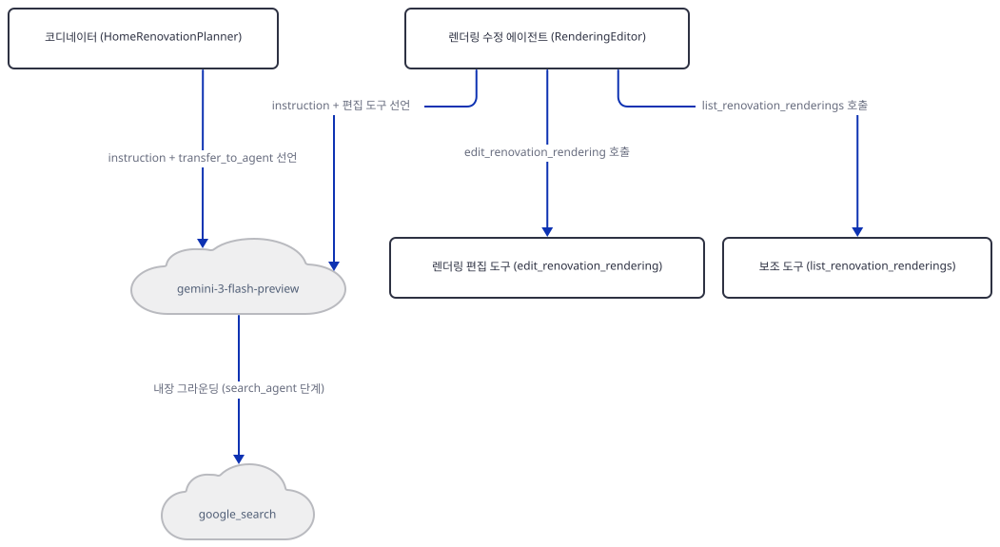
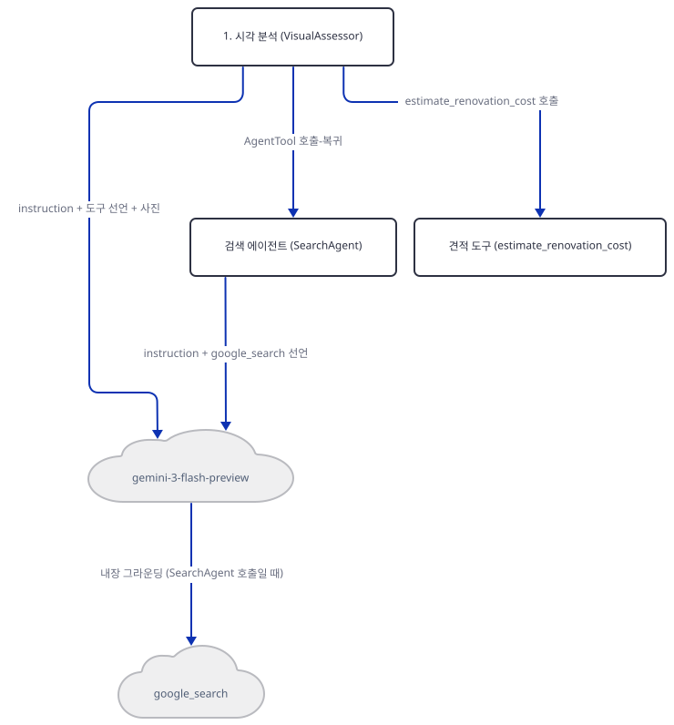
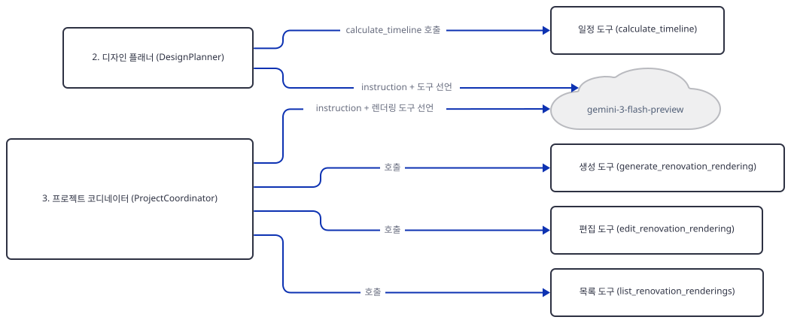
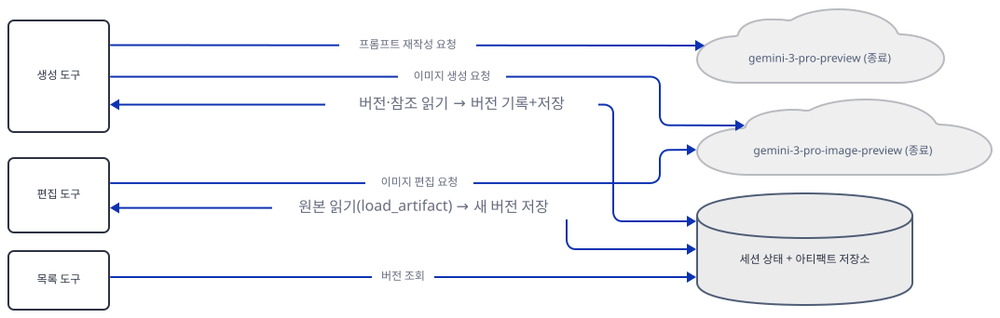
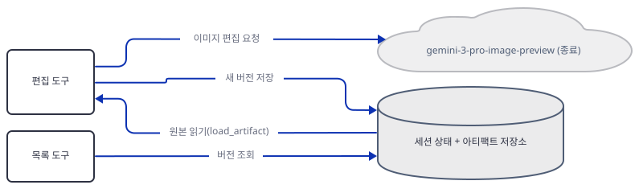

## 단계별 진행

### Step 1. 환경 구성 — `requirements.txt`가 안 적어 둔 패키지로 돌아간다

**목적.** 키 없이 이 앱이 어디까지 설치·임포트되는지 확인하고, `requirements.txt`의 실제 오류를 확인합니다.

**할 일.** `requirements.txt`(3줄)는 `google-adk`·`google-generativeai`·`python-dotenv`만 적어 두지만, `tools.py:3-4`가 실제로 임포트하는 것은 `from google import genai`(패키지 이름 `google-genai`, 구글의 새 통합 SDK)입니다 — `google-generativeai`(옛 SDK, 임포트 이름 `google.generativeai`)는 소스 어디에도 임포트되지 않는 죽은 의존성입니다(전체 검색으로 확인). 다행히 `google-adk`가 `google-genai`를 자기 의존성으로 끌어와 설치되므로 실제로는 동작합니다(직접 확인, 아래). 앱 폴더 **안에서** 가상환경을 만듭니다.

```bash
cd advanced_ai_agents/multi_agent_apps/ai_home_renovation_agent
uv venv .venv
uv pip install --python .venv -r requirements.txt
uv run --no-project --python .venv python -c "import google.adk, google.genai; print('google-adk', google.adk.__version__); print('google-genai', google.genai.__version__)"
```

(pip을 쓰면 `python -m venv .venv` 후 `pip install -r requirements.txt`.)

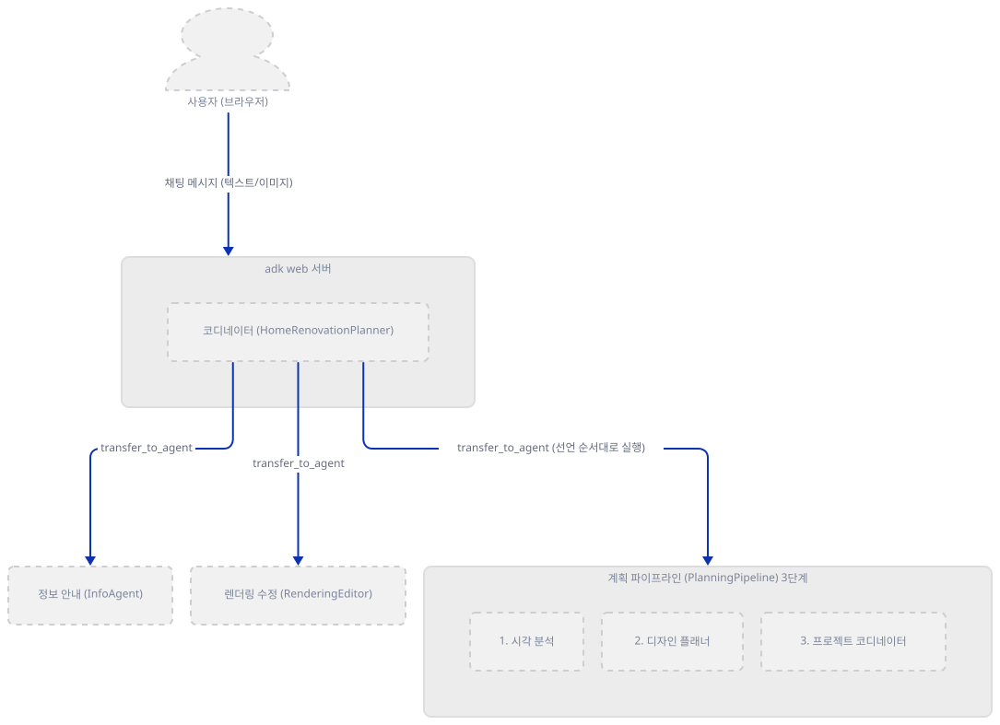

**확인.** 오늘(2026-09-29) 설치하면 다음이 직접 확인됩니다.

```
google-adk 2.10.0
google-genai 2.25.0
```

`google-generativeai`도 0.8.6으로 함께 설치되지만(요구사항이 `>=0.8.3`) 어느 파일에서도 임포트되지 않습니다.

```bash
uv run --no-project --python .venv python -m py_compile agent.py tools.py __init__.py
```

통과합니다(직접 확인).

### Step 2. 코디네이터/디스패처 — 세 방향 라우팅

**목적.** `root_agent`가 `transfer_to_agent`로 세 대상 중 하나에만 제어를 넘기는 구조를 확인합니다. `sub_agents=`가 이관(복귀 보장 없음)이라는 메커니즘 자체는 Day 021·077에서 이미 확인했으므로 여기서는 되풀이하지 않습니다.

**할 일.** `root_agent`는 `LlmAgent`이고 자신의 `sub_agents`에 `LlmAgent` 둘(`info_agent`, `rendering_editor`)과 워크플로 에이전트 하나(`planning_pipeline`)를 함께 넣습니다. `agent.py`는 상대 임포트(`from .tools import ...`)를 쓰므로 패키지 폴더의 **부모** 폴더(`multi_agent_apps`)에서 실행해야 임포트가 됩니다. 그런데 가상환경은 Step 1에서 만든 자식 폴더의 `ai_home_renovation_agent/.venv`에 있어서, 그냥 `cd .. && uv run --no-project`만 쓰면 `uv`가 시스템 대체 인터프리터를 집어 `ModuleNotFoundError: No module named 'google'`로 실패합니다(직접 확인) — Day 088의 `ai_consultant_agent`·Day 091의 `ai_sales_intelligence_agent_team`과 같은 이유이고, 처방도 같습니다: `--python`으로 그 가상환경을 직접 가리킵니다.

```python
root_agent = LlmAgent(
    name="HomeRenovationPlanner",
    model="gemini-3-flash-preview",
```

(`agent.py:472-474`.) 지시문(`agent.py:476-507`)은 "반드시 `transfer_to_agent`를 써라 — 직접 답하지 마라"고 못박고, 일반 질문은 `InfoAgent`, 기존 렌더링이 있고 수정 요청이면 `RenderingEditor`, 사진이 첨부됐거나 신규 계획이면 `PlanningPipeline`으로 보내라는 규칙을 둡니다.

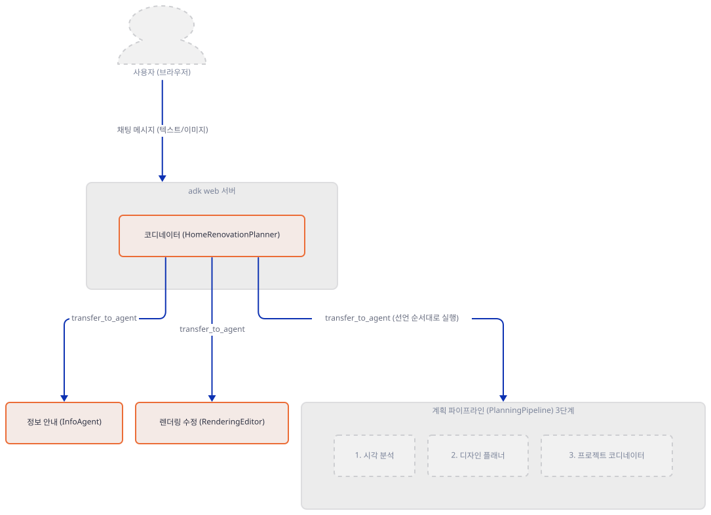

**확인.**

```bash
cd ..
uv run --no-project --python ai_home_renovation_agent/.venv python -c "
import ai_home_renovation_agent as m
print(m.root_agent.name, m.root_agent.model)
print([a.name for a in m.root_agent.sub_agents])
"
```

(저장소 루트에서 곧바로 시작한다면 `cd advanced_ai_agents/multi_agent_apps`를 씁니다. 이후 Step들의 명령은 모두 이 `multi_agent_apps` 폴더에서, 같은 `--python ai_home_renovation_agent/.venv`를 붙여 실행합니다.)

```
HomeRenovationPlanner gemini-3-flash-preview
['InfoAgent', 'RenderingEditor', 'PlanningPipeline']
```

### Step 3. 계획 파이프라인 — `SequentialAgent`를 `sub_agents`에 직접 넣기

**목적.** `PlanningPipeline`이 세 전문가를 선언 순서대로 강제 실행한다는 것(`SequentialAgent`의 `for`문 방식은 Day 022가 이미 확인)과, 이 조합이 시리즈에서 몇 번째인지, 그리고 단계 사이에 진짜로 오가는 것이 `state`가 아니라는 것을 확인합니다.

**할 일.** `planning_pipeline`은 `SequentialAgent`이고, `root_agent.sub_agents`는 이 객체 자체를 담습니다(다른 `LlmAgent`가 아니라).

```python
planning_pipeline = SequentialAgent(
    name="PlanningPipeline",
    description="Full renovation planning pipeline: Visual Assessment → Design Planning → Project Coordination",
    sub_agents=[
        visual_assessor,
        design_planner,
        project_coordinator,
    ],
)
```

(`agent.py:457-465`.) `design_planner`의 지시문(`agent.py:282`)은 "Read from state: room_analysis, style_preferences, ..."라고 적지만, `agent.py` 전체에 `output_key=`나 `tool_context.state`에 쓰는 코드는 한 줄도 없습니다(전체 검색으로 확인). 실제로 다음 단계가 이전 단계의 결과를 보는 통로는 `state` 키가 아니라 `SequentialAgent`가 같은 세션을 그대로 넘기며 공유하는 대화 기록(직전 에이전트의 텍스트 응답)뿐입니다.

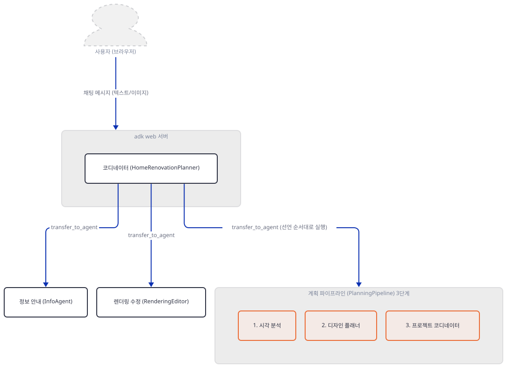

**확인.**

```bash
uv run --no-project --python ai_home_renovation_agent/.venv python -c "import ai_home_renovation_agent as m; print(type(m.root_agent.sub_agents[2]).__name__)"
```

→ `SequentialAgent`.

### Step 4. 시각 분석 에이전트 — `AgentTool`로 감싼 검색과 비용 도구

**목적.** `visual_assessor`가 사진 레이아웃을 문서화하는 지시문과, `google_search`를 직접 쓰지 않고 `AgentTool(search_agent)`로 감싸는 이유를 확인합니다. `AgentTool`(호출-복귀)이 `sub_agents=`(이관)와 다른 메커니즘이라는 것은 Day 021·077에서 이미 확인했으므로, 여기서는 이 앱이 `AgentTool`을 쓰는 이유만 봅니다.

**할 일.** `search_agent`(`agent.py:30-38`)는 `google_search`만 문 `LlmAgent`입니다 — 코드 주석이 "google_search can only be used by itself within an agent instance (single tool limitation)"라고 이유를 직접 적어 뒀습니다. 그래서 검색과 비용 추정을 같이 하고 싶은 `visual_assessor`는 `google_search`를 직접 들지 못하고, `search_agent`를 `AgentTool`로 감싸 다른 도구와 나란히 둡니다.

```python
    tools=[AgentTool(search_agent), estimate_renovation_cost],
```

(`agent.py:273`.) 지시문(`agent.py:190-271`)은 창·문·수납장·가전 위치까지 "정확한 레이아웃"으로 받아 적으라고 요구합니다 — 이 문서가 Step 6의 렌더링 프롬프트에 그대로 흘러 들어갑니다.


**확인.** 비용 도구는 순수 파이썬이라 키 없이 끝까지 됩니다. Windows Git Bash 콘솔은 `cp949`가 기본이라 이모지 출력에 `PYTHONIOENCODING=utf-8`이 필요합니다(직접 확인).

```bash
PYTHONIOENCODING=utf-8 uv run --no-project --python ai_home_renovation_agent/.venv python -c "
from ai_home_renovation_agent.agent import estimate_renovation_cost
print(estimate_renovation_cost('kitchen', 'moderate', 120))
"
```

(PowerShell은 같은 줄 앞에 환경변수를 따로 설정합니다: `$env:PYTHONIOENCODING="utf-8"; uv run --no-project --python ai_home_renovation_agent/.venv python -c "..."`.)

```
💰 Estimated Cost: $18,000 - $30,000 (moderate kitchen renovation, ~120 sq ft)
```

### Step 5. 디자인 플래너 — 표면 마감만, 레이아웃은 그대로

**목적.** `design_planner`의 지시문이 "레이아웃을 절대 바꾸지 말라"고 반복하는 이유와 `calculate_timeline`의 동작을 확인합니다.

**할 일.** 지시문(`agent.py:286-300`)은 가전·수납장 위치 이동, 창·문 추가·제거, 아일랜드 추가를 명시적으로 금지하고 페인트색·조리대 재질·바닥재·조명 등 "표면 마감"만 바꾸라고 못박습니다 — Step 4의 레이아웃 문서를 그대로 지키기 위해서입니다.

```python
design_planner = LlmAgent(
    name="DesignPlanner",
    model="gemini-3-flash-preview",
```

(`agent.py:277-279`.)


**확인.** `calculate_timeline`도 순수 파이썬입니다(같은 이유로 `PYTHONIOENCODING=utf-8` 필요).

```bash
PYTHONIOENCODING=utf-8 uv run --no-project --python ai_home_renovation_agent/.venv python -c "
from ai_home_renovation_agent.agent import calculate_timeline
print(calculate_timeline('moderate', 'kitchen'))
"
```

(PowerShell은 `$env:PYTHONIOENCODING="utf-8"; uv run --no-project --python ai_home_renovation_agent/.venv python -c "..."`처럼 환경변수를 세미콜론으로 이어 씁니다.)

```
⏱️ Estimated Timeline: 3-6 weeks (includes some structural work)
```

### Step 6. 렌더링 도구 — Pydantic 입력 모델과 이중 Gemini 호출, 서비스 종료된 모델

**목적.** `generate_renovation_rendering`이 ADK의 모델 관리를 거치지 않고 자기만의 `genai.Client()`로 Gemini를 두 번 부른다는 것, 도구 하나가 Pydantic 모델 하나를 받는 방식이 ADK 함수 선언과 어떤 관계인지, 그리고 두 모델 다 서비스 종료라는 것을 확인합니다.

**할 일.** 이 도구는 먼저 `client.models.generate_content(model="gemini-3-pro-preview", ...)`로 사용자 설명을 SLC(Subject·Lighting·Camera) 형식의 상세 프롬프트로 다시 쓰고, 그 결과를 `client.models.generate_content_stream(model="gemini-3-pro-image-preview", ...)`에 넘겨 실제 이미지를 받습니다(`tools.py:214-251`). 두 호출 다 ADK의 `LlmAgent`가 자동으로 만드는 모델 호출이 아니라 도구 함수 안에서 직접 만든 별도 `Client()`입니다. 또한 이 도구는 인자를 낱개로 받지 않고 Pydantic 모델 하나(`inputs: GenerateRenovationRenderingInput`)로 받습니다(`tools.py:123`).

```python
async def generate_renovation_rendering(tool_context: ToolContext, inputs: GenerateRenovationRenderingInput) -> str:
```

(`tools.py:123`.) ADK가 이를 함수 선언으로 바꿀 때 기본 켜진 실험적 기능 `JSON_SCHEMA_FOR_FUNC_DECL`(`google-adk`의 `FeatureConfig(FeatureStage.EXPERIMENTAL, default_on=True)`, `_feature_registry.py`에서 소스로 확인)이 관여하지만, **이 기능이 있어야만 중첩 구조가 만들어지는 것은 아닙니다** — 직접 꺼 보면(`override_feature_enabled(FeatureName.JSON_SCHEMA_FOR_FUNC_DECL, False)`) `parameters_json_schema`는 `None`이 되지만 `parameters`에 `inputs` 아래 같은 필드(prompt·aspect_ratio·asset_name·current_room_photo·inspiration_image)가 그대로 중첩됩니다(직접 확인). 이 기능은 표현 방식만 가릅니다 — JSON Schema로 실을지, Gemini `Schema` 형식으로 실을지의 차이입니다.


**확인.** 키 없이는 두 도구 다 네트워크에 닿기 전에 멈춥니다(`tools.py:131-132`, `tools.py:312-313`).

```bash
uv run --no-project --python ai_home_renovation_agent/.venv python -c "
import asyncio
from ai_home_renovation_agent.tools import generate_renovation_rendering, edit_renovation_rendering
for fn in (generate_renovation_rendering, edit_renovation_rendering):
    try:
        asyncio.run(fn(None, None))
    except ValueError as e:
        print(fn.__name__, 'ValueError:', e)
"
```

```
generate_renovation_rendering ValueError: GEMINI_API_KEY or GOOGLE_API_KEY environment variable not set.
edit_renovation_rendering ValueError: GEMINI_API_KEY or GOOGLE_API_KEY environment variable not set.
```

기능을 켠 기본 상태에서 실제 선언을 보면 `parameters_json_schema`에 `inputs` 아래 필드 5개(프롬프트 하나만 필수)가 중첩되어 나옵니다(직접 확인).

### Step 7. `adk web`으로 띄우기 — 폴더 하나만 가리켜 다른 앱을 안 건드린다

**목적.** 이 앱을 실제로 띄우고, 키 없이 세션을 만들면 정확히 어디서 멈추는지 Day 014·088과 같은 방식으로 확인합니다. 원본 앱 README는 `multi_agent_apps` 전체를 가리켜 `adk web`을 띄우라고 하지만(그 폴더엔 다른 앱이 여럿 있습니다), 여기서는 이 폴더 하나만 가리킵니다.

**할 일.** `ai_home_renovation_agent` 폴더 **안에서** 실행합니다.

```bash
cd ai_home_renovation_agent
uv run --no-project adk web --no_use_local_storage .
```

대화형 터미널에서 처음 실행하면 Day 091·092와 같은 텔레메트리 동의 프롬프트(`Enable telemetry? [Y/n]:`)가 먼저 뜹니다 — 비대화형으로 실행하면 프롬프트 텍스트만 찍히고 막히지 않습니다(직접 확인).

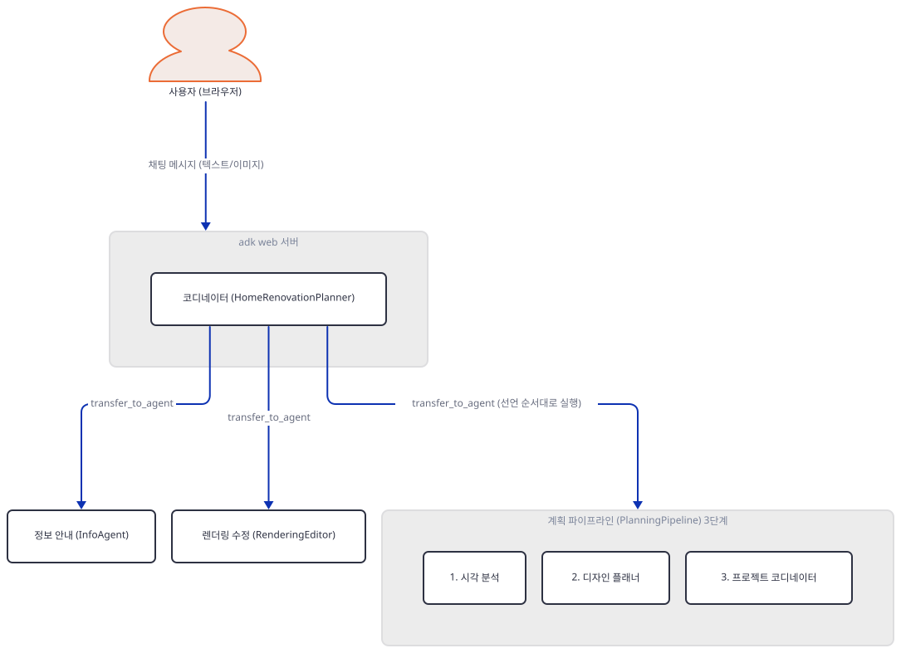

**확인.** 다른 터미널에서 목록과 세션을 봅니다. Windows PowerShell은 `curl`을 `Invoke-WebRequest`의 별칭으로 미리 정의해 두므로 `curl.exe`로 씁니다(macOS/Linux는 `curl.exe`가 없으므로 그냥 `curl`을 씁니다).

```bash
curl.exe http://127.0.0.1:8000/list-apps
curl.exe -X POST http://127.0.0.1:8000/apps/ai_home_renovation_agent/users/u1/sessions/s1 -H "Content-Type: application/json" -d '{}'
curl.exe -X POST http://127.0.0.1:8000/run -H "Content-Type: application/json" -d '{"appName":"ai_home_renovation_agent","userId":"u1","sessionId":"s1","newMessage":{"role":"user","parts":[{"text":"hi, what do you do?"}]}}'
```

Windows PowerShell 5.1은 네이티브 명령에 인자를 넘길 때 홑따옴표 문자열 안의 큰따옴표까지 명령줄 재구성 과정에서 벗겨내 위 JSON을 깨뜨립니다. PowerShell에서는 큰따옴표로 감싸고 안쪽 큰따옴표를 역슬래시로 이스케이프합니다(Day 088과 같은 처리).

```powershell
curl.exe -X POST http://127.0.0.1:8000/run -H "Content-Type: application/json" -d "{\"appName\":\"ai_home_renovation_agent\",\"userId\":\"u1\",\"sessionId\":\"s1\",\"newMessage\":{\"role\":\"user\",\"parts\":[{\"text\":\"hi, what do you do?\"}]}}"
```

목록은 `["ai_home_renovation_agent"]`, 세션 생성은 성공합니다(직접 확인, 격리 포트 사용). `/run`은 키가 없으면 `HomeRenovationPlanner`가 첫 모델 호출(`gemini-3-flash-preview`)을 만드는 순간 `ValueError: No API key was provided. Please pass a valid API key.`로 끊깁니다 — Day 014·088에서 이미 본 `google-genai`의 같은 오류입니다(직접 확인).

## 요청 한 건이 흐르는 과정

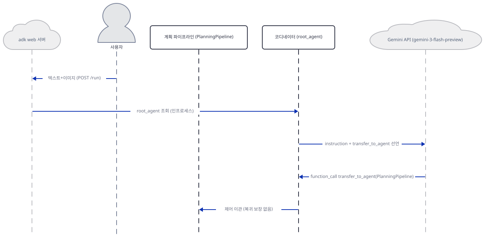

텍스트로만 "10x12 주방을 3만 달러로 모던 파머하우스 스타일로" 같은 신규 계획 요청을 보내면, `adk web`이 `root_agent`를 인프로세스로 조회하고 `HomeRenovationPlanner`가 Gemini에 지시문과 전환 선언을 실어 첫 호출을 합니다. Gemini가 `transfer_to_agent(PlanningPipeline)`을 돌려주면 제어가 파이프라인으로 넘어갑니다(복귀 보장 없음, 위 그림). 이 뒤로는 실제 시간 순서를 지키면서 아래 순서대로 그림을 나눴습니다 — 한 그림에 다 넣으면(예: `VisualAssessor`가 Gemini·`SearchAgent`와 동시에 말을 섞는 삼각 구조) 화살표가 다른 배우의 자리를 지나가 검사를 통과하지 못하기 때문입니다(전수 탐색으로 확인, 위반 0인 순서가 없었습니다).

1. **`PlanningPipeline`이 1단계를 부르고, `VisualAssessor`가 Gemini에 사진·도구 선언을 보내 두 도구(`SearchAgent`, `estimate_renovation_cost`)를 부르라는 응답을 받습니다.**
   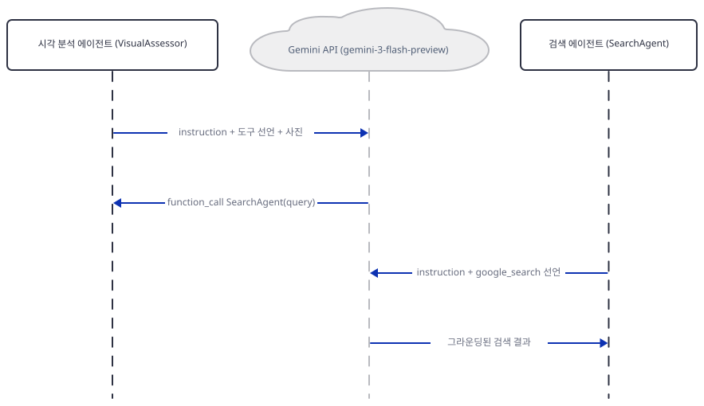
2. **`VisualAssessor`가 `AgentTool`로 `SearchAgent`를 직접 부르고, `SearchAgent`는 이와 별개로 자기 자신의 Gemini 호출을 만들어 `google_search`로 그라운딩된 결과를 받습니다.**
   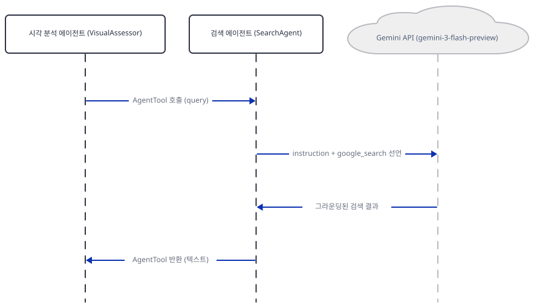
3. **`VisualAssessor`가 `estimate_renovation_cost`를 실행하고, 그 결과를 Gemini에 돌려준 뒤 "ASSESSMENT COMPLETE" 최종 텍스트를 받습니다.**
   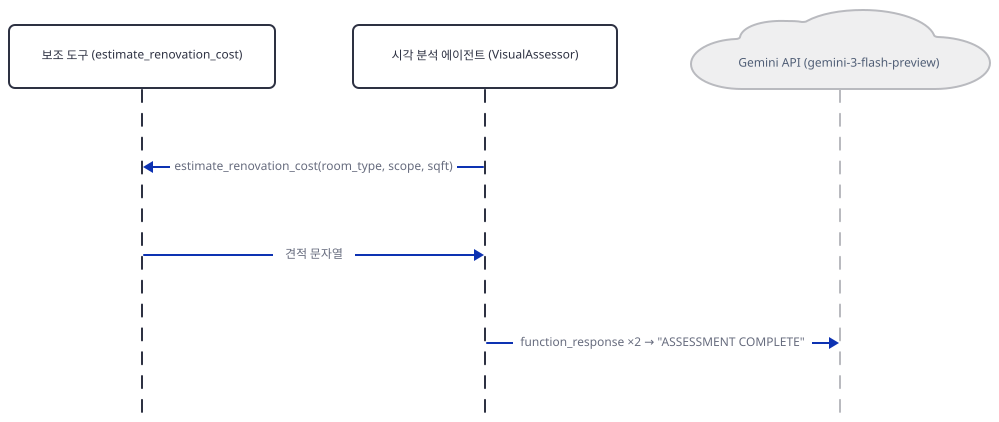
4. **`PlanningPipeline`이 2단계를 부르고, `DesignPlanner`가 Gemini에 `calculate_timeline` 선언을 실어 호출 요청을 받습니다.** `output_key`가 없으므로 1단계의 결과는 `state` 키가 아니라 같은 세션의 대화 기록으로 전달됩니다.
   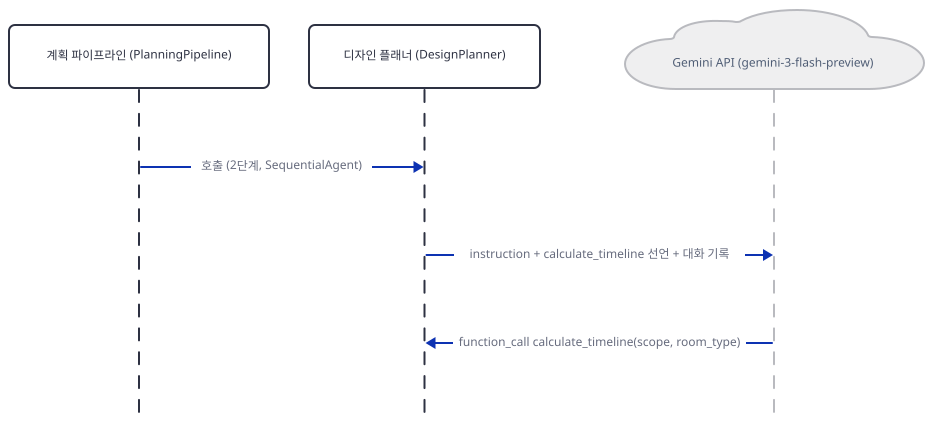
5. **`DesignPlanner`가 `calculate_timeline`을 실행하고, Gemini에 돌려준 뒤 "DESIGN COMPLETE" 최종 텍스트를 받습니다.**
   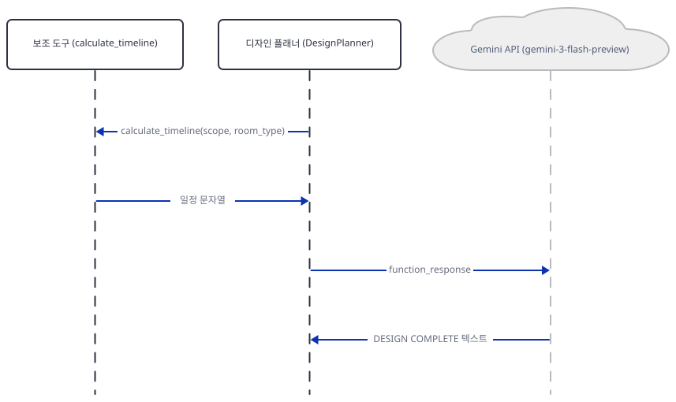
6. **`PlanningPipeline`이 3단계를 부르고, `ProjectCoordinator`가 Gemini에 렌더링 도구 선언을 실어 `generate_renovation_rendering` 호출 요청을 받습니다.**
   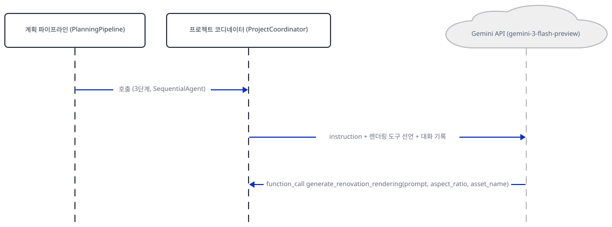
7. **`ProjectCoordinator`가 ADK 밖에서 도구 함수를 직접 실행하고, 그 함수 안에서 별도 `Client()`로 `gemini-3-pro-preview`에 프롬프트 재작성을 요청해 SLC 형식 텍스트를 받습니다.**
   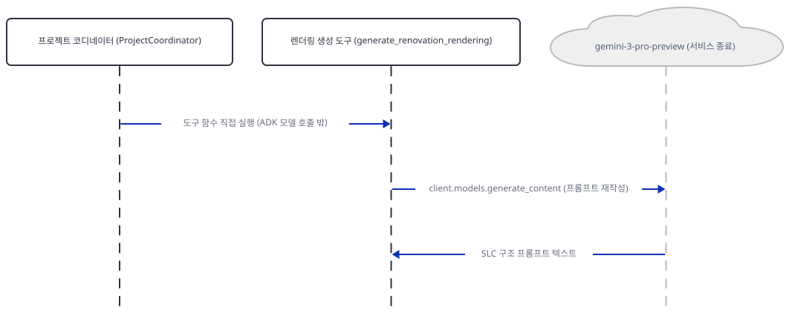
8. **같은 도구 함수가 그 프롬프트를 `gemini-3-pro-image-preview`에 스트리밍으로 넘겨 이미지 청크를 받고, 완성된 이미지를 세션 상태·아티팩트 저장소에 버전으로 기록합니다.**
   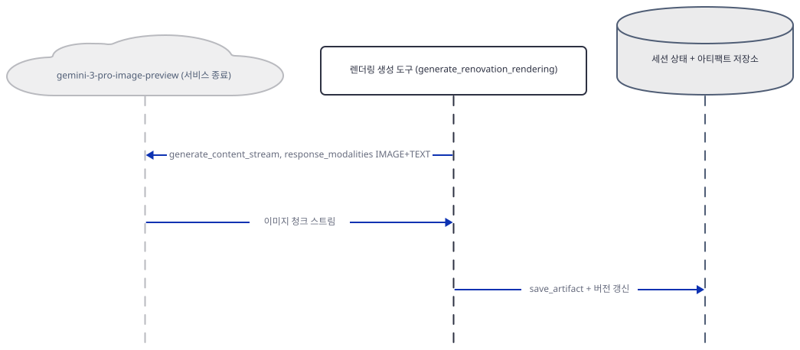
9. **도구 함수가 성공 메시지를 `ProjectCoordinator`에 돌려주고, `ProjectCoordinator`가 Gemini에 `function_response`를 보내 최종 계획 텍스트를 받습니다.**
   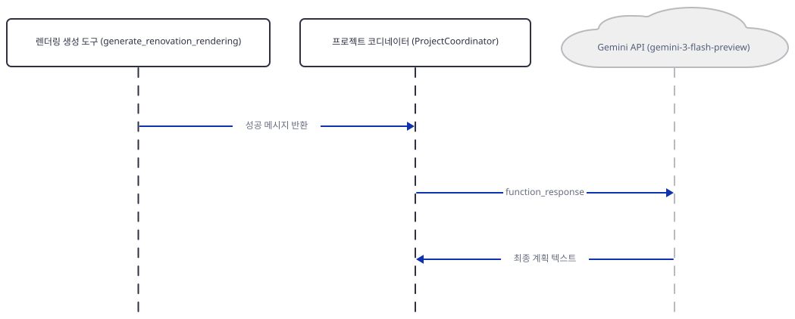
10. **`ProjectCoordinator`가 `adk web`에 최종 응답 이벤트를 보내고, `adk web`이 계획 텍스트와 아티팩트 패널을 사용자에게 표시합니다.**
    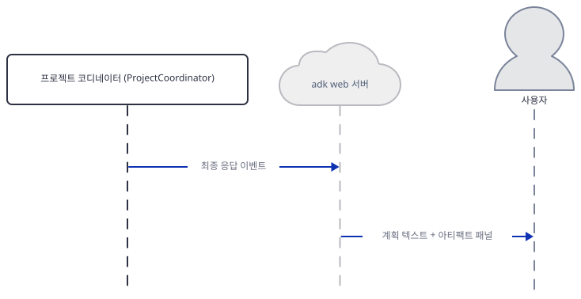

키가 없어 이 문서는 Step 7에서 확인한 첫 Gemini 호출 지점 이후는 실제로 관찰하지 못했습니다 — 위 10단계는 소스(`agent.py`·`tools.py`)와 ADK의 알려진 흐름(Day 014·021·022·077)으로 구성한 것입니다.

## 실행 체크리스트

- [ ] `requirements.txt`가 적지 않은 `google-genai`가 `google-adk`의 의존성으로 실제 설치되고, 반대로 적어 둔 `google-generativeai`는 어디서도 임포트되지 않는다는 것을 확인했다
- [ ] `root_agent.sub_agents`에 `LlmAgent` 둘과 `SequentialAgent`(`planning_pipeline`) 하나가 섞여 있다는 것을 직접 확인했다
- [ ] `LlmAgent.sub_agents`에 워크플로 에이전트를 직접 넣는 조합이 Day 091·092에 이어 이 앱이 세 번째라는 것을(094는 해당 없음) 그렙으로 확인했다
- [ ] `design_planner`의 지시문이 말하는 "state"가 실제로는 `output_key` 없는 대화 기록 공유라는 것을 확인했다
- [ ] `google_search`가 `visual_assessor`에 직접 달리지 못하고 `AgentTool(search_agent)`로 감싸지는 이유(단일 도구 제약)를 코드 주석으로 확인했다
- [ ] `estimate_renovation_cost`·`calculate_timeline`을 키 없이 직접 호출해 반환값을 봤다
- [ ] `generate_renovation_rendering`이 `gemini-3-pro-preview`(프롬프트 재작성)와 `gemini-3-pro-image-preview`(이미지 생성) 두 모델을 순서대로 부른다는 것을 소스로 확인했다
- [ ] 두 모델 다 Google 공식 문서에서 서비스 종료로 확인했다(2026-03-09, 2026-06-25) — `edit_renovation_rendering`도 같은 이미지 모델(`tools.py:396`)을 쓴다
- [ ] `JSON_SCHEMA_FOR_FUNC_DECL`을 꺼도 `parameters`에 같은 중첩 구조가 만들어진다는 것을 직접 실행해 확인했다(이 기능은 필수가 아니라 표현 방식만 가른다)
- [ ] `adk web`을 이 폴더 하나만 가리켜 띄우고, 키 없이 `/run`이 어디서 멈추는지 확인했다

## 문제 해결

| 증상 | 원인 | 해결 |
|---|---|---|
| 부모 폴더(`multi_agent_apps`)에서 `uv run --no-project python -c "import ai_home_renovation_agent"`를 그냥 실행하면 `ModuleNotFoundError: No module named 'google'` | `--python`을 안 주면 `uv`가 그 폴더의 가상환경을 못 찾아 시스템 인터프리터를 쓴다(직접 확인) — Day 088·091과 같은 결함 | `--python ai_home_renovation_agent/.venv`를 붙인다 |
| 실제 키를 넣고 `adk web`으로 렌더링까지 진행해도 이미지가 만들어지지 않고 에이전트가 오류 문장을 돌려줌(파이프라인이 멈추지는 않음) | `tools.py:215`의 `gemini-3-pro-preview`(2026-03-09 종료), `tools.py:221`과 `tools.py:396`의 `gemini-3-pro-image-preview`(2026-06-25 종료)가 이미 서비스 종료(Google 공식 문서 확인) — 두 도구 다 예외를 잡아 "An error occurred while generating/editing the rendering: …" 문자열로 돌려준다(`tools.py:296-298`, `tools.py:483-485`) | `tools.py:215`의 `gemini-3-pro-preview`를 `gemini-3.1-pro-preview`로, `tools.py:221`과 `tools.py:396`의 `gemini-3-pro-image-preview`를 `gemini-3-pro-image`로 **세 줄 다** 바꿔야 생성·편집 둘 다 끝까지 간다(오늘 설치한 google-genai 2.25.0의 모델 목록에서 새 이름을 직접 확인) |
| `design_planner`의 "Read from state" 지시문을 보고 `output_key`를 찾아도 안 보임 | 애초에 코드에 없다(전체 검색으로 확인) — 실제 정보 전달은 `SequentialAgent`가 공유하는 대화 기록 | 코드를 고치지 않고 읽는다면 지시문의 "state"를 "직전 에이전트의 텍스트 응답"으로 이해하면 된다 |
| 참조 이미지를 저장·조회하는 도구가 소스에 있는데 실제로는 어디서도 안 불림 | `list_reference_images`가 `agent.py:19`에 임포트만 되고 어떤 `tools=[...]`에도 안 들어간 죽은 줄이다(전체 검색으로 확인) — Day 088의 `google_search` 죽은 임포트와 같은 패턴 | 실제로 쓰는 조회 도구는 `list_renovation_renderings`뿐이다 |
| Windows PowerShell에서 `curl` 명령이 매개변수 오류를 냄 | PowerShell이 `curl`을 `Invoke-WebRequest`의 별칭으로 미리 정의해 둔다(Day 014에서 이미 확인) | `curl.exe`처럼 확장자를 붙여 호출 |

## 더 해보기

- `tools.py:215`·`tools.py:221`·`tools.py:396`의 모델 이름을 각각 `gemini-3.1-pro-preview`·`gemini-3-pro-image`(두 곳)로 바꾼 사본에서 실제 `GOOGLE_API_KEY`로 렌더링을 끝까지 생성해 보고, `edit_renovation_rendering`으로 "캐비닛을 크림색으로" 같은 피드백을 줘 버전이 `_v2`로 올라가는지 확인해보기
- `design_planner`의 `agent.py:277`에 `output_key="design_summary"`를 추가해 보고, `project_coordinator`가 실제로 `session.state["design_summary"]`를 읽게 만들 수 있는지, 그리고 지시문이 원래 말하던 "state"에 가까워지는지 실험해보기
- `visual_assessor`의 `tools=[AgentTool(search_agent), estimate_renovation_cost]`(`agent.py:273`)에서 `AgentTool(search_agent)`를 빼고 `google_search`를 직접 넣어 봐, 코드 주석이 말하는 "단일 도구 제약"이 실제로 어떤 오류로 나타나는지 확인해보기

## 다음 날 예고

[Day 096 · 🧠 DevPulse AI - Multi-Agent Signal Intelligence](../day096-devpulse-ai/README.md) — 여러 신호원을 모아 분석하는 멀티 에이전트 앱입니다.
