# Day 096 · 🧠 DevPulse AI - Multi-Agent Signal Intelligence

> 볼륨 7 🚀 Advanced AI Agents · 난이도 ★★☆ · 예상 소요 60분 · API 비용 대략 (키 없으면 무료 — 휴리스틱 폴백만 사용. 키가 있으면 신호 하나당 gpt-4.1-mini를 2회(Relevance·Risk) 호출하므로 기본값 기준 신호 20여 개 × 2회로 $0.01 미만으로 추정 — 대략치, 키가 없어 실제 과금은 확인하지 못함) · 원본 앱: `advanced_ai_agents/multi_agent_apps/devpulse_ai`

## 오늘 만들 것

DevPulseAI는 GitHub·ArXiv·HackerNews·Medium·HuggingFace 다섯 개 공개 소스에서 개발자용 기술 신호를 모아 관련성과 위험도를 채점하고, 우선순위가 매겨진 인텔리전스 다이제스트로 종합하는 4단계 파이프라인입니다. 이 앱을 관통하는 설계 원칙은 "추론이 필요한 곳에만 에이전트를 쓴다"는 것입니다(소스로 확인, `agents/__init__.py`의 설계 문서). 신호 수집(5개 어댑터)과 정규화(`SignalCollector`)는 판단이 필요 없는 순수 함수라 agno `Agent`를 쓰지 않고, 관련성 채점(`RelevanceAgent`, gpt-4.1-mini)·위험 평가(`RiskAgent`, gpt-4.1-mini)·종합(`SynthesisAgent`, gpt-4.1)만 LLM 에이전트로 구현됩니다. 그런데 소스를 끝까지 따라가 보면 `SynthesisAgent`는 자신의 `agno.Agent`(gpt-4.1)를 만들어 두고도 `synthesize()` 메서드 어디에서도 `self.agent.run()`을 호출하지 않습니다 — 우선순위 정렬·요약·추천이 전부 결정적 파이썬 로직이라, "가장 강력한 모델로 교차 참조한다"는 클래스 자신의 독스트링과 달리 실제로는 LLM이 한 번도 개입하지 않습니다(직접 확인, Step 6). `RelevanceAgent`·`RiskAgent`는 키가 없을 때 코드가 기대한 `except Exception` 경로 대신, agno 3.0.11이 인증 오류를 내부에서 삼켜 `RunOutput(status=error)`를 정상 반환하고 그 오류 문자열이 JSON 파싱에 실패해 휴리스틱 폴백으로 이어진다는 것도 직접 실행해 확인했습니다(Step 4). 이 앱은 `agno.os`(AgentOS 웹 서버)를 쓰지 않아 Day 047·078이 다룬 `os.agno.com` 컨트롤 플레인은 등장하지 않습니다 — agno의 익명 사용 통계(Day 047 Step 5가 이미 다룬 `POST /telemetry/runs`)는 `agent.run()`이 실제로 성공할 때만 전송되는데, 키가 없는 이 데모는 그 성공 경로를 타지 않으므로 오늘은 실제로 전송되지 않습니다(소스 확인, `agno/agent/_run.py`). 완성하면 터미널(`main.py`)과 Streamlit 대시보드(`streamlit_app.py`) 두 가지 방법으로 같은 파이프라인을 실행할 수 있습니다. 아래는 완성된 아키텍처입니다.

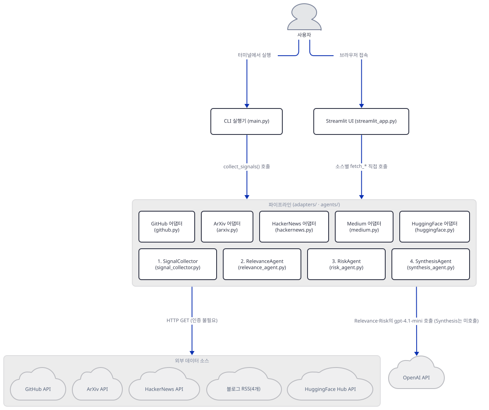

## 사전 준비

| 서비스/도구 | 용도 | 발급·설치 |
|---|---|---|
| OpenAI API 키 (선택) | `RelevanceAgent`·`RiskAgent`·`SynthesisAgent`가 만드는 `OpenAIChat` 인증. 없어도 파이프라인은 휴리스틱 폴백으로 끝까지 동작 | https://platform.openai.com/ 가입 후 발급 |
| uv | 가상환경 생성과 패키지 설치 | [공통 사전 준비](../README.md#공통-사전-준비-한-번만) 절 참고 |
| 인터넷 연결 | PyPI 설치, (실제로 실행하면) GitHub·ArXiv·HackerNews·Medium RSS·HuggingFace 공개 API 호출(인증 불필요), 키가 있으면 OpenAI API 호출 | 별도 설치 없음 |

## 아키텍처 한눈에 보기

| 컴포넌트 | 역할 | 코드 위치 |
|---|---|---|
| CLI 실행기 (main.py) | `collect_signals()`로 5개 어댑터를 순서대로 호출한 뒤 4단계 파이프라인을 실행하고 콘솔에 다이제스트를 출력 | `advanced_ai_agents/multi_agent_apps/devpulse_ai/main.py:47-74`, `advanced_ai_agents/multi_agent_apps/devpulse_ai/main.py:98-129` |
| Streamlit 대시보드 (streamlit_app.py) | 소스·신호 수 사이드바, 어댑터를 직접(인라인으로) 호출해 파이프라인을 실행하고 결과를 카드로 렌더링 | `advanced_ai_agents/multi_agent_apps/devpulse_ai/streamlit_app.py:83-98`, `advanced_ai_agents/multi_agent_apps/devpulse_ai/streamlit_app.py:117-138` |
| 신호 수집 어댑터 5종 (adapters/) | GitHub·ArXiv·HackerNews·Medium·HuggingFace 각각의 공개 API를 호출해 표준 스키마 dict로 변환하는 유틸리티(LLM 없음) | `advanced_ai_agents/multi_agent_apps/devpulse_ai/adapters/github.py:13-51` (다른 4개 파일도 같은 패턴) |
| SignalCollector (유틸리티) | `source:id` 복합 키로 중복을 제거하고 통일된 스키마로 정규화 — agno `Agent`를 쓰지 않는 것이 의도된 설계 | `advanced_ai_agents/multi_agent_apps/devpulse_ai/agents/signal_collector.py:34-65` |
| RelevanceAgent | gpt-4.1-mini로 신호를 0~100점 채점, 실패 시 stars/points 기반 휴리스틱 | `advanced_ai_agents/multi_agent_apps/devpulse_ai/agents/relevance_agent.py:40-86` |
| RiskAgent | gpt-4.1-mini로 보안 위험·breaking change를 평가, 실패 시 키워드 매칭 휴리스틱 | `advanced_ai_agents/multi_agent_apps/devpulse_ai/agents/risk_agent.py:44-90` |
| SynthesisAgent | 우선순위 정렬·소스별 그룹핑·요약·추천을 생성 — `agno.Agent`를 만들지만 실제로는 호출하지 않는 결정적 로직 | `advanced_ai_agents/multi_agent_apps/devpulse_ai/agents/synthesis_agent.py:45-84` |
| OpenAI API | RelevanceAgent·RiskAgent가 호출하는 외부 LLM(SynthesisAgent는 미호출) | 코드 없음 (외부 서비스) |

## 단계별 진행

### Step 1. 환경 만들기 — 버전 하한이 없는 agno

**목적.** 격리된 가상환경에 8줄짜리 `requirements.txt`를 설치하고, 오늘 실제로 풀리는 버전에서 파일들이 그대로 컴파일되는지 확인합니다.

**할 일.**

```bash
cd advanced_ai_agents/multi_agent_apps/devpulse_ai
uv venv
uv pip install -r requirements.txt
```

(pip 대안: `python -m venv .venv && source .venv/bin/activate && pip install -r requirements.txt`. Windows PowerShell은 활성화만 `.venv\Scripts\Activate.ps1`로 바꿉니다.)

`requirements.txt`(전체 8줄, 그대로 인용):

```text
# DevPulseAI Dependencies
# Single provider (OpenAI) by default — no multi-provider setup required.

agno
openai
httpx
feedparser
streamlit>=1.30
```

다른 여러 날의 `agno>=2.2.10`와 달리 이 앱은 `agno`에 **버전 하한이 전혀 없습니다** — 어떤 버전이 나와도 그대로 설치됩니다. 이 문서를 쓰며 설치했을 때는 **agno 3.0.11**, **openai 3.20.0**, **httpx 0.28.1**, **feedparser 6.0.14**, **streamlit 1.64.0**이 받아졌습니다(직접 확인). 이 저장소는 루트에 `pyproject.toml`이 있어 `uv run`이 방금 만든 환경 대신 루트의 `.venv`를 쓰므로, 이후 `uv run` 명령에는 모두 `--no-project`를 붙입니다.

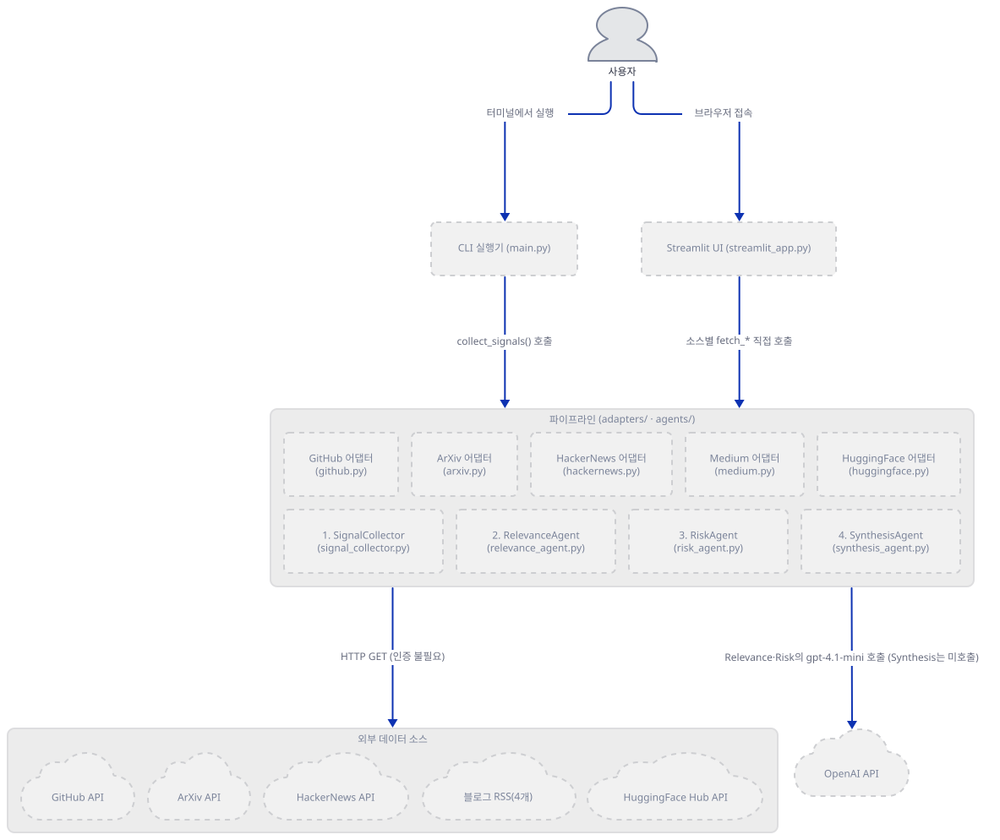

**확인.**

```bash
uv run --no-project python -c "import agno; print(agno.__version__)"
uv run --no-project python -m py_compile main.py streamlit_app.py verify.py agents/*.py adapters/*.py
```

`3.0.11`이 출력되고(설치 시점에 따라 다를 수 있습니다) `py_compile`은 아무 출력 없이 끝납니다(직접 확인).

### Step 2. 신호 수집 어댑터 5종 — 인증 없는 유틸리티 함수

**목적.** `adapters/`의 다섯 함수가 서로 다른 공개 API 응답을 어떻게 같은 스키마(`id`·`source`·`title`·`description`·`url`·`metadata`)로 맞추는지, 그리고 왜 이것이 에이전트가 아니라 함수인지 확인합니다.

**할 일.** `advanced_ai_agents/multi_agent_apps/devpulse_ai/adapters/github.py:13-51`

```python
def fetch_github_trending(limit: int = 5) -> List[Dict[str, Any]]:
    """
    Fetch trending GitHub repositories created in the last 24 hours.
    
    Args:
        limit: Maximum number of repositories to return.
        
    Returns:
        List of signal dictionaries with standardized schema.
    """
    base_url = "https://api.github.com/search/repositories"
    date_query = (datetime.utcnow() - timedelta(days=1)).strftime("%Y-%m-%d")
    
    params = {
        "q": f"created:>{date_query} sort:stars",
        "per_page": limit
    }
    
    signals = []
    
    try:
        response = httpx.get(base_url, params=params, timeout=10.0)
        response.raise_for_status()
        data = response.json()
        
        for item in data.get("items", []):
            signal = {
                "id": str(item["id"]),
                "source": "github",
                "title": item["full_name"],
                "description": item.get("description") or "No description",
                "url": item["html_url"],
                "metadata": {
                    "stars": item["stargazers_count"],
                    "language": item.get("language"),
                    "topics": item.get("topics", [])
                }
            }
            signals.append(signal)
```

`arxiv.py`·`hackernews.py`·`medium.py`·`huggingface.py`도 같은 모양입니다 — `httpx.get`(Medium만 `feedparser.parse`) 한 번으로 공개 API·RSS를 읽고, 응답을 표준 스키마 dict로 옮겨 담을 뿐 판단이나 언어 이해가 없습니다. 다섯 API 모두 인증이 필요 없습니다(소스로 확인 — 헤더에 토큰을 넣는 코드가 없습니다). 이 문서는 규칙상 이 함수들을 실제로 호출해 네트워크 요청을 내보내지 않습니다.

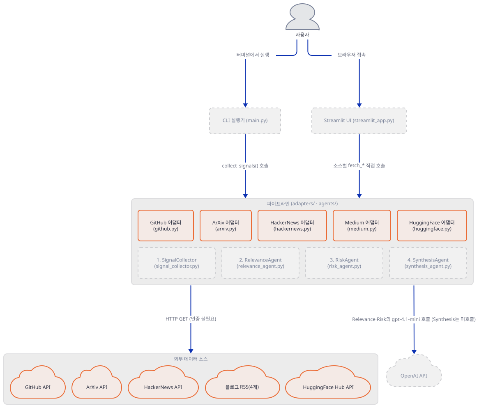

**확인.**

```bash
uv run --no-project python -c "from adapters.github import fetch_github_trending; from adapters.arxiv import fetch_arxiv_papers; from adapters.hackernews import fetch_hackernews_stories; from adapters.medium import fetch_medium_blogs; from adapters.huggingface import fetch_huggingface_models; print('adapters import ok')"
```

`adapters import ok`가 출력됩니다(직접 확인) — import만으로는 네트워크 요청이 나가지 않습니다(각 함수 본문 안에서만 `httpx.get`/`feedparser.parse`를 호출하므로).

### Step 3. SignalCollector — 왜 이것은 에이전트가 아닌가

**목적.** `SignalCollector`가 LLM 없이 정규화·중복 제거만 하는 순수 유틸리티임을 코드와 실행으로 확인합니다.

**할 일.** `advanced_ai_agents/multi_agent_apps/devpulse_ai/agents/signal_collector.py:34-65`

```python
    def collect(self, signals: List[Dict[str, Any]]) -> List[Dict[str, Any]]:
        """
        Normalize and deduplicate raw signals from adapters.

        Args:
            signals: Raw signals from adapters (heterogeneous schemas).

        Returns:
            List of normalized, deduplicated signal dictionaries.
        """
        normalized = []
        seen_ids = set()

        for signal in signals:
            # Deterministic dedup key: source + external id
            signal_id = f"{signal.get('source', 'unknown')}:{signal.get('id', '')}"
            if signal_id in seen_ids:
                continue
            seen_ids.add(signal_id)

            # Normalize to unified schema
            normalized.append({
                "id": signal.get("id", ""),
                "source": signal.get("source", "unknown"),
                "title": signal.get("title", "Untitled"),
                "description": signal.get("description", ""),
                "url": signal.get("url", ""),
                "metadata": signal.get("metadata", {}),
                "collected_at": datetime.now(timezone.utc).isoformat(),
            })

        return normalized
```

`verify.py`(원본 앱이 제공하는 모의 데이터 검증 스크립트)는 이 클래스에 `.agent` 속성이 없다는 것까지 단언문으로 확인합니다(`verify.py:84-87`) — "유틸리티이지 에이전트가 아니다"라는 설계를 코드 수준에서 강제하는 것입니다.

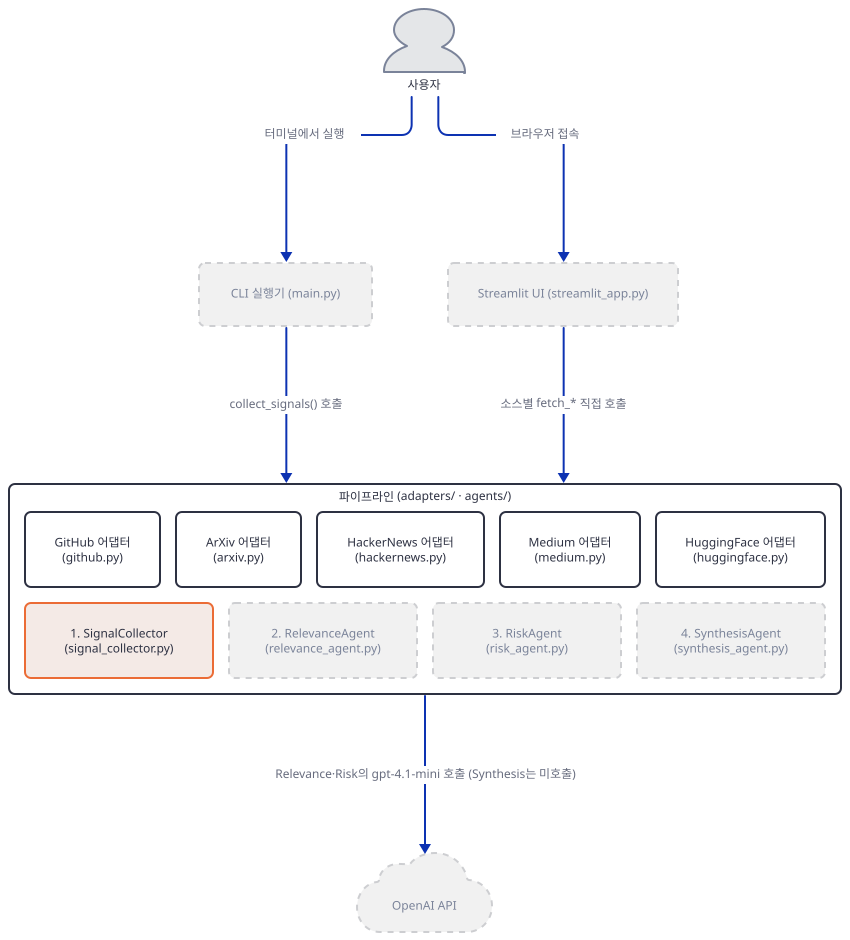

**확인.**

```bash
uv run --no-project python -c "
from agents import SignalCollector
c = SignalCollector()
dup = [{'id': '1', 'source': 'github', 'title': 'a'}, {'id': '1', 'source': 'github', 'title': 'a'}]
print(len(c.collect(dup)), hasattr(c, 'agent'))
"
```

`1 False`가 출력됩니다 — 중복 신호 2개가 1개로 줄고, `SignalCollector`에 `.agent` 속성이 없음을 보여줍니다(직접 확인).

### Step 4. RelevanceAgent — 관련성 채점과 실제 폴백 경로

**목적.** 첫 번째 실제 agno 에이전트가 어떻게 구성되는지, 그리고 키가 없을 때 코드가 **의도한** 폴백 경로(예외 처리)와 **실제로 타는** 폴백 경로(JSON 파싱 실패)가 다르다는 것을 직접 실행으로 확인합니다.

**할 일.** `advanced_ai_agents/multi_agent_apps/devpulse_ai/agents/relevance_agent.py:40-59`

```python
    def __init__(self, model_id: str = None):
        """
        Initialize the Relevance Agent.

        Args:
            model_id: OpenAI model to use. Defaults to gpt-4.1-mini (fast, cheap).
        """
        self.model_id = model_id or DEFAULT_MODEL
        self.agent = Agent(
            name="Relevance Scorer",
            model=OpenAIChat(id=self.model_id),
            role="Scores technical signals based on developer relevance",
            instructions=[
                "Score each signal from 0-100 based on relevance.",
                "Consider: novelty, impact, actionability, and timeliness.",
                "Prioritize signals relevant to AI/ML engineers.",
                "Provide brief reasoning for each score.",
            ],
            markdown=True,
        )
```

`DEFAULT_MODEL`은 `MODEL_RELEVANCE` 환경변수가 없으면 `"gpt-4.1-mini"`입니다(`relevance_agent.py:22`). `score()`는 다음과 같이 감싸져 있습니다(`relevance_agent.py:82-86`):

```python
        try:
            response = self.agent.run(prompt, stream=False)
            return self._parse_response(response.content, signal)
        except Exception as e:
            return self._fallback_score(signal, str(e))
```

이 코드의 의도는 "`run()`이 예외를 던지면 폴백"입니다. 그런데 agno 3.0.11에서 `OPENAI_API_KEY`가 없을 때 `self.agent.run(...)`은 예외를 던지지 않고 `RunOutput(status=RunStatus.error, content="OPENAI_API_KEY not set. ...")`를 **정상 반환**합니다(직접 확인, 아래) — 그래서 82~84행의 `try` 블록은 성공하고, `_parse_response`가 이 오류 문자열을 JSON으로 파싱하려다 실패해서야 `_fallback_score`로 떨어집니다(`relevance_agent.py:96-104`). 결과(휴리스틱 점수)는 같지만 **거치는 경로가 코드 주석과 다릅니다**.

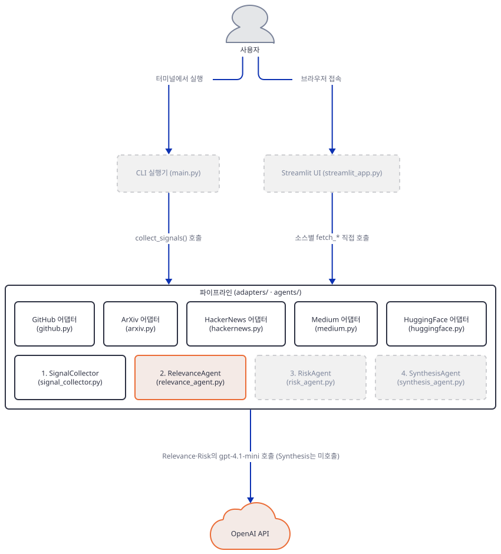

**확인.**

```bash
uv run --no-project python -c "
import os
os.environ.pop('OPENAI_API_KEY', None)
from agents.relevance_agent import RelevanceAgent
a = RelevanceAgent()
r = a.agent.run('test', stream=False)
print(type(r).__name__, r.status, repr(r.content))
print(a.score({'source': 'github', 'title': 'example/repo', 'description': 'test', 'metadata': {'stars': 10}}))
"
```

직접 확인한 출력(키를 설정하지 않은 상태, 네트워크 요청 0건 — agno가 클라이언트를 만들기 전에 로컬에서 인증을 먼저 확인합니다):

```text
ERROR   Model authentication error from OpenAI API: OPENAI_API_KEY not set. Please set the OPENAI_API_KEY environment variable.
ERROR   Error in Agent run: OPENAI_API_KEY not set. Please set the OPENAI_API_KEY environment variable.
RunOutput RunStatus.error 'OPENAI_API_KEY not set. Please set the OPENAI_API_KEY environment variable.'
{'score': 50, 'reasoning': 'Heuristic score (LLM unavailable: Parse error)'}
```

### Step 5. RiskAgent — 위험 평가와 키워드 폴백

**목적.** 두 번째 에이전트가 같은 구조(gpt-4.1-mini, try/except)를 반복하면서 폴백 로직만 키워드 매칭으로 바뀐다는 것을 확인합니다.

**할 일.** `advanced_ai_agents/multi_agent_apps/devpulse_ai/agents/risk_agent.py:44-63`

```python
    def __init__(self, model_id: str = None):
        """
        Initialize the Risk Agent.

        Args:
            model_id: OpenAI model to use. Defaults to gpt-4.1-mini.
        """
        self.model_id = model_id or DEFAULT_MODEL
        self.agent = Agent(
            name="Risk Assessor",
            model=OpenAIChat(id=self.model_id),
            role="Assesses security and breaking change risks in technical signals",
            instructions=[
                "Analyze signals for security vulnerabilities.",
                "Identify breaking changes that may affect developers.",
                "Flag deprecation notices and migration requirements.",
                "Rate risk level: LOW, MEDIUM, HIGH, or CRITICAL.",
            ],
            markdown=True,
        )
```

`_fallback_assessment`(`risk_agent.py:110-137`)는 제목에서 `vulnerability`·`exploit`·`cve`·`critical`·`breach`(HIGH)나 `breaking`·`deprecated`·`removed`·`migration`(MEDIUM) 키워드를 찾는 단순 규칙입니다. Step 4와 같은 이유로, 키가 없으면 이 폴백도 예외 처리가 아니라 `_parse_response`의 JSON 파싱 실패를 거쳐 도달합니다.

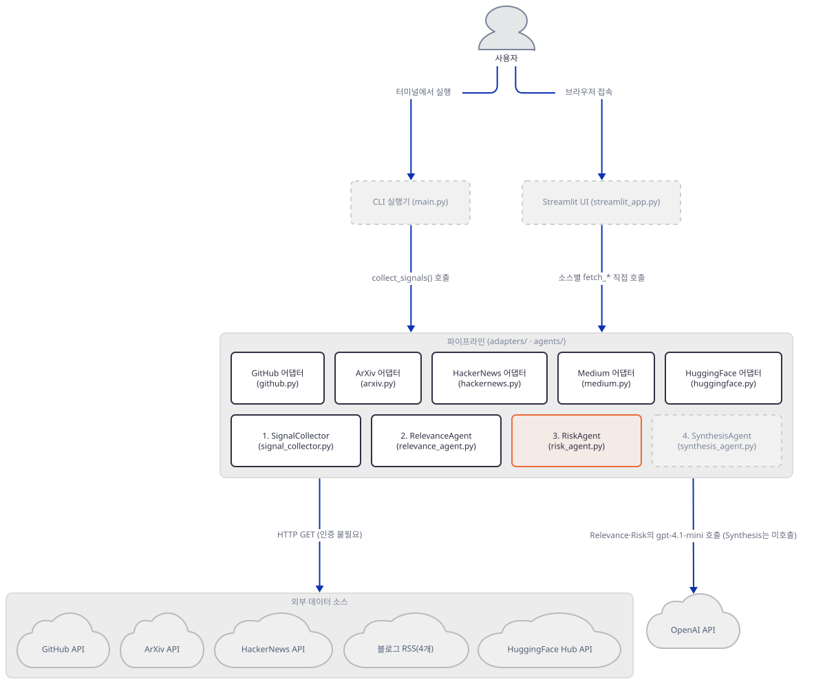

**확인.**

```bash
uv run --no-project python -c "
from agents.risk_agent import RiskAgent
a = RiskAgent()
print(a._fallback_assessment({'title': 'GPT-5 Breaking Changes in API'}, 'no key'))
"
```

`{'risk_level': 'MEDIUM', 'concerns': ['Keyword match: MEDIUM'], 'breaking_changes': True}`가 출력됩니다(직접 확인) — 제목의 "Breaking"이 `breaking` 키워드와 매치되고, `"breaking" in title.lower()`가 참이라 `breaking_changes`도 `True`입니다.

### Step 6. SynthesisAgent — 만들지만 부르지 않는 모델

**목적.** 이 앱에서 가장 중요한 발견을 직접 확인합니다: `SynthesisAgent`는 gpt-4.1로 `agno.Agent`를 만들지만, `synthesize()`는 그 에이전트를 한 번도 실행하지 않습니다.

**할 일.** `advanced_ai_agents/multi_agent_apps/devpulse_ai/agents/synthesis_agent.py:66-84`

```python
    def synthesize(self, signals: List[Dict[str, Any]]) -> Dict[str, Any]:
        """
        Synthesize signals into a final intelligence digest.

        This method uses deterministic logic for prioritization and grouping,
        then delegates summary generation to either LLM or heuristics.
        """
        prioritized = self._prioritize_signals(signals)
        grouped = self._group_by_source(prioritized)
        summary = self._generate_summary(prioritized)

        return {
            "generated_at": datetime.now(timezone.utc).isoformat(),
            "total_signals": len(signals),
            "executive_summary": summary,
            "priority_signals": prioritized[:5],
            "signals_by_source": grouped,
            "recommendations": self._generate_recommendations(prioritized),
        }
```

71행의 독스트링은 "LLM이나 휴리스틱 중 하나에 요약을 위임한다"고 말하지만, `_prioritize_signals`(정렬)·`_group_by_source`(그룹핑)·`_generate_summary`(문자열 포매팅)·`_generate_recommendations`(조건문) 넷 다 `self.agent`를 참조하지 않습니다 — 클래스 전체에서 `self.agent`가 나오는 곳은 `__init__`의 생성 한 줄뿐입니다(소스 검색으로 확인, `grep -n "self.agent" synthesis_agent.py` → 53행 하나). 모듈 독스트링이 내세우는 "교차 참조에 가장 강한 모델이 필요하다"는 설명과 달리, 실제로는 관련성 점수 × 위험 배율(`{"CRITICAL": 2.0, "HIGH": 1.5, "MEDIUM": 1.0, "LOW": 0.8}`)로 정렬하는 산술 하나가 전부입니다.

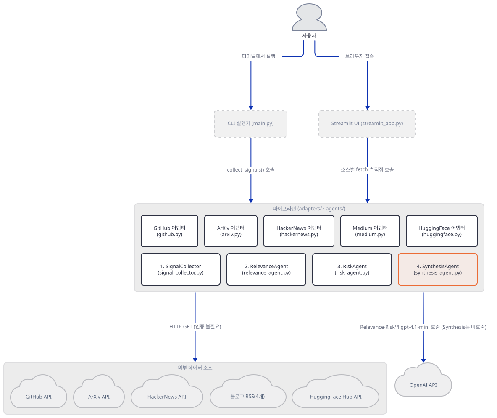

**확인.** 원본 앱이 제공하는 `verify.py`로 지금까지 만든 유틸리티+3개 에이전트 전체를 모의 데이터로 검증합니다(네트워크·API 키 불필요):

```bash
uv run --no-project python verify.py
```

Windows 콘솔에서는 이모지 출력 때문에 `PYTHONUTF8=1`을 앞에 붙여야 합니다(문제 해결 참고). 직접 확인한 출력(`PYTHONUTF8=1` 포함, 2회차 실행 — 1회차는 임포트 캐시가 없어 약간 더 걸립니다):

```text
============================================================
🔍 DevPulseAI Verification Suite
============================================================

Using MOCK DATA — No network calls or API keys required.

[1/5] Verifying imports...
  ✓ All modules imported successfully
  ✓ SignalCollector confirmed as utility (no LLM)
[2/5] Verifying Signal Collector (utility)...
  ✓ Collected 5 signals: 1 from github, 1 from arxiv, 1 from hackernews, 1 from medium, 1 from huggingface
  ✓ Deduplication works correctly
[3/5] Verifying Relevance Agent (fallback mode)...
  ✓ Scored 5 signals (heuristic fallback)
[4/5] Verifying Risk Agent (fallback mode)...
  ✓ Assessed 5 signals (1 with breaking changes)
[5/5] Verifying Synthesis Agent...
  ✓ Generated digest with 1 recommendations

============================================================
📊 Verification Summary
============================================================
  • Signals processed:  5
  • Summary:            Analyzed 5 signals. 1 high-relevance items detected. Top signal: GPT-5 Breaking Changes in API
  • Recommendations:    1
  • Time elapsed:       0.901s

============================================================
[OK] DevPulseAI reference pipeline executed successfully
============================================================
```

앱 자체 README(`advanced_ai_agents/multi_agent_apps/devpulse_ai/README.md:101`)는 "<1초"라고 적었는데, 2회차 실행 기준 0.9초 안팎으로 직접 확인했습니다(1회차는 1.5초 가까이 걸리기도 했습니다 — 인터프리터·의존성 임포트 오버헤드).

### Step 7. main.py — 파이프라인을 CLI로 엮기

**목적.** 지금까지 만든 5개 어댑터 + 4단계 파이프라인을 하나의 실행 흐름으로 묶는 오케스트레이션 코드를 확인합니다.

**할 일.** `advanced_ai_agents/multi_agent_apps/devpulse_ai/main.py:47-74`

```python
def collect_signals(limit: Optional[int] = None) -> List[Dict[str, Any]]:
    """
    Collect signals from all configured sources.

    This is pure data aggregation — no LLM involved.
    """
    fetch_limit = limit if limit is not None else DEFAULT_SIGNAL_LIMIT
    print(f"\n📡 [1/4] Collecting Signals (limit: {fetch_limit} per source)...")

    signals = []

    print("  → Fetching GitHub trending repos...")
    signals.extend(fetch_github_trending(limit=fetch_limit))

    print("  → Fetching ArXiv papers...")
    signals.extend(fetch_arxiv_papers(limit=fetch_limit))

    print("  → Fetching HackerNews stories...")
    signals.extend(fetch_hackernews_stories(limit=fetch_limit))

    print("  → Fetching Medium blogs...")
    signals.extend(fetch_medium_blogs(limit=min(fetch_limit, 3)))

    print("  → Fetching HuggingFace models...")
    signals.extend(fetch_huggingface_models(limit=fetch_limit))

    print(f"  ✓ Collected {len(signals)} raw signals")
    return signals
```

`DEFAULT_SIGNAL_LIMIT = 5`(`main.py:29`)이고 Medium만 `min(fetch_limit, 3)`으로 더 낮게 제한됩니다. `run_pipeline()`은 이 함수의 결과를 받아 4단계를 순서대로 호출합니다(`main.py:98-129`):

```python
    raw_signals = collect_signals()

    # Stage 2: Normalize and deduplicate (utility — no LLM)
    collector = SignalCollector()
    print("\n🔄 [2/4] Normalizing Signals...")
    normalized = collector.collect(raw_signals)
    print(f"  ✓ {collector.summarize_collection(normalized)}")

    # Stage 3: Score for relevance (agent — gpt-4.1-mini)
    relevance = RelevanceAgent()
    print("\n📊 [3/4] Scoring Relevance...")
    scored = relevance.score_batch(normalized)
    high_relevance = sum(
        1 for s in scored if s.get("relevance", {}).get("score", 0) >= 70
    )
    print(f"  ✓ {high_relevance}/{len(scored)} signals rated high-relevance")

    # Stage 4: Assess risks (agent — gpt-4.1-mini)
    risk = RiskAgent()
    print("\n⚠️  [4/4] Assessing Risks...")
    assessed = risk.assess_batch(scored)
    critical = sum(
        1
        for s in assessed
        if s.get("risk", {}).get("risk_level") in ["HIGH", "CRITICAL"]
    )
    print(f"  ✓ {critical}/{len(assessed)} signals with elevated risk")

    # Stage 5: Synthesize digest (agent — gpt-4.1)
    synthesis = SynthesisAgent()
    print("\n📋 Generating Intelligence Digest...")
    digest = synthesis.synthesize(assessed)
```

이 앱은 이 시리즈 규칙상 실제 공개 API를 호출하는 실행은 하지 않았습니다 — 대신 5개 `fetch_*` 함수를 로컬 고정 데이터로 바꿔 같은 오케스트레이션 코드를 돌려, 키 없이도 파이프라인 전체(수집→정규화→관련성→위험→종합)가 끝까지 도는 것을 직접 확인했습니다. `OPENAI_API_KEY`가 없다는 경고, `[1/4]`~`[4/4]` 진행 로그, 그리고 Step 4~5에서 본 것과 같은 agno 인증 오류 로그가 각 신호마다 찍힌 뒤 다이제스트가 정상적으로 출력되는 것도 확인했습니다.

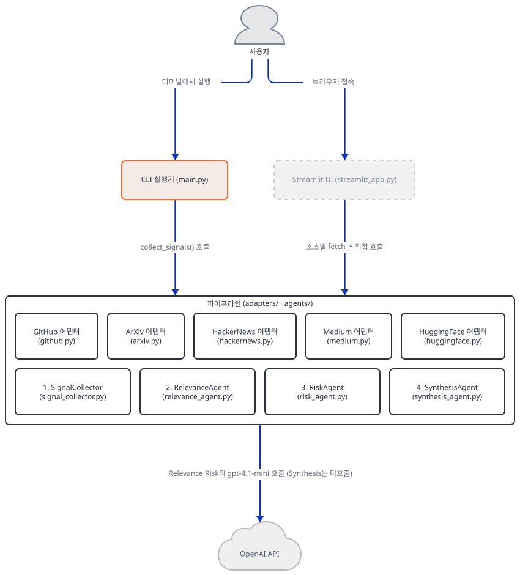

**확인.**

```bash
uv run --no-project python -c "
import main
print(main.collect_signals.__module__, main.run_pipeline.__module__)
"
```

`main main`이 출력됩니다 — 두 함수가 정상적으로 정의되어 있음을 보여줍니다(직접 확인, 실제 네트워크 호출 없이 import·속성 확인만 수행).

### Step 8. streamlit_app.py — 대시보드로 감싸기

**목적.** 같은 파이프라인을 사이드바 설정과 카드형 UI로 감싼 Streamlit 앱이 헤드리스로 정상 기동하는지 확인합니다.

**할 일.** `advanced_ai_agents/multi_agent_apps/devpulse_ai/streamlit_app.py:76-98`

```python
api_key = st.sidebar.text_input("OpenAI API Key (optional)", type="password", help="Provide an OpenAI API key. If not provided, agents will use fallback heuristic logic.")
if api_key:
    # RelevanceAgent / RiskAgent / SynthesisAgent all use agno's OpenAIChat,
    # which reads OPENAI_API_KEY.
    os.environ["OPENAI_API_KEY"] = api_key

# Source Selection
sources = st.sidebar.multiselect(
    "Signal Sources",
    ["GitHub", "ArXiv", "HackerNews", "Medium", "HuggingFace"],
    default=["GitHub", "ArXiv", "HackerNews", "Medium", "HuggingFace"]
)

# Signal Count Slider
signal_count = st.sidebar.slider(
    "Signals per source",
    min_value=4,
    max_value=32,
    value=DEFAULT_SIGNAL_LIMIT,
    step=4
)

run_button = st.sidebar.button("🚀 Run Intelligence Pipeline", use_container_width=True)
```

`main.py`의 `collect_signals()`를 재사용하지 않고, 선택된 소스마다 `fetch_*` 함수를 인라인으로 다시 호출합니다(`streamlit_app.py:117-138`) — 같은 로직이 두 파일에 중복되어 있다는 뜻입니다(소스 대조로 확인). Run 버튼을 누르기 전(랜딩 화면)에는 `st.image(...)`로 원본 리포의 `assets/logo.png`를 불러오려 시도하는데, 이 앱 폴더에는 `assets/` 디렉터리 자체가 없어 그 URL은 실제로 404를 반환합니다(문제 해결 참고).

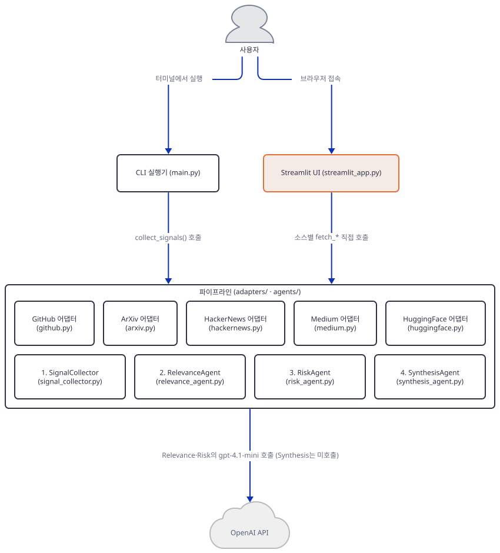

**확인.** 셸 PATH의 루트 `.venv\Scripts`를 먼저 빼고, headless로 기동합니다.

```bash
export PATH=$(echo "$PATH" | tr ":" "\n" | grep -v "/.venv" | paste -sd:)
uv run --no-project streamlit run streamlit_app.py --server.headless true --server.address localhost
```

`--server.address localhost`를 빼면 Streamlit이 기동하며 외부 IP를 알아내려고 `checkip.amazonaws.com`에 요청을 보냅니다(Day 060에서 확인한 사실과 같습니다). 브라우저로 `http://localhost:8501`에 접속하면 "🧠 DevPulseAI – Signal Intelligence Demo" 제목과 사이드바가 보입니다(직접 확인 — 임의의 높은 포트로 헤드리스 기동해 `/_stcore/health`가 `ok`를 반환하는 것과 초기 HTML이 정상 반환되는 것을 확인했습니다).

## 요청 한 건이 흐르는 과정

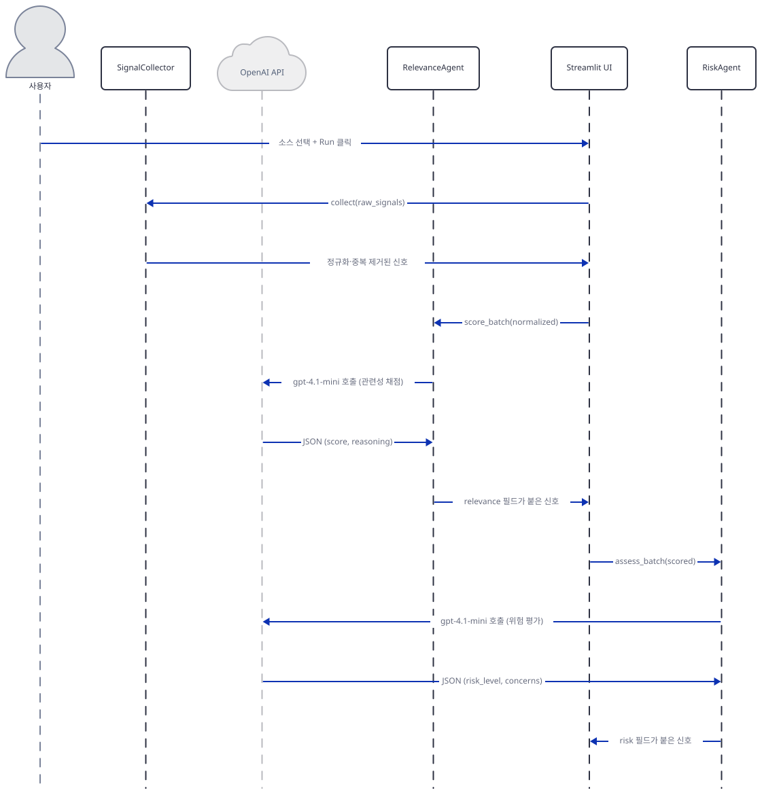

Streamlit에서 "Run Intelligence Pipeline"을 누르면 UI가 `SignalCollector.collect()`를 호출해 정규화·중복 제거를 마칩니다(5개 어댑터의 원시 신호 수집 자체는 Step 2·7에서 다뤘으므로 여기서는 되풀이하지 않습니다). 이어서 `RelevanceAgent.score_batch()`가 신호마다 gpt-4.1-mini를 호출해 관련성 점수를 받고, `RiskAgent.assess_batch()`가 같은 방식으로 위험도를 평가합니다. 이 그림은 키가 있다고 가정한 정상 경로입니다 — 키가 없을 때 이 두 단계가 실제로 어떻게 되는지는 Step 4·5의 "직접 확인" 출력을 참고하세요.

마지막 종합 단계는 따로 그렸습니다.

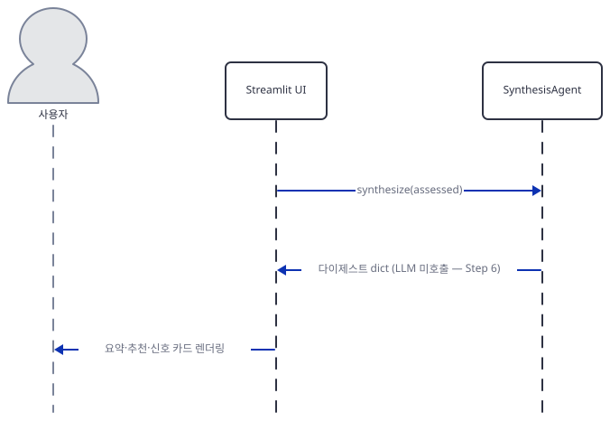

`SynthesisAgent.synthesize()`가 호출되는데, Step 6에서 확인했듯 이 호출은 OpenAI API로 나가지 않고 UI로 바로 다이제스트 dict를 돌려줍니다 — 그래서 이 그림에는 OpenAI API 배우가 아예 없습니다. UI는 이 다이제스트를 실행 요약·추천·신호 카드로 렌더링합니다.

## 실행 체크리스트

- [ ] 격리된 venv에 `requirements.txt`를 설치하고 `agno.__version__`을 확인했다
- [ ] 5개 어댑터가 같은 표준 스키마(dict)를 반환하는 유틸리티 함수임을 소스로 확인했다
- [ ] `SignalCollector`에 `.agent` 속성이 없음을 직접 실행해 확인했다
- [ ] 키 없이 `RelevanceAgent.score()`가 `RunOutput(status=error)` → JSON 파싱 실패 → 휴리스틱 순으로 폴백한다는 것을 직접 확인했다
- [ ] `RiskAgent`의 키워드 폴백이 "Breaking"을 MEDIUM으로 분류하는 것을 직접 확인했다
- [ ] `SynthesisAgent.synthesize()`가 `self.agent`를 한 번도 참조하지 않는다는 것을 소스 검색으로 확인했다
- [ ] `python verify.py`(모의 데이터, 네트워크 없음)가 끝까지 성공하는 것을 직접 확인했다
- [ ] `--server.address localhost --server.headless true`로 Streamlit을 헤드리스 기동해 확인했다

## 문제 해결

| 증상 | 원인 | 해결 |
|---|---|---|
| Windows 콘솔에서 `python verify.py`(또는 `main.py`) 실행 시 `UnicodeEncodeError: 'cp949' codec can't encode character '\U0001f50d'...`로 즉시 중단됨(직접 확인) | 스크립트가 🔍·📡 같은 이모지를 `print()`로 출력하는데, Windows 콘솔 기본 코드페이지(cp949)에 그 글자가 없음 | 실행 전 `PYTHONUTF8=1`을 설정하거나 `chcp 65001`로 콘솔 코드페이지를 UTF-8로 바꾼 뒤 실행 |
| 랜딩 화면(Run 버튼을 누르기 전)에서 로고 자리가 깨진 이미지로 보임 | `streamlit_app.py:208`의 `st.image(...)`가 가리키는 `.../devpulse_ai/assets/logo.png`가 원본 리포에 존재하지 않음(직접 확인 — 해당 URL은 HTTP 404, 이 앱 폴더에도 `assets/` 디렉터리가 없음) | 무시해도 나머지 기능에는 영향 없음(`st.image`는 URL을 그대로 ``에 넘길 뿐 서버 쪽에서 내려받지 않으므로 Python 예외는 나지 않습니다) |
| `RelevanceAgent`·`RiskAgent`의 폴백이 항상 `"reasoning": "... Parse error"`로만 찍히고 실제 인증 오류 문구가 안 보임 | `score()`/`assess()`의 `except Exception as e: ... str(e)` 경로가 아니라 `_parse_response`의 JSON 파싱 실패 경로로 빠지기 때문(Step 4 참고) — 오류 문구 자체는 `response.content`에 있지만 `_fallback_score`/`_fallback_assessment`로 전달되지 않음 | 정상 동작입니다. 실제 오류를 보려면 Step 4의 확인 명령처럼 `agent.run()`의 반환값을 직접 출력 |

## 더 해보기

- `MODEL_RELEVANCE=gpt-4.1-nano`, `MODEL_RISK=o4-mini` 같은 환경변수로 모델을 바꿔가며 `_fallback_*`이 아니라 실제 LLM 응답 형식(마크다운 코드펜스 유무 등)이 `_parse_response`를 통과하는지 확인해보기
- `SynthesisAgent.synthesize()`에 실제로 `self.agent.run()` 호출을 추가해(교육용 실험으로) LLM 기반 요약과 현재의 결정적 요약이 얼마나 다른지 비교해보기
- `streamlit_app.py`가 `main.py`의 `collect_signals()`를 재사용하도록 리팩터링해 중복 로직을 제거해보기(Step 8에서 확인한 중복)

## 다음 날 예고

[Day 097 · 📡 Earnings Call Analyst Agent](../day097-earnings-call-analyst-agent/README.md) — YouTube 실적 발표 영상을 재생 시점과 동기화된 분석 워크스페이스로 바꾸는 ADK 에이전트를 다룹니다.
