# Day 099 · 🛡️ AI Agent Governance - Policy-Based Sandboxing

> 볼륨 7 🚀 Advanced AI Agents · 난이도 ★☆☆ · 예상 소요 95분(Step마다 함수를 직접 호출해 보고, 임시 폴더로 승인 y·n 두 경우를 돌리고, /workspace가 없는지 확인한 뒤 데모를 두 번 돌려 동작을 보고 폴더를 치우고, 시퀀스 여섯 장을 따라가는 손 시간이 읽는 시간만큼 듭니다) · API 비용 대략 $0.02 안팎, 상한 $0.10 — LLM 데모의 요청 3건(`gpt-4`, 입력 약 130토큰, 출력 최대 `max_tokens=500`)에 모델 페이지의 입력 $30·출력 $60(1M 토큰당, https://developers.openai.com/api/docs/models/gpt-4, 2026-09-30 확인)을 대입한 대략치이고 키가 없어 실제 토큰 수는 확인하지 못함(키 없이 정책 엔진만 돌리는 실행은 무료) · 원본 앱: `advanced_ai_agents/single_agent_apps/ai_agent_governance`

## 오늘 만들 것

에이전트가 고른 도구 호출을 **실행하기 전에** 규칙으로 걸러 내는 거버넌스 계층입니다. "위험한 일은 하지 마"라고 LLM에게 부탁하는 대신(확률적 안전), 도구 함수를 `governed_tool` 데코레이터로 감싸 호출 직전에 `PolicyEngine`이 파일 경로·네트워크 도메인·분당 횟수·사람 승인 규칙을 차례로 물어 ALLOW·DENY·REQUIRE_APPROVAL 중 하나를 결정론적으로 냅니다. 앱은 `ai_agent_governance.py` 한 파일(편집기 기준 613줄)이고 `openai`와 `pyyaml`만 씁니다. Day 019의 ADK `before_tool_callback`이나 Day 029의 OpenAI SDK 가드레일이 프레임워크가 정해 둔 자리에 검사를 꽂았다면, 여기서는 그 자리를 데코레이터 하나로 직접 만듭니다. 감사 로그도 Day 090의 해시체인과 달리 메모리 리스트일 뿐입니다(소스로 확인: 파일에 `hash`·`verify`가 없음).

키 없이 `python ai_agent_governance.py`를 돌리면 정책 엔진과 시험 케이스 다섯 건이 끝까지 돕니다. 다만 이 데모는 파일 시스템 루트에 `/workspace` 폴더를 만들고, 그 폴더가 이미 있으면 안의 `data.txt`·`report.md`를 말없이 덮어씁니다(직접 확인). 돌리기 전에 Step 6의 주의를 읽고 그 폴더가 없는지부터 확인하세요. `gpt-4`가 도구 호출 문장을 만드는 LLM 데모는 `OPENAI_API_KEY`가 있을 때만 이어지므로(소스로 확인, `ai_agent_governance.py:589-607`) 이 문서는 Step 7에서 가짜 응답으로 같은 코드를 태웁니다. 이 앱은 학습용 예시이지 보안 경계가 아닙니다. 문서의 ALLOW·DENY는 예시 정책의 결과일 뿐 어떤 시스템의 안전도 보증하지 않으며, 경로를 문자열 접두사로 비교하고 `path`·`file_path`가 아닌 인자 이름은 검사하지 않는 구멍을 Step 2에서 직접 확인합니다.

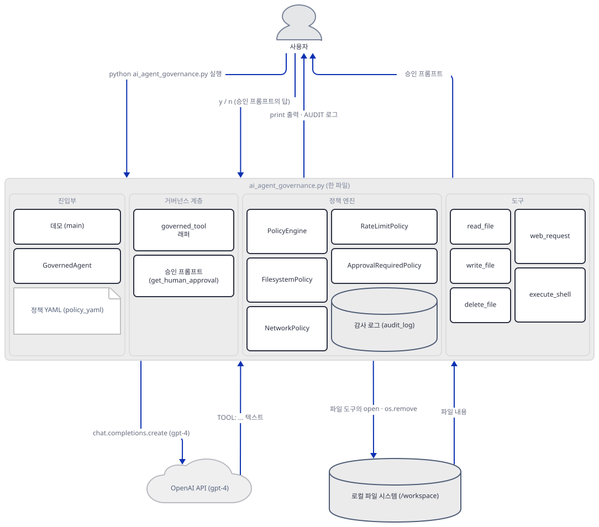

## 사전 준비

| 서비스/도구 | 용도 | 발급·설치 |
|---|---|---|
| uv | 가상환경 생성과 패키지 설치 | [공통 사전 준비](../README.md#공통-사전-준비-한-번만) 절 참고 |
| Python | 앱 README는 3.8+라고 적지만(`README.md:36`) 이 저장소는 3.11~3.13이 기준이다. 이 문서는 3.13.3으로 확인했고, 3.12부터는 `datetime.utcnow()` 폐기 경고가 뜬다(Step 6) | 공통 사전 준비와 같음 |
| OpenAI API 키 (선택) | `GovernedAgent`가 `gpt-4`를 부를 때만 필요하다(`ai_agent_governance.py:443`, `ai_agent_governance.py:462`). 키가 없어도 정책 엔진과 시험 케이스는 모두 돈다 | https://platform.openai.com/api-keys 에서 발급 (이 문서는 쓰지 않음) |

앱이 이모지를 `print`하는데, 표준출력을 파이프로 받으면 Windows의 기본 인코딩(`cp949` 등, 로캘의 ANSI 코드 페이지)이 이모지를 못 써서 첫 줄에서 죽습니다(직접 확인, 문제 해결 첫 행). 아래 출력은 모두 UTF-8로 잡았으니 셸을 먼저 이렇게 맞춰 두세요.

```bash
export PYTHONIOENCODING=utf-8
```

```powershell
$env:PYTHONIOENCODING = "utf-8"
```

## 아키텍처 한눈에 보기

| 컴포넌트 | 역할 | 코드 위치 |
|---|---|---|
| 사용자 | `python ai_agent_governance.py`를 실행하고, 승인 프롬프트에 y/n을 답하고, 출력과 로그를 읽는다 | 코드 없음 (터미널) |
| 데모 (`main`) | YAML로 엔진을 만들고 시험 케이스 5건과 감사표를 출력하며, 키가 있으면 LLM 데모까지 돌린다 | `ai_agent_governance.py:514-609` |
| 정책 YAML (`policy_yaml`) | `main()` 안의 문자열. 파일·네트워크·실행(횟수·승인) 규칙을 선언한다 | `ai_agent_governance.py:519-541` |
| 데이터 클래스 (`Decision`·`Action`·`PolicyResult`·`AuditEntry`) | 결정 셋, 호출·판정·감사 기록의 모양 | `ai_agent_governance.py:37-70` |
| 정책 규칙 4종 (부모 `PolicyRule`, `ai_agent_governance.py:77-85`) | 파일·네트워크·속도·승인. 모두 `Action`을 받아 `PolicyResult` 또는 `None`을 돌려준다 | `ai_agent_governance.py:88-134`, `ai_agent_governance.py:137-186`, `ai_agent_governance.py:189-212`, `ai_agent_governance.py:215-229` |
| 정책 엔진 (`PolicyEngine`) | 규칙을 순서대로 묻고 결정 하나로 합친다. YAML에서 만든다 | `ai_agent_governance.py:232-328` |
| 감사 로그 (`audit_log`) | 판정마다 `AuditEntry`를 더하는 메모리 리스트 | `ai_agent_governance.py:237`, `ai_agent_governance.py:273-297` |
| `governed_tool` 래퍼 | 도구 호출을 가로채 엔진의 결정을 집행하고, 거부하면 `PolicyViolation`(`ai_agent_governance.py:335-337`)을 던진다 | `ai_agent_governance.py:349-385` |
| 승인 프롬프트 (`get_human_approval`) | `input()`으로 사람의 y를 받는다 | `ai_agent_governance.py:340-346` |
| 도구 5종 (`create_governed_tools`) | 파일 셋은 진짜로, `web_request`·`execute_shell`은 흉내만 낸다 | `ai_agent_governance.py:392-430` |
| `GovernedAgent` | `gpt-4`에게 도구 호출 문장을 받아 해석하고 거버넌스 도구로 실행한다 | `ai_agent_governance.py:437-507` |
| OpenAI API (`gpt-4`) | 유일한 외부 서비스. 키가 있을 때만 호출된다 | `ai_agent_governance.py:462-469` |
| 로컬 파일 시스템 | 파일 도구와 데모가 읽고 쓰고 지운다 | `ai_agent_governance.py:398`, `ai_agent_governance.py:404`, `ai_agent_governance.py:411`, `ai_agent_governance.py:569-572` |

위 그림은 한 파일 안의 부품과 바깥 세계(사용자·OpenAI·파일 시스템)의 경계만 그립니다. 부품끼리의 관계는 다섯 장으로 나눠 그렸습니다. 먼저 사용자와 진입부 사이의 실행과 출력입니다.

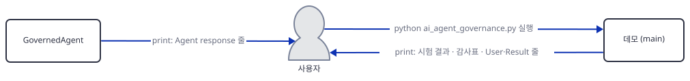

진입부가 부르는 것입니다. `main`과 `GovernedAgent`가 같은 래퍼를 부릅니다.

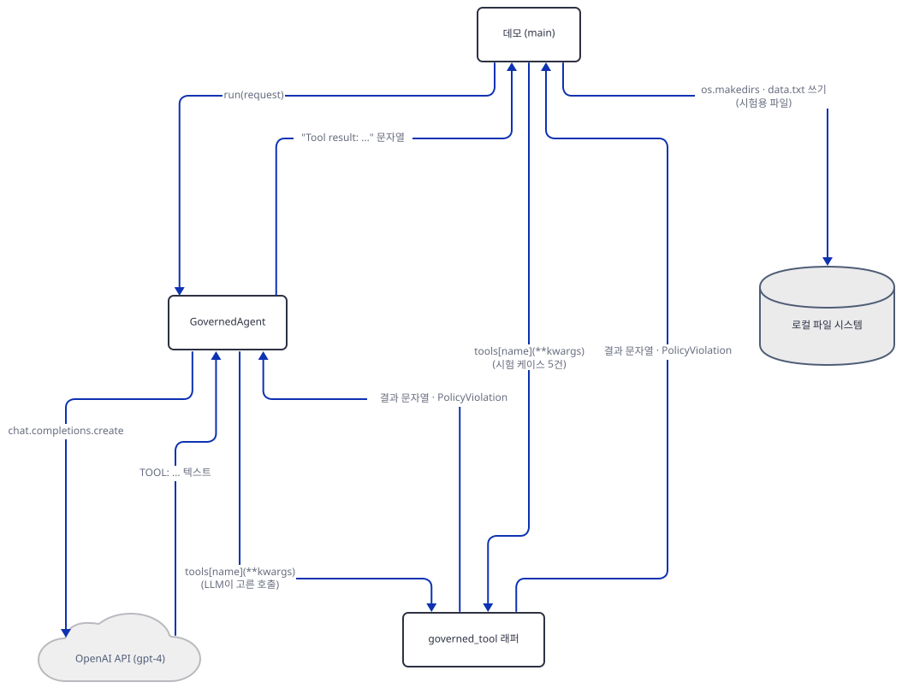

래퍼 뒤의 정책 엔진입니다. `main`은 `get_audit_log()`로 감사 항목을 읽습니다.

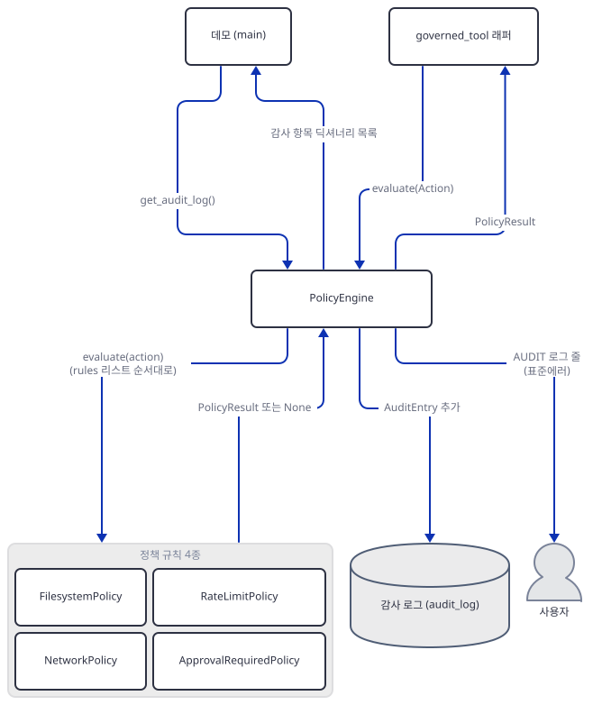

래퍼가 사람 승인과 도구를 부르는 쪽입니다.

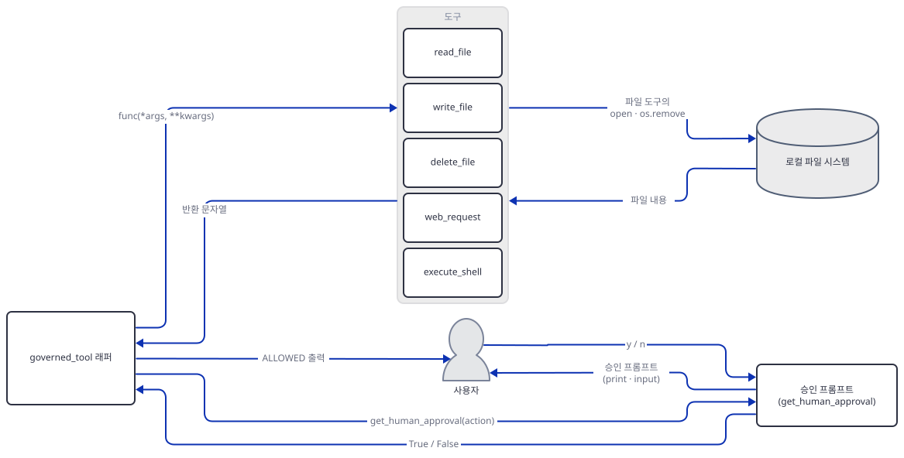

요청이 오기 전에 끝나는 구성입니다.

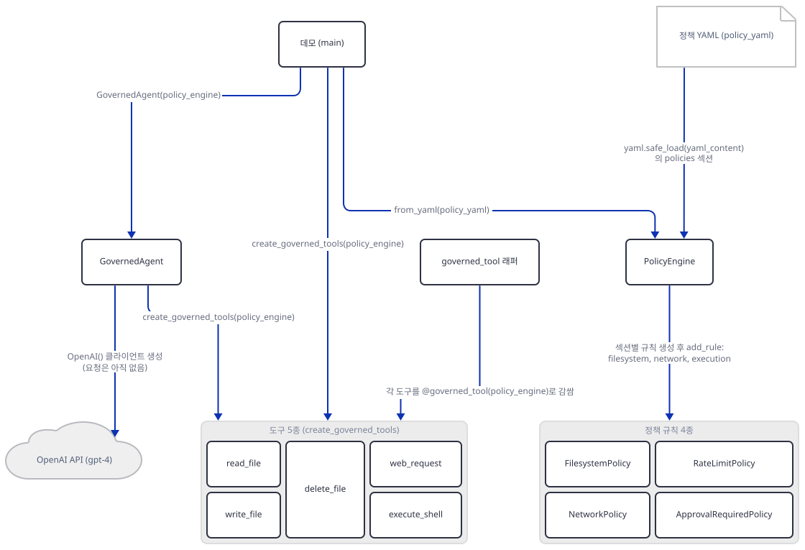

## 단계별 진행

### Step 1. 환경 만들기 — 의존성 둘, 키 없이 되는 범위

**목적.** 앱 폴더에 독립 가상환경을 만들고, 파일이 컴파일·임포트되는지 확인합니다.

**할 일.**

```bash
cd advanced_ai_agents/single_agent_apps/ai_agent_governance
uv venv
uv pip install -r requirements.txt
```

(pip 대안: `python -m venv .venv && source .venv/bin/activate && pip install -r requirements.txt`. Windows PowerShell은 활성화만 `.venv\Scripts\Activate.ps1`로 바꿉니다.) 이후 `uv run`에는 모두 `--no-project`를 붙입니다. 이유는 [공통 사전 준비](../README.md#공통-사전-준비-한-번만)에 있습니다.

`advanced_ai_agents/single_agent_apps/ai_agent_governance/requirements.txt:1-2`

```text
openai>=1.0.0
pyyaml>=6.0
```

상한이 없어서 이 문서를 만들 때는 Python 3.13.3, openai 3.22.1, pyyaml 6.0.3이 깔렸습니다(직접 확인, 아래 첫 명령). 앱이 쓰는 `OpenAI()`와 `chat.completions.create(model, messages, max_tokens)`는 이 새 메이저에도 그대로 있었습니다(소스로 확인: 설치된 openai의 `openai/resources/chat/completions/completions.py`. 다만 그 문서 문자열은 `max_tokens`를 `max_completion_tokens`로 대체될 폐기 예정 인자라고 적습니다).

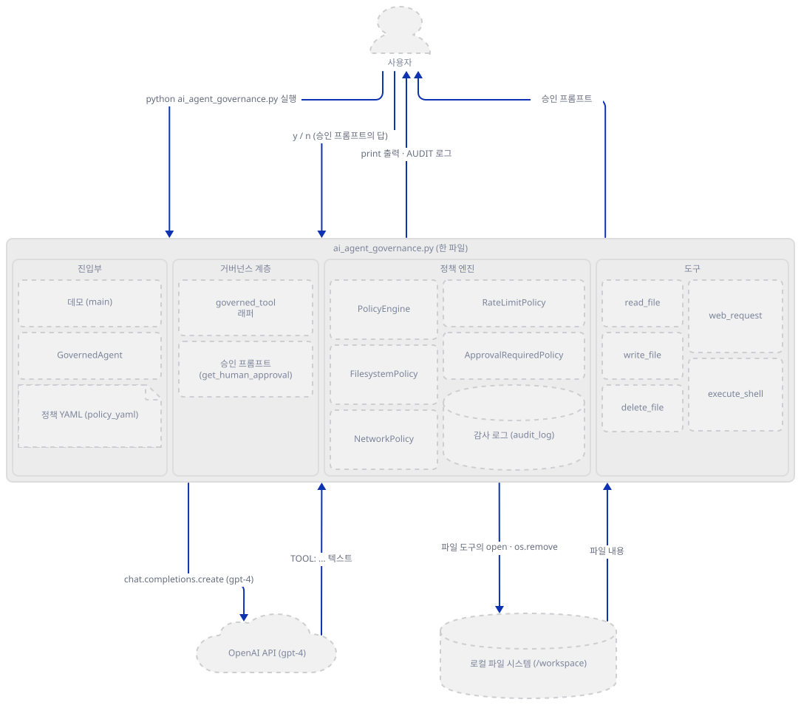

**확인.** 앱 폴더에서 실행합니다.

```bash
uv run --no-project python -c "import sys, openai, yaml; print(sys.version.split()[0], openai.__version__, yaml.__version__)"
```

직접 확인한 출력:

```
3.13.3 3.22.1 6.0.3
```

```bash
uv run --no-project python -m py_compile ai_agent_governance.py && echo compiled
uv run --no-project python -c "import ai_agent_governance; print('import ok')"
```

직접 확인한 출력:

```
compiled
import ok
```

`import`는 `openai`를 불러오지만(`ai_agent_governance.py:26`) 클라이언트는 `GovernedAgent`를 만들 때에야 생기므로(`ai_agent_governance.py:443`) 키 없이 통과합니다.

### Step 2. 데이터 뼈대와 파일·네트워크 규칙

**목적.** 앱 전체를 꿰는 계약 하나를 익힙니다. 규칙은 `Action`을 받아 `PolicyResult` 또는 `None`("해당 없음")을 돌려줍니다.

**할 일.** `Decision`은 `allow`·`deny`·`require_approval` 셋이고, `Action`은 호출 이름·위치 인자·키워드 인자·시각을 담습니다.

`advanced_ai_agents/single_agent_apps/ai_agent_governance/ai_agent_governance.py:37-60`

```python
class Decision(Enum):
    """Policy evaluation decision"""
    ALLOW = "allow"
    DENY = "deny"
    REQUIRE_APPROVAL = "require_approval"


@dataclass
class Action:
    """Represents an action an agent wants to perform"""
    name: str
    args: tuple = field(default_factory=tuple)
    kwargs: Dict[str, Any] = field(default_factory=dict)
    timestamp: datetime = field(default_factory=datetime.utcnow)
    agent_id: str = "default-agent"


@dataclass
class PolicyResult:
    """Result of a policy evaluation"""
    decision: Decision
    reason: str
    policy_name: str
    is_terminal: bool = True
```

`agent_id`는 기본값이 있지만 이 파일 어디서도 채우거나 읽지 않습니다(소스로 확인, 파일 전체 검색). `FilesystemPolicy.evaluate`는 경로를 `path`, `file_path`, 첫 위치 인자(문자열이고 `/` 포함) 순으로 찾고 못 찾으면 `None`으로 물러납니다. 찾으면 정규화한 뒤 **거부 목록을 먼저**, 허용 목록을 다음에 보고, 어디에도 없으면 기본 거부입니다.

`advanced_ai_agents/single_agent_apps/ai_agent_governance/ai_agent_governance.py:96-134`

```python
    def evaluate(self, action: Action) -> Optional[PolicyResult]:
        # Check if action involves file paths
        path = None
        if action.kwargs.get("path"):
            path = action.kwargs["path"]
        elif action.kwargs.get("file_path"):
            path = action.kwargs["file_path"]
        elif action.args and isinstance(action.args[0], str) and "/" in action.args[0]:
            path = action.args[0]
        
        if not path:
            return None  # Rule doesn't apply
        
        path = os.path.abspath(os.path.expanduser(path))
        
        # Check denied paths first
        for denied in self.denied_paths:
            if path.startswith(os.path.abspath(denied)):
                return PolicyResult(
                    decision=Decision.DENY,
                    reason=f"Path '{path}' matches denied pattern '{denied}'",
                    policy_name=self.name
                )
        
        # Check if path is in allowed paths
        for allowed in self.allowed_paths:
            if path.startswith(os.path.abspath(allowed)):
                return PolicyResult(
                    decision=Decision.ALLOW,
                    reason=f"Path '{path}' is within allowed directory '{allowed}'",
                    policy_name=self.name
                )
        
        # Default deny if not explicitly allowed
        return PolicyResult(
            decision=Decision.DENY,
            reason=f"Path '{path}' is outside allowed directories",
            policy_name=self.name
        )
```

`NetworkPolicy`(`ai_agent_governance.py:137-186`)도 같은 모양입니다. `url`·`endpoint`·`domain`·`host` 키에서 주소를 찾고(`ai_agent_governance.py:148-151`) 정규식으로 도메인을 뽑아(`ai_agent_governance.py:164-168`), 허용 목록과 같거나 `.도메인`으로 끝나면 통과시키고, 아니면 `block_all_others`(기본 `True`)일 때 거부합니다.

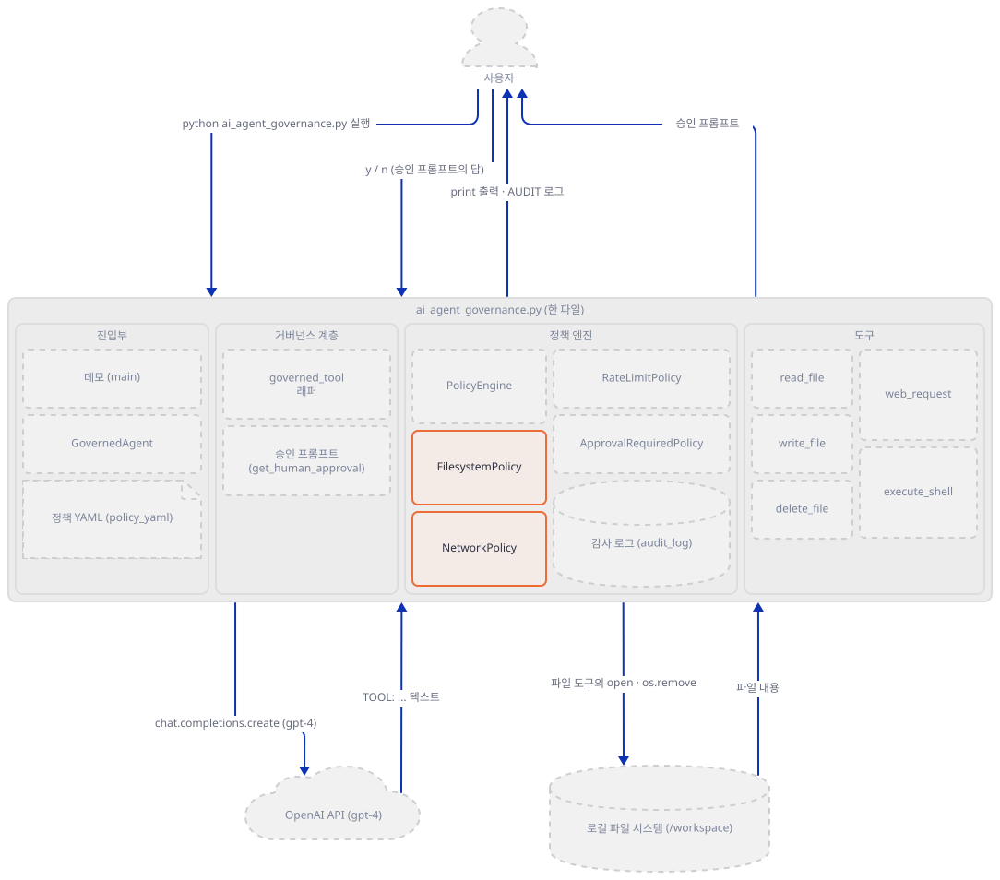

**확인.**

```bash
uv run --no-project python -c "
from ai_agent_governance import Action, Decision
a = Action(name='read_file', kwargs={'path': '/etc/passwd'})
print(a.name, a.args, a.kwargs, a.agent_id)
print([d.value for d in Decision])
"
```

직접 확인한 출력:

```
read_file () {'path': '/etc/passwd'} default-agent
['allow', 'deny', 'require_approval']
```

```bash
uv run --no-project python -c "
from ai_agent_governance import Action, FilesystemPolicy, NetworkPolicy
fs = FilesystemPolicy(['/workspace', '/tmp'], ['/etc', '/home'])
net = NetworkPolicy(['api.openai.com', 'api.github.com'])
def show(rule, **kwargs):
    r = rule.evaluate(Action(name='demo', kwargs=kwargs))
    print(rule.name, kwargs)
    print('   ->', 'None' if r is None else r.decision.value + ' | ' + r.reason)
show(fs, path='/etc/passwd')
show(fs, path='/workspace/report.md')
show(fs, path='/var/log/syslog')
show(fs, command='cat /etc/passwd')
show(net, url='https://api.github.com/users')
show(net, url='https://unknown-site.com/api')
show(net, url='https://api.github.com:443/users')
"
```

직접 확인한 출력:

```
filesystem {'path': '/etc/passwd'}
   -> deny | Path 'Z:\etc\passwd' matches denied pattern '/etc'
filesystem {'path': '/workspace/report.md'}
   -> allow | Path 'Z:\workspace\report.md' is within allowed directory '/workspace'
filesystem {'path': '/var/log/syslog'}
   -> deny | Path 'Z:\var\log\syslog' is outside allowed directories
filesystem {'command': 'cat /etc/passwd'}
   -> None
network {'url': 'https://api.github.com/users'}
   -> allow | Domain 'api.github.com' is in allowlist
network {'url': 'https://unknown-site.com/api'}
   -> deny | Domain 'unknown-site.com' not in allowlist
network {'url': 'https://api.github.com:443/users'}
   -> deny | Domain 'api.github.com:443' not in allowlist
```

경로 출력의 `Z:`는 이 문서를 만들며 `/workspace`를 스크래치 폴더에 가두려고 잡은 가상 드라이브입니다. Windows의 `os.path.abspath`는 드라이브 없는 절대경로에 현재 드라이브를 붙이므로 독자 PC에서는 `C:` 등 실행한 위치의 드라이브로 찍힙니다(Linux·macOS는 돌려 보지 못했습니다). 눈여겨볼 것은 둘입니다. `command='cat /etc/passwd'`는 `None`이니, 인자 이름이 `path`·`file_path`가 아니면 파일 규칙은 아예 적용되지 않습니다. `api.github.com:443`은 포트가 붙은 채 비교되어 거부됩니다. 경로 비교가 문자열 접두사라는 점(`ai_agent_governance.py:113`, `ai_agent_governance.py:122`)은 다음 명령으로 봅니다.

```bash
uv run --no-project python -c "
from ai_agent_governance import Action, FilesystemPolicy
fs = FilesystemPolicy(['/workspace'], ['/home'])
for p in ('/workspace/../etc/passwd', '/workspace-evil/x', '/homework/x'):
    r = fs.evaluate(Action(name='demo', kwargs={'path': p}))
    print(p, r.decision.value)
"
```

직접 확인한 출력:

```
/workspace/../etc/passwd deny
/workspace-evil/x allow
/homework/x deny
```

`abspath`가 `..`를 풀어 주므로 `/workspace/../etc/passwd`는 막히지만, `/workspace-evil/x`는 `/workspace`로 시작한다는 이유로 허용되고 `/homework/x`는 `/home` 때문에 거부됩니다.

### Step 3. 속도 제한과 승인 규칙

**목적.** 인자를 보지 않고 호출 이름과 시각만 보는 규칙 둘을 봅니다.

**할 일.** `RateLimitPolicy`는 최근 1분의 호출 시각 리스트를 들고, 이미 `max_actions_per_minute`개면 `DENY`, 아니면 지금 시각을 **적어 두고** `None`으로 통과시킵니다. 스스로 ALLOW를 내지 않고 막기만 합니다.

`advanced_ai_agents/single_agent_apps/ai_agent_governance/ai_agent_governance.py:197-212`

```python
    def evaluate(self, action: Action) -> Optional[PolicyResult]:
        now = datetime.utcnow()
        cutoff = now - timedelta(minutes=1)
        
        # Clean old entries
        self.action_history = [t for t in self.action_history if t > cutoff]
        
        if len(self.action_history) >= self.max_actions_per_minute:
            return PolicyResult(
                decision=Decision.DENY,
                reason=f"Rate limit exceeded: {len(self.action_history)}/{self.max_actions_per_minute} actions per minute",
                policy_name=self.name
            )
        
        self.action_history.append(now)
        return None  # Allow - doesn't block
```

`ApprovalRequiredPolicy`는 호출 이름이 목록에 있으면 `REQUIRE_APPROVAL`을 냅니다.

`advanced_ai_agents/single_agent_apps/ai_agent_governance/ai_agent_governance.py:222-229`

```python
    def evaluate(self, action: Action) -> Optional[PolicyResult]:
        if action.name in self.actions_requiring_approval:
            return PolicyResult(
                decision=Decision.REQUIRE_APPROVAL,
                reason=f"Action '{action.name}' requires human approval",
                policy_name=self.name
            )
        return None
```

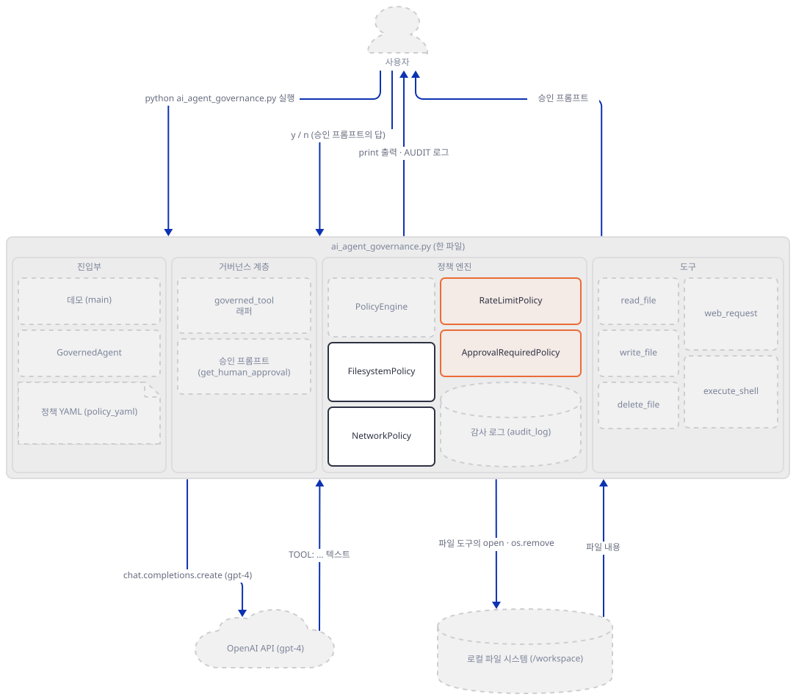

**확인.**

```bash
uv run --no-project python -c "
from ai_agent_governance import Action, RateLimitPolicy, ApprovalRequiredPolicy
rate = RateLimitPolicy(max_actions_per_minute=2)
for i in (1, 2, 3):
    r = rate.evaluate(Action(name='x'))
    print(i, 'None' if r is None else r.decision.value + ' | ' + r.reason, len(rate.action_history))
appr = ApprovalRequiredPolicy(['delete_file', 'execute_shell'])
for name in ('delete_file', 'read_file'):
    r = appr.evaluate(Action(name=name))
    print(name, 'None' if r is None else r.decision.value + ' | ' + r.reason)
"
```

직접 확인한 출력:

```
1 None 1
2 None 2
3 deny | Rate limit exceeded: 2/2 actions per minute 2
delete_file require_approval | Action 'delete_file' requires human approval
read_file None
```

한도를 2로 낮추자 세 번째 호출부터 거부되고 기록은 2에 머뭅니다. 거부된 호출은 기록에 더해지지 않습니다.

### Step 4. 정책 엔진 — 규칙 순서, 결정, 감사 로그

**목적.** 규칙 넷을 순서대로 묻고 결정 하나로 합치는 엔진과, 판정마다 남는 감사 기록을 봅니다.

**할 일.** `PolicyEngine.from_yaml`은 YAML **문자열**을 `yaml.safe_load`로 읽고(`ai_agent_governance.py:302`) `filesystem`, `network`, `execution` 절에서 규칙을 만들어 `rules`에 이 순서로 더합니다(`ai_agent_governance.py:307-326`). YAML에 적은 순서가 아니라 코드의 순서입니다. 핵심은 `evaluate`입니다.

`advanced_ai_agents/single_agent_apps/ai_agent_governance/ai_agent_governance.py:243-271`

```python
    def evaluate(self, action: Action) -> PolicyResult:
        """Evaluate an action against all policy rules"""
        allow_result = None
        for rule in self.rules:
            result = rule.evaluate(action)
            if not result or not result.is_terminal:
                continue
            if result.decision == Decision.ALLOW:
                # An allow is not final: a later rule may still deny the action
                # or require approval for it. Remember the first allow but keep
                # evaluating so deny/approval rules can override it.
                if allow_result is None:
                    allow_result = result
                continue
            self._log_audit(action, result)
            return result

        if allow_result is not None:
            self._log_audit(action, allow_result)
            return allow_result

        # Default allow if no rule blocks
        result = PolicyResult(
            decision=Decision.ALLOW,
            reason="No policy rule blocked this action",
            policy_name="default"
        )
        self._log_audit(action, result)
        return result
```

ALLOW를 곧바로 확정하지 않는 것이 요점입니다. 첫 허용은 기억만 하고 계속 묻다가, 뒤 규칙이 DENY나 REQUIRE_APPROVAL을 내면 그것이 이기고 그 자리에서 끝납니다. 어느 규칙도 걸리지 않으면 `default`로 허용합니다. 이 동작은 허용 경로 안의 `delete_file`이 승인 없이 지나가던 결함의 수정입니다(소스 주석과 저장소 이력의 커밋 `b96d19a`로 확인). `is_terminal=False`를 넘기는 규칙은 없어 그 갈래는 쓰이지 않습니다(소스로 확인). 판정마다 `_log_audit`가 `AuditEntry`를 `audit_log`에 더하고 `AUDIT:` 로그 한 줄을 남깁니다(`ai_agent_governance.py:273-283`). 모듈을 임포트하기만 해도 `logging.basicConfig`가 루트 로거를 INFO로 켜므로(`ai_agent_governance.py:29`) 그 줄이 표준에러로 나옵니다.

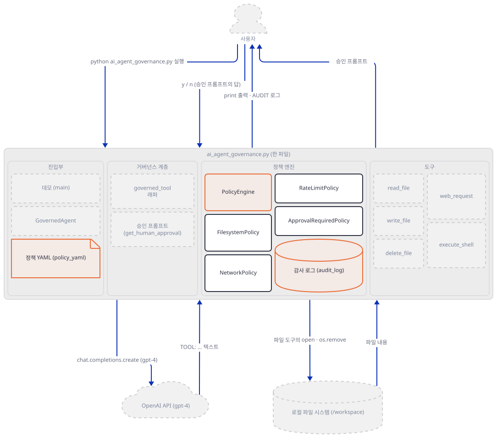

**확인.** `main()`의 정책(`ai_agent_governance.py:519-541`)과 같은 뜻의 YAML로 여섯 호출을 통과시킵니다. `AUDIT:` 줄이 출력에 섞이지 않게 로거 수준만 올렸습니다.

```bash
uv run --no-project python -c "
import logging
logging.getLogger('ai_agent_governance').setLevel(logging.WARNING)
from ai_agent_governance import Action, PolicyEngine
POLICY = '''
policies:
  filesystem:
    allowed_paths:
      - /workspace
      - /tmp
    denied_paths:
      - /etc
      - /home
      - ~/.ssh
  network:
    allowed_domains:
      - api.openai.com
      - api.github.com
    block_all_others: true
  execution:
    max_actions_per_minute: 60
    require_approval_for:
      - delete_file
      - execute_shell
'''
engine = PolicyEngine.from_yaml(POLICY)
print([r.name for r in engine.rules])
cases = [
    ('read_file', {'path': '/etc/passwd'}),
    ('write_file', {'path': '/workspace/report.md', 'content': 'x'}),
    ('web_request', {'url': 'https://unknown-site.com/api'}),
    ('delete_file', {'path': '/workspace/temp.txt'}),
    ('execute_shell', {'command': 'ls'}),
    ('execute_code', {'code': 'print(1)'}),
]
for name, kwargs in cases:
    r = engine.evaluate(Action(name=name, kwargs=kwargs))
    print(name, r.decision.value, r.policy_name)
print(len(engine.audit_log), len(engine.rules[2].action_history))
"
```

직접 확인한 출력:

```
['filesystem', 'network', 'rate_limit', 'approval_required']
read_file deny filesystem
write_file allow filesystem
web_request deny network
delete_file require_approval approval_required
execute_shell require_approval approval_required
execute_code allow default
6 4
```

`delete_file`은 경로가 허용인데도 최종이 `require_approval`이고, `execute_code`는 어느 규칙도 걸리지 않아 `default`로 허용됩니다. 이 엔진은 **기본 허용**입니다. 끝의 `6 4`는 감사 항목 6개와 속도 규칙에 기록된 호출 4개로, 앞 규칙이 거부한 `read_file`과 `web_request`는 속도 규칙까지 가지 못해 기록에 들지 않았습니다. `AUDIT:` 줄과 감사 항목은 이렇게 생겼습니다.

```bash
uv run --no-project python -c "
from ai_agent_governance import Action, PolicyEngine
engine = PolicyEngine.from_yaml('policies:\n  network:\n    allowed_domains: [api.github.com]\n')
engine.evaluate(Action(name='web_request', kwargs={'url': 'https://unknown-site.com/api'}))
print(engine.get_audit_log()[0])
"
```

직접 확인한 출력(시각은 실행마다 다릅니다):

```
2026-09-30 21:14:54,705 - INFO - AUDIT: DENY - web_request - Domain 'unknown-site.com' not in allowlist
{'timestamp': '2026-09-30T12:14:54.705406', 'action': 'web_request', 'action_args': "{'url': 'https://unknown-site.com/api'}", 'decision': 'deny', 'reason': "Domain 'unknown-site.com' not in allowlist", 'policy_matched': 'network'}
```

첫 줄이 표준에러의 `AUDIT:` 줄, 둘째 줄이 `get_audit_log()`의 항목입니다. 로그 줄의 시각(21시)은 로컬 시간이고 `timestamp`(12시)는 `datetime.utcnow()`라 UTC입니다. 이 PC가 UTC+9라 아홉 시간 차이가 납니다(직접 확인). 항목에는 `agent_id`가 없습니다. 끝으로 앱 README(`README.md:83-85`)의 `tools:` 절이 읽히는지 봅니다.

```bash
uv run --no-project python -c "
import logging
logging.getLogger('ai_agent_governance').setLevel(logging.WARNING)
from ai_agent_governance import Action, PolicyEngine
engine = PolicyEngine.from_yaml('policies:\n  tools:\n    denied: [execute_code, send_email]\n')
print(len(engine.rules))
r = engine.evaluate(Action(name='send_email'))
print(r.decision.value, r.policy_name)
"
```

직접 확인한 출력:

```
0
allow default
```

`from_yaml`은 `tools:`를 읽지 않아 규칙이 0개 생기고 `send_email`은 기본 허용입니다.

### Step 5. 가로채기 — governed_tool과 사람 승인

**목적.** 도구 함수를 감싸 호출 직전에 엔진의 결정을 집행하는 데코레이터와, REQUIRE_APPROVAL일 때 사람에게 묻는 함수를 봅니다.

**할 일.** `governed_tool(policy_engine, require_interactive_approval=True)`(`ai_agent_governance.py:349`)는 데코레이터 공장입니다. 감싼 함수가 불릴 때마다 `Action`을 만들어 엔진에 묻고, DENY면 `PolicyViolation`을 던지고, REQUIRE_APPROVAL이면 `get_human_approval`(`ai_agent_governance.py:340-346`)이 `input()`으로 받은 답이 `y`(대소문자 무관)일 때만 통과시킵니다(Enter만 쳐도 거부, 소스로 확인). 통과하면 `✅ ALLOWED`를 찍고 원래 함수를 부릅니다.

`advanced_ai_agents/single_agent_apps/ai_agent_governance/ai_agent_governance.py:357-385`

```python
    def decorator(func: Callable) -> Callable:
        @wraps(func)
        def wrapper(*args, **kwargs):
            # Create action representation
            action = Action(
                name=func.__name__,
                args=args,
                kwargs=kwargs
            )
            
            # Evaluate against policies
            result = policy_engine.evaluate(action)
            
            if result.decision == Decision.DENY:
                raise PolicyViolation(f"❌ DENIED: {result.reason}")
            
            elif result.decision == Decision.REQUIRE_APPROVAL:
                if require_interactive_approval:
                    if not get_human_approval(action):
                        raise PolicyViolation("❌ DENIED: Human rejected the action")
                else:
                    raise PolicyViolation(f"⏸️ PENDING: {result.reason}")
            
            # Action is allowed - execute
            print(f"✅ ALLOWED: {result.reason}")
            return func(*args, **kwargs)
        
        return wrapper
    return decorator
```

`require_interactive_approval=False`이면 승인 대신 `PENDING` 예외를 던지지만 `create_governed_tools`는 기본값만 쓰므로 앱 안에서는 닿지 않는 분기입니다(소스로 확인, `ai_agent_governance.py:395-419`).

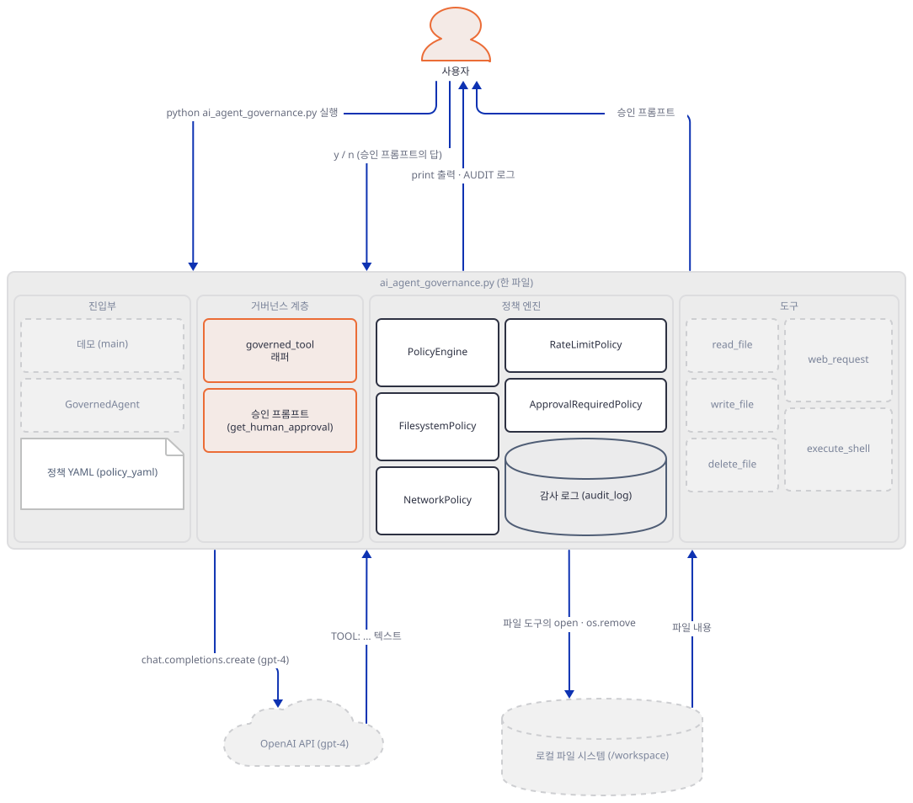

**확인.** 먼저 앱의 도구가 아닌 내 함수를 감싸 봅니다. 데코레이터는 어느 함수에나 붙습니다.

```bash
uv run --no-project python -c "
import logging
logging.getLogger('ai_agent_governance').setLevel(logging.WARNING)
from ai_agent_governance import PolicyEngine, PolicyViolation, governed_tool
engine = PolicyEngine.from_yaml('policies:\n  network:\n    allowed_domains: [api.github.com]\n')
@governed_tool(engine)
def fetch(url):
    return 'fetched ' + url
print(fetch(url='https://api.github.com/x'))
try:
    fetch(url='https://evil.example/x')
except PolicyViolation as e:
    print('PolicyViolation:', e)
print(fetch.__name__)
"
```

직접 확인한 출력:

```
✅ ALLOWED: Domain 'api.github.com' is in allowlist
fetched https://api.github.com/x
PolicyViolation: ❌ DENIED: Domain 'evil.example' not in allowlist
fetch
```

래퍼는 `@wraps`로 원래 이름(`fetch`)을 지킵니다. 이제 앱의 `delete_file`에 승인 규칙을 걸고 임시 폴더의 파일을 지우려는 호출에 답을 표준입력으로 줍니다. 도구 다섯 개는 Step 6에서 보고, 여기서는 그중 `delete_file`과 실제 파일을 빌려 씁니다(그림에서 둘이 이 Step에 켜지는 까닭입니다). `echo n |`은 bash에서 확인했고 PowerShell에서도 같은 형태로 쓸 수 있습니다(실행해 보지 못함).

```bash
echo n | uv run --no-project python -c "
import logging, os, pathlib, tempfile
logging.getLogger('ai_agent_governance').setLevel(logging.WARNING)
from ai_agent_governance import PolicyEngine, PolicyViolation, create_governed_tools
engine = PolicyEngine.from_yaml('policies:\n  execution:\n    require_approval_for: [delete_file]\n')
delete = create_governed_tools(engine)['delete_file']
old = os.getcwd()
with tempfile.TemporaryDirectory() as d:
    os.chdir(d)
    pathlib.Path('note.txt').write_text('hi')
    try:
        print(delete(path='note.txt'))
    except PolicyViolation as e:
        print()
        print('PolicyViolation:', e)
    print('note.txt exists:', os.path.exists('note.txt'))
    print([e['decision'] for e in engine.get_audit_log()])
    os.chdir(old)
"
```

직접 확인한 출력:

```

⏸️  APPROVAL REQUIRED
   Action: delete_file
   Args: {'path': 'note.txt'}
   Approve? [y/N]: 
PolicyViolation: ❌ DENIED: Human rejected the action
note.txt exists: True
['require_approval']
```

`y`로 바꾸면 이렇게 됩니다.

```bash
echo y | uv run --no-project python -c "
import logging, os, pathlib, tempfile
logging.getLogger('ai_agent_governance').setLevel(logging.WARNING)
from ai_agent_governance import PolicyEngine, PolicyViolation, create_governed_tools
engine = PolicyEngine.from_yaml('policies:\n  execution:\n    require_approval_for: [delete_file]\n')
delete = create_governed_tools(engine)['delete_file']
old = os.getcwd()
with tempfile.TemporaryDirectory() as d:
    os.chdir(d)
    pathlib.Path('note.txt').write_text('hi')
    try:
        print(delete(path='note.txt'))
    except PolicyViolation as e:
        print()
        print('PolicyViolation:', e)
    print('note.txt exists:', os.path.exists('note.txt'))
    print([e['decision'] for e in engine.get_audit_log()])
    os.chdir(old)
"
```

직접 확인한 출력:

```

⏸️  APPROVAL REQUIRED
   Action: delete_file
   Args: {'path': 'note.txt'}
   Approve? [y/N]: ✅ ALLOWED: Action 'delete_file' requires human approval
Successfully deleted note.txt
note.txt exists: False
['require_approval']
```

`n`이면 파일이 남고 `y`이면 지워집니다. 마지막 줄을 보세요. 두 실행의 감사 로그가 똑같이 `['require_approval']` 하나뿐이라 승인과 거부가 기록에서 구별되지 않고, 승인 뒤의 `✅ ALLOWED` 줄도 승인 요청의 사유를 그대로 씁니다.

### Step 6. 도구 다섯 개와 데모 실행

**목적.** 다섯 도구와 데모 `main()`을 이어 붙여 앱을 처음으로 끝까지 돌립니다.

**할 일.** `create_governed_tools`(`ai_agent_governance.py:392`)는 도구 다섯 개를 `@governed_tool(policy_engine)`로 감싸 이름에서 함수로 가는 딕셔너리로 돌려줍니다. 진짜 파일을 건드리는 것은 `read_file`·`write_file`·`delete_file`뿐이고 `web_request`와 `execute_shell`은 문자열만 돌려주는 흉내라 네트워크도 셸도 쓰지 않습니다(소스로 확인, 함수 설명에 `simulated`).

`advanced_ai_agents/single_agent_apps/ai_agent_governance/ai_agent_governance.py:395-422`

```python
    @governed_tool(policy_engine)
    def read_file(path: str) -> str:
        """Read contents of a file"""
        with open(path, "r") as f:
            return f.read()
    
    @governed_tool(policy_engine)
    def write_file(path: str, content: str) -> str:
        """Write content to a file"""
        with open(path, "w") as f:
            f.write(content)
        return f"Successfully wrote {len(content)} characters to {path}"
    
    @governed_tool(policy_engine)
    def delete_file(path: str) -> str:
        """Delete a file"""
        os.remove(path)
        return f"Successfully deleted {path}"
    
    @governed_tool(policy_engine)
    def web_request(url: str) -> str:
        """Make a web request (simulated)"""
        return f"Simulated response from {url}"
    
    @governed_tool(policy_engine)
    def execute_shell(command: str) -> str:
        """Execute a shell command (simulated for safety)"""
        return f"Simulated execution of: {command}"
```

`main()`(`ai_agent_governance.py:514-609`)은 YAML로 엔진을 만들고(`ai_agent_governance.py:544`), 시험 케이스 다섯 건을 이름으로 꺼낸 도구에 `**kwargs`로 넘기고(`ai_agent_governance.py:574`), 감사표를 찍고, 키가 있으면 `GovernedAgent` 데모를 잇습니다.

`advanced_ai_agents/single_agent_apps/ai_agent_governance/ai_agent_governance.py:557-572`

```python
    test_cases = [
        ("read_file", {"path": "/etc/passwd"}),
        ("write_file", {"path": "/workspace/report.md", "content": "# Analysis Report\n"}),
        ("web_request", {"url": "https://api.github.com/users"}),
        ("web_request", {"url": "https://unknown-site.com/api"}),
        ("read_file", {"path": "/workspace/data.txt"}),
    ]
    
    for tool_name, kwargs in test_cases:
        print(f"\n🤖 Testing: {tool_name}({kwargs})")
        try:
            # We need to create a temp file for the read test
            if tool_name == "read_file" and kwargs["path"] == "/workspace/data.txt":
                os.makedirs("/workspace", exist_ok=True)
                with open("/workspace/data.txt", "w") as f:
                    f.write("Test data")
```

**주의: 이 데모는 파일 시스템 루트에 폴더를 만들고, 이미 있으면 그 안의 파일을 덮어씁니다.** `main()`은 `os.makedirs("/workspace", exist_ok=True)`로 폴더를 만들고 `/workspace/data.txt`를 쓰며(`ai_agent_governance.py:569-572`), 둘째 시험 케이스의 `write_file`은 `/workspace/report.md`를 씁니다(`ai_agent_governance.py:404`, `ai_agent_governance.py:559`). `exist_ok=True`와 쓰기 모드(`"w"`) 때문에 폴더가 이미 있으면 아무 경고 없이 두 파일이 새로 쓰입니다. 직접 확인: 미리 넣어 둔 `my notes`와 `my data`가 `# Analysis Report`와 `Test data`로 바뀌었고, 첫 실행인데도 `[Errno 2]`가 나지 않았습니다. Windows에서는 현재 드라이브 루트에 `C:\workspace` 같은 폴더가 생기고(직접 확인: 가상 드라이브에서 `Z:\workspace`), root가 아닌 Linux·macOS에서는 권한 오류가 날 수 있으며, `/workspace`를 작업 폴더로 쓰는 컨테이너에서 root로 돌리면 같은 덮어쓰기가 일어납니다(소스로 확인, 실행해 보지 못함). 키가 있으면 LLM 데모의 둘째 요청(`ai_agent_governance.py:598`)이 모델이 고른 경로에 파일을 쓸 수도 있습니다(소스로 확인). 그래서 **먼저 그 폴더가 없는지 확인하고, 없을 때만 돌리세요.** 드라이브 문자는 실행하는 위치에 맞추고(Linux·macOS는 `ls -d /workspace`, 돌려 보지 못함), bash는 폴더가 없으면 `No such file or directory`를 냅니다(직접 확인). PowerShell은 `False`를 내야 합니다(실행해 보지 못함).

```bash
ls -d /c/workspace
```

```powershell
Test-Path C:\workspace
```

이 문서는 스크래치 폴더를 가상 드라이브로 잡아 그 안에서 돌렸습니다. 폴더를 만들고 싶지 않다면 데모 명령은 건너뛰고 아래 출력만 읽어도 됩니다. 바로 아래의 흉내 도구 확인은 `/workspace`를 건드리지 않고, Step 7도 `main()`을 부르지 않습니다.

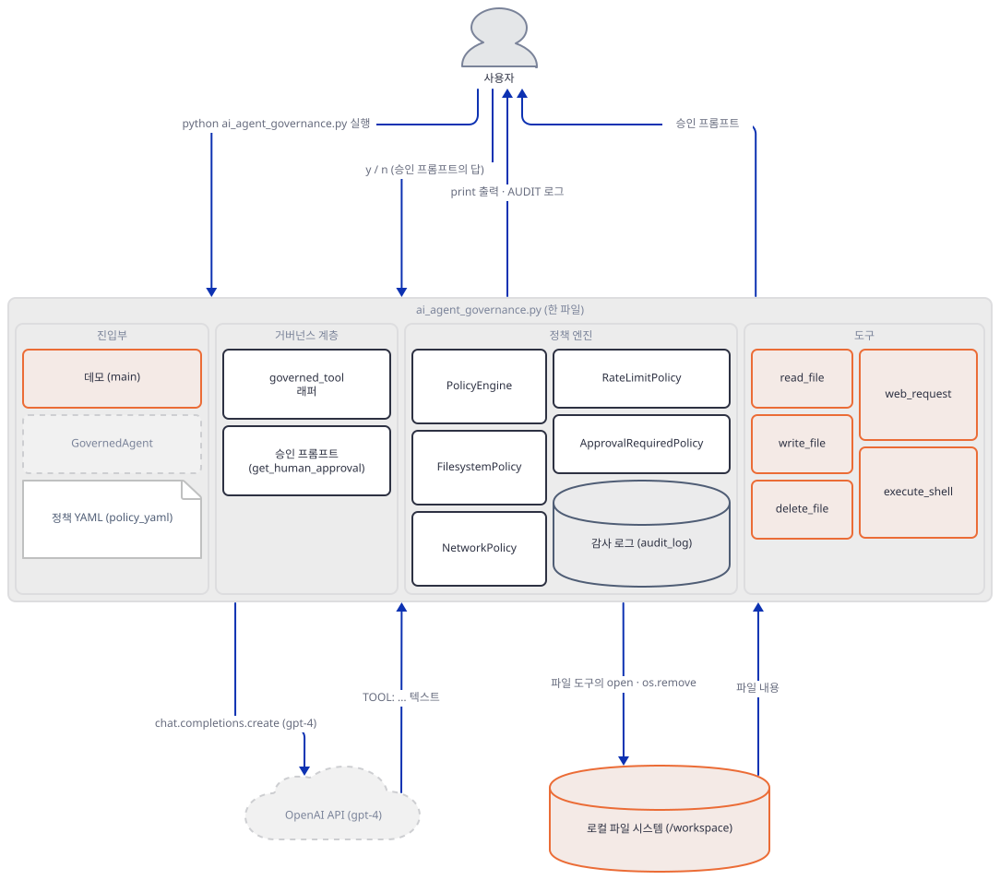

**확인.** 먼저 규칙이 없는 엔진에서 도구만 불러, 흉내 도구가 실제로 아무것도 하지 않는지 봅니다.

```bash
uv run --no-project python -c "
import logging
logging.getLogger('ai_agent_governance').setLevel(logging.WARNING)
from ai_agent_governance import PolicyEngine, create_governed_tools
tools = create_governed_tools(PolicyEngine())
print(list(tools))
web, shell = tools['web_request'], tools['execute_shell']
print(web(url='https://example.invalid/x'))
print(shell(command='echo hi'))
"
```

직접 확인한 출력:

```
['read_file', 'write_file', 'delete_file', 'web_request', 'execute_shell']
✅ ALLOWED: No policy rule blocked this action
Simulated response from https://example.invalid/x
✅ ALLOWED: No policy rule blocked this action
Simulated execution of: echo hi
```

규칙이 0개라 두 호출이 기본 허용되고 도구는 문자열만 돌려줍니다. 이제 데모를 그대로 돌립니다. `PYTHONUNBUFFERED`는 표준출력과 표준에러가 섞이는 순서를 터미널에서 보는 그대로 맞추려는 것이라 터미널에 직접 띄울 때는 없어도 됩니다.

```bash
PYTHONUNBUFFERED=1 uv run --no-project python ai_agent_governance.py
```

```powershell
$env:PYTHONUNBUFFERED = "1"; uv run --no-project python ai_agent_governance.py
```

직접 확인한 첫 실행의 출력입니다(시각은 실행마다 다르고 `Z:`는 위의 가상 드라이브입니다).

```
🛡️ AI Agent Governance Demo
========================================

📋 Loading policy configuration...
✅ Policy engine initialized with rules:
   - filesystem
   - network
   - rate_limit
   - approval_required

========================================
📝 Testing Governance Layer
========================================

🤖 Testing: read_file({'path': '/etc/passwd'})
<string>:6: DeprecationWarning: datetime.datetime.utcnow() is deprecated and scheduled for removal in a future version. Use timezone-aware objects to represent datetimes in UTC: datetime.datetime.now(datetime.UTC).
Z:\app\ai_agent_governance.py:276: DeprecationWarning: datetime.datetime.utcnow() is deprecated and scheduled for removal in a future version. Use timezone-aware objects to represent datetimes in UTC: datetime.datetime.now(datetime.UTC).
  timestamp=datetime.utcnow(),
2026-09-30 21:32:40,077 - INFO - AUDIT: DENY - read_file - Path 'Z:\etc\passwd' matches denied pattern '/etc'
   ❌ DENIED: Path 'Z:\etc\passwd' matches denied pattern '/etc'

🤖 Testing: write_file({'path': '/workspace/report.md', 'content': '# Analysis Report\n'})
Z:\app\ai_agent_governance.py:198: DeprecationWarning: datetime.datetime.utcnow() is deprecated and scheduled for removal in a future version. Use timezone-aware objects to represent datetimes in UTC: datetime.datetime.now(datetime.UTC).
  now = datetime.utcnow()
2026-09-30 21:32:40,078 - INFO - AUDIT: ALLOW - write_file - Path 'Z:\workspace\report.md' is within allowed directory '/workspace'
✅ ALLOWED: Path 'Z:\workspace\report.md' is within allowed directory '/workspace'
   Error: [Errno 2] No such file or directory: '/workspace/report.md'

🤖 Testing: web_request({'url': 'https://api.github.com/users'})
2026-09-30 21:32:40,078 - INFO - AUDIT: ALLOW - web_request - Domain 'api.github.com' is in allowlist
✅ ALLOWED: Domain 'api.github.com' is in allowlist
   Result: Simulated response from https://api.github.com/users

🤖 Testing: web_request({'url': 'https://unknown-site.com/api'})
2026-09-30 21:32:40,078 - INFO - AUDIT: DENY - web_request - Domain 'unknown-site.com' not in allowlist
   ❌ DENIED: Domain 'unknown-site.com' not in allowlist

🤖 Testing: read_file({'path': '/workspace/data.txt'})
2026-09-30 21:32:40,079 - INFO - AUDIT: ALLOW - read_file - Path 'Z:\workspace\data.txt' is within allowed directory '/workspace'
✅ ALLOWED: Path 'Z:\workspace\data.txt' is within allowed directory '/workspace'
   Result: Test data

========================================
📊 Audit Log
========================================
   DENY     | read_file       | Path 'Z:\etc\passwd' matches denied pattern '/etc'
   ALLOW    | write_file      | Path 'Z:\workspace\report.md' is within allowed di
   ALLOW    | web_request     | Domain 'api.github.com' is in allowlist
   DENY     | web_request     | Domain 'unknown-site.com' not in allowlist
   ALLOW    | read_file       | Path 'Z:\workspace\data.txt' is within allowed dir

💡 Set OPENAI_API_KEY to run the full LLM agent demo

✅ Demo complete!
```

세 가지를 짚습니다. 첫째, `write_file`이 정책을 통과해 `✅ ALLOWED`가 찍히고도 `[Errno 2]`로 실패합니다. `/workspace`가 아직 없어서입니다. 폴더는 다섯째 케이스에서야 생기므로 한 번 더 돌리면 그 줄이 `   Result: Successfully wrote 18 characters to /workspace/report.md`로 바뀝니다(직접 확인). 폴더가 이미 있었다면 첫 실행부터 이 줄이 나옵니다(직접 확인, 위 주의). 감사표는 실패와 무관하게 `write_file`을 `ALLOW`로 적고(결정만 남고 실행 결과는 남지 않습니다) 사유는 50자에서 잘립니다(`ai_agent_governance.py:586`). 둘째, `DeprecationWarning`이 세 번 나옵니다. `datetime.utcnow()`가 Python 3.12부터 폐기 예정이기 때문입니다(직접 확인: 3.11.12에서는 없고 3.12.10·3.13.3에서 나옵니다). 앱 파일이 `__main__`일 때만 화면에 나와서 임포트하는 앞의 명령에서는 보이지 않았습니다. 셋째, `💡 Set OPENAI_API_KEY ...`가 키 없는 실행의 끝입니다. 키가 있으면 여기서 Step 7의 LLM 데모가 이어집니다. 끝나면 그 폴더가 **원래 없었을 때만** 지웁니다(bash `rm -r /c/workspace`, PowerShell `Remove-Item -Recurse C:\workspace`, 드라이브는 실행한 곳에 맞춥니다). 원래 있던 폴더라면 덮어쓴 두 파일은 되돌릴 수 없습니다.

### Step 7. LLM 에이전트 붙이기 — GovernedAgent

**목적.** LLM이 고른 도구 호출이 같은 관문을 지나도록 `GovernedAgent`를 붙입니다.

**할 일.** `GovernedAgent.__init__`(`ai_agent_governance.py:440-443`)은 같은 엔진으로 거버넌스 도구를 만들고 `OpenAI()`를 만듭니다. 키가 없으면 여기서 예외입니다. `run`(`ai_agent_governance.py:445-479`)은 도구 다섯 개를 글로 설명한 시스템 프롬프트(440자)와 사용자 요청을 `gpt-4`(`max_tokens=500`)에 보내고, 응답에 `TOOL:`이 있으면 그 뒤 첫 줄을 `_execute_tool_call`에 넘깁니다. 함수 호출(`tools`) 기능은 쓰지 않고 답 문자열을 직접 해석합니다.

`advanced_ai_agents/single_agent_apps/ai_agent_governance/ai_agent_governance.py:481-499`

```python
    def _execute_tool_call(self, tool_call: str) -> str:
        """Parse and execute a tool call string"""
        # Simple parser for tool_name(kwargs)
        match = re.match(r"(\w+)\((.*)\)", tool_call)
        if not match:
            return f"Could not parse tool call: {tool_call}"
        
        tool_name = match.group(1)
        args_str = match.group(2)
        
        # Parse kwargs
        kwargs = {}
        for arg in args_str.split(", "):
            if "=" in arg:
                key, value = arg.split("=", 1)
                kwargs[key.strip()] = value.strip().strip('"\'')
        
        if tool_name not in self.tools:
            return f"Unknown tool: {tool_name}"
```

해석기는 단순합니다. 패턴 `(\w+)\((.*)\)`로 이름과 인자 문자열을 자르고, `", "`로 나눠 `키=값`만 남깁니다. 이름이 도구 딕셔너리에 없으면 `Unknown tool`이고, 도구를 부르는 `try`(`ai_agent_governance.py:501-507`)에서 `PolicyViolation`은 예외 메시지 문자열이 그대로 결과가 되고 그 밖의 예외는 `Tool error:`가 됩니다.

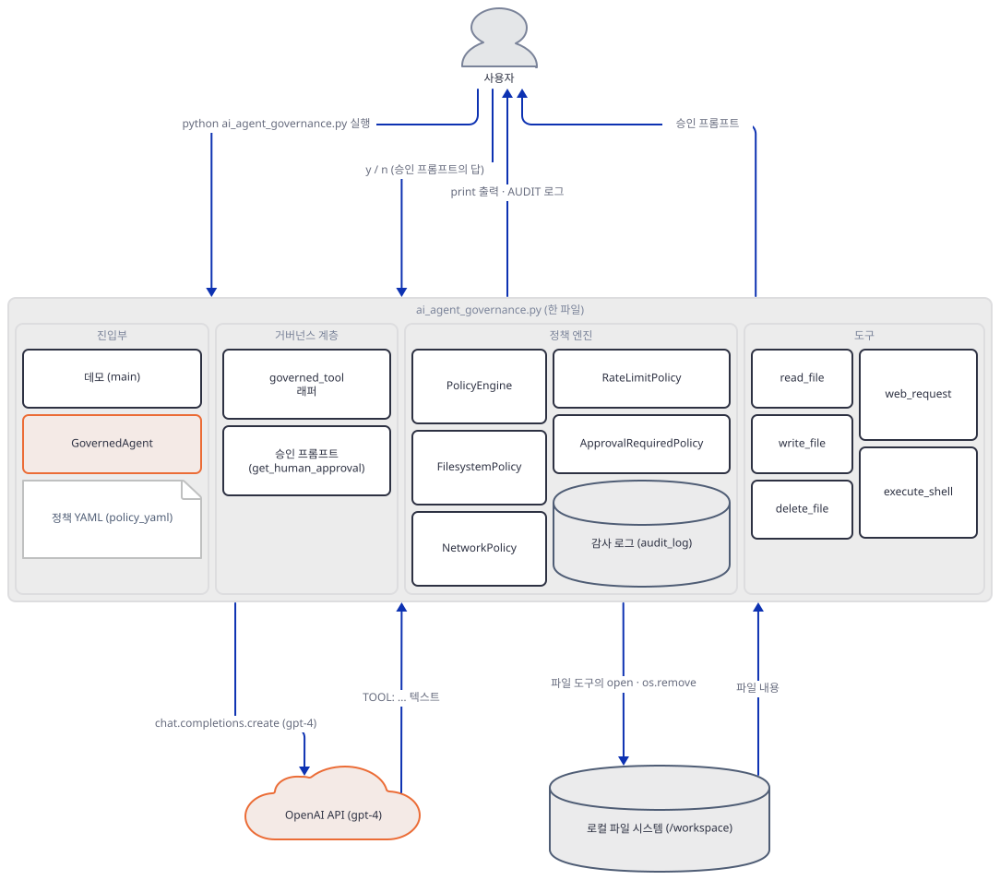

**확인.** 키 없는 셸에서 진짜 생성자가 어디서 멈추는지 봅니다.

```bash
uv run --no-project python -c "
from ai_agent_governance import GovernedAgent, PolicyEngine
try:
    GovernedAgent(PolicyEngine())
except Exception as e:
    print(type(e).__module__ + '.' + type(e).__name__ + ':', e)
"
```

직접 확인한 출력:

```
openai.OpenAIError: Missing credentials. Please pass an `api_key`, `workload_identity`, `admin_api_key`, or set the `OPENAI_API_KEY` or `OPENAI_ADMIN_KEY` environment variable.
```

`main()`은 `os.getenv("OPENAI_API_KEY")`로 먼저 막아(`ai_agent_governance.py:589`) 이 예외까지 오지 않습니다. 이제 `OpenAI`를 `unittest.mock`으로 갈아 끼워 `create`가 준비한 문장을 돌려주게 하고 같은 `GovernedAgent`를 태웁니다. 어떤 요청도 나가지 않으며 모델의 실제 응답은 확인하지 못했습니다. 아래 문장은 시스템 프롬프트가 요구한 형식에 맞춰 제가 만든 것입니다.

```bash
uv run --no-project python -c "
import logging
logging.getLogger('ai_agent_governance').setLevel(logging.WARNING)
from types import SimpleNamespace
from unittest.mock import patch
import ai_agent_governance as g
engine = g.PolicyEngine.from_yaml('policies:\n  network:\n    allowed_domains: [api.github.com]\n')
def reply(text):
    return SimpleNamespace(choices=[SimpleNamespace(message=SimpleNamespace(content=text))])
def tool(name, arg, value):
    return 'TOOL: ' + name + '(' + arg + '=' + chr(34) + value + chr(34) + ')'
with patch.object(g, 'OpenAI'):
    agent = g.GovernedAgent(engine)
    create = agent.client.chat.completions.create
    for text in [
        tool('web_request', 'url', 'https://api.github.com/users/octocat'),
        tool('web_request', 'url', 'https://evil.example/x'),
        tool('web_request', 'url', 'https://api.github.com/search?q=a, b'),
        tool('nuke_disk', 'path', '/'),
        'No tool needed.',
    ]:
        create.return_value = reply(text)
        print('run() ->', agent.run('(demo request)'))
    kw = create.call_args.kwargs
    print(kw['model'], kw['max_tokens'], [m['role'] for m in kw['messages']], 'tools' in kw)
"
```

직접 확인한 출력:

```

🤖 Agent response: TOOL: web_request(url="https://api.github.com/users/octocat")
✅ ALLOWED: Domain 'api.github.com' is in allowlist
run() -> Tool result: Simulated response from https://api.github.com/users/octocat

🤖 Agent response: TOOL: web_request(url="https://evil.example/x")
run() -> ❌ DENIED: Domain 'evil.example' not in allowlist

🤖 Agent response: TOOL: web_request(url="https://api.github.com/search?q=a, b")
✅ ALLOWED: Domain 'api.github.com' is in allowlist
run() -> Tool result: Simulated response from https://api.github.com/search?q=a

🤖 Agent response: TOOL: nuke_disk(path="/")
run() -> Unknown tool: nuke_disk

🤖 Agent response: No tool needed.
run() -> No tool needed.
gpt-4 500 ['system', 'user'] False
```

허용된 URL은 흉내 응답을 돌려주고, 목록에 없는 도메인은 `❌ DENIED`로 끝납니다. 셋째 문장의 `q=a, b`는 쉼표와 공백 때문에 `", "`로 잘려 `q=a`만 실행됩니다. 해석기가 값 안의 쉼표를 알아보지 못합니다. 이어서 이름 없는 도구와 `TOOL:`이 없는 답이 그대로 나오고, 마지막 줄은 `create`가 `gpt-4`, `max_tokens=500`, 메시지 둘(`system`·`user`)로 불렸고 `tools` 인자는 없었음을 보여 줍니다.

## 요청 한 건이 흐르는 과정

실제로 돌려 본 것은 키 없는 경로뿐이라, 이 시퀀스는 LLM 데모의 요청 한 건을 소스에서 따라간 것입니다(소스로 확인). 앱 README의 예시 요청 `Delete /workspace/temp.txt`를 골랐습니다. `demo_requests`에는 없지만(`ai_agent_governance.py:596-600`) 규칙 넷을 모두 지나고 사람 승인까지 받아 가장 많은 부품을 거칩니다. `/workspace/temp.txt`가 미리 있다고 가정합니다. 데모는 이 파일을 만들지 않으므로 없으면 여섯째 장의 `os.remove`가 실패해 Windows에서는 `Tool error: [WinError 2] ...`가 돌아옵니다(직접 확인). 시험 케이스와 감사표는 이 요청 앞에서 이미 끝났고, 모델의 응답 문장은 시스템 프롬프트가 요구한 형식에 맞춘 예이며, 그림의 출력 문구에서는 이모지를 뺐습니다. 메시지 34개를 여섯 장으로 나눈 것은 `extra-*` 그림의 세로 상한(1000px)이 한 장에 메시지 8~9개까지만 허락하고, 넷째·다섯째 장을 합친 8개짜리도 배우를 어떻게 세워도 수명선이 다른 메시지의 글자를 지나거나 폭이 상한(1200px)을 넘습니다(직접 확인: 배우 순서 120개 중 116개는 수명선이 글자를 지나고 4개는 폭이 1354px). 나눈 구간은 시간순으로 이어집니다. 고리 모양 화살표는 배우가 자기 안에서 하는 처리(파싱, 허용 기억, 시각 기록)입니다. 첫 장은 요청과 LLM 호출입니다. 스크립트가 요청을 찍고(`ai_agent_governance.py:603`) `run`이 시스템 프롬프트와 요청을 `gpt-4`에 보내 `TOOL:` 문장을 받습니다.

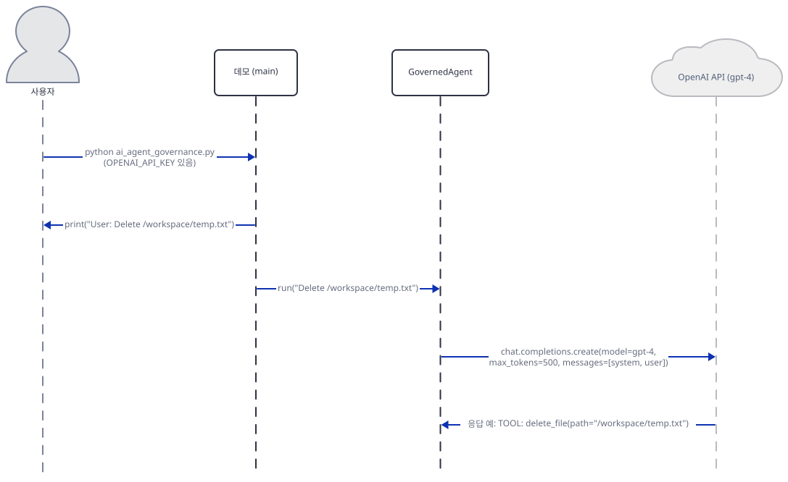

둘째 장은 응답 해석과 첫 규칙입니다. `run`이 응답을 화면에 찍고(`ai_agent_governance.py:472`) `TOOL:` 뒤 첫 줄을 파싱해 `delete_file`을 부르면 래퍼가 `Action`을 만들어 엔진에 묻고, 엔진은 첫 규칙 `FilesystemPolicy`를 부릅니다. 경로가 `/workspace` 안이라 ALLOW지만 엔진은 기억만 하고 다음으로 넘어갑니다.

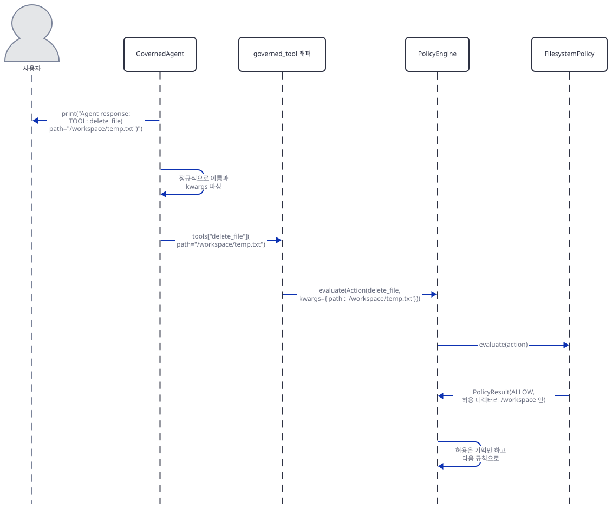

셋째 장은 나머지 규칙입니다. `NetworkPolicy`(주소 키 없음)와 `RateLimitPolicy`(한도 미만, 시각만 기록)는 `None`이고 `ApprovalRequiredPolicy`가 `REQUIRE_APPROVAL`을 내 기억해 둔 ALLOW를 이깁니다.

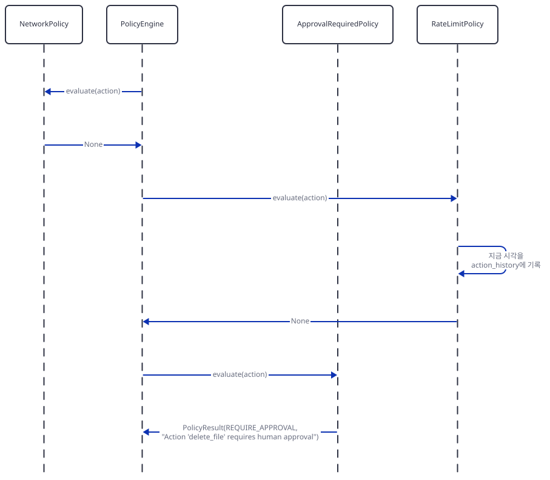

넷째 장은 기록과 결정 전달입니다. 엔진이 결정(`REQUIRE_APPROVAL`)을 `audit_log`에 더하고 `AUDIT:` 줄을 표준에러로 찍은 뒤 래퍼에 돌려줍니다. 규칙 하나가 DENY를 냈다면 엔진은 둘째 장에서 곧바로 이 장으로 왔을 것이고, 래퍼는 다섯째 장의 승인과 여섯째 장의 실행 없이 `PolicyViolation`을 던집니다(`ai_agent_governance.py:257-258`, `ai_agent_governance.py:370-371`). 이때 여섯째 장은 반환 절반만 일어나고, `Tool result:` 없이 예외 메시지 문자열이 그대로 `main`까지 갑니다(`ai_agent_governance.py:504-505`, Step 7의 `❌ DENIED` 출력).

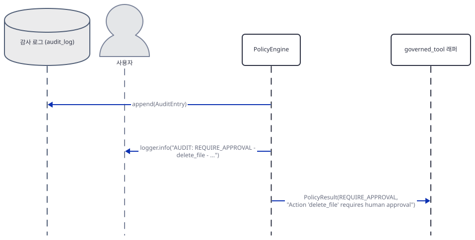

다섯째 장은 사람 승인입니다. 래퍼가 승인 프롬프트를 부르면 프롬프트가 요청 내용을 찍고 `input()`으로 기다립니다. `y`이면 `True`가 돌아가고, 아니면 `False`라 래퍼가 `PolicyViolation`을 던져 여섯째 장의 실행 없이 반환 절반만 예외 메시지와 함께 일어납니다.

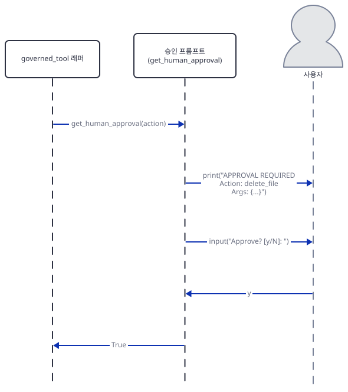

여섯째 장은 실행과 반환입니다. 래퍼가 `✅ ALLOWED`를 찍고 원래 `delete_file`을 부르면 이 함수가 `os.remove`로 파일을 지웁니다. 도구의 문자열은 래퍼에서 `GovernedAgent`로, 거기서 `main`으로 돌아오며 `Tool result:`가 붙고, `main`이 결과를 찍습니다(`ai_agent_governance.py:604-605`).

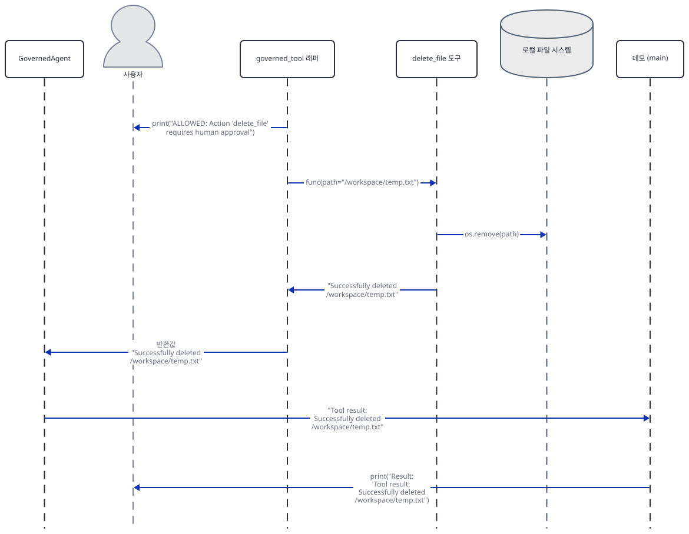

## 실행 체크리스트

- [ ] `uv venv`와 `uv pip install -r requirements.txt`로 앱 폴더에 환경을 만들었다
- [ ] `compiled`와 `import ok`를 확인했다
- [ ] Step 2의 경로 확인에서 `/workspace-evil/x`가 `allow`, `/homework/x`가 `deny`로 나오는 것을 봤다
- [ ] Step 3에서 한도 2의 세 번째 호출이 `deny`이고 기록이 2에 머무는 것을 봤다
- [ ] Step 4에서 `delete_file`이 `require_approval`, `execute_code`가 `allow default`로 나오는 것을 봤다
- [ ] Step 5에서 승인 `n`이면 파일이 남고 `y`이면 지워지며, 두 경우 감사 로그가 같다는 것을 봤다
- [ ] Step 6에서 흉내 도구 둘이 문자열만 돌려주는 것을 봤다
- [ ] (`/workspace`가 없는지 확인했고 폴더가 생겨도 괜찮다면) `uv run --no-project python ai_agent_governance.py`를 두 번 돌려 첫 실행에서만 `[Errno 2]`가 나는 것을 보고, 원래 없던 폴더를 지웠다
- [ ] Step 7의 가짜 응답으로 `q=a, b`가 `q=a`로 잘려 실행되는 것을 봤다

## 문제 해결

| 증상 | 원인 | 해결 |
|---|---|---|
| 앱을 파이프로 받아 실행하면 첫 `print`에서 `UnicodeEncodeError: 'cp949' codec can't encode character '\U0001f6e1' in position 0: illegal multibyte sequence`(`ai_agent_governance.py:515`) | 앱이 이모지를 찍는데 표준출력이 파이프일 때 Python은 콘솔이 아니라 로캘의 기본 인코딩을 쓰고, Windows에서는 그 `cp949` 등이 이모지를 못 쓴다(직접 확인: 파이프로 받으면 `sys.stdout.encoding`과 `locale.getpreferredencoding()`이 모두 `cp949`) | `PYTHONIOENCODING=utf-8`을 설정한다(사전 준비) |
| `/workspace`가 없는 상태의 첫 실행에서 `write_file`이 `✅ ALLOWED` 다음에 `Error: [Errno 2] No such file or directory: '/workspace/report.md'` | `/workspace`가 다섯째 케이스에서야 만들어진다(`ai_agent_governance.py:569-572`). 정책 통과와 파일 쓰기 성공은 별개다. 폴더가 이미 있으면 이 오류 대신 `report.md`와 `data.txt`가 말없이 덮어써진다(직접 확인) | 두 번째 실행부터 성공한다. 먼저 폴더가 있는지 확인하고(Step 6), 폴더가 싫다면 데모 명령은 건너뛰고 출력만 읽는다 |
| `DeprecationWarning: datetime.datetime.utcnow() is deprecated ...`가 세 번 뜬다 | Python 3.12부터 폐기 예정인 API를 쓴다(`ai_agent_governance.py:50`, `ai_agent_governance.py:198`, `ai_agent_governance.py:276`). 3.11.12에서는 경고가 없었다(직접 확인) | 무시하거나 3.11로 실행한다. 복사본에서 `datetime.now(timezone.utc)`로 바꿔 볼 수 있다 |
| `GovernedAgent(...)`가 `openai.OpenAIError: Missing credentials ...` | `OpenAI()`가 키를 요구한다(`ai_agent_governance.py:443`). `main()`은 `os.getenv`로 먼저 막아 이 예외까지 오지 않는다(직접 확인) | 키를 설정하거나 Step 7처럼 `OpenAI`를 갈아 끼운다 |
| 앱 README의 `tools:`(`allowed`·`denied`) 절을 넣어도 `execute_code`·`send_email`이 막히지 않는다 | `from_yaml`은 `filesystem`·`network`·`execution`만 읽는다(`ai_agent_governance.py:305-326`, Step 4에서 직접 확인) | 직접 규칙을 만들어 잇는다(더 해보기) |
| 앱 README의 "Example Output"과 실제 출력이 다르다 | 예시는 `/etc/passwd`에 `outside allowed directories`를 붙이지만(`README.md:94-97`) 이 코드는 `matches denied pattern '/etc'`를 낸다(`outside allowed directories`는 `/var/log/syslog` 같은 경로에 나온다, Step 2에서 직접 확인). 예시의 `Loading policy: workspace_sandbox.yaml`은 코드의 `Loading policy configuration...`과 다르고 `[Y/n]`은 실제 프롬프트 `[y/N]`과 다르다(Step 5·6에서 직접 확인). `PENDING`은 앱 안에서 닿지 않는 분기(`ai_agent_governance.py:378`)의 문구다 | 예시 대신 이 문서의 출력을 기준으로 삼는다 |
| `/workspace-evil/x`가 허용되고 `/homework/x`가 거부된다 | 경로를 `startswith`로 문자열 접두사 비교한다(`ai_agent_governance.py:113`, `ai_agent_governance.py:122`, Step 2에서 직접 확인) | 경로 성분 단위로 비교한다(더 해보기) |

## 더 해보기

- 복사본에서 접두사 비교를 `os.path.commonpath`로 고쳐(`ai_agent_governance.py:113`, `ai_agent_governance.py:122`) Step 2의 마지막 명령을 다시 돌려, `/workspace-evil/x`가 `deny`로 바뀌는지 확인해 보세요.
- 승인 결과를 감사 로그에 남기도록 고쳐 보세요. 지금은 Step 5처럼 `y`와 `n`의 감사 로그가 같습니다(`ai_agent_governance.py:273-297`). Day 090의 해시체인처럼 항목을 바꾸면 알아채도록 만드는 것도 도전할 만합니다.
- 앱 README가 약속한 `tools.allowed`·`tools.denied`를 `PolicyRule` 하위 클래스로 만들고 `from_yaml`(`ai_agent_governance.py:305-326`)에 이어, Step 4의 `send_email`이 `deny`가 되게 해 보세요.

## 다음 날 예고

[Day 100 · 🛒 AI Customer Support Agent with Memory](../day100-ai-customer-support-agent/README.md) — `gpt-4`와 Mem0·Qdrant로 과거 상호작용을 기억하는 Streamlit 고객지원 에이전트를 다룹니다(앱 README는 GPT-4o라고 적지만 코드는 `gpt-4`입니다).
