# Day 100 · 🛒 AI Customer Support Agent with Memory

> 볼륨 7 🚀 Advanced AI Agents · 난이도 ★★☆ ⚠(`qdrant-client` 1.16 이상에서는 첫 질문부터 막히고, 앱의 `gpt-4`는 2026-10-23 종료 예정) · 예상 소요 110분(Step마다 확인용 파일의 장면을 돌려 보고, 설치 환경을 한 번 고친 뒤 같은 장면을 다시 돌려 앞뒤를 비교하며, 시퀀스 그림 열세 장을 따라가는 손 시간이 읽는 시간만큼 듭니다) · API 비용 대략 합성 데이터 한 번에 $0.05, 대화 한 턴에 $0.02 안팎 — `gpt-4` 입력 $30·출력 $60, `gpt-4o-mini` 입력 $0.15·출력 $0.60, 임베딩 $0.02(모두 1M 토큰당, OpenAI 모델 페이지를 2026-10-05에 WebFetch로 확인한 요약)에, mem0가 보내는 프롬프트의 실제 글자 수(추출 약 3,400자, 판단 약 7,800자, 가짜 서버가 받은 값)와 가정한 `gpt-4` 출력 길이(한 턴 150토큰, 합성 데이터 700토큰)를 대입한 값이고 키가 없어 실제 토큰 수는 재지 못했습니다(이 문서의 확인 장면은 가짜 응답이라 무료) · 원본 앱: `advanced_ai_agents/single_agent_apps/ai_customer_support_agent`

## 오늘 만들 것

고객 ID마다 과거 대화와 주문 정보를 기억해 두었다가 답할 때 꺼내 쓰는 고객지원 챗봇입니다. 앱은 `customer_support_agent.py` 한 파일(편집기 기준 206줄)이고, Streamlit 화면에서 `gpt-4`가 가상의 전자제품 쇼핑몰 TechGadgets.com 상담원으로 답합니다. 질문이 들어오면 mem0가 그 고객의 기억을 Qdrant에서 찾아 프롬프트 앞에 붙이고, 답이 나오면 질문과 답을 다시 기억에 씁니다. 사이드바의 "Generate Synthetic Data" 버튼은 `gpt-4`에게 가상 고객 프로필과 주문 이력을 JSON으로 만들게 하고 그 항목을 하나씩 기억에 넣어 데모용 기억을 만듭니다.

검색 → 프롬프트 → 답 → 저장이라는 고리는 Day 075의 여행 에이전트와 같습니다. 오늘 앱은 그 고리를 `CustomerSupportAIAgent` 클래스로 묶고 모든 호출을 `try/except`와 `st.error`로 감쌌습니다. 화면에 입력한 키를 `os.environ`에 실어 mem0가 보게 한 것(Day 075 앱은 그러지 않아 Step 3에서 막혔습니다)과, mem0 설정에 `"version": "v1.1"`을 더해 `search()`·`get_all()`이 `{"results": [...]}`를 돌려주게 한 것도 다릅니다. 마지막 한 줄은 상류 저장소의 수정 커밋(`b96d19a`, 커밋 메시지로 확인)이 더했고, 덕분에 Day 073·075가 겪은 `"results" in memories`가 항상 거짓인 문제가 이 앱에는 없습니다.

그래도 오늘(2026-10-05) 설치 그대로는 첫 질문에서 막힙니다. `requirements.txt`가 `qdrant-client`를 고정하지 않아 1.19.1이 깔리는데, mem0ai 0.1.29의 Qdrant 래퍼가 부르는 `QdrantClient.search()`가 1.16.0부터 없습니다. Day 073·075가 본 문제와 같고, 메서드가 사라지는 경계가 1.15.1과 1.16.0 사이임을 오늘 패키지 소스로 확인했습니다. 클라이언트 클래스의 문제라 Qdrant 서버가 어디에 있든 같습니다. 이 앱은 그 `AttributeError`를 `except`로 삼켜 빨간 배너와 정해진 사과문만 보여 주므로, 화면만 보면 오류가 났다는 것밖에 알 수 없습니다. 또 하나, 앱이 `gpt-4`를 부르는 두 곳은 OpenAI의 폐기 안내(https://developers.openai.com/api/docs/deprecations, 2026-10-05에 WebFetch로 받은 표)에 2026년 10월 23일 종료로 올라 있습니다. 오늘로부터 18일 뒤입니다.

이 문서는 키도 Docker도 쓰지 않습니다. Step 2에서 만드는 확인용 파일 `day100_check.py`가 OpenAI 서버와 Qdrant 서버 자리만 가짜로 바꿔 끼우고, 앱 코드와 Streamlit·mem0 코드는 그대로 태웁니다. 그래서 아래의 "직접 확인"은 가짜 응답으로 본 앱의 동작이고, 실제 `gpt-4`의 답과 실제 Qdrant 서버는 확인하지 못했습니다.

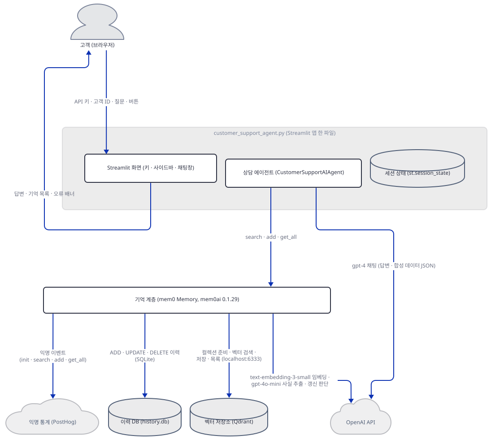

## 사전 준비

| 서비스/도구 | 용도 | 발급·설치 |
|---|---|---|
| OpenAI API 키 | 화면에서 입력한 키 하나가 앱의 `gpt-4`(답변·합성 데이터)와 mem0 안의 `gpt-4o-mini`(사실 추출·갱신 판단)·`text-embedding-3-small`(임베딩)에 함께 쓰인다. 이 문서의 확인에는 필요 없다 | https://platform.openai.com/api-keys 에서 발급해 화면의 "Enter OpenAI API Key" 입력창에 붙여 넣는다. `gpt-4`는 2026-10-23에 종료 예정이다 |
| Qdrant (`localhost:6333`) | mem0가 고객별 기억을 저장하는 벡터 저장소. 코드에 주소가 박혀 있다 | 앱 README의 Docker 안내를 따른다. 그 `docker run`은 `-v "$(pwd)/qdrant_storage:/qdrant/storage:z"`로 현재 폴더에 저장소를 두므로 앱 폴더에서 실행하면 저장소 안에 `qdrant_storage/`가 생길 수 있고, 이 폴더는 `.gitignore`에 없다(`git check-ignore`가 아무것도 내지 않음, 직접 확인). 이 문서는 Docker를 띄우지 않고 `qdrant-client`의 `:memory:` 저장소로 그 자리만 대신한다 |
| `MEM0_DIR`·`MEM0_TELEMETRY` (선택) | `import mem0`가 홈의 `~/.mem0/`를 만들고 PostHog로 익명 통계를 보내는 것을 막는다(Day 073 Step 1) | Step 2의 확인용 파일이 대신 정한다. 앱을 직접 띄울 때의 값은 Step 7 |
| uv · Python | 가상환경과 패키지 설치 | [공통 사전 준비](../README.md#공통-사전-준비-한-번만) 참고 |

## 아키텍처 한눈에 보기

| 컴포넌트 | 역할 | 코드 위치 |
|---|---|---|
| 고객 (브라우저) | API 키·고객 ID·질문 입력, 답변·기억 목록·오류 배너 확인 | 코드 없음 (외부 UI) |
| Streamlit 화면 | 제목·키 입력창(키 게이트), 사이드바(고객 ID와 버튼 셋), 채팅창 | `advanced_ai_agents/single_agent_apps/ai_customer_support_agent/customer_support_agent.py:8-16`, `advanced_ai_agents/single_agent_apps/ai_customer_support_agent/customer_support_agent.py:133-203`, `advanced_ai_agents/single_agent_apps/ai_customer_support_agent/customer_support_agent.py:205-206` |
| 상담 에이전트 (`CustomerSupportAIAgent`) | mem0 `Memory`와 OpenAI 클라이언트를 들고 `handle_query`·`get_memories`·`generate_synthetic_data`를 제공 | `advanced_ai_agents/single_agent_apps/ai_customer_support_agent/customer_support_agent.py:18-128`, `advanced_ai_agents/single_agent_apps/ai_customer_support_agent/customer_support_agent.py:130-131` |
| 세션 상태 (`st.session_state`) | 대화 기록 `messages`, 합성 프로필 `customer_data`, 직전 고객 ID `previous_customer_id` | `advanced_ai_agents/single_agent_apps/ai_customer_support_agent/customer_support_agent.py:135-141`, `advanced_ai_agents/single_agent_apps/ai_customer_support_agent/customer_support_agent.py:147`, `advanced_ai_agents/single_agent_apps/ai_customer_support_agent/customer_support_agent.py:156-157`, `advanced_ai_agents/single_agent_apps/ai_customer_support_agent/customer_support_agent.py:176-177`, `advanced_ai_agents/single_agent_apps/ai_customer_support_agent/customer_support_agent.py:189`, `advanced_ai_agents/single_agent_apps/ai_customer_support_agent/customer_support_agent.py:198` |
| 기억 계층 (mem0 `Memory`) | 사실 추출·임베딩·검색·저장을 도맡는 라이브러리(mem0ai 0.1.29, 패키지 소스로 확인) | `advanced_ai_agents/single_agent_apps/ai_customer_support_agent/customer_support_agent.py:21-34`, `advanced_ai_agents/single_agent_apps/ai_customer_support_agent/customer_support_agent.py:45`, `advanced_ai_agents/single_agent_apps/ai_customer_support_agent/customer_support_agent.py:66-67`, `advanced_ai_agents/single_agent_apps/ai_customer_support_agent/customer_support_agent.py:77` |
| OpenAI API | 앱의 `gpt-4` 채팅(답변·합성 데이터)과 mem0 안의 `gpt-4o-mini`·`text-embedding-3-small` | `advanced_ai_agents/single_agent_apps/ai_customer_support_agent/customer_support_agent.py:39`, `advanced_ai_agents/single_agent_apps/ai_customer_support_agent/customer_support_agent.py:56-62`, `advanced_ai_agents/single_agent_apps/ai_customer_support_agent/customer_support_agent.py:99-105` |
| Qdrant (`localhost:6333`) | 벡터 저장소, 기본 컬렉션 `mem0` | `advanced_ai_agents/single_agent_apps/ai_customer_support_agent/customer_support_agent.py:22-28` (서버는 외부 프로세스) |
| `history.db` (SQLite) | mem0가 기억의 변경(ADD 등)을 적는 이력 | 코드 없음 (mem0 내부, 위치는 `MEM0_DIR`) |
| PostHog | mem0의 익명 사용 통계 | 코드 없음 (mem0 내부) |

완성 그림은 외부와 맞닿는 화살표만 그렸습니다. 화면이 에이전트와 세션 상태를 부르는 파일 안쪽의 호출은 따로 그렸습니다.

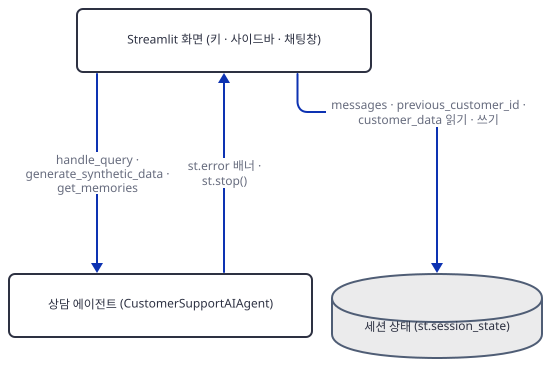

## 단계별 진행

### Step 1. 환경 만들기 — 의존성 셋, 오늘 해석되는 버전

**목적.** 앱의 의존성을 설치하고, 오늘 실제로 어떤 버전이 깔리는지, 고정되지 않은 `qdrant-client`가 무엇인지 확인합니다.

**할 일.** 앱 폴더 안에 독립 가상환경을 만들고 설치합니다.

```bash
cd advanced_ai_agents/single_agent_apps/ai_customer_support_agent
uv venv
uv pip install -r requirements.txt
```

(pip 대안: `python -m venv .venv && source .venv/bin/activate && pip install -r requirements.txt`. Windows PowerShell은 활성화만 `.venv\Scripts\Activate.ps1`로 바꿉니다.) 이 저장소는 루트에 `pyproject.toml`이 있어 `uv run`이 방금 만든 환경 대신 루트 환경을 쓸 수 있으므로, 이후 `uv run` 명령에는 모두 `--no-project`를 붙입니다.

`advanced_ai_agents/single_agent_apps/ai_customer_support_agent/requirements.txt:1-3`

```text
streamlit 
openai
mem0ai==0.1.29
```

세 줄이지만 마지막 줄에 개행이 없어 `wc -l`은 2로 셉니다. 첫 줄 끝에는 공백이 하나 있습니다. 이 파일은 Day 073·075 앱의 `requirements.txt`와 바이트 단위로 같습니다(`cmp`로 확인). 세 줄 가운데 버전을 고정한 것은 `mem0ai` 하나이고, mem0ai 0.1.29는 자기 의존성으로 `openai`를 `>=1.33.0,<2.0.0`, `qdrant-client`를 `>=1.9.1,<2.0.0`으로만 묶습니다. 그래서 오늘은 그 범위 안에서 uv가 고른 최신 버전이 들어옵니다.

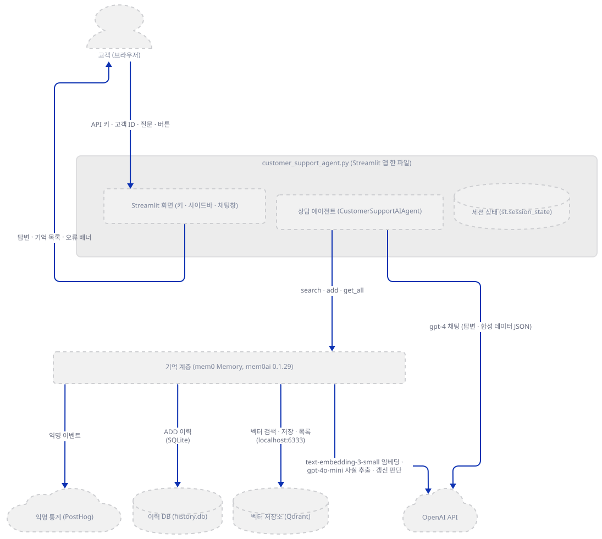

**확인.** 버전과 mem0ai가 선언한 요구 범위를 봅니다. `import mem0` 없이 설치된 패키지의 메타데이터만 읽으므로 홈에 아무것도 만들지 않습니다.

```bash
uv run --no-project python -c "
import sys
import importlib.metadata as m
print('python', sys.version.split()[0])
for p in ('streamlit', 'openai', 'mem0ai', 'qdrant-client'):
    print(p, m.version(p))
print([r for r in m.requires('mem0ai') if r.startswith(('qdrant', 'openai'))])
"
```

직접 확인한 출력(2026-10-05):

```
python 3.13.3
streamlit 1.65.0
openai 1.109.1
mem0ai 0.1.29
qdrant-client 1.19.1
['openai (>=1.33.0,<2.0.0)', 'qdrant-client (>=1.9.1,<2.0.0)']
```

`qdrant-client`는 1.19.1입니다. 이 버전에 `search` 메서드가 있는지, 그 뒤에 생긴 `query_points`는 있는지 봅니다.

```bash
uv run --no-project python -c "
from qdrant_client import QdrantClient
print('search' in dir(QdrantClient), 'query_points' in dir(QdrantClient))
"
```

```
False True
```

`search`가 없습니다. 이것이 Step 4에서 실제로 터집니다. 앱 파일이 컴파일되는지, 줄 수가 이 문서가 인용하는 번호와 맞는지도 봅니다.

```bash
uv run --no-project python -m py_compile customer_support_agent.py && echo compiled
uv run --no-project python -c "
print(len(open('customer_support_agent.py', encoding='utf-8').read().splitlines()))
"
```

```
compiled
```

```
206
```

206줄입니다. 마지막 줄에 개행이 없어 `wc -l`은 205로 세므로, 이 문서의 줄 번호는 편집기와 GitHub에서 보이는 206줄 기준입니다.

### Step 2. 화면 뼈대와 키 게이트 — 확인용 파일을 만든다

**목적.** 화면의 첫 줄들과 키 게이트(`if openai_api_key:`)가 무엇을 감싸는지, 입력한 키가 어디로 흘러 들어가는지 확인하고, 이 문서의 모든 확인에 쓰는 확인용 파일을 만듭니다.

**할 일.** 파일 맨 위의 제목·캡션·키 입력창과 그 게이트입니다.

`advanced_ai_agents/single_agent_apps/ai_customer_support_agent/customer_support_agent.py:8-16`

```python
# Set up the Streamlit App
st.title("AI Customer Support Agent with Memory 🛒")
st.caption("Chat with a customer support assistant who remembers your past interactions.")

# Set the OpenAI API key
openai_api_key = st.text_input("Enter OpenAI API Key", type="password")

if openai_api_key:
    os.environ['OPENAI_API_KEY'] = openai_api_key
```

16행부터 203행까지, 곧 클래스·사이드바·채팅창 전부가 15행의 `if` 안에 들여쓰기로 들어 있습니다. 끝의 `else`가 키가 비었을 때의 경고입니다.

`advanced_ai_agents/single_agent_apps/ai_customer_support_agent/customer_support_agent.py:205-206`

```python
else:
    st.warning("Please enter your OpenAI API key to use the customer support agent.")
```

16행의 `os.environ['OPENAI_API_KEY'] = openai_api_key`가 이 앱의 핵심 연결입니다. 뒤에서 `OpenAI()`(39행)와 mem0가 안에서 만드는 OpenAI 클라이언트가 모두 이 환경변수를 읽습니다. Day 075의 앱이 키를 환경변수에 싣지 않아 mem0가 키를 못 봤던 것과 반대입니다. 환경변수는 프로세스 전체의 것이라 같은 Streamlit 서버에 접속한 모든 세션이 이 한 값을 공유하게 됩니다(소스로 확인).

3행의 `from mem0 import Memory`는 키 게이트 밖에 있습니다. 그래서 키를 넣기 전 첫 화면에서도 mem0가 불러와지고, mem0는 불러오는 순간 홈에 `~/.mem0/`를 만듭니다(Day 073 Step 1). 이 앱의 첫 화면만으로 그렇게 되는지 `MEM0_DIR` 없이 홈을 임시 폴더로 돌려 직접 확인했고, `.mem0/config.json`이 생겼습니다. 아래 확인용 파일이 맨 위에서 `MEM0_DIR`과 `MEM0_TELEMETRY`를 정하는 이유입니다.

확인용 파일은 앱이 아니라 이 문서의 도구입니다. 앱 폴더에 `day100_check.py`로 저장하세요(저장소에 올릴 파일이 아니라 `git status`에 보이면 지우면 됩니다). `FakeOpenAI`가 앱의 `OpenAI()`와 mem0 안의 클라이언트 자리에 들어가 요청을 받아 기록하고 준비한 답을 돌려줍니다. `Redirect`는 앱이 `localhost:6333`으로 만드는 Qdrant 클라이언트를 프로세스 안의 저장소 하나로 바꿔 서버를 흉내 냅니다. 그 밖의 앱 코드, mem0 코드, Streamlit은 그대로 돌고, Streamlit의 `AppTest`가 브라우저 없이 화면을 조작합니다. 답의 내용은 제가 만든 것이고, 진짜 `gpt-4`가 어떻게 답하는지는 확인하지 못했습니다.

```python
"""day100_check.py - 확인용 하니스(앱이 아니라 이 문서의 도구).
앱 폴더에서: uv run --no-project python day100_check.py <장면>
장면: nokey noqdrant memory chat synth fence sidebar   (둘째 인자로 고친 복사본의 파일 이름을 줄 수 있다)
앱 코드는 그대로 두고, OpenAI 서버와 Qdrant 서버 자리만 가짜로 바꿔 끼운다.
"""
import ast, inspect, json, logging, os, socket, sys, tempfile, types, zlib
from collections import Counter

sys.stdout.reconfigure(encoding='utf-8')
TMP = tempfile.TemporaryDirectory(prefix='day100-mem0-', ignore_cleanup_errors=True)
os.environ['MEM0_DIR'] = TMP.name          # import mem0 전에 정해야 홈의 ~/.mem0를 건드리지 않는다
os.environ['MEM0_TELEMETRY'] = 'False'     # mem0의 PostHog 익명 통계 끄기
SCENE = sys.argv[1]
APP = os.path.abspath(sys.argv[2] if len(sys.argv) > 2 else 'customer_support_agent.py')   # 고친 복사본을 시험할 때만 둘째 인자
FENCE = '`' * 3                           # 백틱 셋(코드 펜스 표시)
CALLS, SENT = [], []                       # 가짜 OpenAI가 받은 호출, mem0가 사실 추출에 보낸 입력
PROFILE = {'customer_name': 'Alice Kim', 'email': 'alice.kim@example.com',
           'shipping_address': '12 Maple Street, Springfield',
           'recent_order': {'order_number': 'TG-4417', 'product': 'UltraBook Pro 14', 'price': '$1,899.00'},
           'previous_orders': [{'order_number': 'TG-1180', 'product': 'NoiseCancel Headphones X2'},
                               {'order_number': 'TG-2290', 'product': '4K Webcam Studio'}],
           'service_interactions': [{'topic': 'Ear cushion replacement'}, {'topic': 'Webcam driver question'}],
           'preferences': 'Prefers premium audio gear'}

class FakeOpenAI:                          # 앱의 OpenAI()와 mem0 안의 클라이언트가 모두 이 클래스를 받는다
    def __init__(self, *a, **k):
        self.chat = types.SimpleNamespace(completions=types.SimpleNamespace(create=self._chat))
        self.embeddings = types.SimpleNamespace(create=self._embed)
    def _embed(self, input, model, **k):
        CALLS.append(('임베딩', model))
        vec = [0.0] * 1536
        for w in input[0].lower().split():
            vec[zlib.crc32(w.encode()) % 1536] += 1.0   # 단어가 겹치면 가까워지는 가짜 임베딩
        return types.SimpleNamespace(data=[types.SimpleNamespace(embedding=vec)])
    def _chat(self, model, messages, **k):
        system, user = messages[0]['content'], messages[-1]['content']
        if system.startswith('You are a Personal Information Organizer'):     # mem0: 사실 추출
            SENT.append(user.split('Input: ', 1)[1].strip())
            kind, text = 'mem0 사실 추출', json.dumps({'facts': [user.split('user: ', 1)[1].strip()]})
        elif user.startswith('You are a smart memory manager'):               # mem0: 갱신 판단
            facts = ast.literal_eval(user.split(FENCE)[1].strip())
            kind, text = 'mem0 갱신 판단', json.dumps({'memory': [{'id': str(i), 'text': f, 'event': 'ADD'} for i, f in enumerate(facts)]})
        elif system.startswith('You are a data generation AI'):               # 앱: 합성 데이터
            kind, text = '합성 데이터', json.dumps(PROFILE)
            if SCENE == 'fence':
                text = FENCE + 'json\n' + text + '\n' + FENCE                      # 코드 펜스로 감싼 답
        else:                                                                 # 앱: 상담 답변
            got = [l[2:] for l in user.split('\n') if l.startswith('- ')]
            kind, text = '답변', f'(가짜 gpt-4) 기억 {len(got)}개를 받았습니다' + (f', 첫째: {got[0]}' if got else '')
        CALLS.append((kind, model))
        msg = types.SimpleNamespace(content=text, tool_calls=None)
        return types.SimpleNamespace(choices=[types.SimpleNamespace(message=msg)])

import openai, qdrant_client
openai.OpenAI = FakeOpenAI                 # 반드시 앱과 mem0를 불러오기 전에
if SCENE != 'noqdrant':                    # 6333의 Qdrant 서버 대신 프로세스 안의 저장소 하나를 쓴다
    Real = qdrant_client.QdrantClient
    store = Real(location=':memory:')
    class Redirect(Real):
        def __new__(cls, *a, **k):
            return store if k.get('port') == 6333 else super().__new__(cls)
    qdrant_client.QdrantClient = Redirect

from mem0 import Memory
BUILT = []                                 # 앱이 Memory.from_config에 넘긴 설정을 모은다
real_from_config = Memory.from_config.__func__
Memory.from_config = classmethod(lambda cls, cfg: (BUILT.append(cfg), real_from_config(cls, cfg))[1])
from streamlit.testing.v1 import AppTest
for name in list(logging.root.manager.loggerDict):      # Streamlit의 '베어 모드' 경고 숨기기
    if name.startswith('streamlit'):
        logging.getLogger(name).setLevel(logging.ERROR)

def start(customer=None):                  # 화면에 키를 입력하고, 고객 ID도 넣는다
    at = AppTest.from_file(APP, default_timeout=60).run()
    at.text_input[0].input('sk-test').run()
    if customer:
        at.sidebar.text_input[0].input(customer).run()
    return at

def click(at, label):                      # 사이드바 버튼 누르기
    next(b for b in at.sidebar.button if b.label == label).click().run()

def calls():                               # 마지막 확인 이후 가짜 OpenAI가 받은 호출
    c = Counter(CALLS); CALLS.clear()
    return ' · '.join(f'{k[0]}({k[1]}) {v}' for k, v in c.items()) or '없음'

def banners(at):
    for e in at.error:
        print('  오류 배너:', e.value)

def notes(at):                             # 본문에 '- 기억' 줄로 그려진 항목
    return sorted(m.value for m in at.main.markdown if m.value.startswith('- '))

if SCENE == 'nokey':
    at = AppTest.from_file(APP).run()
    print('입력창', len(at.text_input), '개 / 경고:', at.warning[0].value, '/ 사이드바 위젯', len(at.sidebar))
elif SCENE == 'noqdrant':
    try:
        socket.create_connection(('localhost', 6333), timeout=1).close()
        sys.exit('localhost:6333에 이미 무엇인가 떠 있어 건너뜁니다')
    except OSError:
        pass
    at = start()
    banners(at)
    print('앱이 심은 OPENAI_API_KEY:', os.environ.get('OPENAI_API_KEY'), '/ 사이드바 위젯', len(at.sidebar))
elif SCENE == 'memory':
    at = start()
    banners(at)
    print('넘어간 설정:', json.dumps(BUILT[0]))
    vectors = store.get_collection('mem0').config.params.vectors
    print('컬렉션:', [c.name for c in store.get_collections().collections], vectors.size, vectors.distance.value)
    print('MEM0_DIR 안:', sorted(os.listdir(os.environ['MEM0_DIR'])))
    at.sidebar.text_input[0].input('alice').run()
    click(at, 'View Memory Info')
    print('세 번 만진 뒤 Memory.from_config 호출 수:', len(BUILT))
elif SCENE == 'chat':
    at = start('alice')
    for q in ('Where is my order?', 'Is my order late?'):
        at.chat_input[0].set_value(q).run()
        print('질문:', q)
        banners(at)
        print('  답:', at.chat_message[-1].markdown[0].value)
        print('  호출:', calls())
    saved = [p.payload for p in store.scroll('mem0', limit=20, with_payload=True)[0]]
    print('Qdrant에 저장된 항목', len(saved), '개')
    if saved:
        print('mem0가 사실 추출에 보낸 입력:', SENT)
        print('페이로드 키:', sorted(saved[0]), '/ role:', sorted(p['role'] for p in saved))
    print('search 시그니처:', inspect.signature(Memory.search))
elif SCENE in ('synth', 'fence'):
    at = start('alice')
    click(at, 'Generate Synthetic Data')
    banners(at)
    print('  호출:', calls())
    if not at.error:
        click(at, 'View Customer Profile')
        print('프로필 키:', list(json.loads(at.sidebar.json[0].value)))
        click(at, 'View Memory Info')
        print('저장된 기억', len(notes(at)), '개, 예:', notes(at)[0][:60])
elif SCENE == 'sidebar':
    at = start('alice')
    at.chat_input[0].set_value('Where is my order?').run()
    print('alice 대화 기록:', len(at.session_state.messages), '개 / previous_customer_id:', at.session_state.previous_customer_id)
    at.sidebar.text_input[0].input('bob').run()
    print('bob으로 바꾼 뒤 대화 기록:', len(at.session_state.messages), '개 / previous_customer_id:', at.session_state.previous_customer_id)
    calls()
    click(at, 'View Memory Info')
    print('bob 기억 보기 -> 사이드바:', [m.value for m in at.sidebar.markdown], '/ 안내:', [i.value for i in at.sidebar.info], '/ 호출:', calls())
    at.sidebar.text_input[0].input('alice').run()
    click(at, 'View Memory Info')
    print('alice 기억 보기 -> 사이드바:', [m.value for m in at.sidebar.markdown], '/ 본문 항목', len(notes(at)), '개 / 호출:', calls())
    click(at, 'View Customer Profile')
    print('프로필 보기 ->', [i.value for i in at.sidebar.info])
```

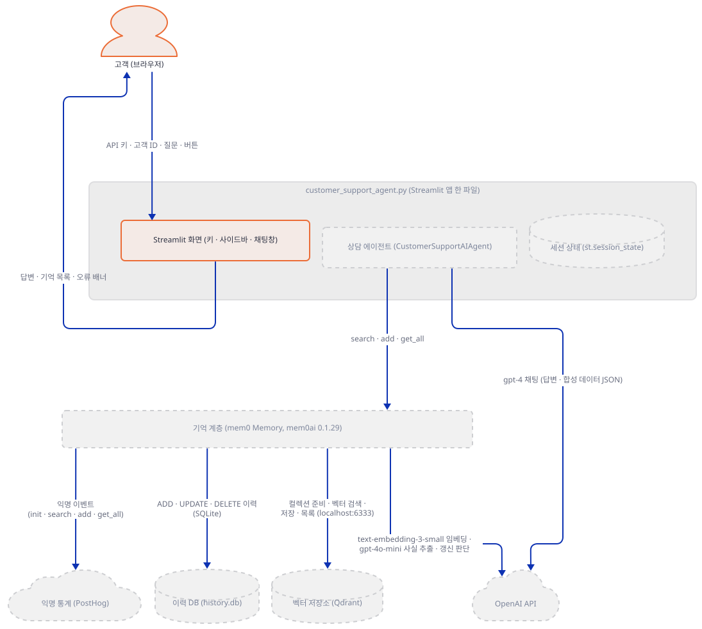

**확인.** 키를 넣기 전의 화면입니다.

```bash
uv run --no-project python day100_check.py nokey
```

직접 확인한 출력:

```
입력창 1 개 / 경고: Please enter your OpenAI API key to use the customer support agent. / 사이드바 위젯 0
```

입력창 하나와 경고뿐이고 사이드바에는 위젯이 하나도 없습니다. 클래스 정의와 `Memory` 생성은 아직 일어나지 않았습니다(18-131행이 게이트 안이라서, 소스로 확인).

### Step 3. 상담 에이전트 — 기억 계층을 설정하고 만든다

**목적.** `CustomerSupportAIAgent.__init__`이 mem0를 어떻게 설정하는지, Qdrant가 없으면 화면이 어떻게 되는지, 화면을 만질 때마다 몇 번 만들어지는지 확인합니다.

**할 일.** 클래스의 시작과 `__init__`입니다.

`advanced_ai_agents/single_agent_apps/ai_customer_support_agent/customer_support_agent.py:18-40`

```python
    class CustomerSupportAIAgent:
        def __init__(self):
            # Initialize Mem0 with Qdrant as the vector store
            config = {
                "vector_store": {
                    "provider": "qdrant",
                    "config": {
                        "host": "localhost",
                        "port": 6333,
                    }
                },
                # mem0 defaults to v1.0, whose search()/get_all() return a bare
                # list; the code below expects the v1.1 {"results": [...]} shape.
                "version": "v1.1",
            }
            try:
                self.memory = Memory.from_config(config)
            except Exception as e:
                st.error(f"Failed to initialize memory: {e}")
                st.stop()  # Stop execution if memory initialization fails

            self.client = OpenAI()
            self.app_id = "customer-support"
```

설정 dict는 벡터 저장소(Qdrant `localhost:6333`)와 `version`만 정합니다. `llm`과 `embedder`가 없으니 mem0는 기본값을 씁니다. 사실 추출과 갱신 판단은 `gpt-4o-mini`, 임베딩은 `text-embedding-3-small`입니다(Day 073 Step 3). `collection_name`도 없어 기본 컬렉션 `mem0`를 씁니다(Day 075 Step 3). 이 이름은 앱 이름이 아닙니다. 같은 Qdrant를 쓰는 다른 mem0 앱이 같은 컬렉션에 같은 `user_id`로 쓰면 기억이 섞입니다. 검색 필터가 `user_id` 하나뿐이기 때문입니다(소스로 확인).

`Memory.from_config`가 실패하면 `st.error`로 보여 주고 `st.stop()`으로 스크립트를 멈춥니다. Day 073·075의 앱은 이 호출을 `try`로 감싸지 않아(소스로 확인) Qdrant가 없으면 처리되지 않은 예외가 나는 구조인데, 여기서는 배너 한 줄 아래가 텅 빕니다. 클래스를 실제로 만드는 줄은 아래입니다.

`advanced_ai_agents/single_agent_apps/ai_customer_support_agent/customer_support_agent.py:130-131`

```python
    # Initialize the CustomerSupportAIAgent
    support_agent = CustomerSupportAIAgent()
```

이 줄도 스크립트 안이라 Streamlit이 화면을 다시 그릴 때마다, 곧 키 입력·고객 ID 입력·버튼·질문마다 실행됩니다. 상호작용마다 `Memory.from_config`가 새로 불리고, 그때마다 Qdrant에 컬렉션 목록부터 묻습니다(소스로 확인: 컬렉션을 만들기 전에 `get_collections()`를 부릅니다).

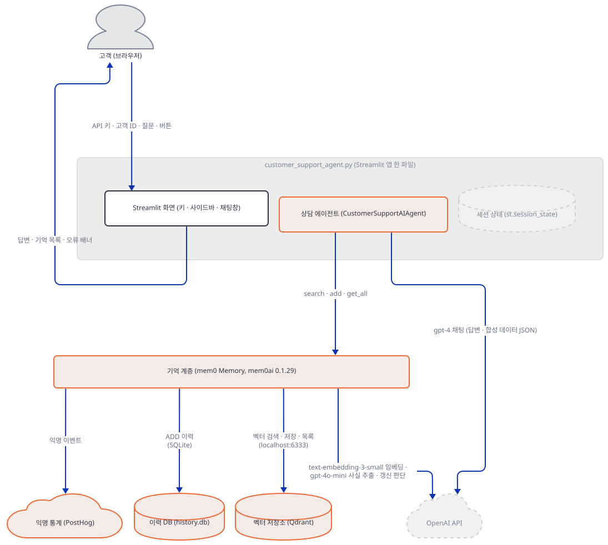

**확인.** 먼저 Qdrant가 없을 때입니다. 이 장면은 진짜 `localhost:6333`에 접속을 시도하므로, 이미 그 포트에 무엇인가 떠 있으면 연결하지 않고 건너뜁니다.

```bash
uv run --no-project python day100_check.py noqdrant
```

직접 확인한 출력(Windows):

```
  오류 배너: Failed to initialize memory: [WinError 10061] 대상 컴퓨터에서 연결을 거부했으므로 연결하지 못했습니다
앱이 심은 OPENAI_API_KEY: sk-test / 사이드바 위젯 0
```

`[WinError 10061]` 문구는 Windows에서 본 것이고 다른 OS는 문구가 다릅니다. 배너 아래에는 제목과 키 입력창만 남고 사이드바 위젯은 하나도 없습니다(`st.stop()` 때문). 마지막 줄은 화면에서 입력한 값이 `os.environ`에 들어가 있음을 보여 줍니다.

이제 Qdrant 자리에 프로세스 안의 저장소를 두고 같은 코드를 지나게 합니다.

```bash
uv run --no-project python day100_check.py memory
```

직접 확인한 출력:

```
  오류 배너: Please enter a customer ID to start the chat.
넘어간 설정: {"vector_store": {"provider": "qdrant", "config": {"host": "localhost", "port": 6333}}, "version": "v1.1"}
컬렉션: ['mem0'] 1536 Cosine
MEM0_DIR 안: ['config.json', 'history.db']
세 번 만진 뒤 Memory.from_config 호출 수: 3
```

첫 줄은 고객 ID를 아직 치지 않았을 때의 배너입니다. 앱이 넘긴 설정 그대로 `mem0` 컬렉션이 크기 1536, 코사인 거리로 만들어졌고(소스로 확인한 기본값과 같습니다), `history.db`가 `Memory`가 만들어지는 시점에 이미 생겼습니다. 마지막 줄은 키 입력, 고객 ID 입력, 버튼 한 번, 곧 세 번 만졌더니 `Memory.from_config`가 세 번 불렸다는 뜻입니다. 이 한 번의 생성이 하는 일을 두 장으로 그렸습니다. 먼저 Qdrant와의 일입니다.

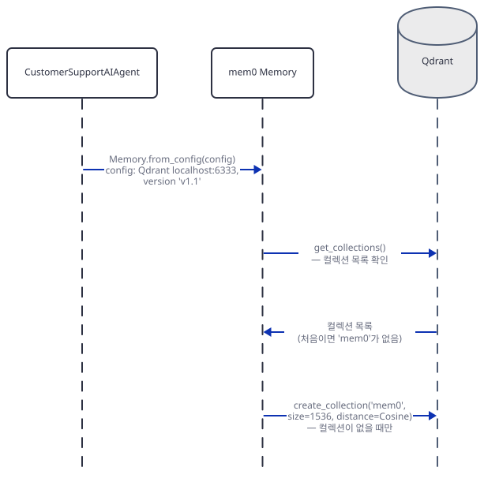

이어서 `history.db`와 통계 이벤트, 그리고 객체를 돌려주는 일입니다. `mem0.init` 이벤트는 `MEM0_TELEMETRY`를 끄지 않으면 이 순간 PostHog로 나갑니다. 통계를 켠 채 키를 넣으면 이 전송을 시도하는 것을 직접 확인했습니다(프록시를 닫힌 포트로 돌린 환경에서 `error uploading: HTTPSConnectionPool(host='us.i.posthog.com', ...)`가 반복해 찍혔습니다).

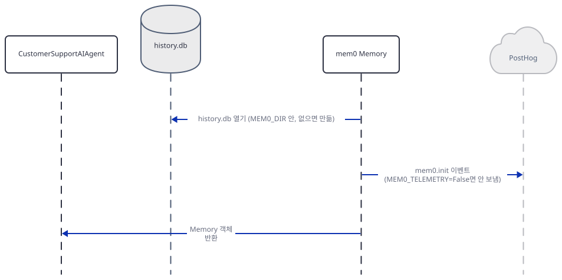

### Step 4. 질문 한 번 — 검색, 프롬프트, 답, 저장

**목적.** 질문 하나가 검색 → 프롬프트 → `gpt-4` → 저장 두 번으로 흐르는 모양을 확인하고, 오늘 설치에서 어디서 끊기는지 봅니다.

**할 일.** `handle_query`의 앞부분, 곧 기억 검색과 컨텍스트 만들기입니다.

`advanced_ai_agents/single_agent_apps/ai_customer_support_agent/customer_support_agent.py:42-52`

```python
        def handle_query(self, query, user_id=None):
            try:
                # Search for relevant memories
                relevant_memories = self.memory.search(query=query, user_id=user_id)
                
                # Build context from relevant memories
                context = "Relevant past information:\n"
                if relevant_memories and "results" in relevant_memories:
                    for memory in relevant_memories["results"]:
                        if "memory" in memory:
                            context += f"- {memory['memory']}\n"
```

`search()`는 질문을 임베딩해 그 고객의 기억 가운데 가까운 것부터 돌려줍니다. `limit`의 기본값이 100이고 점수 임계값을 받는 인자도 없습니다(아래 확인에서 시그니처로 직접 봅니다). 고객의 기억이 100개 미만이면 전부 프롬프트에 들어가고 가까운 순서로 정렬될 뿐입니다. 결과가 `{"results": [...]}`이므로(Step 3의 `version`) 49행의 검사가 이제 맞습니다. 이어서 답을 만들고 저장하는 부분입니다.

`advanced_ai_agents/single_agent_apps/ai_customer_support_agent/customer_support_agent.py:54-72`

```python
                # Generate a response using OpenAI
                full_prompt = f"{context}\nCustomer: {query}\nSupport Agent:"
                response = self.client.chat.completions.create(
                    model="gpt-4",
                    messages=[
                        {"role": "system", "content": "You are a customer support AI agent for TechGadgets.com, an online electronics store."},
                        {"role": "user", "content": full_prompt}
                    ]
                )
                answer = response.choices[0].message.content

                # Add the query and answer to memory
                self.memory.add(query, user_id=user_id, metadata={"app_id": self.app_id, "role": "user"})
                self.memory.add(answer, user_id=user_id, metadata={"app_id": self.app_id, "role": "assistant"})

                return answer
            except Exception as e:
                st.error(f"An error occurred while handling the query: {e}")
                return "Sorry, I encountered an error. Please try again later."
```

프롬프트는 `Relevant past information:` 아래 기억 줄들, 이어서 `Customer:`와 질문, `Support Agent:`입니다. `gpt-4`에는 `max_tokens`도 `temperature`도 주지 않습니다. 답을 받으면 질문과 답을 각각 `add`로 저장하면서 메타데이터에 `app_id`와 `role`을 붙입니다. 두 가지를 짚습니다. 첫째, `add(text)`는 문자열을 `{"role": "user", ...}` 메시지로 감싸므로(mem0ai 0.1.29의 `Memory.add`, 소스로 확인) `role: "assistant"`는 Qdrant 페이로드에만 남고, mem0가 사실을 뽑을 때는 답도 `user:`로 보입니다. 둘째, 검색 필터는 `user_id`뿐이라 `app_id`와 `role`은 읽는 곳이 없습니다(이 파일에서 `app_id`는 40·66·67·116·122행, 모두 쓰는 쪽이라는 것을 `grep`으로 확인). `add()`가 LLM을 두 번 부르고 사실마다 임베딩과 검색을 하는 구조는 Day 075 Step 8에서 확인했으므로, 오늘은 그 호출이 이 앱에서 몇 번인지 셉니다.

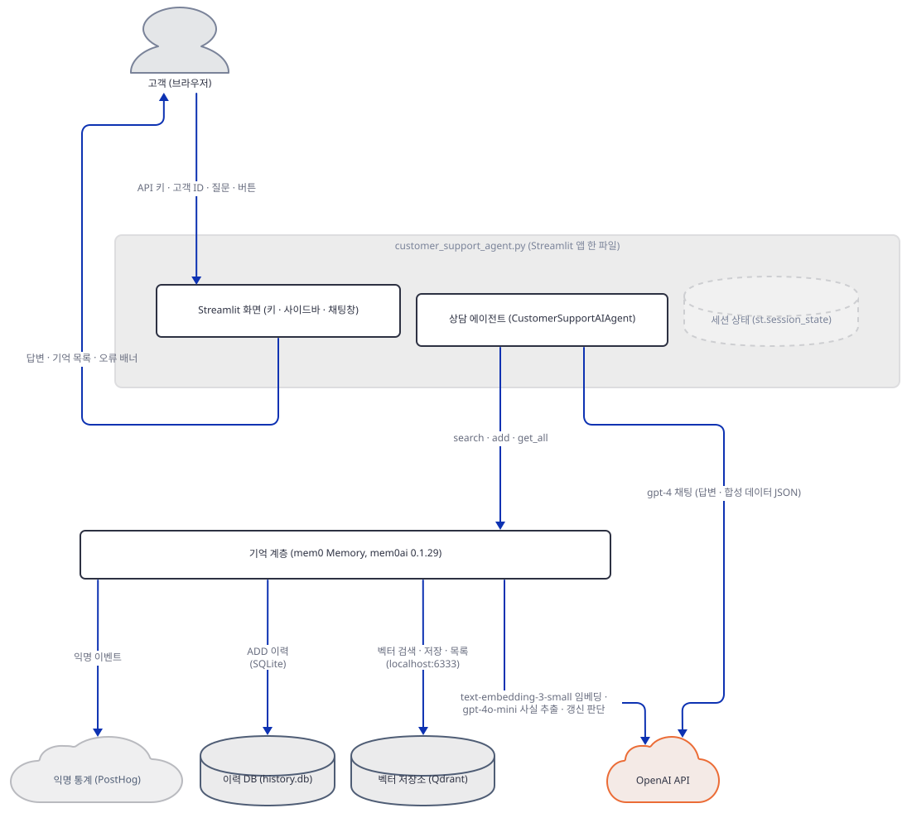

**확인.** 오늘 설치 그대로 질문을 두 번 보냅니다.

```bash
uv run --no-project python day100_check.py chat
```

직접 확인한 출력:

```
질문: Where is my order?
  오류 배너: An error occurred while handling the query: 'QdrantClient' object has no attribute 'search'
  답: Sorry, I encountered an error. Please try again later.
  호출: 임베딩(text-embedding-3-small) 1
질문: Is my order late?
  오류 배너: An error occurred while handling the query: 'QdrantClient' object has no attribute 'search'
  답: Sorry, I encountered an error. Please try again later.
  호출: 임베딩(text-embedding-3-small) 1
Qdrant에 저장된 항목 0 개
search 시그니처: (self, query, user_id=None, agent_id=None, run_id=None, limit=100, filters=None)
```

질문 하나가 임베딩 요청 한 번에서 끝났습니다. 그다음 `vector_store.search`가 `AttributeError`를 내고, 앱의 `except`(70행)가 그것을 삼켜 배너와 사과문을 돌려줍니다. `gpt-4`는 한 번도 불리지 않았고 저장된 항목은 0개입니다. 사과문도 `session_state.messages`에 어시스턴트의 말풍선으로 남습니다(198행이 `handle_query`의 반환값을 가리지 않고 넣어서, 직접 확인). 마지막 줄은 `search`의 `limit` 기본값이 100임을 보여 줍니다.

왜 막히는지는 Step 1에서 본 `search` 없음 하나입니다. 이 메서드는 `qdrant-client` 1.15.1에는 있고 1.16.0부터 없습니다. 휠 안의 `QdrantClient` 소스에서 1.9.1과 1.15.1에는 `def search(`가 있고 1.16.0·1.16.1·1.16.2·1.17.0·1.18.0·1.19.0·1.19.1에는 없는 것을 확인했습니다. 그러니 1.15.1까지 내려 고정합니다.

```bash
uv pip install "qdrant-client<1.16"
```

(pip 대안: `pip install "qdrant-client<1.16"`.) 직접 확인한 출력(발췌):

```
 - qdrant-client==1.19.1
 + qdrant-client==1.15.1
```

고정한 뒤 `search`가 돌아왔는지 같은 확인을 다시 하고, 같은 장면을 다시 돌립니다.

```bash
uv run --no-project python -c "
from qdrant_client import QdrantClient
print('search' in dir(QdrantClient), 'query_points' in dir(QdrantClient))
"
uv run --no-project python day100_check.py chat
```

직접 확인한 출력:

```
True True
```

```
질문: Where is my order?
  답: (가짜 gpt-4) 기억 0개를 받았습니다
  호출: 임베딩(text-embedding-3-small) 3 · 답변(gpt-4) 1 · mem0 사실 추출(gpt-4o-mini) 2 · mem0 갱신 판단(gpt-4o-mini) 2
질문: Is my order late?
  답: (가짜 gpt-4) 기억 2개를 받았습니다, 첫째: Where is my order?
  호출: 임베딩(text-embedding-3-small) 3 · 답변(gpt-4) 1 · mem0 사실 추출(gpt-4o-mini) 2 · mem0 갱신 판단(gpt-4o-mini) 2
Qdrant에 저장된 항목 4 개
mem0가 사실 추출에 보낸 입력: ['user: Where is my order?', 'user: (가짜 gpt-4) 기억 0개를 받았습니다', 'user: Is my order late?', 'user: (가짜 gpt-4) 기억 2개를 받았습니다, 첫째: Where is my order?']
페이로드 키: ['app_id', 'created_at', 'data', 'hash', 'role', 'user_id'] / role: ['assistant', 'assistant', 'user', 'user']
search 시그니처: (self, query, user_id=None, agent_id=None, run_id=None, limit=100, filters=None)
```

이제 질문 한 번이 `gpt-4` 한 번, mem0 안의 `gpt-4o-mini` 네 번(`add` 두 번이 각각 사실 추출과 갱신 판단), 임베딩 세 번입니다. 임베딩은 검색 한 번에 사실마다 한 번인데 가짜 응답이 사실을 하나씩만 돌려줘서 3이고, 진짜 모델이 사실을 몇 개로 쪼개느냐에 따라 달라집니다. 둘째 질문은 단어가 겹치는 첫 질문의 기억을 첫째로 받았고(`기억 2개를 받았습니다, 첫째: Where is my order?`), 기억이 100개 미만이라 가진 기억 전부를 받았습니다. 앞에서 소스로 읽은 두 가지도 그대로 나왔습니다. 사실 추출에 보낸 입력 네 개가 모두 `user:`로 시작하고(답 문장도), 페이로드에는 앱이 붙인 `app_id`와 `role`(user 둘, assistant 둘)이 `user_id`·`data`·`hash`·`created_at`과 함께 남았습니다.

### Step 5. 합성 데이터 — 한 번의 클릭이 JSON 항목 수만큼의 저장이 된다

**목적.** `generate_synthetic_data`가 무엇을 `gpt-4`에게 시키고, 그 답을 어떻게 기억으로 바꾸는지, 호출이 몇 번 나가는지 확인합니다.

**할 일.** 프롬프트를 만들고 `gpt-4`를 부르는 부분입니다.

`advanced_ai_agents/single_agent_apps/ai_customer_support_agent/customer_support_agent.py:82-107`

```python
        def generate_synthetic_data(self, user_id: str) -> dict | None:
            try:
                today = datetime.now()
                order_date = (today - timedelta(days=10)).strftime("%B %d, %Y")
                expected_delivery = (today + timedelta(days=2)).strftime("%B %d, %Y")

                prompt = f"""Generate a detailed customer profile and order history for a TechGadgets.com customer with ID {user_id}. Include:
                1. Customer name and basic info
                2. A recent order of a high-end electronic device (placed on {order_date}, to be delivered by {expected_delivery})
                3. Order details (product, price, order number)
                4. Customer's shipping address
                5. 2-3 previous orders from the past year
                6. 2-3 customer service interactions related to these orders
                7. Any preferences or patterns in their shopping behavior

                Format the output as a JSON object."""

                response = self.client.chat.completions.create(
                    model="gpt-4",
                    messages=[
                        {"role": "system", "content": "You are a data generation AI that creates realistic customer profiles and order histories. Always respond with valid JSON."},
                        {"role": "user", "content": prompt}
                    ]
                )

                customer_data = json.loads(response.choices[0].message.content)
```

프롬프트에는 오늘 날짜에서 10일 전의 주문일과 2일 뒤의 배송 예정일이 영어 날짜 형식으로 들어갑니다. 소스의 날짜 계산을 2026-10-05로 돌려 보면 `September 25, 2026`과 `October 07, 2026`입니다. 시스템 메시지는 "Always respond with valid JSON."이지만 `response_format`을 주지 않아서, 모델이 JSON만 돌려준다는 보장은 코드에 없습니다. 107행의 `json.loads`가 그 가정을 그대로 믿습니다. 이어서 JSON을 기억으로 바꾸는 부분입니다.

`advanced_ai_agents/single_agent_apps/ai_customer_support_agent/customer_support_agent.py:109-128`

```python
                # Add generated data to memory
                for key, value in customer_data.items():
                    if isinstance(value, list):
                        for item in value:
                            self.memory.add(
                                json.dumps(item), 
                                user_id=user_id, 
                                metadata={"app_id": self.app_id, "role": "system"}
                            )
                    else:
                        self.memory.add(
                            f"{key}: {json.dumps(value)}", 
                            user_id=user_id, 
                            metadata={"app_id": self.app_id, "role": "system"}
                        )

                return customer_data
            except Exception as e:
                st.error(f"Failed to generate synthetic data: {e}")
                return None
```

저장 루프는 최상위 키마다 돕니다. 값이 리스트면 항목마다 `json.dumps(item)`을 하나의 기억으로, 아니면 `키: 값` 문자열을 하나의 기억으로 `add`합니다. 곧 `add`는 JSON의 항목 수만큼 불리고, 각 `add`가 `gpt-4o-mini`를 두 번 부릅니다. 메타데이터의 `role`은 `system`입니다. 마지막에 `customer_data`를 돌려주는데 이것은 기억이 아니라 화면용입니다(Step 6).

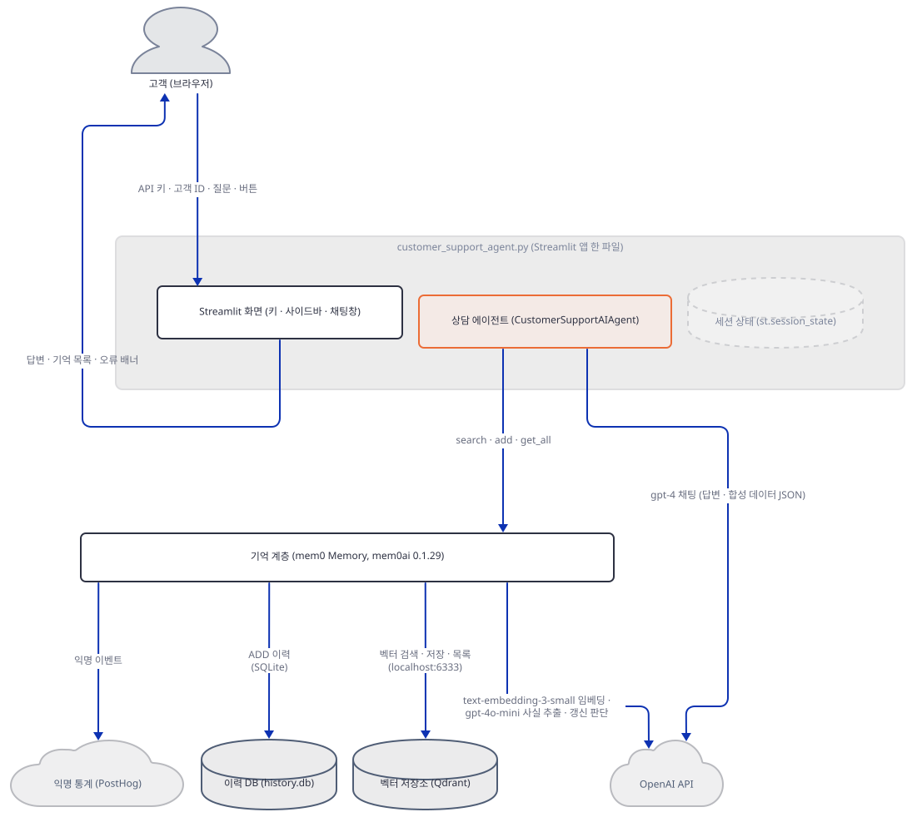

**확인.** 가짜 `gpt-4`가 프로필 JSON을 돌려주게 해 버튼을 누릅니다. 가짜 JSON의 최상위 키는 일곱 개이고 그중 리스트가 둘(항목 둘씩)입니다.

```bash
uv run --no-project python day100_check.py synth
```

직접 확인한 출력:

```
  호출: 합성 데이터(gpt-4) 1 · mem0 사실 추출(gpt-4o-mini) 9 · 임베딩(text-embedding-3-small) 9 · mem0 갱신 판단(gpt-4o-mini) 9
프로필 키: ['customer_name', 'email', 'shipping_address', 'recent_order', 'previous_orders', 'service_interactions', 'preferences']
저장된 기억 9 개, 예: - customer_name: "Alice Kim"
```

`gpt-4` 한 번에 이어 `add`가 아홉 번 불렸습니다(비리스트 키 다섯 + 리스트 항목 둘씩 둘). 그래서 `gpt-4o-mini`가 열여덟 번, 임베딩이 아홉 번입니다. 진짜 `gpt-4`가 만드는 JSON의 모양은 확인하지 못했고, 모양에 따라 횟수가 달라집니다. 이 흐름을 두 장으로 그렸습니다.

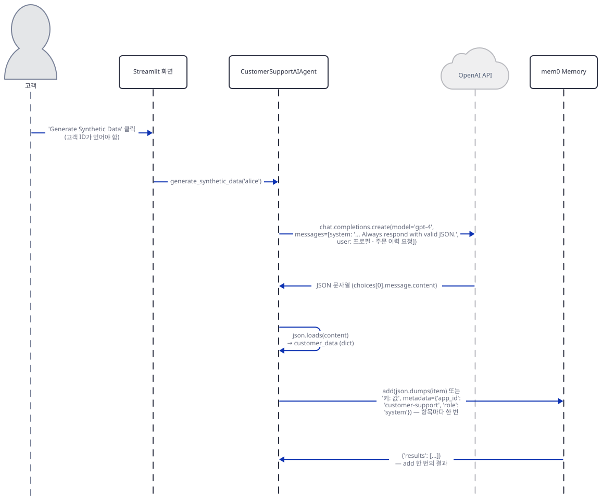

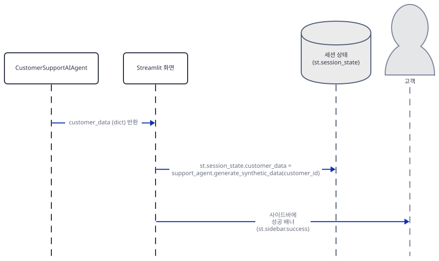

모델이 JSON을 코드 펜스로 감싸 돌려주면 어떻게 되는지도 봅니다.

```bash
uv run --no-project python day100_check.py fence
```

직접 확인한 출력:

```
  오류 배너: Failed to generate synthetic data: Expecting value: line 1 column 1 (char 0)
  오류 배너: Failed to generate synthetic data.
  호출: 합성 데이터(gpt-4) 1
```

`json.loads`가 첫 글자에서 실패해 배너 둘만 남고 저장은 0입니다. `gpt-4` 호출은 이미 나간 뒤입니다. 실제 `gpt-4`가 펜스를 붙이는지는 확인하지 못했고 코드 경로만 가짜 응답으로 확인했습니다. 한편 Step 4의 고정을 하지 않은 환경에서는 이 버튼도 첫 `add`에서 같은 `AttributeError`로 끊깁니다. 그 환경에서 `synth`를 돌리면 이렇게 나왔습니다(직접 확인).

```
  오류 배너: Failed to generate synthetic data: 'QdrantClient' object has no attribute 'search'
  오류 배너: Failed to generate synthetic data.
  호출: 합성 데이터(gpt-4) 1 · mem0 사실 추출(gpt-4o-mini) 1 · 임베딩(text-embedding-3-small) 1
```

### Step 6. 사이드바 — 고객 ID, 프로필, 기억 보기

**목적.** 고객 ID가 바뀔 때 무엇이 초기화되는지, 프로필 보기와 기억 보기가 어디서 값을 읽는지 확인합니다.

**할 일.** 에이전트의 두 번째 메서드와 사이드바의 앞부분입니다.

`advanced_ai_agents/single_agent_apps/ai_customer_support_agent/customer_support_agent.py:74-80`

```python
        def get_memories(self, user_id=None):
            try:
                # Retrieve all memories for a user
                return self.memory.get_all(user_id=user_id)
            except Exception as e:
                st.error(f"Failed to retrieve memories: {e}")
                return None
```

`advanced_ai_agents/single_agent_apps/ai_customer_support_agent/customer_support_agent.py:133-141`

```python
    # Sidebar for customer ID and memory view
    st.sidebar.title("Enter your Customer ID:")
    previous_customer_id = st.session_state.get("previous_customer_id", None)
    customer_id = st.sidebar.text_input("Enter your Customer ID")

    if customer_id != previous_customer_id:
        st.session_state.messages = []
        st.session_state.previous_customer_id = customer_id
        st.session_state.customer_data = None
```

사이드바의 ID가 직전 값과 달라지면 대화 기록과 합성 프로필을 비우고 직전 ID를 새 값으로 바꿉니다. 기억은 Qdrant에 있으니 지워지지 않고 화면의 대화만 새로 시작합니다. 이어서 세 버튼입니다.

`advanced_ai_agents/single_agent_apps/ai_customer_support_agent/customer_support_agent.py:143-153`

```python
    # Add button to generate synthetic data
    if st.sidebar.button("Generate Synthetic Data"):
        if customer_id:
            with st.spinner("Generating customer data..."):
                st.session_state.customer_data = support_agent.generate_synthetic_data(customer_id)
            if st.session_state.customer_data:
                st.sidebar.success("Synthetic data generated successfully!")
            else:
                st.sidebar.error("Failed to generate synthetic data.")
        else:
            st.sidebar.error("Please enter a customer ID first.")
```

`advanced_ai_agents/single_agent_apps/ai_customer_support_agent/customer_support_agent.py:155-173`

```python
    if st.sidebar.button("View Customer Profile"):
        if st.session_state.customer_data:
            st.sidebar.json(st.session_state.customer_data)
        else:
            st.sidebar.info("No customer data generated yet. Click 'Generate Synthetic Data' first.")

    if st.sidebar.button("View Memory Info"):
        if customer_id:
            memories = support_agent.get_memories(user_id=customer_id)
            if memories:
                st.sidebar.write(f"Memory for customer **{customer_id}**:")
                if memories and "results" in memories:
                    for memory in memories["results"]:
                        if "memory" in memory:
                            st.write(f"- {memory['memory']}")
            else:
                st.sidebar.info("No memory found for this customer ID.")
        else:
            st.sidebar.error("Please enter a customer ID to view memory info.")
```

합성 데이터 버튼은 ID가 있을 때만 `generate_synthetic_data`를 부르고 결과를 `st.session_state.customer_data`에 넣습니다. 프로필 보기는 그 세션 값만 보여 줍니다. 기억에서 다시 만들지 않으므로 ID를 바꾸거나 페이지를 새로고침하면 사라집니다. 기억 보기는 `get_memories`를 거쳐 `get_all`을 부릅니다. 표시 코드에는 두 가지가 눈에 띕니다. 머리말은 `st.sidebar.write`인데 항목은 `st.write`(169행)라 항목이 사이드바가 아니라 본문에 그려집니다. 또 164행의 `if memories:`는 v1.1에서 기억이 없는 고객에게도 `{"results": []}`라는 비어 있지 않은 dict라 항상 참이어서, 171행의 "No memory found"는 `get_memories`가 오류로 `None`을 돌려줄 때만 보입니다.

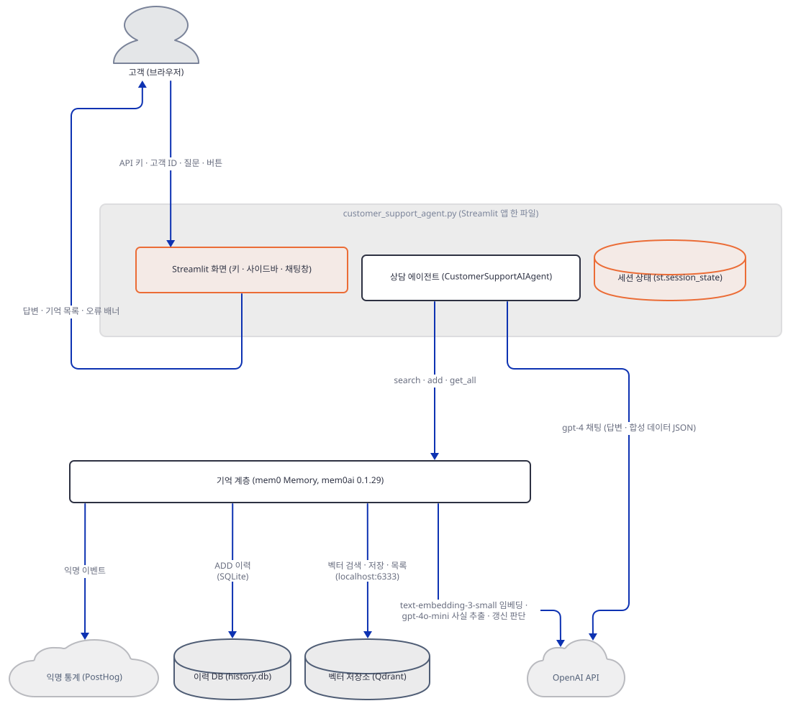

**확인.** 질문 하나를 보낸 뒤 고객 ID를 바꿔 가며 세 버튼을 누릅니다.

```bash
uv run --no-project python day100_check.py sidebar
```

직접 확인한 출력:

```
alice 대화 기록: 2 개 / previous_customer_id: alice
bob으로 바꾼 뒤 대화 기록: 0 개 / previous_customer_id: bob
bob 기억 보기 -> 사이드바: ['Memory for customer **bob**:'] / 안내: [] / 호출: 없음
alice 기억 보기 -> 사이드바: ['Memory for customer **alice**:'] / 본문 항목 2 개 / 호출: 없음
프로필 보기 -> ["No customer data generated yet. Click 'Generate Synthetic Data' first."]
```

ID를 bob으로 바꾸자 대화 기록이 비워지고 `previous_customer_id`가 따라갔습니다. bob의 기억은 없는데 사이드바에는 머리말만 있고 "No memory found" 안내는 없습니다(`안내: []`). alice로 돌아오면 기억 두 개가 사이드바가 아니라 본문 항목으로 나오고(`본문 항목 2 개`), 사이드바에는 머리말 한 줄뿐입니다. 이 장면에서는 합성 데이터를 만든 적이 없어 프로필 보기가 안내문만 보여 줍니다. ID가 바뀌면 `customer_data`도 `None`이 되는 것은 141행에서 소스로 확인했습니다. 두 기억 보기에서 가짜 OpenAI 호출은 없었습니다. `get_all`은 임베딩 없이 Qdrant에서 목록만 읽습니다. 이 흐름도 그렸습니다.

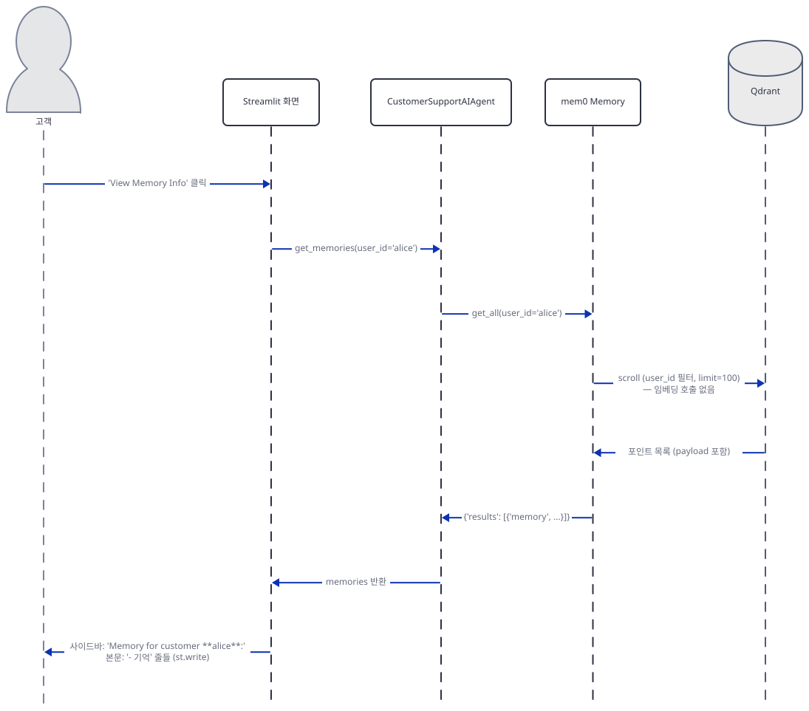

### Step 7. 채팅 화면과 실행

**목적.** 질문을 받아 `handle_query`를 부르는 마지막 조각을 보고, 앱을 실제로 띄우는 명령을 확인합니다.

**할 일.** 채팅 기록을 다시 그리고 질문을 받는 부분입니다.

`advanced_ai_agents/single_agent_apps/ai_customer_support_agent/customer_support_agent.py:175-203`

```python
    # Initialize the chat history
    if "messages" not in st.session_state:
        st.session_state.messages = []

    # Display the chat history
    for message in st.session_state.messages:
        with st.chat_message(message["role"]):
            st.markdown(message["content"])

    # Accept user input
    query = st.chat_input("How can I assist you today?")

    if query and customer_id:
        # Add user message to chat history
        st.session_state.messages.append({"role": "user", "content": query})
        with st.chat_message("user"):
            st.markdown(query)

        # Generate and display response
        with st.spinner("Generating response..."):
            answer = support_agent.handle_query(query, user_id=customer_id)

        # Add assistant response to chat history
        st.session_state.messages.append({"role": "assistant", "content": answer})
        with st.chat_message("assistant"):
            st.markdown(answer)

    elif not customer_id:
        st.error("Please enter a customer ID to start the chat.")
```

채팅 기록은 `session_state.messages`에 쌓여 화면이 다시 그려질 때마다 다시 그려집니다. `st.chat_input`은 값을 받은 그 실행에서만 문자열을 돌려줍니다(Day 075 Step 6). 187행은 질문과 고객 ID가 둘 다 있을 때만 `handle_query`를 부릅니다. 202행의 `elif not customer_id`는 질문이 없는 첫 화면에서도 참이라, 키를 넣자마자 고객 ID를 치기 전에 "Please enter a customer ID to start the chat."이 빨갛게 뜹니다. Step 3의 `memory` 장면 첫 줄이 그 배너입니다.

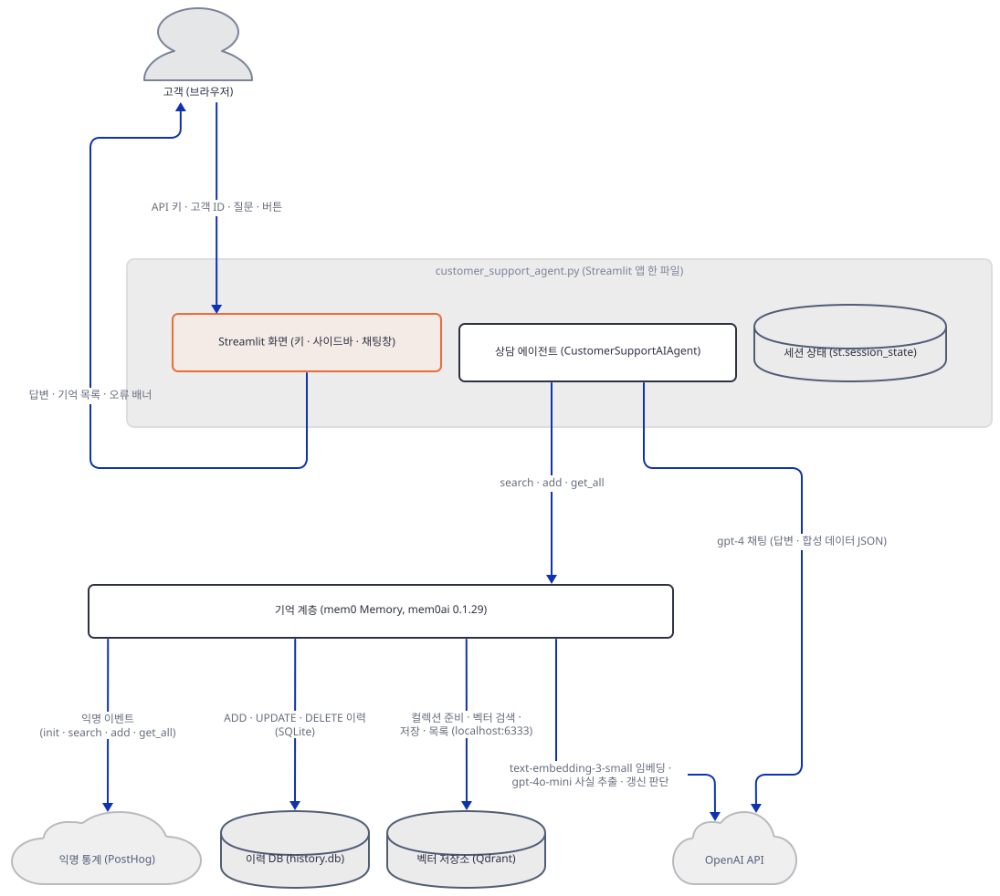

**확인.** 앱을 띄우는 명령은 이것입니다. 키를 넣기 전 첫 화면까지는 Qdrant도 키도 필요 없습니다.

```bash
uv run --no-project streamlit run customer_support_agent.py
```

mem0가 홈에 `.mem0/`를 만들고 통계를 보내는 것을 피하려면 실행 전에 두 환경변수를 정합니다(Day 073 Step 1). PowerShell 형태는 이 환경에서 실행하지 못했습니다.

```bash
MEM0_DIR="${TMPDIR:-/tmp}/day100-mem0" MEM0_TELEMETRY=False uv run --no-project streamlit run customer_support_agent.py
```

```powershell
$env:MEM0_DIR="$env:TEMP\day100-mem0"; $env:MEM0_TELEMETRY="False"
uv run --no-project streamlit run customer_support_agent.py
```

브라우저를 열지 않고 서버만 확인할 때는 같은 명령 끝에 다음 플래그를 붙입니다(PowerShell도 같습니다). 포트는 다른 프로그램과 겹치지 않는 임의의 높은 번호를 쓰고, `--server.address localhost`는 Streamlit이 시작하며 외부 IP를 조회하지 않게 합니다(Day 060).

```bash
MEM0_DIR="${TMPDIR:-/tmp}/day100-mem0" MEM0_TELEMETRY=False uv run --no-project streamlit run customer_support_agent.py --server.headless true --server.address localhost --server.port 54086 --browser.gatherUsageStats false
```

직접 확인한 콘솔 출력(bash 형태, 포트 54086):

```
2026-10-05 12:09:41.034 Uvicorn server started on localhost:54086

  You can now view your Streamlit app in your browser.

  URL: http://localhost:54086
```

다른 터미널에서 서버가 살아 있는지 봅니다.

```bash
uv run --no-project python -c "
import urllib.request
print(urllib.request.urlopen('http://localhost:54086/_stcore/health').read().decode())
"
```

```
ok
```

서버만 띄운 이 시점에는 `MEM0_DIR`로 정한 폴더가 아직 없었습니다(직접 확인). 앱 스크립트는 브라우저가 처음 접속할 때 돌기 때문입니다. 확인이 끝나면 서버를 끕니다(Ctrl+C). 실제로 질문을 주고받으려면 이 문서가 하지 않은 세 가지가 더 필요합니다. 진짜 키를 화면에 넣고, Qdrant를 `localhost:6333`에 띄우고(앱 README는 `docker run`을 안내합니다), 아직 `gpt-4`가 종료되기 전에 돌리는 것입니다. 앞의 두 가지가 준비되어도 Step 4의 고정이 없으면 질문마다 배너가 뜹니다.

## 요청 한 건이 흐르는 과정

질문 하나는 메시지 마흔 개로 이루어집니다. 그림 한 장은 1000px 안에서 메시지 일곱 개 안팎까지만 담기므로, 실제 시간 경계에서 여덟 장으로 나눴습니다. 메시지는 모두 정확히 한 그림에 원래 순서대로 있습니다. mem0나 화면이 여러 상대와 동시에 주고받는 그림은 배우를 일렬로 세우면 한 메시지가 다른 배우의 수명선을 건너가야 합니다. 건너뛰는 메시지의 라벨은 좁게 줄바꿈하고 이웃한 메시지의 라벨에는 실제 코드 값을 채워 선과 글자 사이를 벌렸습니다. 데이터를 줄인 라벨은 없고, 배우 순서는 전수 탐색으로 골랐습니다.

1. 고객이 질문을 입력하면 화면이 세션 상태에 질문을 쌓고 말풍선을 그린 뒤 에이전트의 `handle_query`를 부릅니다.

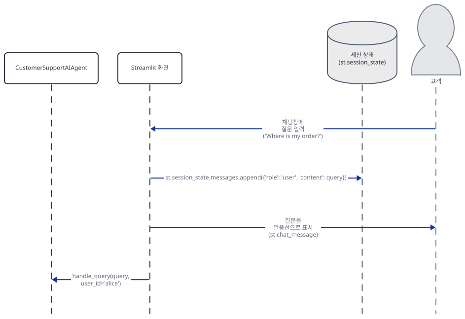

2. 에이전트가 `search`를 부르고, mem0가 질문을 임베딩해 Qdrant에서 이 고객의 기억을 가까운 순으로 받아 `{"results": [...]}`로 돌려줍니다.

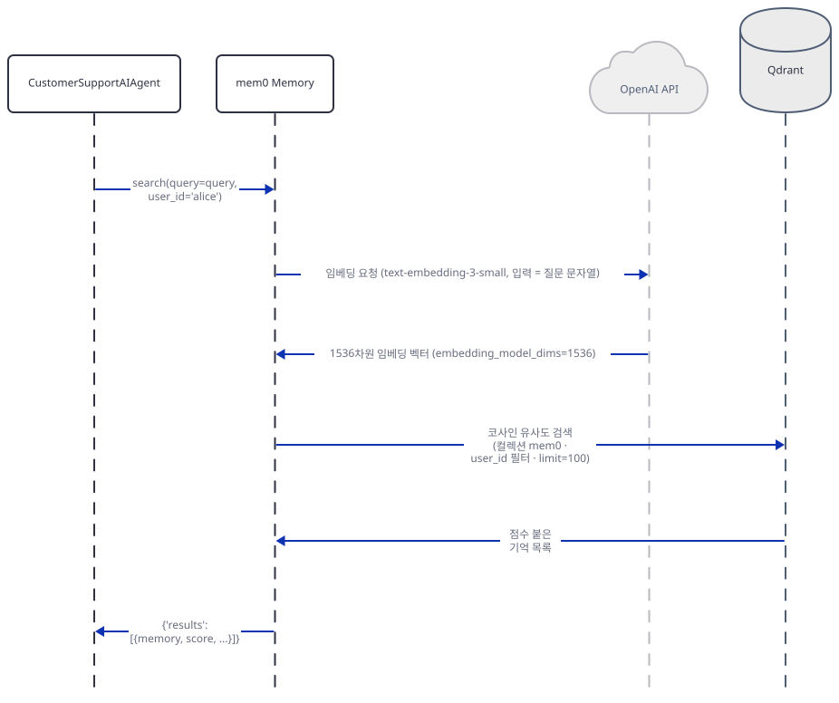

3. 에이전트가 기억 줄들로 컨텍스트를 조립해 `gpt-4`에 보내고 답을 받습니다.

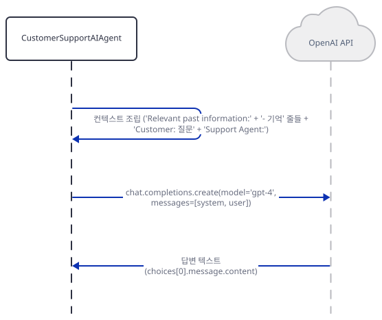

4. 질문 저장의 앞부분입니다. mem0가 `gpt-4o-mini`에 사실을 뽑게 하고, 사실마다 임베딩해 비슷한 기존 기억을 찾습니다.

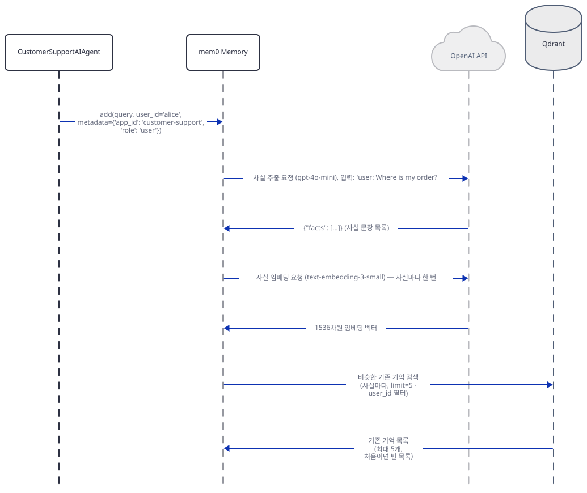

5. 질문 저장의 뒷부분입니다. 새 사실과 기존 기억을 `gpt-4o-mini`에게 보여 ADD·UPDATE·DELETE·NONE을 판단시키고, 이 그림은 ADD로 판단된 경우입니다. 결과를 Qdrant에 쓰고 `history.db`에 이력을 남긴 뒤 에이전트에 돌려줍니다.

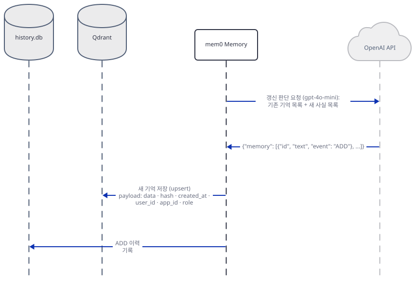

6. 답 저장의 앞부분입니다. 질문과 같은 흐름이지만 입력이 답 문자열이고 `role`이 `assistant`입니다. 사실을 뽑는 입력은 그래도 `user:`로 시작합니다.

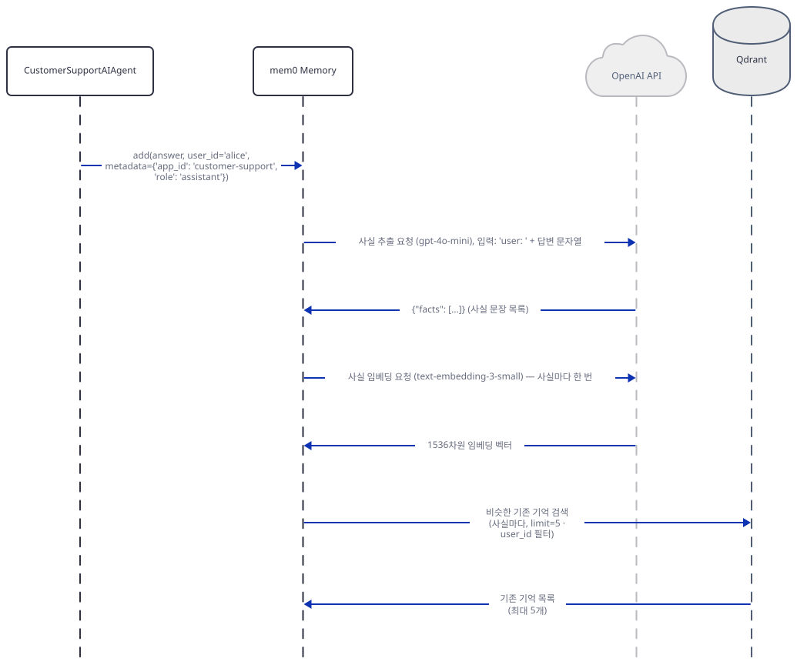

7. 답 저장의 뒷부분입니다. 질문 때와 같은 판단·저장·이력입니다.


8. 마지막으로 에이전트가 답을 화면에 돌려주고, 화면이 세션 상태에 쌓은 뒤 말풍선으로 그립니다.

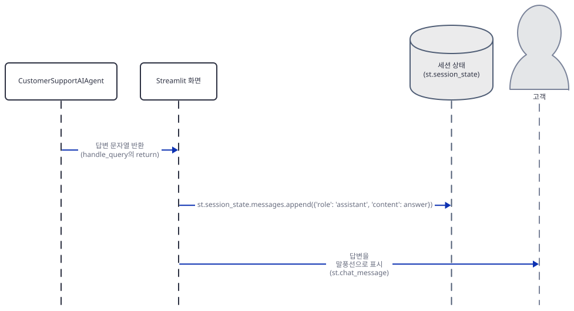

한 턴은 이 여덟 장이 이어진 것입니다. 오늘 설치 그대로라면 2번 그림에서 임베딩 벡터를 받은 mem0가 Qdrant 검색을 부르려는 곳에서 `AttributeError`가 나고, 3~7번 그림의 메시지는 일어나지 않습니다. 앱은 `except`에서 사과문을 만들어 8번 그림의 화면 쪽으로 곧장 돌려줍니다(Step 4에서 직접 확인).

## 실행 체크리스트

- [ ] `uv venv && uv pip install -r requirements.txt`로 오늘 `qdrant-client` 1.19.1이 깔리고, 그 버전에 `search`가 없다는 것을 직접 확인했다
- [ ] `if openai_api_key:`가 클래스·사이드바·채팅창 전부를 감싸고, 키를 넣기 전에는 입력창과 경고뿐이라는 것을 확인했다
- [ ] 화면에 입력한 키가 `os.environ`에 실려 mem0가 볼 수 있다는 것과, 3행의 `import`만으로 홈에 `.mem0/`가 생길 수 있다는 것을 확인했다
- [ ] Qdrant가 없으면 `Failed to initialize memory:` 배너 뒤에 스크립트가 멈춘다는 것을 확인했다
- [ ] 화면을 만질 때마다 `Memory.from_config`가 다시 불린다는 것(세 번 만지면 세 번)을 확인했다
- [ ] 오늘 설치 그대로는 질문이 임베딩 한 번 뒤 `AttributeError`로 끊기고 배너와 사과문만 나온다는 것, `qdrant-client<1.16`으로 고정하면 한 턴이 끝까지 간다는 것을 확인했다
- [ ] 한 턴이 `gpt-4` 한 번과 `gpt-4o-mini` 네 번을 쓰고, 답 문장도 mem0에는 `user:`로 보인다는 것을 확인했다
- [ ] `search`의 `limit` 기본값이 100이라 고객의 기억 전부가 프롬프트에 들어간다는 것을 시그니처와 장면으로 확인했다
- [ ] 합성 데이터 한 번이 JSON 항목 수만큼의 `add`로 번져 `gpt-4o-mini` 호출이 그 두 배가 된다는 것과, JSON이 아닌 답이면 `json.loads`에서 멈춘다는 것을 확인했다
- [ ] 고객 ID를 바꾸면 대화와 프로필은 비워지고 기억은 남는다는 것, 기억 보기의 항목이 본문에 그려진다는 것을 확인했다
- [ ] 앱을 띄우는 명령과 `--server.address localhost`를 붙인 서버 확인을 직접 해 봤다

## 문제 해결

| 증상 | 원인 | 해결 |
|---|---|---|
| 질문마다 빨간 배너 `An error occurred while handling the query: 'QdrantClient' object has no attribute 'search'`와 "Sorry, I encountered an error. Please try again later." | `requirements.txt`가 `qdrant-client`를 고정하지 않아 오늘 1.19.1이 깔리고, mem0ai 0.1.29가 부르는 `QdrantClient.search()`가 1.16.0부터 없다(Step 4에서 직접 확인) | 리포 코드는 고치지 않음. `uv pip install "qdrant-client<1.16"`(1.15.1이 깔리고 `search`가 돌아옴, Step 4에서 직접 확인) |
| 합성 데이터 버튼 뒤 배너 `Failed to generate synthetic data: 'QdrantClient' object has no attribute 'search'`와 사이드바의 `Failed to generate synthetic data.` | 같은 원인이다. 첫 `add`가 사실을 하나라도 뽑으면 `vector_store.search`를 부른다. 그 전에 `gpt-4` 한 번, `gpt-4o-mini` 한 번, 임베딩 한 번이 이미 나간다(Step 5에서 직접 확인) | 같은 고정 |
| `Failed to generate synthetic data: Expecting value: line 1 column 1 (char 0)` | 107행의 `json.loads`가 모델 답을 그대로 파싱한다. 답이 JSON 한 덩어리가 아니면(여기서는 코드 펜스) 실패하고 `gpt-4` 호출은 이미 나간 뒤다(가짜 응답으로 직접 확인) | 리포 코드는 고치지 않음 |
| 키를 넣은 뒤 `Failed to initialize memory: [WinError 10061] ...`가 뜨고 제목과 키 입력창만 남음 | Qdrant가 `localhost:6333`에 없다(Step 3에서 직접 확인, 다른 OS는 문구가 다름) | 앱 README의 Docker 안내로 Qdrant를 띄운다 |
| 고객 ID를 치기 전에 빨간 "Please enter a customer ID to start the chat." | 202행의 `elif not customer_id`가 질문이 없는 첫 화면에서도 참이다(Step 3·7에서 직접 확인) | 의도된 안내로 보임 |
| "View Memory Info"의 항목이 사이드바가 아니라 본문에 뜨고, 기억이 없는 고객은 머리말만 나옴 | 169행이 `st.write`이고, 164행의 `if memories:`가 v1.1의 빈 결과 `{"results": []}`에도 참이다(Step 6에서 직접 확인) | 리포 코드는 고치지 않음. 더 해보기 2 |
| 키를 넣기도 전에 첫 화면만 열었는데 홈에 `.mem0/config.json`이 생김 | 3행의 `from mem0 import Memory`가 게이트 밖이라 첫 화면에서도 실행된다(홈을 임시 폴더로 돌려 직접 확인) | 실행 전에 `MEM0_DIR`을 정한다(Step 7) |
| 콘솔에 `error uploading: HTTPSConnectionPool(host='us.i.posthog.com', ...)`가 반복해 찍힘 | mem0의 통계가 기본으로 켜져 있고 전송이 막힌 네트워크에서 실패한다(프록시를 닫힌 포트로 돌린 환경에서 직접 확인) | 실행 전에 `MEM0_TELEMETRY=False`를 정한다 |
| 앱 README는 GPT-4o라고 적는데 코드는 `gpt-4` | 57행과 100행이 `model="gpt-4"`이고, mem0 안은 `gpt-4o-mini`다(소스로 확인) | 코드를 기준으로 삼는다 |
| 앱 README의 `git clone` 뒤 `cd advanced_ai_agents/single_agent_apps/ai_customer_support_agent`가 `No such file or directory`로 실패 | clone으로 생긴 `awesome-llm-apps` 폴더로 들어가는 단계가 빠져 있다(bash로 직접 확인, PowerShell은 문구가 다름) | 먼저 `cd awesome-llm-apps` |

## 더 해보기

- 복사본(`cp customer_support_agent.py my_app.py`, PowerShell은 `Copy-Item`)에서 `advanced_ai_agents/single_agent_apps/ai_customer_support_agent/customer_support_agent.py:45`의 `search(query=query, user_id=user_id)`에 `limit=1`을 더하고 `uv run --no-project python day100_check.py chat my_app.py`를 돌려, 둘째 질문이 받는 기억이 2개에서 1개로 줄어드는지 확인해 보세요. 실제 앱이라면 `limit=5` 안팎이 자연스럽습니다.
- 같은 복사본에서 `advanced_ai_agents/single_agent_apps/ai_customer_support_agent/customer_support_agent.py:164`를 `if memories and memories.get("results"):`로, `advanced_ai_agents/single_agent_apps/ai_customer_support_agent/customer_support_agent.py:169`의 `st.write(`를 `st.sidebar.write(`로 고치고 `uv run --no-project python day100_check.py sidebar my_app.py`를 돌려 보세요. bob에게는 "No memory found for this customer ID."가 뜨고 alice의 항목은 사이드바에 나옵니다(이 두 줄 수정으로 직접 확인했습니다).
- OpenAI의 폐기 안내는 `gpt-4`의 대체 모델로 `gpt-5.6-sol`을 적었습니다. 복사본에서 `advanced_ai_agents/single_agent_apps/ai_customer_support_agent/customer_support_agent.py:57`과 `advanced_ai_agents/single_agent_apps/ai_customer_support_agent/customer_support_agent.py:100`의 모델 이름을 바꾸고, 진짜 키와 Qdrant로 질문 한 턴이 끝까지 가는지 확인해 보세요. 이 이름이 이 앱의 `chat.completions.create` 호출과 맞는지는 키가 없어 확인하지 못했습니다.

## 다음 날 예고

[Day 101 · 🚀 AI Email GTM Reachout Agent](../day101-ai-email-gtm-reachout-agent/README.md) — Exa 검색으로 회사와 담당자를 찾아 맞춤 영업 이메일을 만드는 agno 기반 Streamlit 앱입니다(원본 앱 README와 소스 기준).
