# Day 101 · 🚀 AI Email GTM Reachout Agent

> 볼륨 7 🚀 Advanced AI Agents · 난이도 ★★☆ · 예상 소요 120분(가짜 OpenAI 서버를 직접 만들어 띄우고 도우미 스크립트 네 개를 저장해 돌려 보는 손 시간이 읽는 시간만큼 듭니다) · API 비용 대략 확인 불가(키가 없어 토큰 수를 재지 못했고 `gpt-5`·Exa 요금표도 확인하지 못했습니다. 캠페인 한 번에 `gpt-5` 호출이 최소 1+3×회사 수번 나가고 기본 5곳이면 16번입니다 — 소스로 확인. 이 문서의 확인은 모두 가짜 서버로 돌아 무료입니다) · 원본 앱: `advanced_ai_agents/single_agent_apps/ai_email_gtm_reachout_agent`

## 오늘 만들 것

분류·회사 크기·부서·서비스 종류를 고르면 에이전트 넷이 차례로 일해 영업 메일 초안을 회사마다 한 통씩 써 주는 Streamlit 앱입니다. 기업 탐색 에이전트가 후보 회사를 찾고, 연락처 에이전트와 기업 조사 에이전트가 회사 하나씩 담당자와 배경을 찾고, 이메일 작성 에이전트가 그 결과를 부서별 틀과 함께 받아 초안을 씁니다. 앞의 셋은 Exa 검색을 도구로 쥐고, 넷 모두 `gpt-5`를 씁니다. 오늘 새로 보는 것은 에이전트를 묶는 방식입니다. agno의 `Workflow`를 상속한 클래스 하나가 에이전트 넷을 클래스 속성으로 쥐고, 덮어쓴 `run()`이 제너레이터로 진행 신호와 완성된 카드를 하나씩 내놓으면 화면이 그것을 진행 막대와 카드로 그립니다. 이 저장소의 앱 가운데 `agno.workflow`를 import하는 파일은 이것 하나뿐이고(전체 검색으로 확인) 앞선 날 README에도 agno `Workflow`는 없습니다. 에이전트에 Exa를 도구로 쥐여 주는 것은 Day 062·064·070이 이미 보였지만 거기서는 벡터 검색이 빈손일 때 부르는 폴백이었고, 여기서는 세 에이전트의 본업입니다. 앱은 `ai_email_gtm_reachout.py` 한 파일이고 편집기에서는 1,097줄입니다(마지막 줄에 개행이 없어 `wc -l`은 1,096으로 셉니다 — 직접 확인). 이 문서는 버튼 한 번이 지나가는 길만 따라가고 샘플 상수는 건너뜁니다.

이름은 "완전 자동 아웃리치"지만 소스를 읽으면 사실이 몇 개 다릅니다. 메일을 **보내는 코드는 어디에도 없습니다**. 초안을 화면에 보여 줄 뿐이고 `DEMO_MODE`는 정의만 있고 읽히지 않습니다(Step 8). 회사 이름은 `Company #1`, `Company #2`처럼 번호로 고정이고, 조사 결과는 200자까지만 이메일 작성 에이전트에 닿고, 복사·내보내기 버튼은 성공 문구만 띄웁니다. `requirements.txt`는 SQLite 저장소가 쓰는 `sqlalchemy`와 Exa 도구가 쓰는 `exa-py`를 빠뜨려서(오늘 설치하면 agno 3.1.1이 풀립니다) 그대로는 첫 import에서 멈춥니다(Step 1).

OpenAI·Exa 키가 없으므로 Step 4부터는 이 PC에서만 듣는 가짜 OpenAI 서버가 모델 호출을 받고, Exa 클라이언트는 로컬 대역으로 바꿉니다. 그래서 이 문서가 보여 주는 연락처·이메일·회사 이름은 전부 가짜 서버가 내놓은 문장이고, 진짜 `gpt-5`나 Exa가 무엇을 돌려주는지는 확인하지 못했습니다. 모든 확인 명령은 `AGNO_TELEMETRY=false`를 걸고 돕니다(이유는 Step 4). 완성하면 키 없이 캠페인 한 번을 끝까지 돌려 카드가 그려지는 데까지 봅니다. 아래는 완성된 아키텍처입니다.

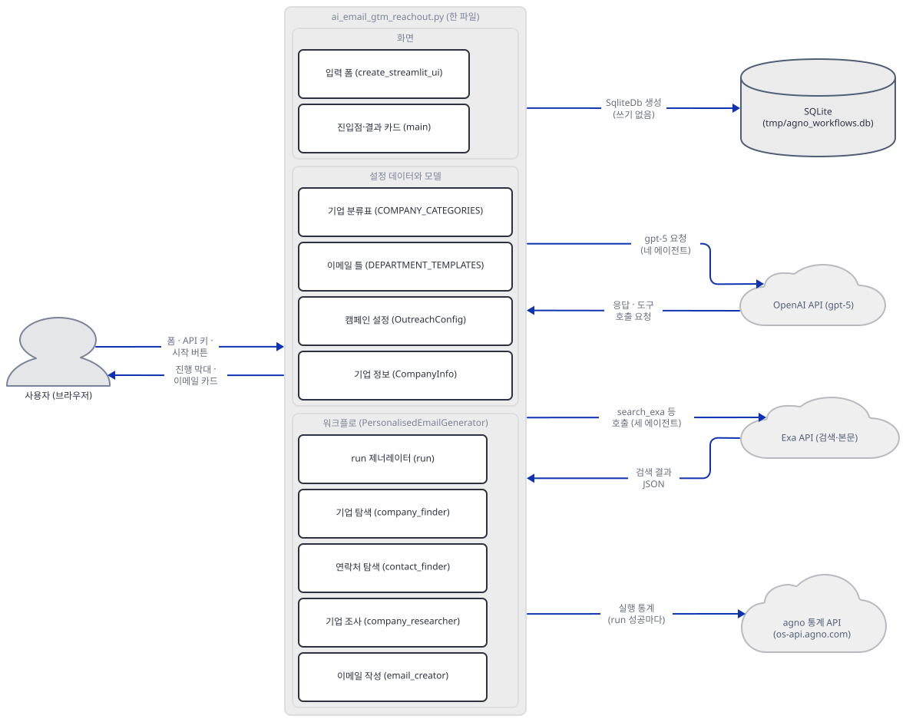

## 사전 준비

| 서비스/도구 | 용도 | 발급·설치 |
|---|---|---|
| uv, Python | 가상환경과 패키지 설치. 이 문서는 Python 3.13.3으로 확인했다 | [공통 사전 준비](../README.md#공통-사전-준비-한-번만) 참고 |
| OpenAI API 키 | 네 에이전트가 `gpt-5`를 부른다(에이전트별 코드 위치는 아래 표) | https://platform.openai.com/api-keys — 이 문서는 쓰지 않는다 |
| Exa API 키 | 세 에이전트의 `ExaTools`(코드 위치는 아래 표) | https://exa.ai — 이 문서는 쓰지 않는다 |
| 빈 포트 두 개 | 가짜 OpenAI 서버(58214)와 `streamlit run` 확인(58215). 아무 높은 번호면 되고 겹치면 바꾼다 | 별도 설치 없음 |

도우미 스크립트가 한글과 이모지를 찍으므로, Windows에서 출력을 파이프나 파일로 받을 때는 셸에 이 값을 먼저 걸어 두세요. 터미널에 바로 찍을 때는 필요 없습니다. 앱이 로그에 이모지를 넣어서, 파이프로 받으면 `--- Logging error ---`가 나는 것도 직접 확인했습니다(문제 해결 마지막 행).

```bash
export PYTHONIOENCODING=utf-8
```

```powershell
$env:PYTHONIOENCODING = "utf-8"
```

## 아키텍처 한눈에 보기

| 컴포넌트 | 역할 | 코드 위치 |
|---|---|---|
| 사용자 (브라우저) | 키와 폼을 채우고 버튼을 눌러 진행 막대와 카드를 본다 | 코드 없음 (Streamlit 화면) |
| 진입점 (`main`) | 사이드바 키 입력칸, 시작 버튼, 진행 막대, 이메일 카드, 요약을 그린다 | `advanced_ai_agents/single_agent_apps/ai_email_gtm_reachout_agent/ai_email_gtm_reachout.py:768-1093` |
| 입력 폼 (`create_streamlit_ui`) | 폼 위젯을 그리고 검증하고 `OutreachConfig`를 만들어 돌려준다 | `advanced_ai_agents/single_agent_apps/ai_email_gtm_reachout_agent/ai_email_gtm_reachout.py:621-766` |
| 기업 분류표 (`COMPANY_CATEGORIES`) | 분류 다섯 개의 설명과 대표 직책 | `advanced_ai_agents/single_agent_apps/ai_email_gtm_reachout_agent/ai_email_gtm_reachout.py:194-215` |
| 이메일 틀 (`DEPARTMENT_TEMPLATES`) | 부서 → 서비스 종류 → 틀 문자열 사전 | `advanced_ai_agents/single_agent_apps/ai_email_gtm_reachout_agent/ai_email_gtm_reachout.py:56-191` |
| 캠페인 설정 (`OutreachConfig`) | 화면 선택을 검증해 담는 Pydantic 모델 | `advanced_ai_agents/single_agent_apps/ai_email_gtm_reachout_agent/ai_email_gtm_reachout.py:217-238` |
| 기업 정보 (`CompanyInfo`) | 칸이 32개인 Pydantic 모델. `run`이 채우는 것은 넷뿐 | `advanced_ai_agents/single_agent_apps/ai_email_gtm_reachout_agent/ai_email_gtm_reachout.py:250-318` |
| 워크플로 (`PersonalisedEmailGenerator`, `run`) | `Workflow` 상속 클래스. `run`이 회사별 루프를 돌며 `yield`한다 | `advanced_ai_agents/single_agent_apps/ai_email_gtm_reachout_agent/ai_email_gtm_reachout.py:321-343`, `advanced_ai_agents/single_agent_apps/ai_email_gtm_reachout_agent/ai_email_gtm_reachout.py:465-618` |
| 에이전트 넷 | 기업 탐색, 연락처 탐색, 기업 조사(셋은 Exa 도구), 이메일 작성(도구 없음) | `advanced_ai_agents/single_agent_apps/ai_email_gtm_reachout_agent/ai_email_gtm_reachout.py:345-371`, `advanced_ai_agents/single_agent_apps/ai_email_gtm_reachout_agent/ai_email_gtm_reachout.py:373-395`, `advanced_ai_agents/single_agent_apps/ai_email_gtm_reachout_agent/ai_email_gtm_reachout.py:397-421`, `advanced_ai_agents/single_agent_apps/ai_email_gtm_reachout_agent/ai_email_gtm_reachout.py:423-451` |
| 키 흐름 | 환경변수 → 세션 상태 → `os.environ` → 에이전트 | `advanced_ai_agents/single_agent_apps/ai_email_gtm_reachout_agent/ai_email_gtm_reachout.py:17-25`, `advanced_ai_agents/single_agent_apps/ai_email_gtm_reachout_agent/ai_email_gtm_reachout.py:780-801` |
| SQLite (`SqliteDb`) | 만들어 워크플로에 넘기지만 아무것도 쓰지 않는다 | `advanced_ai_agents/single_agent_apps/ai_email_gtm_reachout_agent/ai_email_gtm_reachout.py:847-856` |
| OpenAI API (`gpt-5`) | 에이전트 넷의 모델 | 코드 없음 (agno `OpenAIChat`) |
| Exa API | 검색·본문·유사 페이지·답변 도구 | 코드 없음 (agno `ExaTools`) |
| agno 통계 API | 성공한 에이전트 실행마다 익명 통계 한 건 | 코드 없음 (agno 안, Step 4) |
| 쓰이지 않는 정의 | `ContactInfo`, `leads`, `sender_details_dict`, `DEMO_MODE`, `today`, 캐시 메서드 둘 | `advanced_ai_agents/single_agent_apps/ai_email_gtm_reachout_agent/ai_email_gtm_reachout.py:27-54`, `advanced_ai_agents/single_agent_apps/ai_email_gtm_reachout_agent/ai_email_gtm_reachout.py:240-248`, `advanced_ai_agents/single_agent_apps/ai_email_gtm_reachout_agent/ai_email_gtm_reachout.py:453-463` |

위 그림의 화살표는 파일 전체에서 나가는 것으로 그렸습니다. 어느 부품이 누구를 부르는지는 아래 네 장이 부품 수준으로 보여 줍니다. 먼저 화면 쪽입니다. 사용자는 폼과 `main` 둘과 따로 주고받고, `main`이 폼 함수를 불러 설정을 돌려받습니다.

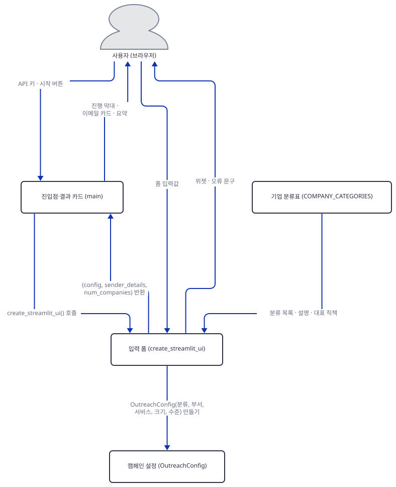

다음은 `main`과 워크플로, 그리고 워크플로가 읽고 만드는 데이터입니다. `main`은 `SqliteDb`를 만들어 워크플로 생성자에 넘기고 `run`을 부릅니다.

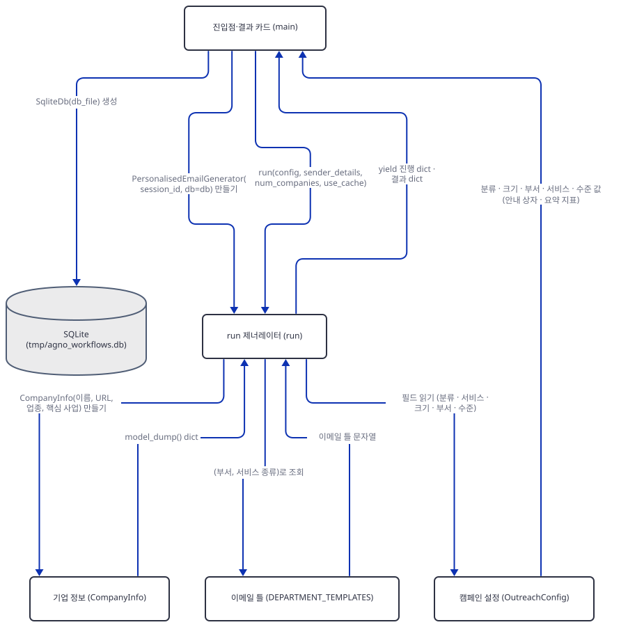

`run`과 에이전트 넷 사이는 호출과 반환뿐입니다. 에이전트끼리는 서로 부르지 않고, 앞 에이전트의 응답은 `run`이 다음 프롬프트에 붙여 넘깁니다.

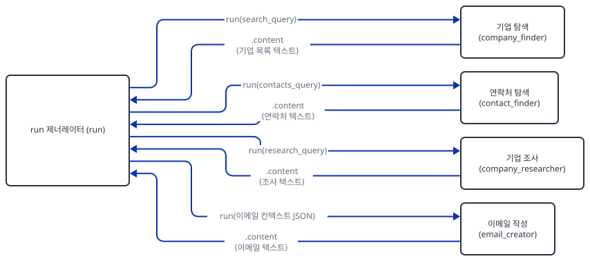

에이전트와 외부 서비스 사이입니다. 세 에이전트(기업 탐색·연락처·기업 조사)는 Exa 도구를 쥐고, 이메일 작성 에이전트는 도구가 없습니다.

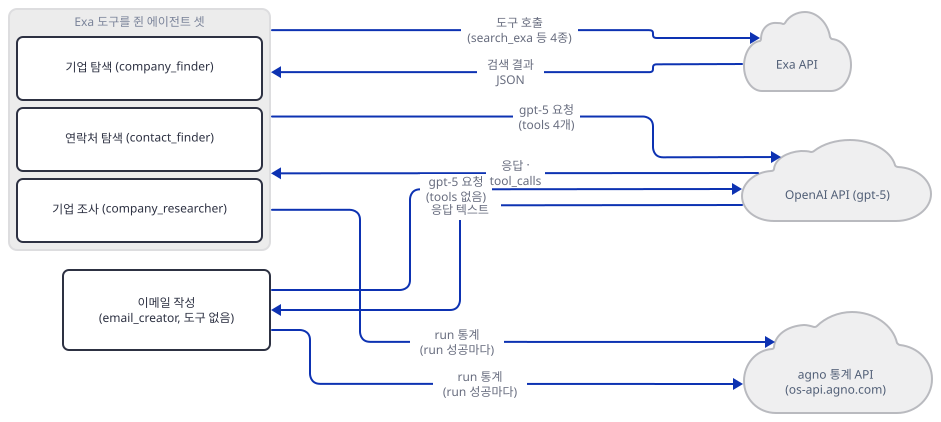

## 단계별 진행

### Step 1. 환경 만들기 — `requirements.txt`가 빠뜨린 두 패키지

**목적.** 앱 폴더에 독립 가상환경을 만들고, 파일이 import되는 데까지 필요한 패키지를 채웁니다.

**할 일.** `requirements.txt`는 네 줄입니다(마지막 줄에 개행이 없어 `wc -l`은 3으로 셉니다).

`advanced_ai_agents/single_agent_apps/ai_email_gtm_reachout_agent/requirements.txt:1-4`

```text
agno>=2.0.4
streamlit>=1.32.0
pydantic>=2.0.0
openai>=1.0.0
```

네 줄 모두 상한이 없어서 이 문서를 만든 2026-10-05에는 agno 3.1.1, streamlit 1.65.0, pydantic 2.13.5, openai 3.24.0이 풀렸습니다(직접 확인, 아래 첫 명령). 앱 폴더 안에서 환경을 만듭니다.

```bash
cd advanced_ai_agents/single_agent_apps/ai_email_gtm_reachout_agent
uv venv
uv pip install -r requirements.txt
```

(pip 대안: `python -m venv .venv`로 만들어 활성화한 뒤 `pip install -r requirements.txt`. 이후 모든 `uv run`에는 `--no-project`를 붙입니다. 이유는 [공통 사전 준비](../README.md#공통-사전-준비-한-번만)에 있습니다.)

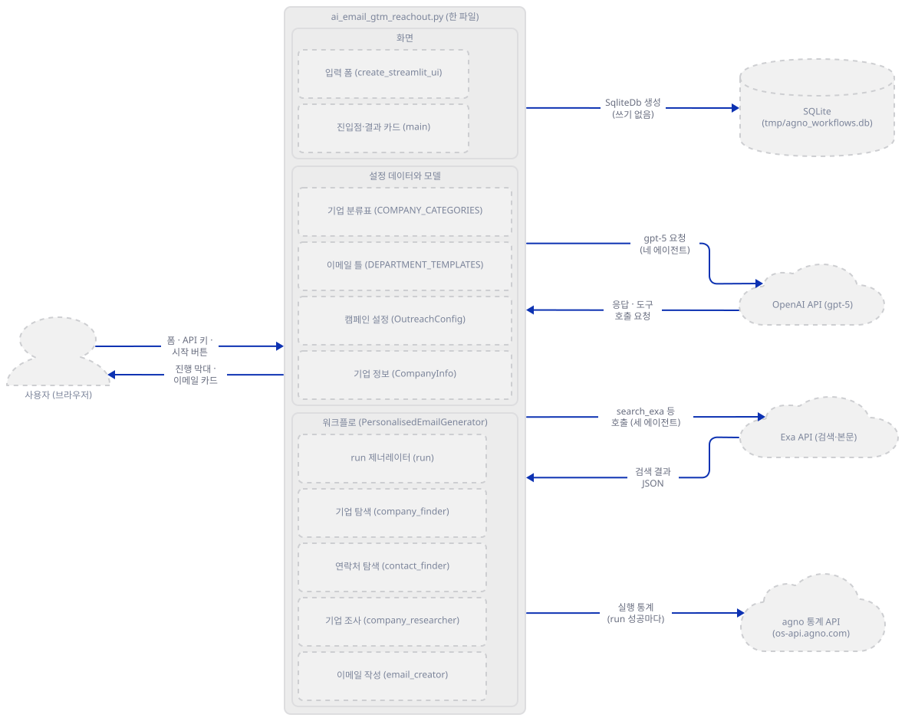

**확인.** 버전을 보고 파일을 컴파일합니다.

```bash
uv run --no-project python -c "import sys, importlib.metadata as m; print(sys.version.split()[0], *(f'{p} {m.version(p)}' for p in ('agno', 'streamlit', 'pydantic', 'openai')))"
uv run --no-project python -m py_compile ai_email_gtm_reachout.py && echo compiled
```

직접 확인한 출력입니다.

```
3.13.3 agno 3.1.1 streamlit 1.65.0 pydantic 2.13.5 openai 3.24.0
compiled
```

컴파일은 통과해도 실제로 불러오면 10행에서 멈춥니다. 앱이 맨 위에서 import하는 agno 모듈 가운데 둘이 이 설치에는 없는 패키지를 요구하기 때문입니다.

`advanced_ai_agents/single_agent_apps/ai_email_gtm_reachout_agent/ai_email_gtm_reachout.py:8-15`

```python
from agno.agent import Agent
from agno.models.openai import OpenAIChat
from agno.db.sqlite import SqliteDb
from agno.tools.exa import ExaTools
from agno.utils.log import logger
from agno.utils.pprint import pprint_run_response
from agno.workflow import Workflow
from pydantic import BaseModel, Field
```

```bash
uv run --no-project python -c "from agno.db.sqlite import SqliteDb"
uv run --no-project python -c "from agno.tools.exa import ExaTools"
```

각 명령이 트레이스백 끝에 남기는 줄은 이렇습니다(직접 확인).

```
ModuleNotFoundError: No module named 'sqlalchemy'
ImportError: `exa_py` not installed. Please install using `pip install exa_py`
```

`sqlalchemy`는 agno의 `sqlite` extra에, `exa_py`는 `exa` extra에 들어 있습니다(agno 3.1.1 메타데이터로 확인). 둘을 한 번에 채웁니다.

```bash
uv pip install "agno[sqlite,exa]"
uv run --no-project python -c "from agno.db.sqlite import SqliteDb; from agno.tools.exa import ExaTools; print('ok')"
```

설치되는 것은 넷이고(`aiosqlite==0.22.1`, `exa-py==2.25.0`, `greenlet==3.5.6`, `sqlalchemy==2.1.3` — 설치 시점에 따라 버전은 달라집니다) 두 import는 `ok`를 찍습니다(직접 확인). 마지막으로 이 터미널에서 가짜 키와 통계 끄기를 걸어 둡니다. 키 두 개는 어디에도 인증되지 않는 가짜 값이고, 이 환경변수는 이 터미널에서만 유효합니다.

```bash
export EXA_API_KEY=exa-fake OPENAI_API_KEY=sk-fake AGNO_TELEMETRY=false
```

```powershell
$env:EXA_API_KEY = "exa-fake"; $env:OPENAI_API_KEY = "sk-fake"; $env:AGNO_TELEMETRY = "false"
```

### Step 2. 캠페인 설정 — 입력 모델과 이메일 틀 사전

**목적.** 화면이 모으는 값이 어떤 모양의 설정이 되는지, 이메일 틀 사전이 화면의 선택지와 얼마나 맞물리는지 확인합니다.

**할 일.** 화면과 워크플로 사이를 오가는 설정은 `OutreachConfig` 하나입니다. 서비스 종류와 회사 크기와 수준은 `Literal`이라 목록 밖의 값으로는 만들어지지 않습니다.

`advanced_ai_agents/single_agent_apps/ai_email_gtm_reachout_agent/ai_email_gtm_reachout.py:217-238`

```python
class OutreachConfig(BaseModel):
    """Configuration for email outreach"""
    company_category: str = Field(..., description="Type of companies to target")
    target_departments: List[str] = Field(
        ..., 
        description="Departments to target (e.g., GTM, HR, Engineering)"
    )
    service_type: Literal[
        "Software Solution",
        "Consulting Services",
        "Professional Services",
        "Technology Platform",
        "Custom Development"
    ] = Field(..., description="Type of service being offered")
    company_size_preference: Literal["Startup (1-50)", "SMB (51-500)", "Enterprise (500+)", "All Sizes"] = Field(
        default="All Sizes",
        description="Preferred company size"
    )
    personalization_level: Literal["Basic", "Medium", "Deep"] = Field(
        default="Deep", 
        description="Level of personalization"
    )
```

바로 아래의 `ContactInfo`(`advanced_ai_agents/single_agent_apps/ai_email_gtm_reachout_agent/ai_email_gtm_reachout.py:240-248`)는 어디서도 쓰이지 않고, 칸이 32개인 `CompanyInfo`(`advanced_ai_agents/single_agent_apps/ai_email_gtm_reachout_agent/ai_email_gtm_reachout.py:250-318`)는 `run`이 넷만 채웁니다(Step 5). 분류표 `COMPANY_CATEGORIES`는 선택지와 안내 문구와 "대표 직책" 목록이고, 이메일 틀 사전 `DEPARTMENT_TEMPLATES`는 부서에서 서비스 종류로 두 단계를 내려가 틀 문자열에 닿습니다. 틀 안의 `[RECIPIENT_NAME]` 같은 자리표시를 앱이 직접 치환하지는 않고 틀 전체를 모델에 넘깁니다(Step 6).

화면의 부서 일곱 개와 서비스 종류 다섯 개를 이 사전과 맞춰 보는 파일을 `check_templates.py`로 저장합니다. 선택지는 `AppTest`로 화면을 한 번 그려서 위젯에서 읽어 오므로 앱 코드를 베끼지 않습니다.

```python
# check_templates.py - 화면의 선택지 가운데 이메일 틀을 찾는 조합이 몇 개인지 센다
import logging

logging.disable(logging.WARNING)
import ai_email_gtm_reachout as app
from streamlit.testing.v1 import AppTest

at = AppTest.from_file("ai_email_gtm_reachout.py", default_timeout=60).run()
departments = at.multiselect(key="target_departments").options
services = at.selectbox(key="service_type").options
found = [(d, s) for d in departments for s in services if s in app.DEPARTMENT_TEMPLATES.get(d, {})]
print("부서", len(departments), "x 서비스", len(services), "=", len(departments) * len(services), "| 틀을 찾는 조합:", len(found))
for pair in found:
    print("  ", pair)
print("화면이 못 고르는 틀:", [(d, s) for d, t in app.DEPARTMENT_TEMPLATES.items() for s in t if (d, s) not in found])
```

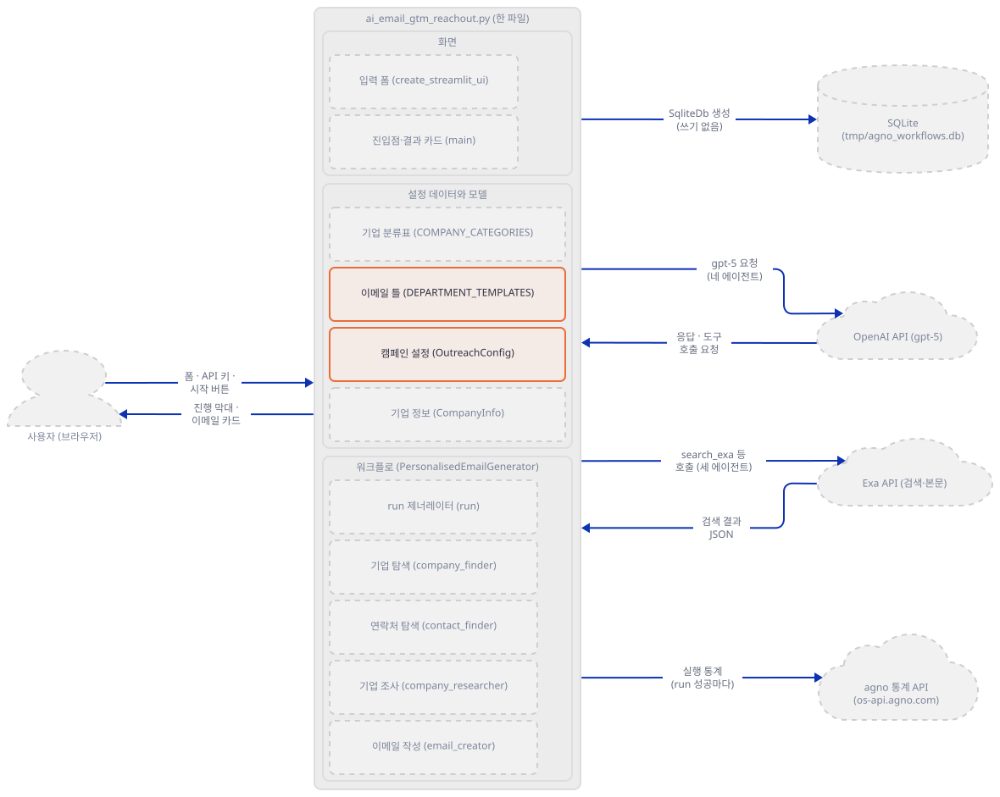

**확인.**

```bash
uv run --no-project python check_templates.py
```

직접 확인한 출력입니다.

```
부서 7 x 서비스 5 = 35 | 틀을 찾는 조합: 4
   ('GTM (Sales & Marketing)', 'Software Solution')
   ('GTM (Sales & Marketing)', 'Consulting Services')
   ('Human Resources', 'Software Solution')
   ('Human Resources', 'Consulting Services')
화면이 못 고르는 틀: [('Human Resources', 'Investment Opportunity'), ('Marketing Professional', 'Product Demo'), ('Marketing Professional', 'Service Offering'), ('B2B Sales Representative', 'Product Demo'), ('B2B Sales Representative', 'Service Offering')]
```

화면이 줄 수 있는 35개 조합 중 틀을 찾는 것은 4개이고, 틀 아홉 개 중 다섯 개는 화면에서 고를 수 없습니다. 나머지 31개 조합은 Step 6의 폴백 틀이 대신합니다. 설정 모델은 목록 밖 값을 실제로 거부합니다. `OutreachConfig(..., service_type='Consulting')`은 `Input should be 'Software Solution', 'Consulting Services', ...`로 시작하는 `ValidationError`를 냅니다(직접 확인).

### Step 3. 에이전트 넷과 키 — 클래스가 만들어지는 순간

**목적.** 네 에이전트가 모듈이 실행될 때 한꺼번에 만들어진다는 것과, 키가 그 순간의 `os.environ`에서 들어간다는 것을 확인합니다.

**할 일.** `PersonalisedEmailGenerator`는 `Workflow`를 상속하고 `Agent` 넷을 클래스 속성으로 정의합니다. 하나만 보면 이렇습니다.

`advanced_ai_agents/single_agent_apps/ai_email_gtm_reachout_agent/ai_email_gtm_reachout.py:345-349`

```python
    company_finder: Agent = Agent(
        model=OpenAIChat(id="gpt-5"),
        tools=[ExaTools(api_key=os.environ["EXA_API_KEY"])],
        description="Expert at finding companies that match specific criteria using web search",
        instructions=dedent("""\
```

`contact_finder`와 `company_researcher`도 같은 모양이고 지시문만 다릅니다. `email_creator`만 `tools=`가 없습니다. 클래스 본문은 파일이 실행될 때 돌고, Streamlit에서는 화면을 건드릴 때마다 스크립트가 처음부터 다시 돌기 때문에 에이전트 넷도 그때마다 새로 만들어집니다. 그러니 `os.environ["EXA_API_KEY"]`는 그 순간의 값입니다. 그 환경변수를 채우는 코드는 파일 맨 위에 있습니다.

`advanced_ai_agents/single_agent_apps/ai_email_gtm_reachout_agent/ai_email_gtm_reachout.py:17-25`

```python
# Initialize API keys from environment or empty defaults
if 'EXA_API_KEY' not in st.session_state:
    st.session_state.EXA_API_KEY = os.getenv("EXA_API_KEY", "")
if 'OPENAI_API_KEY' not in st.session_state:
    st.session_state.OPENAI_API_KEY = os.getenv("OPENAI_API_KEY", "")

# Set environment variables
os.environ["EXA_API_KEY"] = st.session_state.EXA_API_KEY
os.environ["OPENAI_API_KEY"] = st.session_state.OPENAI_API_KEY
```

세션 상태에 없을 때만 셸의 환경변수로 초기화하고, 스크립트가 도는 매번 `os.environ`에 되씁니다. 사이드바 입력칸이 이 흐름에 끼는 자리는 Step 7에서 보고, 전체는 아래 그림입니다. OpenAI 쪽은 `OpenAIChat(id="gpt-5")`가 키를 받지 않으므로 agno가 첫 호출 때 `OPENAI_API_KEY`를 읽습니다. 이 메커니즘은 Day 003 Step 3이 확인한 것과 같고, 이 문서는 agno 3.1.1의 `agno/models/openai/chat.py`로 다시 읽어 확인했습니다.

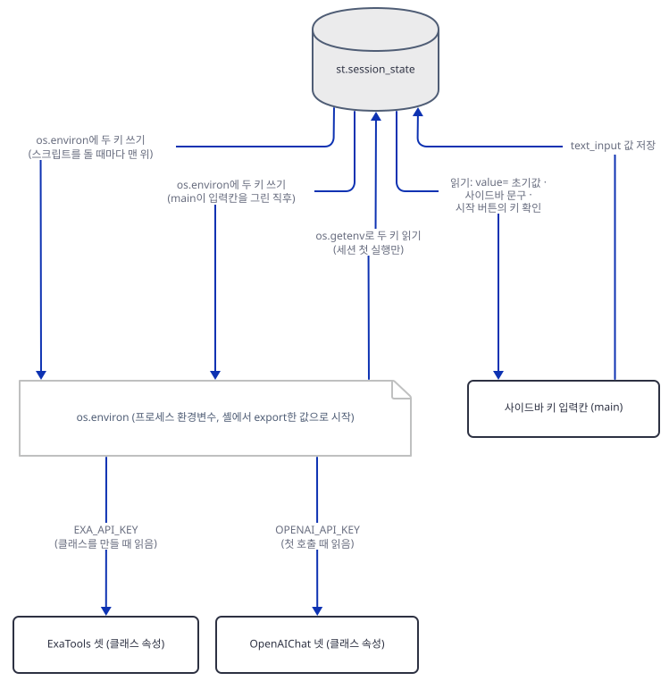

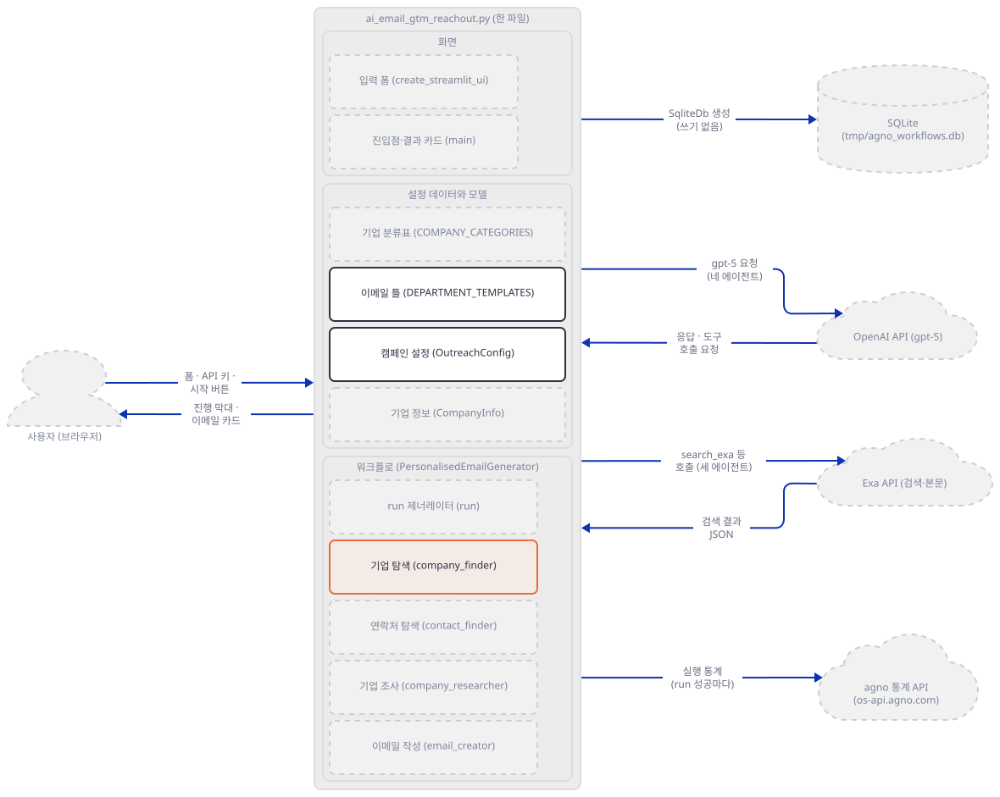

**확인.** 먼저 키가 있는 채로 에이전트가 무엇을 쥐었는지 봅니다. `logging.disable(logging.WARNING)`은 Streamlit이 bare mode에서 내는 경고와 agno의 INFO 로그를 가립니다.

```bash
uv run --no-project python -c "import logging; logging.disable(logging.WARNING); import ai_email_gtm_reachout as app; w = app.PersonalisedEmailGenerator; [print(n, getattr(w, n).model.id, [f for t in getattr(w, n).tools or [] for f in t.functions]) for n in ('company_finder', 'contact_finder', 'company_researcher', 'email_creator')]"
```

직접 확인한 출력입니다.

```
company_finder gpt-5 ['search_exa', 'get_contents', 'find_similar', 'exa_answer']
contact_finder gpt-5 ['search_exa', 'get_contents', 'find_similar', 'exa_answer']
company_researcher gpt-5 ['search_exa', 'get_contents', 'find_similar', 'exa_answer']
email_creator gpt-5 []
```

이제 같은 파일을 `EXA_API_KEY` 없이 불러 봅니다. `os.environ.pop`이 이 프로세스 안에서만 키를 뺍니다.

```bash
uv run --no-project python -c "import os, logging; logging.disable(logging.WARNING); os.environ.pop('EXA_API_KEY', None); import ai_email_gtm_reachout"
```

예외 없이 끝나고 `ExaTools` 생성자가 세 줄을 남깁니다. 에이전트가 셋이고 그 셋이 Exa 도구를 쥐니 세 줄입니다(직접 확인).

```
ERROR   EXA_API_KEY not set. Please set the EXA_API_KEY environment variable.
ERROR   EXA_API_KEY not set. Please set the EXA_API_KEY environment variable.
ERROR   EXA_API_KEY not set. Please set the EXA_API_KEY environment variable.
```

### Step 4. 기업 탐색 — `run()`의 첫 호출과 가짜 모델 서버

**목적.** `run()`이 첫 호출로 기업 탐색 에이전트를 부르는 모습을, 모델 호출을 이 PC의 가짜 서버로 돌려 요청 하나하나까지 확인합니다.

**할 일.** `run()`의 앞부분입니다.

`advanced_ai_agents/single_agent_apps/ai_email_gtm_reachout_agent/ai_email_gtm_reachout.py:482-502`

```python
        # Step 1: Discover companies
        logger.info("🔍 Discovering target companies...")
        search_query = f"""
        Find {num_companies} {config.company_category} companies that would be good prospects for {config.service_type}.
        
        Company criteria:
        - Industry: {config.company_category}
        - Size: {config.company_size_preference}
        - Target departments: {', '.join(config.target_departments)}
        
        Look for companies showing growth, recent funding, or expansion.
        """
        
        companies_response = self.company_finder.run(search_query)
        if not companies_response or not companies_response.content:
            logger.error("No companies found")
            return

        # Parse companies from response
        companies_text = companies_response.content
        logger.info(f"Found companies: {companies_text[:200]}...")
```

검색 지시문을 f-문자열로 만들어 `company_finder.run(...)`에 넘기고, 응답의 `.content`를 `companies_text`라는 문자열로 받습니다. 구조화된 출력이 아니라 텍스트입니다. `run`에는 `yield`가 있으므로 부르는 순간에는 본문이 돌지 않고 제너레이터가 돌아옵니다(파이썬 규칙). 화면의 `for` 루프가 첫 값을 당길 때 위 코드가 처음 실행됩니다.

가짜 서버를 `fake_openai.py`로 저장합니다. 표준 라이브러리만 쓰고 `127.0.0.1`에서만 듣습니다. 시스템 프롬프트의 문구로 어느 에이전트의 요청인지 알아보고, 요청의 모양을 한두 줄로 찍은 뒤 문장을 돌려줍니다. 키 끝에 `bad`가 붙으면 401로, `tool`이 붙으면 첫 요청에 `search_exa` 호출로 답합니다.

```python
# fake_openai.py - 이 PC에서만 듣는 가짜 OpenAI 호환 서버 (표준 라이브러리만 씀)
import json
from http.server import BaseHTTPRequestHandler, ThreadingHTTPServer

PORT = 58214                       # 아무 높은 포트나 괜찮다. 다른 프로그램과 겹치면 바꾼다.

REPLY = {                          # 시스템 프롬프트에 들어 있는 문구 -> 돌려줄 텍스트
    "company discovery specialist": "1. Northwind Metrics (https://northwind-metrics.example)\n2. Bluefin Retail Cloud (https://bluefin-retail.example)",
    "contact research specialist": "Dana Okafor, VP of Growth, dana.okafor@northwind-metrics.example",
    "Research companies in depth": "Sells usage analytics to mid-size SaaS teams. Pain point: slow onboarding. " * 5,   # 일부러 길게(380자)
    "20-year-old sales rep": "Subject: Faster onboarding\n\nHey Dana,\n\nSaw your new self-serve tier. Want a quick chat?\n\nBest,\nSarah",
}


class Handler(BaseHTTPRequestHandler):
    def log_message(self, *args):
        pass

    def send_json(self, code, obj):
        data = json.dumps(obj).encode()
        self.send_response(code)
        self.send_header("content-type", "application/json")
        self.send_header("content-length", str(len(data)))
        self.end_headers()
        self.wfile.write(data)

    def do_POST(self):
        body = json.loads(self.rfile.read(int(self.headers["content-length"])))
        key = self.headers.get("authorization", "")             # "Bearer <OPENAI_API_KEY>"
        if key.endswith("bad"):                                  # 키가 bad로 끝나면 잘못된 키 흉내
            print("401: 키가 bad로 끝남", flush=True)
            return self.send_json(401, {"error": {"message": "Incorrect API key provided.", "type": "invalid_request_error", "param": None, "code": "invalid_api_key"}})
        messages = body["messages"]
        text = "\n".join(str(m.get("content")) for m in messages)
        who = next((k for k in REPLY if k in text), "unknown")
        tools = [t["function"]["name"] for t in body.get("tools", [])]
        user = next(m["content"] for m in reversed(messages) if m["role"] == "user")
        print(f"{who} | model={body['model']} roles={[m['role'] for m in messages]} tools={tools}", flush=True)
        print("   user:", " ".join(user.split())[:110], flush=True)
        if who == "20-year-old sales rep":                       # 이메일 작성 요청이면 JSON 컨텍스트를 풀어 요약한다
            context = json.loads(user.split("\n", 1)[1])
            print("   context 키:", list(context), flush=True)
            print("   company_info 중 값이 있는 칸:", [k for k, v in context["company_info"].items() if v is not None], flush=True)
            print("   template 둘째 문단:", context["template"].split("\n")[2][:60], flush=True)
        asks_search = key.endswith("tool") and who == "company discovery specialist" and not any(m["role"] == "tool" for m in messages)
        if asks_search:                                          # 키가 tool로 끝나면 첫 요청에 search_exa 호출을 돌려준다
            call = {"id": "call_1", "type": "function", "function": {"name": "search_exa", "arguments": json.dumps({"query": "fast-growing SaaS analytics companies", "num_results": 2})}}
            message, finish = {"role": "assistant", "content": None, "tool_calls": [call]}, "tool_calls"
        else:
            message, finish = {"role": "assistant", "content": REPLY.get(who, "ok")}, "stop"
        self.send_json(200, {"id": "chatcmpl-fake", "object": "chat.completion", "created": 0, "model": body["model"],
                             "choices": [{"index": 0, "message": message, "finish_reason": finish}],
                             "usage": {"prompt_tokens": 1, "completion_tokens": 1, "total_tokens": 2}})


print(f"가짜 서버: http://127.0.0.1:{PORT}/v1", flush=True)
ThreadingHTTPServer(("127.0.0.1", PORT), Handler).serve_forever()
```

모델 호출이 이 서버로 가게 하는 것은 환경변수 하나입니다. OpenAI SDK는 `OPENAI_BASE_URL`을 읽고, agno는 `base_url`을 넘기지 않습니다(직접 확인: 이 변수만으로 요청이 가짜 서버에 닿았습니다). 워크플로를 Streamlit 없이 돌리는 `drive.py`도 저장합니다. 세 에이전트의 `ExaTools.exa`를 로컬 대역으로 갈아 끼워서 진짜 Exa에는 아무것도 가지 않게 하고, `run()`이 내놓는 값을 찍습니다.

```python
# drive.py - 앱 모듈을 Streamlit 없이 불러 워크플로 하나를 돌리고, yield되는 dict를 찍는다
#   python drive.py count=2 first=1 dept="Human Resources" service="Consulting Services"
import logging
import sys

logging.disable(logging.WARNING)       # Streamlit의 bare mode 경고와 agno의 INFO 로그를 가린다
import ai_email_gtm_reachout as app
from agno.db.sqlite import SqliteDb

args = dict(a.split("=", 1) for a in sys.argv[1:])
count = int(args.get("count", 2))
department = args.get("dept", "GTM (Sales & Marketing)")
service = args.get("service", "Software Solution")


class StubExa:
    """Exa 클라이언트 대역. 진짜 Exa에는 아무것도 보내지 않는다."""

    def search_and_contents(self, query, **kwargs):
        print("   [Exa 대역] search_and_contents", repr(query), kwargs, flush=True)
        page = type("Page", (), dict(url="https://northwind-metrics.example", title="Northwind Metrics", author="", published_date=None, text="stub page text"))()
        return type("Found", (), dict(results=[page]))()


for name in ("company_finder", "contact_finder", "company_researcher"):
    getattr(app.PersonalisedEmailGenerator, name).tools[0].exa = StubExa()

workflow = app.PersonalisedEmailGenerator(session_id="streamlit-email-generator", db=SqliteDb(db_file="tmp/agno_workflows.db"))
config = app.OutreachConfig(company_category="SaaS/Technology Companies", target_departments=[department], service_type=service)
sender = {"name": "Sarah Chen", "email": "sarah@example.com", "organization": "Data Consultants Inc", "service_offered": "We build data products"}

for result in workflow.run(config=config, sender_details=sender, num_companies=count, use_cache=True):
    if "email" in result:
        data = result["company_data"]
        print("카드:", result["company_name"], "| 이메일 첫 줄:", result["email"].splitlines()[0])
        print("   company_data:", {k: v for k, v in data.items() if v is not None and k != "core_business"}, "| core_business", len(data["core_business"]), "자 | None인 칸", sum(v is None for v in data.values()), "개")
    else:
        print("진행:", result["progress"], result["status"])
    if "first" in args:
        break
```

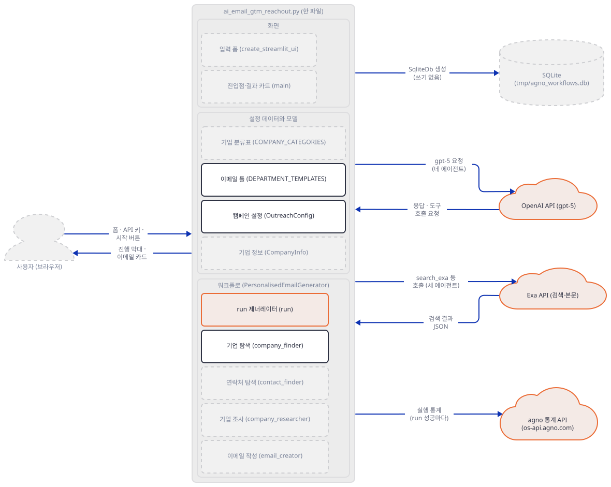

**확인.** 새 터미널을 열어(앱 폴더에서) 서버를 띄웁니다. 환경변수는 필요 없고, 끝나면 Ctrl+C로 끕니다.

```bash
uv run --no-project python fake_openai.py
```

Step 1의 환경변수를 건 원래 터미널로 돌아와 모델 주소를 이 서버로 돌린 뒤 첫 값 하나만 당깁니다.

```bash
export OPENAI_BASE_URL=http://127.0.0.1:58214/v1
uv run --no-project python drive.py count=2 first=1
```

```powershell
$env:OPENAI_BASE_URL = "http://127.0.0.1:58214/v1"
uv run --no-project python drive.py count=2 first=1
```

직접 확인한 출력입니다. 드라이버 쪽은 한 줄이고, 서버는 기업 탐색 요청 하나를 찍습니다.

```
진행: 0.1 Finding contacts...
```

```
가짜 서버: http://127.0.0.1:58214/v1
company discovery specialist | model=gpt-5 roles=['developer', 'user'] tools=['exa_answer', 'find_similar', 'get_contents', 'search_exa']
   user: Find 2 SaaS/Technology Companies companies that would be good prospects for Software Solution. Company criteri
```

첫 값이 나오기 전에 모델 호출이 정확히 한 번 있었습니다. 요청의 `roles`가 `system`이 아니라 `developer`인 것은 agno의 `OpenAIChat`이 시스템 메시지를 그렇게 매핑하기 때문입니다(agno 3.1.1 소스로 확인). 도구는 이름이 알파벳 순으로 정렬돼 네 개가 실립니다. 프롬프트의 "Companies companies"는 분류 이름이 이미 `Companies`로 끝나는데 지시문 템플릿이 또 `companies`를 붙인 결과입니다.

이제 모델이 검색을 요청하는 경우를 봅니다. 키 끝에 `tool`을 붙이면 가짜 서버가 첫 요청에 `search_exa`를 부르라고 답합니다.

```bash
OPENAI_API_KEY=sk-fake-tool uv run --no-project python drive.py count=2 first=1
```

```powershell
$env:OPENAI_API_KEY = "sk-fake-tool"; uv run --no-project python drive.py count=2 first=1; $env:OPENAI_API_KEY = "sk-fake"
```

드라이버 쪽에 Exa 대역이 받은 호출이 찍히고(직접 확인), 서버에는 같은 에이전트의 요청이 둘 찍힙니다. 둘째 요청의 `roles`에 `assistant`와 `tool`이 늘었습니다.

```
   [Exa 대역] search_and_contents 'fast-growing SaaS analytics companies' {'text': True, 'summary': False, 'num_results': 2}
진행: 0.1 Finding contacts...
```

```
company discovery specialist | model=gpt-5 roles=['developer', 'user'] tools=['exa_answer', 'find_similar', 'get_contents', 'search_exa']
   user: Find 2 SaaS/Technology Companies companies that would be good prospects for Software Solution. Company criteri
company discovery specialist | model=gpt-5 roles=['developer', 'user', 'assistant', 'tool'] tools=['exa_answer', 'find_similar', 'get_contents', 'search_exa']
   user: Find 2 SaaS/Technology Companies companies that would be good prospects for Software Solution. Company criteri
```

`search_exa`가 Exa 클라이언트의 `search_and_contents(query, text=True, summary=False, num_results)`로 이어지는 것이 보입니다(나머지 도구 셋은 각각 `get_contents`, `find_similar_and_contents`, `answer`로 이어집니다 — agno 3.1.1 소스로 확인). 위 그림의 Exa 화살표가 이 호출이고, 진짜 모델이 도구를 쓸지는 모델이 정합니다.

agno의 익명 사용 통계는 Day 047 Step 5가 다룬 그것과 같습니다. 성공한 `agent.run()`마다 `POST /telemetry/runs` 한 건이 `os-api.agno.com`으로 가고(질문·응답은 담기지 않습니다), 캠페인 한 번이면 에이전트 실행이 `1 + 3 × 회사 수`번이니 그만큼 나갑니다. 이 문서가 통계 주소를 로컬 수신기로 돌려 받아 보니 회사 두 곳에 7건이었습니다(직접 확인). `AGNO_TELEMETRY=false`를 걸면 나가려는 시도 자체가 없었습니다(직접 확인). 그래서 이 문서의 명령은 모두 그 변수를 걸고 돕니다.

### Step 5. 회사별 루프 — 같은 목록을 매번 통째로 붙인다

**목적.** 회사마다 도는 루프가 에이전트에 무엇을 넘기고, 응답 텍스트가 어디까지 가는지 확인합니다.

**할 일.** 루프는 `num_companies`번 돌고, 한 바퀴에 연락처 에이전트를 부릅니다.

`advanced_ai_agents/single_agent_apps/ai_email_gtm_reachout_agent/ai_email_gtm_reachout.py:505-531`

```python
        for i in range(num_companies):
            try:
                logger.info(f"Processing company #{i+1}")
                
                # Yield progress update
                yield {
                    "step": f"Processing company {i+1}/{num_companies}",
                    "progress": (i + 0.2) / num_companies,
                    "status": "Finding contacts..."
                }
                
                # Extract company info from the response
                company_search = f"Extract company #{i+1} details from: {companies_text}"
                
                # Step 3: Find decision maker contacts
                logger.info("👥 Finding decision maker contacts...")
                contacts_query = f"""
                Find decision makers at company #{i+1} from this list: {companies_text}
                
                Focus on roles in: {', '.join(config.target_departments)}
                Find their email addresses and LinkedIn profiles.
                """
                
                contacts_response = self.contact_finder.run(contacts_query)
                if not contacts_response or not contacts_response.content:
                    logger.warning(f"No contacts found for company #{i+1}")
                    continue
```

세 가지가 눈에 띕니다. 먼저 `yield`하는 dict의 `progress`는 한 바퀴에 `(i + 0.2) / num_companies`, `(i + 0.4) / num_companies`, `(i + 0.6) / num_companies`로 오르고, 완성된 카드에서 `(i + 1) / num_companies`가 됩니다. 둘째, 프롬프트에서 "이 회사"를 가리키는 것은 번호 `#{i+1}` 하나이고 목록 전체(`companies_text`)가 매번 통째로 붙습니다. 목록에서 몇 번째를 골라야 하는지는 모델의 몫입니다. 셋째, 발췌의 `company_search`(원본 517행)는 만들기만 하고 어디서도 쓰지 않습니다(소스로 확인). 기업 조사 에이전트도 똑같이 불린 뒤, 응답은 이렇게 쓰입니다.

`advanced_ai_agents/single_agent_apps/ai_email_gtm_reachout_agent/ai_email_gtm_reachout.py:560-566`

```python
                # Create a basic company info structure from the research
                company_data = CompanyInfo(
                    company_name=f"Company #{i+1}",  # Will be updated with actual name
                    website_url="",  # Will be updated with actual URL
                    industry="Unknown",
                    core_business=research_content[:200] if research_content else "No data available"
                )
```

회사 이름과 웹사이트와 업종은 이름표만 붙은 값이고(주석이 "나중에 갱신"이라고 하지만 갱신하는 코드는 없습니다), 조사 결과는 앞 200자만 `core_business`에 들어갑니다. 루프 횟수는 `range(num_companies)`라서 기업 탐색이 몇 곳을 돌려줬는지는 세지 않습니다(소스로 확인).

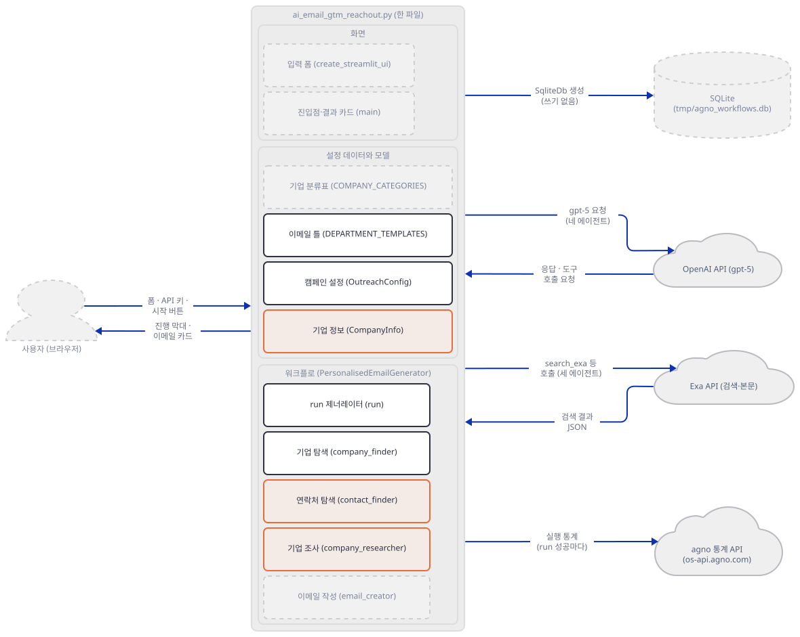

**확인.** 서버를 띄운 채 두 곳을 끝까지 돌립니다. Step 4의 `OPENAI_API_KEY`가 `sk-fake`로 돌아와 있어야 합니다.

```bash
uv run --no-project python drive.py count=2
```

직접 확인한 드라이버 출력입니다. 가짜 서버의 조사 응답은 일부러 380자로 길게 만들었습니다.

```
진행: 0.1 Finding contacts...
진행: 0.2 Researching company...
진행: 0.3 Generating email...
카드: Company #1 | 이메일 첫 줄: Subject: Faster onboarding
   company_data: {'company_name': 'Company #1', 'website_url': '', 'industry': 'Unknown'} | core_business 200 자 | None인 칸 28 개
진행: 0.6 Finding contacts...
진행: 0.7 Researching company...
진행: 0.8 Generating email...
카드: Company #2 | 이메일 첫 줄: Subject: Faster onboarding
   company_data: {'company_name': 'Company #2', 'website_url': '', 'industry': 'Unknown'} | core_business 200 자 | None인 칸 28 개
```

서버에는 회사마다 연락처·조사·이메일 요청 셋이 찍힙니다. 연락처와 조사 요청은 번호만 다르고 같은 목록을 붙입니다.

```
contact research specialist | model=gpt-5 roles=['developer', 'user'] tools=['exa_answer', 'find_similar', 'get_contents', 'search_exa']
   user: Find decision makers at company #1 from this list: 1. Northwind Metrics (https://northwind-metrics.example) 2.
Research companies in depth | model=gpt-5 roles=['developer', 'user'] tools=['exa_answer', 'find_similar', 'get_contents', 'search_exa']
   user: Research company #1 from this list: 1. Northwind Metrics (https://northwind-metrics.example) 2. Bluefin Retail
```

### Step 6. 이메일 작성 — 틀을 고르고 컨텍스트를 JSON으로 만든다

**목적.** 이메일 작성 에이전트가 무엇을 받는지, 틀을 고르는 규칙과 컨텍스트 JSON의 모양을 확인합니다.

**할 일.**

`advanced_ai_agents/single_agent_apps/ai_email_gtm_reachout_agent/ai_email_gtm_reachout.py:578-600`

```python
                # Get appropriate template based on target departments
                template_dept = config.target_departments[0] if config.target_departments else "GTM (Sales & Marketing)"
                if template_dept in DEPARTMENT_TEMPLATES and config.service_type in DEPARTMENT_TEMPLATES[template_dept]:
                    template = DEPARTMENT_TEMPLATES[template_dept][config.service_type]
                else:
                    template = DEPARTMENT_TEMPLATES["GTM (Sales & Marketing)"]["Software Solution"]
                
                email_context = json.dumps(
                    {
                        "template": template,
                        "company_info": company_data.model_dump(),
                        "contacts_info": contacts_response.content,
                        "sender_details": sender_details,
                        "target_departments": config.target_departments,
                        "service_type": config.service_type,
                        "personalization_level": config.personalization_level
                    },
                    indent=4,
                )
                
                email_response = self.email_creator.run(
                    f"Generate a personalized email using this context:\n{email_context}"
                )
```

틀은 선택한 부서 목록의 **첫 번째**만 보고(`target_departments[0]`), 그 부서와 서비스 종류 조합이 사전에 없으면 GTM의 `Software Solution` 틀로 물러납니다. Step 2에서 본 것처럼 화면이 줄 수 있는 35개 조합 중 31개가 이 폴백을 탑니다. 컨텍스트 JSON은 일곱 키이고, `company_info`는 32칸을 전부 싣습니다(값이 없는 28칸은 `null`). `personalization_level`은 이 JSON에 낱말로 실릴 뿐 앱 코드가 수준에 따라 갈라지는 곳은 없고(파일에서 이 값을 읽는 곳은 JSON을 만드는 줄과 요약 지표 표시뿐 — 소스로 확인), 회사 크기 선택도 검색 지시문 문자열로만 갑니다. 이메일 작성 에이전트에는 도구가 없어 이 호출은 모델 한 번으로 끝납니다.

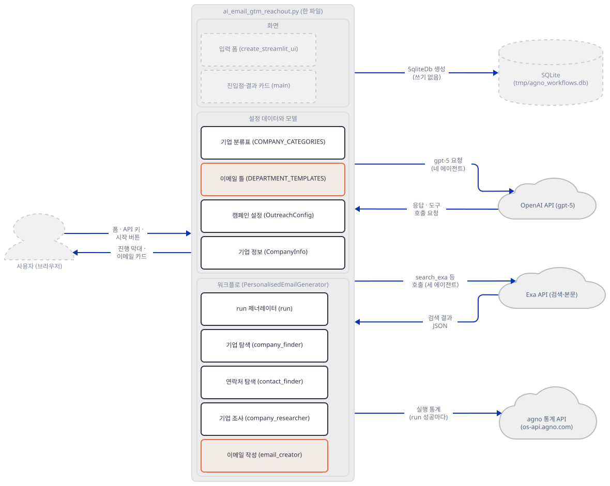

**확인.** 서버가 이메일 요청의 컨텍스트를 풀어 찍어 줍니다. 한 곳만 돌려 기본값(GTM·Software Solution)부터 봅니다.

```bash
uv run --no-project python drive.py count=1
```

직접 확인한 서버 출력의 이메일 요청 부분입니다.

```
20-year-old sales rep | model=gpt-5 roles=['developer', 'user'] tools=[]
   user: Generate a personalized email using this context: { "template": "Hey [RECIPIENT_NAME],\n\nI noticed [COMPANY_N
   context 키: ['template', 'company_info', 'contacts_info', 'sender_details', 'target_departments', 'service_type', 'personalization_level']
   company_info 중 값이 있는 칸: ['company_name', 'website_url', 'industry', 'core_business']
   template 둘째 문단: I noticed [COMPANY_NAME]'s impressive [GTM_INITIATIVE] and y
```

이제 부서와 서비스 종류를 바꿔 틀이 바뀌는지 봅니다. 값에 공백이 있으니 `키=값` 전체를 따옴표로 묶습니다.

```bash
uv run --no-project python drive.py count=1 "dept=Human Resources" "service=Consulting Services"
uv run --no-project python drive.py count=1 "dept=Finance" "service=Custom Development"
```

각 실행이 서버에 남기는 `template 둘째 문단` 줄은 이렇습니다(직접 확인). 인사(HR)·컨설팅은 HR 틀의 문단이, 재무·맞춤 개발은 사전에 없는 조합이라 기본 조합(GTM·Software Solution)의 틀과 같은 문단이 갑니다.

```
   template 둘째 문단: I've been following [COMPANY_NAME]'s journey in [INDUSTRY],
   template 둘째 문단: I noticed [COMPANY_NAME]'s impressive [GTM_INITIATIVE] and y
```

### Step 7. 화면 — 키 입력, 진행 막대, 카드

**목적.** 화면이 키와 폼과 진행과 카드를 다루는 방식을 서버 없이 `AppTest`로 돌려 보고, 사용자가 겪을 세 가지(키가 한 박자 늦게 들어감, 오류 문장이 이메일로 보임, 버튼을 누르면 카드가 사라짐)를 재현합니다.

**할 일.** 사이드바 입력칸은 값을 세션 상태에 저장하고 곧바로 `os.environ`에 되씁니다.

`advanced_ai_agents/single_agent_apps/ai_email_gtm_reachout_agent/ai_email_gtm_reachout.py:784-801`

```python
        st.session_state.EXA_API_KEY = st.sidebar.text_input(
            "Exa API Key *",
            value=st.session_state.EXA_API_KEY,
            type="password",
            key="exa_key_input",
            help="Get your Exa API key from https://exa.ai"
        )
        st.session_state.OPENAI_API_KEY = st.sidebar.text_input(
            "OpenAI API Key *",
            value=st.session_state.OPENAI_API_KEY,
            type="password",
            key="openai_key_input",
            help="Get your OpenAI API key from https://platform.openai.com"
        )
        
        # Update environment variables
        os.environ["EXA_API_KEY"] = st.session_state.EXA_API_KEY
        os.environ["OPENAI_API_KEY"] = st.session_state.OPENAI_API_KEY
```

이 되쓰기는 Step 3의 클래스 본문보다 **나중에** 실행되므로, 입력한 키가 `ExaTools`에 닿는 것은 그다음 스크립트 실행부터입니다. 시작 버튼의 처리는 이렇습니다.

`advanced_ai_agents/single_agent_apps/ai_email_gtm_reachout_agent/ai_email_gtm_reachout.py:836-876`

```python
        if st.button("🚀 Start Automated Campaign", key="generate_button", type="primary"):
            # Check if API keys are configured
            if not st.session_state.EXA_API_KEY or not st.session_state.OPENAI_API_KEY:
                st.error("❌ Please configure both API keys before starting the campaign")
                st.stop()
            
            try:
                # Progress tracking
                progress_bar = st.progress(0)
                status_text = st.empty()
                results_container = st.container()
                with st.spinner("Initializing AI research agents..."):
                    # Setup the database
                    db = SqliteDb(
                        db_file="tmp/agno_workflows.db",
                    )
                    
                    workflow = PersonalisedEmailGenerator(
                        session_id="streamlit-email-generator",
                        db=db
                    )
                
                status_text.text("🔍 Discovering companies and generating emails...")
                
                # Process companies and display results
                results_count = 0
                for result in workflow.run(
                    config=config,
                    sender_details=sender_details,
                    num_companies=num_companies,
                    use_cache=True
                ):
                    # Update progress bar and status
                    if 'email' not in result:
                        progress_bar.progress(result['progress'])
                        status_text.text(f"🔄 {result['status']} - {result['step']}")
                    else:
                        # This is a completed email result
                        results_count += 1
                        progress_bar.progress(result.get('progress', results_count / num_companies))
                        status_text.text(f"✅ {result['step']}")
```

`workflow.run(...)`이 내놓는 dict는 `email` 키가 없으면 진행 신호, 있으면 완성된 카드입니다. 카드는 탭 넷(이메일·조사·연락처·요약)으로 그려지고, 그 안의 복사 버튼은 이렇습니다.

`advanced_ai_agents/single_agent_apps/ai_email_gtm_reachout_agent/ai_email_gtm_reachout.py:923-924`

```python
                                    if st.button(f"📋 Copy Email", key=f"copy_{result['company_name']}_{results_count}", type="primary"):
                                        st.success("📋 Email copied to clipboard!")
```

클립보드에 복사하는 코드는 없습니다. 이 버튼은 Streamlit에서 버튼이 눌린 실행에서만 `True`이고, 카드 전체가 시작 버튼의 `if` 블록 안에 있으므로, 복사 버튼을 누른 순간 다시 도는 스크립트에서는 시작 버튼이 `False`라 카드가 통째로 사라집니다. 화면을 돌려 보는 `ui_check.py`를 저장합니다. 셸의 키는 쓰지 않고 키를 사이드바 입력칸에 넣는 것부터 그대로 따라 합니다.

```python
# ui_check.py - Streamlit 서버 없이 화면을 돌려 본다 (streamlit.testing의 AppTest)
#   python ui_check.py                  -> 정상 흐름
#   python ui_check.py key=sk-fake-bad  -> OpenAI 키가 틀린 경우(가짜 서버가 401을 돌려준다)
import logging
import os
import sys

logging.disable(logging.WARNING)
for name in ("EXA_API_KEY", "OPENAI_API_KEY"):
    os.environ.pop(name, None)         # 셸에 키가 있어도 쓰지 않는다. 키는 사이드바에 입력한다.
from streamlit.testing.v1 import AppTest

args = dict(a.split("=", 1) for a in sys.argv[1:])
at = AppTest.from_file("ai_email_gtm_reachout.py", default_timeout=120)

print("1) 키 없이 처음 실행", flush=True)
at.run()
print("   사이드바 오류:", [e.value for e in at.sidebar.error], flush=True)

print("2) 사이드바에 키를 입력한 직후", flush=True)
at.sidebar.text_input(key="exa_key_input").set_value("exa-fake")
at.sidebar.text_input(key="openai_key_input").set_value(args.get("key", "sk-fake"))
at.run()

print("3) 아무것도 바꾸지 않고 한 번 더", flush=True)
at.run()
print("   사이드바:", [s.value for s in at.sidebar.success], "| 화면 오류:", [e.value for e in at.error], "| 버튼:", len(at.button), flush=True)

at.text_input(key="sender_name").set_value("Sarah Chen")
at.text_input(key="sender_email").set_value("sarah@example.com")
at.text_input(key="sender_org").set_value("Data Consultants Inc")
at.text_area(key="service_description").set_value("We help build data products")
at.number_input[0].set_value(2)
at.run()
print("4) 폼을 채운 뒤 버튼:", [b.label for b in at.button], flush=True)

at.button(key="generate_button").click().run()
print("5) 캠페인 뒤 성공 문구:", [s.value for s in at.success])
print("   카드:", len(at.tabs) // 4, "| 제목 상자:", [i.value for i in at.main.info][2:], "| 본문 칸 첫 줄:", repr(at.text_area(key="email_body_Company #1_1").value.strip().splitlines()[0]), flush=True)

at.button(key="copy_Company #1_1").click().run()
print("6) 복사 버튼을 누른 뒤: 카드", len(at.tabs) // 4, "| 이메일 칸", len([t for t in at.text_area if t.key.startswith("email_body")]), "| 성공 문구:", [s.value for s in at.success])
```

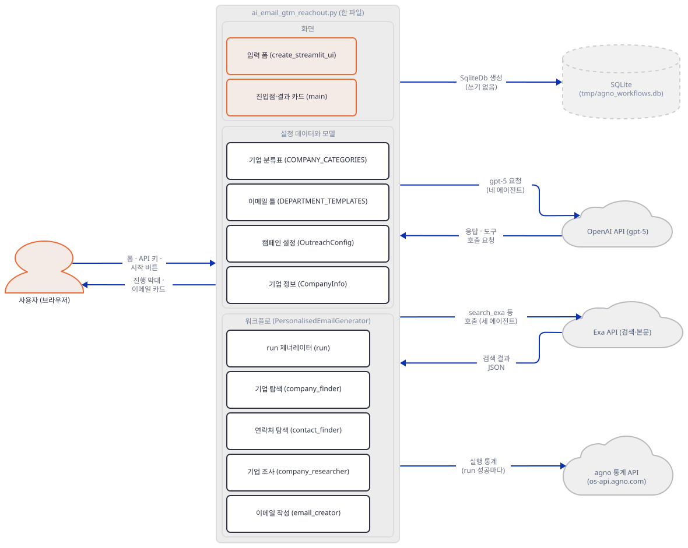

**확인.** 서버가 떠 있고 `OPENAI_BASE_URL`이 걸려 있는 터미널에서 돌립니다.

```bash
uv run --no-project python ui_check.py
```

직접 확인한 출력입니다(`ERROR` 줄은 stderr라 순서가 조금 섞일 수 있습니다).

```
1) 키 없이 처음 실행
ERROR   EXA_API_KEY not set. Please set the EXA_API_KEY environment variable.
ERROR   EXA_API_KEY not set. Please set the EXA_API_KEY environment variable.
ERROR   EXA_API_KEY not set. Please set the EXA_API_KEY environment variable.
   사이드바 오류: ['Both API keys are required to run the application']
2) 사이드바에 키를 입력한 직후
ERROR   EXA_API_KEY not set. Please set the EXA_API_KEY environment variable.
ERROR   EXA_API_KEY not set. Please set the EXA_API_KEY environment variable.
ERROR   EXA_API_KEY not set. Please set the EXA_API_KEY environment variable.
3) 아무것도 바꾸지 않고 한 번 더
   사이드바: ['API keys configured'] | 화면 오류: ['Please fill in required fields: name, email, organization, service_offered'] | 버튼: 0
4) 폼을 채운 뒤 버튼: ['🚀 Start Automated Campaign']
5) 캠페인 뒤 성공 문구: ['Email #1', 'Email #2', '**Campaign Complete!** Successfully generated 2 personalized emails', 'API keys configured']
   카드: 2 | 제목 상자: ['**Faster onboarding**', '**Faster onboarding**'] | 본문 칸 첫 줄: 'Hey Dana,'
6) 복사 버튼을 누른 뒤: 카드 0 | 이메일 칸 0 | 성공 문구: ['API keys configured']
```

1)과 2)에서 세 줄씩 나오다가 3)에서 사라지니, 키는 입력한 바로 그 실행에서는 `ExaTools`에 닿지 못하고 그다음 실행부터 들어갑니다. 시작 버튼을 누르는 것도 그 "다음 실행"이라 실제 사용에서는 문제가 되지 않습니다. 필수 칸(이름·이메일·조직·서비스 설명)이 비면 폼 함수가 `st.stop()`으로 스크립트를 끊어 버튼이 아예 그려지지 않습니다(3의 `버튼: 0`). 6)에서는 복사 버튼을 누르자 카드가 모두 사라졌고 "Email copied" 문구는 어디에도 없습니다.

이제 OpenAI 키가 틀린 경우입니다. 같은 스크립트에 키만 바꿉니다. 키가 `bad`로 끝나면 가짜 서버가 OpenAI의 오류 형식(`{"error": {"message": ...}}`)을 흉내 내 401을 돌려줍니다. 진짜 OpenAI의 문구는 다를 수 있습니다.

```bash
uv run --no-project python ui_check.py key=sk-fake-bad
```

직접 확인한 출력 가운데 5)번 줄입니다. 앞의 `ERROR` 줄이 일곱 번씩 세 가지(`API status error from OpenAI API: Error code: 401 ...`, `Non-retryable model provider error: ...`, `Error in Agent run: Incorrect API key provided.`) 나옵니다.

```
5) 캠페인 뒤 성공 문구: ['Email #1', 'Email #2', '**Campaign Complete!** Successfully generated 2 personalized emails', 'API keys configured']
   카드: 2 | 제목 상자: [] | 본문 칸 첫 줄: 'Incorrect API key provided.'
```

agno의 `Agent.run()`은 모델 오류를 예외로 올리지 않고 오류 문장을 `.content`로 돌려주고, 앱은 그 비어 있지 않은 문자열을 응답으로 취급합니다. 일곱 번(기업 탐색 1 + 회사 둘 × 3) 모두 "성공"으로 세어져 카드 두 장이 나오고, 요약의 `Success Rate`도 `results_count / num_companies`라 100.0%가 됩니다(`advanced_ai_agents/single_agent_apps/ai_email_gtm_reachout_agent/ai_email_gtm_reachout.py:1033`, 소스로 확인). 이메일 칸에 오류 문장이 들어가는 것입니다. 서버가 없거나 포트가 틀려도 같은 모양입니다(문장만 `Connection error.`, 직접 확인). 앱이 "No emails were generated" 안내를 내려면 카드가 한 장도 없어야 하는데, 그러려면 기업 탐색의 응답이 비어 있어 `run`이 일찍 끝나거나(`advanced_ai_agents/single_agent_apps/ai_email_gtm_reachout_agent/ai_email_gtm_reachout.py:496-498`) 회사마다 예외가 나야 합니다(`advanced_ai_agents/single_agent_apps/ai_email_gtm_reachout_agent/ai_email_gtm_reachout.py:616-618`). 둘 다 소스로 확인했습니다.

마지막으로 진짜 화면을 띄우는 명령입니다. 키는 환경변수로 주거나 화면의 사이드바에 넣습니다.

```bash
uv run --no-project streamlit run ai_email_gtm_reachout.py
```

서버가 뜨는지만 브라우저 없이 확인하려면 headless로 띄웁니다. `--server.address localhost`를 빼면 Streamlit이 시작하며 외부 IP를 알아내려고 `checkip.amazonaws.com`에 요청을 보냅니다(Day 060 Step 7이 소스로 확인).

```bash
uv run --no-project streamlit run ai_email_gtm_reachout.py --server.headless true --server.address localhost --server.port 58215
curl http://localhost:58215/_stcore/health
```

(PowerShell은 `curl.exe`를 씁니다.) 직접 확인한 출력은 서버 쪽 세 줄(맨 앞 시각은 뺍니다)과 `ok`입니다. 확인이 끝나면 Ctrl+C로 끕니다.

```
Uvicorn server started on localhost:58215

  You can now view your Streamlit app in your browser.

  URL: http://localhost:58215
```

```
ok
```

### Step 8. 보내지 않는다 — 발송 코드와 SQLite

**목적.** 이 앱이 메일을 보내는지, `SqliteDb`가 무엇을 하는지를 소스와 파일 시스템으로 확인합니다.

**할 일.** 메일을 보낼 만한 모듈과 낱말을 파일에서 찾고, 정의만 있고 쓰이지 않는 것들을 찾습니다. 앱 폴더에서 읽기만 합니다.

```bash
grep -n -i -E "smtp|sendmail|imap|requests|urllib|socket|subprocess|webbrowser|pyperclip" ai_email_gtm_reachout.py
grep -n -E "DEMO_MODE|^leads|sender_details_dict|^today|use_cache" ai_email_gtm_reachout.py
grep -n -w "db" ai_email_gtm_reachout.py
```

```powershell
Select-String -Path ai_email_gtm_reachout.py -Pattern "smtp|sendmail|imap|requests|urllib|socket|subprocess|webbrowser|pyperclip"
Select-String -Path ai_email_gtm_reachout.py -Pattern "DEMO_MODE|^leads|sender_details_dict|^today|use_cache"
Select-String -Path ai_email_gtm_reachout.py -Pattern "\bdb\b"
```

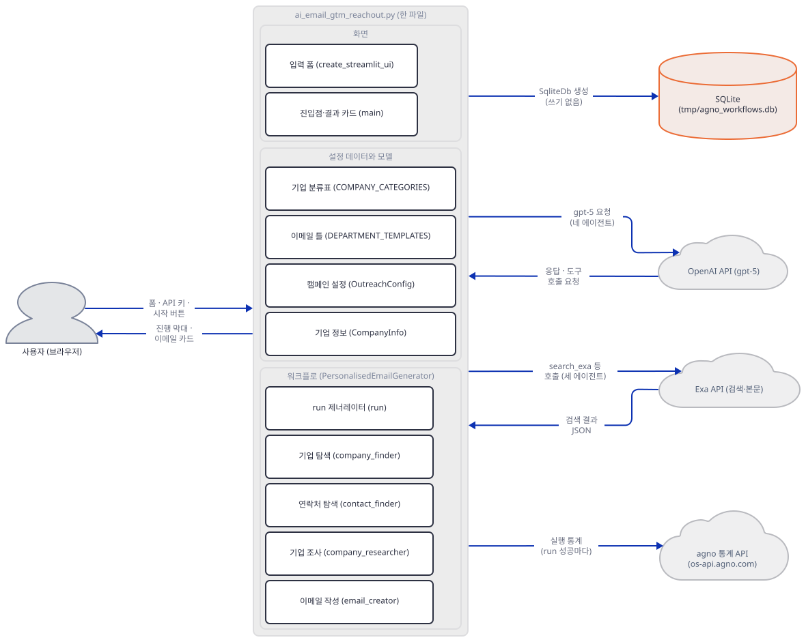

**확인.** 첫 명령은 아무것도 찍지 않습니다(직접 확인, 종료 코드 1). 이 파일이 import하는 것은 `json`·`os`·`streamlit`·`datetime`·`textwrap`·`typing`·agno·pydantic뿐이라(`advanced_ai_agents/single_agent_apps/ai_email_gtm_reachout_agent/ai_email_gtm_reachout.py:1-15`) 메일은커녕 HTTP 요청을 직접 보내는 코드도 없습니다. 앱 코드가 바깥에 직접 닿는 곳은 없고, 닿는 것은 agno(OpenAI·Exa·통계)와 Streamlit 자신뿐입니다. 둘째 명령은 다음 줄만 찍습니다.

```
30:DEMO_MODE = True
31:today = datetime.now().strftime("%Y-%m-%d")
34:leads: Dict[str, Dict[str, str]] = {
45:sender_details_dict: Dict[str, str] = {
470:        use_cache: bool = True,
866:                    use_cache=True
```

`DEMO_MODE`는 위 주석이 "True면 콘솔에 출력, False면 본인에게 발송"이라 하지만 읽는 곳이 없고, `leads`·`sender_details_dict`·`today`도 정의뿐입니다. `use_cache`는 `run`이 받기만 하고 쓰지 않으며, 캐시 메서드 `get_cached_data`·`cache_data`는 어디서도 불리지 않습니다. `cache_data`가 부르는 `self.write_to_storage()`는 agno 3.1.1의 `Workflow`에 없습니다(직접 확인: `hasattr(Workflow, 'write_to_storage')`가 `False`). 불릴 일이 없어서 드러나지 않을 뿐입니다. 셋째 명령은 `db`가 import 한 줄과 만드는 곳과 넘기는 곳에만 나온다고 알려 줍니다.

```
10:from agno.db.sqlite import SqliteDb
849:                    db = SqliteDb(
850:                        db_file="tmp/agno_workflows.db",
855:                        db=db
```

만들어서 워크플로에 넘기는 것이 전부입니다. 그 결과를 파일 시스템에서 봅니다. 앞 단계들을 돌린 폴더에서 실행합니다.

```bash
uv run --no-project python -c "import os; print(os.path.isdir('tmp'), os.listdir('tmp'))"
```

직접 확인한 출력입니다.

```
True []
```

`SqliteDb(db_file="tmp/agno_workflows.db")`는 부모 폴더 `tmp/`만 만들고(실행한 작업 폴더 기준이라 상대 경로입니다) DB 파일은 만들지 않았고, 캠페인을 끝까지 돌려도 마찬가지였습니다. agno 3.1.1에서 세션 저장(`save_session`)은 `_persist_session_and_run`이, 워크플로 통계는 `_execute`가 하고, 둘 다 부모 `Workflow.run()`이 부르는 메서드입니다. 이 앱은 `run`을 다른 시그니처로 통째로 덮어써서 그 경로를 지나지 않습니다(소스로 확인). 카드의 "복사"·"내보내기"·"보고서" 버튼도 같은 사정입니다. 성공 문구를 띄울 뿐 하는 일이 없습니다(`advanced_ai_agents/single_agent_apps/ai_email_gtm_reachout_agent/ai_email_gtm_reachout.py:1041-1051`, 소스로 확인).

## 요청 한 건이 흐르는 과정

버튼 한 번이 만드는 흐름을 여덟 장으로 나눠 그렸습니다. 기업 탐색까지만 한 장에 담아 봐도 1,613×1,434px가 되어 가로 상한(1,400px)을 넘겼고, 배우 일곱의 순서를 300개 시험해도 수명선이 글자를 지나지 않는 순서가 하나도 없었습니다(직접 렌더해 확인). 모델이 검색을 한 번 요청하는 경우를 그렸고, 진짜 모델이 그렇게 하는지는 키가 없어 보지 못했습니다. 기업 탐색(둘째 장)은 한 번, 연락처·조사·이메일(셋째~일곱째 장)은 회사마다 반복됩니다. 마지막 장은 앞의 세 메시지(결과 `yield`, 진행 막대 갱신, 카드)만 회사마다 되풀이되고, 나머지 넷은 루프가 끝난 뒤 한 번 나옵니다. 모든 외부 호출은 에이전트가 하고, 에이전트를 부르는 것은 `run`이며, `run`은 진행 신호를 `main`에 `yield`할 뿐 화면을 직접 건드리지 않습니다. 앱이 `logger.info`로 터미널에 남기는 진행 로그(`Processing company #1` 등)는 화면 밖의 출력이라 그림에 넣지 않았습니다.

1. **버튼을 누르면 `main`이 빈 진행 막대와 스피너를 그리고, `SqliteDb`와 워크플로를 만들고, `run`을 부릅니다.** 스크립트는 이 클릭으로 처음부터 다시 돌아 클래스와 에이전트 넷도 새로 만들어집니다.
   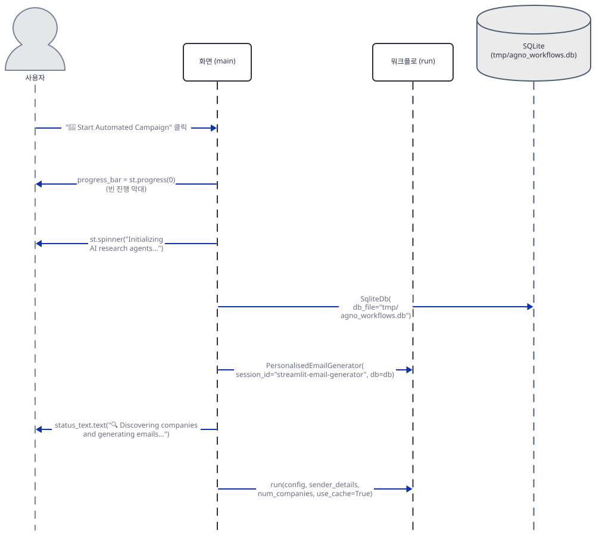
2. **`run`이 기업 탐색 에이전트를 부르고, 에이전트는 모델과 Exa 사이를 한 바퀴 돌아 목록 텍스트를 돌려줍니다.**
   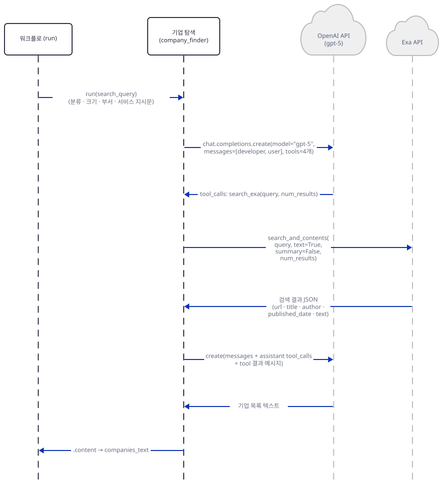
3. **`run`이 진행 신호를 `yield`하고, `main`이 진행 막대를 갱신합니다. 이어서 연락처 에이전트가 모델에 첫 요청을 보내 도구 호출을 돌려받습니다.**
   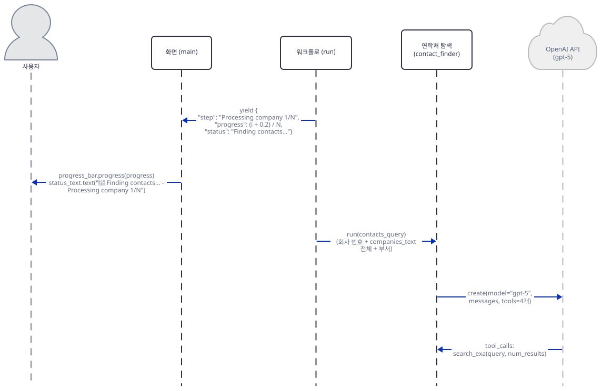
4. **연락처 에이전트가 Exa를 부르고 결과로 다시 모델을 불러 연락처 텍스트를 받아 `run`에 돌려줍니다.**
   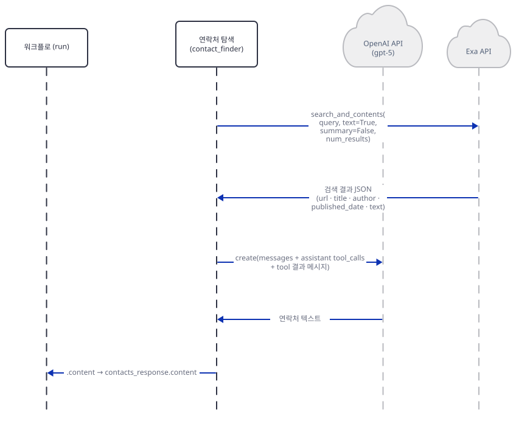
5. **두 번째 진행 신호 뒤에 기업 조사 에이전트가 같은 길로 모델에 첫 요청을 보냅니다.**
   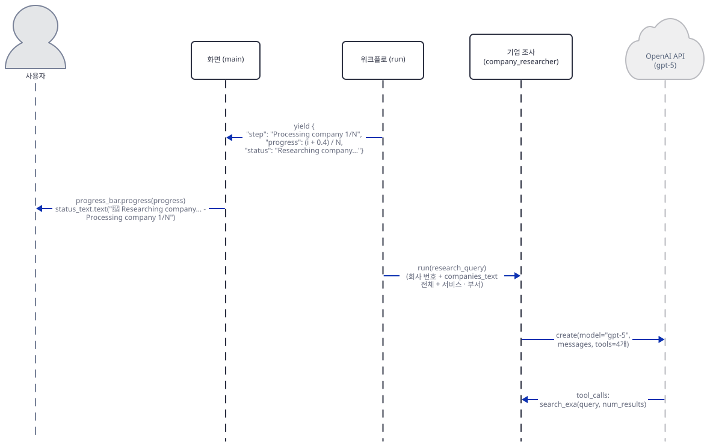
6. **기업 조사 에이전트가 Exa와 모델을 거쳐 조사 텍스트를 돌려주면 `run`이 `CompanyInfo`를 만듭니다.** 응답은 여기서 앞 200자로 잘립니다.
   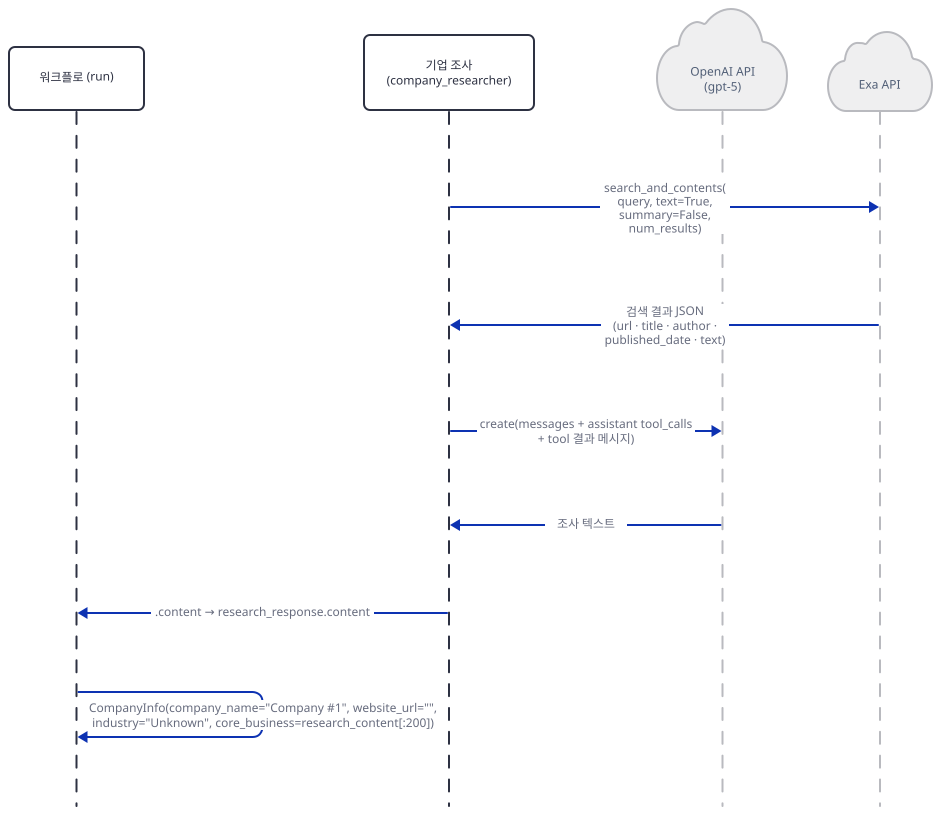
7. **세 번째 진행 신호 뒤에 `run`이 틀을 고르고 이메일 작성 에이전트를 부릅니다. 모델 한 번으로 끝납니다.**
   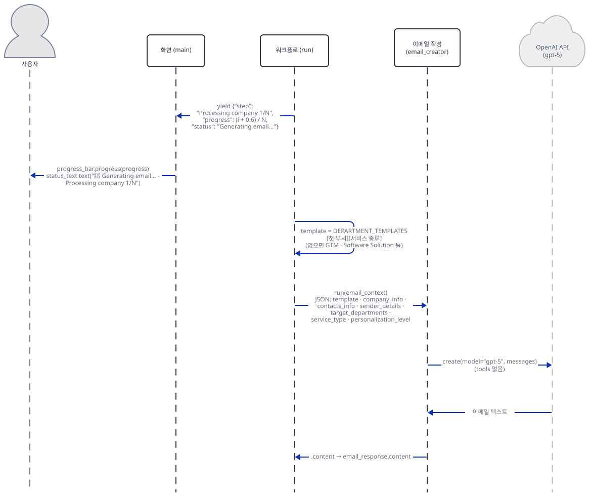
8. **`run`이 결과 dict를 `yield`하면 `main`이 진행 막대를 갱신하고 카드를 그립니다. 루프가 끝나면 완료 문구와 요약과 버튼과 풍선을 그립니다.**
   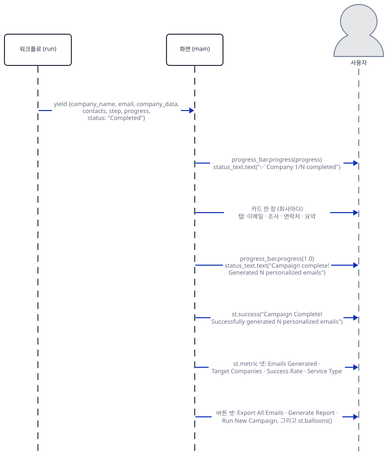

모델이 도구를 쓰지 않고 곧바로 답하면 2·4·6의 검색 왕복(Exa 화살표 둘과 모델 재호출)이 빠집니다. 도구를 몇 번 쓸지는 모델이 정합니다. 그림에는 없지만 성공한 에이전트 실행마다 agno의 통계 한 건이 이 흐름과 별도로 나갑니다(Step 4).

## 실행 체크리스트

- [ ] `requirements.txt`만으로는 두 import가 실패하고 `agno[sqlite,exa]`를 더하면 통과한다는 것을 확인했다
- [ ] 화면이 줄 수 있는 35개 조합 중 이메일 틀을 찾는 것이 4개뿐이라는 것을 `check_templates.py`로 확인했다
- [ ] 에이전트 넷이 클래스 속성으로 한꺼번에 만들어지고, 키 없이 만들면 `ERROR EXA_API_KEY not set` 세 줄이 나온다는 것을 확인했다
- [ ] 가짜 서버가 받은 첫 요청에서 `developer`·`user` 역할과 도구 네 개를 확인했다
- [ ] 키 끝에 `tool`을 붙이면 `search_exa` 왕복이 일어나고 Exa 대역이 쿼리를 받는다는 것을 확인했다
- [ ] 회사마다 세 에이전트의 프롬프트에 목록 전체가 들어가고 `core_business`가 200자로 잘린다는 것을 확인했다
- [ ] 인사·컨설팅은 HR 틀이, 재무·맞춤 개발은 GTM 폴백 틀이 간다는 것을 확인했다
- [ ] `ui_check.py`로 키가 한 박자 늦게 들어가는 것과 복사 버튼이 카드를 지우는 것을 확인했다
- [ ] 틀린 키에서도 "Campaign Complete!"가 뜨고 이메일 칸이 오류 문장이라는 것을 확인했다
- [ ] 메일 발송 코드가 없고 `tmp/` 폴더가 비어 있다는 것을 확인했다
- [ ] 가짜 서버(58214)와 `streamlit run`(58215)을 모두 껐다

## 문제 해결

| 증상 | 원인 | 해결 |
|---|---|---|
| 앱 파일을 불러오는 순간 `ModuleNotFoundError: No module named 'sqlalchemy'` | 10행의 `agno.db.sqlite`가 `sqlalchemy`를 요구하는데 `requirements.txt`에 없다(직접 확인) | `uv pip install "agno[sqlite,exa]"` |
| 위를 고치면 ``ImportError: `exa_py` not installed. Please install using `pip install exa_py` `` | 11행의 `agno.tools.exa`가 `exa_py`를 요구하는데 `requirements.txt`에 없다(직접 확인) | 같은 명령 |
| 터미널에 `ERROR   EXA_API_KEY not set.`가 세 줄씩 반복 | 스크립트가 도는 매번 클래스가 새로 만들어지고 세 `ExaTools`가 그 순간의 `os.environ`을 읽는다. 사이드바에 키를 넣은 직후 실행에서는 아직 비어 있다(직접 확인) | 키를 넣고 한 번 더 상호작용한다(시작 버튼도 해당). 셸에 `EXA_API_KEY`를 걸고 띄우면 처음부터 없다 |
| 키가 틀리거나 서버에 닿지 못해도 "Campaign Complete! Successfully generated N personalized emails"가 뜨고 이메일 칸에 오류 문장이 들어 있다 | agno `Agent.run()`이 모델 오류를 예외로 올리지 않고 오류 문장을 `.content`로 돌려주고, 앱은 비어 있지 않은 문자열을 응답으로 센다(가짜 서버의 401과 연결 거부로 직접 확인) | 카드의 이메일 칸과 터미널의 `ERROR ... Error in Agent run` 줄을 본다. 앱 코드는 고치지 않는다 |
| 카드의 회사 이름이 `Company #1`, 업종이 `Unknown`이고 웹사이트가 비어 있다 | `run`이 이 값들을 이름표로만 채우고 갱신하지 않는다(Step 5, 소스로 확인) | 해결할 수 없다. 이름은 이메일 본문이나 연락처 칸에서 찾는다 |
| 복사·내보내기·보고서 버튼을 누르면 카드가 통째로 사라지고 성공 문구도 안 보인다 | 카드가 시작 버튼의 `if` 블록 안에 있어서, 다른 버튼이 눌린 실행에서는 시작 버튼이 `False`다(직접 확인). 버튼이 하는 일도 문구뿐이다 | 카드를 눌러서 복사할 수 없다. 이메일 칸에서 직접 선택해 복사한다 |
| 부서를 여러 개 골라도, 서비스 종류를 바꿔도 이메일 틀이 거의 같다 | 틀은 선택한 첫 부서 하나만 보고 35개 조합 중 4개만 틀을 찾는다. 나머지는 GTM의 `Software Solution` 틀로 물러난다(Step 2·6, 직접 확인) | 틀 사전을 화면 선택지에 맞게 고친 복사본에서 시험한다(더 해보기) |
| 앱 README는 `Basic`·`Medium`·`Deep` 수준에 따라 개인화가 달라진다고 하는데 결과가 같다 | 수준은 JSON에 낱말로 실릴 뿐 앱 코드가 갈라지는 곳이 없다(Step 6, 소스로 확인) | 수준은 모델에 보내는 힌트일 뿐이다 |
| 실행한 폴더에 `tmp/`가 생기는데 안은 비어 있다 | `SqliteDb(db_file="tmp/agno_workflows.db")`가 작업 폴더 기준 상대 경로의 부모 폴더만 만들고 DB 파일은 만들지 않는다(Step 8, 직접 확인) | 지워도 된다. 저장소의 `.gitignore`에 `tmp/` 규칙이 없지만 빈 폴더라 `git status`에는 안 나타난다 |
| Windows에서 출력을 파이프나 파일로 받으면 로그마다 `--- Logging error ---`와 `UnicodeEncodeError: 'cp949' codec can't encode character`가 난다 | 앱이 로그 문구에 이모지를 넣는데 파이프로 받으면 Windows의 기본 인코딩(`cp949` 등)이 이를 못 쓴다. 앱은 죽지 않고 계속 돈다(직접 확인) | `PYTHONIOENCODING=utf-8`을 먼저 건다(사전 준비). 터미널에 바로 찍을 때는 나지 않는다 |

## 더 해보기

- 복사본에서 `DEPARTMENT_TEMPLATES`(`advanced_ai_agents/single_agent_apps/ai_email_gtm_reachout_agent/ai_email_gtm_reachout.py:56-191`)의 키를 화면 선택지의 이름과 맞춰 보고, `check_templates.py`가 세는 "틀을 찾는 조합"이 4에서 얼마로 늘어나는지, Step 6의 폴백을 타는 조합이 얼마나 줄어드는지 보기
- 복사본에서 `core_business=research_content[:200]`(`advanced_ai_agents/single_agent_apps/ai_email_gtm_reachout_agent/ai_email_gtm_reachout.py:565`)의 200을 키우고 `drive.py`가 찍는 `core_business` 길이와, 서버가 찍는 이메일 요청이 어떻게 달라지는지 보기. 조사 응답 전체를 `company_info`의 다른 칸에 나눠 담게 해 보는 것까지 가면 `CompanyInfo`의 32칸이 왜 있는지 알 수 있다
- 복사본에서 카드를 그리기 전에 결과를 `st.session_state`에 쌓고 카드는 시작 버튼의 `if` 블록 밖에서 그리게 고친 뒤 `ui_check.py`의 6)번 줄이 어떻게 달라지는지 보기

## 다음 날 예고

[Day 102 · 💰 AI Personal Finance Planner](../day102-ai-personal-finance-agent/README.md) — 원본 앱 README 기준으로, 재무 목표와 현재 상황을 입력하면 GPT-4o와 SerpApi 검색 도구를 쥔 agno 에이전트가 예산·투자·저축 계획을 써 주는 작은 Streamlit 앱입니다.
