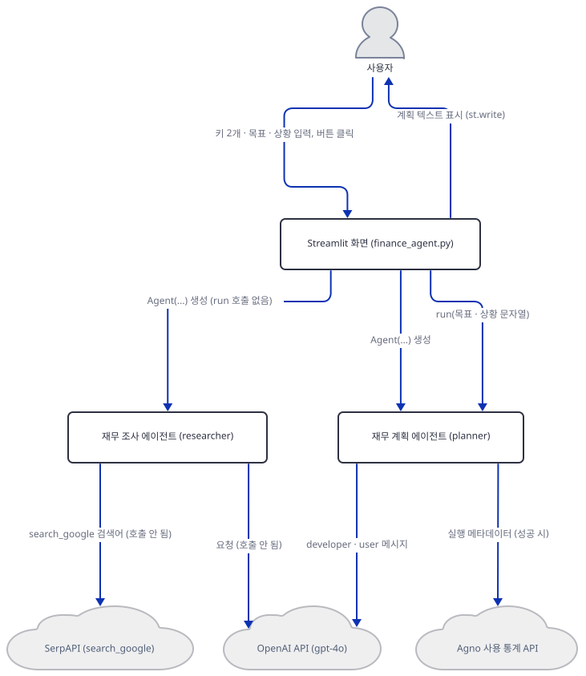
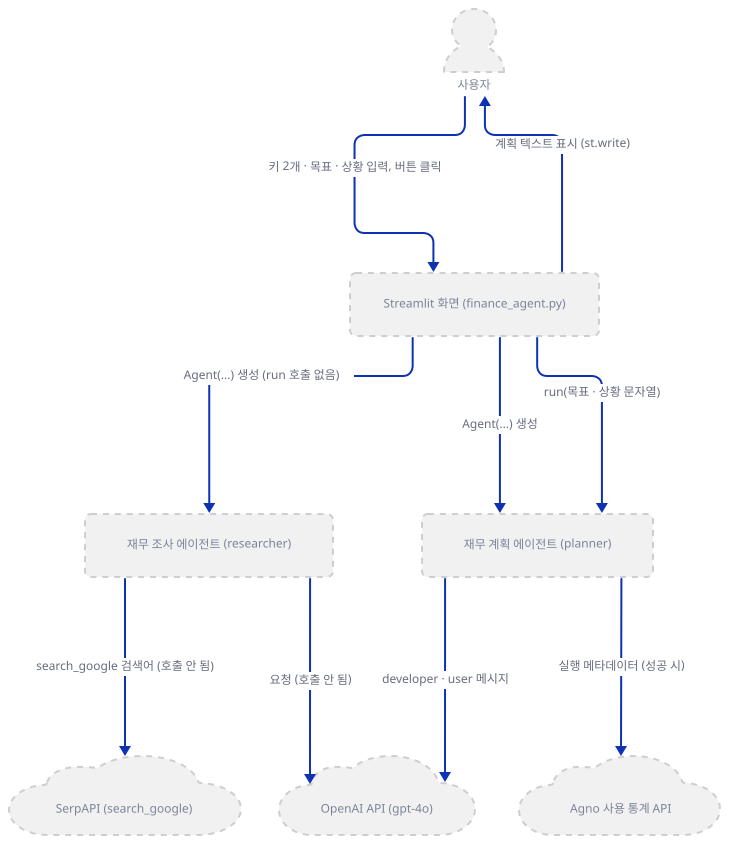
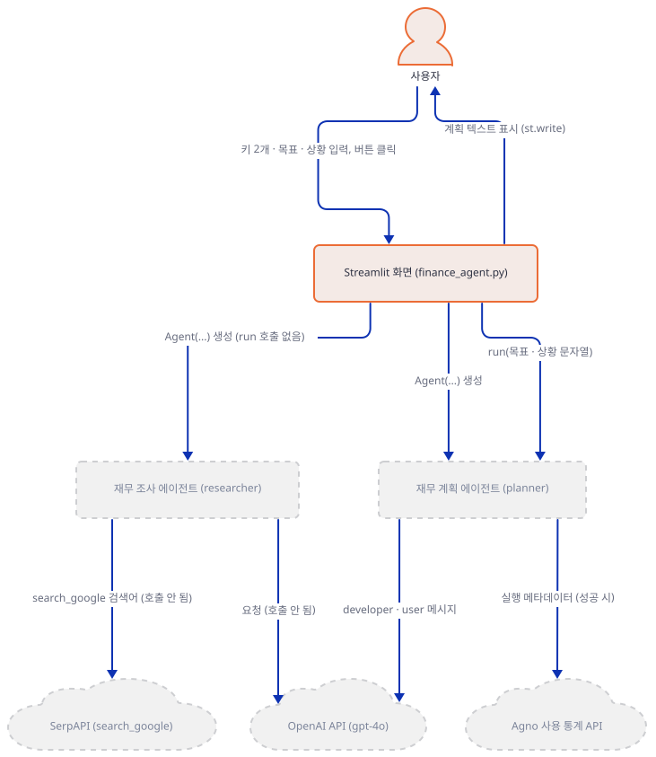
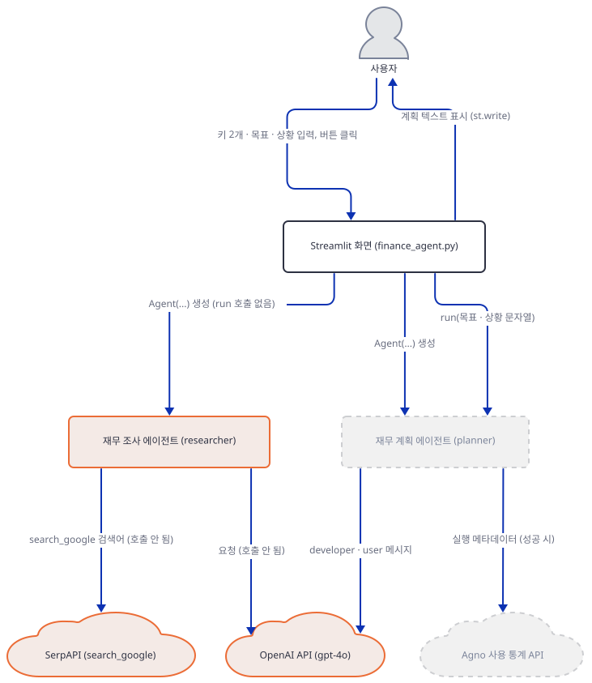
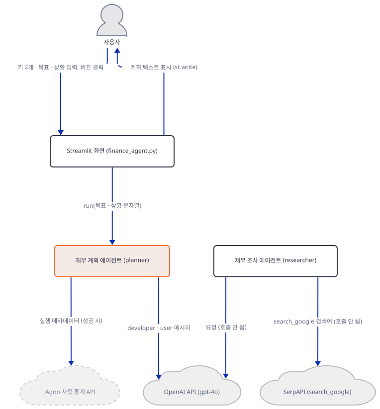
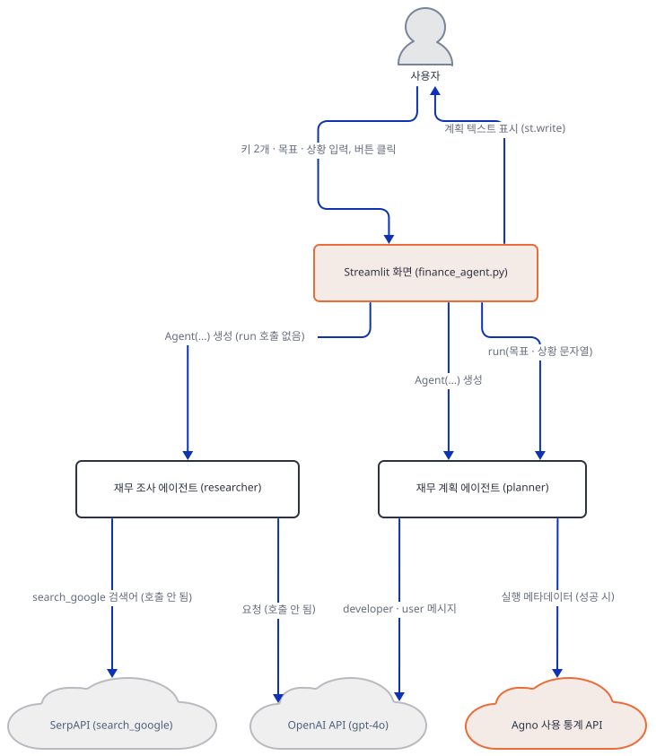
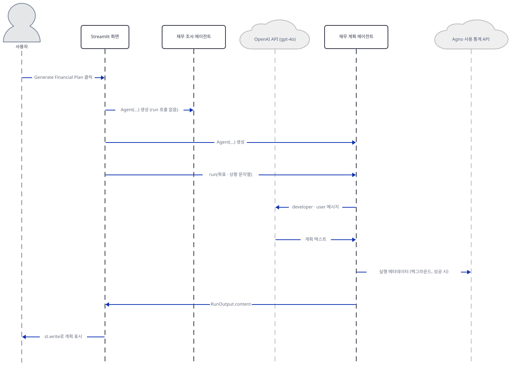

# Day 102 · 💰 AI Personal Finance Planner

> 볼륨 7 🚀 Advanced AI Agents · 난이도 ★☆☆ · 예상 소요 65분(앱은 68줄이지만 Step 5에서 가짜 서버와 확인 스크립트를 직접 만들어 터미널 둘로 돌려 봐야 해서 읽는 시간보다 손으로 돌려 보는 시간이 더 걸립니다) · API 비용 대략 계획 1건에 $0.01~0.02(`gpt-4o` 호출 1회 — 입력은 지시문 약 1,000자와 사용자 입력으로 어림해 약 300토큰, 출력은 `max_tokens` 제한이 없어 1,000~2,000토큰이라고 보고, 모델 페이지의 입력 $2.5·출력 $10(1M 토큰당, https://developers.openai.com/api/docs/models/gpt-4o, 2026-10-05 확인)을 대입한 대략치이며 키가 없어 실제 토큰 수는 확인하지 못함. SerpAPI는 호출되지 않아 0) · 원본 앱: `advanced_ai_agents/single_agent_apps/ai_personal_finance_agent`

## 오늘 만들 것

재무 목표와 현재 상황을 적고 버튼을 누르면 `gpt-4o`가 예산·투자·저축 계획을 써 주는 Streamlit 앱입니다. `finance_agent.py` 한 파일(편집기 기준 68줄)에 agno의 `Agent` 둘을 만들고, 뼈대는 Day 012의 여행 앱과 같습니다. 키 두 개가 있어야 화면이 열리고, `SerpApiTools`를 쥔 Researcher와 도구 없는 Planner가 있습니다. 다른 점이 오늘의 주제입니다. Day 012는 Researcher의 요약을 Planner의 프롬프트에 끼웠지만(Day 012 Step 4), 이 앱에서 에이전트를 부르는 줄은 67행의 `planner.run(...)` 하나뿐입니다. Researcher는 만들어지기만 하고 한 번도 실행되지 않으니 SerpAPI 키는 화면을 여는 관문일 뿐이고 검색은 일어나지 않습니다.

Planner의 지시문은 "a list of research results"를 받는다고 말하지만 모델에 가는 요청에 연구 결과는 없고, 금융 조언이라는 고지는 화면·지시문·앱 README 어디에도 없습니다(모두 Step 5에서 확인). 이 문서는 OpenAI와 SerpAPI에 요청을 보내지 않고 모델로 가는 요청을 내 PC의 가짜 서버로 받아 봅니다. 키가 없어 모델의 실제 응답은 확인하지 못했고, 문서의 계획 텍스트는 가짜 서버의 고정 응답이라 어떤 금융 판단의 근거도 아닙니다. 아래는 완성된 아키텍처이고, 그림의 "(호출 안 됨)"은 코드가 연결해 두었지만 이 앱의 실행 경로에서는 쓰이지 않는다는 뜻입니다.



## 사전 준비

| 서비스/도구 | 용도 | 발급·설치 |
|---|---|---|
| uv | 가상환경 생성과 패키지 설치 | [공통 사전 준비](../README.md#공통-사전-준비-한-번만) 절 참고 |
| Python | 이 문서는 3.13.3으로 확인했다. 저장소 기준은 3.11~3.13 | 공통 사전 준비와 같음 |
| OpenAI API 키 | 두 에이전트의 `gpt-4o` 호출 인증. 화면의 비밀번호 칸에 붙여넣는다(환경변수가 아님, `advanced_ai_agents/single_agent_apps/ai_personal_finance_agent/finance_agent.py:13`). 이 문서는 키 없이 가짜 서버로 확인한다 | https://platform.openai.com/api-keys |
| SerpAPI 키 | 앱이 채우라고 요구하지만 검색에는 쓰이지 않는다. 화면의 게이트가 값이 비어 있지 않은지만 본다(`advanced_ai_agents/single_agent_apps/ai_personal_finance_agent/finance_agent.py:18`) | https://serpapi.com/ (앱 README의 안내) |
| 인터넷 연결 | PyPI 설치. 앱을 실제로 쓸 때는 OpenAI API와 agno 사용 통계 서버(`os-api.agno.com`)에 접속하고, 브라우저로 열면 Streamlit의 사용 통계도 나간다(Day 063이 확인했고 `--browser.gatherUsageStats false`로 끈다) | 별도 설치 없음 |

## 아키텍처 한눈에 보기

| 컴포넌트 | 역할 | 코드 위치 |
|---|---|---|
| 사용자 | 브라우저에서 키 둘, 목표, 상황을 적고 버튼을 누른다 | 코드 없음 (브라우저) |
| Streamlit 화면 | 제목, 키 입력 두 칸, 두 키가 있어야 이어지는 입력창·버튼, 결과 출력 | `advanced_ai_agents/single_agent_apps/ai_personal_finance_agent/finance_agent.py:8-18`, `advanced_ai_agents/single_agent_apps/ai_personal_finance_agent/finance_agent.py:60-68` |
| 재무 조사 에이전트 (`researcher`) | 검색어 3개를 만들어 `search_google`로 찾고 10건을 고르라는 지시를 받지만 한 번도 실행되지 않는다 | `advanced_ai_agents/single_agent_apps/ai_personal_finance_agent/finance_agent.py:19-38` |
| 검색 도구 (`SerpApiTools`) | `search_google` 함수 하나를 노출한다. 생성만 되고 불리지 않는다 | `advanced_ai_agents/single_agent_apps/ai_personal_finance_agent/finance_agent.py:4`, `advanced_ai_agents/single_agent_apps/ai_personal_finance_agent/finance_agent.py:36` |
| 재무 계획 에이전트 (`planner`) | 도구 없이 지시문만으로 예산·투자·저축 계획을 쓴다. 버튼이 부르는 유일한 에이전트 | `advanced_ai_agents/single_agent_apps/ai_personal_finance_agent/finance_agent.py:39-58`, `advanced_ai_agents/single_agent_apps/ai_personal_finance_agent/finance_agent.py:67` |
| OpenAI API (`gpt-4o`) | 두 에이전트가 가진 모델. 요청은 Planner에서 한 번 나간다 | `advanced_ai_agents/single_agent_apps/ai_personal_finance_agent/finance_agent.py:22`, `advanced_ai_agents/single_agent_apps/ai_personal_finance_agent/finance_agent.py:42` |
| SerpAPI | Researcher의 검색 서비스. 이 앱의 실행 경로에서는 호출되지 않는다 | 코드 없음 (외부 서비스) |
| Agno 사용 통계 API | 성공한 `planner.run` 뒤에 agno가 익명 메타데이터를 보내려 한다 | 코드 없음 (agno 내부) |

## 단계별 진행

### Step 1. 환경 만들기 — 쓰이지 않는 도구의 패키지도 필요합니다

**목적.** 앱 폴더에 독립 가상환경을 만들고, 파일이 컴파일되고 임포트 여섯 줄이 통과하는지 확인합니다.

**할 일.** 저장소 루트에서 시작합니다.

```bash
cd advanced_ai_agents/single_agent_apps/ai_personal_finance_agent
uv venv
uv pip install -r requirements.txt
```

(pip 대안: `python -m venv .venv && source .venv/bin/activate && pip install -r requirements.txt`. Windows PowerShell은 활성화만 `.venv\Scripts\Activate.ps1`로 바꿉니다.) 이후 `uv run`에는 모두 `--no-project`를 붙입니다. 이유는 [공통 사전 준비](../README.md#공통-사전-준비-한-번만)에 있습니다. 앱 README의 1단계는 `git clone` 바로 뒤에 이 `cd`를 적지만(`advanced_ai_agents/single_agent_apps/ai_personal_finance_agent/README.md:14-17`) clone은 저장소 이름의 새 폴더를 만드므로 그 폴더로 먼저 들어가야 맞습니다(소스로 확인).

`advanced_ai_agents/single_agent_apps/ai_personal_finance_agent/requirements.txt:1-4`

```text
streamlit 
agno>=2.2.10
openai
google-search-results
```

4줄이고 마지막 줄에 개행이 없어 `wc -l`은 3으로 셉니다. 버전 상한이 없어서 이 문서를 만들 때(2026-10-05)는 Python 3.13.3에서 agno 3.1.1, streamlit 1.65.0, openai 3.24.0, google-search-results 2.4.2를 포함해 패키지 70개가 깔렸습니다(직접 확인). `google-search-results`는 검색을 하지 않는 이 앱에서도 빠질 수 없습니다. 4행의 `agno.tools.serpapi` 임포트가 `import serpapi`를 시도하고 실패하면 `` `google-search-results` not installed. ``로 바꿔 던지기 때문입니다(소스로 확인, agno 3.1.1의 `agno/tools/serpapi.py` 8~11행. Day 012도 확인한 사실이고 패키지를 빼 본 실험은 문제 해결에 있습니다).



**확인.** 앱 폴더에서 실행합니다.

```bash
uv run --no-project python -c "
import sys
from importlib.metadata import version
print(sys.version.split()[0])
for name in ('agno', 'streamlit', 'openai', 'google-search-results'):
    print(name, version(name))
"
```

직접 확인한 출력(버전은 설치하는 날의 최신입니다):

```
3.13.3
agno 3.1.1
streamlit 1.65.0
openai 3.24.0
google-search-results 2.4.2
```

```bash
uv run --no-project python -m py_compile finance_agent.py && echo compiled
uv run --no-project python -c "
from textwrap import dedent
from agno.agent import Agent
from agno.run.agent import RunOutput
from agno.tools.serpapi import SerpApiTools
import streamlit as st
from agno.models.openai import OpenAIChat
print('all imports OK')
"
```

직접 확인한 출력:

```
compiled
all imports OK
```

두 번째 명령은 앱의 1~6행을 그대로 실행한 것입니다. (PowerShell에서도 같은 형태로 쓸 수 있습니다. 실행해 보지 못했습니다.)

### Step 2. 화면 뼈대와 키 두 칸

**목적.** 화면에 처음 뜨는 것과, 두 키가 모두 있어야 나머지가 그려지는 구조를 확인합니다.

**할 일.**

`advanced_ai_agents/single_agent_apps/ai_personal_finance_agent/finance_agent.py:8-18`

```python
# Set up the Streamlit app
st.title("AI Personal Finance Planner 💰")
st.caption("Manage your finances with AI Personal Finance Manager by creating personalized budgets, investment plans, and savings strategies using GPT-4o")

# Get OpenAI API key from user
openai_api_key = st.text_input("Enter OpenAI API Key to access GPT-4o", type="password")

# Get SerpAPI key from the user
serp_api_key = st.text_input("Enter Serp API Key for Search functionality", type="password")

if openai_api_key and serp_api_key:
```

키는 환경변수가 아니라 화면의 비밀번호 칸에 붙여넣습니다. 18행의 `if`가 19~68행 전부를 감싸므로 두 칸 중 하나라도 비면 제목·캡션·두 칸만 그려집니다. Day 012 Step 2와 Day 081 Step 2의 게이트와 같고, Streamlit이 상호작용마다 스크립트를 처음부터 다시 실행하는 리런은 Day 012 Step 2가 설명했습니다. 게이트는 값이 비어 있지 않은지만 봅니다. SerpAPI 칸에 무엇을 넣든 통과합니다(Step 5에서 `anything`으로 직접 확인).



**확인.** 앱을 브라우저로 띄우는 명령은 이렇습니다.

```bash
uv run --no-project streamlit run finance_agent.py
```

이 문서는 브라우저 대신 `AppTest`(Streamlit이 브라우저 없이 스크립트를 실행하고 위젯을 코드로 조작하게 해 주는 도구)로 같은 스크립트를 실행해 화면을 확인했습니다. 앱 폴더에서 실행합니다.

```bash
uv run --no-project python -c "
from streamlit.proto.TextInput_pb2 import TextInput
from streamlit.testing.v1 import AppTest
at = AppTest.from_file('finance_agent.py', default_timeout=60)
at.run()
print('no keys :', len(at.text_input), len(at.text_area), len(at.button))
print([TextInput.Type.Name(t.proto.type) for t in at.text_input])
at.text_input[0].set_value('sk-test')
at.run()
print('one key :', len(at.text_input), len(at.text_area), len(at.button))
at.text_input[1].set_value('anything')
at.run()
print('two keys:', len(at.text_input), len(at.text_area), len(at.button))
print([t.label for t in at.text_input], [t.label for t in at.text_area], [b.label for b in at.button])
"
```

직접 확인한 출력(맨 위에 `missing ScriptRunContext!` 경고가 한 줄 나오지만 `streamlit run` 없이 돌릴 때의 안내라 결과와 무관합니다):

```
no keys : 2 0 0
['PASSWORD', 'PASSWORD']
one key : 2 0 0
two keys: 3 1 1
['Enter OpenAI API Key to access GPT-4o', 'Enter Serp API Key for Search functionality', 'What are your financial goals?'] ['Describe your current financial situation'] ['Generate Financial Plan']
```

처음에는 칸이 둘뿐이고 한 칸만 채워서는 그대로이며, 둘 다 채우면 입력 위젯 셋과 버튼이 생깁니다. 두 키 칸은 비밀번호 유형입니다. 서버만 띄워 응답을 보려면 `--server.address localhost`를 붙입니다. 안 붙이면 Streamlit이 시작하며 외부 IP를 알아내려고 `checkip.amazonaws.com`에 접속합니다(Day 054가 확인한 사실. 포트는 겹치지 않는 아무 높은 번호입니다).

```bash
uv run --no-project streamlit run finance_agent.py --server.headless true --server.address localhost --server.port 61388
```

다른 터미널에서:

```bash
curl -s -o /dev/null -w "%{http_code}\n" http://localhost:61388
```

```
200
```

(PowerShell이면 `curl` 대신 `(Invoke-WebRequest -Uri http://localhost:61388 -UseBasicParsing).StatusCode`. 실행해 보지 못했습니다.) HTTP 200은 직접 확인했고, 서버는 `Ctrl+C`로 멈춥니다.

### Step 3. Researcher — 도구를 쥐고도 한 번도 불리지 않는 에이전트

**목적.** 첫 에이전트의 구성과, 이 에이전트가 실행되지 않는다는 사실을 확인합니다.

**할 일.**

`advanced_ai_agents/single_agent_apps/ai_personal_finance_agent/finance_agent.py:19-38`

```python
    researcher = Agent(
        name="Researcher",
        role="Searches for financial advice, investment opportunities, and savings strategies based on user preferences",
        model=OpenAIChat(id="gpt-4o", api_key=openai_api_key),
        description=dedent(
            """\
        You are a world-class financial researcher. Given a user's financial goals and current financial situation,
        generate a list of search terms for finding relevant financial advice, investment opportunities, and savings strategies.
        Then search the web for each term, analyze the results, and return the 10 most relevant results.
        """
        ),
        instructions=[
            "Given a user's financial goals and current financial situation, first generate a list of 3 search terms related to those goals.",
            "For each search term, `search_google` and analyze the results.",
            "From the results of all searches, return the 10 most relevant results to the user's preferences.",
            "Remember: the quality of the results is important.",
        ],
        tools=[SerpApiTools(api_key=serp_api_key)],
        add_datetime_to_context=True,
    )
```

구성은 Day 012 Step 3의 Researcher와 같고 도메인만 재무로 바뀌었습니다. `SerpApiTools(api_key=...)`는 키를 저장하고 `search_google` 함수를 등록할 뿐 네트워크를 쓰지 않습니다(소스로 확인, agno 3.1.1의 `agno/tools/serpapi.py` 15~33행. 검색이 일어나는 곳은 `search_google` 함수 안의 `serpapi.GoogleSearch(...)` 호출, 같은 파일 63~64행입니다). 앱의 특이점은 여기서 나옵니다. `researcher`라는 이름은 정의(19행)와 25행의 설명문 속 낱말 말고는 파일 어디에도 없습니다. 이 에이전트의 `run`을 부르는 줄이 없어서 모델도 검색도 쓰이지 않습니다. `name`과 `role`은 Day 081 Step 3가 본 대로 `Team`이 멤버를 소개할 때 쓰는 인자입니다. 이 앱에는 팀이 없지만 `role`은 에이전트 자신의 시스템 메시지에도 들어갑니다(Step 5에서 Planner의 요청으로 확인).



**확인.**

```bash
grep -n researcher finance_agent.py
```

(PowerShell: `Select-String researcher finance_agent.py`. 줄 번호가 `finance_agent.py:19:` 꼴로 앞에 붙습니다. 실행해 보지 못했습니다.)

직접 확인한 출력:

```
19:    researcher = Agent(
25:        You are a world-class financial researcher. Given a user's financial goals and current financial situation,
```

```bash
uv run --no-project python -c "
from agno.tools.serpapi import SerpApiTools
print(list(SerpApiTools(api_key='anything').functions))
"
```

직접 확인한 출력:

```
['search_google']
```

실행하는 줄이 없다는 것은 소스를 읽어 아는 사실이고, 실제로 불리지 않는다는 것은 Step 5에서 `Agent.run` 호출을 세어 확인합니다.

### Step 4. Planner — 도구 없는 에이전트와 "research results"를 기다리는 지시문

**목적.** 버튼이 실제로 부르는 에이전트의 구성과, 지시문이 가정하는 입력이 어디서도 오지 않는다는 사실을 확인합니다.

**할 일.**

`advanced_ai_agents/single_agent_apps/ai_personal_finance_agent/finance_agent.py:39-58`

```python
    planner = Agent(
        name="Planner",
        role="Generates a personalized financial plan based on user preferences and research results",
        model=OpenAIChat(id="gpt-4o", api_key=openai_api_key),
        description=dedent(
            """\
        You are a senior financial planner. Given a user's financial goals, current financial situation, and a list of research results,
        your goal is to generate a personalized financial plan that meets the user's needs and preferences.
        """
        ),
        instructions=[
            "Given a user's financial goals, current financial situation, and a list of research results, generate a personalized financial plan that includes suggested budgets, investment plans, and savings strategies.",
            "Ensure the plan is well-structured, informative, and engaging.",
            "Ensure you provide a nuanced and balanced plan, quoting facts where possible.",
            "Remember: the quality of the plan is important.",
            "Focus on clarity, coherence, and overall quality.",
            "Never make up facts or plagiarize. Always provide proper attribution.",
        ],
        add_datetime_to_context=True,
    )
```

Planner에는 `tools=`가 없어 모델에 도구 목록이 가지 않습니다(Step 5). Day 012의 Planner와 같은 구성이지만 그쪽은 Researcher의 요약이 `Research Results:` 줄로 프롬프트에 들어갔고, 이 앱에는 그런 줄이 없습니다. 그런데 `role`(41행), 설명(45행), 첫 지시문(50행)은 모두 "research results"를 받는다고 말합니다. 마지막 지시문(55행)은 출처를 밝히라고 요구하지만 출처가 될 검색 결과도 도구도 없으니, 모델이 사실과 출처를 댄다면 자신의 기억에서 올 수밖에 없습니다. 실제로 어떤 글이 나오는지는 키가 없어 확인하지 못했습니다. 두 에이전트는 리런마다 새로 만들어집니다. 정의가 `if` 안에 있어 두 키를 다 넣기 전에는 하나도 만들어지지 않습니다.



**확인.**

```bash
grep -n -o "research results" finance_agent.py
```

(PowerShell: `Select-String "research results" finance_agent.py | ForEach-Object LineNumber`. 실행해 보지 못했습니다.)

직접 확인한 출력:

```
41:research results
45:research results
50:research results
```

앱이 만드는 에이전트를 붙잡아 봅니다. `Agent`의 `__init__`을 감싸 만들어지는 객체를 모으고, Step 2와 같은 방법으로 키를 채웁니다.

```bash
uv run --no-project python -c "
from agno.agent import Agent
from streamlit.testing.v1 import AppTest
built = []
original_init = Agent.__init__
def spy_init(self, *args, **kwargs):
    original_init(self, *args, **kwargs)
    built.append(self)
Agent.__init__ = spy_init
at = AppTest.from_file('finance_agent.py', default_timeout=60)
at.run()
at.text_input[0].set_value('sk-test')
at.text_input[1].set_value('anything')
at.run()
print('agents after both keys:', len(built))
for a in built:
    print(a.name, '|', a.model.id, '|', [type(t).__name__ for t in a.tools or []])
at.text_input[2].set_value('anything')
at.run()
print('agents after typing a goal:', len(built))
"
```

직접 확인한 출력:

```
agents after both keys: 2
Researcher | gpt-4o | ['SerpApiTools']
Planner | gpt-4o | []
agents after typing a goal: 4
```

Researcher만 도구를 가졌고 Planner의 도구는 빈 리스트입니다. 목표 한 줄을 입력하는 리런마다 에이전트가 둘씩 새로 만들어졌습니다.

### Step 5. 입력창, 버튼, 그리고 호출 한 번

**목적.** 버튼이 모델 호출 하나로 이어지는 과정을, 요청 본문을 직접 받아 확인합니다.

**할 일.**

`advanced_ai_agents/single_agent_apps/ai_personal_finance_agent/finance_agent.py:60-68`

```python
    # Input fields for the user's financial goals and current financial situation
    financial_goals = st.text_input("What are your financial goals?")
    current_situation = st.text_area("Describe your current financial situation")

    if st.button("Generate Financial Plan"):
        with st.spinner("Processing..."):
            # Get the response from the assistant
            response: RunOutput = planner.run(f"Financial goals: {financial_goals}, Current situation: {current_situation}", stream=False)
            st.write(response.content)
```

두 입력창과 버튼도 게이트 안에 있습니다. `st.button`은 클릭이 일으킨 리런에서만 `True`이므로 호출은 그 리런 한 번에 일어납니다. 프롬프트는 문자열 하나이고 두 칸이 비었는지는 검사하지 않습니다. `stream=False`라 응답이 다 올 때까지 기다려 `RunOutput`의 `.content`를 `st.write`로 찍습니다. 대화 기록도 `st.session_state`도 없어서 요청은 서로를 모르고 화면의 계획은 다음 리런에 사라집니다. 호출이 실패해도 같은 줄이 실행됩니다. agno의 `Agent.run`은 모델 오류를 예외로 던지지 않고 `status`가 `error`인 `RunOutput`에 오류 문장을 담아 돌려주고(소스로 확인, agno 3.1.1의 `agno/agent/_run.py` 736~743행), 앱은 `status`를 보지 않으므로 그 문장이 계획 자리에 일반 글자로 나옵니다.

성공한 `planner.run`은 agno의 익명 통계도 부릅니다. AgentOS가 없는 이 앱에서는 Day 047 Step 5가 다룬 두 가지 가운데 `POST /telemetry/runs` 하나이고 `AGNO_TELEMETRY=false`로 끕니다(소스로 확인, agno 3.1.1의 `agno/agent/_run.py` 670행과 `agno/agent/_telemetry.py`).



**확인.** OpenAI에 요청을 보내지 않고 모델로 가는 요청을 보려고, `openai` 패키지가 읽는 환경변수 `OPENAI_BASE_URL`을 내 PC의 가짜 서버로 돌립니다. 앱 폴더에 파일 둘을 편집기로 만듭니다(`AppTest.from_file`은 상대 경로를 스크립트가 있는 폴더 기준으로 풀어서 `finance_agent.py`와 같은 폴더여야 합니다). 첫째는 받은 요청을 찍고 고정 응답을 돌려주는 가짜 서버로, 키가 `bad-key`일 때만 401을 돌려줍니다.

`fake_openai.py`

```python
import json
import sys
from http.server import BaseHTTPRequestHandler, ThreadingHTTPServer


class Handler(BaseHTTPRequestHandler):
    def log_message(self, *args):
        pass

    def do_POST(self):
        body = json.loads(self.rfile.read(int(self.headers["content-length"])))
        print("POST", self.path, "| model:", body["model"], "| keys:", sorted(body), flush=True)
        for m in body["messages"]:
            print(f"[{m['role']}]", m["content"], flush=True)
        if self.headers["authorization"] == "Bearer bad-key":
            status = 401
            reply = {"error": {"message": "fake server: invalid API key", "type": "invalid_request_error", "param": None, "code": "invalid_api_key"}}
        else:
            status = 200
            reply = {
                "id": "chatcmpl-fake", "object": "chat.completion", "created": 0, "model": body["model"],
                "choices": [{"index": 0, "finish_reason": "stop", "message": {"role": "assistant", "content": "FAKE PLAN"}}],
                "usage": {"prompt_tokens": 1, "completion_tokens": 1, "total_tokens": 2},
            }
        data = json.dumps(reply).encode()
        self.send_response(status)
        self.send_header("content-type", "application/json")
        self.send_header("content-length", str(len(data)))
        self.end_headers()
        self.wfile.write(data)


ThreadingHTTPServer(("127.0.0.1", int(sys.argv[1])), Handler).serve_forever()
```

둘째는 앱을 `AppTest`로 두 번, 정상 키와 `bad-key`로 돌려 버튼을 누르는 확인 스크립트입니다. `Agent.run`과 `search_google` 호출을 세고, agno의 통계 전송 함수는 보내는 대신 모아 둡니다(agno 3.1.1의 내부 함수라 다른 버전에서는 안 먹을 수 있습니다).

`check_flow.py`

```python
import os

os.environ["OPENAI_BASE_URL"] = "http://127.0.0.1:62917/v1"

from agno.agent import Agent
from agno.api.api import Api
from agno.tools.serpapi import SerpApiTools
from streamlit.testing.v1 import AppTest

runs, searches, posts = [], [], []
original_run, original_search = Agent.run, SerpApiTools.search_google


def spy_run(self, *args, **kwargs):
    runs.append(self.name)
    return original_run(self, *args, **kwargs)


def spy_search(self, *args, **kwargs):
    searches.append(args)
    return original_search(self, *args, **kwargs)


Agent.run = spy_run
SerpApiTools.search_google = spy_search
Api.post_in_background = lambda self, route, payload: posts.append((route, payload["data"]))


def click(key):
    at = AppTest.from_file("finance_agent.py", default_timeout=60)
    at.run()
    at.text_input[0].set_value(key)
    at.text_input[1].set_value("anything")
    at.run()
    at.text_input[2].set_value("Save 20,000 USD for a house down payment in 3 years")
    at.text_area[0].set_value("Salary 5,000 USD per month, rent 1,500, no debt, savings 3,000")
    at.button[0].click()
    at.run()
    return at


at = click("sk-test")
print("Agent.run calls:", runs)
print("search_google calls:", searches)
print("page text:", [m.value for m in at.markdown])
print("telemetry:", posts)

at = click("bad-key")
print("bad key page text:", [m.value for m in at.markdown], "| error widgets:", [e.value for e in at.error])
```

첫 터미널(앱 폴더)에서 가짜 서버를 띄웁니다. 포트는 두 파일에서 같게 맞추면 어떤 높은 번호여도 됩니다.

```bash
uv run --no-project python fake_openai.py 62917
```

둘째 터미널(앱 폴더)에서 확인 스크립트를 돌립니다.

```bash
uv run --no-project python check_flow.py
```

직접 확인한 출력(맨 위의 `missing ScriptRunContext!` 경고 두 줄은 뺐고, `telemetry`는 전송 내용 가운데 `data`만 찍은 것입니다):

```
Agent.run calls: ['Planner']
search_google calls: []
page text: ['FAKE PLAN']
telemetry: [('/telemetry/runs', {'agent_id': 'planner', 'db_type': None, 'model_provider': 'OpenAI', 'model_name': 'OpenAIChat', 'model_id': 'gpt-4o', 'parser_model': None, 'output_model': None, 'has_tools': True, 'has_memory': False, 'has_learnings': False, 'has_reasoning': False, 'has_knowledge': False, 'has_input_schema': False, 'has_output_schema': False, 'has_team': False})]
ERROR   API status error from OpenAI API: Error code: 401 - {'error': {'message': 'fake server: invalid API key', 'type': 'invalid_request_error', 'param': None, 'code': 'invalid_api_key'}}
ERROR   Non-retryable model provider error: fake server: invalid API key
ERROR   Error in Agent run: fake server: invalid API key
bad key page text: ['fake server: invalid API key'] | error widgets: []
```

첫 터미널(가짜 서버)에는 정상 키의 요청이 이렇게 찍힙니다(시각은 실행마다 다릅니다). `bad-key`로 같은 모양의 요청이 한 번 더 찍히고 401로 끝납니다.

```
POST /v1/chat/completions | model: gpt-4o | keys: ['messages', 'model']
[developer] You are a senior financial planner. Given a user's financial goals, current financial situation, and a list of research results,
your goal is to generate a personalized financial plan that meets the user's needs and preferences.


<your_role>
Generates a personalized financial plan based on user preferences and research results
</your_role>

- Given a user's financial goals, current financial situation, and a list of research results, generate a personalized financial plan that includes suggested budgets, investment plans, and savings strategies.
- Ensure the plan is well-structured, informative, and engaging.
- Ensure you provide a nuanced and balanced plan, quoting facts where possible.
- Remember: the quality of the plan is important.
- Focus on clarity, coherence, and overall quality.
- Never make up facts or plagiarize. Always provide proper attribution.

<additional_information>
- The current time is 2026-10-05 11:23:48.675380.
</additional_information>
[user] Financial goals: Save 20,000 USD for a house down payment in 3 years, Current situation: Salary 5,000 USD per month, rent 1,500, no debt, savings 3,000
```

읽을 것은 넷입니다. 첫째, 클릭 한 번에 요청은 1건이고 최상위 키는 `messages`와 `model`뿐이라 `tools`도 `max_tokens`도 없습니다. `Agent.run`은 `Planner`로 한 번 불렸고 `search_google`은 0번이니 Researcher는 실행되지 않았습니다. 둘째, 첫 메시지의 역할은 `system`이 아니라 `developer`입니다. agno의 `OpenAIChat`이 시스템 메시지를 그 역할로 바꿔 보냅니다(소스로 확인, agno 3.1.1의 `agno/models/openai/chat.py` 94~95행. OpenAI가 `gpt-4o`에서 이 역할을 어떻게 받는지는 확인하지 못했습니다). 내용은 설명, `<your_role>`로 감싼 `role`, 지시문 목록, 현재 시각이고 연구 결과를 넣는 자리는 어디에도 없습니다. 사용자 메시지는 `Financial goals: …, Current situation: …` 한 줄뿐입니다. 셋째, 통계 전송은 한 건이고 에이전트 id, 모델, 기능 유무 표시만 담아 목표·상황·키가 없습니다. `has_tools`가 `True`인 것은 Planner의 `tools`가 `None`이 아니라 빈 리스트이기 때문입니다(소스로 확인, agno 3.1.1의 `agno/agent/_telemetry.py` 23행). 넷째, 틀린 키의 오류는 `st.error`가 아니라 일반 글자로 나옵니다.

고지는 소스에서 이렇게 셉니다.

```bash
grep -c -i -E "disclaimer|not financial advice|not a substitute" finance_agent.py README.md
```

(PowerShell: `Select-String -Pattern "disclaimer|not financial advice|not a substitute" finance_agent.py, README.md`. 아무것도 나오지 않아야 합니다. 실행해 보지 못했습니다.)

직접 확인한 출력(`README.md`는 앱 폴더의 앱 자체 README입니다):

```
finance_agent.py:0
README.md:0
```

"financial advice"라는 낱말은 Researcher의 `role`·설명(21행, 26행)과 앱 README의 기능 소개(7행)에만 나오고 모두 앱이 하는 일의 이름일 뿐입니다. 확인이 끝나면 첫 터미널에서 `Ctrl+C`로 서버를 멈추고 두 파일을 지웁니다.

## 요청 한 건이 흐르는 과정



버튼 클릭이 일으킨 리런 하나를 따라갑니다. 스크립트가 처음부터 다시 실행되어 화면이 Researcher와 Planner를 만들고, Researcher는 이후 어떤 메시지도 받지 않습니다. 그림에서 조사 에이전트의 수명선만 홀로 이어지는 까닭입니다. 화면이 `planner.run(...)`에 목표와 상황 문자열을 넘기면 Planner가 `developer`와 `user` 두 메시지를 `gpt-4o`에 보내 계획 텍스트를 받습니다. 성공한 실행은 agno가 통계 전송을 큐에 넣고(백그라운드 스레드가 보냅니다) `RunOutput.content`를 돌려주며, 화면이 이를 `st.write`로 찍습니다. 실패하면 오류 문장이 같은 길로 돌아옵니다. 이 시퀀스는 가짜 서버로 직접 돌려 본 것이고, OpenAI의 실제 응답과 SerpAPI는 확인하지 못했습니다.

## 실행 체크리스트

- [ ] `uv venv`와 `uv pip install -r requirements.txt`로 앱 폴더에 환경을 만들고 `compiled`와 `all imports OK`를 확인했다
- [ ] 키 칸 둘이 모두 비밀번호 칸이고, 둘 다 채워야 목표 입력창과 버튼이 생기는 것을 `AppTest`로 봤다
- [ ] `grep -n researcher finance_agent.py`가 19행과 25행만 내놓는 것을 봤다
- [ ] `grep -n -o "research results" finance_agent.py`가 Planner의 세 곳(41·45·50행)을 내놓는 것을 봤다
- [ ] 키를 채운 리런마다 에이전트가 둘씩 새로 만들어지는 것을 봤다
- [ ] 가짜 서버가 `gpt-4o` 요청 1건을 받고 그 최상위 키가 `messages`와 `model`뿐인 것을 봤다
- [ ] `Agent.run` 호출이 `['Planner']`뿐이고 `search_google`이 0번인 것을 봤다
- [ ] 키가 틀렸을 때 오류 문장이 계획 자리에 일반 글자로 나오는 것을 봤다
- [ ] 소스에 금융 조언 고지가 없다는 것을 `grep`으로 봤다

## 문제 해결

| 증상 | 원인 | 해결 |
|---|---|---|
| 화면에 키 입력 두 칸만 있고 목표 입력창과 버튼이 없음 | 18행의 `if openai_api_key and serp_api_key:`가 두 칸이 모두 채워질 때만 나머지를 그린다(직접 확인: 한 칸만 채워서는 입력 위젯이 둘 그대로) | 두 칸을 모두 채운다. SerpAPI 칸은 비어 있지만 않으면 통과한다(Step 5) |
| 화면에 제목도 없이 ``ImportError: `google-search-results` not installed.``만 뜸 | 4행의 `agno.tools.serpapi` 임포트가 `serpapi` 모듈을 요구한다. Researcher가 실행되지 않아도 임포트는 첫머리에서 일어난다(직접 확인: 패키지를 지우고 `AppTest`로 돌리자 위젯 0개와 이 오류 하나) | `requirements.txt`로 설치했는지 본다. 빠졌으면 `uv pip install google-search-results`(직접 확인: 2.4.2) |
| 버튼을 눌렀는데 계획 대신 `Connection error.`나 키 오류 문장이 일반 글자로 나옴 | `Agent.run`이 모델 오류를 예외로 던지지 않고 `status`가 `error`인 `RunOutput`을 돌려주며 앱은 `content`를 그대로 `st.write`한다(67~68행. 직접 확인: OpenAI에 닿지 못하게 막았을 때 `Connection error.`, 가짜 서버가 401을 돌려줬을 때 그 오류 문장) | 키와 네트워크를 확인한다. 오류를 오류로 보이게 하는 법은 더 해보기 |
| 입력창을 비워 두고 눌러도 요청이 나감 | 앱이 두 칸을 검사하지 않아 사용자 메시지가 `Financial goals: , Current situation: `인 채 모델에 간다(직접 확인) | 복사본에서 비었는지 검사한다(더 해보기) |
| 계획을 본 뒤 입력창을 하나 고치면 계획이 사라짐 | 계획을 `st.session_state`에 두지 않아 다음 리런에서 버튼이 `False`가 되고 `st.write`가 실행되지 않는다(직접 확인) | 같은 입력으로 다시 누르면 요청이 한 번 더 나가 비용이 또 든다. 복사본에서 `st.session_state`에 저장한다(더 해보기) |
| `FileNotFoundError: AppTest script not found at ...` | `AppTest.from_file`의 상대 경로는 호출한 스크립트가 있는 폴더 기준으로 풀린다(Streamlit 1.65.0. 직접 확인: 앱 폴더 밖에 둔 스크립트에서 이 오류) | 스크립트를 `finance_agent.py`와 같은 폴더에 만든다 |
| 같은 스크립트가 `ModuleNotFoundError: No module named 'streamlit'` | `.venv`가 없는 폴더에서는 `uv run --no-project`가 앱 환경이 아닌 다른 파이썬을 집는다(직접 확인) | 앱 폴더에서 돌린다([공통 사전 준비](../README.md#공통-사전-준비-한-번만)) |
| `AppTest`를 돌릴 때마다 `missing ScriptRunContext!` 경고 | `streamlit run` 없이 스크립트를 돌릴 때 Streamlit이 내는 안내다(직접 확인: 이 경고가 있어도 결과는 같다) | 무시한다 |

## 더 해보기

- `advanced_ai_agents/single_agent_apps/ai_personal_finance_agent/finance_agent.py:67-68`을 복사본에서 고쳐 Researcher를 실제로 연결해 보세요. Day 012 Step 4처럼 `researcher.run(...)`의 `.content`를 Planner 프롬프트에 `Research results:`로 끼우고 `check_flow.py`를 다시 돌리면, 요청이 2건이 되고 첫 요청의 `keys`에만 `tools`가 들어갑니다(복사본에서 직접 확인). 가짜 서버는 도구 호출을 돌려주지 않으므로 SerpAPI에는 닿지 않습니다.
- 같은 줄에서 `response.status`가 `RunStatus.error`이면 `st.error(response.content)`를 쓰고, 화면 위에 `st.warning`으로 금융 조언이 아니라는 고지를 넣어 보세요(복사본에서 직접 확인: `from agno.run.agent import RunOutput, RunStatus`로 임포트하면 틀린 키에서 `at.error`에 오류 문장이 담기고 `at.warning`에 고지가 보입니다).
- `advanced_ai_agents/single_agent_apps/ai_personal_finance_agent/finance_agent.py:64-68`에서 두 칸이 비었으면 `st.warning`으로 막고, 계획은 `st.session_state["plan"]`에 저장해 입력을 고쳐도 남게 해 보세요(복사본에서 직접 확인: 빈 칸으로 누르면 요청이 나가지 않고, 입력을 고친 뒤에도 계획이 남습니다).

## 다음 날 예고

[Day 103 · 🍽️ AI Recipe & Meal Planning Agent](../day103-ai-recipe-meal-planning-agent/README.md) — `gpt-5-mini`에 레시피 검색·영양 분석·비용 추정·주간 식단 함수와 DuckDuckGo 검색을 도구로 붙인 agno 에이전트를 다룹니다. 앞의 두 함수는 Spoonacular REST를 부릅니다(원본 앱 소스 기준).
