# Day 103 · 🍽️ AI Recipe & Meal Planning Agent

> 볼륨 7 🚀 Advanced AI Agents · 난이도 ★★☆ · 예상 소요 100분(Step마다 확인 스크립트를 저장해 돌리고, 가짜 모델 서버로 끝까지 한 번 돌리고, 이어 묻기 실험까지 하는 손 시간이 읽는 시간만큼 듭니다) · API 비용 대략 질문 10건에 $0.1 안팎 — `gpt-5-mini`는 입력 $0.25·출력 $2(1M 토큰당, https://developers.openai.com/api/docs/models/gpt-5-mini, 2026-10-05 확인), 요청 본문이 3~6천 자라 질문 하나에 입력이 수천 토큰이지만 추론 토큰은 키가 없어 확인하지 못했고, Spoonacular는 무료 플랜 하루 50포인트(https://spoonacular.com/food-api/pricing, 2026-10-05 확인), 이 문서의 가짜 서버 실험은 무료 · 원본 앱: `advanced_ai_agents/single_agent_apps/ai_recipe_meal_planning_agent`

## 오늘 만들 것

냉장고에 있는 재료나 식단 취향을 영어로 물으면 레시피를 찾고, 영양을 분석하고, 비용을 어림하고, 한 주 식단을 짜 주는 Streamlit 채팅 앱입니다. 앱은 `ai_recipe_meal_planning_agent.py` 한 파일(편집기 기준 376줄, 마지막 줄에 개행이 없어 `wc -l`은 375로 셉니다)이고, agno `Agent` 하나(`MealPlanningExpert`)가 `gpt-5-mini`로 도구 다섯 개 중 필요한 것을 골라 씁니다. 직접 만든 함수 넷 가운데 둘(`search_recipes`·`analyze_nutrition`)은 Spoonacular REST API를 부르고, 나머지 둘(`estimate_costs`·`create_meal_plan`)은 외부를 부르지 않고 코드 안의 고정 표로 계산하며, 다섯째는 agno의 웹 검색 도구 모음입니다. 오늘 배우는 것은 `@tool` 함수가 도구가 되는 과정, `Agent(tools=[...])` 조립, 비동기 `arun()`을 Streamlit에서 부르는 방식, 그리고 키 없이 가짜 모델 서버로 끝까지 돌려 보는 법입니다. Day 086의 건강 앱이 버튼마다 `Agent`를 새로 만들어 동기 `run()`을 불렀다면(Day 086 Step 5), 이 앱은 에이전트를 세션에 한 번 만들고 `arun()`을 부릅니다.

직접 돌려 보고 알게 된 특이점이 넷 있습니다. `requirements.txt`에는 `openai`가 없고 `duckduckgo-search`는 agno가 가져오는 `ddgs`가 아니라서 import부터 막힙니다(Step 1). 식단 도구는 `dietary_preference`를 메뉴 선택에 쓰지 않아 vegetarian 요청에도 닭고기와 연어가 들어갑니다(Step 4). 앱 README는 대화 기억을 말하지만 모델은 직전 질문도 보지 못합니다(Step 7). 그리고 답이 온 지 5초 안에 다음 질문을 보내면 가짜 keep-alive 서버에서 답이 오지 않았습니다(Step 7, 실제 OpenAI 서버에서는 확인하지 못했습니다).

키가 없어도 Step 1~7의 확인이 모두 됩니다. 도구는 `requests.get`을 가짜로 바꿔 부르고, 화면은 Streamlit `AppTest`로 브라우저 없이 확인하고, 모델은 `OPENAI_BASE_URL`을 내 컴퓨터의 가짜 서버로 돌려 흉내 냅니다. 이 문서를 만들며 실제 OpenAI·Spoonacular·DuckDuckGo 호출은 한 번도 하지 않았습니다.

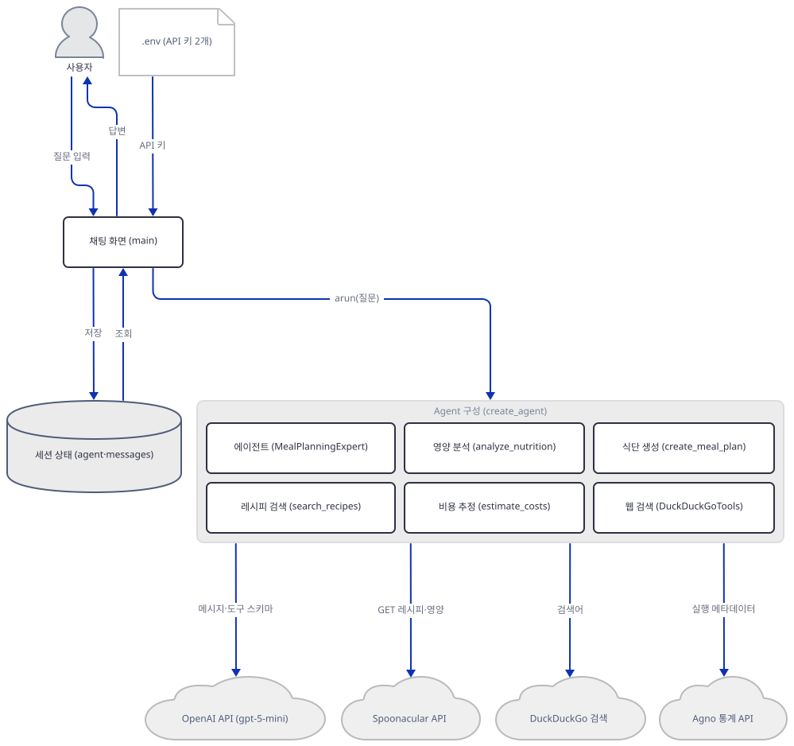

## 사전 준비

| 서비스/도구 | 용도 | 발급·설치 |
|---|---|---|
| uv | 가상환경 생성과 패키지 설치 | [공통 사전 준비](../README.md#공통-사전-준비-한-번만) 절 참고 |
| Python | 이 저장소의 기준은 3.11~3.13이다. 이 문서는 3.13.3으로 확인했다 | 공통 사전 준비와 같음 |
| OpenAI API 키 | `gpt-5-mini` 호출. 키가 없으면 화면이 오류 한 줄만 그리고 멈춘다(Step 6, 직접 확인). 키 없이 따라 하려면 Step 7의 가짜 서버를 쓴다 | https://platform.openai.com/ 가입 후 발급 |
| Spoonacular API 키(선택) | 레시피 검색·영양 분석. 없으면 두 도구가 오류 dict를 돌려줄 뿐 앱은 뜬다(Step 3). 무료 플랜은 하루 50포인트·초당 1요청(공식 가격 페이지, 2026-10-05 확인) | https://spoonacular.com/food-api 가입 후 발급 |
| 인터넷 연결 | PyPI 설치, 그리고 앱이 OpenAI·Spoonacular·DuckDuckGo와 agno 익명 통계 서버(`os-api.agno.com`)에 접속한다(통계는 Day 047 Step 5와 같은 사실, Step 7) | 별도 설치 없음 |
| `.env` 파일 | 두 키를 둔다. 앱 폴더나 그 위쪽 폴더에 둔다(Step 2) | 직접 만든다 |

## 아키텍처 한눈에 보기

| 컴포넌트 | 역할 | 코드 위치 |
|---|---|---|
| 키 읽기 (`load_dotenv`) | `.env`를 환경변수로 올리고 두 키를 모듈 상수로 읽는다 | `advanced_ai_agents/single_agent_apps/ai_recipe_meal_planning_agent/ai_recipe_meal_planning_agent.py:16-19` |
| 레시피 검색 도구 (`search_recipes`) | Spoonacular `findByIngredients`로 후보 5건, 상위 3건의 상세를 `information`으로 | `advanced_ai_agents/single_agent_apps/ai_recipe_meal_planning_agent/ai_recipe_meal_planning_agent.py:21-66` |
| 영양 분석 도구 (`analyze_nutrition`) | `complexSearch`로 첫 결과의 영양소를 읽어 값 6개와 칭찬 문구를 만든다 | `advanced_ai_agents/single_agent_apps/ai_recipe_meal_planning_agent/ai_recipe_meal_planning_agent.py:68-130` |
| 비용 추정 도구 (`estimate_costs`) | 코드 안 가격표(11품목)로 재료별 비용·합계·절약 팁을 만든다 | `advanced_ai_agents/single_agent_apps/ai_recipe_meal_planning_agent/ai_recipe_meal_planning_agent.py:132-174` |
| 식단 생성 도구 (`create_meal_plan`) | 고정 메뉴 9개에서 `random.choice`로 일별 식단·장보기 목록·안내 문구를 만든다 | `advanced_ai_agents/single_agent_apps/ai_recipe_meal_planning_agent/ai_recipe_meal_planning_agent.py:176-271` |
| 에이전트 (`create_agent`) | `gpt-5-mini` + 도구 5개 + 지시문 | `advanced_ai_agents/single_agent_apps/ai_recipe_meal_planning_agent/ai_recipe_meal_planning_agent.py:273-296` |
| 채팅 화면 (`main`) | 키 게이트, 세션에 에이전트·메시지 보관, 질문 → `arun` → 답변 | `advanced_ai_agents/single_agent_apps/ai_recipe_meal_planning_agent/ai_recipe_meal_planning_agent.py:298-376` |
| 세션 상태 (`st.session_state`) | `agent`와 화면용 `messages`를 보관한다. 탭을 닫거나 새로고침하면 사라진다 | `advanced_ai_agents/single_agent_apps/ai_recipe_meal_planning_agent/ai_recipe_meal_planning_agent.py:309-317`, `advanced_ai_agents/single_agent_apps/ai_recipe_meal_planning_agent/ai_recipe_meal_planning_agent.py:320-338` |
| 외부 서비스 (OpenAI, Spoonacular, DuckDuckGo, agno 통계) | 추론, 레시피·영양 데이터, 웹 검색, 익명 실행 통계 | 코드 없음 (외부 서비스) |

한 그림에 다 그리면 너무 길어져, overview는 에이전트와 도구를 한 묶음으로 두고 묶음 안의 호출은 빼고 묶음과 바깥(화면·외부 서비스)의 관계만 그렸습니다. 에이전트가 도구를 따로 부르는 관계, 도구가 외부 서비스를 부르는 관계, `.env`의 Spoonacular 키가 닿는 도구는 아래 그림에 따로 그렸습니다.

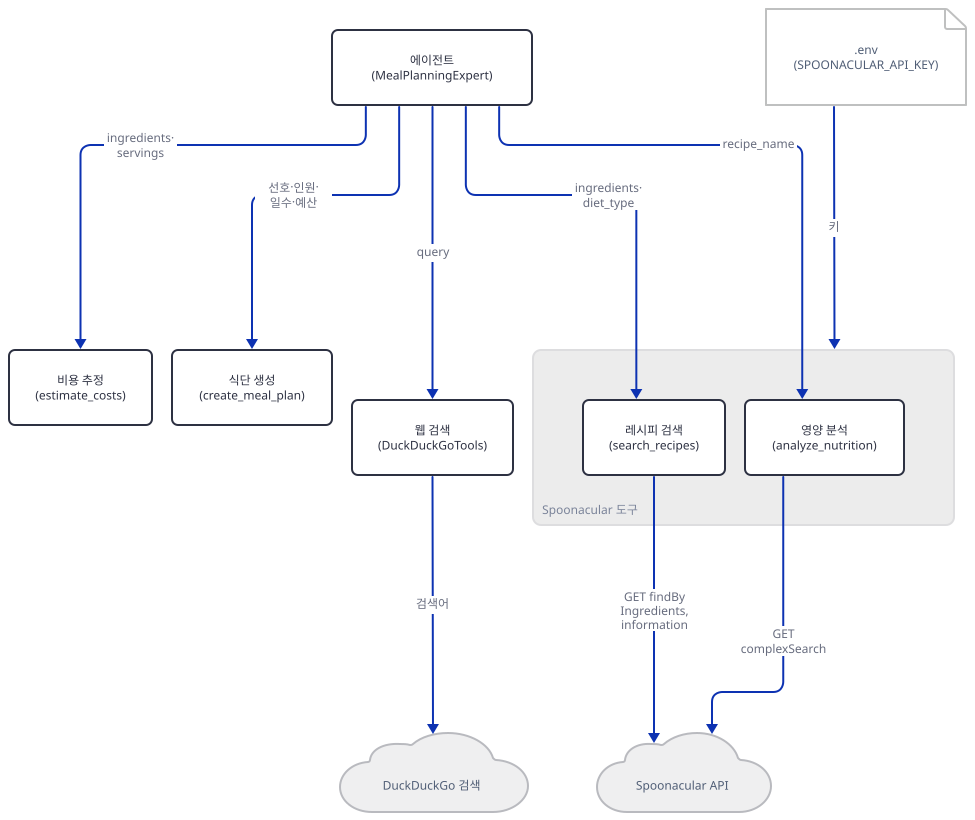

## 단계별 진행

### Step 1. 환경 만들기 — `openai`와 `ddgs`가 빠진 `requirements.txt`

**목적.** 앱 폴더에 가상환경을 만들어 `requirements.txt`를 설치하고, 오늘 실제로 풀리는 버전에서 이 앱이 import되는지 확인합니다.

**할 일.**

```bash
cd advanced_ai_agents/single_agent_apps/ai_recipe_meal_planning_agent
uv venv
uv pip install -r requirements.txt
```

(pip 대안: `python -m venv .venv && source .venv/bin/activate && pip install -r requirements.txt`. Windows PowerShell은 활성화만 `.venv\Scripts\Activate.ps1`로 바꿉니다.)

이 저장소는 루트에 `pyproject.toml`이 있어 `uv run`이 방금 만든 환경 대신 루트의 `.venv`를 쓰므로, 이후 `uv run` 명령에는 모두 `--no-project`를 붙입니다.

`advanced_ai_agents/single_agent_apps/ai_recipe_meal_planning_agent/requirements.txt:1-5`

```text
streamlit
agno>=2.2.10
python-dotenv
requests
duckduckgo-search
```

(다섯 줄, 마지막 줄에 개행이 없어 `wc -l`은 4로 셉니다.) 버전이 고정되지 않아서 오늘은 **streamlit 1.65.0**, **agno 3.1.1**, duckduckgo-search 8.1.1 등이 받아졌습니다(직접 확인, Python 3.13.3). 문법은 통과합니다.

```bash
uv run --no-project python -m py_compile ai_recipe_meal_planning_agent.py && echo compiled
```

```
compiled
```

그런데 모델과 검색 도구를 가져오는 두 줄이 각각 막힙니다.

```bash
uv run --no-project python -c "from agno.models.openai import OpenAIChat"
uv run --no-project python -c "from agno.tools.duckduckgo import DuckDuckGoTools"
```

직접 확인한 출력(각 traceback의 마지막 줄):

```
ImportError: `openai` not installed. Please install using `pip install openai`
ImportError: `ddgs` not installed. Please install using `pip install ddgs`
```

앞의 것은 agno의 `OpenAIChat`이 OpenAI SDK를 따로 요구하는데 `requirements.txt`에 `openai`가 없어서이고(agno 3.1.1 메타데이터의 `openai` extra, 소스로 확인), 뒤의 것은 `DuckDuckGoTools`가 상속하는 `WebSearchTools`(`agno/tools/websearch.py`)가 `ddgs`를 가져오는데 requirements의 `duckduckgo-search`는 `duckduckgo_search`라는 다른 모듈을 제공해서입니다(소스로 확인). 같은 원인을 Day 001 Step 1과 Day 038 Step 1이 이미 다뤘으니 여기서는 재현만 하고 두 패키지를 더 설치합니다. 리포의 `requirements.txt`는 고치지 않습니다.

```bash
uv pip install openai ddgs
uv run --no-project python -c "from agno.models.openai import OpenAIChat; from agno.tools.duckduckgo import DuckDuckGoTools; print('import ok')"
```

(pip 대안: `pip install openai ddgs`.) 설치 뒤에는 openai 3.24.0과 ddgs 9.16.0이 받아졌고(직접 확인) 출력은 다음과 같습니다.

```
import ok
```

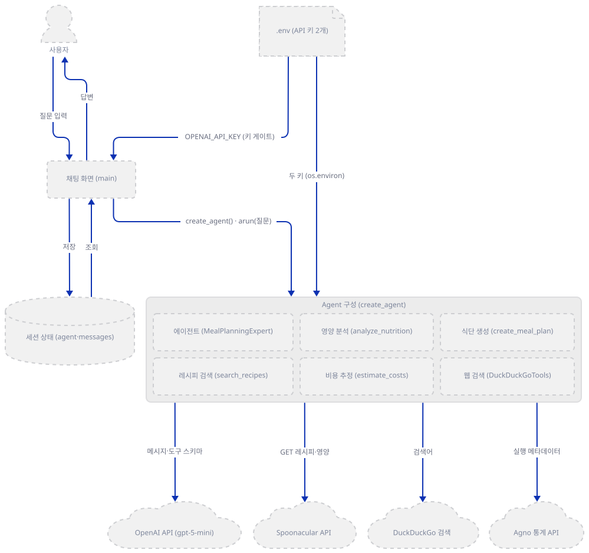

**확인.** 위 세 가지 — `py_compile` 통과, import 두 줄의 `ImportError`, 설치 뒤의 `import ok` — 가 그대로 재현되는지 봅니다.

### Step 2. 키 읽기 — `.env`와 환경변수

**목적.** `load_dotenv()`가 `.env`를 어디서 찾고 셸 변수와 어느 쪽이 이기는지, 키가 없을 때 두 상수가 무엇이 되는지 확인합니다.

**할 일.** 실제 키가 있다면 `.env`를 앱 폴더에 아래처럼 만듭니다. Spoonacular 줄은 선택이고, 키는 따옴표 없이 쓰며, 이 파일은 커밋하지 않습니다. 키가 없다면 만들지 마세요 — 이 문서의 키 없는 확인은 `.env`가 없는 상태를 전제합니다.

```text
OPENAI_API_KEY=your_openai_api_key_here
SPOONACULAR_API_KEY=your_spoonacular_api_key_here
```

앱이 키를 읽는 곳은 아래 몇 줄뿐입니다.

`advanced_ai_agents/single_agent_apps/ai_recipe_meal_planning_agent/ai_recipe_meal_planning_agent.py:16-19`

```python
load_dotenv()

SPOONACULAR_API_KEY = os.getenv("SPOONACULAR_API_KEY")
OPENAI_API_KEY = os.getenv("OPENAI_API_KEY")
```

`load_dotenv()`에 경로를 주지 않으면 python-dotenv는 **이 줄을 실행한 파일이 있는 폴더**에서 시작해 위쪽 폴더로 올라가며 처음 만나는 `.env`를 읽습니다(직접 확인: 작업 폴더가 달라도 앱 폴더의 `.env`가 읽혔고, 앱 폴더에 없이 한 칸 위에만 두어도 읽혔습니다). 상위 폴더에 다른 프로젝트의 `.env`가 있으면 그 키가 조용히 쓰인다는 뜻입니다. 셸에 이미 있는 환경변수는 `.env`가 덮어쓰지 않습니다(직접 확인). 두 상수는 값이 없으면 `None`이고, `OPENAI_API_KEY` 상수는 화면의 키 게이트(Step 6)만 씁니다 — 모델 호출의 인증은 agno의 `OpenAIChat`이 환경변수를 직접 읽습니다(`agno/models/openai/chat.py`, 소스로 확인). `SPOONACULAR_API_KEY`는 두 Spoonacular 도구만 씁니다.

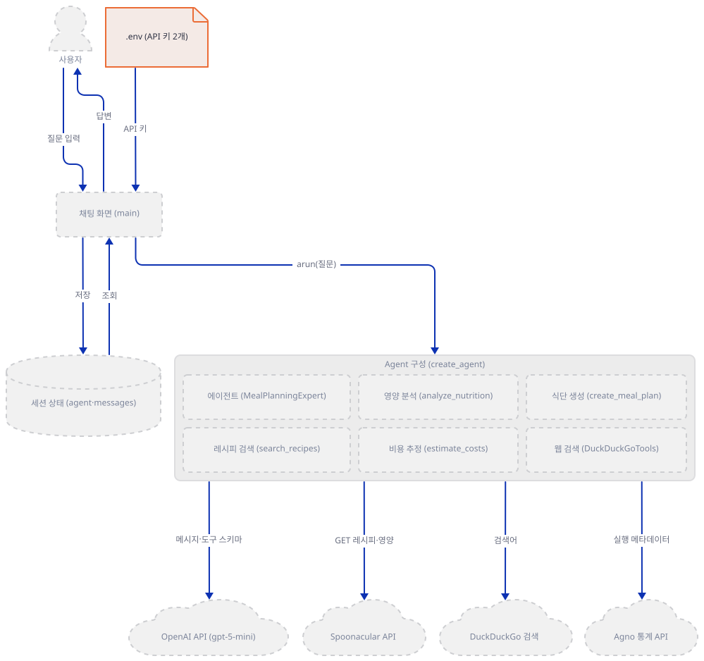

**확인.** `.env`가 없는 상태에서 앱 폴더의 두 상수를 찍어 봅니다. 첫 명령에서 `None`이 아닌 값이 나온다면 `.env`(위쪽 폴더의 것 포함)가 읽히고 있다는 뜻입니다.

```bash
uv run --no-project python -c "import ai_recipe_meal_planning_agent as m; print(m.OPENAI_API_KEY, m.SPOONACULAR_API_KEY)"
```

```
None None
```

키를 셸 변수로 주면 그 값이 나옵니다. bash는 한 줄로, PowerShell은 변수를 만들었다가 지웁니다.

```bash
OPENAI_API_KEY=sk-test uv run --no-project python -c "import ai_recipe_meal_planning_agent as m; print(m.OPENAI_API_KEY, m.SPOONACULAR_API_KEY)"
```

```powershell
$env:OPENAI_API_KEY="sk-test"; uv run --no-project python -c "import ai_recipe_meal_planning_agent as m; print(m.OPENAI_API_KEY, m.SPOONACULAR_API_KEY)"; Remove-Item Env:OPENAI_API_KEY
```

```
sk-test None
```

### Step 3. Spoonacular 도구 두 개 — `search_recipes`와 `analyze_nutrition`

**목적.** `@tool`이 평범한 함수를 도구로 바꾸는 것, 두 함수가 Spoonacular를 부르는 순서, 그리고 실패를 어떻게 숨기는지 확인합니다.

**할 일.**

`advanced_ai_agents/single_agent_apps/ai_recipe_meal_planning_agent/ai_recipe_meal_planning_agent.py:21-66`

```python
@tool
def search_recipes(ingredients: str, diet_type: Optional[str] = None) -> Dict:
    """Search for detailed recipes with cooking instructions."""
    if not SPOONACULAR_API_KEY:
        return {"error": "Spoonacular API key not found"}
    
    url = "https://api.spoonacular.com/recipes/findByIngredients"
    params = {
        "apiKey": SPOONACULAR_API_KEY,
        "ingredients": ingredients,
        "number": 5,
        "ranking": 2,
        "ignorePantry": True
    }
    if diet_type:
        params["diet"] = diet_type
    
    try:
        response = requests.get(url, params=params, timeout=15)
        response.raise_for_status()
        recipes = response.json()
        
        detailed_recipes = []
        for recipe in recipes[:3]:
            detail_url = f"https://api.spoonacular.com/recipes/{recipe['id']}/information"
            detail_response = requests.get(detail_url, params={"apiKey": SPOONACULAR_API_KEY}, timeout=10)
            
            if detail_response.status_code == 200:
                detail_data = detail_response.json()
                detailed_recipes.append({
                    "id": recipe['id'],
                    "title": recipe['title'],
                    "ready_in_minutes": detail_data.get('readyInMinutes', 'N/A'),
                    "servings": detail_data.get('servings', 'N/A'),
                    "health_score": detail_data.get('healthScore', 0),
                    "used_ingredients": [i['name'] for i in recipe['usedIngredients']],
                    "missing_ingredients": [i['name'] for i in recipe['missedIngredients']],
                    "instructions": detail_data.get('instructions', 'Instructions not available')
                })
        
        return {
            "recipes": detailed_recipes,
            "total_found": len(recipes)
        }
    except:
        return {"error": "Recipe search failed"}
```

`@tool`(agno의 `agno.tools.tool`)이 붙은 함수는 `Function` 객체가 되고 원래 함수는 `.entrypoint`로 남습니다(직접 확인: Step 5). `search_recipes`는 키가 없으면 네트워크에 가기 전에 오류 dict를 돌려주고(24~25행), 있으면 재료로 후보 5건을 찾은 뒤(39행) 상위 3건의 상세만 한 건씩 부릅니다(44~46행). 한 번의 검색에 GET이 최대 4건이고 모두 순차입니다(소스로 확인). 후보가 5건이어도 `total_found`는 5, 상세는 3건뿐이고(직접 확인), 상세 호출이 200이 아니면 그 레시피는 말없이 빠집니다(48행, 소스로 확인). 무료 플랜은 호출마다 보통 1포인트에 결과당 0.01포인트를 쓰므로(공식 가격 페이지, 2026-10-05 확인) 하루 50포인트에서 검색 한 번이 대략 4포인트 이상입니다. 앱 README는 이 한도를 `advanced_ai_agents/single_agent_apps/ai_recipe_meal_planning_agent/README.md:55`에서 하루 약 50건, `advanced_ai_agents/single_agent_apps/ai_recipe_meal_planning_agent/README.md:139`에서 150건으로 서로 다르게 적습니다.

맨몸 `except:`(65행)는 시간 초과, 키 오류, 한도 초과를 모두 `{"error": "Recipe search failed"}` 한 가지로 바꿔서 모델도 독자도 원인을 알 수 없습니다(직접 확인: 호출이 예외를 던지게 했을 때). 키가 없으면 오류를 돌려줄 뿐 앱은 뜬다는 앱 README의 말(`advanced_ai_agents/single_agent_apps/ai_recipe_meal_planning_agent/README.md:135`)은 맞습니다(직접 확인).

영양 분석 도구는 `complexSearch`에 `addRecipeNutrition`을 켜고 첫 결과 하나의 영양소를 이름으로 꺼냅니다(75~97행). 아래는 값을 읽고 칭찬 문구를 만드는 부분입니다.

`advanced_ai_agents/single_agent_apps/ai_recipe_meal_planning_agent/ai_recipe_meal_planning_agent.py:94-114`

```python
        if 'nutrition' not in recipe:
            return {"error": "No nutrition data available for this recipe"}
        
        nutrients = {n['name']: n['amount'] for n in recipe['nutrition']['nutrients']}
        calories = round(nutrients.get('Calories', 0))
        protein = round(nutrients.get('Protein', 0), 1)
        carbs = round(nutrients.get('Carbohydrates', 0), 1)
        fat = round(nutrients.get('Fat', 0), 1)
        fiber = round(nutrients.get('Fiber', 0), 1)
        sodium = round(nutrients.get('Sodium', 0), 1)
        
        # Health insights
        health_insights = []
        if protein > 25:
            health_insights.append("✅ High protein - great for muscle building")
        if fiber > 5:
            health_insights.append("✅ High fiber - supports digestive health")
        if sodium < 600:
            health_insights.append("✅ Low sodium - heart-friendly")
        if calories < 400:
            health_insights.append("✅ Low calorie - good for weight management")
```

영양소가 응답에 없으면 `get(..., 0)`이 0을 주기 때문에, 나트륨이 없는 응답에는 `sodium < 600`이, 칼로리가 없는 응답에는 `calories < 400`이 참이 되어 '저나트륨'·'저칼로리' 칭찬이 붙습니다(가짜 응답으로 직접 확인). 129~130행의 맨몸 `except:`는 위와 같은 일을 합니다.

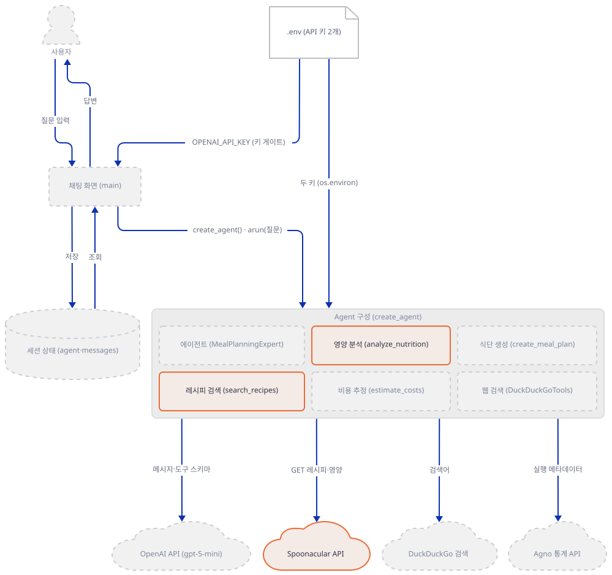

**확인.** 아래 스크립트를 앱 폴더에 `check_spoonacular.py`로 저장합니다(커밋하지 않을 확인용 파일입니다). `requests.get`을 가짜로 바꿔 네트워크 없이 도구를 부릅니다.

```python
from unittest.mock import patch

import ai_recipe_meal_planning_agent as m

calls = []


class FakeResponse:
    status_code = 200

    def __init__(self, data):
        self.data = data

    def raise_for_status(self):
        pass

    def json(self):
        return self.data


def fake_get(url, params=None, timeout=None):
    calls.append(url.replace("https://api.spoonacular.com/recipes/", ""))
    if url.endswith("/findByIngredients"):
        return FakeResponse([
            {"id": 100 + i, "title": f"Recipe {i}",
             "usedIngredients": [{"name": "chicken"}], "missedIngredients": [{"name": "soy sauce"}]}
            for i in range(5)
        ])
    return FakeResponse({"readyInMinutes": 30, "servings": 4, "healthScore": 71, "instructions": "Cook it."})


def broken_get(url, params=None, timeout=None):
    raise RuntimeError("402 Payment Required")


m.SPOONACULAR_API_KEY = None  # .env에 키가 있어도 키 없는 경로를 시험한다
print("키 없이:", m.search_recipes.entrypoint("chicken"))

m.SPOONACULAR_API_KEY = "fake-key"  # 모듈 상수를 바꿔 키가 있는 것처럼 만든다
with patch("requests.get", fake_get):
    result = m.search_recipes.entrypoint("chicken,broccoli,rice", "vegetarian")
print(f"GET 요청 {len(calls)}건:", calls)
print("total_found:", result["total_found"], "| 상세 정보를 붙인 레시피:", len(result["recipes"]))

with patch("requests.get", broken_get):
    print("호출이 예외를 던지면:", m.search_recipes.entrypoint("chicken"))
```

```bash
uv run --no-project python check_spoonacular.py
```

```
키 없이: {'error': 'Spoonacular API key not found'}
GET 요청 4건: ['findByIngredients', '100/information', '101/information', '102/information']
total_found: 5 | 상세 정보를 붙인 레시피: 3
호출이 예외를 던지면: {'error': 'Recipe search failed'}
```

첫 줄은 키가 없을 때이고, 둘째·셋째 줄은 가짜 응답에서 GET 4건에 상세 3건이라는 것, 마지막 줄은 예외가 `Recipe search failed`로 바뀐 것입니다.

### Step 4. 로컬 도구 두 개 — 코드 안의 표로 계산하는 `estimate_costs`와 `create_meal_plan`

**목적.** 이 두 도구가 외부 API가 아니라 코드 안의 고정 표와 `random.choice`로 답을 만든다는 것, 그리고 입력이 결과에 반영되는 범위를 확인합니다.

**할 일.** `estimate_costs`는 가격표(135~139행, 11개 품목, 달러)에서 재료 이름을 찾아 비용을 더합니다.

`advanced_ai_agents/single_agent_apps/ai_recipe_meal_planning_agent/ai_recipe_meal_planning_agent.py:144-158`

```python
    for ingredient in ingredients:
        ingredient_lower = ingredient.lower().strip()
        cost = 3.99  # default
        
        for key, price in prices.items():
            if key in ingredient_lower or any(word in ingredient_lower for word in key.split()):
                cost = price
                break
        
        adjusted_cost = (cost * servings) / 4
        total_cost += adjusted_cost
        cost_breakdown.append({
            "name": ingredient.title(),
            "cost": round(adjusted_cost, 2)
        })
```

이름 맞춤이 느슨합니다. 표의 이름 전체가 재료 이름에 들어 있거나(`key in ...`), 표 이름을 쪼갠 낱말 하나라도 들어 있으면(`any(word ...)`) 그 가격이 되고, 표에서 못 찾으면 3.99입니다(146행). 비용은 4인분 기준 가격에 `servings / 4`를 곱할 뿐입니다.

식단 도구의 메뉴는 아침·점심·저녁 각 세 개, 모두 아홉 개가 코드에 박혀 있고(180~196행) 날마다 `random.choice`로 고릅니다.

`advanced_ai_agents/single_agent_apps/ai_recipe_meal_planning_agent/ai_recipe_meal_planning_agent.py:207-216`

```python
    day_names = ["Monday", "Tuesday", "Wednesday", "Thursday", "Friday", "Saturday", "Sunday"]
    
    for day in day_names[:days]:
        daily_meals = {}
        daily_calories = 0
        daily_protein = 0
        daily_cost = 0
        
        for meal_type in ["breakfast", "lunch", "dinner"]:
            selected_meal = random.choice(meals[meal_type])
```

같은 요청도 호출마다 다른 식단이 나옵니다. `dietary_preference`는 결과 dict에 그대로 되돌려 줄 뿐(`advanced_ai_agents/single_agent_apps/ai_recipe_meal_planning_agent/ai_recipe_meal_planning_agent.py:266`) 메뉴 선택에 쓰이지 않습니다. 날짜는 요일 이름 7개를 `days`만큼 자르므로(209행) 14일을 달라 해도 7일치만 나오는데, 평균은 `days`로 나누어(246~247행) 절반이 되고 `days` 필드는 14로 남습니다. 안내 문구도 메뉴 표의 값 때문에 거의 고정입니다.

`advanced_ai_agents/single_agent_apps/ai_recipe_meal_planning_agent/ai_recipe_meal_planning_agent.py:249-253`

```python
    insights = []
    if avg_daily_calories < 1800:
        insights.append("⚠️ Consider adding healthy snacks to meet calorie needs")
    elif avg_daily_calories > 2200:
        insights.append("💡 Calorie-dense meals - great for active lifestyles")
```

하루 칼로리가 표 값으로는 최소 1,040(250+340+450), 최대 1,260(320+420+520)이라 평균은 늘 1,800 아래입니다. 그래서 '간식을 더하라'는 경고가 항상 붙고 2,200 초과 분기에는 닿을 수 없습니다(표 값으로 계산, 무작위 식단 2만 건으로 직접 확인).

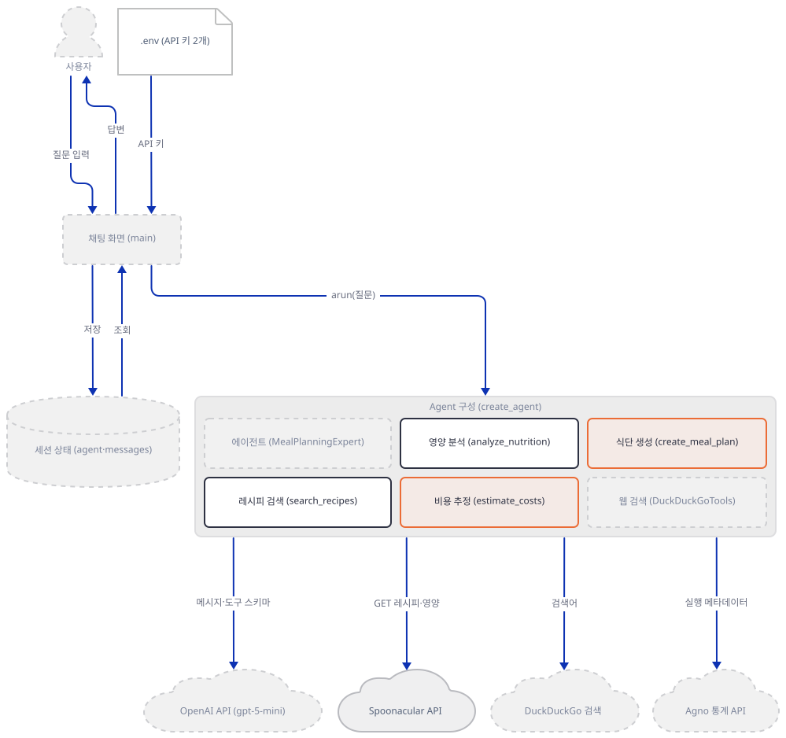

**확인.** 아래 스크립트를 `check_local_tools.py`로 저장합니다. 두 도구는 네트워크를 쓰지 않으니 가짜가 필요 없고, `.entrypoint`는 `@tool`이 감싸기 전의 함수 호출 입구입니다.

```python
import random

import ai_recipe_meal_planning_agent as m

costs = m.estimate_costs.entrypoint(["pasta", "tomatoes", "cheese", "basil"], 4)
print("화면 예시의 총액:", costs["total_cost"], "| 1인분:", costs["cost_per_serving"])

odd = m.estimate_costs.entrypoint(["Ground cumin", "olive", "licorice"], 4)
print("느슨한 이름 맞춤:", [(item["name"], item["cost"]) for item in odd["breakdown"]])

random.seed(7)
plan = m.create_meal_plan.entrypoint("vegetarian", 2, 7, "moderate")
meals = [meal["name"] for day in plan["meal_plan"].values() for meal in day.values()]
print(f"vegetarian 계획의 메뉴 {len(meals)}개 중 닭·연어:", [n for n in meals if "Chicken" in n or "Salmon" in n])

random.seed(1)
vegan = m.create_meal_plan.entrypoint("vegan", 2, 7, "moderate")
random.seed(1)
keto = m.create_meal_plan.entrypoint("keto", 2, 7, "moderate")
print("같은 seed에서 vegan과 keto 식단이 같은가:", vegan["meal_plan"] == keto["meal_plan"])

random.seed(3)
long_plan = m.create_meal_plan.entrypoint("balanced", 2, 14, "moderate")
print(f"days=14 요청: {len(long_plan['meal_plan'])}일치만 나열, days 필드 = {long_plan['days']}")
print("안내 문구:", long_plan["insights"])
```

```bash
uv run --no-project python check_local_tools.py
```

```
화면 예시의 총액: 15.96 | 1인분: 3.99
느슨한 이름 맞춤: [('Ground Cumin', 5.99), ('Olive', 7.99), ('Licorice', 2.99)]
vegetarian 계획의 메뉴 21개 중 닭·연어: ['Chicken Stir Fry with Brown Rice', 'Grilled Salmon with Vegetables', 'Chicken Stir Fry with Brown Rice', 'Grilled Salmon with Vegetables', 'Chicken Caesar Wrap', 'Grilled Salmon with Vegetables']
같은 seed에서 vegan과 keto 식단이 같은가: True
days=14 요청: 7일치만 나열, days 필드 = 14
안내 문구: ['⚠️ Consider adding healthy snacks to meet calorie needs', '💡 Consider adding more protein sources']
```

`random.seed(7)`로 고정한 vegetarian 식단은 메뉴 21개 가운데 6개가 닭이나 연어입니다. 시드를 2만 번 바꿔 돌려도 닭이나 연어가 없는 식단은 하나도 나오지 않았습니다(직접 확인).

### Step 5. 에이전트 조립 — `create_agent`

**목적.** `Agent(...)` 한 번에 모델·도구 다섯 개·지시문이 어떻게 합쳐지는지, 모델이 실제로 받는 도구 정의가 무엇인지 확인합니다.

**할 일.**

`advanced_ai_agents/single_agent_apps/ai_recipe_meal_planning_agent/ai_recipe_meal_planning_agent.py:273-296`

```python
async def create_agent():
    agent = Agent(
        name="MealPlanningExpert",
        model=OpenAIChat(id="gpt-5-mini"),
        tools=[search_recipes, analyze_nutrition, estimate_costs, create_meal_plan, DuckDuckGoTools()],
        instructions=dedent("""\
            You are an expert meal planning assistant. Provide detailed, helpful responses:
            
            🔍 **Recipe Searches**: Include cooking time, health scores, ingredient lists, and instructions
            📊 **Nutrition Analysis**: Provide health insights, nutritional breakdowns, and dietary advice
            💰 **Cost Estimation**: Include budget tips and cost per serving breakdowns
            📅 **Meal Planning**: Create detailed weekly plans with nutritional balance and shopping lists
            
            **Always**:
            - Use clear headings and bullet points
            - Include practical cooking tips
            - Consider dietary restrictions and budgets
            - Provide actionable next steps
            - Be encouraging and supportive
        """),
        markdown=True,
        debug_mode=True
    )
    return agent
```

`tools=`의 앞 넷은 Step 3·4의 함수이고 마지막 `DuckDuckGoTools()`는 agno의 검색 도구 모음입니다. 인자 없이 만들면 `web_search`와 `search_news` 두 함수를 등록하므로(직접 확인) 모델이 보는 도구는 여섯 개입니다. `instructions`는 실제 요청에서 `developer` 역할의 첫 메시지로 나가고(직접 확인: Step 7), `markdown=True`가 '마크다운으로 답하라'는 한 줄을 덧붙입니다(직접 확인: DEBUG 로그). `debug_mode=True`는 프롬프트·도구 호출·도구 결과를 터미널에 DEBUG로 찍으니(직접 확인) 로그를 공유하기 전에 질문 내용이 들어 있는지 보세요. `create_agent`는 안에 `await`가 하나도 없는 `async def`입니다(소스로 확인). 이전 대화를 모델 입력에 넣는 설정(`add_history_to_context`)도 저장소(`db`)도 주지 않아 기본값인 `False`와 `None`입니다(직접 확인).

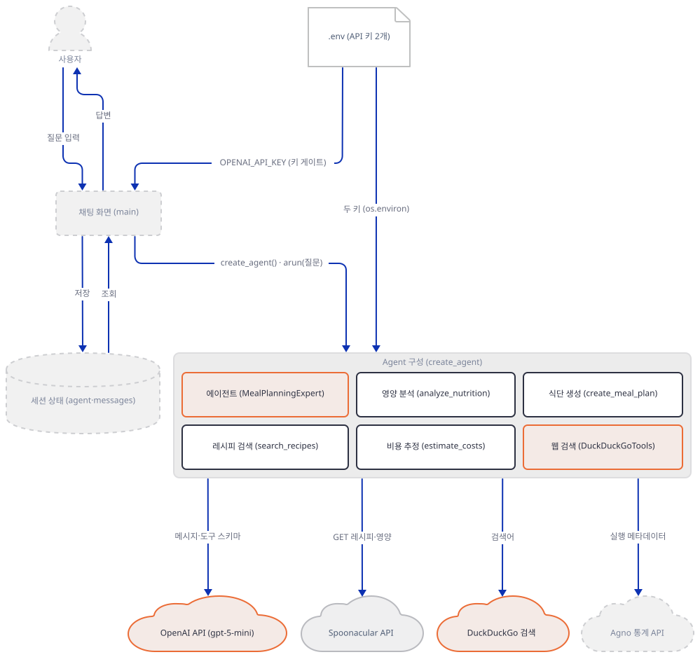

**확인.** 아래 스크립트를 `check_agent.py`로 저장합니다. 에이전트를 만들기만 하고 모델은 부르지 않으므로 키도 네트워크도 필요 없습니다. 마지막 두 줄은 `@tool`이 만든 도구 정의를 모델에 보낼 모양 그대로 찍습니다.

```python
import asyncio
import json

import ai_recipe_meal_planning_agent as m

agent = asyncio.run(m.create_agent())
print("이름:", agent.name, "| 모델:", agent.model.id)
for tool in agent.tools:
    print("도구:", type(tool).__name__, "→", getattr(tool, "name", None))
print("DuckDuckGoTools가 등록하는 함수:", list(agent.tools[-1].functions))
print("markdown:", agent.markdown, "| debug_mode:", agent.debug_mode)
print("이전 대화를 모델 입력에 넣는가:", agent.add_history_to_context, "| db:", agent.db)

m.search_recipes.process_entrypoint()  # 모델에 보낼 스키마를 만든다
print(json.dumps(m.search_recipes.to_dict()))
```

```bash
uv run --no-project python check_agent.py
```

```
이름: MealPlanningExpert | 모델: gpt-5-mini
도구: Function → search_recipes
도구: Function → analyze_nutrition
도구: Function → estimate_costs
도구: Function → create_meal_plan
도구: DuckDuckGoTools → websearch
DuckDuckGoTools가 등록하는 함수: ['web_search', 'search_news']
markdown: True | debug_mode: True
이전 대화를 모델 입력에 넣는가: False | db: None
{"name": "search_recipes", "description": "Search for detailed recipes with cooking instructions.", "parameters": {"type": "object", "properties": {"ingredients": {"type": "string"}, "diet_type": {"type": "string"}}, "required": ["ingredients"], "additionalProperties": false}}
```

도구 다섯 가운데 넷은 `Function`이고 하나는 `DuckDuckGoTools`이며, 그 안의 함수 둘을 더해 여섯입니다. 스키마의 `description`은 독스트링 한 줄이고, `diet_type`은 기본값이 있어 `required`에 없으며, 인자마다 설명이 없는 것은 독스트링에 인자 설명을 쓰지 않았기 때문입니다.

### Step 6. 채팅 화면 — `main()`

**목적.** 키 게이트, 에이전트를 세션에 한 번만 만드는 방식, 질문과 답변이 화면과 메시지 목록에 쌓이는 방식을 확인합니다.

**할 일.**

`advanced_ai_agents/single_agent_apps/ai_recipe_meal_planning_agent/ai_recipe_meal_planning_agent.py:304-317`

```python
    if not OPENAI_API_KEY:
        st.error("Please add OPENAI_API_KEY to your .env file")
        st.stop()
    
    # Initialize agent
    if "agent" not in st.session_state:
        with st.spinner("Initializing agent..."):
            try:
                loop = asyncio.new_event_loop()
                asyncio.set_event_loop(loop)
                st.session_state.agent = loop.run_until_complete(create_agent())
            except Exception as e:
                st.error(f"Failed to initialize agent: {e}")
                st.stop()
```

화면은 키가 없으면 `st.error` 한 줄을 그리고 `st.stop()`으로 그 아래를 전부 건너뜁니다(304~306행). 에이전트는 세션에 없을 때만 한 번 만들고(309~317행) 이후 `st.session_state`에서 꺼내 씁니다. `create_agent`가 `async`라서 이벤트 루프를 새로 만들어 `run_until_complete`로 돌립니다. 메시지 목록(320~338행)은 환영 문구로 시작해 화면에 그릴 말풍선을 쌓아 둡니다. 질문을 받는 부분은 다음과 같습니다.

`advanced_ai_agents/single_agent_apps/ai_recipe_meal_planning_agent/ai_recipe_meal_planning_agent.py:346-373`

```python
    if user_input := st.chat_input("Ask about recipes, nutrition, meal planning, or costs..."):
        st.session_state.messages.append({"role": "user", "content": user_input})
        
        with st.chat_message("user"):
            st.markdown(user_input)
        
        with st.chat_message("assistant"):
            with st.spinner("Thinking..."):
                try:
                    loop = asyncio.new_event_loop()
                    asyncio.set_event_loop(loop)
                    response: RunOutput = loop.run_until_complete(
                        st.session_state.agent.arun(user_input)
                    )
                    
                    st.markdown(response.content)
                    st.session_state.messages.append({
                        "role": "assistant", 
                        "content": response.content
                    })
                    
                except Exception as e:
                    error_msg = f"Error: {str(e)}"
                    st.error(error_msg)
                    st.session_state.messages.append({
                        "role": "assistant",
                        "content": error_msg
                    })
```

질문이 들어오면 먼저 목록에 붙이고(347행) 에이전트에는 질문 **문자열 하나**만 넘깁니다(357~359행). 목록은 화면용이지 모델 입력이 아니므로, 앱 README가 말하는 대화 기억(`advanced_ai_agents/single_agent_apps/ai_recipe_meal_planning_agent/README.md:31-32`, `advanced_ai_agents/single_agent_apps/ai_recipe_meal_planning_agent/README.md:101`, `advanced_ai_agents/single_agent_apps/ai_recipe_meal_planning_agent/README.md:143`)은 이 코드에 없습니다(Step 7에서 요청 본문으로 확인합니다). 또 턴마다 이벤트 루프를 새로 만들고 닫지 않으며 같은 에이전트의 같은 비동기 클라이언트를 재사용합니다 — 이것이 Step 7의 이어 묻기 실험에서 문제가 됩니다. 모델 호출이 실패해도 `arun`은 예외를 던지지 않고 `status`가 `error`인 `RunOutput`을 돌려주므로(가짜 서버의 401로 직접 확인) 367행의 `except Exception`은 거의 타지 않고, 오류 문구는 빨간 상자가 아니라 일반 답변 말풍선으로 뜹니다(직접 확인).

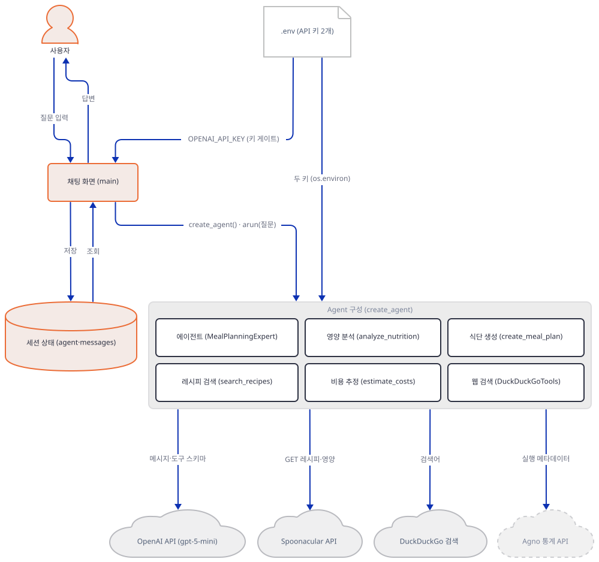

**확인.** 아래 스크립트를 `ui_check.py`로 저장합니다. Streamlit의 `AppTest`가 서버도 브라우저도 없이 앱 스크립트를 실행해 화면 요소를 알려 주고, 스크립트는 키 없음(빈 값)과 가짜 키 두 경우를 차례로 돌립니다. 셸 변수가 `.env`보다 이기므로(Step 2) `.env`에 키가 있어도 결과가 같습니다.

```python
import os

from streamlit.testing.v1 import AppTest

for label, key in [("키 없음", ""), ("가짜 키", "sk-test")]:
    os.environ["OPENAI_API_KEY"] = key  # 셸 변수가 .env보다 이기므로 .env에 키가 있어도 이 값이 쓰인다
    at = AppTest.from_file("ai_recipe_meal_planning_agent.py", default_timeout=30).run()
    print(f"[{label}] 제목:", at.title[0].value)
    print("  오류:", [e.value for e in at.error])
    print("  입력창:", len(at.chat_input), "| 말풍선:", len(at.chat_message), "| session_state의 agent:", "agent" in at.session_state)
```

```bash
uv run --no-project python ui_check.py
```

```
[키 없음] 제목: 🍽️ AI Meal Planning Agent
  오류: ['Please add OPENAI_API_KEY to your .env file']
  입력창: 0 | 말풍선: 0 | session_state의 agent: False
[가짜 키] 제목: 🍽️ AI Meal Planning Agent
  오류: []
  입력창: 1 | 말풍선: 1 | session_state의 agent: True
```

키가 없으면 제목과 오류 한 줄뿐이고 입력창도 에이전트도 없습니다. 가짜 키만 있어도 에이전트가 만들어지고 환영 말풍선 하나와 입력창이 그려집니다 — 이 단계에서는 모델을 부르지 않으니 키 값은 검사되지 않습니다.

### Step 7. 끝까지 돌려 보기 — 가짜 모델 서버, 이어 묻기, 앱 띄우기

**목적.** 키 없이 가짜 모델 서버로 질문 한 건을 끝까지 돌려 도구 호출 루프와 요청 본문을 보고, 이어 묻기 문제를 재현하고, 앱을 띄우는 명령과 agno 통계를 확인합니다.

**할 일.** 먼저 가짜 서버입니다. 진짜 API처럼 연결을 재사용하는(HTTP/1.1 keep-alive) 서버로, 무슨 질문이든 `estimate_costs`를 부르라고 답하고 도구 결과를 받으면 최종 답을 돌려줍니다. 받은 요청의 역할 목록과 도구 수, 도구 메시지를 터미널에 찍습니다. `fake_openai.py`로 저장해 한 터미널에서 띄워 둡니다.

```python
import json
import sys
from http.server import BaseHTTPRequestHandler, ThreadingHTTPServer

PORT = int(sys.argv[1]) if len(sys.argv) > 1 else 8765


def completion(message, finish_reason):
    return {
        "id": "chatcmpl-fake", "object": "chat.completion", "created": 0, "model": "gpt-5-mini",
        "choices": [{"index": 0, "message": message, "finish_reason": finish_reason}],
        "usage": {"prompt_tokens": 1, "completion_tokens": 1, "total_tokens": 2},
    }


class Handler(BaseHTTPRequestHandler):
    protocol_version = "HTTP/1.1"  # 진짜 API처럼 연결을 재사용(keep-alive)한다

    def log_message(self, *args):
        pass

    def do_POST(self):
        body = json.loads(self.rfile.read(int(self.headers["Content-Length"])))
        roles = [m["role"] for m in body["messages"]]
        print("요청 roles =", roles, "| tools =", len(body.get("tools", [])), flush=True)
        if roles[-1] == "tool":
            print("  tool 메시지 =", body["messages"][-1]["content"][:70], flush=True)
            message, reason = {"role": "assistant", "content": "가짜 모델의 최종 답변"}, "stop"
        else:
            args = {"ingredients": ["pasta", "tomatoes", "cheese", "basil"], "servings": 4}
            call = {"id": "call_1", "type": "function",
                    "function": {"name": "estimate_costs", "arguments": json.dumps(args)}}
            message, reason = {"role": "assistant", "content": None, "tool_calls": [call]}, "tool_calls"
        data = json.dumps(completion(message, reason)).encode()
        self.send_response(200)
        self.send_header("Content-Type", "application/json")
        self.send_header("Content-Length", str(len(data)))
        self.end_headers()
        self.wfile.write(data)


class Server(ThreadingHTTPServer):
    def handle_error(self, request, client_address):
        pass  # 클라이언트가 연결을 끊어도 조용히 넘어간다


Server(("127.0.0.1", PORT), Handler).serve_forever()
```

```bash
uv run --no-project python fake_openai.py
```

다른 터미널에서 질문 둘을 차례로 보내는 `ask_agent.py`를 돌립니다. `OPENAI_BASE_URL`은 OpenAI SDK가 읽는 환경변수라 앱 코드를 고치지 않고 요청이 가짜 서버로 가고, `AGNO_TELEMETRY=false`는 아래에서 설명할 agno 통계를 끕니다.

```python
import asyncio

import ai_recipe_meal_planning_agent as m


async def main():
    agent = await m.create_agent()
    agent.debug_mode = False  # 로그를 줄이려고 이 실험에서만 끈다
    questions = ["Estimate costs for pasta, tomatoes, cheese, and basil for 4 servings", "What did I ask you first?"]
    for number, question in enumerate(questions, 1):
        out = await agent.arun(question)
        print(f"{number}번째 질문 →", out.status, "|", out.content)


asyncio.run(main())
```

```bash
OPENAI_API_KEY=sk-fake OPENAI_BASE_URL=http://127.0.0.1:8765/v1 AGNO_TELEMETRY=false uv run --no-project python ask_agent.py
```

```powershell
$env:OPENAI_API_KEY="sk-fake"; $env:OPENAI_BASE_URL="http://127.0.0.1:8765/v1"; $env:AGNO_TELEMETRY="false"
uv run --no-project python ask_agent.py
```

(PowerShell 변수는 이 창에 남으니 실험이 끝나면 `Remove-Item Env:OPENAI_API_KEY, Env:OPENAI_BASE_URL, Env:AGNO_TELEMETRY`로 지웁니다. 안 지우면 다음 실제 실행이 가짜 서버로 갑니다.)

직접 확인한 출력은 `ask_agent.py` 쪽이 다음과 같고,

```
1번째 질문 → RunStatus.completed | 가짜 모델의 최종 답변
2번째 질문 → RunStatus.completed | 가짜 모델의 최종 답변
```

가짜 서버 터미널에는 다음이 찍힙니다.

```
요청 roles = ['developer', 'user'] | tools = 6
요청 roles = ['developer', 'user', 'assistant', 'tool'] | tools = 6
  tool 메시지 = {'total_cost': 15.96, 'cost_per_serving': 3.99, 'servings': 4, 'breakd
요청 roles = ['developer', 'user'] | tools = 6
요청 roles = ['developer', 'user', 'assistant', 'tool'] | tools = 6
  tool 메시지 = {'total_cost': 15.96, 'cost_per_serving': 3.99, 'servings': 4, 'breakd
```

질문 한 건에 모델 요청이 두 번 갑니다. 첫 요청은 `developer` 지시문과 질문, 도구 여섯 개이고, 모델이 `estimate_costs`를 부르라고 답하면 agno가 **내 컴퓨터에서** 그 함수를 실행해(15.96, Step 4의 값) 결과를 `tool` 메시지로 붙여 다시 보냅니다. 도구 결과는 JSON이 아니라 파이썬 dict의 문자열이라 작은따옴표로 갑니다. 그리고 둘째 질문 "What did I ask you first?"의 첫 요청에도 역할은 `developer`와 `user`뿐입니다. 첫 질문이 모델에 가지 않았으니 앱은 대화를 기억하지 못합니다.

이제 앱이 하는 방식 그대로 턴마다 새 이벤트 루프를 만들어 질문 둘을 바로 이어 보냅니다. 둘째 질문에는 8초 제한을 걸고, 6초 쉰 뒤 셋째 질문도 보냅니다.

```python
import asyncio
import time

import ai_recipe_meal_planning_agent as m

agent = asyncio.run(m.create_agent())
agent.debug_mode = False  # 로그를 줄이려고 이 실험에서만 끈다


def turn(question):
    loop = asyncio.new_event_loop()  # 앱 355~356행처럼: 턴마다 새 루프를 만들고 닫지 않는다
    asyncio.set_event_loop(loop)
    start = time.time()
    try:
        loop.run_until_complete(asyncio.wait_for(agent.arun(question), 8))
        return f"{time.time() - start:.1f}초 만에 답이 왔다"
    except TimeoutError:
        return "8초가 지나도 답이 오지 않았다"


print("1번째 질문:", turn("hello"))
print("바로 이어서 2번째 질문:", turn("hello again"))
time.sleep(6)
print("6초 쉰 뒤 3번째 질문:", turn("hello once more"))
```

```bash
OPENAI_API_KEY=sk-fake OPENAI_BASE_URL=http://127.0.0.1:8765/v1 AGNO_TELEMETRY=false uv run --no-project python two_loops.py
```

직접 확인한 출력:

```
1번째 질문: 0.3초 만에 답이 왔다
바로 이어서 2번째 질문: 8초가 지나도 답이 오지 않았다
6초 쉰 뒤 3번째 질문: 0.0초 만에 답이 왔다
```

바로 이어 보낸 둘째 질문만 답이 오지 않았습니다. 원인은 연결 재사용 쪽으로 좁혀졌습니다. 연결을 매번 닫는 HTTP/1.0 서버로 같은 실험을 하거나 같은 이벤트 루프를 계속 쓰면 바로 이어 물어도 답이 옵니다(직접 확인). 멈춘 순간 대기 중인 태스크는 `httpcore2`의 요청 본문 전송에서 `anyio`의 `send`를 기다리고 있었고, openai 3.24.0 연결 풀이 유휴 연결을 보관하는 시간은 5.0초입니다(`keepalive_expiry`, 직접 확인). 첫 질문이 만든 연결을 5초 안에 다음 질문이 재사용하는데, 그 연결을 만든 루프와 지금 루프가 달라 쓰기가 끝나지 않는 것으로 보입니다. SDK의 기본 제한시간이 600초라(소스로 확인) 막히면 몇 분을 기다릴 수 있습니다. `AppTest`로 앱을 이어 돌려도 0.5초 간격이면 90초가 지나도 둘째 턴이 끝나지 않았고 6.5초 간격이면 바로 끝났습니다(직접 확인). 실제 OpenAI 서버가 5초보다 먼저 연결을 닫으면 생기지 않을 수 있는데, 이 문서는 실제 서버에서 확인하지 못했습니다.

앱을 띄우는 명령은 다음 한 줄이고 브라우저에서 `http://localhost:8501`을 엽니다. 위 가짜 서버를 켜 둔 채 위의 환경변수 세 개를 걸고 같은 명령을 실행하면 키 없이 브라우저에서 질문해 볼 수 있습니다.

```bash
uv run --no-project streamlit run ai_recipe_meal_planning_agent.py
```

화면 없이 서버가 뜨는지만 보려면 `--server.headless true --server.address localhost`를 붙입니다(주소를 지정하지 않고 headless로 띄우면 Streamlit이 외부 IP를 알아내려고 요청을 보낸다는 Day 086 Step 7의 확인과 같은 이유입니다). 임의의 높은 포트(58115)로 직접 확인했더니 Streamlit 1.65.0에서 `/_stcore/health`가 `200 ok`를 돌려주었고, 나가려는 요청을 기록만 하는 프록시를 걸어도 아무 기록이 남지 않았습니다.

agno의 익명 사용 통계는 Day 047 Step 5가 이미 다뤘습니다. `agent.run()`이 성공할 때마다 실행 메타데이터를 보내고 `AGNO_TELEMETRY=false`로 끈다는 것인데, 이 앱이 쓰는 `arun()`도 같은 경로입니다(agno 3.1.1 소스로 확인: 비동기 실행 끝에서 `alog_agent_telemetry`가 불립니다). 통계 주소를 내 컴퓨터의 수신기로 바꿔 돌려 보니 성공한 `arun`마다 `POST /telemetry/runs`가 한 건씩 왔고, 401로 실패한 실행과 `AGNO_TELEMETRY=false`인 실행에서는 오지 않았습니다. 본문은 `agent_id`, 모델 provider·이름·id, `has_tools` 같은 구성 정보이고 질문·답변은 없었습니다(직접 확인). 기본 주소는 `https://os-api.agno.com`이고(소스로 확인), 요청을 거절하는 프록시를 걸자 `CONNECT os-api.agno.com:443` 한 건이 도착했습니다(직접 확인, 아무것도 나가지 않았습니다).

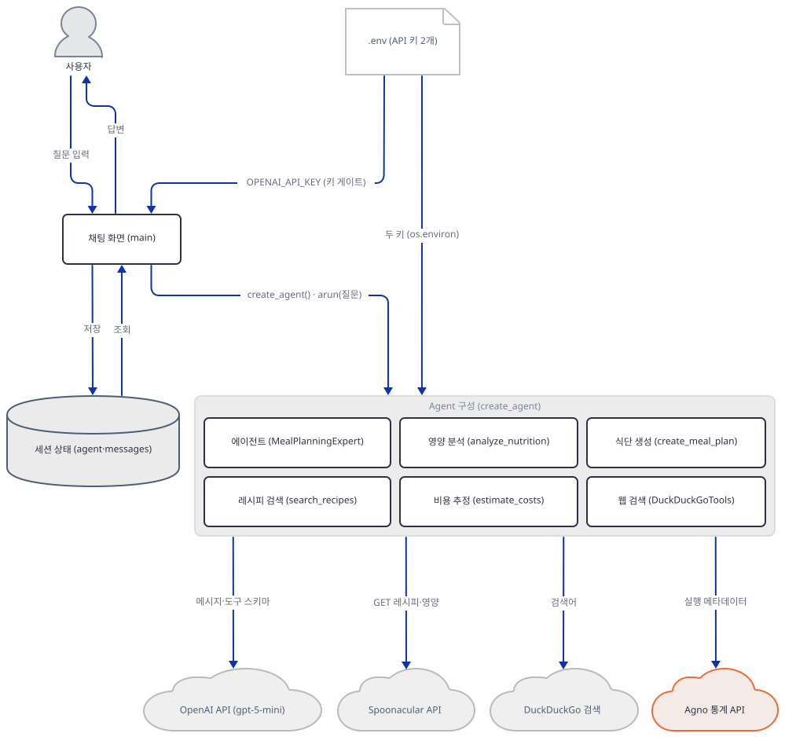

**확인.** `ask_agent.py`의 출력과 가짜 서버의 역할 목록이 위와 같은지, `two_loops.py`에서 둘째 질문만 답이 오지 않는지 봅니다. 끝나면 가짜 서버를 `Ctrl+C`로 끄고 PowerShell이라면 환경변수를 지웁니다.

## 요청 한 건이 흐르는 과정

사용자가 "닭고기로 만들 수 있는 건강한 저녁"을 물었고 모델이 `search_recipes`를 한 번만 고르는 경우의 예입니다. 첫 그림에서 질문은 `chat_input`으로 들어와 화면이 메시지 목록에 붙이고, 새 이벤트 루프에서 `arun`을 부릅니다. 에이전트는 지시문·질문·도구 스키마 여섯 개를 모델에 보내고, 모델은 도구를 부르라는 `tool_calls`로 답합니다.

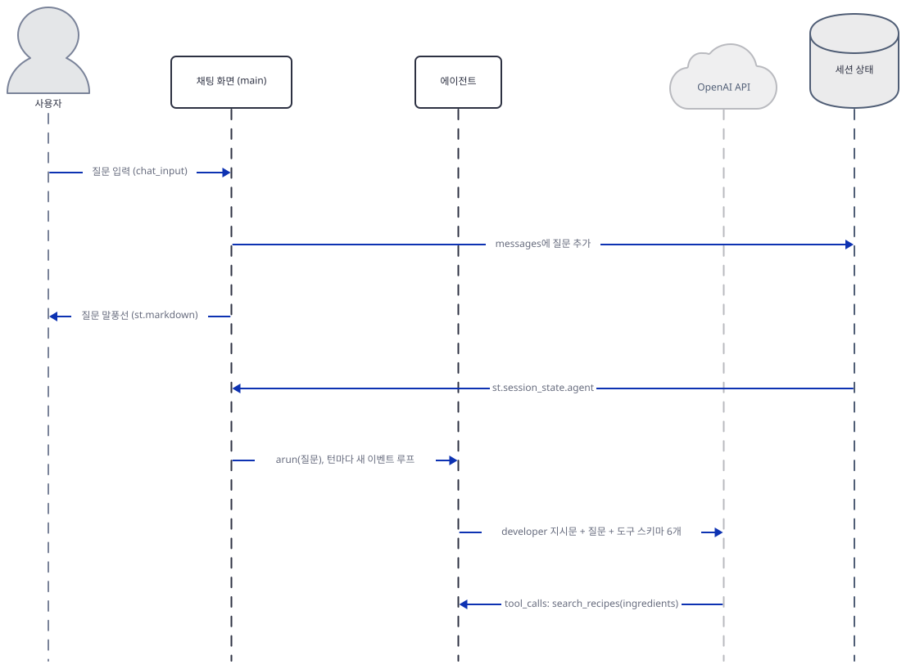

둘째 그림에서 에이전트가 `search_recipes`를 실행하면 도구가 Spoonacular에 GET을 한 번(후보 5건), 상세를 세 번 부르고 dict를 돌려줍니다.

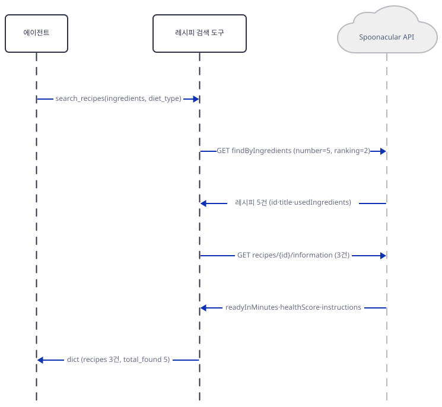

셋째 그림에서 에이전트는 결과를 `tool` 메시지로 모델에 다시 보내 최종 답변을 받고, 성공한 실행이므로 agno 통계 서버에 메타데이터를 보낸 뒤 화면에 답변을 넘깁니다. 화면은 답변을 메시지 목록에 붙이고 말풍선으로 그립니다. 모델이 다른 도구를 골랐다면 둘째 그림이 달라집니다. 영양 분석은 `complexSearch` 한 번, 비용·식단은 외부 호출 없는 로컬 계산, 웹 검색은 DuckDuckGo 검색이 됩니다.

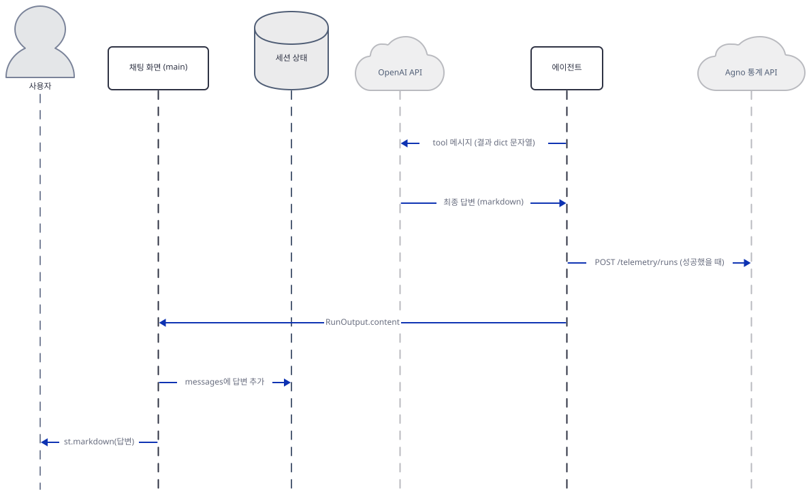

## 실행 체크리스트

- [ ] `uv venv`와 `uv pip install -r requirements.txt` 뒤, `openai`와 `ddgs` 없이는 import 두 줄이 `ImportError`로 막히는 것을 확인했다
- [ ] `uv pip install openai ddgs` 뒤 `import ok`를 확인했다
- [ ] 키가 없을 때 두 상수가 `None`이고 셸 변수를 주면 그 값이 나오는 것을 확인했다
- [ ] `check_spoonacular.py`로 검색 한 번이 GET 4건·상세 3건이고 예외가 `Recipe search failed`로 바뀌는 것을 확인했다
- [ ] `check_local_tools.py`로 느슨한 이름 맞춤, vegetarian 식단의 닭·연어, 7일 제한을 확인했다
- [ ] `check_agent.py`로 도구 5개·함수 6개와 `add_history_to_context=False`, 도구 스키마를 확인했다
- [ ] `ui_check.py`로 키 없는 화면(오류 한 줄, 입력창 없음)과 키 있는 화면을 확인했다
- [ ] 가짜 서버로 `ask_agent.py`를 돌려 요청이 두 번이고 `tool` 메시지가 붙으며, 둘째 질문에 이력이 없는 것을 확인했다
- [ ] `two_loops.py`로 바로 이어 보낸 둘째 질문만 답이 오지 않는 것을 확인했다
- [ ] 확인이 끝나 가짜 서버를 끄고 환경변수(`OPENAI_API_KEY`·`OPENAI_BASE_URL`·`AGNO_TELEMETRY`)를 지웠다
- [ ] (키가 있다면) 앱을 띄워 실제 질문을 하나 보내고 터미널의 DEBUG 로그에서 도구 호출을 확인했다

## 문제 해결

| 증상 | 원인 | 해결 |
|---|---|---|
| ``ImportError: `openai` not installed. Please install using `pip install openai` `` (직접 확인) | `requirements.txt`에 `openai`가 없는데 agno의 `OpenAIChat`이 요구한다 | 리포 코드는 고치지 않음 — `uv pip install openai` |
| ``ImportError: `ddgs` not installed. Please install using `pip install ddgs` `` (직접 확인) | agno 3.1.1의 `DuckDuckGoTools`가 `ddgs`를 가져오는데 requirements는 `duckduckgo-search`를 설치한다(Day 001·Day 038과 같은 원인) | `uv pip install ddgs` |
| `streamlit run` 화면에 제목도 입력창도 없이 `ImportError` 빨간 상자만 뜬다(`requirements.txt`만 설치한 환경에서 `AppTest`로 직접 확인: 예외 1건, 입력창 0, 제목 없음) | 위 두 행과 같은 원인 | 두 패키지를 설치하고 새로고침 |
| 화면에 `Please add OPENAI_API_KEY to your .env file` 한 줄만 뜬다(직접 확인) | 환경에 `OPENAI_API_KEY`가 없다 — `.env`가 앱 폴더나 위쪽 폴더에 없거나 이름이 다르다 | Step 2의 두 줄을 앱 폴더 `.env`에 쓰고 앱을 다시 띄움 |
| 레시피 검색·영양 분석 결과가 `Spoonacular API key not found`, `API key not found`, `Recipe search failed`, `Nutrition analysis failed` 가운데 하나뿐이다(직접 확인) | 키가 없거나, 호출이 실패했는데 맨몸 `except:`가 원인을 숨긴다 | 코드는 고치지 않음 — 키와 하루 50포인트 한도를 확인하고, 원인은 `requests`로 같은 주소를 직접 불러 확인 |
| vegetarian·vegan을 요청했는데 식단에 닭고기·연어가 들어 있다(직접 확인) | `create_meal_plan`이 `dietary_preference`를 결과에 되돌려 줄 뿐 메뉴 선택에 쓰지 않는다(`advanced_ai_agents/single_agent_apps/ai_recipe_meal_planning_agent/ai_recipe_meal_planning_agent.py:266`) | 코드는 고치지 않음 — 도구 결과의 메뉴를 그대로 믿지 말 것 |
| 7일을 넘는 식단을 요청하면 7일치만 나오고 일 평균 칼로리·비용이 절반으로 보인다(직접 확인) | 요일 이름이 7개뿐인데 평균은 요청한 `days`로 나눈다(`advanced_ai_agents/single_agent_apps/ai_recipe_meal_planning_agent/ai_recipe_meal_planning_agent.py:209`, `advanced_ai_agents/single_agent_apps/ai_recipe_meal_planning_agent/ai_recipe_meal_planning_agent.py:246-247`) | 코드는 고치지 않음 — 7일 이내로 요청 |
| 앞 질문에 답이 온 직후 바로 다음 질문을 보내면 `Thinking...`이 끝나지 않는다 | 턴마다 새 이벤트 루프를 만들면서 같은 비동기 클라이언트의 연결을 재사용한다(가짜 keep-alive 서버에서 재현, 실제 OpenAI 서버에서는 확인하지 못함) | 코드는 고치지 않음 — 5초 넘게 쉬었다 보내거나 페이지를 새로고침(새 세션이 에이전트와 클라이언트를 새로 만든다, 소스로 확인) |
| 틀린 키로 질문했더니 빨간 오류 상자가 아니라 답변 말풍선에 오류 문구가 뜬다(가짜 서버의 401로 직접 확인) | `arun`이 모델 오류를 예외로 올리지 않고 `status`가 `error`인 `RunOutput`으로 돌려준다 | 키를 확인하고 앱을 다시 띄움 |
| 터미널에 `DEBUG` 줄(프롬프트, 도구 호출, 도구 결과)이 쏟아진다(직접 확인) | `create_agent`가 `debug_mode=True`로 만든다(`advanced_ai_agents/single_agent_apps/ai_recipe_meal_planning_agent/ai_recipe_meal_planning_agent.py:294`) | 코드는 고치지 않음 — 로그를 공유하기 전에 질문 내용이 들어 있는지 볼 것 |
| 앱 README의 안내가 코드와 어긋난다(소스로 확인) | `advanced_ai_agents/single_agent_apps/ai_recipe_meal_planning_agent/README.md:40`은 `git clone` 바로 뒤에 `awesome-llm-apps` 폴더에 들어가지 않고 `cd advanced_ai_agents/...`를 적는다. `advanced_ai_agents/single_agent_apps/ai_recipe_meal_planning_agent/README.md:124`와 `advanced_ai_agents/single_agent_apps/ai_recipe_meal_planning_agent/README.md:127`이 말하는 `ingredient_costs`·`estimate_grocery_costs`·`meal_categories`·`create_weekly_meal_plan`은 코드에 없다(실제 이름은 `prices`·`estimate_costs`·`meals`·`create_meal_plan`) | 이 문서는 실제 코드 기준으로 설명 — `cd awesome-llm-apps`를 먼저 실행 |

## 더 해보기

- `create_meal_plan`의 메뉴 표에 식단 태그(채식, 비건 등)를 붙이고 `dietary_preference`로 걸러 내도록 고쳐 본 뒤, Step 4의 `check_local_tools.py`를 다시 돌려 vegetarian 식단에서 닭·연어가 사라지는지 확인해 보기
- 에이전트에 대화 이력을 주기: `Agent(...)`에 `db=InMemoryDb()`(`from agno.db.in_memory import InMemoryDb`)와 `add_history_to_context=True`를 더하면 둘째 질문의 모델 입력에 첫 질문의 대화가 실립니다(가짜 서버로 직접 확인). `db` 없이 `add_history_to_context=True`만 주면 agno가 경고를 찍고 이력을 넣지 않습니다(직접 확인). Step 7의 `ask_agent.py`로 둘째 요청의 역할 목록이 어떻게 달라지는지 보기
- `advanced_ai_agents/single_agent_apps/ai_recipe_meal_planning_agent/ai_recipe_meal_planning_agent.py:65-66`의 맨몸 `except:`를 `except requests.RequestException as error:`로 바꾸고 오류 종류를 돌려주게 한 뒤 `check_spoonacular.py`의 마지막 줄이 어떻게 달라지는지 보기
- `advanced_ai_agents/single_agent_apps/ai_recipe_meal_planning_agent/ai_recipe_meal_planning_agent.py:355-359`의 턴마다 새 루프를 만드는 대신 루프 하나를 재사용하도록 바꾸고 `two_loops.py`와 같은 실험을 해서 바로 이어 묻는 둘째 질문이 답을 받는지 확인해 보기

## 다음 날 예고

[Day 104 · 🔥 AI Startup Insight with Firecrawl FIRE-1 Agent](../day104-ai-startup-insight-fire1-agent/README.md) — 사이드바에 입력한 Firecrawl·OpenAI 키로 스타트업 웹사이트에서 구조화된 정보를 뽑고 agno 에이전트가 사업 분석을 덧붙이는 Streamlit 앱을 다룹니다(원본 앱 README 기준, API 키 2개 필요 — 오늘과 달리 키를 `.env`가 아니라 화면에 직접 입력합니다).
