# Day 104 · 🔥 AI Startup Insight with Firecrawl FIRE-1 Agent

> 볼륨 7 🚀 Advanced AI Agents · 난이도 ★★☆ ⚠ · 예상 소요 85분(앱은 267줄 한 파일이지만 오늘 설치되는 `firecrawl-py`가 앱의 호출 모양을 받지 않아서, 시그니처를 대조하고 가짜 Firecrawl와 가짜 OpenAI로 나머지를 확인하는 스크립트 둘을 직접 만들어 돌려 봐야 해 읽는 시간보다 손으로 돌려 보는 시간이 더 걸립니다) · API 비용 대략 URL 1개에 `gpt-4o` 호출 1회 약 $0.005 이하(입력은 지시문 850자와 회사 JSON으로 어림해 약 400토큰, 출력은 "150단어 안쪽" 지시를 따른다고 보고 약 250토큰이라 보고, 모델 페이지의 입력 $2.5·출력 $10(1M 토큰당, https://developers.openai.com/api/docs/models/gpt-4o, 2026-10-05 확인)을 대입한 어림이며 키가 없어 실제 토큰 수는 확인하지 못함)에 Firecrawl 크레딧(요금 문서가 FIRE-1을 사용량 기준이라고만 적어 단가는 확인하지 못함, WebFetch 요약). 오늘 설치되는 SDK에서는 추출 호출이 거부되어 둘 다 실제로는 청구되지 않음 · 원본 앱: `advanced_ai_agents/single_agent_apps/ai_startup_insight_fire1_agent`

## 오늘 만들 것

회사 사이트 주소를 한 줄에 하나씩 적고 버튼을 누르면, Firecrawl의 FIRE-1 에이전트가 사이트를 돌아다니며 회사명·설명·사명·제품 기능·전화번호를 JSON으로 뽑고, `gpt-4o` 에이전트가 150단어 안쪽의 사업 분석을 덧붙이는 Streamlit 앱입니다. `ai_startup_insight_fire1_agent.py` 한 파일(편집기 기준 267줄)에 화면, 추출 스키마와 프롬프트, 버튼 핸들러가 모두 있고 agno `Agent`는 하나뿐입니다(`Agent`와 `instructions`·`markdown=True`는 Day 001이 다뤘습니다). 새로운 것은 앞단입니다. Day 003·036·089는 agno의 `FirecrawlTools`를 도구로 쥐여 줬지만, 이 앱은 Firecrawl SDK의 `FirecrawlApp`을 직접 불러 추출 결과를 딕셔너리로 받고 그 JSON을 에이전트의 프롬프트에 끼웁니다.

다만 이 앱은 오늘 설치하면 추출 단계에서 막힙니다. `requirements.txt`가 `firecrawl-py`의 버전을 정하지 않아 이 문서를 만든 2026-10-05에는 4.46.2가 깔리는데, 그 `extract`는 앱이 넘기는 `params=` 인자를 받지 않습니다(Step 5). 두 키가 모두 있어도 URL마다 오류 상자가 뜨고 분석은 실행되지 않습니다. 그래서 이 문서는 Firecrawl의 요청 메서드를 한 번도 부르지 않고 호출 모양을 시그니처로 대조하며, 나머지(결과 표시, `gpt-4o` 요청)는 내 PC의 가짜 Firecrawl와 가짜 OpenAI 서버로 확인합니다. 키는 필요 없고 두 서비스에는 어떤 요청도 가지 않습니다. 실제 응답은 보지 못했으므로 문서의 추출 결과와 분석 문장은 고정된 가짜 값이고, FIRE-1이 지금도 서버에서 받아들여지는지도 확인하지 못했습니다. 아래는 앱이 의도한 아키텍처입니다.

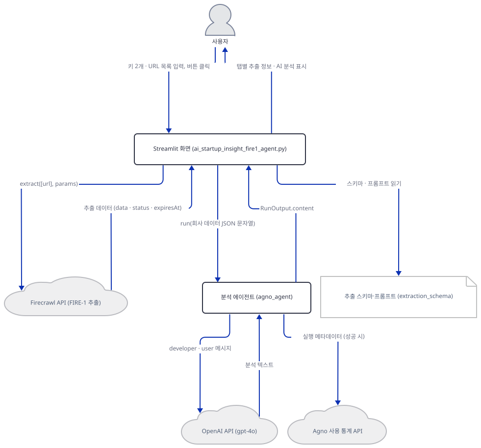

## 사전 준비

| 서비스/도구 | 용도 | 발급·설치 |
|---|---|---|
| uv | 가상환경 생성과 패키지 설치 | [공통 사전 준비](../README.md#공통-사전-준비-한-번만) 절 참고 |
| Python | 이 문서는 3.13.3으로 확인했다. 저장소 기준은 3.11~3.13 | 공통 사전 준비와 같음 |
| OpenAI API 키 | `gpt-4o` 분석 호출 인증. 사이드바의 비밀번호 칸에 붙여넣는다(환경변수가 아님, `advanced_ai_agents/single_agent_apps/ai_startup_insight_fire1_agent/ai_startup_insight_fire1_agent.py:21`). 이 문서는 키 없이 가짜 서버로 확인한다 | https://platform.openai.com/api-keys |
| Firecrawl API 키 | FIRE-1 추출 요청 인증. 사이드바 칸에 붙여넣는다(`advanced_ai_agents/single_agent_apps/ai_startup_insight_fire1_agent/ai_startup_insight_fire1_agent.py:20`). 칸이 비어 있어도 환경변수 `FIRECRAWL_API_KEY`가 있으면 클라이언트 생성이 통과한다(Step 4). 이 문서는 키 없이 진행하고 추출 호출은 하지 않는다 | https://firecrawl.dev (앱 README의 안내) |
| 인터넷 연결 | PyPI 설치. 앱을 실제로 쓸 때는 Firecrawl API, OpenAI API, agno 사용 통계 서버(`os-api.agno.com`)에 접속하고, 브라우저로 열면 Streamlit의 사용 통계도 나간다(Day 054와 Day 063이 다뤘고 `--browser.gatherUsageStats false`로 끈다) | 별도 설치 없음 |

## 아키텍처 한눈에 보기

| 컴포넌트 | 역할 | 코드 위치 |
|---|---|---|
| 사용자 | 사이드바에 키 둘, 본문에 URL 목록을 적고 버튼을 누른다 | 코드 없음 (브라우저) |
| Streamlit 화면 | 제목, 안내 상자 넷, 키 입력 둘, URL 입력창, 버튼. URL마다 탭을 만들어 결과를 그린다 | `advanced_ai_agents/single_agent_apps/ai_startup_insight_fire1_agent/ai_startup_insight_fire1_agent.py:9-55`, `advanced_ai_agents/single_agent_apps/ai_startup_insight_fire1_agent/ai_startup_insight_fire1_agent.py:116-139` |
| 추출 스키마와 프롬프트 | FIRE-1에게 요구하는 JSON 스키마(필드 5개, 필수 3개)와 설명 프롬프트 | `advanced_ai_agents/single_agent_apps/ai_startup_insight_fire1_agent/ai_startup_insight_fire1_agent.py:57-86`, `advanced_ai_agents/single_agent_apps/ai_startup_insight_fire1_agent/ai_startup_insight_fire1_agent.py:168-198` |
| Firecrawl 클라이언트 (`FirecrawlApp`) | 클릭마다 한 번 만들고 URL마다 `extract`를 부른다. 오늘 설치되는 4.46.2는 이 호출 모양을 거부한다 | `advanced_ai_agents/single_agent_apps/ai_startup_insight_fire1_agent/ai_startup_insight_fire1_agent.py:1`, `advanced_ai_agents/single_agent_apps/ai_startup_insight_fire1_agent/ai_startup_insight_fire1_agent.py:123`, `advanced_ai_agents/single_agent_apps/ai_startup_insight_fire1_agent/ai_startup_insight_fire1_agent.py:165-202` |
| 분석 에이전트 (`agno_agent`) | `gpt-4o`, 지시문 한 덩어리, `markdown=True`. 클릭마다 한 번 만들고 URL마다 `run`한다 | `advanced_ai_agents/single_agent_apps/ai_startup_insight_fire1_agent/ai_startup_insight_fire1_agent.py:140-154`, `advanced_ai_agents/single_agent_apps/ai_startup_insight_fire1_agent/ai_startup_insight_fire1_agent.py:238` |
| 결과 표시 | 추출 딕셔너리를 키마다 한 줄로 그리고, 원본 응답과 처리 상세를 접힌 영역에 둔다 | `advanced_ai_agents/single_agent_apps/ai_startup_insight_fire1_agent/ai_startup_insight_fire1_agent.py:205-232`, `advanced_ai_agents/single_agent_apps/ai_startup_insight_fire1_agent/ai_startup_insight_fire1_agent.py:244-261` |
| Firecrawl API | FIRE-1이 사이트를 탐색해 스키마대로 추출하는 서비스 | 코드 없음 (외부 서비스) |
| OpenAI API (`gpt-4o`) | 분석 에이전트의 모델. URL마다 요청 한 건 | `advanced_ai_agents/single_agent_apps/ai_startup_insight_fire1_agent/ai_startup_insight_fire1_agent.py:143` |
| Agno 사용 통계 API | 성공한 `run` 뒤에 agno가 익명 메타데이터를 보내려 한다 | 코드 없음 (agno 내부) |

## 단계별 진행

### Step 1. 환경 만들기 — 버전 없는 `firecrawl-py`

**목적.** 앱 폴더에 독립 가상환경을 만들고, 오늘 어떤 버전이 풀리는지와 파일이 컴파일되고 임포트가 통과하는지 확인합니다.

**할 일.** 저장소 루트에서 시작합니다.

```bash
cd advanced_ai_agents/single_agent_apps/ai_startup_insight_fire1_agent
uv venv
uv pip install -r requirements.txt
```

(pip 대안: `python -m venv .venv && source .venv/bin/activate && pip install -r requirements.txt`. Windows PowerShell은 활성화만 `.venv\Scripts\Activate.ps1`로 바꿉니다.) 이후 `uv run`에는 모두 `--no-project`를 붙입니다. 이유는 [공통 사전 준비](../README.md#공통-사전-준비-한-번만)에 있습니다. 앱 README의 1단계는 `git clone` 바로 뒤에 이 `cd`를 적지만(`advanced_ai_agents/single_agent_apps/ai_startup_insight_fire1_agent/README.md:40-41`) clone은 저장소 이름의 새 폴더를 만드므로 그 폴더로 먼저 들어가야 맞습니다(소스로 확인).

`advanced_ai_agents/single_agent_apps/ai_startup_insight_fire1_agent/requirements.txt:1-4`

```text
firecrawl-py
streamlit
agno>=2.2.10
openai
```

4줄이고 마지막 줄에 개행이 없어 `wc -l`은 3으로 셉니다. 버전 조건이 `agno>=2.2.10` 하나뿐이어서 이 문서를 만들 때(2026-10-05)는 Python 3.13.3에서 firecrawl-py 4.46.2, agno 3.1.1, streamlit 1.65.0, openai 3.24.0을 포함해 패키지 78개가 깔렸습니다(직접 확인). 눈여겨볼 것은 첫 줄입니다. `firecrawl-py`는 1.x에서 4.x까지 나와 있고(PyPI 릴리스 목록으로 확인) 그 사이 `extract`의 인자 모양이 바뀌었습니다(Step 5).

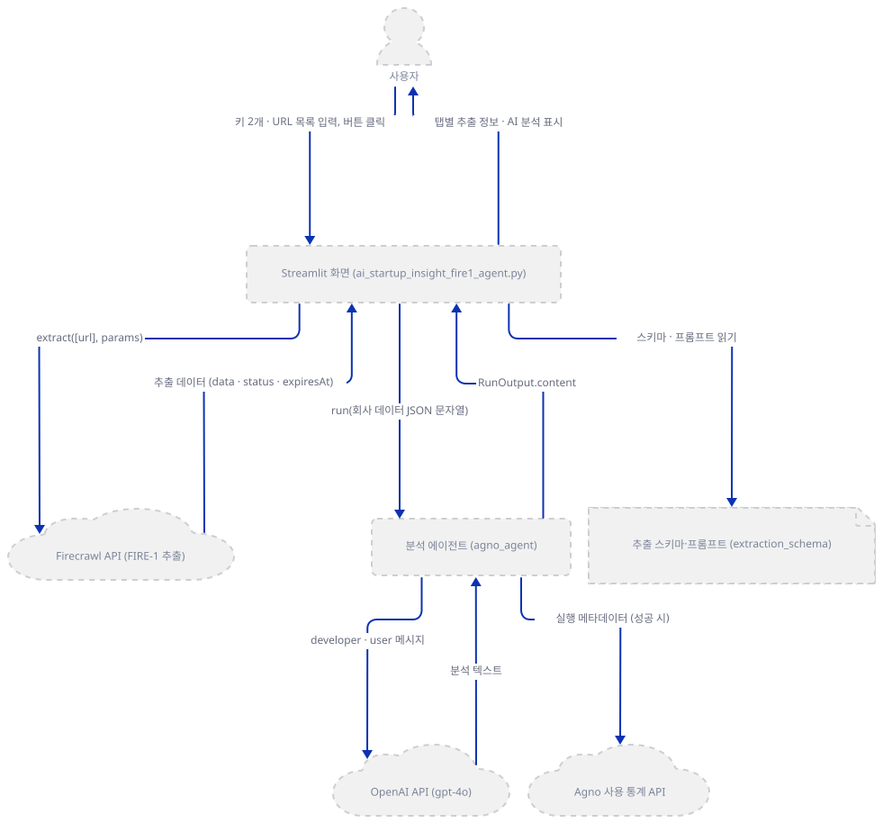

**확인.** 앱 폴더에서 실행합니다.

```bash
uv run --no-project python -c "
import sys
from importlib.metadata import version
print(sys.version.split()[0])
for name in ('firecrawl-py', 'agno', 'streamlit', 'openai'):
    print(name, version(name))
"
```

직접 확인한 출력(버전은 설치하는 날의 최신입니다):

```
3.13.3
firecrawl-py 4.46.2
agno 3.1.1
streamlit 1.65.0
openai 3.24.0
```

```bash
uv run --no-project python -m py_compile ai_startup_insight_fire1_agent.py && echo compiled
uv run --no-project python -c "
from firecrawl import FirecrawlApp
import streamlit as st
import os
import json
from agno.agent import Agent
from agno.run.agent import RunOutput
from agno.models.openai import OpenAIChat
print('all imports OK')
import firecrawl
print(FirecrawlApp is firecrawl.Firecrawl, FirecrawlApp.__module__)
"
```

직접 확인한 출력:

```
compiled
all imports OK
True firecrawl.client
```

두 번째 명령의 앞 일곱 줄은 앱의 1~7행을 그대로 실행한 것입니다. 마지막 줄이 이 앱의 첫 번째 사실입니다. `FirecrawlApp`은 독립된 클래스가 아니라 새 `Firecrawl` 클래스의 다른 이름입니다(소스로 확인, firecrawl-py 4.46.2의 `firecrawl/client.py` 541행. Day 083 Step 3가 같은 별칭을 `deep_research`에서 봤습니다). (이 문서의 여러 줄 `python -c "..."` 명령은 안쪽에 작은따옴표만 써서 PowerShell에서도 같은 형태로 쓸 수 있습니다. 실행해 보지 못했습니다.)

### Step 2. 화면 뼈대 — 키 칸 둘, 안내 상자 넷, URL 입력창

**목적.** 버튼을 누르기 전에 화면에 그려지는 것을 확인합니다.

**할 일.**

`advanced_ai_agents/single_agent_apps/ai_startup_insight_fire1_agent/ai_startup_insight_fire1_agent.py:15-22`

```python
st.title("AI Startup Insight with Firecrawl's FIRE-1 Agent")

# Sidebar for API key
with st.sidebar:
    st.header("API Configuration")
    firecrawl_api_key = st.text_input("Firecrawl API Key", type="password")
    openai_api_key = st.text_input("OpenAI API Key", type="password")
    st.caption("Your API keys are securely stored and not shared.")
```

키는 환경변수가 아니라 사이드바의 비밀번호 칸에 붙여넣습니다. 캡션은 키가 "안전하게 저장된다"고 말하지만 `st.session_state`·파일 쓰기·환경변수 읽기가 소스에 없어(소스로 확인, `grep`) 키는 입력한 그대로 버튼 핸들러의 생성자 둘로 갑니다.

`advanced_ai_agents/single_agent_apps/ai_startup_insight_fire1_agent/ai_startup_insight_fire1_agent.py:52-55`

```python
st.markdown("### 🌐 Enter Website URLs")
st.markdown("Provide one or more company website URLs (one per line) to extract information.")

website_urls = st.text_area("Website URLs (one per line)", placeholder="https://example.com\nhttps://another-company.com")
```

그 사이 36~48행에는 FIRE-1이 버튼과 입력창을 조작하고 페이지네이션도 처리한다고 소개하는 상자 넷(`st.info`·`st.success`·`st.warning`·`st.error`)이 있습니다. 앱이 그 능력을 시험하는 코드는 없는 정적 문장이고, 네 번째 빨간 상자는 오류가 아니라 장식입니다.

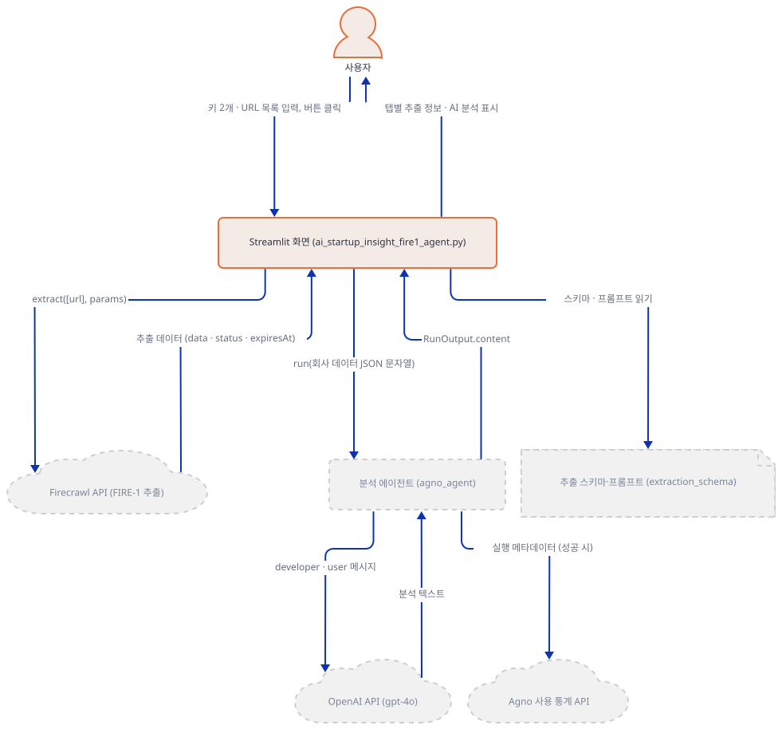

**확인.** 앱을 브라우저로 띄우는 명령은 이렇습니다.

```bash
uv run --no-project streamlit run ai_startup_insight_fire1_agent.py
```

이 문서는 브라우저 대신 `AppTest`(Streamlit이 브라우저 없이 스크립트를 실행하고 위젯을 코드로 조작하게 해 주는 도구)로 같은 스크립트를 실행해 화면을 확인했습니다. 앱 폴더에서 실행합니다.

```bash
uv run --no-project python -c "
from streamlit.proto.TextInput_pb2 import TextInput
from streamlit.testing.v1 import AppTest

at = AppTest.from_file('ai_startup_insight_fire1_agent.py', default_timeout=60)
at.run()
print('title:', at.title[0].value)
print('sidebar inputs:', [(t.label, TextInput.Type.Name(t.proto.type)) for t in at.sidebar.text_input])
print('main:', [(t.label, t.placeholder) for t in at.text_area], [b.label for b in at.button])
print('boxes (info, success, warning, error):', len(at.info), len(at.success), len(at.warning), len(at.error))
print('exception:', list(at.exception))
"
```

직접 확인한 출력(맨 위에 `missing ScriptRunContext!` 경고가 나오지만 `streamlit run` 없이 돌릴 때의 안내라 결과와 무관해 뺐습니다):

```
title: AI Startup Insight with Firecrawl's FIRE-1 Agent
sidebar inputs: [('Firecrawl API Key', 'PASSWORD'), ('OpenAI API Key', 'PASSWORD')]
main: [('Website URLs (one per line)', 'https://example.com\nhttps://another-company.com')] ['🚀 Start Analysis']
boxes (info, success, warning, error): 1 1 1 1
exception: []
```

키 칸 둘은 비밀번호 유형이고 첫 화면부터 상자 넷이 하나씩 있습니다. 장식인 `st.error`가 하나 있으니 뒤의 확인에서는 `at.error`의 첫 항목을 건너뜁니다. 서버만 띄워 응답을 보려면 `--server.address localhost`를 붙입니다. 안 붙이면 Streamlit이 시작하며 외부 IP를 알아내려고 `checkip.amazonaws.com`에 접속합니다(Day 054가 확인한 사실. 포트는 겹치지 않는 아무 높은 번호입니다).

```bash
uv run --no-project streamlit run ai_startup_insight_fire1_agent.py --server.headless true --server.address localhost --server.port 63457 --browser.gatherUsageStats false
```

다른 터미널에서:

```bash
curl -s -o /dev/null -w "%{http_code}\n" http://localhost:63457
```

```
200
```

(PowerShell이면 `curl` 대신 `(Invoke-WebRequest -Uri http://localhost:63457 -UseBasicParsing).StatusCode`. 실행해 보지 못했습니다.) HTTP 200은 직접 확인했고, 서버는 `Ctrl+C`로 멈춥니다.

### Step 3. 추출 스키마와 프롬프트 — FIRE-1에게 무엇을 시키는가

**목적.** URL마다 Firecrawl에 보내는 스키마와 프롬프트를 읽고, 둘이 서로 맞는지 봅니다.

**할 일.**

`advanced_ai_agents/single_agent_apps/ai_startup_insight_fire1_agent/ai_startup_insight_fire1_agent.py:57-86`

```python
# Define a JSON schema directly without Pydantic
extraction_schema = {
    "type": "object",
    "properties": {
        "company_name": {
            "type": "string",
            "description": "The official name of the company or startup"
        },
        "company_description": {
            "type": "string",
            "description": "A description of what the company does and its value proposition"
        },
        "company_mission": {
            "type": "string",
            "description": "The company's mission statement or purpose"
        },
        "product_features": {
            "type": "array",
            "items": {
                "type": "string"
            },
            "description": "Key features or capabilities of the company's products/services"
        },
        "contact_phone": {
            "type": "string",
            "description": "Company's contact phone number if available"
        }
    },
    "required": ["company_name", "company_description", "product_features"]
}
```

Pydantic 모델이 아니라 JSON Schema 딕셔너리를 손으로 적었습니다(57행 주석). 필드는 다섯, 필수는 `company_name`·`company_description`·`product_features` 셋이고 `company_mission`과 `contact_phone`은 선택입니다.

`advanced_ai_agents/single_agent_apps/ai_startup_insight_fire1_agent/ai_startup_insight_fire1_agent.py:168-198`

```python
                                            'prompt': '''
Analyze this company website thoroughly and extract comprehensive information.

1. Company Information:
   - Identify the official company name
     Explain: This is the legal name the company operates under.
   - Extract a detailed yet concise description of what the company does
   - Find the company's mission statement or purpose
     Explain: What problem is the company trying to solve? How do they aim to make a difference?

2. Product/Service Information:
   - Identify 3-5 specific product features or service offerings
     Explain: What are the key things their product or service can do? Describe as if explaining to a non-expert.
   - Focus on concrete capabilities rather than marketing claims
     Explain: What does the product actually do, in simple terms, rather than how it's advertised?
   - Be specific about what the product/service actually does
     Explain: Give examples of how a customer might use this product or service in their daily life.

3. Contact Information:
   - Find direct contact methods (phone numbers)
     Explain: How can a potential customer reach out to speak with someone at the company?
   - Only extract contact information that is explicitly provided
     Explain: We're looking for official contact details, not inferring or guessing.

Important guidelines:
- Be thorough but concise in your descriptions
- Extract factual information, not marketing language
- If information is not available, do not make assumptions
- For each piece of information, provide a brief, simple explanation of what it means and why it's important
- Include a layman's explanation of what the company does, as if explaining to someone with no prior knowledge of the industry or technology involved
''',
```

프롬프트는 회사 정보, 제품·서비스 정보, 연락처 순으로 지시하고 항목마다 `Explain:` 줄(일곱 개)을 달아 비전문가에게 설명하듯 풀어 쓰라고 요구합니다. 그런데 스키마에는 설명을 담을 필드가 없습니다(소스로 확인). 그 요구가 FIRE-1의 결과에 어떻게 반영되는지는 확인하지 못했습니다. 195행의 지침은 없는 정보를 지어내지 말라는 것이고, 같은 문자열이 URL마다 쓰입니다.

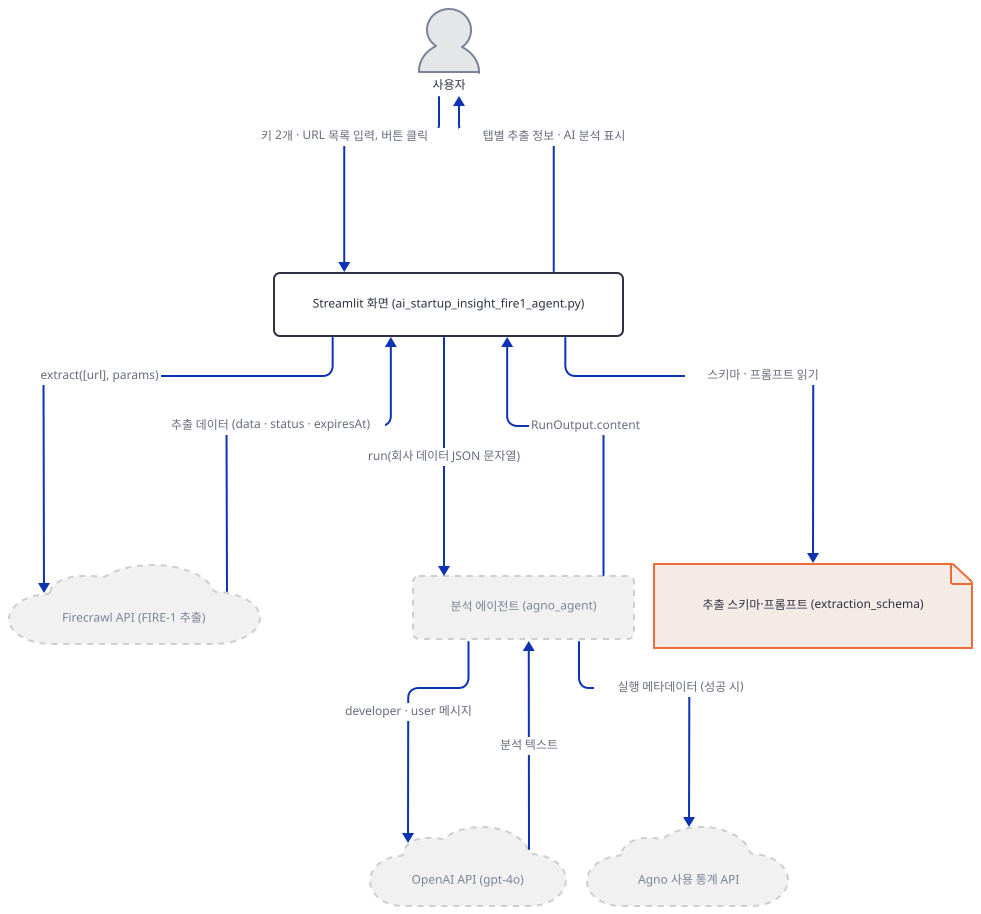

**확인.** 앱을 실행하지 않고 소스에서 스키마 딕셔너리만 읽어 냅니다.

```bash
uv run --no-project python -c "
import ast
tree = ast.parse(open('ai_startup_insight_fire1_agent.py', encoding='utf-8').read())
for node in tree.body:
    if isinstance(node, ast.Assign) and getattr(node.targets[0], 'id', None) == 'extraction_schema':
        schema = ast.literal_eval(node.value)
print(list(schema['properties']))
print(schema['required'])
"
```

직접 확인한 출력:

```
['company_name', 'company_description', 'company_mission', 'product_features', 'contact_phone']
['company_name', 'company_description', 'product_features']
```

### Step 4. 버튼과 사전 검사 — Firecrawl 키가 먼저, OpenAI 키는 그다음

**목적.** 버튼이 무언가를 부르기 전에 거치는 검사의 순서를 확인합니다.

**할 일.**

`advanced_ai_agents/single_agent_apps/ai_startup_insight_fire1_agent/ai_startup_insight_fire1_agent.py:116-139`

```python
if st.button("🚀 Start Analysis", type="primary"):
    if not website_urls.strip():
        st.error("Please enter at least one website URL")
    else:
        try:
            with st.spinner("Extracting information from website..."):
                # Initialize the FirecrawlApp with the API key
                app = FirecrawlApp(api_key=firecrawl_api_key)

                # Parse the input URLs more robustly
                # Split by newline, strip whitespace from each line, and filter out empty lines
                urls = [url.strip() for url in website_urls.split('\n') if url.strip()]

                # Debug: Show the parsed URLs
                st.info(f"Attempting to process these URLs: {urls}")

                if not urls:
                    st.error("No valid URLs found after parsing. Please check your input.")
                elif not openai_api_key:
                    st.warning("Please provide an OpenAI API key in the sidebar to get AI analysis.")
                else:
                    # Create tabs for each URL
                    tabs = st.tabs([f"Website {i+1}: {url}" for i, url in enumerate(urls)])
```

순서는 이렇습니다. URL 칸이 비었는지 보고(117행), `FirecrawlApp(api_key=...)`을 만들고(123행), URL 목록을 만들어 `st.info`에 파이썬 리스트 그대로 보여 준 다음(130행) OpenAI 키를 봅니다(134행). Firecrawl 클라이언트가 먼저여서 4.46.2는 키가 비면 생성자가 `ValueError: No API key provided`를 던지고(직접 확인) 바깥 `try`의 266행이 `Error during extraction: …`으로 그립니다. 환경변수 `FIRECRAWL_API_KEY`가 있으면 칸이 비어 있어도 통과합니다(직접 확인). 생성자는 네트워크에 접속하지 않았습니다(직접 확인: 접속 시도를 막는 가드에 기록 0건). 132~133행의 `if not urls`는 117행이 이미 막아 닿지 않는 가지입니다(읽기로 확인). 이 전체가 클릭이 일으킨 리런 한 번 안에서 돌고, 리런은 Day 012 Step 2가 설명했습니다.

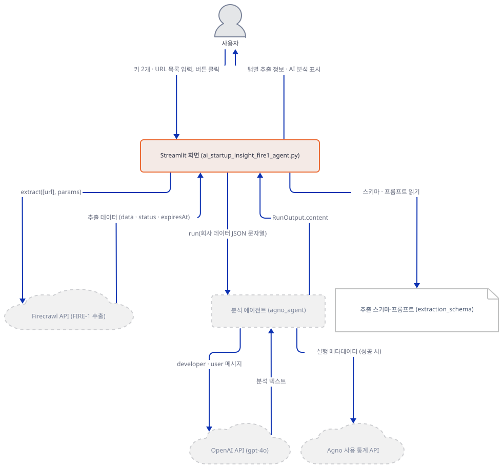

**확인.** 네 가지 입력으로 버튼을 눌러 봅니다. 앱 폴더에서 실행합니다.

```bash
uv run --no-project python -c "
from streamlit.testing.v1 import AppTest

def click(firecrawl_key, openai_key, urls):
    at = AppTest.from_file('ai_startup_insight_fire1_agent.py', default_timeout=60)
    at.run()
    at.sidebar.text_input[0].set_value(firecrawl_key)
    at.sidebar.text_input[1].set_value(openai_key)
    at.text_area[0].set_value(urls)
    at.button[0].click()
    at.run()
    return at

for label, keys, urls in [
    ('no URL', ('', ''), ''),
    ('URL, no keys', ('', ''), 'https://example.com'),
    ('URL, OpenAI key only', ('', 'sk-test'), 'https://example.com'),
    ('URL, Firecrawl key only', ('fc-test', ''), 'https://example.com'),
]:
    at = click(*keys, urls)
    print(label, '->')
    print('   error  :', [e.value for e in at.error][1:])
    print('   warning:', [w.value for w in at.warning][1:])
    print('   info   :', [i.value for i in at.info][1:])
    print('   tabs   :', [t.label for t in at.tabs])
"
```

직접 확인한 출력(`[1:]`은 Step 2의 장식 상자를 건너뛰는 것입니다):

```
no URL ->
   error  : ['Please enter at least one website URL']
   warning: []
   info   : []
   tabs   : []
URL, no keys ->
   error  : ['Error during extraction: No API key provided']
   warning: []
   info   : []
   tabs   : []
URL, OpenAI key only ->
   error  : ['Error during extraction: No API key provided']
   warning: []
   info   : []
   tabs   : []
URL, Firecrawl key only ->
   error  : []
   warning: ['Please provide an OpenAI API key in the sidebar to get AI analysis.']
   info   : ["Attempting to process these URLs: ['https://example.com']"]
   tabs   : []
```

OpenAI 키만 넣은 경우에도 Firecrawl 오류가 나옵니다. Firecrawl 키만 있으면 추출은 시작도 하지 않고 경고만 뜹니다. 네 경우 모두 탭이 만들어지지 않았고 외부 호출은 없습니다.

### Step 5. FIRE-1 추출 호출 — 오늘의 SDK가 받지 않는 인자 모양

**목적.** URL마다 나가는 `extract` 호출의 모양을 확인하고, 오늘의 `firecrawl-py`가 그 모양을 받는지 따져 봅니다. 이 문서는 `extract`를 부르지 않고 `inspect.signature`와 `bind`로만 따집니다.

**할 일.**

`advanced_ai_agents/single_agent_apps/ai_startup_insight_fire1_agent/ai_startup_insight_fire1_agent.py:165-168`

```python
                                    data = app.extract(
                                        [url],  # Pass as a list with a single URL
                                        params={
                                            'prompt': '''
```

`advanced_ai_agents/single_agent_apps/ai_startup_insight_fire1_agent/ai_startup_insight_fire1_agent.py:198-202`

```python
''',
                                            'schema': extraction_schema,
                                            'agent': {"model": "FIRE-1"}
                                        }
                                    )
```

호출은 `app.extract([url], params={...})`입니다. 프롬프트·스키마·`agent`가 `params` 딕셔너리 하나에 들어 있고 FIRE-1은 `'agent': {"model": "FIRE-1"}`로 고르며, 결과는 딕셔너리로 읽습니다(205행의 `data.get('data')`, 256~259행의 `data['status']`·`data['expiresAt']`). 이 모양은 `firecrawl-py` 1.x의 `extract(urls, params)`와 같습니다. 1.17.0의 `extract`는 `params`의 `prompt`·`schema`·`agent`를 요청 본문에 옮기고 상태 응답의 딕셔너리를 그대로 돌려줍니다(소스로 확인, firecrawl-py 1.17.0의 `firecrawl/firecrawl.py` 683~748행).

오늘 풀리는 4.46.2의 `app`은 새 `Firecrawl` 인스턴스이고 그 `extract`는 v2 클라이언트의 메서드를 속성으로 붙인 것입니다(소스로 확인, `firecrawl/client.py` 325행. Day 083 Step 3가 같은 구조를 봤습니다). 이 `extract`는 키워드 전용 인자를 받고 `params`가 없으며, 결과는 딕셔너리가 아니라 `ExtractResponse`(소스로 확인)인데 이 클래스에는 `.get`이 없습니다(직접 확인). 앱이 옛 모양으로 부르면 파이썬은 인자를 맞추는 단계에서 `TypeError`를 던지고 264행이 그 문장을 `Error processing <url>: …`로 탭마다 그립니다. `bind`는 이 인자 맞추기를 함수를 실행하지 않고 따로 해 보는 것이라 요청이 나가지 않습니다.

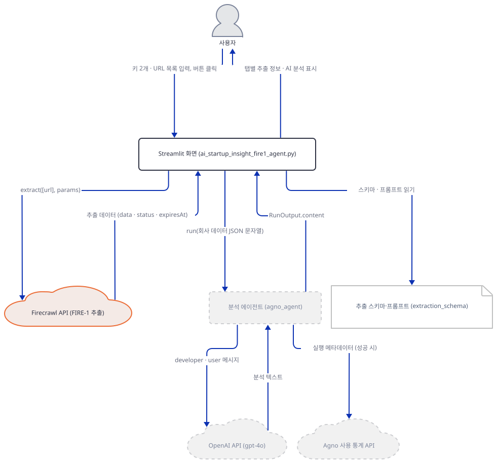

**확인.** 앱 폴더에 `check_call.py`를 편집기로 만듭니다(`AppTest.from_file`은 상대 경로를 스크립트가 있는 폴더 기준으로 풀어서 앱과 같은 폴더여야 합니다). `Firecrawl`의 생성자를 감싸 `extract`를 `bind`만 하는 함수로 바꾸고, 에이전트가 몇 개 만들어지는지도 셉니다.

`check_call.py`

```python
import inspect

from agno.agent import Agent
from firecrawl import Firecrawl
from streamlit.testing.v1 import AppTest

print("signature:", list(inspect.signature(Firecrawl(api_key="fc-test").extract).parameters))

built = []
passed = []
original_agent_init = Agent.__init__
original_firecrawl_init = Firecrawl.__init__


def spy_agent_init(self, *args, **kwargs):
    original_agent_init(self, *args, **kwargs)
    built.append(self)


def guarded_firecrawl_init(self, *args, **kwargs):
    original_firecrawl_init(self, *args, **kwargs)
    real_extract = self.extract

    def guarded_extract(*args, **kwargs):
        passed.append(sorted(kwargs))
        inspect.signature(real_extract).bind(*args, **kwargs)  # 실제 extract는 부르지 않는다
        raise RuntimeError("인자가 시그니처에 맞음 (실제 extract는 부르지 않았음)")

    self.extract = guarded_extract


Agent.__init__ = spy_agent_init
Firecrawl.__init__ = guarded_firecrawl_init

at = AppTest.from_file("ai_startup_insight_fire1_agent.py", default_timeout=60)
at.run()
at.sidebar.text_input[0].set_value("fc-test")
at.sidebar.text_input[1].set_value("sk-test")
at.text_area[0].set_value("https://example.com\nhttps://example.org")
at.button[0].click()
at.run()
print("agents built:", [(a.model.id, a.markdown) for a in built])
print("keyword arguments passed to extract:", passed)
print("tabs:", [t.label for t in at.tabs])
print("errors:", [e.value for e in at.error][1:])
```

```bash
uv run --no-project python check_call.py
```

직접 확인한 출력:

```
signature: ['urls', 'prompt', 'schema', 'system_prompt', 'allow_external_links', 'enable_web_search', 'show_sources', 'scrape_options', 'ignore_invalid_urls', 'poll_interval', 'timeout', 'integration', 'agent', 'threat_protection']
agents built: [('gpt-4o', True)]
keyword arguments passed to extract: [['params'], ['params']]
tabs: ['Website 1: https://example.com', 'Website 2: https://example.org']
errors: ["Error processing https://example.com: got an unexpected keyword argument 'params'", "Error processing https://example.org: got an unexpected keyword argument 'params'"]
```

읽을 것은 셋입니다. 서명에 `params`도 `**kwargs`도 없습니다. 에이전트는 URL이 둘이어도 하나만 만들어지고 모델 호출은 없습니다. 앱이 넘긴 키워드 인자는 URL마다 `params` 하나뿐이고 둘 다 같은 이유로 실패하지만, 한 URL의 실패가 다음 URL을 막지는 않습니다(264행의 `try`가 루프 안에 있음). 오류 문장은 `bind`가 낸 것이고 실제 호출의 문장은 앞에 함수 이름이 붙을 수 있습니다.

어느 버전이 이 모양을 받는지 시험한 것만 표로 적습니다(`inspect.signature`와 `bind`로 직접 확인했고 사이 버전은 시험하지 않았습니다).

| firecrawl-py | `extract`의 모양 | 앱의 `extract([url], params=…)` |
|---|---|---|
| 1.5.0 | `extract` 속성이 없음 | 부를 수 없음 |
| 1.9.0 · 1.12.0 · 1.17.0 | `(urls, params=None)` | `bind` 통과 |
| 2.0.0 · 2.5.0 · 2.6.0 | 키워드 전용(`prompt`·`schema`·…·`agent`) | `TypeError` |
| 2.16.5 | 위와 같고 `**kwargs`가 더 있음 | `bind`는 통과하지만 허용 목록에 없는 `params`를 `ValueError`로 거절하는 코드(소스로 확인, 실행하지 않음) |
| 3.0.2 · 3.4.0 · 4.0.0 | 키워드 전용, `agent` 인자 없음 | `TypeError`, FIRE-1을 고를 인자도 없음 |
| 4.6.0 · 4.46.2 | 키워드 전용, `agent` 있음 | `TypeError` |

앱 폴더의 환경은 그대로 두고, 이 한 번의 실행에만 1.17.0을 얹어 같은 모양을 시험합니다.

```bash
uv run --no-project --with "firecrawl-py==1.17.0" python -c "
import inspect
from importlib.metadata import version
from firecrawl import FirecrawlApp
app = FirecrawlApp(api_key='fc-test')
params = {'prompt': 'p', 'schema': {}, 'agent': {'model': 'FIRE-1'}}
print(version('firecrawl-py'), list(inspect.signature(app.extract).parameters))
inspect.signature(app.extract).bind(['https://example.com'], params=params)
print('bind OK')
"
```

직접 확인한 출력(앞의 `UserWarning` 두 줄은 1.17.0이 `pydantic`과 부딪혀 내는 경고이고, 경로 앞부분은 PC마다 달라 줄였습니다):

```
...\firecrawl\firecrawl.py:78: UserWarning: Field name "json" in "ChangeTrackingData" shadows an attribute in parent "BaseModel"
  class ChangeTrackingData(pydantic.BaseModel):
1.17.0 ['urls', 'params']
bind OK
```

1.x에서는 앱의 호출 모양이 시그니처에 맞습니다. 그러니 앱 환경에 `uv pip install "firecrawl-py==1.17.0"`을 하면 이 단계의 인자 불일치는 없어집니다(시그니처 수준에서만 확인). 다만 서버가 1.x SDK의 요청과 FIRE-1을 지금도 받아 주는지는 키가 없어 확인하지 못했습니다. 4.46.2의 소스는 `extract`를 "유지보수 모드이며 사용을 권하지 않는다"고 표시하고(소스로 확인, `firecrawl/v2/methods/extract.py` 11~14행) Firecrawl 문서는 `/agent`로 옮기라고 안내하지만(WebFetch 요약, 원문 대조는 못 함), SDK의 `app.agent`는 `model`을 `spark-1-pro`·`spark-1-mini`·`spark-2` 중에서 고르고 FIRE-1이 없습니다(직접 확인). 이 앱의 FIRE-1은 SDK에서 `extract`의 `agent` 옵션으로만 닿습니다.

### Step 6. 결과 표시와 분석 에이전트 — 가짜 응답으로 끝까지

**목적.** 추출 결과가 화면에 그려지고 분석 에이전트로 넘어가 `gpt-4o` 요청 한 건이 나가는 과정을 가짜 Firecrawl와 가짜 OpenAI 서버로 끝까지 확인합니다.

**할 일.**

`advanced_ai_agents/single_agent_apps/ai_startup_insight_fire1_agent/ai_startup_insight_fire1_agent.py:205-232`

```python
                                    if data and data.get('data'):
                                        # Display extracted data
                                        st.subheader("📊 Extracted Information")
                                        company_data = data.get('data')

                                        # Display company name prominently
                                        if 'company_name' in company_data:
                                            st.markdown(f"{company_data['company_name']}")


                                        # Display other extracted fields
                                        for key, value in company_data.items():
                                            if key == 'company_name':
                                                continue  # Already displayed above

                                            display_key = key.replace('_', ' ').capitalize()

                                            if value:  # Only display if there's a value
                                                if isinstance(value, list):
                                                    st.markdown(f"**{display_key}:**")
                                                    for item in value:
                                                        st.markdown(f"- {item}")
                                                elif isinstance(value, str):
                                                    st.markdown(f"**{display_key}:** {value}")
                                                elif isinstance(value, bool):
                                                    st.markdown(f"**{display_key}:** {str(value)}")
                                                else:
                                                    st.write(f"**{display_key}:**", value)
```

딕셔너리의 키마다 한 줄을 그립니다. `company_name`은 먼저 따로 찍고, 나머지는 키의 밑줄을 공백으로 바꿔 첫 글자를 대문자로 만들며 값이 비어 있으면 건너뜁니다. 리스트는 불릿, 문자열은 굵은 키와 한 줄입니다.

`advanced_ai_agents/single_agent_apps/ai_startup_insight_fire1_agent/ai_startup_insight_fire1_agent.py:140-154`

```python
                    # Initialize the Agno agent once (outside the loop)
                    if openai_api_key:
                        agno_agent = Agent(
                            model=OpenAIChat(id="gpt-4o", api_key=openai_api_key),
                            instructions="""You are an expert business analyst who provides concise, insightful summaries of companies.
                            You will be given structured data about a company including its name, description, mission, and product features.
                            Your task is to analyze this information and provide a brief, compelling summary that highlights:
                            1. What makes this company unique or innovative
                            2. The core value proposition for customers
                            3. The potential market impact or growth opportunities

                            Keep your response under 150 words, be specific, and focus on actionable insights.
                            """,
                            markdown=True
                        )
```

분석 에이전트는 URL 루프 앞에서 클릭마다 한 번만 만들어집니다(Step 5의 출력에서 URL이 둘이어도 하나였습니다). `instructions`는 리스트가 아니라 여러 줄 문자열 하나이고, 모델은 `gpt-4o`, 키는 사이드바의 값입니다. Day 001이 본 `Agent`·`instructions`·`markdown=True`와 같은 구성입니다.

`advanced_ai_agents/single_agent_apps/ai_startup_insight_fire1_agent/ai_startup_insight_fire1_agent.py:234-242`

```python
                                        # Process with Agno agent
                                        if openai_api_key:
                                            with st.spinner("Generating AI analysis..."):
                                                # Run the agent with the extracted data
                                                agent_response: RunOutput = agno_agent.run(f"Analyze this company data and provide insights: {json.dumps(company_data)}")

                                                # Display the agent's analysis in a highlighted box
                                                st.subheader("🧠 AI Business Analysis")
                                                st.markdown(agent_response.content)
```

추출 데이터는 `json.dumps`로 문자열이 되어 `run`에 한 번에 들어가고, 돌려받은 `RunOutput`의 `.content`를 `st.markdown`으로 그립니다. 성공한 `run`은 agno의 익명 통계도 부릅니다. AgentOS가 없는 이 앱에서는 Day 047 Step 5가 다룬 두 가지 가운데 `POST /telemetry/runs` 하나이고 `AGNO_TELEMETRY=false`로 끕니다(소스로 확인, agno 3.1.1의 `agno/agent/_run.py` 670행). 기본값으로 돌렸을 때는 `os-api.agno.com` 이름 조회 한 번이 접속 가드에 걸렸고 `AGNO_TELEMETRY=false`에서는 0건이었습니다(직접 확인).

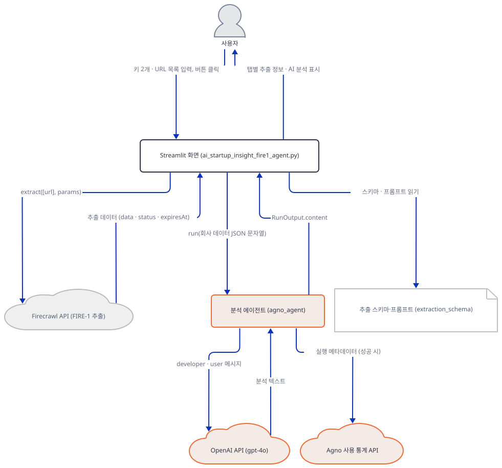

**확인.** OpenAI에 요청을 보내지 않고 모델로 가는 요청을 보려고, `openai` 패키지가 읽는 환경변수 `OPENAI_BASE_URL`을 내 PC의 가짜 서버로 돌리고 `FirecrawlApp`이라는 이름은 가짜 클래스로 바꿉니다(Day 085와 Day 102 Step 5도 쓴 방법입니다). 가짜 `extract`는 앱이 읽는 `data`·`status`·`expiresAt`이 든 딕셔너리, 곧 1.17.0이 돌려주는 모양의 고정값을 돌려줍니다. 값은 모두 지어낸 것입니다. 앱 폴더에 `check_flow.py`를 만듭니다. 서버는 같은 프로세스의 스레드라 터미널은 하나면 되고, 시나리오 이름을 인자로 받아 Step 7에서도 씁니다.

`check_flow.py`

```python
import json
import os
import sys
import threading
from http.server import BaseHTTPRequestHandler, ThreadingHTTPServer

PORT = 63291
os.environ["OPENAI_BASE_URL"] = f"http://127.0.0.1:{PORT}/v1"
os.environ["AGNO_TELEMETRY"] = "false"

import firecrawl
from streamlit.testing.v1 import AppTest

scenario = sys.argv[1] if len(sys.argv) > 1 else "ok"  # ok | bad-key | no-data | raises
received = []
calls = []


class FakeOpenAI(BaseHTTPRequestHandler):
    def log_message(self, *args):
        pass

    def do_POST(self):
        body = json.loads(self.rfile.read(int(self.headers["content-length"])))
        received.append(body)
        if self.headers["authorization"] == "Bearer bad-key":
            status = 401
            reply = {"error": {"message": "fake server: invalid API key", "type": "invalid_request_error", "param": None, "code": "invalid_api_key"}}
        else:
            status = 200
            reply = {
                "id": "chatcmpl-fake", "object": "chat.completion", "created": 0, "model": body["model"],
                "choices": [{"index": 0, "finish_reason": "stop", "message": {"role": "assistant", "content": "FAKE ANALYSIS"}}],
                "usage": {"prompt_tokens": 1, "completion_tokens": 1, "total_tokens": 2},
            }
        data = json.dumps(reply).encode()
        self.send_response(status)
        self.send_header("content-type", "application/json")
        self.send_header("content-length", str(len(data)))
        self.end_headers()
        self.wfile.write(data)


threading.Thread(target=ThreadingHTTPServer(("127.0.0.1", PORT), FakeOpenAI).serve_forever, daemon=True).start()


class FakeFirecrawlApp:
    def __init__(self, api_key=None):
        pass

    def extract(self, urls, params=None):
        calls.append((urls, params))
        if scenario == "raises":
            raise Exception("fake firecrawl failure")
        if scenario == "no-data":
            return {"success": True, "status": "completed", "data": None}
        return {
            "success": True, "status": "completed", "expiresAt": "2099-01-01T00:00:00Z",
            "data": {
                "company_name": "Example Co (fake)",
                "company_description": "A fake company used to test the screen.",
                "product_features": ["feature one", "feature two"],
                "contact_phone": "",
            },
        }


firecrawl.FirecrawlApp = FakeFirecrawlApp

at = AppTest.from_file("ai_startup_insight_fire1_agent.py", default_timeout=60)
at.run()
at.sidebar.text_input[0].set_value("fc-test")
at.sidebar.text_input[1].set_value("bad-key" if scenario == "bad-key" else "sk-test")
at.text_area[0].set_value("https://example.com")
at.button[0].click()
at.run()

tab = at.tabs[0]
urls, params = calls[0]
print("extract call:", urls, sorted(params), params["agent"])
print("tab text:", [m.value for m in tab.markdown][2:])
print("errors in tab:", [e.value for e in tab.error])
print("expanders:", [e.label for e in at.expander])
print("OpenAI requests:", len(received))
if scenario == "ok":
    print("top-level keys:", sorted(received[0]))
    for m in received[0]["messages"]:
        print(f"[{m['role']}]", m["content"])
```

```bash
uv run --no-project python check_flow.py ok
```

직접 확인한 출력(맨 위의 `missing ScriptRunContext!` 경고는 뺐습니다):

```
extract call: ['https://example.com'] ['agent', 'prompt', 'schema'] {'model': 'FIRE-1'}
tab text: ['Example Co (fake)', '**Company description:** A fake company used to test the screen.', '**Product features:**', '- feature one', '- feature two', 'FAKE ANALYSIS', '**FIRE Agent Actions:**', '- 🔍 Scanned website content and structure', '- 🖱️ Interacted with necessary page elements', '- 📊 Extracted and structured data according to schema', '- 🧠 Applied AI reasoning to identify relevant information', '**Status:** completed', '**Data Expires:** 2099-01-01T00:00:00Z']
errors in tab: []
expanders: ['🔍 View Raw API Response', 'ℹ️ Processing Details']
OpenAI requests: 1
top-level keys: ['messages', 'model']
[developer] You are an expert business analyst who provides concise, insightful summaries of companies.
                            You will be given structured data about a company including its name, description, mission, and product features.
                            Your task is to analyze this information and provide a brief, compelling summary that highlights:
                            1. What makes this company unique or innovative
                            2. The core value proposition for customers
                            3. The potential market impact or growth opportunities
                            
                            Keep your response under 150 words, be specific, and focus on actionable insights.
                            

<additional_information>
- Use markdown to format your answers.
</additional_information>
[user] Analyze this company data and provide insights: {"company_name": "Example Co (fake)", "company_description": "A fake company used to test the screen.", "product_features": ["feature one", "feature two"], "contact_phone": ""}
```

읽을 것은 다섯입니다. 가짜 `extract`가 받은 것은 URL 하나가 든 리스트와 `agent`·`prompt`·`schema` 세 키입니다. 탭에는 키마다 한 줄이 그려졌고 빈 `contact_phone`은 건너뛰었습니다. 모델 요청은 한 건이고 최상위 키는 `messages`와 `model`뿐이라 `max_tokens`가 없습니다. "150단어 안쪽"은 지시문의 약속일 뿐 코드가 강제하지 않습니다. 첫 메시지의 역할은 `system`이 아니라 `developer`입니다. agno의 `OpenAIChat`이 시스템 메시지를 그 역할로 바꿔 보내고(소스로 확인, agno 3.1.1의 `agno/models/openai/chat.py` 95행. OpenAI가 `gpt-4o`에서 이 역할을 어떻게 받는지는 확인하지 못했습니다), 내용은 `instructions` 문자열 그대로여서 소스의 들여쓰기 28칸이 요청에 실려 갑니다. 끝에는 `markdown=True`가 붙인 `<additional_information>`이 있습니다(소스로 확인, 같은 버전의 `agno/agent/_messages.py` 220행). 사용자 메시지는 고정 문장 뒤에 JSON을 붙인 한 줄이고, 화면이 건너뛴 빈 `contact_phone`도 모델에는 갑니다. URL이 둘이면 추출과 모델 호출이 URL마다 한 번씩 차례로 나갑니다(직접 확인: 모델 요청 2건).

### Step 7. 처리 상세와 실패 경로 — 화면이 지어내는 것

**목적.** 결과 아래 접힌 영역이 응답에서 무엇을 가져오는지, 그리고 데이터가 없거나 호출이 실패하거나 OpenAI 키가 틀릴 때 화면이 무엇을 그리는지 확인합니다.

**할 일.**

`advanced_ai_agents/single_agent_apps/ai_startup_insight_fire1_agent/ai_startup_insight_fire1_agent.py:244-261`

```python
                                        # Show raw data in expander
                                        with st.expander("🔍 View Raw API Response"):
                                            st.json(data)

                                        # Add processing details
                                        with st.expander("ℹ️ Processing Details"):
                                            st.markdown("**FIRE Agent Actions:**")
                                            st.markdown("- 🔍 Scanned website content and structure")
                                            st.markdown("- 🖱️ Interacted with necessary page elements")
                                            st.markdown("- 📊 Extracted and structured data according to schema")
                                            st.markdown("- 🧠 Applied AI reasoning to identify relevant information")

                                            if 'status' in data:
                                                st.markdown(f"**Status:** {data['status']}")
                                            if 'expiresAt' in data:
                                                st.markdown(f"**Data Expires:** {data['expiresAt']}")
                                    else:
                                        st.error(f"No data was extracted from {url}. The website might be inaccessible, or the content structure may not match the expected format.")
```

원본 응답 영역은 `st.json(data)`입니다. 처리 상세의 "FIRE Agent Actions" 제목과 네 줄(250~254행)은 응답과 무관한 고정 문장이라 추출이 성공하면 언제나 똑같이 나옵니다. 에이전트가 실제로 무엇을 눌렀는지는 앱이 알려 주지 않습니다. 응답에 `status`와 `expiresAt` 키가 있을 때만 그 값을 덧붙입니다. 데이터가 비어 있으면 `else`(260행)가 오류 상자를 그리고, 그 아래 263~264행의 `except`는 URL 하나의 예외를 그 탭에 가둡니다. 바깥 `except`(265~266행)는 Step 4의 생성자 오류를 받습니다.

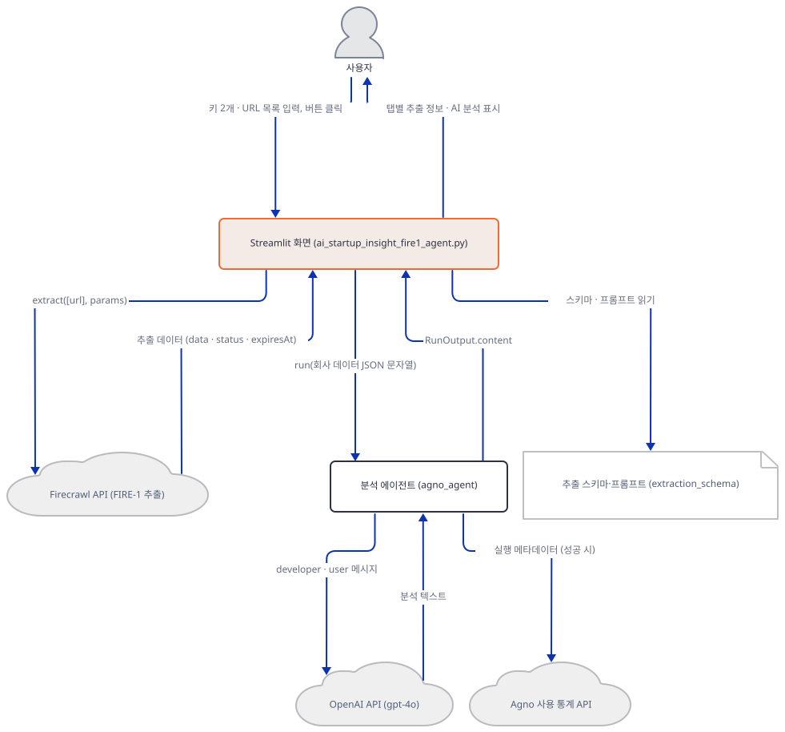

**확인.** Step 6의 `check_flow.py`를 시나리오만 바꿔 세 번 더 돌립니다. 맨 위 `missing ScriptRunContext!` 경고는 뺐습니다.

```bash
uv run --no-project python check_flow.py bad-key
```

```
ERROR   API status error from OpenAI API: Error code: 401 - {'error': {'message': 'fake server: invalid API key', 'type': 'invalid_request_error', 'param': None, 'code': 'invalid_api_key'}}
ERROR   Non-retryable model provider error: fake server: invalid API key
ERROR   Error in Agent run: fake server: invalid API key
extract call: ['https://example.com'] ['agent', 'prompt', 'schema'] {'model': 'FIRE-1'}
tab text: ['Example Co (fake)', '**Company description:** A fake company used to test the screen.', '**Product features:**', '- feature one', '- feature two', 'fake server: invalid API key', '**FIRE Agent Actions:**', '- 🔍 Scanned website content and structure', '- 🖱️ Interacted with necessary page elements', '- 📊 Extracted and structured data according to schema', '- 🧠 Applied AI reasoning to identify relevant information', '**Status:** completed', '**Data Expires:** 2099-01-01T00:00:00Z']
errors in tab: []
expanders: ['🔍 View Raw API Response', 'ℹ️ Processing Details']
OpenAI requests: 1
```

```bash
uv run --no-project python check_flow.py no-data
```

```
extract call: ['https://example.com'] ['agent', 'prompt', 'schema'] {'model': 'FIRE-1'}
tab text: []
errors in tab: ['No data was extracted from https://example.com. The website might be inaccessible, or the content structure may not match the expected format.']
expanders: []
OpenAI requests: 0
```

```bash
uv run --no-project python check_flow.py raises
```

```
extract call: ['https://example.com'] ['agent', 'prompt', 'schema'] {'model': 'FIRE-1'}
tab text: []
errors in tab: ['Error processing https://example.com: fake firecrawl failure']
expanders: []
OpenAI requests: 0
```

틀린 OpenAI 키에서는 가짜 서버가 401을 돌려주는데 화면에는 `st.error`가 아니라 분석 자리에 `fake server: invalid API key`가 일반 글자로 나옵니다. agno의 `Agent.run`은 모델 오류를 예외로 던지지 않고 `status`가 `error`인 `RunOutput`에 오류 문장을 담아 돌려주고(소스로 확인, agno 3.1.1의 `agno/agent/_run.py` 736~743행) 앱은 `status`를 보지 않기 때문입니다. 터미널의 `ERROR` 세 줄은 agno의 로그입니다. `no-data`는 응답의 `data`가 `None`일 때, `raises`는 `extract`가 예외를 던질 때이고, 둘 다 그 탭에 오류 상자만 그려지며 OpenAI 요청은 0건입니다. 확인이 끝나면 임시 파일 `check_call.py`와 `check_flow.py`를 지웁니다.

## 요청 한 건이 흐르는 과정

버튼 클릭 한 번에 URL 하나를 처리하는 흐름을 그림 셋으로 나눠 그렸습니다. 한 그림에 넣으면 이웃하지 않은 배우 사이를 오가는 메시지의 라벨이 다른 배우의 수명선 위에 놓이기 때문에 앱의 실제 시간 경계에서 나눴고, 메시지는 하나도 지우지 않았습니다. 이 흐름은 소스가 그리는 것입니다. Step 5에서 본 대로 오늘 설치되는 4.46.2에서는 첫 그림의 `extract`가 SDK 안에서 `TypeError`로 끝나 Firecrawl에는 아무것도 가지 않고, 그 뒤는 가짜 Firecrawl와 가짜 OpenAI로 확인한 것입니다.

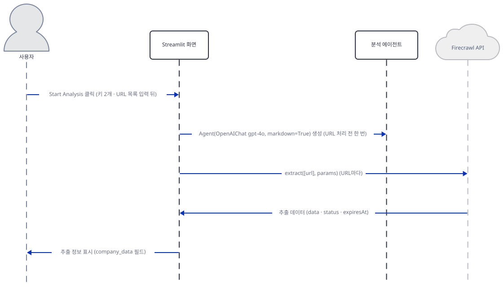

화면은 분석 에이전트를 먼저 만들고(URL 처리 전 한 번) URL마다 `extract`를 불러, 받은 `data`·`status`·`expiresAt`에서 추출 정보를 탭에 그립니다.

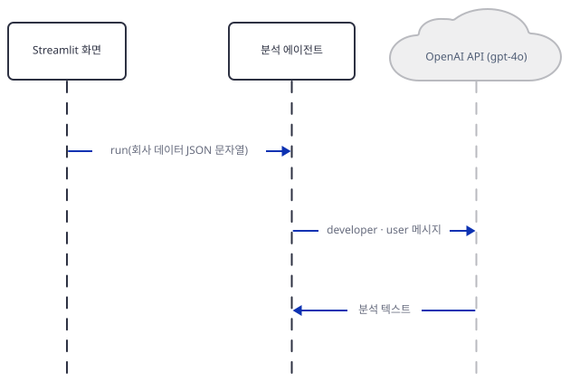

추출 데이터는 JSON 문자열이 되어 `run`으로 에이전트에 넘어가고, 에이전트는 `developer`와 `user` 메시지를 `gpt-4o`에 보내 분석 텍스트를 받습니다(가짜 서버로 직접 확인).

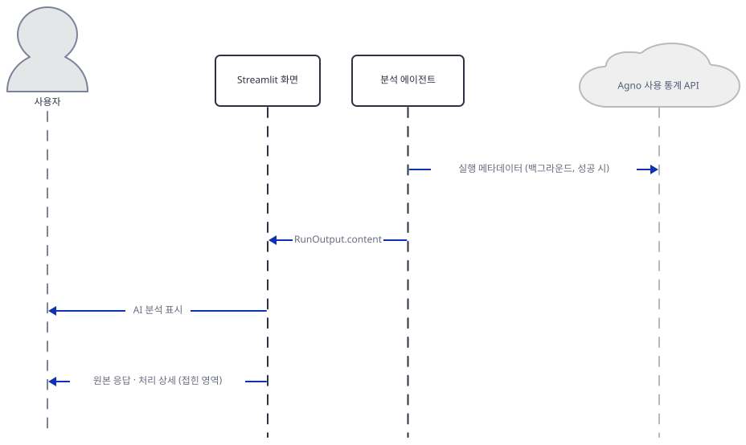

성공한 `run`은 agno가 익명 메타데이터를 백그라운드로 보내게 하고 `RunOutput.content`를 돌려줍니다. 화면은 이를 분석으로 그리고 접힌 영역에 원본 응답과 처리 상세를 둡니다. 모델과 Firecrawl의 실제 응답은 보지 못했습니다.

## 실행 체크리스트

- [ ] `uv venv`와 `uv pip install -r requirements.txt`로 앱 폴더에 환경을 만들고 `firecrawl-py`가 버전 없이 풀리는 것(오늘은 4.46.2)을 확인했다
- [ ] `compiled`와 `all imports OK`를 보고 `FirecrawlApp`이 `Firecrawl`의 별칭인 것을 확인했다
- [ ] 키 칸 둘이 비밀번호 칸이고 첫 화면에 안내 상자 넷이 있는 것을 `AppTest`로 봤다
- [ ] 스키마가 필드 다섯에 필수 셋인 것을 소스에서 읽어 냈다
- [ ] 버튼의 검사 순서(URL, Firecrawl 클라이언트, OpenAI 키)를 네 가지 입력으로 확인했다
- [ ] 오늘의 `extract`가 앱의 `params=` 호출을 `TypeError`로 거부하는 것을 `bind`로 확인했다
- [ ] `firecrawl-py==1.17.0`이 앱의 호출 모양을 시그니처 수준에서 받는 것을 확인했다
- [ ] 가짜 응답에서 결과가 탭에 그려지고 `gpt-4o` 요청이 한 건 나가는 것을 확인했다
- [ ] 처리 상세의 네 줄이 응답과 무관한 고정 문장임을 확인했다
- [ ] 데이터 없음, `extract` 예외, 틀린 OpenAI 키가 화면에 어떻게 보이는지 확인했다

## 문제 해결

| 증상 | 원인 | 해결 |
|---|---|---|
| 두 키를 넣고 눌렀더니 탭마다 `Error processing <url>: … unexpected keyword argument 'params'` 꼴의 빨간 상자가 뜸(직접 확인: `bind`로 같은 규칙을 적용해 본 결과) | 오늘 풀리는 firecrawl-py 4.46.2의 `extract`는 `params=`를 받지 않는다. 앱의 165~202행은 1.x의 `extract(urls, params)` 모양이다(Step 5) | 앱 환경에서 `uv pip install "firecrawl-py==1.17.0"`(시그니처는 맞음, 서버가 1.x 요청과 FIRE-1을 받는지는 확인하지 못함). 호출을 키워드 인자로 바꾸는 법은 더 해보기 |
| 키 칸을 비우고 눌렀더니 `Error during extraction: No API key provided` | 123행의 `FirecrawlApp(api_key=...)`가 비어 있는 키를 거부한다. OpenAI 키 검사(134행)보다 먼저라 OpenAI 키만 넣어도 이 오류가 난다(직접 확인) | Firecrawl 키 칸을 채운다. 환경변수 `FIRECRAWL_API_KEY`가 있으면 칸이 비어 있어도 통과한다(직접 확인) |
| Firecrawl 키만 넣었더니 `Attempting to process these URLs: [...]` 정보 상자와 OpenAI 키를 달라는 경고만 뜨고 아무 일도 안 일어남 | 134행이 OpenAI 키가 없으면 탭도 에이전트도 만들지 않고 경고만 그린다. 추출은 시작도 하지 않는다(직접 확인) | OpenAI 키 칸도 채운다 |
| 첫 화면부터 맨 위에 빨간 오류 상자가 있음 | 48행이 안내 문장을 `st.error`로 그린 장식이다(직접 확인: 첫 화면에서 `at.error`가 1개) | 무시한다. `AppTest`로 오류를 셀 때는 첫 항목을 건너뛴다 |
| 탭에 `No data was extracted from <url>. The website might be inaccessible…` | 205행의 `data.get('data')`가 비어 있을 때의 문장이다(직접 확인: 가짜 응답의 `data`가 `None`일 때). 실제 원인이 접근 불가인지 스키마 불일치인지는 이 문장으로 가릴 수 없다 | Firecrawl 쪽 응답을 확인한다. 이 앱은 응답의 `error`를 읽지 않는다(소스로 확인) |
| AI 분석 자리에 `Connection error.`나 키 오류 문장이 일반 글자로 나옴 | `Agent.run`이 모델 오류를 예외로 던지지 않고 `RunOutput.content`에 문장을 담아 돌려주며 앱은 그것을 `st.markdown`으로 그린다(238~242행. 직접 확인: 가짜 서버가 401을 돌려줬을 때와, 서버가 없어 연결이 거부됐을 때의 `Connection error.`) | OpenAI 키와 네트워크를 확인한다 |
| `FileNotFoundError: AppTest script not found at ...` | `AppTest.from_file`의 상대 경로는 호출한 스크립트가 있는 폴더 기준으로 풀린다(Streamlit 1.65.0. 직접 확인: 앱 폴더 밖에 둔 스크립트에서 이 오류) | 확인 스크립트를 앱 파일과 같은 폴더에 만든다 |
| `uv run --with "firecrawl-py==1.17.0"` 출력에 `UserWarning: Field name "json" in "ChangeTrackingData" shadows an attribute…` | 1.17.0이 `pydantic`과 부딪혀 내는 경고다(직접 확인: 이 경고가 있어도 `bind OK`까지 간다) | 무시한다 |

## 더 해보기

- 복사본에서 `advanced_ai_agents/single_agent_apps/ai_startup_insight_fire1_agent/ai_startup_insight_fire1_agent.py:165-202`의 호출을 오늘의 모양으로 바꿔 보세요. `params={` 줄과 닫는 `}`를 지우고 `prompt=`·`schema=`·`agent=`를 키워드 인자로 쓰고, 결과는 `data.data`·`data.status`·`data.expires_at`으로 읽습니다(`advanced_ai_agents/single_agent_apps/ai_startup_insight_fire1_agent/ai_startup_insight_fire1_agent.py:205-208`과 `advanced_ai_agents/single_agent_apps/ai_startup_insight_fire1_agent/ai_startup_insight_fire1_agent.py:256-259`도 같이 고칩니다). `Firecrawl`의 `extract`를 `bind`만 하고 `ExtractResponse`를 돌려주는 가짜로 바꿔 돌리면 화면이 추출 정보와 분석을 같은 모양으로 그립니다(복사본에서 직접 확인). 서버에서 FIRE-1이 통하는지는 확인하지 못했습니다.
- Firecrawl 문서가 권하는 `/agent`로 옮겨 보세요. `app.agent`의 `model`에는 FIRE-1이 없으니 모델 이름과 응답 모양은 문서에서 확인해야 합니다. 시그니처만 확인했고 호출은 하지 못했습니다.
- 지시문의 들여쓰기를 없애 보세요. 복사본에 `import inspect`를 더하고 `advanced_ai_agents/single_agent_apps/ai_startup_insight_fire1_agent/ai_startup_insight_fire1_agent.py:144-152`의 문자열을 `inspect.cleandoc("""...""")`로 감싸면 `check_flow.py ok`의 `[developer]` 메시지에서 28칸 들여쓰기가 사라집니다(복사본에서 직접 확인).

## 다음 날 예고

[Day 105 · 🌍 AQI Analysis Agent](../day105-ai-aqi-analysis-agent/README.md) — Firecrawl로 `www.aqi.in` 대시보드 주소를 `extract(params=…)`로 긁고 `gpt-4o` 에이전트가 건강 권고를 쓰는 공기질 분석 앱을 다룹니다. 오늘 앱과 같은 호출 모양이지만 `requirements.txt`가 `firecrawl-py==1.9.0`으로 고정돼 있고, 같은 앱에 Streamlit판과 Gradio판 UI가 둘 있습니다(원본 앱 소스 기준).
